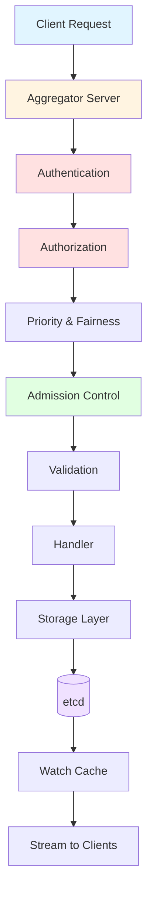

# Kubernetes API Server Architecture Documentation

> **Comprehensive architectural documentation for kube-apiserver**
> *Generated through deep code analysis of Kubernetes source code*

---

## 📚 Table of Contents

- [Overview](#overview)
- [Quick Navigation](#quick-navigation)
- [Documentation Structure](#documentation-structure)
- [How to Use This Documentation](#how-to-use-this-documentation)
- [Key Concepts](#key-concepts)
- [Additional Resources](#additional-resources)

---

## Overview

This documentation provides a comprehensive, multi-level architectural analysis of the **Kubernetes API Server** (kube-apiserver), the central component of the Kubernetes control plane. The kube-apiserver serves as:

- **API Gateway**: The front door for all Kubernetes API requests
- **Authentication & Authorization Hub**: Verifies identity and permissions
- **Validation Engine**: Ensures resource integrity through admission control
- **Persistent Storage Interface**: Connects to etcd for state persistence
- **Watch Streaming Provider**: Enables real-time cluster state monitoring
- **Extension Point**: Supports custom resources and aggregated APIs

### What's Covered

This documentation covers the complete kube-apiserver architecture across multiple dimensions:

✅ Server initialization and bootstrapping
✅ Request handling pipeline (24-layer filter chain)
✅ Storage layer architecture (etcd integration, caching)
✅ API group registration and REST storage patterns
✅ Authentication strategies (tokens, certificates, OIDC, webhooks)
✅ Authorization modes (RBAC, Node, Webhook, ABAC)
✅ Admission control (built-in plugins + webhooks)
✅ Watch mechanism and streaming architecture
✅ API Priority and Fairness (APF)
✅ OpenAPI schema generation and API discovery
✅ Type system (internal vs external types, conversion)
✅ Data structures and concurrency patterns

---

## Quick Navigation

### 🎯 Start Here

- **New to kube-apiserver?** → Start with [System Overview](high-level/01-system-overview.md)
- **Understanding the request flow?** → See [Request Pipeline](middle-level/01-request-pipeline.md)
- **Looking for diagrams?** → Browse [Diagrams](diagrams/)
- **Need code references?** → Check [Code References](code-references/)

### 📖 By Audience

**Architects & Tech Leads**
- [Requirements Specification](01-REQUIREMENTS.md)
- [Functional Specification](02-FUNCTIONAL-SPEC.md)
- [High-Level Architecture](high-level/)

**Engineers & Developers**
- [Middle-Level Architecture](middle-level/)
- [Low-Level Technical Specs](low-level/)
- [Code References](code-references/)

**Visual Learners**
- [All Diagrams](diagrams/)
- [Server Chain Delegation](diagrams/01-server-chain-delegation.md)
- [Request Flow Sequence](diagrams/03-request-flow-sequence.md)

---

## Documentation Structure

```
docs/architecture/claude/apiserver/
│
├── 00-README.md                    ← You are here
├── 01-REQUIREMENTS.md              ← System requirements
├── 02-FUNCTIONAL-SPEC.md           ← Functional specification
├── GLOSSARY.md                     ← Terms and definitions
├── PROGRESS.md                     ← Documentation progress tracker
│
├── high-level/                     ← Strategic Architecture
│   ├── 01-system-overview.md
│   ├── 02-server-chain-architecture.md
│   ├── 03-initialization-flow.md
│   └── 04-key-components.md
│
├── middle-level/                   ← Component Architecture
│   ├── 01-request-pipeline.md
│   ├── 02-storage-layer.md
│   ├── 03-api-groups-registration.md
│   ├── 04-authentication.md
│   ├── 05-authorization.md
│   ├── 06-admission-control.md
│   ├── 07-watch-mechanism.md
│   ├── 08-api-priority-fairness.md
│   ├── 09-audit-logging.md
│   ├── 10-openapi-discovery.md
│   └── 11-aggregation-layer.md
│
├── low-level/                      ← Technical Specifications
│   ├── 01-handler-chain-construction.md
│   ├── 02-registry-pattern.md
│   ├── 03-storage-interface.md
│   ├── 04-cacher-architecture.md
│   ├── 05-type-system.md
│   ├── 06-conversion-framework.md
│   ├── 07-validation-framework.md
│   ├── 08-rest-storage-impl.md
│   ├── 09-subresources.md
│   ├── 10-resource-versioning.md
│   ├── 11-data-structures.md
│   └── 12-concurrency-synchronization.md
│
├── diagrams/                       ← Visual Documentation
│   ├── 01-server-chain-delegation.md
│   ├── 02-initialization-sequence.md
│   ├── 03-request-flow-sequence.md
│   ├── 04-handler-chain-activity.md
│   ├── 05-storage-class-diagram.md
│   ├── 06-watch-cache-sequence.md
│   ├── 07-admission-flow.md
│   ├── 08-authentication-flow.md
│   ├── 09-authorization-flow.md
│   ├── 10-registry-pattern-class.md
│   ├── 11-type-conversion-flow.md
│   └── 12-api-group-installation.md
│
└── code-references/                ← Source Code Index
    ├── entry-points.md
    ├── core-components.md
    ├── storage-implementations.md
    └── patterns-index.md
```

---

## How to Use This Documentation

### By Learning Path

#### 🌟 **Learning Path 1: Understanding the Big Picture**
1. [System Overview](high-level/01-system-overview.md) - What is kube-apiserver?
2. [Server Chain Architecture](high-level/02-server-chain-architecture.md) - Delegation pattern
3. [Initialization Flow](high-level/03-initialization-flow.md) - Startup sequence
4. [Request Pipeline](middle-level/01-request-pipeline.md) - How requests flow

#### 🔧 **Learning Path 2: Deep Dive into Components**
1. [Storage Layer](middle-level/02-storage-layer.md) - etcd integration
2. [Watch Mechanism](middle-level/07-watch-mechanism.md) - Real-time updates
3. [Cacher Architecture](low-level/04-cacher-architecture.md) - Watch cache details
4. [Storage Interface](low-level/03-storage-interface.md) - Storage abstraction

#### 🔐 **Learning Path 3: Security & Access Control**
1. [Authentication](middle-level/04-authentication.md) - Identity verification
2. [Authorization](middle-level/05-authorization.md) - Permission checking
3. [Admission Control](middle-level/06-admission-control.md) - Request validation
4. [Audit Logging](middle-level/09-audit-logging.md) - Activity tracking

#### 🏗️ **Learning Path 4: Extending the API**
1. [API Groups Registration](middle-level/03-api-groups-registration.md)
2. [Registry Pattern](low-level/02-registry-pattern.md)
3. [REST Storage Implementation](low-level/08-rest-storage-impl.md)
4. [Type System](low-level/05-type-system.md)

### By Use Case

**Use Case: Adding a New API Resource**
→ Read: Registry Pattern, Type System, REST Storage, API Groups Registration

**Use Case: Understanding Performance**
→ Read: Watch Mechanism, Cacher Architecture, APF, Handler Chain

**Use Case: Security Audit**
→ Read: Authentication, Authorization, Admission Control, Audit Logging

**Use Case: Troubleshooting**
→ Read: Request Pipeline, Storage Layer, Handler Chain Construction

---

## Key Concepts

### 🏛️ Architectural Patterns

**1. Delegation Pattern** ([Details](high-level/02-server-chain-architecture.md))
- Aggregator Server → Kube API Server → API Extensions Server
- Each server delegates to the next if it can't handle a request

**2. Strategy Pattern** ([Details](low-level/02-registry-pattern.md))
- Resource-specific business logic encapsulated in Strategy objects
- CreateStrategy, UpdateStrategy, DeleteStrategy per resource type

**3. Chain of Responsibility** ([Details](low-level/01-handler-chain-construction.md))
- 24-layer handler chain processes each request
- Each filter can short-circuit or pass to next

**4. Decorator Pattern** ([Details](low-level/04-cacher-architecture.md))
- Cacher wraps storage to add watch functionality
- Filters wrap handlers to add cross-cutting concerns

**5. Factory Pattern** ([Details](middle-level/04-authentication.md))
- Authenticators, Authorizers, Admission plugins created by factories
- Pluggable architecture for extensibility

### 🔑 Core Components

| Component | Purpose | Documentation |
|-----------|---------|---------------|
| **GenericAPIServer** | Base server implementation | [Server Chain](high-level/02-server-chain-architecture.md) |
| **Handler Chain** | Request processing pipeline | [Handler Chain](low-level/01-handler-chain-construction.md) |
| **Storage Layer** | etcd integration | [Storage Layer](middle-level/02-storage-layer.md) |
| **Cacher** | Watch cache for performance | [Cacher](low-level/04-cacher-architecture.md) |
| **Registry** | CRUD operations pattern | [Registry Pattern](low-level/02-registry-pattern.md) |
| **Admission Control** | Request validation | [Admission Control](middle-level/06-admission-control.md) |
| **APF** | Concurrency control | [APF](middle-level/08-api-priority-fairness.md) |

### 📊 Request Flow Overview



---

## Key Statistics

**Codebase Size:**
- `cmd/kube-apiserver/`: 37 files
- `pkg/controlplane/`: 60 files
- `pkg/registry/`: 413 files
- `pkg/apis/`: 25 API groups
- `staging/src/k8s.io/apiserver/`: 1,028 files
- `staging/src/k8s.io/api/`: 500+ files

**Architecture Complexity:**
- **3-layer** server delegation chain
- **24-layer** handler filter pipeline
- **25+** API groups
- **50+** resource types in core API group
- **~100** admission plugins available
- **6** authentication strategies
- **5** authorization modes

---

## Additional Resources

### Official Kubernetes Documentation
- [Kubernetes API Concepts](https://kubernetes.io/docs/reference/using-api/api-concepts/)
- [API Server Documentation](https://kubernetes.io/docs/reference/command-line-tools-reference/kube-apiserver/)
- [Admission Controllers](https://kubernetes.io/docs/reference/access-authn-authz/admission-controllers/)

### Source Code
- [cmd/kube-apiserver](../../../../../cmd/kube-apiserver/)
- [pkg/controlplane](../../../../../pkg/controlplane/)
- [pkg/registry](../../../../../pkg/registry/)
- [staging/src/k8s.io/apiserver](../../../../../staging/src/k8s.io/apiserver/)

### Related Documentation
- [API Extensions (CRDs)](https://kubernetes.io/docs/concepts/extend-kubernetes/api-extension/)
- [Aggregation Layer](https://kubernetes.io/docs/concepts/extend-kubernetes/api-extension/apiserver-aggregation/)
- [RBAC Authorization](https://kubernetes.io/docs/reference/access-authn-authz/rbac/)

---

## Document Conventions

### Code References
Code references use this format: `file/path.go:line_number`

Example: `pkg/controlplane/instance.go:312` refers to line 312 in that file.

### Diagram Notation
All diagrams use [Mermaid](https://mermaid.js.org/) syntax and can be viewed directly in VS Code with markdown preview.

### Cross-References
- **→** indicates "see also" or "for more details"
- **[Link Text](path.md)** links to related documentation

---

## Contributing & Feedback

This documentation was generated through comprehensive source code analysis. If you find:
- Inaccuracies or outdated information
- Missing components or features
- Areas needing clarification

Please refer to the actual source code as the ultimate source of truth. This documentation reflects the state of the codebase at the time of generation.

---

## Version Information

**Kubernetes Version Analyzed**: Based on latest master branch
**Documentation Generated**: 2025-10-21
**Analysis Scope**: Complete kube-apiserver architecture

---

**Ready to dive in?** Start with the [System Overview](high-level/01-system-overview.md) or jump to any section that interests you!
