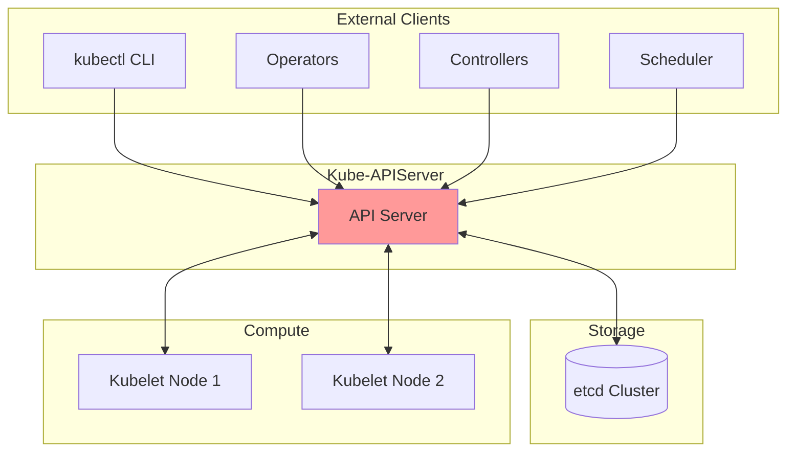

# Kube-APIServer Requirements Specification

> **System Requirements and Design Constraints for the Kubernetes API Server**

---

## Table of Contents

- [Introduction](#introduction)
- [System Context](#system-context)
- [Stakeholders](#stakeholders)
- [Functional Requirements](#functional-requirements)
- [Non-Functional Requirements](#non-functional-requirements)
- [System Constraints](#system-constraints)
- [Quality Attributes](#quality-attributes)

---

## Introduction

### Purpose

The Kubernetes API Server (kube-apiserver) is the central control plane component that exposes the Kubernetes API. This document defines the requirements for its architecture, behavior, and quality attributes.

### Scope

This requirements specification covers:
- Core functionality of the API server
- Integration points with other components
- Performance and scalability expectations
- Security and reliability requirements
- Extensibility mechanisms

### Definitions

See [GLOSSARY.md](GLOSSARY.md) for term definitions.

---

## System Context

### Role in Kubernetes

The kube-apiserver serves as:
1. **The only component that directly communicates with etcd**
2. **The authentication and authorization gateway** for all cluster operations
3. **The validation layer** ensuring data integrity
4. **The watch notification hub** for cluster state changes
5. **The extension point** for custom resources and APIs

---

## Stakeholders

| Stakeholder | Interest | Requirements |
|-------------|----------|--------------|
| **Cluster Administrators** | System stability, security | High availability, auditability, access control |
| **Application Developers** | API usability, reliability | Consistent API, good error messages, API versioning |
| **Platform Engineers** | Extensibility, integration | Custom resources, admission webhooks, aggregation |
| **Security Teams** | Access control, audit | Authentication, authorization, audit logging |
| **Operations Teams** | Observability, troubleshooting | Metrics, logging, debugging endpoints |
| **Kubernetes Contributors** | Maintainability, testing | Clean architecture, test coverage, documentation |

---

## Functional Requirements

### FR-1: API Gateway

**FR-1.1: HTTP/HTTPS API Exposure**
- SHALL serve RESTful APIs over HTTP/HTTPS
- SHALL support TLS encryption for secure communication
- SHALL listen on configurable host and port

**FR-1.2: API Versioning**
- SHALL support multiple API versions simultaneously (alpha, beta, stable)
- SHALL allow deprecation and removal of API versions
- SHALL convert between API versions transparently

**FR-1.3: Content Negotiation**
- SHALL support JSON serialization (primary)
- SHALL support Protobuf serialization (for performance)
- SHALL support YAML for configuration files
- SHALL negotiate content type based on Accept header

### FR-2: Authentication

**FR-2.1: Multi-Strategy Authentication**
- SHALL support X.509 client certificates
- SHALL support bearer tokens (service account, OIDC)
- SHALL support external authentication (webhooks)
- SHALL support HTTP basic authentication (deprecated)
- SHALL support bootstrap tokens for node join

**FR-2.2: Authentication Chain**
- SHALL try multiple authenticators in sequence
- SHALL return on first successful authentication
- SHALL support anonymous requests (when enabled)
- SHALL extract user, group, and extra information

**FR-2.3: Service Account Tokens**
- SHALL issue signed JWT tokens for service accounts
- SHALL validate service account tokens
- SHALL support token expiration and rotation
- SHALL support projected service account tokens

### FR-3: Authorization

**FR-3.1: Multi-Mode Authorization**
- SHALL support RBAC (Role-Based Access Control)
- SHALL support Node authorization (for kubelets)
- SHALL support Webhook authorization
- SHALL support ABAC (Attribute-Based Access Control)
- SHALL support AlwaysAllow and AlwaysDeny (for testing)

**FR-3.2: Authorization Decision**
- SHALL evaluate all configured authorizers
- SHALL allow request if any authorizer allows
- SHALL deny request if all authorizers deny or abstain
- SHALL provide reason for denial

**FR-3.3: RBAC Model**
- SHALL support Roles and ClusterRoles
- SHALL support RoleBindings and ClusterRoleBindings
- SHALL support namespace-scoped and cluster-scoped permissions
- SHALL support aggregation of ClusterRoles

### FR-4: Admission Control

**FR-4.1: Admission Plugin Chain**
- SHALL execute admission controllers in sequence
- SHALL execute mutating admission before validating admission
- SHALL allow admission controllers to modify objects
- SHALL allow admission controllers to reject requests
- SHALL support re-invocation of admission controllers

**FR-4.2: Built-in Admission Plugins**
- SHALL provide essential admission plugins (NamespaceLifecycle, LimitRanger, ServiceAccount, etc.)
- SHALL allow enabling/disabling admission plugins via configuration
- SHALL support ordered execution of admission plugins

**FR-4.3: Dynamic Admission Control**
- SHALL support MutatingAdmissionWebhooks
- SHALL support ValidatingAdmissionWebhooks
- SHALL support ValidatingAdmissionPolicy (CEL-based)
- SHALL support MutatingAdmissionPolicy (CEL-based)
- SHALL call webhooks over HTTPS
- SHALL support webhook timeout and failure policies

### FR-5: Storage Layer

**FR-5.1: etcd Integration**
- SHALL use etcd as the backing store for all cluster state
- SHALL support etcd v3 API
- SHALL support etcd cluster (HA mode)
- SHALL handle etcd connection failures gracefully

**FR-5.2: Resource Persistence**
- SHALL support CREATE operations (POST)
- SHALL support READ operations (GET, LIST)
- SHALL support UPDATE operations (PUT, PATCH)
- SHALL support DELETE operations (DELETE)
- SHALL support WATCH operations (streaming)

**FR-5.3: Resource Versioning**
- SHALL implement optimistic concurrency control
- SHALL use resourceVersion for conflict detection
- SHALL map resourceVersion to etcd mod_revision
- SHALL support conditional updates (UID, resourceVersion preconditions)

**FR-5.4: Storage Transformation**
- SHALL support encryption at rest
- SHALL support data compression
- SHALL support versioning of stored data
- SHALL support storage migration

### FR-6: Watch Mechanism

**FR-6.1: Watch API**
- SHALL support watching individual resources
- SHALL support watching collections of resources
- SHALL support filtered watches (labels, fields)
- SHALL support watch from specific resourceVersion

**FR-6.2: Watch Cache**
- SHALL cache frequently accessed resources
- SHALL serve watches from cache when possible
- SHALL fall through to etcd when cache misses
- SHALL send bookmark events to keep watches current

**FR-6.3: Watch Reliability**
- SHALL handle client disconnections gracefully
- SHALL support watch resumption from last observed version
- SHALL detect and report watch expiration (410 Gone)

### FR-7: API Groups and Resources

**FR-7.1: Core API Group**
- SHALL serve core resources (pods, services, nodes, etc.) at /api/v1
- SHALL support legacy API endpoints for backward compatibility

**FR-7.2: Named API Groups**
- SHALL serve named API groups at /apis/{group}/{version}
- SHALL support multiple versions per API group
- SHALL provide discovery for available API groups and resources

**FR-7.3: Custom Resources**
- SHALL support CustomResourceDefinitions (CRDs)
- SHALL validate custom resources against OpenAPI v3 schemas
- SHALL support custom resource versioning and conversion

**FR-7.4: API Aggregation**
- SHALL support aggregated API servers via APIService
- SHALL proxy requests to extension API servers
- SHALL support service-based and URL-based routing

### FR-8: API Discovery

**FR-8.1: API Discovery Endpoints**
- SHALL provide /api for core API discovery
- SHALL provide /apis for named API group discovery
- SHALL provide /apis/{group}/{version} for resource discovery
- SHALL provide aggregated discovery at /apis

**FR-8.2: OpenAPI Specification**
- SHALL generate OpenAPI v2 (Swagger) specification
- SHALL generate OpenAPI v3 specification
- SHALL serve OpenAPI spec at /openapi/v2 and /openapi/v3
- SHALL include all registered API groups and resources

### FR-9: Field Selectors and Label Selectors

**FR-9.1: List Filtering**
- SHALL support filtering by labels (labelSelector)
- SHALL support filtering by fields (fieldSelector)
- SHALL support indexed fields for performance
- SHALL support partial object metadata (PartialObjectMetadata)

**FR-9.2: Server-Side Filtering**
- SHALL filter results at the server side
- SHALL apply selectors before returning data to client
- SHALL support selector combinations (AND logic)

### FR-10: Pagination

**FR-10.1: Chunked List Results**
- SHALL support limit parameter for pagination
- SHALL support continue token for pagination
- SHALL maintain consistent list views during pagination

### FR-11: Dry Run

**FR-11.1: Dry Run Support**
- SHALL support dryRun query parameter
- SHALL execute full validation without persistence
- SHALL execute admission control during dry run
- SHALL return what would be persisted

### FR-12: Strategic Merge Patch

**FR-12.1: Patch Operations**
- SHALL support JSON Patch (RFC 6902)
- SHALL support Merge Patch (RFC 7386)
- SHALL support Strategic Merge Patch (Kubernetes-specific)
- SHALL support Apply Patch (Server-Side Apply)

**FR-12.2: Server-Side Apply**
- SHALL track field ownership (field managers)
- SHALL support conflict detection and resolution
- SHALL support force apply to override conflicts

### FR-13: Subresources

**FR-13.1: Standard Subresources**
- SHALL support /status subresource for status updates
- SHALL support /scale subresource for HPA
- SHALL support /binding subresource for pod scheduling

**FR-13.2: Exec Subresources**
- SHALL support /exec for container command execution
- SHALL support /attach for container attach
- SHALL support /logs for container log streaming
- SHALL support /portforward for port forwarding
- SHALL support /proxy for pod/service/node proxying

### FR-14: Priority and Fairness

**FR-14.1: Request Prioritization**
- SHALL classify requests into FlowSchemas
- SHALL assign priority levels to requests
- SHALL enforce concurrency limits per priority level
- SHALL queue requests when limits are exceeded

**FR-14.2: Fair Queuing**
- SHALL use fair queuing algorithms
- SHALL prevent starvation of low-priority requests
- SHALL support work estimation for request cost

### FR-15: Audit Logging

**FR-15.1: Audit Events**
- SHALL log all API requests (configurable levels)
- SHALL support Metadata, Request, RequestResponse audit levels
- SHALL record user, resource, verb, timestamp, outcome
- SHALL support audit policy for filtering events

**FR-15.2: Audit Backends**
- SHALL support log file backend
- SHALL support webhook backend
- SHALL support batching and buffering

### FR-16: Graceful Shutdown

**FR-16.1: Shutdown Sequence**
- SHALL stop accepting new requests on shutdown signal
- SHALL drain in-flight requests with timeout
- SHALL close watch streams gracefully
- SHALL run pre-shutdown hooks

**FR-16.2: Health Checks**
- SHALL provide /healthz endpoint for liveness
- SHALL provide /readyz endpoint for readiness
- SHALL report component health status

---

## Non-Functional Requirements

### NFR-1: Performance

**NFR-1.1: Throughput**
- SHALL handle 1000+ requests per second per instance
- SHALL support 5000+ watch connections per instance
- SHALL respond to GET requests in < 100ms (p99, cached)

**NFR-1.2: Latency**
- SHALL respond to write operations in < 1 second (p99)
- SHALL propagate watch events within 1 second
- SHALL complete admission webhook calls within 30 seconds

**NFR-1.3: Resource Efficiency**
- SHALL use watch cache to reduce etcd load
- SHALL support pagination to handle large lists
- SHALL support protobuf for reduced bandwidth

### NFR-2: Scalability

**NFR-2.1: Horizontal Scaling**
- SHALL support multiple active API server instances
- SHALL support stateless operation (all state in etcd)
- SHALL support load balancing across instances

**NFR-2.2: Cluster Size Support**
- SHALL support clusters with 5,000+ nodes
- SHALL support 150,000+ pods
- SHALL support 300,000+ containers

**NFR-2.3: Watch Scalability**
- SHALL support 10,000+ concurrent watch connections
- SHALL use bookmark events to reduce watch restarts
- SHALL support watch cache to reduce etcd load

### NFR-3: Availability

**NFR-3.1: High Availability**
- SHALL support active-active deployment
- SHALL continue serving requests if etcd is temporarily unavailable (watch cache)
- SHALL support rolling updates without downtime

**NFR-3.2: Fault Tolerance**
- SHALL retry failed etcd operations
- SHALL handle webhook failures gracefully (fail-open or fail-closed)
- SHALL recover from transient network errors

### NFR-4: Security

**NFR-4.1: Transport Security**
- SHALL encrypt all external communication with TLS
- SHALL support mutual TLS (mTLS) for client authentication
- SHALL support certificate rotation

**NFR-4.2: Authentication Security**
- SHALL support strong authentication (certificates, OIDC)
- SHALL support authentication token rotation
- SHALL log authentication failures

**NFR-4.3: Authorization Security**
- SHALL deny by default (explicit allow required)
- SHALL support least-privilege access (RBAC)
- SHALL log authorization decisions

**NFR-4.4: Data Security**
- SHALL support encryption at rest (etcd encryption)
- SHALL support encryption of secrets
- SHALL prevent information leakage in errors

### NFR-5: Reliability

**NFR-5.1: Data Integrity**
- SHALL validate all resources before persistence
- SHALL enforce schema validation
- SHALL detect and prevent concurrent update conflicts

**NFR-5.2: Consistency**
- SHALL provide strong consistency (via etcd)
- SHALL ensure linearizable reads/writes
- SHALL maintain referential integrity (OwnerReferences)

**NFR-5.3: Durability**
- SHALL persist data durably (via etcd)
- SHALL support backup and restore (via etcd)

### NFR-6: Observability

**NFR-6.1: Logging**
- SHALL log errors and warnings
- SHALL support structured logging
- SHALL support configurable log levels

**NFR-6.2: Metrics**
- SHALL expose Prometheus metrics at /metrics
- SHALL provide latency histograms
- SHALL provide request counters by verb, resource, status code

**NFR-6.3: Tracing**
- SHALL support distributed tracing (OpenTelemetry)
- SHALL trace request flow through components

**NFR-6.4: Debugging**
- SHALL provide /debug/pprof endpoints (when enabled)
- SHALL provide /debug/flags endpoint
- SHALL provide runtime information

### NFR-7: Maintainability

**NFR-7.1: Code Quality**
- SHALL follow Go best practices
- SHALL maintain test coverage > 70%
- SHALL use consistent coding standards

**NFR-7.2: Modularity**
- SHALL separate concerns (authentication, authorization, storage)
- SHALL use interfaces for extensibility
- SHALL avoid circular dependencies

**NFR-7.3: Documentation**
- SHALL document all public APIs
- SHALL provide architecture documentation
- SHALL document configuration options

### NFR-8: Extensibility

**NFR-8.1: Plugin Architecture**
- SHALL support pluggable authentication
- SHALL support pluggable authorization
- SHALL support pluggable admission control
- SHALL support pluggable cloud providers (deprecated)

**NFR-8.2: Custom Resources**
- SHALL support CustomResourceDefinitions
- SHALL support API aggregation
- SHALL support admission webhooks

**NFR-8.3: Versioning**
- SHALL support multiple API versions
- SHALL support API deprecation policy
- SHALL support graceful migration between versions

### NFR-9: Compatibility

**NFR-9.1: Backward Compatibility**
- SHALL maintain API compatibility within major version
- SHALL support version skew (n-2 versions)
- SHALL provide migration paths for deprecated features

**NFR-9.2: Forward Compatibility**
- SHALL preserve unknown fields (for newer clients)
- SHALL support storage version migration

---

## System Constraints

### SC-1: Technology Constraints

**SC-1.1: Programming Language**
- MUST use Go programming language
- MUST support Go versions as per Kubernetes support matrix

**SC-1.2: Storage Backend**
- MUST use etcd as the storage backend
- MUST support etcd v3 API

**SC-1.3: Communication Protocols**
- MUST use HTTP/HTTPS for API communication
- MUST use gRPC for internal communication (etcd)
- MUST use WebSockets for streaming (exec, attach, logs)

### SC-2: Deployment Constraints

**SC-2.1: Container Support**
- MUST run as a static binary
- MUST support containerized deployment
- MUST support running as systemd service

**SC-2.2: Resource Requirements**
- MUST run on systems with 2+ CPU cores
- MUST run on systems with 4+ GB RAM (minimum)
- SHOULD run on systems with 8+ GB RAM (recommended)

### SC-3: Configuration Constraints

**SC-3.1: Configuration Methods**
- MUST support command-line flags
- MUST support configuration files
- MUST support environment variables (limited)

**SC-3.2: Default Behavior**
- MUST default to secure settings
- MUST require explicit opt-in for insecure features
- MUST fail fast on invalid configuration

### SC-4: Integration Constraints

**SC-4.1: Kubernetes Components**
- MUST integrate with kube-controller-manager
- MUST integrate with kube-scheduler
- MUST integrate with kubelet
- MUST integrate with kube-proxy

**SC-4.2: Cloud Provider Integration**
- SHOULD support cloud provider integrations
- SHOULD use out-of-tree cloud providers (CCM)

---

## Quality Attributes

### QA-1: Testability

- All components MUST be unit testable
- Integration tests MUST cover critical paths
- E2E tests MUST validate end-to-end scenarios
- Performance tests MUST validate scalability claims

### QA-2: Debuggability

- Errors MUST include actionable information
- Logs MUST correlate with request IDs
- Debug endpoints MUST be available (when enabled)

### QA-3: Upgradability

- Rolling upgrades MUST be supported
- Schema changes MUST be backward compatible
- Storage format changes MUST support migration

### QA-4: Configurability

- All security settings MUST be configurable
- Feature gates MUST control new features
- Performance tuning MUST be configurable

---

## Summary

The Kubernetes API Server is a complex, mission-critical component with stringent requirements across multiple dimensions:

- **Functional**: Comprehensive API gateway with auth, authz, admission, storage, and extensibility
- **Performance**: High throughput, low latency, efficient resource usage
- **Scalability**: Support for large clusters with thousands of nodes
- **Availability**: HA deployment, fault tolerance, graceful degradation
- **Security**: Strong authentication, authorization, encryption, audit
- **Reliability**: Data integrity, consistency, durability
- **Observability**: Logging, metrics, tracing, debugging
- **Maintainability**: Clean architecture, modularity, testability
- **Extensibility**: Plugins, webhooks, custom resources, aggregation

These requirements drive the architectural decisions documented in the rest of this documentation set.

---

**Next**: See [Functional Specification](02-FUNCTIONAL-SPEC.md) for how these requirements are realized in the design.
