# Kube-APIServer Functional Specification

> **Functional Design and Behavior of the Kubernetes API Server**

---

## Table of Contents

- [Executive Summary](#executive-summary)
- [System Overview](#system-overview)
- [Functional Architecture](#functional-architecture)
- [Component Specifications](#component-specifications)
- [Data Flow Specifications](#data-flow-specifications)
- [Interface Specifications](#interface-specifications)
- [Behavior Specifications](#behavior-specifications)

---

## Executive Summary

The Kubernetes API Server (kube-apiserver) implements a **layered, plugin-based architecture** that processes API requests through a **24-layer handler chain**, validates and mutates them through **admission control**, and persists them to **etcd** while providing **real-time watch streams** to clients.

### Key Design Principles

1. **Separation of Concerns**: Authentication, authorization, admission, and storage are separate, composable layers
2. **Plugin Architecture**: Extensible through plugins (auth, authz, admission, storage)
3. **Delegation Pattern**: Three-server chain (Aggregator → Kube → Extensions) for modular API serving
4. **Optimistic Concurrency**: Resource versioning prevents conflicting updates
5. **Watch-Based Architecture**: Efficient real-time notifications via watch cache
6. **Type Safety**: Strong typing with automatic conversion between API versions

---

## System Overview

### Architectural Layers

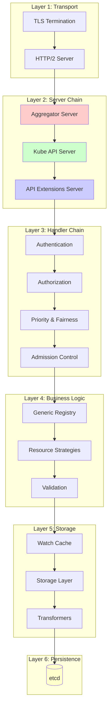

### Core Subsystems

| Subsystem | Responsibility | Implementation |
|-----------|----------------|----------------|
| **Server Chain** | Request routing | Delegation pattern across 3 servers |
| **Handler Chain** | Request processing | 24-layer filter pipeline |
| **Authentication** | Identity verification | Pluggable authenticators (certs, tokens, OIDC) |
| **Authorization** | Permission checking | Pluggable authorizers (RBAC, Node, Webhook) |
| **Admission** | Request validation/mutation | Built-in plugins + webhooks |
| **Registry** | CRUD operations | Generic registry + resource strategies |
| **Storage** | Persistence abstraction | etcd3 + watch cache |
| **Watch** | Real-time notifications | Watch cache + bookmark events |
| **Discovery** | API enumeration | OpenAPI schema generation |
| **Aggregation** | API extension | Proxy to extension API servers |

---

## Functional Architecture

### Server Chain Architecture

The kube-apiserver uses a **delegation pattern** with three layered servers:

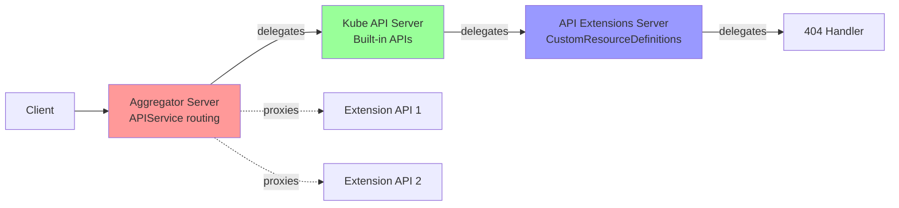

**Delegation Flow:**
1. **Aggregator Server** handles requests first
   - If matches an APIService → proxies to extension API server
   - Otherwise → delegates to Kube API Server

2. **Kube API Server** handles built-in APIs
   - If matches built-in API group → serves from registry
   - Otherwise → delegates to API Extensions Server

3. **API Extensions Server** handles CRDs
   - If matches a CRD → serves custom resource
   - Otherwise → delegates to 404 handler

**Implementation:**
- `cmd/kube-apiserver/app/server.go:176-197` - CreateServerChain()
- Each server wraps the next as `DelegationTarget`

---

## Component Specifications

### 1. Handler Chain Specification

**Purpose**: Process every API request through a series of filters.

**Architecture**: Chain of Responsibility pattern with 24 filters.

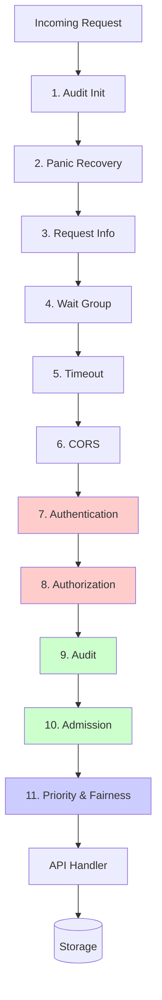

**Filter Responsibilities:**

| Order | Filter | Purpose | Can Short-Circuit |
|-------|--------|---------|-------------------|
| 1 | Audit Init | Initialize audit context | No |
| 2 | Panic Recovery | Catch panics, return 500 | No |
| 3 | Request Info | Extract verb, resource, user | No |
| 4 | Mux Discovery Complete | Ensure routes registered | Yes |
| 5 | Request Timestamp | Track request arrival time | No |
| 6 | HTTP Logging | Log all HTTP requests | No |
| 7 | HSTS Header | Add security headers | No |
| 8 | Wait Group | Track in-flight requests | No |
| 9 | Request Deadline | Apply request timeout | No |
| 10 | Warning Recorder | Record deprecation warnings | No |
| 11 | CORS | Handle CORS preflight | Yes |
| 12 | **Authentication** | Verify identity | **Yes** |
| 13 | Impersonation | Support user impersonation | No |
| 14 | **Authorization** | Check permissions | **Yes** |
| 15 | Audit | Log operation | No |
| 16 | **Priority & Fairness** | Rate limiting | **Yes** |
| 17 | **Admission** | Validate/mutate request | **Yes** |
| ... | ... | ... | ... |

**Implementation:**
- `staging/src/k8s.io/apiserver/pkg/server/config.go:1014-1091` - DefaultBuildHandlerChain()

---

### 2. Authentication Specification

**Purpose**: Verify the identity of the requester.

**Design**: Chain of authenticators, first success wins.

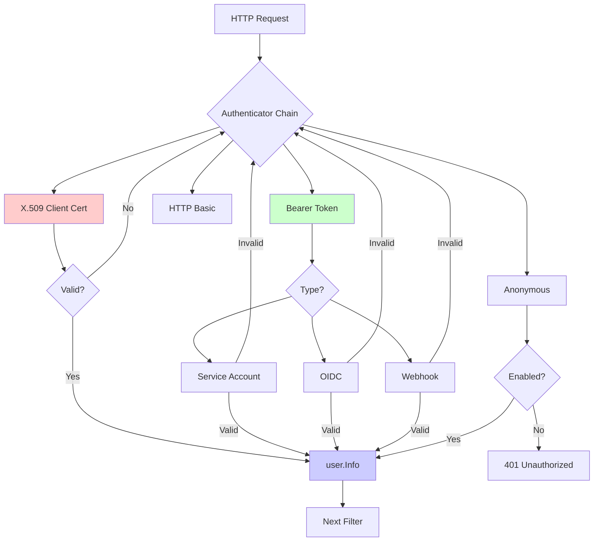

**Authenticator Types:**

| Authenticator | Input | Output | Use Case |
|---------------|-------|--------|----------|
| **X.509 Client Cert** | TLS client certificate | CN=username, O=groups | kubectl, kubelets |
| **Service Account** | Bearer token (JWT) | sa name, namespace | Pods, controllers |
| **OIDC** | Bearer token (OIDC) | email, groups from IdP | Human users via SSO |
| **Webhook** | Bearer token | POST to webhook | Custom auth systems |
| **Bootstrap Token** | Bearer token | For node join | New node registration |
| **Anonymous** | No credentials | system:anonymous | Public endpoints |

**User Information Structure:**
```go
type Info interface {
    GetName() string          // Username
    GetUID() string           // Unique identifier
    GetGroups() []string      // Group memberships
    GetExtra() map[string][]string  // Additional attributes
}
```

**Implementation:**
- `staging/src/k8s.io/apiserver/pkg/authentication/authenticator/interfaces.go`
- `staging/src/k8s.io/apiserver/pkg/endpoints/filters/authentication.go`

---

### 3. Authorization Specification

**Purpose**: Determine if the authenticated user has permission for the requested operation.

**Design**: Chain of authorizers, first allow wins.

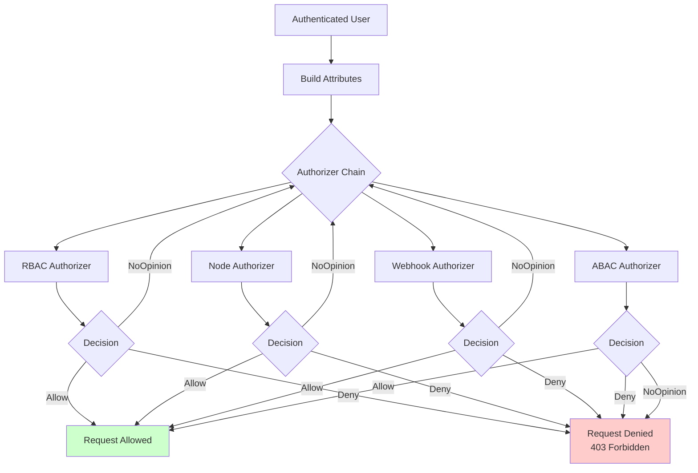

**Authorization Attributes:**
```go
type Attributes interface {
    GetUser() user.Info        // Who
    GetVerb() string           // What operation (get, list, create, etc.)
    GetNamespace() string      // Where (namespace or cluster-scoped)
    GetResource() string       // Which resource type
    GetSubresource() string    // Which subresource (status, scale, etc.)
    GetName() string           // Which specific resource instance
    GetAPIGroup() string       // Which API group
    GetAPIVersion() string     // Which API version
    GetResourceRequest() bool  // Is this a resource request or non-resource?
    GetPath() string           // For non-resource requests (/healthz, /metrics)
}
```

**Authorization Modes:**

| Mode | Logic | Configuration | Use Case |
|------|-------|---------------|----------|
| **RBAC** | Role bindings grant permissions | Roles, RoleBindings, ClusterRoles, ClusterRoleBindings | General purpose, recommended |
| **Node** | Kubelets can only access own resources | Automatic for kubelets | Kubelet security |
| **Webhook** | External authorization service | Webhook endpoint URL | Custom policy engines |
| **ABAC** | Policy file with JSON rules | Static policy file | Legacy, deprecated |

**RBAC Model:**
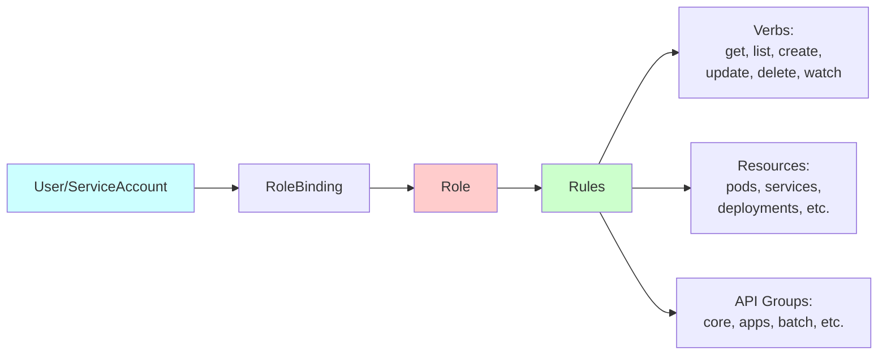

**Implementation:**
- `staging/src/k8s.io/apiserver/pkg/authorization/authorizer/interfaces.go`
- `staging/src/k8s.io/apiserver/pkg/endpoints/filters/authorization.go`
- `pkg/registry/rbac/` - RBAC storage

---

### 4. Admission Control Specification

**Purpose**: Validate and mutate API requests after authentication and authorization.

**Design**: Sequential execution of admission plugins, mutating before validating.

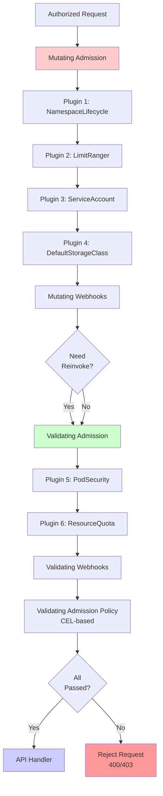

**Admission Plugin Types:**

| Type | Can Modify? | Can Reject? | Example |
|------|-------------|-------------|---------|
| **Mutating** | ✅ Yes | ✅ Yes | DefaultStorageClass sets default SC |
| **Validating** | ❌ No | ✅ Yes | ResourceQuota enforces limits |
| **Both** | ✅ Yes | ✅ Yes | NamespaceLifecycle mutates+validates |

**Key Built-in Admission Plugins:**

| Plugin | Type | Purpose |
|--------|------|---------|
| NamespaceLifecycle | Both | Prevents operations in terminating namespaces |
| LimitRanger | Validating | Enforces LimitRange constraints |
| ServiceAccount | Mutating | Injects service account tokens |
| DefaultStorageClass | Mutating | Sets default storage class for PVCs |
| ResourceQuota | Validating | Enforces resource quotas |
| PodSecurity | Validating | Enforces Pod Security Standards |
| PersistentVolumeLabel | Mutating | Adds labels to PVs (cloud provider) |

**Webhook Admission:**

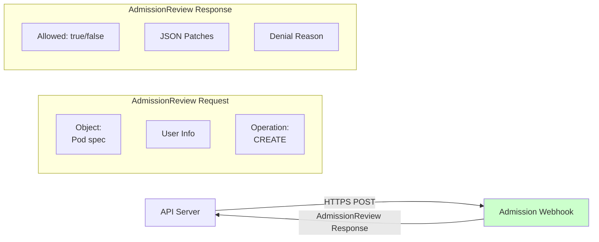

**Webhook Configuration:**
- **MutatingWebhookConfiguration**: Defines mutating webhooks
- **ValidatingWebhookConfiguration**: Defines validating webhooks
- **Failure Policy**: Fail (reject on error) or Ignore (allow on error)
- **Timeout**: Max 30 seconds
- **Reinvocation Policy**: Never, IfNeeded

**Implementation:**
- `staging/src/k8s.io/apiserver/pkg/admission/`
- `pkg/kubeapiserver/admission/` - Kubernetes-specific plugins

---

### 5. Storage Layer Specification

**Purpose**: Persist API resources to etcd with caching for efficiency.

**Architecture**: Layered storage with transformers and caching.

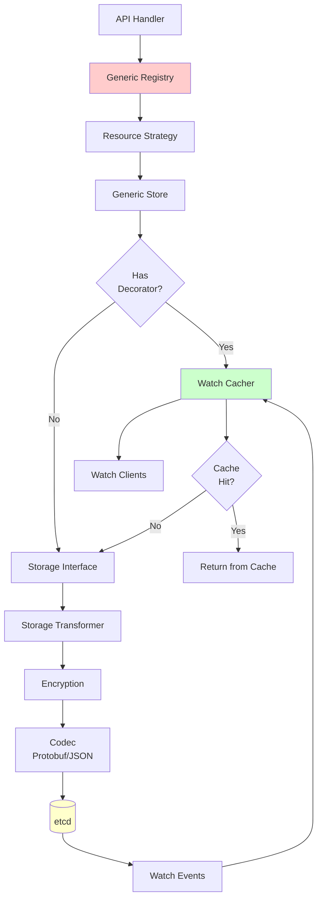

**Storage Layers:**

| Layer | Responsibility | Implementation |
|-------|----------------|----------------|
| **Registry** | CRUD operations | `pkg/registry/generic/registry/store.go` |
| **Strategy** | Resource-specific logic | `pkg/registry/{group}/{resource}/strategy.go` |
| **Store** | Generic storage operations | `genericregistry.Store` |
| **Cacher** | Watch cache | `staging/src/k8s.io/apiserver/pkg/storage/cacher/` |
| **Storage Interface** | etcd abstraction | `staging/src/k8s.io/apiserver/pkg/storage/interfaces.go` |
| **Transformer** | Encryption, compression | `staging/src/k8s.io/apiserver/pkg/storage/value/` |
| **etcd3** | Persistence | `staging/src/k8s.io/apiserver/pkg/storage/etcd3/` |

**Storage Operations:**

```go
type Interface interface {
    // Create inserts a new object
    Create(ctx, key string, obj, out runtime.Object, ttl uint64) error

    // Get retrieves an object
    Get(ctx, key string, opts storage.GetOptions, out runtime.Object) error

    // List retrieves objects matching the criteria
    List(ctx, key string, opts storage.ListOptions, listObj runtime.Object) error

    // GuaranteedUpdate atomically updates an object
    GuaranteedUpdate(ctx, key string, out runtime.Object, ignoreNotFound bool,
        preconditions *Preconditions, updater UpdateFunc) error

    // Delete removes an object
    Delete(ctx, key string, out runtime.Object, preconditions *Preconditions,
        validateDeletion ValidateObjectFunc, out runtime.Object) error

    // Watch streams changes
    Watch(ctx, key string, opts storage.ListOptions) (watch.Interface, error)
}
```

**Resource Versioning:**
- **resourceVersion**: Opaque string representing object version
- **Mapped to**: etcd mod_revision (monotonically increasing)
- **Used for**: Optimistic concurrency control, watch resumption
- **Preconditions**: UID and resourceVersion checked before update

**Implementation:**
- `staging/src/k8s.io/apiserver/pkg/storage/interfaces.go`
- `staging/src/k8s.io/apiserver/pkg/storage/etcd3/store.go`
- `pkg/registry/generic/registry/store.go`

---

### 6. Watch Mechanism Specification

**Purpose**: Provide real-time notifications of resource changes.

**Design**: Watch cache serves most watches, falls through to etcd on miss.

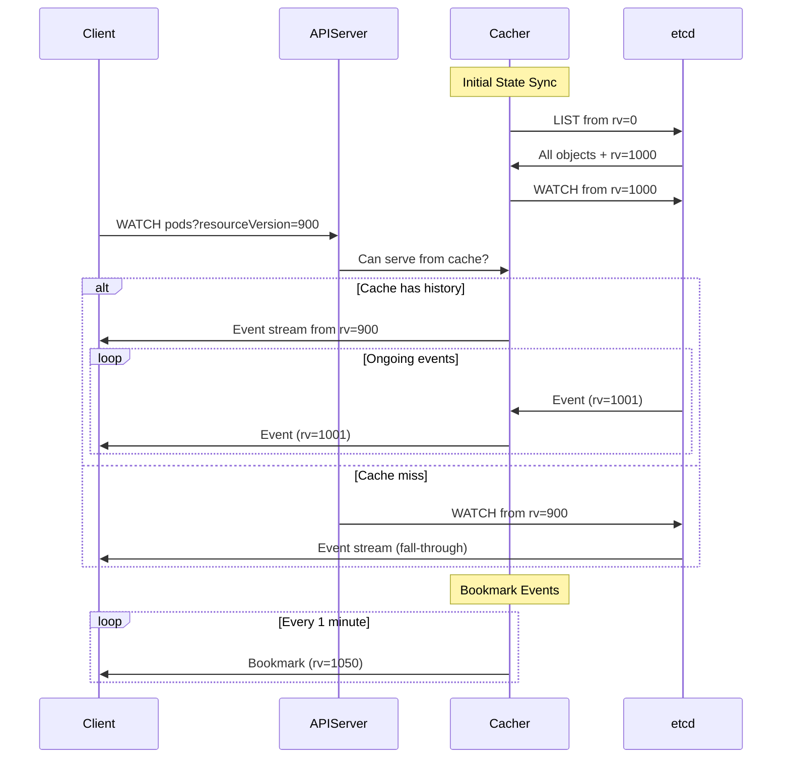

**Watch Cache Architecture:**

**Components:**
1. **Reflector**: Syncs etcd state to in-memory cache
2. **Store**: In-memory storage of objects
3. **Event Buffer**: Ring buffer of recent events
4. **Bookmark Timer**: Periodic bookmark event generator

**Cache Properties:**
- **Buffer Size**: Last N events (configurable, default based on resource type)
- **Bookmark Frequency**: Every 1 minute
- **Event Window**: 75 seconds (bookmark frequency + 15s)
- **Fall-through**: Serves from etcd if resourceVersion too old

**Watch Event Types:**
```go
type EventType string
const (
    Added    EventType = "ADDED"
    Modified EventType = "MODIFIED"
    Deleted  EventType = "DELETED"
    Bookmark EventType = "BOOKMARK"  // Keeps watch current
    Error    EventType = "ERROR"
)
```

**Bookmark Events:**
- **Purpose**: Update client's resourceVersion without actual changes
- **Frequency**: Every 1 minute
- **Benefit**: Prevents expensive relist when watch restarts

**Implementation:**
- `staging/src/k8s.io/apiserver/pkg/storage/cacher/cacher.go`
- `staging/src/k8s.io/client-go/tools/cache/reflector.go`

---

### 7. API Priority and Fairness Specification

**Purpose**: Prevent API server overload through fair queuing and prioritization.

**Design**: Classify requests into FlowSchemas, apply PriorityLevels.

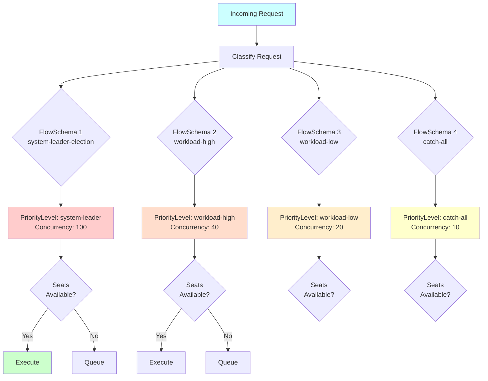

**FlowSchema**: Matches requests based on:
- User/ServiceAccount
- Namespace
- API group/resource
- Verb

**PriorityLevel**: Defines:
- **Concurrency**: Max simultaneous requests
- **Queues**: Number of queues (for fairness)
- **Queue Length**: Max queued requests per queue
- **Hand Size**: Requests dispatched together

**Work Estimation:**
- **List requests**: Estimated based on result size
- **Watch requests**: Fixed cost
- **Mutations**: Based on object size
- **Reads**: Minimal cost

**Default Priority Levels:**

| Priority Level | Concurrency | Use Case |
|----------------|-------------|----------|
| system | 30 | System components |
| leader-election | 10 | Leader election |
| workload-high | 40 | Important workloads |
| workload-low | 100 | Regular workloads |
| global-default | 20 | Catch-all |
| exempt | Unlimited | Health checks, debugging |

**Implementation:**
- `staging/src/k8s.io/apiserver/pkg/util/flowcontrol/`
- `pkg/apis/flowcontrol/` - API types

---

## Data Flow Specifications

### Request Flow: CREATE Operation

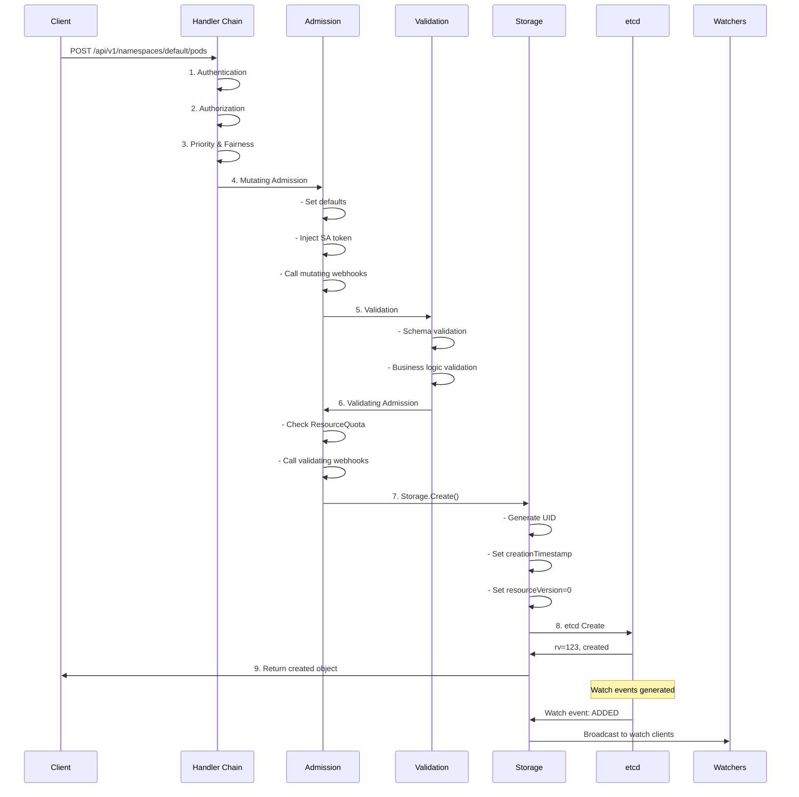

### Request Flow: UPDATE Operation

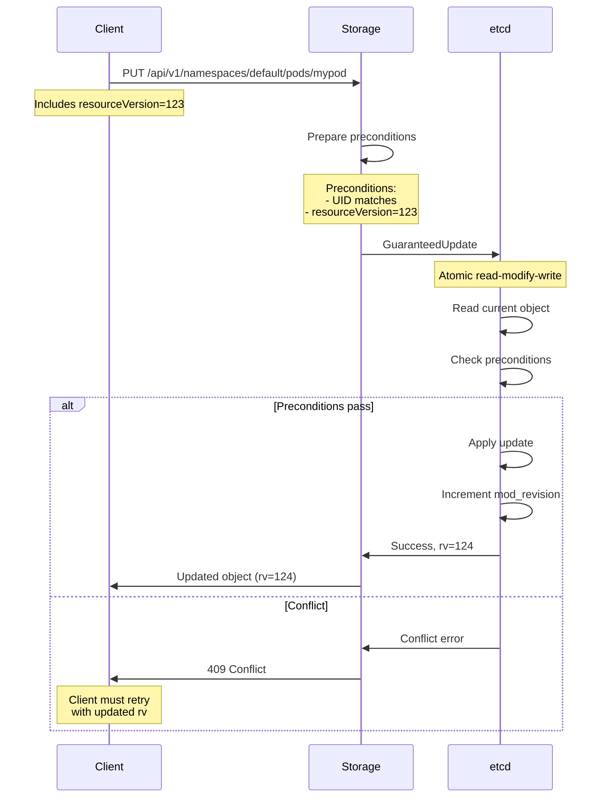

### Watch Flow

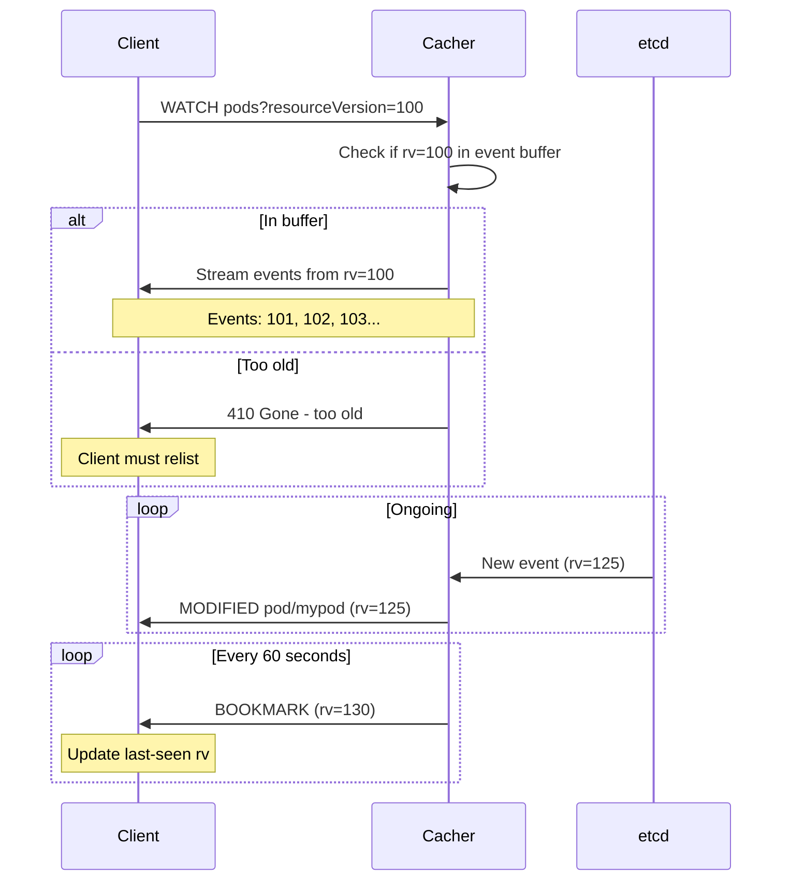

---

## Interface Specifications

### RESTful API Endpoints

**Core API (/api/v1):**
```
GET    /api/v1/pods                          # List all pods (all namespaces)
GET    /api/v1/namespaces/{ns}/pods          # List pods in namespace
GET    /api/v1/namespaces/{ns}/pods/{name}   # Get specific pod
POST   /api/v1/namespaces/{ns}/pods          # Create pod
PUT    /api/v1/namespaces/{ns}/pods/{name}   # Replace pod
PATCH  /api/v1/namespaces/{ns}/pods/{name}   # Patch pod
DELETE /api/v1/namespaces/{ns}/pods/{name}   # Delete pod
```

**Named API Groups (/apis/{group}/{version}):**
```
GET    /apis/apps/v1/deployments
GET    /apis/apps/v1/namespaces/{ns}/deployments
GET    /apis/apps/v1/namespaces/{ns}/deployments/{name}
...
```

**Subresources:**
```
GET    /api/v1/namespaces/{ns}/pods/{name}/status     # Get pod status
PUT    /api/v1/namespaces/{ns}/pods/{name}/status     # Update pod status
GET    /api/v1/namespaces/{ns}/pods/{name}/log        # Get pod logs
GET    /api/v1/namespaces/{ns}/pods/{name}/exec       # Exec into pod
POST   /api/v1/namespaces/{ns}/pods/{name}/eviction   # Evict pod
```

**Discovery:**
```
GET    /api                    # Core API discovery
GET    /apis                   # Named API groups discovery
GET    /apis/{group}/{version} # Resource discovery
GET    /openapi/v2             # OpenAPI v2 spec
GET    /openapi/v3             # OpenAPI v3 spec
```

**Health & Debug:**
```
GET    /healthz                # Liveness check
GET    /readyz                 # Readiness check
GET    /livez                  # Component liveness
GET    /metrics                # Prometheus metrics
GET    /debug/pprof/*          # Profiling (if enabled)
```

### Query Parameters

**Common Parameters:**
- `?labelSelector=app=nginx` - Filter by labels
- `?fieldSelector=status.phase=Running` - Filter by fields
- `?resourceVersion=123` - Watch from specific version
- `?watch=true` - Enable watch mode
- `?limit=100&continue=token` - Pagination
- `?dryRun=All` - Dry run mode
- `?fieldManager=kubectl` - Server-side apply field manager

---

## Behavior Specifications

### Optimistic Concurrency Control

```
1. Client GETs resource (receives resourceVersion=123)
2. Client modifies resource locally
3. Client PUTs resource with resourceVersion=123
4. Server checks: current resourceVersion == 123?
   - YES: Update succeeds, new resourceVersion=124
   - NO: 409 Conflict, client must retry
```

### Graceful Deletion

```
1. DELETE request with gracePeriodSeconds=30
2. Object's deletionTimestamp set to now+30s
3. Object remains visible with deletionTimestamp
4. Finalizers run to cleanup dependencies
5. When finalizers complete, object removed from etcd
6. Clients watching see DELETE event
```

### Namespace Deletion

```
1. Namespace marked for deletion (deletionTimestamp set)
2. Namespace controller deletes all objects in namespace
3. When all objects deleted, namespace finalizers run
4. When finalizers complete, namespace deleted
5. New objects cannot be created in deleting namespace
```

---

## Summary

The kube-apiserver implements a sophisticated, layered architecture:

1. **Server Chain**: 3-layer delegation for modular API serving
2. **Handler Chain**: 24-layer filter pipeline for request processing
3. **Authentication**: Multi-strategy identity verification
4. **Authorization**: Pluggable permission checking (RBAC, etc.)
5. **Admission**: Extensible validation and mutation
6. **Storage**: Efficient etcd integration with watch caching
7. **Watch**: Real-time event streaming with bookmark optimization
8. **APF**: Fair queuing and prioritization for stability
9. **Type System**: Strong typing with automatic conversion
10. **Extensibility**: CRDs, aggregation, webhooks

This design achieves **high throughput**, **low latency**, **strong consistency**, **real-time notifications**, and **extensibility** while maintaining **security** and **reliability**.

---

**Next**: Dive into detailed component architecture in:
- [High-Level Architecture](high-level/)
- [Middle-Level Architecture](middle-level/)
- [Low-Level Technical Specs](low-level/)
