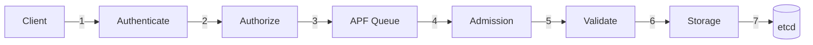

# Kube-APIServer Quick Reference Guide

> **Essential architecture reference covering all major components**

---

## Navigation

- [Core Concepts](#core-concepts)
- [Request Flow](#request-flow)
- [Authentication](#authentication)
- [Authorization](#authorization)
- [Admission Control](#admission-control)
- [Storage & Watch](#storage--watch)
- [API Groups](#api-groups)
- [Key Data Structures](#key-data-structures)
- [Performance Tuning](#performance-tuning)
- [Troubleshooting](#troubleshooting)

---

## Core Concepts

### Server Chain (3 Servers)

```
Request → Aggregator → Kube API → Extensions → 404
          (APIService)  (built-in)  (CRDs)
```

**Files**:
- Aggregator: `staging/src/k8s.io/kube-aggregator/`
- Kube: `pkg/controlplane/instance.go`
- Extensions: `staging/src/k8s.io/apiextensions-apiserver/`

### Handler Chain (24 Filters)

```
1. Audit Init → 2. Panic Recovery → 3. Request Info →
4-12. Infrastructure filters →
13. Authentication → 14. Impersonation →
15. Audit → 16. Authorization →
17. Priority & Fairness → 18. Admission →
→ API Handler
```

**File**: `staging/src/k8s.io/apiserver/pkg/server/config.go:1014-1091`

---

## Request Flow

### CREATE Request



### Typical Latency (p99)

| Stage | Time |
|-------|------|
| Auth | <1ms |
| Authz | 2-5ms |
| APF | 0ms (no queue) |
| Admission | 10-100ms (webhooks) |
| Storage | 10-50ms |
| **Total** | **20-200ms** |

---

## Authentication

### Strategies

| Method | Input | Output | Use Case |
|--------|-------|--------|----------|
| **X.509** | Client cert | CN=user, O=groups | kubectl, kubelets |
| **Service Account** | Bearer token (JWT) | SA name | Pods |
| **OIDC** | Bearer token | Email, groups | SSO users |
| **Webhook** | Bearer token | External validation | Custom |
| **Anonymous** | None | system:anonymous | Public endpoints |

### Configuration

```go
// X.509
--client-ca-file=/path/to/ca.crt

// Service Account
--service-account-key-file=/path/to/sa.pub
--service-account-issuer=https://kubernetes.default.svc

// OIDC
--oidc-issuer-url=https://accounts.google.com
--oidc-client-id=kubernetes
--oidc-username-claim=email

// Webhook
--authentication-token-webhook-config-file=/path/to/webhook.yaml
```

**File**: `staging/src/k8s.io/apiserver/pkg/authentication/`

---

## Authorization

### Modes

**RBAC** (Recommended):
```yaml
apiVersion: rbac.authorization.k8s.io/v1
kind: Role
metadata:
  name: pod-reader
rules:
- apiGroups: [""]
  resources: ["pods"]
  verbs: ["get", "list"]
---
apiVersion: rbac.authorization.k8s.io/v1
kind: RoleBinding
metadata:
  name: read-pods
subjects:
- kind: User
  name: alice
roleRef:
  kind: Role
  name: pod-reader
```

**Node Authorization**:
- Kubelets can only access their own node's resources
- Automatic for kubelets

**Webhook Authorization**:
```yaml
--authorization-webhook-config-file=/path/to/webhook.yaml
```

**File**: `staging/src/k8s.io/apiserver/pkg/authorization/`

---

## Admission Control

### Plugin Types

**Mutating Plugins** (run first):
- NamespaceLifecycle
- ServiceAccount (injects SA tokens)
- DefaultStorageClass
- MutatingAdmissionWebhook

**Validating Plugins** (run second):
- ResourceQuota
- PodSecurity
- ValidatingAdmissionWebhook
- ValidatingAdmissionPolicy (CEL)

### Webhook Configuration

```yaml
apiVersion: admissionregistration.k8s.io/v1
kind: ValidatingWebhookConfiguration
metadata:
  name: "pod-policy.example.com"
webhooks:
- name: "pod-policy.example.com"
  clientConfig:
    service:
      namespace: default
      name: admission-webhook
      path: "/validate"
    caBundle: "LS0t..."
  rules:
  - operations: ["CREATE", "UPDATE"]
    apiGroups: [""]
    apiVersions: ["v1"]
    resources: ["pods"]
  failurePolicy: Fail
  timeoutSeconds: 30
```

**File**: `staging/src/k8s.io/apiserver/pkg/admission/`

---

## Storage & Watch

### Storage Interface

```go
type Interface interface {
    Create(ctx, key, obj, out, ttl) error
    Get(ctx, key, opts, out) error
    List(ctx, key, opts, listObj) error
    GuaranteedUpdate(ctx, key, out, ignoreNotFound, preconditions, updater) error
    Delete(ctx, key, out, preconditions, validateDeletion) error
    Watch(ctx, key, opts) (watch.Interface, error)
}
```

**Implementations**:
- etcd3: `staging/src/k8s.io/apiserver/pkg/storage/etcd3/store.go`
- Cacher: `staging/src/k8s.io/apiserver/pkg/storage/cacher/cacher.go`

### Watch Cache

**Configuration**:
```go
--watch-cache=true  // Enabled by default
--watch-cache-sizes=pods#1000,services#100
```

**Bookmark Events**:
- Sent every 60 seconds
- Keep watch current without events
- Prevent expensive relists

**Event Window**: 75 seconds (bookmark freq + 15s buffer)

### Resource Versioning

```go
// Optimistic concurrency
pod.ResourceVersion = "12345"
err := client.Update(ctx, pod)
// Returns 409 Conflict if someone else updated
```

**Mapping**: `resourceVersion` → etcd `mod_revision`

---

## API Groups

### Built-in Groups (25+)

| Group | Resources | File |
|-------|-----------|------|
| **core** | pods, services, nodes, configmaps | `pkg/registry/core/rest/` |
| **apps** | deployments, statefulsets, daemonsets | `pkg/registry/apps/rest/` |
| **batch** | jobs, cronjobs | `pkg/registry/batch/rest/` |
| **networking** | ingresses, networkpolicies | `pkg/registry/networking/rest/` |
| **rbac** | roles, rolebindings | `pkg/registry/rbac/rest/` |

### Installation

```go
// pkg/controlplane/instance.go:386-442
func (c CompletedConfig) StorageProviders(client *kubernetes.Clientset) ([]RESTStorageProvider, error) {
    providers := []RESTStorageProvider{
        corerest.New(...),
        appsrest.StorageProvider{},
        batchrest.RESTStorageProvider{},
        // ... 20+ more
    }
    return providers, nil
}
```

### Custom Resources (CRDs)

```yaml
apiVersion: apiextensions.k8s.io/v1
kind: CustomResourceDefinition
metadata:
  name: widgets.example.com
spec:
  group: example.com
  versions:
  - name: v1
    served: true
    storage: true
    schema:
      openAPIV3Schema:
        type: object
        properties:
          spec:
            type: object
  scope: Namespaced
  names:
    plural: widgets
    singular: widget
    kind: Widget
```

---

## Key Data Structures

### user.Info

```go
type Info interface {
    GetName() string          // "alice" or "system:serviceaccount:default:myapp"
    GetUID() string           // Unique user ID
    GetGroups() []string      // ["system:authenticated", "developers"]
    GetExtra() map[string][]string
}
```

### Authorization Attributes

```go
type Attributes interface {
    GetUser() user.Info
    GetVerb() string              // get, list, create, update, delete, watch
    GetNamespace() string
    GetResource() string          // pods, services
    GetSubresource() string       // status, scale, log
    GetName() string
    GetAPIGroup() string
    GetAPIVersion() string
}
```

### Admission Attributes

```go
type Attributes interface {
    GetName() string
    GetNamespace() string
    GetResource() schema.GroupVersionResource
    GetSubresource() string
    GetOperation() Operation          // CREATE, UPDATE, DELETE
    GetObject() runtime.Object        // New object
    GetOldObject() runtime.Object     // Existing object (for UPDATE)
    GetUserInfo() user.Info
    IsDryRun() bool
}
```

### Storage Preconditions

```go
type Preconditions struct {
    UID *types.UID
    ResourceVersion *string
}

// Usage
preconditions := &storage.Preconditions{
    UID: &pod.UID,
    ResourceVersion: &pod.ResourceVersion,
}
err := storage.GuaranteedUpdate(ctx, key, out, false, preconditions, updater)
```

---

## Performance Tuning

### Watch Cache Sizes

```bash
--watch-cache-sizes=pods#2000,services#200,deployments#500
```

**Default sizes** (from `pkg/kubeapiserver/default_storage_factory_builder.go`):
- pods: 1000
- services: 1000
- replicasets: 1000
- deployments: 1000
- All others: 100

### API Priority & Fairness

```yaml
apiVersion: flowcontrol.apiserver.k8s.io/v1
kind: PriorityLevelConfiguration
metadata:
  name: workload-high
spec:
  type: Limited
  limited:
    nominalConcurrencyShares: 40
    limitResponse:
      type: Queue
      queuing:
        queues: 128
        queueLengthLimit: 50
        handSize: 6
```

**Default Priority Levels**:
- exempt: Unlimited (health checks)
- system: 30 seats
- leader-election: 10 seats
- workload-high: 40 seats
- workload-low: 100 seats
- global-default: 20 seats

### Request Timeout

```bash
--request-timeout=60s  // Default: 60 seconds for most requests
--min-request-timeout=1800  // Minimum for watch (30 minutes)
```

### etcd Performance

```bash
--etcd-servers=https://etcd1:2379,https://etcd2:2379,https://etcd3:2379
--etcd-compaction-interval=5m
--etcd-count-metric-poll-period=1m
```

---

## Troubleshooting

### Health Checks

```bash
# Liveness
curl -k https://localhost:6443/livez?verbose

# Readiness
curl -k https://localhost:6443/readyz?verbose

# Component health
curl -k https://localhost:6443/healthz?verbose
```

### Audit Logs

```yaml
apiVersion: audit.k8s.io/v1
kind: Policy
rules:
- level: Metadata
  resources:
  - group: ""
    resources: ["pods"]
  verbs: ["get", "list", "watch"]
- level: RequestResponse
  resources:
  - group: ""
    resources: ["pods"]
  verbs: ["create", "update", "patch", "delete"]
```

**Levels**:
- None: Don't log
- Metadata: Log request metadata only
- Request: Log metadata + request body
- RequestResponse: Log metadata + request + response

### Metrics

```bash
# Prometheus metrics
curl -k https://localhost:6443/metrics

# Key metrics:
apiserver_request_duration_seconds
apiserver_request_total
apiserver_current_inflight_requests
etcd_request_duration_seconds
watch_cache_capacity_increase_total
```

### Common Issues

**1. Watch Too Old (410 Gone)**
- Watch resourceVersion too old, not in cache
- Solution: Client should relist from rv=0

**2. Resource Version Conflict (409)**
- Concurrent update detected
- Solution: GET latest version and retry

**3. Admission Webhook Timeout**
- Webhook taking >30 seconds
- Solution: Optimize webhook or increase timeout

**4. APF Rate Limiting (429)**
- Too many requests for priority level
- Solution: Increase concurrency or use higher priority FlowSchema

---

## Key Configuration Flags

### Security

```bash
# TLS
--tls-cert-file=/var/lib/kubernetes/apiserver.crt
--tls-private-key-file=/var/lib/kubernetes/apiserver.key
--client-ca-file=/var/lib/kubernetes/ca.crt

# Authentication
--service-account-key-file=/var/lib/kubernetes/sa.pub
--service-account-issuer=https://kubernetes.default.svc
--oidc-issuer-url=https://accounts.google.com

# Authorization
--authorization-mode=Node,RBAC

# Admission
--enable-admission-plugins=NamespaceLifecycle,LimitRanger,ServiceAccount,ResourceQuota,PodSecurity
```

### Storage

```bash
# etcd
--etcd-servers=https://127.0.0.1:2379
--etcd-cafile=/etc/kubernetes/pki/etcd/ca.crt
--etcd-certfile=/etc/kubernetes/pki/apiserver-etcd-client.crt
--etcd-keyfile=/etc/kubernetes/pki/apiserver-etcd-client.key

# Storage
--storage-backend=etcd3
--storage-media-type=application/vnd.kubernetes.protobuf
```

### Networking

```bash
# Listen address
--bind-address=0.0.0.0
--secure-port=6443

# Service cluster IP range
--service-cluster-ip-range=10.96.0.0/12
--service-node-port-range=30000-32767
```

---

## Code Reference Index

### Entry Points
- **main()**: `cmd/kube-apiserver/apiserver.go:37`
- **NewAPIServerCommand()**: `cmd/kube-apiserver/app/server.go:70-145`
- **CreateServerChain()**: `cmd/kube-apiserver/app/server.go:176-197`

### Core Components
- **GenericAPIServer**: `staging/src/k8s.io/apiserver/pkg/server/genericapiserver.go`
- **Handler Chain**: `staging/src/k8s.io/apiserver/pkg/server/config.go:1014-1091`
- **Storage Interface**: `staging/src/k8s.io/apiserver/pkg/storage/interfaces.go`
- **Watch Cache**: `staging/src/k8s.io/apiserver/pkg/storage/cacher/cacher.go`

### Authentication & Authorization
- **Authentication**: `staging/src/k8s.io/apiserver/pkg/authentication/`
- **Authorization**: `staging/src/k8s.io/apiserver/pkg/authorization/`
- **Admission**: `staging/src/k8s.io/apiserver/pkg/admission/`

### Registry & Storage
- **Generic Registry**: `pkg/registry/generic/registry/store.go`
- **Pod Registry**: `pkg/registry/core/pod/storage/storage.go`
- **Pod Strategy**: `pkg/registry/core/pod/strategy.go`

---

## Quick Commands

### View API Resources

```bash
kubectl api-resources
kubectl api-versions
kubectl explain pod.spec
```

### Debug Requests

```bash
# Verbose output
kubectl get pods -v=8

# Raw API call
kubectl get --raw /api/v1/namespaces/default/pods
```

### Test Admission

```bash
# Dry run
kubectl create -f pod.yaml --dry-run=server

# Validate only
kubectl apply -f pod.yaml --server-dry-run
```

---

## Summary

This quick reference covers the essential architecture of kube-apiserver:

- **3-server chain**: Aggregator → Kube → Extensions
- **24-filter pipeline**: Auth → Authz → Admission → Handler
- **Storage**: etcd3 + watch cache
- **Extensibility**: CRDs, webhooks, aggregation

**For detailed documentation**, see:
- [High-Level Architecture](high-level/)
- [Middle-Level Architecture](middle-level/)
- [Low-Level Technical Specs](low-level/)

---

**Key Files to Know**:
```
cmd/kube-apiserver/app/server.go          # Server creation
pkg/controlplane/instance.go              # API installation
pkg/registry/                             # REST storage
staging/src/k8s.io/apiserver/             # Generic framework
staging/src/k8s.io/kube-aggregator/       # Aggregation
staging/src/k8s.io/apiextensions-apiserver/ # CRDs
```
