# Kube-APIServer: System Overview

> **High-Level Architecture: Understanding the role and context of kube-apiserver in Kubernetes**

---

## Table of Contents

- [Introduction](#introduction)
- [System Context](#system-context)
- [Core Responsibilities](#core-responsibilities)
- [Architectural Principles](#architectural-principles)
- [System Architecture](#system-architecture)
- [Key Characteristics](#key-characteristics)

---

## Introduction

The **Kubernetes API Server** (kube-apiserver) is the central control plane component that serves as the **unified API gateway** for the entire Kubernetes cluster. It is the **only component that directly communicates with etcd** and acts as the **front door** for all cluster operations.

### What is kube-apiserver?

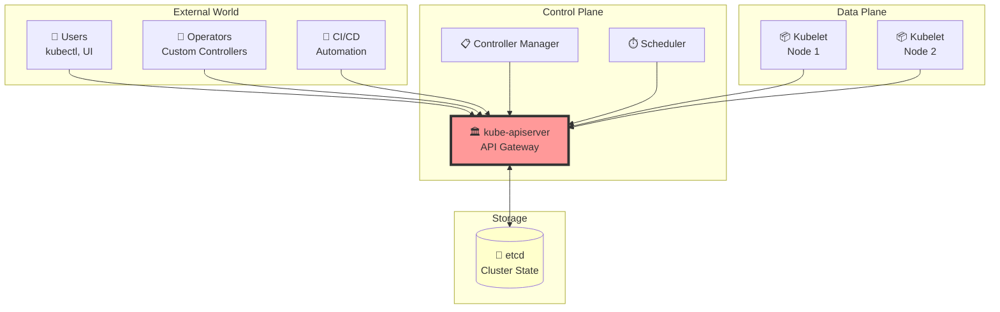

**Key Points:**
- **Single Point of Entry**: All cluster interactions go through the API server
- **State Manager**: Manages all cluster state in etcd
- **Policy Enforcer**: Enforces authentication, authorization, and admission policies
- **Event Broadcaster**: Notifies clients of state changes via watch streams

### Why does kube-apiserver exist?

**Problems it solves:**

1. **Centralized Access Control**: Single place to enforce security policies
2. **Data Consistency**: Strong consistency guarantees via etcd
3. **API Versioning**: Supports multiple API versions simultaneously
4. **Extensibility**: Allows custom resources and APIs
5. **Resource Validation**: Ensures data integrity before persistence
6. **Event Notification**: Real-time updates to interested clients
7. **Audit Trail**: Complete audit log of all operations

---

## System Context

### Position in Kubernetes Architecture

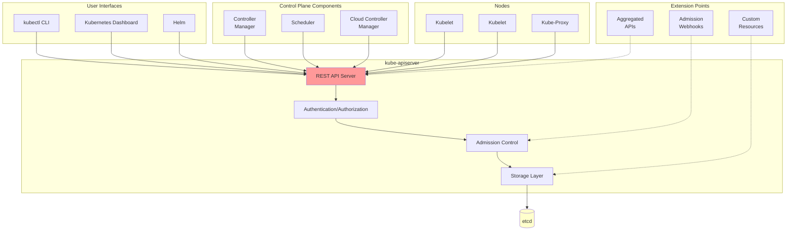

### External Dependencies

| Component | Relationship | Purpose |
|-----------|--------------|---------|
| **etcd** | Storage backend | Persistent state storage |
| **Kubelet** | Client | Node agent reports status, receives pod specs |
| **Controller Manager** | Client | Reconciles cluster state |
| **Scheduler** | Client | Assigns pods to nodes |
| **Cloud Provider** | Optional integration | Cloud-specific operations |
| **External Webhooks** | Extension point | Custom admission logic |
| **Extension API Servers** | Aggregated | Custom API groups |
| **OIDC Provider** | Authentication | User identity verification |

---

## Core Responsibilities

### 1. API Gateway

**Expose RESTful APIs** for all Kubernetes resources:

```
GET    /api/v1/namespaces/default/pods
POST   /api/v1/namespaces/default/pods
PUT    /api/v1/namespaces/default/pods/mypod
DELETE /api/v1/namespaces/default/pods/mypod
WATCH  /api/v1/namespaces/default/pods?watch=true
```

**Responsibilities:**
- HTTP/HTTPS endpoint serving
- Content negotiation (JSON, Protobuf, YAML)
- API versioning (alpha, beta, stable)
- Request routing and delegation

**Implementation**: `cmd/kube-apiserver/app/server.go`

---

### 2. Authentication

**Verify the identity** of every request:

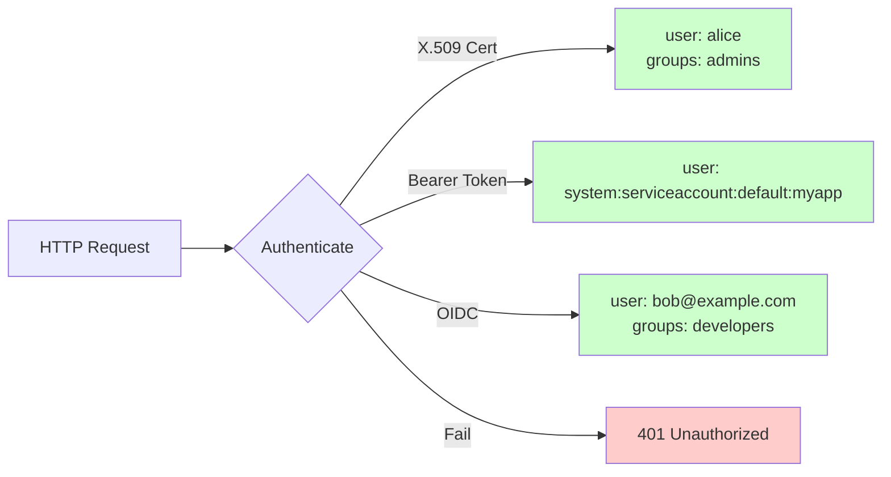

**Supported Methods:**
- X.509 client certificates
- Bearer tokens (service accounts, OIDC)
- Webhook token authentication
- Bootstrap tokens
- Anonymous (optional)

**Implementation**: `staging/src/k8s.io/apiserver/pkg/authentication/`

---

### 3. Authorization

**Determine if the authenticated user has permission**:

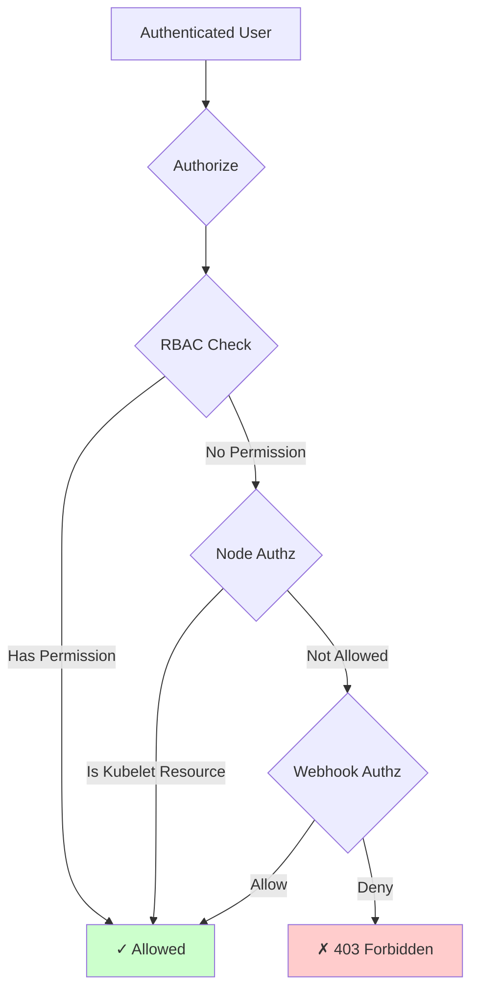

**Authorization Modes:**
- **RBAC** (recommended): Role-based access control
- **Node**: Kubelet-specific authorization
- **Webhook**: External authorization decisions
- **ABAC**: Attribute-based (deprecated)

**Implementation**: `staging/src/k8s.io/apiserver/pkg/authorization/`

---

### 4. Admission Control

**Validate and mutate requests** before persistence:

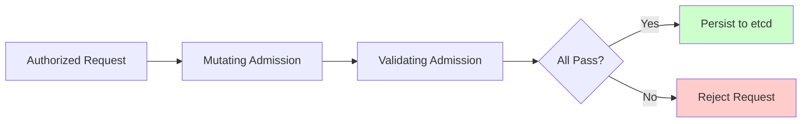

**Admission Types:**
- **Built-in plugins**: NamespaceLifecycle, LimitRanger, ResourceQuota, etc.
- **Mutating webhooks**: External mutation logic
- **Validating webhooks**: External validation logic
- **Admission policies**: CEL-based policies

**Example**: Injecting service account tokens, enforcing resource quotas

**Implementation**: `staging/src/k8s.io/apiserver/pkg/admission/`

---

### 5. Storage Management

**Persist and retrieve cluster state** from etcd:

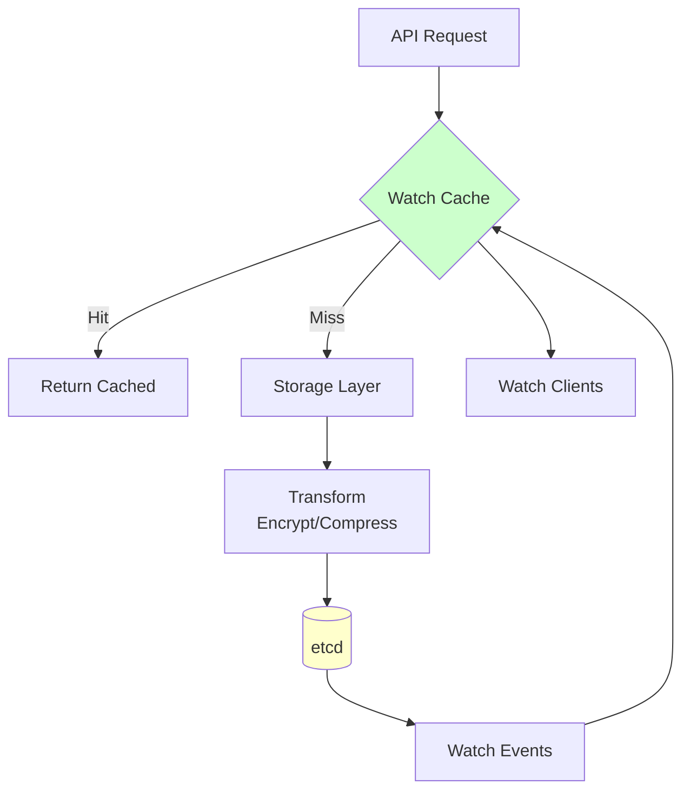

**Operations:**
- **Create**: Insert new resources
- **Get/List**: Retrieve resources
- **Update**: Modify existing resources (with optimistic locking)
- **Delete**: Remove resources (with finalizers)
- **Watch**: Stream changes in real-time

**Key Features:**
- Optimistic concurrency control (resourceVersion)
- Watch caching for performance
- Encryption at rest
- Storage versioning

**Implementation**: `staging/src/k8s.io/apiserver/pkg/storage/`

---

### 6. Watch Streams

**Provide real-time notifications** of resource changes:

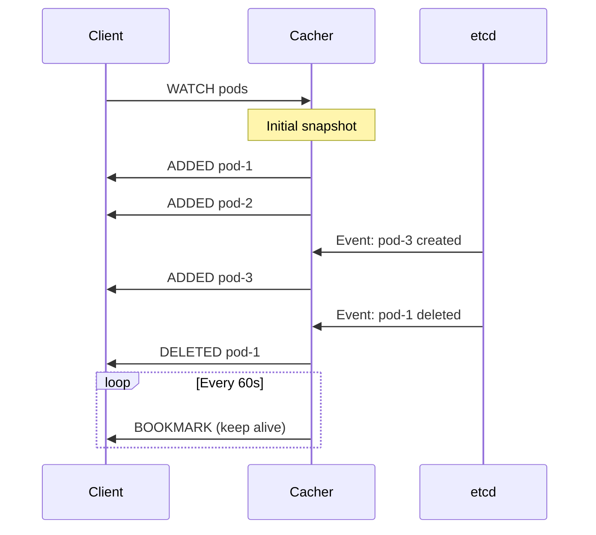

**Watch Mechanism:**
- Efficient streaming via HTTP/2
- Bookmark events prevent timeouts
- Watch cache reduces etcd load
- Resume from last seen resourceVersion

**Implementation**: `staging/src/k8s.io/apiserver/pkg/storage/cacher/`

---

### 7. API Discovery

**Enable clients to discover** available APIs and resources:

```
GET /api              → Core API groups
GET /apis             → Named API groups
GET /apis/apps/v1     → Resources in apps/v1
GET /openapi/v2       → OpenAPI v2 spec
GET /openapi/v3       → OpenAPI v3 spec
```

**Provides:**
- API group enumeration
- Resource type discovery
- Field and schema information
- Supported operations per resource

**Implementation**: `staging/src/k8s.io/apiserver/pkg/endpoints/discovery/`

---

### 8. Extensibility

**Support custom resources and APIs**:

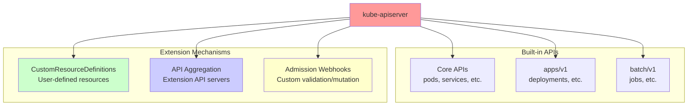

**Extension Points:**
1. **CustomResourceDefinitions (CRDs)**: Define new resource types
2. **API Aggregation**: Run separate API servers
3. **Admission Webhooks**: Custom validation/mutation logic
4. **Custom Authenticators/Authorizers**: Pluggable auth

**Implementation**:
- CRDs: `staging/src/k8s.io/apiextensions-apiserver/`
- Aggregation: `staging/src/k8s.io/kube-aggregator/`

---

## Architectural Principles

### 1. Single Source of Truth

```
All cluster state lives in etcd
   ↓
Only kube-apiserver writes to etcd
   ↓
All components read from kube-apiserver
   ↓
Consistent view of cluster state
```

**Benefits:**
- Strong consistency guarantees
- Centralized access control
- Simplified state management
- Audit trail of all changes

---

### 2. Declarative API

**Desired State Model:**

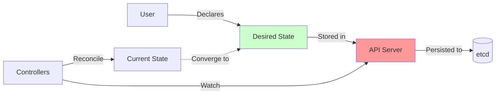

**Characteristics:**
- Users specify **what** they want, not **how** to achieve it
- Controllers continuously reconcile current state → desired state
- Idempotent operations
- Self-healing system

---

### 3. Level-Based Triggers

**Watch-based reconciliation** (not edge-triggered):

```
Controller watches for changes
   ↓
Reads current state from API
   ↓
Compares to desired state
   ↓
Takes action to reconcile
   ↓
(Repeat)
```

**Benefits:**
- Resilient to missed events
- Self-correcting
- Works across restarts

---

### 4. Optimistic Concurrency

**Conflict detection via resourceVersion**:

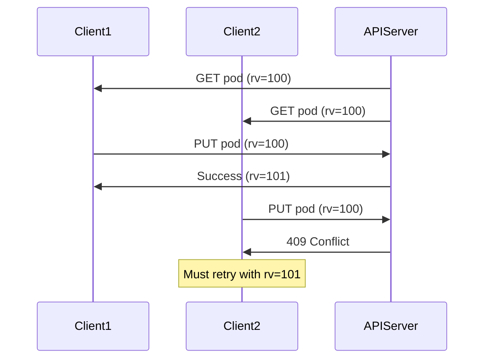

**No distributed locks needed!**

---

### 5. Extensibility by Design

**Plugin architecture** throughout:

| Layer | Extension Mechanism |
|-------|---------------------|
| Authentication | Pluggable authenticators |
| Authorization | Pluggable authorizers |
| Admission | Pluggable admission plugins + webhooks |
| Storage | Pluggable storage backends (only etcd in practice) |
| API | CRDs, aggregation |

---

### 6. Defense in Depth

**Multiple security layers**:

```
1. Network (TLS)
   ↓
2. Authentication (Who are you?)
   ↓
3. Authorization (What can you do?)
   ↓
4. Admission (Is this request valid?)
   ↓
5. Validation (Does this meet schema?)
   ↓
6. Storage (Encrypted at rest)
```

---

## System Architecture

### Three-Server Delegation Chain

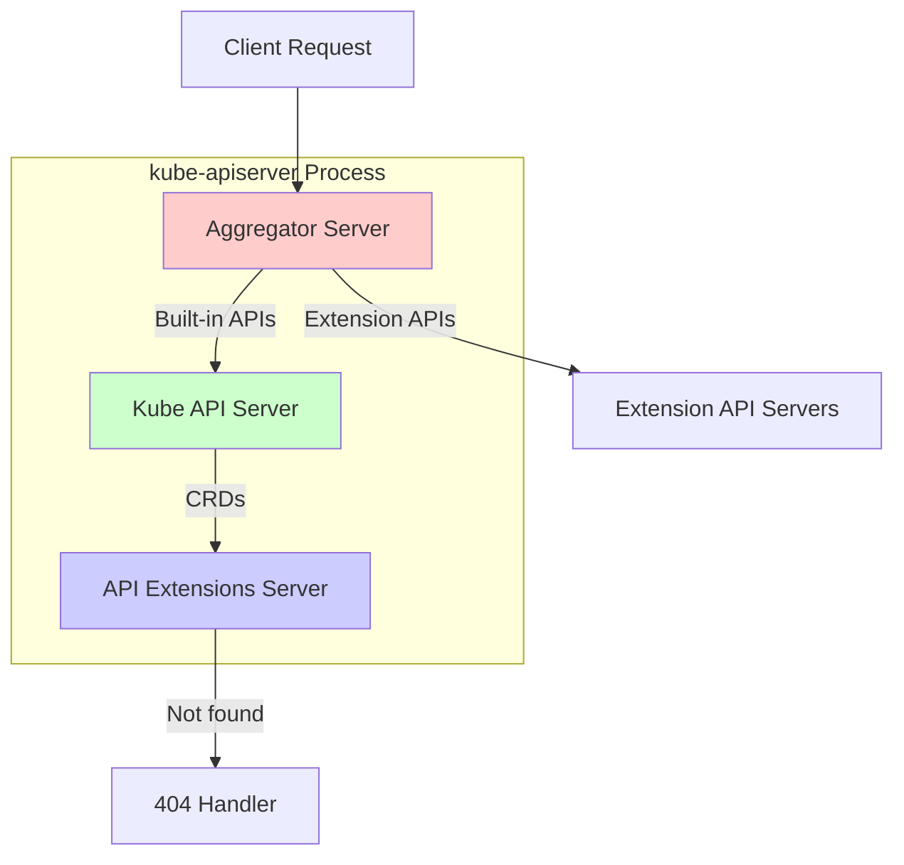

**Delegation Order:**
1. **Aggregator**: Handles APIService routing to extension servers
2. **Kube API**: Handles built-in Kubernetes APIs
3. **API Extensions**: Handles CustomResourceDefinitions
4. **NotFound**: Returns 404 for unknown paths

**File**: `cmd/kube-apiserver/app/server.go:176-197`

---

### Request Processing Pipeline

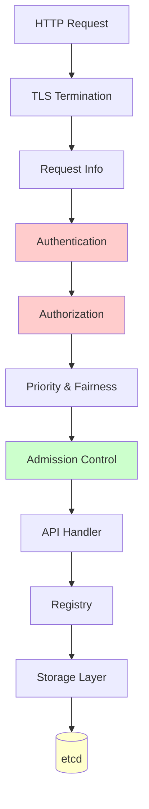

**24-layer handler chain** processes each request!

**File**: `staging/src/k8s.io/apiserver/pkg/server/config.go:1014-1091`

---

## Key Characteristics

### Performance

**Metrics (typical production instance):**
- **Throughput**: 1000+ req/sec
- **Latency**: <100ms p99 (cached reads)
- **Watch connections**: 5000+ concurrent
- **Memory**: 2-8 GB depending on cluster size

**Optimizations:**
- Watch cache reduces etcd load by 90%+
- Protobuf reduces bandwidth vs JSON
- Priority & Fairness prevents overload

---

### Scalability

**Horizontal scaling**:
- Multiple active API server instances
- Stateless design (all state in etcd)
- Load balancer distributes requests
- Supports 5000+ node clusters

---

### Availability

**High availability setup**:
- Active-active deployment (3+ instances)
- Watch cache provides read availability during etcd downtime
- Graceful shutdown prevents request drops
- Health checks (liveness, readiness)

---

### Security

**Multi-layered security**:
- TLS for all communication
- Multiple authentication methods
- Fine-grained RBAC
- Audit logging
- Admission webhooks for custom policies
- Encryption at rest

---

## Summary

The **kube-apiserver** is the **heart of Kubernetes**, serving as:

✅ **API Gateway**: Single entry point for all cluster operations
✅ **State Manager**: Persistent storage via etcd with strong consistency
✅ **Security Enforcer**: Authentication, authorization, admission control
✅ **Event Broadcaster**: Real-time watch streams
✅ **Extension Platform**: CRDs, aggregation, webhooks

**Key Strengths:**
- Centralized control and security
- Strong consistency guarantees
- Real-time event notifications
- Highly extensible architecture
- Battle-tested at massive scale

**Next Steps:**
- [Server Chain Architecture](02-server-chain-architecture.md) - Deep dive into delegation pattern
- [Initialization Flow](03-initialization-flow.md) - Startup sequence
- [Key Components](04-key-components.md) - Major subsystems

---

**Code References:**
- Entry point: `cmd/kube-apiserver/apiserver.go:37`
- Server creation: `cmd/kube-apiserver/app/server.go:176-197`
- Generic server: `staging/src/k8s.io/apiserver/pkg/server/genericapiserver.go`
