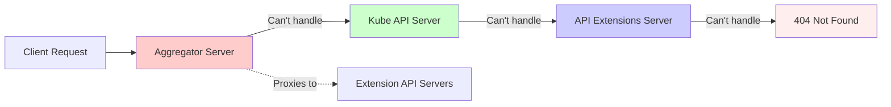
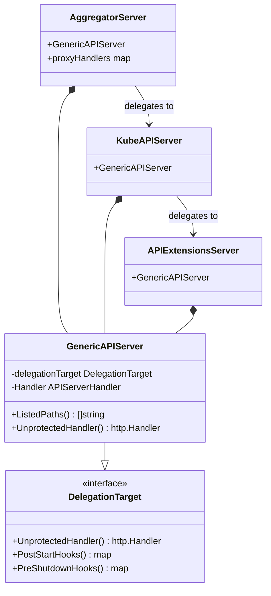
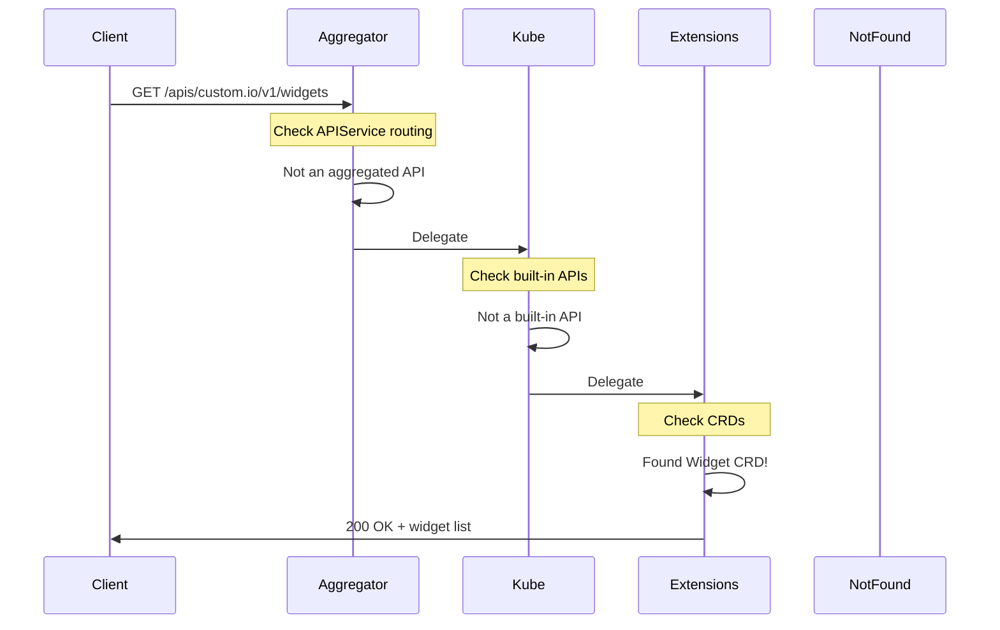
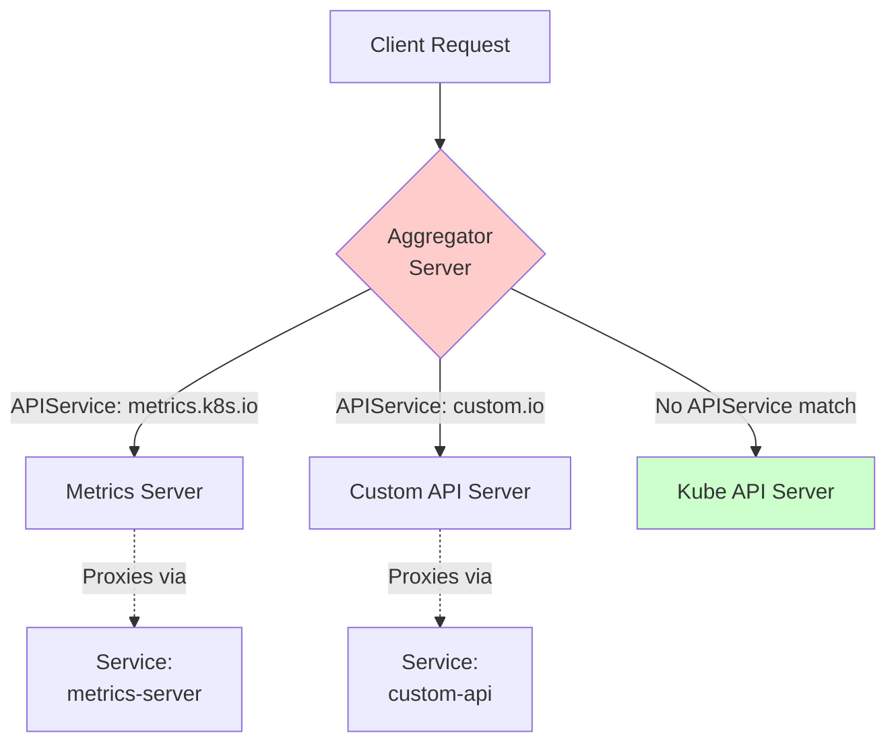
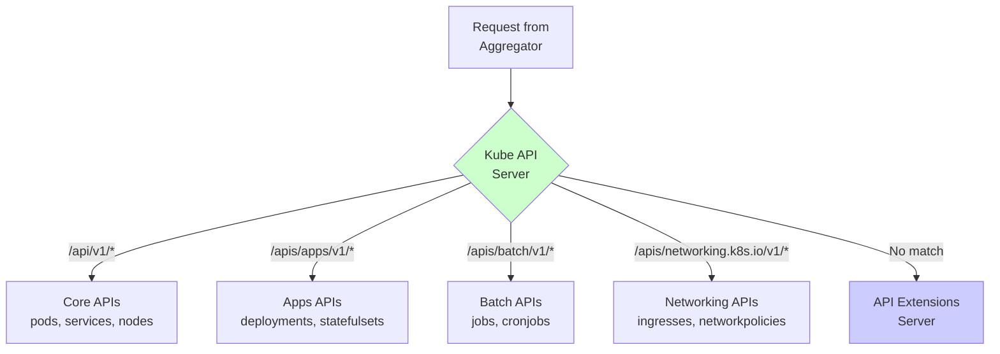
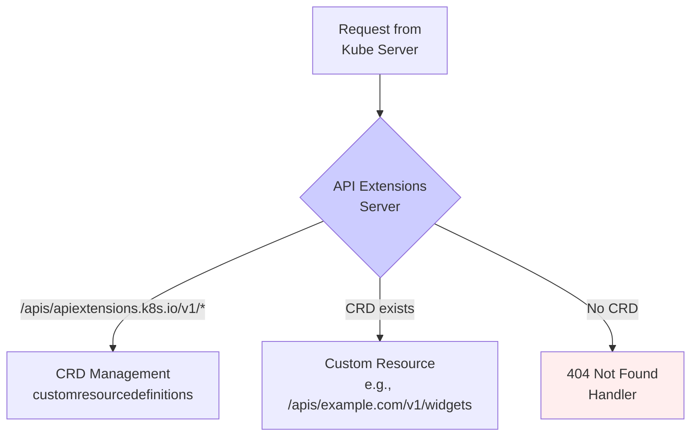

# Server Chain Architecture

> **High-Level Architecture: The three-server delegation pattern in kube-apiserver**

---

## Table of Contents

- [Overview](#overview)
- [Delegation Pattern](#delegation-pattern)
- [The Three Servers](#the-three-servers)
- [Request Routing](#request-routing)
- [Implementation Details](#implementation-details)
- [Benefits and Trade-offs](#benefits-and-trade-offs)

---

## Overview

The kube-apiserver employs a **three-server delegation chain** to modularly serve different types of APIs. This architecture uses the **Delegation Pattern** where each server can handle a request or delegate it to the next server in the chain.

### The Chain



**Servers (in order):**
1. **Aggregator Server** - Routes to extension API servers via APIService
2. **Kube API Server** - Serves built-in Kubernetes APIs
3. **API Extensions Server** - Serves CustomResourceDefinitions
4. **404 Handler** - Final fallback

---

## Delegation Pattern

### What is Delegation?

**Delegation Pattern**: An object handles a request by delegating to another object.



### How It Works



**Key Characteristic**: Each server gets a chance to handle the request before passing to the next.

---

## The Three Servers

### 1. Aggregator Server

**Purpose**: Route requests to extension API servers and serve aggregated discovery.



**Responsibilities:**
- Maintain list of APIService objects
- Proxy requests to extension API servers
- Merge discovery documents
- Serve aggregated `/apis` endpoint

**APIService Example:**
```yaml
apiVersion: apiregistration.k8s.io/v1
kind: APIService
metadata:
  name: v1beta1.metrics.k8s.io
spec:
  service:
    namespace: kube-system
    name: metrics-server
  group: metrics.k8s.io
  version: v1beta1
  groupPriorityMinimum: 100
  versionPriority: 100
```

**When it handles:**
- Requests matching an APIService: proxies to extension server
- Discovery requests: merges results from all servers

**When it delegates:**
- Requests NOT matching any APIService → delegates to Kube API Server

**Implementation**: `staging/src/k8s.io/kube-aggregator/pkg/apiserver/apiserver.go`

**Code Reference**: `cmd/kube-apiserver/app/aggregator.go` - CreateAggregatorServer()

---

### 2. Kube API Server

**Purpose**: Serve all built-in Kubernetes APIs.



**Serves 25+ API Groups:**

| API Group | Version | Resources |
|-----------|---------|-----------|
| **core** (legacy) | v1 | pods, services, nodes, namespaces, configmaps, secrets, etc. |
| **apps** | v1 | deployments, statefulsets, daemonsets, replicasets |
| **batch** | v1 | jobs, cronjobs |
| **networking.k8s.io** | v1 | ingresses, networkpolicies, ingressclasses |
| **rbac.authorization.k8s.io** | v1 | roles, rolebindings, clusterroles, clusterrolebindings |
| **storage.k8s.io** | v1 | storageclasses, volumeattachments, csinodes |
| **autoscaling** | v1, v2 | horizontalpodautoscalers |
| **policy** | v1 | poddisruptionbudgets |
| **certificates.k8s.io** | v1 | certificatesigningrequests |
| **coordination.k8s.io** | v1 | leases |
| **discovery.k8s.io** | v1 | endpointslices |
| **events.k8s.io** | v1 | events |
| **node.k8s.io** | v1 | runtimeclasses |
| **scheduling.k8s.io** | v1 | priorityclasses |
| **flowcontrol.apiserver.k8s.io** | v1 | flowschemas, prioritylevelconfigurations |
| **resource.k8s.io** | v1alpha3 | resourceclaims, resourceclasses |
| **admissionregistration.k8s.io** | v1 | validatingwebhookconfigurations, mutatingwebhookconfigurations |
| ... | ... | ... (20+ total) |

**When it handles:**
- Requests for built-in API groups

**When it delegates:**
- Requests NOT matching built-in APIs → delegates to API Extensions Server

**Implementation**: `pkg/controlplane/instance.go:312-384` - New()

**Code Reference**:
- API group registration: `pkg/controlplane/instance.go:386-442` - StorageProviders()
- Apps API: `pkg/registry/apps/rest/storage_apps.go`
- Core API: `pkg/registry/core/rest/storage_core.go`

---

### 3. API Extensions Server

**Purpose**: Serve CustomResourceDefinitions (CRDs).



**Responsibilities:**
- Manage CustomResourceDefinition resources
- Serve custom resources defined by CRDs
- Validate custom resources against OpenAPI schemas
- Handle CRD versioning and conversion webhooks

**Example CRD:**
```yaml
apiVersion: apiextensions.k8s.io/v1
kind: CustomResourceDefinition
metadata:
  name: widgets.example.com
spec:
  group: example.com
  versions:
  - name: v1
    served: true
    storage: true
    schema:
      openAPIV3Schema:
        type: object
        properties:
          spec:
            type: object
            properties:
              size:
                type: integer
  scope: Namespaced
  names:
    plural: widgets
    singular: widget
    kind: Widget
```

**When it handles:**
- `/apis/apiextensions.k8s.io/v1/customresourcedefinitions` - CRD management
- Requests for custom resources (e.g., `/apis/example.com/v1/widgets`)

**When it delegates:**
- No match found → delegates to 404 handler

**Implementation**: `staging/src/k8s.io/apiextensions-apiserver/pkg/apiserver/apiserver.go`

**Code Reference**: `pkg/controlplane/apiserver/apiextensions.go` - CreateAPIExtensionsServer()

---

### 4. Not Found Handler

**Final fallback** - returns 404 for unknown paths.

```go
func notfoundhandler.New(serializer runtime.NegotiatedSerializer,
                         reason string) http.Handler {
    return http.HandlerFunc(func(w http.ResponseWriter, req *http.Request) {
        // Return 404 Not Found with appropriate error response
    })
}
```

---

## Request Routing

### Routing Logic

```mermaid
flowchart TD
    Start[Request Arrives] --> Agg{Aggregator:<br/>APIService<br/>match?}

    Agg -->|Yes| Proxy[Proxy to<br/>Extension Server]
    Agg -->|No| Kube{Kube API:<br/>Built-in<br/>API?}

    Kube -->|/api/v1/*| CoreHandler[Core API Handler]
    Kube -->|/apis/{group}/v1/*| GroupHandler[API Group Handler]
    Kube -->|No match| Ext{Extensions:<br/>CRD<br/>exists?}

    Ext -->|Yes| CRDHandler[CRD Handler]
    Ext -->|No| NotFound[404 Not Found]

    Proxy --> Response[Response to Client]
    CoreHandler --> Response
    GroupHandler --> Response
    CRDHandler --> Response
    NotFound --> Response

    style Agg fill:#ffcccc
    style Kube fill:#ccffcc
    style Ext fill:#ccccff
    style NotFound fill:#ffeeee
```

### Request Flow Examples

**Example 1: Built-in API (Pod)**
```
GET /api/v1/namespaces/default/pods

1. Aggregator: No APIService for "core" → delegate
2. Kube API: Matches /api/v1/* → handle
   - Route to pod registry
   - Retrieve from storage
   - Return pod list
```

**Example 2: Extension API (Metrics)**
```
GET /apis/metrics.k8s.io/v1beta1/nodes

1. Aggregator: APIService exists for metrics.k8s.io → proxy
   - Resolve service: kube-system/metrics-server
   - Proxy request to metrics-server pod
   - Return response from metrics-server
```

**Example 3: Custom Resource (Widget CRD)**
```
GET /apis/example.com/v1/namespaces/default/widgets

1. Aggregator: No APIService → delegate
2. Kube API: Not a built-in API → delegate
3. Extensions: Widget CRD exists → handle
   - Validate against OpenAPI schema
   - Retrieve from storage
   - Return widget list
```

**Example 4: Unknown API**
```
GET /apis/unknown.io/v1/things

1. Aggregator: No APIService → delegate
2. Kube API: Not built-in → delegate
3. Extensions: No CRD → delegate
4. NotFound: Return 404
```

---

## Implementation Details

### Server Creation Code

**File**: `cmd/kube-apiserver/app/server.go:176-197`

```go
func CreateServerChain(config CompletedConfig) (*aggregatorapiserver.APIAggregator, error) {
    // 1. Create NotFound handler (bottom of chain)
    notFoundHandler := notfoundhandler.New(
        config.KubeAPIs.ControlPlane.Generic.Serializer,
        genericapifilters.NoMuxAndDiscoveryIncompleteKey,
    )

    // 2. Create API Extensions Server (CustomResourceDefinitions)
    apiExtensionsServer, err := config.ApiExtensions.New(
        genericapiserver.NewEmptyDelegateWithCustomHandler(notFoundHandler),
    )
    if err != nil {
        return nil, err
    }

    // 3. Create Kube API Server (built-in APIs)
    //    Delegates to API Extensions Server
    kubeAPIServer, err := config.KubeAPIs.New(
        apiExtensionsServer.GenericAPIServer,
    )
    if err != nil {
        return nil, err
    }

    // 4. Create Aggregator Server (extension API routing)
    //    Delegates to Kube API Server
    aggregatorServer, err := controlplaneapiserver.CreateAggregatorServer(
        config.Aggregator,
        kubeAPIServer.ControlPlane.GenericAPIServer,
        apiExtensionsServer.Informers.Apiextensions().V1().CustomResourceDefinitions(),
        crdAPIEnabled,
        apiVersionPriorities,
    )
    if err != nil {
        return nil, err
    }

    return aggregatorServer, nil
}
```

**Key Points:**
- Servers created **bottom-up** (404 → Extensions → Kube → Aggregator)
- Each server wraps the previous as `DelegationTarget`
- Final aggregator server is the main HTTP handler

---

### GenericAPIServer Structure

All three servers embed `GenericAPIServer`:

```go
type GenericAPIServer struct {
    discoveryAddresses discovery.Addresses
    LoopbackClientConfig *restclient.Config

    // Main HTTP handler
    Handler *APIServerHandler

    // Delegation
    delegationTarget DelegationTarget

    // Lifecycle hooks
    postStartHooks map[string]postStartHookEntry
    preShutdownHooks map[string]preShutdownHookEntry

    // Components
    admissionControl admission.Interface
    AuditBackend audit.Backend
    Authorizer authorizer.Authorizer

    // Storage
    StorageFactory serverstorage.StorageFactory

    // ... 50+ more fields
}
```

**File**: `staging/src/k8s.io/apiserver/pkg/server/genericapiserver.go`

---

### API Handler Structure

Each server has an `APIServerHandler`:

```go
type APIServerHandler struct {
    // Complete handler chain (includes all filters)
    FullHandlerChain http.Handler

    // Routes for API endpoints
    GoRestfulContainer *restful.Container

    // Routes for non-API endpoints (metrics, healthz, etc.)
    NonGoRestfulMux *mux.PathRecorderMux

    // Routes between GoRestful and NonGoRestful
    Director http.Handler
}
```

**Director Logic:**
```go
func (d director) ServeHTTP(w http.ResponseWriter, req *http.Request) {
    path := req.URL.Path

    // API requests → go-restful
    if strings.HasPrefix(path, "/apis/") ||
       strings.HasPrefix(path, "/api/") {
        d.goRestfulContainer.ServeHTTP(w, req)
        return
    }

    // Everything else → direct mux
    d.nonGoRestfulMux.ServeHTTP(w, req)
}
```

---

## Benefits and Trade-offs

### Benefits

**1. Modularity**
- Clear separation of concerns
- Each server has single responsibility
- Easy to understand and maintain

**2. Extensibility**
- Add new API servers without modifying core
- CRDs without recompiling API server
- Third-party APIs via aggregation

**3. Backward Compatibility**
- Legacy APIs in Kube API Server
- New APIs in Extensions or Aggregation
- Smooth migration path

**4. Code Reuse**
- All servers share GenericAPIServer base
- Common handler chain, admission, storage logic
- Consistent behavior across all APIs

**5. Performance**
- Extension APIs don't impact core API performance
- CRDs can be served from separate processes
- Allows specialized scaling

### Trade-offs

**1. Complexity**
- Three servers to understand
- Delegation logic adds indirection
- Harder to debug request flow

**2. Latency**
- Extra hop through delegation chain
- Proxy overhead for aggregated APIs
- Minor impact (typically <1ms)

**3. Memory Overhead**
- Three server instances in one process
- Multiple informer caches
- Increased memory footprint

**4. Configuration Complexity**
- APIService objects to manage
- Service-based routing dependencies
- Network connectivity requirements

---

## Summary

The **three-server delegation chain** provides:

✅ **Modularity**: Each server handles specific API types
✅ **Extensibility**: Easy to add CRDs and aggregated APIs
✅ **Backward Compatibility**: Legacy and new APIs coexist
✅ **Code Reuse**: Shared GenericAPIServer base
✅ **Separation of Concerns**: Clear boundaries between API types

**Request Flow:**
```
Client → Aggregator → Kube API → Extensions → 404
         (proxy)      (built-in)   (CRDs)
```

**Next**:
- [Initialization Flow](03-initialization-flow.md) - How these servers are created and started
- [Key Components](04-key-components.md) - Deep dive into GenericAPIServer

---

**Code References:**
- Server chain creation: `cmd/kube-apiserver/app/server.go:176-197`
- Aggregator: `staging/src/k8s.io/kube-aggregator/pkg/apiserver/apiserver.go`
- Kube API: `pkg/controlplane/instance.go`
- Extensions: `staging/src/k8s.io/apiextensions-apiserver/pkg/apiserver/apiserver.go`
- Generic server: `staging/src/k8s.io/apiserver/pkg/server/genericapiserver.go`
