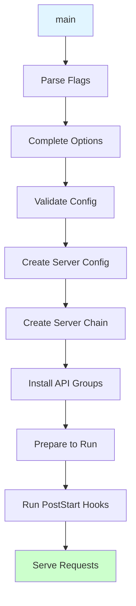
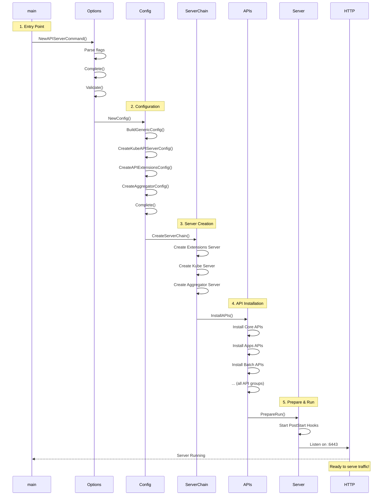
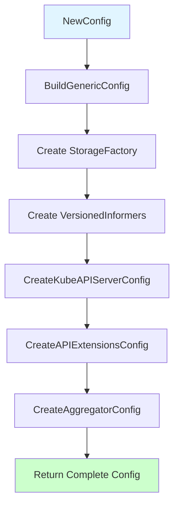
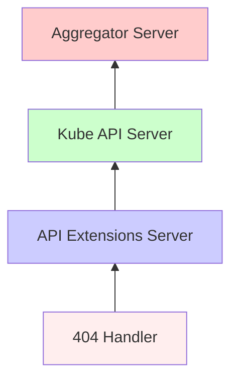

# Initialization Flow

> **High-Level Architecture: How kube-apiserver starts up and becomes ready to serve requests**

---

## Table of Contents

- [Overview](#overview)
- [Startup Sequence](#startup-sequence)
- [Configuration Phase](#configuration-phase)
- [Server Creation Phase](#server-creation-phase)
- [API Installation Phase](#api-installation-phase)
- [Startup Hooks Phase](#startup-hooks-phase)
- [Ready to Serve](#ready-to-serve)

---

## Overview

The kube-apiserver initialization follows a **carefully orchestrated sequence** to ensure all components are properly configured and ready before serving traffic.

### High-Level Flow



**Total Time**: Typically 2-5 seconds for a production cluster

---

## Startup Sequence

### Complete Initialization Diagram



---

## Configuration Phase

### 1. Entry Point

**File**: `cmd/kube-apiserver/apiserver.go:37`

```go
func main() {
    command := app.NewAPIServerCommand()
    code := cli.Run(command)
    os.Exit(code)
}
```

### 2. Command Setup

**File**: `cmd/kube-apiserver/app/server.go:70-145`

```go
func NewAPIServerCommand() *cobra.Command {
    // Create default options
    s := options.NewServerRunOptions()

    cmd := &cobra.Command{
        Use: "kube-apiserver",
        RunE: func(cmd *cobra.Command, args []string) error {
            // Complete options (set defaults)
            completedOptions, err := s.Complete(ctx)
            if err != nil {
                return err
            }

            // Validate configuration
            if errs := completedOptions.Validate(); len(errs) != 0 {
                return utilerrors.NewAggregate(errs)
            }

            // Run the server
            return Run(ctx, completedOptions)
        },
    }

    // Add all flags
    fs := cmd.Flags()
    namedFlagSets := s.Flags()
    for _, f := range namedFlagSets.FlagSets {
        fs.AddFlagSet(f)
    }

    return cmd
}
```

### 3. Options Completion

**File**: `cmd/kube-apiserver/app/options/completion.go:47-92`

**Key Steps:**
1. Parse service cluster IP ranges
2. Set default watch cache sizes
3. Configure service resolver
4. Set up kubelet client config
5. Apply feature gate defaults

```go
func (s *ServerRunOptions) Complete(ctx context.Context) (CompletedOptions, error) {
    // Parse service IP ranges
    apiServerServiceIP, primaryRange, secondaryRange, err :=
        getServiceIPAndRanges(s.ServiceClusterIPRanges)

    // Complete embedded controlplane options
    controlplane, err := s.Options.Complete(ctx,
        []string{"kubernetes.default.svc", "kubernetes.default", "kubernetes"},
        []net.IP{apiServerServiceIP})

    // Set watch cache sizes if enabled
    if completed.Etcd != nil && completed.Etcd.EnableWatchCache {
        sizes := kubeapiserver.DefaultWatchCacheSizes()
        // Merge with user-specified sizes
    }

    return CompletedOptions{...}, nil
}
```

### 4. Validation

**File**: `cmd/kube-apiserver/app/options/validation.go:131-144`

**Validates:**
- Service cluster IP ranges (CIDR format, dual-stack rules)
- Service node port range (0-65535)
- API server count (>0)
- Etcd configuration
- Authentication/authorization settings
- Admission plugin configuration

---

## Server Creation Phase

### 1. Build Configuration Objects

**File**: `cmd/kube-apiserver/app/server.go:148-173` - Run()

```go
func Run(ctx context.Context, opts options.CompletedOptions) error {
    // 1. Create configuration
    config, err := NewConfig(opts)
    if err != nil {
        return err
    }

    // 2. Complete configuration
    completed, err := config.Complete()
    if err != nil {
        return err
    }

    // 3. Create server chain
    server, err := CreateServerChain(completed)
    if err != nil {
        return err
    }

    // 4. Prepare to run
    prepared, err := server.PrepareRun()
    if err != nil {
        return err
    }

    // 5. Run server (blocks)
    return prepared.Run(ctx)
}
```

### 2. NewConfig - Configuration Construction

**File**: `cmd/kube-apiserver/app/config.go:74-109`



**Creates three configs:**

| Config | Purpose | Key Components |
|--------|---------|----------------|
| **KubeAPIs.Config** | Kube API Server | StorageFactory, Informers, Admission, RESTOptionsGetter |
| **ApiExtensions.Config** | CRD Server | CRD informer, OpenAPI schema validator |
| **Aggregator.Config** | Aggregator | APIService informer, Proxy transport |

### 3. BuildGenericConfig

**File**: `pkg/controlplane/apiserver/config.go:113-243`

**Creates shared infrastructure:**
```go
func BuildGenericConfig(opts options.CompletedOptions, ...) (
    genericConfig *genericapiserver.Config,
    versionedInformers clientgoinformers.SharedInformerFactory,
    storageFactory *serverstorage.DefaultStorageFactory,
    err error,
) {
    // 1. Create base config
    genericConfig = genericapiserver.NewConfig(legacyscheme.Codecs)

    // 2. Apply options
    opts.GenericServerRunOptions.ApplyTo(genericConfig)
    opts.SecureServing.ApplyTo(&genericConfig.SecureServing, ...)
    opts.Features.ApplyTo(genericConfig, ...)
    opts.APIEnablement.ApplyTo(genericConfig, ...)

    // 3. Create storage factory (etcd config)
    storageFactory, err = storageFactoryConfig.Complete(opts.Etcd).New()

    // 4. Create shared informers
    kubeClientConfig := genericConfig.LoopbackClientConfig
    clientgoExternalClient, _ := clientgoclientset.NewForConfig(kubeClientConfig)
    versionedInformers = clientgoinformers.NewSharedInformerFactoryWithOptions(
        clientgoExternalClient, 10*time.Minute)

    // 5. Build authentication
    opts.Authentication.ApplyTo(ctx, &genericConfig.Authentication, ...)

    // 6. Build authorization
    genericConfig.Authorization.Authorizer, _, _, err =
        BuildAuthorizer(ctx, opts, ...)

    // 7. Setup admission control
    opts.Admission.ApplyTo(genericConfig, ...)

    return genericConfig, versionedInformers, storageFactory, nil
}
```

### 4. CreateServerChain

**File**: `cmd/kube-apiserver/app/server.go:176-197`

**Creates three servers bottom-up:**



```go
func CreateServerChain(config CompletedConfig) (*aggregatorapiserver.APIAggregator, error) {
    // 1. NotFound handler (bottom)
    notFoundHandler := notfoundhandler.New(...)

    // 2. API Extensions Server
    apiExtensionsServer, err := config.ApiExtensions.New(
        genericapiserver.NewEmptyDelegateWithCustomHandler(notFoundHandler))

    // 3. Kube API Server (delegates to Extensions)
    kubeAPIServer, err := config.KubeAPIs.New(
        apiExtensionsServer.GenericAPIServer)

    // 4. Aggregator Server (delegates to Kube, top of chain)
    aggregatorServer, err := controlplaneapiserver.CreateAggregatorServer(
        config.Aggregator,
        kubeAPIServer.ControlPlane.GenericAPIServer,
        ...)

    return aggregatorServer, nil
}
```

---

## API Installation Phase

### 1. Kube API Server Initialization

**File**: `pkg/controlplane/instance.go:312-384` - New()

```go
func (c CompletedConfig) New(delegationTarget genericapiserver.DelegationTarget) (*Instance, error) {
    // 1. Create control plane server
    cp, err := c.ControlPlane.New(controlplaneapiserver.KubeAPIServer, delegationTarget)

    s := &Instance{ControlPlane: cp}

    // 2. Get storage providers for all API groups
    client, _ := kubernetes.NewForConfig(c.ControlPlane.Generic.LoopbackClientConfig)
    restStorageProviders, err := c.StorageProviders(client)

    // 3. Install all API groups
    if err := s.ControlPlane.InstallAPIs(restStorageProviders...); err != nil {
        return nil, err
    }

    // 4. Setup controllers (kubernetes service, service CIDR)
    // ... PostStartHooks for controllers

    return s, nil
}
```

### 2. Storage Providers

**File**: `pkg/controlplane/instance.go:386-442` - StorageProviders()

**Returns providers for all API groups:**

```go
func (c CompletedConfig) StorageProviders(client *kubernetes.Clientset) ([]RESTStorageProvider, error) {
    providers := []controlplaneapiserver.RESTStorageProvider{
        // Core API (pods, services, etc.)
        legacyRESTStorageProvider,

        // Other API groups
        apiserverinternalrest.StorageProvider{},
        authenticationrest.RESTStorageProvider{...},
        authorizationrest.RESTStorageProvider{...},
        autoscalingrest.RESTStorageProvider{},
        batchrest.RESTStorageProvider{},
        certificatesrest.RESTStorageProvider{...},
        coordinationrest.RESTStorageProvider{},
        discoveryrest.StorageProvider{},
        networkingrest.RESTStorageProvider{},
        noderest.RESTStorageProvider{},
        policyrest.RESTStorageProvider{},
        rbacrest.RESTStorageProvider{...},
        schedulingrest.RESTStorageProvider{},
        storagerest.RESTStorageProvider{},
        svmrest.RESTStorageProvider{},
        flowcontrolrest.RESTStorageProvider{...},
        appsrest.StorageProvider{},               // Last for priority
        admissionregistrationrest.RESTStorageProvider{...},
        eventsrest.RESTStorageProvider{...},
        resourcerest.RESTStorageProvider{...},
    }

    return providers, nil
}
```

### 3. InstallAPIs

**File**: `pkg/controlplane/apiserver/server.go` (in GenericAPIServer)

**For each provider:**
```go
func (s *Server) InstallAPIs(providers ...RESTStorageProvider) error {
    for _, provider := range providers {
        // 1. Get API group info from provider
        apiGroupInfo, err := provider.NewRESTStorage(
            s.APIResourceConfigSource,
            s.RESTOptionsGetter)

        // 2. Install API group
        if err := s.GenericAPIServer.InstallAPIGroup(&apiGroupInfo); err != nil {
            return err
        }
    }
    return nil
}
```

**InstallAPIGroup creates routes:**
```
/apis/{group}/{version}/{resource}
/apis/{group}/{version}/namespaces/{namespace}/{resource}
/apis/{group}/{version}/namespaces/{namespace}/{resource}/{name}
/apis/{group}/{version}/namespaces/{namespace}/{resource}/{name}/{subresource}
```

---

## Startup Hooks Phase

### PostStart Hooks

**Run after server starts listening:**

```go
type postStartHookEntry struct {
    hook PostStartHookFunc
    name string
}

type PostStartHookFunc func(context PostStartHookContext) error
```

**Default PostStart Hooks:**

| Hook Name | Purpose | When Added |
|-----------|---------|------------|
| `start-kube-apiserver-admission-initializer` | Initialize admission plugins | Always |
| `generic-apiserver-start-informers` | Start shared informers | Always |
| `start-cluster-authentication-info-controller` | Sync client CA | If ClientCA configured |
| `start-kube-apiserver-identity-lease-controller` | Maintain identity lease | If APIServerIdentity enabled |
| `start-kube-apiserver-identity-lease-garbage-collector` | Clean up stale leases | If APIServerIdentity enabled |
| `storage-readiness` | Wait for watch cache sync | If WatchCache enabled |
| `start-legacy-token-tracking-controller` | Track legacy token usage | Always |
| `bootstrap-controller` | Kubernetes service controller | Always |
| `start-kubernetes-service-cidr-controller` | Service CIDR controller | If MultiCIDR enabled |
| `start-system-namespaces-controller` | Ensure system namespaces | If SystemNamespaces configured |

**Example**:
```go
s.GenericAPIServer.AddPostStartHookOrDie("bootstrap-controller",
    func(hookContext genericapiserver.PostStartHookContext) error {
        kubernetesServiceCtrl.Start(hookContext.Done())
        return nil
    })
```

### PreShutdown Hooks

**Run before server shuts down:**

```go
type preShutdownHookEntry struct {
    hook PreShutdownHookFunc
    name string
}

type PreShutdownHookFunc func() error
```

**Example**:
```go
s.GenericAPIServer.AddPreShutdownHookOrDie("stop-kubernetes-service-controller",
    func() error {
        kubernetesServiceCtrl.Stop()
        return nil
    })
```

---

## Ready to Serve

### 1. PrepareRun

**File**: `staging/src/k8s.io/apiserver/pkg/server/genericapiserver.go`

```go
func (s *GenericAPIServer) PrepareRun() preparedGenericAPIServer {
    // 1. Run OpenAPI aggregation controller
    if s.openAPIConfig != nil {
        s.OpenAPIVersionedService, s.StaticOpenAPISpec = routes.OpenAPI{
            Config: s.openAPIConfig,
        }.InstallV2(s.Handler.GoRestfulContainer, s.Handler.NonGoRestfulMux)
    }

    // 2. Run OpenAPI V3 controller
    if s.openAPIV3Config != nil {
        s.OpenAPIV3VersionedService = routes.OpenAPI{
            V3Config: s.openAPIV3Config,
        }.InstallV3(s.Handler.GoRestfulContainer, s.Handler.NonGoRestfulMux)
    }

    // 3. Install health checks
    routes.Healthz{}.Install(s.Handler.NonGoRestfulMux, ...)
    routes.Readyz{}.Install(s.Handler.NonGoRestfulMux, ...)

    // 4. Install metrics
    routes.MetricsWithReset{}.Install(s.Handler.NonGoRestfulMux, ...)

    // 5. Install profiling (if enabled)
    if s.enableProfiling {
        routes.Profiling{}.Install(s.Handler.NonGoRestfulMux)
    }

    return preparedGenericAPIServer{s}
}
```

### 2. Run Server

```go
func (s preparedGenericAPIServer) Run(ctx context.Context) error {
    // 1. Signal mux and discovery complete
    s.GenericAPIServer.muxAndDiscoveryCompleteSignals.Signal()

    // 2. Run PostStart hooks
    if err := s.RunPostStartHooks(ctx.Done()); err != nil {
        return err
    }

    // 3. Start HTTP server
    stoppedCh, listenerStoppedCh, err := s.NonBlockingRun(ctx.Done(), ...)

    // 4. Wait for shutdown signal
    <-ctx.Done()

    // 5. Graceful shutdown
    s.RunPreShutdownHooks()
    <-listenerStoppedCh  // Wait for listener to stop
    <-stoppedCh          // Wait for in-flight requests to drain

    return nil
}
```

### 3. HTTP Server Start

```go
func (s *GenericAPIServer) NonBlockingRun(stopCh <-chan struct{}, ...) (<-chan struct{}, <-chan struct{}, error) {
    // Start HTTPS server
    go func() {
        defer close(stoppedCh)

        // Set up TLS
        tlsConfig := &tls.Config{...}

        server := &http.Server{
            Addr:           s.SecureServingInfo.Listener.Addr().String(),
            Handler:        s.Handler,
            TLSConfig:      tlsConfig,
            MaxHeaderBytes: 1 << 20,
        }

        // Serve HTTPS
        err := server.ServeTLS(s.SecureServingInfo.Listener, "", "")
        if err != nil && err != http.ErrServerClosed {
            klog.Error(err)
        }
    }()

    return stoppedCh, listenerStoppedCh, nil
}
```

---

## Summary

**Initialization Flow:**

```
main()
  ↓
NewAPIServerCommand() - Parse flags
  ↓
Complete() - Set defaults
  ↓
Validate() - Check configuration
  ↓
Run()
  ↓
NewConfig() - Build configurations
  ├─ BuildGenericConfig()
  ├─ CreateKubeAPIServerConfig()
  ├─ CreateAPIExtensionsConfig()
  └─ CreateAggregatorConfig()
  ↓
CreateServerChain()
  ├─ API Extensions Server (CRDs)
  ├─ Kube API Server (built-in)
  └─ Aggregator Server (routing)
  ↓
InstallAPIs()
  └─ Install all API groups
  ↓
PrepareRun()
  ├─ Install health checks
  ├─ Install metrics
  └─ Install OpenAPI
  ↓
Run()
  ├─ Run PostStart hooks
  ├─ Start HTTP server
  └─ Wait for shutdown signal
  ↓
Server Ready! 🎉
```

**Timeline** (typical):
- 0-500ms: Parse flags, validate config
- 500ms-1s: Build configs, create servers
- 1s-2s: Install API groups
- 2s-3s: Run PostStart hooks, start informers
- 3s+: Ready to serve traffic

**Next**:
- [Key Components](04-key-components.md) - Deep dive into major subsystems

---

**Code References:**
- Entry: `cmd/kube-apiserver/apiserver.go:37`
- Command: `cmd/kube-apiserver/app/server.go:70-145`
- Run: `cmd/kube-apiserver/app/server.go:148-173`
- Config: `cmd/kube-apiserver/app/config.go:74-109`
- Server chain: `cmd/kube-apiserver/app/server.go:176-197`
- Installation: `pkg/controlplane/instance.go:312-442`
