# Key Components

> **High-Level Architecture: Major subsystems and their interactions in kube-apiserver**

---

## Table of Contents

- [Overview](#overview)
- [Core Components](#core-components)
- [Component Interactions](#component-interactions)
- [Data Flow Through Components](#data-flow-through-components)
- [Component Dependencies](#component-dependencies)

---

## Overview

The kube-apiserver is composed of **modular, loosely-coupled components** that work together to provide a complete API serving solution.

### Component Architecture

```mermaid
graph TB
    subgraph "Transport Layer"
        TLS[TLS Server]
        HTTP[HTTP/2 Handler]
    end

    subgraph "Request Processing"
        HandlerChain[Handler Chain<br/>24 filters]
        Auth[Authentication]
        Authz[Authorization]
        Admission[Admission Control]
    end

    subgraph "Business Logic"
        Registry[Generic Registry]
        Strategy[Resource Strategies]
        Validation[Validation]
    end

    subgraph "Storage"
        Cacher[Watch Cache]
        Storage[Storage Interface]
        Transform[Transformers]
    end

    subgraph "Infrastructure"
        Discovery[API Discovery]
        OpenAPI[OpenAPI]
        Audit[Audit Logging]
        Metrics[Metrics]
    end

    TLS --> HTTP
    HTTP --> HandlerChain
    HandlerChain --> Auth
    HandlerChain --> Authz
    HandlerChain --> Admission
    Admission --> Registry
    Registry --> Strategy
    Strategy --> Validation
    Validation --> Cacher
    Cacher --> Storage
    Storage --> Transform
    Transform --> etcd[(etcd)]

    HandlerChain -.-> Discovery
    HandlerChain -.-> OpenAPI
    HandlerChain -.-> Audit
    HandlerChain -.-> Metrics

    style HandlerChain fill:#ffcccc
    style Registry fill:#ccffcc
    style Cacher fill:#ccccff
    style etcd fill:#ffffcc
```

---

## Core Components

### 1. GenericAPIServer

**Purpose**: Base server implementation providing common functionality.

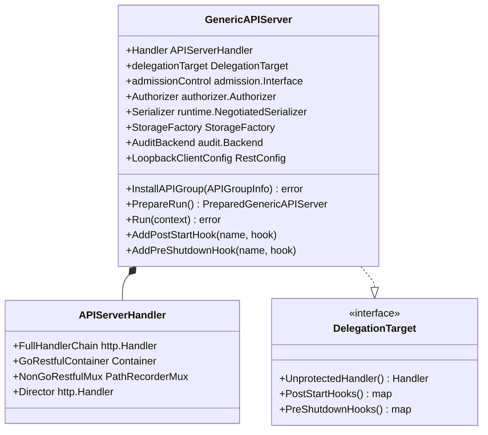

**Responsibilities:**
- HTTP server management
- Handler chain construction
- API group installation
- Lifecycle hook management
- Health check endpoints

**File**: `staging/src/k8s.io/apiserver/pkg/server/genericapiserver.go` (1,086 lines)

---

### 2. Handler Chain

**Purpose**: Process every request through a pipeline of filters.

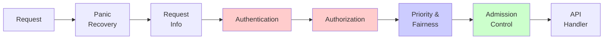

**24 Filters Total** (abbreviated above):

| Filter | Layer | Purpose |
|--------|-------|---------|
| Panic Recovery | Infrastructure | Catch panics, return 500 |
| Request Info | Routing | Extract verb, resource, namespace |
| **Authentication** | **Security** | **Verify identity** |
| Impersonation | Security | Support user impersonation |
| **Authorization** | **Security** | **Check permissions** |
| Audit | Observability | Log operations |
| **Priority & Fairness** | **Stability** | **Rate limiting** |
| **Admission** | **Validation** | **Validate/mutate** |
| Timeout | Infrastructure | Request deadline |
| CORS | HTTP | CORS headers |

**Builder**: `staging/src/k8s.io/apiserver/pkg/server/config.go:1014-1091`

---

### 3. Authentication System

**Purpose**: Verify requester identity.

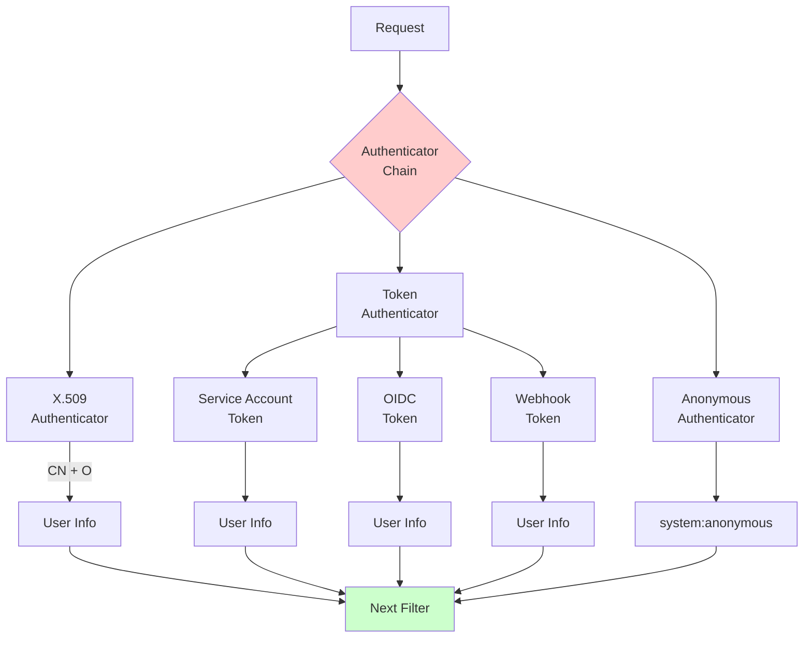

**Components:**

| Component | Purpose | Implementation |
|-----------|---------|----------------|
| **Authenticator Interface** | Base interface | `staging/src/k8s.io/apiserver/pkg/authentication/authenticator/interfaces.go` |
| **Request Authenticator** | HTTP request auth | `staging/src/k8s.io/apiserver/pkg/authentication/request/` |
| **Token Authenticators** | Bearer token auth | `staging/src/k8s.io/apiserver/pkg/authentication/token/` |
| **Authenticator Factory** | Build chain | `staging/src/k8s.io/apiserver/pkg/authentication/authenticatorfactory/` |

**User Info Structure:**
```go
type Info interface {
    GetName() string
    GetUID() string
    GetGroups() []string
    GetExtra() map[string][]string
}
```

---

### 4. Authorization System

**Purpose**: Determine if user has permission for operation.

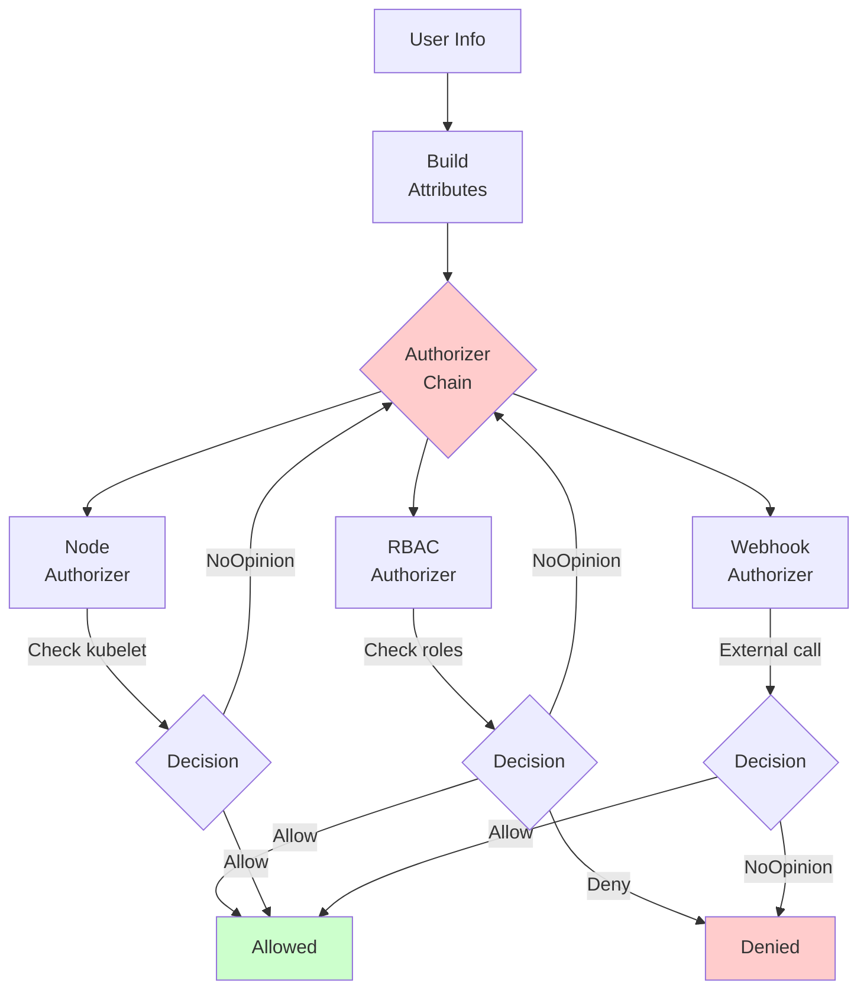

**Components:**

| Component | Purpose | Implementation |
|-----------|---------|----------------|
| **Authorizer Interface** | Base interface | `staging/src/k8s.io/apiserver/pkg/authorization/authorizer/interfaces.go` |
| **RBAC Authorizer** | Role-based authz | Via informers on Roles/RoleBindings |
| **Node Authorizer** | Kubelet-specific | Restricts kubelet access |
| **Webhook Authorizer** | External authz | POST to webhook |
| **Authorizer Factory** | Build chain | `staging/src/k8s.io/apiserver/pkg/authorization/authorizerfactory/` |

**Attributes Structure:**
```go
type Attributes interface {
    GetUser() user.Info
    GetVerb() string              // get, list, create, update, delete, watch
    GetNamespace() string
    GetResource() string
    GetSubresource() string
    GetName() string
    GetAPIGroup() string
    GetAPIVersion() string
}
```

---

### 5. Admission Control System

**Purpose**: Validate and mutate requests.

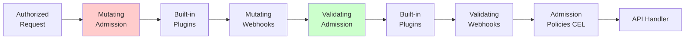

**Key Built-in Plugins:**

| Plugin | Type | Purpose |
|--------|------|---------|
| NamespaceLifecycle | Both | Prevent ops in terminating namespaces |
| LimitRanger | Validating | Enforce LimitRange constraints |
| ServiceAccount | Mutating | Inject SA tokens |
| DefaultStorageClass | Mutating | Set default StorageClass |
| ResourceQuota | Validating | Enforce quotas |
| PodSecurity | Validating | Enforce Pod Security Standards |
| MutatingAdmissionWebhook | Mutating | Call external webhooks |
| ValidatingAdmissionWebhook | Validating | Call external webhooks |

**Implementation**: `staging/src/k8s.io/apiserver/pkg/admission/`

---

### 6. Generic Registry

**Purpose**: Implement CRUD operations for resources using Strategy pattern.

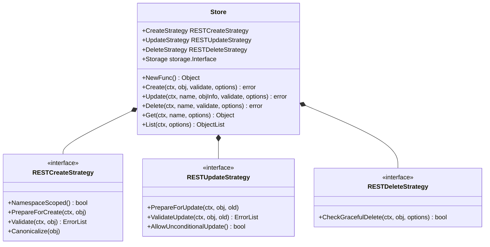

**Example - Pod Strategy:**

```go
// File: pkg/registry/core/pod/strategy.go
type podStrategy struct {
    runtime.ObjectTyper
    names.NameGenerator
}

var Strategy = podStrategy{legacyscheme.Scheme, names.SimpleNameGenerator}

func (podStrategy) PrepareForCreate(ctx context.Context, obj runtime.Object) {
    pod := obj.(*api.Pod)
    pod.Status = api.PodStatus{Phase: api.PodPending}
    pod.Generation = 1
    // ... more preparation
}

func (podStrategy) Validate(ctx context.Context, obj runtime.Object) field.ErrorList {
    pod := obj.(*api.Pod)
    return validation.ValidatePod(pod)
}
```

**File**: `pkg/registry/generic/registry/store.go`

---

### 7. Storage Layer

**Purpose**: Abstract etcd access and provide caching.

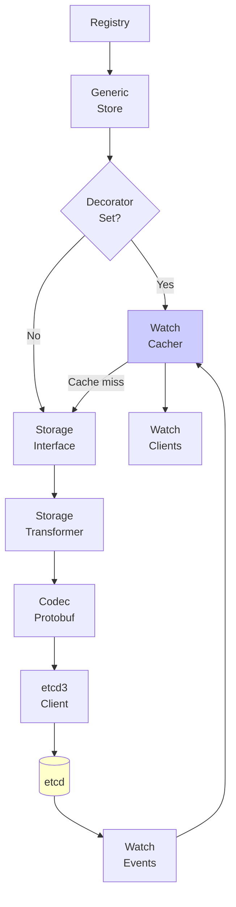

**Components:**

| Component | Purpose | Implementation |
|-----------|---------|----------------|
| **Storage Interface** | Storage abstraction | `staging/src/k8s.io/apiserver/pkg/storage/interfaces.go` |
| **etcd3 Store** | etcd implementation | `staging/src/k8s.io/apiserver/pkg/storage/etcd3/store.go` |
| **Cacher** | Watch cache | `staging/src/k8s.io/apiserver/pkg/storage/cacher/cacher.go` |
| **Transformer** | Encryption/compression | `staging/src/k8s.io/apiserver/pkg/storage/value/` |

**Storage Operations:**
```go
type Interface interface {
    Create(ctx, key, obj, out, ttl) error
    Get(ctx, key, opts, out) error
    List(ctx, key, opts, listObj) error
    GuaranteedUpdate(ctx, key, out, ignoreNotFound, preconditions, updater) error
    Delete(ctx, key, out, preconditions, validateDeletion) error
    Watch(ctx, key, opts) (watch.Interface, error)
}
```

---

### 8. Watch Cache (Cacher)

**Purpose**: Efficiently serve watch requests from memory.

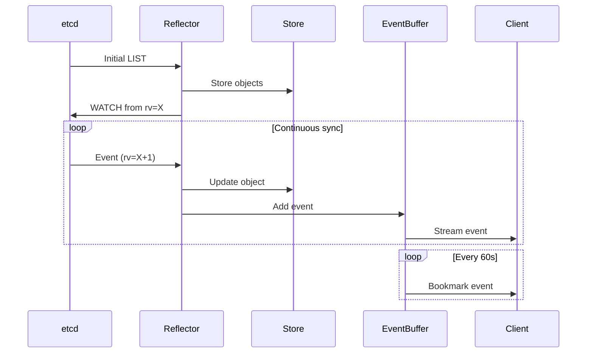

**Key Features:**
- **In-memory storage** of recent objects
- **Ring buffer** of recent events
- **Bookmark events** every 60 seconds
- **Fall-through** to etcd if cache miss

**Configuration:**
```go
type Config struct {
    Storage storage.Interface              // Underlying etcd storage
    Versioner storage.Versioner            // Resource version mapper
    ResourcePrefix string                  // etcd key prefix
    EventsHistoryWindow time.Duration      // Event retention (75s default)
}
```

**File**: `staging/src/k8s.io/apiserver/pkg/storage/cacher/cacher.go`

---

### 9. API Priority and Fairness (APF)

**Purpose**: Prevent API server overload through fair queuing.

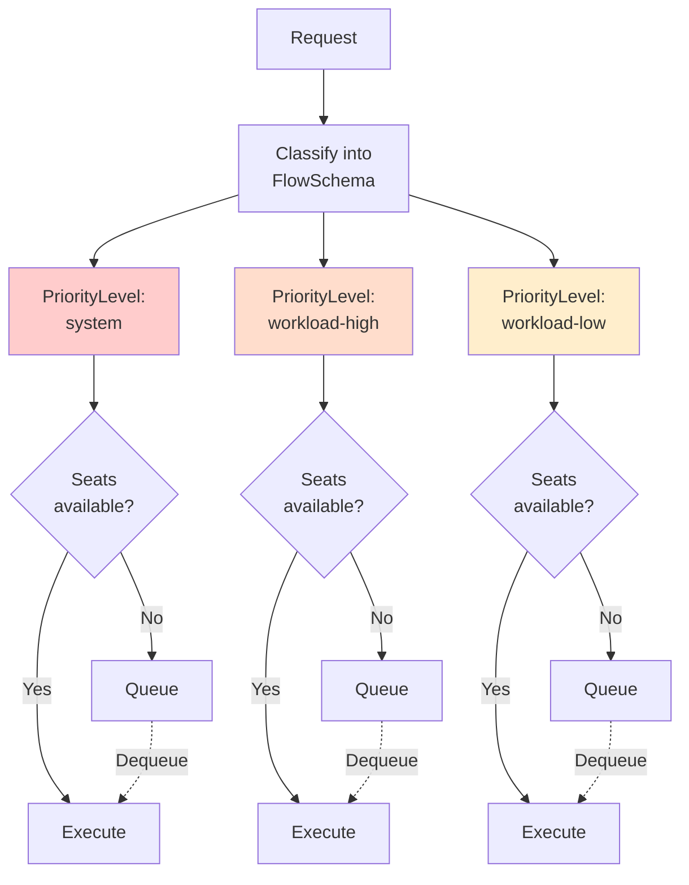

**Components:**

| Component | Purpose |
|-----------|---------|
| **FlowSchema** | Classifies requests (user, resource, verb) |
| **PriorityLevel** | Defines concurrency limits and queuing |
| **WorkEstimator** | Estimates request cost |
| **Queue** | Fair queuing discipline |

**Default Priority Levels:**
- **exempt**: Unlimited (health checks)
- **system**: 30 seats
- **leader-election**: 10 seats
- **workload-high**: 40 seats
- **workload-low**: 100 seats
- **global-default**: 20 seats (catch-all)

**File**: `staging/src/k8s.io/apiserver/pkg/util/flowcontrol/`

---

### 10. OpenAPI & Discovery

**Purpose**: Enable API discovery and schema generation.

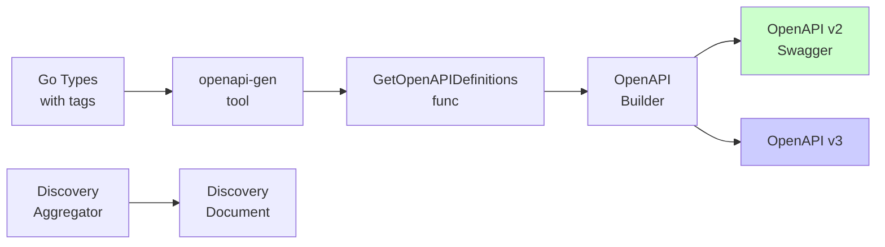

**Endpoints:**

| Endpoint | Purpose | Format |
|----------|---------|--------|
| `/openapi/v2` | OpenAPI v2 spec | JSON |
| `/openapi/v3` | OpenAPI v3 spec | JSON |
| `/api` | Core API discovery | JSON |
| `/apis` | API groups discovery | JSON |
| `/apis/{group}/{version}` | Resource discovery | JSON |

**Generated from code:**
```go
// +k8s:openapi-gen=true
type PodSpec struct {
    // Containers is a list of containers belonging to the pod.
    // +listType=map
    // +listMapKey=name
    Containers []Container `json:"containers"`
}
```

**Implementation**: `staging/src/k8s.io/apiserver/pkg/endpoints/openapi/`

---

### 11. Audit System

**Purpose**: Log all API operations for security and compliance.

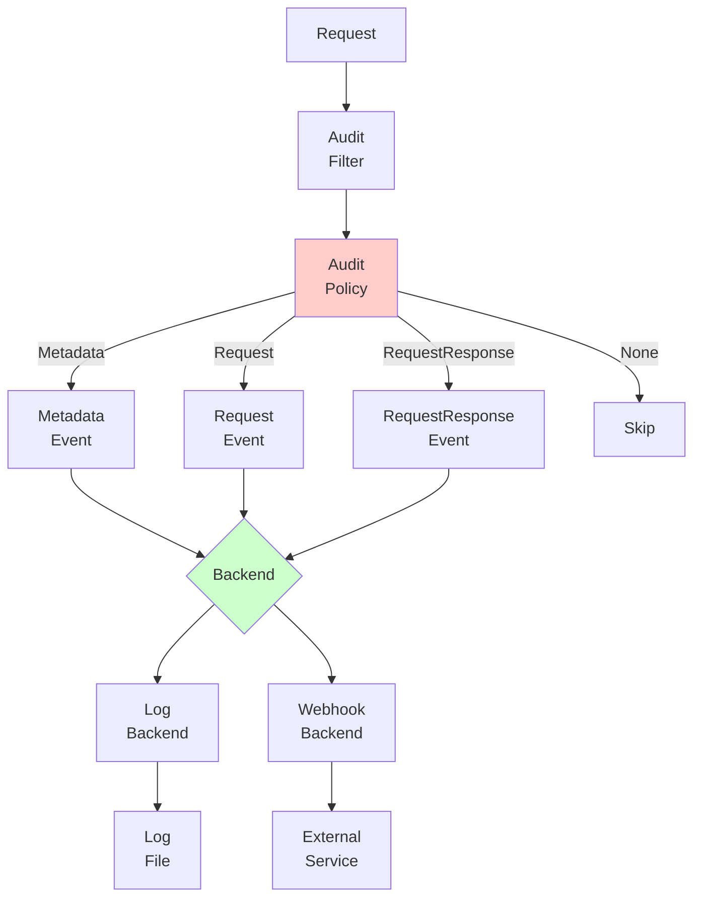

**Event Levels:**
- **None**: Don't log
- **Metadata**: Log metadata only (user, resource, verb)
- **Request**: Log metadata + request body
- **RequestResponse**: Log metadata + request + response

**Event Stages:**
- **RequestReceived**: Request entered API server
- **ResponseStarted**: Response headers sent
- **ResponseComplete**: Response body sent
- **Panic**: Request caused panic

**Implementation**: `staging/src/k8s.io/apiserver/pkg/audit/`

---

## Component Interactions

### Request Processing Flow

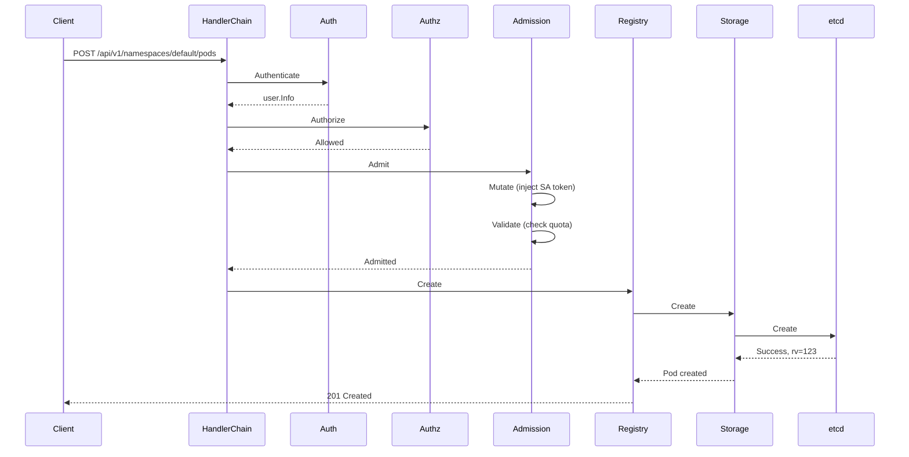

---

## Data Flow Through Components

### Write Operation (CREATE)

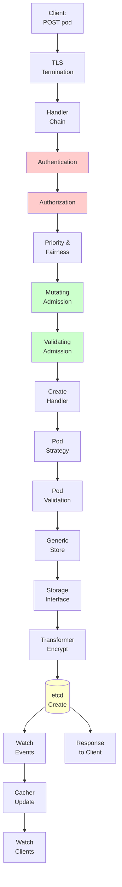

### Read Operation (GET)

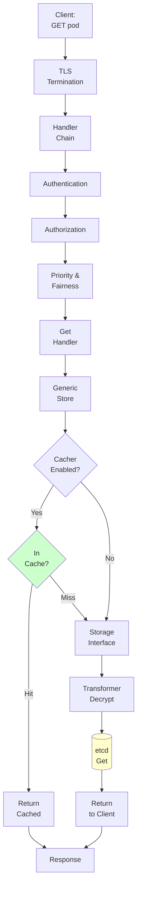

### Watch Operation

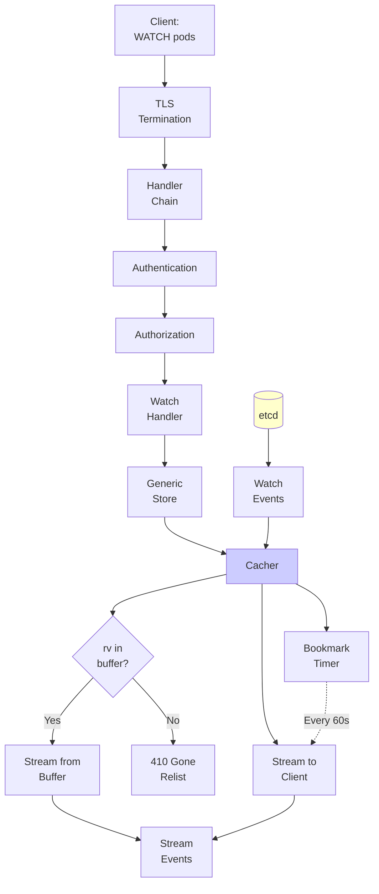

---

## Component Dependencies

### Dependency Graph

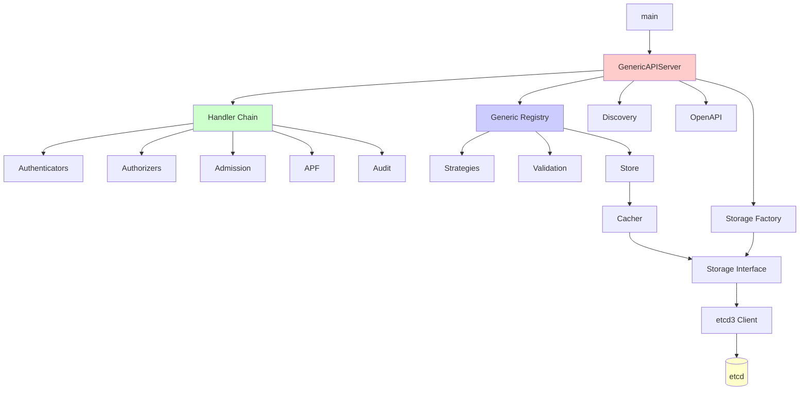

---

## Summary

The kube-apiserver is composed of **11 major subsystems**:

1. **GenericAPIServer** - Base server infrastructure
2. **Handler Chain** - 24-layer request processing pipeline
3. **Authentication** - Multi-strategy identity verification
4. **Authorization** - Permission checking (RBAC, Node, Webhook)
5. **Admission Control** - Request validation and mutation
6. **Generic Registry** - CRUD operations with Strategy pattern
7. **Storage Layer** - etcd abstraction
8. **Watch Cache** - Efficient real-time notifications
9. **API Priority & Fairness** - Fair queuing and rate limiting
10. **OpenAPI & Discovery** - API schema and discovery
11. **Audit System** - Operation logging

**Key Characteristics:**
- **Modular**: Each component has clear responsibility
- **Composable**: Components work together via interfaces
- **Extensible**: Pluggable authenticators, authorizers, admission
- **Performant**: Watch cache, protobuf, APF
- **Observable**: Audit logging, metrics, tracing

**Next Steps:**
- Dive into [Middle-Level Architecture](../middle-level/) for component details
- Explore [Low-Level Technical Specs](../low-level/) for implementation details
- View [Diagrams](../diagrams/) for visual architecture

---

**Code References:**
- GenericAPIServer: `staging/src/k8s.io/apiserver/pkg/server/genericapiserver.go`
- Handler Chain: `staging/src/k8s.io/apiserver/pkg/server/config.go:1014-1091`
- Generic Registry: `pkg/registry/generic/registry/store.go`
- Watch Cache: `staging/src/k8s.io/apiserver/pkg/storage/cacher/cacher.go`
- APF: `staging/src/k8s.io/apiserver/pkg/util/flowcontrol/`
