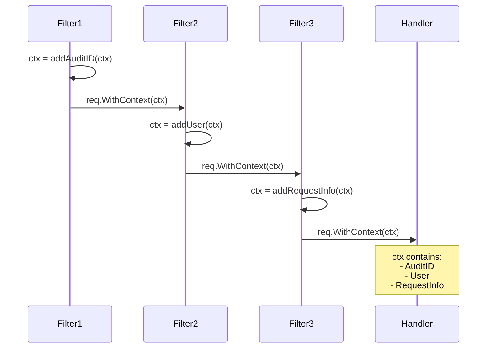

# Handler Chain Construction

> **Low-Level Technical Specification**
> Deep dive into the 24-filter HTTP handler chain that processes every API server request.

---

## Table of Contents

- [Overview](#overview)
- [Handler Chain Architecture](#handler-chain-architecture)
- [Filter Construction Order](#filter-construction-order)
- [Individual Filter Details](#individual-filter-details)
- [Filter Interfaces](#filter-interfaces)
- [Context Propagation](#context-propagation)
- [Error Handling](#error-handling)
- [Code References](#code-references)

---

## Overview

Every request to kube-apiserver passes through a **handler chain** of 24 HTTP filters before reaching the actual API handler. This chain implements cross-cutting concerns like authentication, authorization, and rate limiting.

### Chain Pattern

```mermaid
graph LR
    Request[HTTP Request] --> F1[Filter 1]
    F1 --> F2[Filter 2]
    F2 --> F3[Filter 3]
    F3 --> Dots[...]
    Dots --> F24[Filter 24]
    F24 --> Handler[API Handler]

    Handler --> R24[Filter 24]
    R24 --> RDots[...]
    RDots --> R2[Filter 2]
    R2 --> R1[Filter 1]
    R1 --> Response[HTTP Response]

    style F1 fill:#e1f5ff
    style Handler fill:#fff4e1
```



**File Location**: `staging/src/k8s.io/apiserver/pkg/server/config.go:1014-1091`

---

## Handler Chain Architecture

### Complete Chain

```go
// staging/src/k8s.io/apiserver/pkg/server/config.go:1014-1091

func DefaultBuildHandlerChain(apiHandler http.Handler, c *Config) http.Handler {
    handler := apiHandler

    // 24. Request info (innermost, closest to API handler)
    handler = genericapifilters.WithRequestInfo(handler, c.RequestInfoResolver)

    // 23. Panic recovery for audit
    handler = genericapifilters.WithPanicRecovery(handler, c.RequestInfoResolver)

    // 22. Latency tracking
    handler = genericfilters.WithLatencyTrackers(handler)

    // 21. Request deadline
    handler = genericfilters.WithRequestDeadline(handler, c.AuditBackend, c.AuditPolicyRuleEvaluator,
        c.LongRunningFunc, c.Serializer, c.HandlerChainWaitGroup)

    // 20. Wait group (graceful shutdown)
    handler = genericfilters.WithWaitGroup(handler, c.LongRunningFunc, c.HandlerChainWaitGroup)

    // 19. Tracing
    if c.TracerProvider != nil {
        handler = genericapifilters.WithTracing(handler, c.TracerProvider)
    }

    // 18. Audit
    handler = genericapifilters.WithAudit(handler, c.AuditBackend, c.AuditPolicyRuleEvaluator, c.LongRunningFunc)

    // 17. Admission
    if c.FlowControl != nil {
        handler = genericfilters.WithPriorityAndFairness(handler, c.LongRunningFunc, c.FlowControl, c.WorkEstimator)
    }

    // 16. Authorization
    handler = genericapifilters.WithAuthorization(handler, c.Authorization.Authorizer, c.Serializer)

    // 15. Audit (response started)
    handler = genericapifilters.WithAudit(handler, c.AuditBackend, c.AuditPolicyRuleEvaluator, c.LongRunningFunc)

    // 14. Impersonation
    handler = genericapifilters.WithImpersonation(handler, c.Authorization.Authorizer, c.Serializer)

    // 13. Authentication
    handler = genericapifilters.WithAuthentication(handler, c.Authentication.Authenticator, failed, c.Authentication.APIAudiences, c.Authentication.RequestHeaderConfig)

    // 12. CORS
    handler = genericfilters.WithCORS(handler, c.CorsAllowedOriginList, nil, nil, nil, "true")

    // 11. Timeout
    handler = genericfilters.WithTimeoutForNonLongRunningRequests(handler, c.LongRunningFunc)

    // 10. Max-in-flight limit
    handler = genericfilters.WithMaxInFlightLimit(handler, c.MaxRequestsInFlight, c.MaxMutatingRequestsInFlight, c.LongRunningFunc)

    // 9. Cache headers
    handler = genericapifilters.WithCacheControl(handler)

    // 8. Request info (outer)
    handler = genericapifilters.WithRequestInfo(handler, c.RequestInfoResolver)

    // 7. HTTP logging
    handler = genericapifilters.WithHTTPLogging(handler)

    // 6. Panic recovery (outer)
    handler = genericfilters.WithPanicRecovery(handler, c.RequestInfoResolver)

    // 5. HSTS
    if c.HSTSDirectives != nil {
        handler = genericfilters.WithHSTS(handler, c.HSTSDirectives)
    }

    // 4. Warning header trimming
    handler = genericapifilters.WithWarningRecorder(handler)

    // 3. Request received timestamp
    handler = genericapifilters.WithRequestReceivedTimestamp(handler)

    // 2. Audit init
    handler = genericapifilters.WithAuditInit(handler)

    // 1. Panic recovery (outermost)
    handler = genericfilters.WithPanicRecovery(handler, c.RequestInfoResolver)

    return handler
}
```

### Visualization

```mermaid
flowchart TD
    Start([HTTP Request]) --> F1[1. Panic Recovery Outer]
    F1 --> F2[2. Audit Init]
    F2 --> F3[3. Request Timestamp]
    F3 --> F4[4. Warning Recorder]
    F4 --> F5[5. HSTS]
    F5 --> F6[6. Panic Recovery Mid]
    F6 --> F7[7. HTTP Logging]
    F7 --> F8[8. Request Info Outer]
    F8 --> F9[9. Cache Control]
    F9 --> F10[10. Max In Flight]
    F10 --> F11[11. Timeout]
    F11 --> F12[12. CORS]
    F12 --> F13[13. Authentication]
    F13 --> F14[14. Impersonation]
    F14 --> F15[15. Audit Response]
    F15 --> F16[16. Authorization]
    F16 --> F17[17. Priority & Fairness]
    F17 --> F18[18. Audit]
    F18 --> F19[19. Tracing]
    F19 --> F20[20. Wait Group]
    F20 --> F21[21. Request Deadline]
    F21 --> F22[22. Latency Tracking]
    F22 --> F23[23. Panic Recovery Inner]
    F23 --> F24[24. Request Info Inner]
    F24 --> Handler[API Handler]

    style F13 fill:#e1f5ff
    style F16 fill:#fff4e1
    style F17 fill:#e8f5e9
    style Handler fill:#fce4ec
```



---

## Filter Construction Order

### Layer Groups

| Layer | Filters | Purpose |
|-------|---------|---------|
| **Infrastructure** (1-12) | Panic, logging, CORS, limits | Request infrastructure |
| **Security** (13-16) | Auth, authz, impersonation | Access control |
| **Flow Control** (17) | APF | Rate limiting |
| **Observability** (18-23) | Audit, tracing, metrics | Monitoring |
| **Request Info** (24) | Request parsing | Context preparation |

---

## Individual Filter Details

### 1. Panic Recovery (Outer)

**Purpose**: Catch panics and return 500 Internal Server Error

```go
// staging/src/k8s.io/apiserver/pkg/server/filters/wrap.go:40-80

func WithPanicRecovery(handler http.Handler, resolver request.RequestInfoResolver) http.Handler {
    return http.HandlerFunc(func(w http.ResponseWriter, req *http.Request) {
        defer func() {
            if err := recover(); err != nil {
                http.Error(w, "Internal server error", http.StatusInternalServerError)

                // Log the panic
                stack := debug.Stack()
                klog.ErrorS(nil, "Recovered from panic",
                    "url", req.URL.Path,
                    "error", err,
                    "stack", string(stack))
            }
        }()

        handler.ServeHTTP(w, req)
    })
}
```

### 2. Audit Init

**Purpose**: Initialize audit event ID

```go
// staging/src/k8s.io/apiserver/pkg/endpoints/filters/audit.go:100-130

func WithAuditInit(handler http.Handler) http.Handler {
    return http.HandlerFunc(func(w http.ResponseWriter, req *http.Request) {
        // Generate unique audit ID
        auditID := uuid.New()

        // Store in context
        ctx := request.WithAuditID(req.Context(), auditID)
        req = req.WithContext(ctx)

        handler.ServeHTTP(w, req)
    })
}
```

### 3. Request Received Timestamp

**Purpose**: Record when request was received

```go
func WithRequestReceivedTimestamp(handler http.Handler) http.Handler {
    return http.HandlerFunc(func(w http.ResponseWriter, req *http.Request) {
        ctx := request.WithReceivedTimestamp(req.Context(), time.Now())
        req = req.WithContext(ctx)

        handler.ServeHTTP(w, req)
    })
}
```

### 7. HTTP Logging

**Purpose**: Log HTTP requests

```go
// staging/src/k8s.io/apiserver/pkg/endpoints/filters/httplog.go:50-100

func WithHTTPLogging(handler http.Handler) http.Handler {
    return http.HandlerFunc(func(w http.ResponseWriter, req *http.Request) {
        // Create response writer wrapper to capture status code
        respLogger := &respLogger{
            ResponseWriter: w,
            statusCode:     http.StatusOK,
        }

        // Log request
        startTime := time.Now()
        handler.ServeHTTP(respLogger, req)

        // Log response
        latency := time.Since(startTime)
        klog.InfoS("HTTP",
            "verb", req.Method,
            "URI", req.RequestURI,
            "latency", latency,
            "resp", respLogger.statusCode)
    })
}
```

### 10. Max In Flight Limit

**Purpose**: Limit concurrent requests

```go
// staging/src/k8s.io/apiserver/pkg/server/filters/maxinflight.go:80-150

func WithMaxInFlightLimit(
    handler http.Handler,
    nonMutatingLimit int,
    mutatingLimit int,
    longRunningRequestCheck apirequest.LongRunningRequestCheck,
) http.Handler {

    // Semaphores for rate limiting
    nonMutatingChan := make(chan bool, nonMutatingLimit)
    mutatingChan := make(chan bool, mutatingLimit)

    return http.HandlerFunc(func(w http.ResponseWriter, req *http.Request) {
        ctx := req.Context()
        requestInfo, _ := apirequest.RequestInfoFrom(ctx)

        // Long-running requests bypass limit
        if longRunningRequestCheck != nil && longRunningRequestCheck(req, requestInfo) {
            handler.ServeHTTP(w, req)
            return
        }

        // Select appropriate semaphore
        var c chan bool
        if !requestInfo.IsResourceRequest || requestInfo.Verb == "get" || requestInfo.Verb == "list" || requestInfo.Verb == "watch" {
            c = nonMutatingChan
        } else {
            c = mutatingChan
        }

        select {
        case c <- true:
            defer func() { <-c }()
            handler.ServeHTTP(w, req)
        default:
            // Too many requests
            tooManyRequests(req, w)
        }
    })
}
```

### 13. Authentication

**Purpose**: Authenticate the request

```go
// staging/src/k8s.io/apiserver/pkg/endpoints/filters/authentication.go:45-120

func WithAuthentication(handler http.Handler, auth authenticator.Request, failed http.Handler, apiAuds authenticator.Audiences, requestHeaderConfig *authenticatorfactory.RequestHeaderConfig) http.Handler {
    return http.HandlerFunc(func(w http.ResponseWriter, req *http.Request) {
        // Add API audiences to context
        if len(apiAuds) > 0 {
            req = req.WithContext(authenticator.WithAudiences(req.Context(), apiAuds))
        }

        // Authenticate request
        resp, ok, err := auth.AuthenticateRequest(req)

        if err != nil || !ok {
            if err != nil {
                klog.ErrorS(err, "Unable to authenticate request")
            }
            failed.ServeHTTP(w, req)
            return
        }

        // Store user in context
        req = req.WithContext(genericapirequest.WithUser(req.Context(), resp.User))

        handler.ServeHTTP(w, req)
    })
}
```

### 16. Authorization

**Purpose**: Authorize the request

```go
// staging/src/k8s.io/apiserver/pkg/endpoints/filters/authorization.go:50-120

func WithAuthorization(handler http.Handler, a authorizer.Authorizer, s runtime.NegotiatedSerializer) http.Handler {
    return http.HandlerFunc(func(w http.ResponseWriter, req *http.Request) {
        ctx := req.Context()

        // Get authenticated user
        user, ok := genericapirequest.UserFrom(ctx)
        if !ok {
            responsewriters.InternalError(w, req, errors.New("no user found"))
            return
        }

        // Get request info
        requestInfo, ok := genericapirequest.RequestInfoFrom(ctx)
        if !ok {
            responsewriters.InternalError(w, req, errors.New("no request info"))
            return
        }

        // Build authorization attributes
        attrs := authorizer.AttributesRecord{
            User:            user,
            Verb:            requestInfo.Verb,
            Namespace:       requestInfo.Namespace,
            APIGroup:        requestInfo.APIGroup,
            APIVersion:      requestInfo.APIVersion,
            Resource:        requestInfo.Resource,
            Subresource:     requestInfo.Subresource,
            Name:            requestInfo.Name,
            ResourceRequest: requestInfo.IsResourceRequest,
            Path:            requestInfo.Path,
        }

        // Authorize
        decision, reason, err := a.Authorize(ctx, attrs)

        if decision != authorizer.DecisionAllow {
            responsewriters.Forbidden(ctx, attrs, w, req, reason, s)
            return
        }

        handler.ServeHTTP(w, req)
    })
}
```

### 17. Priority and Fairness

**Purpose**: Apply flow control

```go
// staging/src/k8s.io/apiserver/pkg/server/filters/priority-and-fairness.go:80-200

func WithPriorityAndFairness(
    handler http.Handler,
    longRunningRequestCheck apirequest.LongRunningRequestCheck,
    fcIfc utilflowcontrol.Interface,
    workEstimator flowcontrolrequest.WorkEstimatorFunc,
) http.Handler {
    return http.HandlerFunc(func(w http.ResponseWriter, req *http.Request) {
        ctx := req.Context()
        requestInfo, _ := apirequest.RequestInfoFrom(ctx)

        // Long-running requests bypass APF
        if longRunningRequestCheck != nil && longRunningRequestCheck(req, requestInfo) {
            handler.ServeHTTP(w, req)
            return
        }

        // Classify request (determine FlowSchema and PriorityLevel)
        classification := fcIfc.Handle(ctx, requestInfo)

        // Estimate work
        workEstimate := workEstimator(req, requestInfo)

        // Try to get seat
        ctx, cancel, err := classification.StartRequest(ctx, workEstimate)
        if err != nil {
            // Request rejected (429 Too Many Requests)
            responsewriters.TooManyRequests(req, w, "priority and fairness")
            return
        }
        defer cancel()

        // Update context
        req = req.WithContext(ctx)

        handler.ServeHTTP(w, req)
    })
}
```

---

## Filter Interfaces

### Standard HTTP Handler

All filters implement the standard `http.Handler` interface:

```go
type Handler interface {
    ServeHTTP(ResponseWriter, *Request)
}
```

### Filter Function Signature

Filters are constructed using a wrapper pattern:

```go
type FilterFunc func(http.Handler) http.Handler
```

### Example Filter Implementation

```go
func WithCustomFilter(handler http.Handler, config *Config) http.Handler {
    return http.HandlerFunc(func(w http.ResponseWriter, req *http.Request) {
        // Pre-processing
        ctx := req.Context()

        // Do something before calling next handler
        enrichedCtx := addCustomData(ctx)
        req = req.WithContext(enrichedCtx)

        // Call next handler
        handler.ServeHTTP(w, req)

        // Post-processing (optional)
        // Note: Response may already be written
    })
}
```

---

## Context Propagation

### Request Context Flow



### Context Keys

```go
// Key types for context values
type requestInfoKey struct{}
type userKey struct{}
type auditIDKey struct{}
type receivedTimestampKey struct{}

// Store in context
ctx = context.WithValue(ctx, requestInfoKey{}, requestInfo)

// Retrieve from context
requestInfo, ok := ctx.Value(requestInfoKey{}).(*RequestInfo)
```

### Helper Functions

```go
// staging/src/k8s.io/apiserver/pkg/endpoints/request/context.go

func WithUser(ctx context.Context, user user.Info) context.Context {
    return context.WithValue(ctx, userKey{}, user)
}

func UserFrom(ctx context.Context) (user.Info, bool) {
    user, ok := ctx.Value(userKey{}).(user.Info)
    return user, ok
}

func WithRequestInfo(ctx context.Context, info *RequestInfo) context.Context {
    return context.WithValue(ctx, requestInfoKey{}, info)
}

func RequestInfoFrom(ctx context.Context) (*RequestInfo, bool) {
    info, ok := ctx.Value(requestInfoKey{}).(*RequestInfo)
    return info, ok
}
```

---

## Error Handling

### Response Writers

```go
// staging/src/k8s.io/apiserver/pkg/endpoints/handlers/responsewriters/errors.go

// 401 Unauthorized
func Unauthorized(ctx context.Context, w http.ResponseWriter, req *http.Request, reason string, s runtime.NegotiatedSerializer) {
    gv := schema.GroupVersion{Group: "", Version: "v1"}
    responsewriters.ErrorNegotiated(
        apierrors.NewUnauthorized(reason),
        s, gv, w, req,
    )
}

// 403 Forbidden
func Forbidden(ctx context.Context, attributes authorizer.Attributes, w http.ResponseWriter, req *http.Request, reason string, s runtime.NegotiatedSerializer) {
    msg := fmt.Sprintf("forbidden: %s", reason)
    responsewriters.ErrorNegotiated(
        apierrors.NewForbidden(attributes.GetResource(), attributes.GetName(), errors.New(msg)),
        s, schema.GroupVersion{}, w, req,
    )
}

// 429 Too Many Requests
func TooManyRequests(req *http.Request, w http.ResponseWriter, retryAfter string) {
    w.Header().Set("Retry-After", retryAfter)
    http.Error(w, "Too Many Requests", http.StatusTooManyRequests)
}

// 500 Internal Server Error
func InternalError(w http.ResponseWriter, req *http.Request, err error) {
    klog.ErrorS(err, "Internal server error")
    http.Error(w, "Internal Server Error", http.StatusInternalServerError)
}
```

### Short-Circuit on Error

Most filters short-circuit the chain on error:

```go
func WithAuth(handler http.Handler, auth Authenticator) http.Handler {
    return http.HandlerFunc(func(w http.ResponseWriter, req *http.Request) {
        user, ok, err := auth.Authenticate(req)

        if !ok || err != nil {
            // Short-circuit: don't call handler
            Unauthorized(w, req, "authentication failed")
            return  // Chain stops here
        }

        // Success: continue chain
        req = req.WithContext(WithUser(req.Context(), user))
        handler.ServeHTTP(w, req)
    })
}
```

---

## Code References

### Key Files

| Component | File | Description |
|-----------|------|-------------|
| **Chain Construction** | `staging/src/k8s.io/apiserver/pkg/server/config.go` | DefaultBuildHandlerChain (lines 1014-1091) |
| **Authentication Filter** | `staging/src/k8s.io/apiserver/pkg/endpoints/filters/authentication.go` | WithAuthentication |
| **Authorization Filter** | `staging/src/k8s.io/apiserver/pkg/endpoints/filters/authorization.go` | WithAuthorization |
| **APF Filter** | `staging/src/k8s.io/apiserver/pkg/server/filters/priority-and-fairness.go` | WithPriorityAndFairness |
| **Max-in-Flight** | `staging/src/k8s.io/apiserver/pkg/server/filters/maxinflight.go` | WithMaxInFlightLimit |
| **Context Helpers** | `staging/src/k8s.io/apiserver/pkg/endpoints/request/context.go` | Context storage/retrieval |
| **Response Writers** | `staging/src/k8s.io/apiserver/pkg/endpoints/handlers/responsewriters/` | Error responses |

### Key Functions

```go
// Build handler chain
staging/src/k8s.io/apiserver/pkg/server/config.go:1014-1091
func DefaultBuildHandlerChain(apiHandler, c) http.Handler

// Authentication
staging/src/k8s.io/apiserver/pkg/endpoints/filters/authentication.go:45-120
func WithAuthentication(handler, auth, failed, apiAuds, requestHeaderConfig) http.Handler

// Authorization
staging/src/k8s.io/apiserver/pkg/endpoints/filters/authorization.go:50-120
func WithAuthorization(handler, a, s) http.Handler

// Priority and Fairness
staging/src/k8s.io/apiserver/pkg/server/filters/priority-and-fairness.go:80-200
func WithPriorityAndFairness(handler, longRunningRequestCheck, fcIfc, workEstimator) http.Handler

// Max in flight
staging/src/k8s.io/apiserver/pkg/server/filters/maxinflight.go:80-150
func WithMaxInFlightLimit(handler, nonMutatingLimit, mutatingLimit, longRunningRequestCheck) http.Handler
```

---

## Summary

The handler chain provides **layered request processing**:

1. **24 filters** process every request
2. **Ordered execution** - infrastructure → security → observability
3. **Context propagation** - Each filter enriches request context
4. **Short-circuit on error** - Failed filters stop the chain
5. **Standard HTTP interface** - All filters implement http.Handler

**Key Layers**:
- Infrastructure (panic recovery, logging, limits)
- Security (authentication, authorization)
- Flow control (APF rate limiting)
- Observability (audit, tracing, metrics)

**Next Steps**:
- [Registry Pattern](02-registry-pattern.md) - Generic CRUD implementation
- [Request Pipeline](../middle-level/01-request-pipeline.md) - Full request flow
- [Authentication](../middle-level/04-authentication.md) - Auth strategies

---

**Related Documentation**:
- [QUICK-REFERENCE.md](../QUICK-REFERENCE.md#handler-chain) - Handler chain overview
- [Key Components](../high-level/04-key-components.md#handler-chain) - High-level view
