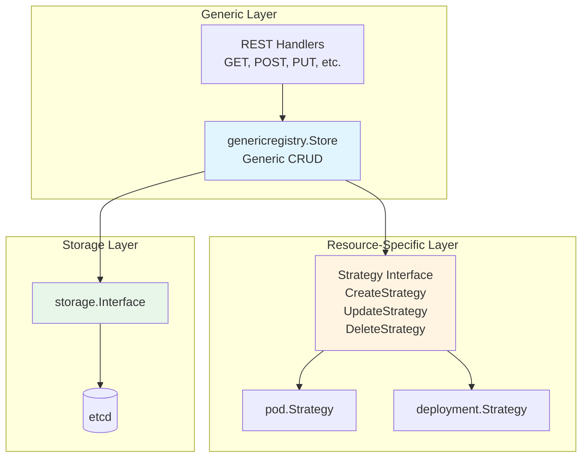

# Generic Registry Pattern

> **Low-Level Technical Specification**
> How Kubernetes implements resource CRUD operations using the strategy pattern and generic registry.

---

## Table of Contents

- [Overview](#overview)
- [Registry Architecture](#registry-architecture)
- [Strategy Pattern](#strategy-pattern)
- [Generic Store Implementation](#generic-store-implementation)
- [REST Handlers](#rest-handlers)
- [Example: Pod Registry](#example-pod-registry)
- [Subresources](#subresources)
- [Code References](#code-references)

---

## Overview

The **Generic Registry** pattern separates **generic CRUD logic** from **resource-specific behavior** using the strategy pattern. This allows Kubernetes to implement consistent REST endpoints for all resources while customizing validation, transformation, and business logic per resource type.

### Key Components



**File Location**: `staging/src/k8s.io/apiserver/pkg/registry/generic/registry/store.go`

---

## Registry Architecture

### Store Structure

```go
// staging/src/k8s.io/apiserver/pkg/registry/generic/registry/store.go:60-150

type Store struct {
    // NewFunc returns an empty object (e.g., &v1.Pod{})
    NewFunc func() runtime.Object

    // NewListFunc returns an empty list object (e.g., &v1.PodList{})
    NewListFunc func() runtime.Object

    // KeyRootFunc returns the root etcd directory for this resource
    KeyRootFunc func(ctx context.Context) string

    // KeyFunc returns the etcd key for a specific object
    KeyFunc func(ctx context.Context, name string) (string, error)

    // DefaultQualifiedResource: resource name for this store
    DefaultQualifiedResource schema.GroupResource

    // CreateStrategy: resource-specific create logic
    CreateStrategy rest.RESTCreateStrategy

    // UpdateStrategy: resource-specific update logic
    UpdateStrategy rest.RESTUpdateStrategy

    // DeleteStrategy: resource-specific delete logic
    DeleteStrategy rest.RESTDeleteStrategy

    // TableConvertor: convert objects to table format (for kubectl)
    TableConvertor rest.TableConvertor

    // Storage: underlying storage interface
    Storage storage.Interface

    // DestroyFunc: cleanup function
    DestroyFunc func()
}
```

### REST Interface Implementation

The Store implements multiple REST interfaces:

```go
// Store implements these interfaces:
type Store struct {
    // Basic CRUD
    rest.Storage              // New()
    rest.Lister              // List()
    rest.Getter              // Get()
    rest.Creater             // Create()
    rest.Updater             // Update()
    rest.GracefulDeleter     // Delete()

    // Additional operations
    rest.CollectionDeleter   // DeleteCollection()
    rest.Watcher             // Watch()
    rest.Exporter            // Export()
}
```

---

## Strategy Pattern

### Strategy Interfaces

```go
// staging/src/k8s.io/apiserver/pkg/registry/rest/create.go

type RESTCreateStrategy interface {
    // Namespaced returns true if object is namespaced
    NamespaceScoped() bool

    // PrepareForCreate is invoked before object creation
    // Use to set defaults, generate names, etc.
    PrepareForCreate(ctx context.Context, obj runtime.Object)

    // Validate validates the object
    Validate(ctx context.Context, obj runtime.Object) field.ErrorList

    // WarningsOnCreate returns warnings for the create operation
    WarningsOnCreate(ctx context.Context, obj runtime.Object) []string

    // Canonicalize allows normalization of object after validation
    Canonicalize(obj runtime.Object)
}

type RESTUpdateStrategy interface {
    NamespaceScoped() bool

    // AllowCreateOnUpdate: can PUT create a new object?
    AllowCreateOnUpdate() bool

    // PrepareForUpdate is invoked before object update
    PrepareForUpdate(ctx context.Context, obj, old runtime.Object)

    // ValidateUpdate validates the update
    ValidateUpdate(ctx context.Context, obj, old runtime.Object) field.ErrorList

    // WarningsOnUpdate returns warnings
    WarningsOnUpdate(ctx context.Context, obj, old runtime.Object) []string

    // AllowUnconditionalUpdate: allow update without resourceVersion?
    AllowUnconditionalUpdate() bool

    // Canonicalize normalizes the object
    Canonicalize(obj runtime.Object)
}

type RESTDeleteStrategy interface {
    NamespaceScoped() bool
}
```

### Example Strategy: Pod

```go
// pkg/registry/core/pod/strategy.go:50-200

type podStrategy struct {
    runtime.ObjectTyper
    names.NameGenerator
}

var Strategy = podStrategy{legacyscheme.Scheme, names.SimpleNameGenerator}

func (podStrategy) NamespaceScoped() bool {
    return true
}

func (podStrategy) PrepareForCreate(ctx context.Context, obj runtime.Object) {
    pod := obj.(*api.Pod)

    // Generate pod name if not specified
    if len(pod.Name) == 0 {
        pod.Name = pod.GenerateName + "-" + rand.String(5)
    }

    // Set default values
    if len(pod.Spec.DNSPolicy) == 0 {
        pod.Spec.DNSPolicy = api.DNSClusterFirst
    }

    // Drop disabled fields
    dropDisabledFields(pod, nil)

    // Set NodeName to empty (scheduler will set it)
    pod.Spec.NodeName = ""

    // Initialize status
    pod.Status = api.PodStatus{
        Phase: api.PodPending,
        QOSClass: qos.GetPodQOS(pod),
    }
}

func (podStrategy) Validate(ctx context.Context, obj runtime.Object) field.ErrorList {
    pod := obj.(*api.Pod)
    allErrs := validation.ValidatePodCreate(pod)
    return allErrs
}

func (podStrategy) Canonicalize(obj runtime.Object) {
    pod := obj.(*api.Pod)

    // Sort containers by name for deterministic output
    sort.Slice(pod.Spec.Containers, func(i, j int) bool {
        return pod.Spec.Containers[i].Name < pod.Spec.Containers[j].Name
    })
}

func (podStrategy) AllowCreateOnUpdate() bool {
    return false  // Don't allow creating pods via PUT
}

func (podStrategy) PrepareForUpdate(ctx context.Context, obj, old runtime.Object) {
    newPod := obj.(*api.Pod)
    oldPod := old.(*api.Pod)

    // Preserve status (updated via /status subresource)
    newPod.Status = oldPod.Status

    // Drop disabled fields
    dropDisabledFields(newPod, oldPod)
}

func (podStrategy) ValidateUpdate(ctx context.Context, obj, old runtime.Object) field.ErrorList {
    newPod := obj.(*api.Pod)
    oldPod := old.(*api.Pod)
    return validation.ValidatePodUpdate(newPod, oldPod)
}

func (podStrategy) AllowUnconditionalUpdate() bool {
    return true  // Allow update without resourceVersion (for compatibility)
}
```

**File**: `pkg/registry/core/pod/strategy.go`

---

## Generic Store Implementation

### Create Operation

```go
// staging/src/k8s.io/apiserver/pkg/registry/generic/registry/store.go:300-400

func (e *Store) Create(ctx context.Context, obj runtime.Object, createValidation rest.ValidateObjectFunc, options *metav1.CreateOptions) (runtime.Object, error) {
    // 1. Extract name and namespace
    name, err := e.ObjectNameFunc(obj)
    namespace := genericapirequest.NamespaceValue(ctx)

    // 2. Invoke strategy PrepareForCreate
    e.CreateStrategy.PrepareForCreate(ctx, obj)

    // 3. Validate object
    if err := rest.BeforeCreate(e.CreateStrategy, ctx, obj); err != nil {
        return nil, err
    }

    // 4. Run custom validation
    if createValidation != nil {
        if err := createValidation(ctx, obj.DeepCopyObject()); err != nil {
            return nil, err
        }
    }

    // 5. Get etcd key
    key, err := e.KeyFunc(ctx, name)

    // 6. Set resource version to 0 (new object)
    if err := e.Storage.Versioner().UpdateObject(obj, 0); err != nil {
        return nil, err
    }

    // 7. Create in storage
    out := e.NewFunc()
    ttl, err := e.calculateTTL(obj, 0, false)

    if err := e.Storage.Create(ctx, key, obj, out, ttl); err != nil {
        return nil, storeerr.InterpretCreateError(err, e.DefaultQualifiedResource, name)
    }

    // 8. Invoke AfterCreate decorator (if any)
    if e.AfterCreate != nil {
        e.AfterCreate(out, options)
    }

    return out, nil
}
```

### Update Operation

```go
// staging/src/k8s.io/apiserver/pkg/registry/generic/registry/store.go:450-600

func (e *Store) Update(ctx context.Context, name string, objInfo rest.UpdatedObjectInfo, createValidation rest.ValidateObjectFunc, updateValidation rest.ValidateObjectUpdateFunc, forceAllowCreate bool, options *metav1.UpdateOptions) (runtime.Object, bool, error) {

    key, err := e.KeyFunc(ctx, name)

    // Use GuaranteedUpdate for atomic read-modify-write
    creating := false
    out := e.NewFunc()

    err = e.Storage.GuaranteedUpdate(ctx, key, out, true, nil,
        func(existing runtime.Object, res storage.ResponseMeta) (runtime.Object, *uint64, error) {

            // Determine if creating or updating
            if res.ResourceVersion == 0 {
                // Object doesn't exist
                if !e.UpdateStrategy.AllowCreateOnUpdate() && !forceAllowCreate {
                    return nil, nil, apierrors.NewNotFound(e.DefaultQualifiedResource, name)
                }
                creating = true
            }

            // Get updated object from objInfo
            obj, err := objInfo.UpdatedObject(ctx, existing)
            if err != nil {
                return nil, nil, err
            }

            if creating {
                // Prepare for creation
                e.CreateStrategy.PrepareForCreate(ctx, obj)
                if err := rest.BeforeCreate(e.CreateStrategy, ctx, obj); err != nil {
                    return nil, nil, err
                }
                if createValidation != nil {
                    if err := createValidation(ctx, obj); err != nil {
                        return nil, nil, err
                    }
                }
            } else {
                // Prepare for update
                e.UpdateStrategy.PrepareForUpdate(ctx, obj, existing)
                if err := rest.BeforeUpdate(e.UpdateStrategy, ctx, obj, existing); err != nil {
                    return nil, nil, err
                }
                if updateValidation != nil {
                    if err := updateValidation(ctx, obj, existing); err != nil {
                        return nil, nil, err
                    }
                }
            }

            // Calculate TTL
            ttl, err := e.calculateTTL(obj, res.TTL, creating)

            return obj, &ttl, nil
        },
        dryrun.IsDryRun(options.DryRun),
        nil,
    )

    if err != nil {
        return nil, false, err
    }

    return out, creating, nil
}
```

### Delete Operation

```go
// staging/src/k8s.io/apiserver/pkg/registry/generic/registry/store.go:650-750

func (e *Store) Delete(ctx context.Context, name string, deleteValidation rest.ValidateObjectFunc, options *metav1.DeleteOptions) (runtime.Object, bool, error) {

    key, err := e.KeyFunc(ctx, name)
    obj := e.NewFunc()

    // Perform graceful deletion if grace period specified
    graceful, pendingGraceful, err := rest.BeforeDelete(e.DeleteStrategy, ctx, obj, options)
    if err != nil {
        return nil, false, err
    }

    if pendingGraceful {
        // Object already being deleted
        return obj, false, nil
    }

    // Custom delete validation
    if deleteValidation != nil {
        if err := deleteValidation(ctx, obj); err != nil {
            return nil, false, err
        }
    }

    // Perform delete
    if graceful {
        // Graceful deletion: set deletionTimestamp and wait for finalizers
        out := e.NewFunc()
        err = e.Storage.GuaranteedUpdate(ctx, key, out, false, nil,
            func(existing runtime.Object, res storage.ResponseMeta) (runtime.Object, *uint64, error) {
                // Set deletion timestamp
                accessor, _ := meta.Accessor(existing)
                accessor.SetDeletionTimestamp(&metav1.Time{Time: time.Now().Add(time.Duration(*options.GracePeriodSeconds) * time.Second)})
                accessor.SetDeletionGracePeriodSeconds(options.GracePeriodSeconds)

                return existing, nil, nil
            },
            dryrun.IsDryRun(options.DryRun),
            nil,
        )
        return out, true, err
    }

    // Immediate deletion
    out := e.NewFunc()
    if err := e.Storage.Delete(ctx, key, out, nil, rest.ValidateAllObjectFunc, nil); err != nil {
        return nil, false, storeerr.InterpretDeleteError(err, e.DefaultQualifiedResource, name)
    }

    return out, true, nil
}
```

---

## REST Handlers

### Handler Registration

```go
// staging/src/k8s.io/apiserver/pkg/endpoints/installer.go:200-500

func (a *APIInstaller) registerResourceHandlers(path string, storage rest.Storage, ...) (*restful.WebService, error) {

    // Determine supported verbs
    creater, isCreater := storage.(rest.Creater)
    lister, isLister := storage.(rest.Lister)
    getter, isGetter := storage.(rest.Getter)
    updater, isUpdater := storage.(rest.Updater)
    patcher, isPatcher := storage.(rest.Patcher)
    deleter, isDeleter := storage.(rest.GracefulDeleter)
    watcher, isWatcher := storage.(rest.Watcher)

    // Register routes
    ws := new(restful.WebService)

    // LIST: GET /api/v1/namespaces/{namespace}/pods
    if isLister {
        handler := restfulListResource(lister, ...)
        route := ws.GET(path).To(handler).
            Doc("list objects").
            Param(ws.QueryParameter("labelSelector", "...")).
            Param(ws.QueryParameter("fieldSelector", "...")).
            Returns(http.StatusOK, "OK", listType)
        ws.Route(route)
    }

    // CREATE: POST /api/v1/namespaces/{namespace}/pods
    if isCreater {
        handler := restfulCreateResource(creater, ...)
        route := ws.POST(path).To(handler).
            Doc("create an object").
            Reads(objectType).
            Returns(http.StatusOK, "OK", objectType).
            Returns(http.StatusCreated, "Created", objectType).
            Returns(http.StatusAccepted, "Accepted", objectType)
        ws.Route(route)
    }

    // GET: GET /api/v1/namespaces/{namespace}/pods/{name}
    if isGetter {
        handler := restfulGetResource(getter, ...)
        route := ws.GET(itemPath).To(handler).
            Doc("read the specified object").
            Param(ws.PathParameter("name", "name of object")).
            Returns(http.StatusOK, "OK", objectType)
        ws.Route(route)
    }

    // UPDATE: PUT /api/v1/namespaces/{namespace}/pods/{name}
    if isUpdater {
        handler := restfulUpdateResource(updater, ...)
        route := ws.PUT(itemPath).To(handler).
            Doc("replace the specified object").
            Reads(objectType).
            Returns(http.StatusOK, "OK", objectType).
            Returns(http.StatusCreated, "Created", objectType)
        ws.Route(route)
    }

    // PATCH: PATCH /api/v1/namespaces/{namespace}/pods/{name}
    if isPatcher {
        handler := restfulPatchResource(patcher, ...)
        route := ws.PATCH(itemPath).To(handler).
            Doc("partially update the specified object").
            Consumes("application/json-patch+json", "application/merge-patch+json", "application/strategic-merge-patch+json").
            Returns(http.StatusOK, "OK", objectType)
        ws.Route(route)
    }

    // DELETE: DELETE /api/v1/namespaces/{namespace}/pods/{name}
    if isDeleter {
        handler := restfulDeleteResource(deleter, ...)
        route := ws.DELETE(itemPath).To(handler).
            Doc("delete the specified object").
            Param(ws.PathParameter("name", "name of object")).
            Returns(http.StatusOK, "OK", metav1.Status{}).
            Returns(http.StatusAccepted, "Accepted", metav1.Status{})
        ws.Route(route)
    }

    // WATCH: GET /api/v1/namespaces/{namespace}/pods?watch=1
    if isWatcher {
        handler := restfulListResource(lister, watcher, ...)
        route := ws.GET(path).To(handler).
            Doc("watch objects").
            Param(ws.QueryParameter("watch", "true")).
            Param(ws.QueryParameter("resourceVersion", "..."))
        ws.Route(route)
    }

    return ws, nil
}
```

**File**: `staging/src/k8s.io/apiserver/pkg/endpoints/installer.go`

---

## Example: Pod Registry

### Pod Storage Structure

```go
// pkg/registry/core/pod/storage/storage.go:50-120

type PodStorage struct {
    Pod                 *REST
    Binding             *BindingREST
    Eviction            *EvictionREST
    Status              *StatusREST
    Log                 *LogREST
    Proxy               *ProxyREST
    Exec                *ExecREST
    Attach              *AttachREST
    PortForward         *PortForwardREST
    EphemeralContainers *EphemeralContainersREST
}

type REST struct {
    *genericregistry.Store
    proxyTransport http.RoundTripper
}

func NewStorage(optsGetter generic.RESTOptionsGetter, ...) (PodStorage, error) {
    // Create generic store
    store := &genericregistry.Store{
        NewFunc:     func() runtime.Object { return &api.Pod{} },
        NewListFunc: func() runtime.Object { return &api.PodList{} },
        DefaultQualifiedResource: api.Resource("pods"),

        CreateStrategy:      pod.Strategy,
        UpdateStrategy:      pod.Strategy,
        DeleteStrategy:      pod.Strategy,
        ResetFieldsStrategy: pod.Strategy,

        TableConvertor: printerstorage.TableConvertor{TableGenerator: printers.NewTableGenerator().With(printersinternal.AddHandlers)},
    }

    options := &generic.StoreOptions{
        RESTOptions: optsGetter,
        AttrFunc:    pod.GetAttrs,
        TriggerFunc: map[string]storage.IndexerFunc{"spec.nodeName": pod.NodeNameTriggerFunc},
    }

    if err := store.CompleteWithOptions(options); err != nil {
        return PodStorage{}, err
    }

    // Create status REST (subresource)
    statusStore := *store
    statusStore.UpdateStrategy = pod.StatusStrategy
    statusStore.ResetFieldsStrategy = pod.StatusStrategy

    return PodStorage{
        Pod:                 &REST{store, proxyTransport},
        Binding:             &BindingREST{store: store},
        Eviction:            newEvictionStorage(store, podDisruptionBudgetClient),
        Status:              &StatusREST{store: &statusStore},
        Log:                 &LogREST{store, kubeletClient},
        Proxy:               &ProxyREST{store, proxyTransport},
        Exec:                &ExecREST{store, kubeletClient},
        Attach:              &AttachREST{store, kubeletClient},
        PortForward:         &PortForwardREST{store, kubeletClient},
        EphemeralContainers: &EphemeralContainersREST{store},
    }, nil
}
```

**File**: `pkg/registry/core/pod/storage/storage.go`

---

## Subresources

### Status Subresource

Many resources have a `/status` subresource for separating spec updates from status updates:

```go
// pkg/registry/core/pod/storage/storage.go:200-250

type StatusREST struct {
    store *genericregistry.Store
}

func (r *StatusREST) New() runtime.Object {
    return &api.Pod{}
}

func (r *StatusREST) Get(ctx context.Context, name string, options *metav1.GetOptions) (runtime.Object, error) {
    return r.store.Get(ctx, name, options)
}

func (r *StatusREST) Update(ctx context.Context, name string, objInfo rest.UpdatedObjectInfo, createValidation rest.ValidateObjectFunc, updateValidation rest.ValidateObjectUpdateFunc, forceAllowCreate bool, options *metav1.UpdateOptions) (runtime.Object, bool, error) {
    // Use status update strategy (only allows status field changes)
    return r.store.Update(ctx, name, objInfo, createValidation, updateValidation, false, options)
}

// Status strategy (defined in strategy.go)
type podStatusStrategy struct {
    podStrategy
}

var StatusStrategy = podStatusStrategy{Strategy}

func (podStatusStrategy) PrepareForUpdate(ctx context.Context, obj, old runtime.Object) {
    newPod := obj.(*api.Pod)
    oldPod := old.(*api.Pod)

    // Only allow status changes
    newPod.Spec = oldPod.Spec
    newPod.Labels = oldPod.Labels
    newPod.Annotations = oldPod.Annotations
}
```

### Other Subresources

```go
// Log subresource: GET /api/v1/namespaces/{ns}/pods/{name}/log
type LogREST struct {
    store         *genericregistry.Store
    kubeletClient kubelet.ConnectionInfoGetter
}

func (r *LogREST) Get(ctx context.Context, name string, opts runtime.Object) (runtime.Object, error) {
    logOpts := opts.(*api.PodLogOptions)

    // Get pod
    pod, err := r.store.Get(ctx, name, &metav1.GetOptions{})

    // Connect to kubelet and stream logs
    location, transport, err := pod.GetLocation(r.kubeletClient, logOpts)
    return &rest.LocationStreamer{
        Location:        location,
        Transport:       transport,
        ContentType:     "text/plain",
        Flush:           logOpts.Follow,
        ResponseChecker: r.responseChecker,
    }, nil
}

// Exec subresource: POST /api/v1/namespaces/{ns}/pods/{name}/exec
type ExecREST struct {
    store         *genericregistry.Store
    kubeletClient kubelet.ConnectionInfoGetter
}

func (r *ExecREST) Connect(ctx context.Context, name string, opts runtime.Object, responder rest.Responder) (http.Handler, error) {
    execOpts := opts.(*api.PodExecOptions)

    // Get pod
    pod, err := r.store.Get(ctx, name, &metav1.GetOptions{})

    // Return handler that upgrades to SPDY/WebSocket
    return &rest.UpgradeAwareProxyHandler{
        Location:      location,
        Transport:     transport,
        UpgradeConfig: upgradeConfig,
    }, nil
}
```

---

## Code References

### Key Files

| Component | File | Description |
|-----------|------|-------------|
| **Generic Store** | `staging/src/k8s.io/apiserver/pkg/registry/generic/registry/store.go` | Generic CRUD implementation |
| **REST Interfaces** | `staging/src/k8s.io/apiserver/pkg/registry/rest/` | Strategy interfaces |
| **Handler Registration** | `staging/src/k8s.io/apiserver/pkg/endpoints/installer.go` | Route registration |
| **Pod Strategy** | `pkg/registry/core/pod/strategy.go` | Pod-specific logic |
| **Pod Storage** | `pkg/registry/core/pod/storage/storage.go` | Pod registry setup |
| **Deployment Strategy** | `pkg/registry/apps/deployment/strategy.go` | Deployment logic |

### Key Functions

```go
// Generic store operations
staging/src/k8s.io/apiserver/pkg/registry/generic/registry/store.go:300-400
func (e *Store) Create(ctx, obj, createValidation, options) (runtime.Object, error)

staging/src/k8s.io/apiserver/pkg/registry/generic/registry/store.go:450-600
func (e *Store) Update(ctx, name, objInfo, createValidation, updateValidation, forceAllowCreate, options) (runtime.Object, bool, error)

staging/src/k8s.io/apiserver/pkg/registry/generic/registry/store.go:650-750
func (e *Store) Delete(ctx, name, deleteValidation, options) (runtime.Object, bool, error)

// Strategy methods
pkg/registry/core/pod/strategy.go:80-150
func (podStrategy) PrepareForCreate(ctx, obj)
func (podStrategy) Validate(ctx, obj) field.ErrorList
func (podStrategy) PrepareForUpdate(ctx, obj, old)
func (podStrategy) ValidateUpdate(ctx, obj, old) field.ErrorList

// Handler registration
staging/src/k8s.io/apiserver/pkg/endpoints/installer.go:200-500
func (a *APIInstaller) registerResourceHandlers(path, storage, ...) (*restful.WebService, error)
```

---

## Summary

The Generic Registry pattern provides **consistent CRUD operations** with **resource-specific customization**:

1. **Generic Store** - Common CRUD logic, storage integration
2. **Strategy Pattern** - Resource-specific validation and transformation
3. **REST Handlers** - Automatic HTTP route registration
4. **Subresources** - Additional operations (status, log, exec, etc.)

**Key Benefits**:
- Code reuse across all resources
- Consistent behavior
- Easy to add new resources
- Separation of concerns

**Next Steps**:
- [Storage Interface](03-storage-interface.md) - Deep dive into storage layer
- [Type System](05-type-system.md) - Internal vs external types
- [Validation Framework](07-validation-framework.md) - Validation details

---

**Related Documentation**:
- [API Groups Registration](../middle-level/03-api-groups-registration.md) - How resources are installed
- [Storage Layer](../middle-level/02-storage-layer.md) - Storage abstraction
- [QUICK-REFERENCE.md](../QUICK-REFERENCE.md) - Quick reference
