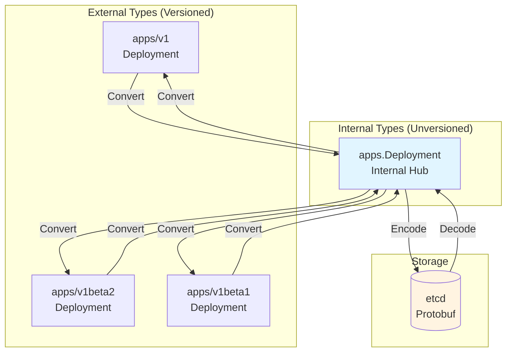
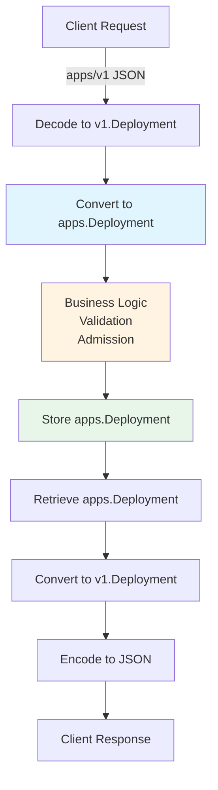
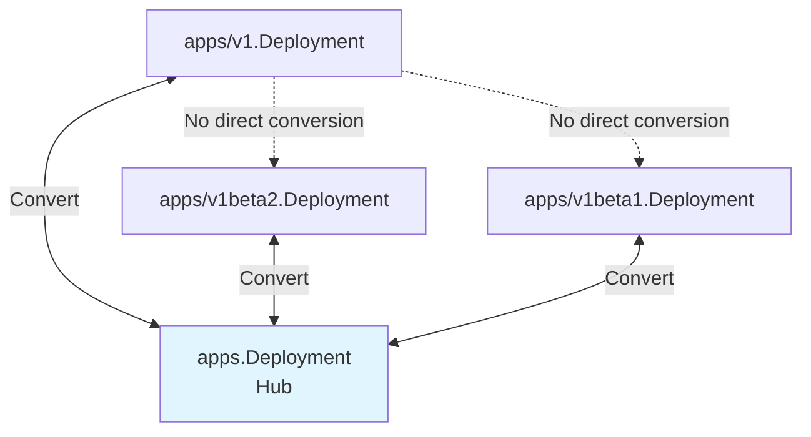

# Type System and Versioning

> **Low-Level Technical Specification**
> How Kubernetes manages API types, versioning, and conversion between internal and external representations.

---

## Table of Contents

- [Overview](#overview)
- [Internal vs External Types](#internal-vs-external-types)
- [Hub-and-Spoke Conversion](#hub-and-spoke-conversion)
- [Scheme Registration](#scheme-registration)
- [Type Metadata](#type-metadata)
- [Deep Copy](#deep-copy)
- [Defaults](#defaults)
- [Code References](#code-references)

---

## Overview

Kubernetes uses a sophisticated type system to support **API versioning** while maintaining a single internal representation. This enables:
- Multiple API versions simultaneously (v1, v1beta1, v2alpha1)
- Seamless conversion between versions
- Single storage format (internal types)
- Backward compatibility

### Type Categories



**File Locations**:
- External types: `staging/src/k8s.io/api/{group}/{version}/types.go`
- Internal types: `pkg/apis/{group}/types.go`

---

## Internal vs External Types

### External Types (Versioned)

External types are what clients see and use:

```go
// staging/src/k8s.io/api/apps/v1/types.go

package v1

type Deployment struct {
    metav1.TypeMeta   `json:",inline"`
    metav1.ObjectMeta `json:"metadata,omitempty" protobuf:"bytes,1,opt,name=metadata"`

    // Spec defines the desired state
    Spec DeploymentSpec `json:"spec,omitempty" protobuf:"bytes,2,opt,name=spec"`

    // Status defines the observed state
    Status DeploymentStatus `json:"status,omitempty" protobuf:"bytes,3,opt,name=status"`
}

type DeploymentSpec struct {
    Replicas *int32 `json:"replicas,omitempty" protobuf:"varint,1,opt,name=replicas"`

    Selector *metav1.LabelSelector `json:"selector" protobuf:"bytes,2,opt,name=selector"`

    Template corev1.PodTemplateSpec `json:"template" protobuf:"bytes,3,opt,name=template"`

    Strategy DeploymentStrategy `json:"strategy,omitempty" patchStrategy:"retainKeys" protobuf:"bytes,4,opt,name=strategy"`

    MinReadySeconds int32 `json:"minReadySeconds,omitempty" protobuf:"varint,5,opt,name=minReadySeconds"`

    RevisionHistoryLimit *int32 `json:"revisionHistoryLimit,omitempty" protobuf:"varint,6,opt,name=revisionHistoryLimit"`

    Paused bool `json:"paused,omitempty" protobuf:"varint,7,opt,name=paused"`

    ProgressDeadlineSeconds *int32 `json:"progressDeadlineSeconds,omitempty" protobuf:"varint,9,opt,name=progressDeadlineSeconds"`
}
```

**Characteristics**:
- JSON/YAML serialization tags
- Protobuf tags for efficient storage
- Versioned (v1, v1beta1, etc.)
- Client-facing

### Internal Types (Unversioned)

Internal types are used within the API server:

```go
// pkg/apis/apps/types.go

package apps

type Deployment struct {
    metav1.TypeMeta
    metav1.ObjectMeta

    Spec DeploymentSpec
    Status DeploymentStatus
}

type DeploymentSpec struct {
    Replicas int32

    Selector *metav1.LabelSelector

    Template api.PodTemplateSpec

    Strategy DeploymentStrategy

    MinReadySeconds int32

    RevisionHistoryLimit *int32

    Paused bool

    ProgressDeadlineSeconds *int32
}
```

**Characteristics**:
- No serialization tags (not directly serialized)
- Unversioned
- Used for business logic, validation, storage
- Hub for conversion

### Why Both?



**Benefits**:
- **Single business logic**: Validation, admission, etc. work on internal types
- **Multiple API versions**: Support v1, v1beta1 simultaneously
- **Easy deprecation**: Remove old external versions, keep internal unchanged
- **Storage flexibility**: Store internal type, read as any version

---

## Hub-and-Spoke Conversion

### Conversion Pattern

All conversions go through the internal type (hub):



**Example**: Converting v1beta2 → v1
1. v1beta2.Deployment → apps.Deployment (internal)
2. apps.Deployment → v1.Deployment

### Conversion Functions

```go
// pkg/apis/apps/v1/conversion.go

func Convert_v1_Deployment_To_apps_Deployment(in *v1.Deployment, out *apps.Deployment, s conversion.Scope) error {
    // Auto-generated conversions for most fields
    if err := autoConvert_v1_Deployment_To_apps_Deployment(in, out, s); err != nil {
        return err
    }

    // Custom conversions for specific fields
    // (e.g., handling removed/added fields)

    return nil
}

func Convert_apps_Deployment_To_v1_Deployment(in *apps.Deployment, out *v1.Deployment, s conversion.Scope) error {
    if err := autoConvert_apps_Deployment_To_v1_Deployment(in, out, s); err != nil {
        return err
    }

    // Custom conversions

    return nil
}
```

### Auto-Generated Conversions

Most conversions are auto-generated:

```go
// pkg/apis/apps/v1/zz_generated.conversion.go
// AUTO-GENERATED by conversion-gen

func autoConvert_v1_Deployment_To_apps_Deployment(in *v1.Deployment, out *apps.Deployment, s conversion.Scope) error {
    out.ObjectMeta = in.ObjectMeta
    if err := Convert_v1_DeploymentSpec_To_apps_DeploymentSpec(&in.Spec, &out.Spec, s); err != nil {
        return err
    }
    if err := Convert_v1_DeploymentStatus_To_apps_DeploymentStatus(&in.Status, &out.Status, s); err != nil {
        return err
    }
    return nil
}

func autoConvert_v1_DeploymentSpec_To_apps_DeploymentSpec(in *v1.DeploymentSpec, out *apps.DeploymentSpec, s conversion.Scope) error {
    out.Replicas = *in.Replicas  // Note: pointer → value conversion
    out.Selector = in.Selector
    if err := api.Convert_v1_PodTemplateSpec_To_core_PodTemplateSpec(&in.Template, &out.Template, s); err != nil {
        return err
    }
    // ... more fields
    return nil
}
```

**File**: `pkg/apis/apps/v1/zz_generated.conversion.go`

### Conversion with Field Removal

Example: Deprecated field in older version

```go
// v1beta1 has a deprecated field
type DeploymentSpec_v1beta1 struct {
    Replicas int32
    Selector *metav1.LabelSelector
    Template corev1.PodTemplateSpec

    // DEPRECATED: RollbackTo is deprecated in v1
    RollbackTo *RollbackConfig `json:"rollbackTo,omitempty"`
}

// Conversion drops the deprecated field
func Convert_v1beta1_DeploymentSpec_To_apps_DeploymentSpec(in *v1beta1.DeploymentSpec, out *apps.DeploymentSpec, s conversion.Scope) error {
    // Auto-convert common fields
    if err := autoConvert_v1beta1_DeploymentSpec_To_apps_DeploymentSpec(in, out, s); err != nil {
        return err
    }

    // Drop RollbackTo field (not present in internal type)
    // No need to explicitly handle it - just don't copy it

    return nil
}
```

---

## Scheme Registration

### Scheme Structure

```go
// staging/src/k8s.io/apimachinery/pkg/runtime/scheme.go:50-100

type Scheme struct {
    // gvkToType: GroupVersionKind → reflect.Type
    gvkToType map[schema.GroupVersionKind]reflect.Type

    // typeToGVK: reflect.Type → []GroupVersionKind
    typeToGVK map[reflect.Type][]schema.GroupVersionKind

    // unversionedTypes: types that don't have versions
    unversionedTypes map[reflect.Type]schema.GroupVersionKind

    // unversionedKinds: kinds that don't have versions
    unversionedKinds map[string]reflect.Type

    // converter: manages type conversions
    converter *conversion.Converter

    // defaulterFuncs: registered defaulter functions
    defaulterFuncs map[reflect.Type]func(interface{})

    // versionPriority: order of preferred versions
    versionPriority map[string][]string
}
```

### Registration Example

```go
// pkg/apis/apps/install/install.go

package install

import (
    "k8s.io/apimachinery/pkg/runtime"
    "k8s.io/kubernetes/pkg/api/legacyscheme"
    "k8s.io/kubernetes/pkg/apis/apps"
    "k8s.io/kubernetes/pkg/apis/apps/v1"
    "k8s.io/kubernetes/pkg/apis/apps/v1beta1"
    "k8s.io/kubernetes/pkg/apis/apps/v1beta2"
)

func init() {
    Install(legacyscheme.Scheme)
}

func Install(scheme *runtime.Scheme) {
    // 1. Register internal types
    utilruntime.Must(apps.AddToScheme(scheme))

    // 2. Register external types (all versions)
    utilruntime.Must(v1.AddToScheme(scheme))
    utilruntime.Must(v1beta2.AddToScheme(scheme))
    utilruntime.Must(v1beta1.AddToScheme(scheme))

    // 3. Set version priority (preferred version first)
    utilruntime.Must(scheme.SetVersionPriority(
        v1.SchemeGroupVersion,      // Preferred
        v1beta2.SchemeGroupVersion,
        v1beta1.SchemeGroupVersion,
    ))
}
```

### AddToScheme Functions

```go
// pkg/apis/apps/register.go (internal types)

var (
    SchemeBuilder = runtime.NewSchemeBuilder(addKnownTypes)
    AddToScheme   = SchemeBuilder.AddToScheme
)

func addKnownTypes(scheme *runtime.Scheme) error {
    scheme.AddKnownTypes(SchemeGroupVersion,
        &Deployment{},
        &DeploymentList{},
        &StatefulSet{},
        &StatefulSetList{},
        &DaemonSet{},
        &DaemonSetList{},
        &ReplicaSet{},
        &ReplicaSetList{},
        &ControllerRevision{},
        &ControllerRevisionList{},
    )
    return nil
}
```

```go
// staging/src/k8s.io/api/apps/v1/register.go (external types)

var (
    SchemeGroupVersion = schema.GroupVersion{Group: "apps", Version: "v1"}
    SchemeBuilder      = runtime.NewSchemeBuilder(addKnownTypes, addDefaultingFuncs, addConversionFuncs)
    AddToScheme        = SchemeBuilder.AddToScheme
)

func addKnownTypes(scheme *runtime.Scheme) error {
    scheme.AddKnownTypes(SchemeGroupVersion,
        &Deployment{},
        &DeploymentList{},
        &StatefulSet{},
        &StatefulSetList{},
        // ... all v1 types
    )
    metav1.AddToGroupVersion(scheme, SchemeGroupVersion)
    return nil
}

func addDefaultingFuncs(scheme *runtime.Scheme) error {
    return RegisterDefaults(scheme)
}

func addConversionFuncs(scheme *runtime.Scheme) error {
    return RegisterConversions(scheme)
}
```

---

## Type Metadata

### TypeMeta

Every Kubernetes object has TypeMeta:

```go
// staging/src/k8s.io/apimachinery/pkg/apis/meta/v1/types.go

type TypeMeta struct {
    // Kind: resource type (e.g., "Pod", "Deployment")
    Kind string `json:"kind,omitempty" protobuf:"bytes,1,opt,name=kind"`

    // APIVersion: group/version (e.g., "v1", "apps/v1")
    APIVersion string `json:"apiVersion,omitempty" protobuf:"bytes,2,opt,name=apiVersion"`
}
```

### ObjectMeta

Common metadata for all objects:

```go
type ObjectMeta struct {
    Name      string            `json:"name,omitempty"`
    Namespace string            `json:"namespace,omitempty"`
    UID       types.UID         `json:"uid,omitempty"`
    ResourceVersion string      `json:"resourceVersion,omitempty"`
    Generation int64             `json:"generation,omitempty"`
    CreationTimestamp Time      `json:"creationTimestamp,omitempty"`
    DeletionTimestamp *Time     `json:"deletionTimestamp,omitempty"`
    DeletionGracePeriodSeconds *int64 `json:"deletionGracePeriodSeconds,omitempty"`
    Labels map[string]string    `json:"labels,omitempty"`
    Annotations map[string]string `json:"annotations,omitempty"`
    OwnerReferences []OwnerReference `json:"ownerReferences,omitempty"`
    Finalizers []string           `json:"finalizers,omitempty"`
    ManagedFields []ManagedFieldsEntry `json:"managedFields,omitempty"`
}
```

### GroupVersionKind (GVK)

```go
// staging/src/k8s.io/apimachinery/pkg/runtime/schema/group_version.go

type GroupVersionKind struct {
    Group   string
    Version string
    Kind    string
}

// Examples:
// {Group: "apps", Version: "v1", Kind: "Deployment"}
// {Group: "", Version: "v1", Kind: "Pod"}  // Core group has empty Group
// {Group: "batch", Version: "v1", Kind: "Job"}
```

### Type Registration

```go
// Register a type with its GVK
scheme.AddKnownTypeWithName(
    schema.GroupVersionKind{
        Group:   "apps",
        Version: "v1",
        Kind:    "Deployment",
    },
    &v1.Deployment{},
)

// Lookup type by GVK
gvk := schema.GroupVersionKind{Group: "apps", Version: "v1", Kind: "Deployment"}
obj, err := scheme.New(gvk)
// obj is now a *v1.Deployment

// Get GVK from object
gvks, _, err := scheme.ObjectKinds(obj)
// gvks[0] is {Group: "apps", Version: "v1", Kind: "Deployment"}
```

---

## Deep Copy

### DeepCopy Interface

All Kubernetes objects implement DeepCopy:

```go
// staging/src/k8s.io/apimachinery/pkg/runtime/interfaces.go

type Object interface {
    GetObjectKind() schema.ObjectKind
    DeepCopyObject() Object
}
```

### Auto-Generated DeepCopy

```go
// staging/src/k8s.io/api/apps/v1/zz_generated.deepcopy.go
// AUTO-GENERATED by deepcopy-gen

func (in *Deployment) DeepCopy() *Deployment {
    if in == nil {
        return nil
    }
    out := new(Deployment)
    in.DeepCopyInto(out)
    return out
}

func (in *Deployment) DeepCopyInto(out *Deployment) {
    *out = *in
    out.TypeMeta = in.TypeMeta
    in.ObjectMeta.DeepCopyInto(&out.ObjectMeta)
    in.Spec.DeepCopyInto(&out.Spec)
    in.Status.DeepCopyInto(&out.Status)
}

func (in *Deployment) DeepCopyObject() runtime.Object {
    if c := in.DeepCopy(); c != nil {
        return c
    }
    return nil
}

func (in *DeploymentSpec) DeepCopyInto(out *DeploymentSpec) {
    *out = *in
    if in.Replicas != nil {
        in, out := &in.Replicas, &out.Replicas
        *out = new(int32)
        **out = **in
    }
    if in.Selector != nil {
        in, out := &in.Selector, &out.Selector
        *out = new(metav1.LabelSelector)
        (*in).DeepCopyInto(*out)
    }
    in.Template.DeepCopyInto(&out.Template)
    in.Strategy.DeepCopyInto(&out.Strategy)
    // ... more fields
}
```

**Usage**:
```go
deployment := &appsv1.Deployment{...}
copy := deployment.DeepCopy()

// Modify copy without affecting original
copy.Spec.Replicas = pointer.Int32(5)
```

---

## Defaults

### Defaulting Functions

```go
// staging/src/k8s.io/api/apps/v1/defaults.go

func SetDefaults_Deployment(obj *v1.Deployment) {
    // Default replicas to 1
    if obj.Spec.Replicas == nil {
        obj.Spec.Replicas = pointer.Int32(1)
    }

    // Default strategy to RollingUpdate
    if obj.Spec.Strategy.Type == "" {
        obj.Spec.Strategy.Type = v1.RollingUpdateDeploymentStrategyType
    }

    // Default RollingUpdate parameters
    if obj.Spec.Strategy.Type == v1.RollingUpdateDeploymentStrategyType {
        if obj.Spec.Strategy.RollingUpdate == nil {
            obj.Spec.Strategy.RollingUpdate = &v1.RollingUpdateDeployment{}
        }
        if obj.Spec.Strategy.RollingUpdate.MaxUnavailable == nil {
            maxUnavailable := intstr.FromString("25%")
            obj.Spec.Strategy.RollingUpdate.MaxUnavailable = &maxUnavailable
        }
        if obj.Spec.Strategy.RollingUpdate.MaxSurge == nil {
            maxSurge := intstr.FromString("25%")
            obj.Spec.Strategy.RollingUpdate.MaxSurge = &maxSurge
        }
    }

    // Default revision history limit
    if obj.Spec.RevisionHistoryLimit == nil {
        obj.Spec.RevisionHistoryLimit = pointer.Int32(10)
    }

    // Default progress deadline
    if obj.Spec.ProgressDeadlineSeconds == nil {
        obj.Spec.ProgressDeadlineSeconds = pointer.Int32(600)
    }
}
```

### Defaulting Registration

```go
// staging/src/k8s.io/api/apps/v1/zz_generated.defaults.go

func RegisterDefaults(scheme *runtime.Scheme) error {
    scheme.AddTypeDefaultingFunc(&v1.Deployment{}, func(obj interface{}) {
        SetDefaults_Deployment(obj.(*v1.Deployment))
    })
    scheme.AddTypeDefaultingFunc(&v1.StatefulSet{}, func(obj interface{}) {
        SetDefaults_StatefulSet(obj.(*v1.StatefulSet))
    })
    // ... more types
    return nil
}
```

### Applying Defaults

```go
// Defaults are applied during decoding
scheme.Default(obj)

// Example flow:
// 1. Decode JSON → v1.Deployment (no defaults yet)
// 2. Apply defaults → v1.Deployment (with defaults)
// 3. Convert to internal → apps.Deployment
```

---

## Code References

### Key Files

| Component | File | Description |
|-----------|------|-------------|
| **External Types** | `staging/src/k8s.io/api/{group}/{version}/types.go` | Versioned types |
| **Internal Types** | `pkg/apis/{group}/types.go` | Unversioned hub types |
| **Conversion (Generated)** | `pkg/apis/{group}/{version}/zz_generated.conversion.go` | Auto-generated conversions |
| **Conversion (Custom)** | `pkg/apis/{group}/{version}/conversion.go` | Custom conversion logic |
| **DeepCopy (Generated)** | `staging/src/k8s.io/api/{group}/{version}/zz_generated.deepcopy.go` | Auto-generated DeepCopy |
| **Defaults** | `staging/src/k8s.io/api/{group}/{version}/defaults.go` | Defaulting functions |
| **Scheme** | `staging/src/k8s.io/apimachinery/pkg/runtime/scheme.go` | Type registry |
| **Install** | `pkg/apis/{group}/install/install.go` | Registration |

### Key Functions

```go
// Type registration
staging/src/k8s.io/apimachinery/pkg/runtime/scheme.go:100-200
func (s *Scheme) AddKnownTypes(gv GroupVersion, types ...Object) error

// Conversion
pkg/apis/apps/v1/conversion.go:50-100
func Convert_v1_Deployment_To_apps_Deployment(in, out, s) error
func Convert_apps_Deployment_To_v1_Deployment(in, out, s) error

// DeepCopy
staging/src/k8s.io/api/apps/v1/zz_generated.deepcopy.go:50-100
func (in *Deployment) DeepCopy() *Deployment
func (in *Deployment) DeepCopyInto(out *Deployment)

// Defaults
staging/src/k8s.io/api/apps/v1/defaults.go:50-150
func SetDefaults_Deployment(obj *v1.Deployment)
```

---

## Summary

The Kubernetes type system enables **API versioning and evolution**:

1. **Dual type system** - Internal (hub) and external (versioned) types
2. **Hub-and-spoke conversion** - All conversions go through internal types
3. **Auto-generated code** - Conversion, DeepCopy, Defaults generated
4. **Scheme registration** - Central registry of all types and conversions
5. **Version priority** - Preferred version for each group

**Key Benefits**:
- Multiple API versions simultaneously
- Single business logic on internal types
- Easy version deprecation
- Backward compatibility

**Next Steps**:
- [Conversion Framework](06-conversion-framework.md) - Conversion mechanics
- [Validation Framework](07-validation-framework.md) - Type validation
- [Registry Pattern](02-registry-pattern.md) - CRUD operations

---

**Related Documentation**:
- [API Groups Registration](../middle-level/03-api-groups-registration.md) - How types are registered
- [Storage Layer](../middle-level/02-storage-layer.md) - How types are stored
- [QUICK-REFERENCE.md](../QUICK-REFERENCE.md) - Quick reference
