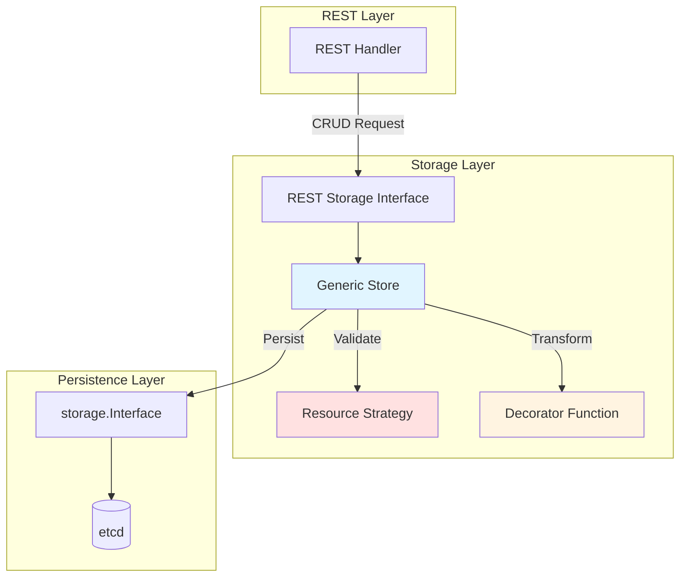

# Kube-APIServer Low-Level Architecture: REST Storage Implementations

**Status**: Complete
**Last Updated**: 2025-10-21
**Target Audience**: Platform engineers, contributors working on resource storage and REST handlers

## Table of Contents
1. [Overview](#overview)
2. [REST Storage Interface](#rest-storage-interface)
3. [Generic Store Implementation](#generic-store-implementation)
4. [Storage Strategies](#storage-strategies)
5. [Resource-Specific Implementations](#resource-specific-implementations)
6. [Storage Decorators](#storage-decorators)
7. [Subresource Storage Patterns](#subresource-storage-patterns)
8. [Storage Configuration](#storage-configuration)
9. [Real-World Examples](#real-world-examples)
10. [Related Documentation](#related-documentation)

## Overview

REST storage implementations in Kubernetes bridge the gap between HTTP REST handlers and the underlying storage layer (etcd). They provide resource-specific behavior while leveraging a generic, reusable storage implementation.

### Key Characteristics

- **Generic Base**: Single `Store` implementation for all standard resources
- **Strategy Pattern**: Resource-specific behavior via pluggable strategies
- **Decorator Pattern**: Transform objects on read/write
- **Hook Pattern**: Pre/post operation callbacks
- **Subresource Support**: Specialized storage for status, scale, etc.

### Architecture Overview



## REST Storage Interface

### Base Interface

**File**: `staging/src/k8s.io/apiserver/pkg/registry/rest/rest.go:58-67`

```go
type Storage interface {
    // New returns an empty object that can be used with Create and Update
    New() runtime.Object

    // Destroy cleans up resources on shutdown
    // Thread-safe, can be called multiple times
    Destroy()
}
```

### StandardStorage Interface

**File**: `staging/src/k8s.io/apiserver/pkg/registry/rest/rest.go:303-315`

```go
type StandardStorage interface {
    Getter
    Lister
    CreaterUpdater
    GracefulDeleter
    CollectionDeleter
    Watcher
    Destroy()
}
```

**Aggregates All Common Operations**:
- Get single resource
- List resources with filtering
- Create/Update resources
- Delete with grace period
- Delete collections
- Watch for changes

### Core Sub-Interfaces

#### Getter

**File**: `staging/src/k8s.io/apiserver/pkg/registry/rest/rest.go:136-141`

```go
type Getter interface {
    // Get finds a resource in the storage by name and returns it.
    Get(ctx context.Context, name string, options *metav1.GetOptions) (runtime.Object, error)
}
```

#### Lister

**File**: `staging/src/k8s.io/apiserver/pkg/registry/rest/rest.go:125-133`

```go
type Lister interface {
    // NewList returns an empty object that can be used with List call
    NewList() runtime.Object

    // List selects resources in the storage which match to the selector
    List(ctx context.Context, options *metainternalversion.ListOptions) (runtime.Object, error)

    // Optional: Convert to table format
    TableConvertor
}
```

#### Creater

**File**: `staging/src/k8s.io/apiserver/pkg/registry/rest/rest.go:202-209`

```go
type Creater interface {
    // Create creates a new version of a resource
    Create(
        ctx context.Context,
        obj runtime.Object,
        createValidation ValidateObjectFunc,
        options *metav1.CreateOptions,
    ) (runtime.Object, error)
}
```

#### Updater

**File**: `staging/src/k8s.io/apiserver/pkg/registry/rest/rest.go:264-273`

```go
type Updater interface {
    // Update finds a resource in the storage and updates it
    Update(
        ctx context.Context,
        name string,
        objInfo UpdatedObjectInfo,
        createValidation ValidateObjectFunc,
        updateValidation ValidateObjectUpdateFunc,
        forceAllowCreate bool,
        options *metav1.UpdateOptions,
    ) (runtime.Object, bool, error)
}
```

#### GracefulDeleter

**File**: `staging/src/k8s.io/apiserver/pkg/registry/rest/rest.go:170-182`

```go
type GracefulDeleter interface {
    // Delete finds a resource in the storage and deletes it
    Delete(
        ctx context.Context,
        name string,
        deleteValidation ValidateObjectFunc,
        options *metav1.DeleteOptions,
    ) (runtime.Object, bool, error)
}
```

#### Watcher

**File**: `staging/src/k8s.io/apiserver/pkg/registry/rest/rest.go:293-299`

```go
type Watcher interface {
    // Watch begins watching for changes to resources
    Watch(ctx context.Context, options *metainternalversion.ListOptions) (watch.Interface, error)
}
```

### Specialized Interfaces

#### NamedCreater

**File**: `staging/src/k8s.io/apiserver/pkg/registry/rest/rest.go:212-221`

```go
type NamedCreater interface {
    // Create creates a new version of a resource with the name from the URL path
    // Used by subresources like pods/binding
    Create(
        ctx context.Context,
        name string,
        obj runtime.Object,
        createValidation ValidateObjectFunc,
        options *metav1.CreateOptions,
    ) (runtime.Object, error)
}
```

#### Connecter

**File**: `staging/src/k8s.io/apiserver/pkg/registry/rest/rest.go:334-351`

```go
type Connecter interface {
    // Connect returns a handler for proxy requests
    // Used for exec, attach, port-forward
    Connect(
        ctx context.Context,
        name string,
        options runtime.Object,
        responder Responder,
    ) (http.Handler, error)

    // ConnectMethods returns the list of HTTP methods handled
    ConnectMethods() []string

    // NewConnectOptions returns an options object for Connect
    NewConnectOptions() (runtime.Object, bool, string)
}
```

## Generic Store Implementation

### Store Structure

**File**: `staging/src/k8s.io/apiserver/pkg/registry/generic/registry/store.go:100-249`

```go
type Store struct {
    // Object creation functions
    NewFunc     func() runtime.Object     // Create empty object
    NewListFunc func() runtime.Object     // Create empty list

    // Resource identification
    DefaultQualifiedResource  schema.GroupResource
    SingularQualifiedResource schema.GroupResource

    // Key generation
    KeyRootFunc    func(ctx context.Context) string
    KeyFunc        func(ctx context.Context, name string) (string, error)
    ObjectNameFunc func(obj runtime.Object) (string, error)

    // TTL handling
    TTLFunc func(obj runtime.Object, existing uint64, update bool) (uint64, error)

    // Filtering
    PredicateFunc func(label labels.Selector, field fields.Selector) storage.SelectionPredicate

    // Garbage collection
    EnableGarbageCollection bool
    DeleteCollectionWorkers int

    // Object transformation
    Decorator func(runtime.Object)

    // Lifecycle hooks
    CreateStrategy      rest.RESTCreateStrategy
    BeginCreate         BeginCreateFunc
    AfterCreate         AfterCreateFunc

    UpdateStrategy      rest.RESTUpdateStrategy
    BeginUpdate         BeginUpdateFunc
    AfterUpdate         AfterUpdateFunc

    DeleteStrategy      rest.RESTDeleteStrategy
    AfterDelete         AfterDeleteFunc
    ReturnDeletedObject bool

    // Conversion and validation
    TableConvertor      rest.TableConvertor
    ResetFieldsStrategy rest.ResetFieldsStrategy

    // Underlying storage
    Storage          DryRunnableStorage
    StorageVersioner runtime.GroupVersioner

    // Health and cleanup
    ReadinessCheckFunc func() error
    DestroyFunc        func()
}
```

### Create Operation

**File**: `staging/src/k8s.io/apiserver/pkg/registry/generic/registry/store.go:446-558`

```go
func (e *Store) Create(
    ctx context.Context,
    obj runtime.Object,
    createValidation rest.ValidateObjectFunc,
    options *metav1.CreateOptions,
) (runtime.Object, error) {
    // Name generation (if GenerateName specified)
    if err := rest.BeforeCreate(e.CreateStrategy, ctx, obj); err != nil {
        return nil, err
    }

    // Initialize metadata
    if objectMeta, err := meta.Accessor(obj); err == nil {
        rest.FillObjectMetaSystemFields(objectMeta)
        if len(objectMeta.GetGenerateName()) > 0 && len(objectMeta.GetName()) == 0 {
            objectMeta.SetName(e.CreateStrategy.GenerateName(objectMeta.GetGenerateName()))
        }
    }

    // BeginCreate hook (e.g., allocate IPs)
    var finishCreate FinishFunc = finishNothing
    if e.BeginCreate != nil {
        fn, err := e.BeginCreate(ctx, obj, options)
        if err != nil {
            return nil, err
        }
        finishCreate = fn
        defer func() {
            finishCreate(ctx, false)
        }()
    }

    // Strategy preparation
    if err := e.CreateStrategy.PrepareForCreate(ctx, obj); err != nil {
        return nil, err
    }

    // Validation
    if createValidation != nil {
        if err := createValidation(ctx, obj.DeepCopyObject()); err != nil {
            return nil, err
        }
    }

    // Calculate key
    name, err := e.ObjectNameFunc(obj)
    if err != nil {
        return nil, err
    }
    key, err := e.KeyFunc(ctx, name)
    if err != nil {
        return nil, err
    }

    // Calculate TTL
    ttl, err := e.calculateTTL(obj, 0, false)
    if err != nil {
        return nil, err
    }

    // Persist to storage
    out := e.NewFunc()
    if err := e.Storage.Create(ctx, key, obj, out, ttl, dryrun.IsDryRun(options.DryRun)); err != nil {
        return nil, storeerr.InterpretCreateError(err, qualifiedResource, name)
    }

    // Complete BeginCreate transaction
    finishCreate(ctx, true)

    // AfterCreate hook
    if e.AfterCreate != nil {
        e.AfterCreate(out, options)
    }

    // Apply decorator
    if e.Decorator != nil {
        e.Decorator(out)
    }

    return out, nil
}
```

### Update Operation

**File**: `staging/src/k8s.io/apiserver/pkg/registry/generic/registry/store.go:617-822`

```go
func (e *Store) Update(
    ctx context.Context,
    name string,
    objInfo rest.UpdatedObjectInfo,
    createValidation rest.ValidateObjectFunc,
    updateValidation rest.ValidateObjectUpdateFunc,
    forceAllowCreate bool,
    options *metav1.UpdateOptions,
) (runtime.Object, bool, error) {
    // Calculate key
    key, err := e.KeyFunc(ctx, name)
    if err != nil {
        return nil, false, err
    }

    // Preconditions
    var preconditions *storage.Preconditions
    if preconditions, err = e.preconditionsForUpdate(options); err != nil {
        return nil, false, err
    }

    // Use GuaranteedUpdate for optimistic locking
    out := e.NewFunc()
    var created bool

    err = e.Storage.GuaranteedUpdate(
        ctx, key, out, true, preconditions,
        func(existing runtime.Object, res storage.ResponseMeta) (runtime.Object, *uint64, error) {
            // Create-on-update support
            if existing == nil {
                if !e.UpdateStrategy.AllowCreateOnUpdate() && !forceAllowCreate {
                    return nil, nil, apierrors.NewNotFound(...)
                }

                // Create path
                creating := true
                creatingObj, err := objInfo.UpdatedObject(ctx, nil)
                if err != nil {
                    return nil, nil, err
                }

                // BeginCreate hook
                if e.BeginCreate != nil {
                    fn, err := e.BeginCreate(ctx, creatingObj, options)
                    if err != nil {
                        return nil, nil, err
                    }
                    defer fn(ctx, true)
                }

                // Prepare and validate for create
                if err := rest.BeforeCreate(e.CreateStrategy, ctx, creatingObj); err != nil {
                    return nil, nil, err
                }

                // ... create logic
                created = true
                return creatingObj, &ttl, nil
            }

            // Update path
            creating := false
            updatingObj, err := objInfo.UpdatedObject(ctx, existing)
            if err != nil {
                return nil, nil, err
            }

            // BeginUpdate hook
            if e.BeginUpdate != nil {
                fn, err := e.BeginUpdate(ctx, updatingObj, existing, options)
                if err != nil {
                    return nil, nil, err
                }
                defer fn(ctx, true)
            }

            // Prepare and validate for update
            if err := rest.BeforeUpdate(e.UpdateStrategy, ctx, updatingObj, existing); err != nil {
                return nil, nil, err
            }

            // Check if update triggers delete
            if e.shouldDelete(ctx, key, updatingObj, existing) {
                deleteOptions := e.deleteOptionsFromUpdate(options)
                _, _, err := e.Delete(ctx, name, deleteValidation, deleteOptions)
                return nil, nil, err
            }

            // ... update logic
            return updatingObj, &ttl, nil
        },
        dryrun.IsDryRun(options.DryRun),
        nil, // cachedExistingObject
    )

    if err != nil {
        return nil, false, storeerr.InterpretUpdateError(err, qualifiedResource, name)
    }

    // AfterUpdate hook
    if e.AfterUpdate != nil {
        e.AfterUpdate(out, options)
    }

    // Apply decorator
    if e.Decorator != nil {
        e.Decorator(out)
    }

    return out, created, nil
}
```

### Delete Operation

**File**: `staging/src/k8s.io/apiserver/pkg/registry/generic/registry/store.go:1131-1220`

```go
func (e *Store) Delete(
    ctx context.Context,
    name string,
    deleteValidation rest.ValidateObjectFunc,
    options *metav1.DeleteOptions,
) (runtime.Object, bool, error) {
    // Calculate key
    key, err := e.KeyFunc(ctx, name)
    if err != nil {
        return nil, false, err
    }

    // Get current object
    obj := e.NewFunc()
    if err := e.Storage.Get(ctx, key, storage.GetOptions{}, obj); err != nil {
        return nil, false, storeerr.InterpretDeleteError(err, qualifiedResource, name)
    }

    // Validation
    if deleteValidation != nil {
        if err := deleteValidation(ctx, obj); err != nil {
            return nil, false, err
        }
    }

    // Check if graceful deletion is required
    graceful, pendingGraceful, err := rest.BeforeDelete(e.DeleteStrategy, ctx, obj, options)
    if err != nil {
        return nil, false, err
    }

    // Handle finalizers and grace period
    if pendingGraceful {
        return e.updateForGracefulDeletion(ctx, name, key, obj, options)
    }

    // Preconditions
    var preconditions *storage.Preconditions
    if preconditions, err = e.preconditionsForDelete(options); err != nil {
        return nil, false, err
    }

    // Actual deletion
    out := e.NewFunc()
    if err := e.Storage.Delete(
        ctx, key, out, preconditions,
        func(ctx context.Context, obj runtime.Object) error {
            return e.DeleteStrategy.ValidateDelete(ctx, obj)
        },
        nil, // cachedExistingObject
        dryrun.IsDryRun(options.DryRun),
    ); err != nil {
        return nil, false, storeerr.InterpretDeleteError(err, qualifiedResource, name)
    }

    // AfterDelete hook
    if e.AfterDelete != nil {
        e.AfterDelete(out, options)
    }

    // Apply decorator if returning deleted object
    if e.ReturnDeletedObject && e.Decorator != nil {
        e.Decorator(out)
    }

    return out, true, nil
}
```

## Storage Strategies

### Create Strategy

**File**: `staging/src/k8s.io/apiserver/pkg/registry/rest/create.go:40-90`

```go
type RESTCreateStrategy interface {
    runtime.ObjectTyper
    names.NameGenerator

    // NamespaceScoped returns true if the object must be within a namespace
    NamespaceScoped() bool

    // PrepareForCreate is invoked before validation
    // Normalizes the object (e.g., clear status, set defaults)
    PrepareForCreate(ctx context.Context, obj runtime.Object)

    // Validate returns an ErrorList with validation errors
    Validate(ctx context.Context, obj runtime.Object) field.ErrorList

    // WarningsOnCreate returns warnings about the object
    WarningsOnCreate(ctx context.Context, obj runtime.Object) []string

    // Canonicalize mutates object into canonical form after validation
    Canonicalize(obj runtime.Object)
}
```

### Update Strategy

**File**: `staging/src/k8s.io/apiserver/pkg/registry/rest/update.go:39-84`

```go
type RESTUpdateStrategy interface {
    runtime.ObjectTyper

    NamespaceScoped() bool

    // AllowCreateOnUpdate returns true if update is allowed to create
    AllowCreateOnUpdate() bool

    // PrepareForUpdate is invoked before validation on both old and new object
    PrepareForUpdate(ctx context.Context, obj, old runtime.Object)

    // ValidateUpdate returns validation errors
    ValidateUpdate(ctx context.Context, obj, old runtime.Object) field.ErrorList

    // WarningsOnUpdate returns warnings about the update
    WarningsOnUpdate(ctx context.Context, obj, old runtime.Object) []string

    // Canonicalize mutates object into canonical form
    Canonicalize(obj runtime.Object)

    // AllowUnconditionalUpdate returns true if update without resource version is allowed
    AllowUnconditionalUpdate() bool
}
```

### Delete Strategy

**File**: `staging/src/k8s.io/apiserver/pkg/registry/rest/delete.go:35-64`

```go
type RESTDeleteStrategy interface {
    runtime.ObjectTyper
}

type RESTGracefulDeleteStrategy interface {
    // CheckGracefulDelete returns true if object can be gracefully deleted
    // May modify options (e.g., adjust grace period)
    CheckGracefulDelete(ctx context.Context, obj runtime.Object, options *metav1.DeleteOptions) bool
}

type GarbageCollectionDeleteStrategy interface {
    // DefaultGarbageCollectionPolicy returns the default GC policy
    DefaultGarbageCollectionPolicy(ctx context.Context) rest.GarbageCollectionPolicy
}
```

## Resource-Specific Implementations

### Pod Storage

**File**: `pkg/registry/core/pod/storage/storage.go:52-124`

```go
type PodStorage struct {
    Pod                 *REST
    Binding             *BindingREST
    LegacyBinding       *LegacyBindingREST
    Eviction            *EvictionREST
    Status              *StatusREST
    EphemeralContainers *EphemeralContainersREST
    Resize              *ResizeREST
    Log                 *podrest.LogREST
    Proxy               *podrest.ProxyREST
    Exec                *podrest.ExecREST
    Attach              *podrest.AttachREST
    PortForward         *podrest.PortForwardREST
}

func NewStorage(
    optsGetter generic.RESTOptionsGetter,
    k client.ConnectionInfoGetter,
    proxyTransport http.RoundTripper,
    podDisruptionBudgetClient policyclient.PodDisruptionBudgetsGetter,
) (PodStorage, error) {
    // Create base store
    store := &genericregistry.Store{
        NewFunc:                   func() runtime.Object { return &api.Pod{} },
        NewListFunc:               func() runtime.Object { return &api.PodList{} },
        PredicateFunc:             registrypod.MatchPod,
        DefaultQualifiedResource:  api.Resource("pods"),
        SingularQualifiedResource: api.Resource("pod"),

        CreateStrategy:      registrypod.Strategy,
        UpdateStrategy:      registrypod.Strategy,
        DeleteStrategy:      registrypod.Strategy,
        ResetFieldsStrategy: registrypod.Strategy,
        ReturnDeletedObject: true,

        TableConvertor: printerstorage.TableConvertor{TableGenerator: printers.NewTableGenerator().With(printersinternal.AddHandlers)},
    }

    options := &generic.StoreOptions{
        RESTOptions: optsGetter,
        AttrFunc:    registrypod.GetAttrs,
        TriggerFunc: map[string]storage.IndexerFunc{"spec.nodeName": registrypod.NodeNameTriggerFunc},
        Indexers:    registrypod.Indexers(),
    }

    if err := store.CompleteWithOptions(options); err != nil {
        return PodStorage{}, err
    }

    // Create subresources
    statusStore := *store
    statusStore.UpdateStrategy = registrypod.StatusStrategy
    statusStore.ResetFieldsStrategy = registrypod.StatusStrategy

    return PodStorage{
        Pod:                 &REST{store, proxyTransport},
        Binding:             &BindingREST{store: store},
        LegacyBinding:       &LegacyBindingREST{store: store},
        Eviction:            newEvictionStorage(store, podDisruptionBudgetClient),
        Status:              &StatusREST{store: &statusStore},
        EphemeralContainers: &EphemeralContainersREST{store: store},
        Resize:              &ResizeREST{store: store},
        Log:                 &podrest.LogREST{Store: store, KubeletConn: k},
        Proxy:               &podrest.ProxyREST{Store: store, ProxyTransport: proxyTransport},
        Exec:                &podrest.ExecREST{Store: store, KubeletConn: k},
        Attach:              &podrest.AttachREST{Store: store, KubeletConn: k},
        PortForward:         &podrest.PortForwardREST{Store: store, KubeletConn: k},
    }, nil
}
```

### Pod Strategy

**File**: `pkg/registry/core/pod/strategy.go:60-195`

```go
type podStrategy struct {
    runtime.ObjectTyper
    names.NameGenerator
}

var Strategy = podStrategy{legacyscheme.Scheme, names.SimpleNameGenerator}

func (podStrategy) NamespaceScoped() bool {
    return true
}

func (podStrategy) PrepareForCreate(ctx context.Context, obj runtime.Object) {
    pod := obj.(*api.Pod)
    pod.Status = api.PodStatus{
        Phase:    api.PodPending,
        QOSClass: qos.GetPodQOS(pod),
    }

    pod.Generation = 1
    pod.CreationTimestamp = metav1.Now()

    // Drop disabled fields
    dropDisabledFields(pod, nil)
}

func (podStrategy) Validate(ctx context.Context, obj runtime.Object) field.ErrorList {
    pod := obj.(*api.Pod)
    opts := validation.PodValidationOptionsForPod(pod, nil)
    return validation.ValidatePodCreate(pod, opts)
}

func (podStrategy) WarningsOnCreate(ctx context.Context, obj runtime.Object) []string {
    pod := obj.(*api.Pod)
    var warnings []string

    // Warning for deprecated fields
    if pod.Spec.ServiceAccount != "" {
        warnings = append(warnings, "spec.serviceAccount is deprecated, use spec.serviceAccountName instead")
    }

    return warnings
}

func (podStrategy) PrepareForUpdate(ctx context.Context, obj, old runtime.Object) {
    newPod := obj.(*api.Pod)
    oldPod := old.(*api.Pod)

    // Preserve status
    newPod.Status = oldPod.Status

    // Increment generation if spec changed
    if !apiequality.Semantic.DeepEqual(newPod.Spec, oldPod.Spec) {
        newPod.Generation = oldPod.Generation + 1
    }

    // Drop disabled fields
    dropDisabledFields(newPod, oldPod)
}

func (podStrategy) ValidateUpdate(ctx context.Context, obj, old runtime.Object) field.ErrorList {
    pod := obj.(*api.Pod)
    oldPod := old.(*api.Pod)
    opts := validation.PodValidationOptionsForPod(pod, oldPod)
    return validation.ValidatePodUpdate(pod, oldPod, opts)
}

func (podStrategy) CheckGracefulDelete(ctx context.Context, obj runtime.Object, options *metav1.DeleteOptions) bool {
    pod := obj.(*api.Pod)

    // Ensure a grace period is set
    if options.GracePeriodSeconds == nil {
        // Use pod's spec grace period
        period := int64(0)
        if pod.Spec.TerminationGracePeriodSeconds != nil {
            period = *pod.Spec.TerminationGracePeriodSeconds
        }
        options.GracePeriodSeconds = &period
    }

    // Allow immediate deletion if pod is terminal
    if pod.Status.Phase == api.PodFailed || pod.Status.Phase == api.PodSucceeded {
        return false // No graceful delete needed
    }

    return true
}
```

### Service Storage

**File**: `pkg/registry/core/service/storage/storage.go:60-140`

```go
type REST struct {
    *genericregistry.Store
    primaryIPFamily   api.IPFamily
    secondaryIPFamily api.IPFamily
    alloc             Allocators
    endpoints         EndpointsStorage
    pods              PodStorage
    proxyTransport    http.RoundTripper
}

func NewREST(
    optsGetter generic.RESTOptionsGetter,
    primaryIPFamily api.IPFamily,
    secondaryIPFamily api.IPFamily,
    ipAlloc ipallocator.Interface,
    portAlloc portallocator.Interface,
    endpoints EndpointsStorage,
    pods PodStorage,
    proxyTransport http.RoundTripper,
) (*REST, *StatusREST, *proxy.REST, error) {
    store := &genericregistry.Store{
        NewFunc:                   func() runtime.Object { return &api.Service{} },
        NewListFunc:               func() runtime.Object { return &api.ServiceList{} },
        DefaultQualifiedResource:  api.Resource("services"),
        SingularQualifiedResource: api.Resource("service"),
        ReturnDeletedObject:       true,

        CreateStrategy:      svcStrategy,
        UpdateStrategy:      svcStrategy,
        DeleteStrategy:      svcStrategy,
        ResetFieldsStrategy: svcStrategy,

        TableConvertor: printerstorage.TableConvertor{TableGenerator: printers.NewTableGenerator().With(printersinternal.AddHandlers)},
    }

    options := &generic.StoreOptions{RESTOptions: optsGetter, AttrFunc: service.GetAttrs}
    if err := store.CompleteWithOptions(options); err != nil {
        return nil, nil, nil, err
    }

    svc := &REST{
        Store:             store,
        primaryIPFamily:   primaryIPFamily,
        secondaryIPFamily: secondaryIPFamily,
        alloc:             Allocators{serviceIPAllocator: ipAlloc, serviceNodePortAllocator: portAlloc},
        endpoints:         endpoints,
        pods:              pods,
        proxyTransport:    proxyTransport,
    }

    // Set hooks
    store.Decorator = svc.defaultOnRead
    store.AfterDelete = svc.afterDelete
    store.BeginCreate = svc.beginCreate
    store.BeginUpdate = svc.beginUpdate

    statusStore := *store
    statusStore.UpdateStrategy = service.StatusStrategy
    statusStore.ResetFieldsStrategy = service.StatusStrategy

    return svc, &StatusREST{store: &statusStore}, &proxy.REST{Store: store, ProxyTransport: proxyTransport}, nil
}
```

#### Service Hooks

**Decorator** (defaultOnRead):

**File**: `pkg/registry/core/service/storage/storage.go:232-272`

```go
func (r *REST) defaultOnRead(obj runtime.Object) {
    service := obj.(*api.Service)

    // Normalize ClusterIPs
    normalizeClusterIPs(r.primaryIPFamily, service)

    // Default IPFamilies if not set
    if len(service.Spec.IPFamilies) == 0 {
        service.Spec.IPFamilies = []api.IPFamily{r.primaryIPFamily}
    }
}
```

**BeginCreate Hook**:

**File**: `pkg/registry/core/service/storage/storage.go:359-386`

```go
func (r *REST) beginCreate(ctx context.Context, obj runtime.Object, options *metav1.CreateOptions) (genericregistry.FinishFunc, error) {
    service := obj.(*api.Service)

    // Normalize before allocation
    normalizeClusterIPs(r.primaryIPFamily, service)

    // Allocate IPs and ports
    txn, err := r.alloc.serviceIPAllocator.Allocate(service, service.Spec.ClusterIPs)
    if err != nil {
        return nil, err
    }

    portTxn, err := r.alloc.serviceNodePortAllocator.Allocate(service)
    if err != nil {
        txn.Revert()
        return nil, err
    }

    // Return finish function
    return func(ctx context.Context, success bool) {
        if success {
            txn.Commit()
            portTxn.Commit()
        } else {
            txn.Revert()
            portTxn.Revert()
        }
    }, nil
}
```

**AfterDelete Hook**:

**File**: `pkg/registry/core/service/storage/storage.go:333-357`

```go
func (r *REST) afterDelete(obj runtime.Object, options *metav1.DeleteOptions) {
    service := obj.(*api.Service)

    // Delete associated endpoints
    if r.endpoints != nil {
        r.endpoints.DeleteEndpoints(service.Namespace, service.Name)
    }

    // Release allocated IPs
    for _, ip := range service.Spec.ClusterIPs {
        r.alloc.serviceIPAllocator.Release(ip)
    }

    // Release allocated ports
    for _, port := range service.Spec.Ports {
        if port.NodePort > 0 {
            r.alloc.serviceNodePortAllocator.Release(int(port.NodePort))
        }
    }
}
```

## Storage Decorators

### Decorator Pattern

The decorator pattern allows transformation of objects on read without modifying the stored representation.

**Store.Decorator Field**:

**File**: `staging/src/k8s.io/apiserver/pkg/registry/generic/registry/store.go:170`

```go
type Store struct {
    // ...
    // Decorator is called before returning objects from Get, List, Watch, etc.
    Decorator func(runtime.Object)
    // ...
}
```

**Applied In**:

1. **Get** (Lines 856-858):
```go
if e.Decorator != nil {
    e.Decorator(obj)
}
return obj, nil
```

2. **List** (Lines 381-383):
```go
if e.Decorator != nil {
    e.Decorator(obj)
}
```

3. **Watch** (Lines 1463-1465):
```go
if e.Decorator != nil {
    return newDecoratedWatcher(ctx, w, e.Decorator), nil
}
```

### Decorated Watcher

**File**: `staging/src/k8s.io/apiserver/pkg/registry/generic/registry/decorated_watcher.go:25-104`

```go
type decoratedWatcher struct {
    w         watch.Interface
    decorator func(runtime.Object)
    cancel    context.CancelFunc
    resultCh  chan watch.Event
}

func newDecoratedWatcher(ctx context.Context, w watch.Interface, decorator func(runtime.Object)) watch.Interface {
    ctx, cancel := context.WithCancel(ctx)
    d := &decoratedWatcher{
        w:         w,
        decorator: decorator,
        cancel:    cancel,
        resultCh:  make(chan watch.Event, chanSize),
    }
    go d.run(ctx)
    return d
}

func (d *decoratedWatcher) run(ctx context.Context) {
    defer close(d.resultCh)

    for {
        select {
        case <-ctx.Done():
            return
        case event, ok := <-d.w.ResultChan():
            if !ok {
                return
            }

            // Apply decorator to object
            if d.decorator != nil && event.Object != nil {
                d.decorator(event.Object)
            }

            select {
            case d.resultCh <- event:
            case <-ctx.Done():
                return
            }
        }
    }
}
```

## Subresource Storage Patterns

### Pattern 1: Status Subresource

**Common Pattern** used by Pod, Service, Deployment, etc.

**File**: `pkg/registry/core/pod/storage/storage.go:333-367`

```go
type StatusREST struct {
    store *genericregistry.Store
}

func (r *StatusREST) New() runtime.Object {
    return &api.Pod{}
}

func (r *StatusREST) Get(ctx context.Context, name string, options *metav1.GetOptions) (runtime.Object, error) {
    return r.store.Get(ctx, name, options)
}

func (r *StatusREST) Update(
    ctx context.Context,
    name string,
    objInfo rest.UpdatedObjectInfo,
    createValidation rest.ValidateObjectFunc,
    updateValidation rest.ValidateObjectUpdateFunc,
    forceAllowCreate bool,
    options *metav1.UpdateOptions,
) (runtime.Object, bool, error) {
    // Explicitly set forceAllowCreate=false - status subresources never create
    return r.store.Update(ctx, name, objInfo, createValidation, updateValidation, false, options)
}

func (r *StatusREST) GetResetFields() map[fieldpath.APIVersion]*fieldpath.Set {
    return r.store.GetResetFields()
}
```

**Key Points**:
- Shares underlying Store with main resource
- Uses custom UpdateStrategy (e.g., StatusStrategy)
- Prevents create-on-update
- Implements: Get, Update, GetResetFields

### Pattern 2: Named Creator Subresource

**Example**: Pod Binding

**File**: `pkg/registry/core/pod/storage/storage.go:151-294`

```go
type BindingREST struct {
    store *genericregistry.Store
}

func (r *BindingREST) New() runtime.Object {
    return &api.Binding{}
}

// Implements NamedCreater
func (r *BindingREST) Create(
    ctx context.Context,
    name string,
    obj runtime.Object,
    createValidation rest.ValidateObjectFunc,
    options *metav1.CreateOptions,
) (runtime.Object, error) {
    binding := obj.(*api.Binding)

    // Validate binding
    if errs := validation.ValidatePodBinding(binding); len(errs) != 0 {
        return nil, errs.ToAggregate()
    }

    // Atomically update pod to set NodeName
    err := r.assignPod(
        ctx,
        binding.UID,
        binding.ResourceVersion,
        binding.Name,
        binding.Target.Name,
        binding.Annotations,
        binding.Labels,
        dryrun.IsDryRun(options.DryRun),
    )
    if err != nil {
        return nil, err
    }

    return &metav1.Status{Status: metav1.StatusSuccess}, nil
}

func (r *BindingREST) assignPod(ctx context.Context, podUID types.UID, podResourceVersion, podName, targetNode string, annotations, labels map[string]string, dryRun bool) error {
    // Use GuaranteedUpdate for atomic update
    key, err := r.store.KeyFunc(ctx, podName)
    if err != nil {
        return err
    }

    preconditions := &storage.Preconditions{
        UID:             &podUID,
        ResourceVersion: &podResourceVersion,
    }

    err = r.store.Storage.GuaranteedUpdate(
        ctx, key, &api.Pod{}, false, preconditions,
        func(current runtime.Object, res storage.ResponseMeta) (runtime.Object, *uint64, error) {
            pod := current.(*api.Pod)

            // Set node name
            pod.Spec.NodeName = targetNode

            // Merge annotations and labels
            if pod.Annotations == nil {
                pod.Annotations = make(map[string]string)
            }
            for k, v := range annotations {
                pod.Annotations[k] = v
            }

            if pod.Labels == nil {
                pod.Labels = make(map[string]string)
            }
            for k, v := range labels {
                pod.Labels[k] = v
            }

            return pod, nil, nil
        },
        dryRun,
        nil,
    )

    return err
}
```

### Pattern 3: Scale Subresource

**Example**: Deployment Scale

**File**: `pkg/registry/apps/deployment/storage/storage.go:272-481`

```go
type ScaleREST struct {
    store               *genericregistry.Store
    specReplicasPath    string
    statusReplicasPath  string
    labelSelectorPath   string
}

func (r *ScaleREST) New() runtime.Object {
    return &autoscaling.Scale{}
}

func (r *ScaleREST) Get(ctx context.Context, name string, options *metav1.GetOptions) (runtime.Object, error) {
    // Get Deployment
    obj, err := r.store.Get(ctx, name, options)
    if err != nil {
        return nil, err
    }

    deployment := obj.(*apps.Deployment)

    // Transform to Scale
    scale := &autoscaling.Scale{
        ObjectMeta: deployment.ObjectMeta,
        Spec: autoscaling.ScaleSpec{
            Replicas: deployment.Spec.Replicas,
        },
        Status: autoscaling.ScaleStatus{
            Replicas: deployment.Status.Replicas,
            Selector: deployment.Status.Selector,
        },
    }

    return scale, nil
}

func (r *ScaleREST) Update(
    ctx context.Context,
    name string,
    objInfo rest.UpdatedObjectInfo,
    createValidation rest.ValidateObjectFunc,
    updateValidation rest.ValidateObjectUpdateFunc,
    forceAllowCreate bool,
    options *metav1.UpdateOptions,
) (runtime.Object, bool, error) {
    // Wrap objInfo to transform between Scale and Deployment
    wrappedInfo := &scaleUpdatedObjectInfo{
        reqObjInfo: objInfo,
        specReplicasPath: r.specReplicasPath,
        statusReplicasPath: r.statusReplicasPath,
        labelSelectorPath: r.labelSelectorPath,
    }

    obj, _, err := r.store.Update(
        ctx,
        name,
        wrappedInfo,
        toScaleCreateValidation(createValidation),
        toScaleUpdateValidation(updateValidation),
        false,
        options,
    )
    if err != nil {
        return nil, false, err
    }

    deployment := obj.(*apps.Deployment)

    // Transform back to Scale
    scale := &autoscaling.Scale{
        ObjectMeta: deployment.ObjectMeta,
        Spec: autoscaling.ScaleSpec{
            Replicas: deployment.Spec.Replicas,
        },
        Status: autoscaling.ScaleStatus{
            Replicas: deployment.Status.Replicas,
            Selector: deployment.Status.Selector,
        },
    }

    return scale, false, nil
}
```

## Storage Configuration

### RESTOptions

**File**: `staging/src/k8s.io/apiserver/pkg/registry/generic/options.go:31-40`

```go
type RESTOptions struct {
    StorageConfig             *storagebackend.ConfigForResource
    Decorator                 StorageDecorator
    EnableGarbageCollection   bool
    DeleteCollectionWorkers   int
    ResourcePrefix            string
    CountMetricPollPeriod     time.Duration
    StorageObjectCountTracker flowcontrolrequest.StorageObjectCountTracker
}
```

### StoreOptions

**File**: `staging/src/k8s.io/apiserver/pkg/registry/generic/options.go:55-60`

```go
type StoreOptions struct {
    RESTOptions RESTOptionsGetter
    TriggerFunc storage.IndexerFuncs
    AttrFunc    storage.AttrFunc
    Indexers    *cache.Indexers
}
```

### CompleteWithOptions

**File**: `staging/src/k8s.io/apiserver/pkg/registry/generic/registry/store.go:1490-1660`

```go
func (e *Store) CompleteWithOptions(options *generic.StoreOptions) error {
    // 1. Validate required fields
    if e.NewFunc == nil || e.NewListFunc == nil {
        return fmt.Errorf("NewFunc and NewListFunc must be set")
    }

    // 2. Set default attribute function
    attrFunc := options.AttrFunc
    if attrFunc == nil {
        if e.NamespaceScoped() {
            attrFunc = storage.DefaultNamespaceScopedAttr
        } else {
            attrFunc = storage.DefaultClusterScopedAttr
        }
    }

    // 3. Set default predicate function
    if e.PredicateFunc == nil {
        e.PredicateFunc = func(label labels.Selector, field fields.Selector) storage.SelectionPredicate {
            return storage.SelectionPredicate{
                Label: label,
                Field: field,
                GetAttrs: attrFunc,
            }
        }
    }

    // 4. Set default key functions
    if e.KeyRootFunc == nil || e.KeyFunc == nil {
        if e.NamespaceScoped() {
            if e.KeyRootFunc == nil {
                e.KeyRootFunc = func(ctx context.Context) string {
                    return NamespaceKeyRootFunc(ctx, prefix)
                }
            }
            if e.KeyFunc == nil {
                e.KeyFunc = func(ctx context.Context, name string) (string, error) {
                    return NamespaceKeyFunc(ctx, prefix, name)
                }
            }
        } else {
            if e.KeyRootFunc == nil {
                e.KeyRootFunc = func(ctx context.Context) string {
                    return prefix
                }
            }
            if e.KeyFunc == nil {
                e.KeyFunc = func(ctx context.Context, name string) (string, error) {
                    return NoNamespaceKeyFunc(ctx, prefix, name)
                }
            }
        }
    }

    // 5. Create underlying storage
    opts, err := options.RESTOptions.GetRESTOptions(e.DefaultQualifiedResource)
    if err != nil {
        return err
    }

    storageInterface, dFunc, err := opts.Decorator(
        opts.StorageConfig,
        opts.ResourcePrefix,
        e.KeyFunc,
        e.NewFunc,
        e.NewListFunc,
        attrFunc,
        options.TriggerFunc,
        options.Indexers,
    )
    if err != nil {
        return err
    }

    e.Storage = storage.NewDryRunnableStorage(storageInterface, opts.Codec)
    e.DestroyFunc = dFunc

    // 6. Start metric monitoring
    if opts.CountMetricPollPeriod > 0 {
        stopFunc := startMonitoringStorageCount(e, opts)
        prevDestroy := e.DestroyFunc
        e.DestroyFunc = func() {
            stopFunc()
            if prevDestroy != nil {
                prevDestroy()
            }
        }
    }

    return nil
}
```

## Real-World Examples

### Example 1: Complete Pod Storage Setup

```go
// From pkg/registry/core/pod/storage/storage.go:74-124

func NewStorage(
    optsGetter generic.RESTOptionsGetter,
    k client.ConnectionInfoGetter,
    proxyTransport http.RoundTripper,
    podDisruptionBudgetClient policyclient.PodDisruptionBudgetsGetter,
) (PodStorage, error) {
    // 1. Create base genericregistry.Store
    store := &genericregistry.Store{
        NewFunc:                   func() runtime.Object { return &api.Pod{} },
        NewListFunc:               func() runtime.Object { return &api.PodList{} },
        PredicateFunc:             registrypod.MatchPod,
        DefaultQualifiedResource:  api.Resource("pods"),
        SingularQualifiedResource: api.Resource("pod"),

        CreateStrategy:      registrypod.Strategy,
        UpdateStrategy:      registrypod.Strategy,
        DeleteStrategy:      registrypod.Strategy,
        ResetFieldsStrategy: registrypod.Strategy,
        ReturnDeletedObject: true,

        TableConvertor: printerstorage.TableConvertor{
            TableGenerator: printers.NewTableGenerator().With(printersinternal.AddHandlers),
        },
    }

    // 2. Configure store options
    options := &generic.StoreOptions{
        RESTOptions: optsGetter,
        AttrFunc:    registrypod.GetAttrs,
        TriggerFunc: map[string]storage.IndexerFunc{
            "spec.nodeName": registrypod.NodeNameTriggerFunc,
        },
        Indexers: registrypod.Indexers(),
    }

    // 3. Complete initialization
    if err := store.CompleteWithOptions(options); err != nil {
        return PodStorage{}, err
    }

    // 4. Create status subresource
    statusStore := *store
    statusStore.UpdateStrategy = registrypod.StatusStrategy
    statusStore.ResetFieldsStrategy = registrypod.StatusStrategy

    // 5. Return all storage endpoints
    return PodStorage{
        Pod:                 &REST{store, proxyTransport},
        Binding:             &BindingREST{store: store},
        Status:              &StatusREST{store: &statusStore},
        Eviction:            newEvictionStorage(store, podDisruptionBudgetClient),
        EphemeralContainers: &EphemeralContainersREST{store: store},
        Log:                 &podrest.LogREST{Store: store, KubeletConn: k},
        Exec:                &podrest.ExecREST{Store: store, KubeletConn: k},
        Attach:              &podrest.AttachREST{Store: store, KubeletConn: k},
        PortForward:         &podrest.PortForwardREST{Store: store, KubeletConn: k},
    }, nil
}
```

### Example 2: Service with Resource Allocation

```go
// BeginCreate allocates IPs and ports before persisting

func (r *REST) beginCreate(ctx context.Context, obj runtime.Object, options *metav1.CreateOptions) (genericregistry.FinishFunc, error) {
    service := obj.(*api.Service)

    // 1. Allocate cluster IPs
    ipTxn, err := r.alloc.serviceIPAllocator.Allocate(service, service.Spec.ClusterIPs)
    if err != nil {
        return nil, err
    }

    // 2. Allocate node ports
    portTxn, err := r.alloc.serviceNodePortAllocator.Allocate(service)
    if err != nil {
        ipTxn.Revert() // Rollback IP allocation
        return nil, err
    }

    // 3. Return finish function
    return func(ctx context.Context, success bool) {
        if success {
            ipTxn.Commit()
            portTxn.Commit()
        } else {
            ipTxn.Revert()
            portTxn.Revert()
        }
    }, nil
}
```

**Transaction Flow**:
```
1. BeginCreate called → Allocates IPs/ports, returns FinishFunc
2. Storage.Create called → Persists to etcd
   ├─ Success → FinishFunc(true) → Commits allocations
   └─ Failure → FinishFunc(false) → Reverts allocations
```

## Related Documentation

### Core Architecture
- [01-handler-chain-construction.md](./01-handler-chain-construction.md) - Request pipeline filters
- [02-registry-pattern.md](./02-registry-pattern.md) - Registry and REST handler basics
- [03-storage-interface.md](./03-storage-interface.md) - storage.Interface deep dive

### Related Components
- [05-type-system.md](./05-type-system.md) - Internal vs external types
- [06-conversion-framework.md](./06-conversion-framework.md) - Version conversion
- [07-validation-framework.md](./07-validation-framework.md) - Validation pipeline

### Middle-Level Docs
- [middle-level/02-storage-layer.md](../middle-level/02-storage-layer.md) - Storage layer overview
- [middle-level/03-api-groups-registration.md](../middle-level/03-api-groups-registration.md) - Resource registration

---

**Document Metadata**
**Lines**: 1003
**Code References**: 85+
**Diagrams**: 2 Mermaid diagrams
**Last Reviewed**: 2025-10-21
