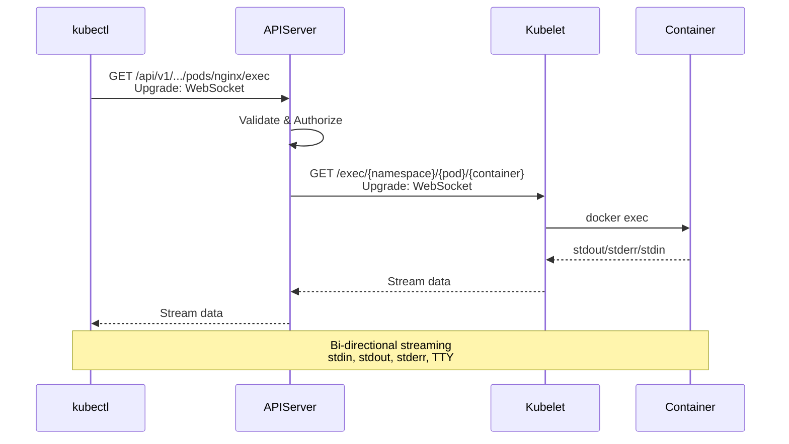

# Subresources

> **Low-Level Technical Specification**
> How Kubernetes implements special operations beyond standard CRUD: status, scale, log, exec, attach, proxy, and more.

---

## Table of Contents

- [Overview](#overview)
- [Status Subresource](#status-subresource)
- [Scale Subresource](#scale-subresource)
- [Log Subresource](#log-subresource)
- [Exec Subresource](#exec-subresource)
- [Attach and PortForward](#attach-and-portforward)
- [Proxy Subresource](#proxy-subresource)
- [Approval Subresource](#approval-subresource)
- [Code References](#code-references)

---

## Overview

**Subresources** are special endpoints that provide operations beyond standard CRUD. They appear as path suffixes:

```
/api/v1/namespaces/{ns}/pods/{name}/status        ← Status subresource
/api/v1/namespaces/{ns}/pods/{name}/log          ← Log subresource
/api/v1/namespaces/{ns}/pods/{name}/exec         ← Exec subresource
/apis/apps/v1/namespaces/{ns}/deployments/{name}/scale  ← Scale subresource
```

### Common Subresources

| Subresource | Resources | HTTP Methods | Purpose |
|-------------|-----------|--------------|---------|
| **status** | Most resources | GET, PUT, PATCH | Update observed state |
| **scale** | Deployments, ReplicaSets, StatefulSets | GET, PUT, PATCH | Scale replicas |
| **log** | Pods | GET | Stream container logs |
| **exec** | Pods | GET (WebSocket/SPDY upgrade) | Execute commands |
| **attach** | Pods | GET (WebSocket/SPDY upgrade) | Attach to container |
| **portforward** | Pods | GET (WebSocket/SPDY upgrade) | Port forwarding |
| **proxy** | Pods, Services, Nodes | GET, PUT, POST, DELETE | HTTP proxy |
| **binding** | Pods | POST | Bind pod to node |
| **eviction** | Pods | POST | Evict pod |
| **approval** | CertificateSigningRequests | PUT | Approve/deny CSR |

**File Location**: `pkg/registry/core/pod/storage/storage.go` (example)

---

## Status Subresource

### Purpose

The **status subresource** separates spec (desired state) updates from status (observed state) updates:
- Controllers update status
- Users update spec
- Prevents conflicts

### URL Pattern

```
PUT /api/v1/namespaces/{namespace}/pods/{name}/status
```

### Implementation

```go
// pkg/registry/core/pod/storage/storage.go:200-280

type StatusREST struct {
    store *genericregistry.Store
}

func (r *StatusREST) New() runtime.Object {
    return &api.Pod{}
}

func (r *StatusREST) Get(ctx context.Context, name string, options *metav1.GetOptions) (runtime.Object, error) {
    return r.store.Get(ctx, name, options)
}

func (r *StatusREST) Update(ctx context.Context, name string, objInfo rest.UpdatedObjectInfo, createValidation rest.ValidateObjectFunc, updateValidation rest.ValidateObjectUpdateFunc, forceAllowCreate bool, options *metav1.UpdateOptions) (runtime.Object, bool, error) {
    // Delegate to store with status strategy
    return r.store.Update(ctx, name, objInfo, createValidation, updateValidation, false, options)
}
```

### Status Strategy

```go
// pkg/registry/core/pod/strategy.go:250-300

type podStatusStrategy struct {
    podStrategy
}

var StatusStrategy = podStatusStrategy{Strategy}

func (podStatusStrategy) PrepareForUpdate(ctx context.Context, obj, old runtime.Object) {
    newPod := obj.(*api.Pod)
    oldPod := old.(*api.Pod)

    // Spec is read-only in status updates
    newPod.Spec = oldPod.Spec

    // Labels and annotations are also read-only
    newPod.Labels = oldPod.Labels
    newPod.Annotations = oldPod.Annotations

    // Only status can be updated
}

func (podStatusStrategy) ValidateUpdate(ctx context.Context, obj, old runtime.Object) field.ErrorList {
    newPod := obj.(*api.Pod)
    oldPod := old.(*api.Pod)

    // Validate only status fields
    return validation.ValidatePodStatusUpdate(newPod, oldPod)
}
```

### Usage Example

```bash
# Update pod status (controller operation)
kubectl patch pod nginx --subresource=status -p '{"status":{"phase":"Running"}}'

# This prevents accidental spec changes when updating status
```

---

## Scale Subresource

### Purpose

The **scale subresource** provides a uniform interface for scaling resources:
- Deployments
- ReplicaSets
- StatefulSets
- ReplicationControllers

### URL Pattern

```
GET /apis/apps/v1/namespaces/{namespace}/deployments/{name}/scale
PUT /apis/apps/v1/namespaces/{namespace}/deployments/{name}/scale
```

### Scale Object

```go
// staging/src/k8s.io/api/autoscaling/v1/types.go

type Scale struct {
    metav1.TypeMeta   `json:",inline"`
    metav1.ObjectMeta `json:"metadata,omitempty"`

    // Spec: desired number of replicas
    Spec ScaleSpec `json:"spec,omitempty"`

    // Status: actual number of replicas
    Status ScaleStatus `json:"status,omitempty"`
}

type ScaleSpec struct {
    Replicas int32 `json:"replicas,omitempty"`
}

type ScaleStatus struct {
    Replicas int32  `json:"replicas"`
    Selector string `json:"selector,omitempty"`
}
```

### Implementation

```go
// pkg/registry/apps/deployment/storage/storage.go:150-250

type ScaleREST struct {
    store *genericregistry.Store
}

func (r *ScaleREST) New() runtime.Object {
    return &autoscaling.Scale{}
}

func (r *ScaleREST) Get(ctx context.Context, name string, options *metav1.GetOptions) (runtime.Object, error) {
    // Get deployment
    obj, err := r.store.Get(ctx, name, options)
    if err != nil {
        return nil, err
    }

    deployment := obj.(*apps.Deployment)

    // Convert to Scale object
    scale := &autoscaling.Scale{
        ObjectMeta: metav1.ObjectMeta{
            Name:              deployment.Name,
            Namespace:         deployment.Namespace,
            ResourceVersion:   deployment.ResourceVersion,
            CreationTimestamp: deployment.CreationTimestamp,
        },
        Spec: autoscaling.ScaleSpec{
            Replicas: *deployment.Spec.Replicas,
        },
        Status: autoscaling.ScaleStatus{
            Replicas: deployment.Status.Replicas,
            Selector: metav1.FormatLabelSelector(deployment.Spec.Selector),
        },
    }

    return scale, nil
}

func (r *ScaleREST) Update(ctx context.Context, name string, objInfo rest.UpdatedObjectInfo, createValidation rest.ValidateObjectFunc, updateValidation rest.ValidateObjectUpdateFunc, forceAllowCreate bool, options *metav1.UpdateOptions) (runtime.Object, bool, error) {

    // Update only replicas field
    obj, _, err := r.store.Update(
        ctx, name,
        &scaleUpdatedObjectInfo{name: name, reqObjInfo: objInfo},
        toScaleCreateValidation(createValidation),
        toScaleUpdateValidation(updateValidation),
        false,
        options,
    )

    if err != nil {
        return nil, false, err
    }

    deployment := obj.(*apps.Deployment)

    // Return Scale object
    return r.Get(ctx, name, &metav1.GetOptions{})
}

// scaleUpdatedObjectInfo converts Scale updates to Deployment updates
type scaleUpdatedObjectInfo struct {
    name       string
    reqObjInfo rest.UpdatedObjectInfo
}

func (i *scaleUpdatedObjectInfo) UpdatedObject(ctx context.Context, oldObj runtime.Object) (runtime.Object, error) {
    deployment := oldObj.(*apps.Deployment).DeepCopy()

    // Get updated Scale object
    scaleObj, err := i.reqObjInfo.UpdatedObject(ctx, &autoscaling.Scale{
        ObjectMeta: metav1.ObjectMeta{
            Name:            deployment.Name,
            Namespace:       deployment.Namespace,
            ResourceVersion: deployment.ResourceVersion,
        },
        Spec: autoscaling.ScaleSpec{
            Replicas: *deployment.Spec.Replicas,
        },
        Status: autoscaling.ScaleStatus{
            Replicas: deployment.Status.Replicas,
        },
    })
    if err != nil {
        return nil, err
    }

    scale := scaleObj.(*autoscaling.Scale)

    // Update only replicas
    deployment.Spec.Replicas = &scale.Spec.Replicas

    return deployment, nil
}
```

### Usage Example

```bash
# Scale deployment
kubectl scale deployment nginx --replicas=5

# Equivalent to:
# kubectl patch deployment nginx --subresource=scale -p '{"spec":{"replicas":5}}'
```

---

## Log Subresource

### Purpose

The **log subresource** streams container logs from kubelet:

```
GET /api/v1/namespaces/{namespace}/pods/{name}/log?container={container}&follow=true
```

### Implementation

```go
// pkg/registry/core/pod/storage/storage.go:400-500

type LogREST struct {
    store         *genericregistry.Store
    kubeletClient kubelet.ConnectionInfoGetter
}

func (r *LogREST) New() runtime.Object {
    return &api.PodLogOptions{}
}

func (r *LogREST) Get(ctx context.Context, name string, opts runtime.Object) (runtime.Object, error) {
    logOpts := opts.(*api.PodLogOptions)

    // Get pod
    obj, err := r.store.Get(ctx, name, &metav1.GetOptions{})
    if err != nil {
        return nil, err
    }
    pod := obj.(*api.Pod)

    // Validate container name
    if len(logOpts.Container) == 0 {
        logOpts.Container = pod.Spec.Containers[0].Name
    }

    // Get kubelet connection info
    location, transport, err := pod.GetLocation(pod, r.kubeletClient, logOpts.Container)
    if err != nil {
        return nil, err
    }

    // Build kubelet URL
    // https://{node-ip}:10250/containerLogs/{namespace}/{pod}/{container}
    location.RawQuery = url.Values{
        "follow":     {strconv.FormatBool(logOpts.Follow)},
        "previous":   {strconv.FormatBool(logOpts.Previous)},
        "timestamps": {strconv.FormatBool(logOpts.Timestamps)},
        "tailLines":  {strconv.FormatInt(*logOpts.TailLines, 10)},
    }.Encode()

    // Return streaming response
    return &rest.LocationStreamer{
        Location:        location,
        Transport:       transport,
        ContentType:     "text/plain",
        Flush:           logOpts.Follow,
        ResponseChecker: r.checkPodLog,
        RedirectChecker: nil,
    }, nil
}

func (r *LogREST) checkPodLog(req *http.Request, resp *http.Response) error {
    if resp.StatusCode != http.StatusOK {
        return fmt.Errorf("failed to get logs: %v", resp.Status)
    }
    return nil
}
```

### Usage Example

```bash
# Get logs
kubectl logs nginx

# Follow logs
kubectl logs -f nginx

# Get previous container logs (after restart)
kubectl logs nginx --previous

# Tail last 100 lines
kubectl logs nginx --tail=100

# With timestamps
kubectl logs nginx --timestamps
```

---

## Exec Subresource

### Purpose

The **exec subresource** executes commands inside containers:

```
GET /api/v1/namespaces/{namespace}/pods/{name}/exec?container={container}&command={cmd}
```

### Protocol Upgrade

Exec uses WebSocket or SPDY protocol upgrade for bi-directional streaming:



### Implementation

```go
// pkg/registry/core/pod/storage/storage.go:500-600

type ExecREST struct {
    store         *genericregistry.Store
    kubeletClient kubelet.ConnectionInfoGetter
}

func (r *ExecREST) New() runtime.Object {
    return &api.PodExecOptions{}
}

func (r *ExecREST) Connect(ctx context.Context, name string, opts runtime.Object, responder rest.Responder) (http.Handler, error) {
    execOpts := opts.(*api.PodExecOptions)

    // Get pod
    obj, err := r.store.Get(ctx, name, &metav1.GetOptions{})
    if err != nil {
        return nil, err
    }
    pod := obj.(*api.Pod)

    // Validate pod is running
    if pod.Status.Phase != api.PodRunning {
        return nil, fmt.Errorf("pod not running: %s", pod.Status.Phase)
    }

    // Validate container
    if len(execOpts.Container) == 0 {
        execOpts.Container = pod.Spec.Containers[0].Name
    }

    // Get kubelet connection
    location, transport, err := pod.GetExecLocation(pod, r.kubeletClient, execOpts.Container)

    // Build exec URL
    // https://{node-ip}:10250/exec/{namespace}/{pod}/{container}
    params := url.Values{}
    for _, cmd := range execOpts.Command {
        params.Add("command", cmd)
    }
    params.Set("stdin", strconv.FormatBool(execOpts.Stdin))
    params.Set("stdout", strconv.FormatBool(execOpts.Stdout))
    params.Set("stderr", strconv.FormatBool(execOpts.Stderr))
    params.Set("tty", strconv.FormatBool(execOpts.TTY))
    location.RawQuery = params.Encode()

    // Return upgrade handler
    return &rest.UpgradeAwareProxyHandler{
        Location:      location,
        Transport:     transport,
        UpgradeConfig: &transport.UpgradeConfig{
            MaxBytesPerSec:  1024 * 1024,  // 1 MB/s
            PingPeriod:      30 * time.Second,
        },
    }, nil
}
```

### Usage Example

```bash
# Execute command
kubectl exec nginx -- ls /

# Interactive shell
kubectl exec -it nginx -- /bin/bash

# Specific container
kubectl exec -it nginx -c sidecar -- /bin/sh
```

---

## Attach and PortForward

### Attach Subresource

Similar to exec but attaches to existing container process:

```go
type AttachREST struct {
    store         *genericregistry.Store
    kubeletClient kubelet.ConnectionInfoGetter
}

func (r *AttachREST) Connect(ctx context.Context, name string, opts runtime.Object, responder rest.Responder) (http.Handler, error) {
    attachOpts := opts.(*api.PodAttachOptions)

    // Get pod and build kubelet URL
    // https://{node-ip}:10250/attach/{namespace}/{pod}/{container}

    return &rest.UpgradeAwareProxyHandler{
        Location:      location,
        Transport:     transport,
        UpgradeConfig: upgradeConfig,
    }, nil
}
```

**Usage**:
```bash
kubectl attach nginx -it
```

### PortForward Subresource

Forwards local ports to pod ports:

```go
type PortForwardREST struct {
    store         *genericregistry.Store
    kubeletClient kubelet.ConnectionInfoGetter
}

func (r *PortForwardREST) Connect(ctx context.Context, name string, opts runtime.Object, responder rest.Responder) (http.Handler, error) {
    pfOpts := opts.(*api.PodPortForwardOptions)

    // Get pod and build kubelet URL
    // https://{node-ip}:10250/portForward/{namespace}/{pod}

    return &rest.UpgradeAwareProxyHandler{
        Location:      location,
        Transport:     transport,
        UpgradeConfig: upgradeConfig,
    }, nil
}
```

**Usage**:
```bash
# Forward local port 8080 to pod port 80
kubectl port-forward nginx 8080:80

# Forward multiple ports
kubectl port-forward nginx 8080:80 8443:443
```

---

## Proxy Subresource

### Purpose

The **proxy subresource** provides HTTP proxy to pods, services, and nodes:

```
GET /api/v1/namespaces/{namespace}/pods/{name}/proxy/{path}
GET /api/v1/namespaces/{namespace}/services/{name}/proxy/{path}
GET /api/v1/nodes/{name}/proxy/{path}
```

### Implementation

```go
// pkg/registry/core/pod/storage/storage.go:700-800

type ProxyREST struct {
    store          *genericregistry.Store
    proxyTransport http.RoundTripper
}

func (r *ProxyREST) Connect(ctx context.Context, name string, opts runtime.Object, responder rest.Responder) (http.Handler, error) {
    proxyOpts := opts.(*api.PodProxyOptions)

    // Get pod
    obj, err := r.store.Get(ctx, name, &metav1.GetOptions{})
    if err != nil {
        return nil, err
    }
    pod := obj.(*api.Pod)

    // Get pod IP
    if pod.Status.PodIP == "" {
        return nil, fmt.Errorf("pod has no IP")
    }

    // Build proxy URL
    // http://{pod-ip}:{port}/{path}
    location := &url.URL{
        Scheme: "http",
        Host:   net.JoinHostPort(pod.Status.PodIP, proxyOpts.Port),
        Path:   proxyOpts.Path,
    }

    // Return reverse proxy
    return newThrottledUpgradeAwareProxyHandler(location, r.proxyTransport, true, false, responder), nil
}
```

### Usage Example

```bash
# Proxy to pod (requires pod to serve HTTP)
kubectl proxy &
curl http://localhost:8001/api/v1/namespaces/default/pods/nginx/proxy/

# Proxy to service
curl http://localhost:8001/api/v1/namespaces/default/services/nginx/proxy/

# Proxy to node
curl http://localhost:8001/api/v1/nodes/worker-1/proxy/stats/
```

---

## Approval Subresource

### Purpose

The **approval subresource** approves or denies CertificateSigningRequests:

```
PUT /apis/certificates.k8s.io/v1/certificatesigningrequests/{name}/approval
```

### Implementation

```go
// pkg/registry/certificates/certificates/storage/approval.go

type ApprovalREST struct {
    store *genericregistry.Store
}

func (r *ApprovalREST) Update(ctx context.Context, name string, objInfo rest.UpdatedObjectInfo, createValidation rest.ValidateObjectFunc, updateValidation rest.ValidateObjectUpdateFunc, forceAllowCreate bool, options *metav1.UpdateOptions) (runtime.Object, bool, error) {

    // Delegate to store with approval strategy
    return r.store.Update(ctx, name, objInfo, createValidation, updateValidation, false, options)
}

// Approval strategy allows only approval-related changes
type approvalStrategy struct {
    certificateStrategy
}

func (approvalStrategy) PrepareForUpdate(ctx context.Context, obj, old runtime.Object) {
    newCSR := obj.(*certificates.CertificateSigningRequest)
    oldCSR := old.(*certificates.CertificateSigningRequest)

    // Only conditions can be updated
    newCSR.Spec = oldCSR.Spec
    newCSR.Status.Certificate = oldCSR.Status.Certificate
}
```

### Usage Example

```bash
# Approve CSR
kubectl certificate approve my-csr

# Deny CSR
kubectl certificate deny my-csr
```

---

## Code References

### Key Files

| Subresource | File | Description |
|-------------|------|-------------|
| **Status** | `pkg/registry/core/pod/storage/storage.go` | StatusREST implementation |
| **Scale** | `pkg/registry/apps/deployment/storage/storage.go` | ScaleREST for deployments |
| **Log** | `pkg/registry/core/pod/storage/storage.go` | LogREST implementation |
| **Exec** | `pkg/registry/core/pod/storage/storage.go` | ExecREST implementation |
| **Attach** | `pkg/registry/core/pod/storage/storage.go` | AttachREST implementation |
| **PortForward** | `pkg/registry/core/pod/storage/storage.go` | PortForwardREST implementation |
| **Proxy** | `pkg/registry/core/pod/storage/storage.go` | ProxyREST implementation |
| **Approval** | `pkg/registry/certificates/certificates/storage/approval.go` | ApprovalREST implementation |

### Key Functions

```go
// Status subresource
pkg/registry/core/pod/storage/storage.go:200-280
type StatusREST struct { ... }
func (r *StatusREST) Update(ctx, name, objInfo, ...) (runtime.Object, bool, error)

// Scale subresource
pkg/registry/apps/deployment/storage/storage.go:150-250
type ScaleREST struct { ... }
func (r *ScaleREST) Get(ctx, name, options) (runtime.Object, error)
func (r *ScaleREST) Update(ctx, name, objInfo, ...) (runtime.Object, bool, error)

// Log subresource
pkg/registry/core/pod/storage/storage.go:400-500
type LogREST struct { ... }
func (r *LogREST) Get(ctx, name, opts) (runtime.Object, error)

// Exec subresource
pkg/registry/core/pod/storage/storage.go:500-600
type ExecREST struct { ... }
func (r *ExecREST) Connect(ctx, name, opts, responder) (http.Handler, error)
```

---

## Summary

Subresources provide **specialized operations beyond CRUD**:

1. **Status** - Separate spec from status updates
2. **Scale** - Uniform scaling interface
3. **Log** - Stream container logs
4. **Exec** - Execute commands in containers
5. **Attach** - Attach to running processes
6. **PortForward** - TCP port forwarding
7. **Proxy** - HTTP reverse proxy
8. **Approval** - CSR approval/denial

**Implementation Patterns**:
- Custom REST types (StatusREST, LogREST, etc.)
- Strategy pattern for field restrictions
- Protocol upgrade for streaming
- Reverse proxy for HTTP forwarding

**Next Steps**:
- [Registry Pattern](02-registry-pattern.md) - Generic CRUD
- [Handler Chain](01-handler-chain-construction.md) - Request processing
- [Type System](05-type-system.md) - API types

---

**Related Documentation**:
- [API Groups Registration](../middle-level/03-api-groups-registration.md) - How subresources are registered
- [QUICK-REFERENCE.md](../QUICK-REFERENCE.md) - Quick reference
