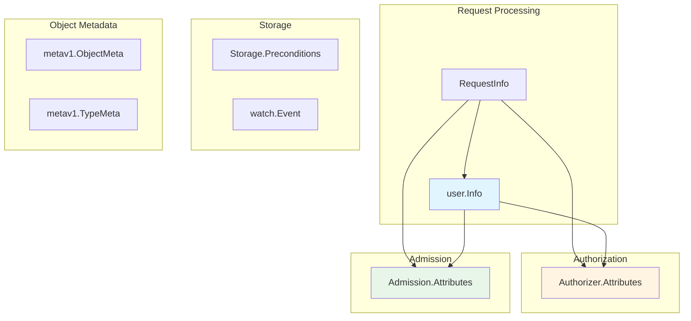

# Key Data Structures

> **Low-Level Technical Specification**
> Essential data structures used throughout kube-apiserver: user.Info, Attributes, Preconditions, and more.

---

## Table of Contents

- [Overview](#overview)
- [user.Info](#userinfo)
- [Authorization Attributes](#authorization-attributes)
- [Admission Attributes](#admission-attributes)
- [Storage Preconditions](#storage-preconditions)
- [RequestInfo](#requestinfo)
- [Watch Event](#watch-event)
- [ObjectMeta](#objectmeta)
- [Code References](#code-references)

---

## Overview

Kube-apiserver uses several key data structures to pass information between components. Understanding these structures is essential for understanding how the API server works.

### Structure Categories



---

## user.Info

### Interface Definition

```go
// staging/src/k8s.io/apiserver/pkg/authentication/user/user.go:25-50

package user

type Info interface {
    // GetName returns the username
    GetName() string

    // GetUID returns a unique identifier for the user
    GetUID() string

    // GetGroups returns the groups the user belongs to
    GetGroups() []string

    // GetExtra returns additional user information
    GetExtra() map[string][]string
}
```

### Default Implementation

```go
type DefaultInfo struct {
    Name   string
    UID    string
    Groups []string
    Extra  map[string][]string
}

func (i *DefaultInfo) GetName() string {
    return i.Name
}

func (i *DefaultInfo) GetUID() string {
    return i.UID
}

func (i *DefaultInfo) GetGroups() []string {
    return i.Groups
}

func (i *DefaultInfo) GetExtra() map[string][]string {
    return i.Extra
}
```

### Examples

**Regular user**:
```go
&user.DefaultInfo{
    Name: "alice",
    Groups: []string{
        "developers",
        "ops",
        "system:authenticated",
    },
}
```

**Service account**:
```go
&user.DefaultInfo{
    Name: "system:serviceaccount:default:my-app",
    UID:  "12345678-1234-1234-1234-123456789012",
    Groups: []string{
        "system:serviceaccounts",
        "system:serviceaccounts:default",
        "system:authenticated",
    },
}
```

**Kubelet**:
```go
&user.DefaultInfo{
    Name: "system:node:worker-1",
    Groups: []string{
        "system:nodes",
        "system:authenticated",
    },
}
```

**Anonymous**:
```go
&user.DefaultInfo{
    Name:   "system:anonymous",
    Groups: []string{"system:unauthenticated"},
}
```

### Standard Users and Groups

**Special Users**:
- `system:admin` - Cluster administrator
- `system:anonymous` - Unauthenticated user
- `system:kube-controller-manager` - Controller manager
- `system:kube-scheduler` - Scheduler
- `system:kube-proxy` - Kube-proxy
- `system:node:<node-name>` - Kubelet on specific node
- `system:serviceaccount:<namespace>:<name>` - Service account

**Special Groups**:
- `system:authenticated` - All authenticated users
- `system:unauthenticated` - Anonymous user
- `system:serviceaccounts` - All service accounts
- `system:serviceaccounts:<namespace>` - Service accounts in namespace
- `system:nodes` - All nodes (kubelets)
- `system:masters` - Legacy admin group (deprecated)

---

## Authorization Attributes

### Interface Definition

```go
// staging/src/k8s.io/apiserver/pkg/authorization/authorizer/interfaces.go:50-100

type Attributes interface {
    // User who made the request
    GetUser() user.Info

    // Verb: get, list, create, update, patch, delete, deletecollection, watch
    GetVerb() string

    // Namespace of the request (empty for cluster-scoped)
    GetNamespace() string

    // API group ("" for core, "apps", "batch", etc.)
    GetAPIGroup() string

    // API version ("v1", "v1beta1", etc.)
    GetAPIVersion() string

    // Resource ("pods", "services", "deployments")
    GetResource() string

    // Subresource ("status", "log", "exec", "scale")
    GetSubresource() string

    // Name of the specific resource instance
    GetName() string

    // IsResourceRequest: true for resource requests, false for non-resource URLs
    IsResourceRequest() bool

    // Path for non-resource requests (/healthz, /metrics, etc.)
    GetPath() string
}
```

### AttributesRecord Implementation

```go
// staging/src/k8s.io/apiserver/pkg/authorization/authorizer/interfaces.go:120-180

type AttributesRecord struct {
    User            user.Info
    Verb            string
    Namespace       string
    APIGroup        string
    APIVersion      string
    Resource        string
    Subresource     string
    Name            string
    ResourceRequest bool
    Path            string
}

func (a AttributesRecord) GetUser() user.Info { return a.User }
func (a AttributesRecord) GetVerb() string { return a.Verb }
func (a AttributesRecord) GetNamespace() string { return a.Namespace }
func (a AttributesRecord) GetAPIGroup() string { return a.APIGroup }
func (a AttributesRecord) GetAPIVersion() string { return a.APIVersion }
func (a AttributesRecord) GetResource() string { return a.Resource }
func (a AttributesRecord) GetSubresource() string { return a.Subresource }
func (a AttributesRecord) GetName() string { return a.Name }
func (a AttributesRecord) IsResourceRequest() bool { return a.ResourceRequest }
func (a AttributesRecord) GetPath() string { return a.Path }
```

### Examples

**GET a specific pod**:
```go
AttributesRecord{
    User:            &user.DefaultInfo{Name: "alice", ...},
    Verb:            "get",
    Namespace:       "default",
    APIGroup:        "",
    APIVersion:      "v1",
    Resource:        "pods",
    Name:            "nginx",
    Subresource:     "",
    ResourceRequest: true,
}
```

**LIST pods**:
```go
AttributesRecord{
    User:            &user.DefaultInfo{Name: "alice", ...},
    Verb:            "list",
    Namespace:       "default",
    APIGroup:        "",
    APIVersion:      "v1",
    Resource:        "pods",
    Name:            "",  // Empty for list
    Subresource:     "",
    ResourceRequest: true,
}
```

**GET pod logs (subresource)**:
```go
AttributesRecord{
    User:            &user.DefaultInfo{Name: "alice", ...},
    Verb:            "get",
    Namespace:       "default",
    APIGroup:        "",
    APIVersion:      "v1",
    Resource:        "pods",
    Name:            "nginx",
    Subresource:     "log",  // Subresource
    ResourceRequest: true,
}
```

**Non-resource URL**:
```go
AttributesRecord{
    User:            &user.DefaultInfo{Name: "alice", ...},
    Verb:            "get",
    ResourceRequest: false,
    Path:            "/healthz",  // Non-resource path
}
```

---

## Admission Attributes

### Interface Definition

```go
// staging/src/k8s.io/apiserver/pkg/admission/interfaces.go:80-150

type Attributes interface {
    // GetName returns the object name
    GetName() string

    // GetNamespace returns the namespace
    GetNamespace() string

    // GetResource returns the resource being accessed
    GetResource() schema.GroupVersionResource

    // GetSubresource returns the subresource
    GetSubresource() string

    // GetOperation returns the operation (CREATE, UPDATE, DELETE, CONNECT)
    GetOperation() Operation

    // GetOperationOptions returns operation-specific options
    GetOperationOptions() runtime.Object

    // IsDryRun returns true for dry-run requests
    IsDryRun() bool

    // GetObject returns the new object (for CREATE, UPDATE)
    GetObject() runtime.Object

    // GetOldObject returns the existing object (for UPDATE, DELETE)
    GetOldObject() runtime.Object

    // GetKind returns the object kind
    GetKind() schema.GroupVersionKind

    // GetUserInfo returns the user making the request
    GetUserInfo() user.Info
}

type Operation string

const (
    Create  Operation = "CREATE"
    Update  Operation = "UPDATE"
    Delete  Operation = "DELETE"
    Connect Operation = "CONNECT"
)
```

### AttributesRecord Implementation

```go
// staging/src/k8s.io/apiserver/pkg/admission/attributes.go:30-120

type attributesRecord struct {
    name              string
    namespace         string
    gvk               schema.GroupVersionKind
    gvr               schema.GroupVersionResource
    subresource       string
    operation         Operation
    operationOptions  runtime.Object
    dryRun            bool
    object            runtime.Object
    oldObject         runtime.Object
    userInfo          user.Info
}

func NewAttributesRecord(
    object runtime.Object,
    oldObject runtime.Object,
    gvk schema.GroupVersionKind,
    namespace string,
    name string,
    gvr schema.GroupVersionResource,
    subresource string,
    operation Operation,
    operationOptions runtime.Object,
    dryRun bool,
    userInfo user.Info,
) Attributes {
    return &attributesRecord{
        name:             name,
        namespace:        namespace,
        gvk:              gvk,
        gvr:              gvr,
        subresource:      subresource,
        operation:        operation,
        operationOptions: operationOptions,
        dryRun:           dryRun,
        object:           object,
        oldObject:        oldObject,
        userInfo:         userInfo,
    }
}
```

### Examples

**CREATE pod**:
```go
admission.NewAttributesRecord(
    newPod,              // The pod being created
    nil,                 // No old object for CREATE
    schema.GroupVersionKind{Group: "", Version: "v1", Kind: "Pod"},
    "default",           // Namespace
    "nginx",             // Name
    schema.GroupVersionResource{Group: "", Version: "v1", Resource: "pods"},
    "",                  // No subresource
    admission.Create,    // Operation
    &metav1.CreateOptions{},
    false,               // Not dry-run
    userInfo,
)
```

**UPDATE deployment**:
```go
admission.NewAttributesRecord(
    newDeployment,       // Updated deployment
    oldDeployment,       // Existing deployment
    schema.GroupVersionKind{Group: "apps", Version: "v1", Kind: "Deployment"},
    "default",
    "web-app",
    schema.GroupVersionResource{Group: "apps", Version: "v1", Resource: "deployments"},
    "",
    admission.Update,
    &metav1.UpdateOptions{},
    false,
    userInfo,
)
```

**DELETE pod**:
```go
admission.NewAttributesRecord(
    nil,                 // No new object for DELETE
    existingPod,         // The pod being deleted
    schema.GroupVersionKind{Group: "", Version: "v1", Kind: "Pod"},
    "default",
    "nginx",
    schema.GroupVersionResource{Group: "", Version: "v1", Resource: "pods"},
    "",
    admission.Delete,
    &metav1.DeleteOptions{GracePeriodSeconds: pointer.Int64(30)},
    false,
    userInfo,
)
```

---

## Storage Preconditions

### Structure Definition

```go
// staging/src/k8s.io/apiserver/pkg/storage/interfaces.go:180-195

type Preconditions struct {
    // UID must match (prevents delete/recreate races)
    UID *types.UID

    // ResourceVersion must match (optimistic locking)
    ResourceVersion *string
}
```

### Usage

```go
// Ensure object hasn't been deleted and recreated
preconditions := &storage.Preconditions{
    UID:             &pod.UID,
    ResourceVersion: &pod.ResourceVersion,
}

err := storage.GuaranteedUpdate(
    ctx, key, out, false,
    preconditions,  // Check these before updating
    updateFunc,
    nil,
)

if err != nil {
    if storage.IsConflict(err) {
        // Precondition failed: concurrent update or delete/recreate
    }
}
```

### Examples

**Update with preconditions**:
```go
pod := &v1.Pod{
    ObjectMeta: metav1.ObjectMeta{
        Name:            "nginx",
        Namespace:       "default",
        UID:             "12345678-1234-1234-1234-123456789012",
        ResourceVersion: "98765",
    },
    Spec: v1.PodSpec{...},
}

preconditions := &storage.Preconditions{
    UID:             &pod.UID,              // Must match
    ResourceVersion: &pod.ResourceVersion,  // Must match
}

// Update will fail if:
// - UID doesn't match (object was deleted and recreated)
// - ResourceVersion doesn't match (someone else updated it)
```

**Update without preconditions** (unsafe):
```go
// No preconditions = overwrite regardless of current state
err := storage.GuaranteedUpdate(ctx, key, out, false, nil, updateFunc, nil)
```

---

## RequestInfo

### Structure Definition

```go
// staging/src/k8s.io/apiserver/pkg/endpoints/request/requestinfo.go:30-80

type RequestInfo struct {
    // IsResourceRequest: true for resource requests, false for non-resource URLs
    IsResourceRequest bool

    // Path: full request path
    Path string

    // Verb: get, list, create, update, patch, delete, deletecollection, watch
    Verb string

    // APIPrefix: "api" or "apis"
    APIPrefix string

    // APIGroup: "" for core, "apps", "batch", etc.
    APIGroup string

    // APIVersion: "v1", "v1beta1", etc.
    APIVersion string

    // Namespace: namespace (empty for cluster-scoped)
    Namespace string

    // Resource: "pods", "services", etc.
    Resource string

    // Subresource: "status", "log", "exec", etc.
    Subresource string

    // Name: specific resource name (empty for list)
    Name string

    // Parts: path components
    Parts []string
}
```

### Examples

**GET /api/v1/namespaces/default/pods/nginx**:
```go
&RequestInfo{
    IsResourceRequest: true,
    Path:              "/api/v1/namespaces/default/pods/nginx",
    Verb:              "get",
    APIPrefix:         "api",
    APIGroup:          "",
    APIVersion:        "v1",
    Namespace:         "default",
    Resource:          "pods",
    Name:              "nginx",
    Subresource:       "",
    Parts:             []string{"api", "v1", "namespaces", "default", "pods", "nginx"},
}
```

**LIST /apis/apps/v1/deployments?watch=1**:
```go
&RequestInfo{
    IsResourceRequest: true,
    Path:              "/apis/apps/v1/deployments",
    Verb:              "watch",  // watch=1 query param
    APIPrefix:         "apis",
    APIGroup:          "apps",
    APIVersion:        "v1",
    Namespace:         "",  // Cluster-scoped list
    Resource:          "deployments",
    Name:              "",  // Empty for list
    Subresource:       "",
}
```

**GET /api/v1/namespaces/default/pods/nginx/log**:
```go
&RequestInfo{
    IsResourceRequest: true,
    Verb:              "get",
    APIGroup:          "",
    APIVersion:        "v1",
    Namespace:         "default",
    Resource:          "pods",
    Name:              "nginx",
    Subresource:       "log",  // Subresource
}
```

**GET /healthz** (non-resource):
```go
&RequestInfo{
    IsResourceRequest: false,
    Path:              "/healthz",
    Verb:              "get",
}
```

---

## Watch Event

### Structure Definition

```go
// staging/src/k8s.io/apimachinery/pkg/watch/watch.go:30-60

type EventType string

const (
    Added    EventType = "ADDED"
    Modified EventType = "MODIFIED"
    Deleted  EventType = "DELETED"
    Bookmark EventType = "BOOKMARK"
    Error    EventType = "ERROR"
}

type Event struct {
    Type   EventType
    Object runtime.Object
}
```

### Examples

**ADDED event**:
```go
watch.Event{
    Type: watch.Added,
    Object: &v1.Pod{
        ObjectMeta: metav1.ObjectMeta{
            Name:            "nginx",
            Namespace:       "default",
            ResourceVersion: "12345",
        },
        Spec: v1.PodSpec{...},
    },
}
```

**MODIFIED event**:
```go
watch.Event{
    Type: watch.Modified,
    Object: &v1.Pod{
        ObjectMeta: metav1.ObjectMeta{
            Name:            "nginx",
            Namespace:       "default",
            ResourceVersion: "12346",  // Incremented
        },
        Spec: v1.PodSpec{...},
        Status: v1.PodStatus{Phase: v1.PodRunning},  // Status changed
    },
}
```

**DELETED event**:
```go
watch.Event{
    Type: watch.Deleted,
    Object: &v1.Pod{
        ObjectMeta: metav1.ObjectMeta{
            Name:              "nginx",
            Namespace:         "default",
            ResourceVersion:   "12347",
            DeletionTimestamp: &metav1.Time{Time: time.Now()},
        },
    },
}
```

**BOOKMARK event**:
```go
watch.Event{
    Type: watch.Bookmark,
    Object: &metav1.Status{
        TypeMeta: metav1.TypeMeta{
            Kind:       "Pod",
            APIVersion: "v1",
        },
        Metadata: metav1.ObjectMeta{
            ResourceVersion: "12400",  // Current RV
        },
    },
}
```

**ERROR event** (410 Gone):
```go
watch.Event{
    Type: watch.Error,
    Object: &metav1.Status{
        Status:  "Failure",
        Message: "too old resource version: 10000 (current: 12000)",
        Reason:  "Expired",
        Code:    410,
    },
}
```

---

## ObjectMeta

### Structure Definition

```go
// staging/src/k8s.io/apimachinery/pkg/apis/meta/v1/types.go:110-280

type ObjectMeta struct {
    // Name: object name (unique within namespace)
    Name string `json:"name,omitempty"`

    // GenerateName: prefix for generated names
    GenerateName string `json:"generateName,omitempty"`

    // Namespace: object namespace
    Namespace string `json:"namespace,omitempty"`

    // UID: unique identifier
    UID types.UID `json:"uid,omitempty"`

    // ResourceVersion: optimistic concurrency control
    ResourceVersion string `json:"resourceVersion,omitempty"`

    // Generation: spec generation number
    Generation int64 `json:"generation,omitempty"`

    // CreationTimestamp: creation time
    CreationTimestamp Time `json:"creationTimestamp,omitempty"`

    // DeletionTimestamp: deletion time (nil if not deleted)
    DeletionTimestamp *Time `json:"deletionTimestamp,omitempty"`

    // DeletionGracePeriodSeconds: grace period for deletion
    DeletionGracePeriodSeconds *int64 `json:"deletionGracePeriodSeconds,omitempty"`

    // Labels: key-value pairs for organization
    Labels map[string]string `json:"labels,omitempty"`

    // Annotations: non-identifying metadata
    Annotations map[string]string `json:"annotations,omitempty"`

    // OwnerReferences: objects that own this object
    OwnerReferences []OwnerReference `json:"ownerReferences,omitempty"`

    // Finalizers: prevent deletion until cleared
    Finalizers []string `json:"finalizers,omitempty"`

    // ManagedFields: field management (server-side apply)
    ManagedFields []ManagedFieldsEntry `json:"managedFields,omitempty"`
}
```

### Key Fields

**Identifiers**:
- `Name`: Human-readable name
- `UID`: Immutable unique ID
- `Namespace`: Namespace (empty for cluster-scoped)

**Versioning**:
- `ResourceVersion`: etcd mod_revision (optimistic locking)
- `Generation`: Spec change counter

**Lifecycle**:
- `CreationTimestamp`: When object was created
- `DeletionTimestamp`: When deletion was requested
- `DeletionGracePeriodSeconds`: Graceful deletion period

**Organization**:
- `Labels`: Selectable key-value pairs
- `Annotations`: Non-selectable metadata

**Ownership**:
- `OwnerReferences`: Garbage collection
- `Finalizers`: Pre-deletion hooks

---

## Code References

### Key Files

| Structure | File | Description |
|-----------|------|-------------|
| **user.Info** | `staging/src/k8s.io/apiserver/pkg/authentication/user/user.go` | User identity |
| **AuthZ Attributes** | `staging/src/k8s.io/apiserver/pkg/authorization/authorizer/interfaces.go` | Authorization context |
| **Admission Attributes** | `staging/src/k8s.io/apiserver/pkg/admission/interfaces.go` | Admission context |
| **Preconditions** | `staging/src/k8s.io/apiserver/pkg/storage/interfaces.go` | Storage conditions |
| **RequestInfo** | `staging/src/k8s.io/apiserver/pkg/endpoints/request/requestinfo.go` | Parsed request |
| **Watch Event** | `staging/src/k8s.io/apimachinery/pkg/watch/watch.go` | Watch events |
| **ObjectMeta** | `staging/src/k8s.io/apimachinery/pkg/apis/meta/v1/types.go` | Object metadata |

---

## Summary

Key data structures in kube-apiserver:

1. **user.Info** - User identity and groups
2. **Authorizer.Attributes** - Authorization context
3. **Admission.Attributes** - Admission context with old/new objects
4. **Storage.Preconditions** - Optimistic locking
5. **RequestInfo** - Parsed HTTP request details
6. **watch.Event** - Watch stream events
7. **ObjectMeta** - Common object metadata

**Usage Throughout Pipeline**:
- Authentication → user.Info
- RequestInfo → Authorizer.Attributes
- user.Info + RequestInfo → Admission.Attributes
- Admission.Attributes → Storage operations
- Storage → watch.Event

**Next Steps**:
- [Handler Chain](01-handler-chain-construction.md) - Request flow
- [Type System](05-type-system.md) - API types
- [Registry Pattern](02-registry-pattern.md) - CRUD operations

---

**Related Documentation**:
- [Authentication](../middle-level/04-authentication.md) - user.Info creation
- [Authorization](../middle-level/05-authorization.md) - Attributes usage
- [Admission Control](../middle-level/06-admission-control.md) - Admission.Attributes
- [Watch Mechanism](../middle-level/07-watch-mechanism.md) - watch.Event
