# Request Pipeline

> **Middle-Level Architecture: Complete request processing flow from client to storage**

---

## Table of Contents

- [Overview](#overview)
- [Complete Pipeline](#complete-pipeline)
- [Pipeline Stages](#pipeline-stages)
- [Request Flow Examples](#request-flow-examples)
- [Error Handling](#error-handling)
- [Performance Considerations](#performance-considerations)

---

## Overview

Every API request flows through a **carefully orchestrated pipeline** with multiple stages, each responsible for a specific aspect of request processing.

### Pipeline Stages

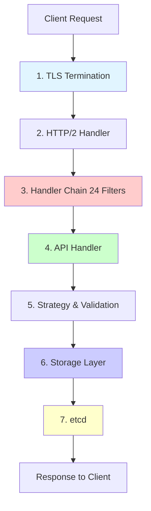

**Processing Time** (typical):
- Authentication: <1ms
- Authorization: <5ms
- Admission webhooks: 10-100ms
- Storage: 10-50ms
- **Total**: 20-200ms (p99)

---

## Complete Pipeline

### Full Request Flow Diagram

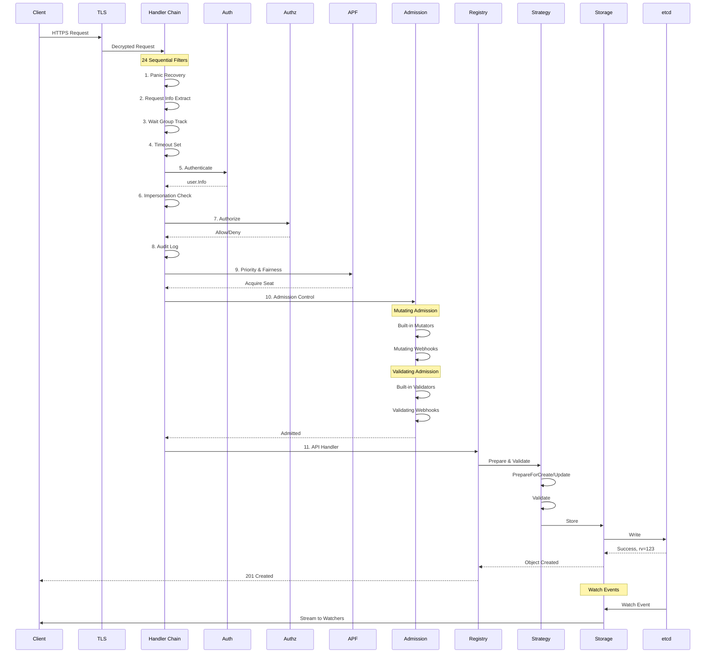

---

## Pipeline Stages

### Stage 1: TLS Termination

**Purpose**: Decrypt HTTPS traffic.

**Components**:
- TLS listener
- Certificate validation (for client cert authentication)
- HTTP/2 upgrade

**Configuration**:
```go
tlsConfig := &tls.Config{
    Certificates: []tls.Certificate{serverCert},
    ClientAuth:   tls.RequestClientCert,  // For X.509 auth
    MinVersion:   tls.VersionTLS12,
    CipherSuites: secureCipherSuites,
}
```

**File**: `staging/src/k8s.io/apiserver/pkg/server/secure_serving.go`

---

### Stage 2: HTTP/2 Handler

**Purpose**: Route request to appropriate handler.

**Director Pattern**:
```go
func (d director) ServeHTTP(w http.ResponseWriter, req *http.Request) {
    path := req.URL.Path

    // API requests → go-restful
    if strings.HasPrefix(path, "/apis/") ||
       strings.HasPrefix(path, "/api/") {
        d.goRestfulContainer.ServeHTTP(w, req)
        return
    }

    // Metrics, health, debug → direct mux
    d.nonGoRestfulMux.ServeHTTP(w, req)
}
```

**Routes**:
- `/api/*` → Core API handler
- `/apis/*` → Named API groups
- `/healthz` → Health check
- `/metrics` → Prometheus metrics
- `/openapi/*` → OpenAPI specs

---

### Stage 3: Handler Chain (24 Filters)

**Purpose**: Process request through security, observability, and control layers.

**Complete Filter List**:

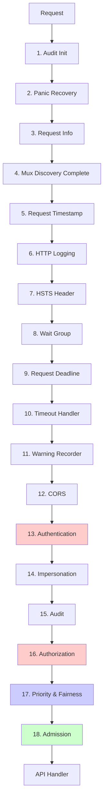

**Filter Details**:

| # | Filter | Can Short-Circuit | Purpose |
|---|--------|-------------------|---------|
| 1 | Audit Init | No | Initialize audit context |
| 2 | Panic Recovery | No | Catch panics, return 500 |
| 3 | Request Info | No | Extract verb, resource, namespace |
| 4 | Mux Discovery Complete | Yes | Ensure all paths registered |
| 5 | Request Timestamp | No | Track arrival time |
| 6 | HTTP Logging | No | Log all HTTP requests |
| 7 | HSTS Header | No | Add Strict-Transport-Security |
| 8 | Wait Group | No | Track in-flight requests |
| 9 | Request Deadline | No | Apply request timeout |
| 10 | Timeout Handler | No | Wrap with timeout context |
| 11 | Warning Recorder | No | Record deprecation warnings |
| 12 | CORS | Yes | CORS preflight handling |
| 13 | **Authentication** | **Yes** | **Verify identity** |
| 14 | Impersonation | No | Support user impersonation |
| 15 | Audit | No | Log operation |
| 16 | **Authorization** | **Yes** | **Check permissions** |
| 17 | **Priority & Fairness** | **Yes** | **Rate limiting** |
| 18 | **Admission** | **Yes** | **Validate/mutate** |

**File**: `staging/src/k8s.io/apiserver/pkg/server/config.go:1014-1091`

---

### Stage 4: Authentication

**Purpose**: Verify the identity of the requester.

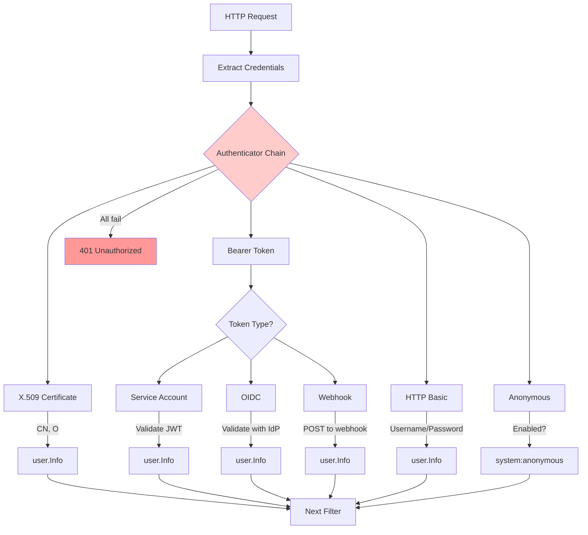

**Authentication Flow**:
1. Try each authenticator in sequence
2. First successful authenticator wins
3. Attach `user.Info` to request context
4. Remove sensitive headers (Authorization, Impersonate-*)
5. Continue to next filter

**User Information**:
```go
type Info interface {
    GetName() string          // "alice" or "system:serviceaccount:default:myapp"
    GetUID() string           // Unique ID
    GetGroups() []string      // ["system:authenticated", "developers"]
    GetExtra() map[string][]string  // Additional claims
}
```

**File**: `staging/src/k8s.io/apiserver/pkg/endpoints/filters/authentication.go`

**→ See**: [Authentication Details](04-authentication.md)

---

### Stage 5: Authorization

**Purpose**: Determine if the user has permission for the operation.

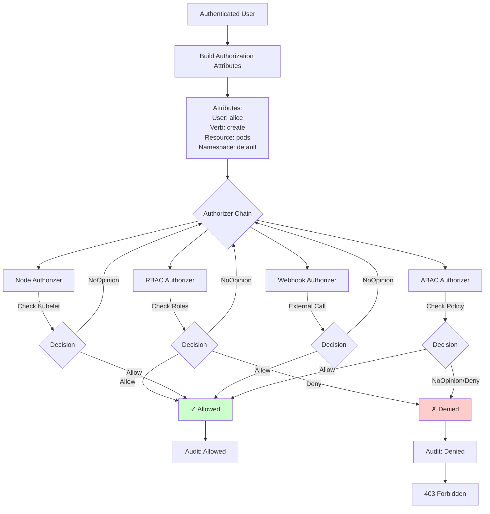

**Authorization Attributes**:
```go
type Attributes interface {
    GetUser() user.Info
    GetVerb() string              // get, list, create, update, delete, watch
    GetNamespace() string
    GetResource() string          // pods, services, deployments
    GetSubresource() string       // status, scale, log, exec
    GetName() string              // Specific resource name
    GetAPIGroup() string
    GetAPIVersion() string
}
```

**File**: `staging/src/k8s.io/apiserver/pkg/endpoints/filters/authorization.go`

**→ See**: [Authorization Details](05-authorization.md)

---

### Stage 6: Priority & Fairness (APF)

**Purpose**: Prevent API server overload through fair queuing.

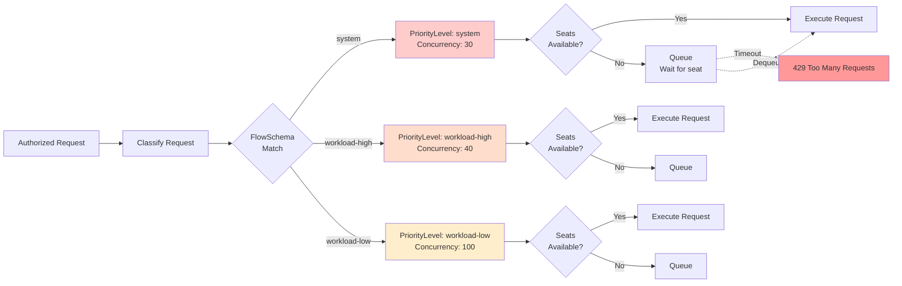

**Work Estimation**:
- **List**: Estimated by result size
- **Watch**: Fixed cost per watch
- **Create/Update**: Based on object size
- **Get**: Minimal cost

**File**: `staging/src/k8s.io/apiserver/pkg/util/flowcontrol/`

**→ See**: [APF Details](08-api-priority-fairness.md)

---

### Stage 7: Admission Control

**Purpose**: Validate and mutate requests before persistence.

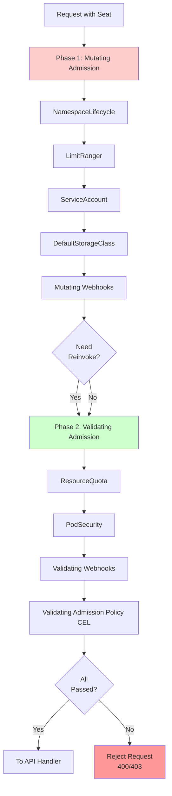

**Mutating Plugins** (Examples):
- **NamespaceLifecycle**: Prevent creating objects in terminating namespaces
- **ServiceAccount**: Inject service account token volumes
- **DefaultStorageClass**: Set default storage class for PVCs
- **MutatingAdmissionWebhook**: Call external mutation webhooks

**Validating Plugins** (Examples):
- **ResourceQuota**: Enforce resource quotas
- **PodSecurity**: Enforce Pod Security Standards
- **ValidatingAdmissionWebhook**: Call external validation webhooks
- **ValidatingAdmissionPolicy**: CEL-based validation

**File**: `staging/src/k8s.io/apiserver/pkg/admission/chain.go`

**→ See**: [Admission Control Details](06-admission-control.md)

---

### Stage 8: API Handler & Registry

**Purpose**: Execute the API operation (GET, CREATE, UPDATE, DELETE, etc.).

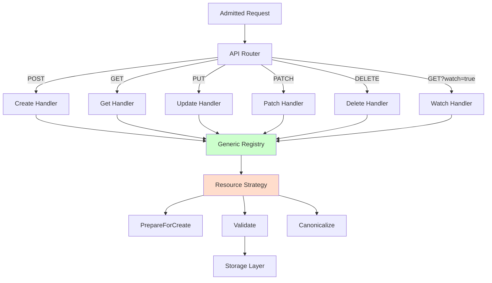

**Strategy Pattern**:
```go
type RESTCreateStrategy interface {
    NamespaceScoped() bool
    PrepareForCreate(ctx context.Context, obj runtime.Object)
    Validate(ctx context.Context, obj runtime.Object) field.ErrorList
    Canonicalize(obj runtime.Object)
}
```

**Example - Pod Creation**:
```go
func (podStrategy) PrepareForCreate(ctx context.Context, obj runtime.Object) {
    pod := obj.(*api.Pod)
    pod.Status = api.PodStatus{Phase: api.PodPending}
    pod.Generation = 1
    podutil.DropDisabledPodFields(pod, nil)
}

func (podStrategy) Validate(ctx context.Context, obj runtime.Object) field.ErrorList {
    pod := obj.(*api.Pod)
    return validation.ValidatePod(pod)
}
```

**Files**:
- Generic registry: `pkg/registry/generic/registry/store.go`
- Pod strategy: `pkg/registry/core/pod/strategy.go`

---

### Stage 9: Storage Layer

**Purpose**: Persist to etcd with caching.

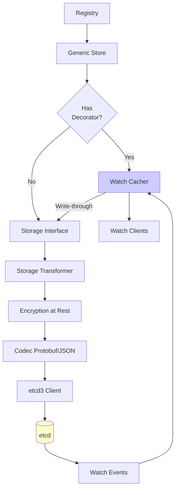

**Storage Operations**:
```go
// Create
err := storage.Create(ctx, key, obj, out, ttl)

// Get
err := storage.Get(ctx, key, opts, out)

// Update (with optimistic locking)
err := storage.GuaranteedUpdate(ctx, key, out, ignoreNotFound,
    &storage.Preconditions{
        UID: &obj.UID,
        ResourceVersion: &obj.ResourceVersion,
    },
    func(existing runtime.Object) (runtime.Object, error) {
        // Update logic
        return updated, nil
    })

// Delete
err := storage.Delete(ctx, key, out, preconditions, validateDeletion)

// Watch
watcher, err := storage.Watch(ctx, key, opts)
```

**File**: `staging/src/k8s.io/apiserver/pkg/storage/etcd3/store.go`

**→ See**: [Storage Layer Details](02-storage-layer.md)

---

## Request Flow Examples

### Example 1: Create Pod (Success)

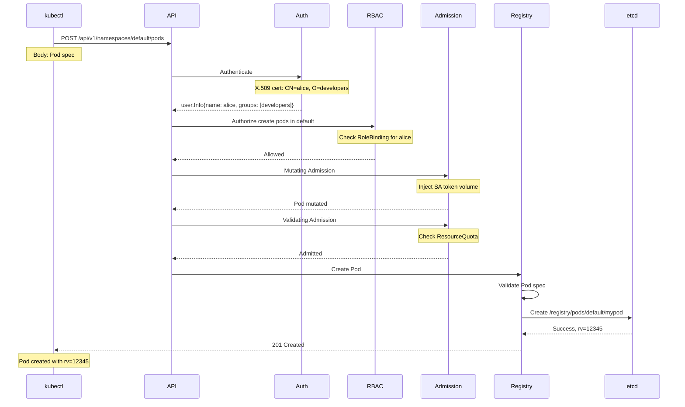

### Example 2: Update Pod (Conflict)

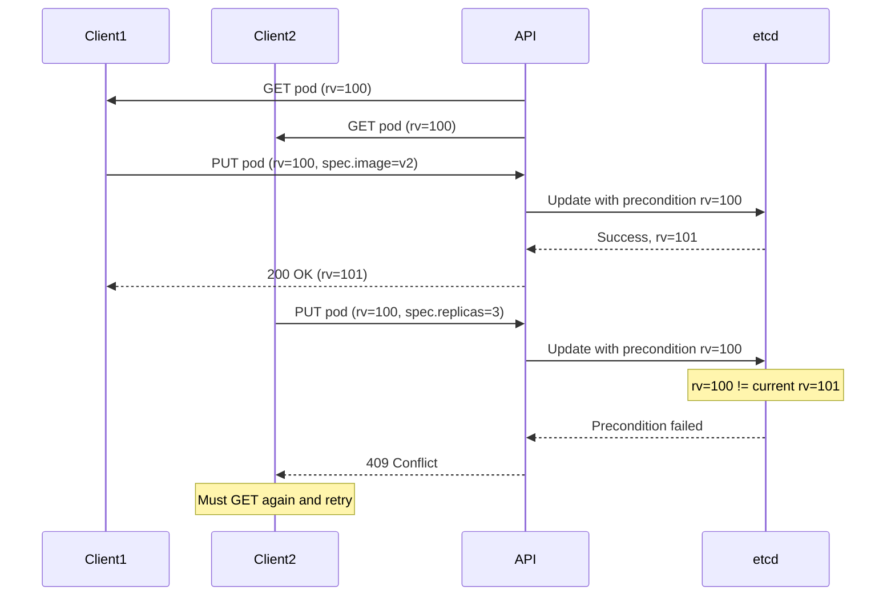

### Example 3: Watch Pods

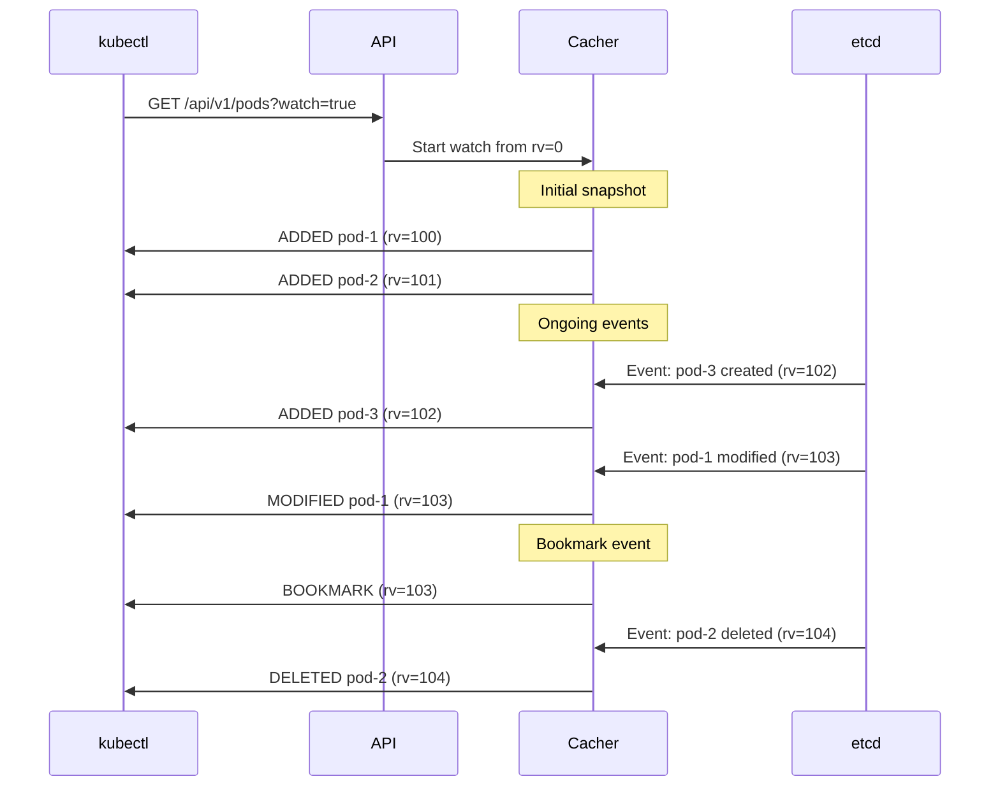

---

## Error Handling

### HTTP Status Codes

| Code | Meaning | When Used |
|------|---------|-----------|
| 200 | OK | Successful GET, UPDATE, DELETE |
| 201 | Created | Successful CREATE |
| 400 | Bad Request | Invalid request body, schema validation failed |
| 401 | Unauthorized | Authentication failed |
| 403 | Forbidden | Authorization failed, admission denied |
| 404 | Not Found | Resource not found |
| 409 | Conflict | ResourceVersion mismatch, already exists |
| 410 | Gone | Watch too old, client must relist |
| 422 | Unprocessable Entity | Validation failed |
| 429 | Too Many Requests | Rate limited by APF |
| 500 | Internal Server Error | Unexpected error |
| 503 | Service Unavailable | Server shutting down |

### Error Response Format

```json
{
  "kind": "Status",
  "apiVersion": "v1",
  "metadata": {},
  "status": "Failure",
  "message": "pods \"mypod\" already exists",
  "reason": "AlreadyExists",
  "details": {
    "name": "mypod",
    "kind": "pods"
  },
  "code": 409
}
```

---

## Performance Considerations

### Optimization Techniques

**1. Watch Cache**
- Serves most LIST and WATCH requests from memory
- Reduces etcd load by 90%+
- 60-second bookmark events prevent expensive relists

**2. Protobuf**
- 3-5x smaller than JSON
- Faster serialization/deserialization
- Used for internal communication

**3. Priority & Fairness**
- Prevents overload
- Fair queuing ensures low-priority requests still processed
- Work estimation prevents expensive requests from monopolizing resources

**4. Request Coalescing**
- Multiple identical LIST requests can be coalesced
- Reduces duplicate work

**5. Indexers**
- Field selectors use indexes where possible
- `spec.nodeName` indexed for pods
- Speeds up filtered LIST operations

### Latency Breakdown (Typical)

```
Total Request Latency: 50ms (p99)
├─ TLS Handshake: 1ms (first request only)
├─ Authentication: <1ms (cached public keys)
├─ Authorization: 2ms (RBAC informer lookup)
├─ APF Queue: 0ms (no queue)
├─ Admission: 10ms (includes webhooks)
├─ Handler: 2ms
└─ Storage: 35ms (etcd round-trip)
```

---

## Summary

The kube-apiserver request pipeline is a **sophisticated, multi-stage** system:

**24 Handler Filters** ensure:
- ✅ Security (authentication, authorization)
- ✅ Observability (audit, metrics, tracing)
- ✅ Stability (rate limiting, timeouts)
- ✅ Validation (admission control)

**Key Characteristics**:
- **Layered**: Clear separation of concerns
- **Extensible**: Pluggable auth, authz, admission
- **Observable**: Every stage logged and metered
- **Performant**: Watch cache, protobuf, APF
- **Reliable**: Error handling at every stage

**Next**:
- [Storage Layer](02-storage-layer.md) - Deep dive into etcd integration
- [Authentication](04-authentication.md) - Auth strategies in detail
- [Authorization](05-authorization.md) - RBAC and other modes
- [Admission Control](06-admission-control.md) - Plugins and webhooks

---

**Code References**:
- Handler chain: `staging/src/k8s.io/apiserver/pkg/server/config.go:1014-1091`
- Authentication: `staging/src/k8s.io/apiserver/pkg/endpoints/filters/authentication.go`
- Authorization: `staging/src/k8s.io/apiserver/pkg/endpoints/filters/authorization.go`
- Admission: `staging/src/k8s.io/apiserver/pkg/admission/chain.go`
- Registry: `pkg/registry/generic/registry/store.go`
