# Storage Layer Architecture

> **Middle-Level Technical Documentation**
> Deep dive into kube-apiserver's storage abstraction, etcd integration, and watch cache architecture.

---

## Table of Contents

- [Overview](#overview)
- [Storage Interface](#storage-interface)
- [etcd3 Implementation](#etcd3-implementation)
- [Watch Cache (Cacher)](#watch-cache-cacher)
- [Resource Versioning](#resource-versioning)
- [Storage Factory](#storage-factory)
- [Data Flow](#data-flow)
- [Performance Characteristics](#performance-characteristics)
- [Error Handling](#error-handling)
- [Code References](#code-references)

---

## Overview

The storage layer provides a clean abstraction between the API server's business logic and the underlying etcd database. This abstraction enables:

- **Pluggable storage backends** (currently only etcd3)
- **Watch caching** for improved performance
- **Optimistic concurrency control** via resource versions
- **Consistent encoding** (protobuf or JSON)
- **Efficient list/watch operations**

### Architecture Layers

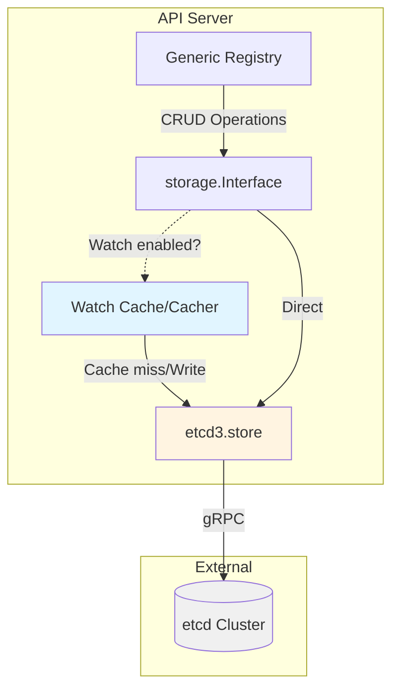

**Key Components**:
- **storage.Interface**: Abstract storage contract
- **etcd3.store**: Direct etcd3 client implementation
- **Cacher**: In-memory watch cache with event windowing
- **StorageFactory**: Configuration and construction of storage backends

**File Locations**:
- Interface: `staging/src/k8s.io/apiserver/pkg/storage/interfaces.go`
- etcd3 store: `staging/src/k8s.io/apiserver/pkg/storage/etcd3/store.go`
- Cacher: `staging/src/k8s.io/apiserver/pkg/storage/cacher/cacher.go`

---

## Storage Interface

### Core Interface Definition

The `storage.Interface` defines all operations that the API server needs from a storage backend:

```go
// staging/src/k8s.io/apiserver/pkg/storage/interfaces.go:50-120

type Interface interface {
    // Versioner returns a storage.Versioner for this interface
    Versioner() Versioner

    // Create adds a new object at the specified key
    // ttl=0 means no expiration
    Create(ctx context.Context, key string, obj, out runtime.Object, ttl uint64) error

    // Delete removes the object at key
    Delete(
        ctx context.Context,
        key string,
        out runtime.Object,
        preconditions *Preconditions,
        validateDeletion ValidateObjectFunc,
        cachedExistingObject runtime.Object,
    ) error

    // Watch starts watching for changes at key (or prefix if recursive)
    Watch(ctx context.Context, key string, opts ListOptions) (watch.Interface, error)

    // Get retrieves the object at key
    Get(ctx context.Context, key string, opts GetOptions, objPtr runtime.Object) error

    // GetList retrieves all objects matching the key prefix
    GetList(
        ctx context.Context,
        key string,
        opts ListOptions,
        listObj runtime.Object,
    ) error

    // GuaranteedUpdate performs atomic read-modify-write
    GuaranteedUpdate(
        ctx context.Context,
        key string,
        destination runtime.Object,
        ignoreNotFound bool,
        preconditions *Preconditions,
        tryUpdate UpdateFunc,
        cachedExistingObject runtime.Object,
    ) error

    // Count returns count of objects matching key prefix
    Count(key string) (int64, error)
}
```

### Operation Details

#### Create Operation

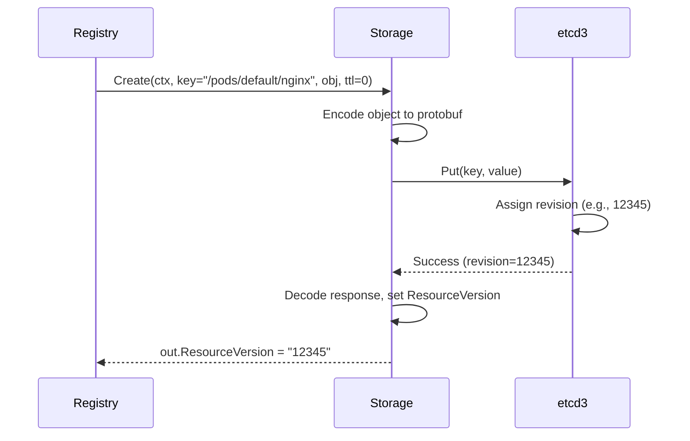

**Code Location**: `staging/src/k8s.io/apiserver/pkg/storage/etcd3/store.go:94-142`

```go
func (s *store) Create(ctx context.Context, key string, obj, out runtime.Object, ttl uint64) error {
    preparedKey, err := s.prepareKey(key)
    data, err := runtime.Encode(s.codec, obj)

    opts := []clientv3.OpOption{}
    if ttl != 0 {
        lease, err := s.leaseManager.GetLease(ctx, int64(ttl))
        opts = append(opts, clientv3.WithLease(lease))
    }

    txnResp, err := s.client.KV.Txn(ctx).
        If(notFound(preparedKey)).
        Then(clientv3.OpPut(preparedKey, string(data), opts...)).
        Commit()

    if !txnResp.Succeeded {
        return storage.NewKeyExistsError(key, 0)
    }

    // Decode into out parameter
    return decode(s.codec, s.versioner, data, out, txnResp.Header.Revision)
}
```

#### Get Operation

Simple read from etcd with decoding:

```go
func (s *store) Get(ctx context.Context, key string, opts GetOptions, out runtime.Object) error {
    preparedKey, err := s.prepareKey(key)

    getResp, err := s.client.KV.Get(ctx, preparedKey)
    if len(getResp.Kvs) == 0 {
        return storage.NewKeyNotFoundError(key, 0)
    }

    kv := getResp.Kvs[0]
    return decode(s.codec, s.versioner, kv.Value, out, kv.ModRevision)
}
```

**File**: `staging/src/k8s.io/apiserver/pkg/storage/etcd3/store.go:144-175`

#### GuaranteedUpdate Operation

Implements optimistic concurrency control with compare-and-swap:

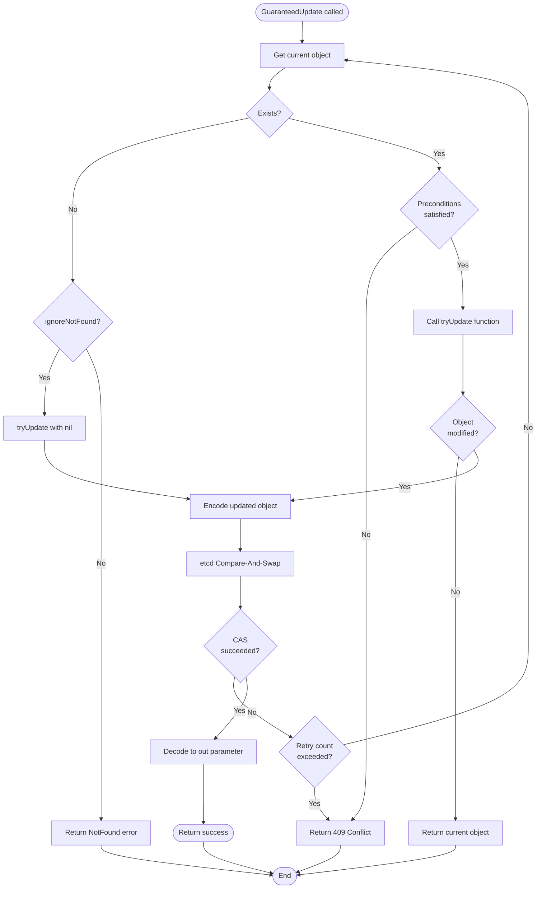

**Code Location**: `staging/src/k8s.io/apiserver/pkg/storage/etcd3/store.go:345-485`

**Key Features**:
- Automatic retry on conflicts (default: 10 attempts)
- Precondition validation (UID, ResourceVersion)
- Support for creating non-existent objects
- Optimistic locking via etcd transactions

#### Watch Operation

Returns a watch.Interface that streams events:

```go
func (s *store) Watch(ctx context.Context, key string, opts ListOptions) (watch.Interface, error) {
    preparedKey, err := s.prepareKey(key)

    rev, err := s.versioner.ParseResourceVersion(opts.ResourceVersion)

    wc := s.client.Watch(ctx, preparedKey,
        clientv3.WithRev(rev),
        clientv3.WithPrefix(),
        clientv3.WithProgressNotify(),
    )

    return newWatcher(wc, s.codec, s.versioner, opts.Predicate), nil
}
```

**File**: `staging/src/k8s.io/apiserver/pkg/storage/etcd3/watcher.go:50-120`

---

## etcd3 Implementation

### Store Structure

```go
// staging/src/k8s.io/apiserver/pkg/storage/etcd3/store.go:55-75

type store struct {
    client        *clientv3.Client
    codec         runtime.Codec        // Protobuf or JSON encoder/decoder
    versioner     storage.Versioner    // Maps ResourceVersion ↔ etcd revision
    transformer   value.Transformer    // Encryption-at-rest
    pathPrefix    string               // "/registry"
    groupResource schema.GroupResource // For metrics/logging
    leaseManager  *leaseManager        // TTL management
}
```

### Key Encoding

All Kubernetes resources are stored under a common prefix with hierarchical keys:

```
/registry/{group}/{resource}/{namespace}/{name}
```

**Examples**:
```
/registry/pods/default/nginx
/registry/deployments/kube-system/coredns
/registry/services/default/kubernetes
/registry/nodes/worker-1
```

**Code**: `staging/src/k8s.io/apiserver/pkg/storage/etcd3/store.go:520-545`

```go
func (s *store) prepareKey(key string) (string, error) {
    if !strings.HasPrefix(key, "/") {
        return "", fmt.Errorf("key must start with /: %s", key)
    }
    return path.Join(s.pathPrefix, key), nil
}
```

### Value Encoding

Objects are encoded using the configured codec (typically protobuf):

```mermaid
graph LR
    subgraph Encoding
        Obj[runtime.Object] -->|Encode| Codec[runtime.Codec]
        Codec --> Proto[Protobuf bytes]
        Proto --> Transformer[value.Transformer]
        Transformer --> Encrypted[Encrypted bytes]
    end

    subgraph Storage
        Encrypted -->|Put| etcd[(etcd)]
    end

    subgraph Decoding
        etcd -->|Get| Encrypted2[Encrypted bytes]
        Encrypted2 --> Transformer2[value.Transformer]
        Transformer2 --> Proto2[Protobuf bytes]
        Proto2 --> Codec2[runtime.Codec]
        Codec2 -->|Decode| Obj2[runtime.Object]
    end

    style Proto fill:#e1f5ff
    style Transformer fill:#fff4e1
```

**Transformer Chain**:
1. **Identity Transformer**: No encryption (default)
2. **AES-CBC/AES-GCM**: Encryption at rest
3. **Envelope Encryption**: KMS integration

**File**: `staging/src/k8s.io/apiserver/pkg/storage/value/encrypt/`

### Transaction Support

etcd3 provides multi-key transactions with compare-and-swap:

```go
// Example: Conditional update
txnResp, err := client.Txn(ctx).
    If(clientv3.Compare(clientv3.ModRevision(key), "=", expectedRev)).
    Then(clientv3.OpPut(key, newValue)).
    Else(clientv3.OpGet(key)).
    Commit()
```

**Used For**:
- Create (if not exists)
- GuaranteedUpdate (compare-and-swap)
- Atomic multi-resource updates

---

## Watch Cache (Cacher)

The Cacher sits between the storage interface and etcd, providing:
- **In-memory event cache** (sliding window)
- **Efficient watch serving** from memory
- **Bookmark events** to keep watches current
- **List consistency** via consistent reads

### Architecture

```mermaid
graph TB
    subgraph Clients
        W1[Watch Client 1<br/>rv=12340]
        W2[Watch Client 2<br/>rv=12380]
        L1[List Client<br/>rv=0]
    end

    subgraph Cacher
        WatchCache[WatchCache<br/>Sliding window<br/>capacity=1000]
        Watchers[watchers map<br/>key → []watcher]
        Reflector[Reflector<br/>etcd watch]
    end

    subgraph etcd
        EtcdWatch[etcd watch stream]
        EtcdKV[(etcd KV)]
    end

    W1 -->|Watch request| Cacher
    W2 -->|Watch request| Cacher
    L1 -->|List request| Cacher

    Cacher -->|Serve from cache| W1
    Cacher -->|Serve from cache| W2
    Cacher -->|Recent rv, use cache| L1

    Reflector -->|Maintain| WatchCache
    Reflector -->|Watch| EtcdWatch
    Cacher -.->|Cache miss| EtcdKV

    style WatchCache fill:#e1f5ff
    style Reflector fill:#fff4e1
```

### Data Structure

```go
// staging/src/k8s.io/apiserver/pkg/storage/cacher/cacher.go:95-150

type Cacher struct {
    // Storage interface to underlying etcd
    storage storage.Interface

    // In-memory sliding window of events
    watchCache *watchCache

    // Reflector keeps watchCache up-to-date
    reflector *cache.Reflector

    // All active watchers
    watchers *indexedWatchers

    // Bookmarks sent every bookmarkFrequency
    bookmarkFrequency time.Duration  // Default: 60s

    // Versioner for ResourceVersion handling
    versioner storage.Versioner
}

type watchCache struct {
    sync.RWMutex

    // Circular buffer of events
    cache      []watchCacheEvent
    startIndex int
    endIndex   int

    // Capacity (configurable per resource)
    capacity int

    // Current ResourceVersion
    resourceVersion uint64
}
```

### Watch Cache Event

```go
type watchCacheEvent struct {
    Type            watch.EventType  // Added, Modified, Deleted, Bookmark
    Object          runtime.Object
    ObjLabels       labels.Set
    ObjFields       fields.Set
    PrevObject      runtime.Object
    PrevObjLabels   labels.Set
    PrevObjFields   fields.Set
    Key             string
    ResourceVersion uint64
    RecordTime      time.Time
}
```

### Serving Watches

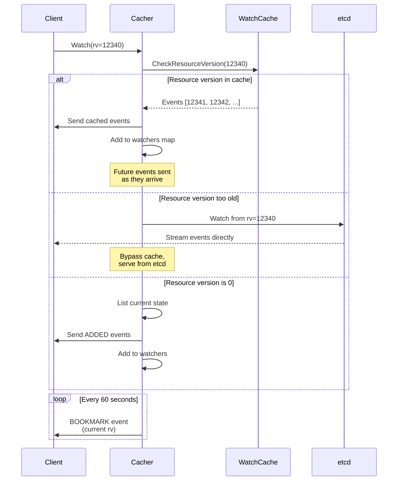

**Code**: `staging/src/k8s.io/apiserver/pkg/storage/cacher/cacher.go:370-485`

### Event Window

The watch cache maintains a sliding window of events:

```
Current RV: 12450
Capacity: 1000 events

Window: [11450 ... 12450]
        ↑              ↑
     oldest rv    current rv

If client requests rv < 11450:
  → 410 Gone (too old, not in cache)
  → Client must relist

If client requests 11450 ≤ rv ≤ 12450:
  → Serve from cache

If client requests rv = 0:
  → List current state + start watch
```

### Bookmark Events

Bookmarks keep watches current without actual changes:

```go
// Sent every 60 seconds by default
type BookmarkEvent struct {
    Type: watch.Bookmark,
    Object: &metav1.Status{
        TypeMeta: metav1.TypeMeta{
            Kind:       "Pod",
            APIVersion: "v1",
        },
        Metadata: metav1.ObjectMeta{
            ResourceVersion: "12450",
        },
    },
}
```

**Purpose**:
- Advance client's resourceVersion
- Prevent watches from becoming too old
- Enable efficient reconnection

**File**: `staging/src/k8s.io/apiserver/pkg/storage/cacher/watch_progress.go`

### Cache Initialization

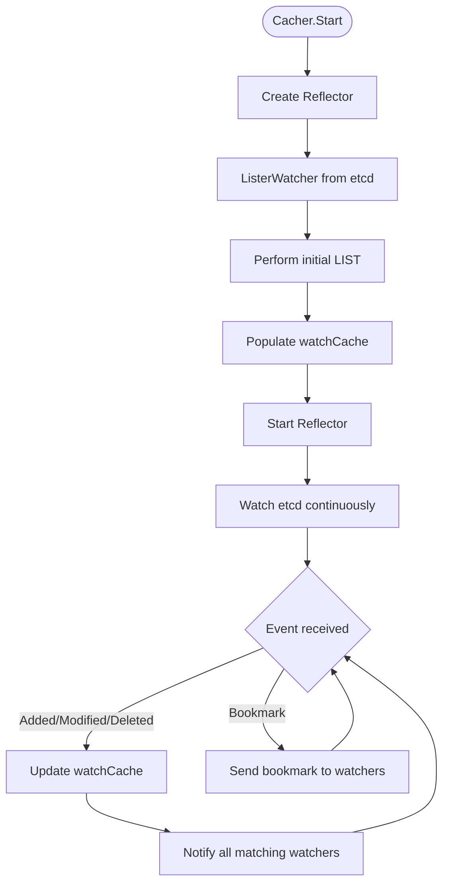

**Code**: `staging/src/k8s.io/apiserver/pkg/storage/cacher/cacher.go:210-280`

---

## Resource Versioning

### Concept

Kubernetes uses **optimistic concurrency control** via resource versions:

- Each object has a `metadata.resourceVersion` field
- Mapped directly to etcd's `mod_revision`
- Increments on every write operation
- Used for conflict detection and watch continuity

### Versioner Interface

```go
// staging/src/k8s.io/apiserver/pkg/storage/interfaces.go:220-240

type Versioner interface {
    // UpdateObject sets storage metadata into object
    UpdateObject(obj runtime.Object, resourceVersion uint64) error

    // UpdateList sets resourceVersion into list metadata
    UpdateList(obj runtime.Object, resourceVersion uint64, continueValue string, remainingItemCount *int64) error

    // PrepareObjectForStorage removes transient fields
    PrepareObjectForStorage(obj runtime.Object) error

    // ObjectResourceVersion extracts resourceVersion from object
    ObjectResourceVersion(obj runtime.Object) (uint64, error)

    // ParseResourceVersion converts string → uint64
    ParseResourceVersion(resourceVersion string) (uint64, error)
}
```

### Implementation

```go
// staging/src/k8s.io/apiserver/pkg/storage/etcd3/versioner.go

type APIObjectVersioner struct{}

func (a APIObjectVersioner) UpdateObject(obj runtime.Object, rv uint64) error {
    accessor, err := meta.Accessor(obj)
    if err != nil {
        return err
    }
    accessor.SetResourceVersion(strconv.FormatUint(rv, 10))
    return nil
}

func (a APIObjectVersioner) ObjectResourceVersion(obj runtime.Object) (uint64, error) {
    accessor, err := meta.Accessor(obj)
    if err != nil {
        return 0, err
    }
    version := accessor.GetResourceVersion()
    if version == "" {
        return 0, nil
    }
    return strconv.ParseUint(version, 10, 64)
}
```

### Usage in Updates

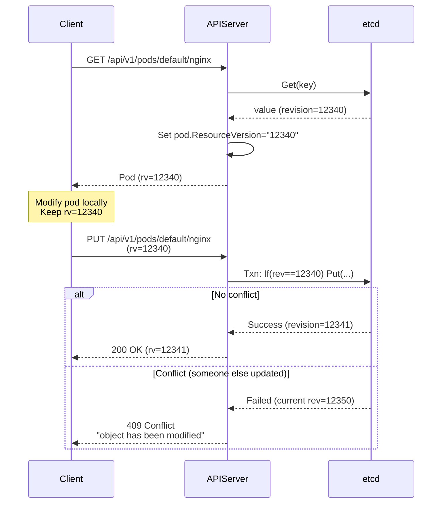

### Preconditions

```go
// staging/src/k8s.io/apiserver/pkg/storage/interfaces.go:180-195

type Preconditions struct {
    // UID must match (prevents delete/recreate races)
    UID *types.UID

    // ResourceVersion must match (optimistic locking)
    ResourceVersion *string
}

// Usage in GuaranteedUpdate
preconditions := &storage.Preconditions{
    UID:             &pod.UID,
    ResourceVersion: &pod.ResourceVersion,
}

err := storage.GuaranteedUpdate(ctx, key, out, false, preconditions, updateFunc, nil)
```

---

## Storage Factory

### Purpose

The StorageFactory is responsible for:
- **Configuration**: Reading storage backend config
- **Construction**: Creating storage.Interface instances
- **Resource-specific tuning**: Watch cache sizes, encoding
- **Encryption**: Setting up encryption providers

### Structure

```go
// staging/src/k8s.io/apiserver/pkg/server/storage/storage_factory.go:35-65

type StorageFactory interface {
    // NewConfig returns storage config for a GroupResource
    NewConfig(groupResource schema.GroupResource) (*storagebackend.ConfigForResource, error)

    // Backends lists all configured storage backends
    Backends() []storagebackend.Backend
}

type DefaultStorageFactory struct {
    // Backend configuration (etcd endpoints, credentials)
    StorageConfig storagebackend.Config

    // Overrides for specific resources
    Overrides map[schema.GroupResource]groupResourceOverrides

    // Default media type (protobuf or json)
    DefaultMediaType string

    // Default serializer
    DefaultSerializer runtime.StorageSerializer
}

type groupResourceOverrides struct {
    // Custom codec for this resource
    Codec runtime.StorageSerializer

    // Custom encryption transformer
    Transformer value.Transformer
}
```

### Configuration Example

```go
// pkg/kubeapiserver/default_storage_factory_builder.go:45-120

func NewDefaultStorageFactory(config storagebackend.Config, ...) *DefaultStorageFactory {
    factory := &DefaultStorageFactory{
        StorageConfig:    config,
        DefaultMediaType: "application/vnd.kubernetes.protobuf",
        Overrides:        map[schema.GroupResource]groupResourceOverrides{},
    }

    // Set watch cache sizes
    factory.SetWatchCacheSizes(map[schema.GroupResource]int{
        {Group: "", Resource: "pods"}:                      1000,
        {Group: "", Resource: "services"}:                  1000,
        {Group: "", Resource: "nodes"}:                     1000,
        {Group: "apps", Resource: "deployments"}:           1000,
        {Group: "apps", Resource: "replicasets"}:           1000,
        {Group: "apps", Resource: "statefulsets"}:          100,
        {Group: "batch", Resource: "jobs"}:                 100,
        {Group: "networking.k8s.io", Resource: "ingresses"}: 100,
    })

    return factory
}
```

**File**: `pkg/kubeapiserver/default_storage_factory_builder.go`

### Creating Storage Interface

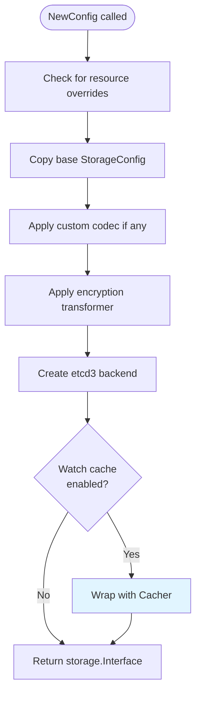

**Code**: `staging/src/k8s.io/apiserver/pkg/server/storage/storage_factory.go:80-145`

---

## Data Flow

### Write Path (CREATE)

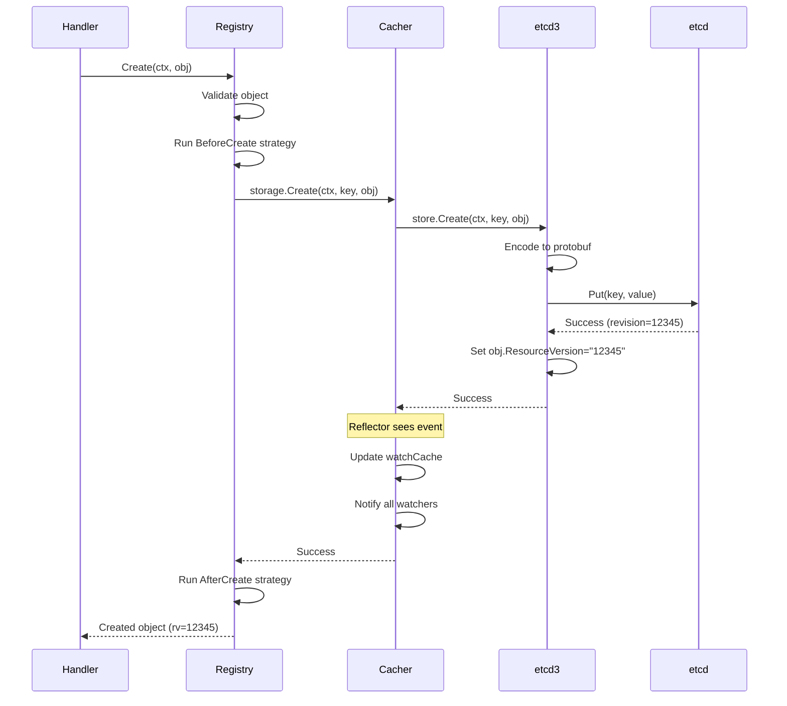

### Read Path (GET)

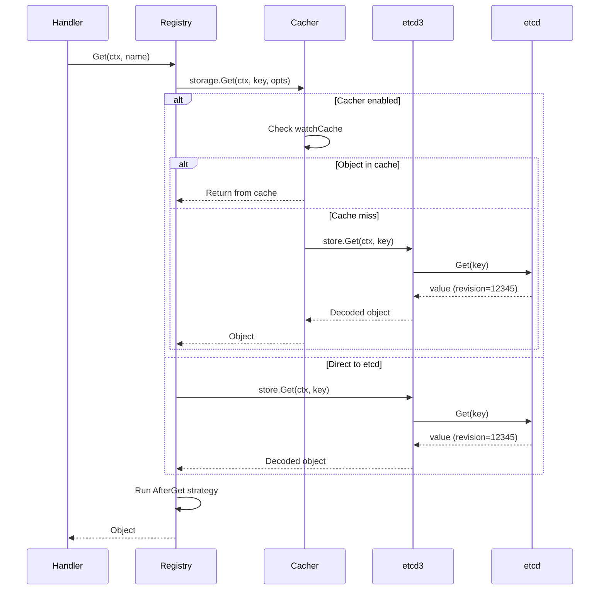

### Watch Path

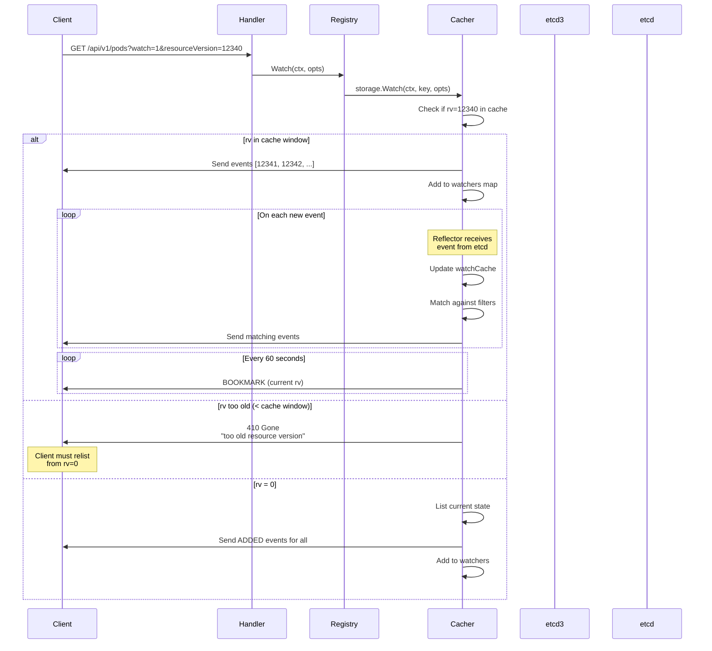

---

## Performance Characteristics

### Latency Breakdown

| Operation | Cacher Enabled | Direct to etcd | Notes |
|-----------|----------------|----------------|-------|
| **Create** | 10-50ms | 10-50ms | Always writes to etcd |
| **Get** | <1ms (cached) | 5-15ms | Cache hit is much faster |
| **List** | 1-10ms (recent rv) | 20-100ms | Depends on result size |
| **Update** | 15-60ms | 15-60ms | Read + CAS + notify |
| **Delete** | 10-50ms | 10-50ms | Write + notify |
| **Watch (start)** | <1ms (rv in cache) | 5-20ms | Initial setup |
| **Watch (event)** | <1ms | 5-15ms | Event propagation |

### Watch Cache Sizing

**Formula**:
```
Required capacity = (expected events/sec) × (bookmark frequency + buffer)
                  = (events/sec) × (60s + 15s)
                  = (events/sec) × 75
```

**Example**:
- Pods: ~13 events/sec in busy cluster → 1000 capacity
- Services: ~1 event/sec → 100 capacity
- Deployments: ~5 events/sec → 400 capacity

**Configuration**:
```bash
--watch-cache-sizes=pods#2000,services#200,deployments#500
```

### Memory Usage

**Per Cacher instance**:
```
Memory = capacity × avg_object_size × 2  # (current + prev object)
```

**Example (Pods)**:
```
1000 events × 5KB/pod × 2 = ~10 MB per namespace
```

**Total for cluster**:
```
~25 resource types × avg(500 events) × 5KB × 2 = ~125 MB
```

### etcd Load

**With Cacher**:
- etcd watches: 1 per resource type (~25 total)
- etcd gets: Only on cache misses (<5% typically)
- etcd lists: Only during initialization

**Without Cacher**:
- etcd watches: 1 per client watch (could be 1000s)
- etcd gets: Every API server GET request
- etcd lists: Every API server LIST request

**Reduction**: ~95% reduction in etcd load with Cacher enabled

---

## Error Handling

### Common Errors

| Error | Cause | HTTP Status | Resolution |
|-------|-------|-------------|------------|
| **KeyNotFound** | Object doesn't exist | 404 | Normal, object was deleted |
| **KeyExists** | Create on existing key | 409 | Use Update instead |
| **ResourceVersionConflict** | Concurrent update | 409 | Retry with latest version |
| **TooLargeResourceVersion** | rv > current | 400 | Invalid request |
| **ResourceVersionTooOld** | rv < cache window | 410 | Relist from rv=0 |
| **StorageError** | etcd failure | 500 | Check etcd health |
| **Timeout** | Operation timeout | 504 | Increase timeout or check etcd |

### Error Code Examples

```go
// staging/src/k8s.io/apiserver/pkg/storage/errors.go

func NewKeyNotFoundError(key string, rv int64) error {
    return &StorageError{
        Code: codes.NotFound,
        Key:  key,
    }
}

func NewResourceVersionTooOldError(key string, rv int64) error {
    return &StorageError{
        Code: codes.Gone,
        Key:  key,
        ResourceVersion: rv,
    }
}

func NewKeyExistsError(key string, rv int64) error {
    return &StorageError{
        Code: codes.AlreadyExists,
        Key:  key,
    }
}
```

### Retry Logic

```go
// GuaranteedUpdate retry mechanism
const maxUpdateRetries = 10

for i := 0; i < maxUpdateRetries; i++ {
    // 1. Get current object
    current, err := storage.Get(ctx, key)
    if err != nil && !IsNotFound(err) {
        return err
    }

    // 2. Apply update function
    updated, err := tryUpdate(current)
    if err != nil {
        return err
    }

    // 3. Attempt compare-and-swap
    err = storage.Put(ctx, key, updated, current.ResourceVersion)
    if err == nil {
        return nil  // Success!
    }

    if !IsConflict(err) {
        return err  // Non-retry error
    }

    // Conflict, retry with backoff
    time.Sleep(backoff(i))
}

return fmt.Errorf("exceeded max retries")
```

---

## Code References

### Key Files

| Component | File | Lines | Description |
|-----------|------|-------|-------------|
| **Interface** | `staging/src/k8s.io/apiserver/pkg/storage/interfaces.go` | 50-300 | storage.Interface definition |
| **etcd3 store** | `staging/src/k8s.io/apiserver/pkg/storage/etcd3/store.go` | 1-800 | Direct etcd3 implementation |
| **Cacher** | `staging/src/k8s.io/apiserver/pkg/storage/cacher/cacher.go` | 1-900 | Watch cache implementation |
| **Watch cache** | `staging/src/k8s.io/apiserver/pkg/storage/cacher/watch_cache.go` | 1-400 | Sliding window cache |
| **Watcher** | `staging/src/k8s.io/apiserver/pkg/storage/etcd3/watcher.go` | 1-350 | etcd watch wrapper |
| **Versioner** | `staging/src/k8s.io/apiserver/pkg/storage/etcd3/versioner.go` | 1-150 | ResourceVersion handling |
| **Storage factory** | `staging/src/k8s.io/apiserver/pkg/server/storage/storage_factory.go` | 1-400 | Factory pattern |
| **Default config** | `pkg/kubeapiserver/default_storage_factory_builder.go` | 1-250 | Default configurations |

### Key Functions

```go
// Create object in etcd
staging/src/k8s.io/apiserver/pkg/storage/etcd3/store.go:94-142
func (s *store) Create(ctx, key, obj, out, ttl) error

// Atomic read-modify-write
staging/src/k8s.io/apiserver/pkg/storage/etcd3/store.go:345-485
func (s *store) GuaranteedUpdate(ctx, key, dest, ignoreNotFound, preconditions, tryUpdate, cached) error

// Start watch from etcd
staging/src/k8s.io/apiserver/pkg/storage/etcd3/watcher.go:50-120
func (s *store) Watch(ctx, key, opts) (watch.Interface, error)

// Cacher initialization
staging/src/k8s.io/apiserver/pkg/storage/cacher/cacher.go:210-280
func (c *Cacher) Start(ctx) error

// Serve watch from cache
staging/src/k8s.io/apiserver/pkg/storage/cacher/cacher.go:370-485
func (c *Cacher) Watch(ctx, key, opts) (watch.Interface, error)

// Update watch cache
staging/src/k8s.io/apiserver/pkg/storage/cacher/cacher.go:520-620
func (c *Cacher) processEvent(event watchCacheEvent)
```

---

## Summary

The storage layer is a critical architectural component that:

1. **Abstracts storage backend** - Pluggable interface (currently etcd3 only)
2. **Provides watch caching** - In-memory event window for efficient watches
3. **Implements optimistic locking** - ResourceVersion-based concurrency control
4. **Handles encoding** - Protobuf serialization and optional encryption
5. **Manages watch lifecycle** - Bookmark events, cache windows, expiration

**Performance Impact**:
- **95% reduction in etcd load** with watch cache enabled
- **10-100x faster reads** when served from cache
- **Sub-millisecond watch event delivery** for cached watches

**Trade-offs**:
- Memory overhead: ~125 MB for watch caches
- Eventual consistency: Slight delay for watch cache updates
- Complexity: Additional layer between API server and etcd

**Next Steps**:
- [API Groups Registration](03-api-groups-registration.md) - How resources are installed
- [Watch Mechanism](07-watch-mechanism.md) - Deep dive into watch protocol
- [Low-Level: Storage Interface](../low-level/03-storage-interface.md) - Implementation details

---

**Related Documentation**:
- [QUICK-REFERENCE.md](../QUICK-REFERENCE.md#storage--watch) - Quick reference
- [Request Pipeline](01-request-pipeline.md) - How requests flow through storage
- [Generic Registry](../low-level/02-registry-pattern.md) - Storage consumer
