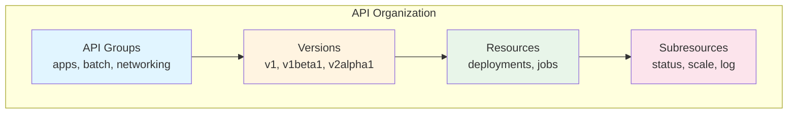
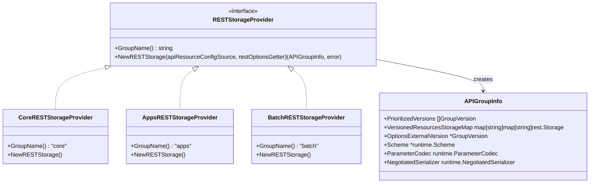
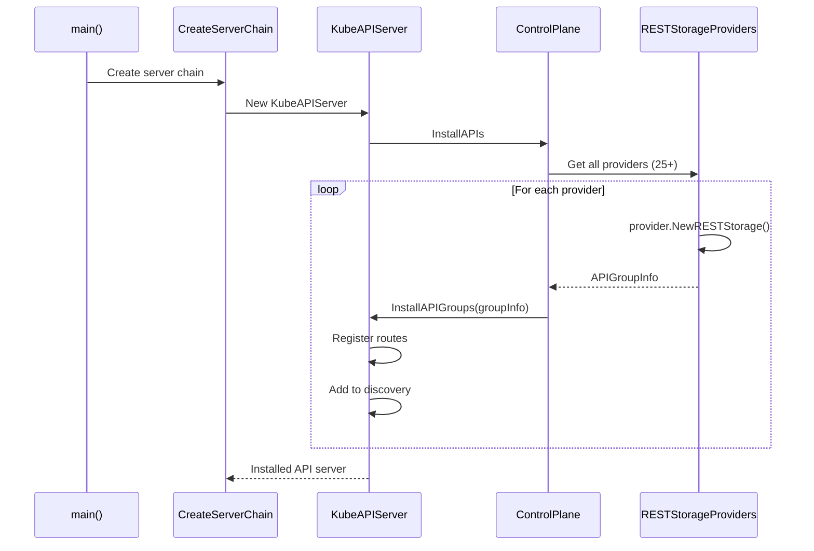
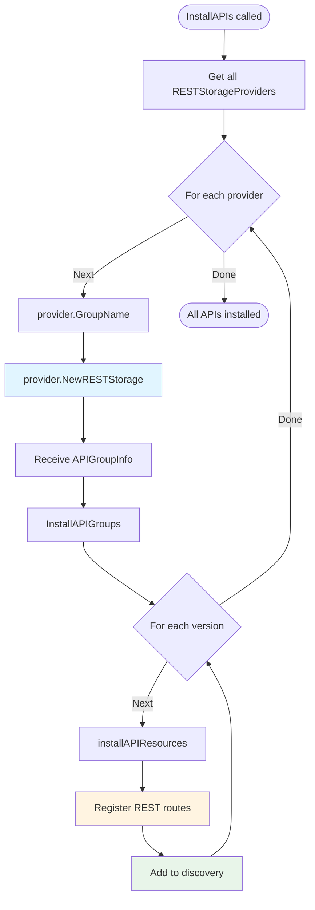
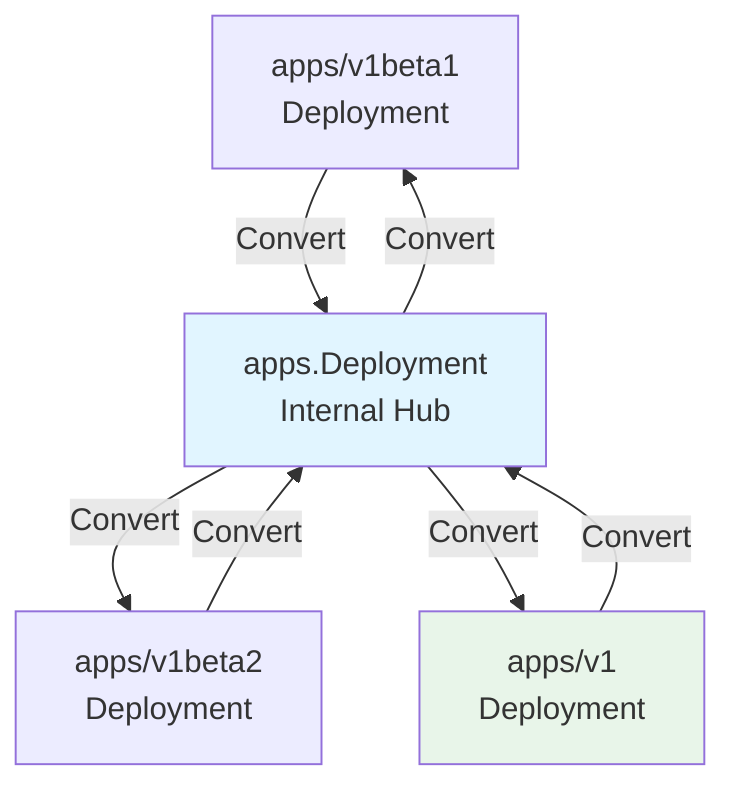
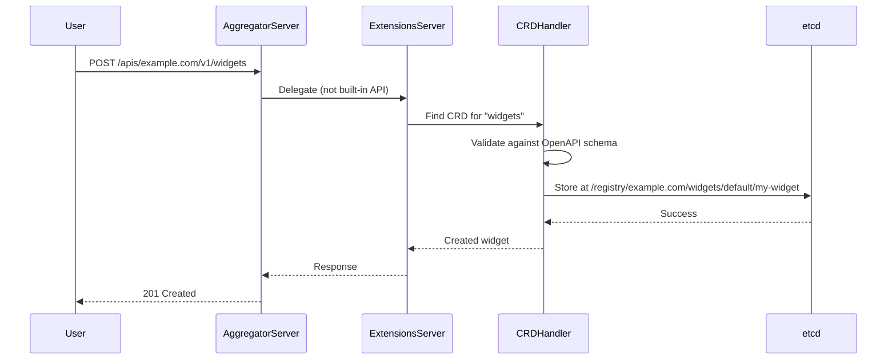

# API Groups and Resource Registration

> **Middle-Level Technical Documentation**
> How Kubernetes API groups and resources are discovered, registered, and exposed through the API server.

---

## Table of Contents

- [Overview](#overview)
- [API Group Concepts](#api-group-concepts)
- [Storage Provider Pattern](#storage-provider-pattern)
- [Installation Process](#installation-process)
- [Built-in API Groups](#built-in-api-groups)
- [REST Storage Registration](#rest-storage-registration)
- [Versioned APIs](#versioned-apis)
- [Discovery](#discovery)
- [Custom Resource Definitions](#custom-resource-definitions)
- [Code References](#code-references)

---

## Overview

Kubernetes exposes resources through a **hierarchical API structure**:

```
/apis/{group}/{version}/[namespaces/{namespace}]/{resource}[/{name}[/{subresource}]]
```

**Examples**:
```
/api/v1/pods
/api/v1/namespaces/default/pods/nginx
/api/v1/namespaces/default/pods/nginx/log
/apis/apps/v1/deployments
/apis/apps/v1/namespaces/kube-system/deployments/coredns
/apis/batch/v1/jobs
```

### Key Concepts



**Hierarchy**:
1. **API Group**: Logical grouping (e.g., `apps`, `batch`, `networking.k8s.io`)
2. **Version**: API version (e.g., `v1`, `v1beta1`)
3. **Resource**: Object type (e.g., `deployments`, `pods`)
4. **Subresource**: Sub-object or operation (e.g., `status`, `scale`, `log`)

---

## API Group Concepts

### Core (Legacy) Group

The **core group** (also called "legacy" group) has a special empty group name:

```
/api/v1/pods          ← Core group (no /apis prefix)
/api/v1/services
/api/v1/configmaps
```

**Characteristics**:
- Group name: `""` (empty string)
- Path prefix: `/api` (not `/apis`)
- Version: `v1` (stable, never changes)
- Resources: pods, services, nodes, namespaces, configmaps, secrets, etc.

### Named Groups

All other groups use the `/apis` prefix:

```
/apis/apps/v1/deployments
/apis/batch/v1/jobs
/apis/networking.k8s.io/v1/ingresses
```

**Characteristics**:
- Group name: `apps`, `batch`, `networking.k8s.io`, etc.
- Path prefix: `/apis`
- Versions: Multiple versions possible (v1, v1beta1, v2alpha1)
- Preferred version: One version designated as default

### Group Metadata

```go
// staging/src/k8s.io/apimachinery/pkg/apis/meta/v1/types.go:1100-1130

type APIGroup struct {
    Name string                 // "apps"
    Versions []GroupVersionForDiscovery
    PreferredVersion GroupVersionForDiscovery
    ServerAddressByClientCIDRs []ServerAddressByClientCIDR
}

type GroupVersionForDiscovery struct {
    GroupVersion string  // "apps/v1"
    Version      string  // "v1"
}
```

**Example Response**:
```json
{
  "name": "apps",
  "versions": [
    {"groupVersion": "apps/v1", "version": "v1"},
    {"groupVersion": "apps/v1beta2", "version": "v1beta2"},
    {"groupVersion": "apps/v1beta1", "version": "v1beta1"}
  ],
  "preferredVersion": {
    "groupVersion": "apps/v1",
    "version": "v1"
  }
}
```

---

## Storage Provider Pattern

Kubernetes uses the **Storage Provider pattern** to register API groups:



### RESTStorageProvider Interface

```go
// pkg/controlplane/controller/apiserverleasegc/storage_provider.go
// (similar interface used throughout)

type RESTStorageProvider interface {
    // GroupName returns the API group name
    GroupName() string

    // NewRESTStorage creates the storage backends for this group
    NewRESTStorage(
        apiResourceConfigSource serverstorage.APIResourceConfigSource,
        restOptionsGetter generic.RESTOptionsGetter,
    ) (genericapiserver.APIGroupInfo, error)
}
```

### APIGroupInfo Structure

```go
// staging/src/k8s.io/apiserver/pkg/server/genericapiserver.go:120-160

type APIGroupInfo struct {
    // PrioritizedVersions: versions in priority order (e.g., [v1, v1beta1])
    PrioritizedVersions []schema.GroupVersion

    // VersionedResourcesStorageMap: version → resource → storage
    // e.g., "v1" → "pods" → PodStorage
    VersionedResourcesStorageMap map[string]map[string]rest.Storage

    // Scheme for this API group
    Scheme *runtime.Scheme

    // ParameterCodec for query parameters
    ParameterCodec runtime.ParameterCodec

    // NegotiatedSerializer for content negotiation
    NegotiatedSerializer runtime.NegotiatedSerializer

    // OptionsExternalVersion for list/watch options
    OptionsExternalVersion *schema.GroupVersion
}
```

**Example**:
```go
APIGroupInfo{
    PrioritizedVersions: []schema.GroupVersion{
        {Group: "apps", Version: "v1"},
        {Group: "apps", Version: "v1beta2"},
    },
    VersionedResourcesStorageMap: map[string]map[string]rest.Storage{
        "v1": {
            "deployments":            deploymentStorage,
            "deployments/status":     deploymentStatusStorage,
            "deployments/scale":      deploymentScaleStorage,
            "replicasets":            replicasetStorage,
            "replicasets/status":     replicasetStatusStorage,
            "statefulsets":           statefulsetStorage,
            "daemonsets":             daemonsetStorage,
        },
        "v1beta2": {
            // ... beta resources
        },
    },
}
```

---

## Installation Process

### High-Level Flow



### Step-by-Step Process

#### 1. Get Storage Providers

```go
// pkg/controlplane/instance.go:386-442

func (c CompletedConfig) StorageProviders(client *kubernetes.Clientset) ([]RESTStorageProvider, error) {
    providers := []RESTStorageProvider{
        // Core group (pods, services, nodes, etc.)
        corerest.New(c.ExtraConfig.ServiceIPRange, ...),

        // apps group (deployments, statefulsets, daemonsets)
        appsrest.StorageProvider{},

        // batch group (jobs, cronjobs)
        batchrest.RESTStorageProvider{},

        // networking group (ingresses, networkpolicies)
        networkingrest.RESTStorageProvider{},

        // rbac group (roles, rolebindings)
        rbacrest.RESTStorageProvider{},

        // storage group (storageclasses, volumeattachments)
        storagerest.RESTStorageProvider{},

        // ... 20+ more groups
    }

    return providers, nil
}
```

**File**: `pkg/controlplane/instance.go:386-442`

#### 2. Create REST Storage

Each provider implements `NewRESTStorage()`:

```go
// pkg/registry/apps/rest/storage_apps.go:40-95

type StorageProvider struct{}

func (p StorageProvider) GroupName() string {
    return apps.GroupName  // "apps"
}

func (p StorageProvider) NewRESTStorage(
    apiResourceConfigSource serverstorage.APIResourceConfigSource,
    restOptionsGetter generic.RESTOptionsGetter,
) (genericapiserver.APIGroupInfo, error) {
    apiGroupInfo := genericapiserver.NewDefaultAPIGroupInfo(apps.GroupName, ...)

    // Create storage for each resource
    if resource := "deployments"; apiResourceConfigSource.ResourceEnabled(appsapiv1.SchemeGroupVersion.WithResource(resource)) {
        deploymentStorage, err := deploymentstore.NewStorage(restOptionsGetter)
        storage[resource] = deploymentStorage.Deployment
        storage[resource+"/status"] = deploymentStorage.Status
        storage[resource+"/scale"] = deploymentStorage.Scale
    }

    if resource := "statefulsets"; apiResourceConfigSource.ResourceEnabled(...) {
        statefulSetStorage, err := statefulsetstore.NewStorage(restOptionsGetter)
        storage[resource] = statefulSetStorage.StatefulSet
        storage[resource+"/status"] = statefulSetStorage.Status
        storage[resource+"/scale"] = statefulSetStorage.Scale
    }

    // ... daemonsets, replicasets, controllerrevisions

    apiGroupInfo.VersionedResourcesStorageMap["v1"] = storage
    return apiGroupInfo, nil
}
```

**File**: `pkg/registry/apps/rest/storage_apps.go`

#### 3. Install API Groups

```go
// staging/src/k8s.io/apiserver/pkg/server/genericapiserver.go:450-520

func (s *GenericAPIServer) InstallAPIGroups(apiGroupInfos ...*APIGroupInfo) error {
    for _, apiGroupInfo := range apiGroupInfos {
        // For each version in the group
        for _, groupVersion := range apiGroupInfo.PrioritizedVersions {
            // Install REST handlers for this version
            err := s.installAPIResources(APIGroupPrefix, groupVersion, apiGroupInfo)

            // Add to discovery document
            s.DiscoveryGroupManager.AddGroup(apiGroup)
        }
    }
    return nil
}
```

**File**: `staging/src/k8s.io/apiserver/pkg/server/genericapiserver.go:450-520`

#### 4. Register Routes

```go
// staging/src/k8s.io/apiserver/pkg/endpoints/groupversion.go:90-180

func (g *APIGroupVersion) InstallREST(container *restful.Container) error {
    installer := &APIInstaller{
        group:             g,
        prefix:            g.Root,  // "/apis/apps/v1"
        minRequestTimeout: g.MinRequestTimeout,
    }

    // For each resource (deployments, statefulsets, etc.)
    for resource, storage := range g.Storage {
        // Register routes:
        // GET    /apis/apps/v1/deployments
        // POST   /apis/apps/v1/deployments
        // GET    /apis/apps/v1/deployments/{name}
        // PUT    /apis/apps/v1/deployments/{name}
        // PATCH  /apis/apps/v1/deployments/{name}
        // DELETE /apis/apps/v1/deployments/{name}
        // GET    /apis/apps/v1/deployments?watch=1
        ws := installer.registerResourceHandlers(resource, storage, ...)
        container.Add(ws)
    }

    return nil
}
```

**File**: `staging/src/k8s.io/apiserver/pkg/endpoints/groupversion.go:90-180`

### Complete Installation Diagram



---

## Built-in API Groups

### Complete List (25+ Groups)

| Group | Resources | Example Use Case |
|-------|-----------|------------------|
| **core (v1)** | pods, services, nodes, configmaps, secrets, namespaces | Basic workloads |
| **apps/v1** | deployments, statefulsets, daemonsets, replicasets | Application management |
| **batch/v1** | jobs, cronjobs | Batch processing |
| **networking.k8s.io/v1** | ingresses, networkpolicies, ingressclasses | Network routing |
| **rbac.authorization.k8s.io/v1** | roles, rolebindings, clusterroles | Access control |
| **storage.k8s.io/v1** | storageclasses, volumeattachments, csinodes | Storage provisioning |
| **autoscaling/v2** | horizontalpodautoscalers | Auto-scaling |
| **policy/v1** | poddisruptionbudgets | Disruption management |
| **certificates.k8s.io/v1** | certificatesigningrequests | Certificate management |
| **coordination.k8s.io/v1** | leases | Leader election |
| **discovery.k8s.io/v1** | endpointslices | Service discovery |
| **events.k8s.io/v1** | events | Event tracking |
| **flowcontrol.apiserver.k8s.io/v1** | flowschemas, prioritylevelconfigurations | API priority & fairness |
| **admissionregistration.k8s.io/v1** | validatingwebhookconfigurations, mutatingwebhookconfigurations | Admission control |
| **apiextensions.k8s.io/v1** | customresourcedefinitions | CRD management |
| **scheduling.k8s.io/v1** | priorityclasses | Pod priority |
| **node.k8s.io/v1** | runtimeclasses | Container runtime |
| **resource.k8s.io/v1alpha3** | resourceclaims, resourceclasses | Dynamic resource allocation |

### Core Group Details

```go
// pkg/registry/core/rest/storage_core.go:90-450

func (c LegacyRESTStorageProvider) NewRESTStorage(...) (genericapiserver.APIGroupInfo, error) {
    apiGroupInfo := genericapiserver.NewDefaultAPIGroupInfo(api.GroupName, ...)

    storage := map[string]rest.Storage{}

    // Pods
    podStorage, err := podstore.NewStorage(...)
    storage["pods"] = podStorage.Pod
    storage["pods/status"] = podStorage.Status
    storage["pods/log"] = podStorage.Log
    storage["pods/exec"] = podStorage.Exec
    storage["pods/attach"] = podStorage.Attach
    storage["pods/portforward"] = podStorage.PortForward
    storage["pods/proxy"] = podStorage.Proxy
    storage["pods/ephemeralcontainers"] = podStorage.EphemeralContainers
    storage["pods/binding"] = podStorage.Binding

    // Services
    serviceStorage, err := servicestore.NewStorage(...)
    storage["services"] = serviceStorage.Service
    storage["services/status"] = serviceStorage.Status
    storage["services/proxy"] = serviceStorage.Proxy

    // Nodes
    nodeStorage, err := nodestore.NewStorage(...)
    storage["nodes"] = nodeStorage.Node
    storage["nodes/status"] = nodeStorage.Status
    storage["nodes/proxy"] = nodeStorage.Proxy

    // ... configmaps, secrets, namespaces, endpoints, etc. (30+ resources)

    apiGroupInfo.VersionedResourcesStorageMap["v1"] = storage
    return apiGroupInfo, nil
}
```

**File**: `pkg/registry/core/rest/storage_core.go`

**Core Resources Count**:
- Main resources: 18 (pods, services, nodes, namespaces, etc.)
- Subresources: 30+ (status, log, exec, proxy, etc.)
- Total storage entries: ~50

---

## REST Storage Registration

### rest.Storage Interface

Each resource implements the `rest.Storage` interface (and optional mixins):

```go
// staging/src/k8s.io/apiserver/pkg/registry/rest/rest.go:40-120

type Storage interface {
    // New returns an empty object
    New() runtime.Object
}

// Additional mixins for various operations:

type Lister interface {
    NewList() runtime.Object
    List(ctx, options) (runtime.Object, error)
}

type Getter interface {
    Get(ctx, name, options) (runtime.Object, error)
}

type Creater interface {
    Create(ctx, obj, createValidation, options) (runtime.Object, error)
}

type Updater interface {
    Update(ctx, name, objInfo, createValidation, updateValidation, options) (runtime.Object, bool, error)
}

type Patcher interface {
    Update(ctx, name, objInfo, createValidation, updateValidation, options) (runtime.Object, bool, error)
}

type GracefulDeleter interface {
    Delete(ctx, name, deleteValidation, options) (runtime.Object, bool, error)
}

type Watcher interface {
    Watch(ctx, options) (watch.Interface, error)
}
```

### Example: DeploymentStorage

```go
// pkg/registry/apps/deployment/storage/storage.go:40-90

type DeploymentStorage struct {
    Deployment *REST
    Status     *StatusREST
    Scale      *ScaleREST
    Rollback   *RollbackREST
}

type REST struct {
    *genericregistry.Store  // Embeds generic CRUD operations
    categories []string
}

func NewStorage(optsGetter generic.RESTOptionsGetter) (DeploymentStorage, error) {
    store := &genericregistry.Store{
        NewFunc:     func() runtime.Object { return &apps.Deployment{} },
        NewListFunc: func() runtime.Object { return &apps.DeploymentList{} },
        DefaultQualifiedResource: apps.Resource("deployments"),

        CreateStrategy: deployment.Strategy,
        UpdateStrategy: deployment.Strategy,
        DeleteStrategy: deployment.Strategy,

        TableConvertor: printerstorage.TableConvertor{...},
    }

    options := &generic.StoreOptions{
        RESTOptions: optsGetter,
        AttrFunc:    deployment.GetAttrs,
    }
    store.CompleteWithOptions(options)

    statusStore := *store
    statusStore.UpdateStrategy = deployment.StatusStrategy

    scaleStore := &ScaleREST{store: store}

    return DeploymentStorage{
        Deployment: &REST{store, []string{"all"}},
        Status:     &StatusREST{&statusStore},
        Scale:      scaleStore,
    }, nil
}
```

**File**: `pkg/registry/apps/deployment/storage/storage.go`

### Route Registration

```mermaid
graph TB
    subgraph "Resource: deployments"
        Main[/apis/apps/v1/deployments]
        Item[/apis/apps/v1/deployments/{name}]
        Status[/apis/apps/v1/deployments/{name}/status]
        Scale[/apis/apps/v1/deployments/{name}/scale]
    end

    Main -->|GET| List[List all deployments]
    Main -->|POST| Create[Create deployment]
    Main -->|GET watch=1| WatchAll[Watch all deployments]

    Item -->|GET| Get[Get deployment]
    Item -->|PUT| Update[Update deployment]
    Item -->|PATCH| Patch[Patch deployment]
    Item -->|DELETE| Delete[Delete deployment]

    Status -->|GET| GetStatus[Get status]
    Status -->|PUT| UpdateStatus[Update status]
    Status -->|PATCH| PatchStatus[Patch status]

    Scale -->|GET| GetScale[Get scale]
    Scale -->|PUT| UpdateScale[Update scale]

    style Main fill:#e1f5ff
    style Status fill:#fff4e1
    style Scale fill:#e8f5e9
```

**Code**: `staging/src/k8s.io/apiserver/pkg/endpoints/installer.go:150-800`

---

## Versioned APIs

### Multiple Versions

API groups can support multiple versions simultaneously:

```
/apis/apps/v1/deployments        ← Stable (preferred)
/apis/apps/v1beta2/deployments   ← Beta (deprecated)
/apis/apps/v1beta1/deployments   ← Old beta (removed in 1.16)
```

### Version Priority

```go
// pkg/apis/apps/install/install.go

func init() {
    // Install internal types
    utilruntime.Must(apps.AddToScheme(scheme.Scheme))

    // Install versioned types (in priority order)
    utilruntime.Must(appsv1.AddToScheme(scheme.Scheme))
    utilruntime.Must(appsv1beta2.AddToScheme(scheme.Scheme))
    utilruntime.Must(appsv1beta1.AddToScheme(scheme.Scheme))

    // Set preferred version
    utilruntime.Must(scheme.Scheme.SetVersionPriority(
        appsv1.SchemeGroupVersion,      // v1 (preferred)
        appsv1beta2.SchemeGroupVersion, // v1beta2
        appsv1beta1.SchemeGroupVersion, // v1beta1
    ))
}
```

**File**: `pkg/apis/apps/install/install.go`

### Conversion Between Versions

Kubernetes uses a **hub-and-spoke** conversion pattern:



**How It Works**:
1. All versions convert to/from a single internal version
2. No direct v1beta1 → v1 conversion
3. Always: versioned → internal → versioned

**Example**:
```go
// Client sends v1beta2 Deployment
v1beta2.Deployment → apps.Deployment (internal) → store in etcd

// Client requests v1 Deployment
etcd → apps.Deployment (internal) → appsv1.Deployment → client
```

---

## Discovery

### Discovery Endpoints

Clients discover available APIs through these endpoints:

```
GET /api                    ← Core group versions
GET /apis                   ← All API groups
GET /apis/apps              ← Versions for "apps" group
GET /apis/apps/v1           ← Resources in "apps/v1"
```

### /apis Response

```json
{
  "kind": "APIGroupList",
  "apiVersion": "v1",
  "groups": [
    {
      "name": "apps",
      "versions": [
        {"groupVersion": "apps/v1", "version": "v1"},
        {"groupVersion": "apps/v1beta2", "version": "v1beta2"}
      ],
      "preferredVersion": {"groupVersion": "apps/v1", "version": "v1"}
    },
    {
      "name": "batch",
      "versions": [
        {"groupVersion": "batch/v1", "version": "v1"},
        {"groupVersion": "batch/v1beta1", "version": "v1beta1"}
      ],
      "preferredVersion": {"groupVersion": "batch/v1", "version": "v1"}
    }
    // ... 25+ more groups
  ]
}
```

### /apis/apps/v1 Response

```json
{
  "kind": "APIResourceList",
  "apiVersion": "v1",
  "groupVersion": "apps/v1",
  "resources": [
    {
      "name": "deployments",
      "singularName": "deployment",
      "namespaced": true,
      "kind": "Deployment",
      "verbs": ["create", "delete", "deletecollection", "get", "list", "patch", "update", "watch"],
      "categories": ["all"]
    },
    {
      "name": "deployments/status",
      "singularName": "",
      "namespaced": true,
      "kind": "Deployment",
      "verbs": ["get", "patch", "update"]
    },
    {
      "name": "deployments/scale",
      "singularName": "",
      "namespaced": true,
      "group": "autoscaling",
      "version": "v1",
      "kind": "Scale",
      "verbs": ["get", "patch", "update"]
    }
    // ... statefulsets, daemonsets, replicasets
  ]
}
```

**File**: `staging/src/k8s.io/apiserver/pkg/endpoints/discovery/aggregated/`

### Discovery Manager

```go
// staging/src/k8s.io/apiserver/pkg/server/genericapiserver.go:200-250

type GenericAPIServer struct {
    // ...
    DiscoveryGroupManager discovery.GroupManager
}

// Adding a group to discovery
func (s *GenericAPIServer) InstallAPIGroups(apiGroupInfos ...*APIGroupInfo) error {
    for _, apiGroupInfo := range apiGroupInfos {
        apiGroup := metav1.APIGroup{
            Name:             apiGroupInfo.PrioritizedVersions[0].Group,
            Versions:         []metav1.GroupVersionForDiscovery{},
            PreferredVersion: metav1.GroupVersionForDiscovery{},
        }

        for _, gv := range apiGroupInfo.PrioritizedVersions {
            apiGroup.Versions = append(apiGroup.Versions, metav1.GroupVersionForDiscovery{
                GroupVersion: gv.String(),
                Version:      gv.Version,
            })
        }

        apiGroup.PreferredVersion = apiGroup.Versions[0]

        s.DiscoveryGroupManager.AddGroup(apiGroup)
    }
}
```

---

## Custom Resource Definitions

### CRD Registration

CRDs dynamically add new resource types without recompiling the API server:

```yaml
apiVersion: apiextensions.k8s.io/v1
kind: CustomResourceDefinition
metadata:
  name: widgets.example.com
spec:
  group: example.com
  versions:
  - name: v1
    served: true
    storage: true
    schema:
      openAPIV3Schema:
        type: object
        properties:
          spec:
            type: object
            properties:
              color:
                type: string
              count:
                type: integer
  scope: Namespaced
  names:
    plural: widgets
    singular: widget
    kind: Widget
    shortNames:
    - wdg
```

### CRD Architecture



**Key Points**:
- CRDs are handled by the **extensions API server** (third in the chain)
- Validation uses OpenAPI v3 schema
- Storage uses generic etcd backend
- No custom code required

**File**: `staging/src/k8s.io/apiextensions-apiserver/pkg/registry/customresource/`

---

## Code References

### Key Files

| Component | File | Description |
|-----------|------|-------------|
| **Provider Interface** | `pkg/controlplane/instance.go` | StorageProviders() method |
| **Core REST Storage** | `pkg/registry/core/rest/storage_core.go` | Core group registration |
| **Apps REST Storage** | `pkg/registry/apps/rest/storage_apps.go` | Apps group registration |
| **API Installation** | `staging/src/k8s.io/apiserver/pkg/server/genericapiserver.go` | InstallAPIGroups() |
| **Route Registration** | `staging/src/k8s.io/apiserver/pkg/endpoints/installer.go` | registerResourceHandlers() |
| **Discovery** | `staging/src/k8s.io/apiserver/pkg/endpoints/discovery/` | Discovery document generation |
| **CRD Handler** | `staging/src/k8s.io/apiextensions-apiserver/pkg/registry/customresource/` | CRD request handling |

### Key Functions

```go
// Get all storage providers (25+ groups)
pkg/controlplane/instance.go:386-442
func (c CompletedConfig) StorageProviders(client) ([]RESTStorageProvider, error)

// Core group storage
pkg/registry/core/rest/storage_core.go:90-450
func (c LegacyRESTStorageProvider) NewRESTStorage(...) (APIGroupInfo, error)

// Apps group storage
pkg/registry/apps/rest/storage_apps.go:40-95
func (p StorageProvider) NewRESTStorage(...) (APIGroupInfo, error)

// Install API groups
staging/src/k8s.io/apiserver/pkg/server/genericapiserver.go:450-520
func (s *GenericAPIServer) InstallAPIGroups(apiGroupInfos) error

// Register resource handlers
staging/src/k8s.io/apiserver/pkg/endpoints/installer.go:150-800
func (a *APIInstaller) registerResourceHandlers(resource, storage) (*restful.WebService, error)

// Discovery handler
staging/src/k8s.io/apiserver/pkg/endpoints/discovery/aggregated/handler.go
func (r *resourceManager) AddGroupVersion(groupVersion, apiGroup)
```

---

## Summary

API Groups and Resource Registration is the mechanism by which Kubernetes:

1. **Organizes APIs** - Logical grouping of related resources
2. **Supports versioning** - Multiple API versions (v1, v1beta1, etc.)
3. **Enables extensibility** - Plugin architecture for new resources
4. **Provides discovery** - Clients can discover available APIs
5. **Allows CRDs** - Dynamic resource types without code changes

**Key Patterns**:
- **RESTStorageProvider**: Plugin interface for API groups
- **APIGroupInfo**: Encapsulates group, versions, and storage
- **Hub-and-spoke conversion**: Internal type as conversion hub
- **Discovery documents**: Machine-readable API catalog

**Next Steps**:
- [Storage Layer](02-storage-layer.md) - How resources are stored
- [Registry Pattern](../low-level/02-registry-pattern.md) - Generic CRUD implementation
- [Type System](../low-level/05-type-system.md) - Internal vs external types

---

**Related Documentation**:
- [QUICK-REFERENCE.md](../QUICK-REFERENCE.md#api-groups) - Quick reference
- [System Overview](../high-level/01-system-overview.md#api-groups) - High-level view
- [Custom Resources](../low-level/08-rest-storage-impl.md#crd-storage) - CRD deep dive
