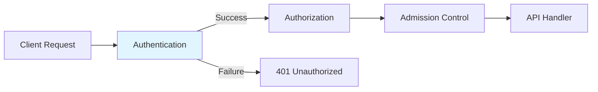
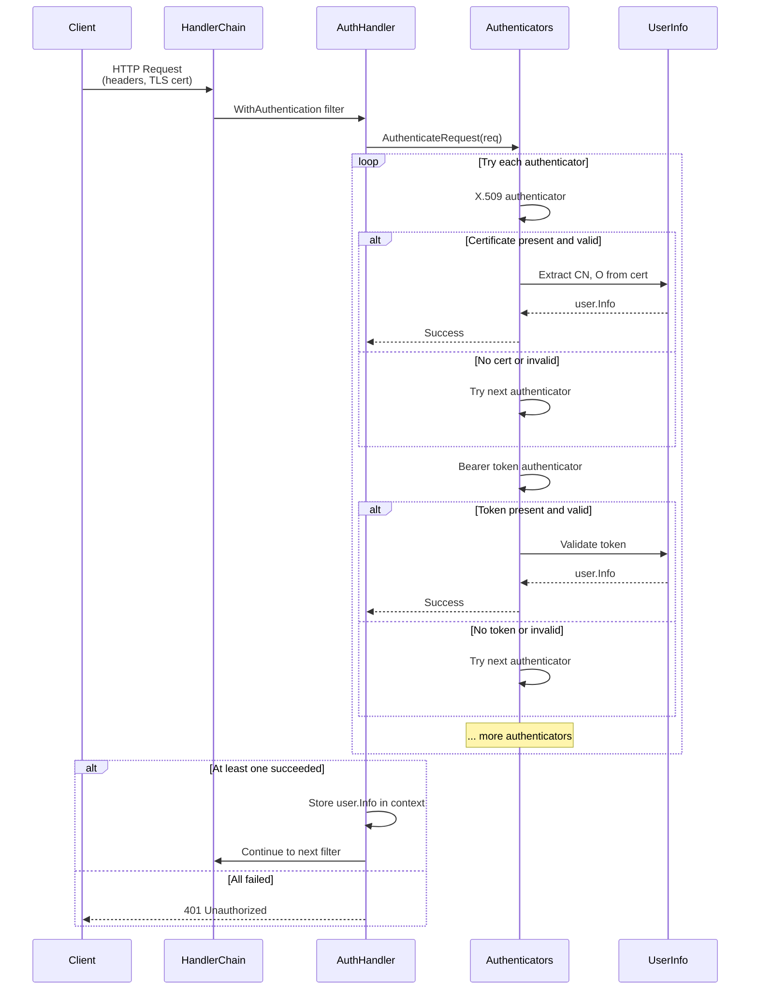
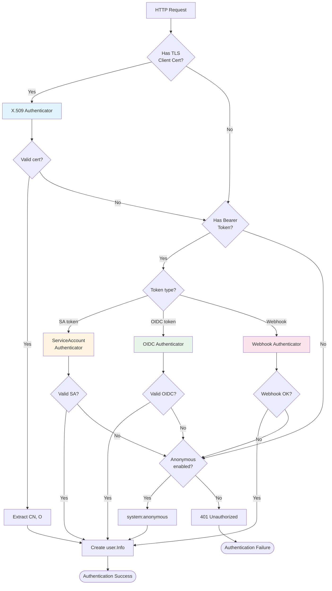
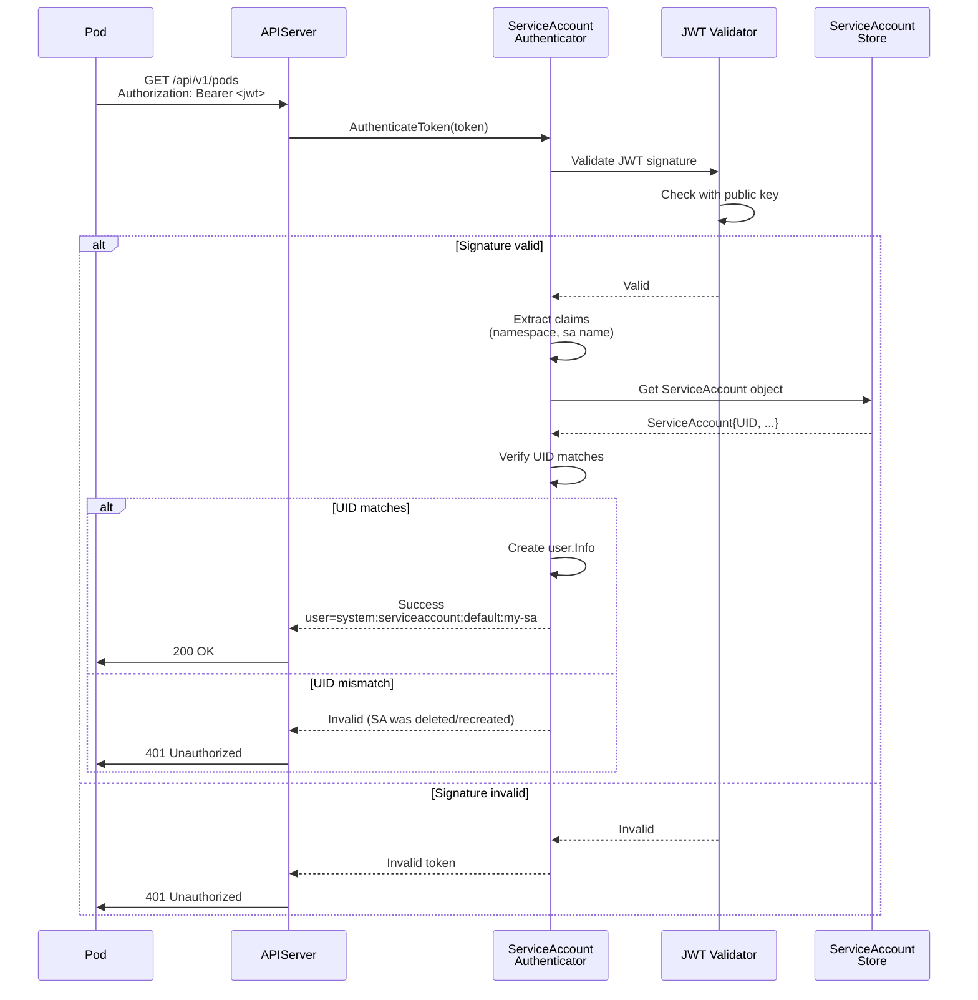
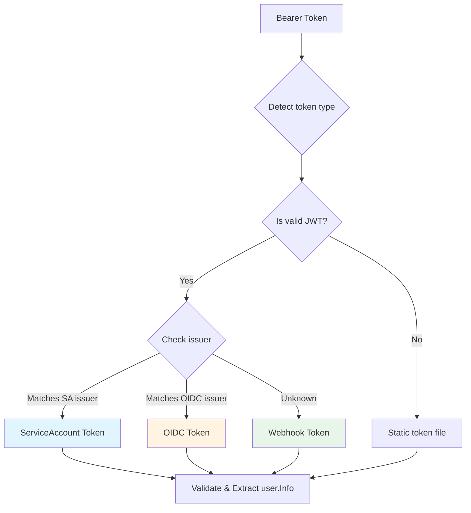
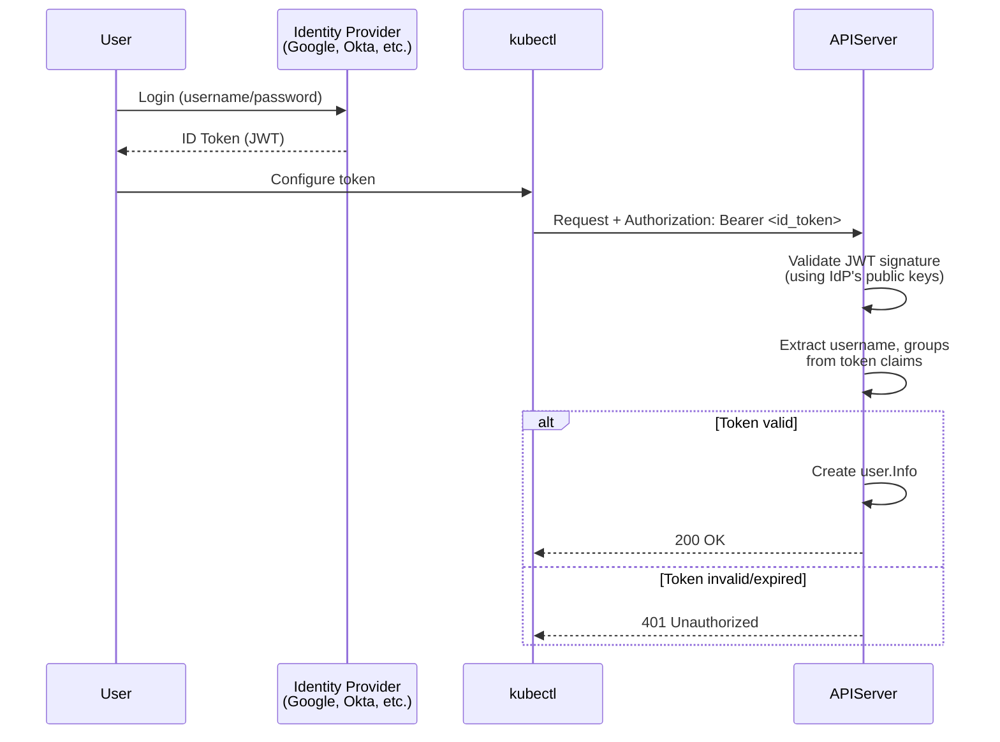
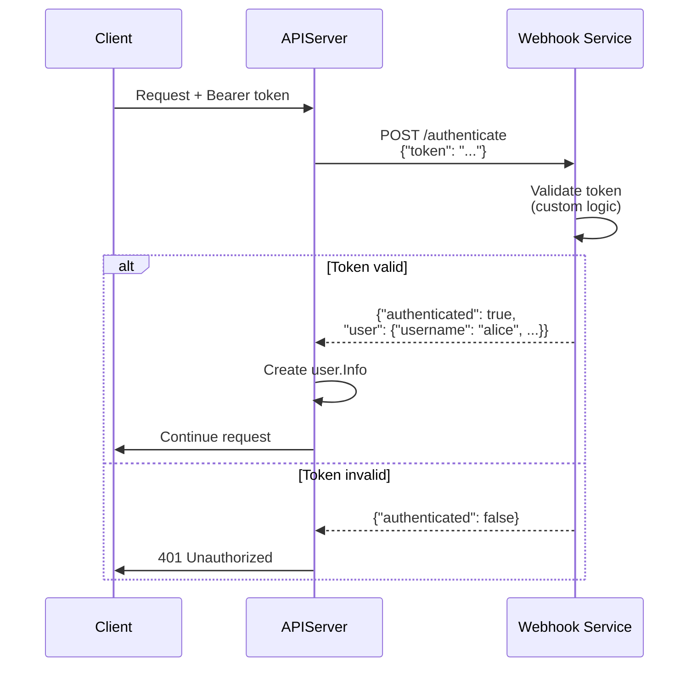
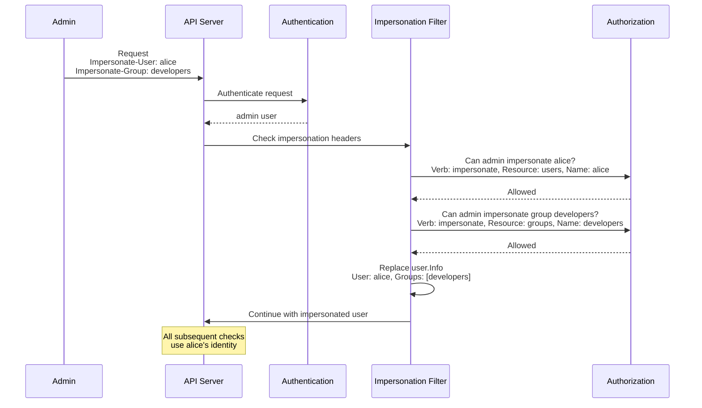

# Authentication System

> **Middle-Level Technical Documentation**
> How kube-apiserver authenticates requests from users, service accounts, and other clients.

---

## Table of Contents

- [Overview](#overview)
- [Authentication Flow](#authentication-flow)
- [Authenticator Interface](#authenticator-interface)
- [Authentication Strategies](#authentication-strategies)
- [Service Account Tokens](#service-account-tokens)
- [X.509 Client Certificates](#x509-client-certificates)
- [Bearer Token Authentication](#bearer-token-authentication)
- [OIDC Authentication](#oidc-authentication)
- [Webhook Token Authentication](#webhook-token-authentication)
- [Anonymous Authentication](#anonymous-authentication)
- [Impersonation](#impersonation)
- [User Info](#user-info)
- [Code References](#code-references)

---

## Overview

Authentication is the **first security gate** in the kube-apiserver request pipeline. It answers the question: **"Who are you?"**

### Position in Request Pipeline



### Key Concepts

- **Multiple strategies**: Try each authenticator in sequence until one succeeds
- **Bearer tokens**: Service accounts, OIDC, bootstrap tokens, webhook
- **X.509 certificates**: Mutual TLS authentication
- **Anonymous access**: Configurable anonymous user
- **User.Info**: Standard representation of authenticated identity
- **No sessions**: Stateless authentication on every request

**File Location**: `staging/src/k8s.io/apiserver/pkg/authentication/`

---

## Authentication Flow

### High-Level Flow



### Handler Chain Integration

```go
// staging/src/k8s.io/apiserver/pkg/server/config.go:1014-1091

func DefaultBuildHandlerChain(apiHandler http.Handler, c *Config) http.Handler {
    handler := apiHandler

    // ... earlier filters (request info, panic recovery, etc.)

    // 13. Authentication
    handler = genericapifilters.WithAuthentication(handler, c.Authentication.Authenticator, failed, c.Authentication.APIAudiences, c.Authentication.RequestHeaderConfig)

    // 14. Impersonation (optional)
    handler = genericapifilters.WithImpersonation(handler, c.Authorization.Authorizer, c.Serializer)

    // ... more filters

    return handler
}
```

**File**: `staging/src/k8s.io/apiserver/pkg/server/config.go:1030`

### WithAuthentication Filter

```go
// staging/src/k8s.io/apiserver/pkg/endpoints/filters/authentication.go:45-120

func WithAuthentication(handler http.Handler, auth authenticator.Request, failed http.Handler, apiAuds authenticator.Audiences, requestHeaderConfig *authenticatorfactory.RequestHeaderConfig) http.Handler {
    return http.HandlerFunc(func(w http.ResponseWriter, req *http.Request) {
        // Skip authentication for certain paths
        if len(apiAuds) > 0 {
            req = req.WithContext(authenticator.WithAudiences(req.Context(), apiAuds))
        }

        // Attempt authentication
        resp, ok, err := auth.AuthenticateRequest(req)

        if err != nil || !ok {
            if err != nil {
                klog.ErrorS(err, "Unable to authenticate request")
            }
            failed.ServeHTTP(w, req)
            return
        }

        // Authentication succeeded
        req = req.WithContext(genericapirequest.WithUser(req.Context(), resp.User))

        // Call next handler
        handler.ServeHTTP(w, req)
    })
}
```

**File**: `staging/src/k8s.io/apiserver/pkg/endpoints/filters/authentication.go:45-120`

---

## Authenticator Interface

### Core Interface

```go
// staging/src/k8s.io/apiserver/pkg/authentication/authenticator/interfaces.go:30-60

package authenticator

// Request authenticates an HTTP request
type Request interface {
    // AuthenticateRequest attempts to authenticate the request
    // Returns:
    //   - Response (with user.Info) if successful
    //   - ok=true if authentication succeeded
    //   - error if something went wrong
    AuthenticateRequest(req *http.Request) (*Response, bool, error)
}

// Token authenticates a token string
type Token interface {
    // AuthenticateToken validates a bearer token
    AuthenticateToken(ctx context.Context, token string) (*Response, bool, error)
}

// Response contains the authenticated user information
type Response struct {
    // User is the identity
    User user.Info

    // Audiences is the set of valid token audiences
    Audiences Audiences
}

// Audiences is a set of valid token audiences
type Audiences []string
```

### Union Authenticator

Multiple authenticators are combined using the **union pattern**:

```go
// staging/src/k8s.io/apiserver/pkg/authentication/request/union/union.go:30-80

type unionAuthRequestHandler struct {
    // Array of authenticators to try in order
    Handlers []authenticator.Request

    // If true, authentication failure returns error
    // If false, continues to next authenticator
    FailOnError bool
}

func (authHandler *unionAuthRequestHandler) AuthenticateRequest(req *http.Request) (*authenticator.Response, bool, error) {
    for _, handler := range authHandler.Handlers {
        resp, ok, err := handler.AuthenticateRequest(req)

        if ok {
            return resp, ok, err  // Success!
        }

        if err != nil {
            if authHandler.FailOnError {
                return nil, false, err
            }
            // Log error but continue to next authenticator
        }
    }

    // All authenticators failed
    return nil, false, nil
}
```

**File**: `staging/src/k8s.io/apiserver/pkg/authentication/request/union/union.go`

### Authenticator Construction

```go
// staging/src/k8s.io/apiserver/pkg/server/options/authentication.go:250-400

func (o *BuiltInAuthenticationOptions) ToAuthenticationConfig() (authenticator.Config, error) {
    var authenticators []authenticator.Request

    // 1. X.509 client certificates
    if o.ClientCert != nil {
        certAuth, err := newClientCertAuthenticator(o.ClientCert.ClientCA)
        authenticators = append(authenticators, certAuth)
    }

    // 2. Request header (for aggregated API servers)
    if o.RequestHeader != nil {
        requestHeaderAuth, err := headerrequest.NewSecure(...)
        authenticators = append(authenticators, requestHeaderAuth)
    }

    // 3. Bearer tokens (service accounts, OIDC, webhooks)
    if o.ServiceAccounts != nil || o.OIDC != nil || o.WebhookTokenAuth != nil {
        tokenAuth := tokenUnion(
            o.ServiceAccounts,
            o.OIDC,
            o.WebhookTokenAuth,
            o.BootstrapToken,
        )
        authenticators = append(authenticators, bearertoken.New(tokenAuth))
    }

    // 4. Anonymous (if enabled)
    if o.Anonymous != nil {
        authenticators = append(authenticators, anonymous.NewAuthenticator())
    }

    // Combine all authenticators
    return union.New(authenticators...), nil
}
```

**File**: `staging/src/k8s.io/apiserver/pkg/server/options/authentication.go:250-400`

---

## Authentication Strategies

### Strategy Overview



### Configuration Flags

```bash
# X.509 Client Certificates
--client-ca-file=/path/to/ca.crt

# Service Account Tokens
--service-account-key-file=/path/to/sa.pub
--service-account-issuer=https://kubernetes.default.svc
--service-account-signing-key-file=/path/to/sa.key
--api-audiences=https://kubernetes.default.svc

# OIDC
--oidc-issuer-url=https://accounts.google.com
--oidc-client-id=kubernetes
--oidc-username-claim=email
--oidc-groups-claim=groups
--oidc-ca-file=/path/to/oidc-ca.crt

# Webhook Token Auth
--authentication-token-webhook-config-file=/path/to/webhook-config.yaml
--authentication-token-webhook-cache-ttl=2m

# Bootstrap Tokens (for kubeadm)
--enable-bootstrap-token-auth

# Anonymous Access
--anonymous-auth=true  # Default: true
```

---

## Service Account Tokens

### Overview

Service accounts are the **primary authentication method for pods**:
- Each pod automatically gets a service account token
- Token is a **signed JWT**
- Mounted at `/var/run/secrets/kubernetes.io/serviceaccount/token`

### JWT Structure

```json
{
  "iss": "https://kubernetes.default.svc",
  "sub": "system:serviceaccount:default:my-sa",
  "aud": ["https://kubernetes.default.svc"],
  "exp": 1735689600,
  "iat": 1704153600,
  "kubernetes.io": {
    "namespace": "default",
    "serviceaccount": {
      "name": "my-sa",
      "uid": "12345678-1234-1234-1234-123456789012"
    },
    "pod": {
      "name": "my-pod-12345",
      "uid": "87654321-4321-4321-4321-210987654321"
    }
  }
}
```

### Validation Flow



### ServiceAccount Authenticator

```go
// staging/src/k8s.io/apiserver/pkg/authentication/token/tokenfile/tokenfile.go
// (simplified example)

type Authenticator struct {
    validator *jwt.Validator
    getter    ServiceAccountTokenGetter
}

func (a *Authenticator) AuthenticateToken(ctx context.Context, token string) (*authenticator.Response, bool, error) {
    // 1. Validate JWT signature
    claims, err := a.validator.Validate(ctx, token)
    if err != nil {
        return nil, false, err
    }

    // 2. Extract service account info
    namespace := claims.Kubernetes.Namespace
    saName := claims.Kubernetes.ServiceAccount.Name
    saUID := claims.Kubernetes.ServiceAccount.UID

    // 3. Lookup service account
    sa, err := a.getter.GetServiceAccount(namespace, saName)
    if err != nil {
        return nil, false, err
    }

    // 4. Verify UID (prevents deleted/recreated SA attacks)
    if sa.UID != saUID {
        return nil, false, fmt.Errorf("service account UID mismatch")
    }

    // 5. Create user.Info
    user := &user.DefaultInfo{
        Name: fmt.Sprintf("system:serviceaccount:%s:%s", namespace, saName),
        UID:  string(saUID),
        Groups: []string{
            "system:serviceaccounts",
            fmt.Sprintf("system:serviceaccounts:%s", namespace),
            "system:authenticated",
        },
    }

    return &authenticator.Response{User: user}, true, nil
}
```

**File**: `staging/src/k8s.io/apiserver/plugin/pkg/authenticator/token/oidc/oidc.go` (similar structure)

### Service Account Groups

Authenticated service accounts automatically belong to groups:

```go
Groups: []string{
    "system:serviceaccounts",                      // All service accounts
    "system:serviceaccounts:<namespace>",          // Namespace-specific
    "system:authenticated",                        // All authenticated users
}
```

**Example**:
```
User: system:serviceaccount:kube-system:default
Groups:
  - system:serviceaccounts
  - system:serviceaccounts:kube-system
  - system:authenticated
```

---

## X.509 Client Certificates

### Overview

X.509 certificates provide **mutual TLS authentication**:
- Client presents certificate during TLS handshake
- API server validates certificate against CA
- Username and groups extracted from certificate fields

### Certificate Fields Mapping

| Certificate Field | Kubernetes Field | Example |
|-------------------|------------------|---------|
| **Common Name (CN)** | Username | `CN=alice` → `alice` |
| **Organization (O)** | Groups | `O=developers, O=ops` → `[developers, ops]` |

### Certificate Example

```bash
# Generate user certificate
openssl req -new -key alice.key -out alice.csr -subj "/CN=alice/O=developers/O=ops"

# Sign with cluster CA
openssl x509 -req -in alice.csr -CA ca.crt -CAkey ca.key -CAcreateserial -out alice.crt -days 365
```

**Result**:
- Username: `alice`
- Groups: `["developers", "ops", "system:authenticated"]`

### X.509 Authenticator

```go
// staging/src/k8s.io/apiserver/pkg/authentication/request/x509/x509.go:45-120

type Authenticator struct {
    opts x509.VerifyOptions
}

func (a *Authenticator) AuthenticateRequest(req *http.Request) (*authenticator.Response, bool, error) {
    if req.TLS == nil || len(req.TLS.PeerCertificates) == 0 {
        return nil, false, nil  // No cert, try next authenticator
    }

    // Get client certificate
    cert := req.TLS.PeerCertificates[0]

    // Verify certificate chain
    _, err := cert.Verify(a.opts)
    if err != nil {
        return nil, false, err
    }

    // Extract username from CN
    username := cert.Subject.CommonName

    // Extract groups from Organization fields
    groups := cert.Subject.Organization
    groups = append(groups, "system:authenticated")

    user := &user.DefaultInfo{
        Name:   username,
        Groups: groups,
    }

    return &authenticator.Response{User: user}, true, nil
}
```

**File**: `staging/src/k8s.io/apiserver/pkg/authentication/request/x509/x509.go`

### Use Cases

| Use Case | CN Format | Groups |
|----------|-----------|--------|
| **kubectl** | User's name | User's groups |
| **kubelet** | `system:node:<node-name>` | `system:nodes` |
| **kube-proxy** | `system:kube-proxy` | - |
| **kube-controller-manager** | `system:kube-controller-manager` | - |
| **kube-scheduler** | `system:kube-scheduler` | - |

---

## Bearer Token Authentication

### Token Format

```
Authorization: Bearer <token>
```

### Token Types



### Bearer Token Authenticator

```go
// staging/src/k8s.io/apiserver/pkg/authentication/request/bearertoken/bearertoken.go:30-70

type Authenticator struct {
    auth authenticator.Token
}

func (a *Authenticator) AuthenticateRequest(req *http.Request) (*authenticator.Response, bool, error) {
    // Extract token from Authorization header
    auth := strings.TrimSpace(req.Header.Get("Authorization"))
    if auth == "" {
        return nil, false, nil  // No token
    }

    parts := strings.SplitN(auth, " ", 2)
    if len(parts) < 2 || strings.ToLower(parts[0]) != "bearer" {
        return nil, false, nil  // Not a bearer token
    }

    token := parts[1]

    // Delegate to token authenticator
    return a.auth.AuthenticateToken(req.Context(), token)
}
```

**File**: `staging/src/k8s.io/apiserver/pkg/authentication/request/bearertoken/bearertoken.go`

---

## OIDC Authentication

### Overview

**OpenID Connect (OIDC)** enables integration with external identity providers:
- Google, Azure AD, Okta, Keycloak, etc.
- Users authenticate with IdP, receive JWT token
- API server validates JWT without contacting IdP

### Flow



### OIDC Configuration

```bash
--oidc-issuer-url=https://accounts.google.com
--oidc-client-id=kubernetes
--oidc-username-claim=email
--oidc-groups-claim=groups
--oidc-ca-file=/etc/kubernetes/pki/oidc-ca.crt
```

### OIDC Authenticator

```go
// staging/src/k8s.io/apiserver/plugin/pkg/authenticator/token/oidc/oidc.go:100-250

type Authenticator struct {
    issuerURL      string
    clientID       string
    usernameClaim  string
    groupsClaim    string
    verifier       *oidc.IDTokenVerifier
}

func (a *Authenticator) AuthenticateToken(ctx context.Context, token string) (*authenticator.Response, bool, error) {
    // 1. Verify JWT signature and claims
    idToken, err := a.verifier.Verify(ctx, token)
    if err != nil {
        return nil, false, err
    }

    // 2. Extract all claims
    var claims map[string]interface{}
    if err := idToken.Claims(&claims); err != nil {
        return nil, false, err
    }

    // 3. Extract username
    username, ok := claims[a.usernameClaim].(string)
    if !ok {
        return nil, false, fmt.Errorf("username claim %q not found", a.usernameClaim)
    }

    // 4. Extract groups (optional)
    var groups []string
    if a.groupsClaim != "" {
        if groupsClaim, ok := claims[a.groupsClaim]; ok {
            switch v := groupsClaim.(type) {
            case []interface{}:
                for _, group := range v {
                    if g, ok := group.(string); ok {
                        groups = append(groups, g)
                    }
                }
            case string:
                groups = []string{v}
            }
        }
    }

    groups = append(groups, "system:authenticated")

    // 5. Create user.Info
    user := &user.DefaultInfo{
        Name:   username,
        Groups: groups,
    }

    return &authenticator.Response{User: user}, true, nil
}
```

**File**: `staging/src/k8s.io/apiserver/plugin/pkg/authenticator/token/oidc/oidc.go`

---

## Webhook Token Authentication

### Overview

Webhook authentication delegates token validation to an **external service**:
- Useful for custom authentication systems
- API server sends token to webhook
- Webhook returns user info

### Flow



### Webhook Configuration

**kubeconfig file** (`/etc/kubernetes/webhook-auth-config.yaml`):
```yaml
apiVersion: v1
kind: Config
clusters:
- name: auth-webhook
  cluster:
    server: https://auth.example.com/authenticate
    certificate-authority: /path/to/ca.crt
users:
- name: auth-webhook-client
  user:
    client-certificate: /path/to/client.crt
    client-key: /path/to/client.key
contexts:
- name: webhook
  context:
    cluster: auth-webhook
    user: auth-webhook-client
current-context: webhook
```

**API server flag**:
```bash
--authentication-token-webhook-config-file=/etc/kubernetes/webhook-auth-config.yaml
--authentication-token-webhook-cache-ttl=2m
```

### Webhook Request Format

```json
{
  "apiVersion": "authentication.k8s.io/v1",
  "kind": "TokenReview",
  "spec": {
    "token": "eyJhbGciOiJSUzI1NiIsInR5cCI6IkpXVCJ9...",
    "audiences": ["https://kubernetes.default.svc"]
  }
}
```

### Webhook Response Format

**Success**:
```json
{
  "apiVersion": "authentication.k8s.io/v1",
  "kind": "TokenReview",
  "status": {
    "authenticated": true,
    "user": {
      "username": "alice",
      "uid": "12345",
      "groups": ["developers", "ops"],
      "extra": {
        "email": ["alice@example.com"]
      }
    },
    "audiences": ["https://kubernetes.default.svc"]
  }
}
```

**Failure**:
```json
{
  "apiVersion": "authentication.k8s.io/v1",
  "kind": "TokenReview",
  "status": {
    "authenticated": false
  }
}
```

### Webhook Authenticator

```go
// staging/src/k8s.io/apiserver/plugin/pkg/authenticator/token/webhook/webhook.go:80-180

type WebhookTokenAuthenticator struct {
    tokenReview *authenticationv1client.AuthenticationV1Client
    ttl         time.Duration
    cache       *cache.LRUExpireCache
}

func (w *WebhookTokenAuthenticator) AuthenticateToken(ctx context.Context, token string) (*authenticator.Response, bool, error) {
    // Check cache first
    if cachedResp, ok := w.cache.Get(token); ok {
        return cachedResp.(*authenticator.Response), true, nil
    }

    // Create TokenReview request
    review := &authenticationv1.TokenReview{
        Spec: authenticationv1.TokenReviewSpec{
            Token:     token,
            Audiences: w.implicitAuds,
        },
    }

    // Send to webhook
    result, err := w.tokenReview.TokenReviews().Create(ctx, review, metav1.CreateOptions{})
    if err != nil {
        return nil, false, err
    }

    if !result.Status.Authenticated {
        return nil, false, nil
    }

    // Extract user info from response
    user := &user.DefaultInfo{
        Name:   result.Status.User.Username,
        UID:    result.Status.User.UID,
        Groups: result.Status.User.Groups,
        Extra:  convertExtra(result.Status.User.Extra),
    }

    resp := &authenticator.Response{User: user}

    // Cache the result
    w.cache.Add(token, resp, w.ttl)

    return resp, true, nil
}
```

**File**: `staging/src/k8s.io/apiserver/plugin/pkg/authenticator/token/webhook/webhook.go`

---

## Anonymous Authentication

### Overview

Anonymous authentication provides a **default identity** for unauthenticated requests:
- Username: `system:anonymous`
- Group: `system:unauthenticated`
- Enabled by default

### Configuration

```bash
# Enable (default)
--anonymous-auth=true

# Disable
--anonymous-auth=false
```

### Anonymous Authenticator

```go
// staging/src/k8s.io/apiserver/pkg/authentication/request/anonymous/anonymous.go:30-50

type Authenticator struct{}

func NewAuthenticator() authenticator.Request {
    return &Authenticator{}
}

func (a *Authenticator) AuthenticateRequest(req *http.Request) (*authenticator.Response, bool, error) {
    // Always succeeds with anonymous user
    return &authenticator.Response{
        User: &user.DefaultInfo{
            Name:   user.Anonymous,  // "system:anonymous"
            Groups: []string{user.AllUnauthenticated},  // "system:unauthenticated"
        },
    }, true, nil
}
```

**File**: `staging/src/k8s.io/apiserver/pkg/authentication/request/anonymous/anonymous.go`

### Use Cases

- Public API endpoints (e.g., `/healthz`, `/readyz`)
- Kubelet API server bootstrap
- RBAC can still deny access based on `system:anonymous`

---

## Impersonation

### Overview

Impersonation allows authenticated users to **act as another user**:
- Useful for debugging authorization issues
- kubectl `--as` and `--as-group` flags
- Requires `impersonate` verb permission

### Flow



### Impersonation Headers

```http
GET /api/v1/namespaces/default/pods HTTP/1.1
Host: kubernetes.default.svc
Authorization: Bearer <admin-token>
Impersonate-User: alice
Impersonate-Group: developers
Impersonate-Group: ops
Impersonate-Extra-scopes: view
Impersonate-Extra-reason: debugging
```

### kubectl Example

```bash
# Impersonate user
kubectl get pods --as=alice

# Impersonate user with groups
kubectl get pods --as=alice --as-group=developers --as-group=ops

# Check what alice can do
kubectl auth can-i list pods --as=alice
```

### Impersonation Filter

```go
// staging/src/k8s.io/apiserver/pkg/endpoints/filters/impersonation.go:60-180

func WithImpersonation(handler http.Handler, auth authorizer.Authorizer, s runtime.NegotiatedSerializer) http.Handler {
    return http.HandlerFunc(func(w http.ResponseWriter, req *http.Request) {
        // Get authenticated user
        ctx := req.Context()
        user, ok := genericapirequest.UserFrom(ctx)
        if !ok {
            responsewriters.InternalError(w, req, errors.New("no user found"))
            return
        }

        // Check for impersonation headers
        requestedUser := req.Header.Get("Impersonate-User")
        if requestedUser == "" {
            handler.ServeHTTP(w, req)  // No impersonation
            return
        }

        // Authorize impersonation
        authCheck := authorizer.AttributesRecord{
            User:            user,
            Verb:            "impersonate",
            APIGroup:        "",
            Resource:        "users",
            Name:            requestedUser,
            ResourceRequest: true,
        }

        decision, reason, err := auth.Authorize(ctx, authCheck)
        if decision != authorizer.DecisionAllow {
            forbidden(w, req, fmt.Errorf("impersonation forbidden: %s", reason))
            return
        }

        // Check group impersonation
        requestedGroups := req.Header["Impersonate-Group"]
        for _, group := range requestedGroups {
            authCheck := authorizer.AttributesRecord{
                User:            user,
                Verb:            "impersonate",
                APIGroup:        "",
                Resource:        "groups",
                Name:            group,
                ResourceRequest: true,
            }

            decision, reason, err := auth.Authorize(ctx, authCheck)
            if decision != authorizer.DecisionAllow {
                forbidden(w, req, fmt.Errorf("group impersonation forbidden: %s", reason))
                return
            }
        }

        // Create impersonated user
        impersonatedUser := &user.DefaultInfo{
            Name:   requestedUser,
            Groups: requestedGroups,
            Extra:  parseExtra(req.Header),
        }

        // Replace user in context
        ctx = genericapirequest.WithUser(ctx, impersonatedUser)
        req = req.WithContext(ctx)

        handler.ServeHTTP(w, req)
    })
}
```

**File**: `staging/src/k8s.io/apiserver/pkg/endpoints/filters/impersonation.go`

### RBAC for Impersonation

```yaml
apiVersion: rbac.authorization.k8s.io/v1
kind: ClusterRole
metadata:
  name: impersonator
rules:
- apiGroups: [""]
  resources: ["users", "groups", "serviceaccounts"]
  verbs: ["impersonate"]
---
apiVersion: rbac.authorization.k8s.io/v1
kind: ClusterRoleBinding
metadata:
  name: admin-impersonator
roleRef:
  apiGroup: rbac.authorization.k8s.io
  kind: ClusterRole
  name: impersonator
subjects:
- kind: User
  name: admin
```

---

## User Info

### user.Info Interface

```go
// staging/src/k8s.io/apiserver/pkg/authentication/user/user.go:25-50

package user

type Info interface {
    // GetName returns the username
    GetName() string

    // GetUID returns a unique user ID
    GetUID() string

    // GetGroups returns the groups the user belongs to
    GetGroups() []string

    // GetExtra returns additional user info
    GetExtra() map[string][]string
}

// DefaultInfo is the standard implementation
type DefaultInfo struct {
    Name   string
    UID    string
    Groups []string
    Extra  map[string][]string
}
```

### Standard Users and Groups

| User | Description |
|------|-------------|
| `system:admin` | Cluster admin (rarely used directly) |
| `system:anonymous` | Unauthenticated requests |
| `system:serviceaccount:<ns>:<name>` | Service account |
| `system:node:<node-name>` | Kubelet |
| `system:kube-proxy` | kube-proxy |
| `system:kube-controller-manager` | Controller manager |
| `system:kube-scheduler` | Scheduler |

| Group | Description |
|-------|-------------|
| `system:authenticated` | All authenticated users |
| `system:unauthenticated` | Anonymous user |
| `system:serviceaccounts` | All service accounts |
| `system:serviceaccounts:<namespace>` | Service accounts in namespace |
| `system:nodes` | All nodes (kubelets) |
| `system:masters` | Legacy admin group (deprecated) |

### Example User.Info Objects

**kubectl user (X.509)**:
```go
&user.DefaultInfo{
    Name: "alice",
    Groups: []string{"developers", "ops", "system:authenticated"},
}
```

**Service account**:
```go
&user.DefaultInfo{
    Name: "system:serviceaccount:default:my-sa",
    UID:  "12345678-1234-1234-1234-123456789012",
    Groups: []string{
        "system:serviceaccounts",
        "system:serviceaccounts:default",
        "system:authenticated",
    },
}
```

**Kubelet**:
```go
&user.DefaultInfo{
    Name: "system:node:worker-1",
    Groups: []string{"system:nodes", "system:authenticated"},
}
```

---

## Code References

### Key Files

| Component | File | Description |
|-----------|------|-------------|
| **Interfaces** | `staging/src/k8s.io/apiserver/pkg/authentication/authenticator/interfaces.go` | Core interfaces |
| **Union** | `staging/src/k8s.io/apiserver/pkg/authentication/request/union/union.go` | Combine multiple authenticators |
| **X.509** | `staging/src/k8s.io/apiserver/pkg/authentication/request/x509/x509.go` | Certificate authentication |
| **Bearer Token** | `staging/src/k8s.io/apiserver/pkg/authentication/request/bearertoken/bearertoken.go` | Token extraction |
| **Service Account** | `staging/src/k8s.io/apiserver/plugin/pkg/authenticator/token/oidc/oidc.go` | SA token validation |
| **OIDC** | `staging/src/k8s.io/apiserver/plugin/pkg/authenticator/token/oidc/oidc.go` | OIDC integration |
| **Webhook** | `staging/src/k8s.io/apiserver/plugin/pkg/authenticator/token/webhook/webhook.go` | Webhook delegation |
| **Anonymous** | `staging/src/k8s.io/apiserver/pkg/authentication/request/anonymous/anonymous.go` | Anonymous user |
| **Impersonation** | `staging/src/k8s.io/apiserver/pkg/endpoints/filters/impersonation.go` | Impersonation filter |
| **user.Info** | `staging/src/k8s.io/apiserver/pkg/authentication/user/user.go` | User representation |

### Key Functions

```go
// Authentication filter in handler chain
staging/src/k8s.io/apiserver/pkg/endpoints/filters/authentication.go:45-120
func WithAuthentication(handler, auth, failed, apiAuds, requestHeaderConfig) http.Handler

// Union authenticator
staging/src/k8s.io/apiserver/pkg/authentication/request/union/union.go:40-80
func (authHandler *unionAuthRequestHandler) AuthenticateRequest(req) (*Response, bool, error)

// X.509 authentication
staging/src/k8s.io/apiserver/pkg/authentication/request/x509/x509.go:60-100
func (a *Authenticator) AuthenticateRequest(req) (*Response, bool, error)

// Bearer token extraction
staging/src/k8s.io/apiserver/pkg/authentication/request/bearertoken/bearertoken.go:40-70
func (a *Authenticator) AuthenticateRequest(req) (*Response, bool, error)

// OIDC token validation
staging/src/k8s.io/apiserver/plugin/pkg/authenticator/token/oidc/oidc.go:120-250
func (a *Authenticator) AuthenticateToken(ctx, token) (*Response, bool, error)

// Webhook token validation
staging/src/k8s.io/apiserver/plugin/pkg/authenticator/token/webhook/webhook.go:100-180
func (w *WebhookTokenAuthenticator) AuthenticateToken(ctx, token) (*Response, bool, error)

// Impersonation filter
staging/src/k8s.io/apiserver/pkg/endpoints/filters/impersonation.go:60-180
func WithImpersonation(handler, auth, s) http.Handler
```

---

## Summary

The authentication system provides **flexible, pluggable identity verification**:

1. **Multiple strategies** - X.509, service accounts, OIDC, webhooks, anonymous
2. **Union pattern** - Try authenticators in sequence
3. **Stateless** - No sessions, every request authenticated
4. **Standard representation** - user.Info interface
5. **Impersonation** - Debug and test with different identities

**Security Features**:
- TLS mutual authentication (X.509)
- JWT signature validation (service accounts, OIDC)
- External delegation (webhooks)
- Fine-grained impersonation control

**Next Steps**:
- [Authorization](05-authorization.md) - What can you do?
- [Admission Control](06-admission-control.md) - Additional validation
- [Request Pipeline](01-request-pipeline.md) - Full request flow

---

**Related Documentation**:
- [QUICK-REFERENCE.md](../QUICK-REFERENCE.md#authentication) - Quick reference
- [Key Components](../high-level/04-key-components.md#authentication-system) - High-level view
- [Handler Chain](../low-level/01-handler-chain-construction.md) - Filter details
