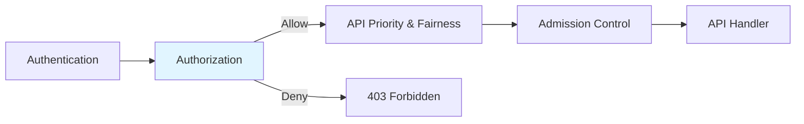
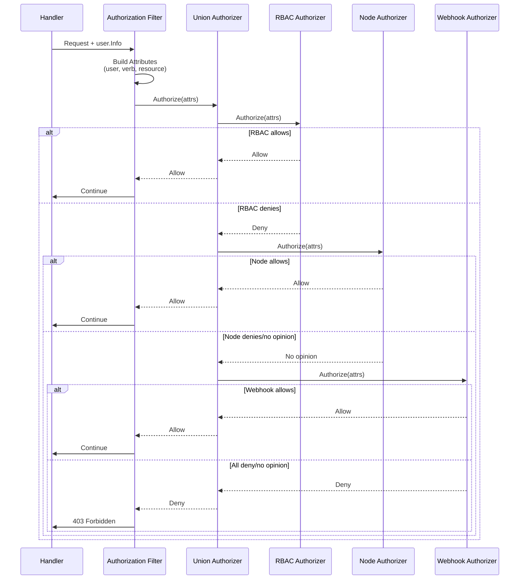
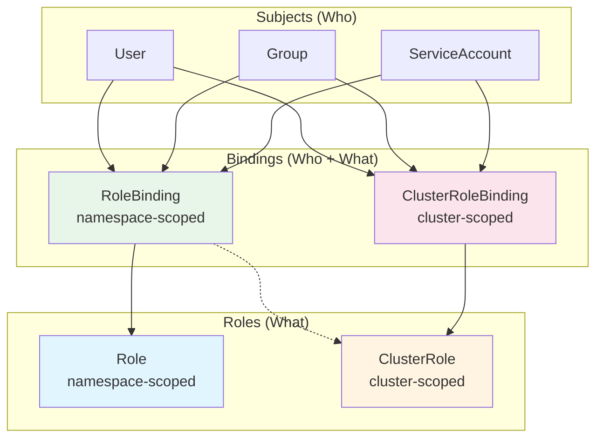
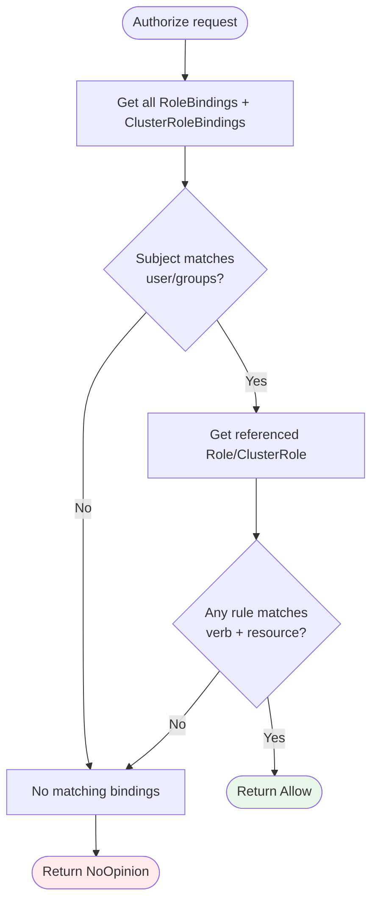
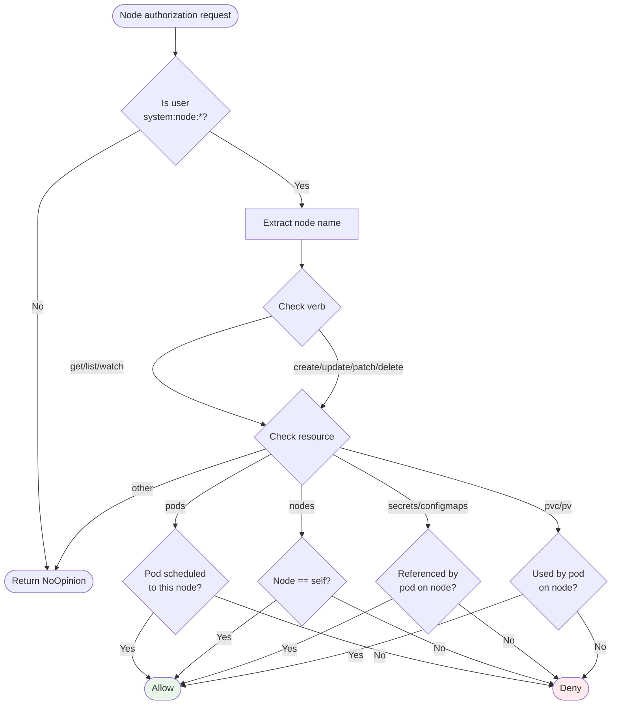
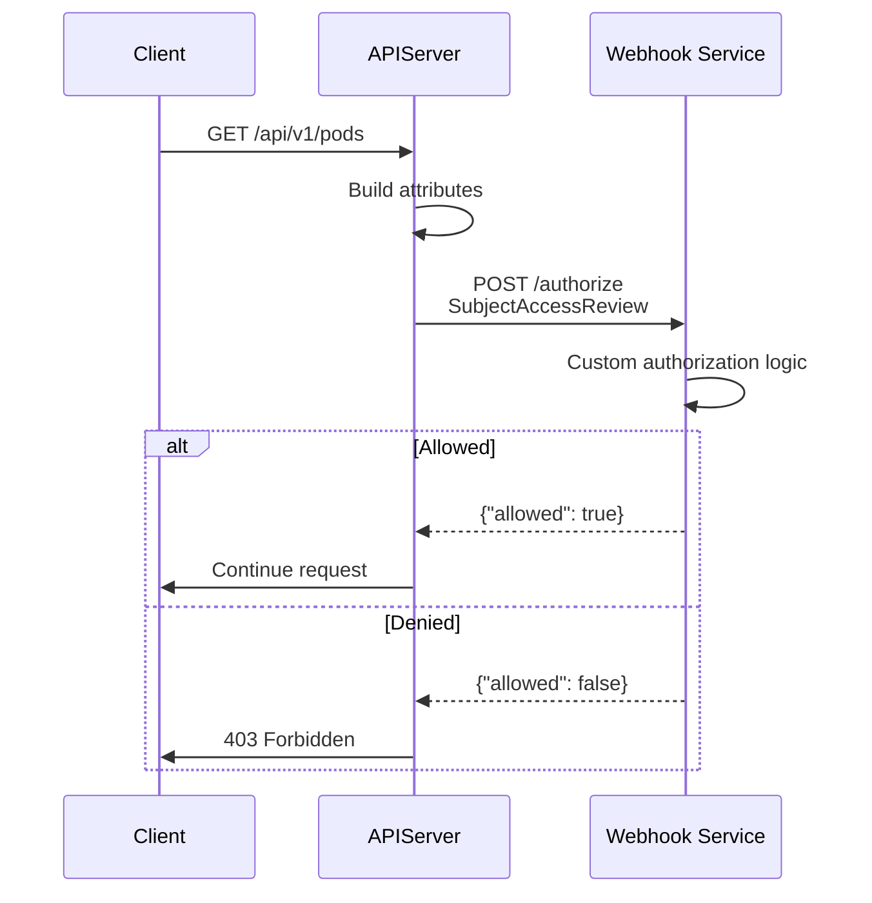

# Authorization System

> **Middle-Level Technical Documentation**
> How kube-apiserver authorizes requests: RBAC, Node Authorization, Webhooks, and ABAC.

---

## Table of Contents

- [Overview](#overview)
- [Authorization Flow](#authorization-flow)
- [Authorizer Interface](#authorizer-interface)
- [RBAC (Role-Based Access Control)](#rbac-role-based-access-control)
- [Node Authorization](#node-authorization)
- [Webhook Authorization](#webhook-authorization)
- [ABAC (Attribute-Based Access Control)](#abac-attribute-based-access-control)
- [AlwaysAllow and AlwaysDeny](#alwaysallow-and-alwaysdeny)
- [Authorization Modes](#authorization-modes)
- [Code References](#code-references)

---

## Overview

Authorization is the **second security gate** after authentication. It answers: **"What can you do?"**

### Position in Pipeline



### Key Concepts

- **Multiple modes**: RBAC, Node, Webhook, ABAC
- **Union of authorizers**: First ALLOW wins
- **Attributes-based**: Check user, verb, resource, namespace
- **Explicit deny**: No authorization = deny by default
- **Request-scoped**: Authorization check for every API request

**File Location**: `staging/src/k8s.io/apiserver/pkg/authorization/`

---

## Authorization Flow

### High-Level Flow



### Attributes Record

Authorization decisions are based on **attributes**:

```go
// staging/src/k8s.io/apiserver/pkg/authorization/authorizer/interfaces.go:50-100

type Attributes interface {
    // User who made the request
    GetUser() user.Info

    // Verb is get, list, create, update, patch, delete, watch, deletecollection
    GetVerb() string

    // Namespace of the request (empty for cluster-scoped)
    GetNamespace() string

    // API group ("" for core, "apps", "batch", etc.)
    GetAPIGroup() string

    // API version ("v1", "v1beta1", etc.)
    GetAPIVersion() string

    // Resource ("pods", "services", "deployments")
    GetResource() string

    // Subresource ("status", "log", "exec", "scale")
    GetSubresource() string

    // Name of the resource instance (empty for list/create)
    GetName() string

    // ResourceRequest is true for resource requests, false for non-resource URLs
    IsResourceRequest() bool

    // Path for non-resource requests (/healthz, /metrics)
    GetPath() string
}
```

**Example Attributes**:
```go
// GET /api/v1/namespaces/default/pods/nginx
Attributes{
    User:        &user.DefaultInfo{Name: "alice", Groups: ["developers"]},
    Verb:        "get",
    Namespace:   "default",
    APIGroup:    "",
    APIVersion:  "v1",
    Resource:    "pods",
    Name:        "nginx",
    Subresource: "",
    IsResourceRequest: true,
}

// GET /api/v1/namespaces/default/pods/nginx/log
Attributes{
    ...
    Subresource: "log",
}

// GET /healthz
Attributes{
    User: ...,
    IsResourceRequest: false,
    Path: "/healthz",
}
```

---

## Authorizer Interface

### Core Interface

```go
// staging/src/k8s.io/apiserver/pkg/authorization/authorizer/interfaces.go:30-45

type Authorizer interface {
    // Authorize makes an authorization decision
    // Returns:
    //   - Decision: Allow, Deny, or NoOpinion
    //   - Reason: human-readable explanation
    //   - Error: if something went wrong
    Authorize(ctx context.Context, a Attributes) (Decision, string, error)
}

type Decision int

const (
    // DecisionNoOpinion: authorizer has no opinion
    DecisionNoOpinion Decision = iota

    // DecisionAllow: request is allowed
    DecisionAllow

    // DecisionDeny: request is explicitly denied
    DecisionDeny
)
```

### Union Authorizer

```go
// staging/src/k8s.io/apiserver/pkg/authorization/union/union.go:30-70

type unionAuthzHandler []authorizer.Authorizer

func (authzHandler unionAuthzHandler) Authorize(ctx context.Context, a authorizer.Attributes) (authorizer.Decision, string, error) {
    var (
        errlist []error
        reasons []string
    )

    for _, currAuthzHandler := range authzHandler {
        decision, reason, err := currAuthzHandler.Authorize(ctx, a)

        if err != nil {
            errlist = append(errlist, err)
        }
        if len(reason) != 0 {
            reasons = append(reasons, reason)
        }

        switch decision {
        case authorizer.DecisionAllow:
            return authorizer.DecisionAllow, reason, nil  // FIRST ALLOW WINS!

        case authorizer.DecisionDeny:
            return authorizer.DecisionDeny, reason, nil  // Explicit deny
        }

        // DecisionNoOpinion: continue to next authorizer
    }

    // All returned NoOpinion (or errors)
    return authorizer.DecisionDeny, strings.Join(reasons, ", "), utilerrors.NewAggregate(errlist)
}
```

**File**: `staging/src/k8s.io/apiserver/pkg/authorization/union/union.go`

**Key Behavior**:
- First `Allow` wins (short-circuit)
- Explicit `Deny` stops evaluation
- All `NoOpinion` = final `Deny`

---

## RBAC (Role-Based Access Control)

### Overview

**RBAC** is the **recommended authorization mode** for Kubernetes:
- Fine-grained access control
- Uses Roles and RoleBindings
- Additive only (no deny rules)
- Cluster-scoped and namespace-scoped resources

### RBAC Components



### Role Definition

```yaml
apiVersion: rbac.authorization.k8s.io/v1
kind: Role
metadata:
  namespace: default
  name: pod-reader
rules:
- apiGroups: [""]        # "" = core API group
  resources: ["pods"]
  verbs: ["get", "list", "watch"]
- apiGroups: [""]
  resources: ["pods/log"]  # Subresource
  verbs: ["get"]
```

### ClusterRole Definition

```yaml
apiVersion: rbac.authorization.k8s.io/v1
kind: ClusterRole
metadata:
  name: secret-reader
rules:
- apiGroups: [""]
  resources: ["secrets"]
  verbs: ["get", "list", "watch"]
- apiGroups: [""]
  resources: ["configmaps"]
  verbs: ["get"]
```

### RoleBinding

```yaml
apiVersion: rbac.authorization.k8s.io/v1
kind: RoleBinding
metadata:
  name: read-pods
  namespace: default
roleRef:
  apiGroup: rbac.authorization.k8s.io
  kind: Role
  name: pod-reader
subjects:
- kind: User
  name: alice
  apiGroup: rbac.authorization.k8s.io
- kind: ServiceAccount
  name: my-sa
  namespace: default
```

### ClusterRoleBinding

```yaml
apiVersion: rbac.authorization.k8s.io/v1
kind: ClusterRoleBinding
metadata:
  name: read-secrets-global
roleRef:
  apiGroup: rbac.authorization.k8s.io
  kind: ClusterRole
  name: secret-reader
subjects:
- kind: Group
  name: system:authenticated
  apiGroup: rbac.authorization.k8s.io
```

### RBAC Authorization Logic



### RBAC Authorizer Implementation

```go
// plugin/pkg/auth/authorizer/rbac/rbac.go:80-150

type RBACAuthorizer struct {
    authorizationRuleResolver validation.AuthorizationRuleResolver
}

func (r *RBACAuthorizer) Authorize(ctx context.Context, requestAttributes authorizer.Attributes) (authorizer.Decision, string, error) {
    ruleCheckingVisitor := &authorizingVisitor{requestAttributes: requestAttributes}

    // Get all applicable rules for this user
    r.authorizationRuleResolver.VisitRulesFor(requestAttributes.GetUser(), requestAttributes.GetNamespace(), ruleCheckingVisitor.visit)

    if ruleCheckingVisitor.allowed {
        return authorizer.DecisionAllow, "", nil
    }

    // No matching rule found
    return authorizer.DecisionNoOpinion, ruleCheckingVisitor.reason, nil
}

type authorizingVisitor struct {
    requestAttributes authorizer.Attributes
    allowed           bool
    reason            string
}

func (v *authorizingVisitor) visit(source fmt.Stringer, rule *rbacv1.PolicyRule, err error) bool {
    if RuleAllows(v.requestAttributes, rule) {
        v.allowed = true
        return false  // Stop visiting
    }
    return true  // Continue
}

func RuleAllows(requestAttributes authorizer.Attributes, rule *rbacv1.PolicyRule) bool {
    // Check if verb matches
    if !VerbMatches(rule, requestAttributes.GetVerb()) {
        return false
    }

    // Check if API group matches
    if !APIGroupMatches(rule, requestAttributes.GetAPIGroup()) {
        return false
    }

    // Check if resource matches
    if !ResourceMatches(rule, requestAttributes.GetResource(), requestAttributes.GetSubresource()) {
        return false
    }

    // Check resource name (if specified)
    if len(rule.ResourceNames) > 0 {
        if !ResourceNameMatches(rule, requestAttributes.GetName()) {
            return false
        }
    }

    return true
}
```

**File**: `plugin/pkg/auth/authorizer/rbac/rbac.go`

### Built-in ClusterRoles

Kubernetes provides several default ClusterRoles:

| ClusterRole | Permissions | Use Case |
|-------------|-------------|----------|
| **cluster-admin** | Full access to all resources | Cluster administrators |
| **admin** | Full access within namespace | Namespace administrators |
| **edit** | Read/write within namespace | Developers |
| **view** | Read-only within namespace | Viewers, monitoring |
| **system:node** | Kubelet permissions | Nodes |
| **system:kube-controller-manager** | Controller manager permissions | Control plane |

---

## Node Authorization

### Overview

**Node Authorization** is a specialized authorizer for **kubelets**:
- Kubelets can only access resources related to their own node
- Prevents cross-node data access
- Required for secure multi-tenant clusters

### Authorization Logic



### Allowed Operations

**Node can access**:
- **Own node object**: Read and update status
- **Pods bound to node**: Read all pod objects scheduled to the node
- **Secrets/ConfigMaps**: Only those referenced by pods on the node
- **PVC/PV**: Only those used by pods on the node
- **Services**: Read all services
- **Endpoints**: Read all endpoints

**Node cannot access**:
- Pods on other nodes
- Secrets not used by pods on this node
- Other nodes' status

### Example Configuration

```bash
# Enable node authorization (typically second in the list)
--authorization-mode=Node,RBAC
```

### Node Authorizer Implementation

```go
// plugin/pkg/auth/authorizer/node/node_authorizer.go:80-200

type NodeAuthorizer struct {
    graph *Graph  // Tracks pod → node, pod → secret, etc.
}

func (r *NodeAuthorizer) Authorize(ctx context.Context, attrs authorizer.Attributes) (authorizer.Decision, string, error) {
    nodeName, isNode := nodeidentifier.NodeIdentity(attrs.GetUser())
    if !isNode {
        return authorizer.DecisionNoOpinion, "", nil  // Not a node
    }

    // Node accessing its own object
    if attrs.IsResourceRequest() && attrs.GetResource() == "nodes" && attrs.GetName() == nodeName {
        return authorizer.DecisionAllow, "", nil
    }

    // Check if resource is bound to this node
    switch attrs.GetResource() {
    case "pods":
        if r.graph.IsPodBoundToNode(attrs.GetNamespace(), attrs.GetName(), nodeName) {
            return authorizer.DecisionAllow, "", nil
        }

    case "secrets", "configmaps":
        if r.graph.IsSecretReferencedByPodOnNode(attrs.GetNamespace(), attrs.GetName(), nodeName) {
            return authorizer.DecisionAllow, "", nil
        }

    case "persistentvolumeclaims":
        if r.graph.IsPVCUsedByPodOnNode(attrs.GetNamespace(), attrs.GetName(), nodeName) {
            return authorizer.DecisionAllow, "", nil
        }
    }

    return authorizer.DecisionNoOpinion, "", nil
}
```

**File**: `plugin/pkg/auth/authorizer/node/node_authorizer.go`

---

## Webhook Authorization

### Overview

**Webhook Authorization** delegates decisions to an external service:
- Useful for custom authorization logic
- Integrates with existing access control systems
- API server sends SubjectAccessReview to webhook

### Flow



### Configuration

```bash
--authorization-mode=Webhook,RBAC
--authorization-webhook-config-file=/etc/kubernetes/webhook-authz-config.yaml
--authorization-webhook-cache-authorized-ttl=5m
--authorization-webhook-cache-unauthorized-ttl=30s
```

**webhook-authz-config.yaml**:
```yaml
apiVersion: v1
kind: Config
clusters:
- name: authz-webhook
  cluster:
    server: https://authz.example.com/authorize
    certificate-authority: /path/to/ca.crt
users:
- name: authz-webhook-client
  user:
    client-certificate: /path/to/client.crt
    client-key: /path/to/client.key
contexts:
- name: webhook
  context:
    cluster: authz-webhook
    user: authz-webhook-client
current-context: webhook
```

### Request Format

```json
{
  "apiVersion": "authorization.k8s.io/v1",
  "kind": "SubjectAccessReview",
  "spec": {
    "resourceAttributes": {
      "namespace": "default",
      "verb": "get",
      "group": "",
      "version": "v1",
      "resource": "pods",
      "name": "nginx"
    },
    "user": "alice",
    "groups": ["developers", "system:authenticated"],
    "extra": {}
  }
}
```

### Response Format

```json
{
  "apiVersion": "authorization.k8s.io/v1",
  "kind": "SubjectAccessReview",
  "status": {
    "allowed": true,
    "reason": "alice has read access to pods"
  }
}
```

---

## ABAC (Attribute-Based Access Control)

### Overview

**ABAC** is the **legacy authorization mode** (deprecated):
- Policy defined in JSON files
- Requires API server restart for changes
- Replaced by RBAC

### Configuration

```bash
--authorization-mode=ABAC
--authorization-policy-file=/etc/kubernetes/abac-policy.json
```

### Policy Format

```json
[
  {
    "apiVersion": "abac.authorization.kubernetes.io/v1beta1",
    "kind": "Policy",
    "spec": {
      "user": "alice",
      "namespace": "default",
      "resource": "pods",
      "readonly": true
    }
  },
  {
    "spec": {
      "group": "system:authenticated",
      "nonResourcePath": "/healthz",
      "readonly": true
    }
  }
]
```

**Not recommended for new clusters!** Use RBAC instead.

---

## AlwaysAllow and AlwaysDeny

### AlwaysAllow

Always allows all requests (no security):

```bash
--authorization-mode=AlwaysAllow
```

**Use case**: Development clusters only

### AlwaysDeny

Always denies all requests (lockdown):

```bash
--authorization-mode=AlwaysDeny
```

**Use case**: Testing, emergency lockdown

---

## Authorization Modes

### Mode Configuration

```bash
# Recommended: Node + RBAC
--authorization-mode=Node,RBAC

# With webhook
--authorization-mode=Node,RBAC,Webhook

# Legacy ABAC (deprecated)
--authorization-mode=ABAC

# Development only
--authorization-mode=AlwaysAllow
```

### Mode Evaluation Order

Modes are evaluated **in order** until one allows:

```
Node → RBAC → Webhook → ABAC
 ↓      ↓       ↓        ↓
NoOp   NoOp    NoOp     NoOp  → Final Deny
 ↓      ↓       ↓
NoOp   Allow   ✓  → Allow (stop)
```

---

## Code References

### Key Files

| Component | File | Description |
|-----------|------|-------------|
| **Interface** | `staging/src/k8s.io/apiserver/pkg/authorization/authorizer/interfaces.go` | Core interfaces |
| **Union** | `staging/src/k8s.io/apiserver/pkg/authorization/union/union.go` | Combine authorizers |
| **RBAC** | `plugin/pkg/auth/authorizer/rbac/rbac.go` | RBAC implementation |
| **Node** | `plugin/pkg/auth/authorizer/node/node_authorizer.go` | Node authorization |
| **Webhook** | `staging/src/k8s.io/apiserver/plugin/pkg/authorizer/webhook/webhook.go` | Webhook delegation |
| **Filter** | `staging/src/k8s.io/apiserver/pkg/endpoints/filters/authorization.go` | Authorization filter |

### Key Functions

```go
// Authorization filter
staging/src/k8s.io/apiserver/pkg/endpoints/filters/authorization.go:50-120
func WithAuthorization(handler, authorizer) http.Handler

// Union authorizer
staging/src/k8s.io/apiserver/pkg/authorization/union/union.go:35-70
func (authzHandler unionAuthzHandler) Authorize(ctx, a) (Decision, string, error)

// RBAC authorizer
plugin/pkg/auth/authorizer/rbac/rbac.go:80-150
func (r *RBACAuthorizer) Authorize(ctx, requestAttributes) (Decision, string, error)

// Node authorizer
plugin/pkg/auth/authorizer/node/node_authorizer.go:80-200
func (r *NodeAuthorizer) Authorize(ctx, attrs) (Decision, string, error)
```

---

## Summary

The authorization system provides **fine-grained access control**:

1. **RBAC** - Recommended, flexible, role-based
2. **Node Authorization** - Kubelet security
3. **Webhook** - Custom external authorization
4. **Union pattern** - First allow wins

**Next Steps**:
- [Admission Control](06-admission-control.md) - Additional validation
- [Authentication](04-authentication.md) - Who are you?
- [Request Pipeline](01-request-pipeline.md) - Full flow

---

**Related Documentation**:
- [QUICK-REFERENCE.md](../QUICK-REFERENCE.md#authorization) - Quick reference
- [Key Components](../high-level/04-key-components.md#authorization-system) - High-level view
