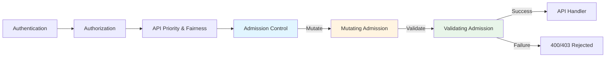
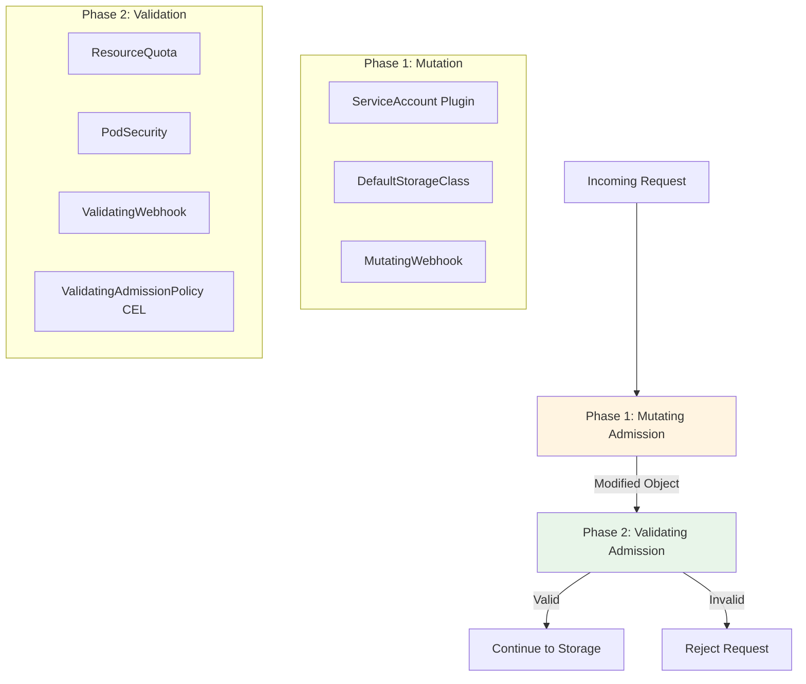
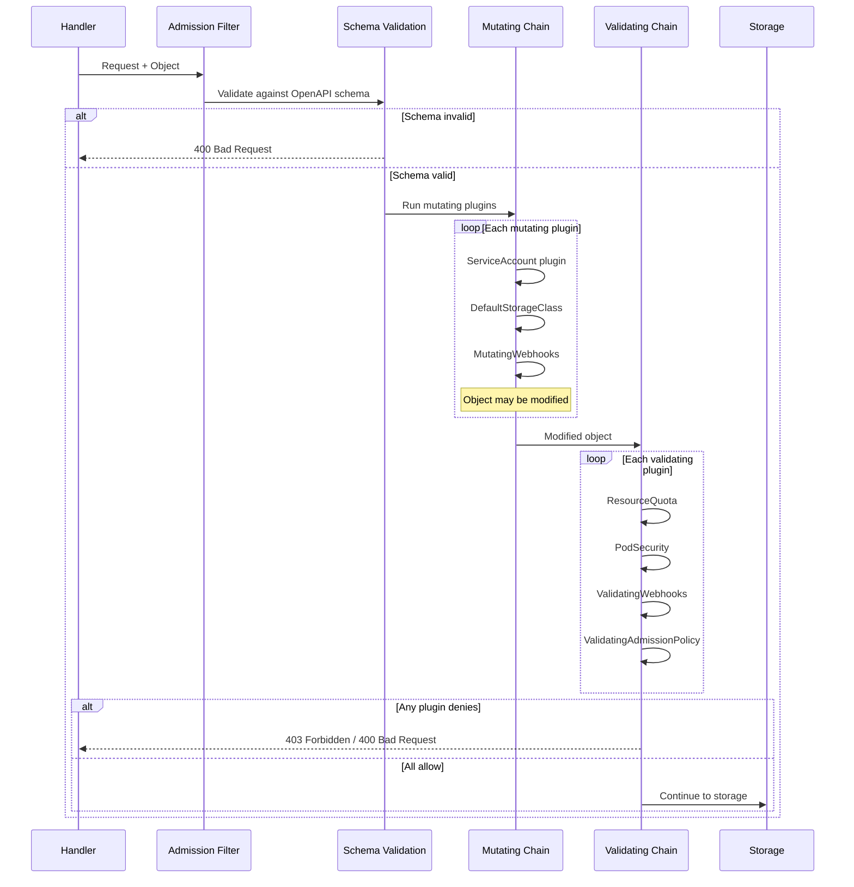
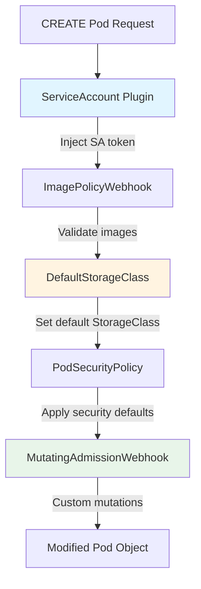
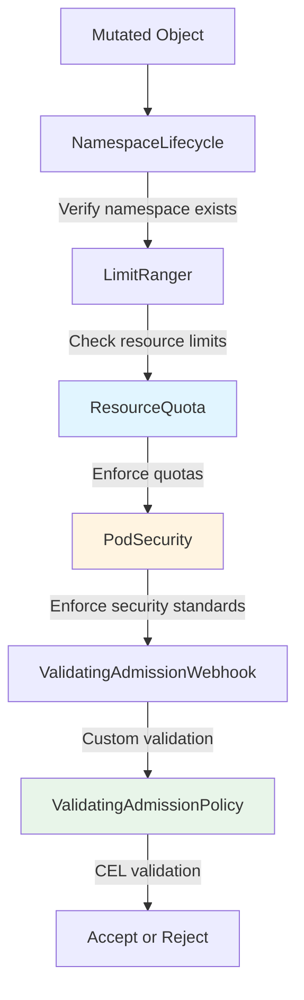
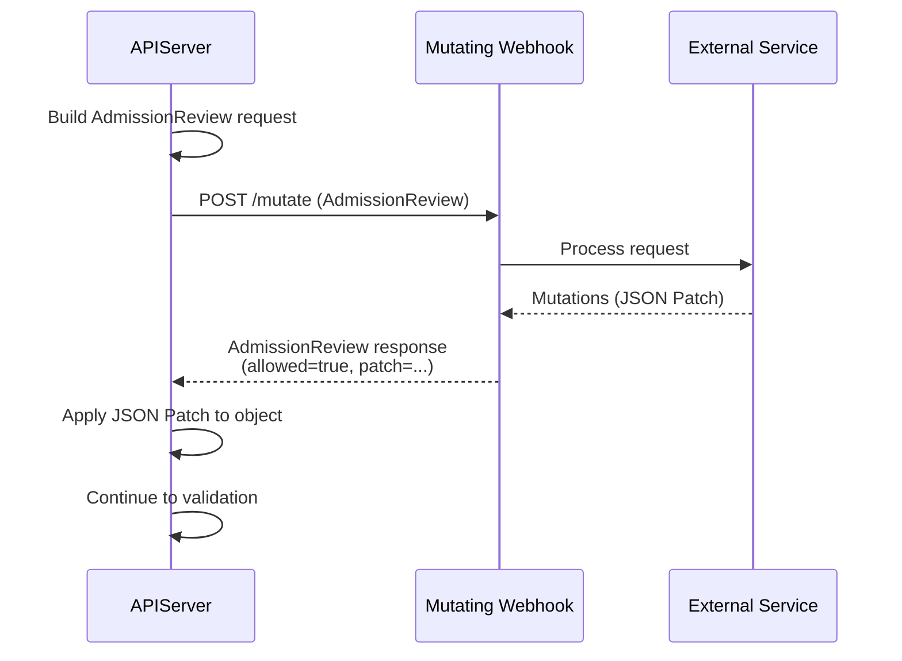

# Admission Control System

> **Middle-Level Technical Documentation**
> How kube-apiserver validates and mutates requests through admission plugins and webhooks.

---

## Table of Contents

- [Overview](#overview)
- [Admission Flow](#admission-flow)
- [Admission Interface](#admission-interface)
- [Mutating Admission](#mutating-admission)
- [Validating Admission](#validating-admission)
- [Built-in Admission Plugins](#built-in-admission-plugins)
- [Admission Webhooks](#admission-webhooks)
- [Validating Admission Policy (CEL)](#validating-admission-policy-cel)
- [Admission Chain Construction](#admission-chain-construction)
- [Code References](#code-references)

---

## Overview

Admission control is the **third and final security gate** before requests reach storage. It can:
- **Validate** requests (reject invalid objects)
- **Mutate** requests (modify objects, inject defaults)
- **Enforce policies** (quotas, security policies)

### Position in Pipeline



### Two-Phase Design



**Why Two Phases?**
1. **Mutating phase** modifies objects (inject defaults, add labels)
2. **Validating phase** checks final object (after all mutations)
3. Prevents validation from being invalidated by later mutations

**File Location**: `staging/src/k8s.io/apiserver/pkg/admission/`

---

## Admission Flow

### Complete Flow



### Admission Attributes

```go
// staging/src/k8s.io/apiserver/pkg/admission/attributes.go:30-90

type Attributes interface {
    // GetName returns the object name
    GetName() string

    // GetNamespace returns the namespace
    GetNamespace() string

    // GetResource returns the resource being accessed
    GetResource() schema.GroupVersionResource

    // GetSubresource returns the subresource
    GetSubresource() string

    // GetOperation returns the operation (CREATE, UPDATE, DELETE, CONNECT)
    GetOperation() Operation

    // GetObject returns the new object (for CREATE, UPDATE)
    GetObject() runtime.Object

    // GetOldObject returns the existing object (for UPDATE, DELETE)
    GetOldObject() runtime.Object

    // GetUserInfo returns the user making the request
    GetUserInfo() user.Info

    // IsDryRun returns true for dry-run requests
    IsDryRun() bool

    // GetOptions returns operation-specific options
    GetOptions() runtime.Object
}

type Operation string

const (
    Create  Operation = "CREATE"
    Update  Operation = "UPDATE"
    Delete  Operation = "DELETE"
    Connect Operation = "CONNECT"
)
```

---

## Admission Interface

### Core Interface

```go
// staging/src/k8s.io/apiserver/pkg/admission/interfaces.go:50-120

type Interface interface {
    // Handles returns true if this admission plugin can handle the given operation
    Handles(operation Operation) bool
}

// MutationInterface can modify objects
type MutationInterface interface {
    Interface

    // Admit makes admission decisions and can mutate the object
    Admit(ctx context.Context, a Attributes, o ObjectInterfaces) error
}

// ValidationInterface validates objects (no mutation)
type ValidationInterface interface {
    Interface

    // Validate validates the object
    Validate(ctx context.Context, a Attributes, o ObjectInterfaces) error
}
```

### Plugin Registration

```go
// staging/src/k8s.io/apiserver/pkg/admission/plugins.go:30-60

var (
    // Registry of all admission plugins
    pluginRegistry = make(map[string]PluginFactory)
)

type PluginFactory func(config io.Reader) (Interface, error)

// Register registers an admission plugin
func Register(name string, factory PluginFactory) {
    pluginRegistry[name] = factory
}

// Example registration
func init() {
    Register("ServiceAccount", NewServiceAccount)
    Register("ResourceQuota", NewResourceQuota)
    Register("NamespaceLifecycle", NewNamespaceLifecycle)
    // ... 30+ more plugins
}
```

### Chain Handler

```go
// staging/src/k8s.io/apiserver/pkg/admission/chain.go:30-100

type chainAdmissionHandler []Interface

func (c chainAdmissionHandler) Admit(ctx context.Context, a Attributes, o ObjectInterfaces) error {
    for _, handler := range c {
        if !handler.Handles(a.GetOperation()) {
            continue
        }

        if mutator, ok := handler.(MutationInterface); ok {
            err := mutator.Admit(ctx, a, o)
            if err != nil {
                return err
            }
        }
    }
    return nil
}

func (c chainAdmissionHandler) Validate(ctx context.Context, a Attributes, o ObjectInterfaces) error {
    for _, handler := range c {
        if !handler.Handles(a.GetOperation()) {
            continue
        }

        if validator, ok := handler.(ValidationInterface); ok {
            err := validator.Validate(ctx, a, o)
            if err != nil {
                return err
            }
        }
    }
    return nil
}
```

**File**: `staging/src/k8s.io/apiserver/pkg/admission/chain.go`

---

## Mutating Admission

### Common Mutating Plugins



### ServiceAccount Plugin

**Purpose**: Automatically inject service account credentials into pods

```go
// plugin/pkg/admission/serviceaccount/admission.go:100-200

type Plugin struct {
    client kubernetes.Interface
}

func (s *Plugin) Admit(ctx context.Context, a admission.Attributes, o admission.ObjectInterfaces) error {
    if a.GetResource().GroupResource() != api.Resource("pods") {
        return nil
    }

    pod := a.GetObject().(*api.Pod)

    // 1. Set default service account if not specified
    if len(pod.Spec.ServiceAccountName) == 0 {
        pod.Spec.ServiceAccountName = "default"
    }

    // 2. Verify service account exists
    sa, err := s.client.CoreV1().ServiceAccounts(a.GetNamespace()).Get(ctx, pod.Spec.ServiceAccountName, metav1.GetOptions{})
    if err != nil {
        return admission.NewForbidden(a, fmt.Errorf("service account %s not found", pod.Spec.ServiceAccountName))
    }

    // 3. Inject service account token volume (if automount enabled)
    if shouldAutomount(pod, sa) {
        volume := api.Volume{
            Name: "kube-api-access-xxxxx",
            VolumeSource: api.VolumeSource{
                Projected: &api.ProjectedVolumeSource{
                    Sources: []api.VolumeProjection{
                        {
                            ServiceAccountToken: &api.ServiceAccountTokenProjection{
                                Path:              "token",
                                ExpirationSeconds: ptr.To[int64](3607),
                            },
                        },
                        {
                            ConfigMap: &api.ConfigMapProjection{
                                LocalObjectReference: api.LocalObjectReference{Name: "kube-root-ca.crt"},
                                Items:                []api.KeyToPath{{Key: "ca.crt", Path: "ca.crt"}},
                            },
                        },
                        {
                            DownwardAPI: &api.DownwardAPIProjection{
                                Items: []api.DownwardAPIVolumeFile{{Path: "namespace", FieldRef: &api.ObjectFieldSelector{FieldPath: "metadata.namespace"}}},
                            },
                        },
                    },
                },
            },
        }
        pod.Spec.Volumes = append(pod.Spec.Volumes, volume)

        // Add volume mount to all containers
        for i := range pod.Spec.Containers {
            pod.Spec.Containers[i].VolumeMounts = append(pod.Spec.Containers[i].VolumeMounts, api.VolumeMount{
                Name:      volume.Name,
                MountPath: "/var/run/secrets/kubernetes.io/serviceaccount",
                ReadOnly:  true,
            })
        }
    }

    return nil
}
```

**File**: `plugin/pkg/admission/serviceaccount/admission.go`

### DefaultStorageClass Plugin

**Purpose**: Set default StorageClass for PVCs without one specified

```go
// plugin/pkg/admission/storage/storageclass/admission/admission.go:80-150

type Plugin struct {
    client kubernetes.Interface
}

func (c *Plugin) Admit(ctx context.Context, a admission.Attributes, o admission.ObjectInterfaces) error {
    if a.GetResource().GroupResource() != api.Resource("persistentvolumeclaims") {
        return nil
    }

    pvc := a.GetObject().(*api.PersistentVolumeClaim)

    // PVC already has a StorageClass specified
    if pvc.Spec.StorageClassName != nil && *pvc.Spec.StorageClassName != "" {
        return nil
    }

    // Find default StorageClass
    scList, err := c.client.StorageV1().StorageClasses().List(ctx, metav1.ListOptions{})
    if err != nil {
        return err
    }

    var defaultSC *storagev1.StorageClass
    for i := range scList.Items {
        if isDefaultAnnotation(scList.Items[i].ObjectMeta) {
            if defaultSC != nil {
                return fmt.Errorf("multiple default StorageClasses found")
            }
            defaultSC = &scList.Items[i]
        }
    }

    // Set default StorageClass
    if defaultSC != nil {
        pvc.Spec.StorageClassName = &defaultSC.Name
    }

    return nil
}
```

**File**: `plugin/pkg/admission/storage/storageclass/admission/admission.go`

---

## Validating Admission

### Common Validating Plugins



### NamespaceLifecycle Plugin

**Purpose**: Prevent operations on namespaces being deleted

```go
// plugin/pkg/admission/namespace/lifecycle/admission.go:100-180

type Plugin struct {
    client kubernetes.Interface
}

func (l *Plugin) Validate(ctx context.Context, a admission.Attributes, o admission.ObjectInterfaces) error {
    // Ignore cluster-scoped resources
    if a.GetNamespace() == "" {
        return nil
    }

    // Allow namespace creation
    if a.GetResource().Resource == "namespaces" && a.GetOperation() == admission.Create {
        return nil
    }

    // Get namespace
    namespace, err := l.client.CoreV1().Namespaces().Get(ctx, a.GetNamespace(), metav1.GetOptions{})
    if err != nil {
        if apierrors.IsNotFound(err) {
            return admission.NewForbidden(a, fmt.Errorf("namespace %s does not exist", a.GetNamespace()))
        }
        return err
    }

    // Reject operations on terminating namespaces
    if namespace.Status.Phase == api.NamespaceTerminating {
        return admission.NewForbidden(a, fmt.Errorf("namespace %s is being terminated", a.GetNamespace()))
    }

    return nil
}
```

**File**: `plugin/pkg/admission/namespace/lifecycle/admission.go`

### ResourceQuota Plugin

**Purpose**: Enforce resource usage limits per namespace

```go
// plugin/pkg/admission/resourcequota/admission.go:150-300

type Plugin struct {
    quotaAccessor *quotaAccessor
    evaluator     quota.Evaluator
}

func (q *Plugin) Validate(ctx context.Context, a admission.Attributes, o admission.ObjectInterfaces) error {
    if !q.WaitForReady() {
        return admission.NewForbidden(a, fmt.Errorf("not yet ready"))
    }

    // Get all quotas for this namespace
    quotas, err := q.quotaAccessor.GetQuotas(a.GetNamespace())
    if err != nil {
        return err
    }

    if len(quotas) == 0 {
        return nil  // No quotas to enforce
    }

    // Evaluate resource usage
    for _, quota := range quotas {
        // Calculate usage delta for this operation
        usage := q.evaluator.Usage(a.GetObject())

        // Check if operation would exceed quota
        for resourceName, quantity := range usage {
            hardLimit := quota.Status.Hard[resourceName]
            currentUsage := quota.Status.Used[resourceName]

            if currentUsage.Add(quantity).Cmp(hardLimit) > 0 {
                return admission.NewForbidden(a, fmt.Errorf(
                    "exceeded quota: %s, requested: %s, used: %s, limited: %s",
                    resourceName, quantity.String(), currentUsage.String(), hardLimit.String(),
                ))
            }
        }
    }

    return nil
}
```

**File**: `plugin/pkg/admission/resourcequota/admission.go`

**Example Quota**:
```yaml
apiVersion: v1
kind: ResourceQuota
metadata:
  name: compute-quota
  namespace: dev
spec:
  hard:
    requests.cpu: "10"
    requests.memory: 20Gi
    pods: "20"
    services: "5"
```

### PodSecurity Plugin

**Purpose**: Enforce Pod Security Standards (PSS)

```go
// staging/src/k8s.io/pod-security-admission/admission/admission.go:120-250

type Plugin struct {
    evaluator podsecurity.Evaluator
}

func (a *Plugin) Validate(ctx context.Context, attrs admission.Attributes, o admission.ObjectInterfaces) error {
    if attrs.GetResource().GroupResource() != api.Resource("pods") {
        return nil
    }

    pod := attrs.GetObject().(*api.Pod)

    // Get namespace labels to determine enforcement level
    ns, err := a.client.CoreV1().Namespaces().Get(ctx, attrs.GetNamespace(), metav1.GetOptions{})
    if err != nil {
        return err
    }

    level := getPodSecurityLevel(ns.Labels)  // "privileged", "baseline", or "restricted"

    // Evaluate pod against security standard
    results := a.evaluator.EvaluatePod(level, pod)

    if len(results.ForbiddenReasons) > 0 {
        return admission.NewForbidden(attrs, fmt.Errorf(
            "pod does not comply with %s security standard: %v",
            level, results.ForbiddenReasons,
        ))
    }

    return nil
}
```

**File**: `staging/src/k8s.io/pod-security-admission/admission/admission.go`

**Namespace Labels**:
```yaml
apiVersion: v1
kind: Namespace
metadata:
  name: production
  labels:
    pod-security.kubernetes.io/enforce: restricted
    pod-security.kubernetes.io/audit: restricted
    pod-security.kubernetes.io/warn: restricted
```

**Security Levels**:
- **privileged**: Unrestricted (no restrictions)
- **baseline**: Minimally restrictive (prevents known privilege escalations)
- **restricted**: Heavily restricted (hardened for critical workloads)

---

## Built-in Admission Plugins

### Complete List (30+ Plugins)

| Plugin | Type | Purpose |
|--------|------|---------|
| **NamespaceLifecycle** | Validating | Prevent ops on terminating namespaces |
| **LimitRanger** | Validating | Enforce LimitRange constraints |
| **ServiceAccount** | Mutating | Inject SA tokens into pods |
| **DefaultStorageClass** | Mutating | Set default StorageClass for PVCs |
| **DefaultTolerationSeconds** | Mutating | Set default toleration seconds |
| **ResourceQuota** | Validating | Enforce resource quotas |
| **PodSecurity** | Validating | Enforce Pod Security Standards |
| **Priority** | Mutating | Set pod priority based on PriorityClass |
| **PersistentVolumeClaimResize** | Validating | Validate PVC resize requests |
| **StorageObjectInUseProtection** | Mutating | Add finalizers to PVs/PVCs in use |
| **MutatingAdmissionWebhook** | Mutating | Call external mutating webhooks |
| **ValidatingAdmissionWebhook** | Validating | Call external validating webhooks |
| **ValidatingAdmissionPolicy** | Validating | CEL-based validation policies |
| **RuntimeClass** | Validating | Validate RuntimeClass references |
| **CertificateApproval** | Validating | Validate CSR approvals |
| **NodeRestriction** | Validating | Restrict kubelet modifications |
| **PodNodeSelector** | Mutating | Add namespace-default node selectors |
| **EventRateLimit** | Validating | Rate-limit event creation |
| **ExtendedResourceToleration** | Mutating | Add tolerations for extended resources |

### Configuration

```bash
# Enable specific plugins (order matters!)
--enable-admission-plugins=NamespaceLifecycle,LimitRanger,ServiceAccount,DefaultStorageClass,ResourceQuota,PodSecurity,MutatingAdmissionWebhook,ValidatingAdmissionWebhook

# Disable specific plugins
--disable-admission-plugins=PodSecurity

# Admission control config file
--admission-control-config-file=/etc/kubernetes/admission-config.yaml
```

---

## Admission Webhooks

### MutatingAdmissionWebhook

**Purpose**: Call external services to mutate objects



### MutatingWebhookConfiguration

```yaml
apiVersion: admissionregistration.k8s.io/v1
kind: MutatingWebhookConfiguration
metadata:
  name: pod-mutator
webhooks:
- name: mutate-pods.example.com
  clientConfig:
    service:
      namespace: webhook-system
      name: pod-mutator
      path: /mutate
    caBundle: LS0tLS1CRUdJTi...  # Base64-encoded CA cert
  rules:
  - operations: ["CREATE", "UPDATE"]
    apiGroups: [""]
    apiVersions: ["v1"]
    resources: ["pods"]
  admissionReviewVersions: ["v1"]
  sideEffects: None
  timeoutSeconds: 10
  failurePolicy: Fail  # or Ignore
  namespaceSelector:
    matchLabels:
      webhook: enabled
```

### AdmissionReview Request

```json
{
  "apiVersion": "admission.k8s.io/v1",
  "kind": "AdmissionReview",
  "request": {
    "uid": "705ab4f5-6393-11e8-b7cc-42010a800002",
    "kind": {"group": "", "version": "v1", "kind": "Pod"},
    "resource": {"group": "", "version": "v1", "resource": "pods"},
    "namespace": "default",
    "operation": "CREATE",
    "userInfo": {
      "username": "alice",
      "groups": ["system:authenticated"]
    },
    "object": {
      "apiVersion": "v1",
      "kind": "Pod",
      "metadata": {"name": "nginx", "namespace": "default"},
      "spec": {
        "containers": [{"name": "nginx", "image": "nginx"}]
      }
    },
    "oldObject": null,
    "dryRun": false
  }
}
```

### AdmissionReview Response (Mutating)

```json
{
  "apiVersion": "admission.k8s.io/v1",
  "kind": "AdmissionReview",
  "response": {
    "uid": "705ab4f5-6393-11e8-b7cc-42010a800002",
    "allowed": true,
    "patchType": "JSONPatch",
    "patch": "W3sib3AiOiAiYWRkIiwgInBhdGgiOiAiL21ldGFkYXRhL2xhYmVscyIsICJ2YWx1ZSI6IHsiaW5qZWN0ZWQiOiAidHJ1ZSJ9fV0=",
    "warnings": ["This pod was mutated by webhook"]
  }
}
```

**Decoded patch** (Base64 decoded):
```json
[
  {
    "op": "add",
    "path": "/metadata/labels",
    "value": {"injected": "true"}
  }
]
```

### ValidatingAdmissionWebhook

**Purpose**: Call external services to validate objects

```yaml
apiVersion: admissionregistration.k8s.io/v1
kind: ValidatingWebhookConfiguration
metadata:
  name: pod-validator
webhooks:
- name: validate-pods.example.com
  clientConfig:
    service:
      namespace: webhook-system
      name: pod-validator
      path: /validate
    caBundle: LS0tLS1CRUdJTi...
  rules:
  - operations: ["CREATE", "UPDATE"]
    apiGroups: [""]
    apiVersions: ["v1"]
    resources: ["pods"]
  admissionReviewVersions: ["v1"]
  sideEffects: None
  timeoutSeconds: 5
  failurePolicy: Fail
```

### AdmissionReview Response (Validating)

```json
{
  "apiVersion": "admission.k8s.io/v1",
  "kind": "AdmissionReview",
  "response": {
    "uid": "705ab4f5-6393-11e8-b7cc-42010a800002",
    "allowed": false,
    "status": {
      "code": 403,
      "message": "Pod must have label 'team' set"
    }
  }
}
```

### Webhook Implementation

```go
// staging/src/k8s.io/apiserver/pkg/admission/plugin/webhook/mutating/dispatcher.go:80-180

type webhookDispatcher struct {
    webhookClient *rest.RESTClient
}

func (d *webhookDispatcher) Dispatch(ctx context.Context, attr admission.Attributes, o admission.ObjectInterfaces) error {
    // Build AdmissionReview request
    review := &admissionv1.AdmissionReview{
        Request: &admissionv1.AdmissionRequest{
            UID:       uuid.NewUUID(),
            Kind:      attr.GetKind(),
            Resource:  attr.GetResource(),
            Namespace: attr.GetNamespace(),
            Operation: admissionv1.Operation(attr.GetOperation()),
            Object:    runtime.RawExtension{Object: attr.GetObject()},
            OldObject: runtime.RawExtension{Object: attr.GetOldObject()},
            UserInfo:  attr.GetUserInfo(),
        },
    }

    // Call webhook
    result := &admissionv1.AdmissionReview{}
    err := d.webhookClient.Post().
        Body(review).
        Do(ctx).
        Into(result)

    if err != nil {
        return err
    }

    // Check response
    if !result.Response.Allowed {
        return fmt.Errorf("admission webhook denied: %s", result.Response.Status.Message)
    }

    // Apply patch (for mutating webhooks)
    if len(result.Response.Patch) > 0 {
        patchObj, err := jsonpatch.DecodePatch(result.Response.Patch)
        if err != nil {
            return err
        }

        // Apply patch to attr.GetObject()
        // ...
    }

    return nil
}
```

**File**: `staging/src/k8s.io/apiserver/pkg/admission/plugin/webhook/mutating/dispatcher.go`

---

## Validating Admission Policy (CEL)

### Overview

**ValidatingAdmissionPolicy** uses **CEL (Common Expression Language)** for in-tree validation:
- No external webhook needed
- Declarative policy definition
- High performance (compiled expressions)
- Introduced in Kubernetes 1.26 (beta)

### Policy Definition

```yaml
apiVersion: admissionregistration.k8s.io/v1
kind: ValidatingAdmissionPolicy
metadata:
  name: require-team-label
spec:
  failurePolicy: Fail
  matchConstraints:
    resourceRules:
    - apiGroups: [""]
      apiVersions: ["v1"]
      operations: ["CREATE", "UPDATE"]
      resources: ["pods"]
  validations:
  - expression: "has(object.metadata.labels.team)"
    message: "All pods must have a 'team' label"
  - expression: "object.metadata.labels.team in ['backend', 'frontend', 'data']"
    message: "Team label must be one of: backend, frontend, data"
  - expression: "!has(object.spec.hostNetwork) || object.spec.hostNetwork == false"
    message: "hostNetwork is not allowed"
```

### Policy Binding

```yaml
apiVersion: admissionregistration.k8s.io/v1
kind: ValidatingAdmissionPolicyBinding
metadata:
  name: require-team-label-binding
spec:
  policyName: require-team-label
  validationActions: ["Deny"]
  matchResources:
    namespaceSelector:
      matchLabels:
        environment: production
```

### CEL Expressions

**Available variables**:
- `object`: The object being created/updated
- `oldObject`: The existing object (for updates)
- `request`: AdmissionRequest metadata
- `params`: Policy parameters

**Example expressions**:
```cel
// Check label exists
has(object.metadata.labels.app)

// Check label value
object.metadata.labels.env == "production"

// Check container image
object.spec.containers.all(c, c.image.startsWith("registry.example.com/"))

// Limit replicas
object.spec.replicas <= 10

// Require resource limits
object.spec.containers.all(c, has(c.resources.limits.cpu) && has(c.resources.limits.memory))

// Disallow privileged containers
!object.spec.containers.exists(c, has(c.securityContext.privileged) && c.securityContext.privileged)

// Validate size parameter (with params)
int(params.maxSize) >= size(object.data)
```

---

## Admission Chain Construction

### Plugin Ordering

```go
// cmd/kube-apiserver/app/server.go:450-520

func NewAdmissionChain(plugins []string, config *rest.Config) (admission.Interface, error) {
    // Default plugin order (if not specified)
    if len(plugins) == 0 {
        plugins = []string{
            "NamespaceLifecycle",
            "LimitRanger",
            "ServiceAccount",
            "NodeRestriction",
            "Priority",
            "DefaultTolerationSeconds",
            "DefaultStorageClass",
            "StorageObjectInUseProtection",
            "PersistentVolumeClaimResize",
            "RuntimeClass",
            "CertificateApproval",
            "CertificateSigning",
            "ClusterTrustBundleAttest",
            "CertificateSubjectRestriction",
            "DefaultIngressClass",
            "MutatingAdmissionWebhook",
            "ValidatingAdmissionPolicy",
            "ValidatingAdmissionWebhook",
            "ResourceQuota",
        }
    }

    var admissionChain admission.Interface

    for _, pluginName := range plugins {
        plugin, err := createPlugin(pluginName, config)
        if err != nil {
            return nil, err
        }

        admissionChain = chainAdmission(admissionChain, plugin)
    }

    return admissionChain, nil
}
```

### Recommended Order

```
Mutating Plugins (run first):
1. NamespaceLifecycle
2. LimitRanger
3. ServiceAccount
4. DefaultStorageClass
5. DefaultTolerationSeconds
6. MutatingAdmissionWebhook

Validating Plugins (run second):
7. ResourceQuota
8. PodSecurity
9. ValidatingAdmissionPolicy
10. ValidatingAdmissionWebhook
```

**Why this order?**
- Mutations happen before validation
- Webhooks run last to see all mutations
- ResourceQuota validates final resource usage

---

## Code References

### Key Files

| Component | File | Description |
|-----------|------|-------------|
| **Interfaces** | `staging/src/k8s.io/apiserver/pkg/admission/interfaces.go` | Core interfaces |
| **Chain** | `staging/src/k8s.io/apiserver/pkg/admission/chain.go` | Chain handler |
| **ServiceAccount** | `plugin/pkg/admission/serviceaccount/admission.go` | SA token injection |
| **ResourceQuota** | `plugin/pkg/admission/resourcequota/admission.go` | Quota enforcement |
| **PodSecurity** | `staging/src/k8s.io/pod-security-admission/admission/admission.go` | PSS enforcement |
| **Mutating Webhook** | `staging/src/k8s.io/apiserver/pkg/admission/plugin/webhook/mutating/` | Mutating webhooks |
| **Validating Webhook** | `staging/src/k8s.io/apiserver/pkg/admission/plugin/webhook/validating/` | Validating webhooks |
| **CEL Policy** | `staging/src/k8s.io/apiserver/pkg/admission/plugin/policy/validating/` | CEL-based validation |

### Key Functions

```go
// Admission filter
staging/src/k8s.io/apiserver/pkg/endpoints/filters/admission.go:50-120
func WithAdmission(handler, admissionChain) http.Handler

// Chain admit (mutating)
staging/src/k8s.io/apiserver/pkg/admission/chain.go:40-80
func (c chainAdmissionHandler) Admit(ctx, a, o) error

// Chain validate
staging/src/k8s.io/apiserver/pkg/admission/chain.go:85-120
func (c chainAdmissionHandler) Validate(ctx, a, o) error

// ServiceAccount injection
plugin/pkg/admission/serviceaccount/admission.go:120-250
func (s *Plugin) Admit(ctx, a, o) error

// ResourceQuota validation
plugin/pkg/admission/resourcequota/admission.go:200-350
func (q *Plugin) Validate(ctx, a, o) error

// Webhook dispatch
staging/src/k8s.io/apiserver/pkg/admission/plugin/webhook/mutating/dispatcher.go:100-200
func (d *webhookDispatcher) Dispatch(ctx, attr, o) error
```

---

## Summary

The admission control system provides **extensible validation and mutation**:

1. **Two-phase design** - Mutating then validating
2. **30+ built-in plugins** - ServiceAccount, ResourceQuota, PodSecurity, etc.
3. **Webhook extensibility** - External services for custom logic
4. **CEL policies** - In-tree validation without webhooks
5. **Chain pattern** - Sequential plugin execution

**Security Features**:
- Resource quota enforcement
- Pod Security Standards
- Custom policy validation
- Automatic credential injection

**Next Steps**:
- [Watch Mechanism](07-watch-mechanism.md) - Real-time updates
- [API Priority & Fairness](08-api-priority-fairness.md) - Rate limiting
- [Request Pipeline](01-request-pipeline.md) - Complete flow

---

**Related Documentation**:
- [QUICK-REFERENCE.md](../QUICK-REFERENCE.md#admission-control) - Quick reference
- [Key Components](../high-level/04-key-components.md#admission-control) - High-level view
