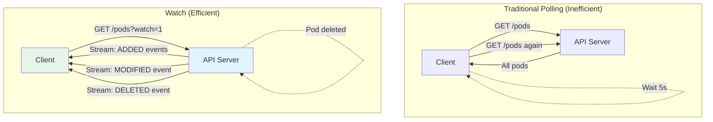
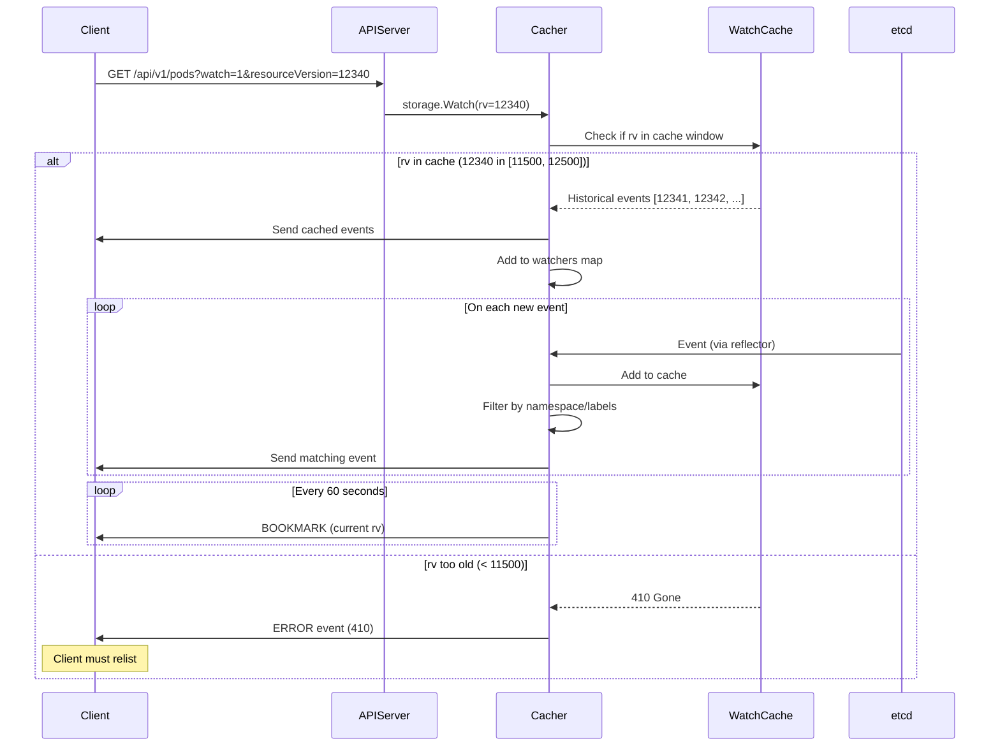
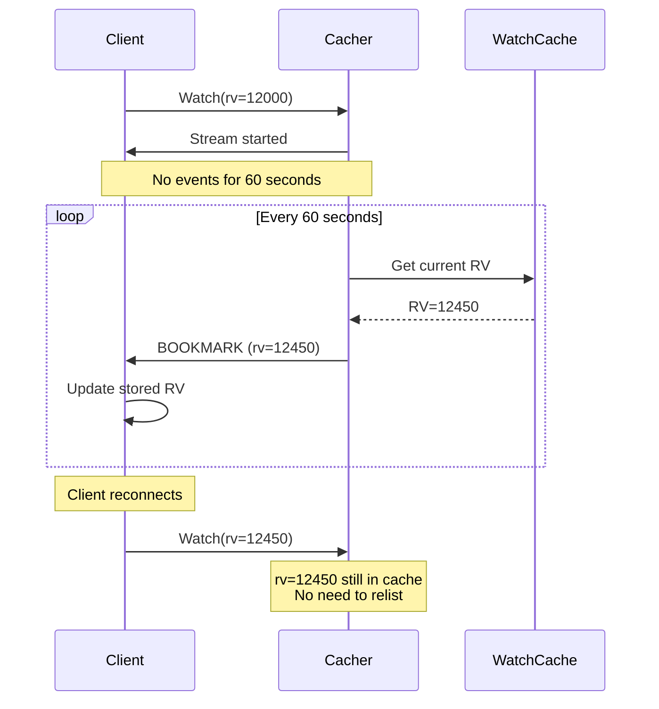
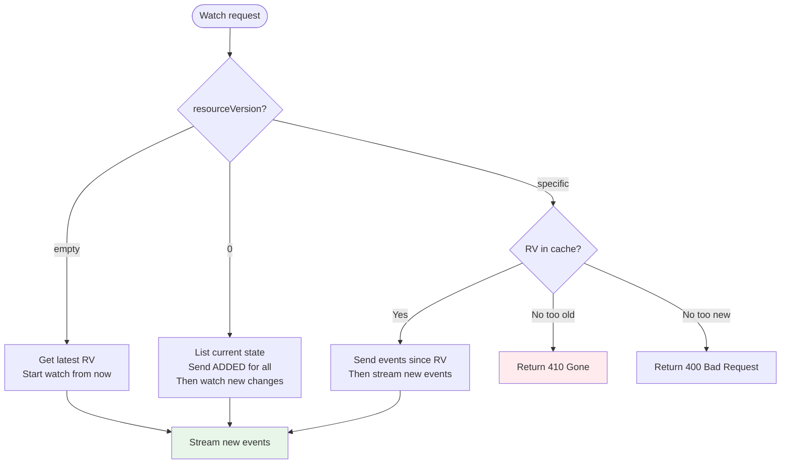
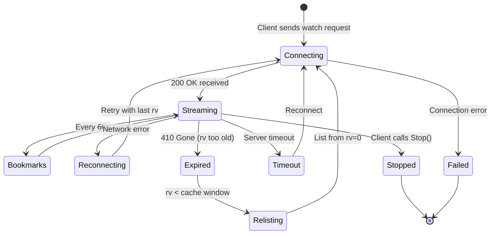
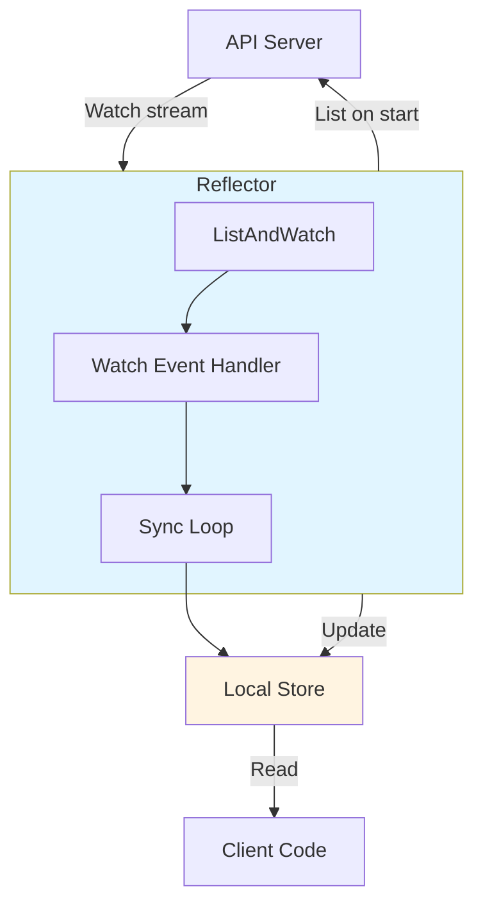
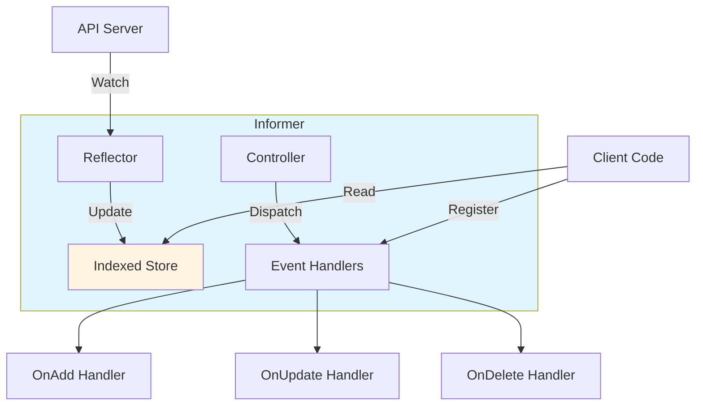

# Watch Mechanism

> **Middle-Level Technical Documentation**
> How Kubernetes implements real-time resource updates through efficient watch streams.

---

## Table of Contents

- [Overview](#overview)
- [Watch Protocol](#watch-protocol)
- [Watch Implementation](#watch-implementation)
- [Watch Cache Integration](#watch-cache-integration)
- [Bookmark Events](#bookmark-events)
- [ResourceVersion Semantics](#resourceversion-semantics)
- [Watch Lifecycle](#watch-lifecycle)
- [Reflector Pattern](#reflector-pattern)
- [Informer Framework](#informer-framework)
- [Code References](#code-references)

---

## Overview

The watch mechanism enables clients to receive **real-time updates** when resources change:
- Efficient alternative to polling
- Based on HTTP streaming (chunked transfer encoding)
- Uses resource versions for consistency
- Bookmark events keep watches current

### Watch vs List



**File Location**: `staging/src/k8s.io/apimachinery/pkg/watch/`

---

## Watch Protocol

### HTTP Request

```http
GET /api/v1/namespaces/default/pods?watch=1&resourceVersion=12345 HTTP/1.1
Host: kubernetes.default.svc
Authorization: Bearer <token>
```

**Query Parameters**:
- `watch=1` or `watch=true`: Enable watch mode
- `resourceVersion=<rv>`: Start watching from this version
- `timeoutSeconds=<n>`: Server timeout (default: random 5-10min)
- `allowWatchBookmarks=true`: Request bookmark events

### HTTP Response

```http
HTTP/1.1 200 OK
Content-Type: application/json
Transfer-Encoding: chunked

{"type":"ADDED","object":{"kind":"Pod","apiVersion":"v1","metadata":{"name":"pod1","resourceVersion":"12346"},...}}
{"type":"MODIFIED","object":{"kind":"Pod","apiVersion":"v1","metadata":{"name":"pod1","resourceVersion":"12347"},...}}
{"type":"DELETED","object":{"kind":"Pod","apiVersion":"v1","metadata":{"name":"pod2","resourceVersion":"12348"},...}}
{"type":"BOOKMARK","object":{"kind":"Pod","apiVersion":"v1","metadata":{"resourceVersion":"12450"}}}
```

### Event Types

```go
// staging/src/k8s.io/apimachinery/pkg/watch/watch.go:30-60

type EventType string

const (
    Added    EventType = "ADDED"
    Modified EventType = "MODIFIED"
    Deleted  EventType = "DELETED"
    Bookmark EventType = "BOOKMARK"
    Error    EventType = "ERROR"
)

type Event struct {
    Type   EventType
    Object runtime.Object
}
```

### Watch Event Examples

**ADDED event**:
```json
{
  "type": "ADDED",
  "object": {
    "kind": "Pod",
    "apiVersion": "v1",
    "metadata": {
      "name": "nginx",
      "namespace": "default",
      "resourceVersion": "12346",
      "uid": "abc-123"
    },
    "spec": {...},
    "status": {...}
  }
}
```

**MODIFIED event**:
```json
{
  "type": "MODIFIED",
  "object": {
    "kind": "Pod",
    "apiVersion": "v1",
    "metadata": {
      "name": "nginx",
      "namespace": "default",
      "resourceVersion": "12350"
    },
    "spec": {...},
    "status": {"phase": "Running"}
  }
}
```

**DELETED event**:
```json
{
  "type": "DELETED",
  "object": {
    "kind": "Pod",
    "apiVersion": "v1",
    "metadata": {
      "name": "nginx",
      "namespace": "default",
      "resourceVersion": "12355",
      "deletionTimestamp": "2024-01-15T10:30:00Z"
    },
    ...
  }
}
```

**BOOKMARK event**:
```json
{
  "type": "BOOKMARK",
  "object": {
    "kind": "Pod",
    "apiVersion": "v1",
    "metadata": {
      "resourceVersion": "12400"
    }
  }
}
```

**ERROR event** (410 Gone):
```json
{
  "type": "ERROR",
  "object": {
    "kind": "Status",
    "apiVersion": "v1",
    "status": "Failure",
    "message": "too old resource version: 10000 (12000)",
    "reason": "Expired",
    "code": 410
  }
}
```

---

## Watch Implementation

### watch.Interface

```go
// staging/src/k8s.io/apimachinery/pkg/watch/watch.go:70-100

type Interface interface {
    // Stop stops watching. Will close the channel returned by ResultChan.
    Stop()

    // ResultChan returns a chan which will receive all watch events.
    ResultChan() <-chan Event
}
```

### StreamWatcher

```go
// staging/src/k8s.io/apimachinery/pkg/watch/streamwatcher.go:40-150

type StreamWatcher struct {
    source   Decoder
    result   chan Event
    done     chan struct{}
}

func NewStreamWatcher(d Decoder) *StreamWatcher {
    sw := &StreamWatcher{
        source: d,
        result: make(chan Event),
        done:   make(chan struct{}),
    }
    go sw.receive()
    return sw
}

func (sw *StreamWatcher) ResultChan() <-chan Event {
    return sw.result
}

func (sw *StreamWatcher) Stop() {
    close(sw.done)
}

func (sw *StreamWatcher) receive() {
    defer close(sw.result)
    defer utilruntime.HandleCrash()

    for {
        action, obj, err := sw.source.Decode()
        if err != nil {
            switch err {
            case io.EOF, io.ErrUnexpectedEOF:
                return  // Stream closed
            default:
                sw.result <- Event{
                    Type:   Error,
                    Object: &metav1.Status{Message: err.Error()},
                }
                return
            }
        }

        event := Event{
            Type:   action,
            Object: obj,
        }

        select {
        case <-sw.done:
            return
        case sw.result <- event:
        }
    }
}
```

**File**: `staging/src/k8s.io/apimachinery/pkg/watch/streamwatcher.go`

### Server-Side Watch Handler

```go
// staging/src/k8s.io/apiserver/pkg/endpoints/handlers/watch.go:80-200

func serveWatch(watcher watch.Interface, scope *RequestScope, mediaTypeOptions negotiation.MediaTypeOptions, req *http.Request, w http.ResponseWriter, timeout time.Duration) {
    // Set up streaming response
    w.Header().Set("Content-Type", mediaTypeOptions.MediaType)
    w.Header().Set("Transfer-Encoding", "chunked")
    w.WriteHeader(http.StatusOK)

    flusher, ok := w.(http.Flusher)
    if !ok {
        return
    }

    encoder := scope.Serializer.EncoderForVersion(scope.Serializer.Encoder, scope.Kind.GroupVersion())

    // Start streaming events
    for {
        select {
        case event, ok := <-watcher.ResultChan():
            if !ok {
                return  // Watcher closed
            }

            // Encode event
            watchEvent := &metav1.WatchEvent{
                Type:   string(event.Type),
                Object: runtime.RawExtension{Object: event.Object},
            }

            if err := encoder.Encode(watchEvent, w); err != nil {
                return
            }

            flusher.Flush()

        case <-req.Context().Done():
            return  // Client disconnected

        case <-time.After(timeout):
            return  // Timeout
        }
    }
}
```

**File**: `staging/src/k8s.io/apiserver/pkg/endpoints/handlers/watch.go`

---

## Watch Cache Integration

### Watch Request Flow



### Cacher Watch Method

```go
// staging/src/k8s.io/apiserver/pkg/storage/cacher/cacher.go:370-485

func (c *Cacher) Watch(ctx context.Context, key string, opts storage.ListOptions) (watch.Interface, error) {
    pred := opts.Predicate
    resourceVersion, err := c.versioner.ParseResourceVersion(opts.ResourceVersion)
    if err != nil {
        return nil, err
    }

    // Check if resourceVersion is in cache window
    c.watchCache.RLock()
    if resourceVersion > 0 && resourceVersion < c.watchCache.startIndex() {
        c.watchCache.RUnlock()
        return nil, storage.NewTooLargeResourceVersionError(resourceVersion, c.watchCache.startIndex(), 0)
    }
    c.watchCache.RUnlock()

    // Get initial events from cache
    initEvents, err := c.watchCache.GetAllEventsSince(resourceVersion)
    if err != nil {
        return nil, err
    }

    // Create new watcher
    watcher := newCacheWatcher(
        resourceVersion,
        initEvents,
        pred,
        c.watchCache,
        c.bookmarkFrequency,
    )

    c.watchers.addWatcher(watcher, key, pred)

    go watcher.process(ctx, c.watchCache, resourceVersion)

    return watcher, nil
}
```

**File**: `staging/src/k8s.io/apiserver/pkg/storage/cacher/cacher.go`

### cacheWatcher

```go
// staging/src/k8s.io/apiserver/pkg/storage/cacher/cache_watcher.go:60-200

type cacheWatcher struct {
    input     chan *watchCacheEvent
    result    chan watch.Event
    done      chan struct{}
    filter    filterFunc
    stopped   bool
    forget    func()
}

func (c *cacheWatcher) process(ctx context.Context, cache *watchCache, initRV uint64) {
    defer close(c.result)
    defer c.Stop()

    for {
        select {
        case event, ok := <-c.input:
            if !ok {
                return
            }

            // Apply filter (namespace, labels, fields)
            if c.filter != nil && !c.filter(event) {
                continue
            }

            // Convert to watch.Event
            watchEvent := watch.Event{
                Type:   event.Type,
                Object: event.Object.DeepCopyObject(),
            }

            select {
            case c.result <- watchEvent:
            case <-ctx.Done():
                return
            }

        case <-ctx.Done():
            return
        }
    }
}

func (c *cacheWatcher) ResultChan() <-chan watch.Event {
    return c.result
}

func (c *cacheWatcher) Stop() {
    c.forget()  // Remove from watchers map
    close(c.done)
}
```

**File**: `staging/src/k8s.io/apiserver/pkg/storage/cacher/cache_watcher.go`

---

## Bookmark Events

### Purpose

Bookmarks keep watches **current** without actual resource changes:
- Sent every 60 seconds by default
- Update client's resourceVersion
- Prevent watches from becoming too old
- Enable efficient reconnection

### Bookmark Flow



### Bookmark Configuration

**Client request**:
```http
GET /api/v1/pods?watch=1&allowWatchBookmarks=true&resourceVersion=12000
```

**Server configuration**:
```go
// Default bookmark frequency
const defaultBookmarkFrequency = 60 * time.Second
```

**Bookmark event**:
```json
{
  "type": "BOOKMARK",
  "object": {
    "kind": "Pod",
    "apiVersion": "v1",
    "metadata": {
      "resourceVersion": "12450"
    }
  }
}
```

### Bookmark Implementation

```go
// staging/src/k8s.io/apiserver/pkg/storage/cacher/watch_progress.go:40-120

type watchBookmarkTimeBudget struct {
    budget      *timeBudget
    bookmarkCh  chan int64
}

func (wbtb *watchBookmarkTimeBudget) send(rv uint64) {
    select {
    case wbtb.bookmarkCh <- int64(rv):
    default:
        // Channel full, skip this bookmark
    }
}

func (c *cacheWatcher) sendBookmarkIfNeeded(resourceVersion uint64) {
    if c.bookmarkFrequency == 0 {
        return  // Bookmarks disabled
    }

    if time.Since(c.lastBookmark) < c.bookmarkFrequency {
        return  // Too soon
    }

    bookmarkEvent := &watchCacheEvent{
        Type: watch.Bookmark,
        Object: &metav1.Status{
            TypeMeta: metav1.TypeMeta{
                Kind:       c.objectType.Kind,
                APIVersion: c.objectType.APIVersion,
            },
            Metadata: metav1.ObjectMeta{
                ResourceVersion: strconv.FormatUint(resourceVersion, 10),
            },
        },
        ResourceVersion: resourceVersion,
    }

    c.input <- bookmarkEvent
    c.lastBookmark = time.Now()
}
```

**File**: `staging/src/k8s.io/apiserver/pkg/storage/cacher/watch_progress.go`

---

## ResourceVersion Semantics

### ResourceVersion Values

| Value | Behavior | Use Case |
|-------|----------|----------|
| **""** (empty) | Latest version | Most recent data |
| **"0"** | Any version | Serve from cache if possible |
| **"<specific>"** (e.g., "12345") | Exact version | Resume watch, consistent read |

### Watch from ResourceVersion



### Example Behaviors

**rv="" (latest)**:
```bash
# Start watching from NOW (no historical events)
kubectl get pods --watch
```

**rv="0" (list-watch)**:
```bash
# List all current pods, then watch for changes
# Equivalent to: list all pods, then watch from that rv
kubectl get pods --watch --resource-version=0
```

**rv="12345" (resume)**:
```bash
# Resume watch from specific version
# Get all events since 12345
curl "https://api/v1/pods?watch=1&resourceVersion=12345"
```

---

## Watch Lifecycle

### Complete Lifecycle



### Handling 410 Gone

```go
func watchWithRetry(client kubernetes.Interface) {
    var resourceVersion string

    for {
        watcher, err := client.CoreV1().Pods("default").Watch(context.TODO(), metav1.ListOptions{
            ResourceVersion: resourceVersion,
            Watch:           true,
        })

        if err != nil {
            time.Sleep(time.Second)
            continue
        }

        for event := range watcher.ResultChan() {
            switch event.Type {
            case watch.Added, watch.Modified, watch.Deleted:
                handleEvent(event)
                // Update resourceVersion from each event
                resourceVersion = event.Object.(*corev1.Pod).ResourceVersion

            case watch.Bookmark:
                // Update from bookmark
                resourceVersion = event.Object.(*metav1.Status).Metadata.ResourceVersion

            case watch.Error:
                status := event.Object.(*metav1.Status)
                if status.Code == 410 {
                    // 410 Gone: resourceVersion too old
                    // Relist from scratch
                    resourceVersion = "0"
                    break
                }
            }
        }

        // Watch closed, reconnect
        time.Sleep(time.Second)
    }
}
```

---

## Reflector Pattern

### Overview

The **Reflector** maintains a local cache synchronized with the API server:
- Watches API server for changes
- Updates local cache (Store)
- Handles reconnection and errors
- Foundation for Informers

### Reflector Architecture



### Reflector Implementation

```go
// staging/src/k8s.io/client-go/tools/cache/reflector.go:150-400

type Reflector struct {
    name            string
    expectedType    reflect.Type
    store           Store
    listerWatcher   ListerWatcher
    resyncPeriod    time.Duration
    lastSyncResourceVersion string
}

func (r *Reflector) Run(stopCh <-chan struct{}) {
    wait.BackoffUntil(func() {
        if err := r.ListAndWatch(stopCh); err != nil {
            klog.Errorf("reflector %s: %v", r.name, err)
        }
    }, r.backoff, true, stopCh)
}

func (r *Reflector) ListAndWatch(stopCh <-chan struct{}) error {
    // 1. List current state
    list, err := r.listerWatcher.List(options)
    if err != nil {
        return err
    }

    items, err := meta.ExtractList(list)
    if err != nil {
        return err
    }

    // 2. Replace store with current state
    if err := r.store.Replace(items, resourceVersion); err != nil {
        return err
    }

    r.lastSyncResourceVersion = resourceVersion

    // 3. Start watch from this version
    for {
        watcher, err := r.listerWatcher.Watch(options)
        if err != nil {
            return err
        }

        if err := r.watchHandler(watcher, &resourceVersion, stopCh); err != nil {
            if err == errorStopRequested {
                return nil
            }
            return err
        }
    }
}

func (r *Reflector) watchHandler(w watch.Interface, resourceVersion *string, stopCh <-chan struct{}) error {
    for {
        select {
        case <-stopCh:
            return errorStopRequested

        case event, ok := <-w.ResultChan():
            if !ok {
                return nil  // Watch closed
            }

            meta, err := meta.Accessor(event.Object)
            if err != nil {
                return err
            }

            *resourceVersion = meta.GetResourceVersion()

            switch event.Type {
            case watch.Added:
                err := r.store.Add(event.Object)

            case watch.Modified:
                err := r.store.Update(event.Object)

            case watch.Deleted:
                err := r.store.Delete(event.Object)

            case watch.Bookmark:
                // Just update resourceVersion

            case watch.Error:
                return apierrors.FromObject(event.Object)
            }
        }
    }
}
```

**File**: `staging/src/k8s.io/client-go/tools/cache/reflector.go`

---

## Informer Framework

### Overview

**Informers** build on Reflectors to provide:
- Local cache with watch synchronization
- Event handlers for add/update/delete
- Indexing for efficient queries
- Resync for eventual consistency

### Informer Architecture



### Shared Informer Factory

```go
// staging/src/k8s.io/client-go/informers/factory.go:50-120

factory := informers.NewSharedInformerFactory(clientset, time.Minute)

podInformer := factory.Core().V1().Pods()

// Register event handlers
podInformer.Informer().AddEventHandler(cache.ResourceEventHandlerFuncs{
    AddFunc: func(obj interface{}) {
        pod := obj.(*corev1.Pod)
        fmt.Printf("Pod added: %s\n", pod.Name)
    },
    UpdateFunc: func(oldObj, newObj interface{}) {
        pod := newObj.(*corev1.Pod)
        fmt.Printf("Pod updated: %s\n", pod.Name)
    },
    DeleteFunc: func(obj interface{}) {
        pod := obj.(*corev1.Pod)
        fmt.Printf("Pod deleted: %s\n", pod.Name)
    },
})

// Start informers
factory.Start(stopCh)

// Wait for cache sync
factory.WaitForCacheSync(stopCh)

// Query local cache (no API call)
pod, err := podInformer.Lister().Pods("default").Get("nginx")
```

**File**: `staging/src/k8s.io/client-go/informers/`

---

## Code References

### Key Files

| Component | File | Description |
|-----------|------|-------------|
| **watch.Interface** | `staging/src/k8s.io/apimachinery/pkg/watch/watch.go` | Core watch interface |
| **StreamWatcher** | `staging/src/k8s.io/apimachinery/pkg/watch/streamwatcher.go` | Watch stream implementation |
| **Watch Handler** | `staging/src/k8s.io/apiserver/pkg/endpoints/handlers/watch.go` | Server-side watch serving |
| **Cacher Watch** | `staging/src/k8s.io/apiserver/pkg/storage/cacher/cacher.go` | Watch cache integration |
| **cacheWatcher** | `staging/src/k8s.io/apiserver/pkg/storage/cacher/cache_watcher.go` | Individual watcher |
| **Bookmarks** | `staging/src/k8s.io/apiserver/pkg/storage/cacher/watch_progress.go` | Bookmark events |
| **Reflector** | `staging/src/k8s.io/client-go/tools/cache/reflector.go` | Client-side reflector |
| **Informer** | `staging/src/k8s.io/client-go/tools/cache/shared_informer.go` | Informer framework |

### Key Functions

```go
// Serve watch stream
staging/src/k8s.io/apiserver/pkg/endpoints/handlers/watch.go:80-200
func serveWatch(watcher, scope, mediaTypeOptions, req, w, timeout)

// Cacher watch
staging/src/k8s.io/apiserver/pkg/storage/cacher/cacher.go:370-485
func (c *Cacher) Watch(ctx, key, opts) (watch.Interface, error)

// Stream watcher
staging/src/k8s.io/apimachinery/pkg/watch/streamwatcher.go:60-150
func (sw *StreamWatcher) receive()

// Reflector list and watch
staging/src/k8s.io/client-go/tools/cache/reflector.go:200-350
func (r *Reflector) ListAndWatch(stopCh) error

// Reflector watch handler
staging/src/k8s.io/client-go/tools/cache/reflector.go:400-500
func (r *Reflector) watchHandler(w, resourceVersion, stopCh) error
```

---

## Summary

The watch mechanism provides **efficient real-time updates**:

1. **HTTP streaming** - Chunked transfer encoding
2. **Event types** - ADDED, MODIFIED, DELETED, BOOKMARK, ERROR
3. **Watch cache** - Serves historical events from memory
4. **Bookmarks** - Keep watches current (60s interval)
5. **Reflector** - Client-side synchronization pattern
6. **Informers** - High-level caching framework

**Performance Benefits**:
- No polling overhead
- Sub-second event delivery
- Efficient cache serving
- Bookmark-based resume

**Next Steps**:
- [Storage Layer](02-storage-layer.md) - Watch cache details
- [API Priority & Fairness](08-api-priority-fairness.md) - Rate limiting
- [Request Pipeline](01-request-pipeline.md) - Complete flow

---

**Related Documentation**:
- [QUICK-REFERENCE.md](../QUICK-REFERENCE.md#storage--watch) - Quick reference
- [Watch Cache Architecture](02-storage-layer.md#watch-cache-cacher) - Implementation details
