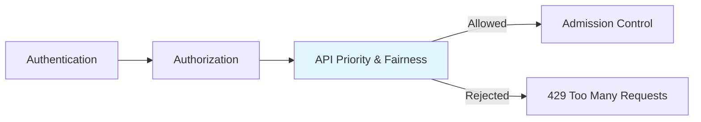
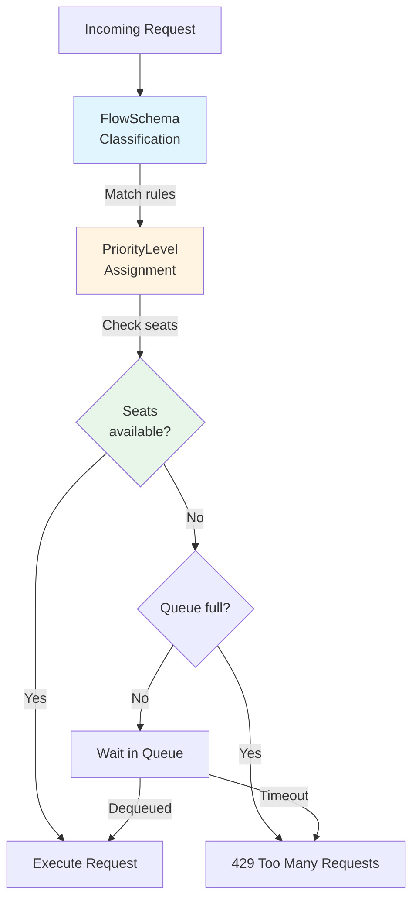
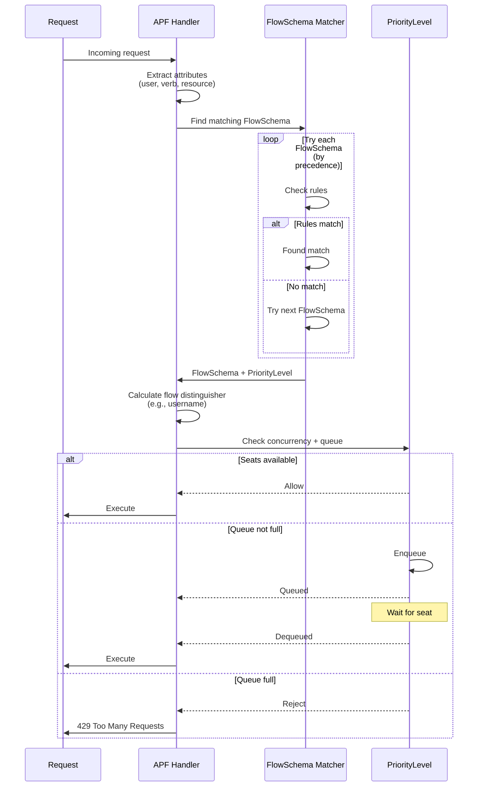
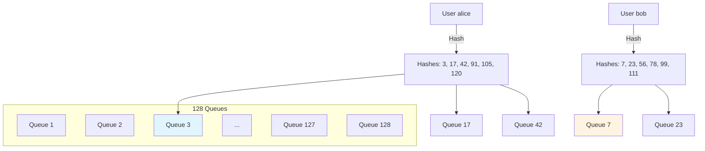
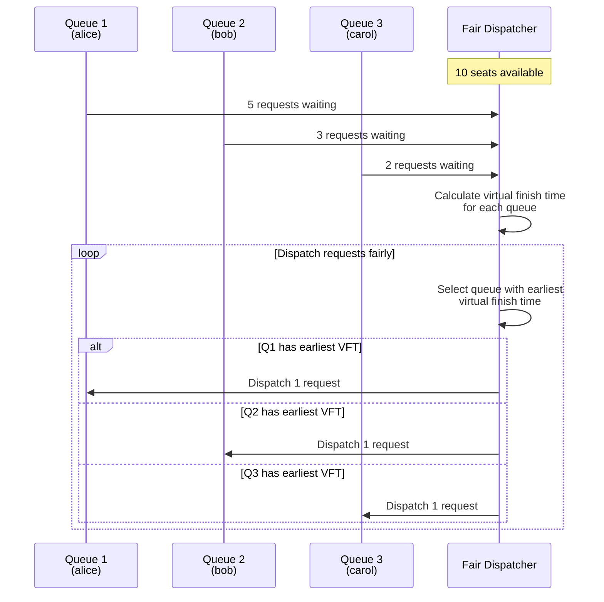

# API Priority and Fairness (APF)

> **Middle-Level Technical Documentation**
> How kube-apiserver manages request priorities and enforces fair resource allocation through flow control.

---

## Table of Contents

- [Overview](#overview)
- [Core Concepts](#core-concepts)
- [FlowSchema](#flowschema)
- [PriorityLevelConfiguration](#prioritylevelconfiguration)
- [Request Classification](#request-classification)
- [Queue Management](#queue-management)
- [Fair Queuing Algorithm](#fair-queuing-algorithm)
- [Default Configuration](#default-configuration)
- [Metrics and Monitoring](#metrics-and-monitoring)
- [Code References](#code-references)

---

## Overview

**API Priority and Fairness (APF)** replaced the legacy max-inflight-requests limit in Kubernetes 1.20+. It provides:
- **Priority-based** request handling
- **Fair queuing** among different users
- **Concurrency limits** per priority level
- **Request shedding** when overloaded

### Position in Pipeline



**File Location**: `staging/src/k8s.io/apiserver/pkg/util/flowcontrol/`

---

## Core Concepts

### Two-Layer Architecture



**Key Resources**:
1. **FlowSchema**: Classifies requests and assigns priority
2. **PriorityLevelConfiguration**: Defines concurrency limits and queuing behavior

---

## FlowSchema

### Purpose

**FlowSchema** matches requests and assigns them to a **PriorityLevel**:
- Based on user, namespace, verb, resource
- Multiple FlowSchemas can reference same PriorityLevel
- Evaluated in order by `matchingPrecedence`

### FlowSchema Definition

```yaml
apiVersion: flowcontrol.apiserver.k8s.io/v1
kind: FlowSchema
metadata:
  name: workload-leader-election
spec:
  # Lower number = higher precedence
  matchingPrecedence: 200

  # Which PriorityLevel to use
  priorityLevelConfiguration:
    name: leader-election

  # Differentiate requests within this flow
  distinguisherMethod:
    type: ByUser

  # Matching rules (OR logic)
  rules:
  - subjects:
    - kind: Group
      group:
        name: system:serviceaccounts:kube-system
    resourceRules:
    - apiGroups: ["coordination.k8s.io"]
      resources: ["leases"]
      verbs: ["get", "create", "update"]
      namespaces: ["*"]
```

### Matching Rules

```go
// staging/src/k8s.io/api/flowcontrol/v1/types.go:100-200

type FlowSchemaSpec struct {
    // MatchingPrecedence: lower number = higher priority
    MatchingPrecedence int32

    // PriorityLevelConfiguration to use
    PriorityLevelConfiguration PriorityLevelConfigurationReference

    // DistinguisherMethod: how to subdivide this flow
    DistinguisherMethod *FlowDistinguisherMethod

    // Rules: match criteria (OR logic)
    Rules []PolicyRulesWithSubjects
}

type PolicyRulesWithSubjects struct {
    // Subjects: who this rule applies to
    Subjects []Subject

    // ResourceRules: resource matching
    ResourceRules []ResourcePolicyRule

    // NonResourceRules: non-resource URL matching
    NonResourceRules []NonResourcePolicyRule
}

type Subject struct {
    Kind string  // "User", "Group", "ServiceAccount"
    User *UserSubject
    Group *GroupSubject
    ServiceAccount *ServiceAccountSubject
}
```

### Matching Examples

**System requests**:
```yaml
apiVersion: flowcontrol.apiserver.k8s.io/v1
kind: FlowSchema
metadata:
  name: system-nodes
spec:
  matchingPrecedence: 500
  priorityLevelConfiguration:
    name: system
  distinguisherMethod:
    type: ByUser
  rules:
  - subjects:
    - kind: Group
      group:
        name: system:nodes
    resourceRules:
    - apiGroups: ["*"]
      resources: ["*"]
      verbs: ["*"]
      clusterScope: true
```

**User workloads**:
```yaml
apiVersion: flowcontrol.apiserver.k8s.io/v1
kind: FlowSchema
metadata:
  name: workload-default
spec:
  matchingPrecedence: 1000
  priorityLevelConfiguration:
    name: workload-low
  distinguisherMethod:
    type: ByUser
  rules:
  - subjects:
    - kind: Group
      group:
        name: system:authenticated
    resourceRules:
    - apiGroups: ["*"]
      resources: ["*"]
      verbs: ["*"]
```

### DistinguisherMethod

**Purpose**: Subdivide flows for fairness

```yaml
distinguisherMethod:
  type: ByUser  # Separate queues per user
```

**Types**:
- `ByUser`: Separate flow per username
- `ByNamespace`: Separate flow per namespace (not yet implemented)
- `nil`: Single flow for all requests

---

## PriorityLevelConfiguration

### Purpose

**PriorityLevelConfiguration** defines:
- **Concurrency limit** (seats)
- **Queue configuration** (queues, queue length, hand size)
- **Exempt** or **Limited** type

### PriorityLevel Definition

```yaml
apiVersion: flowcontrol.apiserver.k8s.io/v1
kind: PriorityLevelConfiguration
metadata:
  name: workload-high
spec:
  type: Limited
  limited:
    # Total concurrent requests allowed
    nominalConcurrencyShares: 40

    # Queue configuration
    limitResponse:
      type: Queue
      queuing:
        # Number of queues (should be prime number)
        queues: 128

        # Max requests per queue
        queueLengthLimit: 50

        # Hand size for shuffle sharding
        handSize: 6
```

### Spec Structure

```go
// staging/src/k8s.io/api/flowcontrol/v1/types.go:250-350

type PriorityLevelConfigurationSpec struct {
    Type PriorityLevelType  // "Exempt" or "Limited"

    // Limited: bounded concurrency
    Limited *LimitedPriorityLevelConfiguration

    // Exempt: unlimited concurrency (bypass APF)
    Exempt *ExemptPriorityLevelConfiguration
}

type LimitedPriorityLevelConfiguration struct {
    // NominalConcurrencyShares: concurrency allocation
    // (shares / total_shares) * server_concurrency_limit
    NominalConcurrencyShares int32

    // LimitResponse: how to handle excess requests
    LimitResponse LimitResponse

    // LendablePercent: can lend unused capacity
    LendablePercent *int32

    // BorrowingLimitPercent: can borrow from others
    BorrowingLimitPercent *int32
}

type LimitResponse struct {
    Type LimitResponseType  // "Reject" or "Queue"

    // Queuing: queue configuration
    Queuing *QueuingConfiguration
}

type QueuingConfiguration struct {
    Queues           int32  // Number of queues
    QueueLengthLimit int32  // Max requests per queue
    HandSize         int32  // Shuffle sharding hand size
}
```

### Types

**Exempt** (unlimited):
```yaml
apiVersion: flowcontrol.apiserver.k8s.io/v1
kind: PriorityLevelConfiguration
metadata:
  name: exempt
spec:
  type: Exempt
  exempt: {}
```

**Limited** (with queuing):
```yaml
spec:
  type: Limited
  limited:
    nominalConcurrencyShares: 30
    limitResponse:
      type: Queue
      queuing:
        queues: 64
        queueLengthLimit: 50
        handSize: 6
```

**Limited** (reject immediately):
```yaml
spec:
  type: Limited
  limited:
    nominalConcurrencyShares: 10
    limitResponse:
      type: Reject  # No queuing, immediate 429
```

---

## Request Classification

### Classification Flow



### Classifier Implementation

```go
// staging/src/k8s.io/apiserver/pkg/util/flowcontrol/request/classifier.go:50-150

func (c *Classifier) Classify(req *http.Request) *classification {
    user, _ := request.UserFrom(req)
    requestInfo, _ := request.RequestInfoFrom(req)

    // Try each FlowSchema in precedence order
    for _, fs := range c.flowSchemas {
        if !matchesFlowSchema(fs, user, requestInfo) {
            continue
        }

        // Found matching FlowSchema
        pl := c.priorityLevels[fs.Spec.PriorityLevelConfiguration.Name]

        // Calculate flow distinguisher
        flowDistinguisher := calculateDistinguisher(fs, user, requestInfo)

        return &classification{
            flowSchema:        fs,
            priorityLevel:     pl,
            flowDistinguisher: flowDistinguisher,
        }
    }

    // No match, use default "catch-all" FlowSchema
    return c.defaultClassification
}

func matchesFlowSchema(fs *flowcontrol.FlowSchema, user user.Info, reqInfo *request.RequestInfo) bool {
    for _, rule := range fs.Spec.Rules {
        if matchesSubjects(rule.Subjects, user) && matchesResourceRules(rule.ResourceRules, reqInfo) {
            return true
        }
    }
    return false
}
```

**File**: `staging/src/k8s.io/apiserver/pkg/util/flowcontrol/request/classifier.go`

---

## Queue Management

### Shuffle Sharding

**Purpose**: Isolate flows to prevent a single flow from filling all queues



**Hand Size**: Number of queues assigned per flow (typically 6-8)

**Benefits**:
- Reduces collision probability
- Isolates noisy neighbors
- Provides statistical fairness

### Queue Selection

```go
// staging/src/k8s.io/apiserver/pkg/util/flowcontrol/fairqueuing/queueset/queueset.go:200-280

func (qs *queueSet) selectQueue(flowDistinguisher string) *queue {
    // Hash the flow distinguisher
    hash := fnv.New64a()
    hash.Write([]byte(flowDistinguisher))
    hashValue := hash.Sum64()

    // Select 'handSize' queues using shuffle sharding
    handSize := qs.config.HandSize
    numQueues := qs.config.Queues

    selectedQueues := make([]int, handSize)
    for i := 0; i < handSize; i++ {
        // Deterministic pseudo-random selection
        selectedQueues[i] = int((hashValue + uint64(i)) % uint64(numQueues))
    }

    // Find queue with shortest length among selected queues
    shortestQueue := selectedQueues[0]
    shortestLength := qs.queues[shortestQueue].length

    for _, queueIndex := range selectedQueues[1:] {
        if qs.queues[queueIndex].length < shortestLength {
            shortestQueue = queueIndex
            shortestLength = qs.queues[queueIndex].length
        }
    }

    return qs.queues[shortestQueue]
}
```

**File**: `staging/src/k8s.io/apiserver/pkg/util/flowcontrol/fairqueuing/queueset/queueset.go`

---

## Fair Queuing Algorithm

### Virtual Time Fair Queuing

Kubernetes APF uses **Virtual Time Fair Queuing** to ensure fairness:



### Virtual Finish Time

```go
// staging/src/k8s.io/apiserver/pkg/util/flowcontrol/fairqueuing/queueset/queueset.go:400-500

type queue struct {
    virtualStart  float64
    virtualFinish float64
    requests      []*request
}

func (q *queue) updateVirtualTime(now float64, cost float64) {
    if q.virtualFinish < now {
        q.virtualStart = now
    } else {
        q.virtualStart = q.virtualFinish
    }
    q.virtualFinish = q.virtualStart + cost
}

func (qs *queueSet) dequeue() *request {
    // Find queue with earliest virtual finish time
    var selectedQueue *queue
    earliestFinish := math.MaxFloat64

    for _, q := range qs.queues {
        if len(q.requests) > 0 && q.virtualFinish < earliestFinish {
            selectedQueue = q
            earliestFinish = q.virtualFinish
        }
    }

    if selectedQueue == nil {
        return nil
    }

    // Dequeue from selected queue
    req := selectedQueue.requests[0]
    selectedQueue.requests = selectedQueue.requests[1:]

    return req
}
```

---

## Default Configuration

### Mandatory Priority Levels

```yaml
# 1. Exempt: Unlimited (health checks, system critical)
---
apiVersion: flowcontrol.apiserver.k8s.io/v1
kind: PriorityLevelConfiguration
metadata:
  name: exempt
spec:
  type: Exempt

# 2. System: Control plane components (30 seats)
---
apiVersion: flowcontrol.apiserver.k8s.io/v1
kind: PriorityLevelConfiguration
metadata:
  name: system
spec:
  type: Limited
  limited:
    nominalConcurrencyShares: 30
    limitResponse:
      type: Queue
      queuing:
        queues: 64
        queueLengthLimit: 50
        handSize: 6

# 3. Leader Election: Lease coordination (10 seats)
---
apiVersion: flowcontrol.apiserver.k8s.io/v1
kind: PriorityLevelConfiguration
metadata:
  name: leader-election
spec:
  type: Limited
  limited:
    nominalConcurrencyShares: 10
    limitResponse:
      type: Queue
      queuing:
        queues: 16
        queueLengthLimit: 50
        handSize: 4

# 4. Workload High: Important workloads (40 seats)
---
apiVersion: flowcontrol.apiserver.k8s.io/v1
kind: PriorityLevelConfiguration
metadata:
  name: workload-high
spec:
  type: Limited
  limited:
    nominalConcurrencyShares: 40
    limitResponse:
      type: Queue
      queuing:
        queues: 128
        queueLengthLimit: 50
        handSize: 6

# 5. Workload Low: Background tasks (100 seats)
---
apiVersion: flowcontrol.apiserver.k8s.io/v1
kind: PriorityLevelConfiguration
metadata:
  name: workload-low
spec:
  type: Limited
  limited:
    nominalConcurrencyShares: 100
    limitResponse:
      type: Queue
      queuing:
        queues: 128
        queueLengthLimit: 50
        handSize: 6

# 6. Global Default: Catch-all (20 seats)
---
apiVersion: flowcontrol.apiserver.k8s.io/v1
kind: PriorityLevelConfiguration
metadata:
  name: global-default
spec:
  type: Limited
  limited:
    nominalConcurrencyShares: 20
    limitResponse:
      type: Queue
      queuing:
        queues: 128
        queueLengthLimit: 50
        handSize: 6

# 7. Catch-All: Final fallback (5 seats)
---
apiVersion: flowcontrol.apiserver.k8s.io/v1
kind: PriorityLevelConfiguration
metadata:
  name: catch-all
spec:
  type: Limited
  limited:
    nominalConcurrencyShares: 5
    limitResponse:
      type: Reject  # Reject immediately, no queuing
```

**Total Shares**: 30 + 10 + 40 + 100 + 20 + 5 = 205 shares

**Concurrency Calculation**:
```
Actual concurrency = (shares / total_shares) × server_concurrency_limit

If server_concurrency_limit = 600:
- system: (30/205) × 600 ≈ 88 seats
- leader-election: (10/205) × 600 ≈ 29 seats
- workload-high: (40/205) × 600 ≈ 117 seats
- workload-low: (100/205) × 600 ≈ 293 seats
- global-default: (20/205) × 600 ≈ 59 seats
- catch-all: (5/205) × 600 ≈ 15 seats
```

---

## Metrics and Monitoring

### Prometheus Metrics

```bash
# Request counts by priority level
apiserver_flowcontrol_request_total{flow_schema="...",priority_level="..."}

# Current executing requests
apiserver_flowcontrol_current_executing_requests{flow_schema="...",priority_level="..."}

# Queued requests
apiserver_flowcontrol_current_inqueue_requests{flow_schema="...",priority_level="..."}

# Rejected requests
apiserver_flowcontrol_rejected_requests_total{flow_schema="...",priority_level="...",reason="..."}

# Queue length
apiserver_flowcontrol_priority_level_request_queue_length{priority_level="..."}

# Wait duration
apiserver_flowcontrol_request_wait_duration_seconds{flow_schema="...",priority_level="..."}

# Execution duration
apiserver_flowcontrol_request_execution_seconds{flow_schema="...",priority_level="..."}
```

### Checking APF Status

```bash
# List all FlowSchemas
kubectl get flowschemas

# List all PriorityLevelConfigurations
kubectl get prioritylevelconfigurations

# Describe a priority level
kubectl describe prioritylevelconfiguration workload-high

# Check metrics
kubectl get --raw /metrics | grep apiserver_flowcontrol
```

---

## Code References

### Key Files

| Component | File | Description |
|-----------|------|-------------|
| **APF Filter** | `staging/src/k8s.io/apiserver/pkg/server/filters/priority-and-fairness.go` | Handler chain filter |
| **Classifier** | `staging/src/k8s.io/apiserver/pkg/util/flowcontrol/request/classifier.go` | Request classification |
| **QueueSet** | `staging/src/k8s.io/apiserver/pkg/util/flowcontrol/fairqueuing/queueset/queueset.go` | Fair queuing |
| **Types** | `staging/src/k8s.io/api/flowcontrol/v1/types.go` | API types |

### Key Functions

```go
// APF filter
staging/src/k8s.io/apiserver/pkg/server/filters/priority-and-fairness.go:80-150
func WithPriorityAndFairness(handler, longRunningRequestCheck, fcIfc, workEstimator) http.Handler

// Classify request
staging/src/k8s.io/apiserver/pkg/util/flowcontrol/request/classifier.go:70-120
func (c *Classifier) Classify(req) *classification

// Enqueue request
staging/src/k8s.io/apiserver/pkg/util/flowcontrol/fairqueuing/queueset/queueset.go:300-400
func (qs *queueSet) StartRequest(ctx, width, flowDistinguisher, descr1, descr2) (Request, bool)

// Dequeue request
staging/src/k8s.io/apiserver/pkg/util/flowcontrol/fairqueuing/queueset/queueset.go:450-550
func (qs *queueSet) dequeue() *request
```

---

## Summary

API Priority and Fairness provides **advanced request flow control**:

1. **FlowSchemas** classify requests by user, resource, verb
2. **PriorityLevels** define concurrency limits and queuing
3. **Shuffle sharding** isolates flows for fairness
4. **Fair queuing** ensures equitable request dispatch
5. **Default configuration** covers common use cases

**Benefits**:
- Prevents single user from overwhelming API server
- Prioritizes critical system requests
- Fair resource allocation
- Graceful degradation under load

**Next Steps**:
- [Audit Logging](09-audit-logging.md) - Request tracking
- [Request Pipeline](01-request-pipeline.md) - Complete flow
- [Handler Chain](../low-level/01-handler-chain-construction.md) - Filter details

---

**Related Documentation**:
- [QUICK-REFERENCE.md](../QUICK-REFERENCE.md#performance-tuning) - APF configuration
- [KEP-1040](https://github.com/kubernetes/enhancements/tree/master/keps/sig-api-machinery/1040-priority-and-fairness) - Design document
