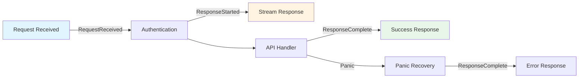
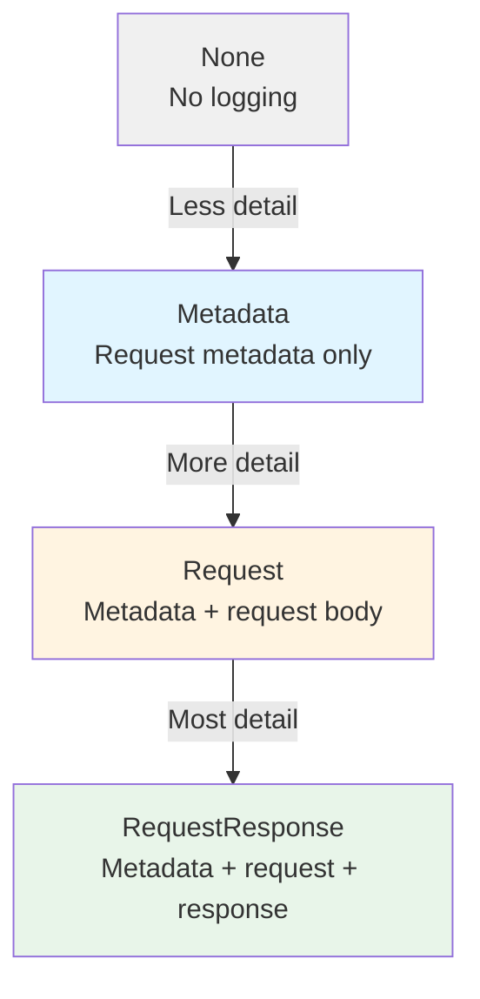
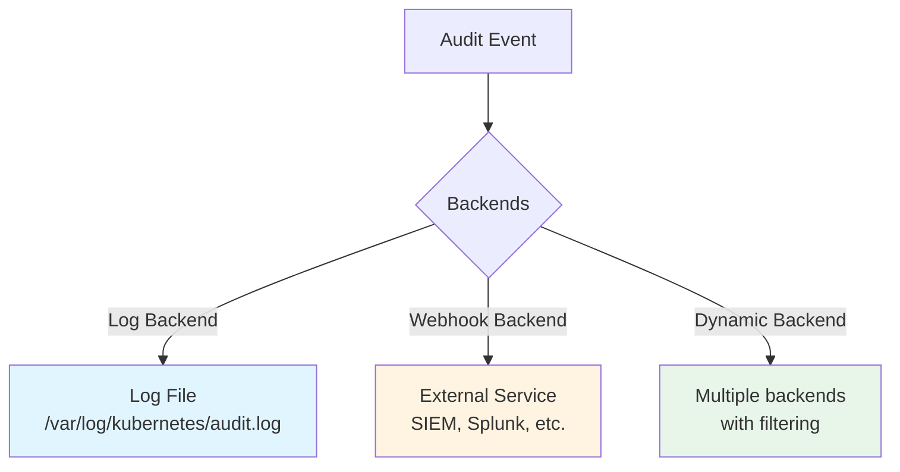

# Audit Logging

> **Middle-Level Technical Documentation**
> How kube-apiserver records detailed audit logs for security, compliance, and debugging.

---

## Table of Contents

- [Overview](#overview)
- [Audit Stages](#audit-stages)
- [Audit Levels](#audit-levels)
- [Audit Policy](#audit-policy)
- [Audit Backends](#audit-backends)
- [Audit Event Structure](#audit-event-structure)
- [Configuration](#configuration)
- [Performance Considerations](#performance-considerations)
- [Code References](#code-references)

---

## Overview

**Audit logging** provides a chronological record of activities in the cluster:
- Who performed an action
- What action was performed
- When it happened
- What was the result

### Use Cases

- **Security**: Detect unauthorized access attempts
- **Compliance**: Meet regulatory requirements (SOC 2, PCI-DSS, HIPAA)
- **Debugging**: Troubleshoot issues
- **Forensics**: Investigate incidents

**File Location**: `staging/src/k8s.io/apiserver/pkg/audit/`

---

## Audit Stages

Audit events are generated at different **stages** of request processing:



### Stage Definitions

| Stage | Description | When Logged |
|-------|-------------|-------------|
| **RequestReceived** | Initial headers received | Earliest point, before auth |
| **ResponseStarted** | Response headers sent (watch/exec) | After auth, before body streams |
| **ResponseComplete** | Response body sent | After full response |
| **Panic** | Request handler panicked | On panic recovery |

**Example Timeline**:
```
1. RequestReceived: 2024-01-15T10:00:00.000Z
2. ResponseComplete: 2024-01-15T10:00:00.025Z (25ms later)
```

**For long-running requests**:
```
1. RequestReceived: 2024-01-15T10:00:00.000Z
2. ResponseStarted: 2024-01-15T10:00:00.050Z (headers sent)
3. ResponseComplete: 2024-01-15T10:05:00.120Z (5 minutes later, stream closed)
```

---

## Audit Levels

Audit **levels** control how much information to log:



### Level Descriptions

**None**:
- Don't log this request at all
- Use for noisy endpoints like `/healthz`

**Metadata**:
- Log request metadata (user, timestamp, verb, resource)
- Omit request and response bodies
- Good for read operations

**Request**:
- Log metadata + request body
- Omit response body
- Good for write operations

**RequestResponse**:
- Log everything (metadata + request + response)
- Most comprehensive, highest overhead
- Good for sensitive operations

**Example Sizes**:
```
Metadata:        ~500 bytes
Request:         ~500 bytes + request size
RequestResponse: ~500 bytes + request size + response size
```

---

## Audit Policy

The **audit policy** determines what to log and at what level:

### Policy Structure

```yaml
apiVersion: audit.k8s.io/v1
kind: Policy
rules:
# 1. Don't log health checks
- level: None
  nonResourceURLs:
  - /healthz*
  - /readyz*
  - /livez*

# 2. Don't log watch streams (too verbose)
- level: None
  verbs: ["watch"]

# 3. Don't log read-only requests to system resources
- level: None
  verbs: ["get", "list"]
  resources:
  - group: ""
    resources: ["events"]

# 4. Log secret/configmap/token requests at Metadata level
- level: Metadata
  resources:
  - group: ""
    resources: ["secrets", "configmaps"]
  - group: "authentication.k8s.io"
    resources: ["tokenreviews"]

# 5. Log pod exec/attach at Metadata level (don't log terminal data)
- level: Metadata
  resources:
  - group: ""
    resources: ["pods/exec", "pods/attach", "pods/portforward"]

# 6. Log all creates/updates/deletes with request body
- level: Request
  verbs: ["create", "update", "patch", "delete", "deletecollection"]

# 7. Catch-all: log metadata for everything else
- level: Metadata
```

### Policy Evaluation

```go
// staging/src/k8s.io/apiserver/pkg/audit/policy/checker.go:50-120

func (c *Checker) LevelAndStages(attrs authorizer.Attributes, user user.Info) (audit.Level, []audit.Stage) {
    // Try each rule in order
    for _, rule := range c.policy.Rules {
        if ruleMatches(rule, attrs, user) {
            return rule.Level, rule.OmitStages
        }
    }

    // No match: don't log
    return audit.LevelNone, nil
}

func ruleMatches(rule audit.PolicyRule, attrs authorizer.Attributes, user user.Info) bool {
    // Check user/group
    if !matchesUser(rule.Users, rule.UserGroups, user) {
        return false
    }

    // Check verb
    if len(rule.Verbs) > 0 && !contains(rule.Verbs, attrs.GetVerb()) {
        return false
    }

    // Check resource
    if attrs.IsResourceRequest() {
        return matchesResource(rule.Resources, attrs)
    } else {
        return matchesNonResourceURL(rule.NonResourceURLs, attrs.GetPath())
    }
}
```

**File**: `staging/src/k8s.io/apiserver/pkg/audit/policy/checker.go`

### Advanced Policy Rules

**Log admin actions at RequestResponse level**:
```yaml
- level: RequestResponse
  users: ["admin", "cluster-admin"]
  verbs: ["delete", "deletecollection"]
```

**Log specific namespace modifications**:
```yaml
- level: Request
  namespaces: ["production", "critical"]
  verbs: ["create", "update", "patch", "delete"]
```

**Log CRD changes**:
```yaml
- level: Request
  resources:
  - group: "apiextensions.k8s.io"
    resources: ["customresourcedefinitions"]
```

---

## Audit Backends

Backends determine where audit events are stored:

### Backend Types



### Log Backend

**Configuration**:
```bash
--audit-log-path=/var/log/kubernetes/audit.log
--audit-log-maxage=30          # Keep logs for 30 days
--audit-log-maxbackup=10       # Keep 10 backup files
--audit-log-maxsize=100        # 100MB per file
--audit-log-format=json        # or "legacy"
```

**Log Format** (JSON):
```json
{
  "kind": "Event",
  "apiVersion": "audit.k8s.io/v1",
  "level": "Metadata",
  "auditID": "unique-id-123",
  "stage": "ResponseComplete",
  "requestURI": "/api/v1/namespaces/default/pods",
  "verb": "create",
  "user": {
    "username": "alice",
    "uid": "alice-uid",
    "groups": ["system:authenticated", "developers"]
  },
  "sourceIPs": ["10.0.0.5"],
  "userAgent": "kubectl/v1.28.0",
  "objectRef": {
    "resource": "pods",
    "namespace": "default",
    "name": "nginx",
    "apiVersion": "v1"
  },
  "responseStatus": {
    "metadata": {},
    "code": 201
  },
  "requestReceivedTimestamp": "2024-01-15T10:00:00.000Z",
  "stageTimestamp": "2024-01-15T10:00:00.025Z",
  "annotations": {
    "authorization.k8s.io/decision": "allow",
    "authorization.k8s.io/reason": "RBAC: allowed by RoleBinding"
  }
}
```

### Webhook Backend

**Configuration**:
```bash
--audit-webhook-config-file=/etc/kubernetes/audit-webhook.yaml
--audit-webhook-mode=batch           # or "blocking"
--audit-webhook-batch-buffer-size=10000
--audit-webhook-batch-max-size=400
--audit-webhook-batch-max-wait=30s
```

**Webhook Config** (`/etc/kubernetes/audit-webhook.yaml`):
```yaml
apiVersion: v1
kind: Config
clusters:
- name: audit-backend
  cluster:
    server: https://audit.example.com/events
    certificate-authority: /etc/kubernetes/pki/audit-ca.crt
users:
- name: audit-client
  user:
    client-certificate: /etc/kubernetes/pki/audit-client.crt
    client-key: /etc/kubernetes/pki/audit-client.key
contexts:
- name: default
  context:
    cluster: audit-backend
    user: audit-client
current-context: default
```

**Webhook Request**:
```json
{
  "kind": "EventList",
  "apiVersion": "audit.k8s.io/v1",
  "items": [
    {
      "kind": "Event",
      "apiVersion": "audit.k8s.io/v1",
      ...
    },
    ...
  ]
}
```

**Modes**:
- **batch**: Buffer events, send in batches (default, lower overhead)
- **blocking**: Send each event synchronously (higher reliability, higher latency)

### Dynamic Backend

**Configuration**:
```bash
--audit-dynamic-configuration
```

**AuditSink** resource:
```yaml
apiVersion: auditregistration.k8s.io/v1alpha1
kind: AuditSink
metadata:
  name: mysink
spec:
  policy:
    level: Metadata
    stages:
    - ResponseComplete
  webhook:
    clientConfig:
      url: "https://audit.example.com/events"
      caBundle: "LS0tLS1CRUdJTi..."
    throttle:
      qps: 10
      burst: 15
```

---

## Audit Event Structure

### Complete Event

```go
// staging/src/k8s.io/apiserver/pkg/apis/audit/types.go:50-200

type Event struct {
    // Unique audit ID
    AuditID types.UID

    // Level: None, Metadata, Request, RequestResponse
    Level Level

    // Stage: RequestReceived, ResponseStarted, ResponseComplete, Panic
    Stage Stage

    // RequestURI: /api/v1/namespaces/default/pods/nginx
    RequestURI string

    // Verb: get, list, create, update, patch, delete, watch
    Verb string

    // User information
    User authnv1.UserInfo

    // Impersonated user (if any)
    ImpersonatedUser *authnv1.UserInfo

    // Source IPs
    SourceIPs []string

    // User agent
    UserAgent string

    // Object reference
    ObjectRef *ObjectReference

    // Response status
    ResponseStatus *metav1.Status

    // Request object (for Request/RequestResponse levels)
    RequestObject *runtime.Unknown

    // Response object (for RequestResponse level)
    ResponseObject *runtime.Unknown

    // Timestamps
    RequestReceivedTimestamp metav1.MicroTime
    StageTimestamp           metav1.MicroTime

    // Annotations: additional contextual information
    Annotations map[string]string
}
```

### Example Events

**CREATE Pod (Request level)**:
```json
{
  "kind": "Event",
  "apiVersion": "audit.k8s.io/v1",
  "level": "Request",
  "auditID": "abc-123",
  "stage": "ResponseComplete",
  "requestURI": "/api/v1/namespaces/default/pods",
  "verb": "create",
  "user": {
    "username": "alice",
    "groups": ["developers", "system:authenticated"]
  },
  "sourceIPs": ["10.0.0.5"],
  "objectRef": {
    "resource": "pods",
    "namespace": "default",
    "name": "nginx",
    "apiVersion": "v1"
  },
  "responseStatus": {"code": 201},
  "requestObject": {
    "kind": "Pod",
    "apiVersion": "v1",
    "metadata": {"name": "nginx", "namespace": "default"},
    "spec": {
      "containers": [{"name": "nginx", "image": "nginx:1.14"}]
    }
  },
  "requestReceivedTimestamp": "2024-01-15T10:00:00.000Z",
  "stageTimestamp": "2024-01-15T10:00:00.025Z"
}
```

**DELETE Pod (Metadata level)**:
```json
{
  "kind": "Event",
  "apiVersion": "audit.k8s.io/v1",
  "level": "Metadata",
  "auditID": "def-456",
  "stage": "ResponseComplete",
  "requestURI": "/api/v1/namespaces/default/pods/nginx",
  "verb": "delete",
  "user": {
    "username": "bob",
    "groups": ["ops", "system:authenticated"]
  },
  "sourceIPs": ["10.0.0.6"],
  "objectRef": {
    "resource": "pods",
    "namespace": "default",
    "name": "nginx",
    "apiVersion": "v1"
  },
  "responseStatus": {"code": 200},
  "requestReceivedTimestamp": "2024-01-15T10:01:00.000Z",
  "stageTimestamp": "2024-01-15T10:01:00.010Z"
}
```

**Failed Authentication**:
```json
{
  "kind": "Event",
  "apiVersion": "audit.k8s.io/v1",
  "level": "Metadata",
  "auditID": "ghi-789",
  "stage": "ResponseComplete",
  "requestURI": "/api/v1/pods",
  "verb": "list",
  "user": {
    "username": "system:anonymous",
    "groups": ["system:unauthenticated"]
  },
  "sourceIPs": ["10.0.0.100"],
  "responseStatus": {
    "metadata": {},
    "code": 401,
    "reason": "Unauthorized"
  },
  "requestReceivedTimestamp": "2024-01-15T10:02:00.000Z",
  "stageTimestamp": "2024-01-15T10:02:00.001Z"
}
```

---

## Configuration

### Complete Configuration Example

```bash
# API server flags
kube-apiserver \
  --audit-policy-file=/etc/kubernetes/audit-policy.yaml \
  \
  # Log backend
  --audit-log-path=/var/log/kubernetes/audit.log \
  --audit-log-maxage=30 \
  --audit-log-maxbackup=10 \
  --audit-log-maxsize=100 \
  --audit-log-format=json \
  \
  # Webhook backend
  --audit-webhook-config-file=/etc/kubernetes/audit-webhook.yaml \
  --audit-webhook-mode=batch \
  --audit-webhook-batch-buffer-size=10000 \
  --audit-webhook-batch-max-size=400 \
  --audit-webhook-batch-max-wait=30s \
  --audit-webhook-initial-backoff=10s \
  \
  # Dynamic audit
  --audit-dynamic-configuration \
  --feature-gates=DynamicAuditing=true
```

### Minimal Production Policy

```yaml
apiVersion: audit.k8s.io/v1
kind: Policy
rules:
# Don't log health checks
- level: None
  nonResourceURLs: ["/healthz*", "/readyz*", "/livez*"]

# Don't log watch requests (too verbose)
- level: None
  verbs: ["watch"]

# Log secrets/configmaps at Metadata level
- level: Metadata
  resources:
  - group: ""
    resources: ["secrets", "configmaps"]

# Log all mutations with request body
- level: Request
  verbs: ["create", "update", "patch", "delete"]
  omitStages: ["RequestReceived"]

# Log metadata for reads
- level: Metadata
  verbs: ["get", "list"]
```

---

## Performance Considerations

### Overhead Analysis

| Level | CPU Overhead | Disk I/O | Network I/O (webhook) |
|-------|--------------|----------|-----------------------|
| **None** | 0% | 0 | 0 |
| **Metadata** | 1-2% | Low (~1 KB/event) | Low |
| **Request** | 2-5% | Medium (~5-50 KB/event) | Medium |
| **RequestResponse** | 5-10% | High (~10-500 KB/event) | High |

### Best Practices

**1. Use selective policies**:
```yaml
# ✅ Good: selective logging
- level: Request
  verbs: ["create", "update", "delete"]
  resources:
  - group: ""
    resources: ["pods", "services"]
  namespaces: ["production"]

# ❌ Bad: log everything
- level: RequestResponse
```

**2. Omit verbose stages**:
```yaml
# Omit RequestReceived to reduce duplicate events
omitStages: ["RequestReceived"]
```

**3. Use batch mode for webhooks**:
```bash
--audit-webhook-mode=batch
--audit-webhook-batch-max-size=400
```

**4. Exclude noisy endpoints**:
```yaml
- level: None
  nonResourceURLs: ["/healthz*", "/metrics"]
  verbs: ["watch"]
```

### Volume Estimation

**Assumptions**:
- 1000 API requests/second
- 50% mutations (create/update/delete)
- 50% reads (get/list)
- Average event size: Metadata = 1 KB, Request = 10 KB

**Daily Volume**:
```
Mutations: 1000 × 0.5 × 86400 × 10 KB = 432 GB/day
Reads:     1000 × 0.5 × 86400 × 1 KB  = 43 GB/day
Total:                                  475 GB/day
```

**With selective policy** (only mutations on key resources):
```
Reduced mutations: 1000 × 0.5 × 0.2 × 86400 × 10 KB = 86 GB/day
```

---

## Code References

### Key Files

| Component | File | Description |
|-----------|------|-------------|
| **Audit Filter** | `staging/src/k8s.io/apiserver/pkg/endpoints/filters/audit.go` | Handler chain filter |
| **Policy Checker** | `staging/src/k8s.io/apiserver/pkg/audit/policy/checker.go` | Policy evaluation |
| **Event Types** | `staging/src/k8s.io/apiserver/pkg/apis/audit/types.go` | Event structure |
| **Log Backend** | `staging/src/k8s.io/apiserver/plugin/pkg/audit/log/backend.go` | File logging |
| **Webhook Backend** | `staging/src/k8s.io/apiserver/plugin/pkg/audit/webhook/webhook.go` | Webhook dispatch |

### Key Functions

```go
// Audit filter
staging/src/k8s.io/apiserver/pkg/endpoints/filters/audit.go:50-150
func WithAudit(handler, sink, policy, longRunningCheck) http.Handler

// Policy check
staging/src/k8s.io/apiserver/pkg/audit/policy/checker.go:60-120
func (c *Checker) LevelAndStages(attrs, user) (Level, []Stage)

// Log event
staging/src/k8s.io/apiserver/plugin/pkg/audit/log/backend.go:80-150
func (b *backend) ProcessEvents(events ...*auditinternal.Event)

// Webhook event
staging/src/k8s.io/apiserver/plugin/pkg/audit/webhook/webhook.go:100-200
func (b *backend) ProcessEvents(events ...*auditinternal.Event)
```

---

## Summary

Audit logging provides **comprehensive request tracking**:

1. **Four stages**: RequestReceived, ResponseStarted, ResponseComplete, Panic
2. **Four levels**: None, Metadata, Request, RequestResponse
3. **Policy-driven**: Flexible rules for selective logging
4. **Multiple backends**: Log file, webhook, dynamic
5. **Rich events**: Complete request/response details

**Use Cases**:
- Security monitoring and threat detection
- Compliance (SOC 2, PCI-DSS, HIPAA)
- Debugging and troubleshooting
- Forensic analysis

**Next Steps**:
- [OpenAPI & Discovery](10-openapi-discovery.md) - API documentation
- [Request Pipeline](01-request-pipeline.md) - Complete flow
- [Authentication](04-authentication.md) - User identification

---

**Related Documentation**:
- [QUICK-REFERENCE.md](../QUICK-REFERENCE.md#troubleshooting) - Audit log examples
- [KEP-22](https://github.com/kubernetes/enhancements/tree/master/keps/sig-auth/22-advanced-audit) - Advanced audit design
