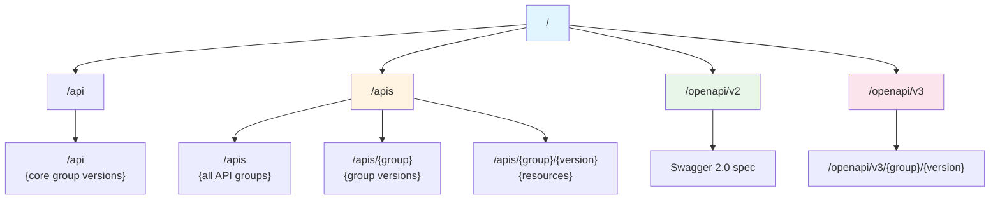
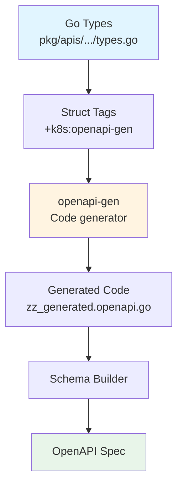

# OpenAPI and Discovery

> **Middle-Level Technical Documentation**
> How Kubernetes exposes API schemas and enables client discovery through OpenAPI specifications.

---

## Table of Contents

- [Overview](#overview)
- [Discovery Endpoints](#discovery-endpoints)
- [OpenAPI v2 (Swagger)](#openapi-v2-swagger)
- [OpenAPI v3](#openapi-v3)
- [Schema Generation](#schema-generation)
- [Client-Side Usage](#client-side-usage)
- [Code References](#code-references)

---

## Overview

Kubernetes provides **machine-readable API documentation** through:
- **Discovery API**: List available resources and versions
- **OpenAPI**: Detailed schema specifications for all API types

### Use Cases

- **kubectl**: Auto-completion, validation, explain command
- **client-go**: Dynamic client, server-side apply
- **Code generators**: Generate client libraries
- **API tools**: Swagger UI, Postman, etc.
- **Validation**: Client-side and server-side validation

**File Location**: `staging/src/k8s.io/apiserver/pkg/endpoints/discovery/`

---

## Discovery Endpoints

### Core Discovery Endpoints



### GET /api

**Purpose**: Discover core API group versions

**Response**:
```json
{
  "kind": "APIVersions",
  "versions": ["v1"],
  "serverAddressByClientCIDRs": [
    {
      "clientCIDR": "0.0.0.0/0",
      "serverAddress": "10.96.0.1:443"
    }
  ]
}
```

### GET /apis

**Purpose**: List all API groups

**Response**:
```json
{
  "kind": "APIGroupList",
  "apiVersion": "v1",
  "groups": [
    {
      "name": "apps",
      "versions": [
        {"groupVersion": "apps/v1", "version": "v1"}
      ],
      "preferredVersion": {
        "groupVersion": "apps/v1",
        "version": "v1"
      }
    },
    {
      "name": "batch",
      "versions": [
        {"groupVersion": "batch/v1", "version": "v1"},
        {"groupVersion": "batch/v1beta1", "version": "v1beta1"}
      ],
      "preferredVersion": {
        "groupVersion": "batch/v1",
        "version": "v1"
      }
    }
  ]
}
```

### GET /apis/{group}

**Example**: GET /apis/apps

**Response**:
```json
{
  "kind": "APIGroup",
  "apiVersion": "v1",
  "name": "apps",
  "versions": [
    {
      "groupVersion": "apps/v1",
      "version": "v1"
    },
    {
      "groupVersion": "apps/v1beta2",
      "version": "v1beta2"
    }
  ],
  "preferredVersion": {
    "groupVersion": "apps/v1",
    "version": "v1"
  }
}
```

### GET /apis/{group}/{version}

**Example**: GET /apis/apps/v1

**Response**:
```json
{
  "kind": "APIResourceList",
  "apiVersion": "v1",
  "groupVersion": "apps/v1",
  "resources": [
    {
      "name": "deployments",
      "singularName": "deployment",
      "namespaced": true,
      "kind": "Deployment",
      "verbs": ["create", "delete", "deletecollection", "get", "list", "patch", "update", "watch"],
      "shortNames": ["deploy"],
      "categories": ["all"]
    },
    {
      "name": "deployments/status",
      "singularName": "",
      "namespaced": true,
      "kind": "Deployment",
      "verbs": ["get", "patch", "update"]
    },
    {
      "name": "deployments/scale",
      "singularName": "",
      "namespaced": true,
      "group": "autoscaling",
      "version": "v1",
      "kind": "Scale",
      "verbs": ["get", "patch", "update"]
    },
    {
      "name": "statefulsets",
      "singularName": "statefulset",
      "namespaced": true,
      "kind": "StatefulSet",
      "verbs": ["create", "delete", "deletecollection", "get", "list", "patch", "update", "watch"],
      "shortNames": ["sts"],
      "categories": ["all"]
    }
  ]
}
```

---

## OpenAPI v2 (Swagger)

### GET /openapi/v2

**Purpose**: Complete API schema in Swagger 2.0 format

**Response Structure**:
```json
{
  "swagger": "2.0",
  "info": {
    "title": "Kubernetes",
    "version": "v1.28.0"
  },
  "paths": {
    "/api/v1/namespaces/{namespace}/pods": {
      "get": {...},
      "post": {...}
    },
    "/api/v1/namespaces/{namespace}/pods/{name}": {
      "get": {...},
      "put": {...},
      "patch": {...},
      "delete": {...}
    }
  },
  "definitions": {
    "io.k8s.api.core.v1.Pod": {
      "type": "object",
      "properties": {
        "apiVersion": {"type": "string"},
        "kind": {"type": "string"},
        "metadata": {"$ref": "#/definitions/io.k8s.apimachinery.pkg.apis.meta.v1.ObjectMeta"},
        "spec": {"$ref": "#/definitions/io.k8s.api.core.v1.PodSpec"},
        "status": {"$ref": "#/definitions/io.k8s.api.core.v1.PodStatus"}
      },
      "x-kubernetes-group-version-kind": [
        {"group": "", "kind": "Pod", "version": "v1"}
      ]
    },
    "io.k8s.api.core.v1.PodSpec": {
      "type": "object",
      "required": ["containers"],
      "properties": {
        "containers": {
          "type": "array",
          "items": {"$ref": "#/definitions/io.k8s.api.core.v1.Container"}
        },
        "volumes": {
          "type": "array",
          "items": {"$ref": "#/definitions/io.k8s.api.core.v1.Volume"}
        },
        "restartPolicy": {
          "type": "string",
          "enum": ["Always", "OnFailure", "Never"]
        }
      }
    }
  }
}
```

### Path Definition Example

```json
"/api/v1/namespaces/{namespace}/pods": {
  "get": {
    "description": "list or watch objects of kind Pod",
    "consumes": ["*/*"],
    "produces": ["application/json", "application/yaml"],
    "schemes": ["https"],
    "tags": ["core_v1"],
    "operationId": "listCoreV1NamespacedPod",
    "parameters": [
      {
        "name": "namespace",
        "in": "path",
        "required": true,
        "type": "string"
      },
      {
        "name": "labelSelector",
        "in": "query",
        "type": "string"
      },
      {
        "name": "limit",
        "in": "query",
        "type": "integer"
      }
    ],
    "responses": {
      "200": {
        "description": "OK",
        "schema": {"$ref": "#/definitions/io.k8s.api.core.v1.PodList"}
      },
      "401": {
        "description": "Unauthorized"
      }
    }
  },
  "post": {
    "description": "create a Pod",
    "operationId": "createCoreV1NamespacedPod",
    "parameters": [
      {
        "name": "body",
        "in": "body",
        "required": true,
        "schema": {"$ref": "#/definitions/io.k8s.api.core.v1.Pod"}
      }
    ],
    "responses": {
      "200": {"description": "OK"},
      "201": {"description": "Created"},
      "202": {"description": "Accepted"}
    }
  }
}
```

---

## OpenAPI v3

### GET /openapi/v3

**Purpose**: Discovery document for OpenAPI v3 endpoints

**Response**:
```json
{
  "paths": {
    "api/v1": {
      "serverRelativeURL": "/openapi/v3/api/v1"
    },
    "apis/apps/v1": {
      "serverRelativeURL": "/openapi/v3/apis/apps/v1"
    },
    "apis/batch/v1": {
      "serverRelativeURL": "/openapi/v3/apis/batch/v1"
    }
  }
}
```

### GET /openapi/v3/apis/{group}/{version}

**Example**: GET /openapi/v3/apis/apps/v1

**Response Structure** (OpenAPI 3.0):
```json
{
  "openapi": "3.0.0",
  "info": {
    "title": "Kubernetes apps/v1 API",
    "version": "v1.28.0"
  },
  "paths": {
    "/apis/apps/v1/deployments": {...},
    "/apis/apps/v1/namespaces/{namespace}/deployments": {...}
  },
  "components": {
    "schemas": {
      "io.k8s.api.apps.v1.Deployment": {
        "type": "object",
        "properties": {
          "apiVersion": {"type": "string"},
          "kind": {"type": "string"},
          "metadata": {"$ref": "#/components/schemas/io.k8s.apimachinery.pkg.apis.meta.v1.ObjectMeta"},
          "spec": {"$ref": "#/components/schemas/io.k8s.api.apps.v1.DeploymentSpec"},
          "status": {"$ref": "#/components/schemas/io.k8s.api.apps.v1.DeploymentStatus"}
        }
      }
    }
  }
}
```

### Differences from v2

**OpenAPI v3 Improvements**:
- Per-group/version schemas (smaller downloads)
- Better component reusability
- Improved validation keywords
- Cleaner structure

---

## Schema Generation

### How Schemas are Generated



### Go Type Annotations

```go
// pkg/apis/core/types.go

// Pod is a collection of containers that can run on a host.
// +genclient
// +k8s:openapi-gen=true
// +k8s:deepcopy-gen:interfaces=k8s.io/apimachinery/pkg/runtime.Object
type Pod struct {
    metav1.TypeMeta   `json:",inline"`
    metav1.ObjectMeta `json:"metadata,omitempty" protobuf:"bytes,1,opt,name=metadata"`

    // Spec: desired state
    // +optional
    Spec PodSpec `json:"spec,omitempty" protobuf:"bytes,2,opt,name=spec"`

    // Status: observed state (read-only)
    // +optional
    Status PodStatus `json:"status,omitempty" protobuf:"bytes,3,opt,name=status"`
}

// PodSpec describes how the pod should look.
// +k8s:openapi-gen=true
type PodSpec struct {
    // Containers: list of containers
    // +patchMergeKey=name
    // +patchStrategy=merge
    Containers []Container `json:"containers" patchStrategy:"merge" patchMergeKey:"name" protobuf:"bytes,2,rep,name=containers"`

    // RestartPolicy: when to restart containers
    // +optional
    RestartPolicy RestartPolicy `json:"restartPolicy,omitempty" protobuf:"bytes,3,opt,name=restartPolicy,casttype=RestartPolicy"`
}
```

### Generated OpenAPI Code

```go
// pkg/generated/openapi/zz_generated.openapi.go

func GetOpenAPIDefinitions(ref common.ReferenceCallback) map[string]common.OpenAPIDefinition {
    return map[string]common.OpenAPIDefinition{
        "k8s.io/api/core/v1.Pod": {
            Schema: spec.Schema{
                SchemaProps: spec.SchemaProps{
                    Type: []string{"object"},
                    Properties: map[string]spec.Schema{
                        "kind": {
                            SchemaProps: spec.SchemaProps{
                                Type: []string{"string"},
                            },
                        },
                        "apiVersion": {
                            SchemaProps: spec.SchemaProps{
                                Type: []string{"string"},
                            },
                        },
                        "metadata": {
                            SchemaProps: spec.SchemaProps{
                                Ref: ref("k8s.io/apimachinery/pkg/apis/meta/v1.ObjectMeta"),
                            },
                        },
                        "spec": {
                            SchemaProps: spec.SchemaProps{
                                Ref: ref("k8s.io/api/core/v1.PodSpec"),
                            },
                        },
                        "status": {
                            SchemaProps: spec.SchemaProps{
                                Ref: ref("k8s.io/api/core/v1.PodStatus"),
                            },
                        },
                    },
                },
            },
        },
    }
}
```

### OpenAPI Builder

```go
// staging/src/k8s.io/kube-openapi/pkg/builder/openapi.go:80-200

type builder struct {
    definitions map[string]common.OpenAPIDefinition
    config      *common.Config
}

func (b *builder) BuildOpenAPISpec() (*spec.Swagger, error) {
    swagger := &spec.Swagger{
        SwaggerProps: spec.SwaggerProps{
            Swagger: "2.0",
            Info: &spec.Info{
                InfoProps: spec.InfoProps{
                    Title:   b.config.Info.Title,
                    Version: b.config.Info.Version,
                },
            },
            Paths:       &spec.Paths{Paths: map[string]spec.PathItem{}},
            Definitions: spec.Definitions{},
        },
    }

    // Build definitions
    for defName, def := range b.definitions {
        swagger.Definitions[defName] = def.Schema
    }

    // Build paths
    for path, pathItem := range b.buildPaths() {
        swagger.Paths.Paths[path] = pathItem
    }

    return swagger, nil
}
```

**File**: `staging/src/k8s.io/kube-openapi/pkg/builder/openapi.go`

---

## Client-Side Usage

### kubectl explain

```bash
# Explain pod spec
kubectl explain pod.spec

# Output:
# KIND:     Pod
# VERSION:  v1
#
# RESOURCE: spec <Object>
#
# DESCRIPTION:
#      Specification of the desired behavior of the pod. More info:
#      https://git.k8s.io/community/contributors/devel/sig-architecture/api-conventions.md#spec-and-status
#
#      PodSpec is a description of a pod.
#
# FIELDS:
#    containers   <[]Object> -required-
#      List of containers belonging to the pod. Containers cannot currently be
#      added or removed. There must be at least one container in a Pod. Cannot be
#      updated.

kubectl explain pod.spec.containers
kubectl explain pod.spec.containers.resources
```

### client-go Dynamic Client

```go
import (
    "k8s.io/client-go/dynamic"
    "k8s.io/client-go/openapi"
)

// Get OpenAPI schema
oapiClient := client.Discovery().OpenAPISchema()
doc, err := oapiClient.OpenAPISchema()

// Get schema for specific GVK
gvk := schema.GroupVersionKind{
    Group:   "apps",
    Version: "v1",
    Kind:    "Deployment",
}

schema, err := doc.LookupResource(gvk)

// Use schema for validation
valid, err := schema.Validate(deploymentObj)
```

### Server-Side Apply

```go
import (
    "k8s.io/apimachinery/pkg/runtime/schema"
    "k8s.io/client-go/kubernetes"
)

// Server-side apply uses OpenAPI schema for:
// 1. Field management (who owns which field)
// 2. Merge strategy (merge, replace, delete)
// 3. Conflict detection

patch := []byte(`{
  "apiVersion": "apps/v1",
  "kind": "Deployment",
  "metadata": {"name": "nginx"},
  "spec": {
    "replicas": 3
  }
}`)

result, err := clientset.AppsV1().Deployments("default").
    Patch(ctx, "nginx", types.ApplyPatchType, patch, metav1.PatchOptions{
        FieldManager: "my-controller",
    })
```

### kubectl Auto-completion

```bash
# OpenAPI enables auto-completion
kubectl get pod <TAB>         # Lists pod names
kubectl get pod nginx -o <TAB>  # Lists output formats
kubectl edit deployment <TAB>   # Lists deployment names

# Field auto-completion
kubectl explain pod.spec.<TAB>
# containers  volumes  restartPolicy  terminationGracePeriodSeconds  ...
```

---

## Code References

### Key Files

| Component | File | Description |
|-----------|------|-------------|
| **Discovery Handler** | `staging/src/k8s.io/apiserver/pkg/endpoints/discovery/aggregated/handler.go` | Discovery endpoints |
| **OpenAPI Builder** | `staging/src/k8s.io/kube-openapi/pkg/builder/openapi.go` | Build OpenAPI spec |
| **OpenAPI Handler** | `staging/src/k8s.io/apiserver/pkg/endpoints/openapi/openapi.go` | Serve OpenAPI |
| **Generated OpenAPI** | `pkg/generated/openapi/zz_generated.openapi.go` | Generated definitions |
| **Schema Validation** | `staging/src/k8s.io/apiserver/pkg/endpoints/handlers/fieldmanager/fieldmanager.go` | Server-side apply |

### Key Functions

```go
// Discovery handler
staging/src/k8s.io/apiserver/pkg/endpoints/discovery/aggregated/handler.go:60-150
func (r *resourceManager) ServeHTTP(w, req)

// Build OpenAPI v2 spec
staging/src/k8s.io/kube-openapi/pkg/builder/openapi.go:100-200
func (b *builder) BuildOpenAPISpec() (*spec.Swagger, error)

// Serve OpenAPI
staging/src/k8s.io/apiserver/pkg/endpoints/openapi/openapi.go:80-150
func (s *OpenAPIService) UpdateSpec(openapiSpec *spec.Swagger) error

// Get OpenAPI definitions
pkg/generated/openapi/zz_generated.openapi.go:50-100
func GetOpenAPIDefinitions(ref) map[string]common.OpenAPIDefinition
```

---

## Summary

OpenAPI and Discovery enable **self-documenting APIs**:

1. **Discovery API** - List groups, versions, resources
2. **OpenAPI v2** - Complete Swagger 2.0 specification
3. **OpenAPI v3** - Per-group/version schemas
4. **Code generation** - From Go types with annotations
5. **Client tools** - kubectl explain, auto-completion, validation

**Benefits**:
- **Self-documenting**: Machines can understand the API
- **Validation**: Client and server-side validation
- **Code generation**: Automatic client library generation
- **Tooling**: Swagger UI, Postman, etc.

**Next Steps**:
- [Aggregation Layer](11-aggregation-layer.md) - Extension API servers
- [API Groups](03-api-groups-registration.md) - Resource registration
- [Type System](../low-level/05-type-system.md) - Internal vs external types

---

**Related Documentation**:
- [QUICK-REFERENCE.md](../QUICK-REFERENCE.md#quick-commands) - kubectl commands
- [Kubernetes API Conventions](https://github.com/kubernetes/community/blob/master/contributors/devel/sig-architecture/api-conventions.md)
