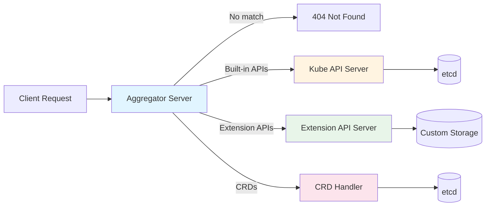
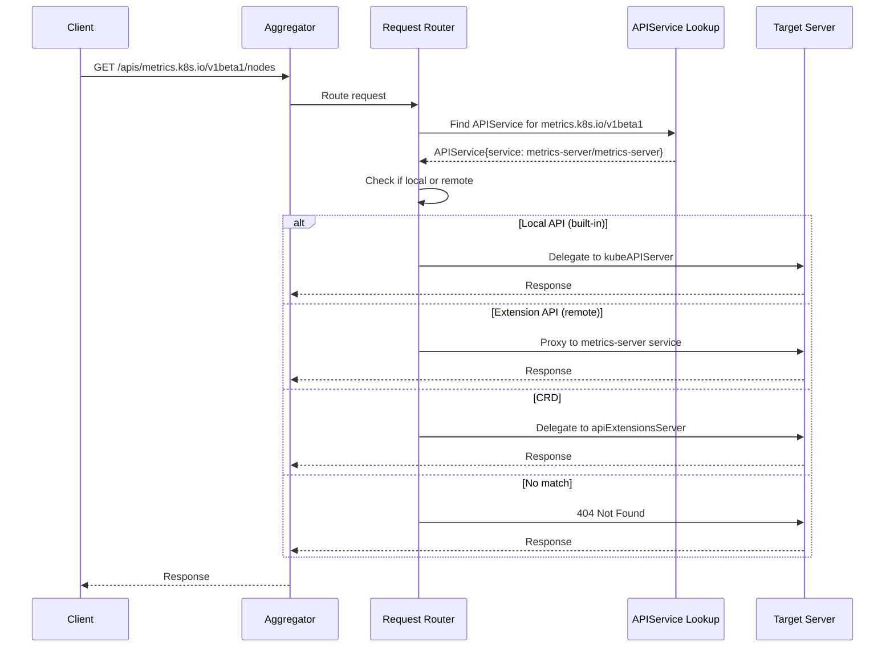
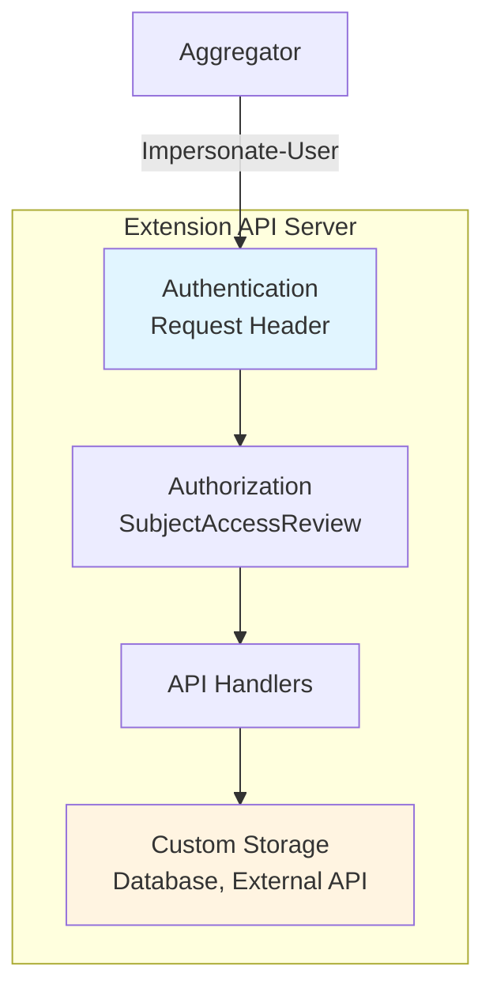

# Aggregation Layer

> **Middle-Level Technical Documentation**
> How Kubernetes extends the API server through the aggregation layer and APIService resources.

---

## Table of Contents

- [Overview](#overview)
- [Aggregator Architecture](#aggregator-architecture)
- [APIService Resource](#apiservice-resource)
- [Request Routing](#request-routing)
- [Extension API Servers](#extension-api-servers)
- [Common Use Cases](#common-use-cases)
- [CRDs vs Extension API Servers](#crds-vs-extension-api-servers)
- [Code References](#code-references)

---

## Overview

The **Aggregation Layer** allows Kubernetes to be extended with additional API servers:
- Dynamically add new API groups
- Custom business logic and storage
- Integrate external services
- Maintain consistent authentication/authorization

### Three-Server Chain



**File Location**: `staging/src/k8s.io/kube-aggregator/`

---

## Aggregator Architecture

### Server Chain Creation

```go
// cmd/kube-apiserver/app/server.go:176-197

func CreateServerChain(config CompletedConfig) (*aggregatorapiserver.APIAggregator, error) {
    // 1. Create notFoundHandler (final fallback)
    notFoundHandler := notfoundhandler.New(config.ControlPlane.GenericConfig.Serializer, genericapifilters.NoMuxAndDiscoveryIncompleteKey)

    // 2. Create apiExtensionsServer (handles CRDs)
    apiExtensionsServer, err := config.ApiExtensions.New(genericapiserver.NewEmptyDelegateWithCustomHandler(notFoundHandler))

    // 3. Create kubeAPIServer (built-in APIs: pods, services, etc.)
    kubeAPIServer, err := config.KubeAPIs.New(apiExtensionsServer.GenericAPIServer)

    // 4. Create aggregatorServer (routes to appropriate server)
    aggregatorServer, err := controlplaneapiserver.CreateAggregatorServer(
        config.Aggregator,
        kubeAPIServer.GenericAPIServer,
        apiExtensionsServer.Informers,
        config.ControlPlane.ProviderConfig,
    )

    return aggregatorServer, nil
}
```

**File**: `cmd/kube-apiserver/app/server.go:176-197`

### Delegation Pattern



---

## APIService Resource

### Purpose

**APIService** resources register extension API servers with the aggregator:
- Specify API group and version
- Point to backend service
- Enable/disable APIs

### APIService Definition

```yaml
apiVersion: apiregistration.k8s.io/v1
kind: APIService
metadata:
  name: v1beta1.metrics.k8s.io
spec:
  # API group and version
  group: metrics.k8s.io
  version: v1beta1

  # Backend service
  service:
    namespace: kube-system
    name: metrics-server
    port: 443

  # TLS configuration
  caBundle: LS0tLS1CRUdJTi...  # Base64-encoded CA cert
  insecureSkipTLSVerify: false

  # Priority for this APIService
  groupPriorityMinimum: 100
  versionPriority: 100
```

### Local vs Remote APIService

**Local APIService** (built-in APIs):
```yaml
apiVersion: apiregistration.k8s.io/v1
kind: APIService
metadata:
  name: v1.apps
spec:
  group: apps
  version: v1
  groupPriorityMinimum: 17800
  versionPriority: 15
  # No service specified = local (handled by kube-apiserver)
```

**Remote APIService** (extension):
```yaml
apiVersion: apiregistration.k8s.io/v1
kind: APIService
metadata:
  name: v1beta1.custom.metrics.k8s.io
spec:
  group: custom.metrics.k8s.io
  version: v1beta1
  service:
    namespace: custom-metrics
    name: custom-metrics-apiserver
    port: 443
  caBundle: LS0tLS1CRUdJTi...
  groupPriorityMinimum: 100
  versionPriority: 100
```

### APIService Structure

```go
// staging/src/k8s.io/kube-aggregator/pkg/apis/apiregistration/types.go:40-90

type APIService struct {
    metav1.TypeMeta
    metav1.ObjectMeta

    Spec   APIServiceSpec
    Status APIServiceStatus
}

type APIServiceSpec struct {
    // Service: backend service (nil for local)
    Service *ServiceReference

    // Group: API group name
    Group string

    // Version: API version
    Version string

    // InsecureSkipTLSVerify: skip TLS verification
    InsecureSkipTLSVerify bool

    // CABundle: PEM-encoded CA bundle
    CABundle []byte

    // GroupPriorityMinimum: group priority for discovery
    GroupPriorityMinimum int32

    // VersionPriority: version priority within group
    VersionPriority int32
}

type ServiceReference struct {
    Namespace string
    Name      string
    Port      *int32  // Default: 443
}

type APIServiceStatus struct {
    // Conditions: Available, etc.
    Conditions []APIServiceCondition
}
```

---

## Request Routing

### Routing Logic

```mermaid
flowchart TD
    Request[Incoming Request] --> Parse[Parse request path<br/>/apis/{group}/{version}/...]
    Parse --> Lookup[Lookup APIService<br/>for group+version]

    Lookup --> Found{APIService<br/>found?}
    Found -->|No| Delegate[Delegate to next server<br/>kubeAPIServer → extensions → 404]

    Found -->|Yes| Type{Local or<br/>Remote?}
    Type -->|Local| Local[Delegate to kubeAPIServer]
    Type -->|Remote| Available{Service<br/>available?}

    Available -->|No| Unavailable[503 Service Unavailable]
    Available -->|Yes| Proxy[Proxy to backend service]

    Proxy --> Forward[Forward request with:<br/>- Original user headers<br/>- Impersonation headers<br/>- Client cert]
    Forward --> Backend[Backend Extension API Server]
    Backend --> Response[Return response]

    Local --> Response
    Delegate --> Response
    Unavailable --> Response

    style Type fill:#e1f5ff
    style Proxy fill:#fff4e1
    style Backend fill:#e8f5e9
```

### Proxy Handler

```go
// staging/src/k8s.io/kube-aggregator/pkg/apiserver/handler_proxy.go:80-200

type proxyHandler struct {
    localDelegate   http.Handler
    proxyTransport  *http.Transport
    serviceResolver ServiceResolver
}

func (r *proxyHandler) ServeHTTP(w http.ResponseWriter, req *http.Request) {
    // Extract API group/version from request path
    apiService := r.getAPIService(req)

    if apiService == nil {
        // No APIService found, delegate to next handler
        r.localDelegate.ServeHTTP(w, req)
        return
    }

    if apiService.Spec.Service == nil {
        // Local APIService, delegate to kubeAPIServer
        r.localDelegate.ServeHTTP(w, req)
        return
    }

    // Remote APIService, proxy to backend
    location, err := r.serviceResolver.ResolveEndpoint(
        apiService.Spec.Service.Namespace,
        apiService.Spec.Service.Name,
        *apiService.Spec.Service.Port,
    )
    if err != nil {
        responsewriters.InternalError(w, req, err)
        return
    }

    // Create proxy request
    proxyReq := req.Clone(req.Context())
    proxyReq.URL.Scheme = "https"
    proxyReq.URL.Host = location.Host

    // Add impersonation headers
    user, _ := genericapirequest.UserFrom(req.Context())
    proxyReq.Header.Set("Impersonate-User", user.GetName())
    for _, group := range user.GetGroups() {
        proxyReq.Header.Add("Impersonate-Group", group)
    }

    // Proxy the request
    proxy := httputil.NewSingleHostReverseProxy(location)
    proxy.Transport = r.proxyTransport
    proxy.ServeHTTP(w, proxyReq)
}
```

**File**: `staging/src/k8s.io/kube-aggregator/pkg/apiserver/handler_proxy.go`

### Header Propagation

```http
# Original client request
GET /apis/metrics.k8s.io/v1beta1/nodes HTTP/1.1
Authorization: Bearer <user-token>

# Proxied request to extension API server
GET /apis/metrics.k8s.io/v1beta1/nodes HTTP/1.1
Impersonate-User: alice
Impersonate-Group: system:authenticated
Impersonate-Group: developers
X-Remote-User: alice
X-Remote-Group: system:authenticated
X-Remote-Group: developers
```

**Why impersonation headers?**
- Extension API server trusts aggregator's client cert
- Aggregator impersonates original user
- Extension API server sees original user identity

---

## Extension API Servers

### Building an Extension API Server

```go
// Example extension API server

import (
    "k8s.io/apiserver/pkg/server"
    "k8s.io/apiserver/pkg/server/options"
)

func main() {
    // 1. Create server config
    serverConfig := server.NewRecommendedConfig(Codecs)

    // 2. Configure authentication (trust aggregator's cert)
    serverConfig.Authentication.RequestHeaderConfig = &authenticator.RequestHeaderConfig{
        UsernameHeaders:     []string{"X-Remote-User"},
        GroupHeaders:        []string{"X-Remote-Group"},
        ExtraHeaderPrefixes: []string{"X-Remote-Extra-"},
        ClientCA:            aggregatorCA,  // CA that signed aggregator's cert
        AllowedNames:        []string{"aggregator"},
    }

    // 3. Install APIs
    server, err := serverConfig.Complete().New("my-api-server", server.NewEmptyDelegate())

    // 4. Install custom API groups
    err = server.InstallAPIGroup(&genericapiserver.APIGroupInfo{
        PrioritizedVersions: []schema.GroupVersion{
            {Group: "custom.example.com", Version: "v1"},
        },
        VersionedResourcesStorageMap: map[string]map[string]rest.Storage{
            "v1": {
                "widgets": widgetStorage,
            },
        },
    })

    // 5. Run server
    server.PrepareRun().Run(stopCh)
}
```

### Extension API Server Components



---

## Common Use Cases

### Metrics Server

**Purpose**: Provide resource metrics (CPU, memory usage)

**APIService**:
```yaml
apiVersion: apiregistration.k8s.io/v1
kind: APIService
metadata:
  name: v1beta1.metrics.k8s.io
spec:
  group: metrics.k8s.io
  version: v1beta1
  service:
    namespace: kube-system
    name: metrics-server
  groupPriorityMinimum: 100
  versionPriority: 100
```

**Usage**:
```bash
kubectl top nodes
kubectl top pods
```

### Custom Metrics Adapter

**Purpose**: Provide custom application metrics for HPA

**APIService**:
```yaml
apiVersion: apiregistration.k8s.io/v1
kind: APIService
metadata:
  name: v1beta1.custom.metrics.k8s.io
spec:
  group: custom.metrics.k8s.io
  version: v1beta1
  service:
    namespace: custom-metrics
    name: custom-metrics-apiserver
```

**Usage**:
```yaml
apiVersion: autoscaling/v2
kind: HorizontalPodAutoscaler
metadata:
  name: myapp-hpa
spec:
  scaleTargetRef:
    apiVersion: apps/v1
    kind: Deployment
    name: myapp
  metrics:
  - type: Pods
    pods:
      metric:
        name: http_requests_per_second  # Custom metric
      target:
        type: AverageValue
        averageValue: "1000"
```

### Service Catalog

**Purpose**: Provide service broker integration (Open Service Broker API)

**APIServices**:
```yaml
---
apiVersion: apiregistration.k8s.io/v1
kind: APIService
metadata:
  name: v1beta1.servicecatalog.k8s.io
spec:
  group: servicecatalog.k8s.io
  version: v1beta1
  service:
    namespace: catalog
    name: catalog-apiserver
```

---

## CRDs vs Extension API Servers

### Comparison

| Feature | CRDs | Extension API Servers |
|---------|------|----------------------|
| **Complexity** | Simple (YAML definition) | Complex (Go code) |
| **Storage** | etcd (automatic) | Custom (database, external API) |
| **Validation** | OpenAPI v3 schema, CEL | Custom Go code |
| **Conversion** | Webhook | Custom Go code |
| **Subresources** | Limited (status, scale) | Unlimited (custom) |
| **Performance** | Good (generic) | Excellent (optimized) |
| **Versioning** | Webhook-based conversion | Full control |
| **Authorization** | RBAC | Custom + RBAC |
| **Development** | Minutes | Days/weeks |

### When to Use CRDs

✅ Simple resource model
✅ Standard CRUD operations
✅ etcd storage is acceptable
✅ OpenAPI validation sufficient
✅ Rapid development

**Example**: Operators, configuration objects, application definitions

### When to Use Extension API Servers

✅ Custom storage backend (database, external service)
✅ Complex business logic
✅ Non-standard operations
✅ Performance-critical
✅ Advanced versioning needs
✅ Custom subresources

**Example**: Metrics server, service catalog, virtual kubelet

---

## Code References

### Key Files

| Component | File | Description |
|-----------|------|-------------|
| **Aggregator** | `staging/src/k8s.io/kube-aggregator/pkg/apiserver/apiserver.go` | Aggregator server |
| **Proxy Handler** | `staging/src/k8s.io/kube-aggregator/pkg/apiserver/handler_proxy.go` | Request proxying |
| **APIService Types** | `staging/src/k8s.io/kube-aggregator/pkg/apis/apiregistration/types.go` | APIService definition |
| **Server Chain** | `cmd/kube-apiserver/app/server.go` | CreateServerChain |
| **Sample Server** | `staging/src/k8s.io/sample-apiserver/` | Example extension server |

### Key Functions

```go
// Create server chain
cmd/kube-apiserver/app/server.go:176-197
func CreateServerChain(config) (*APIAggregator, error)

// Aggregator server
staging/src/k8s.io/kube-aggregator/pkg/apiserver/apiserver.go:100-200
func (c completedConfig) NewWithDelegate(delegationTarget) (*APIAggregator, error)

// Proxy handler
staging/src/k8s.io/kube-aggregator/pkg/apiserver/handler_proxy.go:100-250
func (r *proxyHandler) ServeHTTP(w, req)

// Service resolver
staging/src/k8s.io/kube-aggregator/pkg/apiserver/handler_proxy.go:50-100
func (r *ServiceResolver) ResolveEndpoint(namespace, name, port) (*url.URL, error)
```

---

## Summary

The Aggregation Layer enables **Kubernetes API extensibility**:

1. **APIService resources** - Register extension API servers
2. **Three-server chain** - Aggregator → Kube → Extensions → 404
3. **Request proxying** - Transparent routing to backend services
4. **Impersonation** - Preserve original user identity
5. **Custom storage** - Beyond etcd

**Benefits**:
- Extend Kubernetes without modifying core
- Custom business logic and storage
- Integrate external services
- Maintain consistent auth/authz

**Common Extensions**:
- Metrics Server (resource metrics)
- Custom Metrics Adapter (HPA metrics)
- Service Catalog (service brokers)

**Next Steps**:
- [CRDs vs Aggregation](../low-level/08-rest-storage-impl.md#crd-storage) - Implementation comparison
- [Server Chain](../high-level/02-server-chain-architecture.md) - High-level overview
- [API Groups](03-api-groups-registration.md) - Resource registration

---

**Related Documentation**:
- [QUICK-REFERENCE.md](../QUICK-REFERENCE.md#core-concepts) - Server chain overview
- [KEP-20](https://github.com/kubernetes/enhancements/tree/master/keps/sig-api-machinery/20-extensible-api-server) - Aggregation layer design
- [Sample API Server](https://github.com/kubernetes/sample-apiserver) - Reference implementation
