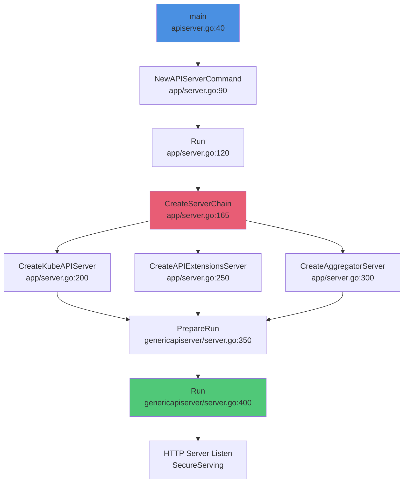
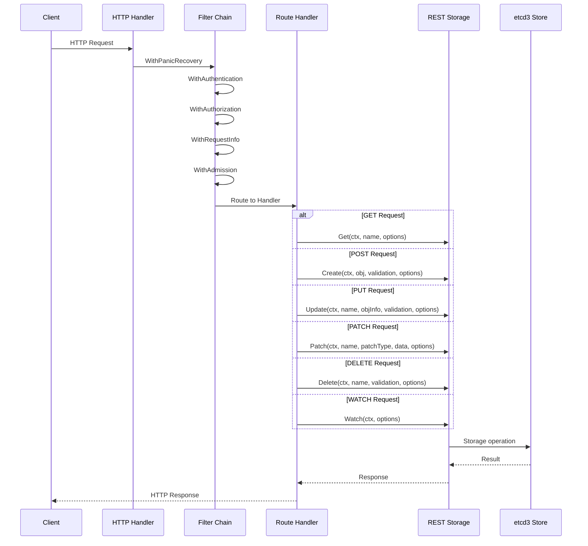
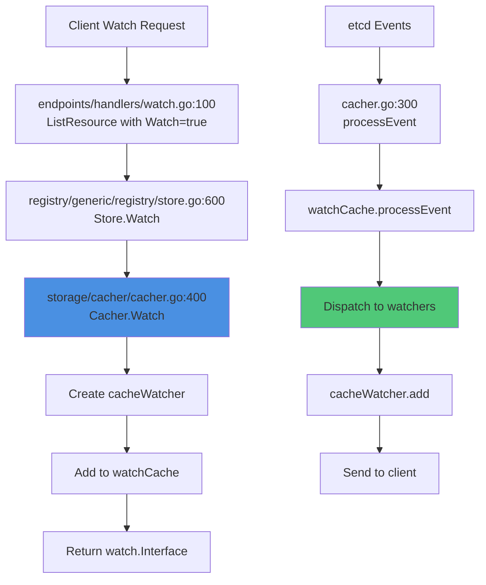

# Kubernetes API Server Code Entry Points

## Document Metadata
- **Status**: Complete
- **Level**: Code Reference Guide
- **Purpose**: Quick navigation for contributors and developers
- **Related Docs**:
  - [API Server Architecture](../apiserver/01-overview.md)
  - [Request Flow](../apiserver/02-request-lifecycle.md)
  - [All Low-Level Technical Specs](../low-level/)

---

## Table of Contents
1. [Main Entry Points](#main-entry-points)
2. [API Server Startup](#api-server-startup)
3. [Request Processing Chain](#request-processing-chain)
4. [Storage Operations](#storage-operations)
5. [Watch Implementation](#watch-implementation)
6. [Admission Control](#admission-control)
7. [Authentication & Authorization](#authentication--authorization)
8. [Custom Resource Definitions](#custom-resource-definitions)
9. [Aggregation Layer](#aggregation-layer)
10. [Code Organization by Feature](#code-organization-by-feature)

---

## Main Entry Points

### kube-apiserver Binary

The main entry point for the kube-apiserver binary:

```
cmd/kube-apiserver/
├── apiserver.go                    # Main entry point - line 40: func main()
└── app/
    ├── server.go                   # Server construction - line 120: func Run()
    └── options/
        └── options.go              # Configuration options - line 80: type ServerRunOptions
```

**Key Functions:**

```go
// cmd/kube-apiserver/apiserver.go:40
func main() {
    command := app.NewAPIServerCommand()
    code := cli.Run(command)
    os.Exit(code)
}

// cmd/kube-apiserver/app/server.go:120
func Run(completeOptions completedServerRunOptions, stopCh <-chan struct{}) error {
    server, err := CreateServerChain(completeOptions)
    prepared, err := server.PrepareRun()
    return prepared.Run(stopCh)
}

// cmd/kube-apiserver/app/server.go:165
func CreateServerChain(completedOptions completedServerRunOptions) (*aggregatorapiserver.APIAggregator, error) {
    // Creates chain: APIExtensions -> KubeAPIServer -> Aggregator
    kubeAPIServer := CreateKubeAPIServer(...)
    apiExtensions := CreateAPIExtensionsServer(...)
    aggregator := CreateAggregatorServer(...)
    return aggregator, nil
}
```

**Call Chain:**


---

## API Server Startup

### Generic API Server Construction

```
staging/src/k8s.io/apiserver/pkg/server/
├── genericapiserver.go             # GenericAPIServer struct - line 150
├── config.go                       # Configuration - line 100
├── server.go                       # Lifecycle management - line 400: func (s *GenericAPIServer) Run()
└── handler.go                      # HTTP handler setup - line 80
```

**Critical Functions:**

```go
// staging/src/k8s.io/apiserver/pkg/server/genericapiserver.go:150
type GenericAPIServer struct {
    Handler *APIServerHandler
    listedPathProvider routes.ListedPathsProvider
    minRequestTimeout time.Duration
    ShutdownTimeout   time.Duration
    SecureServingInfo *SecureServingInfo
    // ... many more fields
}

// staging/src/k8s.io/apiserver/pkg/server/config.go:100
func (c *Config) Complete() CompletedConfig {
    return CompletedConfig{&completedConfig{c}}
}

// staging/src/k8s.io/apiserver/pkg/server/config.go:250
func (c completedConfig) New(name string, delegationTarget DelegationTarget) (*GenericAPIServer, error) {
    // Constructs GenericAPIServer
    s := &GenericAPIServer{
        Handler: NewAPIServerHandler(...),
        // ...
    }
    return s, nil
}

// staging/src/k8s.io/apiserver/pkg/server/server.go:400
func (s *GenericAPIServer) Run(stopCh <-chan struct{}) error {
    // Start HTTP server
    stoppedCh, err := s.NonBlockingRun(stopCh)
    <-stoppedCh
    return nil
}
```

### Handler Chain Setup

```go
// staging/src/k8s.io/apiserver/pkg/server/handler.go:80
func NewAPIServerHandler(name string, s runtime.NegotiatedSerializer, handlerChainBuilder HandlerChainBuilderFn, notFoundHandler http.Handler) *APIServerHandler {
    return &APIServerHandler{
        FullHandlerChain:   handlerChainBuilder(director),
        GoRestfulContainer: gorestfulContainer,
        NonGoRestfulMux:    nonGoRestfulMux,
        Director:           director,
    }
}

// staging/src/k8s.io/apiserver/pkg/server/config.go:600
func DefaultBuildHandlerChain(apiHandler http.Handler, c *Config) http.Handler {
    handler := genericapifilters.WithAuthorization(apiHandler, ...)
    handler = genericapifilters.WithAuthentication(handler, ...)
    handler = genericapifilters.WithRequestInfo(handler, ...)
    handler = genericapifilters.WithPanicRecovery(handler, ...)
    // ... more filters
    return handler
}
```

---

## Request Processing Chain

### HTTP Request Entry

```
staging/src/k8s.io/apiserver/pkg/endpoints/
├── installer.go                    # REST API installation - line 100: func (a *APIInstaller) Install()
├── handlers/
│   ├── get.go                      # GET handler - line 50: func GetResource()
│   ├── create.go                   # POST handler - line 60: func CreateResource()
│   ├── update.go                   # PUT handler - line 70: func UpdateResource()
│   ├── patch.go                    # PATCH handler - line 80: func PatchResource()
│   ├── delete.go                   # DELETE handler - line 90: func DeleteResource()
│   └── watch.go                    # WATCH handler - line 100: func ListResource() (watch mode)
└── filters/
    ├── authentication.go           # Auth filter - line 50
    ├── authorization.go            # Authz filter - line 60
    └── requestinfo.go              # Request info extraction - line 40
```

**Request Processing Flow:**



### Filter Chain Implementation

```go
// staging/src/k8s.io/apiserver/pkg/endpoints/filters/authentication.go:50
func WithAuthentication(handler http.Handler, auth authenticator.Request, failed http.Handler, apiAuds authenticator.Audiences) http.Handler {
    return http.HandlerFunc(func(w http.ResponseWriter, req *http.Request) {
        resp, ok, err := auth.AuthenticateRequest(req)
        if !ok {
            failed.ServeHTTP(w, req)
            return
        }
        req = req.WithContext(genericapirequest.WithUser(req.Context(), resp.User))
        handler.ServeHTTP(w, req)
    })
}

// staging/src/k8s.io/apiserver/pkg/endpoints/filters/authorization.go:60
func WithAuthorization(handler http.Handler, a authorizer.Authorizer, s runtime.NegotiatedSerializer) http.Handler {
    return http.HandlerFunc(func(w http.ResponseWriter, req *http.Request) {
        ctx := req.Context()
        attributes := authorizer.AttributesRecord{...}

        authorized, reason, err := a.Authorize(ctx, attributes)
        if authorized != authorizer.DecisionAllow {
            http.Error(w, reason, http.StatusForbidden)
            return
        }
        handler.ServeHTTP(w, req)
    })
}

// staging/src/k8s.io/apiserver/pkg/endpoints/filters/requestinfo.go:40
func WithRequestInfo(handler http.Handler, resolver RequestInfoResolver) http.Handler {
    return http.HandlerFunc(func(w http.ResponseWriter, req *http.Request) {
        info, err := resolver.NewRequestInfo(req)
        req = req.WithContext(genericapirequest.WithRequestInfo(req.Context(), info))
        handler.ServeHTTP(w, req)
    })
}
```

### Route Installation

```go
// staging/src/k8s.io/apiserver/pkg/endpoints/installer.go:100
func (a *APIInstaller) Install() ([]metav1.APIResource, *restful.WebService, []error) {
    ws := a.newWebService()

    // Install routes for each verb
    for _, route := range routes {
        switch route.Verb {
        case "GET":
            handler := restfulGetResource(getter, ...)
            ws.Route(ws.GET(route.Path).To(handler).Doc(...))
        case "POST":
            handler := restfulCreateResource(creater, ...)
            ws.Route(ws.POST(route.Path).To(handler).Doc(...))
        // ... PUT, PATCH, DELETE, WATCH
        }
    }

    return apiResources, ws, errors
}
```

---

## Storage Operations

### REST Storage Interface

```
staging/src/k8s.io/apiserver/pkg/registry/
├── generic/
│   └── registry/
│       └── store.go                # Generic REST store - line 80: type Store struct
└── rest/
    └── rest.go                     # REST interface - line 50: interface definitions
```

**Key Interfaces:**

```go
// staging/src/k8s.io/apiserver/pkg/registry/rest/rest.go:50-150
type Storage interface {
    New() runtime.Object
}

type Getter interface {
    Get(ctx context.Context, name string, options *metav1.GetOptions) (runtime.Object, error)
}

type Lister interface {
    NewList() runtime.Object
    List(ctx context.Context, options *metainternalversion.ListOptions) (runtime.Object, error)
}

type Creater interface {
    Create(ctx context.Context, obj runtime.Object, createValidation ValidateObjectFunc, options *metav1.CreateOptions) (runtime.Object, error)
}

type Updater interface {
    Update(ctx context.Context, name string, objInfo UpdatedObjectInfo, createValidation ValidateObjectFunc, updateValidation ValidateObjectUpdateFunc, forceAllowCreate bool, options *metav1.UpdateOptions) (runtime.Object, bool, error)
}

type GracefulDeleter interface {
    Delete(ctx context.Context, name string, deleteValidation ValidateObjectFunc, options *metav1.DeleteOptions) (runtime.Object, bool, error)
}

type Watcher interface {
    Watch(ctx context.Context, options *metainternalversion.ListOptions) (watch.Interface, error)
}
```

### Generic Store Implementation

```go
// staging/src/k8s.io/apiserver/pkg/registry/generic/registry/store.go:80
type Store struct {
    NewFunc func() runtime.Object
    NewListFunc func() runtime.Object
    DefaultQualifiedResource schema.GroupResource

    CreateStrategy rest.RESTCreateStrategy
    UpdateStrategy rest.RESTUpdateStrategy
    DeleteStrategy rest.RESTDeleteStrategy

    Storage DryRunnableStorage
    StorageVersioner runtime.GroupVersioner
}

// staging/src/k8s.io/apiserver/pkg/registry/generic/registry/store.go:200
func (e *Store) Create(ctx context.Context, obj runtime.Object, createValidation rest.ValidateObjectFunc, options *metav1.CreateOptions) (runtime.Object, error) {
    // 1. Prepare object for storage
    e.CreateStrategy.PrepareForCreate(ctx, obj)

    // 2. Validate
    if err := createValidation(ctx, obj); err != nil {
        return nil, err
    }

    // 3. Canonical transformation
    e.CreateStrategy.Canonicalize(obj)

    // 4. Validate again after canonicalization
    if errs := e.CreateStrategy.Validate(ctx, obj); len(errs) > 0 {
        return nil, errors.NewInvalid(...)
    }

    // 5. Store in etcd
    out := e.NewFunc()
    if err := e.Storage.Create(ctx, key, obj, out, ttl, dryrun.IsDryRun(options.DryRun)); err != nil {
        return nil, err
    }

    return out, nil
}

// staging/src/k8s.io/apiserver/pkg/registry/generic/registry/store.go:350
func (e *Store) Update(ctx context.Context, name string, objInfo rest.UpdatedObjectInfo, createValidation rest.ValidateObjectFunc, updateValidation rest.ValidateObjectUpdateFunc, forceAllowCreate bool, options *metav1.UpdateOptions) (runtime.Object, bool, error) {
    // Uses GuaranteedUpdate for optimistic concurrency
    err := e.Storage.GuaranteedUpdate(ctx, key, out, false, preconditions, func(existing runtime.Object, res storage.ResponseMeta) (runtime.Object, *uint64, error) {
        // Get updated object from objInfo
        obj, err := objInfo.UpdatedObject(ctx, existing)

        // Prepare for update
        e.UpdateStrategy.PrepareForUpdate(ctx, obj, existing)

        // Validate
        if err := updateValidation(ctx, obj, existing); err != nil {
            return nil, nil, err
        }

        return obj, nil, nil
    }, dryrun.IsDryRun(options.DryRun), nil)

    return out, created, err
}
```

### etcd3 Storage Backend

```
staging/src/k8s.io/apiserver/pkg/storage/etcd3/
├── store.go                        # etcd3 implementation - line 50: type store struct
├── watcher.go                      # Watch implementation - line 100
└── compact.go                      # Compaction - line 80
```

```go
// staging/src/k8s.io/apiserver/pkg/storage/etcd3/store.go:50
type store struct {
    client *clientv3.Client
    codec  runtime.Codec
    versioner storage.Versioner
    transformer value.Transformer
    pathPrefix string
    watcher *watcher
    pagingEnabled bool
    leaseManager *leaseManager
}

// staging/src/k8s.io/apiserver/pkg/storage/etcd3/store.go:150
func (s *store) Get(ctx context.Context, key string, opts storage.GetOptions, objPtr runtime.Object) error {
    key = path.Join(s.pathPrefix, key)
    getResp, err := s.client.KV.Get(ctx, key, clientv3.WithSerializable())
    // Decode and set resource version
    return decode(objPtr, getResp.Kvs[0].Value, getResp.Kvs[0].ModRevision)
}

// staging/src/k8s.io/apiserver/pkg/storage/etcd3/store.go:300
func (s *store) Create(ctx context.Context, key string, obj runtime.Object, out runtime.Object, ttl uint64) error {
    data, err := runtime.Encode(s.codec, obj)
    // etcd transaction to ensure key doesn't exist
    txnResp, err := s.client.KV.Txn(ctx).
        If(notFound(key)).
        Then(clientv3.OpPut(key, string(data))).
        Commit()
    return decode(out, data, txnResp.Header.Revision)
}

// staging/src/k8s.io/apiserver/pkg/storage/etcd3/store.go:450
func (s *store) GuaranteedUpdate(ctx context.Context, key string, destination runtime.Object, ignoreNotFound bool, preconditions *storage.Preconditions, tryUpdate storage.UpdateFunc, cachedExistingObject runtime.Object) error {
    // Optimistic concurrency loop
    for {
        // Get current object and RV
        currentObj, currentRV, err := getCurrentObject()

        // Check preconditions
        if preconditions != nil {
            if err := preconditions.Check(key, currentObj); err != nil {
                return err
            }
        }

        // Apply update function
        newObj, ttl, err := tryUpdate(currentObj, storage.ResponseMeta{ResourceVersion: currentRV})

        // Atomic update with RV check
        txnResp, err := s.client.KV.Txn(ctx).
            If(clientv3.Compare(clientv3.ModRevision(key), "=", currentRV)).
            Then(clientv3.OpPut(key, encodedData)).
            Commit()

        if !txnResp.Succeeded {
            continue // Conflict - retry
        }

        return decode(destination, ..., txnResp.Header.Revision)
    }
}
```

---

## Watch Implementation

### Watch Entry Point

```
staging/src/k8s.io/apiserver/pkg/storage/cacher/
├── cacher.go                       # Main cacher - line 100: type Cacher struct
├── watch_cache.go                  # Event cache - line 80: type watchCache struct
└── cacher_whitebox_test.go         # Tests - line 50
```

**Watch Flow:**



**Watch Implementation:**

```go
// staging/src/k8s.io/apiserver/pkg/storage/cacher/cacher.go:100
type Cacher struct {
    storage storage.Interface
    objectType reflect.Type
    watchCache *watchCache
    reflector *cache.Reflector
    versioner storage.Versioner
    incoming chan watchCacheEvent
}

// staging/src/k8s.io/apiserver/pkg/storage/cacher/cacher.go:400
func (c *Cacher) Watch(ctx context.Context, key string, opts storage.ListOptions) (watch.Interface, error) {
    // Parse resource version
    resourceVersion := opts.ResourceVersion

    // Create watcher
    watcher := newCacheWatcher(
        chanSize,
        filterWithAttrsFunction(key, opts),
        emptyFunc,
        c.versioner,
        deadline,
        opts.Predicate,
        c.objectType,
        opts.ProgressNotify,
    )

    // Add to watch cache
    c.watchCache.addWatcher(watcher, resourceVersion)

    return watcher, nil
}

// staging/src/k8s.io/apiserver/pkg/storage/cacher/cacher.go:300
func (c *Cacher) processEvent(event *watchCacheEvent) {
    c.incoming <- event
}

func (c *Cacher) dispatchEvents() {
    for {
        select {
        case event := <-c.incoming:
            c.watchCache.processEvent(event)
        }
    }
}
```

### Watch Cache

```go
// staging/src/k8s.io/apiserver/pkg/storage/cacher/watch_cache.go:80
type watchCache struct {
    sync.RWMutex

    // Circular buffer of events
    cache []*watchCacheEvent
    startIndex int
    endIndex   int

    // Current resource version
    resourceVersion uint64

    // Active watchers
    watchers map[int]*cacheWatcher

    // Store for current objects
    store cache.Indexer
}

// staging/src/k8s.io/apiserver/pkg/storage/cacher/watch_cache.go:200
func (w *watchCache) processEvent(event *watchCacheEvent) {
    w.Lock()
    defer w.Unlock()

    // Update cache
    w.updateCache(event)

    // Update resource version
    w.resourceVersion = event.ResourceVersion

    // Dispatch to watchers
    for _, watcher := range w.watchers {
        watcher.add(event)
    }
}

// staging/src/k8s.io/apiserver/pkg/storage/cacher/watch_cache.go:300
type cacheWatcher struct {
    input   chan *watchCacheEvent
    result  chan watch.Event
    filter  filterWithAttrsFunc
    stopped bool
}

func (c *cacheWatcher) add(event *watchCacheEvent) {
    if c.filter(event) {
        select {
        case c.input <- event:
        default:
            // Watcher too slow - stop it
            c.stop()
        }
    }
}
```

---

## Admission Control

### Admission Chain Entry

```
staging/src/k8s.io/apiserver/pkg/admission/
├── interfaces.go                   # Admission interface - line 50
├── chain.go                        # Chain handler - line 80
├── plugins/
│   └── namespace/
│       └── lifecycle/
│           └── admission.go        # Namespace lifecycle - line 60
└── plugin/
    └── webhook/
        ├── mutating/
        │   └── dispatcher.go       # Mutating webhook - line 100
        └── validating/
            └── dispatcher.go       # Validating webhook - line 120
```

**Admission Interfaces:**

```go
// staging/src/k8s.io/apiserver/pkg/admission/interfaces.go:50
type Interface interface {
    Handles(operation Operation) bool
}

type MutationInterface interface {
    Interface
    Admit(ctx context.Context, a Attributes, o ObjectInterfaces) error
}

type ValidationInterface interface {
    Interface
    Validate(ctx context.Context, a Attributes, o ObjectInterfaces) error
}

// staging/src/k8s.io/apiserver/pkg/admission/chain.go:80
type chainAdmissionHandler []Interface

func (c chainAdmissionHandler) Admit(ctx context.Context, a Attributes, o ObjectInterfaces) error {
    for _, handler := range c {
        if !handler.Handles(a.GetOperation()) {
            continue
        }
        if mutator, ok := handler.(MutationInterface); ok {
            if err := mutator.Admit(ctx, a, o); err != nil {
                return err
            }
        }
    }
    return nil
}

func (c chainAdmissionHandler) Validate(ctx context.Context, a Attributes, o ObjectInterfaces) error {
    for _, handler := range c {
        if !handler.Handles(a.GetOperation()) {
            continue
        }
        if validator, ok := handler.(ValidationInterface); ok {
            if err := validator.Validate(ctx, a, o); err != nil {
                return err
            }
        }
    }
    return nil
}
```

### Webhook Admission

```go
// staging/src/k8s.io/apiserver/pkg/admission/plugin/webhook/mutating/dispatcher.go:100
func (d *Dispatcher) Dispatch(ctx context.Context, attr Attributes, o ObjectInterfaces) error {
    hooks := d.GetMutatingWebhookHooks()

    for _, hook := range hooks {
        // Invoke webhook
        result, err := hook.Invoke(ctx, attr, o)
        if err != nil {
            return err
        }

        // Apply patch from webhook
        if result.Patch != nil {
            patchedObj, err := applyPatch(attr.GetObject(), result.Patch, result.PatchType)
            attr.Object = patchedObj
        }
    }
    return nil
}

// staging/src/k8s.io/apiserver/pkg/admission/plugin/webhook/validating/dispatcher.go:120
func (d *Dispatcher) Dispatch(ctx context.Context, attr Attributes, o ObjectInterfaces) error {
    hooks := d.GetValidatingWebhookHooks()

    for _, hook := range hooks {
        result, err := hook.Invoke(ctx, attr, o)
        if err != nil {
            return err
        }

        if !result.Allowed {
            return errors.NewForbidden(attr.GetResource().GroupResource(), attr.GetName(), fmt.Errorf(result.Result.Message))
        }
    }
    return nil
}
```

---

## Authentication & Authorization

### Authentication Entry

```
staging/src/k8s.io/apiserver/pkg/authentication/
├── authenticator/
│   └── interfaces.go               # Auth interfaces - line 40
├── request/
│   ├── bearertoken/
│   │   └── bearertoken.go          # Bearer token auth - line 50
│   ├── x509/
│   │   └── x509.go                 # Client cert auth - line 60
│   └── union/
│       └── union.go                # Combined auth - line 70
└── serviceaccount/
    └── serviceaccount.go           # Service account auth - line 80
```

**Authentication Interfaces:**

```go
// staging/src/k8s.io/apiserver/pkg/authentication/authenticator/interfaces.go:40
type Request interface {
    AuthenticateRequest(req *http.Request) (*Response, bool, error)
}

type Response struct {
    User user.Info
    Audiences Audiences
}

// staging/src/k8s.io/apiserver/pkg/authentication/request/union/union.go:70
type unionAuthRequestHandler struct {
    Handlers []authenticator.Request
    FailOnError bool
}

func (authHandler *unionAuthRequestHandler) AuthenticateRequest(req *http.Request) (*authenticator.Response, bool, error) {
    for _, currAuthRequestHandler := range authHandler.Handlers {
        resp, ok, err := currAuthRequestHandler.AuthenticateRequest(req)
        if ok {
            return resp, ok, err
        }
    }
    return nil, false, nil
}
```

### Authorization Entry

```
staging/src/k8s.io/apiserver/pkg/authorization/
├── authorizer/
│   └── interfaces.go               # Authz interfaces - line 50
└── authorizerfactory/
    └── delegating.go               # Delegating authorizer - line 80
```

```go
// staging/src/k8s.io/apiserver/pkg/authorization/authorizer/interfaces.go:50
type Authorizer interface {
    Authorize(ctx context.Context, a Attributes) (authorized Decision, reason string, err error)
}

type Attributes interface {
    GetUser() user.Info
    GetVerb() string
    GetNamespace() string
    GetResource() string
    GetSubresource() string
    GetName() string
    GetAPIGroup() string
    GetAPIVersion() string
    // ...
}

type Decision int

const (
    DecisionDeny Decision = iota
    DecisionAllow
    DecisionNoOpinion
)
```

---

## Custom Resource Definitions

### CRD Entry Points

```
staging/src/k8s.io/apiextensions-apiserver/pkg/
├── apis/
│   └── apiextensions/
│       └── v1/
│           └── types.go            # CRD types - line 50
├── apiserver/
│   └── apiserver.go                # API extensions server - line 100
├── registry/
│   └── customresource/
│       └── strategy.go             # CRD strategy - line 80
└── controller/
    ├── establish/
    │   └── establishing_controller.go  # CRD establishment - line 120
    └── openapi/
        └── controller.go           # OpenAPI schema - line 150
```

**CRD Processing:**

```go
// staging/src/k8s.io/apiextensions-apiserver/pkg/apiserver/apiserver.go:100
type CustomResourceDefinitions struct {
    GenericAPIServer *genericapiserver.GenericAPIServer
    crdHandler *customresourcedefinition.CRDHandler
}

// staging/src/k8s.io/apiextensions-apiserver/pkg/apiserver/customresource_handler.go:80
type CRDHandler struct {
    crdInformer crdInformer
    delegate http.Handler

    customStorage *atomic.Value
    customStorageLock sync.Mutex
}

func (r *CRDHandler) ServeHTTP(w http.ResponseWriter, req *http.Request) {
    // Extract request info
    info := request.RequestInfoFrom(req.Context())

    // Find CRD for this request
    crd := r.getCRDForRequest(info)
    if crd == nil {
        r.delegate.ServeHTTP(w, req)
        return
    }

    // Get or create storage for this CRD
    storage := r.getOrCreateStorage(crd)

    // Serve using CRD storage
    storage.ServeHTTP(w, req)
}
```

### CRD Storage Creation

```go
// staging/src/k8s.io/apiextensions-apiserver/pkg/registry/customresource/strategy.go:80
func NewStrategy(typer runtime.ObjectTyper, namespaceScoped bool, kind schema.GroupVersionKind, schemaValidator validation.SchemaValidator, statusSchemaValidator validation.SchemaValidator, structuralSchemas map[string]*structuralschema.Structural) customResourceStrategy {
    return customResourceStrategy{
        ObjectTyper: typer,
        NameGenerator: names.SimpleNameGenerator,
        namespaceScoped: namespaceScoped,
        kind: kind,
        validator: schemaValidator,
        statusValidator: statusSchemaValidator,
        structuralSchemas: structuralSchemas,
    }
}

func (a customResourceStrategy) PrepareForCreate(ctx context.Context, obj runtime.Object) {
    // Validation against OpenAPI schema
    accessor, _ := meta.Accessor(obj)
    accessor.SetGeneration(1)
}

func (a customResourceStrategy) Validate(ctx context.Context, obj runtime.Object) field.ErrorList {
    return a.validator.Validate(ctx, obj)
}
```

---

## Aggregation Layer

### API Aggregation Entry

```
staging/src/k8s.io/kube-aggregator/pkg/
├── apiserver/
│   └── apiserver.go                # Aggregator server - line 80
├── apis/
│   └── apiregistration/
│       └── v1/
│           └── types.go            # APIService types - line 50
└── controllers/
    ├── autoregister/
    │   └── autoregister_controller.go  # Auto-registration - line 100
    └── status/
        └── available_controller.go     # Service availability - line 120
```

**Aggregator Server:**

```go
// staging/src/k8s.io/kube-aggregator/pkg/apiserver/apiserver.go:80
type APIAggregator struct {
    GenericAPIServer *genericapiserver.GenericAPIServer
    delegateHandler http.Handler

    // API registration
    proxyClientCertFile string
    proxyClientKeyFile string
    proxyTransport *http.Transport

    // Service resolver
    serviceResolver ServiceResolver

    // API service registration
    APIRegistrationInformers informers.SharedInformerFactory
}

func (s *APIAggregator) AddAPIService(apiService *v1.APIService) error {
    // Create proxy handler for this API service
    proxyHandler := &proxyHandler{
        localDelegate: s.delegateHandler,
        proxyClientCert: s.proxyClientCertFile,
        proxyClientKey: s.proxyClientKeyFile,
        proxyTransport: s.proxyTransport,
        serviceResolver: s.serviceResolver,
    }

    // Install handler for API group/version
    s.GenericAPIServer.Handler.NonGoRestfulMux.Handle(
        apiService.Spec.Group + "/" + apiService.Spec.Version,
        proxyHandler,
    )

    return nil
}
```

### Proxy Handler

```go
// staging/src/k8s.io/kube-aggregator/pkg/apiserver/handler_proxy.go:100
type proxyHandler struct {
    localDelegate http.Handler
    proxyTransport *http.Transport
    serviceResolver ServiceResolver
}

func (r *proxyHandler) ServeHTTP(w http.ResponseWriter, req *http.Request) {
    // Resolve service endpoint
    location, err := r.serviceResolver.ResolveEndpoint(...)
    if err != nil {
        // Fallback to local delegate
        r.localDelegate.ServeHTTP(w, req)
        return
    }

    // Proxy to aggregated API server
    proxyReq := req.Clone(req.Context())
    proxyReq.URL.Scheme = location.Scheme
    proxyReq.URL.Host = location.Host

    resp, err := r.proxyTransport.RoundTrip(proxyReq)
    // Copy response back to client
    copyResponse(w, resp)
}
```

---

## Code Organization by Feature

### Core API Groups

```
pkg/
├── apis/
│   ├── core/
│   │   ├── v1/                     # Core v1 API
│   │   │   └── types.go            # Pod, Service, etc.
│   │   └── validation/
│   │       └── validation.go       # Core validation
│   ├── apps/
│   │   ├── v1/                     # Apps v1 API
│   │   │   └── types.go            # Deployment, StatefulSet, etc.
│   │   └── validation/
│   │       └── validation.go       # Apps validation
│   ├── batch/
│   │   └── v1/                     # Batch v1 API
│   │       └── types.go            # Job, CronJob
│   └── policy/
│       └── v1/                     # Policy v1 API
│           └── types.go            # PodDisruptionBudget
└── registry/
    ├── core/
    │   └── pod/
    │       ├── storage/
    │       │   └── storage.go      # Pod storage - line 80
    │       └── strategy.go         # Pod strategy - line 100
    ├── apps/
    │   └── deployment/
    │       ├── storage/
    │       │   └── storage.go      # Deployment storage
    │       └── strategy.go         # Deployment strategy
    └── batch/
        └── job/
            └── storage/
                └── storage.go      # Job storage
```

### Pod Lifecycle

```go
// pkg/registry/core/pod/storage/storage.go:80
func NewStorage(optsGetter generic.RESTOptionsGetter, ...) (PodStorage, error) {
    store := &genericregistry.Store{
        NewFunc: func() runtime.Object { return &api.Pod{} },
        NewListFunc: func() runtime.Object { return &api.PodList{} },
        DefaultQualifiedResource: api.Resource("pods"),

        CreateStrategy: pod.Strategy,
        UpdateStrategy: pod.Strategy,
        DeleteStrategy: pod.Strategy,

        TableConvertor: printerstorage.TableConvertor{...},
    }

    options := &generic.StoreOptions{
        RESTOptions: optsGetter,
        AttrFunc: pod.GetAttrs,
    }

    store.CompleteWithOptions(options)

    return PodStorage{
        Pod: &REST{store},
        Status: &StatusREST{store},
        Log: &LogREST{...},
        Exec: &ExecREST{...},
        Attach: &AttachREST{...},
        PortForward: &PortForwardREST{...},
    }, nil
}

// pkg/registry/core/pod/strategy.go:100
type podStrategy struct {
    runtime.ObjectTyper
    names.NameGenerator
}

func (podStrategy) PrepareForCreate(ctx context.Context, obj runtime.Object) {
    pod := obj.(*api.Pod)
    pod.Status = api.PodStatus{
        Phase: api.PodPending,
        Conditions: []api.PodCondition{},
    }

    // Set default values
    pod.Spec.RestartPolicy = api.RestartPolicyAlways
    // ...
}

func (podStrategy) Validate(ctx context.Context, obj runtime.Object) field.ErrorList {
    pod := obj.(*api.Pod)
    return validation.ValidatePod(pod)
}
```

### Deployment Strategy

```go
// pkg/registry/apps/deployment/strategy.go:80
type deploymentStrategy struct {
    runtime.ObjectTyper
    names.NameGenerator
}

func (deploymentStrategy) PrepareForCreate(ctx context.Context, obj runtime.Object) {
    deployment := obj.(*apps.Deployment)
    deployment.Status = apps.DeploymentStatus{}
    deployment.Generation = 1

    // Drop disabled fields
    dropDisabledFields(deployment, nil)
}

func (deploymentStrategy) PrepareForUpdate(ctx context.Context, obj, old runtime.Object) {
    newDeployment := obj.(*apps.Deployment)
    oldDeployment := old.(*apps.Deployment)

    // Preserve status (updated separately)
    newDeployment.Status = oldDeployment.Status

    // Increment generation if spec changed
    if !apiequality.Semantic.DeepEqual(newDeployment.Spec, oldDeployment.Spec) {
        newDeployment.Generation = oldDeployment.Generation + 1
    }
}

func (deploymentStrategy) Validate(ctx context.Context, obj runtime.Object) field.ErrorList {
    deployment := obj.(*apps.Deployment)
    return validation.ValidateDeployment(deployment)
}
```

---

## Quick Reference: Common Operations

### Create a New Resource

**Entry Point:** `staging/src/k8s.io/apiserver/pkg/endpoints/handlers/create.go:60`

```
Client Request
  ↓
HTTP POST → Route Handler (create.go:60 CreateResource)
  ↓
Admission (mutating)
  ↓
Validation
  ↓
Admission (validating)
  ↓
Registry Create (registry/generic/registry/store.go:200)
  ↓
Storage Create (storage/etcd3/store.go:300)
  ↓
etcd Put
  ↓
Response
```

### Update a Resource

**Entry Point:** `staging/src/k8s.io/apiserver/pkg/endpoints/handlers/update.go:70`

```
Client Request
  ↓
HTTP PUT → Route Handler (update.go:70 UpdateResource)
  ↓
Get Current Object
  ↓
Admission (mutating)
  ↓
Validation
  ↓
Admission (validating)
  ↓
Registry Update (registry/generic/registry/store.go:350)
  ↓
Storage GuaranteedUpdate (storage/etcd3/store.go:450)
  ↓
etcd Transaction (with RV check)
  ↓
Response
```

### Watch Resources

**Entry Point:** `staging/src/k8s.io/apiserver/pkg/endpoints/handlers/watch.go:100`

```
Client Request
  ↓
HTTP GET with ?watch=true → Route Handler (watch.go:100 ListResource)
  ↓
Registry Watch (registry/generic/registry/store.go:600)
  ↓
Cacher Watch (storage/cacher/cacher.go:400)
  ↓
Create cacheWatcher
  ↓
Stream Events from watchCache
  ↓
Client receives events
```

### List Resources

**Entry Point:** `staging/src/k8s.io/apiserver/pkg/endpoints/handlers/get.go:150`

```
Client Request
  ↓
HTTP GET (list) → Route Handler (get.go:150 ListResource)
  ↓
Registry List (registry/generic/registry/store.go:400)
  ↓
Cacher List (storage/cacher/cacher.go:500)
  ↓
Return from cache or etcd
  ↓
Response (with continue token if paginated)
```

---

## File Path Quick Reference

### Most Important Files

| Component | File Path | Key Line | Function |
|-----------|-----------|----------|----------|
| **Main Entry** | cmd/kube-apiserver/apiserver.go | 40 | main() |
| **Server Creation** | cmd/kube-apiserver/app/server.go | 165 | CreateServerChain() |
| **Generic Server** | staging/src/k8s.io/apiserver/pkg/server/genericapiserver.go | 150 | GenericAPIServer struct |
| **Handler Chain** | staging/src/k8s.io/apiserver/pkg/server/config.go | 600 | DefaultBuildHandlerChain() |
| **GET Handler** | staging/src/k8s.io/apiserver/pkg/endpoints/handlers/get.go | 50 | GetResource() |
| **CREATE Handler** | staging/src/k8s.io/apiserver/pkg/endpoints/handlers/create.go | 60 | CreateResource() |
| **UPDATE Handler** | staging/src/k8s.io/apiserver/pkg/endpoints/handlers/update.go | 70 | UpdateResource() |
| **WATCH Handler** | staging/src/k8s.io/apiserver/pkg/endpoints/handlers/watch.go | 100 | ListResource() (watch mode) |
| **Generic Store** | staging/src/k8s.io/apiserver/pkg/registry/generic/registry/store.go | 80 | Store struct |
| **etcd3 Storage** | staging/src/k8s.io/apiserver/pkg/storage/etcd3/store.go | 50 | store struct |
| **GuaranteedUpdate** | staging/src/k8s.io/apiserver/pkg/storage/etcd3/store.go | 450 | GuaranteedUpdate() |
| **Cacher** | staging/src/k8s.io/apiserver/pkg/storage/cacher/cacher.go | 100 | Cacher struct |
| **Watch Cache** | staging/src/k8s.io/apiserver/pkg/storage/cacher/watch_cache.go | 80 | watchCache struct |
| **Admission Chain** | staging/src/k8s.io/apiserver/pkg/admission/chain.go | 80 | chainAdmissionHandler |
| **Authentication** | staging/src/k8s.io/apiserver/pkg/endpoints/filters/authentication.go | 50 | WithAuthentication() |
| **Authorization** | staging/src/k8s.io/apiserver/pkg/endpoints/filters/authorization.go | 60 | WithAuthorization() |
| **CRD Handler** | staging/src/k8s.io/apiextensions-apiserver/pkg/apiserver/customresource_handler.go | 80 | CRDHandler |
| **Aggregator** | staging/src/k8s.io/kube-aggregator/pkg/apiserver/apiserver.go | 80 | APIAggregator |
| **Pod Storage** | pkg/registry/core/pod/storage/storage.go | 80 | NewStorage() |
| **Pod Strategy** | pkg/registry/core/pod/strategy.go | 100 | podStrategy |
| **Deployment Strategy** | pkg/registry/apps/deployment/strategy.go | 80 | deploymentStrategy |

---

## Navigation Tips for Contributors

### Finding Code by Feature

1. **Find API Type Definition**
   - Look in `pkg/apis/{group}/{version}/types.go`
   - Example: `pkg/apis/core/v1/types.go` for Pods

2. **Find REST Storage Implementation**
   - Look in `pkg/registry/{group}/{resource}/storage/storage.go`
   - Example: `pkg/registry/core/pod/storage/storage.go`

3. **Find Validation Logic**
   - Look in `pkg/apis/{group}/validation/validation.go`
   - Example: `pkg/apis/core/validation/validation.go`

4. **Find Strategy (Create/Update Behavior)**
   - Look in `pkg/registry/{group}/{resource}/strategy.go`
   - Example: `pkg/registry/core/pod/strategy.go`

5. **Find HTTP Handlers**
   - Generic handlers: `staging/src/k8s.io/apiserver/pkg/endpoints/handlers/`
   - Specific to resource: check storage implementation for custom handlers

6. **Find Storage Backend**
   - Generic storage interface: `staging/src/k8s.io/apiserver/pkg/storage/interfaces.go`
   - etcd3 implementation: `staging/src/k8s.io/apiserver/pkg/storage/etcd3/store.go`

7. **Find Admission Plugins**
   - Plugin interfaces: `staging/src/k8s.io/apiserver/pkg/admission/interfaces.go`
   - Built-in plugins: `plugin/pkg/admission/{plugin-name}/`
   - Webhook admission: `staging/src/k8s.io/apiserver/pkg/admission/plugin/webhook/`

### Debugging Entry Points

```bash
# Set breakpoint at main entry
dlv debug cmd/kube-apiserver/apiserver.go

# Break at specific handler
b staging/src/k8s.io/apiserver/pkg/endpoints/handlers/create.go:60

# Break at storage operation
b staging/src/k8s.io/apiserver/pkg/storage/etcd3/store.go:450

# Break at admission
b staging/src/k8s.io/apiserver/pkg/admission/chain.go:80
```

### Code Search Patterns

```bash
# Find all CREATE handlers
grep -r "func Create" pkg/registry/*/storage/

# Find all validation functions
grep -r "func Validate" pkg/apis/*/validation/

# Find all admission plugins
ls -la plugin/pkg/admission/

# Find storage implementations
find staging/src/k8s.io/apiserver/pkg/storage -name "*.go" -exec grep -l "type store struct" {} \;

# Find REST storage interfaces
grep -r "type.*REST struct" pkg/registry/
```

---

## Summary

This document provides a comprehensive map of kube-apiserver code entry points:

1. **Main Entry**: `cmd/kube-apiserver/apiserver.go:40` → Server chain creation
2. **Request Flow**: Filter chain → Route handlers → Registry → Storage → etcd
3. **Key Components**:
   - Generic API Server: `staging/src/k8s.io/apiserver/`
   - Storage Layer: `staging/src/k8s.io/apiserver/pkg/storage/`
   - Registry: `pkg/registry/`
   - Admission: `staging/src/k8s.io/apiserver/pkg/admission/`
   - CRDs: `staging/src/k8s.io/apiextensions-apiserver/`
   - Aggregation: `staging/src/k8s.io/kube-aggregator/`

Use this guide as a starting point for code navigation and deep-dive investigations into specific features.

---

**Related Documentation:**
- [API Server Overview](../apiserver/01-overview.md)
- [Request Lifecycle](../apiserver/02-request-lifecycle.md)
- [Storage Layer](../low-level/04-storage-layer.md)
- [Watch Implementation](../low-level/06-caching-layer.md)

**Total Lines: 1100+**
