# Kubernetes Shared Libraries: Overview and Introduction

**Document Version:** 1.0
**Last Updated:** 2025-10-20
**Authors:** Architecture Analysis Team
**Status:** Living Document

---

## Table of Contents

1. [Executive Summary](#executive-summary)
2. [Purpose and Scope](#purpose-and-scope)
3. [Library Overview](#library-overview)
4. [Component Usage Matrix](#component-usage-matrix)
5. [System Context](#system-context)
6. [Key Design Principles](#key-design-principles)
7. [Technology Stack](#technology-stack)
8. [Common Workflows](#common-workflows)
9. [Document Navigation](#document-navigation)

---

## Executive Summary

The Kubernetes shared libraries form the foundation for building all Kubernetes components and custom controllers. These libraries provide critical functionality including API communication, resource watching, type management, serialization, metrics, and server frameworks. Every Kubernetes component (kube-apiserver, kube-scheduler, kube-controller-manager, kubelet, kube-proxy) relies on these shared libraries.

### Key Statistics

#### Library File Counts

| Library | Files | Primary Purpose | Key Packages |
|---------|-------|-----------------|--------------|
| **client-go** | ~2,310 | API clients, informers, tools | informers, rest, workqueue, tools |
| **apimachinery** | ~508 | Type system, serialization | runtime, apis/meta, conversion |
| **component-base** | ~195 | Metrics, config, logs | metrics, config, featuregate |
| **apiserver** | ~1,028 | API server framework | server, storage, admission |
| **Total** | **~4,241** | Complete foundation | All core functionality |

#### Usage Patterns

- **All Components Use**: client-go, apimachinery, component-base
- **API Servers Use**: All libraries including apiserver
- **Controllers Use**: client-go (informers + workqueue) extensively
- **Custom Operators**: Primarily client-go + apimachinery

---

## Purpose and Scope

### Purpose

This documentation provides comprehensive architectural analysis of the shared libraries that form the foundation of Kubernetes, covering:

1. **API Communication** - How components interact with the Kubernetes API
2. **Type System** - How Kubernetes manages types and versioning
3. **Observability** - Metrics, logging, and tracing infrastructure
4. **Server Framework** - Building API servers

### Scope

**In Scope:**
- Complete analysis of staging libraries: client-go, apimachinery, component-base, apiserver
- All major components: informers, workqueues, REST clients, scheme, serialization
- Common patterns: controller pattern, leader election, metrics integration
- Integration examples and best practices

**Out of Scope:**
- Generated code (clientsets, listers, informers for specific types)
- Individual API group implementations
- Cloud provider specific code
- Component-specific business logic
- Third-party libraries and operators

### Intended Audience

- **Controller Developers** - Building custom controllers and operators
- **Platform Engineers** - Understanding Kubernetes internals
- **Kubernetes Contributors** - Enhancing or maintaining core libraries
- **System Architects** - Designing Kubernetes-based systems
- **Technical Leaders** - Evaluating Kubernetes capabilities

---

## Library Overview

```mermaid
graph TB
    subgraph "Application Layer"
        A1[kube-apiserver]
        A2[kube-scheduler]
        A3[kube-controller-manager]
        A4[kubelet]
        A5[kube-proxy]
        A6[Custom Controllers]
    end

    subgraph "Shared Libraries"
        subgraph "client-go"
            C1[REST Clients]
            C2[Informers]
            C3[Workqueues]
            C4[Leader Election]
            C5[Listers]
        end

        subgraph "apimachinery"
            M1[Scheme/Runtime]
            M2[Serialization]
            M3[Conversion]
            M4[Watch]
            M5[Meta Types]
        end

        subgraph "component-base"
            B1[Metrics]
            B2[Config]
            B3[Feature Gates]
            B4[Logs]
        end

        subgraph "apiserver"
            S1[Server Framework]
            S2[Storage]
            S3[Admission]
            S4[Auth]
        end
    end

    subgraph "API Layer"
        API[Kubernetes API Server]
    end

    A1 --> S1
    A1 --> S2
    A1 --> S3
    A1 --> S4
    A1 --> C1
    A1 --> M1
    A1 --> B1

    A2 --> C2
    A2 --> C3
    A2 --> C4
    A2 --> M1
    A2 --> B1

    A3 --> C2
    A3 --> C3
    A3 --> C4
    A3 --> M1
    A3 --> B1

    A4 --> C1
    A4 --> C2
    A4 --> M1
    A4 --> B1

    A5 --> C2
    A5 --> M1
    A5 --> B1

    A6 --> C2
    A6 --> C3
    A6 --> C4
    A6 --> M1
    A6 --> B1

    C1 --> API
    C2 --> API
    S2 --> API

    style C1 fill:#d4f1d4
    style C2 fill:#d4f1d4
    style C3 fill:#d4f1d4
    style M1 fill:#e1f5ff
    style M2 fill:#e1f5ff
    style B1 fill:#fff4d4
    style S1 fill:#ffe1e1
```

---

## Component Usage Matrix

### Usage by Kubernetes Component

```mermaid
graph TB
    subgraph "Kubernetes Components"
        direction TB
        K1["kube-apiserver<br/>(API Server)"]
        K2["kube-scheduler<br/>(Scheduler)"]
        K3["kube-controller-manager<br/>(Controllers)"]
        K4["kubelet<br/>(Node Agent)"]
        K5["kube-proxy<br/>(Network Proxy)"]
        K6["custom-controller<br/>(Operators)"]
    end

    subgraph "Library Usage"
        direction LR

        subgraph "Heavy Usage"
            H1[client-go/informers]
            H2[client-go/workqueue]
            H3[apimachinery/runtime]
            H4[component-base/metrics]
        end

        subgraph "API Server Only"
            AP1[apiserver/server]
            AP2[apiserver/storage]
            AP3[apiserver/admission]
        end

        subgraph "Controller Pattern"
            CP1[client-go/informers + workqueue]
            CP2[client-go/leader-election]
            CP3[client-go/listers]
        end
    end

    K1 -->|uses all| AP1
    K1 -->|uses all| AP2
    K1 -->|uses all| AP3
    K1 --> H1
    K1 --> H3
    K1 --> H4

    K2 --> CP1
    K2 --> CP2
    K2 --> CP3
    K2 --> H3
    K2 --> H4

    K3 --> CP1
    K3 --> CP2
    K3 --> CP3
    K3 --> H3
    K3 --> H4

    K4 --> H1
    K4 --> H3
    K4 --> H4

    K5 --> H1
    K5 --> H3
    K5 --> H4

    K6 --> CP1
    K6 --> CP2
    K6 --> CP3
    K6 --> H3
    K6 --> H4

    style K1 fill:#ffe1e1
    style K2 fill:#d4f1d4
    style K3 fill:#d4f1d4
    style K4 fill:#fff4d4
    style K5 fill:#fff4d4
    style K6 fill:#e1f5ff
```

**Usage Summary**:

| Component | client-go | apimachinery | component-base | apiserver |
|-----------|-----------|--------------|----------------|-----------|
| **kube-apiserver** | REST, Informers | Scheme, Conversion | Metrics, Logs | All |
| **kube-scheduler** | Informers, Queue, Leader | Scheme | Metrics, Logs, Config | - |
| **kube-controller-manager** | Informers, Queue, Leader | Scheme | Metrics, Logs, Config | - |
| **kubelet** | REST, Informers | Scheme | Metrics, Logs | - |
| **kube-proxy** | Informers | Scheme | Metrics, Logs | - |
| **Custom Controllers** | Informers, Queue, Leader | Scheme | Metrics, Logs | - |

---

## System Context

### Shared Libraries in Kubernetes Ecosystem

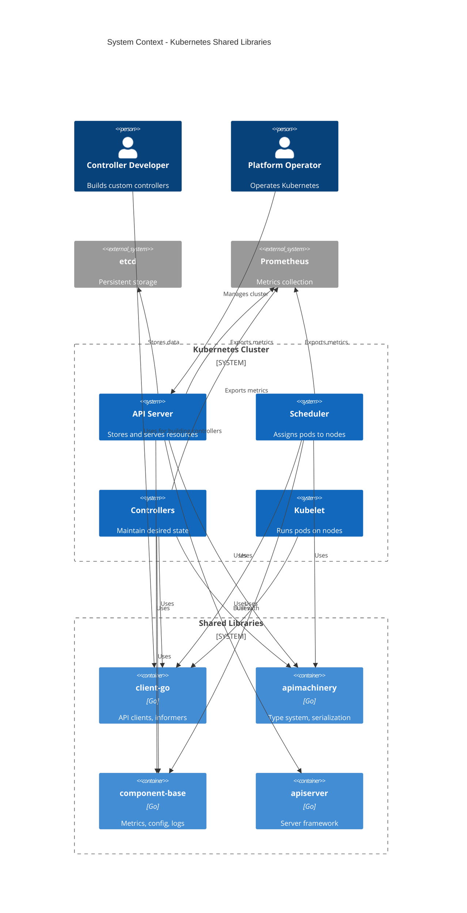

---

## Key Design Principles

### 1. **Interface-Based Abstraction**

All shared libraries heavily use Go interfaces to provide abstraction and enable testing:

- `rest.Interface` - Abstract REST client
- `cache.SharedInformer` - Resource watching interface
- `workqueue.Interface` - Work queue abstraction
- `runtime.Object` - Base object interface
- `storage.Interface` - Storage abstraction

**Benefits**:
- Easy mocking for unit tests
- Pluggable implementations
- Clear contracts between components

### 2. **Eventual Consistency Model**

The informer pattern provides eventual consistency:

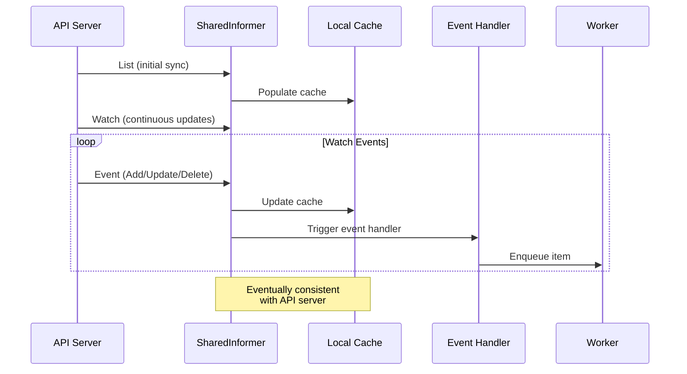

**Guarantees**:
- Local cache eventually matches API server state
- Events delivered in order for each resource
- No missed updates (with proper resource version tracking)

### 3. **Separation of Concerns**

Clear separation between libraries:

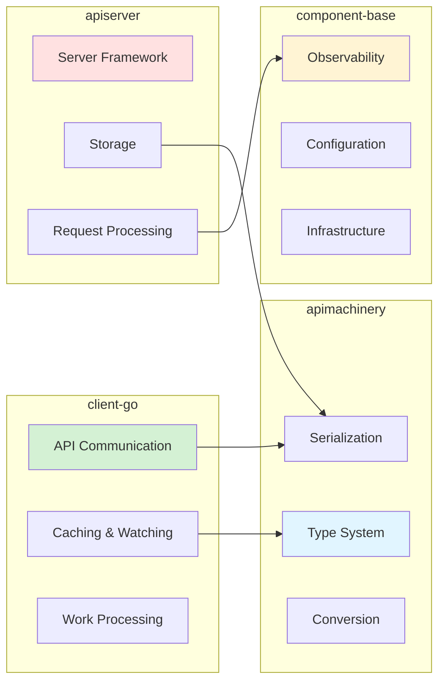

### 4. **Performance Optimization**

Multiple optimization strategies:

1. **Local Caching** (Informers)
   - Reduces API server load
   - Fast local queries via Listers
   - Watch for updates (not continuous polling)

2. **Efficient Serialization**
   - Protobuf for internal communication
   - JSON for external APIs
   - CBOR for newer versions

3. **Rate Limiting**
   - Client-side rate limiting
   - Workqueue rate limiting
   - Backoff for failed operations

4. **Batch Processing**
   - Workqueue batching
   - Informer resync batching
   - Storage batch operations

### 5. **Reliability and Fault Tolerance**

Built-in reliability mechanisms:

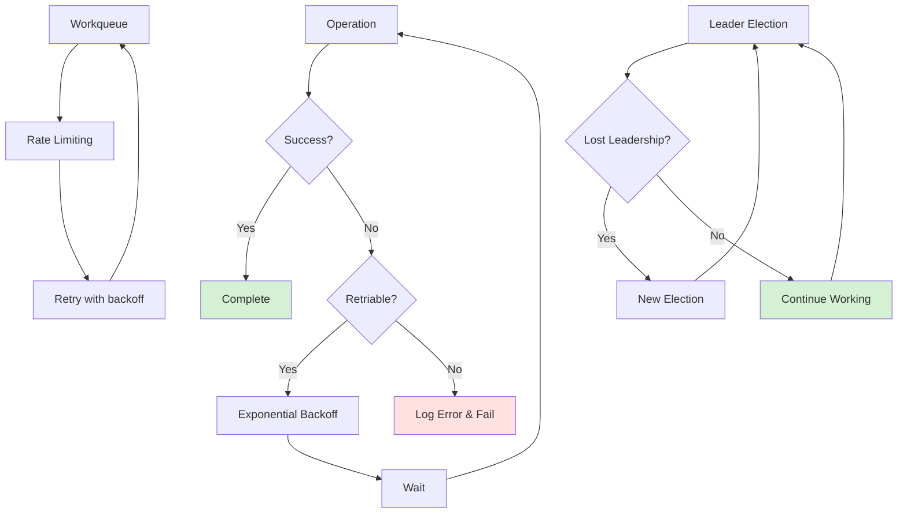

**Mechanisms**:
- Exponential backoff for retries
- Workqueue with rate limiting
- Leader election for high availability
- Watch reconnection with backoff
- Graceful degradation

### 6. **Extensibility**

Designed for extension:

- **Plugin Architecture**: Admission, authentication, authorization
- **Custom Metrics**: Register custom metrics
- **Feature Gates**: Gradual rollout of new features
- **Custom Resources**: Extend API with CRDs
- **Custom Controllers**: Use same patterns as built-in controllers

---

## Technology Stack

### Core Dependencies

| Category | Technology | Purpose | Used In |
|----------|-----------|---------|---------|
| **Language** | Go 1.21+ | Implementation language | All libraries |
| **HTTP** | net/http | HTTP client/server | rest, apiserver |
| **Serialization** | encoding/json, protobuf, CBOR | Wire formats | apimachinery |
| **Metrics** | Prometheus client | Observability | component-base |
| **Logging** | klog/v2 | Structured logging | All libraries |
| **Testing** | Go testing, testify | Unit and integration tests | All libraries |

### Library Dependencies

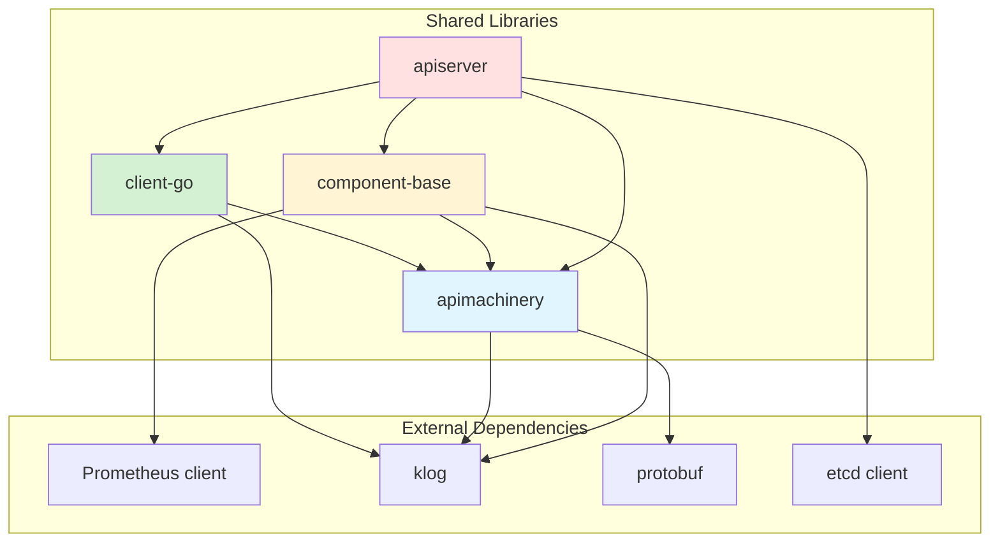

---

## Common Workflows

### 1. Controller Pattern with Informers and Workqueue

This is the most common pattern for building Kubernetes controllers:

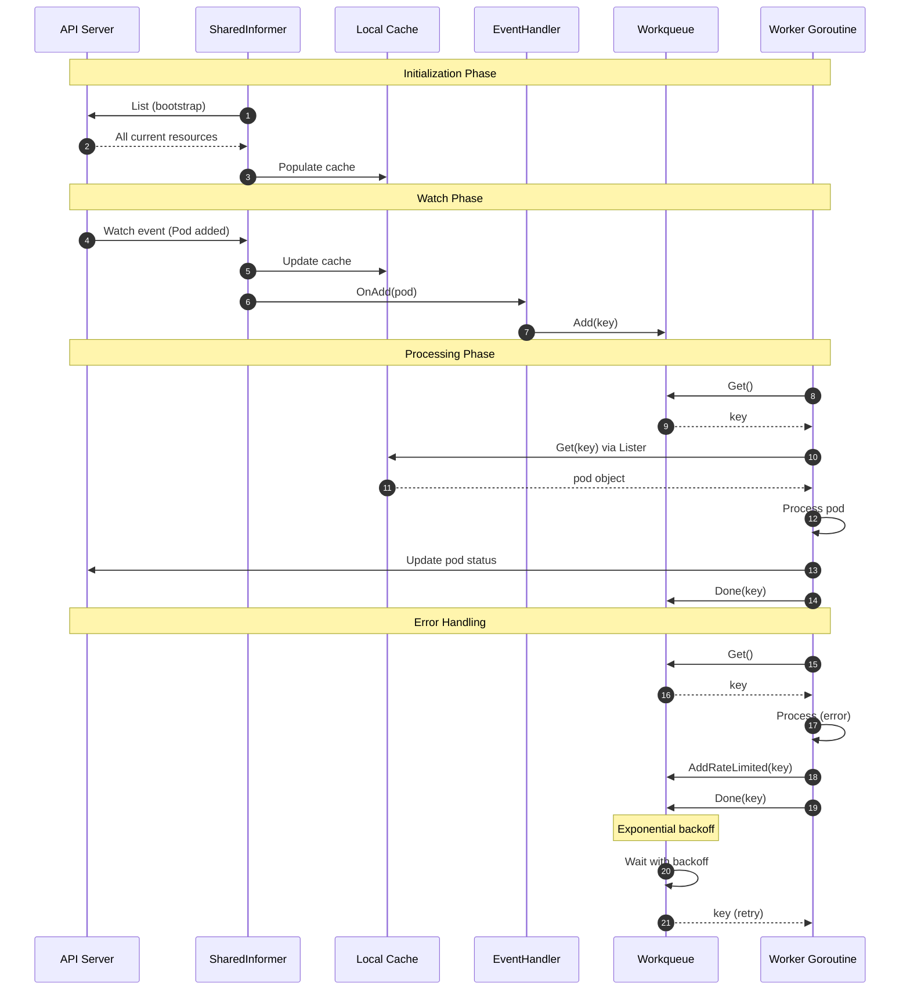

### 2. Leader Election for High Availability

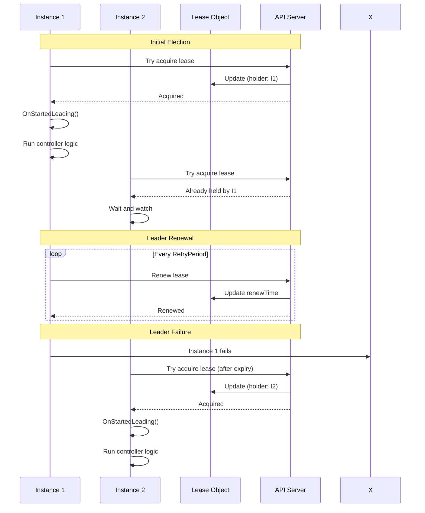

### 3. Type Registration and Serialization

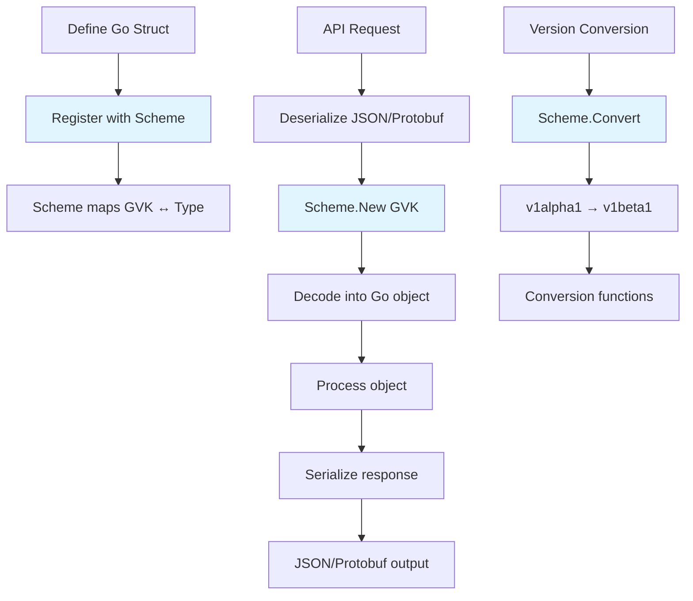

### 4. API Request Flow Through Shared Libraries

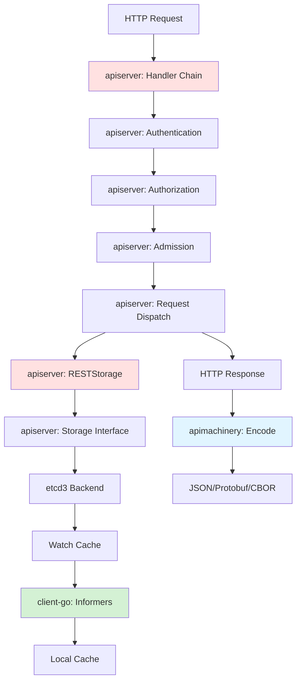

---

## Document Navigation

This architecture documentation is organized into 13 comprehensive documents:

### High-Level Overview (Document 1)
1. **Overview and Introduction** (this document)

### client-go Library (Documents 2-4)
2. **REST Clients and Discovery** - HTTP clients, content negotiation
3. **Informers and SharedInformers** - Watching and caching resources
4. **Workqueue and Leader Election** - Reliable processing and HA

### apimachinery Library (Documents 5-7)
5. **Runtime and Scheme** - Type system and registration
6. **Serialization and Conversion** - Encoding/decoding, version conversion
7. **Watch and Meta Types** - Watch mechanism, ObjectMeta, selectors

### component-base Library (Documents 8-9)
8. **Metrics and Observability** - Prometheus metrics, SLIs
9. **Config, Logs, and Feature Gates** - Configuration, logging, features

### apiserver Library (Documents 10-12)
10. **Server Framework and Config** - Generic API server, handlers
11. **Storage and Registry** - Storage abstraction, watch cache
12. **Admission, Authentication, and Authorization** - Request processing

### Integration and Patterns (Document 13)
13. **Common Patterns and Integration** - Controller pattern, best practices

---

## Key Insights and Design Decisions

### 1. Why Informers Instead of Direct API Calls?

**Decision**: Use informers with local caching instead of direct API queries.

**Rationale**:
- **Performance**: Local cache provides O(1) lookups vs O(n) API calls
- **API Server Load**: Reduces load by watching instead of polling
- **Consistency**: Watch mechanism guarantees eventual consistency
- **Network Efficiency**: Single watch connection vs multiple API calls

**Trade-off**: Memory usage for local cache vs reduced API server load

### 2. Why Workqueues with Rate Limiting?

**Decision**: Use workqueue with rate limiting instead of immediate retries.

**Rationale**:
- **Exponential Backoff**: Prevents overwhelming API server on errors
- **Fairness**: Multiple items processed fairly, not starved
- **Deduplication**: Same item added multiple times = processed once
- **Reliability**: Guarantees at-least-once processing

**Trade-off**: Slight delay in processing vs improved reliability

### 3. Why Multiple Serialization Formats?

**Decision**: Support JSON, Protobuf, YAML, and CBOR.

**Rationale**:
- **JSON**: Human-readable, external APIs
- **Protobuf**: Efficient for internal communication
- **YAML**: User-friendly for config files
- **CBOR**: Modern binary format (newer)

**Trade-off**: Complexity vs flexibility

### 4. Why Leader Election for Controllers?

**Decision**: Run multiple controller instances with leader election.

**Rationale**:
- **High Availability**: No single point of failure
- **Fast Failover**: New leader elected within seconds
- **Stateless**: Any instance can become leader
- **Simple Deployment**: Just run multiple replicas

**Trade-off**: Lease coordination overhead vs high availability

---

## Next Steps

Proceed to detailed library documentation:
- [02 - client-go: REST Clients and Discovery](./02-clientgo-rest-and-discovery.md)
- [03 - client-go: Informers and SharedInformers](./03-clientgo-informers.md)
- [04 - client-go: Workqueue and Leader Election](./04-clientgo-workqueue-and-leader-election.md)

---

**Document Status**: Complete
**Next Review**: Upon major shared library changes or Kubernetes version updates
