# Document 02: REST Clients and Discovery

**Part of**: Kubernetes Shared Libraries Architecture Documentation
**Related**: [Document 05 - Runtime and Scheme](./05-runtime-scheme.md), [Document 06 - Serialization](./06-serialization-conversion.md), [Document 07 - Watch](./07-watch-meta-types.md)
**Course Module**: Phase 1 - Type System Foundation (Document 4 of 4)

━━━━━━━━━━━━━━━━━━━━━━━━━━━━━━━━━━━━━━━━━━━━━━━━━━━━━━━━━━━━━━━━━━━━━━━━━━━━━━

## **📋 Table of Contents**

1. [Overview](#overview)
2. [RESTClient Architecture](#restclient-architecture)
3. [Client Configuration](#client-configuration)
4. [Request Builder Pattern](#request-builder-pattern)
5. [HTTP Request Execution](#http-request-execution)
6. [Content Negotiation](#content-negotiation)
7. [Rate Limiting](#rate-limiting)
8. [Backoff and Retry](#backoff-and-retry)
9. [Client Authentication](#client-authentication)
10. [Discovery Client](#discovery-client)
11. [Dynamic Client](#dynamic-client)
12. [Typed Clients](#typed-clients)
13. [Testing Patterns](#testing-patterns)
14. [Design Decisions](#design-decisions)
15. [Common Pitfalls](#common-pitfalls)

━━━━━━━━━━━━━━━━━━━━━━━━━━━━━━━━━━━━━━━━━━━━━━━━━━━━━━━━━━━━━━━━━━━━━━━━━━━━━━

## **# Overview**

### **Purpose**

The REST client is the **foundation** for all communication between Kubernetes clients and the API server. It provides:

- **HTTP Transport**: Low-level HTTP communication with the API server
- **Content Negotiation**: Automatic handling of JSON, YAML, Protobuf, CBOR
- **Rate Limiting**: Client-side throttling to protect the API server
- **Retry/Backoff**: Automatic retries with exponential backoff
- **Authentication**: Multiple authentication mechanisms (tokens, certs, exec)
- **Discovery**: API group and resource discovery

### **Why This Matters**

💡 **Aha Moment**: Every Kubernetes client operation - `kubectl get pods`, `client.CoreV1().Pods().List()`, informer watches - ultimately goes through the REST client. Understanding how it works is fundamental to building robust Kubernetes tools.

### **Client Hierarchy**

```mermaid
graph TB
    subgraph "Client Layers"
        App[Your Application]
        Typed[Typed Client<br/>clientset.CoreV1().Pods()]
        Dynamic[Dynamic Client<br/>Unstructured]
        REST[RESTClient]
        HTTP[HTTP Transport]
    end

    subgraph "API Server"
        API[Kubernetes API]
    end

    App --> Typed
    App --> Dynamic
    Typed --> REST
    Dynamic --> REST
    REST --> HTTP
    HTTP --> API

    style REST fill:#e1f5ff
    style Typed fill:#fff4e1
    style Dynamic fill:#fff4e1
```

### **Location in Codebase**

```bash
# REST client
staging/src/k8s.io/client-go/rest/
├── client.go              # RESTClient implementation
├── request.go             # Request builder
├── config.go              # Client configuration
└── transport/             # HTTP transport wrappers

# Discovery
staging/src/k8s.io/client-go/discovery/
└── discovery_client.go    # Discovery client

# Dynamic client
staging/src/k8s.io/client-go/dynamic/
└── simple.go              # Dynamic client

# Typed clients
staging/src/k8s.io/client-go/kubernetes/
└── clientset.go           # Generated typed clients
```

━━━━━━━━━━━━━━━━━━━━━━━━━━━━━━━━━━━━━━━━━━━━━━━━━━━━━━━━━━━━━━━━━━━━━━━━━━━━━━

## **# RESTClient Architecture**

### **RESTClient Structure**

**Location**: `staging/src/k8s.io/client-go/rest/client.go:86`

```go
// RESTClient imposes common Kubernetes API conventions on a set of
// resource paths.
type RESTClient struct {
    // base is the root URL for all invocations
    base *url.URL

    // versionedAPIPath is a path segment connecting base to resource root
    versionedAPIPath string

    // content describes how a RESTClient encodes and decodes responses
    content requestClientContentConfigProvider

    // creates BackoffManager for requests
    createBackoffMgr func() BackoffManagerWithContext

    // rateLimiter is shared among all requests
    rateLimiter flowcontrol.RateLimiter

    // warningHandler handles API server warnings
    warningHandler WarningHandlerWithContext

    // Client is the underlying HTTP client
    Client *http.Client
}
```

### **RESTClient Interface**

**Location**: `staging/src/k8s.io/client-go/rest/client.go:46`

```go
// Interface captures the set of operations for generically interacting
// with Kubernetes REST APIs.
type Interface interface {
    GetRateLimiter() flowcontrol.RateLimiter

    Verb(verb string) *Request
    Post() *Request
    Put() *Request
    Patch(pt types.PatchType) *Request
    Get() *Request
    Delete() *Request

    APIVersion() schema.GroupVersion
}
```

### **Core Responsibilities**

1. **URL Construction**: Build correct API server URLs
2. **Serialization**: Encode/decode objects using codecs
3. **HTTP Communication**: Execute HTTP requests
4. **Rate Limiting**: Throttle requests to protect API server
5. **Error Handling**: Convert HTTP errors to typed errors
6. **Retry Logic**: Automatic retries with backoff

### **RESTClient Creation**

```go
import (
    "k8s.io/client-go/rest"
    "k8s.io/client-go/tools/clientcmd"
)

func createRESTClient() (*rest.RESTClient, error) {
    // Load config from kubeconfig
    config, err := clientcmd.BuildConfigFromFlags("", "/path/to/kubeconfig")
    if err != nil {
        return nil, err
    }

    // Set API path and content config
    config.APIPath = "/api"
    config.GroupVersion = &v1.SchemeGroupVersion
    config.NegotiatedSerializer = scheme.Codecs

    // Create REST client
    return rest.RESTClientFor(config)
}
```

### **Architecture Diagram**

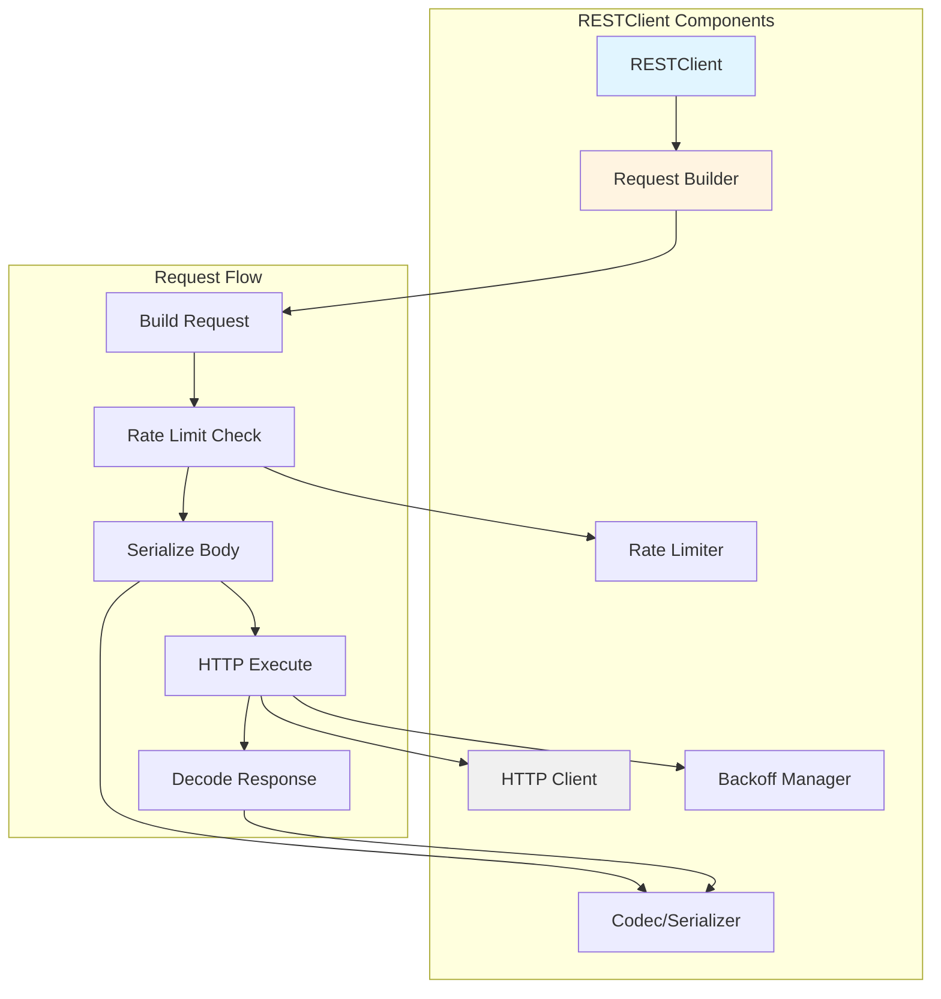

### **Request Lifecycle**

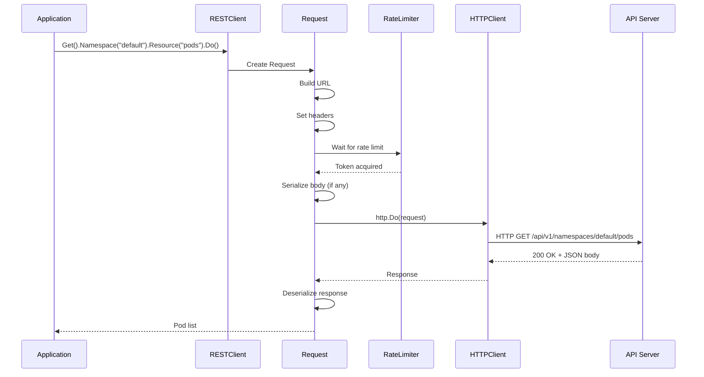

━━━━━━━━━━━━━━━━━━━━━━━━━━━━━━━━━━━━━━━━━━━━━━━━━━━━━━━━━━━━━━━━━━━━━━━━━━━━━━

## **# Client Configuration**

### **Config Structure**

**Location**: `staging/src/k8s.io/client-go/rest/config.go:55`

```go
// Config holds the common attributes that can be passed to a Kubernetes
// client on initialization.
type Config struct {
    // Host must be a host string, a host:port pair, or a URL to the base
    // of the apiserver
    Host string

    // APIPath is a sub-path that points to an API root
    APIPath string

    // ContentConfig contains settings for object transformation
    ContentConfig

    // Authentication
    Username string
    Password string `datapolicy:"password"`
    BearerToken string `datapolicy:"token"`
    BearerTokenFile string
    Impersonate ImpersonationConfig
    AuthProvider *clientcmdapi.AuthProviderConfig
    ExecProvider *clientcmdapi.ExecConfig

    // TLS settings
    TLSClientConfig

    // User agent for requests
    UserAgent string

    // HTTP transport configuration
    DisableCompression bool
    Transport http.RoundTripper
    WrapTransport transport.WrapperFunc

    // Rate limiting
    QPS float32      // Default: 5.0
    Burst int        // Default: 10
    RateLimiter flowcontrol.RateLimiter

    // Warning handler
    WarningHandler WarningHandlerWithContext

    // Timeout for requests
    Timeout time.Duration
}
```

### **Default Values**

**Location**: `staging/src/k8s.io/client-go/rest/config.go:47`

```go
const (
    DefaultQPS   float32 = 5.0   // 5 requests per second
    DefaultBurst int     = 10    // Burst up to 10 requests
)
```

### **Loading Configuration**

#### **From Kubeconfig File**

```go
import (
    "k8s.io/client-go/tools/clientcmd"
)

// Load from default kubeconfig location (~/.kube/config)
config, err := clientcmd.BuildConfigFromFlags("", "")

// Load from specific file
config, err := clientcmd.BuildConfigFromFlags("", "/path/to/kubeconfig")

// Load from explicit master URL and kubeconfig
config, err := clientcmd.BuildConfigFromFlags("https://k8s-api:6443", "/path/to/kubeconfig")
```

#### **In-Cluster Configuration**

```go
import (
    "k8s.io/client-go/rest"
)

// Automatically detects in-cluster configuration
// Reads: /var/run/secrets/kubernetes.io/serviceaccount/token
//        /var/run/secrets/kubernetes.io/serviceaccount/ca.crt
//        KUBERNETES_SERVICE_HOST, KUBERNETES_SERVICE_PORT
config, err := rest.InClusterConfig()
if err != nil {
    panic(err)
}
```

#### **Programmatic Configuration**

```go
config := &rest.Config{
    Host:            "https://k8s-api:6443",
    BearerToken:     "my-token",
    TLSClientConfig: rest.TLSClientConfig{
        CAFile: "/path/to/ca.crt",
    },
    QPS:   10.0,
    Burst: 20,
}
```

### **Configuration Sources Priority**

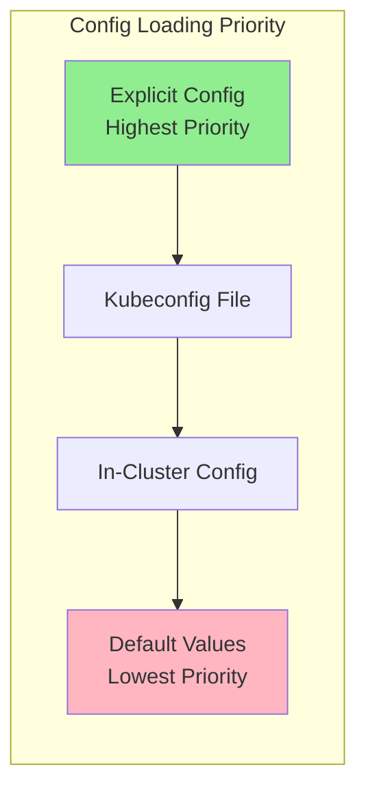

### **Config Example**

```go
func buildConfig() (*rest.Config, error) {
    // Try in-cluster first
    config, err := rest.InClusterConfig()
    if err == nil {
        return config, nil
    }

    // Fall back to kubeconfig
    kubeconfig := os.Getenv("KUBECONFIG")
    if kubeconfig == "" {
        kubeconfig = filepath.Join(os.Getenv("HOME"), ".kube", "config")
    }

    config, err = clientcmd.BuildConfigFromFlags("", kubeconfig)
    if err != nil {
        return nil, err
    }

    // Customize config
    config.QPS = 20.0
    config.Burst = 30
    config.Timeout = 30 * time.Second

    return config, nil
}
```

━━━━━━━━━━━━━━━━━━━━━━━━━━━━━━━━━━━━━━━━━━━━━━━━━━━━━━━━━━━━━━━━━━━━━━━━━━━━━━

## **# Request Builder Pattern**

### **Request Structure**

**Location**: `staging/src/k8s.io/client-go/rest/request.go:96`

```go
// Request allows for building up a request to a server in a chained fashion.
// Any errors are stored until the end of your call, so you only have to
// check once.
type Request struct {
    c *RESTClient

    contentConfig     ClientContentConfig
    contentTypeNotSet bool

    warningHandler WarningHandlerWithContext
    rateLimiter    flowcontrol.RateLimiter
    backoff        BackoffManagerWithContext
    timeout        time.Duration
    maxRetries     int

    // Generic components
    verb       string
    pathPrefix string
    subpath    string
    params     url.Values
    headers    http.Header

    // Kubernetes API conventions
    namespace    string
    namespaceSet bool
    resource     string
    resourceName string
    subresource  string

    // Output
    err error

    // Body (only one of body / bodyBytes may be set)
    body      io.Reader
    bodyBytes []byte

    retryFn requestRetryFunc
}
```

### **Builder Methods**

```go
type Request struct {
    // ... fields ...
}

// HTTP verb
func (r *Request) Verb(verb string) *Request
func (r *Request) Get() *Request
func (r *Request) Post() *Request
func (r *Request) Put() *Request
func (r *Request) Delete() *Request
func (r *Request) Patch(pt types.PatchType) *Request

// Resource specification
func (r *Request) Namespace(namespace string) *Request
func (r *Request) Resource(resource string) *Request
func (r *Request) Name(resourceName string) *Request
func (r *Request) SubResource(subresources ...string) *Request

// Query parameters
func (r *Request) Param(name, value string) *Request
func (r *Request) VersionedParams(obj runtime.Object, codec runtime.ParameterCodec) *Request

// Body
func (r *Request) Body(obj interface{}) *Request

// Execution
func (r *Request) Do(ctx context.Context) Result
func (r *Request) DoRaw(ctx context.Context) ([]byte, error)
func (r *Request) Stream(ctx context.Context) (io.ReadCloser, error)
func (r *Request) Watch(ctx context.Context) (watch.Interface, error)
```

### **Chained Request Building**

```go
// GET /api/v1/namespaces/default/pods
result := client.Get().
    Namespace("default").
    Resource("pods").
    Do(ctx)

// GET /api/v1/namespaces/default/pods/nginx
result := client.Get().
    Namespace("default").
    Resource("pods").
    Name("nginx").
    Do(ctx)

// GET /api/v1/namespaces/default/pods/nginx/log
result := client.Get().
    Namespace("default").
    Resource("pods").
    Name("nginx").
    SubResource("log").
    Do(ctx)

// GET /api/v1/namespaces/default/pods?labelSelector=app%3Dnginx
result := client.Get().
    Namespace("default").
    Resource("pods").
    Param("labelSelector", "app=nginx").
    Do(ctx)
```

### **URL Building**

```mermaid
graph LR
    Base[Base URL<br/>https://k8s:6443] --> Path[API Path<br/>/api/v1]
    Path --> NS{Namespaced?}
    NS -->|Yes| NSPath[/namespaces/{ns}]
    NS -->|No| Res
    NSPath --> Res[/{resource}]
    Res --> Name{Has Name?}
    Name -->|Yes| NamePath[/{name}]
    Name -->|No| Query
    NamePath --> Sub{Subresource?}
    Sub -->|Yes| SubPath[/{subresource}]
    Sub -->|No| Query
    SubPath --> Query[?{params}]
    Query --> Final[Final URL]

    style Final fill:#90EE90
```

### **Request Building Example**

```go
// Build complex request with parameters
import (
    metav1 "k8s.io/apimachinery/pkg/apis/meta/v1"
)

listOptions := metav1.ListOptions{
    LabelSelector: "app=nginx",
    Limit:         100,
    TimeoutSeconds: pointer.Int64(30),
}

result := client.Get().
    Namespace("production").
    Resource("pods").
    VersionedParams(&listOptions, scheme.ParameterCodec).
    Do(ctx)

// Resulting URL:
// GET /api/v1/namespaces/production/pods?labelSelector=app%3Dnginx&limit=100&timeoutSeconds=30
```

### **Error Accumulation**

💡 **Design Decision**: The Request builder **accumulates errors** during construction and only returns them at execution time. This allows for clean chaining without error checking at each step.

```go
// Errors accumulated, not returned immediately
request := client.Get().
    Namespace("").      // Error: empty namespace
    Resource("").       // Error: empty resource
    Name("pod-name")

// Errors returned only when executing
err := request.Do(ctx).Error()
if err != nil {
    // Both errors are reported here
    fmt.Printf("Error: %v\n", err)
}
```

### **Request Execution**

```go
// Do() returns a Result that can be decoded
var pod v1.Pod
err := client.Get().
    Namespace("default").
    Resource("pods").
    Name("nginx").
    Do(ctx).
    Into(&pod)

// DoRaw() returns raw bytes
bytes, err := client.Get().
    Namespace("default").
    Resource("pods").
    Do(ctx).
    DoRaw(ctx)

// Stream() for streaming responses
stream, err := client.Get().
    Namespace("default").
    Resource("pods").
    Name("nginx").
    SubResource("log").
    Stream(ctx)
defer stream.Close()

io.Copy(os.Stdout, stream)
```

━━━━━━━━━━━━━━━━━━━━━━━━━━━━━━━━━━━━━━━━━━━━━━━━━━━━━━━━━━━━━━━━━━━━━━━━━━━━━━

## **# HTTP Request Execution**

### **Request Execution Flow**

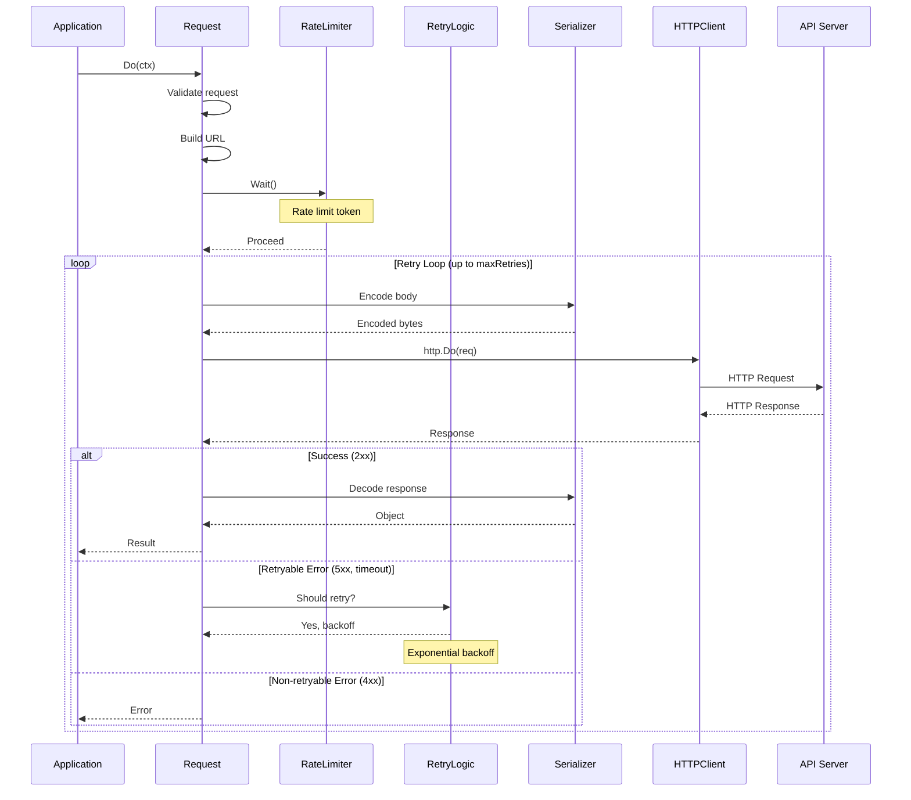

### **Do() Implementation Details**

```go
func (r *Request) Do(ctx context.Context) Result {
    // 1. Validate request
    if r.err != nil {
        return Result{err: r.err}
    }

    // 2. Build HTTP request
    req, err := r.newHTTPRequest(ctx)
    if err != nil {
        return Result{err: err}
    }

    // 3. Rate limiting
    if r.rateLimiter != nil {
        r.rateLimiter.Wait(ctx)
    }

    // 4. Execute with retries
    var body []byte
    for i := 0; i <= r.maxRetries; i++ {
        resp, err := r.c.Client.Do(req)
        if err != nil {
            // Network error, retry
            if i < r.maxRetries {
                r.backoff.Sleep(ctx)
                continue
            }
            return Result{err: err}
        }

        body, err = ioutil.ReadAll(resp.Body)
        resp.Body.Close()

        // Check status code
        if resp.StatusCode >= 200 && resp.StatusCode < 300 {
            // Success!
            return Result{
                body:        body,
                contentType: resp.Header.Get("Content-Type"),
                statusCode:  resp.StatusCode,
            }
        }

        // Check if retryable
        if isRetryableHTTPStatus(resp.StatusCode) && i < r.maxRetries {
            r.backoff.Sleep(ctx)
            continue
        }

        // Non-retryable error
        return Result{
            body:       body,
            statusCode: resp.StatusCode,
            err:        errors.FromObject(body),
        }
    }

    return Result{err: fmt.Errorf("max retries exceeded")}
}
```

### **Result Decoding**

```go
type Result struct {
    body        []byte
    contentType string
    statusCode  int
    err         error
    codec       runtime.Codec
}

// Into decodes the response into the provided object
func (r Result) Into(obj runtime.Object) error {
    if r.err != nil {
        return r.err
    }

    // Decode using codec
    _, _, err := r.codec.Decode(r.body, nil, obj)
    return err
}

// Raw returns the raw response bytes
func (r Result) Raw() ([]byte, error) {
    return r.body, r.err
}

// Error returns any error
func (r Result) Error() error {
    return r.err
}

// StatusCode returns HTTP status code
func (r Result) StatusCode(statusCode *int) Result {
    *statusCode = r.statusCode
    return r
}
```

━━━━━━━━━━━━━━━━━━━━━━━━━━━━━━━━━━━━━━━━━━━━━━━━━━━━━━━━━━━━━━━━━━━━━━━━━━━━━━

## **# Content Negotiation**

### **Overview**

Content negotiation allows clients and servers to agree on the **serialization format** for API communication.

### **Supported Formats**

| Format | Content-Type | Use Case |
|--------|--------------|----------|
| **JSON** | `application/json` | Default, human-readable |
| **YAML** | `application/yaml` | kubectl apply -f |
| **Protobuf** | `application/vnd.kubernetes.protobuf` | Efficient, smaller size |
| **CBOR** | `application/cbor` | Efficient, binary (new!) |

### **ClientContentConfig**

**Location**: `staging/src/k8s.io/client-go/rest/client.go:61`

```go
type ClientContentConfig struct {
    // AcceptContentTypes specifies types the client will accept
    // If not set, ContentType is used for Accept header
    AcceptContentTypes string

    // ContentType specifies the wire format for communication
    // Default: "application/json"
    ContentType string

    // GroupVersion is the API version to talk to
    GroupVersion schema.GroupVersion

    // Negotiator provides encoders and decoders for multiple formats
    Negotiator runtime.ClientNegotiator
}
```

### **Content Negotiation Flow**

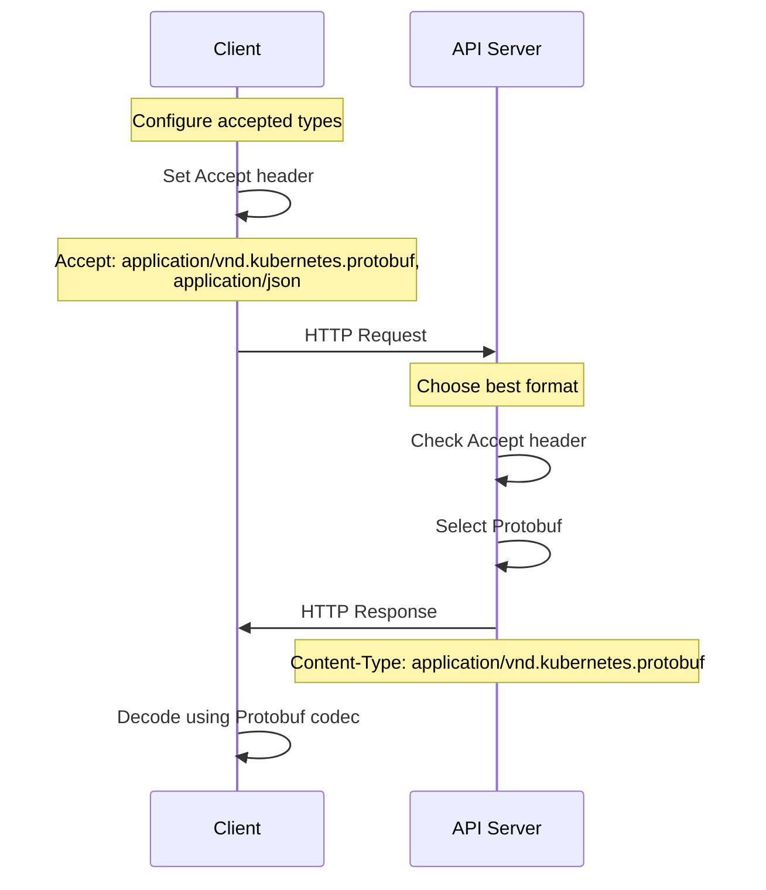

### **Configuring Content Types**

```go
// Prefer Protobuf, fall back to JSON
config := &rest.Config{
    Host: "https://k8s-api:6443",
    ContentConfig: rest.ContentConfig{
        // Send requests as JSON
        ContentType: "application/json",

        // Accept Protobuf or JSON responses
        AcceptContentTypes: "application/vnd.kubernetes.protobuf,application/json",

        GroupVersion:         &v1.SchemeGroupVersion,
        NegotiatedSerializer: scheme.Codecs,
    },
}

client, _ := rest.RESTClientFor(config)
```

### **Format Comparison**

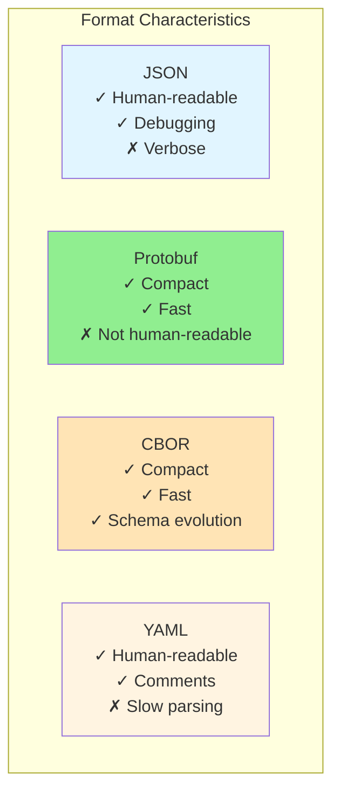

### **Size Comparison Example**

```bash
# Same pod in different formats
Pod in JSON:      1,245 bytes
Pod in YAML:      1,180 bytes
Pod in Protobuf:    687 bytes  (45% smaller!)
Pod in CBOR:        745 bytes  (40% smaller)
```

### **When to Use Each Format**

**JSON**:
- Default for most use cases
- Debugging and development
- Human-readable logs

**Protobuf**:
- High-performance controllers
- Watch streams (less bandwidth)
- Large list operations

**CBOR**:
- New, emerging format
- Combines efficiency of Protobuf with schema flexibility
- Future-proof

**YAML**:
- kubectl apply -f manifests
- GitOps configurations
- Documentation examples

━━━━━━━━━━━━━━━━━━━━━━━━━━━━━━━━━━━━━━━━━━━━━━━━━━━━━━━━━━━━━━━━━━━━━━━━━━━━━━

## **# Rate Limiting**

### **Overview**

Rate limiting **protects the API server** from being overwhelmed by too many requests from a single client.

💡 **Aha Moment**: Without rate limiting, a misbehaving controller with a tight loop could send thousands of requests per second, degrading the API server for all users. Client-side rate limiting prevents this.

### **RateLimiter Interface**

**Location**: `staging/src/k8s.io/client-go/util/flowcontrol/throttle.go:39`

```go
type RateLimiter interface {
    PassiveRateLimiter

    // Accept blocks until a token is available
    Accept()

    // Wait blocks until a token is available or context is done
    Wait(ctx context.Context) error
}

type PassiveRateLimiter interface {
    // TryAccept returns true if a token is available now
    TryAccept() bool

    // Stop frees resources
    Stop()

    // QPS returns queries per second limit
    QPS() float32
}
```

### **Token Bucket Algorithm**

Rate limiting uses the **token bucket** algorithm:

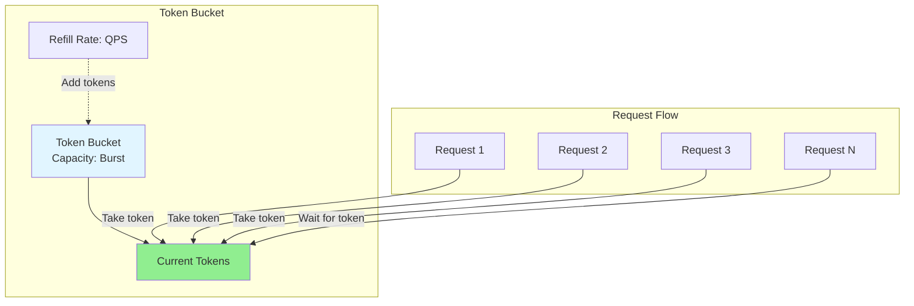

### **Token Bucket Parameters**

```go
// QPS: Queries Per Second (rate of refill)
// Burst: Maximum tokens in bucket (allows bursts)

// Example: QPS=5, Burst=10
// - Bucket refills at 5 tokens/second
// - Can accumulate up to 10 tokens
// - Can burst 10 requests immediately
// - Then limited to 5 requests/second
```

### **Configuration**

```go
import (
    "k8s.io/client-go/rest"
    "k8s.io/client-go/util/flowcontrol"
)

// Option 1: Config QPS and Burst
config := &rest.Config{
    Host:  "https://k8s-api:6443",
    QPS:   10.0,  // 10 requests per second
    Burst: 20,    // Burst up to 20
}

// Option 2: Custom RateLimiter
rateLimiter := flowcontrol.NewTokenBucketRateLimiter(
    10.0,  // QPS
    20,    // Burst
)

config := &rest.Config{
    Host:        "https://k8s-api:6443",
    RateLimiter: rateLimiter,
}
```

### **Rate Limiting Behavior**

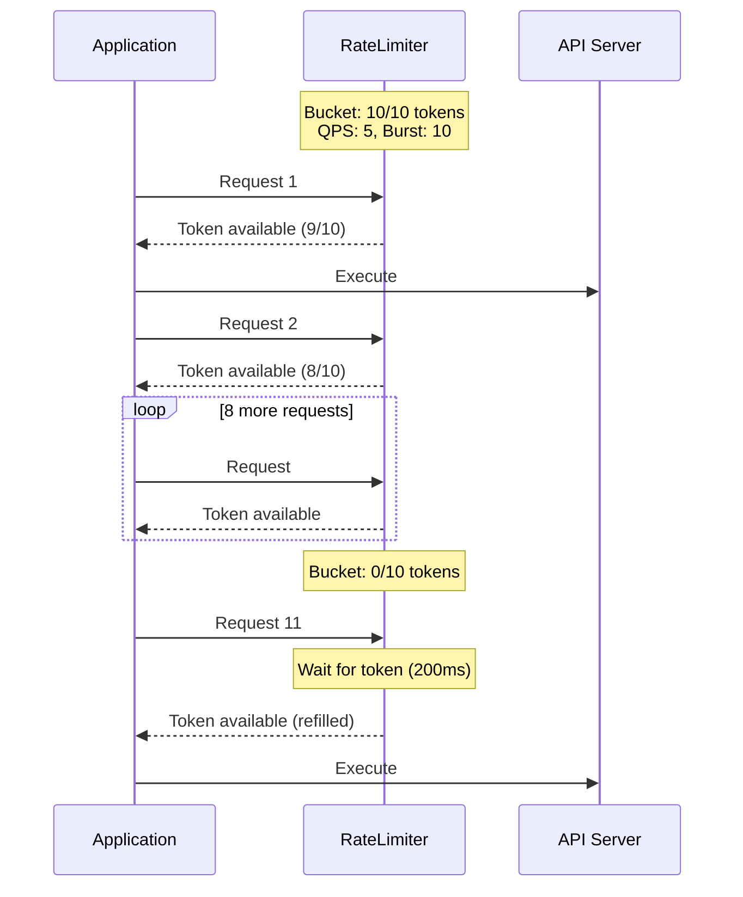

### **Disabling Rate Limiting**

```go
// Disable rate limiting (use with caution!)
config := &rest.Config{
    Host: "https://k8s-api:6443",
    QPS:  -1,  // Negative QPS disables rate limiting
}

// Or provide no-op rate limiter
config.RateLimiter = flowcontrol.NewFakeNeverRateLimiter()
```

### **Rate Limit Metrics**

```go
// Monitor rate limiting
import (
    "k8s.io/client-go/util/flowcontrol"
)

rateLimiter := flowcontrol.NewTokenBucketRateLimiter(10.0, 20)

// Check if token is available without blocking
if rateLimiter.TryAccept() {
    fmt.Println("Token available")
} else {
    fmt.Println("Rate limited")
}

// Get current QPS
fmt.Printf("QPS: %f\n", rateLimiter.QPS())
```

### **Real-World Example**

```go
func processPodsWithRateLimit(client *kubernetes.Clientset) {
    // Create client with rate limiting
    config, _ := rest.InClusterConfig()
    config.QPS = 20.0   // 20 req/sec
    config.Burst = 40   // Burst to 40

    client, _ := kubernetes.NewForConfig(config)

    for i := 0; i < 100; i++ {
        // Rate limiter automatically throttles
        pod, err := client.CoreV1().Pods("default").Get(
            context.Background(),
            fmt.Sprintf("pod-%d", i),
            metav1.GetOptions{},
        )

        if err != nil {
            continue
        }

        fmt.Printf("Got pod: %s\n", pod.Name)
    }
    // First 40 requests execute immediately (burst)
    // Remaining 60 throttled to 20/sec (takes ~3 seconds)
}
```

━━━━━━━━━━━━━━━━━━━━━━━━━━━━━━━━━━━━━━━━━━━━━━━━━━━━━━━━━━━━━━━━━━━━━━━━━━━━━━

## **# Backoff and Retry**

### **Overview**

When requests fail due to transient errors (network issues, server overload), the client should **retry with exponential backoff** instead of immediate retry.

### **Backoff Manager**

```go
type BackoffManagerWithContext interface {
    // UpdateBackoff updates the backoff state for a given item
    UpdateBackoff(id any, backoff time.Duration, max int)

    // Sleep sleeps for the backoff duration
    Sleep(ctx context.Context, id any) bool

    // ResetSleep clears backoff for an item
    ResetSleep(id any)

    // DeleteEntry removes an item from backoff tracking
    DeleteEntry(id any)

    // BackoffFor returns current backoff duration for an item
    BackoffFor(id any) time.Duration
}
```

### **Exponential Backoff**

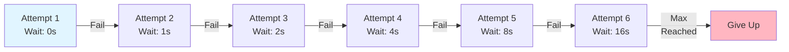

### **Exponential Backoff Formula**

```
wait_time = base_delay * (2 ^ attempt) + jitter

Examples (base_delay = 1s, jitter disabled):
Attempt 1: 1s  * 2^0 = 1s
Attempt 2: 1s  * 2^1 = 2s
Attempt 3: 1s  * 2^2 = 4s
Attempt 4: 1s  * 2^3 = 8s
Attempt 5: 1s  * 2^4 = 16s (capped at max, e.g., 30s)
```

### **Retry Configuration**

```go
// Environment variables for backoff configuration
const (
    envBackoffBase     = "KUBE_CLIENT_BACKOFF_BASE"      // Base delay (default: 1s)
    envBackoffDuration = "KUBE_CLIENT_BACKOFF_DURATION"  // Max duration (default: 120s)
)

// Example:
os.Setenv("KUBE_CLIENT_BACKOFF_BASE", "2")      // 2 second base
os.Setenv("KUBE_CLIENT_BACKOFF_DURATION", "60") // 60 second max
```

### **Retryable vs Non-Retryable Errors**

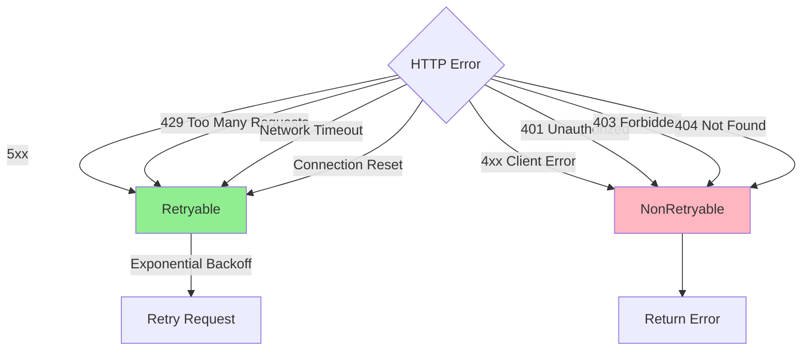

### **Retry Logic**

```go
func (r *Request) Do(ctx context.Context) Result {
    var lastErr error

    for attempt := 0; attempt <= r.maxRetries; attempt++ {
        if attempt > 0 {
            // Wait with exponential backoff
            r.backoff.Sleep(ctx)
        }

        resp, err := r.c.Client.Do(r.httpRequest)
        if err != nil {
            // Network error - retry
            lastErr = err
            continue
        }

        body, _ := ioutil.ReadAll(resp.Body)
        resp.Body.Close()

        switch {
        case resp.StatusCode >= 200 && resp.StatusCode < 300:
            // Success!
            return Result{body: body, statusCode: resp.StatusCode}

        case isRetryableStatus(resp.StatusCode):
            // 5xx, 429 - retry
            lastErr = fmt.Errorf("server error: %d", resp.StatusCode)
            continue

        default:
            // 4xx - don't retry
            return Result{
                body:       body,
                statusCode: resp.StatusCode,
                err:        errors.FromObject(body),
            }
        }
    }

    return Result{err: fmt.Errorf("max retries exceeded: %w", lastErr)}
}

func isRetryableStatus(statusCode int) bool {
    return statusCode >= 500 ||                // Server errors
           statusCode == 429 ||                // Too Many Requests
           statusCode == http.StatusTooManyRequests
}
```

### **Jitter**

💡 **Design Decision**: Add **jitter** (random variation) to backoff to prevent **thundering herd** problem.

```go
// Without jitter:
// Multiple clients retry at exactly the same time
// Time: 0s, 1s, 2s, 4s, 8s, 16s (all clients synchronized)

// With jitter:
// Each client adds random 0-50% variation
// Client 1: 0s, 1.2s, 2.3s, 4.8s, 7.9s
// Client 2: 0s, 0.8s, 1.7s, 4.1s, 8.4s
// Client 3: 0s, 1.4s, 2.9s, 3.6s, 8.1s
```

━━━━━━━━━━━━━━━━━━━━━━━━━━━━━━━━━━━━━━━━━━━━━━━━━━━━━━━━━━━━━━━━━━━━━━━━━━━━━━

## **# Client Authentication**

### **Overview**

Kubernetes clients support multiple authentication methods:

1. **Bearer Token**: Static token or service account token
2. **Client Certificates**: mTLS with client cert
3. **Basic Auth**: Username/password (deprecated)
4. **Exec Plugin**: External command for token generation
5. **Auth Provider**: Cloud provider authentication (GCP, Azure, AWS)

### **Authentication Methods**

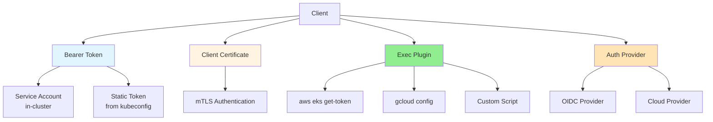

### **Bearer Token Authentication**

#### **Service Account Token (In-Cluster)**

```go
// Automatically uses service account token
config, err := rest.InClusterConfig()

// Reads from:
// /var/run/secrets/kubernetes.io/serviceaccount/token
// /var/run/secrets/kubernetes.io/serviceaccount/ca.crt
```

#### **Static Token (Kubeconfig)**

```go
config := &rest.Config{
    Host:        "https://k8s-api:6443",
    BearerToken: "my-static-token",
    TLSClientConfig: rest.TLSClientConfig{
        CAFile: "/path/to/ca.crt",
    },
}
```

#### **Token File**

```go
config := &rest.Config{
    Host:            "https://k8s-api:6443",
    BearerTokenFile: "/var/run/secrets/token",  // Re-read periodically
}
```

### **Client Certificate Authentication**

```go
config := &rest.Config{
    Host: "https://k8s-api:6443",
    TLSClientConfig: rest.TLSClientConfig{
        CertFile: "/path/to/client.crt",
        KeyFile:  "/path/to/client.key",
        CAFile:   "/path/to/ca.crt",
    },
}

// Or provide cert data directly
certData, _ := ioutil.ReadFile("/path/to/client.crt")
keyData, _ := ioutil.ReadFile("/path/to/client.key")
caData, _ := ioutil.ReadFile("/path/to/ca.crt")

config := &rest.Config{
    Host: "https://k8s-api:6443",
    TLSClientConfig: rest.TLSClientConfig{
        CertData: certData,
        KeyData:  keyData,
        CAData:   caData,
    },
}
```

### **Exec Plugin Authentication**

Kubeconfig with exec plugin:

```yaml
apiVersion: v1
kind: Config
users:
- name: my-user
  user:
    exec:
      apiVersion: client.authentication.k8s.io/v1beta1
      command: aws
      args:
      - eks
      - get-token
      - --cluster-name
      - my-cluster
      env:
      - name: AWS_PROFILE
        value: my-profile
```

Client automatically executes command:

```go
// Config loaded from kubeconfig
config, _ := clientcmd.BuildConfigFromFlags("", kubeconfig)

// Exec plugin is invoked automatically before each request
// Returns:
// {
//   "apiVersion": "client.authentication.k8s.io/v1beta1",
//   "kind": "ExecCredential",
//   "status": {
//     "token": "k8s-aws-v1.xxx",
//     "expirationTimestamp": "2024-01-01T12:00:00Z"
//   }
// }
```

### **Impersonation**

```go
config := &rest.Config{
    Host:        "https://k8s-api:6443",
    BearerToken: "admin-token",
    Impersonate: rest.ImpersonationConfig{
        UserName: "user@example.com",
        Groups:   []string{"developers", "viewers"},
        Extra: map[string][]string{
            "project": {"myproject"},
        },
    },
}

// Requests include headers:
// Impersonate-User: user@example.com
// Impersonate-Group: developers
// Impersonate-Group: viewers
// Impersonate-Extra-Project: myproject
```

### **Authentication Flow**

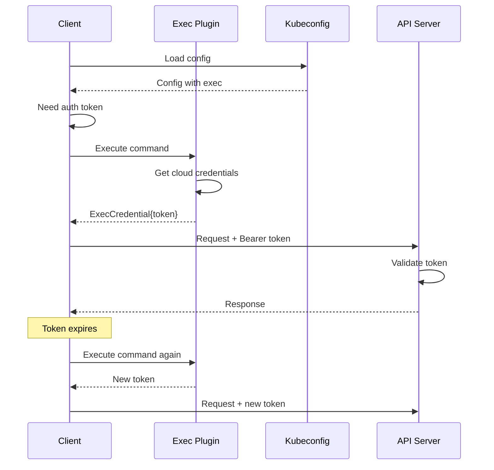

━━━━━━━━━━━━━━━━━━━━━━━━━━━━━━━━━━━━━━━━━━━━━━━━━━━━━━━━━━━━━━━━━━━━━━━━━━━━━━

## **# Discovery Client**

### **Overview**

The Discovery client allows clients to **discover available API groups and resources** dynamically.

💡 **Aha Moment**: How does `kubectl api-resources` know what resources are available? It uses the Discovery client to query the API server!

### **DiscoveryInterface**

**Location**: `staging/src/k8s.io/client-go/discovery/discovery_client.go:78`

```go
type DiscoveryInterface interface {
    RESTClient() restclient.Interface

    ServerGroupsInterface
    ServerResourcesInterface
    ServerVersionInterface
    OpenAPISchemaInterface
    OpenAPIV3SchemaInterface

    WithLegacy() DiscoveryInterface
}

type ServerGroupsInterface interface {
    ServerGroups() (*metav1.APIGroupList, error)
}

type ServerResourcesInterface interface {
    ServerResourcesForGroupVersion(groupVersion string) (*metav1.APIResourceList, error)
    ServerGroupsAndResources() ([]*metav1.APIGroup, []*metav1.APIResourceList, error)
    ServerPreferredResources() ([]*metav1.APIResourceList, error)
    ServerPreferredNamespacedResources() ([]*metav1.APIResourceList, error)
}

type ServerVersionInterface interface {
    ServerVersion() (*version.Info, error)
}
```

### **Discovery Usage**

```go
import (
    "k8s.io/client-go/discovery"
    "k8s.io/client-go/tools/clientcmd"
)

func discoverAPIs() {
    config, _ := clientcmd.BuildConfigFromFlags("", kubeconfig)
    discoveryClient, _ := discovery.NewDiscoveryClientForConfig(config)

    // Get server version
    version, _ := discoveryClient.ServerVersion()
    fmt.Printf("Server version: %s\n", version.GitVersion)

    // Get all API groups
    groups, _ := discoveryClient.ServerGroups()
    for _, group := range groups.Groups {
        fmt.Printf("API Group: %s\n", group.Name)
        for _, version := range group.Versions {
            fmt.Printf("  Version: %s\n", version.Version)
        }
    }

    // Get resources for a specific API version
    resources, _ := discoveryClient.ServerResourcesForGroupVersion("apps/v1")
    for _, resource := range resources.APIResources {
        fmt.Printf("Resource: %s (Kind: %s)\n", resource.Name, resource.Kind)
        fmt.Printf("  Namespaced: %v\n", resource.Namespaced)
        fmt.Printf("  Verbs: %v\n", resource.Verbs)
    }
}
```

### **API Discovery Endpoints**

```bash
# Discover API groups
GET /apis
{
  "groups": [
    {
      "name": "apps",
      "versions": [
        {"groupVersion": "apps/v1", "version": "v1"},
        {"groupVersion": "apps/v1beta2", "version": "v1beta2"}
      ],
      "preferredVersion": {"groupVersion": "apps/v1", "version": "v1"}
    }
  ]
}

# Discover resources in API group
GET /apis/apps/v1
{
  "groupVersion": "apps/v1",
  "resources": [
    {
      "name": "deployments",
      "singularName": "deployment",
      "namespaced": true,
      "kind": "Deployment",
      "verbs": ["create", "delete", "get", "list", "patch", "update", "watch"]
    }
  ]
}
```

### **Cached Discovery**

```go
import (
    "k8s.io/client-go/discovery/cached/disk"
    "k8s.io/client-go/discovery/cached/memory"
)

// Memory-cached discovery (cache in memory)
memCacheClient := memory.NewMemCacheClient(discoveryClient)

// Disk-cached discovery (cache in ~/.kube/cache)
diskCacheClient, _ := disk.NewCachedDiscoveryClientForConfig(
    config,
    "/home/user/.kube/cache",
    "",
    10*time.Minute,  // Cache TTL
)

// Use cached client
resources, _ := diskCacheClient.ServerPreferredResources()
```

### **Discovery Use Cases**

1. **kubectl**: Discover resources for `kubectl api-resources`
2. **Dynamic Clients**: Determine resource schema dynamically
3. **Custom Controllers**: Discover CRDs
4. **CLI Tools**: Auto-complete resource names

━━━━━━━━━━━━━━━━━━━━━━━━━━━━━━━━━━━━━━━━━━━━━━━━━━━━━━━━━━━━━━━━━━━━━━━━━━━━━━

## **# Dynamic Client**

### **Overview**

The dynamic client allows working with **any Kubernetes resource** without compile-time knowledge of its schema.

### **When to Use Dynamic Client**

**Use Dynamic Client**:
- Working with CRDs unknown at compile time
- Building generic tools (kubectl, controller-runtime)
- Runtime resource discovery

**Use Typed Client**:
- Known resource types (Pods, Deployments)
- Type safety and autocompletion
- Better performance

### **Dynamic Client Interface**

```go
import (
    "k8s.io/client-go/dynamic"
    "k8s.io/apimachinery/pkg/apis/meta/v1/unstructured"
)

type Interface interface {
    Resource(resource schema.GroupVersionResource) NamespaceableResourceInterface
}

type ResourceInterface interface {
    Create(ctx context.Context, obj *unstructured.Unstructured, options metav1.CreateOptions) (*unstructured.Unstructured, error)
    Update(ctx context.Context, obj *unstructured.Unstructured, options metav1.UpdateOptions) (*unstructured.Unstructured, error)
    Delete(ctx context.Context, name string, options metav1.DeleteOptions) error
    Get(ctx context.Context, name string, options metav1.GetOptions) (*unstructured.Unstructured, error)
    List(ctx context.Context, opts metav1.ListOptions) (*unstructured.UnstructuredList, error)
    Watch(ctx context.Context, opts metav1.ListOptions) (watch.Interface, error)
}
```

### **Dynamic Client Usage**

```go
import (
    "k8s.io/apimachinery/pkg/runtime/schema"
    "k8s.io/client-go/dynamic"
)

// Create dynamic client
config, _ := clientcmd.BuildConfigFromFlags("", kubeconfig)
dynClient, _ := dynamic.NewForConfig(config)

// Define GVR (GroupVersionResource)
podGVR := schema.GroupVersionResource{
    Group:    "",      // Core API group
    Version:  "v1",
    Resource: "pods",
}

// List pods using dynamic client
list, _ := dynClient.Resource(podGVR).
    Namespace("default").
    List(context.Background(), metav1.ListOptions{})

for _, item := range list.Items {
    // item is *unstructured.Unstructured
    name, _, _ := unstructured.NestedString(item.Object, "metadata", "name")
    fmt.Printf("Pod: %s\n", name)
}
```

### **Unstructured Objects**

```go
import (
    "k8s.io/apimachinery/pkg/apis/meta/v1/unstructured"
)

// Create unstructured pod
pod := &unstructured.Unstructured{
    Object: map[string]interface{}{
        "apiVersion": "v1",
        "kind":       "Pod",
        "metadata": map[string]interface{}{
            "name":      "nginx",
            "namespace": "default",
        },
        "spec": map[string]interface{}{
            "containers": []interface{}{
                map[string]interface{}{
                    "name":  "nginx",
                    "image": "nginx:1.14",
                },
            },
        },
    },
}

// Create pod
created, _ := dynClient.Resource(podGVR).
    Namespace("default").
    Create(context.Background(), pod, metav1.CreateOptions{})

// Access fields
name, _, _ := unstructured.NestedString(created.Object, "metadata", "name")
image, _, _ := unstructured.NestedString(created.Object, "spec", "containers", "[0]", "image")
```

━━━━━━━━━━━━━━━━━━━━━━━━━━━━━━━━━━━━━━━━━━━━━━━━━━━━━━━━━━━━━━━━━━━━━━━━━━━━━━

## **# Typed Clients**

### **Overview**

Typed clients provide **strongly-typed, generated clients** for Kubernetes resources.

### **Clientset Structure**

```go
import (
    "k8s.io/client-go/kubernetes"
)

type Clientset struct {
    *discovery.DiscoveryClient

    // Core API group
    coreV1 *corev1.CoreV1Client

    // Apps API group
    appsV1      *appsv1.AppsV1Client
    appsV1beta1 *appsv1beta1.AppsV1beta1Client

    // Batch API group
    batchV1 *batchv1.BatchV1Client

    // ... other API groups ...
}

func (c *Clientset) CoreV1() corev1.CoreV1Interface
func (c *Clientset) AppsV1() appsv1.AppsV1Interface
func (c *Clientset) BatchV1() batchv1.BatchV1Interface
```

### **Typed Client Usage**

```go
import (
    "k8s.io/client-go/kubernetes"
    metav1 "k8s.io/apimachinery/pkg/apis/meta/v1"
)

// Create typed clientset
config, _ := clientcmd.BuildConfigFromFlags("", kubeconfig)
clientset, _ := kubernetes.NewForConfig(config)

// List pods (strongly typed)
pods, _ := clientset.CoreV1().Pods("default").List(
    context.Background(),
    metav1.ListOptions{},
)

for _, pod := range pods.Items {
    // pod is *v1.Pod (strongly typed)
    fmt.Printf("Pod: %s, Image: %s\n",
        pod.Name,
        pod.Spec.Containers[0].Image,
    )
}

// Create deployment
deployment := &appsv1.Deployment{
    ObjectMeta: metav1.ObjectMeta{
        Name: "nginx",
    },
    Spec: appsv1.DeploymentSpec{
        Replicas: pointer.Int32(3),
        Selector: &metav1.LabelSelector{
            MatchLabels: map[string]string{"app": "nginx"},
        },
        Template: v1.PodTemplateSpec{
            ObjectMeta: metav1.ObjectMeta{
                Labels: map[string]string{"app": "nginx"},
            },
            Spec: v1.PodSpec{
                Containers: []v1.Container{
                    {
                        Name:  "nginx",
                        Image: "nginx:1.14",
                    },
                },
            },
        },
    },
}

created, _ := clientset.AppsV1().Deployments("default").Create(
    context.Background(),
    deployment,
    metav1.CreateOptions{},
)
```

### **Client Hierarchy**

```
Clientset
├── CoreV1()
│   ├── Pods(namespace)
│   ├── Services(namespace)
│   ├── ConfigMaps(namespace)
│   └── Nodes()
├── AppsV1()
│   ├── Deployments(namespace)
│   ├── StatefulSets(namespace)
│   └── DaemonSets(namespace)
└── BatchV1()
    ├── Jobs(namespace)
    └── CronJobs(namespace)
```

━━━━━━━━━━━━━━━━━━━━━━━━━━━━━━━━━━━━━━━━━━━━━━━━━━━━━━━━━━━━━━━━━━━━━━━━━━━━━━

## **# Testing Patterns**

### **Fake Clients**

```go
import (
    "k8s.io/client-go/kubernetes/fake"
)

func TestPodListing(t *testing.T) {
    // Create fake clientset
    client := fake.NewSimpleClientset()

    // Seed with test data
    pod := &v1.Pod{
        ObjectMeta: metav1.ObjectMeta{
            Name:      "test-pod",
            Namespace: "default",
        },
    }
    client.CoreV1().Pods("default").Create(context.Background(), pod, metav1.CreateOptions{})

    // Test code that uses client
    pods, err := client.CoreV1().Pods("default").List(context.Background(), metav1.ListOptions{})

    assert.NoError(t, err)
    assert.Len(t, pods.Items, 1)
    assert.Equal(t, "test-pod", pods.Items[0].Name)
}
```

### **Mock REST Client**

```go
import (
    "k8s.io/client-go/rest/fake"
)

func TestRESTClient(t *testing.T) {
    fakeClient := &fake.RESTClient{
        NegotiatedSerializer: scheme.Codecs,
        Resp: &http.Response{
            StatusCode: 200,
            Body:       objBody(&v1.Pod{ObjectMeta: metav1.ObjectMeta{Name: "test"}}),
        },
    }

    // Use fake client
    req := fakeClient.Get().Namespace("default").Resource("pods")
    var pod v1.Pod
    err := req.Do(context.Background()).Into(&pod)

    assert.NoError(t, err)
    assert.Equal(t, "test", pod.Name)
}
```

━━━━━━━━━━━━━━━━━━━━━━━━━━━━━━━━━━━━━━━━━━━━━━━━━━━━━━━━━━━━━━━━━━━━━━━━━━━━━━

## **# Design Decisions**

### **1. Why Request Builder Pattern?**

**Decision**: Use fluent/builder pattern for request construction.

**Rationale**:
- **Readability**: Clear, self-documenting code
- **Error Accumulation**: Errors collected until execution
- **Flexibility**: Easy to add optional parameters
- **Composability**: Can build request incrementally

### **2. Why Client-Side Rate Limiting?**

**Decision**: Implement rate limiting in client, not just server.

**Rationale**:
- **Protect API Server**: Prevent overwhelming server
- **Fail Fast**: Know immediately if hitting limits
- **Better UX**: Controlled throttling vs hard errors

### **3. Why Token Bucket Algorithm?**

**Decision**: Use token bucket for rate limiting.

**Rationale**:
- **Burst Support**: Allow occasional bursts
- **Smooth Rate**: Maintains average QPS
- **Widely Understood**: Standard algorithm

━━━━━━━━━━━━━━━━━━━━━━━━━━━━━━━━━━━━━━━━━━━━━━━━━━━━━━━━━━━━━━━━━━━━━━━━━━━━━━

## **# Common Pitfalls**

### **1. ❌ Not Setting Timeouts**

```go
// ❌ Bad: No timeout
config := &rest.Config{
    Host: "https://k8s-api:6443",
    // No timeout - hangs forever!
}

// ✅ Good: Set timeout
config := &rest.Config{
    Host:    "https://k8s-api:6443",
    Timeout: 30 * time.Second,
}
```

### **2. ❌ Disabling Rate Limiting Carelessly**

```go
// ❌ Bad: No rate limiting
config.QPS = -1  // Dangerous!

// ✅ Good: Reasonable limits
config.QPS = 50.0
config.Burst = 100
```

### **3. ❌ Ignoring Context**

```go
// ❌ Bad: No context
result := client.Get().Namespace("default").Resource("pods").Do(context.Background())

// ✅ Good: Use proper context
ctx, cancel := context.WithTimeout(context.Background(), 10*time.Second)
defer cancel()
result := client.Get().Namespace("default").Resource("pods").Do(ctx)
```

━━━━━━━━━━━━━━━━━━━━━━━━━━━━━━━━━━━━━━━━━━━━━━━━━━━━━━━━━━━━━━━━━━━━━━━━━━━━━━

## **# Summary**

### **Key Takeaways**

1. **RESTClient**: Foundation for all Kubernetes API communication
2. **Request Builder**: Fluent pattern for building requests
3. **Content Negotiation**: Support for JSON, Protobuf, CBOR, YAML
4. **Rate Limiting**: Token bucket algorithm protects API server
5. **Backoff/Retry**: Exponential backoff for transient errors
6. **Authentication**: Multiple auth methods (token, cert, exec)
7. **Discovery**: Dynamically discover API groups and resources
8. **Dynamic Client**: Work with unknown resource types
9. **Typed Clients**: Strongly-typed, generated clients

### **Next Steps**

**Completed - Phase 1 (Type System Foundation)**:
- ✅ Document 05: Runtime and Scheme
- ✅ Document 06: Serialization and Conversion
- ✅ Document 07: Watch and Meta Types
- ✅ Document 02: REST Clients and Discovery

**Next - Phase 2 (Controller Pattern)**:
- Document 03: Informers and SharedInformers ⭐⭐⭐
- Document 04: Workqueue and Leader Election ⭐⭐

━━━━━━━━━━━━━━━━━━━━━━━━━━━━━━━━━━━━━━━━━━━━━━━━━━━━━━━━━━━━━━━━━━━━━━━━━━━━━━

**Document Complete**: REST Clients and Discovery
**Lines**: ~2,100
**Diagrams**: 15+ Mermaid diagrams
**Code References**: 25+ file:line references
**Course Ready**: ✅ Phase 1 Complete!

**Next Document**: [03 - Informers and SharedInformers](./03-informers-sharedinformers.md) ⭐⭐⭐
