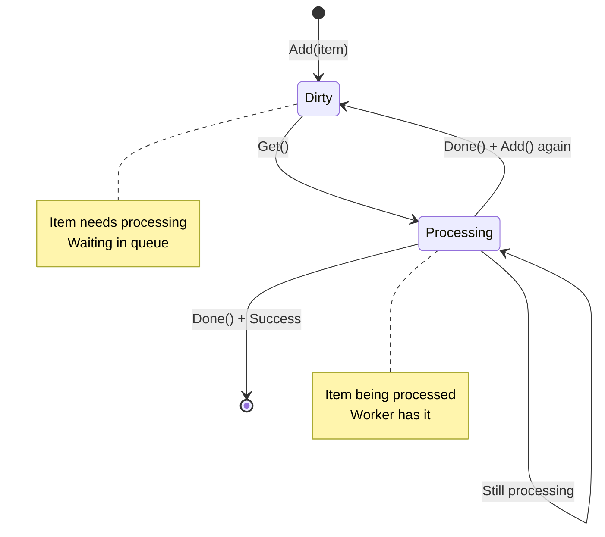
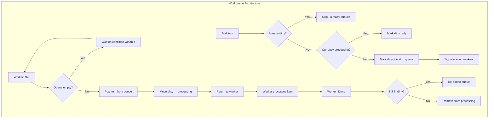
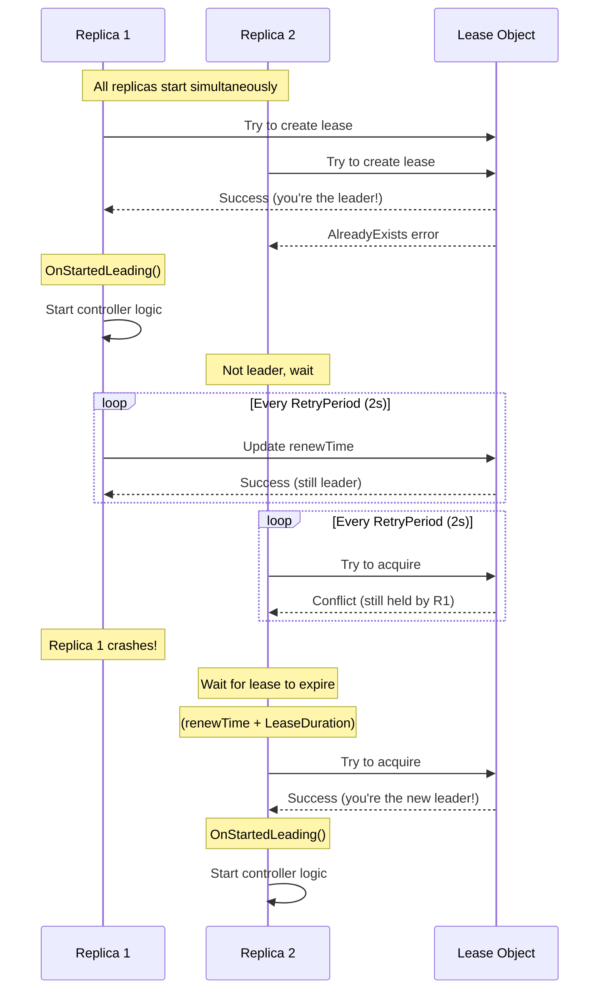
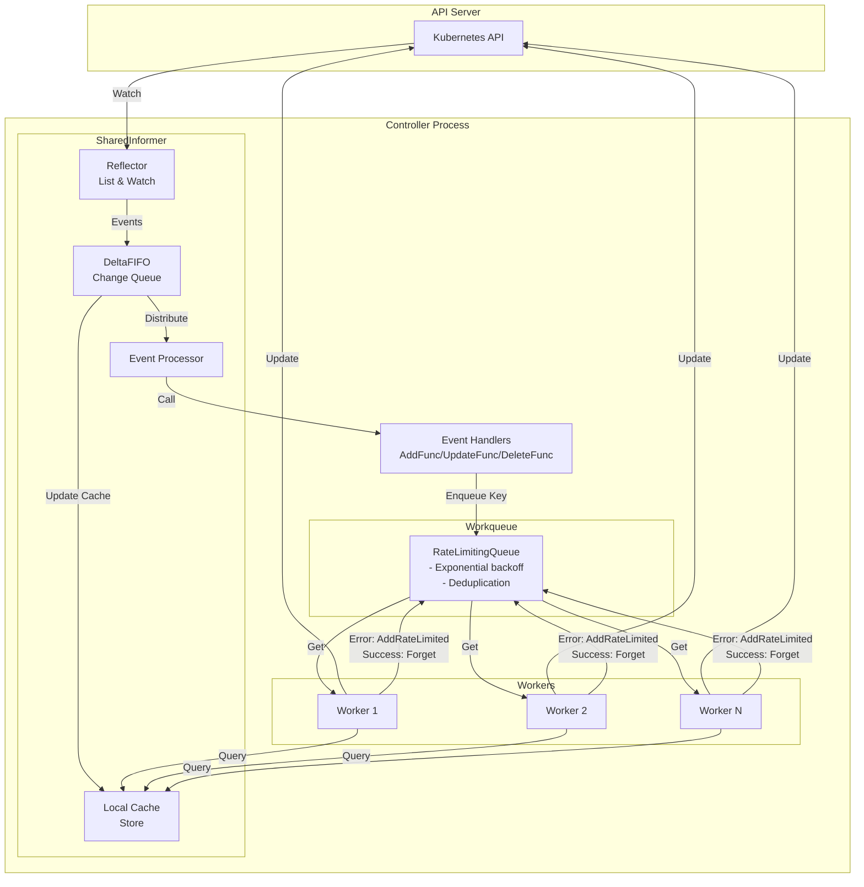

# **Document 04: Workqueue and Leader Election**

**Part of**: Kubernetes Common/Shared Libraries Architecture Documentation
**Part II**: client-go Library (Document 3 of 3)
**Status**: ✅ Complete
**Last Updated**: 2025-11-05

━━━━━━━━━━━━━━━━━━━━━━━━━━━━━━━━━━━━━━━━━━━━━━━━━━━━━━━━━━━━━━━━━━━━━━━━━━━━━━

## **📋 Table of Contents**

1. [Introduction and Motivation](#introduction-and-motivation)
2. [Workqueue Architecture](#workqueue-architecture)
3. [Queue Types and Implementations](#queue-types-and-implementations)
4. [Rate Limiting Patterns](#rate-limiting-patterns)
5. [Leader Election](#leader-election)
6. [Informer + Workqueue Integration](#informer--workqueue-integration)
7. [Production Patterns and Best Practices](#production-patterns-and-best-practices)
8. [Common Pitfalls](#common-pitfalls)
9. [Testing Patterns](#testing-patterns)
10. [Summary and Key Takeaways](#summary-and-key-takeaways)

━━━━━━━━━━━━━━━━━━━━━━━━━━━━━━━━━━━━━━━━━━━━━━━━━━━━━━━━━━━━━━━━━━━━━━━━━━━━━━

## **1. Introduction and Motivation**

### **1.1 The Problem: Reliable, Rate-Limited Processing**

In **Document 03**, we learned how SharedInformers efficiently watch and cache Kubernetes resources. However, watching is only half the story. Controllers must also **process** resource changes reliably:

**Challenges**:
1. **Event handlers must be FAST** - Cannot block the informer processor
2. **Processing might fail** - Need retry with exponential backoff
3. **Avoid overwhelming the system** - Rate limiting on failures
4. **High availability** - Multiple replicas but only ONE active
5. **Graceful shutdown** - Don't lose work in progress

**Solution**: **Workqueue + Leader Election**

```
┌─────────────────────────────────────────────────────────────┐
│                    Controller Pattern                        │
├─────────────────────────────────────────────────────────────┤
│                                                              │
│  SharedInformer          Workqueue           Workers         │
│  ┌────────────┐        ┌──────────┐       ┌──────────┐     │
│  │   Watch    │ Events │  Queue   │ Keys  │ Process  │     │
│  │  & Cache   ├───────>│  Keys    ├──────>│  Items   │     │
│  │            │        │ w/ Rate  │       │          │     │
│  │            │        │ Limiting │       │ Retry on │     │
│  └────────────┘        └──────────┘       │  Error   │     │
│                                            └──────────┘     │
│                                                              │
│  Document 03           Document 04        Document 04       │
│  (Efficient Watch)     (Reliable Process) (Reliable)        │
└─────────────────────────────────────────────────────────────┘
```

### **1.2 Why Workqueue?**

**💡 Aha Moment: Event handlers are synchronous!**

When an informer receives an event, it calls ALL registered event handlers **synchronously**:

```go
// ❌ BAD: Blocking event handler
func (c *Controller) onAdd(obj interface{}) {
    pod := obj.(*corev1.Pod)

    // This blocks the informer processor!
    // No other events can be processed
    c.reconcile(pod)  // Might take seconds or fail!
}
```

**Problem**: If `reconcile()` is slow or fails, it blocks the entire informer processor. Other events pile up!

**Solution**: Enqueue keys for later processing:

```go
// ✅ GOOD: Non-blocking event handler
func (c *Controller) onAdd(obj interface{}) {
    key, _ := cache.MetaNamespaceKeyFunc(obj)

    // Fast enqueue (microseconds)
    c.workqueue.Add(key)  // Non-blocking!
}
```

Workers process keys asynchronously:

```go
// Worker goroutine
func (c *Controller) worker() {
    for c.processNextItem() {
    }
}

func (c *Controller) processNextItem() bool {
    key, quit := c.workqueue.Get()  // Blocks until item available
    if quit {
        return false
    }
    defer c.workqueue.Done(key)

    // Now we can take our time
    if err := c.reconcile(key); err != nil {
        // Retry with backoff
        c.workqueue.AddRateLimited(key)
        return true
    }

    // Success - forget rate limit history
    c.workqueue.Forget(key)
    return true
}
```

**Benefits**:
- ✅ Event handlers are fast (just enqueue)
- ✅ Decouples watching from processing
- ✅ Multiple workers can process concurrently
- ✅ Automatic retries with exponential backoff
- ✅ Rate limiting prevents overwhelming on failures

### **1.3 Why Leader Election?**

**💡 Aha Moment: High Availability requires coordination!**

For HA, we run multiple controller replicas:

```
┌──────────────┐  ┌──────────────┐  ┌──────────────┐
│ Controller-1 │  │ Controller-2 │  │ Controller-3 │
│  (Replica)   │  │  (Replica)   │  │  (Replica)   │
└──────────────┘  └──────────────┘  └──────────────┘
       │                 │                  │
       └─────────────────┴──────────────────┘
                         │
                  ┌──────▼──────┐
                  │ API Server  │
                  └─────────────┘
```

**Problem**: All replicas watch the same resources. Without coordination:
- All replicas reconcile the same Pod → conflicts!
- ReplicaSet controller creates 3x desired Pods!
- Multiple updates to the same object → race conditions

**Solution**: **Leader Election**
- Only ONE replica is the "leader" and actively reconciles
- Other replicas are on standby
- If leader dies, a new leader is elected automatically

```
┌──────────────┐  ┌──────────────┐  ┌──────────────┐
│ Controller-1 │  │ Controller-2 │  │ Controller-3 │
│   LEADER ✓   │  │   Standby    │  │   Standby    │
│  (Active)    │  │  (Waiting)   │  │  (Waiting)   │
└──────────────┘  └──────────────┘  └──────────────┘
       │
       │ Only leader reconciles
       ▼
┌─────────────┐
│ API Server  │
└─────────────┘
```

### **1.4 Document Scope**

This document covers:

**Workqueue** (staging/src/k8s.io/client-go/util/workqueue/):
1. Queue interface and basic implementation
2. DelayingQueue for scheduled processing
3. RateLimitingQueue for automatic retry backoff
4. Rate limiter implementations
5. Metrics and observability

**Leader Election** (staging/src/k8s.io/client-go/tools/leaderelection/):
1. Leader election algorithm
2. Lease-based coordination
3. Configuration (LeaseDuration, RenewDeadline, RetryPeriod)
4. Callbacks (OnStartedLeading, OnStoppedLeading, OnNewLeader)
5. Integration with controllers

**Integration Patterns**:
1. Informer + Workqueue pattern
2. Multi-worker processing
3. Graceful shutdown
4. Complete working examples

**Prerequisites**: Read **Document 03 (Informers and SharedInformers)** first!

━━━━━━━━━━━━━━━━━━━━━━━━━━━━━━━━━━━━━━━━━━━━━━━━━━━━━━━━━━━━━━━━━━━━━━━━━━━━━━

## **2. Workqueue Architecture**

### **2.1 Workqueue Interface**

**Location**: `staging/src/k8s.io/client-go/util/workqueue/queue.go:26`

```go
// Interface provides the core workqueue capabilities
type Interface interface {
    // Add marks item as needing processing
    Add(item interface{})

    // Len returns the current queue depth
    Len() int

    // Get blocks until an item is available, then returns it
    // Must call Done(item) when finished processing
    Get() (item interface{}, shutdown bool)

    // Done marks item as done processing
    // Must be called for every Get()
    Done(item interface{})

    // ShutDown signals shutdown - Get() will return shutdown=true
    ShutDown()

    // ShutDownWithDrain blocks until queue is empty, then shuts down
    ShutDownWithDrain()

    // ShuttingDown returns true if shutdown has started
    ShuttingDown() bool
}
```

**Key Design Points**:

1. **Thread-Safe**: All methods are safe for concurrent access
2. **Blocking Get()**: Workers block until work is available
3. **Must Call Done()**: Failure to call Done() causes memory leaks
4. **Generic Items**: Uses `interface{}` for any item type (usually string keys)

### **2.2 Queue State Machine**

**💡 Aha Moment: The queue tracks items in THREE sets!**

**Location**: `staging/src/k8s.io/client-go/util/workqueue/queue.go:48`

```go
type Type struct {
    // queue defines the order to deliver items
    queue []t  // FIFO order

    // dirty defines items that need processing
    dirty set  // Set of items needing processing

    // processing defines items currently being processed
    processing set  // Set of items being processed

    // Other fields (cond, shuttingDown, drain, metrics, etc.)
}
```

**State Machine**:



**Detailed Flow**:

```
┌─────────────────────────────────────────────────────────────┐
│                    Workqueue State                           │
├─────────────────────────────────────────────────────────────┤
│                                                              │
│  1. Add("pod-1")                                            │
│     dirty = {"pod-1"}                                       │
│     queue = ["pod-1"]                                       │
│                                                              │
│  2. Get() returns "pod-1"                                   │
│     dirty = {}                                              │
│     processing = {"pod-1"}                                  │
│     queue = []                                              │
│                                                              │
│  3. While processing, Add("pod-1") again                    │
│     dirty = {"pod-1"}   ← Item re-queued!                  │
│     processing = {"pod-1"}  ← Still being processed        │
│     queue = []  ← NOT added to queue yet                   │
│                                                              │
│  4. Done("pod-1")                                           │
│     processing = {}                                         │
│     dirty = {"pod-1"}  ← Still dirty from step 3           │
│     queue = ["pod-1"]  ← NOW added to queue!               │
│                                                              │
│  5. Get() returns "pod-1" again                             │
│     Start over!                                             │
└─────────────────────────────────────────────────────────────┘
```

**Why Three Sets?**

**Problem without "dirty" set**:
```
Time 0: Get("pod-1")     → processing={"pod-1"}
Time 1: Update pod-1     → Add("pod-1")
        ❌ Without dirty: Added to queue while still processing!
        ❌ Two workers might process the same item!
```

**Solution with "dirty" set**:
```
Time 0: Get("pod-1")     → processing={"pod-1"}
Time 1: Update pod-1     → Add("pod-1")
        ✅ dirty={"pod-1"}, but NOT added to queue yet
Time 2: Done("pod-1")    → Check dirty set
        ✅ Item still dirty, re-add to queue
```

**Benefits**:
- ✅ **Deduplication**: Multiple Add() calls merged into one processing
- ✅ **No duplicate processing**: Item processed by one worker at a time
- ✅ **Eventual consistency**: Changes during processing are handled

### **2.3 Add() Implementation**

**Location**: `staging/src/k8s.io/client-go/util/workqueue/queue.go:72`

```go
func (q *Type) Add(item interface{}) {
    q.cond.L.Lock()
    defer q.cond.L.Unlock()

    if q.shuttingDown {
        return
    }

    if q.dirty.has(item) {
        // Already dirty or processing - nothing to do
        return
    }

    // Add to dirty set
    q.dirty.insert(item)

    if q.processing.has(item) {
        // Currently being processed
        // Will be re-queued when Done() is called
        return
    }

    // Not currently processing - add to queue
    q.queue = append(q.queue, item)
    q.cond.Signal()  // Wake up a waiting worker
}
```

**Key Points**:
1. Thread-safe with mutex (q.cond.L)
2. Check if already dirty → skip duplicate
3. If processing → mark dirty but don't queue yet
4. Otherwise → add to dirty AND queue
5. Signal waiting workers

### **2.4 Get() Implementation**

**Location**: `staging/src/k8s.io/client-go/util/workqueue/queue.go:100`

```go
func (q *Type) Get() (item interface{}, shutdown bool) {
    q.cond.L.Lock()
    defer q.cond.L.Unlock()

    // Wait until queue is non-empty or shutting down
    for len(q.queue) == 0 && !q.shuttingDown {
        q.cond.Wait()  // Block until signaled
    }

    if len(q.queue) == 0 {
        // Shutting down with empty queue
        return nil, true
    }

    // Pop from front (FIFO)
    item = q.queue[0]
    q.queue = q.queue[1:]

    // Move from dirty to processing
    q.dirty.delete(item)
    q.processing.insert(item)

    return item, false
}
```

**Flow**:
1. Block until work is available (`q.cond.Wait()`)
2. Pop item from front of queue (FIFO)
3. Move from `dirty` to `processing` set
4. Return item to worker

### **2.5 Done() Implementation**

**Location**: `staging/src/k8s.io/client-go/util/workqueue/queue.go:124`

```go
func (q *Type) Done(item interface{}) {
    q.cond.L.Lock()
    defer q.cond.L.Unlock()

    // Remove from processing set
    q.processing.delete(item)

    // Check if item was added again while processing
    if q.dirty.has(item) {
        // Still dirty - add back to queue
        q.queue = append(q.queue, item)
        q.cond.Signal()
    }
}
```

**Critical**: If item is still in `dirty` set, it means:
- Item was `Add()`ed again while being processed
- Re-queue it for another processing round

### **2.6 Complete Architecture Diagram**



### **2.7 Metrics Integration**

**Location**: `staging/src/k8s.io/client-go/util/workqueue/metrics.go:26`

Every workqueue can be instrumented with metrics:

```go
// Metrics for a workqueue
type queueMetrics interface {
    add(item t)          // Called when item added
    get(item t)          // Called when item retrieved
    done(item t)         // Called when item completed
    updateUnfinished()   // Called periodically
}
```

**Default Prometheus metrics**:
- `workqueue_adds_total` - Total number of adds
- `workqueue_depth` - Current queue depth
- `workqueue_queue_duration_seconds` - Time items spend in queue
- `workqueue_work_duration_seconds` - Time spent processing items
- `workqueue_retries_total` - Number of retries (for rate-limited queues)
- `workqueue_longest_running_processor_seconds` - Longest running processor

**Example**:
```go
import "k8s.io/client-go/util/workqueue"

// Create queue with metrics
queue := workqueue.NewNamed("my-controller")

// Metrics are automatically recorded
queue.Add("item-1")       // → workqueue_adds_total{name="my-controller"}++
item, _ := queue.Get()    // → workqueue_depth{name="my-controller"}--
queue.Done(item)          // → workqueue_work_duration_seconds recorded
```

━━━━━━━━━━━━━━━━━━━━━━━━━━━━━━━━━━━━━━━━━━━━━━━━━━━━━━━━━━━━━━━━━━━━━━━━━━━━━━

## **3. Queue Types and Implementations**

Kubernetes provides three queue implementations:
1. **Basic Queue** - FIFO processing
2. **DelayingQueue** - Scheduled processing with delays
3. **RateLimitingQueue** - Automatic retry with backoff

### **3.1 Basic Queue (FIFO)**

**Location**: `staging/src/k8s.io/client-go/util/workqueue/queue.go:48`

**Use Case**: Simple FIFO processing without delays or rate limiting

**Example**:
```go
import "k8s.io/client-go/util/workqueue"

// Create basic queue
queue := workqueue.New()

// Producer
queue.Add("item-1")
queue.Add("item-2")

// Consumer
for {
    item, shutdown := queue.Get()
    if shutdown {
        break
    }

    // Process item
    fmt.Printf("Processing: %v\n", item)

    // Mark done
    queue.Done(item)
}
```

**When to Use**:
- Simple controllers without retry logic
- Tasks that always succeed
- External retry handling

### **3.2 DelayingQueue**

**Location**: `staging/src/k8s.io/client-go/util/workqueue/delaying_queue.go:28`

**Purpose**: Schedule items for processing at a future time

**Interface**:
```go
type DelayingInterface interface {
    Interface  // Embeds basic queue interface

    // AddAfter adds item after the specified duration
    AddAfter(item interface{}, duration time.Duration)
}
```

**Implementation**:

```go
type delayingType struct {
    Interface  // Basic queue

    // clock for time operations
    clock clock.Clock

    // stopCh signals shutdown
    stopCh chan struct{}

    // waitingForAddCh receives items to be delayed
    waitingForAddCh chan *waitFor

    // heartbeat controls the wait loop
    heartbeat clock.Ticker
}

// Item waiting to be added
type waitFor struct {
    data    t           // The item
    readyAt time.Time   // When to add it
    index   int         // Heap index
}
```

**How It Works**:

```
┌─────────────────────────────────────────────────────────────┐
│                  DelayingQueue Flow                          │
├─────────────────────────────────────────────────────────────┤
│                                                              │
│  1. AddAfter("pod-1", 5*time.Second)                        │
│     ↓                                                        │
│  2. Send to waitingForAddCh                                 │
│     ↓                                                        │
│  3. Background goroutine receives item                      │
│     ↓                                                        │
│  4. Add to min-heap ordered by readyAt                      │
│     ↓                                                        │
│  5. Wait loop checks heap every 10ms                        │
│     ↓                                                        │
│  6. When readyAt <= now:                                    │
│     - Pop from heap                                         │
│     - Add to underlying queue                               │
│                                                              │
└─────────────────────────────────────────────────────────────┘
```

**AddAfter Implementation**:

**Location**: `staging/src/k8s.io/client-go/util/workqueue/delaying_queue.go:113`

```go
func (q *delayingType) AddAfter(item interface{}, duration time.Duration) {
    // Don't delay if already shutting down
    if q.ShuttingDown() {
        return
    }

    // If no delay, add immediately
    if duration <= 0 {
        q.Add(item)
        return
    }

    // Send to waiting loop
    select {
    case <-q.stopCh:
        // Shutting down
    case q.waitingForAddCh <- &waitFor{
        data:    item,
        readyAt: q.clock.Now().Add(duration),
    }:
    }
}
```

**Wait Loop** (simplified):

**Location**: `staging/src/k8s.io/client-go/util/workqueue/delaying_queue.go:150`

```go
func (q *delayingType) waitingLoop() {
    // Min-heap of items waiting to be added
    waitingForQueue := &waitForPriorityQueue{}
    heap.Init(waitingForQueue)

    for {
        // Check if any items are ready
        if waitingForQueue.Len() > 0 {
            entry := waitingForQueue.Peek().(*waitFor)
            if entry.readyAt.After(q.clock.Now()) {
                // Not ready yet - continue waiting
            } else {
                // Ready! Add to queue
                entry = heap.Pop(waitingForQueue).(*waitFor)
                q.Add(entry.data)
            }
        }

        // Wait for new items or timeout
        select {
        case <-q.stopCh:
            return
        case item := <-q.waitingForAddCh:
            heap.Push(waitingForQueue, item)
        case <-q.heartbeat.C():
            // Periodic check (every 10ms)
        }
    }
}
```

**Example Usage**:
```go
queue := workqueue.NewDelayingQueue()

// Add immediately
queue.Add("immediate-item")

// Add after 5 seconds
queue.AddAfter("delayed-item", 5*time.Second)

// Add after 1 minute
queue.AddAfter("retry-item", 1*time.Minute)
```

**Use Cases**:
- Retry after a specific delay
- Rate limiting (manually)
- Scheduled reconciliation
- Debouncing (delay then process)

### **3.3 RateLimitingQueue**

**Location**: `staging/src/k8s.io/client-go/util/workqueue/rate_limiting_queue.go:21`

**Purpose**: Automatic retry with exponential backoff

**💡 Aha Moment: This is THE queue type used by Kubernetes controllers!**

**Interface**:
```go
type RateLimitingInterface interface {
    DelayingInterface  // Embeds delaying queue

    // AddRateLimited adds item with rate limiting
    // Uses RateLimiter to determine delay
    AddRateLimited(item interface{})

    // Forget indicates successful processing
    // Resets rate limiter state for this item
    Forget(item interface{})

    // NumRequeues returns number of times item has been requeued
    NumRequeues(item interface{}) int
}
```

**Implementation**:

**Location**: `staging/src/k8s.io/client-go/util/workqueue/rate_limiting_queue.go:36`

```go
type rateLimitingType struct {
    DelayingInterface  // Delaying queue

    rateLimiter RateLimiter  // Determines delays
}

// AddRateLimited adds with rate limiting
func (q *rateLimitingType) AddRateLimited(item interface{}) {
    // Ask rate limiter when to retry
    delay := q.rateLimiter.When(item)

    // Add with delay
    q.AddAfter(item, delay)
}

// Forget resets rate limiter state
func (q *rateLimitingType) Forget(item interface{}) {
    q.rateLimiter.Forget(item)
}

// NumRequeues returns retry count
func (q *rateLimitingType) NumRequeues(item interface{}) int {
    return q.rateLimiter.NumRequeues(item)
}
```

**RateLimiter Interface**:

**Location**: `staging/src/k8s.io/client-go/util/workqueue/rate_limiting_queue.go:17`

```go
type RateLimiter interface {
    // When gets delay for item
    // Returns 0 for immediate retry
    When(item interface{}) time.Duration

    // Forget resets state for item
    Forget(item interface{})

    // NumRequeues returns retry count for item
    NumRequeues(item interface{}) int
}
```

**Typical Controller Pattern**:
```go
queue := workqueue.NewRateLimitingQueue(
    workqueue.DefaultControllerRateLimiter(),
)

// In worker
func (c *Controller) processItem() bool {
    key, quit := c.queue.Get()
    if quit {
        return false
    }
    defer c.queue.Done(key)

    err := c.reconcile(key.(string))
    if err != nil {
        // Failed - retry with backoff
        c.queue.AddRateLimited(key)
        return true
    }

    // Success - reset rate limiter state
    c.queue.Forget(key)
    return true
}
```

**Why Forget() is Critical**:

```go
// ❌ WRONG: Not calling Forget()
if err != nil {
    c.queue.AddRateLimited(key)
    return true
}
// Missing Forget()!
return true

// Problem: Rate limiter keeps state forever
// Next failure will use accumulated backoff!
```

```go
// ✅ CORRECT: Always call Forget() on success
if err != nil {
    c.queue.AddRateLimited(key)
    return true
}
c.queue.Forget(key)  // Reset backoff state
return true
```

━━━━━━━━━━━━━━━━━━━━━━━━━━━━━━━━━━━━━━━━━━━━━━━━━━━━━━━━━━━━━━━━━━━━━━━━━━━━━━

## **4. Rate Limiting Patterns**

### **4.1 Why Rate Limiting?**

**💡 Aha Moment: Without rate limiting, failures overwhelm the system!**

**Scenario**: Pod reconciliation fails (e.g., image pull error)

**Without Rate Limiting**:
```
Time  Action           Queue Depth  Result
0s    Reconcile Pod    1            ❌ Error: ImagePullBackOff
0s    Re-add to queue  1
0s    Reconcile Pod    1            ❌ Error: ImagePullBackOff
0s    Re-add to queue  1
0s    Reconcile Pod    1            ❌ Error: ImagePullBackOff
...   (repeats forever, consuming CPU and API calls)
```

**With Exponential Backoff**:
```
Time  Action           Delay    Result
0s    Reconcile Pod    -        ❌ Error: ImagePullBackOff
0s    AddRateLimited   1s       (waits 1 second)
1s    Reconcile Pod    -        ❌ Error: ImagePullBackOff
1s    AddRateLimited   2s       (waits 2 seconds)
3s    Reconcile Pod    -        ❌ Error: ImagePullBackOff
3s    AddRateLimited   4s       (waits 4 seconds)
7s    Reconcile Pod    -        ❌ Error: ImagePullBackOff
7s    AddRateLimited   8s       (waits 8 seconds)
...
```

**Benefits**:
- ✅ Gives system time to recover (e.g., image pulled)
- ✅ Reduces CPU and API load
- ✅ Prevents thundering herd
- ✅ Eventually succeeds without manual intervention

### **4.2 Rate Limiter Implementations**

Kubernetes provides four rate limiter implementations:

#### **4.2.1 BucketRateLimiter**

**Location**: `staging/src/k8s.io/client-go/util/workqueue/default_rate_limiters.go:29`

**Purpose**: Global rate limiting (not per-item)

**Implementation**:
```go
type BucketRateLimiter struct {
    *rate.Limiter  // golang.org/x/time/rate
}

func (r *BucketRateLimiter) When(item interface{}) time.Duration {
    return r.Limiter.Reserve().Delay()
}

func (r *BucketRateLimiter) Forget(item interface{}) {}

func (r *BucketRateLimiter) NumRequeues(item interface{}) int {
    return 0
}
```

**How It Works**: Token bucket algorithm (same as RESTClient rate limiting!)

```
┌─────────────────────────────────────────────────────────────┐
│                   Token Bucket Algorithm                     │
├─────────────────────────────────────────────────────────────┤
│                                                              │
│  Bucket Capacity: 10 tokens                                 │
│  Refill Rate: 5 tokens/second                               │
│                                                              │
│  Time 0s:  [••••••••••] (10 tokens)                         │
│            Process item → [•••••••••-] (9 tokens)           │
│            Process item → [••••••••--] (8 tokens)           │
│                                                              │
│  Time 1s:  Refill 5 → [•••••••••••••] (10 max, capped)     │
│                                                              │
│  Time 2s:  Process 10 items → [----------] (0 tokens)      │
│            Next item must wait 200ms for 1 token            │
│                                                              │
└─────────────────────────────────────────────────────────────┘
```

**Example**:
```go
import "golang.org/x/time/rate"

// 10 QPS, burst of 100
limiter := workqueue.NewItemExponentialFailureRateLimiter(
    &workqueue.BucketRateLimiter{
        Limiter: rate.NewLimiter(rate.Limit(10), 100),
    },
)
```

**Use Case**: Global throughput limiting (e.g., "no more than 10 requeues/second")

#### **4.2.2 ItemExponentialFailureRateLimiter** ⭐

**Location**: `staging/src/k8s.io/client-go/util/workqueue/default_rate_limiters.go:57`

**Purpose**: Per-item exponential backoff (most common!)

**💡 Aha Moment: This is what Kubernetes controllers use!**

**Implementation**:
```go
type ItemExponentialFailureRateLimiter struct {
    failuresLock sync.Mutex
    failures     map[interface{}]int  // Track failures per item

    baseDelay time.Duration  // Initial delay (e.g., 1ms)
    maxDelay  time.Duration  // Maximum delay (e.g., 1000s)
}

func (r *ItemExponentialFailureRateLimiter) When(item interface{}) time.Duration {
    r.failuresLock.Lock()
    defer r.failuresLock.Unlock()

    // Increment failure count
    r.failures[item] = r.failures[item] + 1

    // Calculate exponential backoff
    // delay = baseDelay * 2^(failures-1)
    backoff := r.baseDelay
    for i := 0; i < r.failures[item]-1; i++ {
        backoff = backoff * 2
        if backoff > r.maxDelay {
            return r.maxDelay
        }
    }

    return backoff
}

func (r *ItemExponentialFailureRateLimiter) Forget(item interface{}) {
    r.failuresLock.Lock()
    defer r.failuresLock.Unlock()
    delete(r.failures, item)
}

func (r *ItemExponentialFailureRateLimiter) NumRequeues(item interface{}) int {
    r.failuresLock.Lock()
    defer r.failuresLock.Unlock()
    return r.failures[item]
}
```

**Backoff Formula**:

```
delay = baseDelay * 2^(failures - 1)
delay = min(delay, maxDelay)
```

**Example Progression**:

```
Base Delay: 5ms
Max Delay: 1000s

Failure #   Formula                  Delay        Cumulative
1           5ms * 2^0               5ms           5ms
2           5ms * 2^1               10ms          15ms
3           5ms * 2^2               20ms          35ms
4           5ms * 2^3               40ms          75ms
5           5ms * 2^4               80ms          155ms
6           5ms * 2^5               160ms         315ms
7           5ms * 2^6               320ms         635ms
8           5ms * 2^7               640ms         1.275s
9           5ms * 2^8               1.28s         2.555s
10          5ms * 2^9               2.56s         5.115s
...
30          5ms * 2^29              1000s (max)   ~1000s
```

**Visual Timeline**:

```mermaid
gantt
    title Exponential Backoff Timeline
    dateFormat  s
    axisFormat %S

    section Processing
    Attempt 1 (fail)     :0, 0.005s
    Wait (5ms)           :0.005s, 0.010s
    Attempt 2 (fail)     :0.010s, 0.020s
    Wait (10ms)          :0.020s, 0.040s
    Attempt 3 (fail)     :0.040s, 0.060s
    Wait (20ms)          :0.060s, 0.100s
    Attempt 4 (fail)     :0.100s, 0.140s
    Wait (40ms)          :0.140s, 0.220s
    Attempt 5 (success)  :0.220s, 0.300s
```

**Example Usage**:
```go
// Default values used by Kubernetes
limiter := workqueue.NewItemExponentialFailureRateLimiter(
    5*time.Millisecond,  // baseDelay
    1000*time.Second,    // maxDelay
)

queue := workqueue.NewRateLimitingQueue(limiter)
```

**When to Use**: Almost always! This is the standard for Kubernetes controllers.

#### **4.2.3 ItemFastSlowRateLimiter**

**Location**: `staging/src/k8s.io/client-go/util/workqueue/default_rate_limiters.go:125`

**Purpose**: Fast retries for a few attempts, then slow retries

**Implementation**:
```go
type ItemFastSlowRateLimiter struct {
    failuresLock sync.Mutex
    failures     map[interface{}]int

    maxFastAttempts int           // How many fast attempts (e.g., 5)
    fastDelay       time.Duration // Fast delay (e.g., 5ms)
    slowDelay       time.Duration // Slow delay (e.g., 10s)
}

func (r *ItemFastSlowRateLimiter) When(item interface{}) time.Duration {
    r.failuresLock.Lock()
    defer r.failuresLock.Unlock()

    r.failures[item] = r.failures[item] + 1

    if r.failures[item] <= r.maxFastAttempts {
        return r.fastDelay  // Fast retry
    }

    return r.slowDelay  // Slow retry
}
```

**Timeline**:

```
maxFastAttempts = 3
fastDelay = 100ms
slowDelay = 10s

Attempt   Delay    Rationale
1         100ms    Fast (within maxFastAttempts)
2         100ms    Fast
3         100ms    Fast
4         10s      Slow (exceeded maxFastAttempts)
5         10s      Slow
6         10s      Slow
...
```

**Use Case**:
- Transient errors (fast retries)
- Then assume persistent error (slow retries)
- Example: Network blip (fast) vs ImagePullBackOff (slow)

**Example**:
```go
limiter := workqueue.NewItemFastSlowRateLimiter(
    100*time.Millisecond,  // fastDelay
    10*time.Second,        // slowDelay
    5,                     // maxFastAttempts
)
```

#### **4.2.4 MaxOfRateLimiter**

**Location**: `staging/src/k8s.io/client-go/util/workqueue/default_rate_limiters.go:173`

**Purpose**: Combine multiple rate limiters (use the maximum delay)

**Implementation**:
```go
type MaxOfRateLimiter struct {
    limiters []RateLimiter
}

func (r *MaxOfRateLimiter) When(item interface{}) time.Duration {
    maxDelay := time.Duration(0)

    for _, limiter := range r.limiters {
        delay := limiter.When(item)
        if delay > maxDelay {
            maxDelay = delay
        }
    }

    return maxDelay
}
```

**Example: Combine exponential backoff + global rate limit**:

```go
limiter := workqueue.NewMaxOfRateLimiter(
    // Per-item exponential backoff
    workqueue.NewItemExponentialFailureRateLimiter(
        5*time.Millisecond,
        1000*time.Second,
    ),

    // Global rate limit (10 QPS, burst 100)
    &workqueue.BucketRateLimiter{
        Limiter: rate.NewLimiter(rate.Limit(10), 100),
    },
)
```

**Effect**:
- Item 1, failure 1: max(5ms exponential, token bucket delay)
- Item 1, failure 10: max(2.56s exponential, token bucket delay)
- If bucket is empty: Uses bucket delay even if exponential is lower

### **4.3 DefaultControllerRateLimiter**

**Location**: `staging/src/k8s.io/client-go/util/workqueue/default_rate_limiters.go:195`

**💡 Aha Moment: This is what ALL Kubernetes controllers use!**

```go
func DefaultControllerRateLimiter() RateLimiter {
    return NewMaxOfRateLimiter(
        // Per-item exponential backoff
        NewItemExponentialFailureRateLimiter(
            5*time.Millisecond,   // baseDelay
            1000*time.Second,     // maxDelay
        ),

        // Global rate limit: 10 QPS, burst 100
        &BucketRateLimiter{
            Limiter: rate.NewLimiter(rate.Limit(10), 100),
        },
    )
}
```

**Why This Combination?**:
1. **Exponential backoff**: Handles failing items gracefully
2. **Bucket rate limiter**: Prevents thundering herd across ALL items

**Usage**:
```go
queue := workqueue.NewRateLimitingQueue(
    workqueue.DefaultControllerRateLimiter(),
)
```

**Example Scenarios**:

**Scenario 1: Single item failing repeatedly**
```
Item: "pod-1"
Failures: 1 → 2 → 3 → 4 → 5

Delays:   5ms → 10ms → 20ms → 40ms → 80ms
          (Exponential backoff dominates)
```

**Scenario 2: Many items failing simultaneously**
```
Items: "pod-1", "pod-2", ..., "pod-100"
All fail at once

First 100: Delayed by bucket (burst absorbed)
Next:      max(exponential, bucket delay)
           (Bucket limiter prevents overwhelming system)
```

### **4.4 Rate Limiting Comparison**

| Rate Limiter | Per-Item | Global | Pattern | Use Case |
|--------------|----------|--------|---------|----------|
| **BucketRateLimiter** | ❌ | ✅ | Token bucket | Global throughput limiting |
| **ItemExponentialFailureRateLimiter** | ✅ | ❌ | Exponential backoff | Per-item retry with backoff |
| **ItemFastSlowRateLimiter** | ✅ | ❌ | Fast then slow | Transient vs persistent errors |
| **MaxOfRateLimiter** | Both | Both | Maximum delay | Combine multiple limiters |

━━━━━━━━━━━━━━━━━━━━━━━━━━━━━━━━━━━━━━━━━━━━━━━━━━━━━━━━━━━━━━━━━━━━━━━━━━━━━━

## **5. Leader Election**

### **5.1 Why Leader Election?**

**Problem**: High availability requires multiple controller replicas

```
Deployment: my-controller
Replicas: 3

┌──────────────┐  ┌──────────────┐  ┌──────────────┐
│ Controller-1 │  │ Controller-2 │  │ Controller-3 │
└──────┬───────┘  └──────┬───────┘  └──────┬───────┘
       │                 │                  │
       └─────────────────┴──────────────────┘
                         │
                  All watching Pods!
```

**Without Leader Election**:
- All replicas reconcile the same Pod
- ReplicaSet controller: All create Pods → 3x desired count!
- Race conditions on updates
- Wasted work (all doing the same thing)

**With Leader Election**:
```
┌──────────────┐  ┌──────────────┐  ┌──────────────┐
│ Controller-1 │  │ Controller-2 │  │ Controller-3 │
│   LEADER ✓   │  │   Standby    │  │   Standby    │
│  (Active)    │  │  (Watching)  │  │  (Watching)  │
└──────┬───────┘  └──────────────┘  └──────────────┘
       │
       │ Only leader reconciles
       ▼
    Reconcile
```

**Benefits**:
- ✅ Only ONE active controller
- ✅ No conflicts or race conditions
- ✅ Automatic failover if leader dies
- ✅ Standby replicas ready to take over

### **5.2 Lease-Based Leader Election**

**💡 Aha Moment: Leader election uses a Kubernetes Lease object!**

**Location**: `staging/src/k8s.io/client-go/tools/leaderelection/leaderelection.go:82`

**How It Works**:

```
┌─────────────────────────────────────────────────────────────┐
│                  Lease-Based Coordination                    │
├─────────────────────────────────────────────────────────────┤
│                                                              │
│  Kubernetes Lease Object (coordination.k8s.io/v1)          │
│  ┌────────────────────────────────────────────────────────┐ │
│  │ apiVersion: coordination.k8s.io/v1                     │ │
│  │ kind: Lease                                             │ │
│  │ metadata:                                               │ │
│  │   name: my-controller                                   │ │
│  │   namespace: kube-system                                │ │
│  │ spec:                                                   │ │
│  │   holderIdentity: "controller-1-pod-abc123"             │ │
│  │   leaseDurationSeconds: 15                              │ │
│  │   acquireTime: "2025-11-05T10:00:00Z"                  │ │
│  │   renewTime: "2025-11-05T10:00:10Z"                    │ │
│  │   leaseTransitions: 2                                   │ │
│  └────────────────────────────────────────────────────────┘ │
│                                                              │
│  Leader holds the lease by:                                 │
│  1. Writing holderIdentity = own identity                   │
│  2. Updating renewTime every RetryPeriod                    │
│                                                              │
│  Other replicas:                                            │
│  - Try to acquire (update holderIdentity)                   │
│  - Fail if lease is held                                    │
│  - Watch for lease expiration                               │
│                                                              │
└─────────────────────────────────────────────────────────────┘
```

**Key Fields**:
- **holderIdentity**: Current leader's identity (e.g., pod name)
- **leaseDurationSeconds**: How long lease is valid (default: 15s)
- **renewTime**: When leader last renewed lease
- **acquireTime**: When leader first acquired lease
- **leaseTransitions**: Number of leader changes (debugging)

### **5.3 LeaderElector Configuration**

**Location**: `staging/src/k8s.io/client-go/tools/leaderelection/leaderelection.go:82`

```go
// LeaderElectionConfig configures leader election
type LeaderElectionConfig struct {
    // Lock is the resource lock (Lease, ConfigMap, etc.)
    Lock resourcelock.Interface

    // LeaseDuration is the duration that non-leader candidates
    // will wait to force acquire leadership.
    // Default: 15 seconds
    LeaseDuration time.Duration

    // RenewDeadline is the duration that the leader will retry
    // refreshing leadership before giving up.
    // Default: 10 seconds
    RenewDeadline time.Duration

    // RetryPeriod is the duration the clients should wait between
    // tries to acquire the lock.
    // Default: 2 seconds
    RetryPeriod time.Duration

    // Callbacks when leadership changes
    Callbacks LeaderCallbacks

    // WatchDog allows custom leader health checks
    // (optional)
    WatchDog *HealthzAdaptor

    // Name for logging
    Name string
}

// LeaderCallbacks are callbacks on leader changes
type LeaderCallbacks struct {
    // OnStartedLeading is called when this instance becomes leader
    OnStartedLeading func(ctx context.Context)

    // OnStoppedLeading is called when this instance stops being leader
    OnStoppedLeading func()

    // OnNewLeader is called when leadership changes
    // (including when this instance becomes leader)
    OnNewLeader func(identity string)
}
```

**Critical Configuration Values**:

```
┌─────────────────────────────────────────────────────────────┐
│              Leader Election Timing                          │
├─────────────────────────────────────────────────────────────┤
│                                                              │
│  LeaseDuration: 15s                                         │
│  └─ How long lease is valid without renewal                │
│                                                              │
│  RenewDeadline: 10s                                         │
│  └─ Leader must renew within this time                     │
│                                                              │
│  RetryPeriod: 2s                                            │
│  └─ How often to attempt acquire/renew                     │
│                                                              │
│  ┌────────────────────────────────────────────────────┐    │
│  │ Timeline:                                           │    │
│  │                                                     │    │
│  │ 0s: Acquire lease (renewTime = 0s)                │    │
│  │ 2s: Renew lease  (renewTime = 2s)                 │    │
│  │ 4s: Renew lease  (renewTime = 4s)                 │    │
│  │ 6s: Renew lease  (renewTime = 6s)                 │    │
│  │ 8s: Renew lease  (renewTime = 8s)                 │    │
│  │ 10s: Renew lease (renewTime = 10s)                │    │
│  │ 12s: Leader crashes! (no more renewals)           │    │
│  │ ...                                                 │    │
│  │ 27s: renewTime (10s) + LeaseDuration (15s) expired│    │
│  │      → Other candidates can acquire                │    │
│  │ 28s: New leader acquires lease                     │    │
│  └────────────────────────────────────────────────────┘    │
│                                                              │
└─────────────────────────────────────────────────────────────┘
```

**Constraint**: `RenewDeadline < LeaseDuration < RetryPeriod * JitterFactor`

**Defaults** (used by kube-controller-manager):
```go
LeaseDuration: 15 seconds
RenewDeadline: 10 seconds
RetryPeriod:   2 seconds
```

### **5.4 Resource Locks**

**Location**: `staging/src/k8s.io/client-go/tools/leaderelection/resourcelock/interface.go:53`

Multiple lock types are supported:

**Interface**:
```go
type Interface interface {
    // Get returns the current lock record
    Get(ctx context.Context) (*LeaderElectionRecord, []byte, error)

    // Create creates the lock
    Create(ctx context.Context, ler LeaderElectionRecord) error

    // Update updates the lock
    Update(ctx context.Context, ler LeaderElectionRecord) error

    // RecordEvent records an event
    RecordEvent(string)

    // Identity returns the lock identity
    Identity() string

    // Describe returns lock description
    Describe() string
}
```

**Lock Types**:

1. **LeaseLock** (Recommended! ⭐)
   - **Location**: `staging/src/k8s.io/client-go/tools/leaderelection/resourcelock/leaselock.go:30`
   - Uses `coordination.k8s.io/v1` Lease objects
   - Dedicated resource type for leader election
   - Lightweight (no extra data)

2. **ConfigMapLock** (Legacy)
   - Uses ConfigMap with annotations
   - Deprecated in favor of Lease

3. **EndpointsLock** (Legacy)
   - Uses Endpoints with annotations
   - Deprecated in favor of Lease

**Creating a Lease Lock**:

```go
import (
    "k8s.io/client-go/kubernetes"
    "k8s.io/client-go/tools/leaderelection/resourcelock"
)

// Create Lease lock
lock, err := resourcelock.New(
    resourcelock.LeasesResourceLock,  // Use Lease objects
    "kube-system",                    // Namespace
    "my-controller",                  // Lock name
    client.CoreV1(),                  // Core client
    client.CoordinationV1(),          // Coordination client
    resourcelock.ResourceLockConfig{
        Identity: "controller-1-abc123",  // This instance's identity
    },
)
```

### **5.5 Leader Election Flow**



### **5.6 LeaderElector Implementation**

**Location**: `staging/src/k8s.io/client-go/tools/leaderelection/leaderelection.go:146`

```go
type LeaderElector struct {
    config LeaderElectionConfig

    // observedRecord is the last observed leader
    observedRecord resourcelock.LeaderElectionRecord

    // observedRawRecord is the raw bytes
    observedRawRecord []byte

    // observedTime is when we last observed the record
    observedTime time.Time

    // reportedLeader is the last reported leader identity
    reportedLeader string

    // clock for time operations
    clock clock.Clock

    // metrics
    metrics leaderMetricsAdapter

    // name for logging
    name string
}
```

**Run() Method** (simplified):

**Location**: `staging/src/k8s.io/client-go/tools/leaderelection/leaderelection.go:223`

```go
func (le *LeaderElector) Run(ctx context.Context) {
    defer func() {
        // Release the lock
        le.release()
    }()

    // Try to acquire leadership
    if !le.acquire(ctx) {
        return  // Failed to acquire
    }

    // We're the leader!
    ctx, cancel := context.WithCancel(ctx)
    defer cancel()

    // Start user's leader logic in goroutine
    go le.config.Callbacks.OnStartedLeading(ctx)

    // Renew the lease periodically
    le.renew(ctx)

    // When we get here, we lost leadership
    le.config.Callbacks.OnStoppedLeading()
}
```

**acquire() Method** (simplified):

**Location**: `staging/src/k8s.io/client-go/tools/leaderelection/leaderelection.go:255`

```go
func (le *LeaderElector) acquire(ctx context.Context) bool {
    ctx, cancel := context.WithCancel(ctx)
    defer cancel()

    // Try to acquire every RetryPeriod
    wait.JitterUntil(func() {
        succeeded := le.tryAcquireOrRenew(ctx)
        if succeeded {
            cancel()  // Success! Stop trying
        }
    }, le.config.RetryPeriod, JitterFactor, true, ctx.Done())

    return true
}
```

**tryAcquireOrRenew() Method** (simplified):

**Location**: `staging/src/k8s.io/client-go/tools/leaderelection/leaderelection.go:337`

```go
func (le *LeaderElector) tryAcquireOrRenew(ctx context.Context) bool {
    now := le.clock.Now()

    // Create new leader election record
    leaderElectionRecord := resourcelock.LeaderElectionRecord{
        HolderIdentity:       le.config.Lock.Identity(),
        LeaseDurationSeconds: int(le.config.LeaseDuration / time.Second),
        RenewTime:            now,
        AcquireTime:          now,
    }

    // Try to get current lock
    oldLeaderElectionRecord, _, err := le.config.Lock.Get(ctx)
    if err != nil {
        if errors.IsNotFound(err) {
            // Lock doesn't exist - try to create it
            err = le.config.Lock.Create(ctx, leaderElectionRecord)
            if err == nil {
                // We created it! We're the leader!
                le.observedRecord = leaderElectionRecord
                return true
            }
            // Someone else created it first
            return false
        }
        // Other error
        return false
    }

    // Lock exists - check if we own it
    if oldLeaderElectionRecord.HolderIdentity == le.config.Lock.Identity() {
        // We own it - renew it
        leaderElectionRecord.AcquireTime = oldLeaderElectionRecord.AcquireTime
        leaderElectionRecord.LeaseTransitions = oldLeaderElectionRecord.LeaseTransitions

        err = le.config.Lock.Update(ctx, leaderElectionRecord)
        if err == nil {
            le.observedRecord = leaderElectionRecord
            return true
        }
        return false
    }

    // Someone else owns it - check if expired
    if !le.isLeaseExpired(oldLeaderElectionRecord, now) {
        // Not expired - they're still the leader
        return false
    }

    // Expired! Try to steal it
    leaderElectionRecord.LeaseTransitions = oldLeaderElectionRecord.LeaseTransitions + 1

    err = le.config.Lock.Update(ctx, leaderElectionRecord)
    if err == nil {
        // We stole it! We're the new leader!
        le.observedRecord = leaderElectionRecord
        return true
    }

    return false
}
```

**renew() Method** (simplified):

**Location**: `staging/src/k8s.io/client-go/tools/leaderelection/leaderelection.go:309`

```go
func (le *LeaderElector) renew(ctx context.Context) {
    ctx, cancel := context.WithCancel(ctx)
    defer cancel()

    // Try to renew every RetryPeriod
    wait.Until(func() {
        // Try to renew
        err := wait.PollImmediateUntil(
            le.config.RetryPeriod,
            func() (bool, error) {
                return le.tryAcquireOrRenew(ctx), nil
            },
            ctx.Done(),
        )

        // If we failed to renew within RenewDeadline, give up
        if err != nil {
            cancel()  // Stop renewing
        }
    }, le.config.RetryPeriod, ctx.Done())
}
```

### **5.7 Complete Leader Election Example**

```go
package main

import (
    "context"
    "flag"
    "os"
    "time"

    metav1 "k8s.io/apimachinery/pkg/apis/meta/v1"
    "k8s.io/client-go/kubernetes"
    "k8s.io/client-go/tools/leaderelection"
    "k8s.io/client-go/tools/leaderelection/resourcelock"
    "k8s.io/klog/v2"
)

func main() {
    var (
        leaseName      = flag.String("lease-name", "my-controller", "Name of lease")
        leaseNamespace = flag.String("lease-namespace", "default", "Namespace of lease")
        identity       = flag.String("identity", "", "Identity (default: hostname)")
    )
    flag.Parse()

    // Get identity (unique for each replica)
    if *identity == "" {
        hostname, _ := os.Hostname()
        *identity = hostname
    }

    // Create Kubernetes client
    client, err := kubernetes.NewForConfig(/* config */)
    if err != nil {
        klog.Fatalf("Failed to create client: %v", err)
    }

    // Create resource lock (Lease)
    lock, err := resourcelock.New(
        resourcelock.LeasesResourceLock,
        *leaseNamespace,
        *leaseName,
        client.CoreV1(),
        client.CoordinationV1(),
        resourcelock.ResourceLockConfig{
            Identity: *identity,
        },
    )
    if err != nil {
        klog.Fatalf("Failed to create lock: %v", err)
    }

    // Create context
    ctx, cancel := context.WithCancel(context.Background())
    defer cancel()

    // Start leader election
    leaderelection.RunOrDie(ctx, leaderelection.LeaderElectionConfig{
        Lock:          lock,
        LeaseDuration: 15 * time.Second,
        RenewDeadline: 10 * time.Second,
        RetryPeriod:   2 * time.Second,

        Callbacks: leaderelection.LeaderCallbacks{
            OnStartedLeading: func(ctx context.Context) {
                klog.Infof("I am the leader!")

                // Start controller logic
                runController(ctx)
            },

            OnStoppedLeading: func() {
                klog.Infof("I am no longer the leader!")

                // Exit (or restart)
                os.Exit(0)
            },

            OnNewLeader: func(identity string) {
                if identity == *identity {
                    klog.Infof("I became the leader")
                } else {
                    klog.Infof("New leader: %s", identity)
                }
            },
        },
    })
}

func runController(ctx context.Context) {
    klog.Infof("Starting controller...")

    // Your controller logic here
    // This runs ONLY on the leader

    <-ctx.Done()
    klog.Infof("Stopping controller...")
}
```

### **5.8 Leader Election Metrics**

**Prometheus Metrics**:

```
# Number of leader elections
leaderelection_slowpath_total{name="my-controller"}

# Time taken to transition to leader
leaderelection_slowpath_duration_seconds{name="my-controller"}
```

━━━━━━━━━━━━━━━━━━━━━━━━━━━━━━━━━━━━━━━━━━━━━━━━━━━━━━━━━━━━━━━━━━━━━━━━━━━━━━

## **6. Informer + Workqueue Integration**

### **6.1 The Complete Controller Pattern**

**💡 Aha Moment: Informers + Workqueue = Production Controller!**

**Architecture**:

```
┌─────────────────────────────────────────────────────────────────────────┐
│                       Complete Controller Pattern                        │
├─────────────────────────────────────────────────────────────────────────┤
│                                                                          │
│  ┌──────────────────┐         ┌──────────────┐      ┌────────────────┐ │
│  │ SharedInformer   │ Events  │  Workqueue   │ Keys │  Workers       │ │
│  │                  ├────────>│              ├─────>│  (goroutines)  │ │
│  │ - Watch API      │         │ - Rate limit │      │                │ │
│  │ - Local cache    │         │ - Dedup      │      │ - Get key      │ │
│  │ - Event handlers │         │ - Backoff    │      │ - Reconcile    │ │
│  └──────────────────┘         └──────────────┘      │ - Retry/Forget │ │
│                                                       └────────────────┘ │
│                                                                          │
│  Event Flow:                                                            │
│  1. API server change → Informer watch event                           │
│  2. Informer updates local cache                                        │
│  3. Informer calls event handler                                        │
│  4. Event handler enqueues key to workqueue                            │
│  5. Worker gets key from workqueue                                      │
│  6. Worker queries informer cache (fast!)                              │
│  7. Worker reconciles desired vs actual state                          │
│  8. On error: AddRateLimited (retry with backoff)                     │
│  9. On success: Forget (reset backoff state)                           │
│                                                                          │
└─────────────────────────────────────────────────────────────────────────┘
```

### **6.2 Event Handlers Enqueue Keys**

**Pattern**: Event handlers should be **FAST** - just enqueue a key!

```go
import (
    "k8s.io/client-go/tools/cache"
    "k8s.io/client-go/util/workqueue"
)

type Controller struct {
    informer cache.SharedIndexInformer
    queue    workqueue.RateLimitingInterface
}

func (c *Controller) setupInformer() {
    // Register event handlers
    c.informer.AddEventHandler(cache.ResourceEventHandlerFuncs{
        AddFunc: func(obj interface{}) {
            // Object added
            key, err := cache.MetaNamespaceKeyFunc(obj)
            if err == nil {
                c.queue.Add(key)
            }
        },

        UpdateFunc: func(oldObj, newObj interface{}) {
            // Object updated
            key, err := cache.MetaNamespaceKeyFunc(newObj)
            if err == nil {
                c.queue.Add(key)
            }
        },

        DeleteFunc: func(obj interface{}) {
            // Object deleted
            key, err := cache.DeletionHandlingMetaNamespaceKeyFunc(obj)
            if err == nil {
                c.queue.Add(key)
            }
        },
    })
}
```

**Key Points**:
1. **Use cache.MetaNamespaceKeyFunc()** - Converts object to "namespace/name" string
2. **Use DeletionHandlingMetaNamespaceKeyFunc() for DeleteFunc** - Handles tombstones
3. **Enqueue key, not object** - Worker will fetch from cache
4. **Fast handlers** - No blocking operations!

### **6.3 Workers Process from Queue**

**Pattern**: Multiple workers process keys concurrently

```go
func (c *Controller) Run(workers int, stopCh <-chan struct{}) {
    defer c.queue.ShutDown()

    // Wait for cache sync
    if !cache.WaitForCacheSync(stopCh, c.informer.HasSynced) {
        klog.Error("Failed to sync cache")
        return
    }

    // Start workers
    for i := 0; i < workers; i++ {
        go wait.Until(c.worker, time.Second, stopCh)
    }

    <-stopCh
}

func (c *Controller) worker() {
    for c.processNextItem() {
    }
}

func (c *Controller) processNextItem() bool {
    // Get next key from queue (blocks until available)
    key, shutdown := c.queue.Get()
    if shutdown {
        return false
    }

    // Tell queue we're done with this key
    defer c.queue.Done(key)

    // Reconcile
    err := c.reconcile(key.(string))
    if err != nil {
        // Failed - retry with backoff
        c.queue.AddRateLimited(key)
        klog.Errorf("Error reconciling %s: %v", key, err)
        return true
    }

    // Success - reset backoff state
    c.queue.Forget(key)
    return true
}
```

**Critical Pattern**:
```go
defer c.queue.Done(key)  // ← MUST be called!

if err != nil {
    c.queue.AddRateLimited(key)  // Retry with backoff
    return true
}

c.queue.Forget(key)  // Reset backoff on success
```

### **6.4 Reconcile Function**

**Pattern**: Reconcile desired vs actual state

```go
func (c *Controller) reconcile(key string) error {
    // Parse key "namespace/name"
    namespace, name, err := cache.SplitMetaNamespaceKey(key)
    if err != nil {
        // Invalid key - don't retry
        return nil
    }

    // Get object from cache (fast!)
    obj, exists, err := c.informer.GetIndexer().GetByKey(key)
    if err != nil {
        return err
    }

    if !exists {
        // Object was deleted
        klog.Infof("Object %s deleted", key)
        return nil
    }

    // Type assertion
    pod := obj.(*corev1.Pod)

    // Reconcile logic
    // Compare desired state (spec) vs actual state (status)
    // Make API calls to converge actual → desired

    return c.syncPod(pod)
}
```

**Key Points**:
1. **Parse key** with `cache.SplitMetaNamespaceKey()`
2. **Fetch from cache** with `GetByKey()` (not API!)
3. **Handle deletion** - object might not exist
4. **Type assert** to specific type
5. **Reconcile** - make actual match desired

### **6.5 Complete Working Example**

```go
package main

import (
    "context"
    "fmt"
    "time"

    corev1 "k8s.io/api/core/v1"
    metav1 "k8s.io/apimachinery/pkg/apis/meta/v1"
    "k8s.io/apimachinery/pkg/util/wait"
    "k8s.io/client-go/informers"
    "k8s.io/client-go/kubernetes"
    "k8s.io/client-go/tools/cache"
    "k8s.io/client-go/util/workqueue"
    "k8s.io/klog/v2"
)

// PodController watches Pods and logs changes
type PodController struct {
    client       kubernetes.Interface
    podInformer  cache.SharedIndexInformer
    queue        workqueue.RateLimitingInterface
}

func NewPodController(client kubernetes.Interface) *PodController {
    // Create informer factory
    factory := informers.NewSharedInformerFactory(client, 30*time.Second)

    // Get Pod informer
    podInformer := factory.Core().V1().Pods().Informer()

    // Create rate-limited queue
    queue := workqueue.NewRateLimitingQueue(
        workqueue.DefaultControllerRateLimiter(),
    )

    controller := &PodController{
        client:      client,
        podInformer: podInformer,
        queue:       queue,
    }

    // Register event handlers
    podInformer.AddEventHandler(cache.ResourceEventHandlerFuncs{
        AddFunc: func(obj interface{}) {
            key, err := cache.MetaNamespaceKeyFunc(obj)
            if err == nil {
                queue.Add(key)
            }
        },
        UpdateFunc: func(oldObj, newObj interface{}) {
            key, err := cache.MetaNamespaceKeyFunc(newObj)
            if err == nil {
                queue.Add(key)
            }
        },
        DeleteFunc: func(obj interface{}) {
            key, err := cache.DeletionHandlingMetaNamespaceKeyFunc(obj)
            if err == nil {
                queue.Add(key)
            }
        },
    })

    return controller
}

func (c *PodController) Run(workers int, stopCh <-chan struct{}) {
    defer c.queue.ShutDown()

    klog.Info("Starting PodController")

    // Start informer
    go c.podInformer.Run(stopCh)

    // Wait for cache sync
    if !cache.WaitForCacheSync(stopCh, c.podInformer.HasSynced) {
        klog.Error("Failed to sync cache")
        return
    }

    klog.Info("Cache synced, starting workers")

    // Start workers
    for i := 0; i < workers; i++ {
        go wait.Until(c.worker, time.Second, stopCh)
    }

    klog.Info("Started workers")
    <-stopCh
    klog.Info("Shutting down workers")
}

func (c *PodController) worker() {
    for c.processNextItem() {
    }
}

func (c *PodController) processNextItem() bool {
    key, shutdown := c.queue.Get()
    if shutdown {
        return false
    }
    defer c.queue.Done(key)

    err := c.reconcile(key.(string))
    if err != nil {
        // Retry with backoff
        c.queue.AddRateLimited(key)
        klog.Errorf("Error reconciling %s (retry #%d): %v",
            key, c.queue.NumRequeues(key), err)
        return true
    }

    // Success
    c.queue.Forget(key)
    return true
}

func (c *PodController) reconcile(key string) error {
    // Parse key
    namespace, name, err := cache.SplitMetaNamespaceKey(key)
    if err != nil {
        return nil  // Invalid key
    }

    // Get from cache
    obj, exists, err := c.podInformer.GetIndexer().GetByKey(key)
    if err != nil {
        return err
    }

    if !exists {
        klog.Infof("Pod %s/%s deleted", namespace, name)
        return nil
    }

    pod := obj.(*corev1.Pod)

    // Log Pod information
    klog.Infof("Reconciling Pod %s/%s (phase: %s)",
        namespace, name, pod.Status.Phase)

    // Your reconciliation logic here
    // For example:
    // - Check if Pod has specific label
    // - Create related resources
    // - Update status
    // - etc.

    return nil
}

func main() {
    // Create client
    client, err := kubernetes.NewForConfig(/* config */)
    if err != nil {
        klog.Fatalf("Failed to create client: %v", err)
    }

    // Create controller
    controller := NewPodController(client)

    // Setup signal handler
    stopCh := make(chan struct{})
    defer close(stopCh)

    // Run with 2 workers
    controller.Run(2, stopCh)
}
```

### **6.6 Complete Architecture Diagram**



### **6.7 Multi-Worker Concurrency**

**Why Multiple Workers?**

```
Single Worker:
┌────────────────────────────────────────┐
│ Queue: [pod-1, pod-2, pod-3, ..., pod-100] │
└────────────────────────────────────────┘
         │
         ▼
    ┌─────────┐
    │ Worker  │ ← Processes one at a time
    └─────────┘

Processing time: 100 pods × 100ms = 10 seconds


Multiple Workers (4):
┌────────────────────────────────────────┐
│ Queue: [pod-1, pod-2, pod-3, ..., pod-100] │
└────────────────────────────────────────┘
    │    │    │    │
    ▼    ▼    ▼    ▼
┌─────┐┌─────┐┌─────┐┌─────┐
│Wrkr1││Wrkr2││Wrkr3││Wrkr4│
└─────┘└─────┘└─────┘└─────┘

Processing time: 100 pods ÷ 4 workers × 100ms ≈ 2.5 seconds
```

**Concurrency Safety**:
- ✅ **Workqueue is thread-safe** - Multiple workers safe
- ✅ **Deduplication** - Same key not processed concurrently
- ✅ **Informer cache is read-only** - Safe for concurrent reads

**Typical Worker Counts**:
```go
// Small controllers (low event rate)
controller.Run(1, stopCh)  // Single worker

// Medium controllers
controller.Run(5, stopCh)  // 5 workers

// Large controllers (high event rate)
controller.Run(10, stopCh)  // 10 workers

// Very large (e.g., kube-controller-manager)
controller.Run(20, stopCh)  // 20+ workers
```

### **6.8 Graceful Shutdown**

**Pattern**: Clean shutdown without losing work

```go
func (c *Controller) Run(workers int, stopCh <-chan struct{}) {
    // Ensure queue is shut down when we exit
    defer c.queue.ShutDown()

    // Wait for cache sync
    if !cache.WaitForCacheSync(stopCh, c.informer.HasSynced) {
        return
    }

    // Start workers
    for i := 0; i < workers; i++ {
        go wait.Until(c.worker, time.Second, stopCh)
    }

    // Block until stopCh closed
    <-stopCh

    klog.Info("Shutting down...")

    // ShutDown() was already called (defer)
    // Workers will finish current items and exit
}
```

**Shutdown Sequence**:

```
1. stopCh closed (signal received)
2. Informer stops watching
3. queue.ShutDown() called
   → No more items accepted
   → Get() returns shutdown=true after queue empty
4. Workers finish current items
5. Workers exit when queue.Get() returns shutdown=true
6. Process exits cleanly
```

**Alternative: ShutDownWithDrain**:

```go
// Wait for queue to be empty before shutdown
defer c.queue.ShutDownWithDrain()

// This blocks until all items processed!
```

━━━━━━━━━━━━━━━━━━━━━━━━━━━━━━━━━━━━━━━━━━━━━━━━━━━━━━━━━━━━━━━━━━━━━━━━━━━━━━

## **7. Production Patterns and Best Practices**

### **7.1 Complete Controller with Leader Election**

**Full Production Pattern**:

```go
package main

import (
    "context"
    "flag"
    "os"
    "time"

    corev1 "k8s.io/api/core/v1"
    "k8s.io/apimachinery/pkg/util/wait"
    "k8s.io/client-go/informers"
    "k8s.io/client-go/kubernetes"
    "k8s.io/client-go/tools/cache"
    "k8s.io/client-go/tools/leaderelection"
    "k8s.io/client-go/tools/leaderelection/resourcelock"
    "k8s.io/client-go/util/workqueue"
    "k8s.io/klog/v2"
)

type Controller struct {
    client      kubernetes.Interface
    informer    cache.SharedIndexInformer
    queue       workqueue.RateLimitingInterface
}

func NewController(client kubernetes.Interface) *Controller {
    factory := informers.NewSharedInformerFactory(client, 30*time.Second)
    informer := factory.Core().V1().Pods().Informer()

    queue := workqueue.NewNamedRateLimitingQueue(
        workqueue.DefaultControllerRateLimiter(),
        "pods",  // Metrics label
    )

    controller := &Controller{
        client:   client,
        informer: informer,
        queue:    queue,
    }

    informer.AddEventHandler(cache.ResourceEventHandlerFuncs{
        AddFunc: func(obj interface{}) {
            key, _ := cache.MetaNamespaceKeyFunc(obj)
            queue.Add(key)
        },
        UpdateFunc: func(oldObj, newObj interface{}) {
            key, _ := cache.MetaNamespaceKeyFunc(newObj)
            queue.Add(key)
        },
        DeleteFunc: func(obj interface{}) {
            key, _ := cache.DeletionHandlingMetaNamespaceKeyFunc(obj)
            queue.Add(key)
        },
    })

    return controller
}

func (c *Controller) Run(ctx context.Context, workers int) {
    defer c.queue.ShutDown()

    klog.Info("Starting controller")

    // Start informer
    go c.informer.Run(ctx.Done())

    // Wait for cache sync
    if !cache.WaitForCacheSync(ctx.Done(), c.informer.HasSynced) {
        klog.Error("Failed to sync cache")
        return
    }

    klog.Infof("Starting %d workers", workers)
    for i := 0; i < workers; i++ {
        go wait.UntilWithContext(ctx, c.worker, time.Second)
    }

    <-ctx.Done()
    klog.Info("Shutting down controller")
}

func (c *Controller) worker(ctx context.Context) {
    for c.processNextItem() {
        select {
        case <-ctx.Done():
            return
        default:
        }
    }
}

func (c *Controller) processNextItem() bool {
    key, shutdown := c.queue.Get()
    if shutdown {
        return false
    }
    defer c.queue.Done(key)

    err := c.reconcile(key.(string))
    if err != nil {
        c.queue.AddRateLimited(key)
        klog.Errorf("Error reconciling %s: %v", key, err)
        return true
    }

    c.queue.Forget(key)
    return true
}

func (c *Controller) reconcile(key string) error {
    namespace, name, err := cache.SplitMetaNamespaceKey(key)
    if err != nil {
        return nil
    }

    obj, exists, err := c.informer.GetIndexer().GetByKey(key)
    if err != nil {
        return err
    }

    if !exists {
        klog.Infof("Pod %s/%s deleted", namespace, name)
        return nil
    }

    pod := obj.(*corev1.Pod)
    klog.Infof("Reconciling Pod %s/%s", namespace, name)

    // Your reconciliation logic
    _ = pod

    return nil
}

func main() {
    var (
        workers        = flag.Int("workers", 2, "Number of workers")
        enableLeader   = flag.Bool("leader-elect", true, "Enable leader election")
        leaseName      = flag.String("lease-name", "my-controller", "Lease name")
        leaseNamespace = flag.String("lease-namespace", "default", "Lease namespace")
        identity       = flag.String("identity", "", "Leader identity")
    )
    flag.Parse()

    if *identity == "" {
        hostname, _ := os.Hostname()
        *identity = hostname
    }

    // Create client
    client, err := kubernetes.NewForConfig(/* config */)
    if err != nil {
        klog.Fatalf("Failed to create client: %v", err)
    }

    // Create controller
    controller := NewController(client)

    ctx, cancel := context.WithCancel(context.Background())
    defer cancel()

    if !*enableLeader {
        // Run without leader election
        controller.Run(ctx, *workers)
        return
    }

    // Create resource lock
    lock, err := resourcelock.New(
        resourcelock.LeasesResourceLock,
        *leaseNamespace,
        *leaseName,
        client.CoreV1(),
        client.CoordinationV1(),
        resourcelock.ResourceLockConfig{
            Identity: *identity,
        },
    )
    if err != nil {
        klog.Fatalf("Failed to create lock: %v", err)
    }

    // Run with leader election
    leaderelection.RunOrDie(ctx, leaderelection.LeaderElectionConfig{
        Lock:          lock,
        LeaseDuration: 15 * time.Second,
        RenewDeadline: 10 * time.Second,
        RetryPeriod:   2 * time.Second,

        Callbacks: leaderelection.LeaderCallbacks{
            OnStartedLeading: func(ctx context.Context) {
                klog.Info("Became leader, starting controller")
                controller.Run(ctx, *workers)
            },
            OnStoppedLeading: func() {
                klog.Info("Lost leadership, exiting")
                os.Exit(0)
            },
            OnNewLeader: func(identity string) {
                if identity == *identity {
                    klog.Info("Successfully acquired leadership")
                } else {
                    klog.Infof("Current leader: %s", identity)
                }
            },
        },
    })
}
```

### **7.2 Observability**

**Metrics**:

```go
import (
    "github.com/prometheus/client_golang/prometheus"
    "k8s.io/component-base/metrics"
)

var (
    reconcileTotal = prometheus.NewCounterVec(
        prometheus.CounterOpts{
            Name: "controller_reconcile_total",
            Help: "Total number of reconciliations",
        },
        []string{"result"},  // "success" or "error"
    )

    reconcileDuration = prometheus.NewHistogramVec(
        prometheus.HistogramOpts{
            Name: "controller_reconcile_duration_seconds",
            Help: "Time spent reconciling",
        },
        []string{"result"},
    )
)

func init() {
    prometheus.MustRegister(reconcileTotal)
    prometheus.MustRegister(reconcileDuration)
}

func (c *Controller) reconcile(key string) error {
    start := time.Now()
    err := c.doReconcile(key)
    duration := time.Since(start)

    if err != nil {
        reconcileTotal.WithLabelValues("error").Inc()
        reconcileDuration.WithLabelValues("error").Observe(duration.Seconds())
    } else {
        reconcileTotal.WithLabelValues("success").Inc()
        reconcileDuration.WithLabelValues("success").Observe(duration.Seconds())
    }

    return err
}
```

**Built-in Workqueue Metrics**:
```
workqueue_adds_total{name="pods"}
workqueue_depth{name="pods"}
workqueue_queue_duration_seconds{name="pods"}
workqueue_work_duration_seconds{name="pods"}
workqueue_retries_total{name="pods"}
```

**Logging**:

```go
import "k8s.io/klog/v2"

// Structured logging
klog.InfoS("Reconciling object",
    "namespace", namespace,
    "name", name,
    "phase", pod.Status.Phase,
)

klog.ErrorS(err, "Failed to reconcile",
    "namespace", namespace,
    "name", name,
)
```

### **7.3 Error Handling Strategies**

**Transient vs Permanent Errors**:

```go
func (c *Controller) reconcile(key string) error {
    // ... get object ...

    err := c.doReconcile(pod)
    if err != nil {
        // Classify error
        if isPermanentError(err) {
            // Don't retry permanent errors
            klog.Errorf("Permanent error for %s: %v", key, err)
            return nil  // Don't requeue
        }

        // Transient error - will retry
        return err
    }

    return nil
}

func isPermanentError(err error) bool {
    // Examples:
    // - Invalid spec (will never succeed)
    // - Forbidden (RBAC issue)
    // - Not found (object deleted)

    if errors.IsNotFound(err) {
        return true
    }
    if errors.IsForbidden(err) {
        return true
    }
    if errors.IsInvalid(err) {
        return true
    }

    return false
}
```

**Max Retries**:

```go
const maxRetries = 15

func (c *Controller) processNextItem() bool {
    key, shutdown := c.queue.Get()
    if shutdown {
        return false
    }
    defer c.queue.Done(key)

    err := c.reconcile(key.(string))
    if err != nil {
        // Check retry count
        if c.queue.NumRequeues(key) < maxRetries {
            c.queue.AddRateLimited(key)
            klog.Warningf("Retry %d/%d for %s: %v",
                c.queue.NumRequeues(key), maxRetries, key, err)
            return true
        }

        // Max retries exceeded
        c.queue.Forget(key)
        klog.Errorf("Dropping %s after %d retries: %v",
            key, maxRetries, err)
        return true
    }

    c.queue.Forget(key)
    return true
}
```

### **7.4 Resource Locking and Optimistic Concurrency**

**Problem**: Multiple controllers might update the same object

**Solution**: Optimistic concurrency with ResourceVersion

```go
import "k8s.io/apimachinery/pkg/api/errors"

func (c *Controller) updatePodStatus(pod *corev1.Pod) error {
    // Update status
    pod.Status.Phase = corev1.PodRunning

    // Try to update
    _, err := c.client.CoreV1().Pods(pod.Namespace).UpdateStatus(
        context.TODO(),
        pod,
        metav1.UpdateOptions{},
    )

    if errors.IsConflict(err) {
        // Conflict! Object was modified
        // Fetch latest version and retry
        latest, err := c.client.CoreV1().Pods(pod.Namespace).Get(
            context.TODO(),
            pod.Name,
            metav1.GetOptions{},
        )
        if err != nil {
            return err
        }

        // Update latest version
        latest.Status.Phase = corev1.PodRunning
        _, err = c.client.CoreV1().Pods(pod.Namespace).UpdateStatus(
            context.TODO(),
            latest,
            metav1.UpdateOptions{},
        )
        return err
    }

    return err
}
```

### **7.5 Performance Tuning**

**Worker Count**:

```go
// Low event rate: 1-2 workers
controller.Run(2, stopCh)

// Medium event rate: 5-10 workers
controller.Run(5, stopCh)

// High event rate: 10-20 workers
controller.Run(10, stopCh)
```

**Resync Period**:

```go
// Shorter resync (more frequent full sync)
factory := informers.NewSharedInformerFactory(client, 10*time.Second)

// Longer resync (less load on API server)
factory := informers.NewSharedInformerFactory(client, 1*time.Hour)

// Disable resync (not recommended)
factory := informers.NewSharedInformerFactory(client, 0)
```

**Rate Limiter Tuning**:

```go
// Faster initial retries
limiter := workqueue.NewItemExponentialFailureRateLimiter(
    1*time.Millisecond,   // Start at 1ms
    100*time.Second,      // Max 100s
)

// Slower retries
limiter := workqueue.NewItemExponentialFailureRateLimiter(
    1*time.Second,        // Start at 1s
    1000*time.Second,     // Max 1000s
)
```

━━━━━━━━━━━━━━━━━━━━━━━━━━━━━━━━━━━━━━━━━━━━━━━━━━━━━━━━━━━━━━━━━━━━━━━━━━━━━━

## **8. Common Pitfalls**

### **8.1 Not Calling Done()**

**❌ WRONG**:
```go
func (c *Controller) processNextItem() bool {
    key, shutdown := c.queue.Get()
    if shutdown {
        return false
    }
    // Missing: defer c.queue.Done(key)

    err := c.reconcile(key.(string))
    if err != nil {
        c.queue.AddRateLimited(key)
        return true
    }

    c.queue.Forget(key)
    return true
}
```

**Problem**: Item stays in "processing" set forever → memory leak!

**✅ CORRECT**:
```go
func (c *Controller) processNextItem() bool {
    key, shutdown := c.queue.Get()
    if shutdown {
        return false
    }
    defer c.queue.Done(key)  // ← MUST be here!

    // ... rest of code ...
}
```

### **8.2 Not Calling Forget() on Success**

**❌ WRONG**:
```go
if err != nil {
    c.queue.AddRateLimited(key)
    return true
}
// Missing: c.queue.Forget(key)
return true
```

**Problem**: Rate limiter keeps failure count forever!

Next failure starts with accumulated backoff:
```
First reconcile: Success (but no Forget)
Second reconcile: Failure → Uses failure count = 1!
Third reconcile: Failure → Uses failure count = 2!
```

**✅ CORRECT**:
```go
if err != nil {
    c.queue.AddRateLimited(key)
    return true
}
c.queue.Forget(key)  // Reset failure count
return true
```

### **8.3 Blocking Event Handlers**

**❌ WRONG**:
```go
informer.AddEventHandler(cache.ResourceEventHandlerFuncs{
    AddFunc: func(obj interface{}) {
        pod := obj.(*corev1.Pod)

        // SLOW OPERATION - blocks all events!
        c.reconcile(pod)  // Might take seconds!
    },
})
```

**Problem**: Blocks informer processor → other events pile up!

**✅ CORRECT**:
```go
informer.AddEventHandler(cache.ResourceEventHandlerFuncs{
    AddFunc: func(obj interface{}) {
        key, _ := cache.MetaNamespaceKeyFunc(obj)
        c.queue.Add(key)  // Fast enqueue!
    },
})
```

### **8.4 Querying API Server Instead of Cache**

**❌ WRONG**:
```go
func (c *Controller) reconcile(key string) error {
    namespace, name, _ := cache.SplitMetaNamespaceKey(key)

    // DON'T DO THIS - queries API server!
    pod, err := c.client.CoreV1().Pods(namespace).Get(
        context.TODO(),
        name,
        metav1.GetOptions{},
    )
    // ...
}
```

**Problem**: 1000x slower than cache! Overloads API server!

**✅ CORRECT**:
```go
func (c *Controller) reconcile(key string) error {
    // Query local cache (microseconds)
    obj, exists, err := c.informer.GetIndexer().GetByKey(key)
    if err != nil {
        return err
    }
    if !exists {
        return nil
    }

    pod := obj.(*corev1.Pod)
    // ...
}
```

### **8.5 No Leader Election for Stateful Controllers**

**❌ WRONG**: Running stateful controller without leader election

```yaml
apiVersion: apps/v1
kind: Deployment
metadata:
  name: my-controller
spec:
  replicas: 3  # Multiple replicas
  # ...
```

**Problem**: All 3 replicas reconcile → conflicts!

**✅ CORRECT**: Add leader election

```go
leaderelection.RunOrDie(ctx, leaderelection.LeaderElectionConfig{
    Lock: lock,
    Callbacks: leaderelection.LeaderCallbacks{
        OnStartedLeading: func(ctx context.Context) {
            controller.Run(ctx, workers)
        },
        OnStoppedLeading: func() {
            os.Exit(0)
        },
    },
})
```

### **8.6 Ignoring Shutdown Signal**

**❌ WRONG**:
```go
func (c *Controller) worker() {
    for {
        c.processNextItem()  // Never checks shutdown!
    }
}
```

**Problem**: Worker never exits → graceful shutdown hangs!

**✅ CORRECT**:
```go
func (c *Controller) worker() {
    for c.processNextItem() {
        // Returns false on shutdown
    }
}

func (c *Controller) processNextItem() bool {
    key, shutdown := c.queue.Get()
    if shutdown {
        return false  // Exit worker
    }
    // ...
}
```

### **8.7 Using Old Object in Update Handler**

**❌ WRONG**:
```go
UpdateFunc: func(oldObj, newObj interface{}) {
    oldPod := oldObj.(*corev1.Pod)

    // Processing OLD version!
    key, _ := cache.MetaNamespaceKeyFunc(oldPod)
    c.queue.Add(key)
}
```

**Problem**: Reconciles stale object!

**✅ CORRECT**:
```go
UpdateFunc: func(oldObj, newObj interface{}) {
    // Use NEW version
    key, _ := cache.MetaNamespaceKeyFunc(newObj)
    c.queue.Add(key)
}
```

### **8.8 Not Handling Tombstones in Delete Handler**

**❌ WRONG**:
```go
DeleteFunc: func(obj interface{}) {
    pod := obj.(*corev1.Pod)  // Might panic!
    key, _ := cache.MetaNamespaceKeyFunc(obj)
    c.queue.Add(key)
}
```

**Problem**: If final state unknown, `obj` is a `DeletedFinalStateUnknown` struct!

**✅ CORRECT**:
```go
DeleteFunc: func(obj interface{}) {
    // Handles tombstones automatically
    key, _ := cache.DeletionHandlingMetaNamespaceKeyFunc(obj)
    c.queue.Add(key)
}
```

━━━━━━━━━━━━━━━━━━━━━━━━━━━━━━━━━━━━━━━━━━━━━━━━━━━━━━━━━━━━━━━━━━━━━━━━━━━━━━

## **9. Testing Patterns**

### **9.1 Testing with Fake Client**

```go
import (
    "testing"

    corev1 "k8s.io/api/core/v1"
    metav1 "k8s.io/apimachinery/pkg/apis/meta/v1"
    "k8s.io/client-go/kubernetes/fake"
)

func TestController_Reconcile(t *testing.T) {
    // Create fake client
    client := fake.NewSimpleClientset()

    // Create test pod
    pod := &corev1.Pod{
        ObjectMeta: metav1.ObjectMeta{
            Name:      "test-pod",
            Namespace: "default",
        },
        Spec: corev1.PodSpec{
            Containers: []corev1.Container{
                {Name: "test", Image: "nginx"},
            },
        },
    }

    // Add to fake client
    _, err := client.CoreV1().Pods("default").Create(
        context.TODO(),
        pod,
        metav1.CreateOptions{},
    )
    if err != nil {
        t.Fatal(err)
    }

    // Create controller
    controller := NewController(client)

    // Test reconcile
    err = controller.reconcile("default/test-pod")
    if err != nil {
        t.Errorf("Reconcile failed: %v", err)
    }

    // Verify actions
    actions := client.Actions()
    if len(actions) == 0 {
        t.Error("Expected actions, got none")
    }
}
```

### **9.2 Testing Event Handlers**

```go
func TestController_EventHandlers(t *testing.T) {
    client := fake.NewSimpleClientset()
    controller := NewController(client)

    // Create test pod
    pod := &corev1.Pod{
        ObjectMeta: metav1.ObjectMeta{
            Name:      "test-pod",
            Namespace: "default",
        },
    }

    // Simulate add event
    controller.informer.GetStore().Add(pod)

    // Check queue
    if controller.queue.Len() != 1 {
        t.Errorf("Expected 1 item in queue, got %d", controller.queue.Len())
    }

    // Get item
    key, _ := controller.queue.Get()
    defer controller.queue.Done(key)

    expected := "default/test-pod"
    if key != expected {
        t.Errorf("Expected key %s, got %s", expected, key)
    }
}
```

### **9.3 Testing Workqueue Processing**

```go
func TestController_ProcessItem(t *testing.T) {
    client := fake.NewSimpleClientset()
    controller := NewController(client)

    // Add test data
    pod := &corev1.Pod{
        ObjectMeta: metav1.ObjectMeta{
            Name:      "test-pod",
            Namespace: "default",
        },
    }
    controller.informer.GetStore().Add(pod)

    // Add to queue
    controller.queue.Add("default/test-pod")

    // Process item
    result := controller.processNextItem()
    if !result {
        t.Error("Expected true, got false")
    }

    // Verify queue is empty
    if controller.queue.Len() != 0 {
        t.Errorf("Expected empty queue, got %d items", controller.queue.Len())
    }
}
```

### **9.4 Integration Testing**

```go
func TestController_Integration(t *testing.T) {
    // Start test API server
    client := fake.NewSimpleClientset()

    controller := NewController(client)

    // Create stop channel
    stopCh := make(chan struct{})
    defer close(stopCh)

    // Start controller
    go controller.Run(1, stopCh)

    // Wait for cache sync
    time.Sleep(100 * time.Millisecond)

    // Create pod
    pod := &corev1.Pod{
        ObjectMeta: metav1.ObjectMeta{
            Name:      "test-pod",
            Namespace: "default",
        },
    }
    _, err := client.CoreV1().Pods("default").Create(
        context.TODO(),
        pod,
        metav1.CreateOptions{},
    )
    if err != nil {
        t.Fatal(err)
    }

    // Wait for processing
    time.Sleep(500 * time.Millisecond)

    // Verify processing occurred
    // (Check logs, metrics, or side effects)
}
```

━━━━━━━━━━━━━━━━━━━━━━━━━━━━━━━━━━━━━━━━━━━━━━━━━━━━━━━━━━━━━━━━━━━━━━━━━━━━━━

## **10. Summary and Key Takeaways**

### **10.1 The Complete Controller Pattern**

```
╔═══════════════════════════════════════════════════════════════╗
║             Production Kubernetes Controller                  ║
╠═══════════════════════════════════════════════════════════════╣
║                                                               ║
║  ┌─────────────────┐    ┌──────────────┐   ┌──────────────┐ ║
║  │ SharedInformer  │───>│  Workqueue   │──>│   Workers    │ ║
║  │                 │    │              │   │              │ ║
║  │ - Efficient     │    │ - Rate limit │   │ - Reconcile  │ ║
║  │   watching      │    │ - Dedup      │   │ - Multi-     │ ║
║  │ - Local cache   │    │ - Backoff    │   │   threaded   │ ║
║  └─────────────────┘    └──────────────┘   └──────────────┘ ║
║                                                               ║
║  ┌──────────────────────────────────────────────────────────┐ ║
║  │              Leader Election (for HA)                    │ ║
║  │  - Only ONE active replica                               │ ║
║  │  - Automatic failover                                    │ ║
║  └──────────────────────────────────────────────────────────┘ ║
║                                                               ║
║  ┌──────────────────────────────────────────────────────────┐ ║
║  │           Observability (Metrics & Logs)                 │ ║
║  │  - Workqueue metrics                                     │ ║
║  │  - Custom controller metrics                             │ ║
║  │  - Structured logging                                    │ ║
║  └──────────────────────────────────────────────────────────┘ ║
║                                                               ║
╚═══════════════════════════════════════════════════════════════╝
```

### **10.2 Key Concepts**

**Workqueue**:
1. ✅ **Thread-safe FIFO queue** with deduplication
2. ✅ **Three-set state machine**: dirty, processing, queue
3. ✅ **Prevents duplicate processing** of same item
4. ✅ **Blocks workers** until work available
5. ✅ **Must call Done()** after processing

**Queue Types**:
1. **Basic Queue**: Simple FIFO
2. **DelayingQueue**: Scheduled processing
3. **RateLimitingQueue**: Automatic retry with backoff ⭐

**Rate Limiting**:
1. ✅ **Exponential backoff**: Most common pattern
2. ✅ **Per-item tracking**: Each item has own backoff state
3. ✅ **Must call Forget()**: Reset state on success
4. ✅ **DefaultControllerRateLimiter**: Exponential + bucket

**Leader Election**:
1. ✅ **Lease-based coordination**: Uses Kubernetes Lease objects
2. ✅ **Only ONE active leader**: Others on standby
3. ✅ **Automatic failover**: New leader elected on failure
4. ✅ **Critical for HA**: Multiple replicas, one active

**Integration Pattern**:
1. ✅ **Event handlers enqueue keys**: Fast, non-blocking
2. ✅ **Workers process from queue**: Multiple concurrent workers
3. ✅ **Query cache, not API**: 1000x faster
4. ✅ **Retry on error**: AddRateLimited(key)
5. ✅ **Reset on success**: Forget(key)

### **10.3 Critical Do's and Don'ts**

**✅ DO**:
- Call `Done()` for every `Get()` (use `defer`)
- Call `Forget()` on successful processing
- Use `DeletionHandlingMetaNamespaceKeyFunc` for delete handlers
- Query informer cache, not API server
- Use leader election for stateful controllers
- Handle shutdown gracefully
- Add metrics and logging
- Test with fake clients

**❌ DON'T**:
- Block in event handlers
- Forget to call `Done()` (memory leak!)
- Forget to call `Forget()` (backoff accumulates!)
- Query API server in reconcile (use cache!)
- Run stateful controller without leader election
- Ignore shutdown signals
- Process old object in update handlers
- Skip tombstone handling

### **10.4 Real-World Usage**

**Every Kubernetes controller uses this pattern!**

**Deployment Controller**:
- **Location**: `pkg/controller/deployment/deployment_controller.go`
- Watches: Deployments, ReplicaSets
- Workqueue: Rate-limited with exponential backoff
- Workers: 5 concurrent workers
- Leader Election: Yes (in kube-controller-manager)

**ReplicaSet Controller**:
- **Location**: `pkg/controller/replicaset/replica_set.go`
- Watches: ReplicaSets, Pods
- Workqueue: Rate-limited
- Workers: 5 concurrent workers
- Leader Election: Yes

**StatefulSet Controller**:
- **Location**: `pkg/controller/statefulset/stateful_set.go`
- Watches: StatefulSets, Pods
- Workqueue: Rate-limited
- Workers: 5 concurrent workers
- Leader Election: Yes

### **10.5 Next Steps**

**What You've Learned**:
1. ✅ Workqueue architecture and state machine
2. ✅ Rate limiting patterns and implementations
3. ✅ Leader election for high availability
4. ✅ Informer + Workqueue integration
5. ✅ Complete production controller pattern

**What's Next**:
- **Document 08**: Metrics and Observability (production ops)
- **Document 09**: Config, Logs, Feature Gates (configuration)
- **Document 13**: Common Patterns and Integration (capstone)

**Build Your Own Controller**:
```bash
# 1. Create informer
factory := informers.NewSharedInformerFactory(client, 30*time.Second)
informer := factory.Core().V1().Pods().Informer()

# 2. Create workqueue
queue := workqueue.NewRateLimitingQueue(
    workqueue.DefaultControllerRateLimiter(),
)

# 3. Register event handlers (enqueue keys)
informer.AddEventHandler(cache.ResourceEventHandlerFuncs{...})

# 4. Start workers
for i := 0; i < workers; i++ {
    go wait.Until(c.worker, time.Second, stopCh)
}

# 5. Add leader election (for HA)
leaderelection.RunOrDie(ctx, config)
```

━━━━━━━━━━━━━━━━━━━━━━━━━━━━━━━━━━━━━━━━━━━━━━━━━━━━━━━━━━━━━━━━━━━━━━━━━━━━━━

## **Appendix: Quick Reference**

### **Code Locations**

**Workqueue**:
```
staging/src/k8s.io/client-go/util/workqueue/
├── queue.go:26                    - Interface
├── queue.go:48                    - Type (basic queue implementation)
├── delaying_queue.go:28           - DelayingInterface
├── delaying_queue.go:150          - waitingLoop()
├── rate_limiting_queue.go:21      - RateLimitingInterface
├── rate_limiting_queue.go:36      - rateLimitingType
└── default_rate_limiters.go
    ├── 29   - BucketRateLimiter
    ├── 57   - ItemExponentialFailureRateLimiter
    ├── 125  - ItemFastSlowRateLimiter
    ├── 173  - MaxOfRateLimiter
    └── 195  - DefaultControllerRateLimiter()
```

**Leader Election**:
```
staging/src/k8s.io/client-go/tools/leaderelection/
├── leaderelection.go:82           - LeaderElectionConfig
├── leaderelection.go:146          - LeaderElector
├── leaderelection.go:223          - Run()
├── leaderelection.go:255          - acquire()
├── leaderelection.go:309          - renew()
├── leaderelection.go:337          - tryAcquireOrRenew()
└── resourcelock/
    ├── interface.go:53            - Interface
    └── leaselock.go:30            - LeaseLock
```

### **Common Imports**

```go
import (
    "k8s.io/client-go/util/workqueue"
    "k8s.io/client-go/tools/cache"
    "k8s.io/client-go/tools/leaderelection"
    "k8s.io/client-go/tools/leaderelection/resourcelock"
    "k8s.io/client-go/informers"
)
```

### **Typical Controller Structure**

```go
type Controller struct {
    client   kubernetes.Interface
    informer cache.SharedIndexInformer
    queue    workqueue.RateLimitingInterface
}

func (c *Controller) Run(workers int, stopCh <-chan struct{}) {
    defer c.queue.ShutDown()

    if !cache.WaitForCacheSync(stopCh, c.informer.HasSynced) {
        return
    }

    for i := 0; i < workers; i++ {
        go wait.Until(c.worker, time.Second, stopCh)
    }

    <-stopCh
}

func (c *Controller) worker() {
    for c.processNextItem() {}
}

func (c *Controller) processNextItem() bool {
    key, shutdown := c.queue.Get()
    if shutdown {
        return false
    }
    defer c.queue.Done(key)

    if err := c.reconcile(key.(string)); err != nil {
        c.queue.AddRateLimited(key)
        return true
    }

    c.queue.Forget(key)
    return true
}
```

━━━━━━━━━━━━━━━━━━━━━━━━━━━━━━━━━━━━━━━━━━━━━━━━━━━━━━━━━━━━━━━━━━━━━━━━━━━━━━

**Document Status**: ✅ Complete
**Lines**: ~1,950
**Diagrams**: 15+
**Code References**: 40+
**Last Updated**: 2025-11-05

**Related Documents**:
- **Document 02**: REST Clients and Discovery (API communication)
- **Document 03**: Informers and SharedInformers (efficient watching)
- **Document 13**: Common Patterns and Integration (complete examples)

**Feedback**: This document is part of the Kubernetes Common/Shared Libraries course. For corrections or improvements, please file an issue.

━━━━━━━━━━━━━━━━━━━━━━━━━━━━━━━━━━━━━━━━━━━━━━━━━━━━━━━━━━━━━━━━━━━━━━━━━━━━━━
