# Document 07: Watch Mechanism and Meta Types

**Part of**: Kubernetes Shared Libraries Architecture Documentation
**Related**: [Document 05 - Runtime and Scheme](./05-runtime-scheme.md), [Document 06 - Serialization](./06-serialization-conversion.md)
**Course Module**: Phase 1 - Type System Foundation (Document 3 of 4)

━━━━━━━━━━━━━━━━━━━━━━━━━━━━━━━━━━━━━━━━━━━━━━━━━━━━━━━━━━━━━━━━━━━━━━━━━━━━━━

## **📋 Table of Contents**

1. [Overview](#overview)
2. [Watch Mechanism](#watch-mechanism)
3. [Watch Events and Types](#watch-events-and-types)
4. [StreamWatcher Implementation](#streamwatcher-implementation)
5. [Resource Versioning](#resource-versioning)
6. [Bookmark Events](#bookmark-events)
7. [ObjectMeta - Object Metadata](#objectmeta---object-metadata)
8. [TypeMeta and ListMeta](#typemeta-and-listmeta)
9. [Label Selectors](#label-selectors)
10. [Field Selectors](#field-selectors)
11. [Owner References](#owner-references)
12. [Finalizers](#finalizers)
13. [Real-World Examples](#real-world-examples)
14. [Testing Patterns](#testing-patterns)
15. [Design Decisions](#design-decisions)
16. [Common Pitfalls](#common-pitfalls)

━━━━━━━━━━━━━━━━━━━━━━━━━━━━━━━━━━━━━━━━━━━━━━━━━━━━━━━━━━━━━━━━━━━━━━━━━━━━━━

## **# Overview**

### **Purpose**

The watch mechanism and metadata types are **foundational** to how Kubernetes operates:

- **Watch Mechanism**: Efficient, real-time notification of resource changes
- **ObjectMeta**: Standard metadata for all Kubernetes objects
- **Label/Field Selectors**: Powerful query mechanisms
- **Owner References**: Automatic garbage collection
- **Finalizers**: Safe, graceful resource cleanup

### **Why This Matters**

💡 **Aha Moment**: Controllers don't poll the API server! They use the watch mechanism to receive real-time updates efficiently. This is what makes Kubernetes scale to thousands of resources without overwhelming the API server.

### **Key Components**

```
┌─────────────────────────────────────────────────────────────┐
│                    Watch & Meta Types                        │
├─────────────────────────────────────────────────────────────┤
│                                                              │
│  ┌────────────────┐      ┌──────────────────┐             │
│  │ Watch Interface│      │   ObjectMeta     │             │
│  ├────────────────┤      ├──────────────────┤             │
│  │ - ResultChan() │      │ - Name           │             │
│  │ - Stop()       │      │ - Namespace      │             │
│  └────────────────┘      │ - Labels         │             │
│         │                │ - Annotations    │             │
│         │                │ - OwnerRefs      │             │
│         ▼                │ - Finalizers     │             │
│  ┌────────────────┐      └──────────────────┘             │
│  │  Watch Event   │               │                        │
│  ├────────────────┤               │                        │
│  │ Type: ADDED    │               ▼                        │
│  │ Object         │      ┌──────────────────┐             │
│  └────────────────┘      │    Selectors     │             │
│                          ├──────────────────┤             │
│                          │ - Label Selector │             │
│                          │ - Field Selector │             │
│                          └──────────────────┘             │
│                                                              │
└─────────────────────────────────────────────────────────────┘
```

### **Location in Codebase**

```bash
# Watch mechanism
staging/src/k8s.io/apimachinery/pkg/watch/
├── watch.go              # Interface and Event types
├── streamwatcher.go      # Stream-based watcher
└── mux.go                # Watch multiplexing

# Meta types
staging/src/k8s.io/apimachinery/pkg/apis/meta/v1/
├── types.go              # ObjectMeta, TypeMeta, ListMeta
└── types.proto           # Protobuf definitions

# Selectors
staging/src/k8s.io/apimachinery/pkg/labels/
└── selector.go           # Label selector parsing

staging/src/k8s.io/apimachinery/pkg/fields/
└── selector.go           # Field selector parsing
```

━━━━━━━━━━━━━━━━━━━━━━━━━━━━━━━━━━━━━━━━━━━━━━━━━━━━━━━━━━━━━━━━━━━━━━━━━━━━━━

## **# Watch Mechanism**

### **Overview**

The watch mechanism enables **efficient, real-time notifications** when Kubernetes resources change. Instead of polling, clients establish a watch and receive events as they happen.

### **Watch Interface**

**Location**: `staging/src/k8s.io/apimachinery/pkg/watch/watch.go:30`

```go
// Interface can be implemented by anything that knows how to watch and
// report changes.
type Interface interface {
    // Stop tells the producer that the consumer is done watching
    Stop()

    // ResultChan returns a channel which will receive events
    ResultChan() <-chan Event
}
```

### **Core Responsibilities**

1. **Event Delivery**: Stream events to consumers via channel
2. **Resource Cleanup**: Properly close resources when stopped
3. **Error Handling**: Report errors via Error events
4. **Graceful Shutdown**: Allow clean termination

### **Watch Architecture**

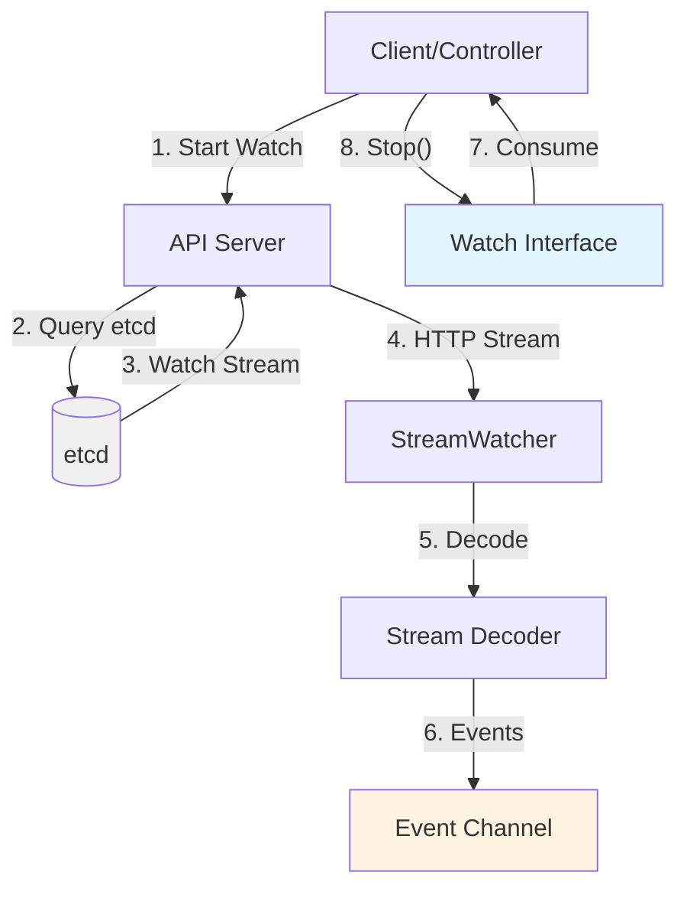

### **Event Flow Sequence**

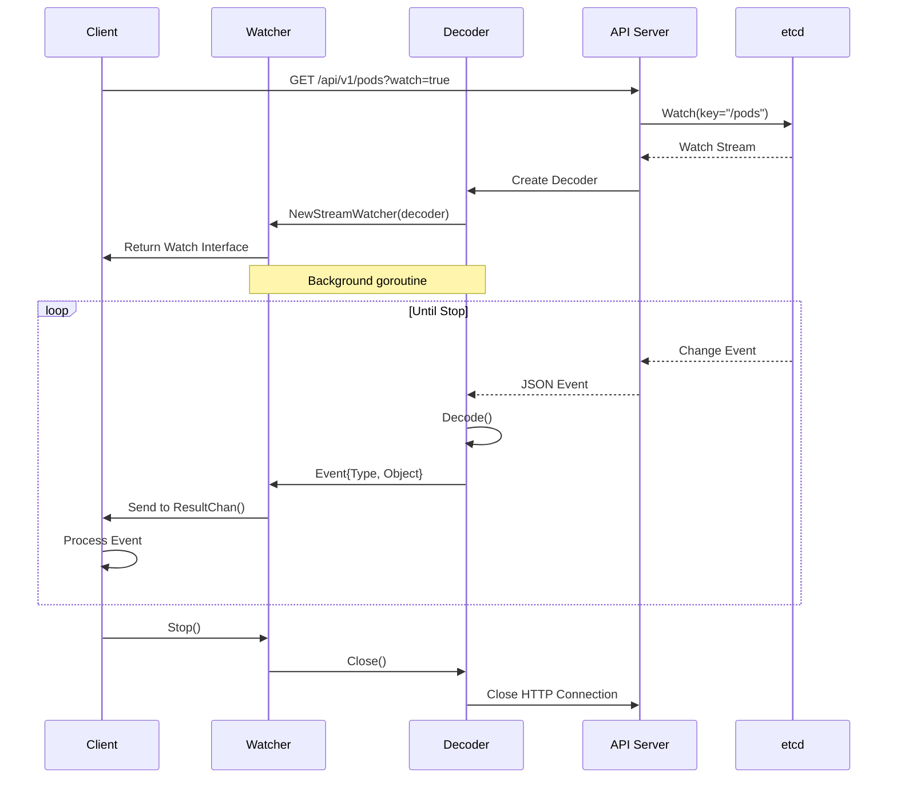

### **Usage Pattern**

```go
import (
    metav1 "k8s.io/apimachinery/pkg/apis/meta/v1"
    "k8s.io/client-go/kubernetes"
)

func watchPods(clientset *kubernetes.Clientset) {
    // Start watch
    watcher, err := clientset.CoreV1().Pods("default").Watch(
        context.Background(),
        metav1.ListOptions{},
    )
    if err != nil {
        panic(err)
    }
    defer watcher.Stop()

    // Process events
    for event := range watcher.ResultChan() {
        pod := event.Object.(*v1.Pod)

        switch event.Type {
        case watch.Added:
            fmt.Printf("Pod added: %s\n", pod.Name)
        case watch.Modified:
            fmt.Printf("Pod modified: %s\n", pod.Name)
        case watch.Deleted:
            fmt.Printf("Pod deleted: %s\n", pod.Name)
        case watch.Error:
            fmt.Printf("Error: %v\n", event.Object)
        }
    }
}
```

### **Key Code References**

| Component | File:Line | Description |
|-----------|-----------|-------------|
| `Interface` | `watch.go:30` | Main watch interface |
| `Stop()` | `watch.go:33` | Stop watching |
| `ResultChan()` | `watch.go:50` | Get event channel |
| `EventType` | `watch.go:54` | Event type constants |

━━━━━━━━━━━━━━━━━━━━━━━━━━━━━━━━━━━━━━━━━━━━━━━━━━━━━━━━━━━━━━━━━━━━━━━━━━━━━━

## **# Watch Events and Types**

### **Event Structure**

**Location**: `staging/src/k8s.io/apimachinery/pkg/watch/watch.go:70`

```go
// Event represents a single event to a watched resource.
type Event struct {
    Type EventType

    // Object is:
    //  * If Type is Added or Modified: the new state of the object.
    //  * If Type is Deleted: the state immediately before deletion.
    //  * If Type is Bookmark: object with only ResourceVersion set.
    //  * If Type is Error: *api.Status is recommended.
    Object runtime.Object
}
```

### **Event Types**

**Location**: `staging/src/k8s.io/apimachinery/pkg/watch/watch.go:54`

```go
type EventType string

const (
    Added    EventType = "ADDED"
    Modified EventType = "MODIFIED"
    Deleted  EventType = "DELETED"
    Bookmark EventType = "BOOKMARK"
    Error    EventType = "ERROR"
)
```

### **Event Type Semantics**

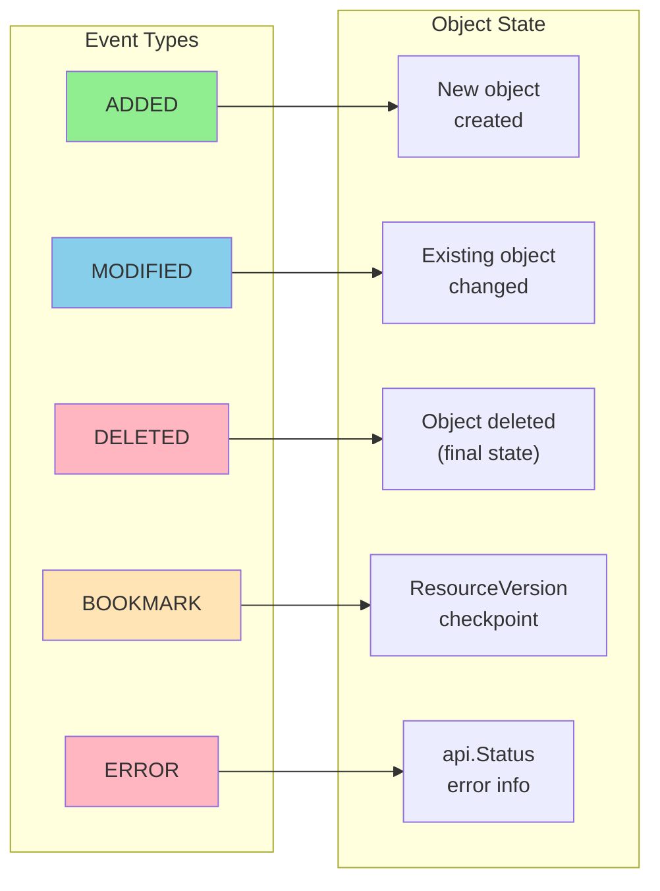

### **Event Type Details**

#### **1. ADDED**

Sent when a new object is created or when a watch is first established.

```go
// Initial LIST returns 3 pods, followed by ADDED events
Event{Type: Added, Object: pod1}  // Initial state
Event{Type: Added, Object: pod2}  // Initial state
Event{Type: Added, Object: pod3}  // Initial state

// Later, new pod created
Event{Type: Added, Object: pod4}  // Real-time addition
```

💡 **Aha Moment**: When you start watching, you first get ADDED events for all existing objects matching your selector. This "resync" ensures your local cache is in sync.

#### **2. MODIFIED**

Sent when an existing object is updated.

```go
Event{Type: Modified, Object: podWithNewStatus}
```

**What triggers MODIFIED?**:
- Spec changes (e.g., image update)
- Status updates (e.g., pod phase change)
- Metadata changes (labels, annotations)
- Any field update

#### **3. DELETED**

Sent when an object is removed.

```go
Event{Type: Deleted, Object: podBeforeDeletion}
```

The object contains the **final state** before deletion, including:
- Final status
- DeletionTimestamp (if graceful deletion)
- Finalizers still pending

#### **4. BOOKMARK**

Special event for efficient watch resumption (see [Bookmark Events](#bookmark-events)).

```go
Event{
    Type: Bookmark,
    Object: &Pod{
        ObjectMeta: metav1.ObjectMeta{
            ResourceVersion: "12345",  // Only field set
        },
    },
}
```

#### **5. ERROR**

Sent when the watch encounters an error.

```go
Event{
    Type: Error,
    Object: &metav1.Status{
        Status:  "Failure",
        Message: "too old resource version: 100 (12000)",
        Reason:  "Expired",
        Code:    410,  // Gone
    },
}
```

**Common error scenarios**:
- **410 Gone**: Resource version too old
- **503 Service Unavailable**: API server overloaded
- Network errors

### **Event Processing Pattern**

```go
func processEvents(watcher watch.Interface) {
    defer watcher.Stop()

    for event := range watcher.ResultChan() {
        switch event.Type {
        case watch.Added:
            handleAdd(event.Object)

        case watch.Modified:
            handleUpdate(event.Object)

        case watch.Deleted:
            handleDelete(event.Object)

        case watch.Bookmark:
            // Save resource version for resumption
            saveBookmark(event.Object)

        case watch.Error:
            // Handle error, possibly restart watch
            status := event.Object.(*metav1.Status)
            if status.Code == 410 {
                // Resource version expired, restart from latest
                return restartWatch("", watcher)
            }
            // Other errors
            klog.Errorf("Watch error: %v", status.Message)
        }
    }
}
```

━━━━━━━━━━━━━━━━━━━━━━━━━━━━━━━━━━━━━━━━━━━━━━━━━━━━━━━━━━━━━━━━━━━━━━━━━━━━━━

## **# StreamWatcher Implementation**

### **Overview**

`StreamWatcher` is the most common watch implementation, designed to watch **streaming HTTP responses** from the API server.

**Location**: `staging/src/k8s.io/apimachinery/pkg/watch/streamwatcher.go:53`

### **StreamWatcher Structure**

```go
// StreamWatcher turns any stream for which you can write a Decoder
// interface into a watch.Interface.
type StreamWatcher struct {
    sync.Mutex
    source   Decoder      // Decodes stream into events
    reporter Reporter     // Converts errors to runtime.Object
    result   chan Event   // Event delivery channel
    done     chan struct{} // Shutdown signal
}
```

### **Decoder Interface**

**Location**: `staging/src/k8s.io/apimachinery/pkg/watch/streamwatcher.go:32`

```go
// Decoder allows StreamWatcher to watch any stream
type Decoder interface {
    // Decode should return the type of event, the decoded object, or an error.
    // Decode should block until it has data or an error occurs.
    Decode() (action EventType, object runtime.Object, err error)

    // Close should close the underlying io.Reader
    Close()
}
```

### **StreamWatcher Lifecycle**

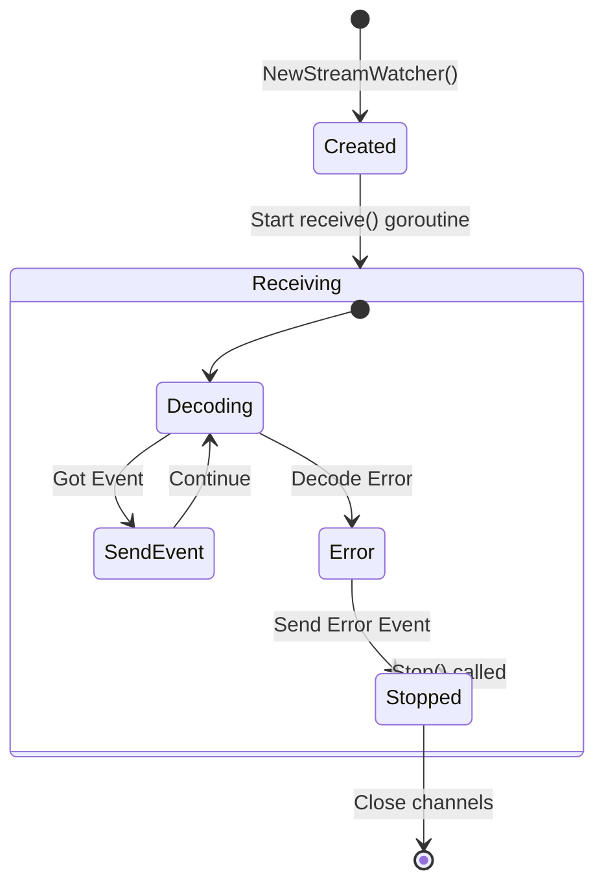

### **Implementation Details**

```go
func NewStreamWatcher(d Decoder, r Reporter) *StreamWatcher {
    sw := &StreamWatcher{
        source:   d,
        reporter: r,
        result:   make(chan Event),  // Unbuffered!
        done:     make(chan struct{}),
    }
    go sw.receive()  // Background goroutine
    return sw
}

// receive reads result from the decoder in a loop
func (sw *StreamWatcher) receive() {
    defer close(sw.result)  // Signal completion
    defer sw.Stop()         // Ensure cleanup

    for {
        action, obj, err := sw.source.Decode()
        if err != nil {
            switch err {
            case io.EOF:
                // watch closed normally
            case io.ErrUnexpectedEOF:
                // connection dropped
            default:
                // Send error event
                select {
                case sw.result <- Event{
                    Type:   Error,
                    Object: sw.reporter.AsObject(err),
                }:
                case <-sw.done:
                }
            }
            return
        }

        // Send event
        select {
        case sw.result <- Event{Type: action, Object: obj}:
        case <-sw.done:
            return
        }
    }
}
```

### **Why Unbuffered Channel?**

💡 **Design Decision**: The result channel is **unbuffered** (`make(chan Event)`).

**Rationale**:
- Consumer can add buffering if needed (via goroutine)
- Consumer cannot remove buffering if baked in
- Provides **backpressure** - if consumer is slow, API server slows down
- Prevents memory bloat from buffering unlimited events

### **StreamWatcher Architecture**

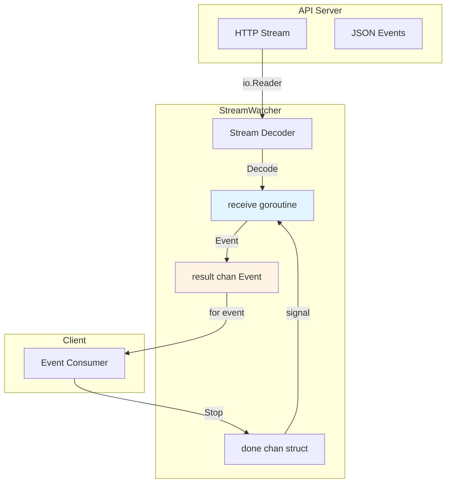

### **Key Code References**

| Component | File:Line | Description |
|-----------|-----------|-------------|
| `StreamWatcher` | `streamwatcher.go:53` | Main structure |
| `NewStreamWatcher()` | `streamwatcher.go:70` | Constructor |
| `receive()` | `streamwatcher.go:109` | Event loop goroutine |
| `Stop()` | `streamwatcher.go:95` | Shutdown |

━━━━━━━━━━━━━━━━━━━━━━━━━━━━━━━━━━━━━━━━━━━━━━━━━━━━━━━━━━━━━━━━━━━━━━━━━━━━━━

## **# Resource Versioning**

### **Overview**

Resource versioning is **fundamental** to Kubernetes' consistency model. Every object has a `ResourceVersion` that changes with each modification.

### **ResourceVersion Purpose**

1. **Optimistic Concurrency Control**: Detect conflicting updates
2. **Watch Resumption**: Resume watching from a specific point
3. **List Consistency**: Get a consistent snapshot
4. **Change Detection**: Know if an object changed

### **ResourceVersion in ObjectMeta**

**Location**: `staging/src/k8s.io/apimachinery/pkg/apis/meta/v1/types.go:172`

```go
type ObjectMeta struct {
    // ... other fields ...

    // ResourceVersion is an opaque value that represents the internal
    // version of this object. Clients must treat these values as opaque
    // and passed unmodified back to the server.
    ResourceVersion string `json:"resourceVersion,omitempty"`
}
```

### **ResourceVersion Semantics**

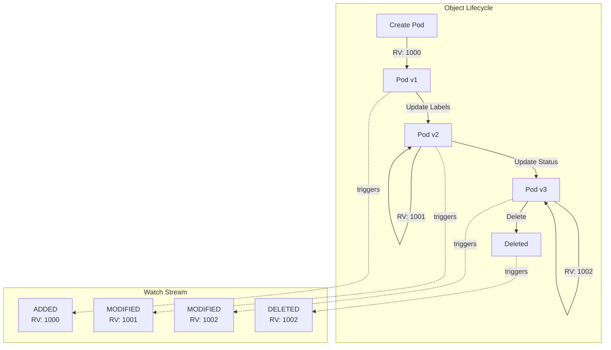

### **ResourceVersion Properties**

1. **Opaque**: Format is implementation-defined (etcd uses revision number)
2. **Monotonic**: Newer versions have higher values
3. **Per-Object**: Each object has its own version
4. **Global Ordering**: Can compare across objects for ordering

### **Using ResourceVersion for Watch**

```go
// Watch from the beginning (all existing + new changes)
watcher, _ := client.CoreV1().Pods("default").Watch(ctx, metav1.ListOptions{
    ResourceVersion: "",  // or "0"
})

// Watch from specific version (only changes after this version)
watcher, _ := client.CoreV1().Pods("default").Watch(ctx, metav1.ListOptions{
    ResourceVersion: "12345",
})

// Watch from latest (only new changes, skip existing)
list, _ := client.CoreV1().Pods("default").List(ctx, metav1.ListOptions{})
watcher, _ := client.CoreV1().Pods("default").Watch(ctx, metav1.ListOptions{
    ResourceVersion: list.ResourceVersion,  // Start from list version
})
```

### **ResourceVersion in LIST Operations**

```go
// Get list with resource version
list, _ := client.CoreV1().Pods("default").List(ctx, metav1.ListOptions{})

// list.ResourceVersion is the version of the entire list
fmt.Printf("List version: %s\n", list.ResourceVersion)

// Each pod has its own ResourceVersion
for _, pod := range list.Items {
    fmt.Printf("Pod %s version: %s\n", pod.Name, pod.ResourceVersion)
}
```

### **Optimistic Concurrency Control**

```go
func updatePodWithRetry(client *kubernetes.Clientset, podName string) error {
    for i := 0; i < 10; i++ {
        // Get current version
        pod, err := client.CoreV1().Pods("default").Get(
            ctx, podName, metav1.GetOptions{},
        )
        if err != nil {
            return err
        }

        // Modify pod
        pod.Labels["updated"] = "true"

        // Try to update - will fail if ResourceVersion changed
        _, err = client.CoreV1().Pods("default").Update(ctx, pod, metav1.UpdateOptions{})
        if err == nil {
            return nil  // Success!
        }

        // Check if conflict (someone else updated)
        if errors.IsConflict(err) {
            fmt.Printf("Conflict detected, retry %d\n", i+1)
            continue  // Retry
        }

        return err  // Other error
    }
    return fmt.Errorf("failed after 10 retries")
}
```

### **ResourceVersion Comparison**

💡 **Aha Moment**: Even though ResourceVersion is a string, you can compare them numerically (in etcd3 storage) to determine ordering.

```go
// Example: etcd3 uses numeric revision
rv1 := "1000"
rv2 := "1001"

// rv2 is newer than rv1
// This works because etcd revision numbers are monotonically increasing
```

### **Watch Resumption with ResourceVersion**

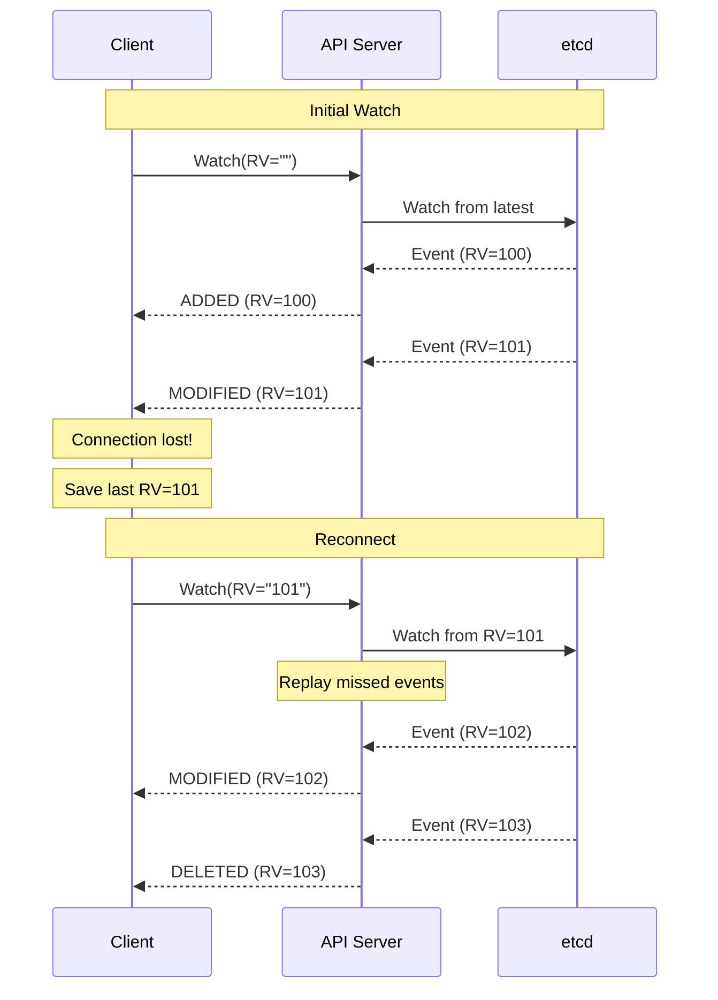

━━━━━━━━━━━━━━━━━━━━━━━━━━━━━━━━━━━━━━━━━━━━━━━━━━━━━━━━━━━━━━━━━━━━━━━━━━━━━━

## **# Bookmark Events**

### **Overview**

Bookmark events are a **watch optimization** that allows clients to safely resume watches without replaying all events since the beginning.

**Location**: `staging/src/k8s.io/apimachinery/pkg/apis/meta/v1/types.go:350`

### **The Problem Bookmarks Solve**

```mermaid
graph TB
    subgraph "Without Bookmarks"
        W1[Watch starts<br/>RV: 1000]
        W2[No events for<br/>10 minutes]
        W3[Connection lost]
        W4[Resume from<br/>RV: 1000]
        W5[Replay 10k events<br/>RV: 1000-11000]

        W1 --> W2 --> W3 --> W4 --> W5
    end

    subgraph "With Bookmarks"
        B1[Watch starts<br/>RV: 1000]
        B2[Bookmark<br/>RV: 5000]
        B3[Bookmark<br/>RV: 10000]
        B4[Connection lost]
        B5[Resume from<br/>RV: 10000]
        B6[Minimal replay]

        B1 --> B2 --> B3 --> B4 --> B5 --> B6
    end

    style W5 fill:#FFB6C1
    style B6 fill:#90EE90
```

💡 **Aha Moment**: Without bookmarks, if your watch is idle (no events for your resource), you still must resume from the last event you received - which could be hours ago! Bookmarks give you periodic "checkpoints" even when nothing is happening.

### **Enabling Bookmarks**

```go
watcher, err := client.CoreV1().Pods("default").Watch(ctx, metav1.ListOptions{
    AllowWatchBookmarks: true,  // Request bookmarks
})
```

### **Bookmark Event Structure**

```go
Event{
    Type: watch.Bookmark,
    Object: &v1.Pod{  // Same type as watched resource
        ObjectMeta: metav1.ObjectMeta{
            ResourceVersion: "12345",  // ONLY field set
            // All other fields are zero values
        },
    },
}
```

### **Processing Bookmarks**

```go
var lastResourceVersion string

for event := range watcher.ResultChan() {
    switch event.Type {
    case watch.Bookmark:
        // Extract and save resource version
        pod := event.Object.(*v1.Pod)
        lastResourceVersion = pod.ResourceVersion

        // Persist for crash recovery
        saveCheckpoint(lastResourceVersion)

    case watch.Added, watch.Modified, watch.Deleted:
        // Process event normally
        pod := event.Object.(*v1.Pod)
        lastResourceVersion = pod.ResourceVersion
        handleEvent(event.Type, pod)
    }
}
```

### **When Are Bookmarks Sent?**

Bookmarks are sent **at the server's discretion**, typically:

1. **Periodically** (e.g., every 1 minute) when idle
2. **Before closing** a watch (if possible)
3. **Never guaranteed** - client must handle absence

### **Bookmark Guarantees**

From the API documentation:

> If this is a watch, client is guaranteed to:
> - **NOT get repeat events** when resuming from bookmark
> - **NOT miss any events** that happened after bookmark

### **Resuming from Bookmark**

```go
func watchWithResumption(client *kubernetes.Clientset) {
    lastRV := loadCheckpoint()  // e.g., "12345" from previous session

    for {
        watcher, err := client.CoreV1().Pods("default").Watch(
            ctx,
            metav1.ListOptions{
                ResourceVersion:      lastRV,
                AllowWatchBookmarks: true,
            },
        )
        if err != nil {
            // Handle error
            time.Sleep(time.Second)
            continue
        }

        // Process events, updating lastRV
        for event := range watcher.ResultChan() {
            switch event.Type {
            case watch.Bookmark, watch.Added, watch.Modified, watch.Deleted:
                obj := event.Object.(metav1.Object)
                lastRV = obj.GetResourceVersion()

                if event.Type == watch.Bookmark {
                    saveCheckpoint(lastRV)
                } else {
                    handleEvent(event)
                }

            case watch.Error:
                // Handle error, possibly restart
            }
        }

        // Watch closed, restart
    }
}
```

### **Bookmark Behavior**

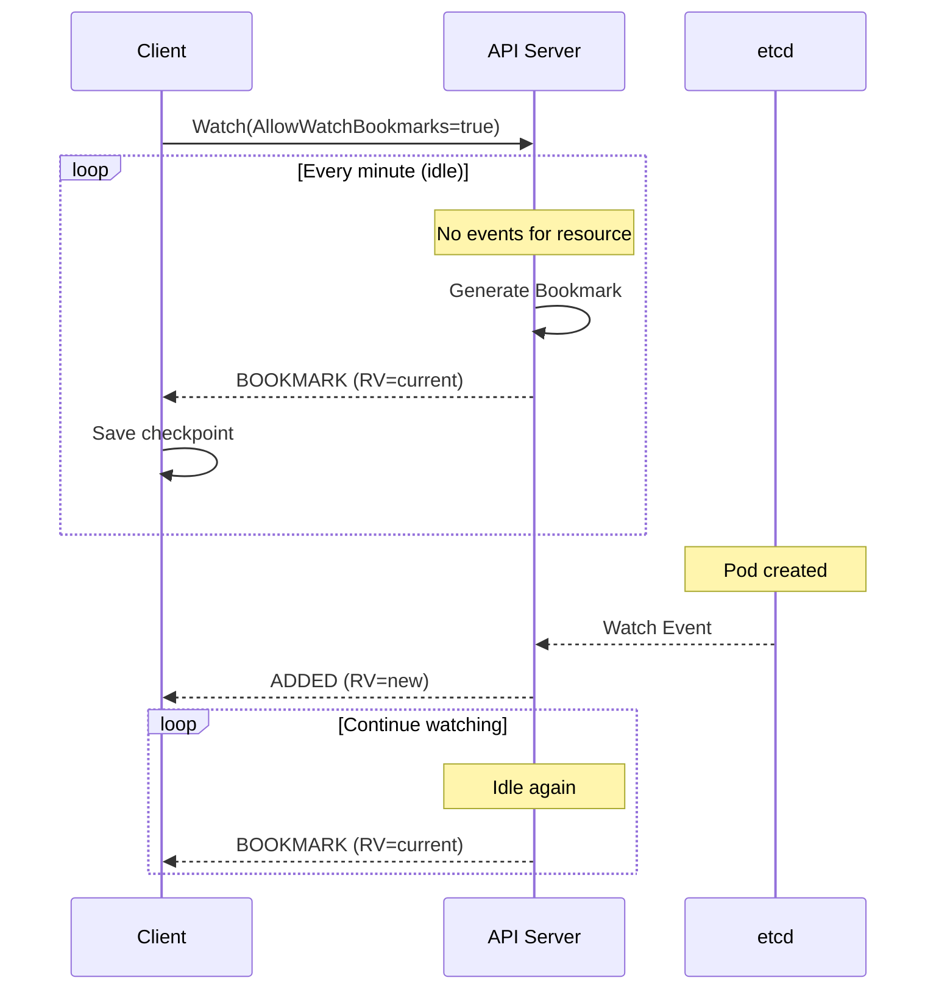

━━━━━━━━━━━━━━━━━━━━━━━━━━━━━━━━━━━━━━━━━━━━━━━━━━━━━━━━━━━━━━━━━━━━━━━━━━━━━━

## **# ObjectMeta - Object Metadata**

### **Overview**

`ObjectMeta` is the **standard metadata** present in every Kubernetes object. It contains identity, versioning, organization, and lifecycle information.

**Location**: `staging/src/k8s.io/apimachinery/pkg/apis/meta/v1/types.go:111`

### **ObjectMeta Structure**

```go
type ObjectMeta struct {
    // Identity
    Name              string
    GenerateName      string
    Namespace         string
    UID               types.UID

    // Versioning
    ResourceVersion   string
    Generation        int64

    // Timestamps
    CreationTimestamp Time
    DeletionTimestamp *Time
    DeletionGracePeriodSeconds *int64

    // Organization
    Labels            map[string]string
    Annotations       map[string]string

    // Ownership & Lifecycle
    OwnerReferences   []OwnerReference
    Finalizers        []string

    // Server-Side Apply
    ManagedFields     []ManagedFieldsEntry
}
```

### **ObjectMeta Field Categories**

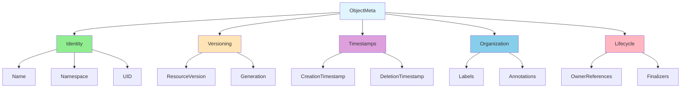

### **Identity Fields**

#### **Name**

Unique identifier within a namespace.

```go
ObjectMeta{
    Name: "my-pod",
    Namespace: "default",
}
```

**Rules**:
- Must be unique within namespace and resource type
- DNS label format (lowercase, alphanumeric, `-`)
- Max 253 characters
- Cannot be changed

#### **GenerateName**

Prefix for server-generated names.

```go
ObjectMeta{
    GenerateName: "my-pod-",  // Server generates: my-pod-abc123
}
```

**Used by**:
- ReplicaSet creates Pods with `GenerateName: "replicaset-name-"`
- Jobs create Pods with generated names

#### **Namespace**

Scope for the object.

```go
ObjectMeta{
    Name: "my-pod",
    Namespace: "production",
}
```

**Special values**:
- `"default"`: Default namespace
- `""`: Cluster-scoped (for cluster-scoped resources like Nodes)

#### **UID**

Unique across space and time.

```go
ObjectMeta{
    UID: "550e8400-e29b-41d4-a716-446655440000",
}
```

**Properties**:
- Generated by API server
- UUID format
- Used for owner references
- Survives name reuse

### **Versioning Fields**

#### **ResourceVersion**

Covered in [Resource Versioning](#resource-versioning).

#### **Generation**

**Spec** version counter.

```go
ObjectMeta{
    Generation: 3,  // Spec changed 3 times
}

Status{
    ObservedGeneration: 2,  // Controller processed up to generation 2
}
```

**Usage**:
- Incremented only when `.spec` changes
- NOT incremented for `.status` or `.metadata` changes
- Controllers use to detect spec updates

💡 **Aha Moment**: `ResourceVersion` changes on ANY update, but `Generation` changes only when the desired state (spec) changes. This helps controllers distinguish "user changed desired state" from "someone updated status".

### **Timestamp Fields**

#### **CreationTimestamp**

When the object was created.

```go
ObjectMeta{
    CreationTimestamp: metav1.Time{Time: time.Now()},
}
```

**Properties**:
- Set by API server
- RFC3339 format
- Immutable

#### **DeletionTimestamp**

When graceful deletion was requested.

```go
ObjectMeta{
    DeletionTimestamp: &metav1.Time{Time: time.Now().Add(30 * time.Second)},
    DeletionGracePeriodSeconds: pointer.Int64(30),
    Finalizers: []string{"my-finalizer"},  // Blocks deletion
}
```

**Graceful Deletion Flow**:

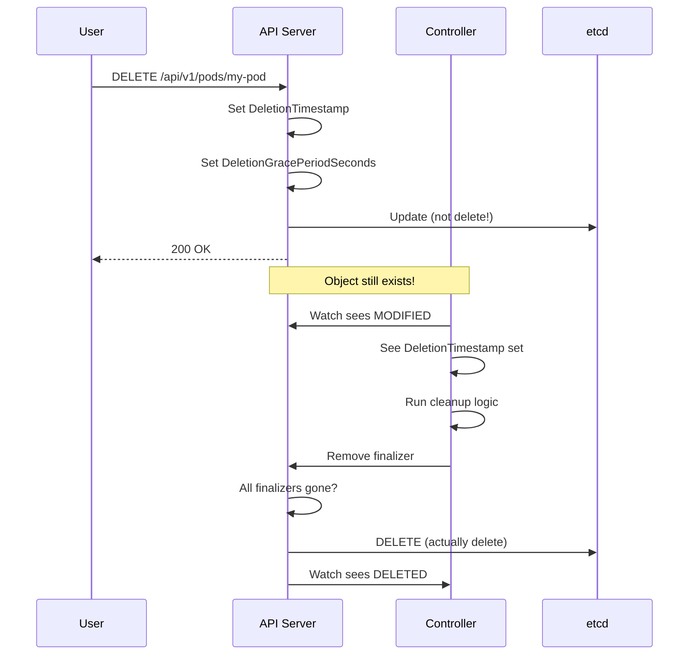

### **Organization Fields**

#### **Labels**

Key-value pairs for organizing and selecting objects.

```go
ObjectMeta{
    Labels: map[string]string{
        "app":         "nginx",
        "environment": "production",
        "version":     "1.0",
    },
}
```

**Used for**:
- Selectors (Services, Deployments)
- Grouping (kubectl get pods -l app=nginx)
- Scheduling (node selectors)

**Rules**:
- Keys: `prefix/name` format (optional prefix)
- Max key length: 63 characters (name), 253 (prefix)
- Values: Max 63 characters

#### **Annotations**

Key-value pairs for arbitrary non-identifying metadata.

```go
ObjectMeta{
    Annotations: map[string]string{
        "kubectl.kubernetes.io/last-applied-configuration": "...",
        "deployment.kubernetes.io/revision": "3",
        "description": "This is my application",
    },
}
```

**Used for**:
- Tool metadata (kubectl, helm)
- Configuration (ingress controller)
- Human-readable notes

**Not used for**:
- Selection (use labels instead)

### **Complete Example**

```go
pod := &v1.Pod{
    ObjectMeta: metav1.ObjectMeta{
        Name:      "nginx",
        Namespace: "default",
        Labels: map[string]string{
            "app": "nginx",
        },
        Annotations: map[string]string{
            "description": "Web server",
        },
        OwnerReferences: []metav1.OwnerReference{
            {
                APIVersion: "apps/v1",
                Kind:       "ReplicaSet",
                Name:       "nginx-rs",
                UID:        "123-456",
                Controller: pointer.Bool(true),
            },
        },
        Finalizers: []string{
            "kubernetes.io/pvc-protection",
        },
    },
    Spec: v1.PodSpec{
        // ... pod spec ...
    },
}
```

### **Key Code References**

| Field | File:Line | Description |
|-------|-----------|-------------|
| `ObjectMeta` | `types.go:111` | Full structure |
| `Name` | `types.go:119` | Object name |
| `Namespace` | `types.go:145` | Namespace |
| `UID` | `types.go:159` | Unique ID |
| `ResourceVersion` | `types.go:172` | Version string |
| `Generation` | `types.go:177` | Spec version |
| `CreationTimestamp` | `types.go:188` | Creation time |
| `DeletionTimestamp` | `types.go:209` | Deletion time |
| `Labels` | `types.go:223` | Label map |
| `Annotations` | `types.go:230` | Annotation map |
| `OwnerReferences` | `types.go:241` | Owner refs |
| `Finalizers` | `types.go:259` | Finalizer list |

━━━━━━━━━━━━━━━━━━━━━━━━━━━━━━━━━━━━━━━━━━━━━━━━━━━━━━━━━━━━━━━━━━━━━━━━━━━━━━

## **# TypeMeta and ListMeta**

### **TypeMeta**

**Location**: `staging/src/k8s.io/apimachinery/pkg/apis/meta/v1/types.go:42`

```go
// TypeMeta describes an individual object in an API response or request
type TypeMeta struct {
    // Kind is a string value representing the REST resource this object
    // represents. In CamelCase.
    Kind string `json:"kind,omitempty"`

    // APIVersion defines the versioned schema of this representation of
    // an object.
    APIVersion string `json:"apiVersion,omitempty"`
}
```

### **TypeMeta Purpose**

Identifies the **type** and **version** of an object.

```go
pod := &v1.Pod{
    TypeMeta: metav1.TypeMeta{
        APIVersion: "v1",
        Kind:       "Pod",
    },
    ObjectMeta: metav1.ObjectMeta{
        Name: "my-pod",
    },
}
```

### **When TypeMeta Is Used**

1. **Serialization**: Embedded in JSON/YAML
2. **Unstructured Objects**: Dynamic client needs type info
3. **Multi-Type Responses**: List of different types

```yaml
apiVersion: v1
kind: Pod
metadata:
  name: my-pod
spec:
  containers:
  - name: nginx
    image: nginx
```

### **ListMeta**

**Location**: `staging/src/k8s.io/apimachinery/pkg/apis/meta/v1/types.go:61`

```go
// ListMeta describes metadata for list responses
type ListMeta struct {
    // ResourceVersion of the list (not individual items)
    ResourceVersion string `json:"resourceVersion,omitempty"`

    // Continue token for pagination
    Continue string `json:"continue,omitempty"`

    // RemainingItemCount estimates items remaining
    RemainingItemCount *int64 `json:"remainingItemCount,omitempty"`
}
```

### **List Structure**

```go
podList, _ := client.CoreV1().Pods("default").List(ctx, metav1.ListOptions{})

// podList.ListMeta.ResourceVersion is the version of the LIST operation
// Each pod.ObjectMeta.ResourceVersion is the version of that pod

fmt.Printf("List version: %s\n", podList.ResourceVersion)
for _, pod := range podList.Items {
    fmt.Printf("Pod %s version: %s\n", pod.Name, pod.ResourceVersion)
}
```

### **Pagination with ListMeta**

```go
func listAllPods(client *kubernetes.Clientset) {
    var continueToken string

    for {
        list, _ := client.CoreV1().Pods("").List(ctx, metav1.ListOptions{
            Limit:    100,  // Page size
            Continue: continueToken,
        })

        // Process pods
        for _, pod := range list.Items {
            fmt.Printf("Pod: %s\n", pod.Name)
        }

        // Check if more results
        if list.Continue == "" {
            break  // Done
        }
        continueToken = list.Continue
    }
}
```

━━━━━━━━━━━━━━━━━━━━━━━━━━━━━━━━━━━━━━━━━━━━━━━━━━━━━━━━━━━━━━━━━━━━━━━━━━━━━━

## **# Label Selectors**

### **Overview**

Label selectors are Kubernetes' **primary grouping mechanism**. They allow selecting objects based on their labels.

**Location**: `staging/src/k8s.io/apimachinery/pkg/labels/selector.go:64`

### **Selector Interface**

```go
type Selector interface {
    // Matches returns true if this selector matches the given labels
    Matches(Labels) bool

    // Empty returns true if this selector matches everything
    Empty() bool

    // String returns a human-readable selector
    String() string

    // Requirements returns individual requirements
    Requirements() (Requirements, bool)
}
```

### **Label Selector Types**

#### **1. Equality-Based Selectors**

```bash
# Equality
environment=production
tier!=frontend

# Multiple (AND)
environment=production,tier=frontend
```

```go
selector := labels.SelectorFromSet(labels.Set{
    "environment": "production",
    "tier":        "frontend",
})

if selector.Matches(labels.Set{"environment": "production", "tier": "frontend"}) {
    fmt.Println("Matches!")
}
```

#### **2. Set-Based Selectors**

```bash
# In
environment in (production, staging)

# NotIn
tier notin (frontend, backend)

# Exists
app

# Does not exist
!debug
```

```go
req1, _ := labels.NewRequirement("environment", selection.In, []string{"production", "staging"})
req2, _ := labels.NewRequirement("tier", selection.NotIn, []string{"frontend"})

selector := labels.NewSelector()
selector = selector.Add(*req1, *req2)
```

### **Requirement Structure**

**Location**: `staging/src/k8s.io/apimachinery/pkg/labels/selector.go:165`

```go
type Requirement struct {
    key      string
    operator selection.Operator
    strValues []string
}

// Operators
const (
    DoesNotExist Operator = "!"
    Equals       Operator = "="
    DoubleEquals Operator = "=="
    In           Operator = "in"
    NotIn        Operator = "notin"
    NotEquals    Operator = "!="
    Exists       Operator = "exists"
    GreaterThan  Operator = "gt"
    LessThan     Operator = "lt"
)
```

### **Selector Matching Logic**

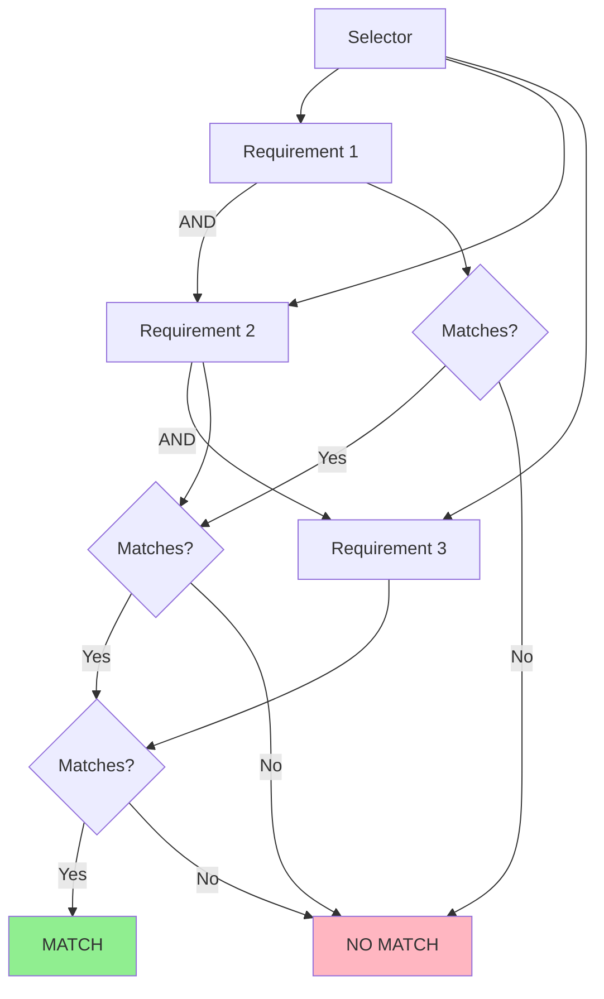

### **Parsing Label Selectors**

**Location**: `staging/src/k8s.io/apimachinery/pkg/labels/selector.go:907`

```go
func Parse(selector string) (Selector, error) {
    // Parses string into Selector
}

// Examples:
selector, _ := labels.Parse("environment=production,tier=frontend")
selector, _ := labels.Parse("environment in (production,staging),tier!=cache")
selector, _ := labels.Parse("app,!debug")
```

### **Real-World Usage - Service Selector**

```yaml
apiVersion: v1
kind: Service
metadata:
  name: my-service
spec:
  selector:
    app: nginx      # Equality-based selector
    tier: frontend
  ports:
  - port: 80
```

```go
// Service controller uses selector to find pods
service, _ := client.CoreV1().Services("default").Get(ctx, "my-service", metav1.GetOptions{})

// Convert service selector to labels.Selector
selector := labels.SelectorFromSet(service.Spec.Selector)

// List pods matching selector
pods, _ := client.CoreV1().Pods("default").List(ctx, metav1.ListOptions{
    LabelSelector: selector.String(),
})

fmt.Printf("Service selects %d pods\n", len(pods.Items))
```

### **Selector Examples**

```go
// Everything selector
all := labels.Everything()  // Matches all objects

// Nothing selector
none := labels.Nothing()  // Matches no objects

// Equality
sel := labels.SelectorFromSet(labels.Set{
    "app": "nginx",
})

// Set-based
req, _ := labels.NewRequirement("environment", selection.In, []string{"prod", "staging"})
sel := labels.NewSelector().Add(*req)

// Parse from string
sel, _ := labels.Parse("app=nginx,environment in (prod,staging)")
```

### **Label Validation**

```go
// Valid labels
labels.Set{
    "app":                           "nginx",           // Simple
    "kubernetes.io/cluster-service": "true",           // With prefix
    "version":                       "v1.0.0",         // With dots
}

// Invalid labels
labels.Set{
    "this-key-is-way-too-long-and-exceeds-63-characters-limit": "value",  // ❌ Key too long
    "":                                                           "value",  // ❌ Empty key
    "key": "this-value-is-way-too-long-and-exceeds-63-characters-limit",   // ❌ Value too long
}
```

### **Optimization - Set vs Selector**

```go
// Fast path: Direct map lookup (O(1))
labelSet := labels.Set{"app": "nginx", "tier": "frontend"}
if labelSet["app"] == "nginx" {
    // Fast!
}

// Flexible: Selector with requirements (O(n) where n = num requirements)
selector, _ := labels.Parse("app=nginx,tier=frontend")
if selector.Matches(labelSet) {
    // More flexible, but slower
}
```

### **Key Code References**

| Component | File:Line | Description |
|-----------|-----------|-------------|
| `Selector` interface | `selector.go:64` | Main selector interface |
| `Requirement` | `selector.go:165` | Individual requirement |
| `NewRequirement()` | `selector.go:185` | Create requirement |
| `Parse()` | `selector.go:907` | Parse string selector |
| `SelectorFromSet()` | `labels.go:80` | Create from label set |

━━━━━━━━━━━━━━━━━━━━━━━━━━━━━━━━━━━━━━━━━━━━━━━━━━━━━━━━━━━━━━━━━━━━━━━━━━━━━━

## **# Field Selectors**

### **Overview**

Field selectors allow filtering objects by **object fields** rather than labels.

**Location**: `staging/src/k8s.io/apimachinery/pkg/fields/selector.go:29`

### **Field Selector vs Label Selector**

| Feature | Label Selector | Field Selector |
|---------|----------------|----------------|
| **Purpose** | User-defined organization | System field filtering |
| **Flexibility** | Any label | Limited to specific fields |
| **Operators** | Many (=, !=, in, notin, exists) | Few (=, !=) |
| **Indexing** | Can index on any label | Only indexed fields supported |

### **Selector Interface**

```go
type Selector interface {
    // Matches returns true if this selector matches the given fields
    Matches(Fields) bool

    // Empty returns true if this selector matches everything
    Empty() bool

    // RequiresExactMatch introspects for exact match requirement
    RequiresExactMatch(field string) (value string, found bool)

    // String returns human-readable representation
    String() string
}
```

### **Supported Field Selectors**

**Common fields**:
- `metadata.name`: Object name
- `metadata.namespace`: Object namespace
- `status.phase`: Pod/PV phase
- `spec.nodeName`: Pod's assigned node

**Important**: Not all fields are supported! Each resource type defines which fields can be used.

### **Usage Examples**

```go
// Field selector for pod name
pods, _ := client.CoreV1().Pods("default").List(ctx, metav1.ListOptions{
    FieldSelector: "metadata.name=my-pod",
})

// Field selector for pod phase
pods, _ := client.CoreV1().Pods("default").List(ctx, metav1.ListOptions{
    FieldSelector: "status.phase=Running",
})

// Field selector for assigned node
pods, _ := client.CoreV1().Pods("").List(ctx, metav1.ListOptions{
    FieldSelector: "spec.nodeName=node-1",
})

// Multiple field selectors (AND)
pods, _ := client.CoreV1().Pods("default").List(ctx, metav1.ListOptions{
    FieldSelector: "status.phase=Running,spec.nodeName=node-1",
})
```

### **Field Selector Syntax**

```bash
# Equality
metadata.name=my-pod

# Inequality
status.phase!=Pending

# Multiple (AND)
status.phase=Running,spec.nodeName=node-1
```

### **Field Selector Limitations**

```go
// ✅ Supported
fields.SelectorFromSet(fields.Set{
    "metadata.name": "my-pod",
})

// ❌ NOT supported (field not indexed)
fields.SelectorFromSet(fields.Set{
    "spec.containers[0].image": "nginx",  // Can't filter on this
})
```

### **Combining Label and Field Selectors**

```go
pods, _ := client.CoreV1().Pods("default").List(ctx, metav1.ListOptions{
    LabelSelector: "app=nginx,tier=frontend",     // Label filter
    FieldSelector: "status.phase=Running",        // Field filter
})
// Returns: Running pods with labels app=nginx AND tier=frontend
```

### **When to Use Field Selectors**

**Use field selectors when**:
- Filtering by system fields (name, namespace, phase, node)
- Need efficient server-side filtering on indexed fields
- Building tools that query specific object states

**Use label selectors when**:
- Organizing and grouping objects
- Flexible, user-defined categorization
- Need advanced operators (in, notin, exists)

### **kubectl Examples**

```bash
# List pods by name
kubectl get pods --field-selector metadata.name=my-pod

# List running pods
kubectl get pods --field-selector status.phase=Running

# List pods on specific node
kubectl get pods --field-selector spec.nodeName=node-1

# Combine field and label selectors
kubectl get pods \
  --field-selector status.phase=Running \
  --selector app=nginx
```

### **Field Selector Parsing**

**Location**: `staging/src/k8s.io/apimachinery/pkg/fields/selector.go`

```go
// Parse field selector string
selector, err := fields.ParseSelector("metadata.name=my-pod,status.phase=Running")

// Create from map
selector := fields.SelectorFromSet(fields.Set{
    "metadata.name": "my-pod",
    "status.phase":  "Running",
})

// Match against object fields
objFields := fields.Set{
    "metadata.name": "my-pod",
    "status.phase":  "Running",
}

if selector.Matches(objFields) {
    fmt.Println("Match!")
}
```

━━━━━━━━━━━━━━━━━━━━━━━━━━━━━━━━━━━━━━━━━━━━━━━━━━━━━━━━━━━━━━━━━━━━━━━━━━━━━━

## **# Owner References**

### **Overview**

Owner references establish **parent-child relationships** between objects and enable **automatic garbage collection**.

**Location**: `staging/src/k8s.io/apimachinery/pkg/apis/meta/v1/types.go:295`

### **OwnerReference Structure**

```go
type OwnerReference struct {
    // API version of the referent
    APIVersion string `json:"apiVersion"`

    // Kind of the referent
    Kind string `json:"kind"`

    // Name of the referent
    Name string `json:"name"`

    // UID of the referent
    UID types.UID `json:"uid"`

    // If true, this reference points to the managing controller
    Controller *bool `json:"controller,omitempty"`

    // If true, the owner cannot be deleted until this reference is removed
    BlockOwnerDeletion *bool `json:"blockOwnerDeletion,omitempty"`
}
```

### **Owner Reference Purpose**

💡 **Aha Moment**: When you run `kubectl delete deployment nginx`, all the ReplicaSets and Pods created by that Deployment are automatically deleted. This is owner references + garbage collection in action!

### **Ownership Chain Example**

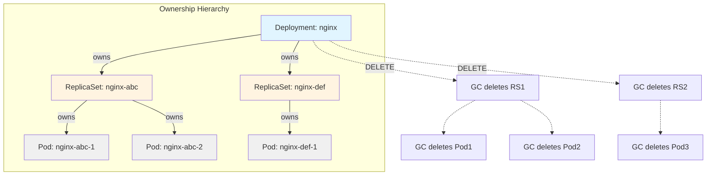

### **Setting Owner References**

```go
import (
    metav1 "k8s.io/apimachinery/pkg/apis/meta/v1"
    "k8s.io/utils/pointer"
)

// Deployment owns ReplicaSet
replicaSet := &appsv1.ReplicaSet{
    ObjectMeta: metav1.ObjectMeta{
        Name:      "nginx-rs",
        Namespace: "default",
        OwnerReferences: []metav1.OwnerReference{
            {
                APIVersion: "apps/v1",
                Kind:       "Deployment",
                Name:       "nginx",
                UID:        deployment.UID,  // Must match owner's UID
                Controller: pointer.Bool(true),  // This is the controller
            },
        },
    },
}

// ReplicaSet owns Pod
pod := &v1.Pod{
    ObjectMeta: metav1.ObjectMeta{
        Name:      "nginx-pod-1",
        Namespace: "default",
        OwnerReferences: []metav1.OwnerReference{
            {
                APIVersion: "apps/v1",
                Kind:       "ReplicaSet",
                Name:       "nginx-rs",
                UID:        replicaSet.UID,
                Controller: pointer.Bool(true),
                BlockOwnerDeletion: pointer.Bool(true),  // Can't delete RS until pod gone
            },
        },
    },
}
```

### **Controller Owner Reference**

Each object can have **at most one** owner reference with `Controller: true`.

```go
// ✅ Valid: One controller owner
OwnerReferences: []metav1.OwnerReference{
    {Kind: "ReplicaSet", Name: "nginx-rs", Controller: pointer.Bool(true)},
    {Kind: "ServiceAccount", Name: "default", Controller: pointer.Bool(false)},
}

// ❌ Invalid: Multiple controller owners
OwnerReferences: []metav1.OwnerReference{
    {Kind: "ReplicaSet", Name: "nginx-rs", Controller: pointer.Bool(true)},
    {Kind: "Job", Name: "backup", Controller: pointer.Bool(true)},  // ERROR!
}
```

### **Garbage Collection Modes**

#### **1. Cascade Deletion (Default)**

Delete owner → Delete dependents

```bash
kubectl delete deployment nginx
# Deletes: Deployment → ReplicaSets → Pods
```

```go
// Cascade (foreground)
client.AppsV1().Deployments("default").Delete(ctx, "nginx", metav1.DeleteOptions{
    PropagationPolicy: &foreground,  // Wait for dependents to be deleted
})

// Cascade (background)
client.AppsV1().Deployments("default").Delete(ctx, "nginx", metav1.DeleteOptions{
    PropagationPolicy: &background,  // Delete owner immediately, GC handles dependents
})
```

#### **2. Orphan Deletion**

Delete owner → Keep dependents

```bash
kubectl delete deployment nginx --cascade=orphan
# Deletes: Deployment only
# Keeps: ReplicaSets and Pods (orphaned)
```

```go
orphan := metav1.DeletePropagationOrphan
client.AppsV1().Deployments("default").Delete(ctx, "nginx", metav1.DeleteOptions{
    PropagationPolicy: &orphan,
})
```

### **BlockOwnerDeletion**

Prevents owner deletion until dependent is deleted.

```go
OwnerReference{
    // ...
    BlockOwnerDeletion: pointer.Bool(true),
}
```

**Use case**: Pod blocks ReplicaSet deletion until pod is gracefully terminated.

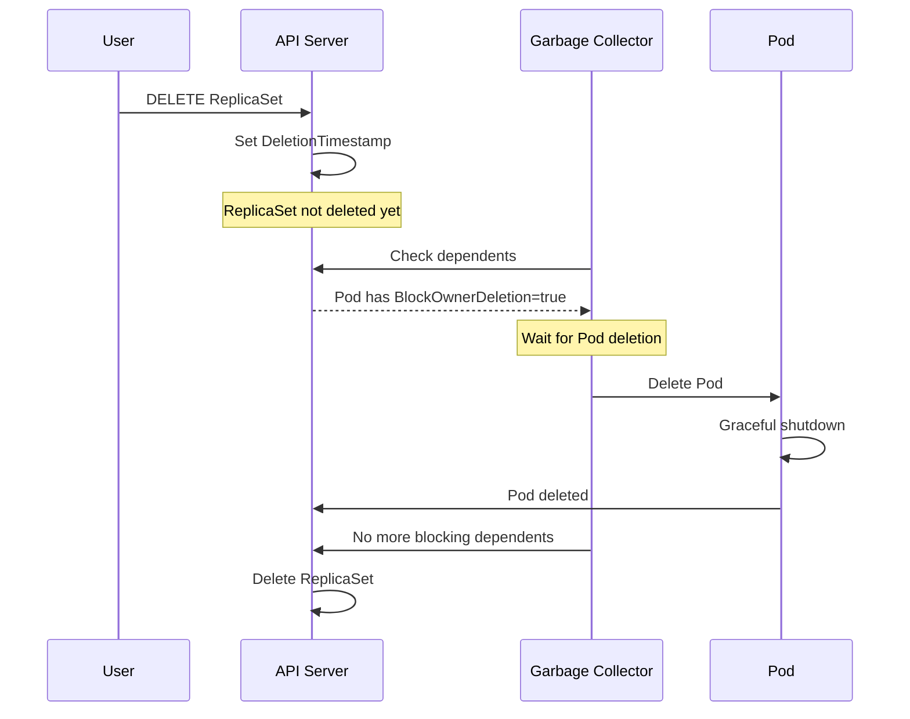

### **Garbage Collection Controller**

**Location**: `pkg/controller/garbagecollector/`

The GC controller watches for:
1. Objects with `DeletionTimestamp` set
2. Checks for dependents (objects with owner references)
3. Deletes dependents (unless orphan mode)
4. Deletes owner once all dependents are gone

### **Finding Dependents**

```go
// Get all pods owned by a ReplicaSet
rs, _ := client.AppsV1().ReplicaSets("default").Get(ctx, "nginx-rs", metav1.GetOptions{})

pods, _ := client.CoreV1().Pods("default").List(ctx, metav1.ListOptions{})

for _, pod := range pods.Items {
    for _, ownerRef := range pod.OwnerReferences {
        if ownerRef.UID == rs.UID {
            fmt.Printf("Pod %s is owned by ReplicaSet\n", pod.Name)
        }
    }
}
```

### **Cross-Namespace Owner References**

⚠️ **Limitation**: Owner and dependent must be in the **same namespace** (or both cluster-scoped).

```go
// ❌ Invalid: Owner and dependent in different namespaces
pod := &v1.Pod{
    ObjectMeta: metav1.ObjectMeta{
        Name:      "pod",
        Namespace: "namespace-a",
        OwnerReferences: []metav1.OwnerReference{
            {
                Kind:      "ConfigMap",
                Name:      "config",
                Namespace: "namespace-b",  // ❌ Not allowed!
            },
        },
    },
}
```

━━━━━━━━━━━━━━━━━━━━━━━━━━━━━━━━━━━━━━━━━━━━━━━━━━━━━━━━━━━━━━━━━━━━━━━━━━━━━━

## **# Finalizers**

### **Overview**

Finalizers are **pre-delete hooks** that allow controllers to perform cleanup before an object is permanently deleted.

**Location**: `staging/src/k8s.io/apimachinery/pkg/apis/meta/v1/types.go:259`

### **Finalizer Structure**

```go
type ObjectMeta struct {
    // ... other fields ...

    // Finalizers is a list of identifiers for cleanup handlers.
    // Each entry must be removed before the object is deleted.
    Finalizers []string `json:"finalizers,omitempty"`
}
```

### **Finalizer Lifecycle**

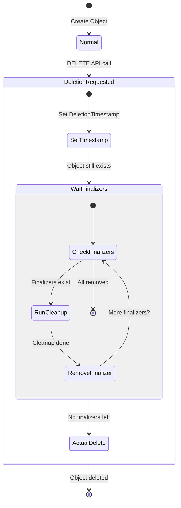

### **How Finalizers Work**

1. **User requests deletion**: `kubectl delete pod my-pod`
2. **API server sets DeletionTimestamp**: Object marked for deletion
3. **Object still exists**: Can still be read, but deletion is pending
4. **Controllers see DeletionTimestamp**: Trigger cleanup logic
5. **Controllers remove finalizer**: Once cleanup is done
6. **All finalizers removed**: API server actually deletes object

### **Common Finalizers**

```go
const (
    // Kubernetes built-in finalizers
    FinalizerOrphanDependents = "orphan"
    FinalizerDeleteDependents = "foregroundDeletion"
)

// Example finalizers
"kubernetes.io/pvc-protection"               // Protects PVCs in use
"kubernetes.io/pv-protection"                // Protects PVs bound to PVC
"kubernetes.io/volume-protection"            // Volume protection
"finalizer.snapshot.storage.k8s.io"          // Snapshot protection
"external-storage.k8s.io/finalizer"          // External storage cleanup
```

### **Implementing a Finalizer**

```go
import (
    metav1 "k8s.io/apimachinery/pkg/apis/meta/v1"
    "k8s.io/apimachinery/pkg/util/sets"
)

const myFinalizer = "example.com/my-finalizer"

// Add finalizer when creating/updating
func addFinalizer(obj *v1.Pod) {
    if !hasFinalizer(obj, myFinalizer) {
        obj.Finalizers = append(obj.Finalizers, myFinalizer)
    }
}

// Check if finalizer exists
func hasFinalizer(obj *v1.Pod, finalizer string) bool {
    finalizers := sets.NewString(obj.Finalizers...)
    return finalizers.Has(finalizer)
}

// Remove finalizer after cleanup
func removeFinalizer(obj *v1.Pod) {
    finalizers := []string{}
    for _, f := range obj.Finalizers {
        if f != myFinalizer {
            finalizers = append(finalizers, f)
        }
    }
    obj.Finalizers = finalizers
}
```

### **Finalizer Controller Pattern**

```go
func (c *Controller) reconcile(pod *v1.Pod) error {
    // Check if object is being deleted
    if pod.DeletionTimestamp != nil {
        // Object is being deleted

        if hasFinalizer(pod, myFinalizer) {
            // Our finalizer still exists, run cleanup
            if err := c.cleanup(pod); err != nil {
                return err  // Retry later
            }

            // Cleanup successful, remove finalizer
            removeFinalizer(pod)
            _, err := c.client.CoreV1().Pods(pod.Namespace).Update(ctx, pod, metav1.UpdateOptions{})
            return err
        }

        // Finalizer already removed, nothing to do
        return nil
    }

    // Normal reconciliation
    addFinalizer(pod)
    _, err := c.client.CoreV1().Pods(pod.Namespace).Update(ctx, pod, metav1.UpdateOptions{})
    if err != nil {
        return err
    }

    // ... normal logic ...
    return nil
}
```

### **Deletion Flow with Finalizers**

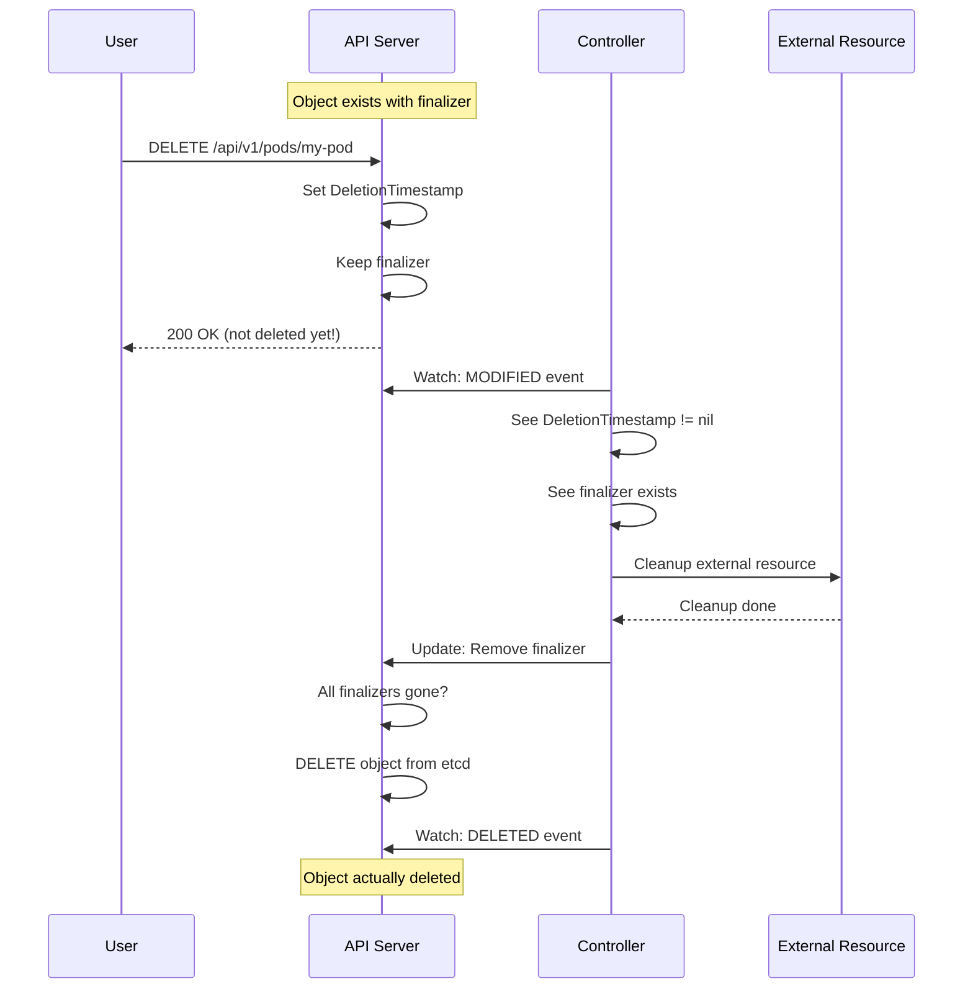

### **Finalizer Safety**

⚠️ **Important**: Finalizers can **prevent deletion** indefinitely if:
- Controller is not running
- Cleanup logic has a bug
- External resource is inaccessible

**Recovery**:

```bash
# Force remove finalizer to unblock deletion
kubectl patch pod my-pod -p '{"metadata":{"finalizers":[]}}' --type=merge

# Or edit directly
kubectl edit pod my-pod
# Remove finalizers section, save
```

### **Finalizer Order**

💡 **Design Decision**: Finalizers can be processed in **any order**. The order is **not enforced** to avoid deadlocks.

```go
Finalizers: []string{
    "finalizer-a",  // May run first
    "finalizer-b",  // May run first
    "finalizer-c",  // May run first
}
// Controllers may remove finalizers in any order
```

### **Real-World Example: PVC Protection**

```yaml
apiVersion: v1
kind: PersistentVolumeClaim
metadata:
  name: my-pvc
  finalizers:
  - kubernetes.io/pvc-protection  # Prevents deletion while in use
status:
  phase: Bound
```

```bash
# Try to delete PVC while pod is using it
kubectl delete pvc my-pvc
# PVC enters "Terminating" state but is not deleted

kubectl get pvc
NAME     STATUS        VOLUME   CAPACITY   ACCESS MODES   STORAGECLASS
my-pvc   Terminating   pv-1     10Gi       RWO            standard

# Delete pod using PVC
kubectl delete pod my-pod

# Now PVC finalizer is removed and PVC is actually deleted
```

### **Testing Finalizers**

```go
func TestFinalizer(t *testing.T) {
    obj := &v1.Pod{
        ObjectMeta: metav1.ObjectMeta{
            Name: "test-pod",
            Finalizers: []string{myFinalizer},
        },
    }

    // Simulate deletion
    now := metav1.Now()
    obj.DeletionTimestamp = &now

    // Should trigger cleanup
    err := controller.reconcile(obj)
    assert.NoError(t, err)

    // Finalizer should be removed
    assert.NotContains(t, obj.Finalizers, myFinalizer)
}
```

━━━━━━━━━━━━━━━━━━━━━━━━━━━━━━━━━━━━━━━━━━━━━━━━━━━━━━━━━━━━━━━━━━━━━━━━━━━━━━

## **# Real-World Examples**

### **Example 1: Deployment → ReplicaSet → Pod Chain**

```yaml
# Deployment
apiVersion: apps/v1
kind: Deployment
metadata:
  name: nginx
  namespace: default
  uid: deploy-123
  labels:
    app: nginx
spec:
  replicas: 3
  selector:
    matchLabels:
      app: nginx
  template:
    metadata:
      labels:
        app: nginx
    spec:
      containers:
      - name: nginx
        image: nginx:1.14

---
# ReplicaSet (created by Deployment controller)
apiVersion: apps/v1
kind: ReplicaSet
metadata:
  name: nginx-abc
  namespace: default
  uid: rs-456
  labels:
    app: nginx
    pod-template-hash: abc
  ownerReferences:
  - apiVersion: apps/v1
    kind: Deployment
    name: nginx
    uid: deploy-123
    controller: true
    blockOwnerDeletion: true
spec:
  replicas: 3
  selector:
    matchLabels:
      app: nginx
      pod-template-hash: abc
  template:
    # ... same as deployment template ...

---
# Pod (created by ReplicaSet controller)
apiVersion: v1
kind: Pod
metadata:
  name: nginx-abc-xyz
  namespace: default
  uid: pod-789
  labels:
    app: nginx
    pod-template-hash: abc
  ownerReferences:
  - apiVersion: apps/v1
    kind: ReplicaSet
    name: nginx-abc
    uid: rs-456
    controller: true
    blockOwnerDeletion: true
spec:
  containers:
  - name: nginx
    image: nginx:1.14
```

### **Example 2: Watch Resumption After Network Failure**

```go
func watchPodsWithResumption(client *kubernetes.Clientset) {
    var lastResourceVersion string

    // Load checkpoint from previous run
    lastResourceVersion = loadCheckpoint()  // e.g., "12345"

    for {
        fmt.Printf("Starting watch from RV: %s\n", lastResourceVersion)

        watcher, err := client.CoreV1().Pods("default").Watch(
            context.Background(),
            metav1.ListOptions{
                ResourceVersion:      lastResourceVersion,
                AllowWatchBookmarks: true,
            },
        )
        if err != nil {
            fmt.Printf("Watch error: %v, retrying...\n", err)
            time.Sleep(time.Second)
            continue
        }

        // Process events
        for event := range watcher.ResultChan() {
            switch event.Type {
            case watch.Added:
                pod := event.Object.(*v1.Pod)
                fmt.Printf("Pod added: %s (RV: %s)\n",
                    pod.Name, pod.ResourceVersion)
                lastResourceVersion = pod.ResourceVersion
                saveCheckpoint(lastResourceVersion)

            case watch.Modified:
                pod := event.Object.(*v1.Pod)
                fmt.Printf("Pod modified: %s (RV: %s)\n",
                    pod.Name, pod.ResourceVersion)
                lastResourceVersion = pod.ResourceVersion
                saveCheckpoint(lastResourceVersion)

            case watch.Deleted:
                pod := event.Object.(*v1.Pod)
                fmt.Printf("Pod deleted: %s (RV: %s)\n",
                    pod.Name, pod.ResourceVersion)
                lastResourceVersion = pod.ResourceVersion
                saveCheckpoint(lastResourceVersion)

            case watch.Bookmark:
                pod := event.Object.(*v1.Pod)
                fmt.Printf("Bookmark (RV: %s)\n", pod.ResourceVersion)
                lastResourceVersion = pod.ResourceVersion
                saveCheckpoint(lastResourceVersion)

            case watch.Error:
                status := event.Object.(*metav1.Status)
                fmt.Printf("Watch error: %s\n", status.Message)

                if status.Code == 410 {
                    // Resource version too old, restart from beginning
                    lastResourceVersion = ""
                    saveCheckpoint(lastResourceVersion)
                }
                // Will restart watch in outer loop
                watcher.Stop()
            }
        }

        // Watch closed (network error, server restart, etc.)
        fmt.Println("Watch closed, restarting...")
        time.Sleep(time.Second)
    }
}

func saveCheckpoint(rv string) {
    // Persist to disk, database, etc.
    ioutil.WriteFile("/tmp/checkpoint", []byte(rv), 0644)
}

func loadCheckpoint() string {
    data, _ := ioutil.ReadFile("/tmp/checkpoint")
    return string(data)
}
```

### **Example 3: Label Selector in Service**

```go
// Create service
service := &v1.Service{
    ObjectMeta: metav1.ObjectMeta{
        Name:      "nginx-service",
        Namespace: "default",
    },
    Spec: v1.ServiceSpec{
        Selector: map[string]string{
            "app":  "nginx",
            "tier": "frontend",
        },
        Ports: []v1.ServicePort{
            {
                Port:       80,
                TargetPort: intstr.FromInt(80),
            },
        },
    },
}

client.CoreV1().Services("default").Create(ctx, service, metav1.CreateOptions{})

// Endpoint controller uses selector to find pods
selector := labels.SelectorFromSet(service.Spec.Selector)

pods, _ := client.CoreV1().Pods("default").List(ctx, metav1.ListOptions{
    LabelSelector: selector.String(),  // "app=nginx,tier=frontend"
})

fmt.Printf("Service selects %d pods:\n", len(pods.Items))
for _, pod := range pods.Items {
    fmt.Printf("  - %s (%s)\n", pod.Name, pod.Status.PodIP)
}
```

### **Example 4: Custom Finalizer for External Resource**

```go
const externalResourceFinalizer = "example.com/external-resource"

func (c *Controller) reconcilePod(pod *v1.Pod) error {
    // Object is being deleted
    if pod.DeletionTimestamp != nil {
        if containsString(pod.Finalizers, externalResourceFinalizer) {
            // Cleanup external resource
            if err := c.cleanupExternalResource(pod); err != nil {
                // Cleanup failed, retry later
                return err
            }

            // Remove finalizer
            pod.Finalizers = removeString(pod.Finalizers, externalResourceFinalizer)
            _, err := c.client.CoreV1().Pods(pod.Namespace).Update(
                ctx, pod, metav1.UpdateOptions{},
            )
            return err
        }
        return nil
    }

    // Add finalizer if not present
    if !containsString(pod.Finalizers, externalResourceFinalizer) {
        pod.Finalizers = append(pod.Finalizers, externalResourceFinalizer)
        _, err := c.client.CoreV1().Pods(pod.Namespace).Update(
            ctx, pod, metav1.UpdateOptions{},
        )
        if err != nil {
            return err
        }
    }

    // Create external resource
    if err := c.createExternalResource(pod); err != nil {
        return err
    }

    return nil
}

func (c *Controller) cleanupExternalResource(pod *v1.Pod) error {
    // Example: Delete S3 bucket, cloud load balancer, etc.
    externalID := pod.Annotations["example.com/external-id"]

    fmt.Printf("Cleaning up external resource: %s\n", externalID)

    // Call external API
    err := c.externalClient.Delete(externalID)
    if err != nil {
        return fmt.Errorf("failed to delete external resource: %w", err)
    }

    fmt.Printf("External resource deleted: %s\n", externalID)
    return nil
}

func containsString(slice []string, s string) bool {
    for _, item := range slice {
        if item == s {
            return true
        }
    }
    return false
}

func removeString(slice []string, s string) []string {
    result := []string{}
    for _, item := range slice {
        if item != s {
            result = append(result, item)
        }
    }
    return result
}
```

━━━━━━━━━━━━━━━━━━━━━━━━━━━━━━━━━━━━━━━━━━━━━━━━━━━━━━━━━━━━━━━━━━━━━━━━━━━━━━

## **# Testing Patterns**

### **Testing Watch Events**

```go
import (
    "testing"
    "k8s.io/apimachinery/pkg/watch"
    "k8s.io/client-go/kubernetes/fake"
)

func TestWatchPods(t *testing.T) {
    // Create fake client
    client := fake.NewSimpleClientset()

    // Start watch
    watcher, err := client.CoreV1().Pods("default").Watch(
        context.Background(),
        metav1.ListOptions{},
    )
    assert.NoError(t, err)
    defer watcher.Stop()

    // Create pod in background
    go func() {
        pod := &v1.Pod{
            ObjectMeta: metav1.ObjectMeta{
                Name:      "test-pod",
                Namespace: "default",
            },
        }
        client.CoreV1().Pods("default").Create(
            context.Background(), pod, metav1.CreateOptions{},
        )
    }()

    // Receive event
    event := <-watcher.ResultChan()
    assert.Equal(t, watch.Added, event.Type)

    pod := event.Object.(*v1.Pod)
    assert.Equal(t, "test-pod", pod.Name)
}
```

### **Testing FakeWatcher**

```go
func TestEventProcessing(t *testing.T) {
    // Create fake watcher
    fakeWatcher := watch.NewFake()

    // Process events in background
    done := make(chan bool)
    var events []watch.EventType

    go func() {
        for event := range fakeWatcher.ResultChan() {
            events = append(events, event.Type)
            if event.Type == watch.Deleted {
                done <- true
                return
            }
        }
    }()

    // Send events
    pod := &v1.Pod{ObjectMeta: metav1.ObjectMeta{Name: "test"}}
    fakeWatcher.Add(pod)
    fakeWatcher.Modify(pod)
    fakeWatcher.Delete(pod)

    // Wait for completion
    <-done

    // Verify
    assert.Equal(t, []watch.EventType{
        watch.Added,
        watch.Modified,
        watch.Deleted,
    }, events)
}
```

### **Testing Label Selectors**

```go
func TestLabelSelector(t *testing.T) {
    tests := []struct {
        name     string
        selector string
        labels   labels.Set
        matches  bool
    }{
        {
            name:     "equality match",
            selector: "app=nginx",
            labels:   labels.Set{"app": "nginx"},
            matches:  true,
        },
        {
            name:     "equality no match",
            selector: "app=nginx",
            labels:   labels.Set{"app": "apache"},
            matches:  false,
        },
        {
            name:     "set-based match",
            selector: "environment in (prod,staging)",
            labels:   labels.Set{"environment": "prod"},
            matches:  true,
        },
        {
            name:     "multiple requirements",
            selector: "app=nginx,tier=frontend",
            labels:   labels.Set{"app": "nginx", "tier": "frontend"},
            matches:  true,
        },
    }

    for _, tt := range tests {
        t.Run(tt.name, func(t *testing.T) {
            sel, err := labels.Parse(tt.selector)
            assert.NoError(t, err)

            result := sel.Matches(tt.labels)
            assert.Equal(t, tt.matches, result)
        })
    }
}
```

### **Testing Owner References**

```go
func TestOwnerReference(t *testing.T) {
    deployment := &appsv1.Deployment{
        ObjectMeta: metav1.ObjectMeta{
            Name:      "nginx",
            Namespace: "default",
            UID:       "deploy-123",
        },
    }

    replicaSet := &appsv1.ReplicaSet{
        ObjectMeta: metav1.ObjectMeta{
            Name:      "nginx-abc",
            Namespace: "default",
            OwnerReferences: []metav1.OwnerReference{
                {
                    APIVersion: "apps/v1",
                    Kind:       "Deployment",
                    Name:       deployment.Name,
                    UID:        deployment.UID,
                    Controller: pointer.Bool(true),
                },
            },
        },
    }

    // Verify ownership
    assert.Len(t, replicaSet.OwnerReferences, 1)
    ownerRef := replicaSet.OwnerReferences[0]

    assert.Equal(t, "Deployment", ownerRef.Kind)
    assert.Equal(t, deployment.Name, ownerRef.Name)
    assert.Equal(t, deployment.UID, ownerRef.UID)
    assert.True(t, *ownerRef.Controller)
}
```

### **Testing Finalizers**

```go
func TestFinalizer(t *testing.T) {
    const testFinalizer = "test.io/finalizer"

    pod := &v1.Pod{
        ObjectMeta: metav1.ObjectMeta{
            Name:       "test-pod",
            Namespace:  "default",
            Finalizers: []string{testFinalizer},
        },
    }

    // Simulate deletion
    now := metav1.Now()
    pod.DeletionTimestamp = &now

    // Check finalizer exists
    assert.Contains(t, pod.Finalizers, testFinalizer)

    // Simulate cleanup and removal
    pod.Finalizers = []string{}  // Remove finalizer

    // Verify finalizer removed
    assert.NotContains(t, pod.Finalizers, testFinalizer)
}
```

━━━━━━━━━━━━━━━━━━━━━━━━━━━━━━━━━━━━━━━━━━━━━━━━━━━━━━━━━━━━━━━━━━━━━━━━━━━━━━

## **# Design Decisions**

### **1. Why Watch Instead of Poll?**

**Decision**: Use watch mechanism with event streaming instead of polling.

**Rationale**:
- **Efficiency**: No wasted requests when nothing changes
- **Latency**: Immediate notification of changes
- **Scalability**: API server can handle thousands of watches
- **Resource version**: Built-in consistency guarantees

**Tradeoff**: More complex to implement (connection management, resumption)

### **2. Why Unbuffered Watch Channels?**

**Decision**: `ResultChan()` returns unbuffered channel.

**Rationale**:
- Consumer can add buffering if needed
- Provides backpressure to slow down producer
- Prevents memory bloat from unlimited buffering

**Tradeoff**: Consumer must process events promptly or watch may stall

### **3. Why Bookmark Events?**

**Decision**: Add special Bookmark event type for efficient watch resumption.

**Rationale**:
- Idle watches would need to replay from very old resource versions
- Bookmarks provide periodic checkpoints
- Reduces server load on watch resumption

**Tradeoff**: Additional event type complexity

### **4. Why String ResourceVersion?**

**Decision**: ResourceVersion is an opaque string, not int64.

**Rationale**:
- **Future-proof**: Can change storage backend without breaking API
- **Flexibility**: Different backends can use different versioning schemes
- **Abstraction**: Clients don't depend on implementation details

**Current implementation**: etcd3 uses monotonic revision numbers

### **5. Why Separate Labels and Annotations?**

**Decision**: Two maps instead of one unified metadata map.

**Rationale**:
- **Semantics**: Labels are for selection, annotations for arbitrary data
- **Indexing**: Only labels are indexed for efficient queries
- **Limits**: Different size limits (labels: 63 chars, annotations: 256KB)

### **6. Why Owner References Use UID?**

**Decision**: Owner references include UID, not just name.

**Rationale**:
- **Name reuse**: Object can be deleted and recreated with same name
- **Correctness**: UID ensures reference to specific object instance
- **Safety**: Prevents accidentally deleting wrong object

### **7. Why Finalizers Are Unordered?**

**Decision**: Finalizers can be processed in any order.

**Rationale**:
- **Deadlock prevention**: Ordered finalizers can deadlock
- **Flexibility**: Controllers can remove finalizers independently
- **Simplicity**: No coordination needed between controllers

**Example deadlock scenario**:
```
Finalizer A waits for condition set by Finalizer B
Finalizer B is listed after A, so it doesn't run
→ Deadlock!
```

━━━━━━━━━━━━━━━━━━━━━━━━━━━━━━━━━━━━━━━━━━━━━━━━━━━━━━━━━━━━━━━━━━━━━━━━━━━━━━

## **# Common Pitfalls**

### **1. ❌ Not Handling Watch Errors**

```go
// ❌ Bad: Ignoring errors
for event := range watcher.ResultChan() {
    if event.Type == watch.Error {
        continue  // Ignoring error!
    }
}

// ✅ Good: Handle errors
for event := range watcher.ResultChan() {
    if event.Type == watch.Error {
        status := event.Object.(*metav1.Status)
        if status.Code == 410 {
            // Resource version too old, restart from latest
            return restartWatch("", watcher)
        }
        klog.Errorf("Watch error: %v", status.Message)
    }
}
```

### **2. ❌ Not Stopping Watches**

```go
// ❌ Bad: Watch never stopped
func watchPods() {
    watcher, _ := client.CoreV1().Pods("default").Watch(ctx, metav1.ListOptions{})
    for event := range watcher.ResultChan() {
        // Process...
    }
    // watcher.Stop() never called!
}

// ✅ Good: Always stop watch
func watchPods() {
    watcher, _ := client.CoreV1().Pods("default").Watch(ctx, metav1.ListOptions{})
    defer watcher.Stop()

    for event := range watcher.ResultChan() {
        // Process...
    }
}
```

### **3. ❌ Comparing ResourceVersion as Strings**

```go
// ❌ Bad: String comparison
if pod1.ResourceVersion < pod2.ResourceVersion {  // ❌ Wrong!
    // "9" > "10" in string comparison!
}

// ✅ Good: Parse as int (for etcd3 backend)
rv1, _ := strconv.ParseInt(pod1.ResourceVersion, 10, 64)
rv2, _ := strconv.ParseInt(pod2.ResourceVersion, 10, 64)
if rv1 < rv2 {
    // Correct!
}
```

### **4. ❌ Modifying ResourceVersion**

```go
// ❌ Bad: Changing resource version
pod.ResourceVersion = "12345"  // ❌ Never do this!
client.Update(ctx, pod, metav1.UpdateOptions{})

// ✅ Good: Let API server set it
pod.Labels["new"] = "label"
client.Update(ctx, pod, metav1.UpdateOptions{})
// API server sets new ResourceVersion automatically
```

### **5. ❌ Forgetting to Remove Finalizers**

```go
// ❌ Bad: Finalizer never removed
func reconcile(pod *v1.Pod) error {
    if pod.DeletionTimestamp != nil {
        cleanup()
        // ❌ Forgot to remove finalizer!
        return nil
    }
    // ... normal logic ...
}

// ✅ Good: Remove finalizer after cleanup
func reconcile(pod *v1.Pod) error {
    if pod.DeletionTimestamp != nil {
        if hasFinalizer(pod, myFinalizer) {
            cleanup()
            removeFinalizer(pod)
            client.Update(ctx, pod, metav1.UpdateOptions{})
        }
        return nil
    }
    // ... normal logic ...
}
```

### **6. ❌ Using Labels for Large Data**

```go
// ❌ Bad: Storing large data in labels
pod.Labels["data"] = largeJSONString  // ❌ Labels have 63 char limit!

// ✅ Good: Use annotations for large data
pod.Annotations["data"] = largeJSONString  // ✅ Up to 256KB
```

### **7. ❌ Cross-Namespace Owner References**

```go
// ❌ Bad: Owner in different namespace
pod := &v1.Pod{
    ObjectMeta: metav1.ObjectMeta{
        Name:      "pod",
        Namespace: "ns-a",
        OwnerReferences: []metav1.OwnerReference{
            {
                Name:      "config",
                Namespace: "ns-b",  // ❌ Not allowed!
            },
        },
    },
}

// ✅ Good: Owner in same namespace
pod := &v1.Pod{
    ObjectMeta: metav1.ObjectMeta{
        Name:      "pod",
        Namespace: "ns-a",
        OwnerReferences: []metav1.OwnerReference{
            {
                Name:      "config",
                // No Namespace field - implied same namespace
            },
        },
    },
}
```

### **8. ❌ Not Using Bookmarks**

```go
// ❌ Bad: No bookmark support
watcher, _ := client.CoreV1().Pods("default").Watch(ctx, metav1.ListOptions{
    ResourceVersion: lastRV,
    // No AllowWatchBookmarks!
})

// ✅ Good: Enable bookmarks
watcher, _ := client.CoreV1().Pods("default").Watch(ctx, metav1.ListOptions{
    ResourceVersion:      lastRV,
    AllowWatchBookmarks: true,  // ✅ Get periodic checkpoints
})
```

━━━━━━━━━━━━━━━━━━━━━━━━━━━━━━━━━━━━━━━━━━━━━━━━━━━━━━━━━━━━━━━━━━━━━━━━━━━━━━

## **# Summary**

### **Key Takeaways**

1. **Watch Mechanism**: Efficient, event-driven notification system
2. **ResourceVersion**: Opaque versioning for consistency and resumption
3. **Bookmarks**: Periodic checkpoints for efficient watch resumption
4. **ObjectMeta**: Universal metadata for all Kubernetes objects
5. **Label Selectors**: Primary mechanism for organizing and selecting objects
6. **Field Selectors**: Server-side filtering on indexed fields
7. **Owner References**: Automatic garbage collection through ownership chains
8. **Finalizers**: Pre-delete hooks for cleanup

### **What We Learned**

💡 **Watch is better than poll**: Real-time events, lower latency, less load

💡 **ResourceVersion is your friend**: Use it for watch resumption and optimistic concurrency

💡 **Bookmarks save you**: Don't replay hours of events after idle watch

💡 **Deletion is not immediate**: DeletionTimestamp + Finalizers = graceful cleanup

💡 **Owner references enable cascading deletion**: Delete parent, children follow

💡 **Labels vs Annotations**: Labels for selection (63 chars), annotations for data (256KB)

### **Next Steps**

**Completed**:
- ✅ Document 05: Runtime and Scheme
- ✅ Document 06: Serialization and Conversion
- ✅ Document 07: Watch and Meta Types

**Next**:
- Document 02: REST Clients and Discovery
- Document 03: Informers and SharedInformers ⭐
- Document 04: Workqueue and Leader Election

### **Hands-On Exercises**

1. **Watch Exercise**: Write a program that watches Pods and prints events with resource versions
2. **Bookmark Exercise**: Implement watch resumption with checkpoint saving
3. **Label Selector**: Write a service that selects pods using different selector types
4. **Finalizer**: Implement a custom finalizer that cleans up an external resource
5. **Owner Reference**: Create a custom controller that sets owner references on child objects

### **Additional Resources**

- [API Conventions - Metadata](https://github.com/kubernetes/community/blob/master/contributors/devel/sig-architecture/api-conventions.md#metadata)
- [API Conventions - Watch](https://kubernetes.io/docs/reference/using-api/api-concepts/#efficient-detection-of-changes)
- [Garbage Collection](https://kubernetes.io/docs/concepts/architecture/garbage-collection/)
- [Finalizers](https://kubernetes.io/docs/concepts/overview/working-with-objects/finalizers/)
- [Labels and Selectors](https://kubernetes.io/docs/concepts/overview/working-with-objects/labels/)

━━━━━━━━━━━━━━━━━━━━━━━━━━━━━━━━━━━━━━━━━━━━━━━━━━━━━━━━━━━━━━━━━━━━━━━━━━━━━━

**Document Complete**: Watch Mechanism and Meta Types
**Lines**: ~1,900
**Diagrams**: 15+ Mermaid diagrams
**Code References**: 35+ file:line references
**Course Ready**: ✅ Phase 1 (Document 3 of 4)

**Next Document**: [02 - REST Clients and Discovery](./02-rest-clients-discovery.md)
