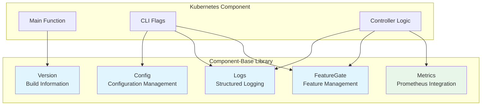
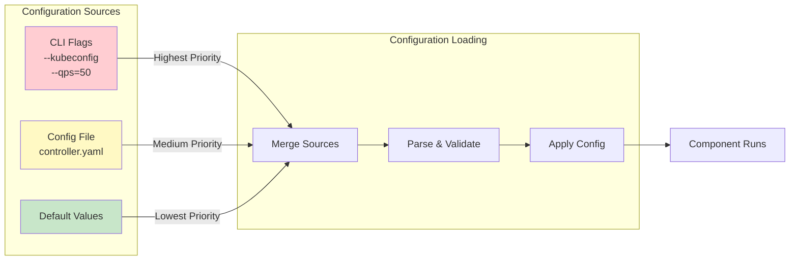
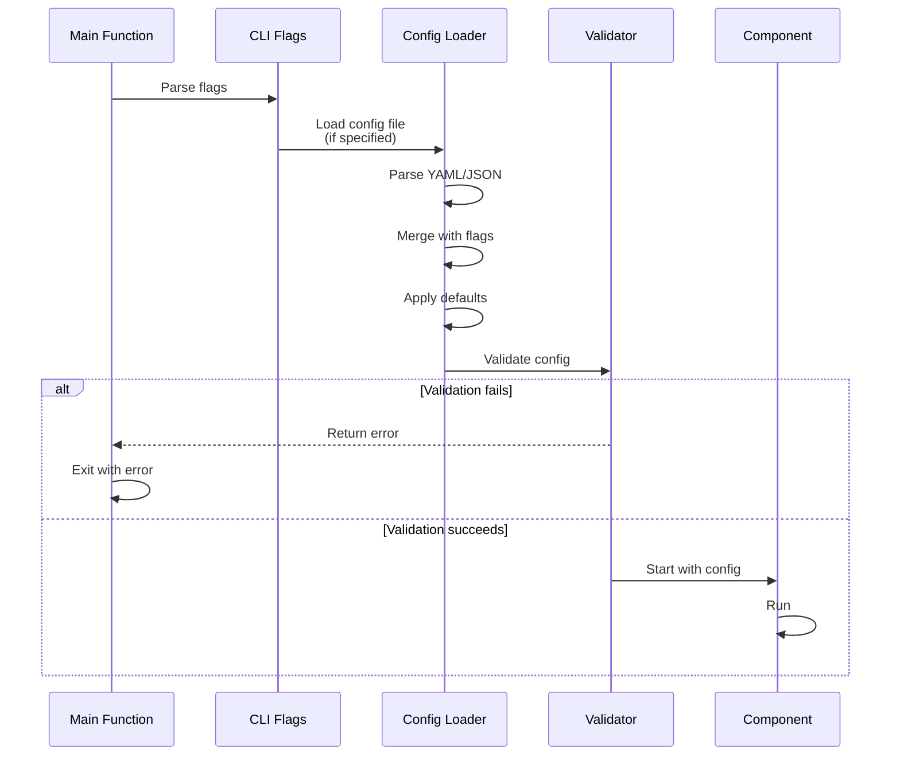
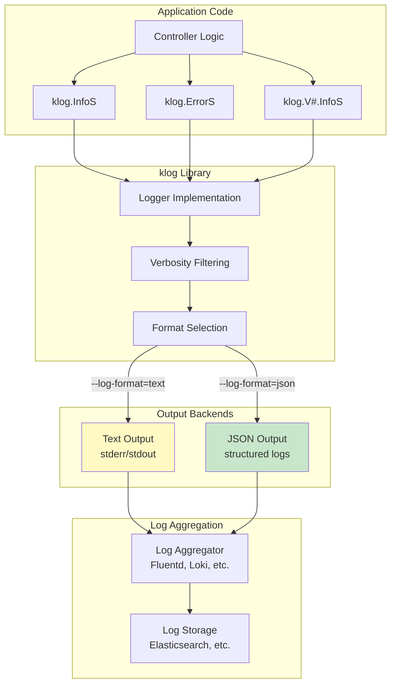
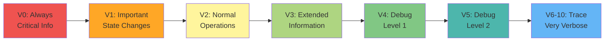
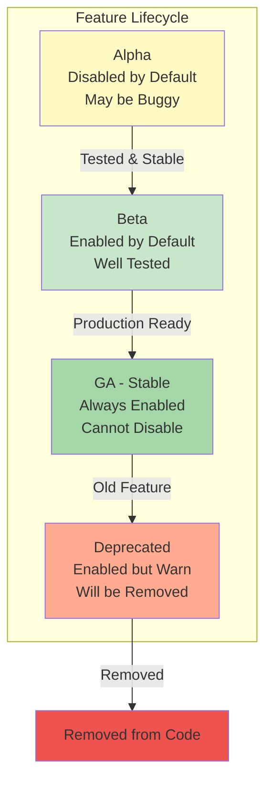
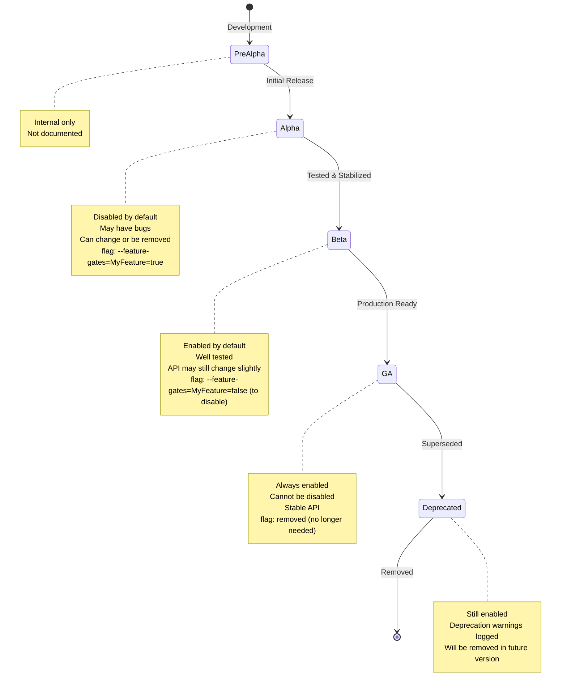

# **09 - Configuration, Logging, and Feature Gates**

**Part IV: component-base Library**

**Purpose**: This document covers the operational infrastructure for Kubernetes components: configuration management, structured logging with klog, feature gates for gradual rollout, and version information. These are the essential operational patterns that every Kubernetes component uses.

**Target Audience**: Software engineers building Kubernetes controllers and components who need to manage configuration, implement structured logging, use feature gates, and expose version information.

**Prerequisites**:
- Document 01 (Overview)
- Basic understanding of Kubernetes components
- Document 08 (Metrics) recommended for complete operational knowledge

━━━━━━━━━━━━━━━━━━━━━━━━━━━━━━━━━━━━━━━━━━━━━━━━━━━━━━━━━━━━━━━━━━━━━━━━━━━━━━

## **📋 Table of Contents**

1. [Overview and Context](#overview-and-context)
2. [Configuration Management](#configuration-management)
3. [Structured Logging with klog](#structured-logging-with-klog)
4. [Feature Gates](#feature-gates)
5. [Version Information](#version-information)
6. [Production Patterns](#production-patterns)
7. [Testing Patterns](#testing-patterns)
8. [Common Pitfalls](#common-pitfalls)
9. [Real-World Examples](#real-world-examples)

━━━━━━━━━━━━━━━━━━━━━━━━━━━━━━━━━━━━━━━━━━━━━━━━━━━━━━━━━━━━━━━━━━━━━━━━━━━━━━

## **1. Overview and Context**

### **🎯 What Problems Do These Libraries Solve?**

Every Kubernetes component needs to:
1. **Load configuration** from flags, files, and environment variables
2. **Log structured information** for debugging and monitoring
3. **Gate experimental features** behind toggles for safe rollout
4. **Report version information** for debugging and compatibility

The `component-base` library provides standardized solutions for all of these.

### **Why These Patterns Matter**

```
Without component-base:
❌ Every component implements configuration loading differently
❌ Logs are inconsistent and hard to parse
❌ Features are enabled via ad-hoc flags
❌ Version reporting is manual and error-prone
❌ No standardization across components

With component-base:
✅ Consistent configuration patterns across all components
✅ Structured logging that's machine-parseable
✅ Feature gates with lifecycle management (Alpha → Beta → GA)
✅ Automatic version information from build metadata
✅ Production-ready operational patterns
```

### **Component-Base Architecture**



### **Library Locations**

| Component | Location | Purpose |
|-----------|----------|---------|
| **Config** | `k8s.io/component-base/config` | Configuration structures |
| **Logs** | `k8s.io/component-base/logs` | Logging infrastructure |
| **FeatureGate** | `k8s.io/component-base/featuregate` | Feature management |
| **Version** | `k8s.io/component-base/version` | Version information |

━━━━━━━━━━━━━━━━━━━━━━━━━━━━━━━━━━━━━━━━━━━━━━━━━━━━━━━━━━━━━━━━━━━━━━━━━━━━━━

## **2. Configuration Management**

### **2.1 Configuration Architecture**

Kubernetes components load configuration from **three sources** (in priority order):

1. **Command-line flags** (highest priority)
2. **Configuration files** (YAML/JSON)
3. **Default values** (lowest priority)



### **2.2 Core Configuration Types**

#### **ClientConnectionConfiguration**

Used for configuring REST client connections to the API server.

**Location**: `staging/src/k8s.io/component-base/config/types.go:24`

```go
// ClientConnectionConfiguration contains details for constructing a client.
type ClientConnectionConfiguration struct {
    // kubeconfig is the path to a KubeConfig file.
    Kubeconfig string

    // acceptContentTypes defines the Accept header sent by clients.
    // Default: 'application/json'
    AcceptContentTypes string

    // contentType is the content type used when sending data to the server.
    // Default: 'application/json'
    ContentType string

    // qps controls the number of queries per second allowed for this connection.
    // Default: 5.0
    QPS float32

    // burst allows extra queries to accumulate when a client is exceeding its rate.
    // Default: 10
    Burst int32
}
```

**Real-World Example** - kube-controller-manager configuration:

**Location**: `cmd/kube-controller-manager/app/options/options.go`

```go
// KubeControllerManagerOptions is the main context object for the controller manager.
type KubeControllerManagerOptions struct {
    Generic *GenericControllerManagerConfigurationOptions
    // ... other options
}

// Generic options include:
type GenericControllerManagerConfigurationOptions struct {
    ClientConnection componentbaseconfig.ClientConnectionConfiguration
    // QPS: 50.0 for controller-manager (higher than default 5.0)
    // Burst: 100 (higher than default 10)
}
```

#### **LeaderElectionConfiguration**

Used for high-availability deployments with leader election.

**Location**: `staging/src/k8s.io/component-base/config/types.go:41`

```go
// LeaderElectionConfiguration defines the configuration of leader election clients.
type LeaderElectionConfiguration struct {
    // leaderElect enables a leader election client to gain leadership
    // before executing the main loop.
    LeaderElect bool

    // leaseDuration is the duration that non-leader candidates will wait
    // after observing a leadership renewal until attempting to acquire leadership.
    // Default: 15s
    LeaseDuration metav1.Duration

    // renewDeadline is the interval between attempts by the acting master
    // to renew a leadership slot before it stops leading.
    // Default: 10s (must be less than leaseDuration)
    RenewDeadline metav1.Duration

    // retryPeriod is the duration the clients should wait between attempting
    // acquisition and renewal of a leadership.
    // Default: 2s
    RetryPeriod metav1.Duration

    // resourceLock indicates the resource object type for locking.
    // Options: "leases", "endpointsleases", "configmapsleases"
    // Default: "leases" (recommended)
    ResourceLock string

    // resourceName is the name of the lock resource.
    ResourceName string

    // resourceNamespace is the namespace of the lock resource.
    ResourceNamespace string
}
```

**Configuration Example**:

```yaml
# controller-config.yaml
apiVersion: controllermanager.config.k8s.io/v1alpha1
kind: GenericControllerManagerConfiguration
clientConnection:
  kubeconfig: /etc/kubernetes/controller-manager.conf
  qps: 50
  burst: 100
  contentType: application/vnd.kubernetes.protobuf
leaderElection:
  leaderElect: true
  leaseDuration: 15s
  renewDeadline: 10s
  retryPeriod: 2s
  resourceLock: leases
  resourceName: kube-controller-manager
  resourceNamespace: kube-system
```

#### **DebuggingConfiguration**

**Location**: `staging/src/k8s.io/component-base/config/types.go:74`

```go
// DebuggingConfiguration holds configuration for debugging features.
type DebuggingConfiguration struct {
    // enableProfiling enables profiling via web interface host:port/debug/pprof/
    EnableProfiling bool

    // enableContentionProfiling enables block profiling.
    EnableContentionProfiling bool
}
```

### **2.3 Configuration Loading Pattern**



**Complete Configuration Loading Example**:

```go
package main

import (
    "flag"
    "fmt"
    "os"

    "github.com/spf13/pflag"
    metav1 "k8s.io/apimachinery/pkg/apis/meta/v1"
    componentbaseconfig "k8s.io/component-base/config"
    "k8s.io/component-base/logs"
    "k8s.io/klog/v2"
)

// ControllerConfig holds configuration for our controller.
type ControllerConfig struct {
    // Client connection settings
    ClientConnection componentbaseconfig.ClientConnectionConfiguration

    // Leader election settings
    LeaderElection componentbaseconfig.LeaderElectionConfiguration

    // Logging configuration
    Logging logs.Options

    // Custom controller settings
    Workers int
    ResyncPeriod metav1.Duration
}

func main() {
    // Create default config
    config := &ControllerConfig{
        ClientConnection: componentbaseconfig.ClientConnectionConfiguration{
            Kubeconfig: "",
            QPS:        50.0,
            Burst:      100,
        },
        LeaderElection: componentbaseconfig.LeaderElectionConfiguration{
            LeaderElect:       true,
            LeaseDuration:     metav1.Duration{Duration: 15 * time.Second},
            RenewDeadline:     metav1.Duration{Duration: 10 * time.Second},
            RetryPeriod:       metav1.Duration{Duration: 2 * time.Second},
            ResourceLock:      "leases",
            ResourceName:      "my-controller",
            ResourceNamespace: "kube-system",
        },
        Workers:      5,
        ResyncPeriod: metav1.Duration{Duration: 10 * time.Minute},
    }

    // Setup flags
    fs := pflag.NewFlagSet("controller", pflag.ExitOnError)

    // Add configuration flags
    fs.StringVar(&config.ClientConnection.Kubeconfig, "kubeconfig", config.ClientConnection.Kubeconfig,
        "Path to kubeconfig file")
    fs.Float32Var(&config.ClientConnection.QPS, "qps", config.ClientConnection.QPS,
        "QPS for client connections")
    fs.Int32Var(&config.ClientConnection.Burst, "burst", config.ClientConnection.Burst,
        "Burst for client connections")

    fs.BoolVar(&config.LeaderElection.LeaderElect, "leader-elect", config.LeaderElection.LeaderElect,
        "Enable leader election")
    fs.DurationVar(&config.LeaderElection.LeaseDuration.Duration, "leader-elect-lease-duration",
        config.LeaderElection.LeaseDuration.Duration, "Leader election lease duration")

    fs.IntVar(&config.Workers, "workers", config.Workers, "Number of worker threads")

    // Add logging flags
    logs.AddFlags(fs)

    // Parse flags
    if err := fs.Parse(os.Args[1:]); err != nil {
        klog.Fatalf("Failed to parse flags: %v", err)
    }

    // Validate and apply logging configuration
    if err := logs.ValidateAndApply(&config.Logging, nil); err != nil {
        klog.Fatalf("Failed to validate logging configuration: %v", err)
    }

    // Validate configuration
    if err := validateConfig(config); err != nil {
        klog.Fatalf("Invalid configuration: %v", err)
    }

    klog.InfoS("Starting controller", "config", config)

    // Start controller with config
    // ... (controller implementation)
}

func validateConfig(config *ControllerConfig) error {
    if config.Workers < 1 {
        return fmt.Errorf("workers must be >= 1, got %d", config.Workers)
    }
    if config.ClientConnection.QPS <= 0 {
        return fmt.Errorf("qps must be > 0, got %f", config.ClientConnection.QPS)
    }
    if config.LeaderElection.LeaderElect {
        if config.LeaderElection.RenewDeadline.Duration >= config.LeaderElection.LeaseDuration.Duration {
            return fmt.Errorf("renewDeadline must be < leaseDuration")
        }
    }
    return nil
}
```

### **💡 Aha Moment: Why This Configuration Pattern?**

**The Pattern**:
- Configuration structs define structure
- Flags override config file values
- Defaults fill in missing values
- Validation ensures correctness

**Why It Matters**:
- **Flexibility**: Users can configure via files OR flags
- **Consistency**: All Kubernetes components use the same pattern
- **Discoverability**: `--help` shows all options
- **Validation**: Catch errors before component starts
- **Defaults**: Sane defaults for most use cases

━━━━━━━━━━━━━━━━━━━━━━━━━━━━━━━━━━━━━━━━━━━━━━━━━━━━━━━━━━━━━━━━━━━━━━━━━━━━━━

## **3. Structured Logging with klog**

### **3.1 Why Structured Logging?**

**Traditional Logging** (printf-style):
```go
klog.Infof("Processing pod %s/%s, retry count: %d", namespace, name, retryCount)
// Output: I1105 10:23:45.678901 Processing pod default/nginx, retry count: 3
```

**Structured Logging** (key-value pairs):
```go
klog.InfoS("Processing pod", "namespace", namespace, "name", name, "retryCount", retryCount)
// Output (text): I1105 10:23:45.678901 "Processing pod" namespace="default" name="nginx" retryCount=3
// Output (JSON): {"ts":1699181025.678901,"msg":"Processing pod","namespace":"default","name":"nginx","retryCount":3}
```

**Why Structured?**
- ✅ **Machine-parseable**: Log aggregation tools can parse fields
- ✅ **Queryable**: Search by specific field values
- ✅ **Type-safe**: Values maintain their types
- ✅ **Consistent**: Same format across all logs

### **3.2 Logging Architecture**



### **3.3 Logging Configuration**

**Location**: `staging/src/k8s.io/component-base/logs/api/v1/types.go:40`

```go
// LoggingConfiguration contains logging options.
type LoggingConfiguration struct {
    // Format specifies the structure of log messages.
    // Options: "text" (default), "json"
    Format string `json:"format,omitempty"`

    // FlushFrequency is the maximum time between log flushes.
    // Default: 5s
    FlushFrequency TimeOrMetaDuration `json:"flushFrequency"`

    // Verbosity is the threshold that determines which log messages are logged.
    // Default: 0 (only important messages)
    // Higher values enable additional messages.
    Verbosity VerbosityLevel `json:"verbosity"`

    // VModule overrides the verbosity threshold for individual files.
    // Only supported for "text" log format.
    // Example: "gopher.go=4,foo*=3"
    VModule VModuleConfiguration `json:"vmodule,omitempty"`

    // Options holds additional parameters specific to log formats.
    // Alpha feature (requires LoggingAlphaOptions feature gate)
    Options FormatOptions `json:"options,omitempty"`
}

// VerbosityLevel represents a klog verbosity threshold.
type VerbosityLevel uint32

// VModuleConfiguration is a collection of file patterns and verbosity levels.
type VModuleConfiguration []VModuleItem

type VModuleItem struct {
    // FilePattern is a base file name or glob pattern.
    // Example: "gopher.go" or "foo*"
    FilePattern string `json:"filePattern"`

    // Verbosity is the threshold for files matching the pattern.
    Verbosity VerbosityLevel `json:"verbosity"`
}

// FormatOptions contains options for different logging formats.
type FormatOptions struct {
    // Text contains options for logging format "text".
    Text TextOptions `json:"text,omitempty"`

    // JSON contains options for logging format "json".
    JSON JSONOptions `json:"json,omitempty"`
}

type TextOptions struct {
    OutputRoutingOptions `json:",inline"`
}

type JSONOptions struct {
    OutputRoutingOptions `json:",inline"`
}

type OutputRoutingOptions struct {
    // SplitStream redirects error messages to stderr while info goes to stdout.
    // Default: false (both to stdout)
    SplitStream bool `json:"splitStream,omitempty"`

    // InfoBufferSize sets the size of the info stream buffer when using split streams.
    InfoBufferSize resource.QuantityValue `json:"infoBufferSize,omitempty"`
}
```

### **3.4 Log Levels and Verbosity**

Kubernetes uses **verbosity levels** (0-10) to control log detail:



**Verbosity Guidelines**:

| Level | Use Case | Example |
|-------|----------|---------|
| **0** | Always logged (errors, critical info) | `klog.InfoS()`, `klog.ErrorS()` |
| **1** | Important state changes | Pod created, controller started |
| **2** | Normal operations | Reconciliation loop iterations |
| **3** | Extended information | Resource details, configuration |
| **4** | Debug level 1 | Internal state, decision logic |
| **5** | Debug level 2 | Detailed execution flow |
| **6-10** | Trace level | Very verbose debugging |

**Examples**:

```go
// Always logged (level 0)
klog.InfoS("Controller started", "workers", workers)
klog.ErrorS(err, "Failed to sync pod", "namespace", ns, "name", name)

// Conditional logging (level 2)
klog.V(2).InfoS("Reconciling resource", "key", key)

// Debug logging (level 4)
klog.V(4).InfoS("Cache state", "itemCount", cache.Len(), "oldestItem", oldest)

// Trace logging (level 6)
klog.V(6).InfoS("API request", "method", "GET", "path", path, "headers", headers)
```

### **3.5 Structured Logging API**

**Location**: `k8s.io/klog/v2` (external dependency)

```go
// InfoS logs a structured info message with key-value pairs.
// Always logged (verbosity 0).
func InfoS(msg string, keysAndValues ...interface{})

// ErrorS logs a structured error message with key-value pairs.
// Always logged.
func ErrorS(err error, msg string, keysAndValues ...interface{})

// V returns a Verbose value for the given level.
// Use V(level).InfoS() for conditional logging.
func V(level Level) Verbose

type Verbose interface {
    // Enabled returns true if the verbosity level is enabled.
    Enabled() bool

    // InfoS logs structured info at the given verbosity level.
    InfoS(msg string, keysAndValues ...interface{})

    // ErrorS logs structured error at the given verbosity level.
    ErrorS(err error, msg string, keysAndValues ...interface{})
}
```

**Complete Logging Examples**:

```go
package controller

import (
    "context"
    "fmt"

    corev1 "k8s.io/api/core/v1"
    "k8s.io/apimachinery/pkg/api/errors"
    "k8s.io/klog/v2"
)

type PodController struct {
    // ... fields
}

func (c *PodController) syncPod(ctx context.Context, key string) error {
    namespace, name, err := cache.SplitMetaNamespaceKey(key)
    if err != nil {
        // Error logs (always logged)
        klog.ErrorS(err, "Failed to split key", "key", key)
        return err
    }

    // Info logs (level 0 - always logged)
    klog.InfoS("Syncing pod", "namespace", namespace, "name", name)

    // Fetch pod
    pod, err := c.podLister.Pods(namespace).Get(name)
    if err != nil {
        if errors.IsNotFound(err) {
            // Important state change (level 2)
            klog.V(2).InfoS("Pod deleted", "namespace", namespace, "name", name)
            return nil
        }
        klog.ErrorS(err, "Failed to get pod", "namespace", namespace, "name", name)
        return err
    }

    // Debug logging (level 4)
    if klog.V(4).Enabled() {
        klog.V(4).InfoS("Pod details",
            "namespace", namespace,
            "name", name,
            "phase", pod.Status.Phase,
            "nodeeName", pod.Spec.NodeName,
            "podIP", pod.Status.PodIP,
            "containers", len(pod.Spec.Containers),
        )
    }

    // Process pod
    if err := c.processPod(ctx, pod); err != nil {
        klog.ErrorS(err, "Failed to process pod",
            "namespace", namespace,
            "name", name,
            "retryCount", c.getRetryCount(key),
        )
        return err
    }

    // Success (level 2)
    klog.V(2).InfoS("Successfully synced pod", "namespace", namespace, "name", name)
    return nil
}

func (c *PodController) processPod(ctx context.Context, pod *corev1.Pod) error {
    // Trace logging (level 6)
    klog.V(6).InfoS("Processing pod phases",
        "namespace", pod.Namespace,
        "name", pod.Name,
        "currentPhase", pod.Status.Phase,
        "conditions", pod.Status.Conditions,
    )

    // ... processing logic

    return nil
}

// Example with contextual logging (Go 1.21+)
func (c *PodController) reconcile(ctx context.Context, req Request) error {
    // Create logger with context
    logger := klog.FromContext(ctx)

    // All subsequent logs include context automatically
    logger.Info("Starting reconciliation", "request", req)

    // ... reconciliation logic

    if err := c.updateStatus(ctx, req); err != nil {
        logger.Error(err, "Failed to update status")
        return err
    }

    logger.Info("Reconciliation complete")
    return nil
}
```

### **3.6 Log Output Formats**

#### **Text Format** (default)

```
I1105 10:23:45.678901   12345 controller.go:123] "Syncing pod" namespace="default" name="nginx"
I1105 10:23:45.680234   12345 controller.go:145] "Successfully synced pod" namespace="default" name="nginx"
E1105 10:23:46.123456   12345 controller.go:167] "Failed to process pod" err="connection refused" namespace="default" name="nginx" retryCount=3
```

**Format**: `[I/W/E/F]MMDD HH:MM:SS.µµµµµµ ThreadID File:Line] "Message" key1="value1" key2="value2"`

- **I**: Info
- **W**: Warning
- **E**: Error
- **F**: Fatal

#### **JSON Format**

```json
{"ts":1699181025.678901,"caller":"controller.go:123","msg":"Syncing pod","namespace":"default","name":"nginx","v":0}
{"ts":1699181025.680234,"caller":"controller.go:145","msg":"Successfully synced pod","namespace":"default","name":"nginx","v":0}
{"ts":1699181026.123456,"caller":"controller.go:167","msg":"Failed to process pod","err":"connection refused","namespace":"default","name":"nginx","retryCount":3,"v":0}
```

**Fields**:
- `ts`: Timestamp (Unix seconds with microseconds)
- `caller`: Source file and line number
- `msg`: Log message
- `v`: Verbosity level
- `err`: Error message (for ErrorS calls)
- Custom key-value pairs

### **3.7 Configuring Logging**

**Via Command-Line Flags**:

```bash
# Set verbosity level
./controller --v=4

# Set per-file verbosity
./controller --vmodule=controller=4,cache=2

# Use JSON format
./controller --log-format=json

# Set flush frequency
./controller --log-flush-frequency=2s
```

**Via Configuration File**:

```yaml
apiVersion: v1
kind: ConfigMap
metadata:
  name: controller-config
data:
  logging.yaml: |
    format: json
    flushFrequency: 5s
    verbosity: 2
    vmodule:
      - filePattern: "controller.go"
        verbosity: 4
      - filePattern: "cache*"
        verbosity: 2
    options:
      json:
        splitStream: true
        infoBufferSize: "64Ki"
```

**Programmatic Configuration**:

```go
package main

import (
    "k8s.io/component-base/logs"
    logsapi "k8s.io/component-base/logs/api/v1"
    "k8s.io/klog/v2"
)

func main() {
    // Create logging configuration
    loggingConfig := &logsapi.LoggingConfiguration{
        Format:    logsapi.JSONLogFormat, // or logsapi.DefaultLogFormat
        Verbosity: 2,
        FlushFrequency: logsapi.TimeOrMetaDuration{
            Duration: metav1.Duration{Duration: 5 * time.Second},
        },
        VModule: logsapi.VModuleConfiguration{
            {FilePattern: "controller.go", Verbosity: 4},
            {FilePattern: "cache*", Verbosity: 2},
        },
    }

    // Validate and apply configuration
    if err := logsapi.ValidateAndApply(loggingConfig, nil); err != nil {
        klog.Fatalf("Failed to configure logging: %v", err)
    }

    klog.InfoS("Logging configured", "format", loggingConfig.Format, "verbosity", loggingConfig.Verbosity)

    // ... start controller
}
```

### **💡 Aha Moment: Structured Logging Benefits**

**Scenario**: You need to find all failed reconciliations for a specific pod.

**Traditional Logs** (printf-style):
```bash
# Hard to parse, requires complex regex
grep "Failed to sync pod default/nginx" controller.log
# Output mixes different log formats
```

**Structured Logs** (JSON):
```bash
# Easy to query with jq
cat controller.log | jq 'select(.msg == "Failed to sync pod" and .namespace == "default" and .name == "nginx")'

# Get all errors with retry count > 3
cat controller.log | jq 'select(.retryCount > 3)'

# Aggregate errors by namespace
cat controller.log | jq 'select(.err != null) | .namespace' | sort | uniq -c
```

**Why It Matters**:
- **Debugging**: Quickly find related log entries
- **Monitoring**: Alert on specific field values
- **Analytics**: Analyze patterns across logs
- **Machine-readable**: Log aggregation tools can parse automatically

━━━━━━━━━━━━━━━━━━━━━━━━━━━━━━━━━━━━━━━━━━━━━━━━━━━━━━━━━━━━━━━━━━━━━━━━━━━━━━

## **4. Feature Gates**

### **4.1 What Are Feature Gates?**

**Feature gates** are boolean flags that enable/disable experimental or optional features. They allow Kubernetes to:

1. **Ship experimental features** without breaking production
2. **Gradually roll out** features across versions
3. **Gate breaking changes** behind flags
4. **Provide opt-out** for problematic features



### **4.2 Feature Gate Architecture**

**Location**: `staging/src/k8s.io/component-base/featuregate/feature_gate.go:42`

```go
// Feature is a string representing a feature name.
type Feature string

// FeatureSpec describes a feature and its state.
type FeatureSpec struct {
    // Default is the default enablement state for the feature.
    Default bool

    // LockToDefault indicates that the feature is locked to its default
    // and cannot be changed.
    LockToDefault bool

    // PreRelease indicates the maturity level of the feature.
    // Options: PreAlpha, Alpha, Beta, GA, Deprecated
    PreRelease prerelease

    // Version indicates the earliest version from which this spec is valid.
    Version *version.Version
}

// Prerelease levels
const (
    PreAlpha   = prerelease("PRE-ALPHA")  // Internal only
    Alpha      = prerelease("ALPHA")       // Disabled by default, may change
    Beta       = prerelease("BETA")        // Enabled by default, stable
    GA         = prerelease("")            // Always enabled, cannot disable
    Deprecated = prerelease("DEPRECATED")  // Enabled, but will be removed
)

// FeatureGate indicates whether a given feature is enabled or not.
type FeatureGate interface {
    // Enabled returns true if the feature is enabled.
    Enabled(key Feature) bool

    // KnownFeatures returns a list of known features.
    KnownFeatures() []string

    // Dependencies returns feature dependencies.
    Dependencies() map[Feature][]Feature

    // DeepCopy returns a deep copy of the FeatureGate.
    DeepCopy() MutableVersionedFeatureGate

    // Validate checks if the feature gates are valid.
    Validate() []error
}

// MutableFeatureGate can be modified.
type MutableFeatureGate interface {
    FeatureGate

    // AddFlag adds a flag for setting feature gates.
    AddFlag(fs *pflag.FlagSet)

    // Set parses and stores feature gates from a string.
    // Format: "feature1=true,feature2=false"
    Set(value string) error

    // SetFromMap stores feature gates from a map.
    SetFromMap(m map[string]bool) error

    // Add adds features to the feature gate.
    Add(features map[Feature]FeatureSpec) error

    // GetAll returns all known features.
    GetAll() map[Feature]FeatureSpec

    // AddMetrics adds feature enablement metrics.
    AddMetrics()

    // OverrideDefault overrides the default value for a feature.
    OverrideDefault(name Feature, override bool) error
}
```

### **4.3 Feature Gate Lifecycle**



**Typical Timeline**:
- **Alpha**: 1-2 releases (disabled by default)
- **Beta**: 2-3 releases (enabled by default)
- **GA**: Forever (always enabled)
- **Deprecated**: 1-2 releases before removal

### **4.4 Defining Features**

**Real-World Example** - Kubernetes features:

**Location**: `staging/src/k8s.io/apiserver/pkg/features/kube_features.go`

```go
package features

import (
    "k8s.io/apimachinery/pkg/util/version"
    "k8s.io/component-base/featuregate"
)

const (
    // ServerSideApply enables server-side apply.
    // Alpha: v1.14-v1.15
    // Beta: v1.16-v1.21
    // GA: v1.22+
    ServerSideApply featuregate.Feature = "ServerSideApply"

    // EphemeralContainers allows adding ephemeral containers to running pods.
    // Alpha: v1.16-v1.22
    // Beta: v1.23-v1.24
    // GA: v1.25+
    EphemeralContainers featuregate.Feature = "EphemeralContainers"

    // GracefulNodeShutdown enables graceful node shutdown.
    // Alpha: v1.20-v1.20
    // Beta: v1.21+ (enabled by default)
    GracefulNodeShutdown featuregate.Feature = "GracefulNodeShutdown"

    // PodSecurity enforces Pod Security Standards.
    // Alpha: v1.22-v1.22
    // Beta: v1.23-v1.24
    // GA: v1.25+
    PodSecurity featuregate.Feature = "PodSecurity"
)

var defaultKubernetesFeatureGates = map[featuregate.Feature]featuregate.FeatureSpec{
    ServerSideApply: {
        Default:       true,
        PreRelease:    featuregate.GA,
        LockToDefault: true,  // GA features are locked
    },

    EphemeralContainers: {
        Default:       true,
        PreRelease:    featuregate.GA,
        LockToDefault: true,
    },

    GracefulNodeShutdown: {
        Default:    true,      // Enabled by default (Beta)
        PreRelease: featuregate.Beta,
    },

    PodSecurity: {
        Default:       true,
        PreRelease:    featuregate.GA,
        LockToDefault: true,
    },
}
```

**Custom Controller Features**:

```go
package features

import (
    "k8s.io/apimachinery/pkg/util/version"
    "k8s.io/component-base/featuregate"
)

const (
    // AdvancedScheduling enables advanced scheduling logic.
    // Alpha in v1.0.0
    AdvancedScheduling featuregate.Feature = "AdvancedScheduling"

    // AutoScaling enables automatic scaling of workloads.
    // Beta in v1.1.0
    AutoScaling featuregate.Feature = "AutoScaling"

    // MetricsExport enables enhanced metrics export.
    // GA in v1.2.0
    MetricsExport featuregate.Feature = "MetricsExport"
)

var defaultFeatureGates = map[featuregate.Feature]featuregate.FeatureSpec{
    AdvancedScheduling: {
        Default:    false,  // Alpha: disabled by default
        PreRelease: featuregate.Alpha,
    },

    AutoScaling: {
        Default:    true,   // Beta: enabled by default
        PreRelease: featuregate.Beta,
    },

    MetricsExport: {
        Default:       true,
        PreRelease:    featuregate.GA,
        LockToDefault: true,  // Cannot be disabled
    },
}

// Initialize feature gates
func init() {
    if err := featuregate.DefaultMutableFeatureGate.Add(defaultFeatureGates); err != nil {
        panic(err)
    }
}
```

### **4.5 Using Feature Gates**

#### **Checking Feature Enablement**

```go
package controller

import (
    "context"

    "k8s.io/component-base/featuregate"
    "k8s.io/klog/v2"
    "mycontroller/pkg/features"
)

type Controller struct {
    featureGate featuregate.FeatureGate
}

func (c *Controller) Reconcile(ctx context.Context, req Request) error {
    // Check if feature is enabled
    if c.featureGate.Enabled(features.AdvancedScheduling) {
        klog.V(2).InfoS("Using advanced scheduling", "request", req)
        return c.advancedSchedule(ctx, req)
    }

    // Fall back to basic scheduling
    klog.V(2).InfoS("Using basic scheduling", "request", req)
    return c.basicSchedule(ctx, req)
}

func (c *Controller) UpdateMetrics(ctx context.Context) {
    // Feature dependencies: AutoScaling depends on MetricsExport
    if !c.featureGate.Enabled(features.MetricsExport) {
        klog.V(4).InfoS("Metrics export disabled, skipping")
        return
    }

    // Export metrics
    c.exportMetrics(ctx)

    // Auto-scaling also requires metrics export
    if c.featureGate.Enabled(features.AutoScaling) {
        klog.V(2).InfoS("Running auto-scaling logic")
        c.autoScale(ctx)
    }
}

// Example: Feature gate affects API behavior
func (c *Controller) CreateResource(ctx context.Context, obj *MyResource) error {
    if c.featureGate.Enabled(features.AdvancedScheduling) {
        // Validate advanced scheduling fields
        if err := c.validateAdvancedScheduling(obj); err != nil {
            return fmt.Errorf("invalid advanced scheduling config: %w", err)
        }
    } else {
        // Clear advanced scheduling fields if feature is disabled
        obj.Spec.AdvancedScheduling = nil
    }

    return c.client.Create(ctx, obj)
}
```

#### **Setting Up Feature Gates**

```go
package main

import (
    "flag"

    "github.com/spf13/pflag"
    "k8s.io/component-base/featuregate"
    "k8s.io/component-base/logs"
    "k8s.io/klog/v2"
    "mycontroller/pkg/features"
)

func main() {
    // Create mutable feature gate
    featureGate := featuregate.NewFeatureGate()

    // Add features
    if err := featureGate.Add(features.DefaultFeatureGates); err != nil {
        klog.Fatalf("Failed to add feature gates: %v", err)
    }

    // Setup flags
    fs := pflag.NewFlagSet("controller", pflag.ExitOnError)

    // Add feature gate flag
    featureGate.AddFlag(fs)
    // This adds: --feature-gates=Feature1=true,Feature2=false

    // Add other flags
    logs.AddFlags(fs)

    // Parse flags
    if err := fs.Parse(os.Args[1:]); err != nil {
        klog.Fatalf("Failed to parse flags: %v", err)
    }

    // Validate feature gates
    if errs := featureGate.Validate(); len(errs) > 0 {
        klog.Fatalf("Invalid feature gates: %v", errs)
    }

    // Log enabled features
    klog.InfoS("Feature gates configured", "enabled", featureGate.KnownFeatures())

    // Create controller with feature gate
    controller := &Controller{
        featureGate: featureGate,
        // ... other fields
    }

    // Start controller
    controller.Run(context.Background())
}
```

#### **Command-Line Usage**

```bash
# Enable specific features
./controller --feature-gates=AdvancedScheduling=true,AutoScaling=true

# Disable a beta feature
./controller --feature-gates=AutoScaling=false

# Enable all alpha features (testing only!)
./controller --feature-gates=AllAlpha=true

# Mix of settings
./controller --feature-gates=AllAlpha=true,AdvancedScheduling=false
# This enables all alpha features EXCEPT AdvancedScheduling

# List available features
./controller --feature-gates=help
```

### **4.6 Feature Gate Metrics**

Feature gates automatically export metrics showing which features are enabled:

```go
// Add metrics for feature gates
featureGate.AddMetrics()
```

**Exported Metrics**:

```
# HELP kubernetes_feature_enabled [ALPHA] This metric records the data about the feature flag that has been registered.
# TYPE kubernetes_feature_enabled gauge
kubernetes_feature_enabled{name="AdvancedScheduling",stage="ALPHA"} 0
kubernetes_feature_enabled{name="AutoScaling",stage="BETA"} 1
kubernetes_feature_enabled{name="MetricsExport",stage="GA"} 1
```

### **4.7 Feature Dependencies**

Features can depend on other features:

```go
// Define feature dependencies
var featureDependencies = map[featuregate.Feature][]featuregate.Feature{
    // AutoScaling requires MetricsExport
    features.AutoScaling: {features.MetricsExport},

    // AdvancedScheduling requires AutoScaling
    features.AdvancedScheduling: {features.AutoScaling},
}

// Add dependencies
if err := featureGate.AddDependencies(featureDependencies); err != nil {
    klog.Fatalf("Failed to add feature dependencies: %v", err)
}

// When checking features, dependencies are automatically checked
if featureGate.Enabled(features.AdvancedScheduling) {
    // This automatically requires MetricsExport and AutoScaling to be enabled
}
```

### **💡 Aha Moment: Why Feature Gates?**

**Without Feature Gates**:
```go
// Hardcoded feature check
const enableAdvancedScheduling = true  // Must recompile to change!

if enableAdvancedScheduling {
    // new logic
} else {
    // old logic
}
```

**With Feature Gates**:
```bash
# Test alpha feature in staging
./controller --feature-gates=AdvancedScheduling=true

# Production deployment (default: disabled)
./controller

# Rollback if issues found
./controller --feature-gates=AdvancedScheduling=false
```

**Why It Matters**:
- **Safe experimentation**: Test features without code changes
- **Gradual rollout**: Enable for subset of clusters first
- **Easy rollback**: Disable feature instantly if issues arise
- **User control**: Users decide when to adopt new features
- **Breaking changes**: Gate behind flags until users are ready

━━━━━━━━━━━━━━━━━━━━━━━━━━━━━━━━━━━━━━━━━━━━━━━━━━━━━━━━━━━━━━━━━━━━━━━━━━━━━━

## **5. Version Information**

### **5.1 Version Architecture**

Every Kubernetes component exposes version information for debugging and compatibility checking.

**Location**: `staging/src/k8s.io/component-base/version/version.go:30`

```go
package version

import (
    "fmt"
    "runtime"

    apimachineryversion "k8s.io/apimachinery/pkg/version"
)

// Get returns the overall codebase version.
func Get() apimachineryversion.Info {
    return apimachineryversion.Info{
        Major:        gitMajor,        // e.g., "1"
        Minor:        gitMinor,        // e.g., "28"
        GitVersion:   gitVersion,      // e.g., "v1.28.0"
        GitCommit:    gitCommit,       // e.g., "abc123def456..."
        GitTreeState: gitTreeState,    // "clean" or "dirty"
        BuildDate:    buildDate,       // e.g., "2023-08-15T10:23:45Z"
        GoVersion:    runtime.Version(), // e.g., "go1.21.0"
        Compiler:     runtime.Compiler,  // e.g., "gc"
        Platform:     fmt.Sprintf("%s/%s", runtime.GOOS, runtime.GOARCH), // e.g., "linux/amd64"
    }
}
```

**Version Info Structure**:

```go
// Info contains version information.
type Info struct {
    Major        string `json:"major"`
    Minor        string `json:"minor"`
    GitVersion   string `json:"gitVersion"`
    GitCommit    string `json:"gitCommit"`
    GitTreeState string `json:"gitTreeState"`
    BuildDate    string `json:"buildDate"`
    GoVersion    string `json:"goVersion"`
    Compiler     string `json:"compiler"`
    Platform     string `json:"platform"`
}

// String returns a formatted version string.
func (info Info) String() string {
    return info.GitVersion
}
```

### **5.2 Setting Version at Build Time**

Version information is injected during the build process using `-ldflags`:

```makefile
# Makefile
VERSION := v1.0.0
GIT_COMMIT := $(shell git rev-parse HEAD)
GIT_TREE_STATE := $(shell if git diff-index --quiet HEAD --; then echo "clean"; else echo "dirty"; fi)
BUILD_DATE := $(shell date -u +'%Y-%m-%dT%H:%M:%SZ')

LDFLAGS := -X k8s.io/component-base/version.gitVersion=$(VERSION) \
           -X k8s.io/component-base/version.gitCommit=$(GIT_COMMIT) \
           -X k8s.io/component-base/version.gitTreeState=$(GIT_TREE_STATE) \
           -X k8s.io/component-base/version.buildDate=$(BUILD_DATE)

build:
	go build -ldflags "$(LDFLAGS)" -o controller ./cmd/controller
```

### **5.3 Exposing Version Information**

#### **Command-Line Flag**

```go
package main

import (
    "flag"
    "fmt"
    "os"

    "github.com/spf13/pflag"
    "k8s.io/component-base/version"
    "k8s.io/component-base/version/verflag"
)

func main() {
    // Setup flags
    fs := pflag.NewFlagSet("controller", pflag.ExitOnError)

    // Add version flag
    verflag.AddFlags(fs)
    // This adds: --version flag

    // Parse flags
    if err := fs.Parse(os.Args[1:]); err != nil {
        fmt.Fprintf(os.Stderr, "Failed to parse flags: %v\n", err)
        os.Exit(1)
    }

    // Check if --version was requested
    verflag.PrintAndExitIfRequested()
    // If --version flag was set, prints version and exits

    // Normal startup
    fmt.Printf("Starting controller %s\n", version.Get().GitVersion)
    // ... start controller
}
```

**Output**:

```bash
$ ./controller --version
Version: v1.0.0
Git commit: abc123def456789
Git tree state: clean
Build date: 2023-08-15T10:23:45Z
Go version: go1.21.0
Compiler: gc
Platform: linux/amd64
```

#### **HTTP Endpoint**

Most Kubernetes components expose version via HTTP:

```go
package main

import (
    "encoding/json"
    "net/http"

    "k8s.io/component-base/version"
)

func main() {
    // Register version handler
    http.HandleFunc("/version", versionHandler)

    // Start HTTP server
    http.ListenAndServe(":8080", nil)
}

func versionHandler(w http.ResponseWriter, r *http.Request) {
    versionInfo := version.Get()

    w.Header().Set("Content-Type", "application/json")
    json.NewEncoder(w).Encode(versionInfo)
}
```

**Response**:

```bash
$ curl http://localhost:8080/version
{
  "major": "1",
  "minor": "0",
  "gitVersion": "v1.0.0",
  "gitCommit": "abc123def456789",
  "gitTreeState": "clean",
  "buildDate": "2023-08-15T10:23:45Z",
  "goVersion": "go1.21.0",
  "compiler": "gc",
  "platform": "linux/amd64"
}
```

#### **Logs and Metrics**

```go
package main

import (
    "k8s.io/component-base/version"
    "k8s.io/klog/v2"
)

func main() {
    v := version.Get()

    // Log version on startup
    klog.InfoS("Starting controller",
        "version", v.GitVersion,
        "commit", v.GitCommit,
        "buildDate", v.BuildDate,
        "goVersion", v.GoVersion,
        "platform", v.Platform,
    )

    // ... start controller
}
```

**Log Output**:

```
I1105 10:23:45.678901 "Starting controller" version="v1.0.0" commit="abc123def456789" buildDate="2023-08-15T10:23:45Z" goVersion="go1.21.0" platform="linux/amd64"
```

### **5.4 Version Compatibility Checking**

```go
package main

import (
    "fmt"

    "k8s.io/apimachinery/pkg/util/version"
    componentversion "k8s.io/component-base/version"
)

func checkCompatibility() error {
    v := componentversion.Get()

    // Parse version
    ver, err := version.ParseSemantic(v.GitVersion)
    if err != nil {
        return fmt.Errorf("invalid version: %w", err)
    }

    // Check minimum required version
    minVersion := version.MustParseSemantic("v1.28.0")
    if ver.LessThan(minVersion) {
        return fmt.Errorf("requires Kubernetes %s or later, got %s", minVersion, ver)
    }

    // Check for incompatible versions
    incompatibleVersion := version.MustParseSemantic("v1.30.0")
    if !ver.LessThan(incompatibleVersion) {
        return fmt.Errorf("not compatible with Kubernetes %s or later", incompatibleVersion)
    }

    return nil
}
```

### **💡 Aha Moment: Why Version Information?**

**Scenario**: User reports a bug in your controller.

**Without Version Info**:
```
User: "Your controller is crashing!"
Developer: "What version are you running?"
User: "I don't know, I installed it last month."
Developer: "Can you check the binary?"
User: "How do I do that?"
```

**With Version Info**:
```
User: "Your controller is crashing!"
Developer: "What version?"
User: "$ ./controller --version → v1.0.0, commit abc123"
Developer: "That's the old version with the known bug. Please upgrade to v1.0.1."
```

**Why It Matters**:
- **Debugging**: Know exactly which code is running
- **Compatibility**: Check if version supports a feature
- **Support**: Users can easily report version
- **Auditing**: Track which versions are deployed
- **Rollback**: Identify when a regression was introduced

━━━━━━━━━━━━━━━━━━━━━━━━━━━━━━━━━━━━━━━━━━━━━━━━━━━━━━━━━━━━━━━━━━━━━━━━━━━━━━

## **6. Production Patterns**

### **6.1 Complete Controller with Configuration, Logging, and Feature Gates**

```go
package main

import (
    "context"
    "flag"
    "fmt"
    "os"
    "os/signal"
    "syscall"
    "time"

    "github.com/spf13/pflag"

    metav1 "k8s.io/apimachinery/pkg/apis/meta/v1"
    "k8s.io/client-go/kubernetes"
    "k8s.io/client-go/rest"
    "k8s.io/client-go/tools/clientcmd"
    componentbaseconfig "k8s.io/component-base/config"
    "k8s.io/component-base/featuregate"
    "k8s.io/component-base/logs"
    logsapi "k8s.io/component-base/logs/api/v1"
    "k8s.io/component-base/version"
    "k8s.io/component-base/version/verflag"
    "k8s.io/klog/v2"

    "mycontroller/pkg/controller"
    "mycontroller/pkg/features"
)

// Options holds configuration for the controller.
type Options struct {
    // Kubernetes client configuration
    ClientConnection componentbaseconfig.ClientConnectionConfiguration

    // Leader election configuration
    LeaderElection componentbaseconfig.LeaderElectionConfiguration

    // Debugging configuration
    Debugging componentbaseconfig.DebuggingConfiguration

    // Logging configuration
    Logging logsapi.LoggingConfiguration

    // Feature gates
    FeatureGates featuregate.FeatureGate

    // Controller-specific options
    Workers      int
    ResyncPeriod metav1.Duration
    MetricsAddr  string
    HealthAddr   string
}

func main() {
    // Create options with defaults
    opts := NewDefaultOptions()

    // Setup flags
    fs := pflag.NewFlagSet("controller", pflag.ExitOnError)
    opts.AddFlags(fs)

    // Add version flag
    verflag.AddFlags(fs)

    // Parse flags
    if err := fs.Parse(os.Args[1:]); err != nil {
        fmt.Fprintf(os.Stderr, "Error parsing flags: %v\n", err)
        os.Exit(1)
    }

    // Print version and exit if requested
    verflag.PrintAndExitIfRequested()

    // Validate and apply logging configuration
    if err := logsapi.ValidateAndApply(&opts.Logging, opts.FeatureGates); err != nil {
        fmt.Fprintf(os.Stderr, "Error validating logging configuration: %v\n", err)
        os.Exit(1)
    }

    // Log startup with version information
    v := version.Get()
    klog.InfoS("Starting controller",
        "version", v.GitVersion,
        "commit", v.GitCommit,
        "buildDate", v.BuildDate,
        "goVersion", v.GoVersion,
        "platform", v.Platform,
    )

    // Log configuration
    klog.V(2).InfoS("Configuration",
        "workers", opts.Workers,
        "resyncPeriod", opts.ResyncPeriod.Duration,
        "leaderElection", opts.LeaderElection.LeaderElect,
        "metricsAddr", opts.MetricsAddr,
    )

    // Log enabled features
    klog.InfoS("Feature gates", "enabled", opts.FeatureGates.KnownFeatures())

    // Validate configuration
    if err := opts.Validate(); err != nil {
        klog.ErrorS(err, "Invalid configuration")
        os.Exit(1)
    }

    // Setup signal handling
    ctx, cancel := signal.NotifyContext(context.Background(), syscall.SIGTERM, syscall.SIGINT)
    defer cancel()

    // Build Kubernetes client config
    config, err := buildConfig(opts)
    if err != nil {
        klog.ErrorS(err, "Failed to build client config")
        os.Exit(1)
    }

    // Create Kubernetes client
    client, err := kubernetes.NewForConfig(config)
    if err != nil {
        klog.ErrorS(err, "Failed to create client")
        os.Exit(1)
    }

    // Create and run controller
    ctrl := controller.New(controller.Config{
        Client:       client,
        Workers:      opts.Workers,
        ResyncPeriod: opts.ResyncPeriod.Duration,
        FeatureGates: opts.FeatureGates,
        MetricsAddr:  opts.MetricsAddr,
        HealthAddr:   opts.HealthAddr,
    })

    if err := ctrl.Run(ctx); err != nil {
        klog.ErrorS(err, "Controller exited with error")
        os.Exit(1)
    }

    klog.InfoS("Controller shutdown complete")
}

func NewDefaultOptions() *Options {
    return &Options{
        ClientConnection: componentbaseconfig.ClientConnectionConfiguration{
            Kubeconfig:         "",
            AcceptContentTypes: "application/vnd.kubernetes.protobuf,application/json",
            ContentType:        "application/vnd.kubernetes.protobuf",
            QPS:                50.0,
            Burst:              100,
        },
        LeaderElection: componentbaseconfig.LeaderElectionConfiguration{
            LeaderElect:       true,
            LeaseDuration:     metav1.Duration{Duration: 15 * time.Second},
            RenewDeadline:     metav1.Duration{Duration: 10 * time.Second},
            RetryPeriod:       metav1.Duration{Duration: 2 * time.Second},
            ResourceLock:      "leases",
            ResourceName:      "my-controller",
            ResourceNamespace: "kube-system",
        },
        Debugging: componentbaseconfig.DebuggingConfiguration{
            EnableProfiling:           false,
            EnableContentionProfiling: false,
        },
        Logging: *logsapi.NewLoggingConfiguration(),
        FeatureGates: featuregate.NewFeatureGate(),
        Workers:      5,
        ResyncPeriod: metav1.Duration{Duration: 10 * time.Minute},
        MetricsAddr:  ":8080",
        HealthAddr:   ":8081",
    }
}

func (o *Options) AddFlags(fs *pflag.FlagSet) {
    // Client connection flags
    fs.StringVar(&o.ClientConnection.Kubeconfig, "kubeconfig", o.ClientConnection.Kubeconfig,
        "Path to kubeconfig file")
    fs.Float32Var(&o.ClientConnection.QPS, "qps", o.ClientConnection.QPS,
        "QPS for client connections")
    fs.Int32Var(&o.ClientConnection.Burst, "burst", o.ClientConnection.Burst,
        "Burst for client connections")

    // Leader election flags
    fs.BoolVar(&o.LeaderElection.LeaderElect, "leader-elect", o.LeaderElection.LeaderElect,
        "Enable leader election")
    fs.DurationVar(&o.LeaderElection.LeaseDuration.Duration, "leader-elect-lease-duration",
        o.LeaderElection.LeaseDuration.Duration, "Leader election lease duration")
    fs.DurationVar(&o.LeaderElection.RenewDeadline.Duration, "leader-elect-renew-deadline",
        o.LeaderElection.RenewDeadline.Duration, "Leader election renew deadline")
    fs.DurationVar(&o.LeaderElection.RetryPeriod.Duration, "leader-elect-retry-period",
        o.LeaderElection.RetryPeriod.Duration, "Leader election retry period")

    // Debugging flags
    fs.BoolVar(&o.Debugging.EnableProfiling, "profiling", o.Debugging.EnableProfiling,
        "Enable profiling via web interface")
    fs.BoolVar(&o.Debugging.EnableContentionProfiling, "contention-profiling",
        o.Debugging.EnableContentionProfiling, "Enable lock contention profiling")

    // Controller flags
    fs.IntVar(&o.Workers, "workers", o.Workers, "Number of worker threads")
    fs.DurationVar(&o.ResyncPeriod.Duration, "resync-period", o.ResyncPeriod.Duration,
        "Resync period for informers")
    fs.StringVar(&o.MetricsAddr, "metrics-addr", o.MetricsAddr,
        "Address to bind metrics endpoint")
    fs.StringVar(&o.HealthAddr, "health-addr", o.HealthAddr,
        "Address to bind health endpoint")

    // Add logging flags
    logs.AddFlags(fs)

    // Add feature gate flags
    if err := o.FeatureGates.Add(features.DefaultFeatureGates); err != nil {
        klog.Fatalf("Failed to add feature gates: %v", err)
    }
    o.FeatureGates.AddFlag(fs)
}

func (o *Options) Validate() error {
    if o.Workers < 1 {
        return fmt.Errorf("workers must be >= 1, got %d", o.Workers)
    }
    if o.ClientConnection.QPS <= 0 {
        return fmt.Errorf("qps must be > 0, got %f", o.ClientConnection.QPS)
    }
    if o.LeaderElection.LeaderElect {
        if o.LeaderElection.RenewDeadline.Duration >= o.LeaderElection.LeaseDuration.Duration {
            return fmt.Errorf("renewDeadline must be < leaseDuration")
        }
    }
    return nil
}

func buildConfig(opts *Options) (*rest.Config, error) {
    var config *rest.Config
    var err error

    if opts.ClientConnection.Kubeconfig != "" {
        config, err = clientcmd.BuildConfigFromFlags("", opts.ClientConnection.Kubeconfig)
    } else {
        config, err = rest.InClusterConfig()
    }

    if err != nil {
        return nil, err
    }

    config.QPS = opts.ClientConnection.QPS
    config.Burst = int(opts.ClientConnection.Burst)
    config.AcceptContentTypes = opts.ClientConnection.AcceptContentTypes
    config.ContentType = opts.ClientConnection.ContentType

    return config, nil
}
```

### **6.2 Production Deployment Configuration**

#### **ConfigMap for Controller Configuration**

```yaml
apiVersion: v1
kind: ConfigMap
metadata:
  name: controller-config
  namespace: kube-system
data:
  controller-config.yaml: |
    apiVersion: controller.example.com/v1alpha1
    kind: ControllerConfiguration
    clientConnection:
      kubeconfig: ""  # Use in-cluster config
      qps: 50
      burst: 100
      contentType: application/vnd.kubernetes.protobuf
    leaderElection:
      leaderElect: true
      leaseDuration: 15s
      renewDeadline: 10s
      retryPeriod: 2s
      resourceLock: leases
      resourceName: my-controller
      resourceNamespace: kube-system
    logging:
      format: json
      verbosity: 2
      flushFrequency: 5s
      vmodule:
        - filePattern: "controller.go"
          verbosity: 4
      options:
        json:
          splitStream: true
    workers: 5
    resyncPeriod: 10m
```

#### **Deployment with Configuration**

```yaml
apiVersion: apps/v1
kind: Deployment
metadata:
  name: my-controller
  namespace: kube-system
  labels:
    app: my-controller
spec:
  replicas: 2  # HA deployment with leader election
  selector:
    matchLabels:
      app: my-controller
  template:
    metadata:
      labels:
        app: my-controller
    spec:
      serviceAccountName: my-controller
      containers:
      - name: controller
        image: my-controller:v1.0.0
        args:
        - --config=/etc/config/controller-config.yaml
        - --leader-elect=true
        - --v=2
        - --log-format=json
        - --feature-gates=AdvancedScheduling=true
        - --metrics-addr=:8080
        - --health-addr=:8081
        ports:
        - name: metrics
          containerPort: 8080
          protocol: TCP
        - name: health
          containerPort: 8081
          protocol: TCP
        livenessProbe:
          httpGet:
            path: /healthz
            port: health
          initialDelaySeconds: 15
          periodSeconds: 20
        readinessProbe:
          httpGet:
            path: /readyz
            port: health
          initialDelaySeconds: 5
          periodSeconds: 10
        resources:
          requests:
            cpu: 100m
            memory: 128Mi
          limits:
            cpu: 500m
            memory: 512Mi
        volumeMounts:
        - name: config
          mountPath: /etc/config
          readOnly: true
      volumes:
      - name: config
        configMap:
          name: controller-config
```

### **6.3 Operational Best Practices**

#### **Logging Best Practices**

```go
// ✅ DO: Use structured logging with key-value pairs
klog.InfoS("Pod synced", "namespace", pod.Namespace, "name", pod.Name, "phase", pod.Status.Phase)

// ❌ DON'T: Use printf-style logging
klog.Infof("Pod %s/%s synced with phase %s", pod.Namespace, pod.Name, pod.Status.Phase)

// ✅ DO: Use appropriate verbosity levels
klog.InfoS("Controller started")           // Always logged (important)
klog.V(2).InfoS("Reconciling", "key", key) // Normal operations
klog.V(4).InfoS("Cache state", "size", cache.Len()) // Debug

// ❌ DON'T: Log everything at V(0)
klog.InfoS("Cache state", "size", cache.Len())  // Too verbose!

// ✅ DO: Log errors with context
klog.ErrorS(err, "Failed to sync pod",
    "namespace", pod.Namespace,
    "name", pod.Name,
    "retryCount", retries,
)

// ❌ DON'T: Log errors without context
klog.ErrorS(err, "Failed to sync pod")

// ✅ DO: Use JSON format in production
// --log-format=json

// ✅ DO: Check if verbosity is enabled for expensive operations
if klog.V(4).Enabled() {
    details := c.getExpensiveDetails()  // Only computed if V(4) enabled
    klog.V(4).InfoS("Details", "data", details)
}
```

#### **Feature Gate Best Practices**

```go
// ✅ DO: Check feature gates before using features
if featureGate.Enabled(features.AdvancedScheduling) {
    // Use advanced scheduling
}

// ❌ DON'T: Use features without checking gates
c.useAdvancedScheduling()  // Might not be enabled!

// ✅ DO: Provide fallback for disabled features
if featureGate.Enabled(features.AdvancedScheduling) {
    return c.advancedSchedule(ctx, pod)
}
return c.basicSchedule(ctx, pod)

// ✅ DO: Document feature maturity
const (
    // AdvancedScheduling enables advanced scheduling logic.
    // Alpha in v1.0.0, Beta in v1.1.0
    AdvancedScheduling featuregate.Feature = "AdvancedScheduling"
)

// ✅ DO: Test with features both enabled and disabled
func TestControllerWithFeature(t *testing.T) {
    tests := []struct {
        name        string
        featureEnabled bool
    }{
        {"feature enabled", true},
        {"feature disabled", false},
    }
    // ... run tests
}
```

#### **Configuration Best Practices**

```go
// ✅ DO: Provide sensible defaults
func NewDefaultOptions() *Options {
    return &Options{
        Workers: 5,
        QPS:     50.0,
        Burst:   100,
        // ... other defaults
    }
}

// ✅ DO: Validate configuration early
func (o *Options) Validate() error {
    if o.Workers < 1 {
        return fmt.Errorf("workers must be >= 1")
    }
    return nil
}

// ✅ DO: Allow configuration from multiple sources
// 1. Default values
// 2. Config file
// 3. Environment variables
// 4. Command-line flags (highest priority)

// ✅ DO: Log configuration on startup
klog.InfoS("Configuration", "workers", opts.Workers, "qps", opts.QPS)

// ✅ DO: Use typed configuration structs
type Options struct {
    Workers int
    QPS     float32
}

// ❌ DON'T: Use untyped maps
config := map[string]interface{}{
    "workers": 5,
    "qps":     50.0,
}
```

━━━━━━━━━━━━━━━━━━━━━━━━━━━━━━━━━━━━━━━━━━━━━━━━━━━━━━━━━━━━━━━━━━━━━━━━━━━━━━

## **7. Testing Patterns**

### **7.1 Testing Logging**

```go
package controller

import (
    "bytes"
    "testing"

    "k8s.io/klog/v2"
    "k8s.io/klog/v2/textlogger"
)

func TestControllerLogging(t *testing.T) {
    // Capture log output
    var buf bytes.Buffer
    klog.SetOutput(&buf)
    klog.LogToStderr(false)
    defer func() {
        klog.SetOutput(nil)
        klog.LogToStderr(true)
    }()

    // Create controller
    c := NewController(...)

    // Trigger action that logs
    c.SyncPod(context.Background(), "default/nginx")

    // Check log output
    logs := buf.String()
    if !strings.Contains(logs, "Syncing pod") {
        t.Errorf("Expected log message 'Syncing pod', got: %s", logs)
    }
    if !strings.Contains(logs, `namespace="default"`) {
        t.Errorf("Expected namespace in log, got: %s", logs)
    }
}

func TestVerbosityLevels(t *testing.T) {
    // Set verbosity to 4
    flag.Set("v", "4")

    // V(4) should be enabled
    if !klog.V(4).Enabled() {
        t.Error("Expected V(4) to be enabled")
    }

    // V(5) should not be enabled
    if klog.V(5).Enabled() {
        t.Error("Expected V(5) to be disabled")
    }
}
```

### **7.2 Testing Feature Gates**

```go
package controller

import (
    "testing"

    "k8s.io/component-base/featuregate"
    featuregatetesting "k8s.io/component-base/featuregate/testing"
)

func TestControllerWithFeatureEnabled(t *testing.T) {
    // Create feature gate for testing
    fg := featuregate.NewFeatureGate()
    fg.Add(map[featuregate.Feature]featuregate.FeatureSpec{
        features.AdvancedScheduling: {Default: false, PreRelease: featuregate.Alpha},
    })

    // Enable feature for this test
    defer featuregatetesting.SetFeatureGateDuringTest(t, fg, features.AdvancedScheduling, true)()

    // Create controller with feature gate
    c := NewController(ControllerConfig{
        FeatureGates: fg,
    })

    // Test feature-dependent behavior
    result := c.Schedule(context.Background(), pod)

    // Verify advanced scheduling was used
    if !result.UsedAdvancedScheduling {
        t.Error("Expected advanced scheduling to be used")
    }
}

func TestControllerWithFeatureDisabled(t *testing.T) {
    fg := featuregate.NewFeatureGate()
    fg.Add(map[featuregate.Feature]featuregate.FeatureSpec{
        features.AdvancedScheduling: {Default: false, PreRelease: featuregate.Alpha},
    })

    // Feature is disabled by default (Alpha)

    c := NewController(ControllerConfig{
        FeatureGates: fg,
    })

    result := c.Schedule(context.Background(), pod)

    // Verify basic scheduling was used
    if result.UsedAdvancedScheduling {
        t.Error("Expected basic scheduling to be used")
    }
}

// Table-driven test for multiple feature combinations
func TestFeatureCombinations(t *testing.T) {
    tests := []struct {
        name            string
        features        map[featuregate.Feature]bool
        expectedBehavior string
    }{
        {
            name: "all features disabled",
            features: map[featuregate.Feature]bool{
                features.AdvancedScheduling: false,
                features.AutoScaling:        false,
            },
            expectedBehavior: "basic",
        },
        {
            name: "only advanced scheduling",
            features: map[featuregate.Feature]bool{
                features.AdvancedScheduling: true,
                features.AutoScaling:        false,
            },
            expectedBehavior: "advanced",
        },
        {
            name: "all features enabled",
            features: map[featuregate.Feature]bool{
                features.AdvancedScheduling: true,
                features.AutoScaling:        true,
            },
            expectedBehavior: "full",
        },
    }

    for _, tt := range tests {
        t.Run(tt.name, func(t *testing.T) {
            fg := featuregate.NewFeatureGate()
            // ... setup feature gate with tt.features

            c := NewController(ControllerConfig{FeatureGates: fg})
            behavior := c.GetBehavior()

            if behavior != tt.expectedBehavior {
                t.Errorf("Expected %s, got %s", tt.expectedBehavior, behavior)
            }
        })
    }
}
```

### **7.3 Testing Configuration**

```go
package main

import (
    "testing"
    "time"

    metav1 "k8s.io/apimachinery/pkg/apis/meta/v1"
)

func TestDefaultOptions(t *testing.T) {
    opts := NewDefaultOptions()

    // Verify defaults
    if opts.Workers != 5 {
        t.Errorf("Expected workers=5, got %d", opts.Workers)
    }
    if opts.ClientConnection.QPS != 50.0 {
        t.Errorf("Expected QPS=50.0, got %f", opts.ClientConnection.QPS)
    }
    if opts.LeaderElection.LeaseDuration.Duration != 15*time.Second {
        t.Errorf("Expected leaseDuration=15s, got %v", opts.LeaderElection.LeaseDuration.Duration)
    }
}

func TestOptionsValidation(t *testing.T) {
    tests := []struct {
        name    string
        opts    *Options
        wantErr bool
    }{
        {
            name: "valid configuration",
            opts: &Options{
                Workers: 5,
                ClientConnection: ClientConnectionConfiguration{
                    QPS: 50.0,
                },
            },
            wantErr: false,
        },
        {
            name: "invalid workers",
            opts: &Options{
                Workers: 0,
            },
            wantErr: true,
        },
        {
            name: "invalid QPS",
            opts: &Options{
                Workers: 5,
                ClientConnection: ClientConnectionConfiguration{
                    QPS: -1.0,
                },
            },
            wantErr: true,
        },
    }

    for _, tt := range tests {
        t.Run(tt.name, func(t *testing.T) {
            err := tt.opts.Validate()
            if (err != nil) != tt.wantErr {
                t.Errorf("Validate() error = %v, wantErr %v", err, tt.wantErr)
            }
        })
    }
}
```

━━━━━━━━━━━━━━━━━━━━━━━━━━━━━━━━━━━━━━━━━━━━━━━━━━━━━━━━━━━━━━━━━━━━━━━━━━━━━━

## **8. Common Pitfalls**

### **🚨 Pitfall #1: Using Printf-Style Logging in Production**

❌ **Bad**:
```go
klog.Infof("Processing pod %s/%s with retry count %d", ns, name, retries)
```

✅ **Good**:
```go
klog.InfoS("Processing pod", "namespace", ns, "name", name, "retryCount", retries)
```

**Why**: Printf-style logs are hard to parse. Structured logs enable querying and aggregation.

---

### **🚨 Pitfall #2: Logging Everything at V(0)**

❌ **Bad**:
```go
klog.InfoS("Cache has 1000 items")  // Always logged!
klog.InfoS("Processing item 1")
klog.InfoS("Processing item 2")
// ... 10,000 log lines
```

✅ **Good**:
```go
klog.V(4).InfoS("Cache state", "size", cache.Len())
klog.V(2).InfoS("Reconciliation complete", "processed", count)
```

**Why**: Excessive logging overwhelms log aggregation systems and obscures important messages.

---

### **🚨 Pitfall #3: Not Checking Feature Gate Before Using Feature**

❌ **Bad**:
```go
// Always uses advanced scheduling, even if disabled!
func (c *Controller) Schedule(pod *corev1.Pod) {
    return c.advancedSchedule(pod)
}
```

✅ **Good**:
```go
func (c *Controller) Schedule(pod *corev1.Pod) {
    if c.featureGate.Enabled(features.AdvancedScheduling) {
        return c.advancedSchedule(pod)
    }
    return c.basicSchedule(pod)
}
```

**Why**: Features might be disabled for stability or compatibility reasons.

---

### **🚨 Pitfall #4: Hardcoding Configuration Values**

❌ **Bad**:
```go
const workers = 5  // Can't change without recompiling!

func main() {
    c := NewController(workers)
    c.Run()
}
```

✅ **Good**:
```go
func main() {
    fs := pflag.NewFlagSet("controller", pflag.ExitOnError)
    workers := fs.Int("workers", 5, "Number of workers")
    fs.Parse(os.Args[1:])

    c := NewController(*workers)
    c.Run()
}
```

**Why**: Configuration should be adjustable without recompilation.

---

### **🚨 Pitfall #5: Not Validating Configuration**

❌ **Bad**:
```go
func main() {
    opts := loadConfig()
    // Start immediately without validation!
    controller.Run(opts)
}
```

✅ **Good**:
```go
func main() {
    opts := loadConfig()

    // Validate before starting
    if err := opts.Validate(); err != nil {
        klog.Fatalf("Invalid configuration: %v", err)
    }

    controller.Run(opts)
}
```

**Why**: Catch configuration errors before the controller starts, not during runtime.

---

### **🚨 Pitfall #6: Expensive Operations in Log Calls**

❌ **Bad**:
```go
// computeDetails() called even if V(4) is disabled!
klog.V(4).InfoS("Details", "data", c.computeExpensiveDetails())
```

✅ **Good**:
```go
if klog.V(4).Enabled() {
    // Only compute if V(4) is enabled
    details := c.computeExpensiveDetails()
    klog.V(4).InfoS("Details", "data", details)
}
```

**Why**: Don't waste CPU on log messages that won't be logged.

---

### **🚨 Pitfall #7: Missing Version Information**

❌ **Bad**:
```go
func main() {
    klog.InfoS("Starting controller")
    // ... no version info
}
```

✅ **Good**:
```go
func main() {
    v := version.Get()
    klog.InfoS("Starting controller",
        "version", v.GitVersion,
        "commit", v.GitCommit,
        "buildDate", v.BuildDate,
    )
}
```

**Why**: Version info is critical for debugging and support.

---

### **🚨 Pitfall #8: GA Features Still Behind Feature Gates**

❌ **Bad**:
```go
// MetricsExport is GA, should always be enabled!
if featureGate.Enabled(features.MetricsExport) {
    c.exportMetrics()
}
```

✅ **Good**:
```go
// GA features should be unconditional
c.exportMetrics()

// Or, if you must check:
const (
    MetricsExport featuregate.Feature = "MetricsExport"
)

var features = map[featuregate.Feature]featuregate.FeatureSpec{
    MetricsExport: {
        Default:       true,
        PreRelease:    featuregate.GA,
        LockToDefault: true,  // Cannot be disabled
    },
}
```

**Why**: GA features are stable and should always be enabled.

━━━━━━━━━━━━━━━━━━━━━━━━━━━━━━━━━━━━━━━━━━━━━━━━━━━━━━━━━━━━━━━━━━━━━━━━━━━━━━

## **9. Real-World Examples**

### **9.1 kube-controller-manager Configuration**

**Location**: `cmd/kube-controller-manager/app/controllermanager.go`

```go
// Real Kubernetes controller-manager startup
func Run(ctx context.Context, c *config.CompletedConfig) error {
    // Log version information
    klog.Infof("Version: %+v", version.Get())

    // Setup feature gates
    if err := c.ComponentConfig.Generic.FeatureGates.SetFromMap(
        c.ComponentConfig.Generic.FeatureGates.DeepCopy().GetAll(),
    ); err != nil {
        return err
    }

    // Log configuration
    klog.V(1).InfoS("Starting controllers",
        "controllers", c.ComponentConfig.Generic.Controllers,
        "leaderElection", c.ComponentConfig.Generic.LeaderElection.LeaderElect,
    )

    // ... start controllers
}
```

### **9.2 kube-scheduler Logging**

**Location**: `cmd/kube-scheduler/app/server.go`

```go
// Real Kubernetes scheduler logging examples
func runCommand(cmd *cobra.Command, opts *options.Options, registryOptions ...Option) error {
    // Validate and apply logging configuration
    if err := logsapi.ValidateAndApply(opts.Logs, nil); err != nil {
        return err
    }

    // Log startup
    klog.InfoS("Starting Kubernetes Scheduler", "version", version.Get())

    // ... setup scheduler

    // Log configuration
    klog.V(2).InfoS("Scheduler configuration",
        "percentageOfNodesToScore", cc.PercentageOfNodesToScore,
        "podInitialBackoffSeconds", cc.PodInitialBackoffSeconds,
        "podMaxBackoffSeconds", cc.PodMaxBackoffSeconds,
    )
}
```

### **9.3 kubelet Feature Gates**

**Location**: `cmd/kubelet/app/server.go`

```go
// Real kubelet feature gate usage
func NewKubeletCommand() *cobra.Command {
    // ... setup

    // Add feature gates flag
    featureGate := utilfeature.DefaultFeatureGate
    featureGate.AddFlag(fs)

    // ... later

    // Check feature gate
    if utilfeature.DefaultFeatureGate.Enabled(features.PodSecurity) {
        klog.InfoS("PodSecurity feature enabled")
        // ... enable Pod Security Standards
    }
}
```

━━━━━━━━━━━━━━━━━━━━━━━━━━━━━━━━━━━━━━━━━━━━━━━━━━━━━━━━━━━━━━━━━━━━━━━━━━━━━━

## **10. Summary and Key Takeaways**

### **💡 Key Concepts**

1. **Configuration Management**:
   - Use typed configuration structs (`ClientConnectionConfiguration`, `LeaderElectionConfiguration`)
   - Support multiple sources: defaults, config files, env vars, flags
   - Validate configuration early before starting component
   - Log configuration on startup for debugging

2. **Structured Logging with klog**:
   - Use `InfoS()` and `ErrorS()` for structured logs (key-value pairs)
   - Apply verbosity levels appropriately (0=important, 2=normal, 4+=debug)
   - Use JSON format in production for machine-parseability
   - Check `V(level).Enabled()` before expensive log operations

3. **Feature Gates**:
   - Feature lifecycle: Alpha → Beta → GA → Deprecated
   - Alpha: Disabled by default, may change
   - Beta: Enabled by default, stable
   - GA: Always enabled, cannot disable
   - Check gates before using features: `featureGate.Enabled(feature)`

4. **Version Information**:
   - Expose version via `--version` flag and `/version` HTTP endpoint
   - Log version on startup for debugging
   - Set version at build time with `-ldflags`
   - Include: version, commit, build date, Go version, platform

### **🎯 "Aha Moments"**

1. **Structured Logging is Machine-Readable**: JSON logs can be queried with `jq`, enabling powerful log analysis.

2. **Feature Gates Enable Safe Experimentation**: Test new features in production without risk by keeping them disabled by default.

3. **Configuration Validation Prevents Runtime Errors**: Catch invalid config before the component starts.

4. **Verbosity Levels Reduce Noise**: Use appropriate levels to avoid overwhelming logs while keeping debug info available.

5. **Version Info is Essential for Support**: Users can easily report version, and you can track which code is running.

### **📋 Production Checklist**

When building a Kubernetes controller:

- [ ] Use `ClientConnectionConfiguration` for REST client settings
- [ ] Use `LeaderElectionConfiguration` for HA deployments
- [ ] Use structured logging (`InfoS`/`ErrorS`) with appropriate verbosity
- [ ] Enable JSON logging format in production (`--log-format=json`)
- [ ] Define feature gates for new/experimental features
- [ ] Expose version information via flag and HTTP endpoint
- [ ] Set version at build time with `-ldflags`
- [ ] Log version and configuration on startup
- [ ] Validate configuration before starting
- [ ] Add feature gate metrics
- [ ] Test with features both enabled and disabled
- [ ] Document feature maturity levels (Alpha/Beta/GA)

### **🔗 Related Documents**

- **Document 02**: REST Clients (used by ClientConnectionConfiguration)
- **Document 03**: Informers (use logging extensively)
- **Document 04**: Workqueue and Leader Election (configured via LeaderElectionConfiguration)
- **Document 08**: Metrics and Observability (complements logging)
- **Document 13**: Common Patterns (integrates all operational patterns)

### **📚 Further Reading**

**Official Documentation**:
- [Kubernetes Feature Gates](https://kubernetes.io/docs/reference/command-line-tools-reference/feature-gates/)
- [Logging Conventions](https://github.com/kubernetes/community/blob/master/contributors/devel/sig-instrumentation/logging.md)
- [klog Documentation](https://github.com/kubernetes/klog)

**Source Code**:
- `k8s.io/component-base/config` - Configuration types
- `k8s.io/component-base/logs` - Logging infrastructure
- `k8s.io/component-base/featuregate` - Feature gate implementation
- `k8s.io/component-base/version` - Version information

━━━━━━━━━━━━━━━━━━━━━━━━━━━━━━━━━━━━━━━━━━━━━━━━━━━━━━━━━━━━━━━━━━━━━━━━━━━━━━

**Document Complete**: This document covered configuration management, structured logging with klog, feature gates for safe feature rollout, and version information. Combined with Document 08 (Metrics), you now have complete knowledge of operational patterns for production Kubernetes controllers.

**Next Steps**:
- **Part V (Documents 10-12)**: Advanced topics (API server framework, storage, admission)
- **Document 13**: Integration patterns showing how all pieces work together

**Session 5 Status**: ✅ **Phase 3 (Production Operations) 100% COMPLETE!** 🎉

---

*Generated with [Claude Code](https://claude.com/claude-code)*
*Last Updated: 2025-11-05*
