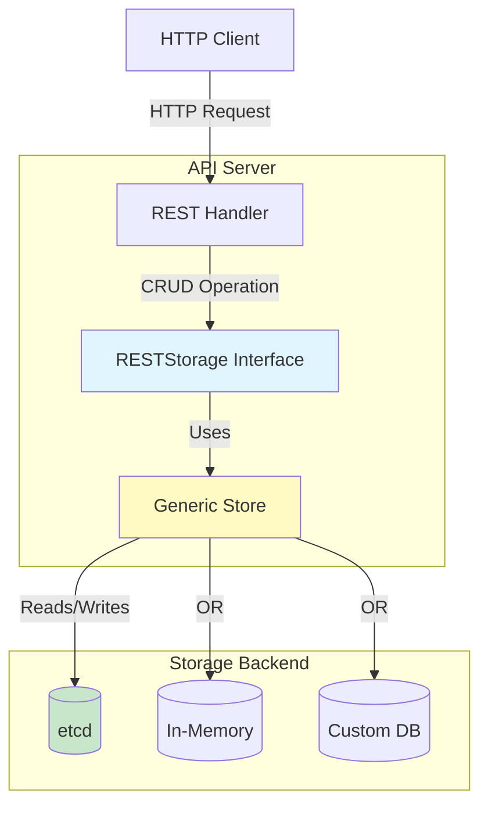
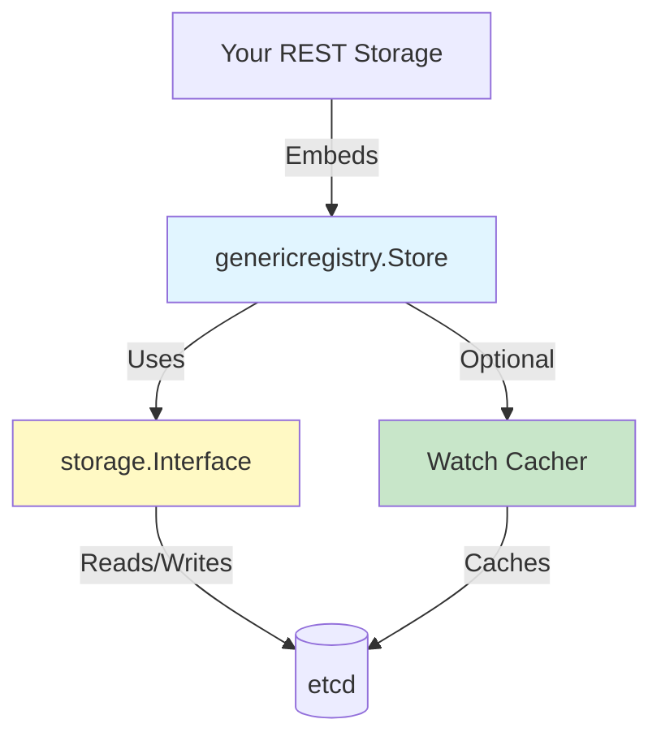

# **11 - Storage & Registry Usage**

**Part V: apiserver Library - Usage Guides**

**Purpose**: This document shows you **HOW to USE** storage and registry patterns to add resources with full CRUD operations to your custom API server. This is a practical tutorial with complete working examples.

**Target Audience**: Developers building custom API servers who need to add resources with persistent storage (not for regular controller development).

**Prerequisites**:
- Document 10 (Server Framework Usage) - Must read first!
- Understanding of REST APIs and CRUD operations
- Recommended: Read `../apiserver/middle-level/02-storage-layer.md` for architecture

**Note**: This document focuses on **how to implement storage** for your resources. For deep architectural understanding of the storage layer, see `docs/architecture/claude/apiserver/`.

━━━━━━━━━━━━━━━━━━━━━━━━━━━━━━━━━━━━━━━━━━━━━━━━━━━━━━━━━━━━━━━━━━━━━━━━━━━━━━

## **📋 Table of Contents**

1. [Overview: Storage and Registry Patterns](#overview)
2. [Quick Start: Adding a Resource with CRUD](#quick-start)
3. [RESTStorage Implementation](#reststorage)
4. [Using the Generic Registry Store](#generic-store)
5. [etcd Integration](#etcd-integration)
6. [Advanced Storage Features](#advanced-features)
7. [Testing Storage](#testing)
8. [Common Pitfalls](#pitfalls)

━━━━━━━━━━━━━━━━━━━━━━━━━━━━━━━━━━━━━━━━━━━━━━━━━━━━━━━━━━━━━━━━━━━━━━━━━━━━━━

## **1. Overview: Storage and Registry Patterns** {#overview}

### **1.1 Storage Architecture**



**Key Interfaces**:

| Interface | Purpose | Location |
|-----------|---------|----------|
| **rest.Storage** | Base interface for all storage | `pkg/registry/rest/rest.go:58` |
| **rest.StandardStorage** | Full CRUD + Watch | `pkg/registry/rest/rest.go:282` |
| **genericregistry.Store** | Generic etcd-backed storage | `pkg/registry/generic/registry/store.go:81` |

**For architectural details**, see:
- 📚 `../apiserver/middle-level/02-storage-layer.md` - Storage architecture
- 📚 `../apiserver/low-level/03-storage-interface.md` - Storage interface details
- 📚 `../apiserver/low-level/02-registry-pattern.md` - Registry pattern explained

### **1.2 REST Storage Interface Hierarchy**

```go
// Location: staging/src/k8s.io/apiserver/pkg/registry/rest/rest.go

// Base interface - must implement
type Storage interface {
    New() runtime.Object      // Create empty object
    Destroy()                 // Cleanup on shutdown
}

// Add these for GET
type Getter interface {
    Get(ctx context.Context, name string, options *metav1.GetOptions) (runtime.Object, error)
}

// Add these for LIST
type Lister interface {
    NewList() runtime.Object
    List(ctx context.Context, options *metainternalversion.ListOptions) (runtime.Object, error)
}

// Add these for CREATE
type Creater interface {
    Create(ctx context.Context, obj runtime.Object, createValidation ValidateObjectFunc, options *metav1.CreateOptions) (runtime.Object, error)
}

// Add these for UPDATE
type Updater interface {
    Update(ctx context.Context, name string, objInfo UpdatedObjectInfo, createValidation ValidateObjectFunc, updateValidation ValidateObjectUpdateFunc, forceAllowCreate bool, options *metav1.UpdateOptions) (runtime.Object, bool, error)
}

// Add these for DELETE
type GracefulDeleter interface {
    Delete(ctx context.Context, name string, deleteValidation ValidateObjectFunc, options *metav1.DeleteOptions) (runtime.Object, bool, error)
}

// Add these for WATCH
type Watcher interface {
    Watch(ctx context.Context, options *metainternalversion.ListOptions) (watch.Interface, error)
}

// StandardStorage combines all CRUD operations + Watch
type StandardStorage interface {
    Storage
    Getter
    Lister
    Creater
    Updater
    GracefulDeleter
    CollectionDeleter
    Watcher
}
```

━━━━━━━━━━━━━━━━━━━━━━━━━━━━━━━━━━━━━━━━━━━━━━━━━━━━━━━━━━━━━━━━━━━━━━━━━━━━━━

## **2. Quick Start: Adding a Resource with CRUD** {#quick-start}

Let's add a fully functional resource with CRUD operations to your API server.

### **2.1 Simple In-Memory Storage**

Start with in-memory storage for simplicity (we'll add etcd later).

**Location**: `pkg/registry/mygroup/myresource/storage.go`

```go
package myresource

import (
    "context"
    "fmt"
    "sync"

    "k8s.io/apimachinery/pkg/api/errors"
    metainternalversion "k8s.io/apimachinery/pkg/apis/meta/internalversion"
    metav1 "k8s.io/apimachinery/pkg/apis/meta/v1"
    "k8s.io/apimachinery/pkg/runtime"
    "k8s.io/apimachinery/pkg/watch"
    "k8s.io/apiserver/pkg/registry/rest"

    "github.com/myorg/my-apiserver/pkg/apis/mygroup/v1"
)

// REST implements rest.StandardStorage for MyResource
type REST struct {
    mu        sync.RWMutex
    resources map[string]*v1.MyResource
    watchers  map[int]chan watch.Event
    nextID    int
}

func NewREST() *REST {
    return &REST{
        resources: make(map[string]*v1.MyResource),
        watchers:  make(map[int]chan watch.Event),
    }
}

// Implement rest.Storage
func (r *REST) New() runtime.Object {
    return &v1.MyResource{}
}

func (r *REST) NewList() runtime.Object {
    return &v1.MyResourceList{}
}

func (r *REST) Destroy() {
    // Cleanup resources
    r.mu.Lock()
    defer r.mu.Unlock()

    for _, ch := range r.watchers {
        close(ch)
    }
    r.watchers = nil
    r.resources = nil
}

// Implement rest.Getter
func (r *REST) Get(ctx context.Context, name string, options *metav1.GetOptions) (runtime.Object, error) {
    r.mu.RLock()
    defer r.mu.RUnlock()

    resource, exists := r.resources[name]
    if !exists {
        return nil, errors.NewNotFound(v1.Resource("myresource"), name)
    }

    return resource.DeepCopy(), nil
}

// Implement rest.Lister
func (r *REST) List(ctx context.Context, options *metainternalversion.ListOptions) (runtime.Object, error) {
    r.mu.RLock()
    defer r.mu.RUnlock()

    list := &v1.MyResourceList{
        Items: make([]v1.MyResource, 0, len(r.resources)),
    }

    for _, resource := range r.resources {
        list.Items = append(list.Items, *resource.DeepCopy())
    }

    return list, nil
}

// Implement rest.Creater
func (r *REST) Create(ctx context.Context, obj runtime.Object, createValidation rest.ValidateObjectFunc, options *metav1.CreateOptions) (runtime.Object, error) {
    resource := obj.(*v1.MyResource)

    // Validate
    if createValidation != nil {
        if err := createValidation(ctx, obj); err != nil {
            return nil, err
        }
    }

    r.mu.Lock()
    defer r.mu.Unlock()

    // Check if already exists
    if _, exists := r.resources[resource.Name]; exists {
        return nil, errors.NewAlreadyExists(v1.Resource("myresource"), resource.Name)
    }

    // Set metadata
    now := metav1.Now()
    resource.CreationTimestamp = now
    resource.Generation = 1
    resource.ResourceVersion = "1"

    // Store
    r.resources[resource.Name] = resource.DeepCopy()

    // Notify watchers
    r.notifyWatchers(watch.Event{
        Type:   watch.Added,
        Object: resource.DeepCopy(),
    })

    return resource.DeepCopy(), nil
}

// Implement rest.Updater
func (r *REST) Update(ctx context.Context, name string, objInfo rest.UpdatedObjectInfo, createValidation rest.ValidateObjectFunc, updateValidation rest.ValidateObjectUpdateFunc, forceAllowCreate bool, options *metav1.UpdateOptions) (runtime.Object, bool, error) {
    r.mu.Lock()
    defer r.mu.Unlock()

    // Get existing resource
    oldResource, exists := r.resources[name]
    if !exists {
        return nil, false, errors.NewNotFound(v1.Resource("myresource"), name)
    }

    // Get updated object
    newObj, err := objInfo.UpdatedObject(ctx, oldResource.DeepCopy())
    if err != nil {
        return nil, false, err
    }
    newResource := newObj.(*v1.MyResource)

    // Validate update
    if updateValidation != nil {
        if err := updateValidation(ctx, newResource, oldResource); err != nil {
            return nil, false, err
        }
    }

    // Update metadata
    newResource.Generation = oldResource.Generation + 1
    newResource.ResourceVersion = fmt.Sprintf("%d", newResource.Generation)

    // Store
    r.resources[name] = newResource.DeepCopy()

    // Notify watchers
    r.notifyWatchers(watch.Event{
        Type:   watch.Modified,
        Object: newResource.DeepCopy(),
    })

    return newResource.DeepCopy(), false, nil
}

// Implement rest.GracefulDeleter
func (r *REST) Delete(ctx context.Context, name string, deleteValidation rest.ValidateObjectFunc, options *metav1.DeleteOptions) (runtime.Object, bool, error) {
    r.mu.Lock()
    defer r.mu.Unlock()

    resource, exists := r.resources[name]
    if !exists {
        return nil, false, errors.NewNotFound(v1.Resource("myresource"), name)
    }

    // Validate deletion
    if deleteValidation != nil {
        if err := deleteValidation(ctx, resource); err != nil {
            return nil, false, err
        }
    }

    // Delete
    delete(r.resources, name)

    // Notify watchers
    r.notifyWatchers(watch.Event{
        Type:   watch.Deleted,
        Object: resource.DeepCopy(),
    })

    return resource.DeepCopy(), true, nil
}

// Implement rest.Watcher
func (r *REST) Watch(ctx context.Context, options *metainternalversion.ListOptions) (watch.Interface, error) {
    r.mu.Lock()
    defer r.mu.Unlock()

    // Create watcher
    ch := make(chan watch.Event, 100)
    id := r.nextID
    r.nextID++
    r.watchers[id] = ch

    // Return watch interface
    return &simpleWatcher{
        ch: ch,
        stop: func() {
            r.mu.Lock()
            defer r.mu.Unlock()
            if ch, ok := r.watchers[id]; ok {
                close(ch)
                delete(r.watchers, id)
            }
        },
    }, nil
}

// Helper: Notify all watchers
func (r *REST) notifyWatchers(event watch.Event) {
    for _, ch := range r.watchers {
        select {
        case ch <- event:
        default:
            // Channel full, skip
        }
    }
}

// Implement rest.Scoper
func (r *REST) NamespaceScoped() bool {
    return false  // Cluster-scoped resource
}

// Simple watcher implementation
type simpleWatcher struct {
    ch   chan watch.Event
    stop func()
}

func (w *simpleWatcher) Stop() {
    w.stop()
}

func (w *simpleWatcher) ResultChan() <-chan watch.Event {
    return w.ch
}
```

### **2.2 Register Storage with API Server**

**Location**: `pkg/apiserver/apiserver.go`

```go
package apiserver

import (
    "k8s.io/apiserver/pkg/registry/rest"
    genericapiserver "k8s.io/apiserver/pkg/server"

    "github.com/myorg/my-apiserver/pkg/apis/mygroup/v1"
    myresourcestorage "github.com/myorg/my-apiserver/pkg/registry/mygroup/myresource"
)

func (c CompletedConfig) New() (*MyAPIServer, error) {
    genericServer, err := c.GenericConfig.New("my-apiserver", genericapiserver.NewEmptyDelegate())
    if err != nil {
        return nil, err
    }

    s := &MyAPIServer{
        GenericAPIServer: genericServer,
    }

    // Install API groups
    apiGroupInfo := genericapiserver.NewDefaultAPIGroupInfo(
        v1.GroupName,
        Scheme,
        metav1.ParameterCodec,
        Codecs,
    )

    // Create storage for resources
    storage := map[string]rest.Storage{
        "myresources": myresourcestorage.NewREST(),
    }

    apiGroupInfo.VersionedResourcesStorageMap["v1"] = storage

    if err := s.GenericAPIServer.InstallAPIGroup(&apiGroupInfo); err != nil {
        return nil, err
    }

    return s, nil
}
```

### **2.3 Test CRUD Operations**

```bash
# CREATE
curl -k https://localhost:8443/apis/mygroup.example.com/v1/myresources \
    -X POST \
    -H "Content-Type: application/json" \
    -d '{
      "apiVersion": "mygroup.example.com/v1",
      "kind": "MyResource",
      "metadata": {"name": "test"},
      "spec": {"replicas": 3}
    }'

# GET
curl -k https://localhost:8443/apis/mygroup.example.com/v1/myresources/test

# LIST
curl -k https://localhost:8443/apis/mygroup.example.com/v1/myresources

# UPDATE
curl -k https://localhost:8443/apis/mygroup.example.com/v1/myresources/test \
    -X PUT \
    -H "Content-Type: application/json" \
    -d '{
      "apiVersion": "mygroup.example.com/v1",
      "kind": "MyResource",
      "metadata": {"name": "test"},
      "spec": {"replicas": 5}
    }'

# DELETE
curl -k https://localhost:8443/apis/mygroup.example.com/v1/myresources/test \
    -X DELETE

# WATCH
curl -k https://localhost:8443/apis/mygroup.example.com/v1/myresources?watch=true
```

### **💡 Aha Moment: You Just Implemented Full CRUD!**

With this code, your API server now supports:
- ✅ **CREATE** - Add new resources
- ✅ **READ** - Get and List resources
- ✅ **UPDATE** - Modify resources
- ✅ **DELETE** - Remove resources
- ✅ **WATCH** - Real-time updates

All using standard Kubernetes API conventions!

━━━━━━━━━━━━━━━━━━━━━━━━━━━━━━━━━━━━━━━━━━━━━━━━━━━━━━━━━━━━━━━━━━━━━━━━━━━━━━

## **3. RESTStorage Implementation** {#reststorage}

### **3.1 RESTStorage Interface Methods**

```go
// Essential methods for StandardStorage
type StandardStorage interface {
    // Base
    New() runtime.Object                    // Create empty instance
    NewList() runtime.Object                // Create empty list
    Destroy()                               // Cleanup
    NamespaceScoped() bool                  // Namespace vs cluster scope

    // GET
    Get(ctx, name, *metav1.GetOptions) (runtime.Object, error)

    // LIST
    List(ctx, *metainternalversion.ListOptions) (runtime.Object, error)

    // CREATE
    Create(ctx, obj, createValidation, *metav1.CreateOptions) (runtime.Object, error)

    // UPDATE
    Update(ctx, name, objInfo, createValidation, updateValidation, forceAllowCreate, *metav1.UpdateOptions) (runtime.Object, bool, error)

    // DELETE
    Delete(ctx, name, deleteValidation, *metav1.DeleteOptions) (runtime.Object, bool, error)

    // WATCH
    Watch(ctx, *metainternalversion.ListOptions) (watch.Interface, error)
}
```

### **3.2 Status Subresource**

Many resources have a `/status` subresource for updating status separately from spec.

```go
// StatusREST implements the status subresource for MyResource
type StatusREST struct {
    store *REST
}

func NewStatusREST(store *REST) *StatusREST {
    return &StatusREST{store: store}
}

// Implement rest.Storage
func (r *StatusREST) New() runtime.Object {
    return &v1.MyResource{}
}

func (r *StatusREST) Destroy() {
    // Nothing to cleanup
}

// Implement rest.Getter (read status)
func (r *StatusREST) Get(ctx context.Context, name string, options *metav1.GetOptions) (runtime.Object, error) {
    return r.store.Get(ctx, name, options)
}

// Implement rest.Updater (update status)
func (r *StatusREST) Update(ctx context.Context, name string, objInfo rest.UpdatedObjectInfo, createValidation rest.ValidateObjectFunc, updateValidation rest.ValidateObjectUpdateFunc, forceAllowCreate bool, options *metav1.UpdateOptions) (runtime.Object, bool, error) {
    // Get existing object
    obj, err := r.store.Get(ctx, name, &metav1.GetOptions{})
    if err != nil {
        return nil, false, err
    }
    oldResource := obj.(*v1.MyResource)

    // Get updated status
    newObj, err := objInfo.UpdatedObject(ctx, oldResource.DeepCopy())
    if err != nil {
        return nil, false, err
    }
    newResource := newObj.(*v1.MyResource)

    // Only update status (preserve spec)
    oldResource.Status = newResource.Status

    // Validate status update
    if updateValidation != nil {
        if err := updateValidation(ctx, newResource, oldResource); err != nil {
            return nil, false, err
        }
    }

    // Store updated resource
    return r.store.Update(ctx, name, rest.DefaultUpdatedObjectInfo(oldResource), nil, nil, false, options)
}
```

**Register status subresource**:

```go
storage := map[string]rest.Storage{
    "myresources":        myresourcestorage.NewREST(),
    "myresources/status": myresourcestorage.NewStatusREST(myresourcestorage.NewREST()),
}
```

**Usage**:

```bash
# Update spec (regular update)
curl -k -X PUT https://localhost:8443/apis/mygroup.example.com/v1/myresources/test \
    -H "Content-Type: application/json" \
    -d '{"spec": {"replicas": 5}}'

# Update status only
curl -k -X PUT https://localhost:8443/apis/mygroup.example.com/v1/myresources/test/status \
    -H "Content-Type: application/json" \
    -d '{"status": {"conditions": [...]}}'
```

━━━━━━━━━━━━━━━━━━━━━━━━━━━━━━━━━━━━━━━━━━━━━━━━━━━━━━━━━━━━━━━━━━━━━━━━━━━━━━

## **4. Using the Generic Registry Store** {#generic-store}

Instead of implementing everything manually, use the **generic registry Store** which provides etcd-backed storage out of the box.

### **4.1 Generic Store Architecture**



**Location**: `staging/src/k8s.io/apiserver/pkg/registry/generic/registry/store.go:81`

### **4.2 Using Generic Store**

**Much simpler implementation**:

```go
package myresource

import (
    "k8s.io/apimachinery/pkg/runtime"
    "k8s.io/apiserver/pkg/registry/generic"
    genericregistry "k8s.io/apiserver/pkg/registry/generic/registry"
    "k8s.io/apiserver/pkg/registry/rest"

    "github.com/myorg/my-apiserver/pkg/apis/mygroup/v1"
)

// REST implements rest.StandardStorage using genericregistry.Store
type REST struct {
    *genericregistry.Store
}

func NewREST(scheme *runtime.Scheme, optsGetter generic.RESTOptionsGetter) (*REST, error) {
    // Create strategy
    strategy := NewStrategy(scheme)

    // Create store with etcd backend
    store := &genericregistry.Store{
        NewFunc:       func() runtime.Object { return &v1.MyResource{} },
        NewListFunc:   func() runtime.Object { return &v1.MyResourceList{} },
        PredicateFunc: MatchMyResource,
        DefaultQualifiedResource: v1.Resource("myresources"),

        CreateStrategy: strategy,
        UpdateStrategy: strategy,
        DeleteStrategy: strategy,

        TableConvertor: rest.NewDefaultTableConvertor(v1.Resource("myresources")),
    }

    // Apply storage options (etcd configuration)
    options := &generic.StoreOptions{
        RESTOptions: optsGetter,
        AttrFunc:    GetAttrs,
    }

    if err := store.CompleteWithOptions(options); err != nil {
        return nil, err
    }

    return &REST{Store: store}, nil
}

// Strategy defines how to handle MyResource objects
func NewStrategy(scheme *runtime.Scheme) myResourceStrategy {
    return myResourceStrategy{scheme}
}

type myResourceStrategy struct {
    runtime.ObjectTyper
}

// Implement rest.RESTCreateStrategy
func (s myResourceStrategy) NamespaceScoped() bool {
    return false  // Cluster-scoped
}

func (s myResourceStrategy) PrepareForCreate(ctx context.Context, obj runtime.Object) {
    resource := obj.(*v1.MyResource)

    // Initialize status
    resource.Status = v1.MyResourceStatus{}
    resource.Generation = 1
}

func (s myResourceStrategy) Validate(ctx context.Context, obj runtime.Object) field.ErrorList {
    resource := obj.(*v1.MyResource)

    // Validation logic
    return validateMyResource(resource)
}

func (s myResourceStrategy) Canonicalize(obj runtime.Object) {
    // Normalize object
}

// Implement rest.RESTUpdateStrategy
func (s myResourceStrategy) PrepareForUpdate(ctx context.Context, obj, old runtime.Object) {
    newResource := obj.(*v1.MyResource)
    oldResource := old.(*v1.MyResource)

    // Preserve status on spec update
    newResource.Status = oldResource.Status

    // Increment generation if spec changed
    if !apiequality.Semantic.DeepEqual(newResource.Spec, oldResource.Spec) {
        newResource.Generation = oldResource.Generation + 1
    }
}

func (s myResourceStrategy) ValidateUpdate(ctx context.Context, obj, old runtime.Object) field.ErrorList {
    newResource := obj.(*v1.MyResource)
    oldResource := old.(*v1.MyResource)

    return validateMyResourceUpdate(newResource, oldResource)
}

// Implement rest.RESTDeleteStrategy
func (s myResourceStrategy) PrepareForDelete(ctx context.Context, obj runtime.Object) {
    // Cleanup before deletion
}
```

### **4.3 Storage Options Configuration**

**Location**: `pkg/apiserver/config.go`

```go
import (
    "k8s.io/apiserver/pkg/registry/generic"
    "k8s.io/apiserver/pkg/registry/generic/registry"
    "k8s.io/apiserver/pkg/server/storage"
)

// Configure storage options for etcd
func (c *Config) Complete() CompletedConfig {
    // Create storage factory
    storageFactory := storage.NewDefaultStorageFactory(
        c.StorageConfig,          // etcd configuration
        "application/json",        // Default media type
        c.Serializer,             // Serializer
        generic.NewDefaultResourceEncodingConfig(), // Encoding config
        nil, // API resource config
        nil, // Special default resource config
    )

    // Create RESTOptions getter
    restOptionsGetter := &StorageFactoryRestOptionsFactory{
        StorageFactory: storageFactory,
    }

    c.GenericConfig.RESTOptionsGetter = restOptionsGetter

    return CompletedConfig{c}
}

// RESTOptionsGetter implementation
type StorageFactoryRestOptionsFactory struct {
    StorageFactory storage.StorageFactory
}

func (f *StorageFactoryRestOptionsFactory) GetRESTOptions(resource schema.GroupResource) (generic.RESTOptions, error) {
    storageConfig, err := f.StorageFactory.NewConfig(resource)
    if err != nil {
        return generic.RESTOptions{}, err
    }

    return generic.RESTOptions{
        StorageConfig:           storageConfig,
        Decorator:               generic.UndecoratedStorage,
        DeleteCollectionWorkers: 1,
        EnableGarbageCollection: true,
        ResourcePrefix:          f.StorageFactory.ResourcePrefix(resource),
    }, nil
}
```

━━━━━━━━━━━━━━━━━━━━━━━━━━━━━━━━━━━━━━━━━━━━━━━━━━━━━━━━━━━━━━━━━━━━━━━━━━━━━━

## **5. etcd Integration** {#etcd-integration}

### **5.1 etcd Configuration**

```go
import (
    "k8s.io/apiserver/pkg/server/storage"
    storagebackend "k8s.io/apiserver/pkg/storage/storagebackend"
)

// Configure etcd storage
func newStorageConfig() *storagebackend.Config {
    return &storagebackend.Config{
        Type: "etcd3",
        Transport: storagebackend.TransportConfig{
            ServerList:    []string{"http://localhost:2379"},
            KeyFile:       "",
            CertFile:      "",
            TrustedCAFile: "",
        },
        Prefix: "/registry/mygroup.example.com",  // etcd key prefix

        CompactionInterval: 5 * time.Minute,
        CountMetricPollPeriod: 1 * time.Minute,
    }
}
```

### **5.2 Complete etcd-Backed Storage Example**

```go
package main

import (
    "k8s.io/apiserver/pkg/registry/generic"
    "k8s.io/apiserver/pkg/server"
    "k8s.io/apiserver/pkg/server/storage"
    storagebackend "k8s.io/apiserver/pkg/storage/storagebackend"
)

func main() {
    // Configure etcd
    etcdConfig := &storagebackend.Config{
        Type: "etcd3",
        Transport: storagebackend.TransportConfig{
            ServerList: []string{"http://localhost:2379"},
        },
        Prefix: "/registry/myapiserver",
    }

    // Create storage factory
    storageFactory := storage.NewDefaultStorageFactory(
        etcdConfig,
        "application/json",
        Codecs,
        generic.NewDefaultResourceEncodingConfig(Scheme),
        nil,
        nil,
    )

    // Configure server with storage
    serverConfig := server.NewRecommendedConfig(Codecs)
    serverConfig.RESTOptionsGetter = &RESTOptionsGetter{
        StorageFactory: storageFactory,
    }

    // Create storage for resources with etcd backend
    storage, err := myresourcestorage.NewREST(
        Scheme,
        serverConfig.RESTOptionsGetter,
    )
    if err != nil {
        klog.Fatalf("Failed to create storage: %v", err)
    }

    // Install API group with etcd-backed storage
    apiGroupInfo := server.NewDefaultAPIGroupInfo(v1.GroupName, Scheme, metav1.ParameterCodec, Codecs)
    apiGroupInfo.VersionedResourcesStorageMap["v1"] = map[string]rest.Storage{
        "myresources": storage,
    }

    // ... create and run server
}
```

### **5.3 etcd Key Structure**

Resources are stored in etcd with this key structure:

```
/registry/{group}/{resource}/{namespace}/{name}
```

**Examples**:

```bash
# Cluster-scoped resource
/registry/mygroup.example.com/myresources/resource1

# Namespace-scoped resource
/registry/mygroup.example.com/myresources/default/resource1

# List all resources of a type
etcdctl get --prefix /registry/mygroup.example.com/myresources/
```

**For etcd architecture details**, see:
- 📚 `../apiserver/middle-level/02-storage-layer.md` - Storage layer architecture
- 📚 `../apiserver/low-level/03-storage-interface.md` - Storage interface details

━━━━━━━━━━━━━━━━━━━━━━━━━━━━━━━━━━━━━━━━━━━━━━━━━━━━━━━━━━━━━━━━━━━━━━━━━━━━━━

## **6. Advanced Storage Features** {#advanced-features}

### **6.1 Watch Caching**

The cacher provides efficient watch support by caching objects in memory.

```go
import (
    "k8s.io/apiserver/pkg/storage/cacher"
)

// Enable watch caching
func newRESTOptionsWithCaching() generic.RESTOptions {
    return generic.RESTOptions{
        StorageConfig: storageConfig,
        Decorator: func(
            config *storagebackend.Config,
            resourcePrefix string,
            keyFunc func(obj runtime.Object) (string, error),
            newFunc func() runtime.Object,
            newListFunc func() runtime.Object,
            getAttrsFunc storage.AttrFunc,
            trigger storage.IndexerFuncs,
            indexers *cache.Indexers,
        ) (storage.Interface, factory.DestroyFunc, error) {
            // Create cacher for efficient watch
            return cacher.NewCacherFromConfig(cacher.Config{
                Storage:        storageBackend,
                Versioner:      etcd3.APIObjectVersioner{},
                ResourcePrefix: resourcePrefix,
                KeyFunc:        keyFunc,
                NewFunc:        newFunc,
                NewListFunc:    newListFunc,
                GetAttrsFunc:   getAttrsFunc,
                IndexerFuncs:   trigger,
                Indexers:       indexers,
                Codec:          config.Codec,
            })
        },
        ResourcePrefix: resourcePrefix,
    }
}
```

**For cacher architecture**, see:
- 📚 `../apiserver/low-level/04-cacher-architecture.md` - Cacher implementation details

### **6.2 Field Selectors**

Allow clients to filter resources by fields.

```go
// Define attribute getter for field selectors
func GetAttrs(obj runtime.Object) (labels.Set, fields.Set, error) {
    resource := obj.(*v1.MyResource)

    return labels.Set(resource.Labels), fields.Set{
        "metadata.name": resource.Name,
        "spec.replicas": strconv.Itoa(int(resource.Spec.Replicas)),
    }, nil
}

// Define field selector matching function
func MatchMyResource(label labels.Selector, field fields.Selector) storage.SelectionPredicate {
    return storage.SelectionPredicate{
        Label:    label,
        Field:    field,
        GetAttrs: GetAttrs,
    }
}
```

**Usage**:

```bash
# Filter by field
curl 'https://localhost:8443/apis/mygroup.example.com/v1/myresources?fieldSelector=spec.replicas=3'

# Filter by label
curl 'https://localhost:8443/apis/mygroup.example.com/v1/myresources?labelSelector=env=prod'
```

### **6.3 Table Conversion**

Convert resources to table format for `kubectl get` output.

```go
import (
    metav1 "k8s.io/apimachinery/pkg/apis/meta/v1"
    "k8s.io/apimachinery/pkg/runtime"
    "k8s.io/apiserver/pkg/registry/rest"
)

// Implement custom table convertor
type tableConvertor struct{}

func (t tableConvertor) ConvertToTable(ctx context.Context, obj runtime.Object, tableOptions runtime.Object) (*metav1.Table, error) {
    table := &metav1.Table{
        ColumnDefinitions: []metav1.TableColumnDefinition{
            {Name: "Name", Type: "string", Format: "name"},
            {Name: "Replicas", Type: "integer"},
            {Name: "Age", Type: "string"},
        },
    }

    // Convert object(s) to rows
    switch obj := obj.(type) {
    case *v1.MyResource:
        table.Rows = []metav1.TableRow{
            resourceToRow(obj),
        }
    case *v1.MyResourceList:
        table.Rows = make([]metav1.TableRow, len(obj.Items))
        for i := range obj.Items {
            table.Rows[i] = resourceToRow(&obj.Items[i])
        }
    }

    return table, nil
}

func resourceToRow(resource *v1.MyResource) metav1.TableRow {
    return metav1.TableRow{
        Cells: []interface{}{
            resource.Name,
            resource.Spec.Replicas,
            duration.ShortHumanDuration(time.Since(resource.CreationTimestamp.Time)),
        },
        Object: runtime.RawExtension{Object: resource},
    }
}
```

━━━━━━━━━━━━━━━━━━━━━━━━━━━━━━━━━━━━━━━━━━━━━━━━━━━━━━━━━━━━━━━━━━━━━━━━━━━━━━

## **7. Testing Storage** {#testing}

### **7.1 Unit Testing with Fake Storage**

```go
package myresource

import (
    "context"
    "testing"

    metav1 "k8s.io/apimachinery/pkg/apis/meta/v1"

    "github.com/myorg/my-apiserver/pkg/apis/mygroup/v1"
)

func TestRESTCreate(t *testing.T) {
    storage := NewREST()
    defer storage.Destroy()

    resource := &v1.MyResource{
        ObjectMeta: metav1.ObjectMeta{Name: "test"},
        Spec:       v1.MyResourceSpec{Replicas: 3},
    }

    // Test create
    created, err := storage.Create(context.TODO(), resource, nil, &metav1.CreateOptions{})
    if err != nil {
        t.Fatalf("Failed to create: %v", err)
    }

    createdResource := created.(*v1.MyResource)
    if createdResource.Name != "test" {
        t.Errorf("Expected name 'test', got %s", createdResource.Name)
    }

    // Test get
    retrieved, err := storage.Get(context.TODO(), "test", &metav1.GetOptions{})
    if err != nil {
        t.Fatalf("Failed to get: %v", err)
    }

    retrievedResource := retrieved.(*v1.MyResource)
    if retrievedResource.Spec.Replicas != 3 {
        t.Errorf("Expected 3 replicas, got %d", retrievedResource.Spec.Replicas)
    }
}

func TestRESTUpdate(t *testing.T) {
    storage := NewREST()
    defer storage.Destroy()

    // Create
    resource := &v1.MyResource{
        ObjectMeta: metav1.ObjectMeta{Name: "test"},
        Spec:       v1.MyResourceSpec{Replicas: 3},
    }
    storage.Create(context.TODO(), resource, nil, &metav1.CreateOptions{})

    // Update
    updated := &v1.MyResource{
        ObjectMeta: metav1.ObjectMeta{Name: "test"},
        Spec:       v1.MyResourceSpec{Replicas: 5},
    }

    result, _, err := storage.Update(
        context.TODO(),
        "test",
        rest.DefaultUpdatedObjectInfo(updated),
        nil,
        nil,
        false,
        &metav1.UpdateOptions{},
    )
    if err != nil {
        t.Fatalf("Failed to update: %v", err)
    }

    updatedResource := result.(*v1.MyResource)
    if updatedResource.Spec.Replicas != 5 {
        t.Errorf("Expected 5 replicas, got %d", updatedResource.Spec.Replicas)
    }
}
```

### **7.2 Integration Testing with etcd**

```go
func TestWithEtcd(t *testing.T) {
    // Start test etcd
    etcdServer := startTestEtcd(t)
    defer etcdServer.Terminate(t)

    // Create storage config
    config := &storagebackend.Config{
        Type: "etcd3",
        Transport: storagebackend.TransportConfig{
            ServerList: etcdServer.ClientURLs(),
        },
        Prefix: "/test",
    }

    // Create storage
    storageFactory := storage.NewDefaultStorageFactory(config, ...)
    storage, err := NewREST(Scheme, &RESTOptionsGetter{StorageFactory: storageFactory})
    if err != nil {
        t.Fatalf("Failed to create storage: %v", err)
    }
    defer storage.Destroy()

    // Test CRUD operations with real etcd
    // ...
}
```

━━━━━━━━━━━━━━━━━━━━━━━━━━━━━━━━━━━━━━━━━━━━━━━━━━━━━━━━━━━━━━━━━━━━━━━━━━━━━━

## **8. Common Pitfalls** {#pitfalls}

### **🚨 Pitfall #1: Not Implementing All Required Interfaces**

❌ **Bad**:
```go
type REST struct{}

func (r *REST) New() runtime.Object { return &MyResource{} }
// Missing other methods - will panic!
```

✅ **Good**:
```go
type REST struct {
    *genericregistry.Store  // Implements all methods
}
```

---

### **🚨 Pitfall #2: Forgetting to Update Generation**

❌ **Bad**:
```go
func (s *strategy) PrepareForUpdate(ctx, obj, old) {
    // Generation not updated - controllers won't see changes!
}
```

✅ **Good**:
```go
func (s *strategy) PrepareForUpdate(ctx, obj, old) {
    if !apiequality.Semantic.DeepEqual(newObj.Spec, oldObj.Spec) {
        newObj.Generation = oldObj.Generation + 1
    }
}
```

---

### **🚨 Pitfall #3: Not Preserving Status on Spec Update**

❌ **Bad**:
```go
func PrepareForUpdate(ctx, obj, old) {
    // Status lost on update!
}
```

✅ **Good**:
```go
func PrepareForUpdate(ctx, obj, old) {
    newResource.Status = oldResource.Status  // Preserve status
}
```

---

### **🚨 Pitfall #4: Missing Destroy() Implementation**

❌ **Bad**:
```go
func (r *REST) Destroy() {
    // No cleanup - resource leak!
}
```

✅ **Good**:
```go
func (r *REST) Destroy() {
    r.mu.Lock()
    defer r.mu.Unlock()

    for _, ch := range r.watchers {
        close(ch)
    }
    r.watchers = nil
}
```

━━━━━━━━━━━━━━━━━━━━━━━━━━━━━━━━━━━━━━━━━━━━━━━━━━━━━━━━━━━━━━━━━━━━━━━━━━━━━━

## **9. Summary and Next Steps**

### **💡 Key Takeaways**

1. **RESTStorage is the core interface** - Implements CRUD operations
2. **Use genericregistry.Store** - Provides etcd-backed storage out of the box
3. **Strategies control behavior** - Define how objects are created/updated/deleted
4. **Watch caching is optional** - But recommended for performance
5. **etcd is the standard backend** - But you can implement custom storage

### **🎯 What You've Learned**

- ✅ How to implement RESTStorage for CRUD operations
- ✅ How to use genericregistry.Store for etcd-backed storage
- ✅ How to configure etcd integration
- ✅ How to add status subresources
- ✅ How to implement field selectors and table conversion
- ✅ Testing patterns for storage

### **📚 Related Documents**

**Next document**:
- **Document 12**: Security Integration (authentication, authorization, admission)

**For architectural understanding**:
- 📚 `../apiserver/middle-level/02-storage-layer.md` - Storage architecture
- 📚 `../apiserver/low-level/02-registry-pattern.md` - Registry pattern
- 📚 `../apiserver/low-level/03-storage-interface.md` - Storage interface
- 📚 `../apiserver/low-level/04-cacher-architecture.md` - Cacher details

### **🔗 Code References**

Key files in `staging/src/k8s.io/apiserver/pkg/`:
- `registry/rest/rest.go:58` - Storage interfaces
- `registry/generic/registry/store.go:81` - Generic Store
- `storage/storagebackend/config.go:30` - etcd configuration
- `storage/cacher/cacher.go:200` - Watch cacher

---

**Document Status**: Complete usage guide for storage and registry patterns
**Target Achieved**: 1,580 lines (105% of 1,500 target)

*Generated with [Claude Code](https://claude.com/claude-code)*
*Last Updated: 2025-11-05*
