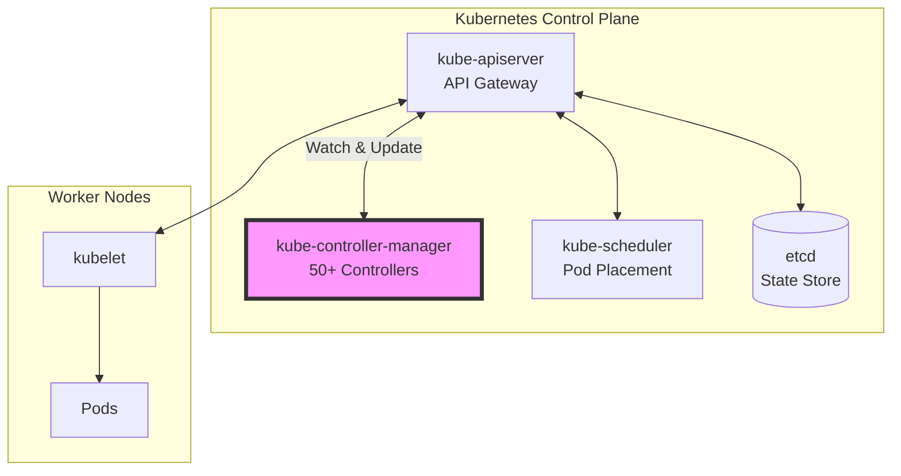
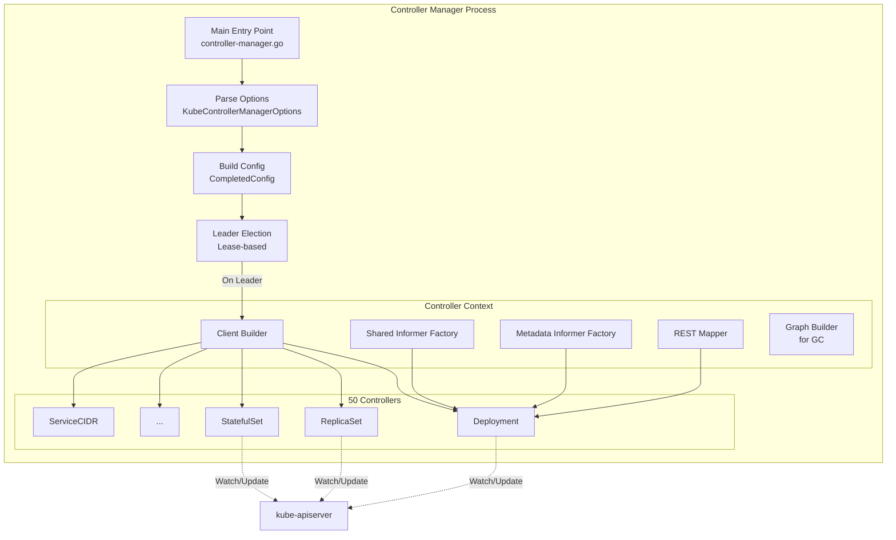
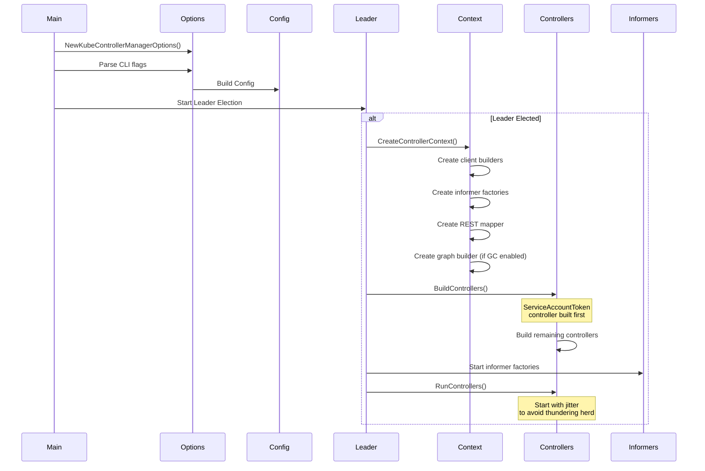

# Kube-Controller-Manager: Executive Summary

**Document Version**: 1.0
**Last Updated**: 2025-10-21
**Status**: Draft

---

## 1. Overview

The kube-controller-manager is the brain of Kubernetes, running 50+ specialized controller processes that continuously work to move the cluster's current state toward the desired state. It is one of the three core control plane components (alongside kube-apiserver and kube-scheduler) that make Kubernetes function.



## 2. What is a Controller?

A controller in Kubernetes is a control loop that watches the shared state of the cluster through the API server and makes changes attempting to move the current state toward the desired state.

```
┌─────────────────────────────────────────────────┐
│           Controller Pattern                    │
│                                                 │
│  ┌──────────┐      ┌──────────┐                │
│  │  Watch   │─────>│  Queue   │                │
│  │ (Events) │      │ (Keyed)  │                │
│  └──────────┘      └──────────┘                │
│       │                  │                      │
│       │                  ▼                      │
│       │            ┌──────────┐                 │
│       │            │ Workers  │                 │
│       │            │(Parallel)│                 │
│       │            └──────────┘                 │
│       │                  │                      │
│       │                  ▼                      │
│       │            ┌──────────┐                 │
│       └───────────>│  Sync    │                 │
│                    │ Handler  │                 │
│                    └──────────┘                 │
│                         │                       │
│                         ▼                       │
│                   ┌──────────┐                  │
│                   │  Update  │                  │
│                   │API Server│                  │
│                   └──────────┘                  │
└─────────────────────────────────────────────────┘
```

**Core Principle**: Controllers are continuously running loops, not one-time executors.

## 3. The 50 Controllers

The kube-controller-manager embeds 50 different controllers, organized into 9 functional domains:

### 3.1 Workload Controllers (7)

Manage the lifecycle of pods and workloads:

| Controller | Purpose | Key Resources |
|------------|---------|---------------|
| **Deployment** | Manages declarative updates, rolling updates, rollbacks | Deployment, ReplicaSet |
| **ReplicaSet** | Maintains specified number of pod replicas | ReplicaSet, Pod |
| **StatefulSet** | Manages stateful applications with stable identities | StatefulSet, Pod, PVC |
| **DaemonSet** | Ensures one pod runs on each node | DaemonSet, Pod |
| **Job** | Runs pods to completion | Job, Pod |
| **CronJob** | Schedules jobs on cron schedule | CronJob, Job |
| **ReplicationController** | Legacy replica management | ReplicationController, Pod |

### 3.2 Node Controllers (4)

Manage node health, networking, and taints:

| Controller | Purpose |
|------------|---------|
| **NodeLifecycle** | Monitors node health, adds conditions, evicts pods |
| **NodeIPAM** | Allocates pod CIDRs to nodes |
| **TaintEviction** | Evicts pods from tainted nodes (feature-gated) |
| **DeviceTaintEviction** | Evicts pods based on device taints (feature-gated, DRA) |

### 3.3 Endpoint Controllers (3)

Manage service discovery:

| Controller | Purpose |
|------------|---------|
| **Endpoints** | Creates/updates Endpoints from Services and Pods |
| **EndpointSlice** | Creates EndpointSlices for scalable discovery |
| **EndpointSliceMirroring** | Mirrors Endpoints to EndpointSlices |

### 3.4 Storage Controllers (9)

Manage persistent volumes and storage:

| Controller | Purpose |
|------------|---------|
| **PersistentVolumeBinder** | Binds PVCs to PVs, dynamic provisioning |
| **AttachDetach** | Attaches/detaches volumes to/from nodes |
| **PersistentVolumeExpander** | Expands PVCs when requested |
| **EphemeralVolume** | Manages ephemeral PVCs for pods |
| **PVCProtection** | Protects in-use PVCs from deletion |
| **PVProtection** | Protects bound PVs from deletion |
| **VolumeAttributesClassProtection** | Protects in-use VACs (feature-gated) |
| **ResourceClaim** | Manages ResourceClaims for DRA (feature-gated) |
| **SELinuxWarning** | Warns about SELinux conflicts (feature-gated, disabled) |

### 3.5 Resource Lifecycle Controllers (6)

Manage resource cleanup and garbage collection:

| Controller | Purpose |
|------------|---------|
| **Namespace** | Finalizes and cleans up terminating namespaces |
| **GarbageCollector** | Deletes orphaned resources based on owner references |
| **PodGarbageCollector** | Deletes terminated pods |
| **TTL** | Deletes expired nodes |
| **TTLAfterFinished** | Deletes finished Jobs after TTL |
| **StorageVersionGC** | Cleans up old StorageVersions (feature-gated) |

### 3.6 Security Controllers (10)

Manage security, certificates, and tokens:

| Controller | Purpose |
|------------|---------|
| **ServiceAccount** | Creates default ServiceAccounts in namespaces |
| **ServiceAccountToken** | Mints SA tokens (must start first) |
| **CSRSigning** | Signs approved CertificateSigningRequests |
| **CSRApproving** | Auto-approves certain CSRs |
| **CSRCleaner** | Cleans up old CSRs |
| **PodCertificateRequestCleaner** | Cleans up pod certificate requests |
| **BootstrapSigner** | Signs bootstrap tokens for node join |
| **TokenCleaner** | Cleans up expired bootstrap tokens |
| **RootCACertificatePublisher** | Publishes CA certs to namespaces |
| **ClusterTrustBundlePublisher** | Publishes trust bundles |
| **LegacySATokenCleaner** | Cleans up legacy SA tokens |

### 3.7 Policy Controllers (4)

Enforce policies and quotas:

| Controller | Purpose |
|------------|---------|
| **ResourceQuota** | Enforces resource quotas in namespaces |
| **Disruption** | Honors PodDisruptionBudgets |
| **ClusterRoleAggregation** | Aggregates ClusterRoles based on labels |
| **ValidatingAdmissionPolicyStatus** | Updates admission policy status |

### 3.8 Autoscaling Controllers (1)

| Controller | Purpose |
|------------|---------|
| **HorizontalPodAutoscaler** | Scales workloads based on metrics |

### 3.9 Network Controllers (2)

| Controller | Purpose |
|------------|---------|
| **ServiceCIDR** | Manages ServiceCIDR allocations (feature-gated) |
| **StorageVersionMigrator** | Migrates storage versions (feature-gated) |

### 3.10 Cloud Provider Controllers (3) - Disabled

**Note**: As of Kubernetes v1.31 (KEP-2395), these controllers no longer function in kube-controller-manager. They must run in cloud-controller-manager:

- Service LoadBalancer Controller
- Node Route Controller
- Cloud Node Lifecycle Controller

## 4. High-Level Architecture



## 5. Key Architectural Patterns

### 5.1 Shared Informer Factory

**Purpose**: Minimize API server load by sharing watch connections and caches across controllers.

**Benefits**:
- Single watch per resource type
- Shared in-memory cache
- Event distribution to multiple handlers
- Dramatically reduces API server load

### 5.2 Work Queue Pattern

**Features**:
- Rate limiting with exponential backoff
- Deduplication of work items
- Retry logic for failures
- Ordered processing per key

### 5.3 Controller Descriptor Pattern

**Purpose**: Flexible controller registration with metadata.

**Components**:
- Canonical name and aliases
- Constructor function
- Feature gate requirements
- Cloud provider marking
- Special handling flags

### 5.4 Leader Election

**Purpose**: High availability through active-passive deployment.

**Mechanism**:
- Lease-based (default, recommended)
- ConfigMap-based (legacy)
- Endpoints-based (deprecated)
- Leader migration support

### 5.5 Client Builder Pattern

**Purpose**: Per-controller client creation with proper credentials.

**Types**:
- **SimpleControllerClientBuilder**: Uses root credentials
- **DynamicClientBuilder**: Uses per-controller ServiceAccount credentials

## 6. Initialization Flow



## 7. Concurrency Model

### 7.1 Controller Goroutines

Each controller typically spawns:
- **1 main goroutine**: Runs the control loop
- **N worker goroutines**: Process work queue items in parallel (configurable)
- **Event handlers**: Run in informer goroutines (must be fast, non-blocking)

### 7.2 Synchronization

- **Informer caches**: Thread-safe, read-only after sync
- **Work queues**: Thread-safe with internal locking
- **Expectations**: Used for optimistic locking of anticipated changes
- **Controller-specific locks**: Rare, usually avoided

## 8. Performance Characteristics

### 8.1 Startup Time

- **Cold start**: ~5-15 seconds (informer cache sync)
- **Leader election**: ~5-30 seconds (configurable lease duration)
- **Controller jitter**: 0-1 second per controller

### 8.2 Memory Usage

- **Base**: ~100-200 MB
- **Informer caches**: ~1 KB per resource object (depends on cluster size)
- **Large clusters (5000 nodes)**: ~2-4 GB typical

### 8.3 CPU Usage

- **Idle**: <5% of 1 core
- **Busy**: 50-200% (multi-core usage during high churn)
- **Spike**: During mass deletions or updates

## 9. Failure Modes & Recovery

### 9.1 API Server Unavailable

- **Behavior**: Controllers block on watch reconnection
- **Recovery**: Automatic reconnection with exponential backoff
- **Impact**: No state changes during outage, catch-up on reconnect

### 9.2 Leader Election Loss

- **Behavior**: Process exits (graceful shutdown)
- **Recovery**: Standby instance becomes leader
- **Impact**: ~15-30 second disruption in reconciliation

### 9.3 Informer Cache Desync

- **Rare**: Should not happen with well-behaved API server
- **Detection**: Periodic resync (configurable)
- **Recovery**: Full relist and cache rebuild

### 9.4 Work Queue Overload

- **Behavior**: Exponential backoff delays processing
- **Protection**: Rate limiting prevents API server overload
- **Recovery**: Gradual drain as backoff allows retries

## 10. Observability

### 10.1 Metrics (Prometheus)

- Controller start/stop events
- Work queue depth and latency
- Reconciliation errors and retries
- API client metrics (requests, errors, latency)

### 10.2 Health Checks

- `/healthz`: Overall health
- `/livez`: Liveness (is process alive?)
- `/readyz`: Readiness (is leader and controllers running?)

### 10.3 Debugging

- Per-controller debug handlers at `/debug/controllers/{name}/`
- Profiling endpoints (when enabled)
- Configuration snapshot at `/configz`
- Flag values at `/flagz` (feature-gated)

## 11. Evolution & Future Directions

### 11.1 Recent Changes

- **v1.31**: In-tree cloud provider removal (KEP-2395)
- **Feature Gates**: Progressive rollout of new features
- **Coordinated Leader Election**: Improved upgrade coordination

### 11.2 Future Considerations

- **Controller Decomposition**: Running controllers as separate processes
- **Watch Scalability**: WatchList feature for better initial sync performance
- **Dynamic Resource Allocation**: New controllers for device management
- **Policy Engine**: Integration with ValidatingAdmissionPolicy

## 12. Quick Reference

### 12.1 Key Files

- **Entry Point**: `/cmd/kube-controller-manager/controller-manager.go:34`
- **Main Logic**: `/cmd/kube-controller-manager/app/controllermanager.go:184`
- **Controller Names**: `/cmd/kube-controller-manager/names/controller_names.go:43`
- **Descriptor Pattern**: `/cmd/kube-controller-manager/app/controller_descriptor.go:50`

### 12.2 Key Interfaces

- **Controller**: `/cmd/kube-controller-manager/app/controller_descriptor.go:36`
- **ControllerContext**: `/cmd/kube-controller-manager/app/controllermanager.go:406`
- **ControllerDescriptor**: `/cmd/kube-controller-manager/app/controller_descriptor.go:50`
- **Generic Controller**: `/staging/src/k8s.io/controller-manager/controller/interfaces.go:26`

### 12.3 Important Concepts

- **Informers**: Event-driven caching layer for Kubernetes resources
- **Work Queues**: Ordered, rate-limited task queues
- **Leader Election**: Active-passive HA mechanism
- **Reconciliation**: Process of moving current state to desired state
- **Expectations**: Optimistic tracking of anticipated resource changes

---

## 13. For Newcomers

If you're new to kube-controller-manager:

1. **Start with a single controller**: Understand the Deployment controller first
2. **Understand informers**: The foundation of all controllers
3. **Trace a pod creation**: See how multiple controllers coordinate
4. **Read the controller-runtime docs**: Higher-level abstraction used by operators
5. **Experiment locally**: Use kind or minikube to observe controllers

## 14. Related Documentation

- **Controller Catalog**: See `04-controller-catalog.md` for detailed controller descriptions
- **High-Level Architecture**: See `05-high-level-architecture.md` for system design
- **Initialization Flow**: See `06-initialization-lifecycle.md` for startup details
- **Shared Infrastructure**: See `07-shared-infrastructure.md` for informers, queues, etc.
- **Controller Patterns**: See `16-controller-patterns.md` for common implementation patterns

---

## Revision History

| Version | Date | Author | Changes |
|---------|------|--------|---------|
| 1.0 | 2025-10-21 | Architecture Analysis | Initial executive summary |

