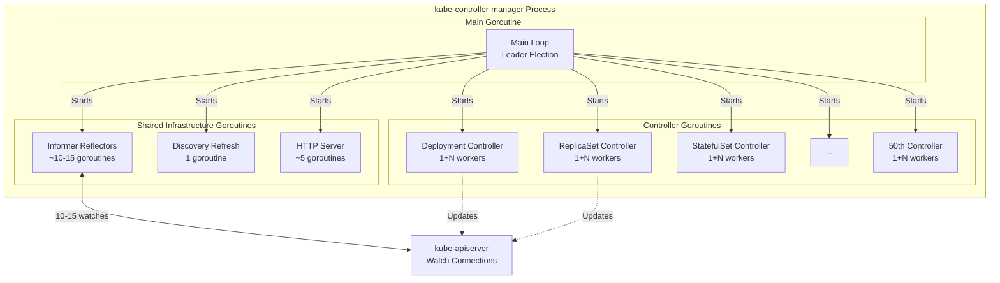
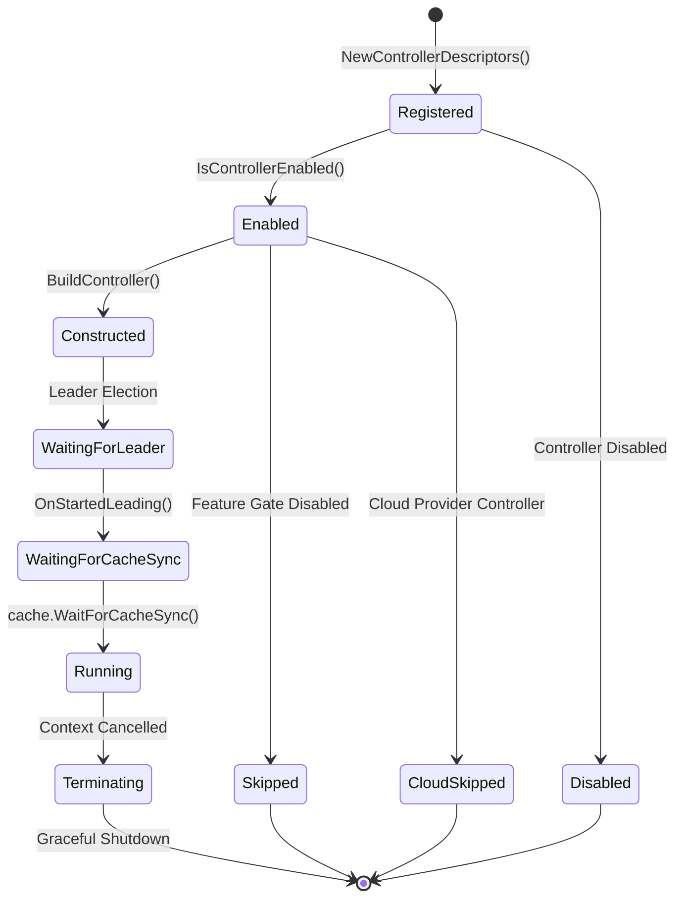
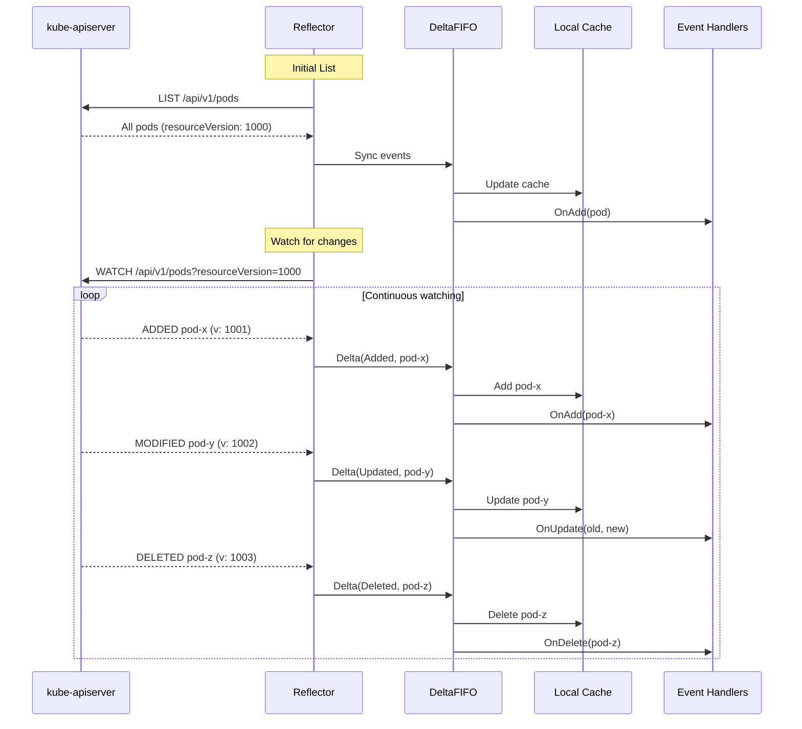
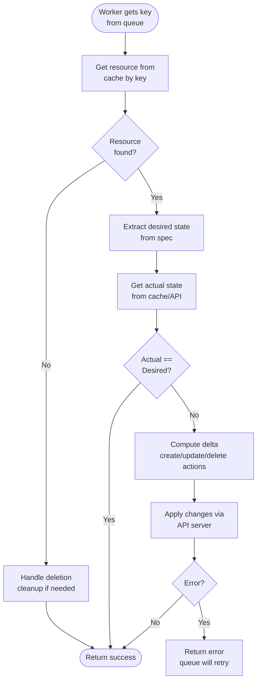
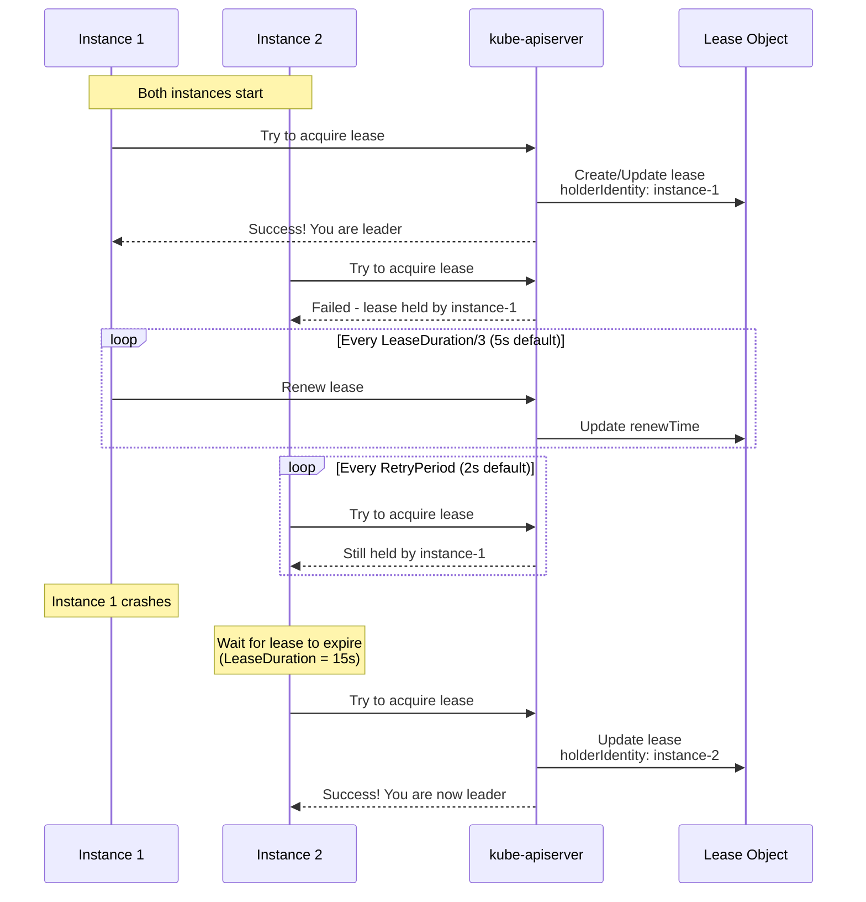
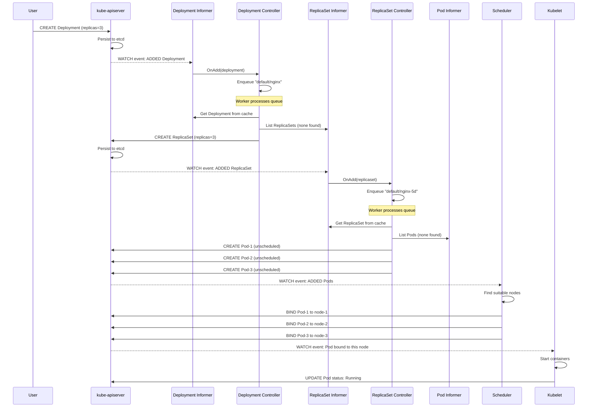

# Kube-Controller-Manager: Functional Overview

**Document Version**: 1.0
**Last Updated**: 2025-10-21
**Status**: Draft

---

## 1. Introduction

This document provides a detailed functional overview of the kube-controller-manager component, describing how it operates, the responsibilities of its various subsystems, and the mechanisms it uses to ensure cluster state reconciliation.

## 2. Component Architecture

### 2.1 Process Structure

The kube-controller-manager runs as a single OS process that embeds multiple controller goroutines. Unlike microservices that run as separate processes, all controllers share the same process space for:

- **Resource efficiency**: Shared memory for caches
- **Simplified deployment**: Single binary to deploy
- **Coordinated initialization**: Ordered startup sequence
- **Shared infrastructure**: Common informers, clients, and utilities



**Typical Goroutine Count**: 100-200+ goroutines depending on configuration

### 2.2 Controller Lifecycle States

Each controller progresses through distinct lifecycle states:



## 3. Functional Capabilities

### 3.1 Resource Watching & Caching

**Purpose**: Efficiently track cluster state without overwhelming the API server.

**Mechanism**:



**Key Components**:

1. **Reflector**: Performs LIST then WATCH on API server
2. **DeltaFIFO**: Queue of deltas (changes) to process
3. **Indexer**: Thread-safe in-memory cache with indexing
4. **EventHandlers**: Controller-specific callbacks

**Optimization - Shared Informers**:

```go
// Instead of each controller creating its own watch:
// BAD: N controllers = N watches for Pods
deploym entController.watchPods()
replicaSetController.watchPods()
daemonSetController.watchPods()

// GOOD: N controllers = 1 watch for Pods
sharedInformerFactory.Core().V1().Pods()  // Single watch
// Multiple controllers register handlers on the same informer
```

### 3.2 Work Queue Processing

**Purpose**: Decouple event handling from reconciliation logic, enabling rate limiting and retry logic.

**Architecture**:

```
┌─────────────────────────────────────────────────────────┐
│                    Work Queue Flow                      │
│                                                         │
│  Event Handler          Rate-Limiting Queue             │
│  ┌──────────┐         ┌─────────────────┐              │
│  │ OnAdd()  │────────>│                 │              │
│  │OnUpdate()│────────>│  Waiting Items  │              │
│  │OnDelete()│────────>│                 │              │
│  └──────────┘         │  (Deduplicated) │              │
│                       └────────┬────────┘              │
│                                │                        │
│                                │ Rate Limiting          │
│                                ▼                        │
│                       ┌─────────────────┐              │
│                       │  Ready Queue    │              │
│                       │                 │              │
│                       │ key1: ns1/pod1  │              │
│                       │ key2: ns1/dep1  │              │
│                       └────────┬────────┘              │
│                                │                        │
│                                │                        │
│          ┌────────────┬────────┴────────┬──────────┐   │
│          ▼            ▼                 ▼          ▼   │
│      Worker 1     Worker 2          Worker 3  Worker N │
│      ┌──────┐    ┌──────┐          ┌──────┐  ┌──────┐ │
│      │ Sync │    │ Sync │          │ Sync │  │ Sync │ │
│      │Handler    │Handler          │Handler  │Handler │
│      └───┬──┘    └───┬──┘          └───┬──┘  └───┬──┘ │
│          │           │                  │         │    │
│          └───────────┴──────────────────┴─────────┘    │
│                      │                                 │
│                      ▼                                 │
│              ┌───────────────┐                         │
│              │  Success or   │                         │
│              │     Error     │                         │
│              └───┬───────┬───┘                         │
│                  │       │                             │
│         Success  │       │  Error                      │
│                  │       └───> Requeue with backoff    │
│                  │                                     │
│                  └───> Done                            │
└─────────────────────────────────────────────────────────┘
```

**Rate Limiting Strategies**:

1. **Exponential Backoff**: 5ms, 10ms, 20ms, 40ms, ... up to max delay
2. **Per-Item Rate Limiting**: Independent backoff per resource
3. **Max Retries**: Drop after N failures (typically 15)
4. **Bucket Rate Limiter**: Limits overall throughput

**Deduplication**:

```go
// Multiple events for same resource deduplicated by key
queue.Add("default/my-deployment")  // Added
queue.Add("default/my-deployment")  // Deduplicated (already queued)
queue.Add("default/my-deployment")  // Deduplicated (already queued)
// Result: Only one reconciliation for "default/my-deployment"
```

### 3.3 Reconciliation Logic

**Core Pattern**: The reconciliation loop brings actual state in line with desired state.

**Standard Reconciliation Flow**:



**Example: Deployment Controller Reconciliation**:

```
Input: Deployment "nginx" with replicas=3

Step 1: Get Deployment from cache
  - Found: Deployment default/nginx
  - Desired replicas: 3

Step 2: List ReplicaSets owned by this Deployment
  - Found: ReplicaSet default/nginx-5d59b67c4f
  - Current replicas: 2 (actual pods running)

Step 3: Compare desired vs actual
  - Desired: 3
  - Actual: 2
  - Delta: +1 replica needed

Step 4: Update ReplicaSet
  - PATCH /apis/apps/v1/namespaces/default/replicasets/nginx-5d59b67c4f
  - Set spec.replicas: 3

Step 5: Return success
  - ReplicaSet controller will now create the missing pod
```

### 3.4 Ownership & Garbage Collection

**Purpose**: Automatically clean up dependent resources when owner is deleted.

**Owner Reference Mechanism**:

```yaml
apiVersion: v1
kind: Pod
metadata:
  name: nginx-5d59b67c4f-abc123
  ownerReferences:
  - apiVersion: apps/v1
    kind: ReplicaSet
    name: nginx-5d59b67c4f
    uid: 1234-5678-90ab-cdef
    controller: true          # This owner is the controller
    blockOwnerDeletion: true  # Cannot delete owner while this exists
```

**Garbage Collection Modes**:

1. **Foreground**: Delete owner → blocks until dependents deleted
2. **Background**: Delete owner immediately → GC deletes dependents asynchronously
3. **Orphan**: Delete owner → dependents remain (owner refs removed)

**Garbage Collector Graph**:

```
┌─────────────────────────────────────────┐
│        Dependency Graph Builder         │
│                                         │
│  Deployment                             │
│      └─> ReplicaSet-1                   │
│            └─> Pod-1                    │
│            └─> Pod-2                    │
│      └─> ReplicaSet-2 (old)             │
│            └─> Pod-3                    │
│                                         │
│  Event: Deployment deleted              │
│                                         │
│  Action: Mark ReplicaSet-1, ReplicaSet-2│
│          for deletion                   │
│                                         │
│  Event: ReplicaSet-1 deleted            │
│                                         │
│  Action: Mark Pod-1, Pod-2 for deletion │
└─────────────────────────────────────────┘
```

### 3.5 Leader Election

**Purpose**: Enable active-passive HA deployments where only one instance actively reconciles.

**Mechanism**: Lease-based with regular renewal



**Configuration Parameters**:

- **LeaseDuration**: 15s (how long lease is valid)
- **RenewDeadline**: 10s (deadline to renew before giving up leadership)
- **RetryPeriod**: 2s (how often non-leaders try to acquire)

### 3.6 Client Building & Authentication

**Purpose**: Create properly authenticated clients for each controller.

**Client Builder Modes**:

1. **SimpleControllerClientBuilder**:
   ```
   - Uses root kubeconfig credentials
   - All controllers use same service account
   - Simpler setup, less secure
   ```

2. **DynamicClientBuilder**:
   ```
   - Each controller uses its own ServiceAccount
   - Controller-specific RBAC
   - More secure, better audit trail
   - Automatically fetches tokens from API server
   ```

**Per-Controller ServiceAccount Example**:

```yaml
# ServiceAccount for deployment controller
apiVersion: v1
kind: ServiceAccount
metadata:
  name: deployment-controller
  namespace: kube-system

---
# ClusterRole with specific permissions
apiVersion: rbac.authorization.k8s.io/v1
kind: ClusterRole
metadata:
  name: system:controller:deployment-controller
rules:
- apiGroups: ["apps"]
  resources: ["deployments"]
  verbs: ["get", "list", "watch", "update"]
- apiGroups: ["apps"]
  resources: ["replicasets"]
  verbs: ["*"]
- apiGroups: [""]
  resources: ["pods"]
  verbs: ["get", "list", "watch"]

---
# Binding
apiVersion: rbac.authorization.k8s.io/v1
kind: ClusterRoleBinding
metadata:
  name: system:controller:deployment-controller
roleRef:
  apiGroup: rbac.authorization.k8s.io
  kind: ClusterRole
  name: system:controller:deployment-controller
subjects:
- kind: ServiceAccount
  name: deployment-controller
  namespace: kube-system
```

### 3.7 Event Recording

**Purpose**: Provide visibility into controller actions via Kubernetes Events.

**Event Broadcast Pattern**:

```
Controller Action                Event Recorded
─────────────────                ───────────────
Create ReplicaSet     ──────>    "SuccessfulCreate: Created ReplicaSet nginx-5d"
Scale up pods         ──────>    "ScalingReplicaSet: Scaled up to 3"
Failed to create      ──────>    "FailedCreate: Error creating: quota exceeded"
```

**Event Structure**:

```yaml
apiVersion: v1
kind: Event
metadata:
  name: nginx.17b2e8f5c9f8e123
  namespace: default
involvedObject:
  apiVersion: apps/v1
  kind: Deployment
  name: nginx
  namespace: default
reason: ScalingReplicaSet
message: "Scaled up replica set nginx-5d59b67c4f to 3"
source:
  component: deployment-controller
type: Normal
firstTimestamp: 2025-10-21T12:00:00Z
lastTimestamp: 2025-10-21T12:00:05Z
count: 1
```

### 3.8 Metrics & Observability

**Key Metrics Categories**:

1. **Controller Lifecycle**:
   ```
   - controller_started{controller="deployment"}
   - controller_stopped{controller="deployment"}
   ```

2. **Work Queue Metrics**:
   ```
   - workqueue_depth{name="deployment"}
   - workqueue_adds_total{name="deployment"}
   - workqueue_retries_total{name="deployment"}
   - workqueue_work_duration_seconds{name="deployment"}
   ```

3. **API Client Metrics**:
   ```
   - rest_client_requests_total{code="200",method="GET",endpoint="/pods"}
   - rest_client_request_duration_seconds{endpoint="/pods"}
   ```

4. **Controller-Specific**:
   ```
   - deployment_controller_syncs_total{result="success"}
   - replicaset_controller_sorting_time_seconds
   ```

## 4. Data Flow Example: Pod Creation

**Scenario**: User creates a Deployment with 3 replicas



## 5. Failure Handling

### 5.1 Transient Errors

**Strategy**: Exponential backoff retry

```
Attempt 1: Immediate
Attempt 2: 5ms delay
Attempt 3: 10ms delay
Attempt 4: 20ms delay
...
Attempt 15: 82s delay
After 15: Drop from queue (permanent failure)
```

### 5.2 API Server Unavailability

**Behavior**:
1. Watch connections break
2. Reflector automatically reconnects with exponential backoff
3. On reconnect, performs full resync via LIST
4. Controllers resume normal operation

**Impact**: Controllers cannot make changes during outage, but resume automatically

### 5.3 Controller Crash

**Behavior**:
1. Goroutine panic caught by `utilruntime.HandleCrash()`
2. Panic logged but doesn't crash entire process
3. Other controllers continue running
4. Crashed controller's work queue items remain unprocessed until restart

### 5.4 Resource Conflicts

**Scenario**: Two controllers try to update same resource

```
Controller A: PATCH /api/v1/pods/mypod (resourceVersion: 1000)
Controller B: PATCH /api/v1/pods/mypod (resourceVersion: 1000)

API Server Response to B: 409 Conflict

Controller B: Retries
  1. Fetch latest version from API (resourceVersion: 1001)
  2. Recompute desired changes
  3. PATCH with new resourceVersion
```

## 6. Performance Optimizations

### 6.1 Informer Caching

**Without Informers** (bad):
```
Every reconciliation: GET /api/v1/pods/mypod  (API call)
100 reconciliations/sec = 100 API calls/sec
```

**With Informers** (good):
```
Every reconciliation: cache.Get("default/mypod")  (memory lookup)
100 reconciliations/sec = 0 additional API calls
```

### 6.2 Work Queue Deduplication

**Without Deduplication** (bad):
```
10 UPDATE events for same Deployment
= 10 reconciliations
```

**With Deduplication** (good):
```
10 UPDATE events for same Deployment
= 1 reconciliation (latest state)
```

### 6.3 Parallel Workers

**Single Worker**:
```
Process 1000 items sequentially
= 1000 * 10ms = 10 seconds
```

**10 Workers**:
```
Process 1000 items in parallel
= 1000 * 10ms / 10 workers ≈ 1 second
```

## 7. Configuration

### 7.1 Global Configuration

```yaml
apiVersion: kubecontrollermanager.config.k8s.io/v1alpha1
kind: KubeControllerManagerConfiguration
generic:
  leaderElection:
    leaderElect: true
    leaseDuration: 15s
    renewDeadline: 10s
    retryPeriod: 2s
  controllers: ["*"]  # Enable all controllers
  minResyncPeriod: 12h0m0s
  controllerStartInterval: 0s
```

### 7.2 Per-Controller Configuration

```yaml
deploymentController:
  concurrentDeploymentSyncs: 5

replicaSetController:
  concurrentRSSyncs: 5

daemonSetController:
  concurrentDaemonSetSyncs: 2
```

### 7.3 CLI Flags

```bash
kube-controller-manager \
  --kubeconfig=/etc/kubernetes/controller-manager.conf \
  --leader-elect=true \
  --controllers=*,-nodeipam \  # All except nodeipam
  --concurrent-deployment-syncs=5 \
  --concurrent-replicaset-syncs=5 \
  --node-monitor-period=5s \
  --use-service-account-credentials=true
```

## 8. Security Considerations

### 8.1 Least Privilege

Each controller should have only the RBAC permissions it needs:

```
Deployment Controller needs:
  ✓ deployments: get, list, watch, update
  ✓ replicasets: create, get, list, watch, update, delete
  ✓ pods: get, list, watch
  ✗ secrets: (no access)
  ✗ nodes: (no access)
```

### 8.2 Secrets in Memory

Controllers that handle sensitive data:

- **ServiceAccountToken Controller**: Generates tokens
- **Certificate Controllers**: Handle private keys

**Best Practices**:
- Never log secrets
- Clear sensitive data from memory when done
- Use secure channels for token distribution

## 9. Debugging & Troubleshooting

### 9.1 Common Issues

**Controller Not Reconciling**:
```bash
# Check if controller is enabled
kubectl logs -n kube-system kube-controller-manager-xxx | grep "deployment-controller"

# Check work queue depth
curl http://localhost:10257/metrics | grep 'workqueue_depth{name="deployment"}'

# Check for errors
kubectl logs -n kube-system kube-controller-manager-xxx | grep -i error
```

**High Memory Usage**:
```bash
# Check informer cache size
# Large clusters = large caches
# 150k pods ≈ 2-4 GB memory
```

**High CPU Usage**:
```bash
# Check reconciliation rate
curl http://localhost:10257/metrics | grep workqueue_work_duration

# Enable profiling
curl http://localhost:10257/debug/pprof/profile?seconds=30 > cpu.prof
```

---

## 10. Related Documentation

- **Executive Summary**: See `02-executive-summary.md` for high-level overview
- **Controller Catalog**: See `04-controller-catalog.md` for controller details
- **Shared Infrastructure**: See `07-shared-infrastructure.md` for informer/queue details
- **Concurrency**: See `18-concurrency-synchronization.md` for threading details

---

## Revision History

| Version | Date | Author | Changes |
|---------|------|--------|---------|
| 1.0 | 2025-10-21 | Architecture Analysis | Initial functional overview |
