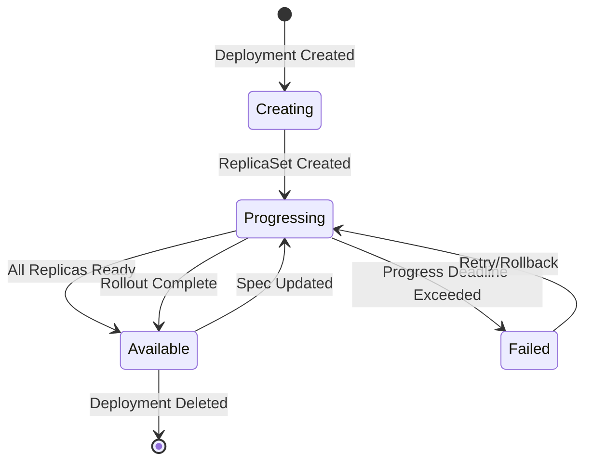
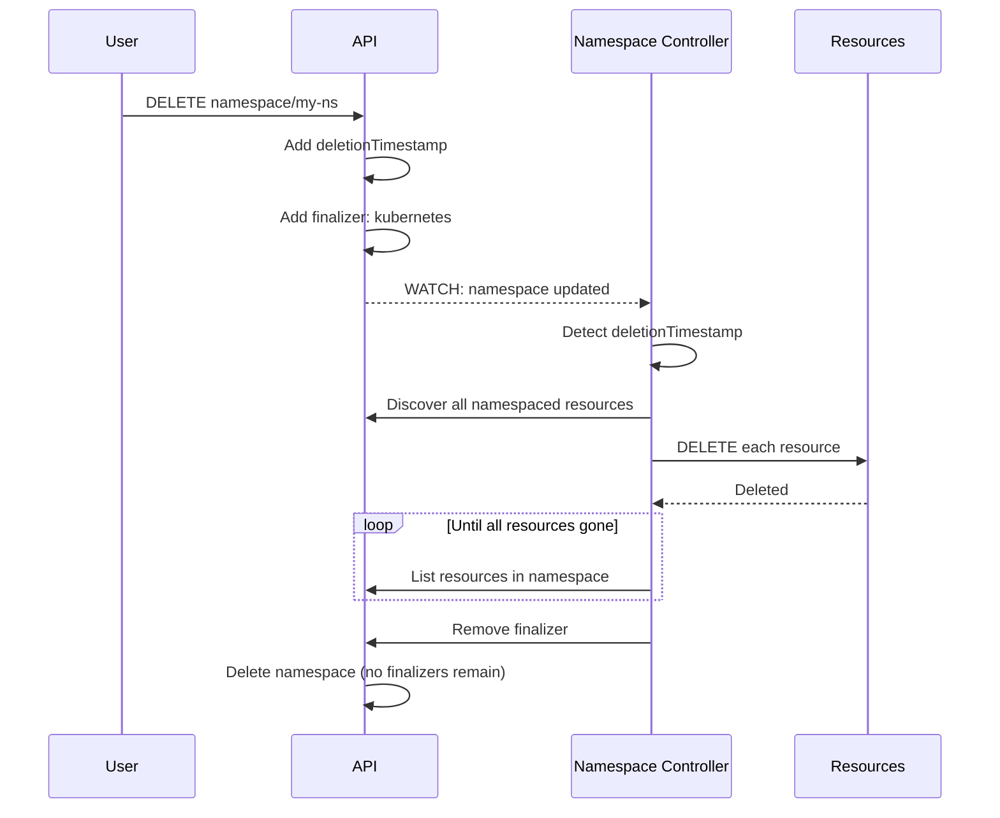

# Kube-Controller-Manager: Controller Catalog

**Document Version**: 1.0
**Last Updated**: 2025-10-21
**Status**: Draft

---

## 1. Overview

This document provides a comprehensive catalog of all 50 controllers in kube-controller-manager, organized by functional domain. Each entry includes purpose, watched resources, reconciliation triggers, and key behaviors.

## 2. Controller Summary Table

| # | Controller Name | Domain | Feature Gated | Cloud Provider |
|---|----------------|--------|---------------|----------------|
| 1 | ServiceAccountToken | Security | No | No |
| 2 | Deployment | Workload | No | No |
| 3 | ReplicaSet | Workload | No | No |
| 4 | StatefulSet | Workload | No | No |
| 5 | DaemonSet | Workload | No | No |
| 6 | Job | Workload | No | No |
| 7 | CronJob | Workload | No | No |
| 8 | ReplicationController | Workload | No | No |
| 9 | NodeLifecycle | Node | No | No |
| 10 | NodeIPAM | Node | No | No |
| 11 | TaintEviction | Node | Yes | No |
| 12 | DeviceTaintEviction | Node | Yes | No |
| 13 | Endpoints | Endpoint | No | No |
| 14 | EndpointSlice | Endpoint | No | No |
| 15 | EndpointSliceMirroring | Endpoint | No | No |
| 16 | PersistentVolumeBinder | Storage | No | No |
| 17 | AttachDetach | Storage | No | No |
| 18 | PersistentVolumeExpander | Storage | No | No |
| 19 | EphemeralVolume | Storage | No | No |
| 20 | PVCProtection | Storage | No | No |
| 21 | PVProtection | Storage | No | No |
| 22 | VolumeAttributesClassProtection | Storage | Yes | No |
| 23 | ResourceClaim | Storage | Yes | No |
| 24 | SELinuxWarning | Storage | Yes (disabled) | No |
| 25 | Namespace | Lifecycle | No | No |
| 26 | GarbageCollector | Lifecycle | No | No |
| 27 | PodGarbageCollector | Lifecycle | No | No |
| 28 | TTL | Lifecycle | No | No |
| 29 | TTLAfterFinished | Lifecycle | No | No |
| 30 | StorageVersionGC | Lifecycle | Yes | No |
| 31 | ServiceAccount | Security | No | No |
| 32 | CSRSigning | Security | No | No |
| 33 | CSRApproving | Security | No | No |
| 34 | CSRCleaner | Security | No | No |
| 35 | PodCertificateRequestCleaner | Security | Yes | No |
| 36 | BootstrapSigner | Security | No | No |
| 37 | TokenCleaner | Security | No | No |
| 38 | RootCACertificatePublisher | Security | No | No |
| 39 | ClusterTrustBundlePublisher | Security | Yes | No |
| 40 | LegacySATokenCleaner | Security | No | No |
| 41 | ResourceQuota | Policy | No | No |
| 42 | Disruption | Policy | No | No |
| 43 | ClusterRoleAggregation | Policy | No | No |
| 44 | ValidatingAdmissionPolicyStatus | Policy | No | No |
| 45 | HorizontalPodAutoscaler | Autoscaling | No | No |
| 46 | ServiceCIDR | Network | Yes | No |
| 47 | StorageVersionMigrator | Network | Yes | No |
| 48 | ServiceLoadBalancer | Cloud | No | Yes (disabled) |
| 49 | NodeRoute | Cloud | No | Yes (disabled) |
| 50 | CloudNodeLifecycle | Cloud | No | Yes (disabled) |

---

## 3. Workload Controllers (7)

### 3.1 Deployment Controller

**Canonical Name**: `deployment-controller`
**Aliases**: `deployment`
**Source**: `pkg/controller/deployment/`

**Purpose**: Manages declarative updates to applications using ReplicaSets as the underlying mechanism.

**Watched Resources**:
- Deployments (apps/v1)
- ReplicaSets (apps/v1)
- Pods (v1) - for scaling decisions

**Reconciliation Triggers**:
- Deployment created/updated/deleted
- ReplicaSet created/updated/deleted (owned by Deployment)
- Pod deleted (to detect unexpected terminations)

**Key Behaviors**:
- **Rolling Update**: Gradually replaces old ReplicaSet with new one
- **Recreate**: Deletes all old pods before creating new ones
- **Rollback**: Maintains revision history, can rollback to previous ReplicaSet
- **Pause/Resume**: Supports pausing rollouts
- **Proportional Scaling**: Scales up new and down old ReplicaSets proportionally
- **Progress Deadline**: Fails deployment if progress stalls

**Configuration**:
```yaml
deploymentController:
  concurrentDeploymentSyncs: 5  # Parallel workers
```

**State Machine**:


**Source Files**:
- Registration: `cmd/kube-controller-manager/app/apps.go:120`
- Implementation: `pkg/controller/deployment/deployment_controller.go:64`

---

### 3.2 ReplicaSet Controller

**Canonical Name**: `replicaset-controller`
**Aliases**: `replicaset`
**Source**: `pkg/controller/replicaset/`

**Purpose**: Ensures a specified number of pod replicas are running at any time.

**Watched Resources**:
- ReplicaSets (apps/v1)
- Pods (v1)

**Reconciliation Triggers**:
- ReplicaSet created/updated/deleted
- Pod created/updated/deleted (matching ReplicaSet selector)

**Key Behaviors**:
- **Scale Up**: Creates pods when actual < desired
- **Scale Down**: Deletes excess pods when actual > desired
- **Pod Adoption**: Claims orphaned pods matching selector
- **Pod Release**: Removes ownerReference from pods no longer matching
- **Burst Replicas**: Can create/delete up to 500 pods at once

**Scaling Algorithm**:
```
1. Calculate diff = desired - actual
2. If diff > 0: Create min(diff, burstReplicas) pods
3. If diff < 0: Delete min(abs(diff), burstReplicas) pods
4. Pod deletion priority:
   - Not-ready before ready
   - Unscheduled before scheduled
   - Pending before running
   - Higher pod deletion cost annotation last
```

**Configuration**:
```yaml
replicaSetController:
  concurrentRSSyncs: 5
```

---

### 3.3 StatefulSet Controller

**Canonical Name**: `statefulset-controller`
**Aliases**: `statefulset`
**Source**: `pkg/controller/statefulset/`

**Purpose**: Manages stateful applications with stable network identities and persistent storage.

**Watched Resources**:
- StatefulSets (apps/v1)
- Pods (v1)
- PersistentVolumeClaims (v1)
- ControllerRevisions (apps/v1) - for update history

**Reconciliation Triggers**:
- StatefulSet created/updated/deleted
- Pod created/updated/deleted (owned by StatefulSet)
- PVC created/updated/deleted (owned by StatefulSet)

**Key Behaviors**:
- **Ordered Creation**: Creates pods sequentially (pod-0, pod-1, pod-2...)
- **Ordered Deletion**: Deletes pods in reverse order
- **Stable Identity**: Each pod gets stable hostname (pod-name-0, pod-name-1...)
- **Stable Storage**: PVCs persist across pod rescheduling
- **Update Strategies**:
  - **RollingUpdate**: Updates pods in reverse ordinal order
  - **OnDelete**: Waits for manual deletion before updating
- **Partition**: Can partially update (update pods >= partition)

**Pod Naming**:
```
StatefulSet: web
Pods: web-0, web-1, web-2
Headless Service: web
DNS: web-0.web.default.svc.cluster.local
```

**Configuration**:
```yaml
statefulSetController:
  concurrentStatefulSetSyncs: 5
```

---

### 3.4 DaemonSet Controller

**Canonical Name**: `daemonset-controller`
**Aliases**: `daemonset`
**Source**: `pkg/controller/daemon/`

**Purpose**: Ensures all (or some) nodes run a copy of a specific pod.

**Watched Resources**:
- DaemonSets (apps/v1)
- ControllerRevisions (apps/v1)
- Pods (v1)
- Nodes (v1)

**Reconciliation Triggers**:
- DaemonSet created/updated/deleted
- Node created/updated/deleted
- Pod created/updated/deleted (owned by DaemonSet)

**Key Behaviors**:
- **Node Selector**: Runs pods only on matching nodes
- **Taints & Tolerations**: Respects node taints
- **Update Strategies**:
  - **RollingUpdate**: Updates pods gradually with maxUnavailable
  - **OnDelete**: Waits for manual pod deletion
- **Surge**: Can create new pod before deleting old one (maxSurge)

**Scheduling**:
- DaemonSet pods bypass scheduler
- Controller directly sets `spec.nodeName`
- Honors node affinity, taints, and resource requests

**Configuration**:
```yaml
daemonSetController:
  concurrentDaemonSetSyncs: 2
```

---

### 3.5 Job Controller

**Canonical Name**: `job-controller`
**Aliases**: `job`
**Source**: `pkg/controller/job/`

**Purpose**: Runs pods to completion, ensuring specified number of successful completions.

**Watched Resources**:
- Jobs (batch/v1)
- Pods (v1)

**Reconciliation Triggers**:
- Job created/updated/deleted
- Pod created/updated/deleted (owned by Job)

**Key Behaviors**:
- **Completions**: Ensures N pods complete successfully
- **Parallelism**: Runs up to N pods in parallel
- **Backoff Limit**: Limits retries on pod failures
- **Active Deadline**: Terminates job if running too long
- **TTL After Finished**: Can auto-delete completed jobs
- **Completion Modes**:
  - **NonIndexed**: All pods are equivalent
  - **Indexed**: Each pod gets unique index (0 to completions-1)

**Failure Handling**:
```
1. Pod fails
2. If failures < backoffLimit: Create replacement pod
3. If failures >= backoffLimit: Mark Job as Failed
4. Exponential backoff between retries (10s, 20s, 40s...)
```

**Configuration**:
```yaml
jobController:
  concurrentJobSyncs: 5
```

---

### 3.6 CronJob Controller

**Canonical Name**: `cronjob-controller`
**Aliases**: `cronjob`
**Source**: `pkg/controller/cronjob/`

**Purpose**: Schedules Jobs based on cron expressions.

**Watched Resources**:
- CronJobs (batch/v1)
- Jobs (batch/v1)

**Reconciliation Triggers**:
- CronJob created/updated/deleted
- Job created/updated/deleted (owned by CronJob)
- Periodic sync (every 10 seconds)

**Key Behaviors**:
- **Cron Schedule**: Parses standard cron syntax
- **Time Zone Support**: Supports IANA time zones
- **Concurrency Policy**:
  - **Allow**: Allows concurrent jobs
  - **Forbid**: Skips if previous job still running
  - **Replace**: Cancels previous job, starts new one
- **History Limits**: Keeps N successful and N failed jobs
- **Starting Deadline**: Skips missed schedules if too late

**Cron Syntax**:
```
┌───────────── minute (0 - 59)
│ ┌───────────── hour (0 - 23)
│ │ ┌───────────── day of month (1 - 31)
│ │ │ ┌───────────── month (1 - 12)
│ │ │ │ ┌───────────── day of week (0 - 6) (Sunday to Saturday)
│ │ │ │ │
* * * * *

Examples:
"0 0 * * *"        # Daily at midnight
"*/15 * * * *"     # Every 15 minutes
"0 9-17 * * 1-5"   # 9am-5pm weekdays
```

**Configuration**:
```yaml
cronJobController:
  concurrentCronJobSyncs: 5
```

---

### 3.7 ReplicationController

**Canonical Name**: `replicationcontroller-controller`
**Aliases**: `replicationcontroller`
**Source**: `pkg/controller/replication/`

**Purpose**: Legacy controller maintaining specified number of pod replicas (predecessor to ReplicaSet).

**Status**: Legacy - Use ReplicaSet/Deployment instead

**Watched Resources**:
- ReplicationControllers (v1)
- Pods (v1)

**Key Behaviors**:
- Similar to ReplicaSet but v1 API
- No support for set-based selectors (only equality-based)
- Maintained for backward compatibility

---

## 4. Node Controllers (4)

### 4.1 NodeLifecycle Controller

**Canonical Name**: `node-lifecycle-controller`
**Aliases**: `nodelifecycle`
**Source**: `pkg/controller/nodelifecycle/`

**Purpose**: Monitors node health and evicts pods from unhealthy nodes.

**Watched Resources**:
- Nodes (v1)
- Pods (v1)
- Leases (coordination.k8s.io/v1)
- DaemonSets (apps/v1)

**Reconciliation Triggers**:
- Node status updates (heartbeats)
- Lease updates
- Periodic sync (every 5 seconds default)

**Key Behaviors**:

**Node Conditions**:
```
Ready:
  - True: Node is healthy and accepting pods
  - False: Node is unhealthy
  - Unknown: No heartbeat received

MemoryPressure: Node running out of memory
DiskPressure: Node running out of disk space
PIDPressure: Too many processes running
NetworkUnavailable: Network not configured
```

**Taint Management**:
```yaml
# Automatically added taints:
- key: node.kubernetes.io/not-ready
  effect: NoExecute

- key: node.kubernetes.io/unreachable
  effect: NoExecute

- key: node.kubernetes.io/memory-pressure
  effect: NoSchedule

- key: node.kubernetes.io/disk-pressure
  effect: NoSchedule
```

**Eviction Rate Limiting**:
```
Large cluster (>50 nodes):
  - Normal: 0.1 pods/sec per zone
  - Disruption: 0.01 pods/sec per zone

Small cluster:
  - Normal: 0.1 pods/sec total
  - Disruption: 0 (no evictions)
```

**Configuration**:
```yaml
nodeLifecycleController:
  nodeStartupGracePeriod: 60s      # New nodes get grace period
  nodeMonitorGracePeriod: 40s      # Time before marking NotReady
  nodeEvictionRate: 0.1            # Pods/sec eviction rate
  secondaryNodeEvictionRate: 0.01  # Rate during disruption
  largeClusterSizeThreshold: 50    # Nodes for "large cluster"
  unhealthyZoneThreshold: 0.55     # % unhealthy to trigger disruption mode
```

---

### 4.2 NodeIPAM Controller

**Canonical Name**: `node-ipam-controller`
**Aliases**: `nodeipam`
**Source**: `pkg/controller/nodeipam/`

**Purpose**: Allocates pod CIDR ranges to nodes for pod IP addressing.

**Watched Resources**:
- Nodes (v1)

**Reconciliation Triggers**:
- Node created/updated
- Node deleted (to reclaim CIDR)

**Key Behaviors**:

**CIDR Allocation Types**:
1. **RangeAllocator**: Default, allocates from cluster CIDR range
2. **CloudAllocator**: Deprecated (cloud provider integration removed)
3. **IPAMFromCluster**: Uses ServiceIPRange for allocation
4. **IPAMFromCloud**: Deprecated

**Dual-Stack Support**:
```yaml
# Example node with dual-stack CIDRs allocated
spec:
  podCIDRs:
  - "10.244.1.0/24"      # IPv4
  - "fd00:10:244:1::/64" # IPv6
```

**Configuration**:
```yaml
nodeIPAMController:
  serviceCIDR: "10.96.0.0/12"
  secondaryServiceCIDR: "fd00:1234::/112"
  nodeCIDRMaskSize: 24           # For single-stack IPv4
  nodeCIDRMaskSizeIPv4: 24       # For dual-stack
  nodeCIDRMaskSizeIPv6: 64       # For dual-stack
```

**Allocation Algorithm**:
```
1. Node created without podCIDR
2. Controller allocates next available CIDR from range
3. Updates node.spec.podCIDRs
4. Kubelet configures CNI with allocated CIDR
5. CNI assigns IPs to pods from this range
```

---

### 4.3 TaintEviction Controller

**Canonical Name**: `taint-eviction-controller`
**Source**: `pkg/controller/tainteviction/`
**Feature Gate**: `SeparateTaintEvictionController`

**Purpose**: Evicts pods from tainted nodes based on toleration policies (extracted from NodeLifecycle controller).

**Watched Resources**:
- Nodes (v1)
- Pods (v1)

**Key Behaviors**:
- Watches node taints with `NoExecute` effect
- Evicts pods without matching tolerations
- Respects toleration `tolerationSeconds` for delayed eviction

**Toleration Example**:
```yaml
tolerations:
- key: "node.kubernetes.io/not-ready"
  operator: "Exists"
  effect: "NoExecute"
  tolerationSeconds: 300  # Tolerate for 5 minutes
```

---

### 4.4 DeviceTaintEviction Controller

**Canonical Name**: `device-taint-eviction-controller`
**Source**: `pkg/controller/devicetainteviction/`
**Feature Gates**: `DynamicResourceAllocation`, `DRADeviceTaints`

**Purpose**: Evicts pods using dynamic resources when devices become unhealthy or unavailable.

**Watched Resources**:
- Pods (v1)
- ResourceClaims (resource.k8s.io/v1)
- ResourceSlices (resource.k8s.io/v1)
- DeviceTaintRules (resource.k8s.io/v1alpha3)
- DeviceClasses (resource.k8s.io/v1)

**Key Behaviors**:
- Monitors device health via ResourceSlices
- Applies device-specific taint rules
- Evicts pods when claimed devices fail

---

## 5. Endpoint Controllers (3)

### 5.1 Endpoints Controller

**Canonical Name**: `endpoints-controller`
**Aliases**: `endpoint`
**Source**: `pkg/controller/endpoint/`

**Purpose**: Populates Endpoints objects with pod IPs for Services.

**Watched Resources**:
- Services (v1)
- Pods (v1)
- Endpoints (v1)

**Reconciliation Triggers**:
- Service created/updated/deleted
- Pod created/updated/deleted (matching service selector)
- Endpoint created/updated

**Key Behaviors**:
- Selects pods matching service selector
- Filters to ready pods (unless `publishNotReadyAddresses: true`)
- Creates/updates Endpoints with pod IPs and ports
- Batches updates to reduce API calls

**Endpoints Structure**:
```yaml
apiVersion: v1
kind: Endpoints
metadata:
  name: my-service
  namespace: default
subsets:
- addresses:
  - ip: 10.244.1.5
    nodeName: node-1
    targetRef:
      kind: Pod
      name: my-app-abc123
  - ip: 10.244.2.6
    nodeName: node-2
    targetRef:
      kind: Pod
      name: my-app-def456
  ports:
  - port: 8080
    protocol: TCP
```

**Configuration**:
```yaml
endpointController:
  concurrentEndpointSyncs: 5
  endpointUpdatesBatchPeriod: 0s  # Batch period
```

---

### 5.2 EndpointSlice Controller

**Canonical Name**: `endpointslice-controller`
**Aliases**: `endpointslice`
**Source**: `pkg/controller/endpointslice/`

**Purpose**: Creates EndpointSlices for Services, providing more scalable service discovery than Endpoints.

**Watched Resources**:
- Services (v1)
- Pods (v1)
- Nodes (v1)
- EndpointSlices (discovery.k8s.io/v1)

**Key Improvements over Endpoints**:
- **Scalability**: Max 100 endpoints per slice (vs 1000+ in single Endpoints)
- **Update Efficiency**: Only affected slices updated
- **Topology**: Includes zone/region information

**EndpointSlice Structure**:
```yaml
apiVersion: discovery.k8s.io/v1
kind: EndpointSlice
metadata:
  name: my-service-abc123
  labels:
    kubernetes.io/service-name: my-service
addressType: IPv4
endpoints:
- addresses:
  - "10.244.1.5"
  conditions:
    ready: true
  topology:
    kubernetes.io/hostname: node-1
    topology.kubernetes.io/zone: us-west-1a
ports:
- port: 8080
  protocol: TCP
```

**Configuration**:
```yaml
endpointSliceController:
  concurrentEndpointSliceSyncs: 5
  maxEndpointsPerSlice: 100
```

---

### 5.3 EndpointSliceMirroring Controller

**Canonical Name**: `endpointslice-mirroring-controller`
**Aliases**: `endpointslicemirroring`
**Source**: `pkg/controller/endpointslicemirroring/`

**Purpose**: Mirrors Endpoints to EndpointSlices for backward compatibility.

**Watched Resources**:
- Endpoints (v1)
- EndpointSlices (discovery.k8s.io/v1)

**Key Behaviors**:
- Creates EndpointSlices from Endpoints
- Maintains label: `endpointslice.kubernetes.io/managed-by: endpointslicemirroring-controller`
- Allows gradual migration to EndpointSlice

**Configuration**:
```yaml
endpointSliceMirroringController:
  mirroringConcurrentServiceEndpointSyncs: 5
  mirroringMaxEndpointsPerSubset: 1000
```

---

## 6. Storage Controllers (9)

### 6.1 PersistentVolumeBinder Controller

**Canonical Name**: `persistentvolume-binder-controller`
**Aliases**: `persistentvolume-binder`
**Source**: `pkg/controller/volume/persistentvolume/`

**Purpose**: Binds PersistentVolumeClaims to PersistentVolumes and handles dynamic provisioning.

**Watched Resources**:
- PersistentVolumeClaims (v1)
- PersistentVolumes (v1)
- StorageClasses (storage.k8s.io/v1)
- Pods (v1) - for volume-pod affinity
- Nodes (v1) - for node affinity

**Reconciliation Triggers**:
- PVC created/updated/deleted
- PV created/updated/deleted
- StorageClass created/updated/deleted

**Key Behaviors**:

**Static Provisioning**:
```
1. PVC created with specific volume name
2. Controller finds matching PV
3. Checks capacity, access modes, storage class
4. Binds PVC to PV (sets bidirectional references)
```

**Dynamic Provisioning**:
```
1. PVC created with storageClassName
2. No suitable PV exists
3. Controller calls storage provisioner
4. Provisioner creates PV
5. Controller binds PVC to new PV
```

**Binding Criteria**:
- Capacity (PV >= PVC request)
- Access modes match
- Storage class matches
- Selector matches (if specified)
- Node affinity satisfied

**Configuration**:
```yaml
persistentVolumeBinderController:
  pvClaimBinderSyncPeriod: 15s
  volumeConfiguration:
    enableDynamicProvisioning: true
```

---

### 6.2 AttachDetach Controller

**Canonical Name**: `persistentvolume-attach-detach-controller`
**Aliases**: `attachdetach`
**Source**: `pkg/controller/volume/attachdetach/`

**Purpose**: Attaches volumes to nodes where pods are scheduled.

**Watched Resources**:
- Pods (v1)
- Nodes (v1)
- PersistentVolumeClaims (v1)
- PersistentVolumes (v1)
- VolumeAttachments (storage.k8s.io/v1)
- CSINodes (storage.k8s.io/v1)
- CSIDrivers (storage.k8s.io/v1)

**Key Behaviors**:

**Attach Flow**:
```
1. Pod scheduled to node
2. Controller detects pod needs volume
3. Creates VolumeAttachment object
4. CSI driver attaches volume to node
5. Kubelet mounts volume into pod
```

**Detach Flow**:
```
1. Pod deleted or rescheduled
2. Controller waits for grace period
3. Deletes VolumeAttachment
4. CSI driver detaches volume from node
```

**Configuration**:
```yaml
attachDetachController:
  disableAttachDetachReconcilerSync: false
  reconcilerSyncLoopPeriod: 60s
  disableForceDetachOnTimeout: false
```

---

### 6.3 PersistentVolumeExpander Controller

**Canonical Name**: `persistentvolume-expander-controller`
**Aliases**: `persistentvolume-expander`
**Source**: `pkg/controller/volume/expand/`

**Purpose**: Expands PersistentVolumeClaims when requested storage increases.

**Watched Resources**:
- PersistentVolumeClaims (v1)

**Key Behaviors**:
- Detects PVC size increase
- Calls CSI driver to expand volume
- Updates PVC status with new size
- Requires `allowVolumeExpansion: true` in StorageClass

**Expansion Flow**:
```
1. User increases PVC size: 10Gi → 20Gi
2. Controller validates expansion allowed
3. Calls volume plugin Expand()
4. Plugin expands underlying storage
5. Controller updates PVC status
6. Kubelet expands filesystem (if needed)
```

---

### 6.4 EphemeralVolume Controller

**Canonical Name**: `ephemeral-volume-controller`
**Aliases**: `ephemeral-volume`
**Source**: `pkg/controller/volume/ephemeral/`

**Purpose**: Creates PVCs for ephemeral volumes defined inline in pod specs.

**Watched Resources**:
- Pods (v1)
- PersistentVolumeClaims (v1)

**Key Behaviors**:
- Creates PVC when pod with ephemeral volume created
- Sets pod as owner of PVC
- PVC auto-deleted when pod deleted

**Example**:
```yaml
apiVersion: v1
kind: Pod
spec:
  volumes:
  - name: scratch
    ephemeral:
      volumeClaimTemplate:
        spec:
          accessModes: ["ReadWriteOnce"]
          resources:
            requests:
              storage: 1Gi
```

**Configuration**:
```yaml
ephemeralVolumeController:
  concurrentEphemeralVolumeSyncs: 5
```

---

### 6.5-6.7 Protection Controllers

**PVC Protection**, **PV Protection**, **VAC Protection** prevent deletion of in-use resources:

- **PVCProtection**: Prevents PVC deletion while pods using it exist
- **PVProtection**: Prevents PV deletion while bound to PVC
- **VACProtection**: Prevents VolumeAttributesClass deletion while PVCs reference it

All add finalizers that block deletion until safe.

---

### 6.8 ResourceClaim Controller

**Canonical Name**: `resourceclaim-controller`
**Source**: `pkg/controller/resourceclaim/`
**Feature Gate**: `DynamicResourceAllocation`

**Purpose**: Manages ResourceClaims for Dynamic Resource Allocation (DRA).

**Watched Resources**:
- ResourceClaims (resource.k8s.io/v1)
- ResourceClaimTemplates (resource.k8s.io/v1)
- Pods (v1)

**Key Behaviors**:
- Creates ResourceClaims from templates
- Manages claim allocation lifecycle
- Handles device binding and scheduling

---

### 6.9 SELinuxWarning Controller

**Canonical Name**: `selinux-warning-controller`
**Source**: `pkg/controller/volume/selinuxwarning/`
**Feature Gate**: `SELinuxChangePolicy`
**Default**: Disabled

**Purpose**: Warns about SELinux policy conflicts with volumes.

---

## 7. Resource Lifecycle Controllers (6)

### 7.1 Namespace Controller

**Canonical Name**: `namespace-controller`
**Aliases**: `namespace`
**Source**: `pkg/controller/namespace/`

**Purpose**: Finalizes namespaces and ensures all resources deleted before namespace removal.

**Watched Resources**:
- Namespaces (v1)

**Key Behaviors**:

**Deletion Flow**:


**Configuration**:
```yaml
namespaceController:
  namespaceSyncPeriod: 5m
  concurrentNamespaceSyncs: 10
```

---

### 7.2 GarbageCollector Controller

**Canonical Name**: `garbage-collector-controller`
**Aliases**: `garbagecollector`
**Source**: `pkg/controller/garbagecollector/`

**Purpose**: Deletes objects whose owners have been deleted, based on owner references.

**Watched Resources**:
- **All resource types** (via metadata-only informers)

**Key Behaviors**:

**Dependency Graph**:
```
Deployment (uid: 1234)
  └─ ownerReferences[0].uid = 1234
     ReplicaSet (uid: 5678)
       └─ ownerReferences[0].uid = 5678
          Pod (uid: 9abc)
          Pod (uid: def0)
```

**Deletion Modes**:

1. **Foreground Deletion**:
   ```
   1. Owner marked for deletion
   2. Dependents deletion started
   3. Owner deleted after dependents gone
   ```

2. **Background Deletion**:
   ```
   1. Owner deleted immediately
   2. GC asynchronously deletes dependents
   ```

3. **Orphan**:
   ```
   1. Owner deleted
   2. OwnerReferences removed from dependents
   3. Dependents remain
   ```

**Configuration**:
```yaml
garbageCollectorController:
  enableGarbageCollector: true
  concurrentGCSyncs: 20
  gcIgnoredResources:
  - group: ""
    resource: "events"
```

---

### 7.3 PodGarbageCollector Controller

**Canonical Name**: `pod-garbage-collector-controller`
**Aliases**: `podgc`
**Source**: `pkg/controller/podgc/`

**Purpose**: Deletes terminated pods after threshold.

**Watched Resources**:
- Pods (v1)
- Nodes (v1)

**Key Behaviors**:
- Deletes pods in `Succeeded` or `Failed` phase
- Keeps N most recent terminated pods per node
- Deletes orphaned pods (node deleted)
- Deletes pods on non-existent nodes

**Configuration**:
```yaml
podGCController:
  terminatedPodGCThreshold: 12500  # Max terminated pods
```

---

### 7.4 TTL Controller

**Canonical Name**: `ttl-controller`
**Aliases**: `ttl`
**Source**: `pkg/controller/ttl/`

**Purpose**: Deletes nodes that have been down for too long.

**Watched Resources**:
- Nodes (v1)

**Configuration**: Runs with 5 workers.

---

### 7.5 TTLAfterFinished Controller

**Canonical Name**: `ttl-after-finished-controller`
**Aliases**: `ttl-after-finished`
**Source**: `pkg/controller/ttlafterfinished/`

**Purpose**: Deletes finished Jobs after TTL expires.

**Watched Resources**:
- Jobs (batch/v1)

**Key Behaviors**:
- Waits for job completion (Success or Failure)
- Starts TTL countdown
- Deletes job after `spec.ttlSecondsAfterFinished`

**Example**:
```yaml
apiVersion: batch/v1
kind: Job
spec:
  ttlSecondsAfterFinished: 100  # Delete 100s after completion
```

**Configuration**:
```yaml
ttlAfterFinishedController:
  concurrentTTLSyncs: 5
```

---

### 7.6 StorageVersionGC Controller

**Canonical Name**: `storageversion-garbage-collector-controller`
**Aliases**: `storage-version-gc`
**Feature Gates**: `APIServerIdentity`, `StorageVersionAPI`

**Purpose**: Cleans up old StorageVersion objects.

---

## 8. Security Controllers (10)

### 8.1 ServiceAccount Controller

**Canonical Name**: `serviceaccount-controller`
**Aliases**: `serviceaccount`
**Source**: `pkg/controller/serviceaccount/`

**Purpose**: Creates default ServiceAccount in each namespace.

**Watched Resources**:
- Namespaces (v1)
- ServiceAccounts (v1)

**Key Behaviors**:
- Creates `default` ServiceAccount in new namespaces
- Can create additional ServiceAccounts per configuration

---

### 8.2 ServiceAccountToken Controller

**Canonical Name**: `serviceaccount-token-controller`
**Source**: `pkg/controller/serviceaccount/`
**Special**: **Must start first** (requires special handling)

**Purpose**: Generates ServiceAccount tokens for pods.

**Watched Resources**:
- ServiceAccounts (v1)
- Secrets (v1)
- Pods (v1)

**Key Behaviors**:
- Mints JWT tokens for ServiceAccounts
- Projects tokens into pod volumes
- Rotates tokens on expiry

---

### 8.3 CSR Controllers (4)

**CSRSigning**, **CSRApproving**, **CSRCleaner**, **PodCertificateRequestCleaner**

**CSRSigning** (`certificatesigningrequest-signing-controller`):
- Signs approved CertificateSigningRequests
- Supports multiple signers:
  - `kubernetes.io/kube-apiserver-client`
  - `kubernetes.io/kube-apiserver-client-kubelet`
  - `kubernetes.io/kubelet-serving`
  - `kubernetes.io/legacy-unknown`

**CSRApproving** (`certificatesigningrequest-approving-controller`):
- Auto-approves certain CSRs (kubelet bootstrap)

**CSRCleaner** (`certificatesigningrequest-cleaner-controller`):
- Deletes old approved/denied CSRs

**PodCertificateRequestCleaner**:
- Cleans up PodCertificateRequests (feature-gated)

---

### 8.4 Bootstrap Controllers (2)

**BootstrapSigner** (`bootstrap-signer-controller`):
- Signs bootstrap tokens for node join

**TokenCleaner** (`token-cleaner-controller`):
- Deletes expired bootstrap tokens

---

### 8.5 Certificate Publishers (2)

**RootCACertificatePublisher** (`root-ca-certificate-publisher-controller`):
- Publishes root CA to `kube-root-ca.crt` ConfigMap in each namespace

**ClusterTrustBundlePublisher** (`kube-apiserver-serving-clustertrustbundle-publisher-controller`):
- Publishes ClusterTrustBundle for kube-apiserver serving certs
- Feature-gated: `ClusterTrustBundle`

---

### 8.6 LegacySATokenCleaner Controller

**Canonical Name**: `legacy-serviceaccount-token-cleaner-controller`

**Purpose**: Cleans up legacy auto-generated ServiceAccount tokens.

**Configuration**:
```yaml
legacySATokenCleaner:
  cleanUpPeriod: 24h
```

---

## 9. Policy Controllers (4)

### 9.1 ResourceQuota Controller

**Canonical Name**: `resourcequota-controller`
**Aliases**: `resourcequota`
**Source**: `pkg/controller/resourcequota/`

**Purpose**: Enforces resource usage limits in namespaces.

**Watched Resources**:
- ResourceQuotas (v1)
- All resource types (for quota tracking)

**Key Behaviors**:
- Tracks resource usage in namespace
- Rejects creates/updates exceeding quota
- Supports hard and soft limits

**Quota Types**:
```yaml
hard:
  requests.cpu: "10"
  requests.memory: "20Gi"
  limits.cpu: "20"
  limits.memory: "40Gi"
  pods: "100"
  services: "50"
  persistentvolumeclaims: "20"
```

**Configuration**:
```yaml
resourceQuotaController:
  concurrentResourceQuotaSyncs: 5
  resourceQuotaSyncPeriod: 5m
```

---

### 9.2 Disruption Controller

**Canonical Name**: `disruption-controller`
**Aliases**: `poddisruptionbudget`
**Source**: `pkg/controller/disruption/`

**Purpose**: Honors PodDisruptionBudgets during voluntary disruptions.

**Watched Resources**:
- PodDisruptionBudgets (policy/v1)
- Pods (v1)

**Key Behaviors**:
- Calculates allowed disruptions
- Updates PDB status with available pods
- Voluntary evictions check PDB before proceeding

**PDB Example**:
```yaml
apiVersion: policy/v1
kind: PodDisruptionBudget
spec:
  minAvailable: 2        # Keep at least 2 pods
  # OR
  maxUnavailable: 1      # Allow max 1 pod down
  selector:
    matchLabels:
      app: my-app
```

---

### 9.3 ClusterRoleAggregation Controller

**Canonical Name**: `clusterrole-aggregation-controller`
**Source**: `pkg/controller/clusterroleaggregation/`

**Purpose**: Aggregates ClusterRoles based on label selectors.

**Watched Resources**:
- ClusterRoles (rbac.authorization.k8s.io/v1)

**Key Behaviors**:
- Watches ClusterRoles with `aggregationRule`
- Combines rules from matching ClusterRoles
- Updates aggregate ClusterRole

**Example**:
```yaml
apiVersion: rbac.authorization.k8s.io/v1
kind: ClusterRole
metadata:
  name: admin
aggregationRule:
  clusterRoleSelectors:
  - matchLabels:
      rbac.authorization.k8s.io/aggregate-to-admin: "true"
rules: []  # Auto-populated
```

---

### 9.4 ValidatingAdmissionPolicyStatus Controller

**Canonical Name**: `validatingadmissionpolicy-status-controller`

**Purpose**: Updates status of ValidatingAdmissionPolicy objects.

---

## 10. Autoscaling Controllers (1)

### 10.1 HorizontalPodAutoscaler Controller

**Canonical Name**: `horizontal-pod-autoscaler-controller`
**Aliases**: `horizontalpodautoscaler`, `hpa`
**Source**: `pkg/controller/podautoscaler/`

**Purpose**: Automatically scales workloads based on metrics.

**Watched Resources**:
- HorizontalPodAutoscalers (autoscaling/v2)
- Target workloads (Deployment, ReplicaSet, StatefulSet, etc.)

**Key Behaviors**:
- Fetches metrics from metrics-server
- Calculates desired replicas
- Scales target workload

**Scaling Algorithm**:
```
desiredReplicas = ceil(currentReplicas * (currentMetric / targetMetric))

Example:
  currentReplicas: 3
  currentCPU: 80%
  targetCPU: 50%

  desiredReplicas = ceil(3 * (80 / 50)) = ceil(4.8) = 5
```

**Supported Metrics**:
- Resource metrics (CPU, memory)
- Custom metrics (application-specific)
- External metrics (from external systems)

**Configuration**:
```yaml
hpaController:
  concurrentHorizontalPodAutoscalerSyncs: 5
  horizontalPodAutoscalerSyncPeriod: 15s
  horizontalPodAutoscalerCPUInitializationPeriod: 5m
  horizontalPodAutoscalerInitialReadinessDelay: 30s
```

---

## 11. Network Controllers (2)

### 11.1 ServiceCIDR Controller

**Canonical Name**: `service-cidr-controller`
**Feature Gated**

**Purpose**: Manages ServiceCIDR allocations.

---

### 11.2 StorageVersionMigrator Controller

**Canonical Name**: `storage-version-migrator-controller`
**Feature Gated**

**Purpose**: Migrates resources to new storage versions.

---

## 12. Cloud Provider Controllers (3)

**Status**: All **disabled** since v1.31 (KEP-2395)

These controllers no longer function in kube-controller-manager and must run in cloud-controller-manager:

1. **ServiceLoadBalancer** (`service-lb-controller`)
2. **NodeRoute** (`node-route-controller`)
3. **CloudNodeLifecycle** (`cloud-node-lifecycle-controller`)

---

## Related Documentation

- **Executive Summary**: `02-executive-summary.md`
- **Domain-Specific Docs**: `08-workload-controllers.md` through `15-cloud-provider-integration.md`
- **Detailed Specs**: `17-detailed-controller-specs/` (individual controller files)

---

## Revision History

| Version | Date | Author | Changes |
|---------|------|--------|---------|
| 1.0 | 2025-10-21 | Architecture Analysis | Initial controller catalog |
