# Kube-Controller-Manager: High-Level Architecture

**Document Version**: 1.0
**Last Updated**: 2025-10-21
**Status**: Draft

---

## 1. System Context

### 1.1 Kubernetes Control Plane Context

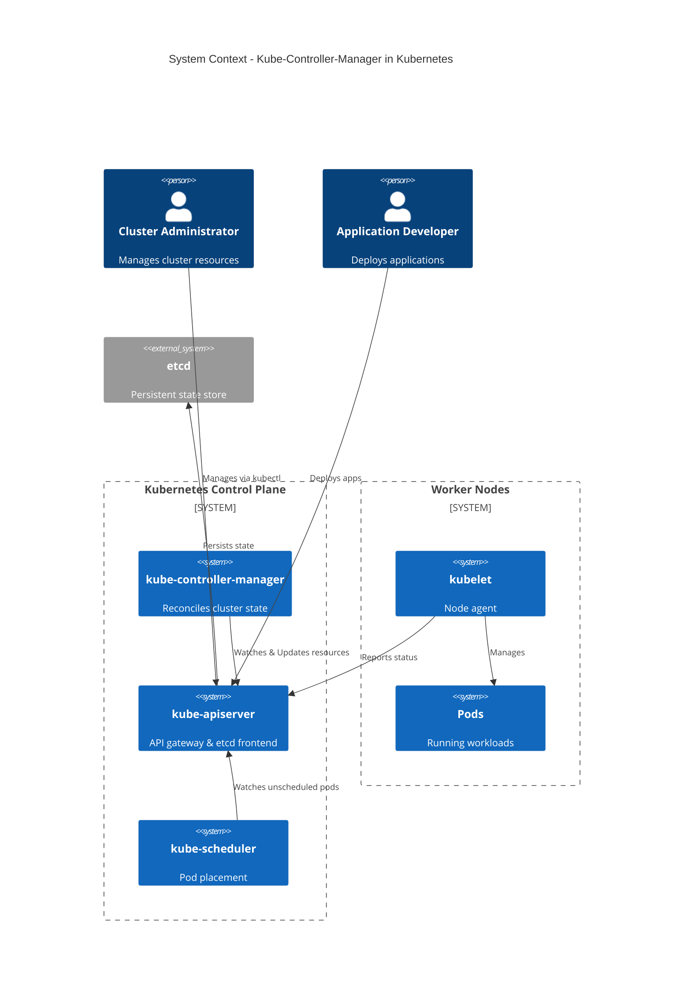

### 1.2 External Dependencies

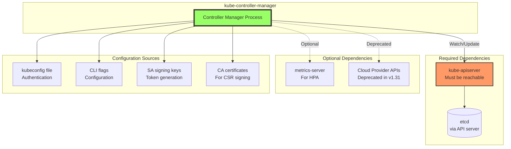

---

## 2. High-Level Component Architecture

### 2.1 Layered Architecture

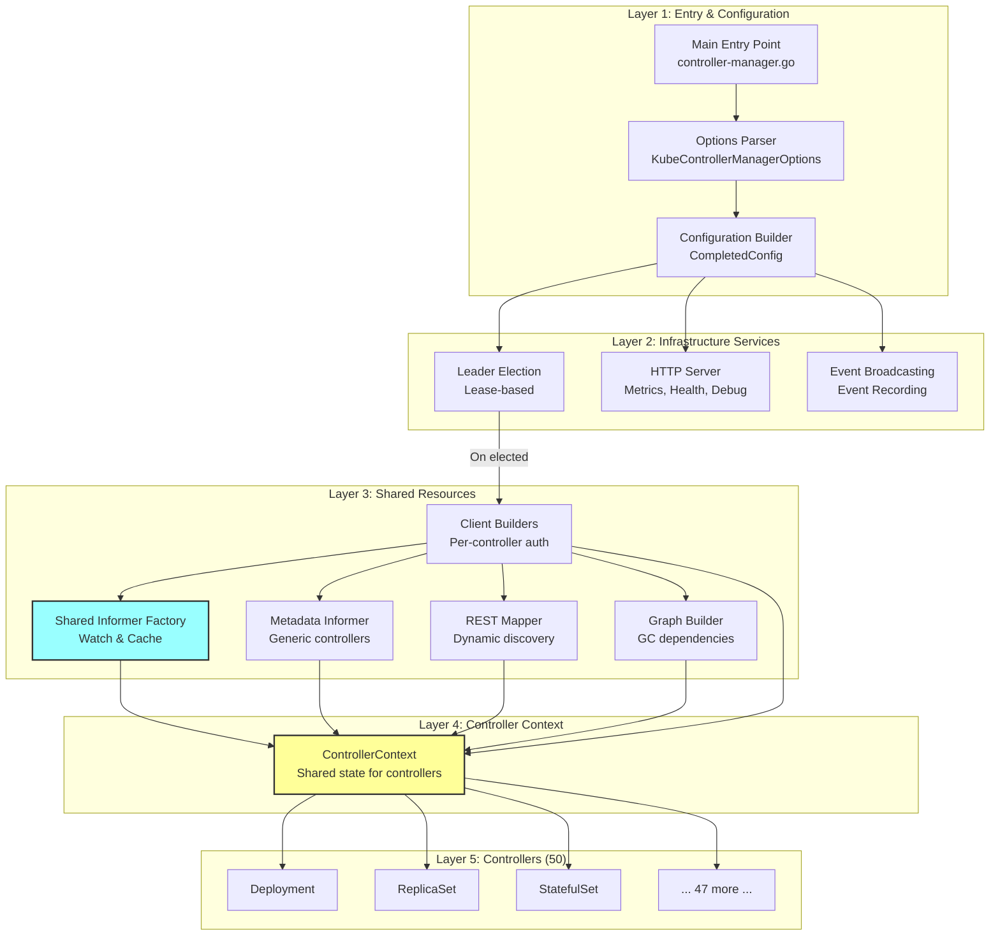

### 2.2 Process Architecture

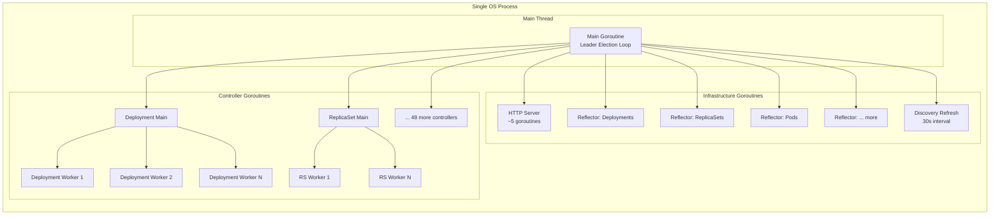

**Typical Goroutine Count**: 150-250 depending on configuration and number of resource types watched.

---

## 3. Major Components

### 3.1 Controller Context (Shared State)

The ControllerContext is the central data structure passed to all controllers:

```mermaid
classDiagram
    class ControllerContext {
        +ClientBuilder clientbuilder.ControllerClientBuilder
        +InformerFactory informers.SharedInformerFactory
        +ObjectOrMetadataInformerFactory informerfactory.InformerFactory
        +ComponentConfig KubeControllerManagerConfiguration
        +RESTMapper *restmapper.DeferredDiscoveryRESTMapper
        +InformersStarted chan struct{}
        +ResyncPeriod func() time.Duration
        +ControllerManagerMetrics *ControllerManagerMetrics
        +GraphBuilder *garbagecollector.GraphBuilder
        +IsControllerEnabled(descriptor) bool
        +NewClient(name) clientset.Interface
        +NewClientConfig(name) *rest.Config
    }

    class SharedInformerFactory {
        +Core() CoreInformers
        +Apps() AppsInformers
        +Batch() BatchInformers
        +Storage() StorageInformers
        +Start(stopCh)
        +WaitForCacheSync()
    }

    class ClientBuilder {
        +Client(name) clientset.Interface
        +Config(name) *rest.Config
        +DiscoveryClient(name) discovery.Interface
    }

    class RESTMapper {
        +RESTMapping(gk) *RESTMapping
        +Reset()
    }

    class GraphBuilder {
        +monitors map[schema.GroupVersionResource]*monitor
        +dependencyGraphBuilder
    }

    ControllerContext --> SharedInformerFactory
    ControllerContext --> ClientBuilder
    ControllerContext --> RESTMapper
    ControllerContext --> GraphBuilder
```

**Source**: `cmd/kube-controller-manager/app/controllermanager.go:406`

---

### 3.2 Controller Descriptor System

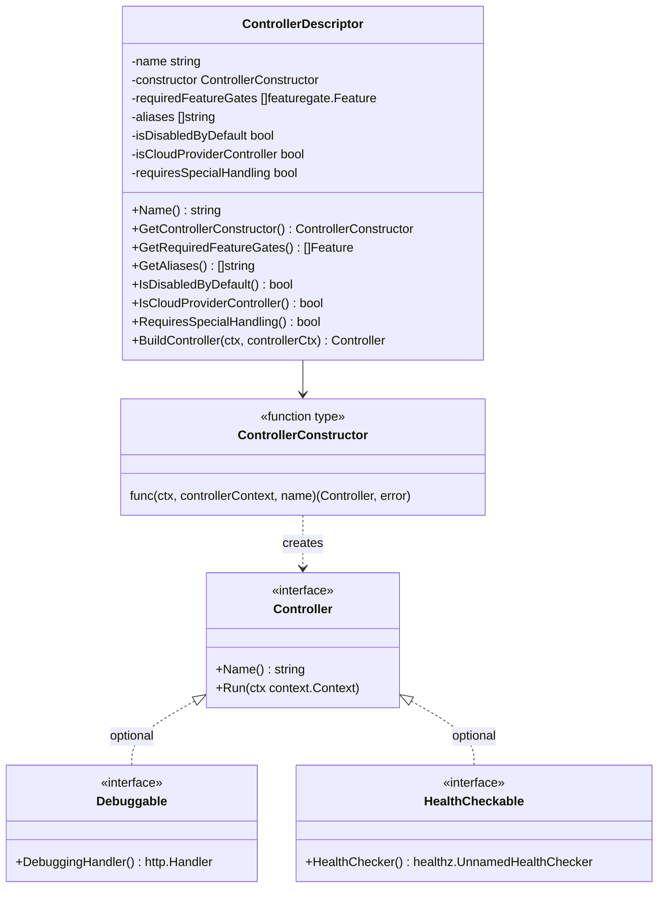

**Source**: `cmd/kube-controller-manager/app/controller_descriptor.go:50`

---

### 3.3 Shared Informer Architecture

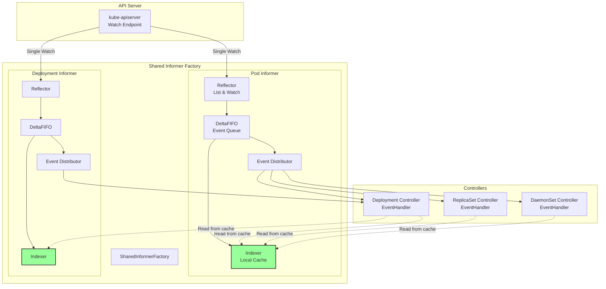

**Key Benefits**:
- **Single watch per resource type** (not per controller)
- **Shared cache** reduces memory
- **Consistent view** across controllers
- **Reduced API server load**

---

### 3.4 Work Queue Pattern

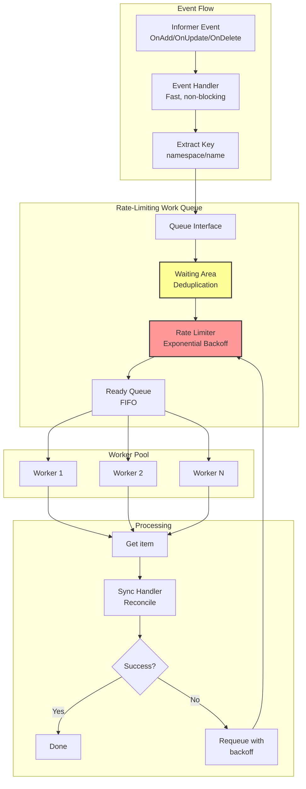

---

## 4. Data Flow Patterns

### 4.1 Watch-Based Event Flow

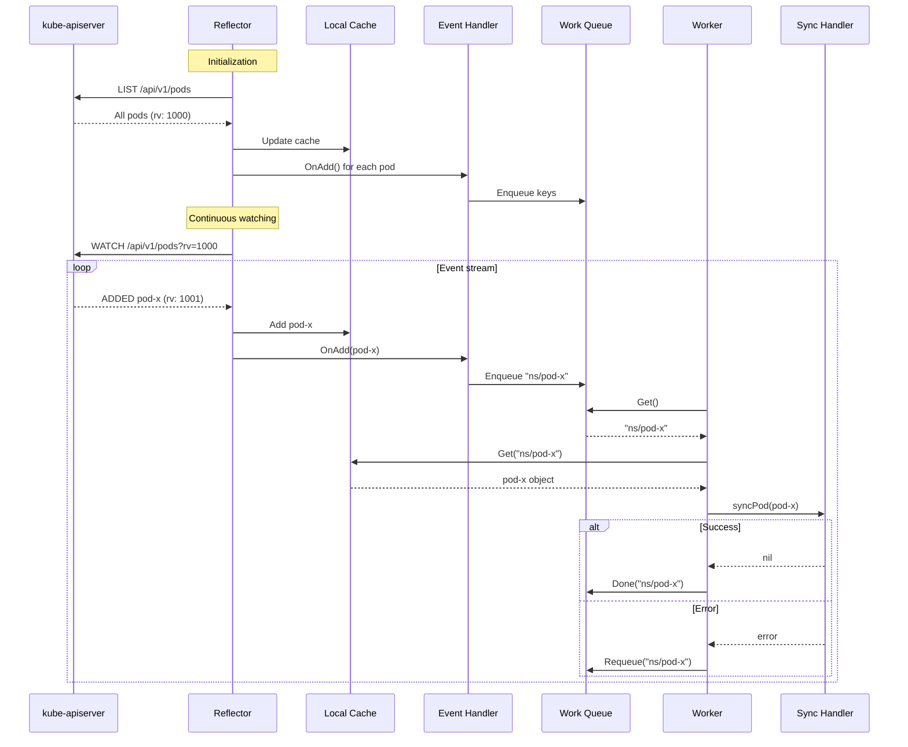

### 4.2 Controller Coordination Example

**Scenario**: User creates Deployment

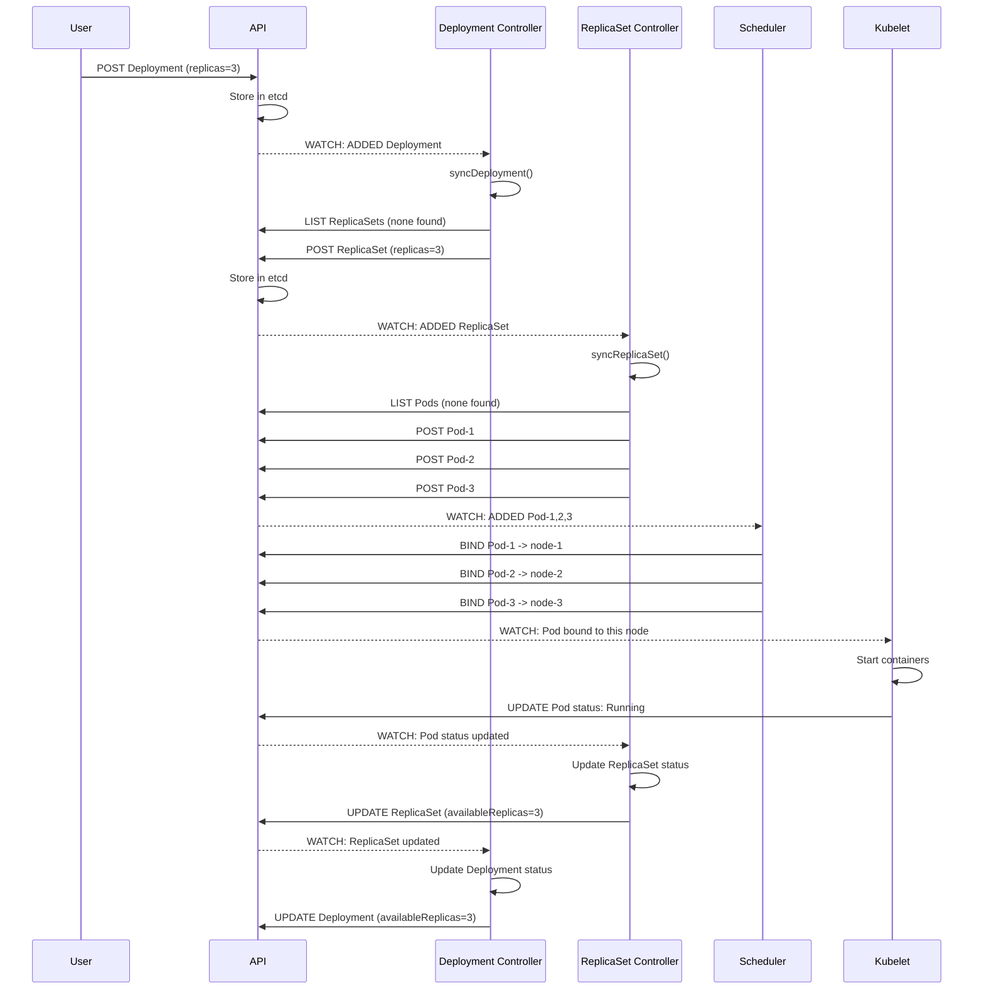

---

## 5. Leader Election Architecture

### 5.1 Leader Election Flow

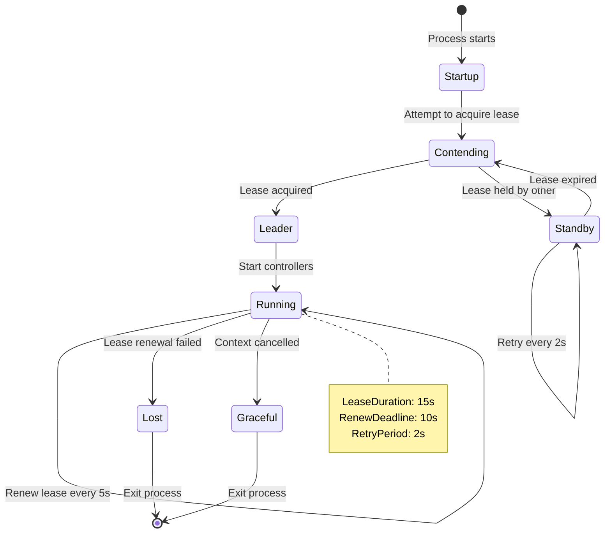

### 5.2 Multi-Instance Deployment

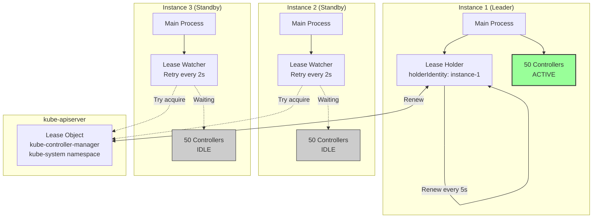

---

## 6. HTTP Server & Observability

### 6.1 HTTP Endpoints

```mermaid
graph LR
    subgraph "HTTP Server :10257"
        HANDLER[Handler Chain]

        subgraph "Endpoints"
            HEALTH[/healthz<br/>Health Check]
            LIVE[/livez<br/>Liveness]
            READY[/readyz<br/>Readiness]
            METRICS[/metrics<br/>Prometheus]
            CONFIGZ[/configz<br/>Configuration]
            DEBUG[/debug/controllers/<br/>Per-controller debug]
            PROF[/debug/pprof/*<br/>Profiling]
            FLAGZ[/flagz<br/>Flags]
        end
    end

    subgraph "Middleware"
        AUTH[Authentication]
        AUTHZ[Authorization]
        LOG[HTTP Logging]
        PANIC[Panic Recovery]
    end

    CLIENT[Monitoring Client] --> AUTH
    AUTH --> AUTHZ
    AUTHZ --> LOG
    LOG --> PANIC
    PANIC --> HANDLER
    HANDLER --> HEALTH
    HANDLER --> METRICS
    HANDLER --> CONFIGZ
    HANDLER --> DEBUG
    HANDLER --> PROF
    HANDLER --> FLAGZ
```

**Source**: `staging/src/k8s.io/controller-manager/app/serve.go:57`

### 6.2 Metrics Architecture

```mermaid
graph TB
    subgraph "Controllers"
        C1[Deployment Controller]
        C2[ReplicaSet Controller]
        CN[... more ...]
    end

    subgraph "Metrics Collection"
        WQ_METRICS[WorkQueue Metrics<br/>depth, duration, retries]
        CTRL_METRICS[Controller Metrics<br/>started, stopped]
        CLIENT_METRICS[REST Client Metrics<br/>requests, latency]
        CUSTOM[Controller-specific<br/>Custom metrics]
    end

    subgraph "Prometheus Registry"
        REGISTRY[Legacy Registry<br/>Global metrics]
    end

    subgraph "Exposition"
        HTTP_METRICS[/metrics endpoint<br/>Prometheus format]
    end

    C1 --> WQ_METRICS
    C1 --> CTRL_METRICS
    C1 --> CLIENT_METRICS
    C1 --> CUSTOM

    C2 --> WQ_METRICS
    C2 --> CTRL_METRICS
    C2 --> CLIENT_METRICS

    CN --> WQ_METRICS

    WQ_METRICS --> REGISTRY
    CTRL_METRICS --> REGISTRY
    CLIENT_METRICS --> REGISTRY
    CUSTOM --> REGISTRY

    REGISTRY --> HTTP_METRICS

    PROMETHEUS[Prometheus Server] -.->|Scrape| HTTP_METRICS
```

---

## 7. Security Architecture

### 7.1 Authentication & Authorization

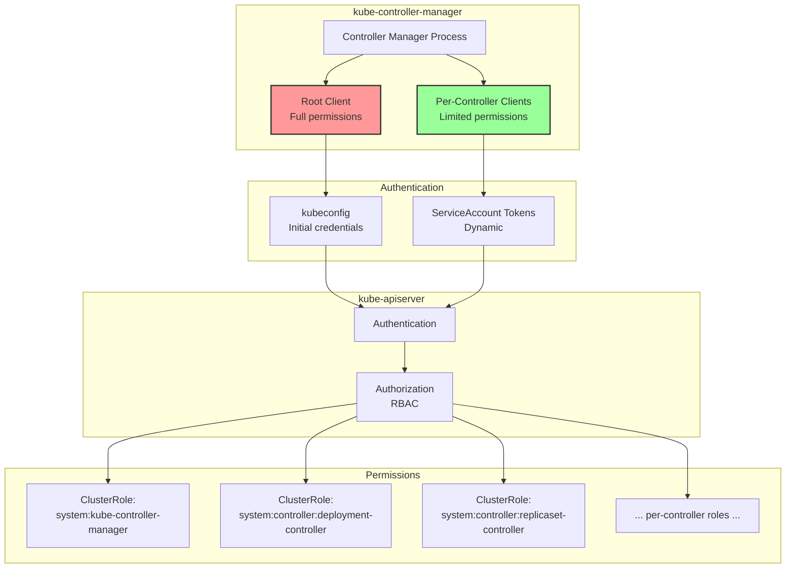

**Best Practice**: Use `--use-service-account-credentials=true` for per-controller authentication.

### 7.2 TLS & Secure Serving

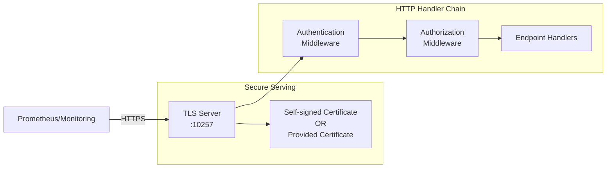

---

## 8. Configuration Management

### 8.1 Configuration Sources

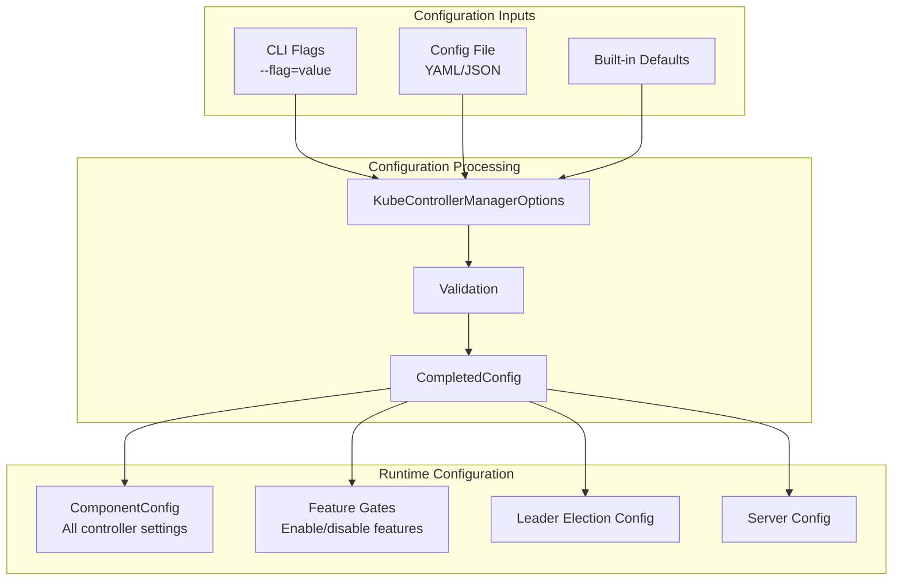

### 8.2 Configuration Hierarchy

```
KubeControllerManagerConfiguration
├── Generic (applies to all controllers)
│   ├── LeaderElection
│   ├── ClientConnection
│   ├── Controllers (enable/disable list)
│   ├── MinResyncPeriod
│   └── ControllerStartInterval
├── KubeCloudShared
│   ├── CloudProvider (deprecated)
│   ├── AllocateNodeCIDRs
│   └── ClusterCIDR
├── Per-Controller Configuration
│   ├── DeploymentController
│   │   └── ConcurrentDeploymentSyncs: 5
│   ├── ReplicaSetController
│   │   └── ConcurrentRSSyncs: 5
│   ├── StatefulSetController
│   │   └── ConcurrentStatefulSetSyncs: 5
│   └── ... (30+ more controllers)
└── ServiceController (cloud LB)
```

---

## 9. Failure Domains & Resilience

### 9.1 Failure Isolation

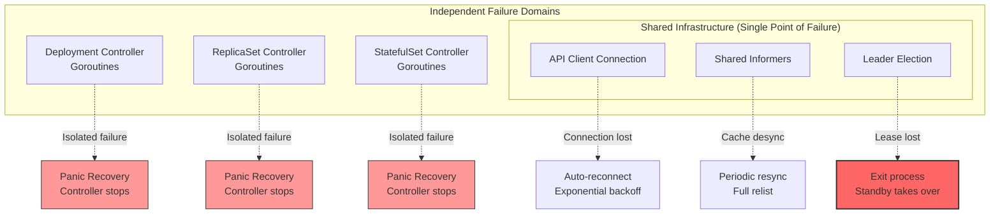

### 9.2 Recovery Patterns

| Failure Type | Detection | Recovery | Impact |
|--------------|-----------|----------|--------|
| Controller panic | utilruntime.HandleCrash() | Log error, stop controller | Single controller affected |
| API connection lost | Watch error | Auto-reconnect + resync | All controllers pause temporarily |
| Informer cache desync | Periodic resync | Full relist | Temporary stale data |
| Leader election lost | Lease renewal failure | Exit process, standby takes over | 15-30s reconciliation gap |
| Work queue overflow | Backpressure | Rate limiting + retry | Slower reconciliation |

---

## 10. Performance Characteristics

### 10.1 Resource Consumption

```
Small Cluster (10 nodes, 100 pods):
  Memory: ~200-500 MB
  CPU: 10-50 millicores idle, 100-500m active
  Goroutines: ~100-150

Medium Cluster (100 nodes, 1000 pods):
  Memory: ~500 MB - 1 GB
  CPU: 50-200 millicores idle, 500-1000m active
  Goroutines: ~150-200

Large Cluster (1000 nodes, 10000 pods):
  Memory: ~2-4 GB
  CPU: 200-500 millicores idle, 1-2 cores active
  Goroutines: ~200-300
```

### 10.2 Scalability Limits

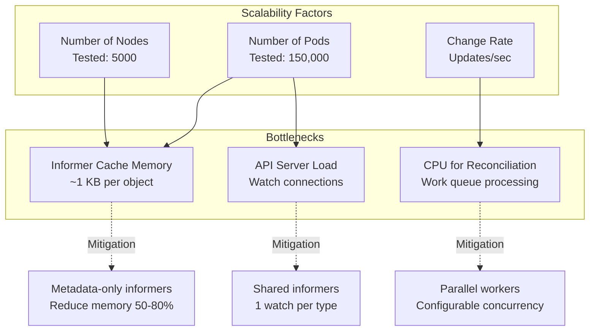

---

## 11. Evolution & Extensibility

### 11.1 Adding New Controllers

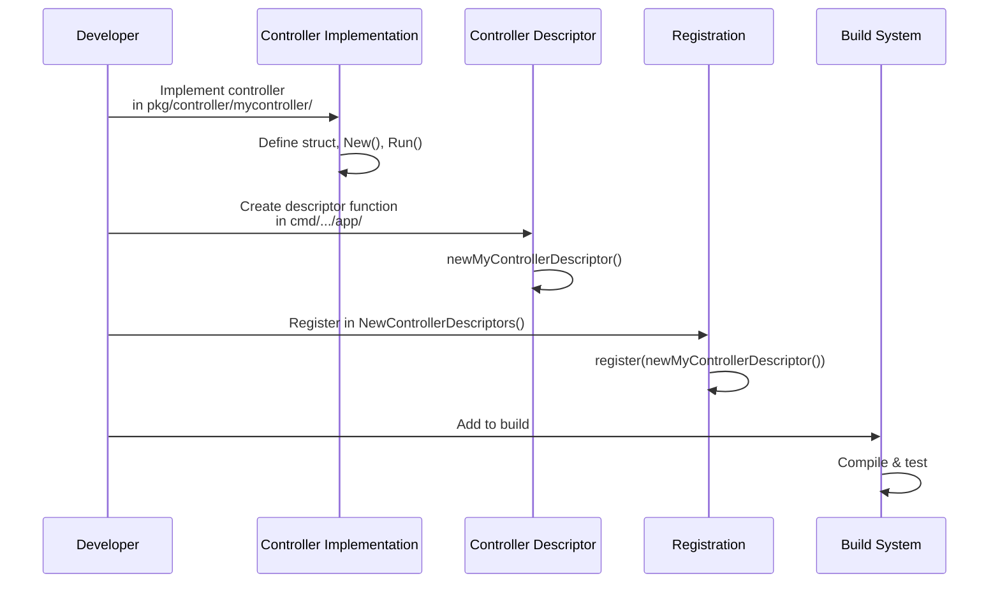

### 11.2 Feature Gates Integration

```mermaid
graph LR
    subgraph "Feature Definition"
        GATE[Feature Gate<br/>MyNewFeature]
        DEFAULT[Default: false]
        ALPHA[Alpha in v1.30]
    end

    subgraph "Controller Descriptor"
        DESC[ControllerDescriptor]
        REQUIRED[requiredFeatureGates:<br/>MyNewFeature]
    end

    subgraph "Runtime Check"
        ENABLED{Feature<br/>Enabled?}
        BUILD[Build Controller]
        SKIP[Skip Controller]
    end

    GATE --> DESC
    DEFAULT --> DESC
    ALPHA --> DESC
    DESC --> REQUIRED
    REQUIRED --> ENABLED
    ENABLED -->|Yes| BUILD
    ENABLED -->|No| SKIP
```

---

## 12. Key Takeaways

1. **Monolithic Process**: All 50 controllers run in single process for efficiency
2. **Shared Infrastructure**: Informers, caches, and clients shared across controllers
3. **Event-Driven**: Watch-based architecture with local caching
4. **Leader Election**: Active-passive HA for multi-instance deployments
5. **Isolation**: Controller failures isolated via goroutine panic recovery
6. **Scalability**: Proven to 5000 nodes, 150k pods
7. **Observability**: Comprehensive metrics, health checks, and debugging
8. **Security**: Per-controller RBAC with service account credentials
9. **Extensibility**: Clean descriptor pattern for adding controllers
10. **Resilience**: Automatic reconnection and recovery mechanisms

---

## Related Documentation

- **Executive Summary**: `02-executive-summary.md` - High-level overview
- **Functional Overview**: `03-functional-overview.md` - Detailed capabilities
- **Initialization Flow**: `06-initialization-lifecycle.md` - Startup sequence
- **Shared Infrastructure**: `07-shared-infrastructure.md` - Informers, queues
- **Data Structures**: `20-data-structures.md` - Key structs and interfaces

---

## Revision History

| Version | Date | Author | Changes |
|---------|------|--------|---------|
| 1.0 | 2025-10-21 | Architecture Analysis | Initial high-level architecture |
