# Kube-Controller-Manager: Initialization & Lifecycle

**Document Version**: 1.0
**Last Updated**: 2025-10-22
**Status**: Draft

---

## 1. Overview

This document provides detailed analysis of the kube-controller-manager initialization sequence, controller lifecycle management, and shutdown procedures.

## 2. Binary Entry Point

### 2.1 Main Function Flow

**Source**: `cmd/kube-controller-manager/controller-manager.go:34`

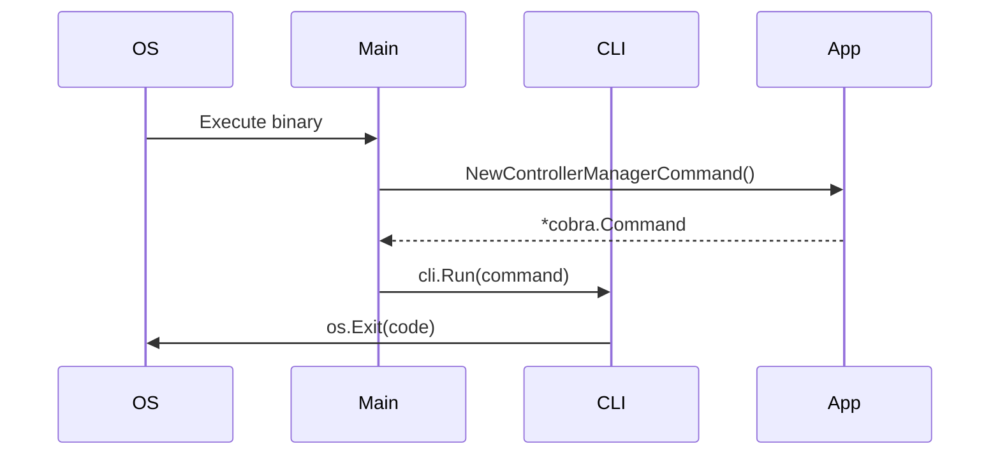
```mermaid
sequenceDiagram
    participant OS
    participant Main
    participant CLI
    participant App

    OS->>Main: Execute binary
    Main->>App: NewControllerManagerCommand()
    App-->>Main: *cobra.Command
    Main->>CLI: cli.Run(command)
    CLI->>OS: os.Exit(code)
```

**Code**:
```go
// cmd/kube-controller-manager/controller-manager.go
func main() {
    command := app.NewControllerManagerCommand()
    code := cli.Run(command)
    os.Exit(code)
}
```

### 2.2 Command Construction

**Source**: `cmd/kube-controller-manager/app/controllermanager.go:101`

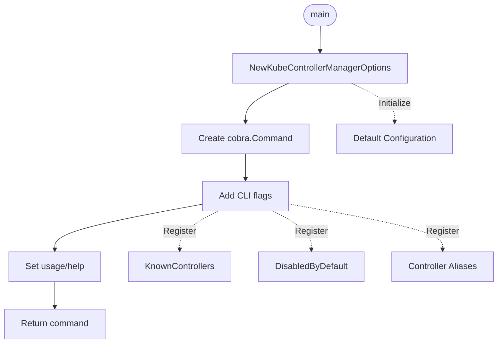
```mermaid
flowchart TD
    START([main])
    NEW_OPTS[NewKubeControllerManagerOptions]
    CREATE_CMD[Create cobra.Command]
    ADD_FLAGS[Add CLI flags]
    SET_USAGE[Set usage/help]
    RETURN[Return command]

    START --> NEW_OPTS
    NEW_OPTS --> CREATE_CMD
    CREATE_CMD --> ADD_FLAGS
    ADD_FLAGS --> SET_USAGE
    SET_USAGE --> RETURN

    NEW_OPTS -.->|Initialize| DEFAULTS[Default Configuration]
    ADD_FLAGS -.->|Register| KNOWN[KnownControllers]
    ADD_FLAGS -.->|Register| DISABLED[DisabledByDefault]
    ADD_FLAGS -.->|Register| ALIASES[Controller Aliases]
```

---

## 3. Startup Sequence

### 3.1 Complete Initialization Flow

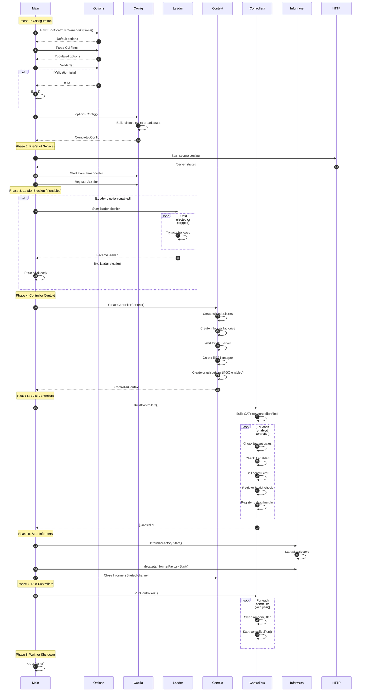
```mermaid
sequenceDiagram
    autonumber
    participant Main
    participant Options
    participant Config
    participant Leader
    participant Context
    participant Controllers
    participant Informers
    participant HTTP

    Note over Main: Phase 1: Configuration
    Main->>Options: NewKubeControllerManagerOptions()
    Options-->>Main: Default options
    Main->>Options: Parse CLI flags
    Options-->>Main: Populated options

    Main->>Options: Validate()
    alt Validation fails
        Options-->>Main: error
        Main->>Main: Exit(1)
    end

    Main->>Config: options.Config()
    Config->>Config: Build clients, event broadcaster
    Config-->>Main: CompletedConfig

    Note over Main: Phase 2: Pre-Start Services
    Main->>HTTP: Start secure serving
    HTTP-->>Main: Server started
    Main->>Config: Start event broadcaster
    Main->>Config: Register /configz

    Note over Main: Phase 3: Leader Election (if enabled)
    alt Leader election enabled
        Main->>Leader: Start leader election
        loop Until elected or stopped
            Leader->>Leader: Try acquire lease
        end
        Leader-->>Main: Became leader
    else No leader election
        Main->>Main: Proceed directly
    end

    Note over Main: Phase 4: Controller Context
    Main->>Context: CreateControllerContext()
    Context->>Context: Create client builders
    Context->>Context: Create informer factories
    Context->>Context: Wait for API server
    Context->>Context: Create REST mapper
    Context->>Context: Create graph builder (if GC enabled)
    Context-->>Main: ControllerContext

    Note over Main: Phase 5: Build Controllers
    Main->>Controllers: BuildControllers()
    Controllers->>Controllers: Build SAToken controller (first)
    loop For each enabled controller
        Controllers->>Controllers: Check feature gates
        Controllers->>Controllers: Check if enabled
        Controllers->>Controllers: Call constructor
        Controllers->>Controllers: Register health check
        Controllers->>Controllers: Register debug handler
    end
    Controllers-->>Main: []Controller

    Note over Main: Phase 6: Start Informers
    Main->>Informers: InformerFactory.Start()
    Informers->>Informers: Start all reflectors
    Main->>Informers: MetadataInformerFactory.Start()
    Main->>Context: Close InformersStarted channel

    Note over Main: Phase 7: Run Controllers
    Main->>Controllers: RunControllers()
    loop For each controller (with jitter)
        Controllers->>Controllers: Sleep random jitter
        Controllers->>Controllers: Start controller.Run()
    end

    Note over Main: Phase 8: Wait for Shutdown
    Main->>Main: <-ctx.Done()
```

**Total startup time**: 5-30 seconds depending on:
- API server availability
- Informer cache sync time
- Leader election (if enabled)
- Number of resources to cache

---

## 4. Configuration Phase

### 4.1 Options Creation

**Source**: `cmd/kube-controller-manager/app/options/options.go:122`

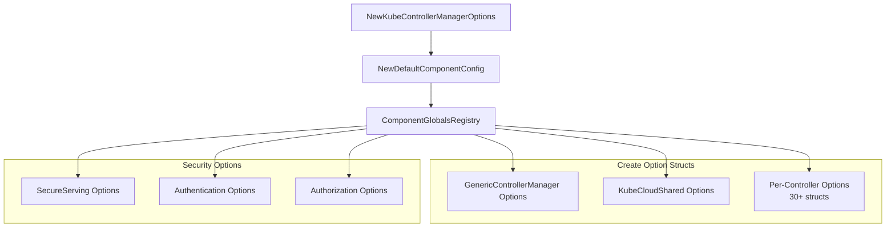
```mermaid
flowchart TD
    START[NewKubeControllerManagerOptions]
    DEFAULT_CONFIG[NewDefaultComponentConfig]
    COMPONENT_REG[ComponentGlobalsRegistry]

    subgraph "Create Option Structs"
        GENERIC[GenericControllerManager Options]
        CLOUD[KubeCloudShared Options]
        PER_CTRL[Per-Controller Options<br/>30+ structs]
    end

    subgraph "Security Options"
        SERVING[SecureServing Options]
        AUTH[Authentication Options]
        AUTHZ[Authorization Options]
    end

    START --> DEFAULT_CONFIG
    DEFAULT_CONFIG --> COMPONENT_REG
    COMPONENT_REG --> GENERIC
    COMPONENT_REG --> CLOUD
    COMPONENT_REG --> PER_CTRL
    COMPONENT_REG --> SERVING
    COMPONENT_REG --> AUTH
    COMPONENT_REG --> AUTHZ
```

**Key Default Values**:
```go
// Leader Election
LeaderElection.LeaderElect: true
LeaderElection.LeaseDuration: 15s
LeaderElection.RenewDeadline: 10s
LeaderElection.RetryPeriod: 2s

// Informers
MinResyncPeriod: 12h

// Controllers
Controllers: ["*"]  // All enabled

// Concurrency
DeploymentController.ConcurrentDeploymentSyncs: 5
ReplicaSetController.ConcurrentRSSyncs: 5
StatefulSetController.ConcurrentStatefulSetSyncs: 5
```

### 4.2 Flag Parsing

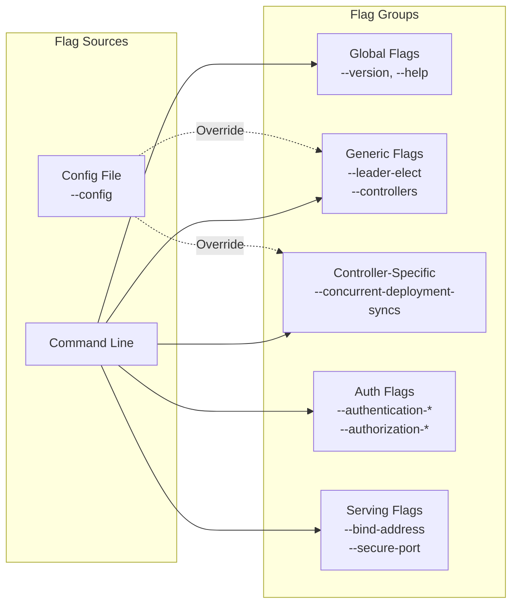
```mermaid
flowchart LR
    subgraph "Flag Groups"
        GLOBAL[Global Flags<br/>--version, --help]
        GENERIC[Generic Flags<br/>--leader-elect<br/>--controllers]
        CONTROLLER[Controller-Specific<br/>--concurrent-deployment-syncs]
        AUTH[Auth Flags<br/>--authentication-*<br/>--authorization-*]
        SERVE[Serving Flags<br/>--bind-address<br/>--secure-port]
    end

    subgraph "Flag Sources"
        CLI[Command Line]
        CONFIG_FILE[Config File<br/>--config]
    end

    CLI --> GLOBAL
    CLI --> GENERIC
    CLI --> CONTROLLER
    CLI --> AUTH
    CLI --> SERVE
    CONFIG_FILE -.->|Override| GENERIC
    CONFIG_FILE -.->|Override| CONTROLLER
```

### 4.3 Config Building

**Source**: `cmd/kube-controller-manager/app/options/options.go:486`

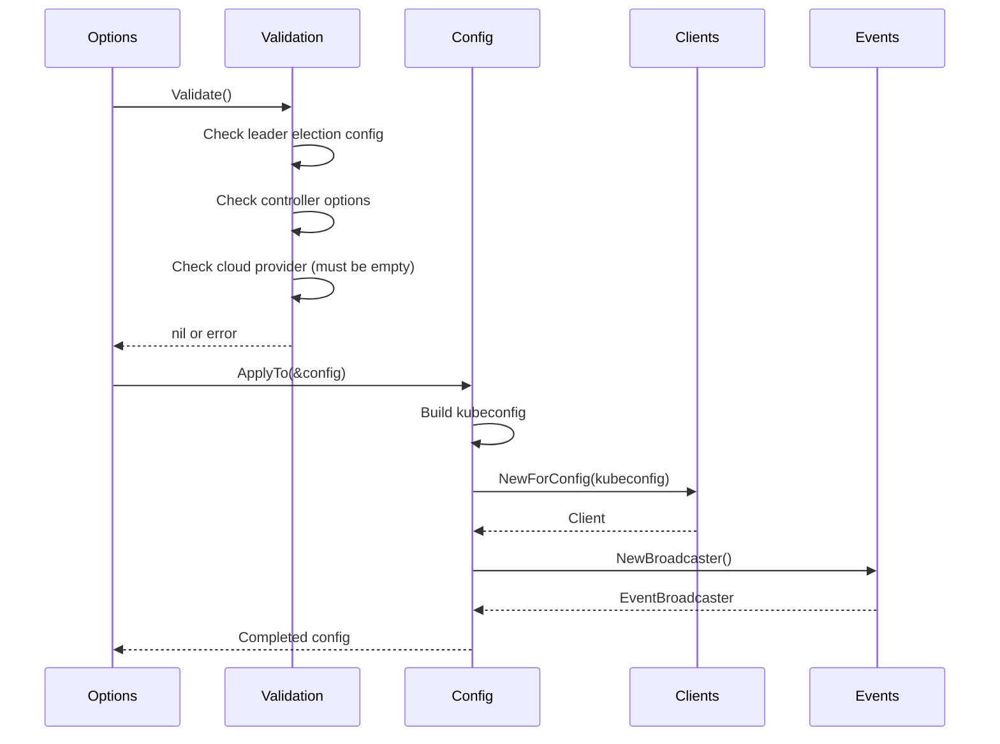
```mermaid
sequenceDiagram
    participant Options
    participant Validation
    participant Config
    participant Clients
    participant Events

    Options->>Validation: Validate()
    Validation->>Validation: Check leader election config
    Validation->>Validation: Check controller options
    Validation->>Validation: Check cloud provider (must be empty)
    Validation-->>Options: nil or error

    Options->>Config: ApplyTo(&config)
    Config->>Config: Build kubeconfig
    Config->>Clients: NewForConfig(kubeconfig)
    Clients-->>Config: Client
    Config->>Events: NewBroadcaster()
    Events-->>Config: EventBroadcaster
    Config-->>Options: Completed config
```

---

## 5. Leader Election Phase

### 5.1 Leader Election Mechanism

**Source**: `cmd/kube-controller-manager/app/controllermanager.go:776`

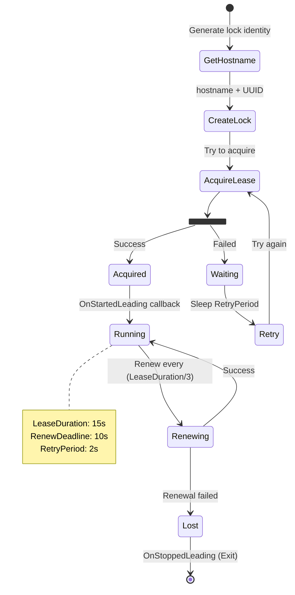
```mermaid
stateDiagram-v2
    [*] --> GetHostname: Generate lock identity
    GetHostname --> CreateLock: hostname + UUID

    CreateLock --> AcquireLease: Try to acquire

    state fork_state <<fork>>
    AcquireLease --> fork_state

    fork_state --> Acquired: Success
    fork_state --> Waiting: Failed

    Acquired --> Running: OnStartedLeading callback
    Running --> Renewing: Renew every (LeaseDuration/3)
    Renewing --> Running: Success
    Renewing --> Lost: Renewal failed

    Waiting --> Retry: Sleep RetryPeriod
    Retry --> AcquireLease: Try again

    Lost --> [*]: OnStoppedLeading (Exit)

    note right of Running
        LeaseDuration: 15s
        RenewDeadline: 10s
        RetryPeriod: 2s
    end note
```

### 5.2 Lease Object Structure

```yaml
apiVersion: coordination.k8s.io/v1
kind: Lease
metadata:
  name: kube-controller-manager
  namespace: kube-system
spec:
  holderIdentity: "node-1_8a7b3c1d-2e4f-5g6h-7i8j-9k0l1m2n3o4p"
  leaseDurationSeconds: 15
  acquireTime: "2025-10-22T00:00:00Z"
  renewTime: "2025-10-22T00:00:05Z"
  leaseTransitions: 1
```

### 5.3 Leader Migration Support

**Purpose**: Migrate controllers between lock types (e.g., Endpoints → Lease)

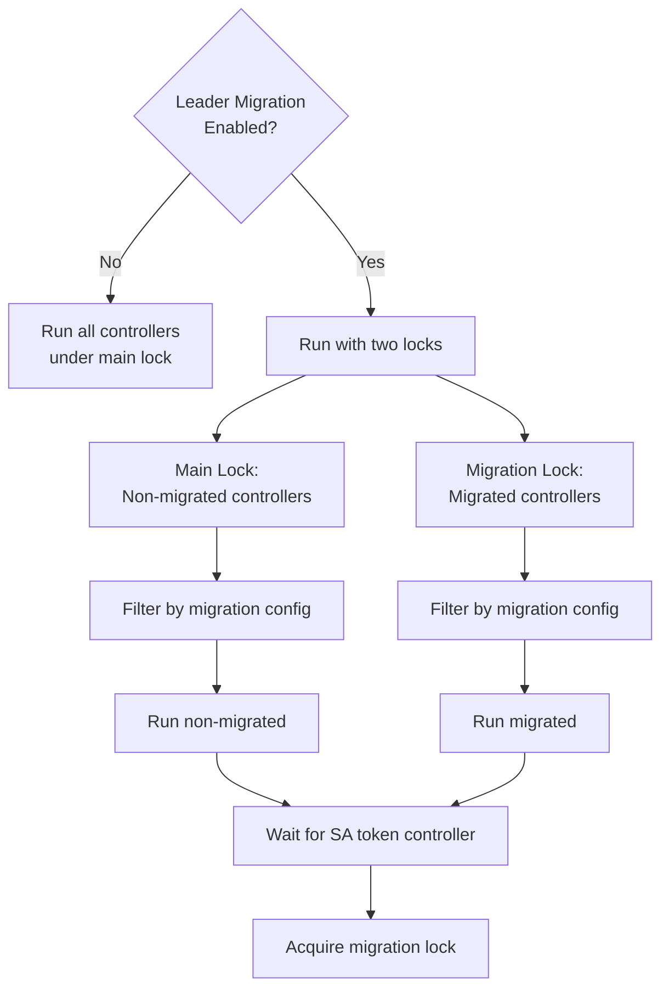
```mermaid
flowchart TB
    START{Leader Migration<br/>Enabled?}
    NO_MIG[Run all controllers<br/>under main lock]
    YES_MIG[Run with two locks]

    START -->|No| NO_MIG
    START -->|Yes| YES_MIG

    YES_MIG --> MAIN_LOCK[Main Lock:<br/>Non-migrated controllers]
    YES_MIG --> MIG_LOCK[Migration Lock:<br/>Migrated controllers]

    MAIN_LOCK --> FILTER1[Filter by migration config]
    MIG_LOCK --> FILTER2[Filter by migration config]

    FILTER1 --> RUN1[Run non-migrated]
    FILTER2 --> RUN2[Run migrated]

    RUN1 --> WAIT[Wait for SA token controller]
    RUN2 --> WAIT
    WAIT --> START_MIG[Acquire migration lock]
```

---

## 6. Controller Context Creation

### 6.1 Context Build Flow

**Source**: `cmd/kube-controller-manager/app/controllermanager.go:473`

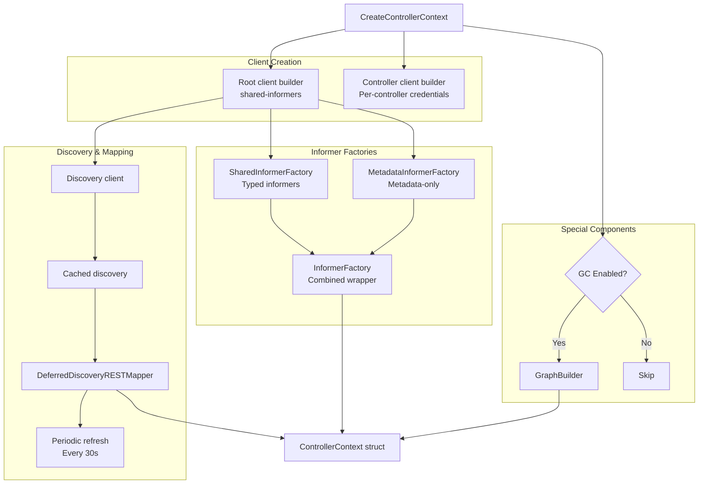
```mermaid
flowchart TD
    START[CreateControllerContext]

    subgraph "Client Creation"
        ROOT_CLIENT[Root client builder<br/>shared-informers]
        CTRL_CLIENT[Controller client builder<br/>Per-controller credentials]
    end

    subgraph "Informer Factories"
        TYPED[SharedInformerFactory<br/>Typed informers]
        META[MetadataInformerFactory<br/>Metadata-only]
        COMBINED[InformerFactory<br/>Combined wrapper]
    end

    subgraph "Discovery & Mapping"
        DISC[Discovery client]
        CACHE[Cached discovery]
        REST[DeferredDiscoveryRESTMapper]
        REFRESH[Periodic refresh<br/>Every 30s]
    end

    subgraph "Special Components"
        GRAPH{GC Enabled?}
        BUILD_GRAPH[GraphBuilder]
        SKIP_GRAPH[Skip]
    end

    START --> ROOT_CLIENT
    START --> CTRL_CLIENT
    ROOT_CLIENT --> TYPED
    ROOT_CLIENT --> META
    TYPED --> COMBINED
    META --> COMBINED
    ROOT_CLIENT --> DISC
    DISC --> CACHE
    CACHE --> REST
    REST --> REFRESH

    START --> GRAPH
    GRAPH -->|Yes| BUILD_GRAPH
    GRAPH -->|No| SKIP_GRAPH

    COMBINED --> CTX[ControllerContext struct]
    REST --> CTX
    BUILD_GRAPH --> CTX
```

### 6.2 Informer Factory Initialization

```go
// Trim ManagedFields for memory efficiency
trim := func(obj interface{}) (interface{}, error) {
    if accessor, err := meta.Accessor(obj); err == nil {
        if accessor.GetManagedFields() != nil {
            accessor.SetManagedFields(nil)
        }
    }
    return obj, nil
}

// Create shared informer factory
sharedInformers := informers.NewSharedInformerFactoryWithOptions(
    versionedClient,
    ResyncPeriod(s)(),
    informers.WithTransform(trim),  // Memory optimization
)
```

### 6.3 API Server Readiness Check

**Source**: `staging/src/k8s.io/controller-manager/app/helper.go`

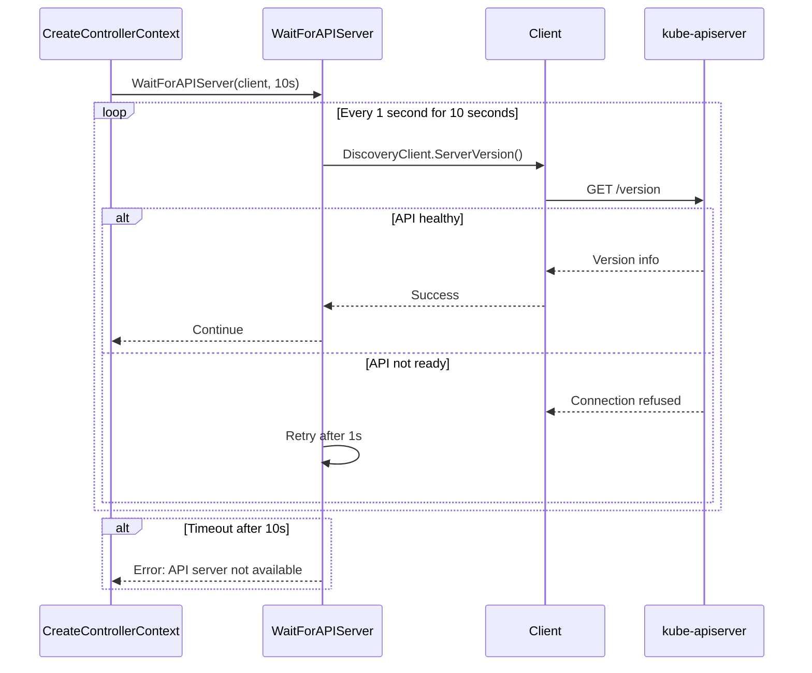
```mermaid
sequenceDiagram
    participant Context as CreateControllerContext
    participant Wait as WaitForAPIServer
    participant Client
    participant API as kube-apiserver

    Context->>Wait: WaitForAPIServer(client, 10s)
    loop Every 1 second for 10 seconds
        Wait->>Client: DiscoveryClient.ServerVersion()
        Client->>API: GET /version
        alt API healthy
            API-->>Client: Version info
            Client-->>Wait: Success
            Wait-->>Context: Continue
        else API not ready
            API-->>Client: Connection refused
            Wait->>Wait: Retry after 1s
        end
    end
    alt Timeout after 10s
        Wait-->>Context: Error: API server not available
    end
```

---

## 7. Controller Build Phase

### 7.1 Build Controller Flow

**Source**: `cmd/kube-controller-manager/app/controllermanager.go:559`

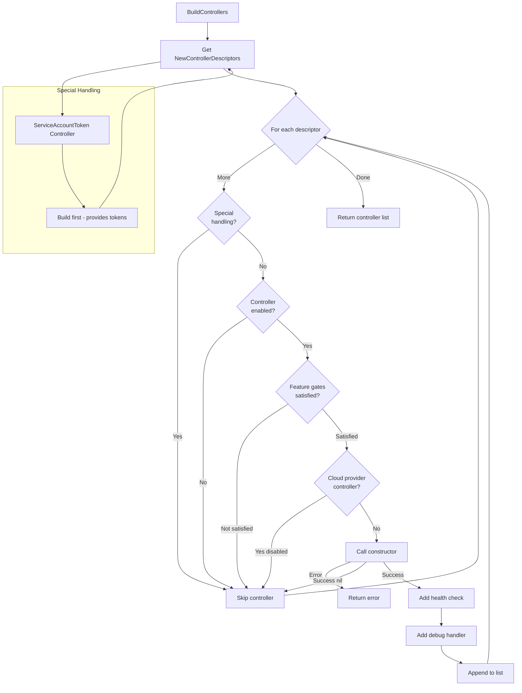
```mermaid
flowchart TD
    START[BuildControllers]
    DESCRIPTORS[Get NewControllerDescriptors]

    subgraph "Special Handling"
        SA_TOKEN[ServiceAccountToken Controller]
        BUILD_SA[Build first - provides tokens]
    end

    LOOP{For each descriptor}
    CHECK_SPECIAL{Special<br/>handling?}
    CHECK_ENABLED{Controller<br/>enabled?}
    CHECK_GATES{Feature gates<br/>satisfied?}
    CHECK_CLOUD{Cloud provider<br/>controller?}

    BUILD[Call constructor]
    ADD_HEALTH[Add health check]
    ADD_DEBUG[Add debug handler]
    APPEND[Append to list]

    SKIP[Skip controller]
    ERROR[Return error]

    START --> DESCRIPTORS
    DESCRIPTORS --> SA_TOKEN
    SA_TOKEN --> BUILD_SA
    BUILD_SA --> DESCRIPTORS

    DESCRIPTORS --> LOOP
    LOOP -->|More| CHECK_SPECIAL
    LOOP -->|Done| RETURN[Return controller list]

    CHECK_SPECIAL -->|Yes| SKIP
    CHECK_SPECIAL -->|No| CHECK_ENABLED
    CHECK_ENABLED -->|No| SKIP
    CHECK_ENABLED -->|Yes| CHECK_GATES
    CHECK_GATES -->|Not satisfied| SKIP
    CHECK_GATES -->|Satisfied| CHECK_CLOUD
    CHECK_CLOUD -->|Yes disabled| SKIP
    CHECK_CLOUD -->|No| BUILD

    BUILD -->|Error| ERROR
    BUILD -->|Success nil| SKIP
    BUILD -->|Success| ADD_HEALTH
    ADD_HEALTH --> ADD_DEBUG
    ADD_DEBUG --> APPEND
    APPEND --> LOOP
    SKIP --> LOOP
```

### 7.2 Controller Constructor Pattern

**Example**: Deployment Controller

**Source**: `cmd/kube-controller-manager/app/apps.go:128`

```go
func newDeploymentController(
    ctx context.Context,
    controllerContext ControllerContext,
    controllerName string,
) (Controller, error) {
    // 1. Get client for this controller
    client, err := controllerContext.NewClient("deployment-controller")
    if err != nil {
        return nil, err
    }

    // 2. Create controller with informers
    dc, err := deployment.NewDeploymentController(
        ctx,
        controllerContext.InformerFactory.Apps().V1().Deployments(),
        controllerContext.InformerFactory.Apps().V1().ReplicaSets(),
        controllerContext.InformerFactory.Core().V1().Pods(),
        client,
    )
    if err != nil {
        return nil, fmt.Errorf("error creating Deployment controller: %w", err)
    }

    // 3. Wrap in controller loop
    return newControllerLoop(func(ctx context.Context) {
        dc.Run(ctx, int(controllerContext.ComponentConfig.DeploymentController.ConcurrentDeploymentSyncs))
    }, controllerName), nil
}
```

### 7.3 Controller Loop Wrapper

```go
type controllerLoop struct {
    name    string
    runFunc func(ctx context.Context)
}

func (c *controllerLoop) Name() string {
    return c.name
}

func (c *controllerLoop) Run(ctx context.Context) {
    c.runFunc(ctx)
}
```

---

## 8. Informer Start Phase

### 8.1 Starting Informers

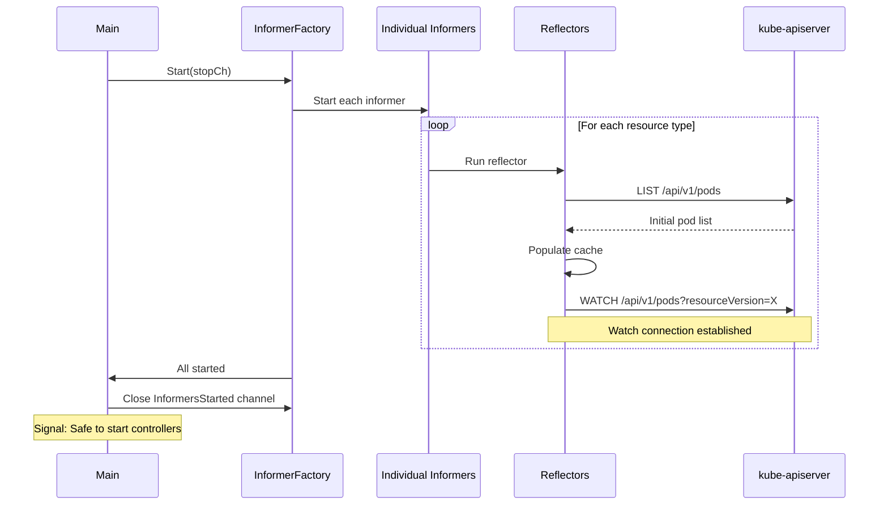
```mermaid
sequenceDiagram
    participant Main
    participant Factory as InformerFactory
    participant Informers as Individual Informers
    participant Reflectors
    participant API as kube-apiserver

    Main->>Factory: Start(stopCh)
    Factory->>Informers: Start each informer
    loop For each resource type
        Informers->>Reflectors: Run reflector
        Reflectors->>API: LIST /api/v1/pods
        API-->>Reflectors: Initial pod list
        Reflectors->>Reflectors: Populate cache
        Reflectors->>API: WATCH /api/v1/pods?resourceVersion=X
        Note over Reflectors,API: Watch connection established
    end
    Factory->>Main: All started

    Main->>Factory: Close InformersStarted channel
    Note over Main: Signal: Safe to start controllers
```

### 8.2 Cache Synchronization

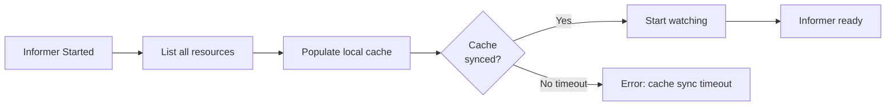
```mermaid
flowchart LR
    START[Informer Started]
    LIST[List all resources]
    POPULATE[Populate local cache]
    SYNC{Cache<br/>synced?}
    WATCH[Start watching]
    READY[Informer ready]

    START --> LIST
    LIST --> POPULATE
    POPULATE --> SYNC
    SYNC -->|Yes| WATCH
    SYNC -->|No timeout| ERROR[Error: cache sync timeout]
    WATCH --> READY
```

**Default sync timeout**: 30 seconds per informer

---

## 9. Controller Run Phase

### 9.1 Running Controllers

**Source**: `cmd/kube-controller-manager/app/controllermanager.go:649`

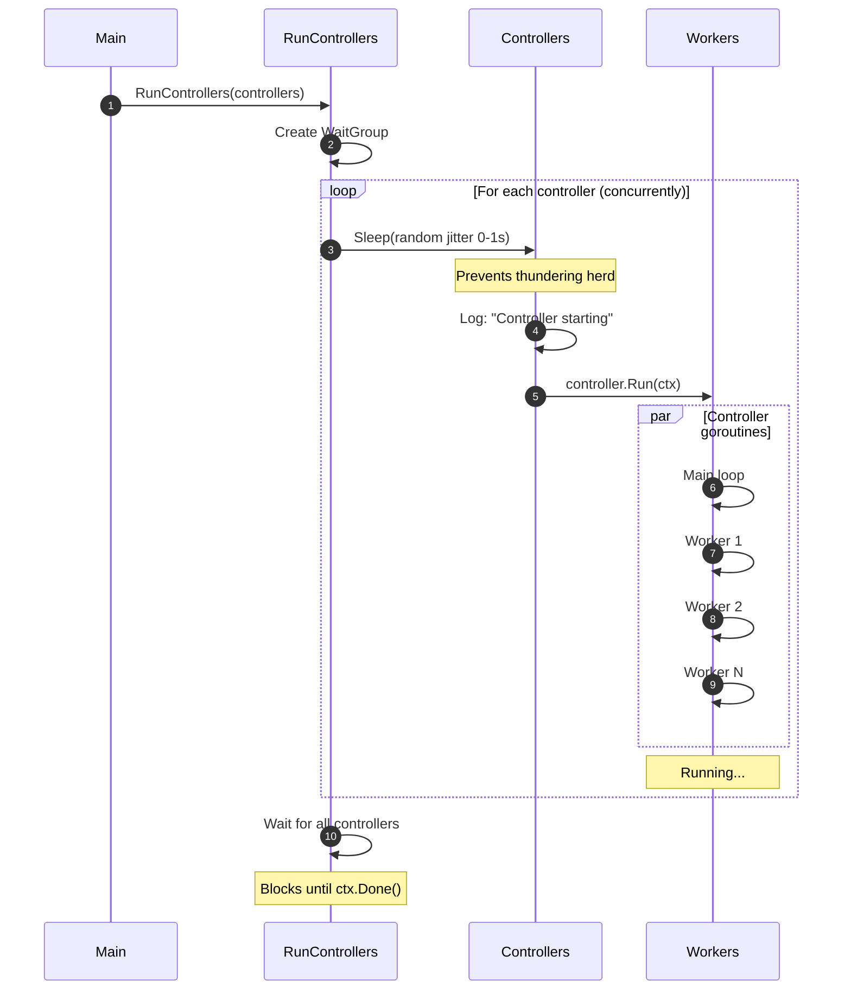
```mermaid
sequenceDiagram
    autonumber
    participant Main
    participant RunControllers
    participant Controllers
    participant Workers

    Main->>RunControllers: RunControllers(controllers)
    RunControllers->>RunControllers: Create WaitGroup

    loop For each controller (concurrently)
        RunControllers->>Controllers: Sleep(random jitter 0-1s)
        Note over Controllers: Prevents thundering herd
        Controllers->>Controllers: Log: "Controller starting"
        Controllers->>Workers: controller.Run(ctx)

        par Controller goroutines
            Workers->>Workers: Main loop
            Workers->>Workers: Worker 1
            Workers->>Workers: Worker 2
            Workers->>Workers: Worker N
        end

        Note over Workers: Running...
    end

    RunControllers->>RunControllers: Wait for all controllers
    Note over RunControllers: Blocks until ctx.Done()
```

### 9.2 Jittered Startup

**Purpose**: Avoid all controllers starting simultaneously

```go
// Sleep with jitter to prevent thundering herd
time.Sleep(wait.Jitter(
    controllerContext.ComponentConfig.Generic.ControllerStartInterval.Duration,
    ControllerStartJitter,  // 1.0
))

// Example: ControllerStartInterval = 0s, Jitter = 1.0
// Results in random delay between 0-1 seconds per controller
```

### 9.3 Individual Controller Lifecycle

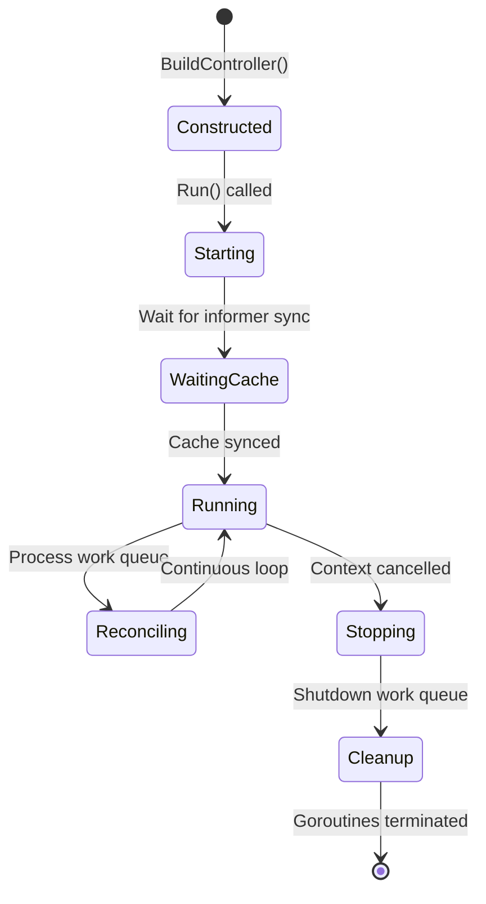
```mermaid
stateDiagram-v2
    [*] --> Constructed: BuildController()
    Constructed --> Starting: Run() called
    Starting --> WaitingCache: Wait for informer sync
    WaitingCache --> Running: Cache synced
    Running --> Reconciling: Process work queue
    Reconciling --> Running: Continuous loop
    Running --> Stopping: Context cancelled
    Stopping --> Cleanup: Shutdown work queue
    Cleanup --> [*]: Goroutines terminated
```

---

## 10. Shutdown Phase

### 10.1 Graceful Shutdown Sequence

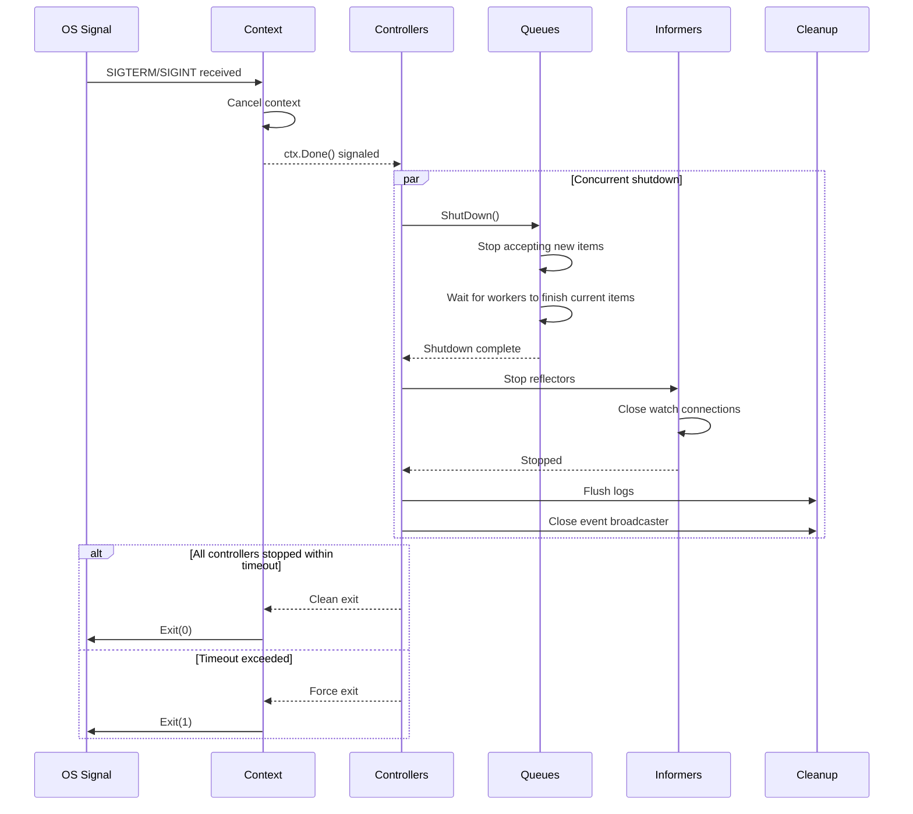
```mermaid
sequenceDiagram
    participant Signal as OS Signal
    participant Context
    participant Controllers
    participant Queues
    participant Informers
    participant Cleanup

    Signal->>Context: SIGTERM/SIGINT received
    Context->>Context: Cancel context
    Context-->>Controllers: ctx.Done() signaled

    par Concurrent shutdown
        Controllers->>Queues: ShutDown()
        Queues->>Queues: Stop accepting new items
        Queues->>Queues: Wait for workers to finish current items
        Queues-->>Controllers: Shutdown complete

        Controllers->>Informers: Stop reflectors
        Informers->>Informers: Close watch connections
        Informers-->>Controllers: Stopped

        Controllers->>Cleanup: Flush logs
        Controllers->>Cleanup: Close event broadcaster
    end

    alt All controllers stopped within timeout
        Controllers-->>Context: Clean exit
        Context->>Signal: Exit(0)
    else Timeout exceeded
        Controllers-->>Context: Force exit
        Context->>Signal: Exit(1)
    end
```

### 10.2 Shutdown Timeout

**Configuration**:
```yaml
# Default: 10 seconds
--controller-shutdown-timeout=10s
```

**Behavior**:
```go
// Wait for controllers to stop
select {
case <-terminatedCh:
    // All controllers stopped gracefully
    return true
case <-time.After(shutdownTimeout):
    // Timeout: force exit
    logger.Info("Controller shutdown timeout reached",
        "timeout", shutdownTimeout,
        "runningControllers", runningControllers)
    return false
}
```

### 10.3 Per-Controller Shutdown

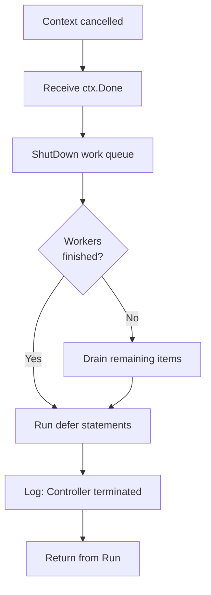
```mermaid
flowchart TD
    START[Context cancelled]
    SIGNAL[Receive ctx.Done]
    QUEUE[ShutDown work queue]
    WAIT{Workers<br/>finished?}
    DRAIN[Drain remaining items]
    CLEANUP[Run defer statements]
    LOG[Log: Controller terminated]
    DONE[Return from Run]

    START --> SIGNAL
    SIGNAL --> QUEUE
    QUEUE --> WAIT
    WAIT -->|Yes| CLEANUP
    WAIT -->|No| DRAIN
    DRAIN --> CLEANUP
    CLEANUP --> LOG
    LOG --> DONE
```

---

## 11. Error Handling & Recovery

### 11.1 Initialization Errors

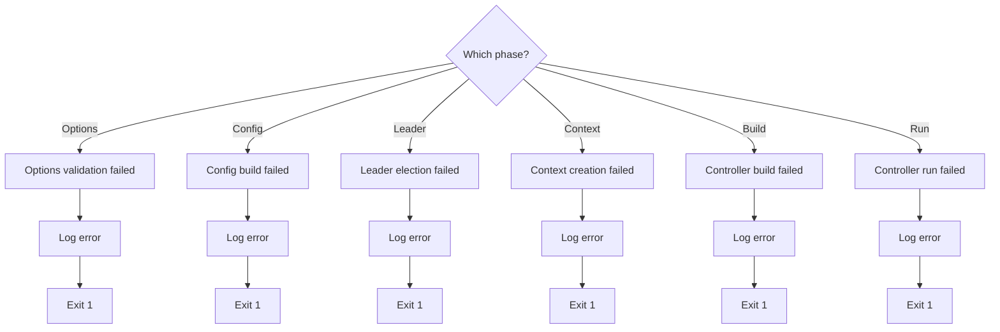
```mermaid
flowchart TD
    PHASE{Which phase?}

    PHASE -->|Options| OPT_ERR[Options validation failed]
    PHASE -->|Config| CFG_ERR[Config build failed]
    PHASE -->|Leader| LEAD_ERR[Leader election failed]
    PHASE -->|Context| CTX_ERR[Context creation failed]
    PHASE -->|Build| BUILD_ERR[Controller build failed]
    PHASE -->|Run| RUN_ERR[Controller run failed]

    OPT_ERR --> LOG1[Log error]
    CFG_ERR --> LOG2[Log error]
    LEAD_ERR --> LOG3[Log error]
    CTX_ERR --> LOG4[Log error]
    BUILD_ERR --> LOG5[Log error]
    RUN_ERR --> LOG6[Log error]

    LOG1 --> EXIT1[Exit 1]
    LOG2 --> EXIT2[Exit 1]
    LOG3 --> EXIT3[Exit 1]
    LOG4 --> EXIT4[Exit 1]
    LOG5 --> EXIT5[Exit 1]
    LOG6 --> EXIT6[Exit 1]
```

**All initialization errors are fatal** - process exits with code 1.

### 11.2 Runtime Error Handling

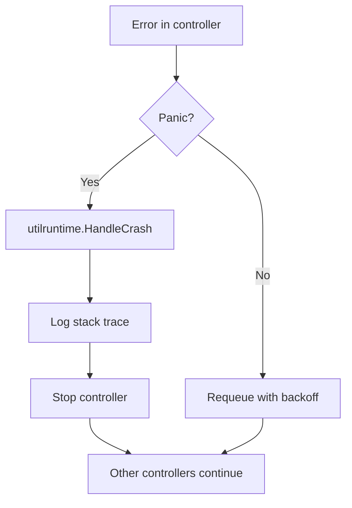
```mermaid
flowchart TD
    ERROR[Error in controller]
    PANIC{Panic?}
    RECOVER[utilruntime.HandleCrash]
    LOG[Log stack trace]
    STOP[Stop controller]
    CONTINUE[Other controllers continue]

    ERROR --> PANIC
    PANIC -->|Yes| RECOVER
    PANIC -->|No| REQUEUE[Requeue with backoff]
    RECOVER --> LOG
    LOG --> STOP
    STOP --> CONTINUE
    REQUEUE --> CONTINUE
```

**Isolation**: Controller panics don't crash the entire process.

---

## 12. State Transitions Summary

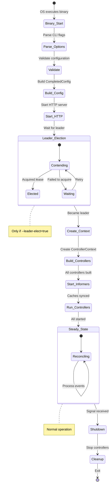
```mermaid
stateDiagram-v2
    [*] --> Binary_Start: OS executes binary
    Binary_Start --> Parse_Options: Parse CLI flags
    Parse_Options --> Validate: Validate configuration
    Validate --> Build_Config: Build CompletedConfig
    Build_Config --> Start_HTTP: Start HTTP server
    Start_HTTP --> Leader_Election: Wait for leader

    state Leader_Election {
        [*] --> Contending
        Contending --> Elected: Acquired lease
        Contending --> Waiting: Failed to acquire
        Waiting --> Contending: Retry
    }

    Leader_Election --> Create_Context: Became leader
    Create_Context --> Build_Controllers: Create ControllerContext
    Build_Controllers --> Start_Informers: All controllers built
    Start_Informers --> Run_Controllers: Caches synced
    Run_Controllers --> Steady_State: All started

    state Steady_State {
        [*] --> Reconciling
        Reconciling --> Reconciling: Process events
    }

    Steady_State --> Shutdown: Signal received
    Shutdown --> Cleanup: Stop controllers
    Cleanup --> [*]: Exit

    note right of Leader_Election
        Only if --leader-elect=true
    end note

    note right of Steady_State
        Normal operation
    end note
```

---

## 13. Performance Considerations

### 13.1 Startup Time Breakdown

```
Typical startup timeline (healthy cluster):

0s     : Binary execution
0.1s   : Option parsing
0.2s   : Config building
0.5s   : Client creation
2s     : Leader election (if enabled)
2.1s   : Context creation
2.5s   : API server readiness check
3s     : Controller building (50 controllers)
5s     : Informer cache sync (LIST operations)
6-8s   : Watch connections established
8s     : Controllers start running (with jitter)
10s    : Fully operational

Total: ~10 seconds (no leader wait)
Total: ~5-30s (with leader election)
```

### 13.2 Optimization Techniques

1. **Parallel Informer Start**: All informers start concurrently
2. **Jittered Controller Start**: Spreads load over 1 second
3. **Metadata-only Informers**: Reduces memory for GC
4. **Cached Discovery**: Avoids repeated API discovery
5. **Shared Informers**: Single watch per resource type

---

## 14. Troubleshooting

### 14.1 Common Startup Issues

| Symptom | Possible Cause | Solution |
|---------|---------------|----------|
| Hangs at leader election | Multiple instances competing | Check lease object, verify clocks synced |
| Timeout waiting for API | kube-apiserver not ready | Check API server health, network connectivity |
| Controller build errors | Feature gates disabled | Check --feature-gates, enable required gates |
| Informer cache sync timeout | Too many resources | Increase timeout, check API server performance |
| OOMKilled on start | Cluster too large | Increase memory limit, use metadata informers |

### 14.2 Diagnostic Commands

```bash
# Check leader
kubectl -n kube-system get lease kube-controller-manager -o yaml

# Check controller logs
kubectl -n kube-system logs kube-controller-manager-xxx

# Check specific controller started
kubectl logs ... | grep "deployment-controller.*Starting"

# Check informer sync
kubectl logs ... | grep "cache sync"

# Check for errors
kubectl logs ... | grep -i error
```

---

## Related Documentation

- **High-Level Architecture**: `05-high-level-architecture.md`
- **Shared Infrastructure**: `07-shared-infrastructure.md`
- **Data Structures**: `20-data-structures.md`
- **Generic Framework**: `21-generic-controller-framework.md`

---

## Revision History

| Version | Date | Author | Changes |
|---------|------|--------|---------|
| 1.0 | 2025-10-22 | Architecture Analysis | Initial initialization & lifecycle documentation |
