# Kube-Controller-Manager: Shared Infrastructure

**Document Version**: 1.0
**Last Updated**: 2025-10-22
**Status**: Draft

---

## 1. Overview

This document provides deep technical analysis of the shared infrastructure components used by all controllers in kube-controller-manager. These components enable efficient, scalable, and reliable cluster state reconciliation.

## 2. Shared Informer Framework

### 2.1 Architecture Overview

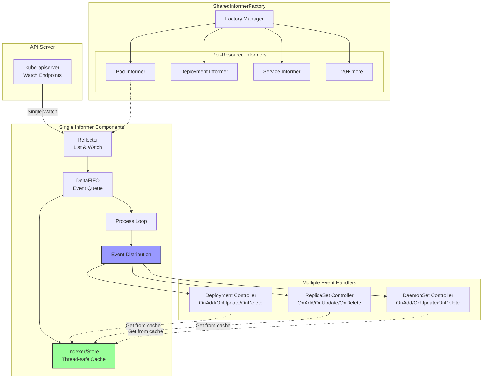

### 2.2 Reflector Component

**Purpose**: Maintains a watch on the API server and feeds changes to the local cache.

**Source**: `staging/src/k8s.io/client-go/tools/cache/reflector.go`

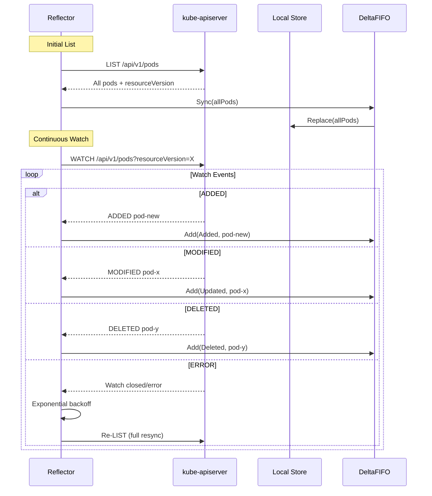

**Key Features**:

1. **List-Watch Pattern**:
   ```go
   // Initial LIST
   list, err := r.listerWatcher.List(options)
   resourceVersion := listMetaInterface.GetResourceVersion()

   // Then WATCH from that version
   watcher, err := r.listerWatcher.Watch(options)
   ```

2. **Error Recovery**:
   ```go
   // On watch error, exponential backoff then full relist
   wait.BackoffUntil(func() {
       if err := r.ListAndWatch(stopCh); err != nil {
           utilruntime.HandleError(err)
       }
   }, r.backoffManager, true, stopCh)
   ```

3. **Periodic Resync**:
   ```go
   // Default: every 12 hours
   // Ensures cache consistency even if events were missed
   resyncPeriod := 12 * time.Hour
   ```

### 2.3 DeltaFIFO Queue

**Purpose**: Queues resource deltas (changes) for processing.

**Structure**:
```go
type DeltaFIFO struct {
    items map[string]Deltas  // key -> list of deltas
    queue []string            // ordered keys
    populated bool
    initialPopulationCount int
}

type Delta struct {
    Type   DeltaType  // Added, Updated, Deleted, Sync
    Object interface{}
}
```

**Processing Flow**:

```mermaid
flowchart TD
    EVENT[Reflector Event]
    KEY[Calculate Key<br/>namespace/name]
    CHECK{Key exists<br/>in map?}
    APPEND[Append delta to existing]
    NEW[Create new delta list]
    ENQUEUE[Add key to queue<br/>if not present]
    POP[Pop() from queue]
    PROCESS[Process all deltas for key]
    UPDATE[Update cache]
    NOTIFY[Notify handlers]
    DELETE[Delete from map]

    EVENT --> KEY
    KEY --> CHECK
    CHECK -->|Yes| APPEND
    CHECK -->|No| NEW
    APPEND --> ENQUEUE
    NEW --> ENQUEUE

    POP --> PROCESS
    PROCESS --> UPDATE
    UPDATE --> NOTIFY
    NOTIFY --> DELETE
```

**Deduplication**:
```go
// Multiple events for same resource are compressed
deltas := []Delta{
    {Type: Added, Object: pod-v1},
    {Type: Updated, Object: pod-v2},
    {Type: Updated, Object: pod-v3},
}
// All processed together, handlers get latest state
```

### 2.4 Indexer (Local Cache)

**Purpose**: Thread-safe in-memory cache with indexing capabilities.

**Interface**:
```go
type Indexer interface {
    Store  // Add, Update, Delete, Get, List
    Index(indexName string, obj interface{}) ([]interface{}, error)
    IndexKeys(indexName string, indexKey string) ([]string, error)
    ListIndexFuncValues(indexName string) []string
    ByIndex(indexName string, indexKey string) ([]interface{}, error)
    GetIndexers() Indexers
    AddIndexers(newIndexers Indexers) error
}
```

**Default Index**: By namespace
```go
// MetaNamespaceIndexFunc indexes by namespace
func MetaNamespaceIndexFunc(obj interface{}) ([]string, error) {
    meta, err := meta.Accessor(obj)
    if err != nil {
        return nil, err
    }
    return []string{meta.GetNamespace()}, nil
}

// Usage: Get all pods in namespace "default"
pods, err := informer.GetIndexer().ByIndex("namespace", "default")
```

**Memory Optimization - Transform Function**:
```go
// Trim ManagedFields to reduce memory ~30-50%
trim := func(obj interface{}) (interface{}, error) {
    if accessor, err := meta.Accessor(obj); err == nil {
        accessor.SetManagedFields(nil)
    }
    return obj, nil
}

informers.NewSharedInformerFactoryWithOptions(
    client,
    resyncPeriod,
    informers.WithTransform(trim),
)
```

### 2.5 Event Handler Registration

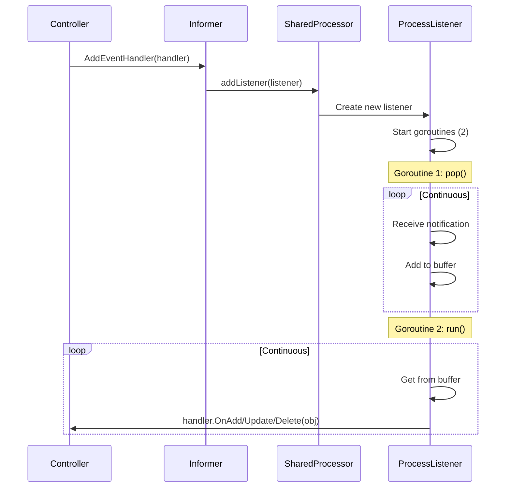

**Handler Interface**:
```go
type ResourceEventHandler interface {
    OnAdd(obj interface{})
    OnUpdate(oldObj, newObj interface{})
    OnDelete(obj interface{})
}

// Usage in controller
informer.Informer().AddEventHandler(cache.ResourceEventHandlerFuncs{
    AddFunc: func(obj interface{}) {
        controller.handleAdd(obj)
    },
    UpdateFunc: func(oldObj, newObj interface{}) {
        controller.handleUpdate(oldObj, newObj)
    },
    DeleteFunc: func(obj interface{}) {
        controller.handleDelete(obj)
    },
})
```

---

## 3. Work Queue System

### 3.1 Work Queue Architecture

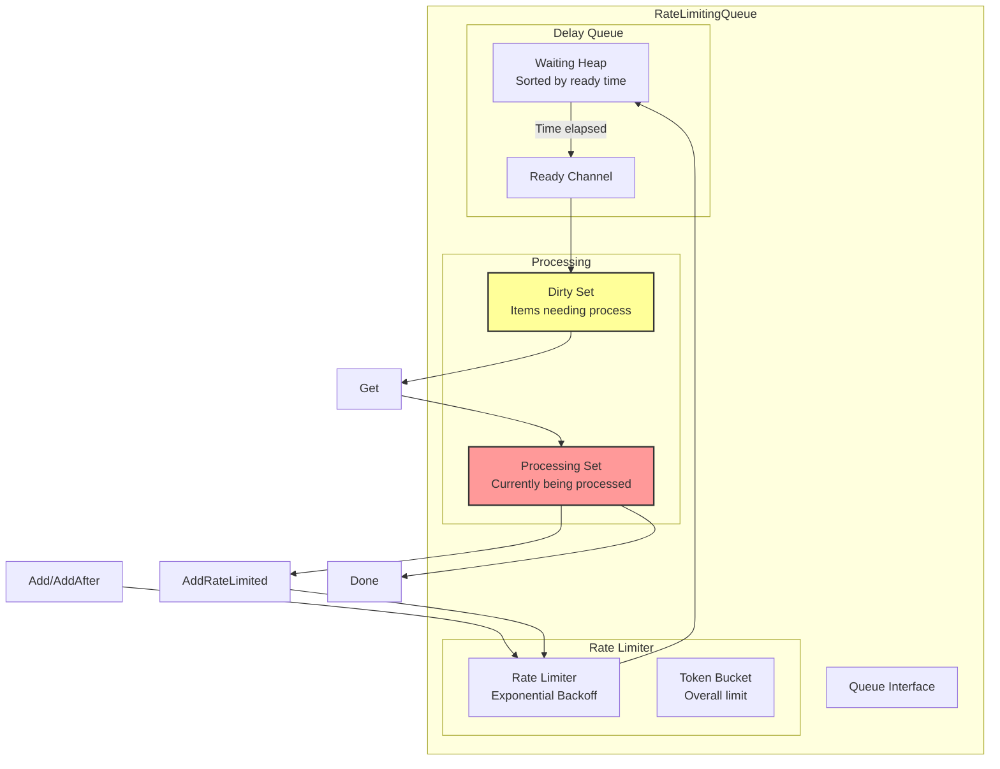

### 3.2 Rate Limiting Strategies

**Default Controller Rate Limiter**:
```go
func DefaultControllerRateLimiter() RateLimiter {
    return NewMaxOfRateLimiter(
        // Exponential backoff: 5ms, 10ms, 20ms, ... up to 1000s
        NewItemExponentialFailureRateLimiter(5*time.Millisecond, 1000*time.Second),

        // Overall rate limit: 10 qps, burst 100
        &BucketRateLimiter{
            Limiter: rate.NewLimiter(rate.Limit(10), 100),
        },
    )
}
```

**Backoff Calculation**:
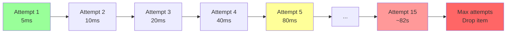

### 3.3 Work Queue Operations

**Adding Items**:
```go
// Simple add
queue.Add("default/my-deployment")

// Add after delay
queue.AddAfter("default/my-deployment", 5*time.Second)

// Add with rate limiting (on error)
queue.AddRateLimited("default/my-deployment")
```

**Processing Pattern**:
```go
func (c *Controller) worker(ctx context.Context) {
    for c.processNextWorkItem(ctx) {
    }
}

func (c *Controller) processNextWorkItem(ctx context.Context) bool {
    key, quit := c.queue.Get()
    if quit {
        return false
    }
    defer c.queue.Done(key)

    err := c.syncHandler(ctx, key.(string))
    if err != nil {
        // Requeue with backoff
        c.queue.AddRateLimited(key)
        return true
    }

    // Success: remove from rate limiter
    c.queue.Forget(key)
    return true
}
```

### 3.4 Queue Metrics

```go
// Workqueue metrics (Prometheus)
workqueue_depth{name="deployment"}                        // Current items
workqueue_adds_total{name="deployment"}                   // Total adds
workqueue_queue_duration_seconds{name="deployment"}       // Time in queue
workqueue_work_duration_seconds{name="deployment"}        // Processing time
workqueue_retries_total{name="deployment"}                // Total retries
workqueue_longest_running_processor_seconds{name="deployment"}
workqueue_unfinished_work_seconds{name="deployment"}
```

---

## 4. Client Builder System

### 4.1 Client Builder Types

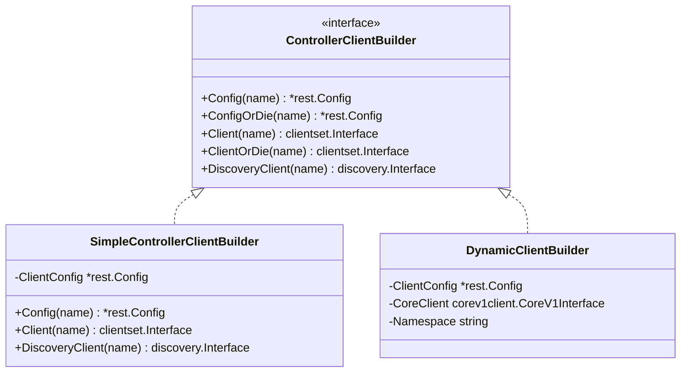

**SimpleControllerClientBuilder**:
```go
// All controllers use same credentials from kubeconfig
type SimpleControllerClientBuilder struct {
    ClientConfig *rest.Config
}

func (b SimpleControllerClientBuilder) Client(name string) (clientset.Interface, error) {
    // Just clone the config and create client
    return clientset.NewForConfig(rest.CopyConfig(b.ClientConfig))
}
```

**DynamicClientBuilder**:
```go
// Each controller gets its own ServiceAccount token
type DynamicClientBuilder struct {
    ClientConfig *rest.Config
    CoreClient   corev1client.CoreV1Interface
    Namespace    string
}

func (b DynamicClientBuilder) Client(name string) (clientset.Interface, error) {
    // 1. Get ServiceAccount for this controller
    sa, err := b.CoreClient.ServiceAccounts(b.Namespace).Get(context.TODO(), name, metav1.GetOptions{})

    // 2. Get token from ServiceAccount
    token, err := b.getServiceAccountToken(sa)

    // 3. Create client config with token
    clientConfig := rest.AnonymousClientConfig(b.ClientConfig)
    clientConfig.BearerToken = token

    // 4. Create client
    return clientset.NewForConfig(clientConfig)
}
```

### 4.2 Per-Controller Authentication Flow

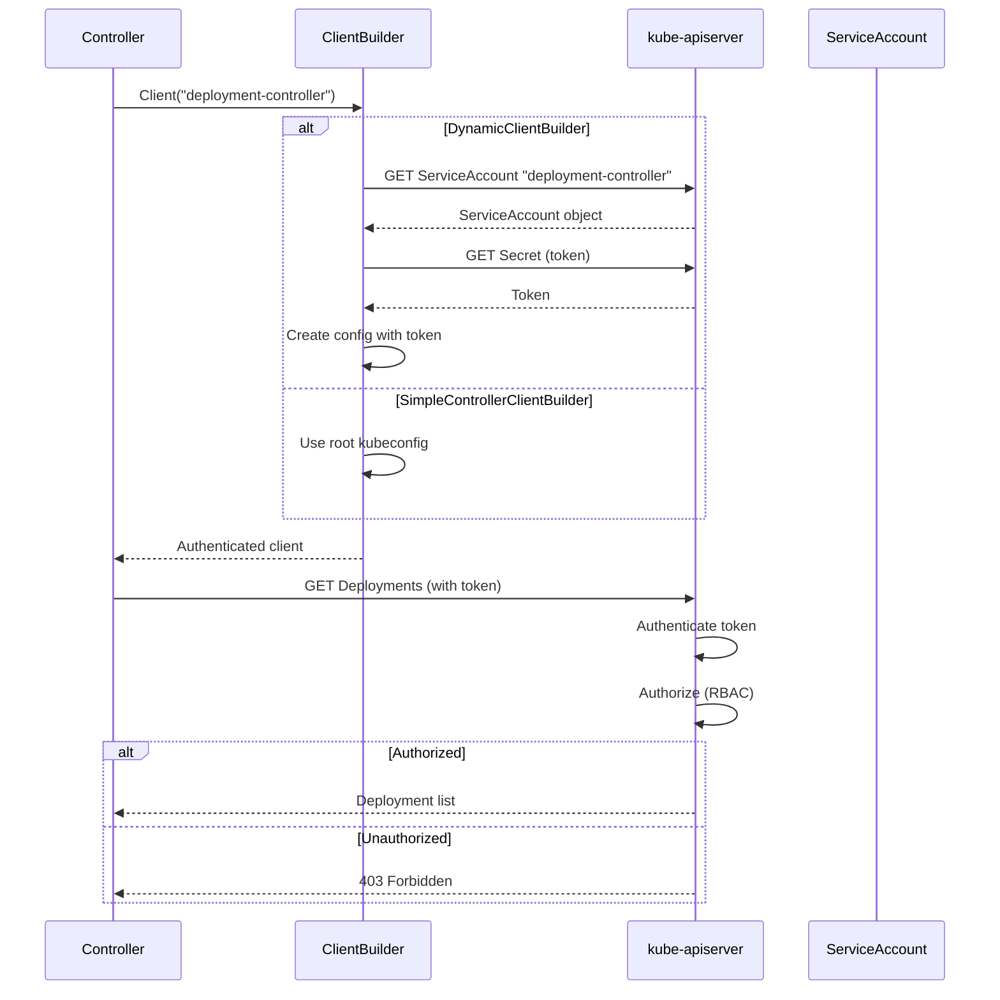

### 4.3 RBAC Configuration Example

```yaml
# ServiceAccount for deployment controller
apiVersion: v1
kind: ServiceAccount
metadata:
  name: deployment-controller
  namespace: kube-system

---
# ClusterRole with specific permissions
apiVersion: rbac.authorization.k8s.io/v1
kind: ClusterRole
metadata:
  name: system:controller:deployment-controller
rules:
# Deployments: full access
- apiGroups: ["apps"]
  resources: ["deployments"]
  verbs: ["get", "list", "watch", "update", "patch"]
- apiGroups: ["apps"]
  resources: ["deployments/status"]
  verbs: ["update", "patch"]
# ReplicaSets: create, manage
- apiGroups: ["apps"]
  resources: ["replicasets"]
  verbs: ["*"]
# Pods: read-only (for scaling decisions)
- apiGroups: [""]
  resources: ["pods"]
  verbs: ["get", "list", "watch"]
# Events: create
- apiGroups: [""]
  resources: ["events"]
  verbs: ["create", "patch", "update"]

---
# Binding
apiVersion: rbac.authorization.k8s.io/v1
kind: ClusterRoleBinding
metadata:
  name: system:controller:deployment-controller
roleRef:
  apiGroup: rbac.authorization.k8s.io
  kind: ClusterRole
  name: system:controller:deployment-controller
subjects:
- kind: ServiceAccount
  name: deployment-controller
  namespace: kube-system
```

---

## 5. Event Broadcasting

### 5.1 Event Broadcasting Architecture

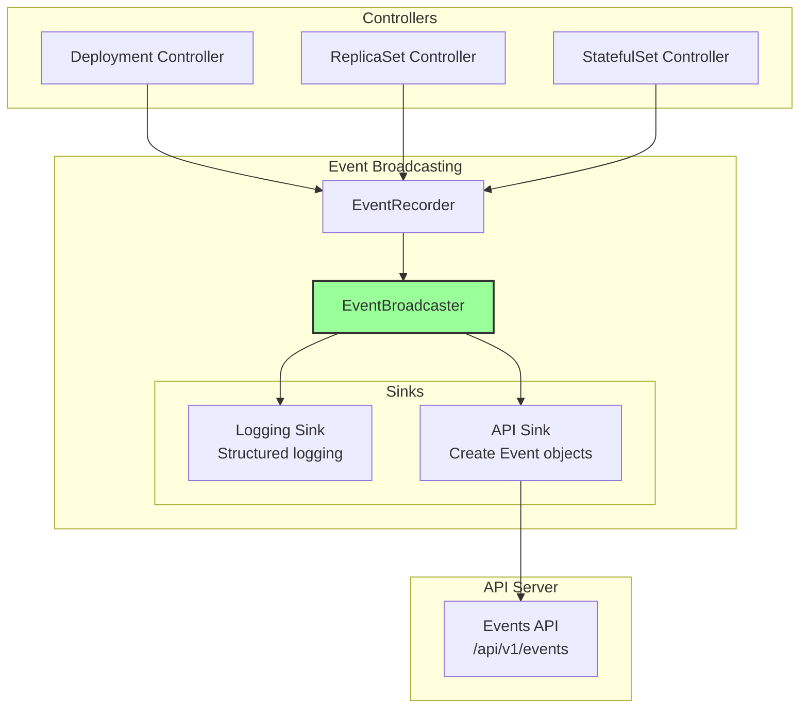

### 5.2 Event Creation

**Setup**:
```go
// Create broadcaster
eventBroadcaster := record.NewBroadcaster()

// Start logging (logs 3 most recent events)
eventBroadcaster.StartStructuredLogging(3)

// Start recording to API server
eventBroadcaster.StartRecordingToSink(&v1core.EventSinkImpl{
    Interface: client.CoreV1().Events(""),
})

// Create recorder for this controller
eventRecorder := eventBroadcaster.NewRecorder(
    scheme.Scheme,
    v1.EventSource{Component: "deployment-controller"},
)
```

**Recording Events**:
```go
// Normal event
eventRecorder.Event(
    deployment,                        // Object
    v1.EventTypeNormal,                // Type
    "ScalingReplicaSet",               // Reason
    "Scaled up replica set nginx-5d to 3",  // Message
)

// Warning event
eventRecorder.Event(
    deployment,
    v1.EventTypeWarning,
    "FailedCreate",
    fmt.Sprintf("Error creating: %v", err),
)

// Event with annotations
eventRecorder.AnnotatedEventf(
    deployment,
    map[string]string{"reason": "user-requested"},
    v1.EventTypeNormal,
    "ScalingReplicaSet",
    "Scaled from %d to %d",
    oldReplicas, newReplicas,
)
```

### 5.3 Event Aggregation

**Problem**: Avoid creating duplicate events

**Solution**: Event aggregation
```go
// Similar events within time window are aggregated
Event 1: "Failed to create pod" (count: 1)
Event 2: "Failed to create pod" (count: 1)  // Within 10 minutes
Event 3: "Failed to create pod" (count: 1)  // Within 10 minutes

// Results in single event:
Event: "Failed to create pod" (count: 3)
       firstTimestamp: <Event 1 time>
       lastTimestamp: <Event 3 time>
```

---

## 6. REST Mapper & Discovery

### 6.1 Deferred Discovery REST Mapper

**Purpose**: Maps resource types to API groups without blocking on discovery.

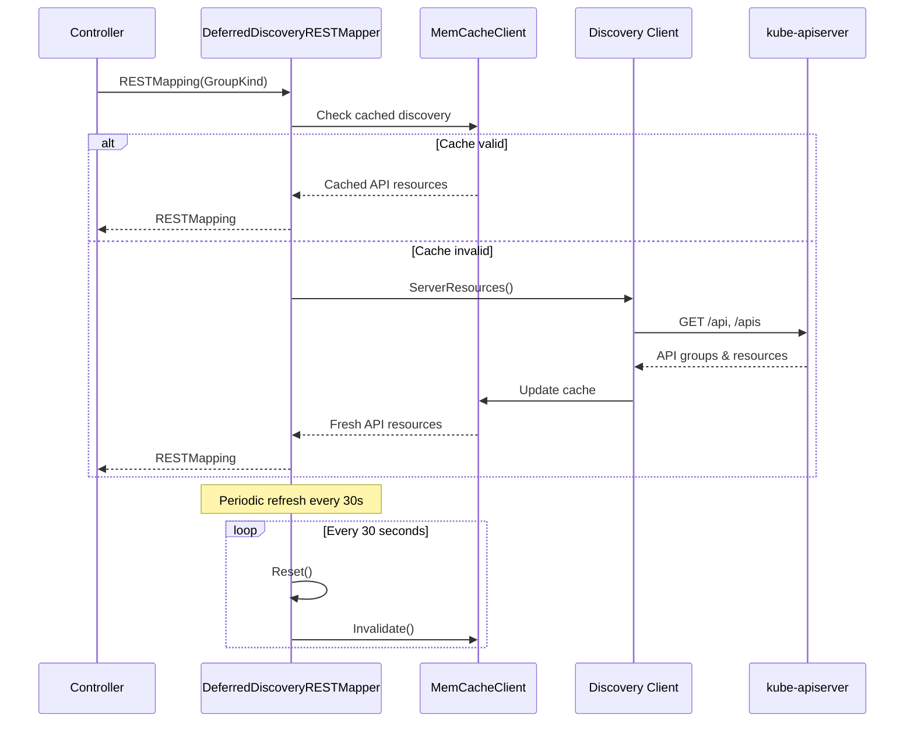

**Usage**:
```go
// Create cached discovery client
cachedClient := cacheddiscovery.NewMemCacheClient(discoveryClient)

// Create REST mapper with caching
restMapper := restmapper.NewDeferredDiscoveryRESTMapper(cachedClient)

// Periodic refresh to discover new CRDs
go wait.Until(func() {
    restMapper.Reset()
}, 30*time.Second, ctx.Done())

// Use mapper
mapping, err := restMapper.RESTMapping(
    schema.GroupKind{Group: "apps", Kind: "Deployment"},
    "v1",
)
// mapping.Resource = "deployments"
// mapping.GroupVersionKind = apps/v1, Kind=Deployment
```

### 6.2 Discovery Caching Benefits

```
Without caching (per request):
- 50 controllers × 10 mappings/controller = 500 discovery calls
- Each discovery call = ~100ms
- Total: 50 seconds of discovery time

With caching:
- Initial discovery: ~100ms
- Subsequent lookups: <1ms from memory
- Refresh: Every 30s in background
- Total impact: negligible
```

---

## 7. Metadata-Only Informers

### 7.1 Purpose

**Problem**: Full object informers consume too much memory for generic controllers (e.g., GarbageCollector).

**Solution**: Metadata-only informers that only cache object metadata.

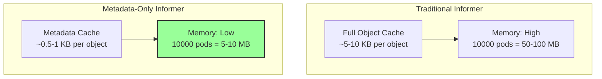

### 7.2 Metadata Structure

**PartialObjectMetadata**:
```go
type PartialObjectMetadata struct {
    TypeMeta   `json:",inline"`
    ObjectMeta `json:"metadata,omitempty"`
}

// Contains only:
// - Name, Namespace, UID
// - Labels, Annotations
// - OwnerReferences
// - ResourceVersion
// - DeletionTimestamp
// - Finalizers
//
// Does NOT contain:
// - Spec
// - Status
```

### 7.3 Usage Example

```go
// Create metadata informer factory
metadataClient, err := metadata.NewForConfig(config)
metadataInformers := metadatainformer.NewSharedInformerFactory(
    metadataClient,
    resyncPeriod,
)

// Use for generic operations
podInformer := metadataInformers.ForResource(
    schema.GroupVersionResource{
        Group:    "",
        Version:  "v1",
        Resource: "pods",
    },
)

// Handler receives PartialObjectMetadata
podInformer.Informer().AddEventHandler(cache.ResourceEventHandlerFuncs{
    AddFunc: func(obj interface{}) {
        metaObj := obj.(*metav1.PartialObjectMetadata)
        // Can access: metaObj.Name, metaObj.OwnerReferences, etc.
        // Cannot access: spec, status
    },
})
```

---

## 8. GraphBuilder (GarbageCollector)

### 8.1 Dependency Graph Structure

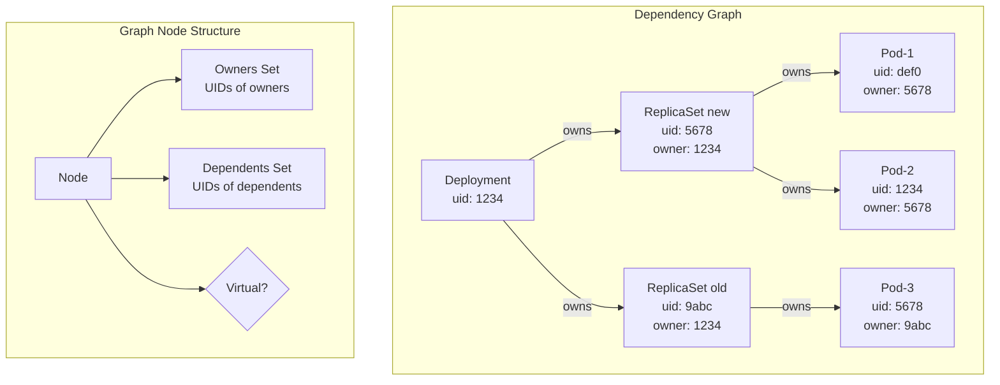

### 8.2 GraphBuilder Monitors

```go
// GraphBuilder creates monitors for each resource type
type GraphBuilder struct {
    monitors map[schema.GroupVersionResource]*monitor
    // ...
}

type monitor struct {
    store *concurrentUIDStore  // UID -> node mapping
    controller cache.Controller // Informer controller
}

// When resource deleted, GraphBuilder:
// 1. Finds node in graph
// 2. Checks dependents
// 3. Queues dependents for deletion (if not orphan mode)
```

### 8.3 Garbage Collection Flow

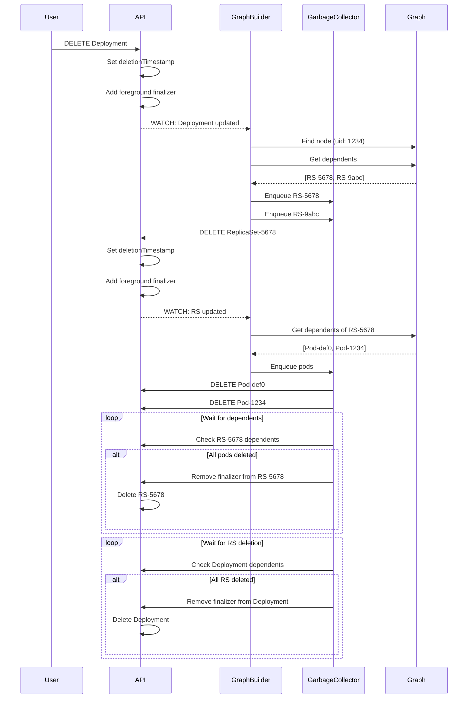

---

## 9. Performance Optimizations

### 9.1 Memory Optimizations

| Technique | Memory Saved | Use Case |
|-----------|--------------|----------|
| Transform func (trim ManagedFields) | 30-50% | All informers |
| Metadata-only informers | 80-90% | GarbageCollector, generic controllers |
| Selector filtering | 50-90% | Namespace-scoped controllers |
| Resource-specific informers | Variable | Single-namespace controllers |

### 9.2 CPU Optimizations

| Technique | Benefit | Implementation |
|-----------|---------|----------------|
| Work queue deduplication | Avoid redundant reconciliations | Automatic in work queue |
| Parallel workers | Process multiple items concurrently | Configurable per controller |
| Rate limiting | Prevent API server overload | Exponential backoff |
| Batch updates | Reduce API calls | Event batching in endpoints controller |

### 9.3 Network Optimizations

| Technique | Benefit |
|-----------|---------|
| Shared informers | 1 watch per resource type vs N watches |
| Local cache reads | 0 API calls for cached data |
| Watch bookmarks | Efficient watch resume after disconnect |
| Compression | Reduced bandwidth (disabled by default in controller-manager) |

---

## 10. Configuration & Tuning

### 10.1 Informer Configuration

```yaml
# Resync period (default: 12h)
--min-resync-period=12h0m0s

# Affects how often cache is fully resynced
# Actual resync per informer: min-resync-period * random(1.0, 2.0)
```

### 10.2 Work Queue Configuration

```go
// Per-controller concurrency
--concurrent-deployment-syncs=5      // 5 workers
--concurrent-replicaset-syncs=5
--concurrent-statefulset-syncs=5
--concurrent-daemonset-syncs=2       // DaemonSet uses less

// Rate limits (built into queue, not configurable)
// Exponential backoff: 5ms to 1000s
// Overall rate: 10 QPS, burst 100
```

### 10.3 Client Configuration

```go
// From kubeconfig/flags
--kube-api-qps=20               // Queries per second
--kube-api-burst=30             // Burst allowance

// Specific controllers may multiply this
// e.g., GC uses 2x QPS for delete operations
```

---

## Related Documentation

- **High-Level Architecture**: `05-high-level-architecture.md`
- **Initialization Flow**: `06-initialization-lifecycle.md`
- **Controller Patterns**: `16-controller-patterns.md`
- **Concurrency**: `18-concurrency-synchronization.md`

---

## Revision History

| Version | Date | Author | Changes |
|---------|------|--------|---------|
| 1.0 | 2025-10-22 | Architecture Analysis | Initial shared infrastructure documentation |
