# Workload Controllers - Mid-Level Architecture

**Document Version:** 1.0
**Last Updated:** 2025-10-22
**Status:** Complete

---

## Table of Contents
1. [Introduction](#introduction)
2. [Overview of Workload Controllers](#overview-of-workload-controllers)
3. [Deployment Controller](#deployment-controller)
4. [ReplicaSet Controller](#replicaset-controller)
5. [StatefulSet Controller](#statefulset-controller)
6. [DaemonSet Controller](#daemonset-controller)
7. [Job Controller](#job-controller)
8. [CronJob Controller](#cronjob-controller)
9. [ReplicationController](#replicationcontroller)
10. [Inter-Controller Relationships](#inter-controller-relationships)
11. [Common Patterns and Behaviors](#common-patterns-and-behaviors)
12. [Performance and Scalability](#performance-and-scalability)

---

## Introduction

Workload controllers are the core of Kubernetes' declarative pod management system. They implement the control loop pattern to ensure the desired state of workload resources matches their actual state in the cluster.

This document provides mid-level architecture details for all seven workload controllers:
- **Deployment**: Declarative rolling updates for stateless applications
- **ReplicaSet**: Maintains a stable set of replica pods
- **StatefulSet**: Manages stateful applications with stable identities
- **DaemonSet**: Ensures pods run on all (or some) nodes
- **Job**: Runs pods to completion
- **CronJob**: Schedules jobs based on cron expressions
- **ReplicationController**: Legacy controller (superseded by ReplicaSet)

**Key Concepts:**
- **Reconciliation Loop**: Compare desired state vs. actual state → take corrective action
- **Expectations**: Prevent duplicate creates/deletes
- **Adoption/Release**: Manage orphaned/mismatched pods
- **Slow Start**: Exponential batching to avoid quota waste

**Source Files:**
- **Deployment**: `pkg/controller/deployment/deployment_controller.go`
- **ReplicaSet**: `pkg/controller/replicaset/replica_set.go`
- **StatefulSet**: `pkg/controller/statefulset/stateful_set.go`
- **DaemonSet**: `pkg/controller/daemon/daemon_controller.go`
- **Job**: `pkg/controller/job/job_controller.go`
- **CronJob**: `pkg/controller/cronjob/cronjob_controllerv2.go`
- **Registration**: `cmd/kube-controller-manager/app/apps.go`, `app/batch.go`

---

## Overview of Workload Controllers

### Controller Hierarchy

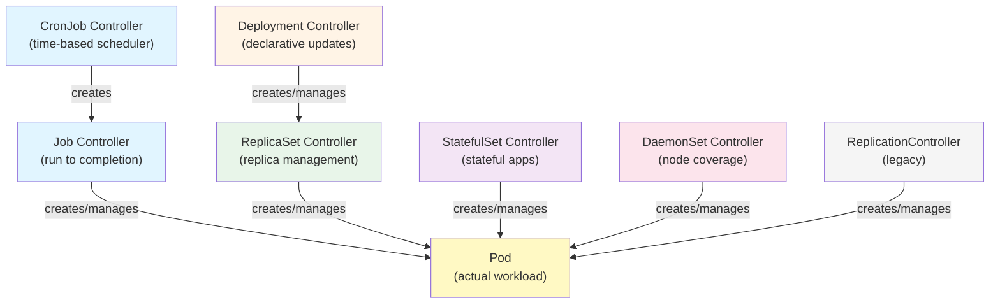

### Registration and Configuration

**Location:** `cmd/kube-controller-manager/app/apps.go`, `app/batch.go`

All workload controllers follow the same registration pattern:

```go
// Example: Deployment Controller Registration
func newDeploymentControllerDescriptor() *ControllerDescriptor {
    return &ControllerDescriptor{
        name:        names.DeploymentController,  // "deployment-controller"
        aliases:     []string{"deployment"},
        constructor: newDeploymentController,
    }
}

func newDeploymentController(
    ctx context.Context,
    controllerContext ControllerContext,
    controllerName string,
) (Controller, error) {
    // 1. Create client with service account credentials
    client, err := controllerContext.NewClient("deployment-controller")
    if err != nil {
        return nil, err
    }

    // 2. Create controller with informers from shared factory
    dc, err := deployment.NewDeploymentController(
        ctx,
        controllerContext.InformerFactory.Apps().V1().Deployments(),
        controllerContext.InformerFactory.Apps().V1().ReplicaSets(),
        controllerContext.InformerFactory.Core().V1().Pods(),
        client,
    )
    if err != nil {
        return nil, fmt.Errorf("error creating Deployment controller: %w", err)
    }

    // 3. Return controller loop wrapper
    return newControllerLoop(func(ctx context.Context) {
        dc.Run(ctx, int(controllerContext.ComponentConfig.DeploymentController.ConcurrentDeploymentSyncs))
    }, controllerName), nil
}
```

### Default Concurrency Settings

| Controller | Default Workers | Configurable Via |
|------------|-----------------|------------------|
| Deployment | 5 | `--concurrent-deployment-syncs` |
| ReplicaSet | 5 | `--concurrent-replicaset-syncs` |
| StatefulSet | 5 | `--concurrent-statefulset-syncs` |
| DaemonSet | 2 | `--concurrent-daemonset-syncs` |
| Job | 5 | `--concurrent-job-syncs` |
| CronJob | 5 | `--concurrent-cron-job-syncs` |
| ReplicationController | 5 | `--concurrent-rc-syncs` |

---

## Deployment Controller

### Overview

**Purpose:** Provides declarative updates for Pods and ReplicaSets. Enables rolling updates, rollbacks, and canary deployments.

**Location:** `pkg/controller/deployment/deployment_controller.go:66`

**Key Responsibilities:**
1. Create/update ReplicaSets based on deployment spec
2. Implement rolling update strategy (RollingUpdate or Recreate)
3. Track rollout progress and status
4. Handle rollback to previous revisions
5. Scale ReplicaSets according to replica count
6. Clean up old ReplicaSets (keep revision history)

### Data Structure

```go
type DeploymentController struct {
    // ┌─────────────────────────────────────────────────────────────┐
    // │ CONTROL INTERFACES                                            │
    // └─────────────────────────────────────────────────────────────┘
    rsControl controller.RSControlInterface  // Create/update/delete ReplicaSets
    client    clientset.Interface

    // ┌─────────────────────────────────────────────────────────────┐
    // │ EVENT RECORDING                                               │
    // └─────────────────────────────────────────────────────────────┘
    eventBroadcaster record.EventBroadcaster
    eventRecorder    record.EventRecorder

    // ┌─────────────────────────────────────────────────────────────┐
    // │ SYNC HANDLER                                                  │
    // └─────────────────────────────────────────────────────────────┘
    syncHandler func(ctx context.Context, dKey string) error

    // ┌─────────────────────────────────────────────────────────────┐
    // │ LISTERS (local caches)                                        │
    // └─────────────────────────────────────────────────────────────┘
    dLister  appslisters.DeploymentLister  // List/Get Deployments
    rsLister appslisters.ReplicaSetLister  // List/Get ReplicaSets
    podLister corelisters.PodLister        // List/Get Pods

    // ┌─────────────────────────────────────────────────────────────┐
    // │ SYNC STATUS                                                   │
    // └─────────────────────────────────────────────────────────────┘
    dListerSynced  cache.InformerSynced
    rsListerSynced cache.InformerSynced
    podListerSynced cache.InformerSynced

    // ┌─────────────────────────────────────────────────────────────┐
    // │ WORK QUEUE                                                    │
    // └─────────────────────────────────────────────────────────────┘
    queue workqueue.TypedRateLimitingInterface[string]
}
```

### Watched Resources

1. **Deployments** (primary resource)
   - Add: Enqueue for reconciliation
   - Update: Enqueue if spec or status changed
   - Delete: Enqueue for cleanup (will no-op when not found)

2. **ReplicaSets** (managed resources)
   - Add: Enqueue owning deployment
   - Update: Enqueue owning deployment if replica count changed
   - Delete: Enqueue owning deployment for adoption/release

3. **Pods** (transitive observation)
   - Delete only: Check if pod belongs to deployment's ReplicaSet → enqueue deployment

### Reconciliation Logic

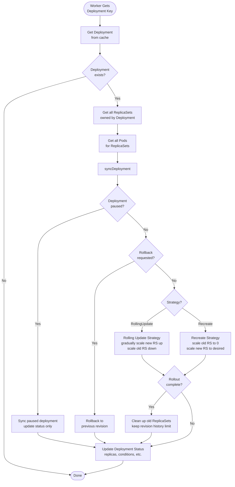

### Rolling Update Algorithm

**Location:** `pkg/controller/deployment/rolling_update.go`

**Key Parameters:**
- **MaxUnavailable**: Maximum number of pods that can be unavailable during update
- **MaxSurge**: Maximum number of pods that can be created above desired count

**Algorithm:**

```
Given:
- desired = deployment.spec.replicas
- maxUnavailable = deployment.spec.strategy.rollingUpdate.maxUnavailable
- maxSurge = deployment.spec.strategy.rollingUpdate.maxSurge

Step 1: Calculate boundaries
  minAvailable = desired - maxUnavailable
  maxTotal = desired + maxSurge

Step 2: Scale new ReplicaSet
  newRSReplicas = min(
    desired,                          // Don't exceed desired
    maxTotal - oldRSReplicas,         // Respect maxSurge
    newRSReadyReplicas + maxSurge     // Gradual increase
  )

Step 3: Scale old ReplicaSets
  For each old RS:
    oldRSReplicas = max(
      0,                                    // Don't go negative
      oldRSReplicas - (readyReplicas - minAvailable)  // Respect maxUnavailable
    )

Step 4: Repeat until:
  - newRSReplicas == desired
  - All old ReplicaSets scaled to 0
```

**Example:**

```
Deployment: nginx, replicas=10, maxUnavailable=2, maxSurge=2

Initial:
  old-rs: 10 pods (10 ready)
  new-rs: 0 pods

Iteration 1:
  maxTotal = 10 + 2 = 12
  minAvailable = 10 - 2 = 8
  new-rs: scale to 2 (respecting maxSurge)
  old-rs: keep 10 (can't scale down until new pods ready)

Iteration 2 (new pods ready):
  new-rs: 2 ready
  old-rs: scale to 8 (10 - 2 = 8, respecting minAvailable of 8)

Iteration 3:
  new-rs: scale to 4 (total 12 would exceed maxTotal, wait)

Iteration 4 (old pods terminating):
  old-rs: 6 running
  new-rs: scale to 6 (total 12, within maxTotal)

... continue until new-rs: 10, old-rs: 0
```

### Revision Management

**ControllerRevisions** are created for each Deployment revision:

```yaml
apiVersion: apps/v1
kind: ControllerRevision
metadata:
  name: nginx-deployment-6c54bd5869
  namespace: default
  ownerReferences:
  - apiVersion: apps/v1
    kind: Deployment
    name: nginx-deployment
    uid: <deployment-uid>
revision: 3
data:
  spec:
    template: <pod-template-spec>
    replicas: 10
```

**Cleanup:**
- Keep `spec.revisionHistoryLimit` most recent revisions (default: 10)
- Delete older ReplicaSets (scale to 0 first)

### State Machine

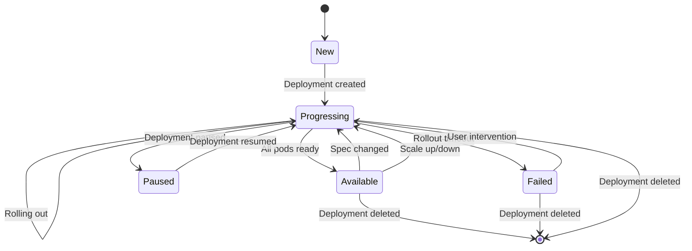

**Conditions:**
- **Progressing**: Deployment is rolling out
- **Available**: Minimum number of pods are ready
- **ReplicaFailure**: ReplicaSet cannot create pods

---

## ReplicaSet Controller

### Overview

**Purpose:** Ensures a stable set of replica Pods are running at any given time.

**Location:** `pkg/controller/replicaset/replica_set.go:83`

**Key Responsibilities:**
1. Maintain desired number of pod replicas
2. Create pods when count is too low
3. Delete pods when count is too high
4. Adopt orphaned pods matching selector
5. Release pods with mismatched labels
6. Track pod expectations to prevent duplicate creates

**Note:** The same code implements both ReplicaSet and ReplicationController (RC). RC objects are converted on the way in/out as if RC were just an older API version of RS.

### Data Structure

```go
type ReplicaSetController struct {
    // GroupVersionKind indicates the controller type
    // (ReplicaSet vs ReplicationController)
    schema.GroupVersionKind

    kubeClient clientset.Interface
    podControl controller.PodControlInterface

    // podIndexer allows looking up pods by ControllerRef UID
    podIndexer       cache.Indexer
    eventBroadcaster record.EventBroadcaster

    // burstReplicas: ReplicaSet is temporarily suspended after
    // creating/deleting this many replicas
    burstReplicas int  // Default: 500

    // syncHandler is the main reconciliation function
    syncHandler func(ctx context.Context, rsKey string) error

    // ┌─────────────────────────────────────────────────────────────┐
    // │ EXPECTATIONS - Prevent duplicate creates/deletes             │
    // └─────────────────────────────────────────────────────────────┘
    expectations *controller.UIDTrackingControllerExpectations

    // ┌─────────────────────────────────────────────────────────────┐
    // │ LISTERS                                                       │
    // └─────────────────────────────────────────────────────────────┘
    rsLister  appslisters.ReplicaSetLister
    rsIndexer cache.Indexer
    podLister corelisters.PodLister

    // ┌─────────────────────────────────────────────────────────────┐
    // │ SYNC STATUS                                                   │
    // └─────────────────────────────────────────────────────────────┘
    rsListerSynced  cache.InformerSynced
    podListerSynced cache.InformerSynced

    // ┌─────────────────────────────────────────────────────────────┐
    // │ WORK QUEUE                                                    │
    // └─────────────────────────────────────────────────────────────┘
    queue workqueue.TypedRateLimitingInterface[string]

    clock clock.PassiveClock

    // Controller specific features
    controllerFeatures ReplicaSetControllerFeatures
}
```

### Watched Resources

1. **ReplicaSets** (primary)
   - Add/Update/Delete: Enqueue for reconciliation

2. **Pods** (managed resources)
   - Add: Check if orphan → enqueue matching ReplicaSets
   - Update: Enqueue owning ReplicaSet if labels/deletion changed
   - Delete: Decrement expectations, enqueue owning ReplicaSet

### Reconciliation Logic

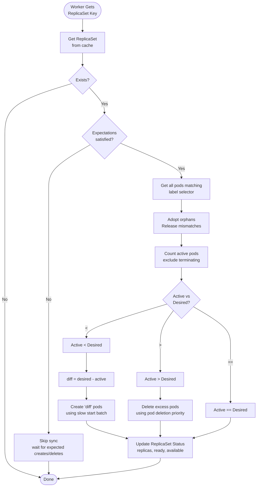

### Pod Creation - Slow Start Batch

**Purpose:** Avoid wasting quota when creating many pods at once.

**Algorithm:**

```go
const SlowStartInitialBatchSize = 1

// Create pods in exponentially growing batches: 1, 2, 4, 8, 16, ...
func slowStartBatch(count int, initialBatchSize int, fn func() error) (int, error) {
    remaining := count
    successes := 0
    batchSize := initialBatchSize

    for batchSize < remaining {
        errCh := make(chan error, batchSize)

        // Create batchSize pods in parallel
        for i := 0; i < batchSize; i++ {
            go func() {
                errCh <- fn()
            }()
        }

        // Collect results
        for i := 0; i < batchSize; i++ {
            err := <-errCh
            if err == nil {
                successes++
                remaining--
            } else if !errors.IsTimeout(err) {
                return successes, err  // Fail fast on non-timeout errors
            }
        }

        // Double batch size for next iteration
        batchSize *= 2
    }

    // Create remaining pods
    // ... (similar logic for remaining pods)

    return successes, nil
}
```

**Example:**

```
Need to create 50 pods:

Batch 1: Create 1 pod
  - Success → remaining = 49

Batch 2: Create 2 pods
  - Success → remaining = 47

Batch 3: Create 4 pods
  - Success → remaining = 43

Batch 4: Create 8 pods
  - Success → remaining = 35

Batch 5: Create 16 pods
  - Success → remaining = 19

Batch 6: Create 19 pods (remaining)
  - Success → remaining = 0

Total: 6 API call rounds instead of 50
```

### Pod Deletion Priority

**Location:** `pkg/controller/controller_utils.go`

When deleting excess pods, ReplicaSet uses this priority order:

```go
Priority (delete first):
1. Unscheduled pods (pod.Spec.NodeName == "")
2. Pods on unschedulable nodes
3. Pods not yet ready
4. Pods with lower deletion cost annotation
5. Pods with more RestartCount
6. Pods created more recently
7. Pods with higher pod name (lexicographic)
```

**Deletion Cost:**

```yaml
apiVersion: v1
kind: Pod
metadata:
  annotations:
    controller.kubernetes.io/pod-deletion-cost: "100"  # Higher = keep longer
```

### UID Tracking Expectations

**Purpose:** Track expected pod UIDs (not just counts) to handle more complex scenarios.

```go
type UIDTrackingControllerExpectations struct {
    ControllerExpectationsInterface  // Embedded standard expectations

    uidStoreLock sync.Mutex
    uidStore cache.Store  // Key: RS key, Value: *UIDSet
}

type UIDSet struct {
    String sets.String  // Set of pod UIDs
    key    string
}
```

**Usage:**

```go
// Before creating pods:
rsKey := "namespace/replicaset-name"
expectations.ExpectCreations(rsKey, 5)
newPodUIDs := []string{"uid1", "uid2", "uid3", "uid4", "uid5"}
expectations.ExpectCreationsWithUIDs(rsKey, newPodUIDs)

// Create pods...

// Pod informer sees pod added:
expectations.CreationObserved(rsKey, podUID)

// Check if satisfied:
if expectations.SatisfiedExpectations(rsKey) {
    // All expected pods observed
}
```

---

## StatefulSet Controller

### Overview

**Purpose:** Manages deployment and scaling of a set of Pods with stable, unique identities and persistent storage.

**Location:** `pkg/controller/statefulset/stateful_set.go:56`

**Key Responsibilities:**
1. Maintain stable pod identities (ordinal-based naming)
2. Create/delete pods in order (0 to N-1 for scale up, N-1 to 0 for scale down)
3. Ensure PersistentVolumeClaims are created per pod
4. Support OrderedReady and Parallel pod management policies
5. Track revision history using ControllerRevisions
6. Implement rolling updates with partition support

### Data Structure

```go
type StatefulSetController struct {
    kubeClient clientset.Interface

    // control returns an interface capable of syncing a stateful set
    control StatefulSetControlInterface

    // podControl is used for patching pods
    podControl controller.PodControlInterface

    // podIndexer allows looking up pods by ControllerRef UID
    podIndexer cache.Indexer

    // ┌─────────────────────────────────────────────────────────────┐
    // │ LISTERS                                                       │
    // └─────────────────────────────────────────────────────────────┘
    podLister corelisters.PodLister
    setLister appslisters.StatefulSetLister
    // Note: Also watches PVCs and ControllerRevisions

    // ┌─────────────────────────────────────────────────────────────┐
    // │ SYNC STATUS                                                   │
    // └─────────────────────────────────────────────────────────────┘
    podListerSynced cache.InformerSynced
    setListerSynced cache.InformerSynced
    pvcListerSynced cache.InformerSynced
    revListerSynced cache.InformerSynced

    // ┌─────────────────────────────────────────────────────────────┐
    // │ WORK QUEUE                                                    │
    // └─────────────────────────────────────────────────────────────┘
    queue workqueue.TypedRateLimitingInterface[string]

    eventBroadcaster record.EventBroadcaster
}
```

### Unique Features

**1. Ordinal-Based Naming:**

```
StatefulSet: web
Replicas: 3

Pods created:
  - web-0 (ordinal 0)
  - web-1 (ordinal 1)
  - web-2 (ordinal 2)

PVCs created (if volumeClaimTemplates specified):
  - data-web-0
  - data-web-1
  - data-web-2
```

**2. Ordered Operations:**

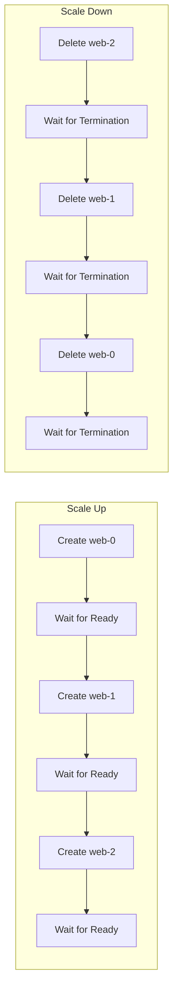

**3. Pod Management Policies:**

| Policy | Behavior | Use Case |
|--------|----------|----------|
| **OrderedReady** (default) | Create/delete pods one at a time, waiting for each to be ready | Databases, consensus systems |
| **Parallel** | Create/delete all pods simultaneously | Stateless-like workloads with stable identity needs |

**4. Rolling Update with Partition:**

```yaml
apiVersion: apps/v1
kind: StatefulSet
metadata:
  name: web
spec:
  replicas: 5
  updateStrategy:
    type: RollingUpdate
    rollingUpdate:
      partition: 3  # Only update pods >= ordinal 3
```

**Behavior:**

```
Initial state:
  web-0: image:v1
  web-1: image:v1
  web-2: image:v1
  web-3: image:v1
  web-4: image:v1

After updating spec.template to image:v2 with partition:3:
  web-0: image:v1  (below partition, not updated)
  web-1: image:v1  (below partition, not updated)
  web-2: image:v1  (below partition, not updated)
  web-3: image:v2  (>= partition, updated)
  web-4: image:v2  (>= partition, updated)

Allows canary deployments and gradual rollouts.
```

### Reconciliation Logic

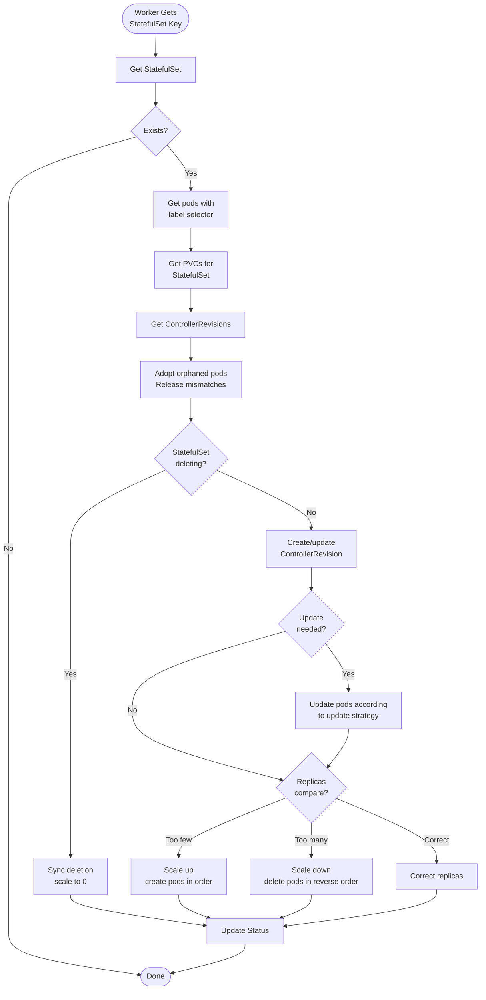

### Status Fields

```yaml
status:
  replicas: 3              # Total replicas
  readyReplicas: 3         # Ready replicas
  currentReplicas: 2       # Replicas with current revision
  updatedReplicas: 1       # Replicas with updated revision
  currentRevision: web-6c54bd5869   # Current revision
  updateRevision: web-7d8f9c4b2a    # Target revision during update
  collisionCount: 0        # Hash collision count
  observedGeneration: 5    # Last observed generation
  conditions:
  - type: Available
    status: "True"
```

---

## DaemonSet Controller

### Overview

**Purpose:** Ensures that all (or some) nodes run a copy of a Pod. Typically used for cluster-wide services like log collection, monitoring, or networking.

**Location:** `pkg/controller/daemon/daemon_controller.go:84`

**Key Responsibilities:**
1. Ensure one pod per matching node
2. Create pods on new nodes
3. Delete pods from removed nodes
4. Support node selectors and taints/tolerations
5. Implement rolling update strategy
6. Handle node scheduling constraints

### Data Structure

```go
type DaemonSetsController struct {
    kubeClient clientset.Interface

    eventBroadcaster record.EventBroadcaster
    eventRecorder    record.EventRecorder

    podControl controller.PodControlInterface
    crControl  controller.ControllerRevisionControlInterface

    // burstReplicas: Temporarily suspend after creating/deleting this many
    burstReplicas int  // Default: 250

    syncHandler func(ctx context.Context, dsKey string) error

    // ┌─────────────────────────────────────────────────────────────┐
    // │ EXPECTATIONS                                                  │
    // └─────────────────────────────────────────────────────────────┘
    expectations controller.ControllerExpectationsInterface

    // ┌─────────────────────────────────────────────────────────────┐
    // │ LISTERS                                                       │
    // └─────────────────────────────────────────────────────────────┘
    dsLister      appslisters.DaemonSetLister
    historyLister appslisters.ControllerRevisionLister
    podLister     corelisters.PodLister
    podIndexer    cache.Indexer
    nodeLister    corelisters.NodeLister

    // ┌─────────────────────────────────────────────────────────────┐
    // │ SYNC STATUS                                                   │
    // └─────────────────────────────────────────────────────────────┘
    dsStoreSynced      cache.InformerSynced
    historyStoreSynced cache.InformerSynced
    podStoreSynced     cache.InformerSynced
    nodeStoreSynced    cache.InformerSynced

    // ┌─────────────────────────────────────────────────────────────┐
    // │ WORK QUEUES                                                   │
    // └─────────────────────────────────────────────────────────────┘
    queue workqueue.TypedRateLimitingInterface[string]

    // nodeUpdateQueue processes node updates
    nodeUpdateQueue workqueue.TypedRateLimitingInterface[string]

    // Backoff for failed pod creates
    failedPodsBackoff *flowcontrol.Backoff
}
```

### Watched Resources

1. **DaemonSets** (primary)
2. **Pods** (managed resources)
3. **Nodes** (determines where pods should run)
4. **ControllerRevisions** (for rolling updates)

### Node Scheduling Logic

**Key Question:** Should a pod run on this node?

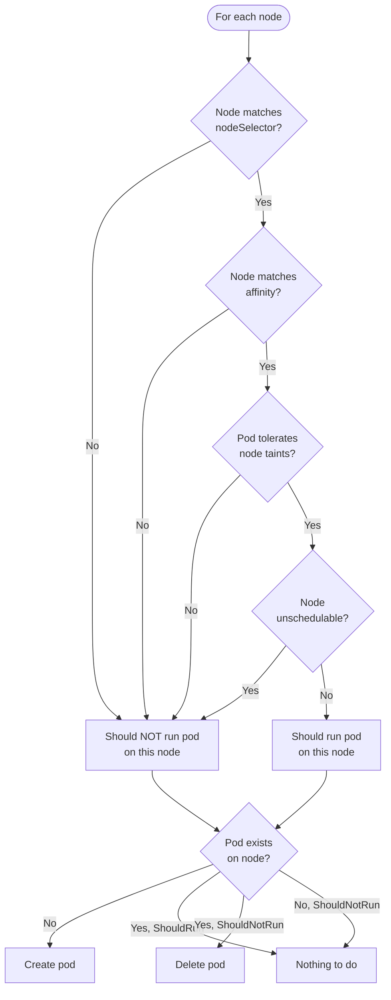

### Rolling Update Strategy

**OnDelete vs RollingUpdate:**

| Strategy | Behavior |
|----------|----------|
| **OnDelete** | Pods updated only when manually deleted |
| **RollingUpdate** | Automatically updates pods based on `maxUnavailable` |

**RollingUpdate Parameters:**

```yaml
updateStrategy:
  type: RollingUpdate
  rollingUpdate:
    maxUnavailable: 1  # Max pods unavailable during update (default: 1)
```

**Algorithm:**

```
1. Calculate how many pods can be unavailable:
   maxUnavailable = min(spec.updateStrategy.rollingUpdate.maxUnavailable, desired)

2. Count current unavailable pods:
   unavailable = desired - available

3. Determine how many old pods can be deleted:
   numToDelete = maxUnavailable - unavailable

4. Delete up to numToDelete old pods

5. Wait for new pods to become ready before deleting more
```

### Reconciliation Logic

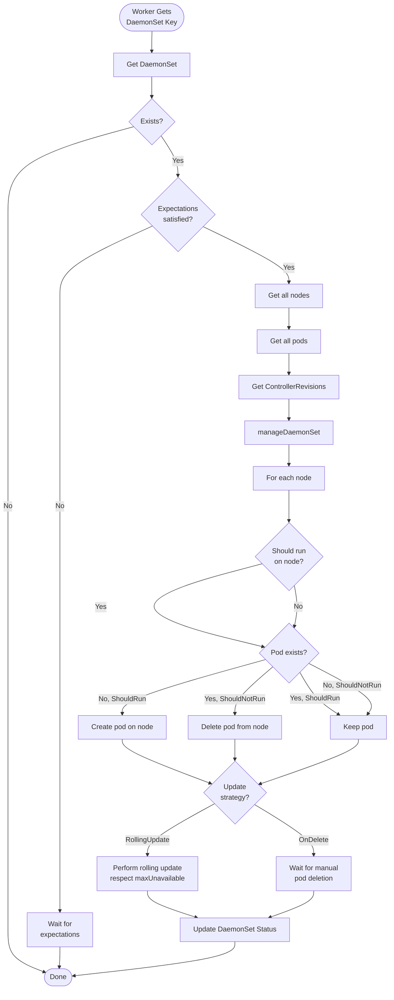

---

## Job Controller

### Overview

**Purpose:** Manages Jobs that run pods to completion. Ensures a specified number of successful pod completions.

**Location:** `pkg/controller/job/job_controller.go:83`

**Key Responsibilities:**
1. Create pods to achieve `spec.completions` successful completions
2. Track pod success/failure counts
3. Handle pod failures according to `spec.backoffLimit`
4. Support parallel execution (`spec.parallelism`)
5. Clean up finished jobs after TTL
6. Track pod finalizers for cleanup

### Data Structure

```go
type Controller struct {
    kubeClient clientset.Interface
    podControl controller.PodControlInterface

    // Injection points for testing
    updateStatusHandler func(ctx context.Context, job *batch.Job) (*batch.Job, error)
    patchJobHandler     func(ctx context.Context, job *batch.Job, patch []byte) error
    syncHandler         func(ctx context.Context, jobKey string) error

    // ┌─────────────────────────────────────────────────────────────┐
    // │ EXPECTATIONS                                                  │
    // └─────────────────────────────────────────────────────────────┘
    expectations controller.ControllerExpectationsInterface

    // finalizerExpectations tracks Pod UIDs for which the controller
    // expects to observe the tracking finalizer removed
    finalizerExpectations *uidTrackingExpectations

    // ┌─────────────────────────────────────────────────────────────┐
    // │ LISTERS                                                       │
    // └─────────────────────────────────────────────────────────────┘
    jobLister batchv1listers.JobLister
    podStore  corelisters.PodLister
    podIndexer cache.Indexer

    // ┌─────────────────────────────────────────────────────────────┐
    // │ SYNC STATUS                                                   │
    // └─────────────────────────────────────────────────────────────┘
    podStoreSynced cache.InformerSynced
    jobStoreSynced cache.InformerSynced

    // ┌─────────────────────────────────────────────────────────────┐
    // │ WORK QUEUES                                                   │
    // └─────────────────────────────────────────────────────────────┘
    queue workqueue.TypedRateLimitingInterface[string]

    // orphanQueue tracks orphan deleted pods with finalizers
    orphanQueue workqueue.TypedRateLimitingInterface[orphanPodKey]

    broadcaster record.EventBroadcaster
    recorder    record.EventRecorder

    clock clock.WithTicker

    // podBackoffStore tracks exponential backoff for pod recreation
    podBackoffStore *backoffStore

    // finishedJobExpectations contains job IDs for which status is finished
    // but corresponding event not yet received
    finishedJobExpectations sync.Map
}
```

### Job Modes

**1. Non-Indexed Jobs (default):**

```yaml
apiVersion: batch/v1
kind: Job
metadata:
  name: compute
spec:
  completions: 5    # Need 5 successful pod completions
  parallelism: 2    # Run 2 pods in parallel
```

**Behavior:**
- Create pods until `completions` successes achieved
- Run up to `parallelism` pods simultaneously
- Replace failed pods (up to `backoffLimit` failures)

**2. Indexed Jobs:**

```yaml
apiVersion: batch/v1
kind: Job
metadata:
  name: indexed-compute
spec:
  completions: 5
  parallelism: 2
  completionMode: Indexed
```

**Behavior:**
- Each pod assigned unique index (0 to completions-1)
- Environment variable `JOB_COMPLETION_INDEX` set in pod
- Track which indices have completed
- Useful for batch processing with explicit work partitioning

**3. Work Queue Pattern:**

```yaml
apiVersion: batch/v1
kind: Job
metadata:
  name: work-queue
spec:
  parallelism: 3
  # completions not specified - job completes when all pods succeed
```

**Behavior:**
- Run `parallelism` pods
- Job completes when all pods succeed
- Pods coordinate via external queue

### Backoff for Failed Pods

**Purpose:** Avoid rapid recreation of failing pods.

```go
// Default backoff: 10s, 20s, 40s, ... up to 10 minutes
DefaultJobPodFailureBackOff = 10 * time.Second
MaxJobPodFailureBackOff = 10 * time.Minute

backoffDuration = min(
    DefaultJobPodFailureBackOff * 2^(failures-1),
    MaxJobPodFailureBackOff
)
```

**Example:**

```
Pod fails:
  Failure 1: Wait 10s  (10 * 2^0)
  Failure 2: Wait 20s  (10 * 2^1)
  Failure 3: Wait 40s  (10 * 2^2)
  Failure 4: Wait 80s  (10 * 2^3)
  Failure 5: Wait 160s (10 * 2^4)
  Failure 6: Wait 320s (10 * 2^5)
  Failure 7: Wait 600s (10 * 2^6 = 640s, clamped to 600s max)
```

### Reconciliation Logic

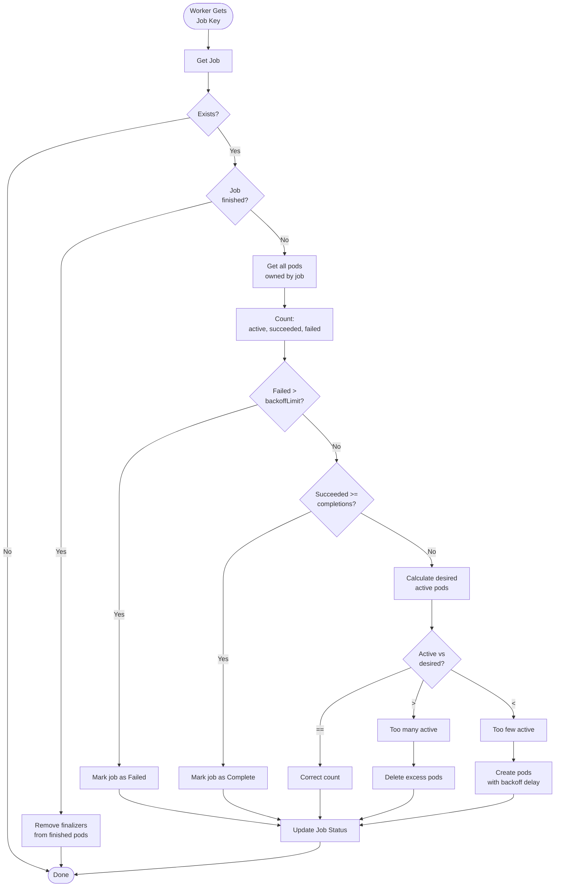

### Pod Finalizers

**Purpose:** Track pod cleanup for accurate status tracking.

```yaml
apiVersion: v1
kind: Pod
metadata:
  finalizers:
  - batch.kubernetes.io/job-tracking
```

**Lifecycle:**

1. Job controller creates pod with finalizer
2. Pod runs to completion (success or failure)
3. Job controller observes completion, updates status
4. Job controller removes finalizer
5. Pod is garbage collected

**Benefit:** Prevents race conditions where pod deletion is observed before success/failure status.

---

## CronJob Controller

### Overview

**Purpose:** Schedules Jobs based on cron expressions.

**Location:** `pkg/controller/cronjob/cronjob_controllerv2.go:61`

**Key Responsibilities:**
1. Parse cron schedule expressions
2. Create Jobs at scheduled times
3. Manage job history (successful and failed)
4. Handle concurrency policy (Allow, Forbid, Replace)
5. Track missed schedules and deadlines

### Data Structure

```go
type ControllerV2 struct {
    queue workqueue.TypedRateLimitingInterface[string]

    kubeClient  clientset.Interface
    recorder    record.EventRecorder
    broadcaster record.EventBroadcaster

    jobControl     jobControlInterface  // Create/delete Jobs
    cronJobControl cjControlInterface   // Update CronJob status

    // ┌─────────────────────────────────────────────────────────────┐
    // │ LISTERS                                                       │
    // └─────────────────────────────────────────────────────────────┘
    jobLister     batchv1listers.JobLister
    cronJobLister batchv1listers.CronJobLister

    // ┌─────────────────────────────────────────────────────────────┐
    // │ SYNC STATUS                                                   │
    // └─────────────────────────────────────────────────────────────┘
    jobListerSynced     cache.InformerSynced
    cronJobListerSynced cache.InformerSynced

    // now function (for testing)
    now func() time.Time
}
```

### Cron Schedule Parsing

**Supported Formats:**

```
Standard cron: minute hour day month weekday
  0 0 * * *       # Every day at midnight
  */5 * * * *     # Every 5 minutes
  0 0 1 * *       # First day of every month
  0 0 * * 0       # Every Sunday

Extended formats:
  @yearly         # 0 0 1 1 *
  @monthly        # 0 0 1 * *
  @weekly         # 0 0 * * 0
  @daily          # 0 0 * * *
  @hourly         # 0 * * * *
```

### Concurrency Policies

| Policy | Behavior | Use Case |
|--------|----------|----------|
| **Allow** (default) | Allow concurrent jobs | Independent tasks |
| **Forbid** | Skip new job if previous still running | Resource-constrained tasks |
| **Replace** | Cancel previous job, start new one | Latest data wins |

**Example:**

```yaml
apiVersion: batch/v1
kind: CronJob
metadata:
  name: backup
spec:
  schedule: "0 */6 * * *"  # Every 6 hours
  concurrencyPolicy: Forbid
  successfulJobsHistoryLimit: 3
  failedJobsHistoryLimit: 1
```

### Reconciliation Logic

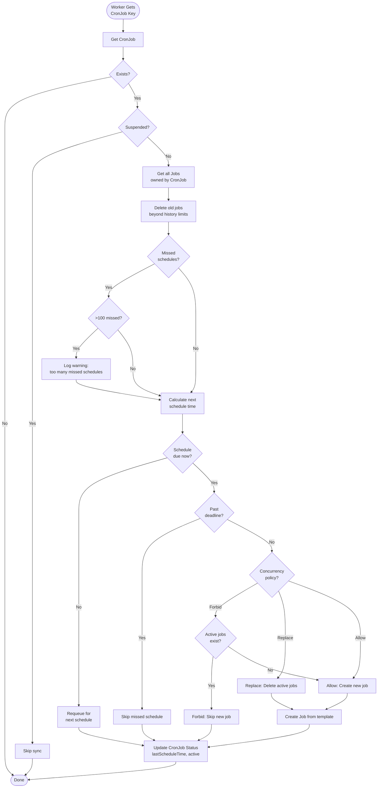

### Schedule Calculation

**Algorithm:**

```go
func getNextScheduleTime(
    cj *batchv1.CronJob,
    now time.Time,
    schedule cron.Schedule,
) (*time.Time, error) {
    // Start from lastScheduleTime or creation time
    earliestTime := cj.Status.LastScheduleTime
    if earliestTime == nil {
        earliestTime = &cj.CreationTimestamp
    }

    // Handle deadline
    if cj.Spec.StartingDeadlineSeconds != nil {
        deadline := time.Duration(*cj.Spec.StartingDeadlineSeconds) * time.Second
        schedulingDeadline := now.Add(-deadline)

        if earliestTime.Before(schedulingDeadline) {
            earliestTime = &metav1.Time{Time: schedulingDeadline}
        }
    }

    // Count missed schedules
    missedRuns := 0
    nextTime := schedule.Next(earliestTime.Time)

    for nextTime.Before(now) && missedRuns < 100 {
        missedRuns++
        nextTime = schedule.Next(nextTime)
    }

    if missedRuns >= 100 {
        // Too many missed schedules - log error
        return nil, fmt.Errorf("too many missed start times")
    }

    return &nextTime, nil
}
```

---

## ReplicationController

### Overview

**Purpose:** Legacy controller for maintaining pod replicas. **Superseded by ReplicaSet.**

**Location:** `pkg/controller/replicaset/replica_set.go` (shared implementation)

**Note:** ReplicationController uses the **exact same code** as ReplicaSet. The objects are converted on entry/exit:

```go
// RC objects are converted to RS format
func convertRCToRS(rc *v1.ReplicationController) *apps.ReplicaSet {
    // ... conversion logic
}

// RS results converted back to RC format
func convertRSToRC(rs *apps.ReplicaSet) *v1.ReplicationController {
    // ... conversion logic
}
```

**Key Differences from ReplicaSet:**

| Feature | ReplicationController | ReplicaSet |
|---------|----------------------|------------|
| API Group | `core/v1` | `apps/v1` |
| Selector | Equality-based only | Set-based support |
| Label Format | Simple key-value | Rich expressions |
| Managed By | Deprecated | Deployment |

**Recommendation:** Use Deployment (which creates ReplicaSets) instead of ReplicationController.

---

## Inter-Controller Relationships

### Dependency Graph

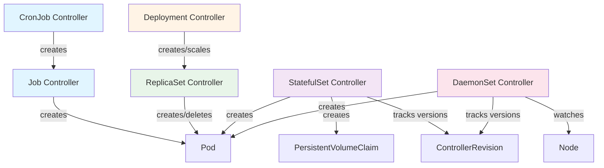

### Event Chains

**Example: Deployment Update Cascade**

```
User updates Deployment spec
  ↓
Deployment Controller:
  1. Creates new ReplicaSet (with new pod template)
  2. Scales new ReplicaSet up gradually
  3. Scales old ReplicaSet down gradually
  ↓
ReplicaSet Controller (new):
  1. Creates pods according to scale up
  2. Sets expectations to prevent duplicates
  3. Updates ReplicaSet status
  ↓
ReplicaSet Controller (old):
  1. Deletes pods according to scale down
  2. Updates ReplicaSet status
  ↓
Deployment Controller:
  1. Observes ReplicaSet status updates
  2. Continues rolling update
  3. Updates Deployment status
```

### Shared Components

All workload controllers share:

1. **Informer Factory**: Single shared cache for all resource types
2. **Client Builder**: Per-controller authentication
3. **Event Recorder**: Centralized event broadcasting
4. **Expectations Store**: Shared TTL cache (separate instances per controller)
5. **Work Queue Implementation**: Same rate-limiting logic

---

## Common Patterns and Behaviors

### 1. Reconciliation Loop

**Universal Pattern:**

```go
func (c *Controller) Run(ctx context.Context, workers int) {
    defer utilruntime.HandleCrash()
    defer c.queue.ShutDown()

    // Wait for caches to sync
    if !cache.WaitForNamedCacheSync(ctx, c.podListerSynced, ...) {
        return
    }

    // Start worker goroutines
    for i := 0; i < workers; i++ {
        go wait.UntilWithContext(ctx, c.worker, time.Second)
    }

    <-ctx.Done()
}

func (c *Controller) worker(ctx context.Context) {
    for c.processNextWorkItem(ctx) {
    }
}

func (c *Controller) processNextWorkItem(ctx context.Context) bool {
    key, shutdown := c.queue.Get()
    if shutdown {
        return false
    }
    defer c.queue.Done(key)

    err := c.syncHandler(ctx, key)
    if err == nil {
        c.queue.Forget(key)
        return true
    }

    // Requeue with rate limiting
    c.queue.AddRateLimited(key)
    return true
}
```

### 2. Expectations Pattern

**Prevent Duplicate Operations:**

```go
// Before creating pods:
rsKey := namespace + "/" + rsName
expectations.SetExpectations(rsKey, creates, 0)

// Create pods...

// On pod add event:
expectations.CreationObserved(rsKey)

// Before sync:
if !expectations.SatisfiedExpectations(rsKey) {
    // Skip sync - wait for expected creates to appear
    return
}
```

### 3. Adoption/Release Pattern

**Manage Orphans:**

```go
func (c *Controller) claimPods(rs *apps.ReplicaSet, pods []*v1.Pod) ([]*v1.Pod, error) {
    refManager := controller.NewPodControllerRefManager(
        c.podControl,
        rs,
        labels.Set(rs.Spec.Selector.MatchLabels).AsSelectorPreValidated(),
        controllerKind,
        canAdoptFunc,
    )

    return refManager.ClaimPods(ctx, pods)
}

// ClaimPods logic:
//  - Orphan + selector match → Adopt (set OwnerReference)
//  - Owned + selector mismatch → Release (remove OwnerReference)
//  - Owned + selector match → Keep
//  - Orphan + selector mismatch → Ignore
```

### 4. Status Update Pattern

**Two-Phase Update:**

```go
// Phase 1: Update resource state (create/delete pods)
err := c.manageReplicas(ctx, rs)

// Phase 2: Update status to reflect new state
status := calculateStatus(rs, pods)
_, updateErr := c.client.AppsV1().ReplicaSets(rs.Namespace).UpdateStatus(ctx, rs, metav1.UpdateOptions{})
```

**Retry Logic:**

```go
const statusUpdateRetries = 1

for i := 0; i <= statusUpdateRetries; i++ {
    // Get fresh copy
    rs, err := c.rsLister.ReplicaSets(namespace).Get(name)

    // Update status
    rs.Status = newStatus
    _, err = c.client.AppsV1().ReplicaSets(rs.Namespace).UpdateStatus(ctx, rs, metav1.UpdateOptions{})

    if err == nil {
        break
    }
}
```

---

## Performance and Scalability

### Throughput Characteristics

| Controller | Creates/sec | Deletes/sec | Notes |
|------------|-------------|-------------|-------|
| ReplicaSet | ~10-20 | ~10-20 | Limited by API server quota (20 QPS default) |
| Deployment | N/A | N/A | Delegates to ReplicaSet |
| StatefulSet | 1-2 | 1-2 | Sequential ordering limits throughput |
| DaemonSet | ~50-100 | ~50-100 | Parallel creates across nodes |
| Job | ~10-20 | ~10-20 | Backoff delays reduce rate |

### Memory Usage (per controller instance)

| Component | Small Cluster | Medium Cluster | Large Cluster |
|-----------|---------------|----------------|---------------|
| Controller Struct | ~1 KB | ~1 KB | ~1 KB |
| Work Queue | ~1-10 KB | ~10-100 KB | ~100 KB-1 MB |
| Expectations Store | ~10 KB | ~100 KB | ~1 MB |
| **Total per controller** | **~12-21 KB** | **~111-201 KB** | **~1.1-2 MB** |

**Note:** Informer caches are shared, not counted per-controller.

### Scalability Limits

**Tested Limits (per controller):**

| Resource | Recommended Max | Hard Limit | Bottleneck |
|----------|-----------------|------------|------------|
| Deployments | 5,000 | 10,000 | API server QPS |
| ReplicaSets | 10,000 | 20,000 | Work queue processing |
| Pods per ReplicaSet | 5,000 | 10,000 | Informer memory |
| StatefulSets | 1,000 | 5,000 | Sequential operations |
| DaemonSets | 100 | 500 | Node count dependent |
| Jobs | 10,000 | 50,000 | Pod churn rate |
| CronJobs | 1,000 | 5,000 | Schedule calculation |

### Optimization Techniques

**1. Concurrency Tuning:**

```bash
# Increase workers for high throughput
--concurrent-replicaset-syncs=10  # Default: 5

# Balance: More workers = higher throughput but more memory/CPU
```

**2. Rate Limiting:**

```go
// Default rate limiter: exponential backoff + bucket limiter
workqueue.DefaultTypedControllerRateLimiter[string]()

// Custom rate limiter for high-throughput scenarios
workqueue.NewTypedMaxOfRateLimiter(
    workqueue.NewTypedItemExponentialFailureRateLimiter[string](
        1*time.Millisecond,    // Faster base delay
        1000*time.Second,
    ),
    &workqueue.TypedBucketRateLimiter[string]{
        Limiter: rate.NewLimiter(rate.Limit(50), 200),  // 50 QPS, burst 200
    },
)
```

**3. Informer Resync Period:**

```go
// Longer resync = less API server load
const defaultResyncPeriod = 12 * time.Hour

// Jittered to prevent thundering herd
ResyncPeriod: func() time.Duration {
    factor := rand.Float64() + 1.96  // 1.96 to 2.96
    return time.Duration(float64(minResyncPeriod.Nanoseconds()) * factor)
}
```

---

## Summary

### Key Takeaways

1. **Hierarchy**: CronJob → Job → Pod, Deployment → ReplicaSet → Pod

2. **Common Patterns**: All controllers follow the same reconciliation loop, expectations, and adoption patterns

3. **Unique Features**:
   - Deployment: Rolling updates, rollback, canary
   - ReplicaSet: Replica management, slow start batching
   - StatefulSet: Stable identities, ordered operations
   - DaemonSet: Node coverage, node scheduling
   - Job: Run to completion, backoff, indexed jobs
   - CronJob: Time-based scheduling, concurrency policies

4. **Scalability**: Well-tested up to 10,000 resources per controller type

5. **Performance**: Tunable via concurrency, rate limiting, and resync periods

### Cross-References

- **[16-controller-patterns.md](16-controller-patterns.md)** - Implementation patterns
- **[20-data-structures.md](20-data-structures.md)** - Controller data structures
- **[07-shared-infrastructure.md](07-shared-infrastructure.md)** - Informers, queues, client builders
- **Detailed Specs**: Individual controller specs (to be created in Phase 5)

---

**Next Documents:**
- `09-node-controllers.md` - Node lifecycle, IPAM, taint eviction
- `17-detailed-controller-specs/deployment-controller.md` - Deep dive on Deployment