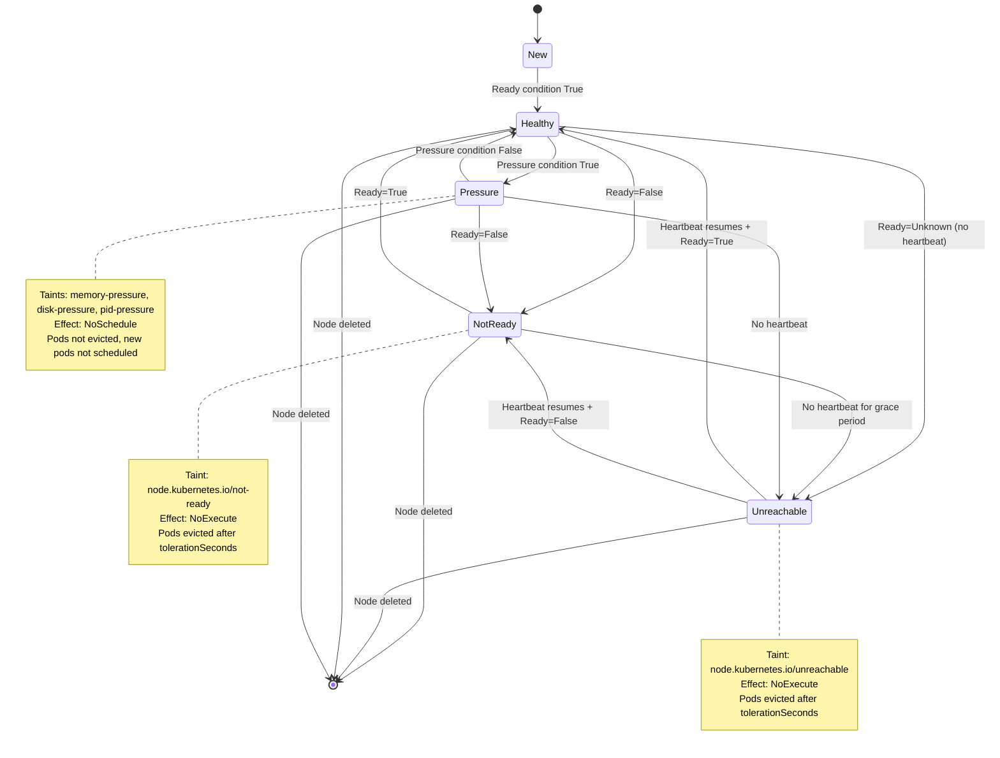
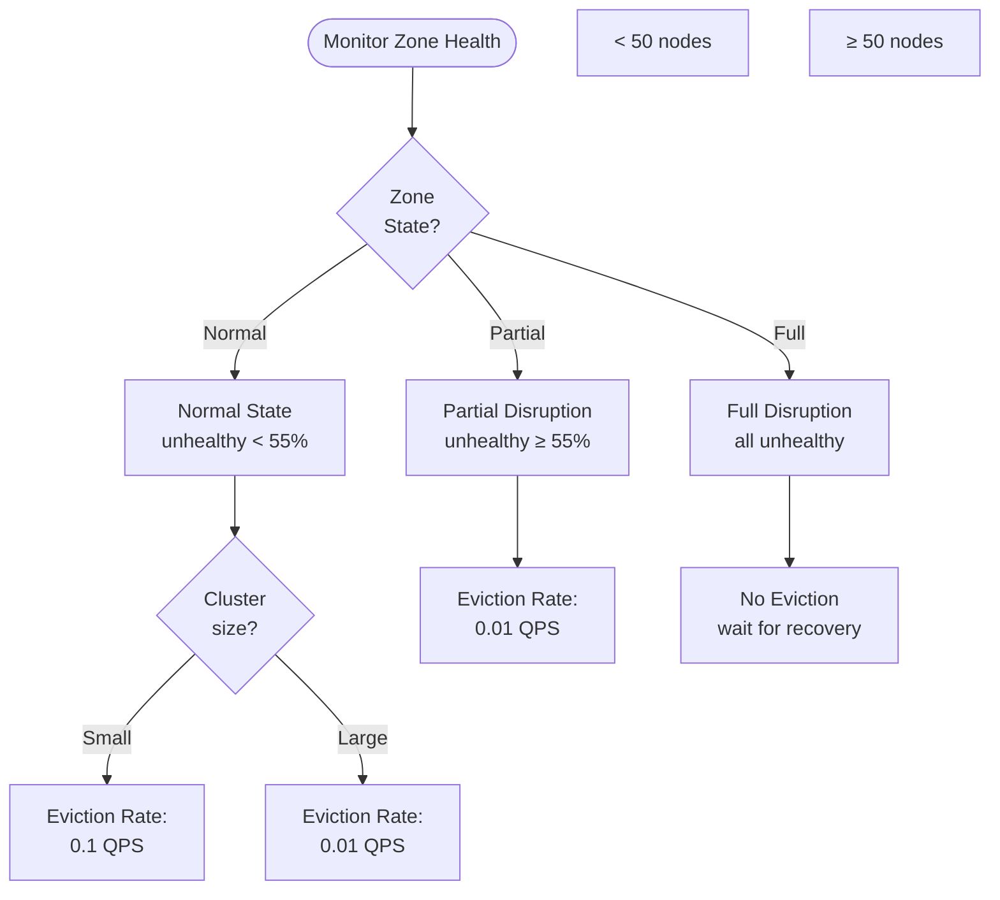
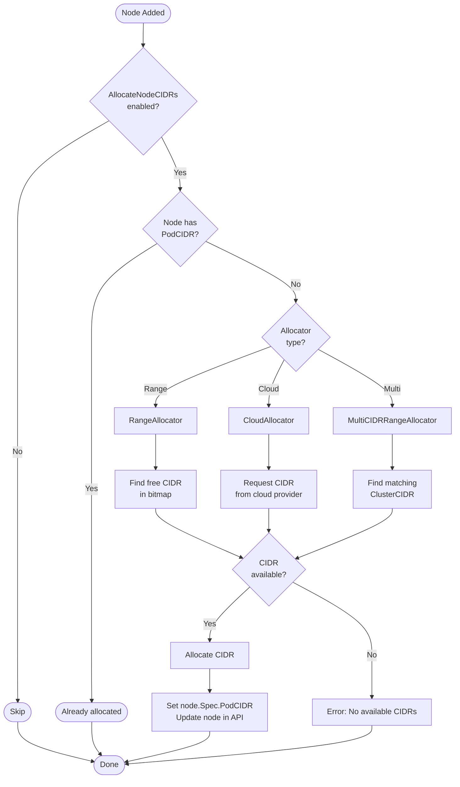
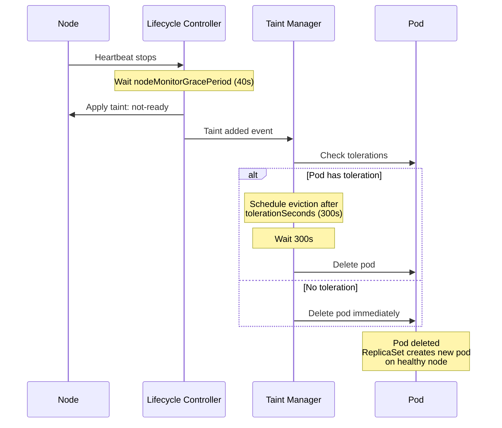

# Node Controllers - Mid-Level Architecture

**Document Version:** 1.0
**Last Updated:** 2025-10-22
**Status:** Complete

---

## Table of Contents
1. [Introduction](#introduction)
2. [Node Lifecycle Controller](#node-lifecycle-controller)
3. [Node IPAM Controller](#node-ipam-controller)
4. [Taint Eviction Controller](#taint-eviction-controller)
5. [Inter-Controller Coordination](#inter-controller-coordination)
6. [Performance and Scalability](#performance-and-scalability)

---

## Introduction

Node controllers manage the lifecycle, health, and network configuration of nodes in a Kubernetes cluster. They ensure nodes are properly monitored, network CIDRs are allocated, and pods are evicted from unhealthy nodes.

**Controllers Covered:**
1. **Node Lifecycle Controller** - Monitors node health, applies taints based on conditions
2. **Node IPAM Controller** - Allocates pod CIDR ranges to nodes
3. **Taint Eviction Controller** - Evicts pods from tainted nodes (integrated with lifecycle)
4. **Device Taint Eviction Controller** - Feature-gated device-specific eviction

**Key Responsibilities:**
- Node health monitoring via NodeStatus and NodeLease
- Taint application based on node conditions (NotReady, Unreachable, etc.)
- Zone-aware pod eviction with rate limiting
- CIDR allocation for pod networking
- Label reconciliation

**Source Files:**
- **Lifecycle**: `pkg/controller/nodelifecycle/node_lifecycle_controller.go`
- **IPAM**: `pkg/controller/nodeipam/node_ipam_controller.go`
- **Taint Eviction**: `pkg/controller/tainteviction/tainteviction.go`
- **Registration**: `cmd/kube-controller-manager/app/core.go`

---

## Node Lifecycle Controller

### Overview

**Purpose:** Monitor node health and manage node lifecycle through taints and conditions.

**Location:** `pkg/controller/nodelifecycle/node_lifecycle_controller.go:218`

**Key Responsibilities:**
1. Monitor node health signals (NodeStatus + NodeLease)
2. Apply taints based on node conditions
3. Coordinate zone-aware pod eviction
4. Reconcile node labels (OS, architecture)
5. Track per-zone health state

### Data Structure

```go
type Controller struct {
    // ┌─────────────────────────────────────────────────────────────┐
    // │ TAINT MANAGER (pod eviction)                                  │
    // └─────────────────────────────────────────────────────────────┘
    taintManager *tainteviction.Controller

    // ┌─────────────────────────────────────────────────────────────┐
    // │ LISTERS                                                       │
    // └─────────────────────────────────────────────────────────────┘
    podLister         corelisters.PodLister
    nodeLister        corelisters.NodeLister
    leaseLister       coordlisters.LeaseLister
    daemonSetStore    appsv1listers.DaemonSetLister

    // ┌─────────────────────────────────────────────────────────────┐
    // │ SYNC STATUS                                                   │
    // └─────────────────────────────────────────────────────────────┘
    podInformerSynced       cache.InformerSynced
    nodeInformerSynced      cache.InformerSynced
    leaseInformerSynced     cache.InformerSynced
    daemonSetInformerSynced cache.InformerSynced

    kubeClient clientset.Interface

    // ┌─────────────────────────────────────────────────────────────┐
    // │ TIME FUNCTIONS (for testing)                                 │
    // └─────────────────────────────────────────────────────────────┘
    now func() metav1.Time  // Avoids time skew across cluster

    // ┌─────────────────────────────────────────────────────────────┐
    // │ ZONE STATE MANAGEMENT                                         │
    // └─────────────────────────────────────────────────────────────┘
    enterPartialDisruptionFunc func(nodeNum int) float32
    enterFullDisruptionFunc    func(nodeNum int) float32
    computeZoneStateFunc       func(nodeConditions []*v1.NodeCondition) (int, ZoneState)

    // ┌─────────────────────────────────────────────────────────────┐
    // │ NODE TRACKING                                                 │
    // └─────────────────────────────────────────────────────────────┘
    knownNodeSet  map[string]*v1.Node
    nodeHealthMap *nodeHealthMap  // Thread-safe node health cache

    // ┌─────────────────────────────────────────────────────────────┐
    // │ EVICTION MANAGEMENT                                           │
    // └─────────────────────────────────────────────────────────────┘
    evictorLock sync.Mutex
    zoneNoExecuteTainter map[string]*scheduler.RateLimitedTimedQueue

    nodesToRetry sync.Map  // Nodes that need retry
    zoneStates   map[string]ZoneState

    // ┌─────────────────────────────────────────────────────────────┐
    // │ CONFIGURATION                                                 │
    // └─────────────────────────────────────────────────────────────┘
    nodeMonitorPeriod      time.Duration  // How often to check (default: 5s)
    nodeStartupGracePeriod time.Duration  // Grace for new nodes (default: 60s)
    nodeMonitorGracePeriod time.Duration  // Before marking unhealthy (default: 40s)
    nodeUpdateWorkerSize   int            // Workers for node updates (default: 8)

    evictionLimiterQPS          float32  // Normal eviction rate (default: 0.1)
    secondaryEvictionLimiterQPS float32  // Large cluster rate (default: 0.01)
    largeClusterThreshold       int32    // Large cluster size (default: 50)
    unhealthyZoneThreshold      float32  // Unhealthy zone % (default: 0.55)

    // ┌─────────────────────────────────────────────────────────────┐
    // │ WORK QUEUES                                                   │
    // └─────────────────────────────────────────────────────────────┘
    nodeUpdateQueue workqueue.TypedInterface[string]
    podUpdateQueue  workqueue.TypedRateLimitingInterface[podUpdateItem]

    broadcaster record.EventBroadcaster
    recorder    record.EventRecorder
}
```

### Node Health Signals

**Two Sources:**

1. **NodeStatus** (from kubelet)
   - Updated every 10s (default `--node-status-update-frequency`)
   - Contains conditions: Ready, MemoryPressure, DiskPressure, PIDPressure, NetworkUnavailable
   - Full node spec and status

2. **NodeLease** (from NodeLease controller in kubelet)
   - Updated every 10s (default `--node-status-update-frequency`)
   - Lightweight heartbeat (renew time only)
   - Lower API server load

**Health Check Logic:**

```go
// Use the more recent of NodeStatus or NodeLease
observedReadyCondition := node.Status.Conditions[ReadyIndex]
savedCondition := nodeHealthMap[nodeName].status.Conditions[ReadyIndex]
gracePeriod := nodeMonitorGracePeriod

// For new nodes, use longer grace period
if node.CreationTimestamp.Add(nodeStartupGracePeriod).After(now()) {
    gracePeriod = nodeStartupGracePeriod
}

// Check NodeStatus age
statusAge := now().Sub(observedReadyCondition.LastHeartbeatTime.Time)

// Check NodeLease age (if exists)
leaseAge := now().Sub(lease.Spec.RenewTime.Time)

// Use the minimum age (most recent signal)
age := min(statusAge, leaseAge)

if age > gracePeriod {
    // Node is unhealthy - apply taint
}
```

### Node Condition → Taint Mapping

**Location:** `pkg/controller/nodelifecycle/node_lifecycle_controller.go:86`

```go
var nodeConditionToTaintKeyStatusMap = map[v1.NodeConditionType]map[v1.ConditionStatus]string{
    v1.NodeReady: {
        v1.ConditionFalse:   v1.TaintNodeNotReady,      // node.kubernetes.io/not-ready
        v1.ConditionUnknown: v1.TaintNodeUnreachable,   // node.kubernetes.io/unreachable
    },
    v1.NodeMemoryPressure: {
        v1.ConditionTrue: v1.TaintNodeMemoryPressure,   // node.kubernetes.io/memory-pressure
    },
    v1.NodeDiskPressure: {
        v1.ConditionTrue: v1.TaintNodeDiskPressure,     // node.kubernetes.io/disk-pressure
    },
    v1.NodeNetworkUnavailable: {
        v1.ConditionTrue: v1.TaintNodeNetworkUnavailable, // node.kubernetes.io/network-unavailable
    },
    v1.NodePIDPressure: {
        v1.ConditionTrue: v1.TaintNodePIDPressure,      // node.kubernetes.io/pid-pressure
    },
}
```

### Node Health State Machine



### Zone States and Eviction Rates

**Zone States:**

| State | Condition | Eviction Behavior |
|-------|-----------|-------------------|
| **Initial** | Cluster just started | No eviction until first pass |
| **Normal** | < 55% unhealthy nodes | Normal eviction rate (0.1 QPS) |
| **PartialDisruption** | ≥ 55% unhealthy nodes | Reduced eviction rate (0.01 QPS) |
| **FullDisruption** | All nodes unhealthy | No eviction (wait for recovery) |

**Calculation:**

```go
func computeZoneState(nodeConditions []*v1.NodeCondition) (int, ZoneState) {
    readyNodes := 0
    notReadyNodes := 0

    for _, condition := range nodeConditions {
        if condition.Type == v1.NodeReady {
            if condition.Status == v1.ConditionTrue {
                readyNodes++
            } else {
                notReadyNodes++
            }
        }
    }

    totalNodes := readyNodes + notReadyNodes
    if totalNodes == 0 {
        return 0, stateInitial
    }

    unhealthyRatio := float32(notReadyNodes) / float32(totalNodes)

    if unhealthyRatio >= unhealthyZoneThreshold {  // Default: 0.55
        if readyNodes == 0 {
            return notReadyNodes, stateFullDisruption
        }
        return notReadyNodes, statePartialDisruption
    }

    return notReadyNodes, stateNormal
}
```

**Eviction Rate Adjustment:**



### Reconciliation Loop

```mermaid
flowchart TB
    Start([monitorNodeHealth<br/>every 5s])
    GetNodes[Get all nodes<br/>from lister]

    ForEachNode[For each node]
    GetLease[Get NodeLease]
    GetHealth[Get saved health data]

    CheckGrace{Within grace<br/>period?}
    SkipNew[Skip - new node<br/>within startup grace]

    CalcAge[Calculate health signal age<br/>min(statusAge, leaseAge)]
    CheckStale{Age ><br/>gracePeriod?}

    Healthy[Node healthy]
    Unhealthy[Node unhealthy]

    UpdateTaints[Update node taints<br/>based on conditions]
    UpdateZone[Update zone state]

    CheckEviction{Zone allows<br/>eviction?}
    QueueEviction[Queue pod eviction]
    SkipEviction[Skip eviction]

    UpdateHealth[Update nodeHealthMap]
    Done([Done])

    Start --> GetNodes
    GetNodes --> ForEachNode

    ForEachNode --> GetLease
    GetLease --> GetHealth
    GetHealth --> CheckGrace

    CheckGrace -->|No| CalcAge
    CheckGrace -->|Yes| SkipNew
    SkipNew --> UpdateHealth

    CalcAge --> CheckStale
    CheckStale -->|No| Healthy
    CheckStale -->|Yes| Unhealthy

    Healthy --> UpdateTaints
    Unhealthy --> UpdateTaints

    UpdateTaints --> UpdateZone
    UpdateZone --> CheckEviction

    CheckEviction -->|Yes| QueueEviction
    CheckEviction -->|No| SkipEviction

    QueueEviction --> UpdateHealth
    SkipEviction --> UpdateHealth
    UpdateHealth --> Done
```

### Default Configuration

**Timing Parameters:**

```go
// From cmd/kube-controller-manager/app/core.go:203
nodeMonitorPeriod:      5 * time.Second   // How often to check nodes
nodeStartupGracePeriod: 60 * time.Second  // Grace for new nodes
nodeMonitorGracePeriod: 40 * time.Second  // Before marking unhealthy
```

**Eviction Parameters:**

```go
// From cmd/kube-controller-manager/app/core.go:206
evictionLimiterQPS:          0.1    // 1 eviction per 10 seconds
secondaryEvictionLimiterQPS: 0.01   // 1 eviction per 100 seconds (large cluster)
largeClusterThreshold:       50     // 50 nodes
unhealthyZoneThreshold:      0.55   // 55% unhealthy triggers partial disruption
```

**Constraints:**

1. `nodeMonitorGracePeriod` must be N times more than update frequency
   - Allows N retries for kubelet to send updates
   - Default: 40s = 4x the 10s update frequency

2. `nodeMonitorGracePeriod` must be > HTTP2_PING_TIMEOUT (30s) + HTTP2_READ_IDLE_TIMEOUT (15s) = 45s
   - Actual default of 40s is slightly less but works in practice

3. `nodeMonitorPeriod` must be < `nodeMonitorGracePeriod`
   - Ensures timely detection

### Label Reconciliation

**Purpose:** Keep beta and stable labels in sync.

```go
var labelReconcileInfo = []struct {
    primaryKey            string
    secondaryKey          string
    ensureSecondaryExists bool
}{
    {
        // Stable → Beta OS label
        primaryKey:            "kubernetes.io/os",     // GA label
        secondaryKey:          "beta.kubernetes.io/os", // Beta label
        ensureSecondaryExists: true,
    },
    {
        // Stable → Beta arch label
        primaryKey:            "kubernetes.io/arch",
        secondaryKey:          "beta.kubernetes.io/arch",
        ensureSecondaryExists: true,
    },
}
```

**Logic:**
1. If both labels exist but differ → use stable (primaryKey) value
2. If only stable exists → add beta label with same value
3. Ensures backward compatibility during beta → GA migration

---

## Node IPAM Controller

### Overview

**Purpose:** Allocate pod CIDR ranges to nodes for pod networking.

**Location:** `pkg/controller/nodeipam/node_ipam_controller.go:42`

**Key Responsibilities:**
1. Allocate CIDRs from cluster CIDR to nodes
2. Support multiple allocator types
3. Avoid CIDR conflicts with service CIDR
4. Handle dual-stack (IPv4 + IPv6)

### Data Structure

```go
type Controller struct {
    allocatorType ipam.CIDRAllocatorType

    // ┌─────────────────────────────────────────────────────────────┐
    // │ CONFIGURATION                                                 │
    // └─────────────────────────────────────────────────────────────┘
    cloud                cloudprovider.Interface
    clusterCIDRs         []*net.IPNet  // e.g., 10.244.0.0/16
    serviceCIDR          *net.IPNet    // e.g., 10.96.0.0/12
    secondaryServiceCIDR *net.IPNet    // For dual-stack

    kubeClient       clientset.Interface
    eventBroadcaster record.EventBroadcaster

    // ┌─────────────────────────────────────────────────────────────┐
    // │ LISTERS                                                       │
    // └─────────────────────────────────────────────────────────────┘
    nodeLister         corelisters.NodeLister
    nodeInformerSynced cache.InformerSynced

    // ┌─────────────────────────────────────────────────────────────┐
    // │ ALLOCATORS (one of these is active)                          │
    // └─────────────────────────────────────────────────────────────┘
    legacyIPAM    ipamController  // For legacy allocators
    cidrAllocator ipam.CIDRAllocator  // For modern allocators
}
```

### Allocator Types

**Location:** `pkg/controller/nodeipam/ipam/cidr_allocator.go`

| Type | Description | Use Case |
|------|-------------|----------|
| **RangeAllocator** | Fixed cluster CIDR, bitmap allocation | Default, on-prem |
| **CloudAllocator** | Cloud provider allocates CIDRs | GCP, AWS with native routing |
| **MultiCIDRRangeAllocator** | Multiple cluster CIDRs | Large clusters, ClusterCIDR API |
| **IPAMFromCluster** (legacy) | Legacy cluster allocator | Deprecated |
| **IPAMFromCloud** (legacy) | Legacy cloud allocator | Deprecated |

### RangeAllocator (Default)

**Algorithm:**

```
Given:
- clusterCIDR: 10.244.0.0/16
- nodeCIDRMaskSize: 24

Step 1: Calculate total available CIDRs
  Available subnets = 2^(nodeCIDRMaskSize - clusterCIDRMaskSize)
                    = 2^(24 - 16) = 256 subnets

Step 2: Create bitmap
  Bitmap with 256 bits (one per /24 subnet)

Step 3: On node add:
  a. Find first free bit in bitmap
  b. Mark bit as allocated
  c. Calculate CIDR: 10.244.{bit}.0/24
  d. Set node.Spec.PodCIDR = calculated CIDR
  e. Update node in API server

Step 4: On node delete:
  a. Parse node.Spec.PodCIDR
  b. Calculate bit index
  c. Clear bit in bitmap

Example allocation:
  Node 1: 10.244.0.0/24   (bit 0)
  Node 2: 10.244.1.0/24   (bit 1)
  Node 3: 10.244.2.0/24   (bit 2)
  ...
  Node 256: 10.244.255.0/24 (bit 255)
```

**Dual-Stack Support:**

```
clusterCIDRs:
  - 10.244.0.0/16 (IPv4)
  - fd00:10:244::/56 (IPv6)

nodeCIDRMaskSizes:
  - 24 (IPv4)
  - 64 (IPv6)

Node allocation:
  node.Spec.PodCIDRs = ["10.244.0.0/24", "fd00:10:244::/64"]
```

### MultiCIDRRangeAllocator

**Purpose:** Support ClusterCIDR API for dynamic CIDR management.

**Features:**
- Multiple cluster CIDRs
- Per-CIDR node selectors
- Dynamic CIDR addition/removal

**Example:**

```yaml
apiVersion: networking.k8s.io/v1alpha1
kind: ClusterCIDR
metadata:
  name: cidr-1
spec:
  perNodeHostBits: 8  # /24 for IPv4, /120 for IPv6
  ipv4: 10.0.0.0/16
  ipv6: fd00::/64
  nodeSelector:
    matchLabels:
      region: us-west
---
apiVersion: networking.k8s.io/v1alpha1
kind: ClusterCIDR
metadata:
  name: cidr-2
spec:
  perNodeHostBits: 8
  ipv4: 10.1.0.0/16
  nodeSelector:
    matchLabels:
      region: us-east
```

**Allocation:**
1. Node added with label `region=us-west`
2. Controller finds matching ClusterCIDR (cidr-1)
3. Allocates from 10.0.0.0/16
4. Sets node.Spec.PodCIDR

### CIDR Allocation Flow



### Service CIDR Validation

**Purpose:** Ensure pod CIDRs don't overlap with service CIDR.

```go
func validateCIDRs(clusterCIDR string, serviceCIDR string) error {
    _, clusterCIDRNet, err := net.ParseCIDR(clusterCIDR)
    if err != nil {
        return err
    }

    _, serviceCIDRNet, err := net.ParseCIDR(serviceCIDR)
    if err != nil {
        return err
    }

    // Check if CIDRs overlap
    if clusterCIDRNet.Contains(serviceCIDRNet.IP) ||
       serviceCIDRNet.Contains(clusterCIDRNet.IP) {
        return fmt.Errorf("cluster CIDR and service CIDR overlap")
    }

    return nil
}
```

---

## Taint Eviction Controller

### Overview

**Purpose:** Evict pods from tainted nodes based on pod tolerations.

**Location:** `pkg/controller/tainteviction/tainteviction.go`

**Integration:** Runs as part of Node Lifecycle Controller (via `taintManager` field).

**Key Responsibilities:**
1. Watch node taints and pod tolerations
2. Calculate when pods should be evicted
3. Queue pod deletions with rate limiting
4. Handle toleration timeouts

### Toleration Matching

**Pod Tolerations:**

```yaml
apiVersion: v1
kind: Pod
metadata:
  name: my-pod
spec:
  tolerations:
  - key: node.kubernetes.io/not-ready
    operator: Exists
    effect: NoExecute
    tolerationSeconds: 300  # Evict after 5 minutes
  - key: node.kubernetes.io/unreachable
    operator: Exists
    effect: NoExecute
    tolerationSeconds: 300
```

**Matching Logic:**

```go
func tolerate(taint *v1.Taint, tolerations []v1.Toleration) (bool, time.Duration) {
    for _, toleration := range tolerations {
        if toleration.ToleratesTaint(taint) {
            if toleration.TolerationSeconds == nil {
                return true, 0  // Tolerate forever
            }
            return true, time.Duration(*toleration.TolerationSeconds) * time.Second
        }
    }
    return false, 0  // Does not tolerate
}
```

### Eviction Timeline



### Rate Limiting

**Per-Zone Queues:**

```go
// One rate-limited queue per zone
type RateLimitedTimedQueue struct {
    queue      workqueue.TypedRateLimitingInterface[string]
    limiter    flowcontrol.RateLimiter
    timingQueue TimedQueue
}

// Rate limiter configuration (from zone state)
limiter := flowcontrol.NewTokenBucketRateLimiter(
    evictionLimiterQPS,  // 0.1 QPS (normal) or 0.01 QPS (partial disruption)
    1,                   // Burst of 1
)
```

**Eviction Processing:**

```
1. Node tainted → pods added to queue with timeout
2. Rate limiter allows eviction based on QPS
3. Pod deleted
4. ReplicaSet/Deployment creates replacement on healthy node
```

---

## Inter-Controller Coordination

### Node Lifecycle → Taint Eviction

```
Node Lifecycle Controller:
  1. Monitors node health
  2. Applies taints
  3. Notifies taint manager
     ↓
Taint Manager:
  1. Receives taint event
  2. Finds pods on node
  3. Checks tolerations
  4. Queues evictions with rate limiting
     ↓
Workload Controllers:
  1. Observe pod deletions
  2. Create replacement pods
  3. Scheduler places on healthy nodes
```

### Node IPAM → Kubelet

```
Node IPAM Controller:
  1. Allocates CIDR
  2. Sets node.Spec.PodCIDR
     ↓
Node (watch node spec):
  1. Observes PodCIDR change
  2. Configures CNI with CIDR
  3. Creates pod network bridge
     ↓
Pods:
  1. Assigned IPs from node's CIDR
  2. Network connectivity established
```

### Watched Resources

**Node Lifecycle:**
- Nodes (primary)
- NodeLeases (health heartbeat)
- Pods (for eviction)
- DaemonSets (ignore DS pods for some conditions)

**Node IPAM:**
- Nodes (primary)
- ClusterCIDRs (for MultiCIDRRangeAllocator)

---

## Performance and Scalability

### Node Lifecycle Performance

**Timing:**
- Monitor period: 5s
- Processing per cycle: ~1-10ms per node
- Scalability: Tested up to 5,000 nodes

**Worker Configuration:**
- Node update workers: 8 (default)
- Pod update workers: 4 (default)

**Memory Usage:**
- Base controller: ~1-2 MB
- Node health map: ~1 KB per node
- Total (1,000 nodes): ~3-4 MB
- Total (5,000 nodes): ~7-10 MB

### Node IPAM Performance

**CIDR Allocation:**
- Allocation time: O(1) for RangeAllocator (bitmap lookup)
- Allocation time: O(log n) for MultiCIDRRangeAllocator
- Memory: ~1 bit per possible CIDR (e.g., 256 bits for /16 with /24 nodes)

**Scalability:**
- Tested: 5,000 nodes
- CIDR limit: Depends on cluster CIDR size
  - /16 with /24 nodes: 256 nodes max
  - /8 with /24 nodes: 65,536 nodes max

### Eviction Rate Limits

| Scenario | Rate | Pods per Second |
|----------|------|-----------------|
| Normal (small cluster) | 0.1 QPS | 0.1 |
| Normal (large cluster) | 0.01 QPS | 0.01 |
| Partial disruption | 0.01 QPS | 0.01 |
| Full disruption | 0 QPS | 0 (no eviction) |

**Example:** In a cluster with 100 unhealthy nodes and 10 pods per node (1,000 pods to evict):
- Normal rate: 0.1 QPS → ~10,000 seconds (~2.8 hours)
- Reduced rate: 0.01 QPS → ~100,000 seconds (~28 hours)

**Optimization:** Pods with toleration timeout start evicting only after timeout expires, spreading load over time.

---

## Summary

### Key Takeaways

1. **Dual Health Signals:** NodeStatus + NodeLease provide redundancy
2. **Zone-Aware Eviction:** Prevents mass eviction during network partitions
3. **CIDR Allocation:** Multiple strategies for different environments
4. **Taint-Based Eviction:** Declarative pod eviction via tolerations
5. **Rate Limiting:** Protects cluster from eviction storms

### Configuration Recommendations

**For High Availability:**
```yaml
--node-monitor-period=5s
--node-monitor-grace-period=40s  # Allow 4 retries
--node-eviction-rate=0.1          # Slower eviction
```

**For Fast Failure Detection:**
```yaml
--node-monitor-period=2s
--node-monitor-grace-period=20s  # Faster detection
--node-eviction-rate=0.5          # Faster eviction
```

**For Large Clusters:**
```yaml
--large-cluster-size-threshold=100
--secondary-node-eviction-rate=0.01
```

### Cross-References

- **[08-workload-controllers.md](08-workload-controllers.md)** - DaemonSet interaction
- **[20-data-structures.md](20-data-structures.md)** - Controller data structures
- **[07-shared-infrastructure.md](07-shared-infrastructure.md)** - Informers and queues

---

**Next Documents:**
- `10-endpoint-controllers.md` - Endpoint, EndpointSlice, mirroring
- `11-storage-controllers.md` - PV, PVC, attach/detach