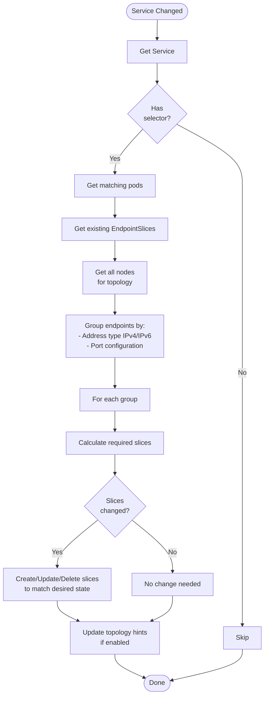
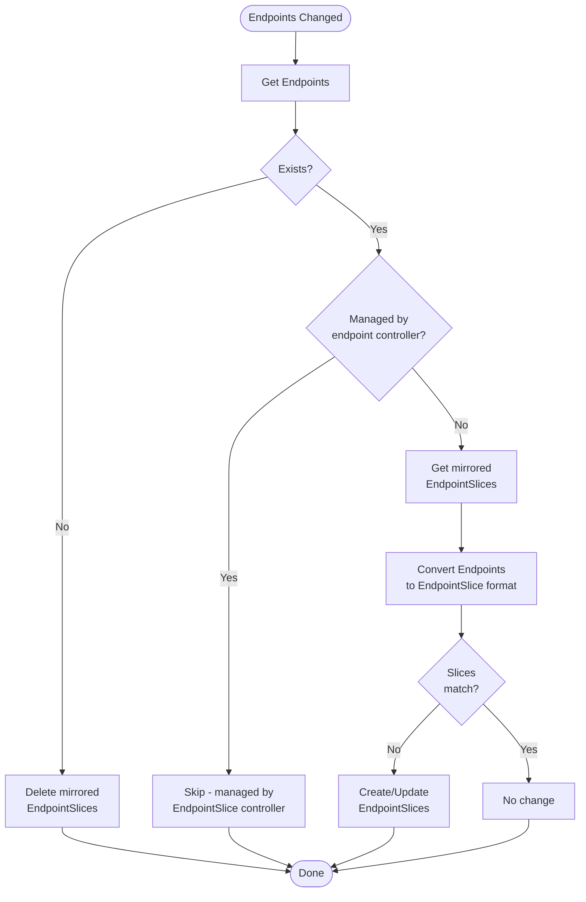

# Endpoint Controllers - Mid-Level Architecture

**Document Version:** 1.0
**Last Updated:** 2025-10-22
**Status:** Complete

---

## Table of Contents
1. [Introduction](#introduction)
2. [Endpoint Controller (Legacy)](#endpoint-controller-legacy)
3. [EndpointSlice Controller](#endpointslice-controller)
4. [EndpointSlice Mirroring Controller](#endpointslice-mirroring-controller)
5. [Comparison and Migration](#comparison-and-migration)
6. [Performance and Scalability](#performance-and-scalability)

---

## Introduction

Endpoint controllers manage the mapping between Services and their backing Pods. They populate Endpoint/EndpointSlice resources that kube-proxy uses to configure network forwarding rules.

**Controllers Covered:**
1. **Endpoint Controller** - Legacy controller creating Endpoints resources
2. **EndpointSlice Controller** - Modern controller creating EndpointSlices (GA in 1.21)
3. **EndpointSlice Mirroring Controller** - Mirrors Endpoints to EndpointSlices for compatibility

**Key Concepts:**
- **Endpoint**: Single resource listing all pod IPs for a service (legacy, limited to 1000 endpoints)
- **EndpointSlice**: Scalable alternative, multiple slices per service (100 endpoints per slice)
- **Service Selector**: Determines which pods back a service
- **Readiness**: Only ready pods included in endpoints

**Source Files:**
- **Endpoint**: `pkg/controller/endpoint/endpoints_controller.go`
- **EndpointSlice**: `pkg/controller/endpointslice/endpointslice_controller.go`
- **Mirroring**: `pkg/controller/endpointslicemirroring/endpointslice_mirroring_controller.go`
- **Registration**: `cmd/kube-controller-manager/app/core.go`, `app/discovery.go`

---

## Endpoint Controller (Legacy)

### Overview

**Purpose:** Populate Endpoints resources for Services with selectors.

**Location:** `pkg/controller/endpoint/endpoints_controller.go:129`

**Status:** Maintained for backward compatibility, superseded by EndpointSlice controller.

**Key Responsibilities:**
1. Watch Services with selectors
2. Find matching Pods
3. Create/update Endpoints with pod IPs and ports
4. Handle pod readiness
5. Batch updates to reduce API server load

### Data Structure

```go
type Controller struct {
    client           clientset.Interface
    eventBroadcaster record.EventBroadcaster
    eventRecorder    record.EventRecorder

    // ┌─────────────────────────────────────────────────────────────┐
    // │ LISTERS                                                       │
    // └─────────────────────────────────────────────────────────────┘
    serviceLister corelisters.ServiceLister
    podLister     corelisters.PodLister
    endpointsLister corelisters.EndpointsLister

    // ┌─────────────────────────────────────────────────────────────┐
    // │ SYNC STATUS                                                   │
    // └─────────────────────────────────────────────────────────────┘
    servicesSynced  cache.InformerSynced
    podsSynced      cache.InformerSynced
    endpointsSynced cache.InformerSynced

    // ┌─────────────────────────────────────────────────────────────┐
    // │ WORK QUEUE                                                    │
    // └─────────────────────────────────────────────────────────────┘
    queue workqueue.TypedRateLimitingInterface[string]

    // ┌─────────────────────────────────────────────────────────────┐
    // │ BATCHING                                                      │
    // └─────────────────────────────────────────────────────────────┘
    // staleEndpointsTracker tracks endpoints that may be stale
    staleEndpointsTracker *staleEndpointsTracker

    // triggerTimeTracker tracks when endpoints should be synced
    triggerTimeTracker *endpointsliceutil.TriggerTimeTracker

    // endpointUpdatesBatchPeriod batches endpoint updates
    endpointUpdatesBatchPeriod time.Duration  // Default: 0 (immediate)

    workerLoopPeriod time.Duration  // Default: 1s
}
```

### Endpoints Resource Format

**Example:**

```yaml
apiVersion: v1
kind: Endpoints
metadata:
  name: my-service
  namespace: default
  labels:
    endpoints.kubernetes.io/managed-by: endpoint-controller
subsets:
- addresses:
  - ip: 10.244.1.10
    nodeName: node-1
    targetRef:
      kind: Pod
      name: my-pod-1
      namespace: default
      uid: abc123
  - ip: 10.244.2.20
    nodeName: node-2
    targetRef:
      kind: Pod
      name: my-pod-2
      namespace: default
      uid: def456
  ports:
  - name: http
    port: 8080
    protocol: TCP
  - name: https
    port: 8443
    protocol: TCP
- addresses: []  # NotReady pods
  notReadyAddresses:
  - ip: 10.244.3.30
    nodeName: node-3
    targetRef:
      kind: Pod
      name: my-pod-3
      namespace: default
      uid: ghi789
  ports:
  - name: http
    port: 8080
    protocol: TCP
```

### Reconciliation Logic

```mermaid
flowchart TB
    Start([Worker Gets<br/>Service Key])
    GetSvc[Get Service<br/>from cache]
    Exists{Exists?}
    DeleteEP[Delete Endpoints]
    Done([Done])

    CheckSelector{Has<br/>selector?}
    Skip[Skip - headless service<br/>or user-managed]

    GetPods[Get all pods<br/>matching selector]
    GetEP[Get existing Endpoints]

    SortPods[Sort pods by:<br/>1. Ready first<br/>2. NodeName<br/>3. PodName]

    BuildSubsets[Build subsets:<br/>- addresses (ready)<br/>- notReadyAddresses<br/>- ports from service spec]

    CheckCapacity{Endpoints<br/>> 1000?}
    Truncate[Truncate to 1000<br/>Set over-capacity annotation]
    NoTruncate[Use all endpoints]

    CompareEP{Endpoints<br/>changed?}
    UpdateEP[Update Endpoints<br/>in API server]
    NoUpdate[No update needed]

    Start --> GetSvc
    GetSvc --> Exists
    Exists -->|No| DeleteEP
    Exists -->|Yes| CheckSelector

    CheckSelector -->|No| Skip
    CheckSelector -->|Yes| GetPods

    GetPods --> GetEP
    GetEP --> SortPods
    SortPods --> BuildSubsets

    BuildSubsets --> CheckCapacity
    CheckCapacity -->|Yes| Truncate
    CheckCapacity -->|No| NoTruncate

    Truncate --> CompareEP
    NoTruncate --> CompareEP

    CompareEP -->|Yes| UpdateEP
    CompareEP -->|No| NoUpdate

    DeleteEP --> Done
    Skip --> Done
    UpdateEP --> Done
    NoUpdate --> Done
```

### Pod Readiness Check

```go
func isPodReady(pod *v1.Pod) bool {
    for _, condition := range pod.Status.Conditions {
        if condition.Type == v1.PodReady {
            return condition.Status == v1.ConditionTrue
        }
    }
    return false
}
```

**Special Cases:**
- **Terminating Pods** (DeletionTimestamp != nil):
  - If ready: excluded from addresses
  - If not ready: already in notReadyAddresses
- **Failed/Succeeded Pods**: Excluded entirely
- **Pods without IP**: Excluded

### Scalability Limit

**Location:** `pkg/controller/endpoint/endpoints_controller.go:60`

```go
const maxCapacity = 1000  // Maximum endpoints in single Endpoints resource
```

**Problem:** For services with > 1000 backends:
1. Endpoints truncated to 1000
2. Annotation added: `endpoints.kubernetes.io/over-capacity: truncated`
3. Some pods unreachable via service
4. **Solution:** Use EndpointSlice instead

---

## EndpointSlice Controller

### Overview

**Purpose:** Populate EndpointSlice resources for Services with selectors. Designed for scalability.

**Location:** `pkg/controller/endpointslice/endpointslice_controller.go`

**Status:** GA since Kubernetes 1.21, recommended for all new deployments.

**Key Advantages:**
1. **Scalability**: No 1000 endpoint limit
2. **Efficiency**: Smaller updates (per-slice instead of monolithic)
3. **Extensibility**: Supports topology-aware routing
4. **Performance**: Reduced API server load

### Data Structure

```go
type Controller struct {
    client clientset.Interface

    // ┌─────────────────────────────────────────────────────────────┐
    // │ LISTERS                                                       │
    // └─────────────────────────────────────────────────────────────┘
    serviceLister       corelisters.ServiceLister
    podLister           corelisters.PodLister
    nodeLister          corelisters.NodeLister
    endpointSliceLister discoverylisters.EndpointSliceLister

    // ┌─────────────────────────────────────────────────────────────┐
    // │ SYNC STATUS                                                   │
    // └─────────────────────────────────────────────────────────────┘
    servicesSynced       cache.InformerSynced
    podsSynced           cache.InformerSynced
    nodesSynced          cache.InformerSynced
    endpointSlicesSynced cache.InformerSynced

    // ┌─────────────────────────────────────────────────────────────┐
    // │ WORK QUEUES                                                   │
    // └─────────────────────────────────────────────────────────────┘
    serviceQueue workqueue.TypedRateLimitingInterface[string]

    // topologyQueue handles topology cache updates
    topologyQueue workqueue.TypedRateLimitingInterface[string]

    // ┌─────────────────────────────────────────────────────────────┐
    // │ CONFIGURATION                                                 │
    // └─────────────────────────────────────────────────────────────┘
    maxEndpointsPerSlice int32  // Default: 100

    // endpointUpdatesBatchPeriod batches updates
    endpointUpdatesBatchPeriod time.Duration

    // ┌─────────────────────────────────────────────────────────────┐
    // │ RECONCILIATION STATE                                          │
    // └─────────────────────────────────────────────────────────────┘
    reconciler *reconciler  // Core reconciliation logic

    // topologyCache tracks node topology for hints
    topologyCache *topologycache.TopologyCache

    workerLoopPeriod time.Duration

    eventBroadcaster record.EventBroadcaster
    eventRecorder    record.EventRecorder
}
```

### EndpointSlice Resource Format

**Example:**

```yaml
apiVersion: discovery.k8s.io/v1
kind: EndpointSlice
metadata:
  name: my-service-abc123
  namespace: default
  labels:
    kubernetes.io/service-name: my-service
    endpointslice.kubernetes.io/managed-by: endpointslice-controller.k8s.io
  ownerReferences:
  - apiVersion: v1
    kind: Service
    name: my-service
    uid: service-uid
addressType: IPv4  # or IPv6
endpoints:
- addresses:
  - 10.244.1.10
  conditions:
    ready: true
    serving: true
    terminating: false
  nodeName: node-1
  targetRef:
    kind: Pod
    name: my-pod-1
    namespace: default
    uid: pod-uid-1
  topology:
    kubernetes.io/hostname: node-1
    topology.kubernetes.io/zone: us-west-1a
- addresses:
  - 10.244.2.20
  conditions:
    ready: true
    serving: true
    terminating: false
  nodeName: node-2
  targetRef:
    kind: Pod
    name: my-pod-2
    namespace: default
    uid: pod-uid-2
  topology:
    kubernetes.io/hostname: node-2
    topology.kubernetes.io/zone: us-west-1b
ports:
- name: http
  port: 8080
  protocol: TCP
- name: https
  port: 8443
  protocol: TCP
```

### Key Differences from Endpoints

| Feature | Endpoints | EndpointSlice |
|---------|-----------|---------------|
| **Scalability** | Max 1000 per resource | 100 per slice, unlimited slices |
| **API Group** | `core/v1` | `discovery.k8s.io/v1` |
| **Structure** | Subsets (addresses + ports) | Endpoints array + ports |
| **Topology** | Not supported | Supported via topology hints |
| **Conditions** | Ready only | Ready, Serving, Terminating |
| **Address Types** | Mixed IPv4/IPv6 | Separate slices per address type |
| **Update Granularity** | Entire list | Individual slices |

### Endpoint Conditions

```yaml
conditions:
  ready: true         # Pod passes readiness probe
  serving: true       # Pod can serve traffic (ready OR terminating with willing)
  terminating: false  # Pod has DeletionTimestamp set
```

**Logic:**
- **Ready**: Pod is ready (readiness probe passes)
- **Serving**: Pod can serve traffic
  - True if ready OR (terminating AND pod has PublishNotReadyAddresses)
  - Used by kube-proxy to decide traffic routing
- **Terminating**: Pod is in terminating state
  - Allows graceful termination with continued traffic

### Slice Allocation Strategy

**Location:** `k8s.io/endpointslice/reconciler.go`

**Goal:** Minimize number of slices while distributing endpoints evenly.

**Algorithm:**

```
maxEndpointsPerSlice = 100  // Configurable, default 100

Step 1: Count total endpoints
  totalEndpoints = len(readyPods) + len(notReadyPods)

Step 2: Calculate required slices
  requiredSlices = ceiling(totalEndpoints / maxEndpointsPerSlice)

Step 3: Distribute endpoints across slices
  For each slice:
    - Fill with up to maxEndpointsPerSlice endpoints
    - Prefer balanced distribution
    - Keep endpoints in same slice when possible (minimize churn)

Step 4: Delete unused slices
  If slices exist beyond requiredSlices, delete them

Example:
  150 endpoints, maxEndpointsPerSlice=100:
    - Slice 1: 75 endpoints (balanced)
    - Slice 2: 75 endpoints (balanced)
    - Total: 2 slices

  250 endpoints, maxEndpointsPerSlice=100:
    - Slice 1: 84 endpoints
    - Slice 2: 83 endpoints
    - Slice 3: 83 endpoints
    - Total: 3 slices
```

### Topology-Aware Hints

**Purpose:** Route traffic to endpoints in the same zone when possible, reducing cross-zone costs.

**Example:**

```yaml
apiVersion: discovery.k8s.io/v1
kind: EndpointSlice
metadata:
  name: my-service-abc123
endpoints:
- addresses:
  - 10.244.1.10
  hints:
    forZones:
    - name: us-west-1a  # Prefer routing from zone us-west-1a
  nodeName: node-1
  zone: us-west-1a
```

**Allocation:**
1. Group endpoints by zone
2. Calculate per-zone capacity
3. Assign hints to prefer local zone
4. Fall back to other zones if local capacity exhausted

**Requirements:**
- Feature gate `TopologyAwareHints` enabled (GA in 1.27)
- Nodes have zone labels
- Sufficient endpoint distribution

### Reconciliation Flow



### Dual-Stack Support

**Separate Slices per Address Family:**

```yaml
# IPv4 EndpointSlice
apiVersion: discovery.k8s.io/v1
kind: EndpointSlice
metadata:
  name: my-service-ipv4-abc123
addressType: IPv4
endpoints:
- addresses:
  - 10.244.1.10
---
# IPv6 EndpointSlice
apiVersion: discovery.k8s.io/v1
kind: EndpointSlice
metadata:
  name: my-service-ipv6-def456
addressType: IPv6
endpoints:
- addresses:
  - fd00:10:244::10
```

**Benefits:**
- Clean separation of address families
- Easier for consumers to handle
- Better alignment with dual-stack services

---

## EndpointSlice Mirroring Controller

### Overview

**Purpose:** Mirror Endpoints resources to EndpointSlices for backward compatibility.

**Location:** `pkg/controller/endpointslicemirroring/endpointslice_mirroring_controller.go`

**Use Case:** Services without selectors (user-managed endpoints) or legacy Endpoints resources.

**Key Responsibilities:**
1. Watch Endpoints resources
2. Create corresponding EndpointSlices
3. Keep them in sync
4. Support gradual migration

### Mirroring Logic



### Conversion Example

**Input (Endpoints):**

```yaml
apiVersion: v1
kind: Endpoints
metadata:
  name: my-db
subsets:
- addresses:
  - ip: 192.168.1.10
  - ip: 192.168.1.11
  ports:
  - name: mysql
    port: 3306
```

**Output (EndpointSlice):**

```yaml
apiVersion: discovery.k8s.io/v1
kind: EndpointSlice
metadata:
  name: my-db-mirrored-abc123
  labels:
    kubernetes.io/service-name: my-db
    endpointslice.kubernetes.io/managed-by: endpointslicemirroring-controller.k8s.io
    endpointslice.kubernetes.io/skip-mirror: "true"  # Prevent re-mirroring
addressType: IPv4
endpoints:
- addresses:
  - 192.168.1.10
  conditions:
    ready: true
    serving: true
    terminating: false
- addresses:
  - 192.168.1.11
  conditions:
    ready: true
    serving: true
    terminating: false
ports:
- name: mysql
  port: 3306
  protocol: TCP
```

---

## Comparison and Migration

### When to Use Each Controller

| Scenario | Controller | Rationale |
|----------|------------|-----------|
| New cluster (1.21+) | EndpointSlice | Modern, scalable |
| Existing cluster | Both (gradual migration) | Backward compatibility |
| >1000 endpoints | EndpointSlice | Avoids truncation |
| User-managed endpoints | Mirroring | No selector on service |
| Legacy tooling | Endpoint (deprecated) | Compatibility only |

### Migration Path

**Phase 1: Enable EndpointSlice**
```yaml
# Both controllers run
--enable-endpoint-controller=true     # Default
--enable-endpointslice-controller=true  # Default since 1.21
```

**Phase 2: Verify Clients**
- Check kube-proxy uses EndpointSlices
- Verify custom controllers/clients

**Phase 3: Monitor**
- Compare Endpoints vs EndpointSlices
- Ensure consistency

**Phase 4: Disable Endpoint Controller (Future)**
```yaml
--enable-endpoint-controller=false
```

### Consistency

**Both controllers watch same sources:**
- Services
- Pods

**Result:**
- Endpoints and EndpointSlices should be consistent
- Same pod IPs, same ready states
- Different structure/format

**Validation:**

```bash
# Compare endpoint count
kubectl get endpoints my-service -o json | jq '.subsets[].addresses | length'

# Count EndpointSlice endpoints
kubectl get endpointslices -l kubernetes.io/service-name=my-service -o json | \
  jq '[.items[].endpoints[]] | length'
```

---

## Performance and Scalability

### Endpoint Controller Limits

**Scalability:**
- Max endpoints per service: 1000
- API server load: High (entire Endpoints object updated on any change)
- Watch load: All clients see full update

**Performance:**
- Update latency: 1-5 seconds (typical)
- Memory per endpoint: ~100-200 bytes

**Example:**
```
Service with 1000 endpoints:
- Endpoints resource size: ~100 KB
- On single pod change: Entire 100 KB updated
- All kube-proxy instances: Receive full 100 KB update
- 1000 nodes × 100 KB = 100 MB network traffic
```

### EndpointSlice Controller Limits

**Scalability:**
- Max endpoints per service: Unlimited
- Max endpoints per slice: 100 (configurable)
- API server load: Lower (only changed slices updated)

**Performance:**
- Update latency: 1-3 seconds (typical)
- Memory per endpoint: ~150-250 bytes (includes topology)

**Example:**
```
Service with 10,000 endpoints:
- EndpointSlices: 100 slices (100 endpoints each)
- Slice size: ~10 KB each
- On single pod change: Only 1 slice (10 KB) updated
- 1000 nodes × 10 KB = 10 MB network traffic
- 10x reduction compared to Endpoints
```

### Batching

**Both controllers support batching:**

```yaml
--endpoint-updates-batch-period=500ms
```

**Effect:**
- Multiple pod changes within 500ms batched into single update
- Reduces API server load
- Increases latency slightly

**Tradeoff:**
- Lower period (e.g., 100ms): Faster updates, higher API load
- Higher period (e.g., 1s): Slower updates, lower API load

### Benchmark Comparison

| Metric | Endpoints | EndpointSlice | Improvement |
|--------|-----------|---------------|-------------|
| **Max endpoints** | 1,000 | Unlimited | ∞ |
| **Update size (1000 eps)** | 100 KB | 10 KB | 10x |
| **API writes (1 pod change)** | 1 | 1 | Same |
| **Watch traffic (1 pod change)** | 100 KB × nodes | 10 KB × nodes | 10x |
| **Memory (10k endpoints)** | ~1 MB | ~2.5 MB | -2.5x |
| **Update latency** | 1-5s | 1-3s | ~40% |

**Recommendation:** Use EndpointSlice for:
- Large services (>100 endpoints)
- Frequently changing pod sets
- Cost optimization (reduce network traffic)

---

## Summary

### Key Takeaways

1. **EndpointSlice is Modern Standard**: GA since 1.21, recommended for all new deployments
2. **Scalability**: EndpointSlice removes the 1000 endpoint limit
3. **Efficiency**: Smaller updates reduce API server load and network traffic
4. **Topology Hints**: Enable zone-aware routing for cost optimization
5. **Mirroring**: Ensures backward compatibility during migration
6. **Dual-Stack**: Native support with separate slices per address family

### Configuration Recommendations

**For Large Services (>100 endpoints):**
```yaml
--max-endpoints-per-slice=100  # Default, good for most cases
--endpoint-updates-batch-period=500ms  # Batch updates
```

**For Fast Updates (low latency requirement):**
```yaml
--endpoint-updates-batch-period=100ms  # Faster propagation
```

**For API Server Optimization:**
```yaml
--endpoint-updates-batch-period=1s  # More aggressive batching
```

### Cross-References

- **[08-workload-controllers.md](08-workload-controllers.md)** - Pod lifecycle and ReplicaSets
- **[07-shared-infrastructure.md](07-shared-infrastructure.md)** - Informer architecture
- **[20-data-structures.md](20-data-structures.md)** - Controller data structures

---

**Next Documents:**
- `11-storage-controllers.md` - PV, PVC, attach/detach, expansion
- `12-resource-lifecycle-controllers.md` - Namespace, garbage collection, TTL