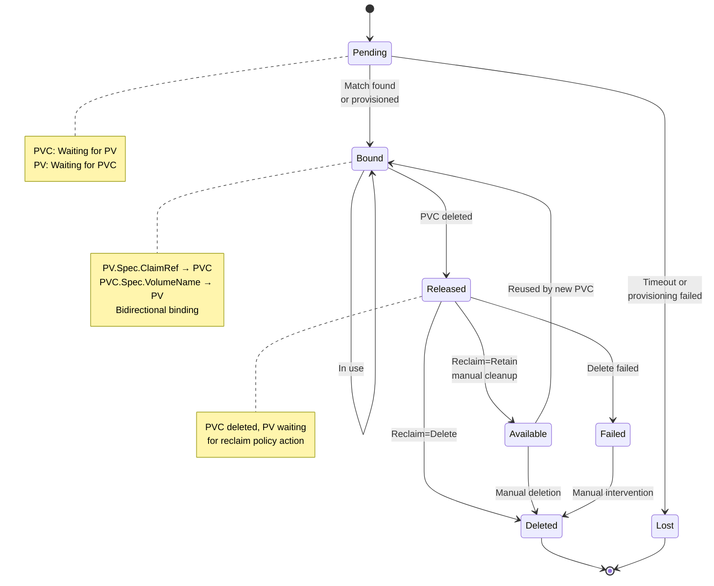
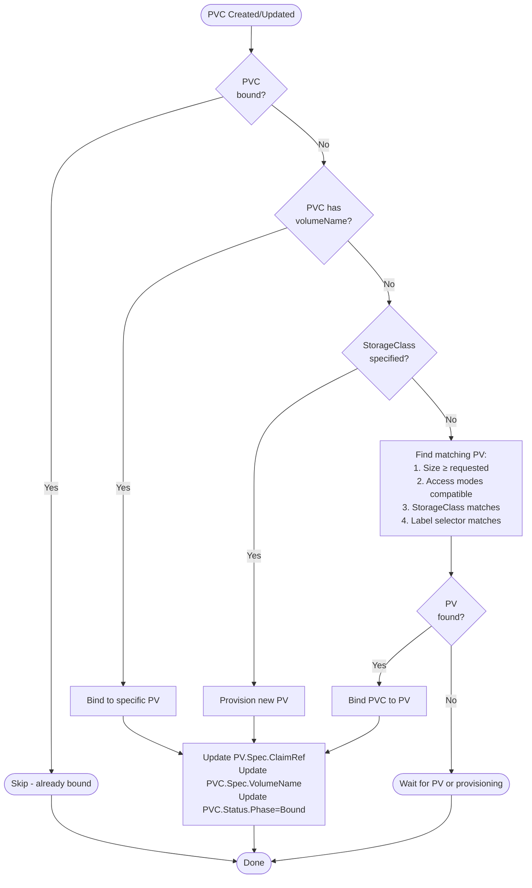
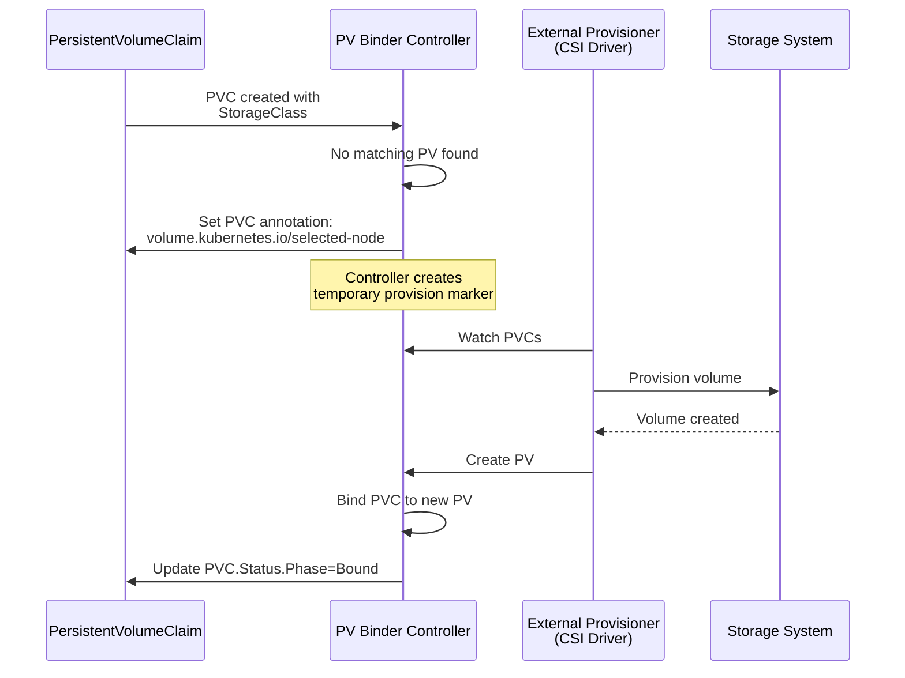
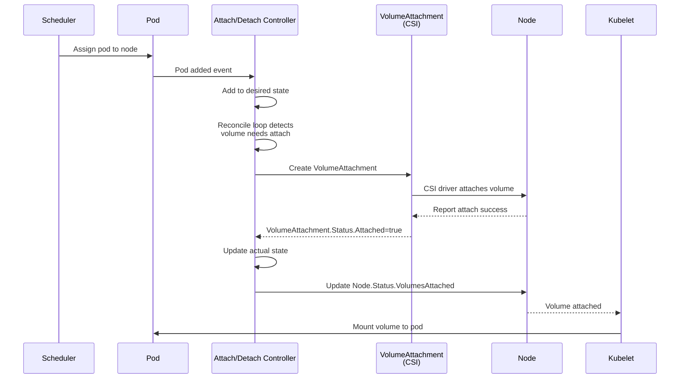

# Storage Controllers - Mid-Level Architecture

**Document Version:** 1.0
**Last Updated:** 2025-10-22
**Status:** Complete

---

## Table of Contents
1. [Introduction](#introduction)
2. [PersistentVolume Binder Controller](#persistentvolume-binder-controller)
3. [Attach/Detach Controller](#attachdetach-controller)
4. [PV Expander Controller](#pv-expander-controller)
5. [PVC Protection Controller](#pvc-protection-controller)
6. [PV Protection Controller](#pv-protection-controller)
7. [Ephemeral Volume Controller](#ephemeral-volume-controller)
8. [Performance and Scalability](#performance-and-scalability)

---

## Introduction

Storage controllers manage the lifecycle of persistent storage in Kubernetes, from binding to provisioning, attaching to expanding.

**Controllers Covered:**
1. **PersistentVolume Binder** - Binds PVCs to PVs, dynamic provisioning
2. **Attach/Detach** - Attaches volumes to nodes
3. **PV Expander** - Expands volumes based on PVC requests
4. **PVC Protection** - Protects PVCs in use from deletion
5. **PV Protection** - Protects bound PVs from deletion
6. **Ephemeral Volume** - Manages ephemeral inline volumes
7. **Resource Claim** - Manages dynamic resource allocation (feature-gated)
8. **SELinux Warning** - Warns about SELinux conflicts
9. **VolumeAttributesClass Protection** - Protects VolumeAttributesClass in use

**Key Concepts:**
- **PersistentVolume (PV)**: Cluster resource representing storage
- **PersistentVolumeClaim (PVC)**: User request for storage
- **StorageClass**: Defines provisioner and parameters
- **Binding**: Two-way pointer between PV and PVC
- **Dynamic Provisioning**: Automatic PV creation
- **Volume Attachment**: OS-level mount operation

**Source Files:**
- **Binder**: `pkg/controller/volume/persistentvolume/pv_controller.go`
- **Attach/Detach**: `pkg/controller/volume/attachdetach/attach_detach_controller.go`
- **Expand**: `pkg/controller/volume/expand/expand_controller.go`
- **Protection**: `pkg/controller/volume/pvcprotection/pvc_protection_controller.go`
- **Registration**: `cmd/kube-controller-manager/app/core.go`

---

## PersistentVolume Binder Controller

### Overview

**Purpose:** Bind PersistentVolumeClaims to PersistentVolumes and handle dynamic provisioning.

**Location:** `pkg/controller/volume/persistentvolume/pv_controller.go:142`

**Famous Comment:**

```go
// ==================================================================
// PLEASE DO NOT ATTEMPT TO SIMPLIFY THIS CODE.
// KEEP THE SPACE SHUTTLE FLYING.
// ==================================================================
```

This controller is intentionally written in **"space shuttle style"** - every branch and condition is explicitly handled to ensure correctness in complex binding scenarios.

**Key Responsibilities:**
1. Bind PVCs to matching PVs
2. Dynamically provision volumes via StorageClass
3. Handle pre-bound volumes/claims
4. Delete/recycle released volumes
5. Manage volume status and events

### Data Structure

```go
type PersistentVolumeController struct {
    // ┌─────────────────────────────────────────────────────────────┐
    // │ LISTERS                                                       │
    // └─────────────────────────────────────────────────────────────┘
    volumeLister       corelisters.PersistentVolumeLister
    claimLister        corelisters.PersistentVolumeClaimLister
    classLister        storagelisters.StorageClassLister
    podLister          corelisters.PodLister
    NodeLister         corelisters.NodeLister

    // ┌─────────────────────────────────────────────────────────────┐
    // │ SYNC STATUS                                                   │
    // └─────────────────────────────────────────────────────────────┘
    volumeListerSynced cache.InformerSynced
    claimListerSynced  cache.InformerSynced
    classListerSynced  cache.InformerSynced
    podListerSynced    cache.InformerSynced
    NodeListerSynced   cache.InformerSynced

    podIndexer cache.Indexer

    kubeClient                clientset.Interface
    eventBroadcaster          record.EventBroadcaster
    eventRecorder             record.EventRecorder
    volumePluginMgr           vol.VolumePluginMgr
    enableDynamicProvisioning bool
    resyncPeriod              time.Duration

    // ┌─────────────────────────────────────────────────────────────┐
    // │ LOCAL CACHES (for conflict resolution)                       │
    // └─────────────────────────────────────────────────────────────┘
    // Cache of last known version to handle race conditions
    // Binding generates ~4 events, cache prevents redundant operations
    volumes persistentVolumeOrderedIndex
    claims  cache.Store

    // ┌─────────────────────────────────────────────────────────────┐
    // │ WORK QUEUES (single worker for each queue)                   │
    // └─────────────────────────────────────────────────────────────┘
    // Must use single worker - two workers could bind same volume twice
    claimQueue  *workqueue.Typed[string]
    volumeQueue *workqueue.Typed[string]

    // ┌─────────────────────────────────────────────────────────────┐
    // │ ASYNC OPERATIONS                                              │
    // └─────────────────────────────────────────────────────────────┘
    runningOperations goroutinemap.GoRoutineMap

    // Translation for CSI migration
    translator          CSINameTranslator
    csiMigratedPluginManager CSIMigratedPluginManager

    // Metrics
    operationTimestamps metrics.OperationTimestamps
}
```

### Binding State Machine



### PVC States

| Phase | Description | Next State |
|-------|-------------|------------|
| **Pending** | Waiting for matching PV or provisioning | Bound, Lost |
| **Bound** | Bound to PV | Released (on PVC delete) |
| **Lost** | PV no longer exists | Terminal |

### PV States

| Phase | Description | Reclaim Policy | Next State |
|-------|-------------|----------------|------------|
| **Available** | Ready for binding | N/A | Bound |
| **Bound** | Bound to PVC | N/A | Released |
| **Released** | PVC deleted | Retain/Delete/Recycle | Available, Deleted, Failed |
| **Failed** | Reclaim failed | N/A | Deleted (manual) |

### Binding Algorithm

**Location:** `pkg/controller/volume/persistentvolume/pv_controller.go`



### Matching Criteria

**PVC → PV Matching:**

```go
func claimMatchesVolume(claim *v1.PersistentVolumeClaim, volume *v1.PersistentVolume) bool {
    // 1. Size: PV capacity ≥ PVC requested
    requestedSize := claim.Spec.Resources.Requests[v1.ResourceStorage]
    pvSize := volume.Spec.Capacity[v1.ResourceStorage]
    if pvSize.Cmp(requestedSize) < 0 {
        return false  // PV too small
    }

    // 2. Access modes: PV must support ALL PVC requested modes
    for _, requestedMode := range claim.Spec.AccessModes {
        if !sliceContains(volume.Spec.AccessModes, requestedMode) {
            return false  // PV doesn't support required access mode
        }
    }

    // 3. StorageClass: Must match (or both empty)
    if !storageClassEqual(claim.Spec.StorageClassName, volume.Spec.StorageClassName) {
        return false
    }

    // 4. Label selector: PV labels must satisfy PVC selector
    if claim.Spec.Selector != nil {
        selector, _ := metav1.LabelSelectorAsSelector(claim.Spec.Selector)
        if !selector.Matches(labels.Set(volume.Labels)) {
            return false
        }
    }

    // 5. Volume mode: Must match (Filesystem vs Block)
    if !volumeModeMatches(claim, volume) {
        return false
    }

    return true
}
```

### Access Modes

| Mode | Abbreviation | Meaning |
|------|--------------|---------|
| **ReadWriteOnce** | RWO | Mount read-write by single node |
| **ReadOnlyMany** | ROX | Mount read-only by many nodes |
| **ReadWriteMany** | RWX | Mount read-write by many nodes |
| **ReadWriteOncePod** | RWOP | Mount read-write by single pod (CSI only) |

### Dynamic Provisioning

**Flow:**



**Annotations:**

```yaml
# On PVC during provisioning
annotations:
  volume.kubernetes.io/selected-node: "node-1"  # For topology-aware provisioning
  volume.beta.kubernetes.io/storage-provisioner: "ebs.csi.aws.com"
  volume.kubernetes.io/storage-provisioner: "ebs.csi.aws.com"
```

### Reclaim Policies

**Location:** `v1.PersistentVolumeReclaimPolicy`

| Policy | Behavior | Use Case |
|--------|----------|----------|
| **Retain** | Keep PV, set to Released | Production data, manual review |
| **Delete** | Delete PV and underlying storage | Default, cloud volumes |
| **Recycle** (deprecated) | Scrub data (rm -rf), set to Available | Legacy, use Delete instead |

**Example:**

```yaml
apiVersion: v1
kind: PersistentVolume
metadata:
  name: pv-retain
spec:
  capacity:
    storage: 10Gi
  accessModes:
  - ReadWriteOnce
  persistentVolumeReclaimPolicy: Retain  # Keep after PVC deletion
  storageClassName: manual
  hostPath:
    path: /mnt/data
```

### Bidirectional Binding

**Problem:** Transactionless system, race conditions possible.

**Solution:** Two-step binding with conflict resolution.

```go
// Step 1: Update PV.Spec.ClaimRef
pv.Spec.ClaimRef = &v1.ObjectReference{
    Kind:      "PersistentVolumeClaim",
    Namespace: pvc.Namespace,
    Name:      pvc.Name,
    UID:       pvc.UID,
}
pv, err = client.CoreV1().PersistentVolumes().Update(pv)

// Step 2: Update PVC.Spec.VolumeName
pvc.Spec.VolumeName = pv.Name
pvc, err = client.CoreV1().PersistentVolumeClaims(pvc.Namespace).Update(pvc)

// Conflict resolution:
// - If PV update fails (version conflict): Retry
// - If PVC update fails: Clear PV.ClaimRef, retry
// - Cache updates prevent redundant operations
```

---

## Attach/Detach Controller

### Overview

**Purpose:** Attach volumes to nodes before pods can mount them.

**Location:** `pkg/controller/volume/attachdetach/attach_detach_controller.go`

**Key Responsibilities:**
1. Watch pods scheduled to nodes
2. Attach required volumes to nodes
3. Detach volumes from nodes when no longer needed
4. Manage VolumeAttachment resources (CSI)
5. Handle attach/detach timeouts

### Data Structure

```go
type AttachDetachController struct {
    // ┌─────────────────────────────────────────────────────────────┐
    // │ DESIRED STATE OF WORLD                                        │
    // └─────────────────────────────────────────────────────────────┘
    desiredStateOfWorld cache.DesiredStateOfWorld

    // ┌─────────────────────────────────────────────────────────────┐
    // │ ACTUAL STATE OF WORLD                                         │
    // └─────────────────────────────────────────────────────────────┘
    actualStateOfWorld cache.ActualStateOfWorld

    // ┌─────────────────────────────────────────────────────────────┐
    // │ RECONCILER                                                    │
    // └─────────────────────────────────────────────────────────────┘
    reconciler reconciler.Reconciler

    // ┌─────────────────────────────────────────────────────────────┐
    // │ VOLUME PLUGIN MANAGER                                         │
    // └─────────────────────────────────────────────────────────────┘
    volumePluginMgr *volume.VolumePluginMgr

    // ┌─────────────────────────────────────────────────────────────┐
    // │ LISTERS                                                       │
    // └─────────────────────────────────────────────────────────────┘
    pvcLister  corelisters.PersistentVolumeClaimLister
    pvLister   corelisters.PersistentVolumeLister
    podLister  corelisters.PodLister
    nodeLister corelisters.NodeLister

    // ┌─────────────────────────────────────────────────────────────┐
    // │ CLIENT                                                        │
    // └─────────────────────────────────────────────────────────────┘
    kubeClient clientset.Interface

    // ┌─────────────────────────────────────────────────────────────┐
    // │ CSI INTEGRATION                                               │
    // └─────────────────────────────────────────────────────────────┘
    csiMigratedPluginManager csimigration.PluginManager
    intreeToCSITranslator    csimigration.InTreeToCSI

    cloud cloudprovider.Interface
}
```

### Attach/Detach Flow



### Desired vs Actual State

**Desired State:**
- Volumes that SHOULD be attached based on pod scheduling
- Built from pod specs

**Actual State:**
- Volumes that ARE attached based on VolumeAttachment status
- Built from VolumeAttachment resources and Node status

**Reconciliation:**
```
For each volume in desired but not actual:
  → Attach volume

For each volume in actual but not desired:
  → Detach volume (after safe-to-detach period)
```

### Safe-to-Detach Period

**Purpose:** Prevent premature detach during pod termination.

```go
// Wait before detaching to allow:
// 1. Pod to complete graceful shutdown
// 2. Kubelet to unmount volume
// 3. Filesystem sync to complete

const (
    // Time to wait before detaching
    DefaultMaxWaitForUnmountDuration = 6 * time.Minute
)
```

### VolumeAttachment Resource (CSI)

**Example:**

```yaml
apiVersion: storage.k8s.io/v1
kind: VolumeAttachment
metadata:
  name: csi-abc123
spec:
  attacher: ebs.csi.aws.com  # CSI driver name
  nodeName: node-1
  source:
    persistentVolumeName: pv-123
status:
  attached: true
  attachmentMetadata:
    devicePath: /dev/xvdba
  attachError: null
  detachError: null
```

---

## PV Expander Controller

### Overview

**Purpose:** Expand volumes based on PVC resize requests.

**Location:** `pkg/controller/volume/expand/expand_controller.go`

**Key Responsibilities:**
1. Detect PVC resize requests
2. Expand underlying volume
3. Update PVC and PV capacity
4. Handle online vs offline expansion

### Expansion Flow

```mermaid
flowchart TB
    Start([PVC Resized])
    CheckFS{Feature<br/>supported?}
    Skip([Skip - not supported])

    CheckOnline{Online<br/>expansion?}
    ExpandOffline[1. Cordon node<br/>2. Delete pod<br/>3. Expand volume<br/>4. Recreate pod]
    ExpandOnline[1. Expand volume<br/>2. Notify kubelet<br/>3. Resize filesystem]

    WaitAttach[Wait for volume<br/>to be attached]
    Expand[Call volume plugin<br/>Expand()]

    UpdatePV[Update PV.Spec.Capacity]
    UpdatePVC[Update PVC.Status.Capacity]

    Done([Done])

    Start --> CheckFS
    CheckFS -->|No| Skip
    CheckFS -->|Yes| CheckOnline

    CheckOnline -->|No| ExpandOffline
    CheckOnline -->|Yes| ExpandOnline

    ExpandOffline --> Expand
    ExpandOnline --> WaitAttach
    WaitAttach --> Expand

    Expand --> UpdatePV
    UpdatePV --> UpdatePVC
    UpdatePVC --> Done
    Skip --> Done
```

### Expansion Conditions

**PVC:**

```yaml
apiVersion: v1
kind: PersistentVolumeClaim
metadata:
  name: my-claim
spec:
  resources:
    requests:
      storage: 20Gi  # Increased from 10Gi
status:
  capacity:
    storage: 10Gi  # Current capacity
  conditions:
  - type: Resizing
    status: "True"
  - type: FileSystemResizePending
    status: "True"  # Waiting for node-side resize
```

---

## PVC Protection Controller

### Overview

**Purpose:** Prevent deletion of PVCs that are in use by pods.

**Location:** `pkg/controller/volume/pvcprotection/pvc_protection_controller.go`

**Key Mechanism:** Finalizer

### Finalizer Logic

```yaml
apiVersion: v1
kind: PersistentVolumeClaim
metadata:
  name: my-claim
  finalizers:
  - kubernetes.io/pvc-protection  # Blocks deletion while in use
```

**Rules:**
1. Finalizer added when PVC created
2. Finalizer removed when:
   - PVC not bound, OR
   - PVC bound but not used by any pod

**Protection:**
```
User tries to delete PVC → API server marks for deletion (sets DeletionTimestamp)
→ Controller sees DeletionTimestamp
→ Controller checks if PVC in use
→ If in use: Keep finalizer (prevents deletion)
→ If not in use: Remove finalizer (allows deletion)
```

---

## PV Protection Controller

### Overview

**Purpose:** Prevent deletion of PVs that are bound to PVCs.

**Location:** `pkg/controller/volume/pvprotection/pv_protection_controller.go`

**Similar to PVC Protection:**

```yaml
apiVersion: v1
kind: PersistentVolume
metadata:
  name: my-pv
  finalizers:
  - kubernetes.io/pv-protection  # Blocks deletion while bound
```

---

## Ephemeral Volume Controller

### Overview

**Purpose:** Manage generic ephemeral volumes (inline PVCs in pod spec).

**Location:** `pkg/controller/volume/ephemeral/controller.go`

**Feature:** Allows defining PVCs inline in pod spec, controller creates/deletes them.

**Example:**

```yaml
apiVersion: v1
kind: Pod
metadata:
  name: my-pod
spec:
  volumes:
  - name: scratch
    ephemeral:
      volumeClaimTemplate:
        spec:
          accessModes: [ReadWriteOnce]
          resources:
            requests:
              storage: 1Gi
          storageClassName: fast
```

**Controller Actions:**
1. Pod created → Create PVC from template
2. PVC bound → Pod can use volume
3. Pod deleted → Delete PVC (with owner reference)

---

## Performance and Scalability

### PV Binder Performance

**Throughput:**
- Bindings/sec: ~5-10 (single worker)
- Provisioning/sec: Depends on external provisioner

**Scalability:**
- Tested: 10,000 PVCs
- Bottleneck: Single worker queue (prevents conflicts)

**Optimization:**
- Local cache reduces API server load
- Batch status updates

### Attach/Detach Performance

**Throughput:**
- Attachments/sec: ~2-5 per node
- Limited by storage system

**Scalability:**
- Tested: 1000 nodes, 10,000 volumes
- Parallel attach operations per node

**Configuration:**

```yaml
# Disable attach/detach controller for kubelet-managed attach
--enable-attach-detach-controller=false
```

### Expander Performance

**Throughput:**
- Expansions/sec: ~1-2 (storage dependent)

**Scalability:**
- Handles 1000s of expansion requests
- Queued and processed serially per PVC

---

## Summary

### Key Takeaways

1. **Space Shuttle Code**: PV binder is intentionally verbose for correctness
2. **Bidirectional Binding**: PV ↔ PVC pointer prevents race conditions
3. **Dynamic Provisioning**: External provisioners via StorageClass
4. **Attach/Detach**: Separate from mount, managed by controller
5. **Protection Finalizers**: Prevent deletion of in-use resources
6. **Volume Expansion**: Supports online and offline resize

### Storage Workflow

```
1. User creates PVC
2. PV Binder: Finds PV or provisions
3. PVC bound to PV
4. Pod scheduled using PVC
5. Attach/Detach: Attaches volume to node
6. Kubelet: Mounts volume to pod
7. Pod deleted
8. Kubelet: Unmounts volume
9. Attach/Detach: Detaches volume from node
10. PVC deleted
11. PV: Reclaimed based on policy
```

### Cross-References

- **[08-workload-controllers.md](08-workload-controllers.md)** - StatefulSet volume claims
- **[20-data-structures.md](20-data-structures.md)** - Controller structures
- **[07-shared-infrastructure.md](07-shared-infrastructure.md)** - Informers and queues

---

**Next Documents:**
- `12-resource-lifecycle-controllers.md` - Namespace, garbage collection, TTL
- `13-security-controllers.md` - ServiceAccount, certificates