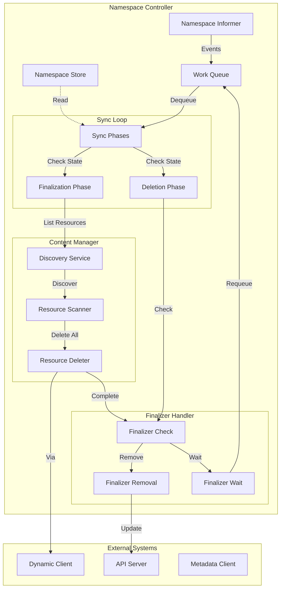
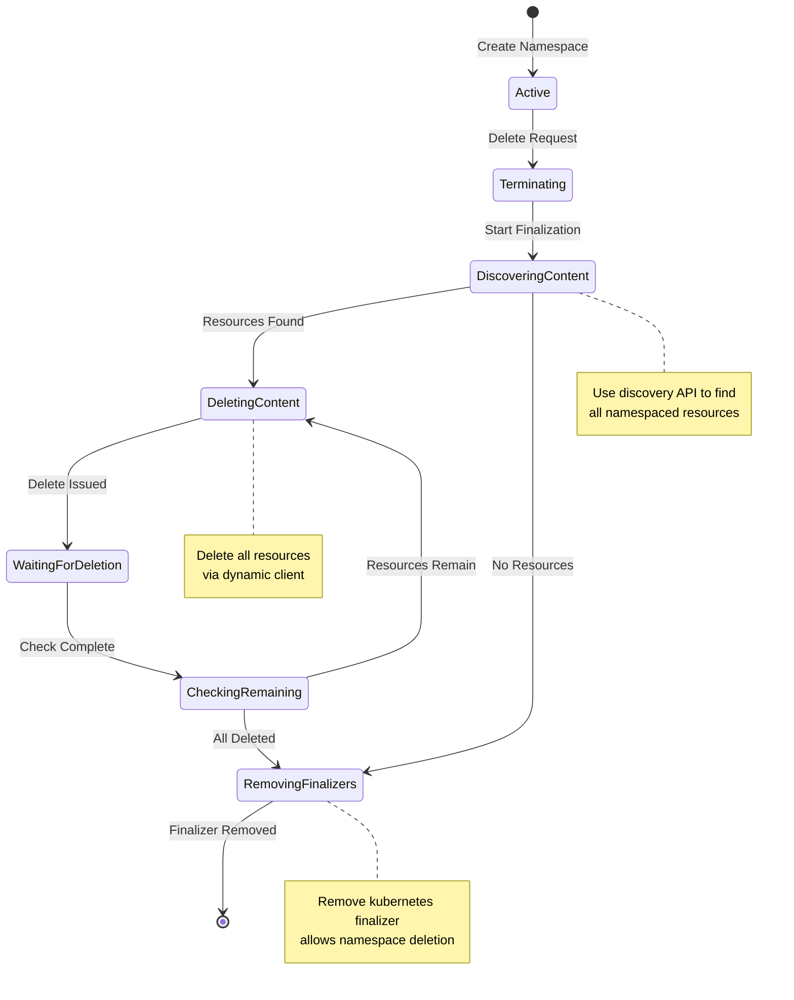
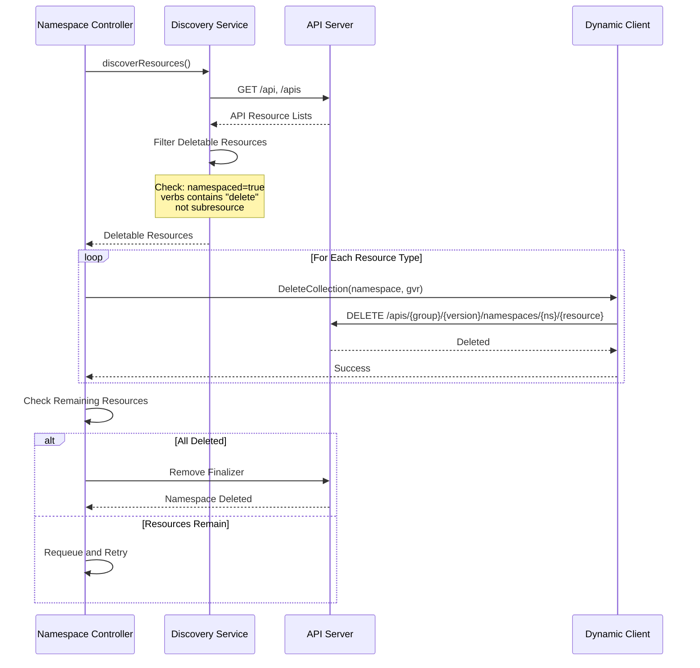
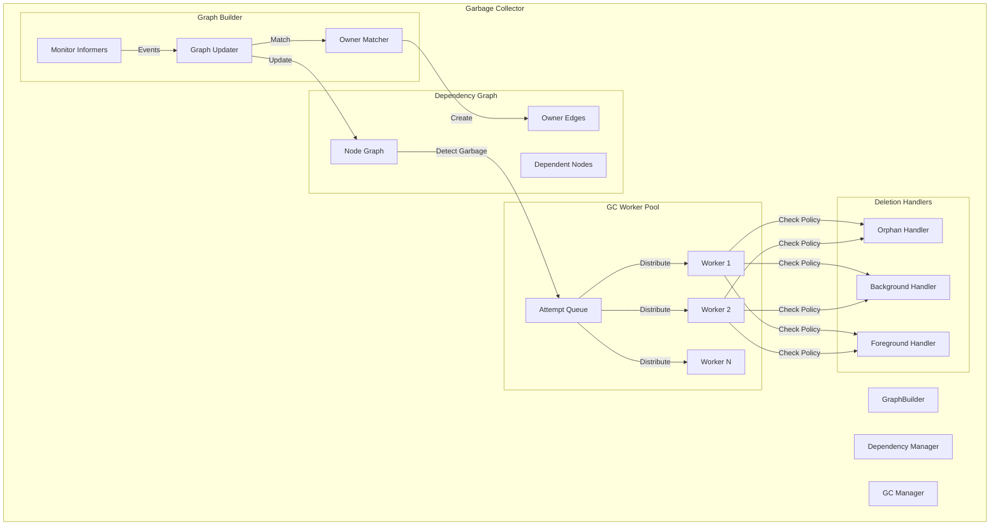
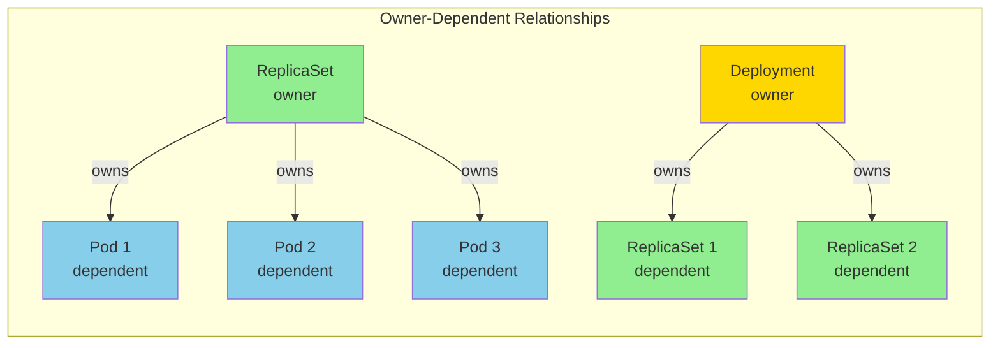
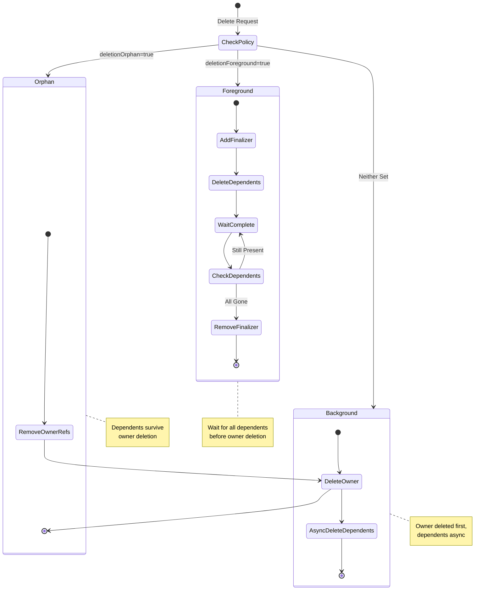
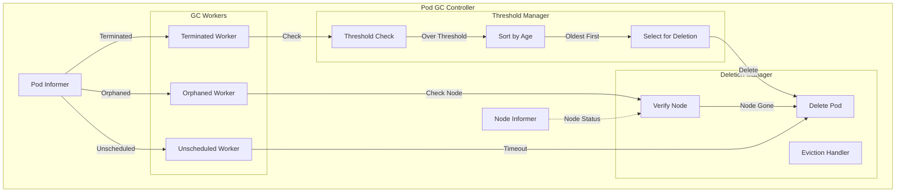
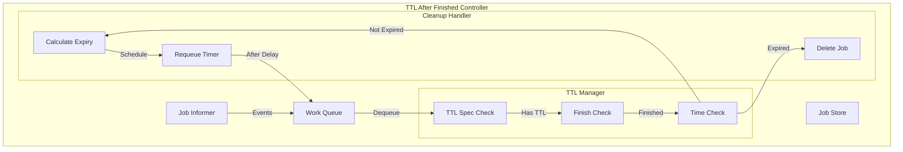
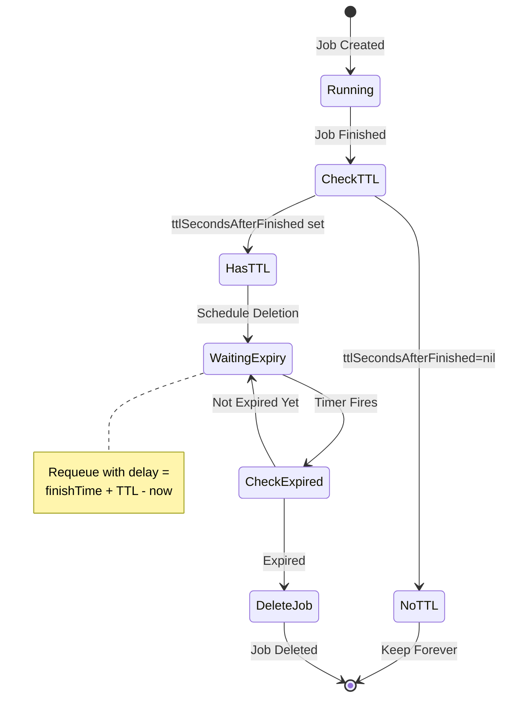
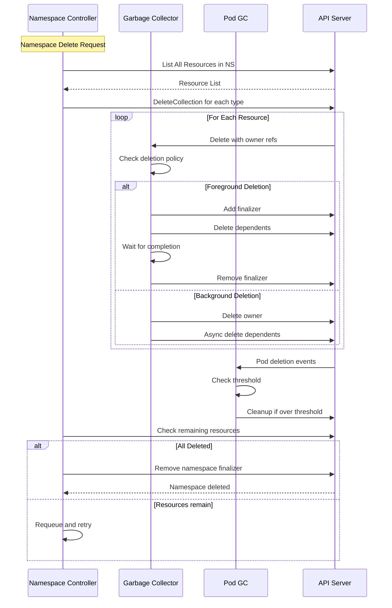

# Resource Lifecycle Controllers

**Author**: Claude (AI Assistant)
**Date**: 2025-10-21
**Status**: Architecture Study
**Component**: kube-controller-manager

## Overview

Resource lifecycle controllers manage the complete lifecycle of Kubernetes resources from creation through finalization and deletion. These controllers implement garbage collection, namespace finalization, TTL-based cleanup, and ownership-based cascading deletion policies.

## Key Components

### 1. Namespace Controller

**Source**: `pkg/controller/namespace/namespace_controller.go`

Manages namespace lifecycle including finalization and cleanup of all resources within a namespace before deletion.

#### Architecture



#### State Machine



#### Core Algorithm

```go
// Source: pkg/controller/namespace/namespace_controller.go

type NamespaceController struct {
    listerSynced cache.InformerSynced
    queue        workqueue.RateLimitingInterface

    // Used to delete all resources in namespace
    metadataClient metadata.Interface
    discoverResourcesFn func() ([]*metav1.APIResourceList, error)

    // Helper for namespace finalization
    namespacedResourcesDeleter NamespacedResourcesDeleterInterface
}

// Sync phases for namespace lifecycle
func (nm *NamespaceController) syncNamespaceFromKey(key string) error {
    namespace, err := nm.lister.Get(key)
    if err != nil {
        return err
    }

    if namespace.DeletionTimestamp == nil {
        return nil // Active namespace, nothing to do
    }

    // Namespace is being deleted, ensure it is finalized
    return nm.namespacedResourcesDeleter.Delete(namespace.Name)
}
```

#### Namespace Finalization Algorithm

```go
// Source: pkg/controller/namespace/deletion/namespaced_resources_deleter.go

type namespacedResourcesDeleter struct {
    metadataClient      metadata.Interface
    discoverResourcesFn func() ([]*metav1.APIResourceList, error)
    finalizerToken      v1.FinalizerName
}

// Delete orchestrates namespace finalization
func (d *namespacedResourcesDeleter) Delete(nsName string) error {
    // 1. Discover all deletable resources in namespace
    deletableResources, err := d.discoverResources()
    if err != nil {
        return err
    }

    // 2. Delete all content in namespace
    deleteErrors := d.deleteAllContent(nsName, deletableResources)
    if len(deleteErrors) > 0 {
        return fmt.Errorf("failed to delete all content: %v", deleteErrors)
    }

    // 3. Remove finalizer from namespace
    return d.removeFinalizer(nsName)
}

// Delete all resources in namespace
func (d *namespacedResourcesDeleter) deleteAllContent(
    nsName string,
    resources []deletableResource,
) []error {
    var errs []error

    for _, resource := range resources {
        err := d.deleteCollection(nsName, resource)
        if err != nil {
            errs = append(errs, err)
        }
    }

    return errs
}

// DeleteCollection deletes all resources of a type in namespace
func (d *namespacedResourcesDeleter) deleteCollection(
    nsName string,
    resource deletableResource,
) error {
    gvr := schema.GroupVersionResource{
        Group:    resource.Group,
        Version:  resource.Version,
        Resource: resource.Name,
    }

    deletePolicy := metav1.DeletePropagationBackground
    return d.metadataClient.Resource(gvr).
        Namespace(nsName).
        DeleteCollection(context.TODO(), metav1.DeleteOptions{
            PropagationPolicy: &deletePolicy,
        }, metav1.ListOptions{})
}
```

#### Discovery and Resource Scanning



---

### 2. Garbage Collector

**Source**: `pkg/controller/garbagecollector/garbagecollector.go`

Implements ownership-based garbage collection with support for cascading deletion policies (Orphan, Background, Foreground).

#### Architecture



#### Dependency Graph Structure



#### Core Data Structures

```go
// Source: pkg/controller/garbagecollector/graph.go

// UIDs form a graph with directed edges indicating ownership
type concurrentUIDToNode struct {
    uidToNodeLock sync.RWMutex
    uidToNode     map[types.UID]*node
}

// Node represents a resource in the dependency graph
type node struct {
    identity objectReference

    // Owners this node depends on
    dependentsLock sync.RWMutex
    dependents     map[*node]struct{}

    // Virtual node to track ownership expectations
    virtual bool

    // Beingdeleted indicates object is being deleted
    beingDeleted bool

    // Deletion is blocked if any owner is beingDeleted
    deletingDependents     bool
    deletingDependentsLock sync.RWMutex
}

// Object reference for graph nodes
type objectReference struct {
    metav1.OwnerReference
    Namespace string
}
```

#### GraphBuilder Algorithm

```go
// Source: pkg/controller/garbagecollector/graph_builder.go

type GraphBuilder struct {
    // Dependency graph
    uidToNode *concurrentUIDToNode

    // Queue of items to sync
    graphChanges workqueue.RateLimitingInterface

    // Monitor specific resource types
    monitors    monitors
    monitorLock sync.RWMutex

    // Attempt to delete queue
    attemptToDelete workqueue.RateLimitingInterface
}

// Process events and maintain graph
func (gb *GraphBuilder) processGraphChanges() {
    for gb.processGraphChanges() {
    }
}

func (gb *GraphBuilder) runProcessGraphChanges() bool {
    item, quit := gb.graphChanges.Get()
    if quit {
        return false
    }
    defer gb.graphChanges.Done(item)

    event, ok := item.(*event)
    if !ok {
        return true
    }

    obj := event.obj
    accessor, err := meta.Accessor(obj)
    if err != nil {
        return true
    }

    switch event.eventType {
    case addEvent, updateEvent:
        gb.insertNode(accessor, event.gvk)
        gb.processTransitions(event.oldObj, accessor, event.gvk)
    case deleteEvent:
        gb.removeNode(accessor)
    }

    return true
}
```

#### Graph Node Management

```go
// Source: pkg/controller/garbagecollector/graph_builder.go

// Insert or update node in graph
func (gb *GraphBuilder) insertNode(
    accessor metav1.Object,
    gvk schema.GroupVersionKind,
) {
    uid := accessor.GetUID()

    // Get or create node
    n := gb.uidToNode.Read(uid)
    if n == nil {
        n = &node{
            identity: objectReference{
                OwnerReference: metav1.OwnerReference{
                    APIVersion: gvk.GroupVersion().String(),
                    Kind:       gvk.Kind,
                    UID:        uid,
                    Name:       accessor.GetName(),
                },
                Namespace: accessor.GetNamespace(),
            },
            dependents: make(map[*node]struct{}),
        }
        gb.uidToNode.Write(n)
    }

    // Update owner references
    ownerReferences := accessor.GetOwnerReferences()
    for _, owner := range ownerReferences {
        ownerNode := gb.uidToNode.Read(owner.UID)
        if ownerNode == nil {
            // Create virtual node for owner
            ownerNode = &node{
                identity: objectReference{
                    OwnerReference: owner,
                    Namespace:      accessor.GetNamespace(),
                },
                dependents: make(map[*node]struct{}),
                virtual:    true,
            }
            gb.uidToNode.Write(ownerNode)
        }

        // Add edge from owner to dependent
        ownerNode.addDependent(n)
    }

    // Remove edges for owners no longer present
    n.removeOwnersDiff(ownerReferences)
}
```

#### Deletion Policy State Machines



#### GC Worker Algorithm

```go
// Source: pkg/controller/garbagecollector/garbagecollector.go

type GarbageCollector struct {
    // Dependency graph
    dependencyGraphBuilder *GraphBuilder

    // Attempt to delete queue
    attemptToDelete workqueue.RateLimitingInterface

    // Clients for deletion
    metadataClient metadata.Interface
}

// Worker processes attempt-to-delete queue
func (gc *GarbageCollector) runAttemptToDeleteWorker() {
    for gc.processAttemptToDeleteWorker() {
    }
}

func (gc *GarbageCollector) processAttemptToDeleteWorker() bool {
    item, quit := gc.attemptToDelete.Get()
    if quit {
        return false
    }
    defer gc.attemptToDelete.Done(item)

    n, ok := item.(*node)
    if !ok {
        return true
    }

    err := gc.attemptToDeleteItem(n)
    if err != nil {
        gc.attemptToDelete.AddRateLimited(item)
    }

    return true
}
```

#### Attempt Delete Item

```go
// Source: pkg/controller/garbagecollector/garbagecollector.go

func (gc *GarbageCollector) attemptToDeleteItem(item *node) error {
    // Get latest metadata
    latest, err := gc.getObject(item.identity)
    if errors.IsNotFound(err) {
        return nil // Already deleted
    }
    if err != nil {
        return err
    }

    // Check if item should be deleted
    if latest.GetDeletionTimestamp() != nil {
        return nil // Already being deleted
    }

    // Check owners
    ownerReferences := latest.GetOwnerReferences()
    solid, dangling, waitingFor, err := gc.classifyReferences(item, ownerReferences)
    if err != nil {
        return err
    }

    // Has solid owners, not garbage
    if len(solid) > 0 {
        return nil
    }

    // Has owners we're waiting for info on
    if len(waitingFor) > 0 {
        return gc.orphanDependents(item, waitingFor)
    }

    // Only has dangling owners, is garbage
    if len(dangling) > 0 {
        return gc.deleteObject(item.identity, latest)
    }

    // No owners at all
    return nil
}
```

#### Classify Owner References

```go
// Source: pkg/controller/garbagecollector/garbagecollector.go

func (gc *GarbageCollector) classifyReferences(
    item *node,
    ownerReferences []metav1.OwnerReference,
) (
    solid []metav1.OwnerReference,
    dangling []metav1.OwnerReference,
    waitingFor []metav1.OwnerReference,
    err error,
) {
    for _, ref := range ownerReferences {
        // Check if owner exists
        owner, err := gc.getObject(objectReference{
            OwnerReference: ref,
            Namespace:      item.identity.Namespace,
        })

        if errors.IsNotFound(err) {
            dangling = append(dangling, ref)
            continue
        }

        if err != nil {
            waitingFor = append(waitingFor, ref)
            continue
        }

        // Owner exists
        if owner.GetUID() != ref.UID {
            dangling = append(dangling, ref)
        } else {
            solid = append(solid, ref)
        }
    }

    return solid, dangling, waitingFor, nil
}
```

#### Deletion Policy Implementation

```go
// Source: pkg/controller/garbagecollector/garbagecollector.go

func (gc *GarbageCollector) deleteObject(
    identity objectReference,
    latest *metav1.PartialObjectMetadata,
) error {
    policy := metav1.DeletePropagationBackground

    // Check for orphan/foreground deletion
    if hasOrphanFinalizer(latest) {
        // First remove dependent references
        return gc.orphanDependents(identity)
    }

    if hasForegroundFinalizer(latest) {
        policy = metav1.DeletePropagationForeground
    }

    return gc.metadataClient.Resource(identity.GroupVersionResource()).
        Namespace(identity.Namespace).
        Delete(context.TODO(), identity.Name, metav1.DeleteOptions{
            PropagationPolicy: &policy,
        })
}

// Orphan dependents by removing owner reference
func (gc *GarbageCollector) orphanDependents(
    owner objectReference,
) error {
    dependents := gc.dependencyGraphBuilder.uidToNode.
        Read(owner.UID).getDependents()

    for dep := range dependents {
        // Remove owner reference from dependent
        patch := deleteOwnerRefStrategicMergePatch(
            dep.identity.UID,
            owner.UID,
        )

        _, err := gc.patch(dep, patch)
        if err != nil && !errors.IsNotFound(err) {
            return err
        }
    }

    return nil
}
```

---

### 3. Pod Garbage Collector

**Source**: `pkg/controller/podgc/gc_controller.go`

Cleans up terminated pods based on thresholds and policies.

#### Architecture



#### Core Algorithm

```go
// Source: pkg/controller/podgc/gc_controller.go

type PodGCController struct {
    podLister       corelisters.PodLister
    podListerSynced cache.InformerSynced

    nodeLister       corelisters.NodeLister
    nodeListerSynced cache.InformerSynced

    kubeClient clientset.Interface

    // Thresholds
    terminatedPodThreshold int
}

// GC terminated pods
func (gcc *PodGCController) gcTerminated(pods []*v1.Pod) {
    terminatedPods := []*v1.Pod{}

    for _, pod := range pods {
        if isPodTerminated(pod) {
            terminatedPods = append(terminatedPods, pod)
        }
    }

    // Sort by creation timestamp
    sort.Sort(byCreationTimestamp(terminatedPods))

    // Delete pods over threshold
    deleteCount := len(terminatedPods) - gcc.terminatedPodThreshold
    if deleteCount <= 0 {
        return
    }

    for i := 0; i < deleteCount; i++ {
        pod := terminatedPods[i]
        if err := gcc.kubeClient.CoreV1().Pods(pod.Namespace).
            Delete(context.TODO(), pod.Name, *metav1.NewDeleteOptions(0)); err != nil {
            // Log error
        }
    }
}

// Check if pod is terminated
func isPodTerminated(pod *v1.Pod) bool {
    if pod.Status.Phase == v1.PodSucceeded {
        return true
    }
    if pod.Status.Phase == v1.PodFailed {
        return true
    }
    return false
}
```

#### Orphaned Pod Detection

```go
// Source: pkg/controller/podgc/gc_controller.go

// GC orphaned pods (node deleted)
func (gcc *PodGCController) gcOrphaned(pods []*v1.Pod, nodes []*v1.Node) {
    nodeNames := sets.NewString()
    for _, node := range nodes {
        nodeNames.Insert(node.Name)
    }

    for _, pod := range pods {
        if pod.Spec.NodeName == "" {
            continue
        }

        if nodeNames.Has(pod.Spec.NodeName) {
            continue
        }

        // Node doesn't exist, delete pod
        gcc.kubeClient.CoreV1().Pods(pod.Namespace).
            Delete(context.TODO(), pod.Name, *metav1.NewDeleteOptions(0))
    }
}
```

---

### 4. TTL Controller

**Source**: `pkg/controller/ttl/ttl_controller.go`

Manages time-to-live for resources with TTL annotations.

#### Architecture

```go
// Source: pkg/controller/ttl/ttl_controller.go

type Controller struct {
    nodeInformer coreinformers.NodeInformer
    nodeLister   corelisters.NodeLister

    // Queue of nodes to check TTL
    queue workqueue.RateLimitingInterface

    kubeClient clientset.Interface
}

// Check and delete expired nodes
func (c *Controller) processNode(node *v1.Node) error {
    ttlAnnotation := node.Annotations["node.kubernetes.io/ttl"]
    if ttlAnnotation == "" {
        return nil
    }

    ttl, err := time.ParseDuration(ttlAnnotation)
    if err != nil {
        return err
    }

    now := time.Now()
    nodeAge := now.Sub(node.CreationTimestamp.Time)

    if nodeAge > ttl {
        // Delete expired node
        return c.kubeClient.CoreV1().Nodes().
            Delete(context.TODO(), node.Name, metav1.DeleteOptions{})
    }

    // Requeue for check when TTL expires
    remaining := ttl - nodeAge
    c.queue.AddAfter(node.Name, remaining)

    return nil
}
```

---

### 5. TTL-After-Finished Controller

**Source**: `pkg/controller/ttlafterfinished/ttlafterfinished_controller.go`

Cleans up finished jobs after a TTL period.

#### Architecture



#### Core Algorithm

```go
// Source: pkg/controller/ttlafterfinished/ttlafterfinished_controller.go

type Controller struct {
    jLister batchlisters.JobLister
    jListerSynced cache.InformerSynced

    queue workqueue.RateLimitingInterface

    client clientset.Interface
}

// Process job for TTL cleanup
func (tc *Controller) processJob(job *batch.Job) error {
    // Check if job has TTL set
    if job.Spec.TTLSecondsAfterFinished == nil {
        return nil
    }

    // Check if job is finished
    finishTime := jobFinishTime(job)
    if finishTime == nil {
        return nil // Job not finished yet
    }

    // Calculate when job should be deleted
    ttl := time.Duration(*job.Spec.TTLSecondsAfterFinished) * time.Second
    expireTime := finishTime.Add(ttl)
    now := time.Now()

    if now.Before(expireTime) {
        // Not expired yet, requeue
        remaining := expireTime.Sub(now)
        tc.queue.AddAfter(job.Namespace+"/"+job.Name, remaining)
        return nil
    }

    // Job has expired, delete it
    policy := metav1.DeletePropagationForeground
    return tc.client.BatchV1().Jobs(job.Namespace).
        Delete(context.TODO(), job.Name, metav1.DeleteOptions{
            PropagationPolicy: &policy,
        })
}

// Get job finish time
func jobFinishTime(job *batch.Job) *time.Time {
    for _, condition := range job.Status.Conditions {
        if (condition.Type == batch.JobComplete ||
            condition.Type == batch.JobFailed) &&
            condition.Status == v1.ConditionTrue {
            return &condition.LastTransitionTime.Time
        }
    }
    return nil
}
```

#### TTL State Machine



---

### 6. Storage Version Garbage Collector

**Source**: `pkg/controller/storageversiongc/gc_controller.go`

Cleans up StorageVersion objects for deleted CRDs.

#### Architecture

```go
// Source: pkg/controller/storageversiongc/gc_controller.go

type Controller struct {
    crdLister       apiextlisters.CustomResourceDefinitionLister
    crdListerSynced cache.InformerSynced

    svLister       storagelisters.StorageVersionLister
    svListerSynced cache.InformerSynced

    queue workqueue.RateLimitingInterface

    client clientset.Interface
}

// Process storage version for cleanup
func (c *Controller) processStorageVersion(sv *storage.StorageVersion) error {
    // Check if corresponding resource still exists
    resourceName := sv.Name

    // Try to find CRD
    _, err := c.crdLister.Get(resourceName)
    if err == nil {
        return nil // CRD still exists
    }

    if !errors.IsNotFound(err) {
        return err
    }

    // CRD not found, check built-in resources
    if isBuiltInResource(resourceName) {
        return nil
    }

    // Resource doesn't exist, delete storage version
    return c.client.InternalV1alpha1().StorageVersions().
        Delete(context.TODO(), sv.Name, metav1.DeleteOptions{})
}
```

---

## Coordination Patterns

### Cross-Controller Interactions



---

## Performance Considerations

### 1. Graph Builder Efficiency

```go
// Source: pkg/controller/garbagecollector/graph_builder.go

// Efficient UID-based graph lookups
type concurrentUIDToNode struct {
    uidToNodeLock sync.RWMutex
    uidToNode     map[types.UID]*node
}

func (m *concurrentUIDToNode) Read(uid types.UID) *node {
    m.uidToNodeLock.RLock()
    defer m.uidToNodeLock.RUnlock()
    return m.uidToNode[uid]
}

func (m *concurrentUIDToNode) Write(n *node) {
    m.uidToNodeLock.Lock()
    defer m.uidToNodeLock.Unlock()
    m.uidToNode[n.identity.UID] = n
}
```

### 2. Namespace Deletion Optimization

- Uses metadata-only client for faster listing
- Parallel deletion of independent resource types
- Efficient discovery caching

### 3. Pod GC Batching

```go
// Sort and batch delete oldest pods
sort.Sort(byCreationTimestamp(terminatedPods))

// Delete in batches to avoid overwhelming API server
const batchSize = 100
for i := 0; i < deleteCount; i += batchSize {
    end := i + batchSize
    if end > deleteCount {
        end = deleteCount
    }

    batch := terminatedPods[i:end]
    deletePodBatch(batch)
}
```

---

## Configuration and Tuning

### Namespace Controller

```go
// Default configuration
const (
    NamespaceFinalizersUpdateRetries = 3
    NamespaceDeletionGracePeriod    = 30 * time.Second
)
```

### Garbage Collector

```bash
# kube-controller-manager flags
--concurrent-gc-syncs=20           # Number of GC workers
--enable-garbage-collector=true    # Enable garbage collection
```

### Pod GC Controller

```bash
# kube-controller-manager flags
--terminated-pod-gc-threshold=12500  # Max terminated pods to keep
```

### TTL After Finished Controller

```yaml
# Job specification
apiVersion: batch/v1
kind: Job
metadata:
  name: example-job
spec:
  ttlSecondsAfterFinished: 100  # Delete 100s after completion
  template:
    spec:
      containers:
      - name: job
        image: busybox
```

---

## Common Patterns

### 1. Finalizer Pattern

Used by namespace controller and garbage collector:

```yaml
metadata:
  finalizers:
  - kubernetes                    # Namespace finalizer
  - foregroundDeletion           # GC foreground deletion
```

### 2. Owner Reference Pattern

```yaml
metadata:
  ownerReferences:
  - apiVersion: apps/v1
    kind: ReplicaSet
    name: nginx-rs
    uid: d9607e19-f88f-11e6-a518-42010a800195
    controller: true
    blockOwnerDeletion: true
```

### 3. Deletion Propagation

```go
// Deletion options with propagation policy
deleteOptions := metav1.DeleteOptions{
    PropagationPolicy: &propagationPolicy,
}

// Policies:
// - Orphan: Leave dependents
// - Background: Delete dependents asynchronously
// - Foreground: Wait for dependents before deleting owner
```

---

## Source References

### Key Files

1. **Namespace Controller**: `pkg/controller/namespace/namespace_controller.go`
2. **Garbage Collector**: `pkg/controller/garbagecollector/garbagecollector.go`
3. **Graph Builder**: `pkg/controller/garbagecollector/graph_builder.go`
4. **Pod GC**: `pkg/controller/podgc/gc_controller.go`
5. **TTL Controller**: `pkg/controller/ttl/ttl_controller.go`
6. **TTL After Finished**: `pkg/controller/ttlafterfinished/ttlafterfinished_controller.go`
7. **Storage Version GC**: `pkg/controller/storageversiongc/gc_controller.go`

---

## Summary

Resource lifecycle controllers implement comprehensive cleanup and finalization:

1. **Namespace Controller**: Ensures clean namespace deletion with complete resource cleanup
2. **Garbage Collector**: Implements ownership-based cascading deletion with multiple policies
3. **Pod GC**: Manages terminated pod cleanup based on thresholds
4. **TTL Controllers**: Provide time-based cleanup for Jobs and other resources
5. **Storage Version GC**: Maintains consistency between CRDs and storage versions

These controllers work together to ensure proper resource lifecycle management, prevent resource leaks, and maintain cluster health through systematic garbage collection policies.
