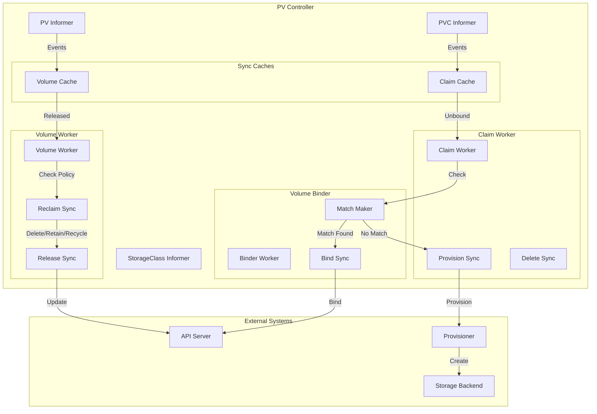
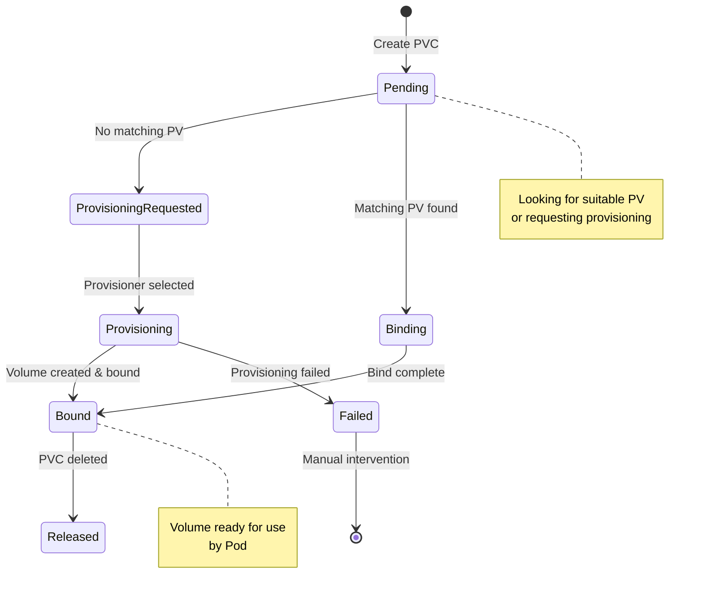
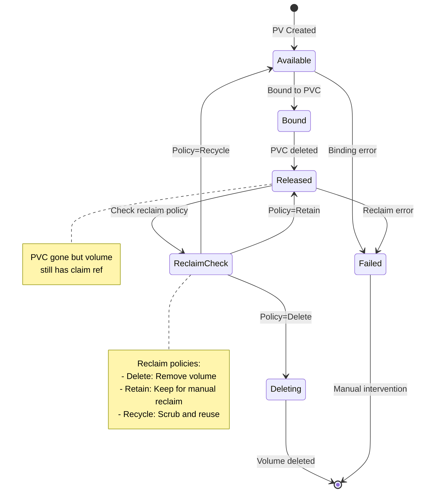
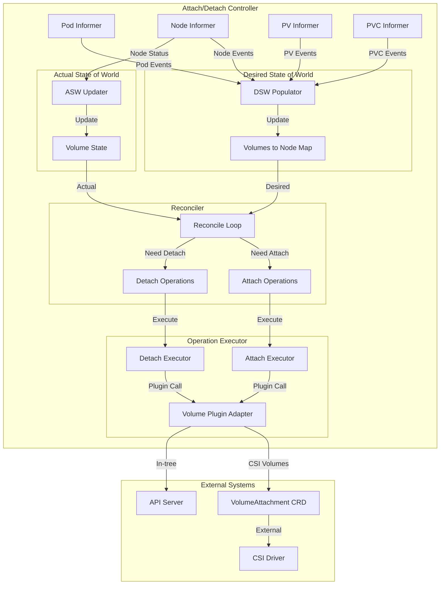
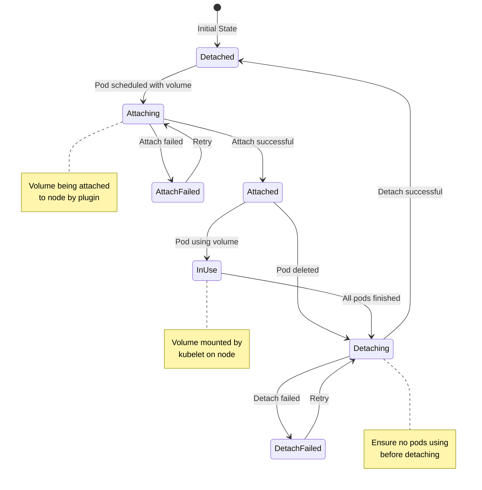
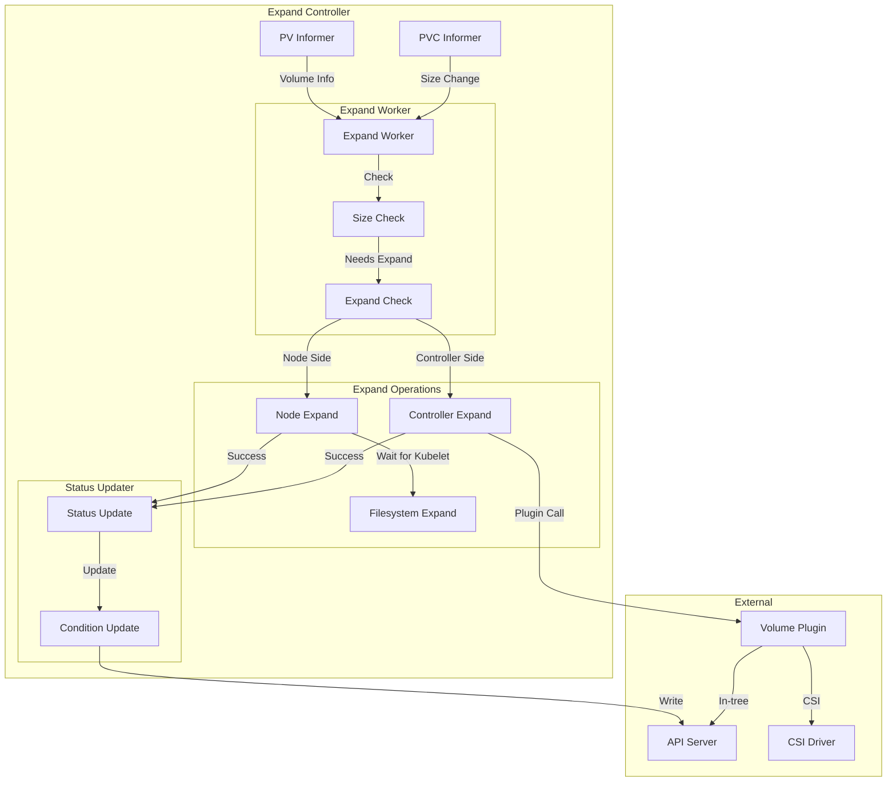
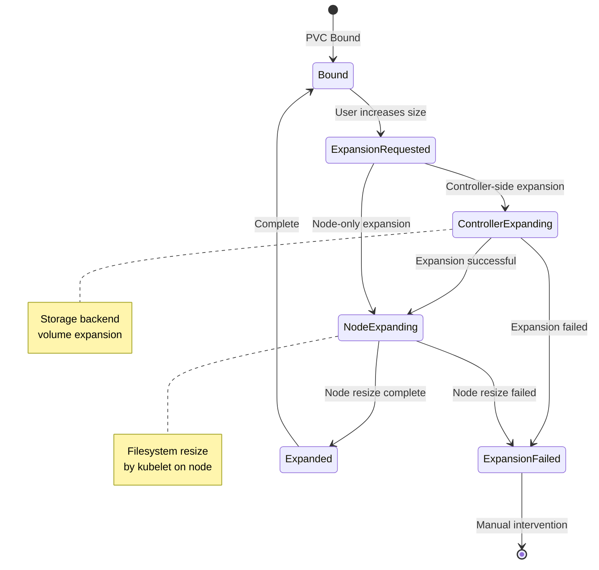
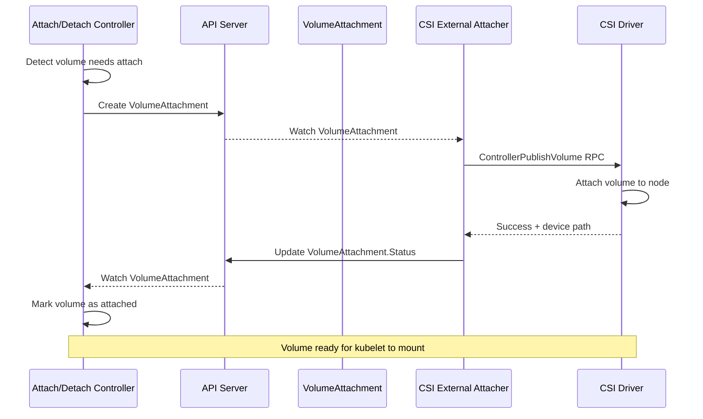

# Volume Controllers

**Author**: Claude (AI Assistant)
**Date**: 2025-10-21
**Status**: Architecture Study
**Component**: kube-controller-manager

## Overview

Volume controllers manage the complete lifecycle of persistent storage in Kubernetes, from volume provisioning and binding to attachment/detachment and expansion. These controllers coordinate between PersistentVolumes (PVs), PersistentVolumeClaims (PVCs), and the underlying storage infrastructure.

## Key Components

### 1. PersistentVolume Controller

**Source**: `pkg/controller/volume/persistentvolume/pv_controller.go`

Manages PV/PVC binding, provisioning, and cleanup lifecycle.

#### Architecture



#### State Machines

##### PVC Lifecycle



##### PV Lifecycle



#### Core Data Structures

```go
// Source: pkg/controller/volume/persistentvolume/pv_controller.go

type PersistentVolumeController struct {
    volumeLister       corelisters.PersistentVolumeLister
    volumeListerSynced cache.InformerSynced

    claimLister       corelisters.PersistentVolumeClaimLister
    claimListerSynced cache.InformerSynced

    classLister       storagelisters.StorageClassLister
    classListerSynced cache.InformerSynced

    // Work queues
    claimQueue  workqueue.RateLimitingInterface
    volumeQueue workqueue.RateLimitingInterface

    // In-memory cache of volumes and claims
    volumes persistentVolumeOrderedIndex
    claims  cache.Store

    // Cloud provider for volume operations
    cloudProvider cloudprovider.Interface

    // Volume plugin manager
    volumePluginMgr volume.VolumePluginMgr
}

// Ordered index for volume selection
type persistentVolumeOrderedIndex struct {
    store cache.Indexer
}
```

#### Volume-Claim Binding Algorithm

```go
// Source: pkg/controller/volume/persistentvolume/pv_controller.go

// Sync claim - main reconciliation loop
func (ctrl *PersistentVolumeController) syncClaim(claim *v1.PersistentVolumeClaim) error {
    // Get fresh claim from API
    newClaim, err := ctrl.claimLister.PersistentVolumeClaims(claim.Namespace).
        Get(claim.Name)
    if err != nil {
        if errors.IsNotFound(err) {
            return nil
        }
        return err
    }

    return ctrl.syncUnboundClaim(newClaim)
}

// Sync unbound claim
func (ctrl *PersistentVolumeController) syncUnboundClaim(
    claim *v1.PersistentVolumeClaim,
) error {
    // Skip if already bound
    if claim.Spec.VolumeName != "" {
        return nil
    }

    // Check if claim should use dynamic provisioning
    delayBinding, err := ctrl.shouldDelayBinding(claim)
    if err != nil {
        return err
    }

    if delayBinding {
        // Wait for scheduler to bind
        return nil
    }

    // Try to find matching volume
    volume, err := ctrl.volumes.findBestMatchForClaim(claim)
    if err != nil {
        return err
    }

    if volume == nil {
        // No matching volume, provision if possible
        return ctrl.provisionClaim(claim)
    }

    // Bind claim to volume
    return ctrl.bind(volume, claim)
}
```

#### Volume Selection Algorithm

```go
// Source: pkg/controller/volume/persistentvolume/index.go

// Find best matching volume for claim
func (pvIndex *persistentVolumeOrderedIndex) findBestMatchForClaim(
    claim *v1.PersistentVolumeClaim,
) (*v1.PersistentVolume, error) {
    // Get all available volumes
    allPVs, err := pvIndex.store.ByIndex("", "")
    if err != nil {
        return nil, err
    }

    // Filter and rank volumes
    var bestMatch *v1.PersistentVolume
    var smallestDiff int64 = math.MaxInt64

    for _, pv := range allPVs {
        volume := pv.(*v1.PersistentVolume)

        // Check if volume matches claim
        if !ctrl.checkVolumeMatch(volume, claim) {
            continue
        }

        // Prefer smaller volumes (closest match)
        volumeSize := volume.Spec.Capacity[v1.ResourceStorage]
        claimSize := claim.Spec.Resources.Requests[v1.ResourceStorage]

        diff := volumeSize.Value() - claimSize.Value()
        if diff < 0 {
            continue // Volume too small
        }

        if diff < smallestDiff {
            smallestDiff = diff
            bestMatch = volume
        }
    }

    return bestMatch, nil
}

// Check if volume matches claim requirements
func (ctrl *PersistentVolumeController) checkVolumeMatch(
    volume *v1.PersistentVolume,
    claim *v1.PersistentVolumeClaim,
) bool {
    // 1. Volume must be Available
    if volume.Status.Phase != v1.VolumeAvailable {
        return false
    }

    // 2. Check access modes match
    if !ctrl.checkAccessModes(claim, volume) {
        return false
    }

    // 3. Check capacity sufficient
    volumeSize := volume.Spec.Capacity[v1.ResourceStorage]
    claimSize := claim.Spec.Resources.Requests[v1.ResourceStorage]
    if volumeSize.Cmp(claimSize) < 0 {
        return false
    }

    // 4. Check storage class matches
    if !ctrl.checkStorageClass(claim, volume) {
        return false
    }

    // 5. Check label selector matches
    if claim.Spec.Selector != nil {
        selector, err := metav1.LabelSelectorAsSelector(claim.Spec.Selector)
        if err != nil {
            return false
        }
        if !selector.Matches(labels.Set(volume.Labels)) {
            return false
        }
    }

    return true
}
```

#### Binding Operation

```go
// Source: pkg/controller/volume/persistentvolume/pv_controller.go

// Bind volume to claim
func (ctrl *PersistentVolumeController) bind(
    volume *v1.PersistentVolume,
    claim *v1.PersistentVolumeClaim,
) error {
    // Update volume with claim reference
    volumeClone := volume.DeepCopy()
    volumeClone.Spec.ClaimRef = &v1.ObjectReference{
        Kind:            "PersistentVolumeClaim",
        APIVersion:      "v1",
        UID:             claim.UID,
        Namespace:       claim.Namespace,
        Name:            claim.Name,
        ResourceVersion: claim.ResourceVersion,
    }

    // Set volume to Bound phase
    volumeClone.Status.Phase = v1.VolumeBound

    // Update volume in API server
    newVol, err := ctrl.kubeClient.CoreV1().PersistentVolumes().
        Update(context.TODO(), volumeClone, metav1.UpdateOptions{})
    if err != nil {
        return err
    }

    // Update claim with volume reference
    claimClone := claim.DeepCopy()
    claimClone.Spec.VolumeName = volume.Name
    claimClone.Status.Phase = v1.ClaimBound
    claimClone.Status.AccessModes = volume.Spec.AccessModes
    claimClone.Status.Capacity = volume.Spec.Capacity

    _, err = ctrl.kubeClient.CoreV1().PersistentVolumeClaims(claim.Namespace).
        UpdateStatus(context.TODO(), claimClone, metav1.UpdateOptions{})

    return err
}
```

#### Dynamic Provisioning

```go
// Source: pkg/controller/volume/persistentvolume/pv_controller.go

// Provision new volume for claim
func (ctrl *PersistentVolumeController) provisionClaim(
    claim *v1.PersistentVolumeClaim,
) error {
    // Get storage class
    storageClass, err := ctrl.getStorageClass(claim)
    if err != nil || storageClass == nil {
        return err
    }

    // Get provisioner plugin
    provisioner, err := ctrl.volumePluginMgr.FindProvisionablePluginByName(
        storageClass.Provisioner,
    )
    if err != nil {
        return err
    }

    // Create volume options
    options := volume.VolumeOptions{
        PersistentVolumeReclaimPolicy: *storageClass.ReclaimPolicy,
        Parameters:                     storageClass.Parameters,
        PVC:                            claim,
    }

    // Provision volume
    volume, err := provisioner.NewProvisioner(options).Provision()
    if err != nil {
        return err
    }

    // Set storage class
    volume.Spec.StorageClassName = storageClass.Name

    // Create PV in API server
    _, err = ctrl.kubeClient.CoreV1().PersistentVolumes().
        Create(context.TODO(), volume, metav1.CreateOptions{})

    return err
}
```

#### Volume Reclaim

```go
// Source: pkg/controller/volume/persistentvolume/pv_controller.go

// Sync volume - handle released volumes
func (ctrl *PersistentVolumeController) syncVolume(
    volume *v1.PersistentVolume,
) error {
    if volume.Status.Phase != v1.VolumeReleased {
        return nil
    }

    // Handle based on reclaim policy
    switch volume.Spec.PersistentVolumeReclaimPolicy {
    case v1.PersistentVolumeReclaimRetain:
        // Keep volume with claim reference for manual reclaim
        return nil

    case v1.PersistentVolumeReclaimDelete:
        // Delete volume
        return ctrl.deleteVolume(volume)

    case v1.PersistentVolumeReclaimRecycle:
        // Recycle volume (deprecated)
        return ctrl.recycleVolume(volume)

    default:
        return nil
    }
}

// Delete volume and underlying storage
func (ctrl *PersistentVolumeController) deleteVolume(
    volume *v1.PersistentVolume,
) error {
    // Get deleter plugin
    plugin, err := ctrl.volumePluginMgr.FindDeletablePluginBySpec(
        &volume.Spec,
    )
    if err != nil {
        return err
    }

    // Delete underlying storage
    deleter, err := plugin.NewDeleter(volume)
    if err != nil {
        return err
    }

    if err := deleter.Delete(); err != nil {
        return err
    }

    // Remove PV from API server
    return ctrl.kubeClient.CoreV1().PersistentVolumes().
        Delete(context.TODO(), volume.Name, metav1.DeleteOptions{})
}
```

---

### 2. Attach/Detach Controller

**Source**: `pkg/controller/volume/attachdetach/attach_detach_controller.go`

Manages attachment and detachment of volumes to/from nodes.

#### Architecture



#### State Tracking

```go
// Source: pkg/controller/volume/attachdetach/cache/desired_state_of_world.go

// Desired state of world
type desiredStateOfWorld struct {
    // Map of node -> volumes that should be attached
    nodesManaged map[types.NodeName]nodeManaged

    // Volume plugin manager
    volumePluginMgr *volume.VolumePluginMgr
}

type nodeManaged struct {
    nodeName types.NodeName

    // Volumes that should be attached to this node
    volumesToAttach map[v1.UniqueVolumeName]volumeToAttach
}

type volumeToAttach struct {
    // Volume spec
    volumeName       v1.UniqueVolumeName
    spec             *volume.Spec
    nodeName         types.NodeName
    scheduledPods    []types.UniquePodName
}

// Source: pkg/controller/volume/attachdetach/cache/actual_state_of_world.go

// Actual state of world
type actualStateOfWorld struct {
    // Map of node -> attached volumes
    attachedVolumes map[types.NodeName]attachedVolumes

    // Volumes being attached/detached
    volumesToBeAttached map[v1.UniqueVolumeName]bool
    volumesToBeDetached map[v1.UniqueVolumeName]bool
}

type attachedVolumes struct {
    nodeName types.NodeName

    // Currently attached volumes
    attachedVolumes map[v1.UniqueVolumeName]attachedVolume
}

type attachedVolume struct {
    volumeName      v1.UniqueVolumeName
    spec            *volume.Spec
    nodeName        types.NodeName
    devicePath      string
    attached        bool
    detachRequested bool
}
```

#### Desired State Populator

```go
// Source: pkg/controller/volume/attachdetach/populator/desired_state_of_world_populator.go

type desiredStateOfWorldPopulator struct {
    loopSleepDuration time.Duration
    podLister         corelisters.PodLister
    desiredStateOfWorld cache.DesiredStateOfWorld
    actualStateOfWorld  cache.ActualStateOfWorld
}

// Populate desired state from pod specs
func (dswp *desiredStateOfWorldPopulator) Run(stopCh <-chan struct{}) {
    wait.Until(dswp.populatorLoop, dswp.loopSleepDuration, stopCh)
}

func (dswp *desiredStateOfWorldPopulator) populatorLoop() {
    // List all pods
    pods, err := dswp.podLister.List(labels.Everything())
    if err != nil {
        return
    }

    // Process each pod
    for _, pod := range pods {
        dswp.processPod(pod)
    }
}

func (dswp *desiredStateOfWorldPopulator) processPod(pod *v1.Pod) {
    // Skip pods not scheduled
    if pod.Spec.NodeName == "" {
        return
    }

    // Skip completed pods
    if isPodTerminated(pod, pod.Status) {
        return
    }

    // Process each volume in pod
    for _, podVolume := range pod.Spec.Volumes {
        // Get volume spec
        volumeSpec, err := dswp.createVolumeSpec(podVolume, pod)
        if err != nil {
            continue
        }

        // Add to desired state
        dswp.desiredStateOfWorld.AddPod(
            pod,
            volumeSpec,
            pod.Spec.NodeName,
        )
    }
}
```

#### Reconciler Loop

```go
// Source: pkg/controller/volume/attachdetach/reconciler/reconciler.go

type reconciler struct {
    loopSleepDuration       time.Duration
    maxWaitForUnmountDuration time.Duration

    desiredStateOfWorld cache.DesiredStateOfWorld
    actualStateOfWorld  cache.ActualStateOfWorld

    // Operation executor
    operationExecutor operationexecutor.OperationExecutor
}

// Reconcile actual vs desired state
func (rc *reconciler) Run(stopCh <-chan struct{}) {
    wait.Until(rc.reconciliationLoopFunc(), rc.loopSleepDuration, stopCh)
}

func (rc *reconciler) reconciliationLoopFunc() func() {
    return func() {
        rc.reconcile()
    }
}

func (rc *reconciler) reconcile() {
    // 1. Detach volumes that should not be attached
    for _, attachedVolume := range rc.actualStateOfWorld.GetAttachedVolumes() {
        if !rc.desiredStateOfWorld.VolumeExists(
            attachedVolume.VolumeName,
            attachedVolume.NodeName,
        ) {
            // Volume should be detached
            rc.operationExecutor.DetachVolume(
                attachedVolume,
                true, /* verifySafeToDetach */
                rc.actualStateOfWorld,
            )
        }
    }

    // 2. Attach volumes that should be attached
    for _, volumeToAttach := range rc.desiredStateOfWorld.GetVolumesToAttach() {
        if !rc.actualStateOfWorld.IsVolumeAttached(
            volumeToAttach.VolumeName,
            volumeToAttach.NodeName,
        ) {
            // Volume should be attached
            rc.operationExecutor.AttachVolume(
                volumeToAttach,
                rc.actualStateOfWorld,
            )
        }
    }
}
```

#### Attach Operation

```go
// Source: pkg/controller/volume/attachdetach/operationexecutor/operation_executor.go

func (oe *operationExecutor) AttachVolume(
    volumeToAttach cache.VolumeToAttach,
    actualStateOfWorld cache.ActualStateOfWorld,
) error {
    // Mark volume as being attached
    actualStateOfWorld.MarkVolumeAsAttaching(volumeToAttach)

    // Get attach plugin
    attachableVolumePlugin, err := oe.volumePluginMgr.
        FindAttachablePluginBySpec(volumeToAttach.VolumeSpec)
    if err != nil {
        return err
    }

    // Create attacher
    volumeAttacher, err := attachableVolumePlugin.NewAttacher()
    if err != nil {
        return err
    }

    // Perform attach operation
    devicePath, err := volumeAttacher.Attach(
        volumeToAttach.VolumeSpec,
        volumeToAttach.NodeName,
    )
    if err != nil {
        actualStateOfWorld.MarkVolumeAsDetached(
            volumeToAttach.VolumeName,
            volumeToAttach.NodeName,
        )
        return err
    }

    // Mark volume as attached
    actualStateOfWorld.MarkVolumeAsAttached(
        volumeToAttach.VolumeName,
        volumeToAttach.NodeName,
        devicePath,
    )

    return nil
}
```

#### Detach Operation

```go
// Source: pkg/controller/volume/attachdetach/operationexecutor/operation_executor.go

func (oe *operationExecutor) DetachVolume(
    attachedVolume cache.AttachedVolume,
    verifySafeToDetach bool,
    actualStateOfWorld cache.ActualStateOfWorld,
) error {
    // Check if safe to detach
    if verifySafeToDetach {
        // Verify no pods using volume
        pods := actualStateOfWorld.GetPodsForVolume(attachedVolume.VolumeName)
        if len(pods) > 0 {
            return fmt.Errorf("volume has scheduled pods")
        }
    }

    // Mark volume as being detached
    actualStateOfWorld.MarkVolumeAsDetaching(
        attachedVolume.VolumeName,
        attachedVolume.NodeName,
    )

    // Get detach plugin
    attachableVolumePlugin, err := oe.volumePluginMgr.
        FindAttachablePluginBySpec(attachedVolume.VolumeSpec)
    if err != nil {
        return err
    }

    // Create detacher
    volumeDetacher, err := attachableVolumePlugin.NewDetacher()
    if err != nil {
        return err
    }

    // Perform detach operation
    err = volumeDetacher.Detach(
        attachedVolume.VolumeName,
        attachedVolume.NodeName,
    )
    if err != nil {
        return err
    }

    // Mark volume as detached
    actualStateOfWorld.MarkVolumeAsDetached(
        attachedVolume.VolumeName,
        attachedVolume.NodeName,
    )

    return nil
}
```

#### Attach/Detach State Machine



---

### 3. PersistentVolume Protection Controller

**Source**: `pkg/controller/volume/pvprotection/pv_protection_controller.go`

Prevents deletion of PVs in use.

```go
// Source: pkg/controller/volume/pvprotection/pv_protection_controller.go

type Controller struct {
    pvLister corelisters.PersistentVolumeLister
    pvSynced cache.InformerSynced

    queue workqueue.RateLimitingInterface

    client clientset.Interface
}

// Add or remove protection finalizer
func (c *Controller) processPV(pv *v1.PersistentVolume) error {
    // Check if PV is in use (bound to PVC)
    if pv.Status.Phase == v1.VolumeBound {
        // Add protection finalizer
        return c.addFinalizer(pv)
    }

    // PV not in use, can remove finalizer
    return c.removeFinalizer(pv)
}

const pvProtectionFinalizer = "kubernetes.io/pv-protection"

func (c *Controller) addFinalizer(pv *v1.PersistentVolume) error {
    // Check if already has finalizer
    for _, finalizer := range pv.Finalizers {
        if finalizer == pvProtectionFinalizer {
            return nil
        }
    }

    // Add finalizer
    pvClone := pv.DeepCopy()
    pvClone.Finalizers = append(pvClone.Finalizers, pvProtectionFinalizer)

    _, err := c.client.CoreV1().PersistentVolumes().
        Update(context.TODO(), pvClone, metav1.UpdateOptions{})
    return err
}
```

---

### 4. PersistentVolumeClaim Protection Controller

**Source**: `pkg/controller/volume/pvcprotection/pvc_protection_controller.go`

Prevents deletion of PVCs in use by pods.

```go
// Source: pkg/controller/volume/pvcprotection/pvc_protection_controller.go

type Controller struct {
    pvcLister corelisters.PersistentVolumeClaimLister
    pvcSynced cache.InformerSynced

    podLister corelisters.PodLister
    podSynced cache.InformerSynced

    queue workqueue.RateLimitingInterface

    client clientset.Interface
}

// Add or remove protection finalizer
func (c *Controller) processPVC(pvc *v1.PersistentVolumeClaim) error {
    // Check if PVC is in use by any pod
    inUse, err := c.isInUse(pvc)
    if err != nil {
        return err
    }

    if inUse {
        // Add protection finalizer
        return c.addFinalizer(pvc)
    }

    // PVC not in use, can remove finalizer
    return c.removeFinalizer(pvc)
}

// Check if PVC is used by any pod
func (c *Controller) isInUse(pvc *v1.PersistentVolumeClaim) (bool, error) {
    // List all pods in namespace
    pods, err := c.podLister.Pods(pvc.Namespace).List(labels.Everything())
    if err != nil {
        return false, err
    }

    for _, pod := range pods {
        // Skip terminated pods
        if isPodTerminated(pod) {
            continue
        }

        // Check if pod uses this PVC
        for _, volume := range pod.Spec.Volumes {
            if volume.PersistentVolumeClaim != nil &&
                volume.PersistentVolumeClaim.ClaimName == pvc.Name {
                return true, nil
            }
        }
    }

    return false, nil
}
```

---

### 5. Volume Expand Controller

**Source**: `pkg/controller/volume/expand/expand_controller.go`

Handles dynamic expansion of persistent volumes.

#### Architecture



#### Core Algorithm

```go
// Source: pkg/controller/volume/expand/expand_controller.go

type expandController struct {
    pvcLister corelisters.PersistentVolumeClaimLister
    pvLister  corelisters.PersistentVolumeLister

    queue workqueue.RateLimitingInterface

    operationExecutor OperationExecutor
}

// Process PVC for expansion
func (ec *expandController) syncPVC(pvc *v1.PersistentVolumeClaim) error {
    // Check if expansion is needed
    if !ec.needsExpansion(pvc) {
        return nil
    }

    // Get bound PV
    pv, err := ec.pvLister.Get(pvc.Spec.VolumeName)
    if err != nil {
        return err
    }

    // Perform expansion
    return ec.expand(pvc, pv)
}

// Check if PVC needs expansion
func (ec *expandController) needsExpansion(pvc *v1.PersistentVolumeClaim) bool {
    // Get requested size
    requestedSize := pvc.Spec.Resources.Requests[v1.ResourceStorage]

    // Get current size
    currentSize := pvc.Status.Capacity[v1.ResourceStorage]

    // Check if requested > current
    return requestedSize.Cmp(currentSize) > 0
}

// Expand volume
func (ec *expandController) expand(
    pvc *v1.PersistentVolumeClaim,
    pv *v1.PersistentVolume,
) error {
    // Get volume plugin
    plugin, err := ec.volumePluginMgr.FindExpandablePluginBySpec(
        volume.NewSpecFromPersistentVolume(pv, false),
    )
    if err != nil {
        return err
    }

    // Check if plugin requires controller expansion
    if plugin.RequiresFSResize() {
        // Node-side expansion (done by kubelet)
        return ec.markForNodeExpansion(pvc)
    }

    // Controller-side expansion
    return ec.expandInController(pvc, pv, plugin)
}
```

#### Controller Expansion

```go
// Source: pkg/controller/volume/expand/expand_controller.go

func (ec *expandController) expandInController(
    pvc *v1.PersistentVolumeClaim,
    pv *v1.PersistentVolume,
    plugin volume.ExpandableVolumePlugin,
) error {
    // Create expander
    expander, err := plugin.NewExpander()
    if err != nil {
        return err
    }

    // Get new size
    newSize := pvc.Spec.Resources.Requests[v1.ResourceStorage]

    // Expand volume
    expandedSize, err := expander.ExpandVolumeDevice(
        volume.NewSpecFromPersistentVolume(pv, false),
        newSize,
    )
    if err != nil {
        return err
    }

    // Update PV size
    pvClone := pv.DeepCopy()
    pvClone.Spec.Capacity[v1.ResourceStorage] = expandedSize

    _, err = ec.kubeClient.CoreV1().PersistentVolumes().
        Update(context.TODO(), pvClone, metav1.UpdateOptions{})
    if err != nil {
        return err
    }

    // Update PVC status
    return ec.markExpanded(pvc, expandedSize)
}

// Mark PVC as expanded
func (ec *expandController) markExpanded(
    pvc *v1.PersistentVolumeClaim,
    newSize resource.Quantity,
) error {
    pvcClone := pvc.DeepCopy()

    // Update capacity
    pvcClone.Status.Capacity[v1.ResourceStorage] = newSize

    // Add condition
    condition := v1.PersistentVolumeClaimCondition{
        Type:               v1.PersistentVolumeClaimFileSystemResizePending,
        Status:             v1.ConditionFalse,
        LastTransitionTime: metav1.Now(),
    }
    pvcClone.Status.Conditions = append(pvcClone.Status.Conditions, condition)

    _, err := ec.kubeClient.CoreV1().PersistentVolumeClaims(pvc.Namespace).
        UpdateStatus(context.TODO(), pvcClone, metav1.UpdateOptions{})

    return err
}
```

#### Expansion State Machine



---

### 6. Ephemeral Volume Controller

**Source**: `pkg/controller/volume/ephemeral/ephemeral_controller.go`

Manages lifecycle of ephemeral inline volumes (generic ephemeral volumes).

#### Architecture

```go
// Source: pkg/controller/volume/ephemeral/ephemeral_controller.go

type ephemeralController struct {
    podLister corelisters.PodLister
    podSynced cache.InformerSynced

    pvcLister corelisters.PersistentVolumeClaimLister
    pvcSynced cache.InformerSynced

    queue workqueue.RateLimitingInterface

    client clientset.Interface
}

// Sync pod - create/delete ephemeral PVCs
func (ec *ephemeralController) syncPod(pod *v1.Pod) error {
    // Process each volume in pod
    for _, volume := range pod.Spec.Volumes {
        if volume.Ephemeral == nil {
            continue
        }

        // Create PVC for ephemeral volume
        if err := ec.createPVCForEphemeralVolume(pod, volume); err != nil {
            return err
        }
    }

    return nil
}

// Create PVC for ephemeral volume
func (ec *ephemeralController) createPVCForEphemeralVolume(
    pod *v1.Pod,
    volume v1.Volume,
) error {
    // Generate PVC name
    pvcName := pod.Name + "-" + volume.Name

    // Check if PVC already exists
    _, err := ec.pvcLister.PersistentVolumeClaims(pod.Namespace).Get(pvcName)
    if err == nil {
        return nil // Already exists
    }

    if !errors.IsNotFound(err) {
        return err
    }

    // Create PVC
    pvc := &v1.PersistentVolumeClaim{
        ObjectMeta: metav1.ObjectMeta{
            Name:      pvcName,
            Namespace: pod.Namespace,
            OwnerReferences: []metav1.OwnerReference{
                {
                    APIVersion: "v1",
                    Kind:       "Pod",
                    Name:       pod.Name,
                    UID:        pod.UID,
                    Controller: pointer.Bool(true),
                },
            },
        },
        Spec: *volume.Ephemeral.VolumeClaimTemplate.Spec.DeepCopy(),
    }

    _, err = ec.client.CoreV1().PersistentVolumeClaims(pod.Namespace).
        Create(context.TODO(), pvc, metav1.CreateOptions{})

    return err
}
```

---

## Volume Plugin Architecture

### Plugin Interface

```go
// Source: pkg/volume/plugins.go

// Volume plugin interface
type VolumePlugin interface {
    // Init initializes the plugin
    Init(host VolumeHost) error

    // GetPluginName returns unique name identifying the plugin
    GetPluginName() string

    // GetVolumeName returns unique name for volume
    GetVolumeName(spec *Spec) (string, error)

    // CanSupport tests whether the plugin supports a given volume spec
    CanSupport(spec *Spec) bool

    // NewMounter creates a new volume mounter
    NewMounter(spec *Spec, podRef *v1.Pod, opts VolumeOptions) (Mounter, error)

    // NewUnmounter creates a new volume unmounter
    NewUnmounter(name string, podUID types.UID) (Unmounter, error)
}

// Attachable plugin interface
type AttachableVolumePlugin interface {
    VolumePlugin

    // NewAttacher creates a new volume attacher
    NewAttacher() (Attacher, error)

    // NewDetacher creates a new volume detacher
    NewDetacher() (Detacher, error)
}

// Expandable plugin interface
type ExpandableVolumePlugin interface {
    VolumePlugin

    // NewExpander creates volume expander
    NewExpander() (Expander, error)

    // RequiresFSResize returns true if plugin requires
    // filesystem resize on the node
    RequiresFSResize() bool
}
```

---

## CSI Integration

### CSI Attacher Interaction



---

## Performance Optimizations

### 1. Volume Binding Cache

```go
// Efficient volume selection with indexed cache
type persistentVolumeOrderedIndex struct {
    store cache.Indexer
}

// Index by storage class for fast lookup
func storageClassIndexFunc(obj interface{}) ([]string, error) {
    pv := obj.(*v1.PersistentVolume)
    return []string{pv.Spec.StorageClassName}, nil
}
```

### 2. Attach/Detach Batching

```go
// Process multiple attach/detach operations in parallel
const maxConcurrentOperations = 20

func (oe *operationExecutor) Run() {
    for i := 0; i < maxConcurrentOperations; i++ {
        go oe.operationWorker()
    }
}
```

### 3. State-of-World Caching

- In-memory caches for desired and actual state
- Avoid repeated API server queries
- Fast diff calculation for reconciliation

---

## Configuration

### PV Controller

```bash
# kube-controller-manager flags
--pv-recycler-minimum-timeout-nfs=300        # NFS recycler timeout
--pv-recycler-minimum-timeout-hostpath=60    # HostPath recycler timeout
--enable-dynamic-provisioning=true            # Enable dynamic provisioning
```

### Attach/Detach Controller

```bash
# kube-controller-manager flags
--disable-attach-detach-reconcile-sync=false  # Enable attach/detach
--reconcile-sync-loop-period=60s              # Reconcile interval
```

### Expand Controller

```bash
# kube-controller-manager flags
--enable-controller-attach-detach=true        # Required for expansion
```

---

## Source References

1. **PV Controller**: `pkg/controller/volume/persistentvolume/pv_controller.go`
2. **Attach/Detach**: `pkg/controller/volume/attachdetach/attach_detach_controller.go`
3. **Expand Controller**: `pkg/controller/volume/expand/expand_controller.go`
4. **PVC Protection**: `pkg/controller/volume/pvcprotection/pvc_protection_controller.go`
5. **Ephemeral Controller**: `pkg/controller/volume/ephemeral/ephemeral_controller.go`
6. **Volume Plugins**: `pkg/volume/plugins.go`

---

## **🔗 See Also**

### **Related Controller-Manager Documentation**
- **[Storage Controllers Overview](./11-storage-controllers.md)** - All storage controllers catalog
- **[CSI Attachment Controller](./27-csi-attachment-controller.md)** - CSI-specific attachment
- **[PVC Protection Controller](./41-volume-protection-controllers.md)** - Detailed protection mechanisms
- **[Ephemeral Volume Controller](./42-ephemeral-volume-controller.md)** - Ephemeral volume deep dive

### **CSI Documentation**
For comprehensive Container Storage Interface coverage:
- **[CSI Architecture Overview](../csi/high-level/01-csi-architecture.md)** - Complete CSI design and components
- **[CSI API Resources](../csi/high-level/02-api-resources.md)** - VolumeAttachment, CSIDriver, CSINode
- **[CSI Driver Deployment](../csi/high-level/03-driver-deployment.md)** - External attacher, provisioner, resizer sidecars
- **[CSI Volume Lifecycle](../csi/middle-level/01-volume-lifecycle.md)** - Stage, publish, expand operations
- **[CSI Attach/Detach Controller](../csi/middle-level/02-attach-detach-controller.md)** - Detailed attach/detach implementation
- **[CSI PV Controller Integration](../csi/middle-level/04-pv-controller-integration.md)** - Dynamic provisioning with CSI
- **[CSI Expansion Controller](../csi/middle-level/03-expansion-controller.md)** - Volume expansion implementation

### **Kubelet Volume Management**
- **Kubelet Volume Manager**: See `docs/architecture/claude/kubelet/` for node-side volume operations
- **CSI Plugin Registration**: How kubelet discovers and communicates with CSI plugins

---

## Summary

Volume controllers provide comprehensive storage lifecycle management:

1. **PV Controller**: Handles binding, provisioning, and reclamation
2. **Attach/Detach**: Manages volume attachment to nodes with desired/actual state reconciliation
3. **Protection Controllers**: Prevent accidental deletion of in-use volumes
4. **Expand Controller**: Supports dynamic volume expansion
5. **Ephemeral Controller**: Manages inline ephemeral volumes

These controllers coordinate with CSI drivers and volume plugins to provide seamless persistent storage in Kubernetes.
