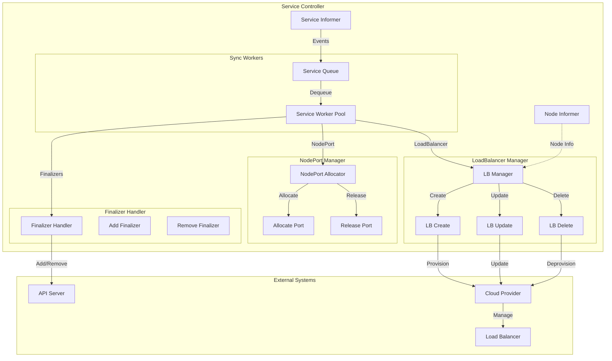
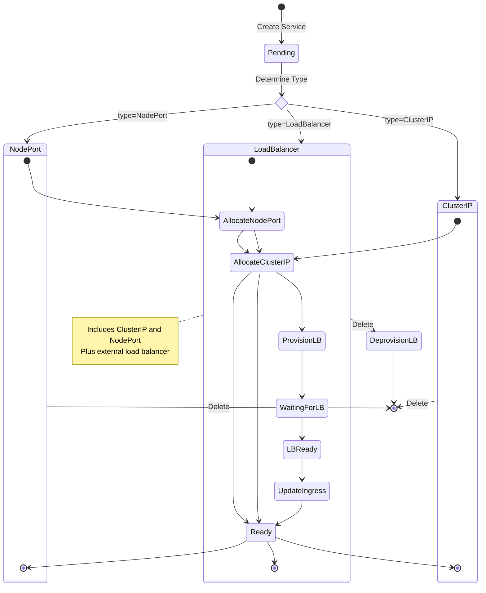
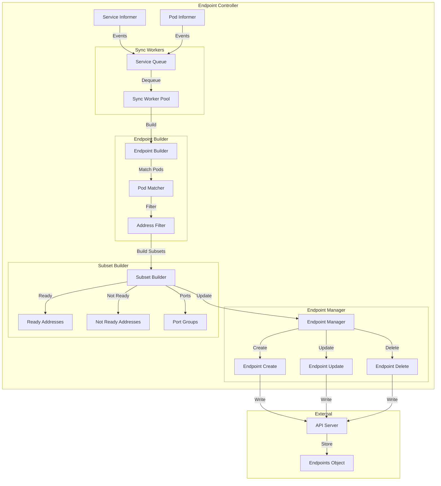
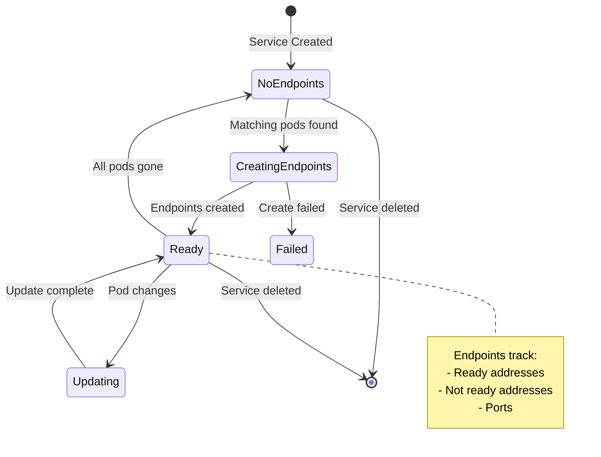
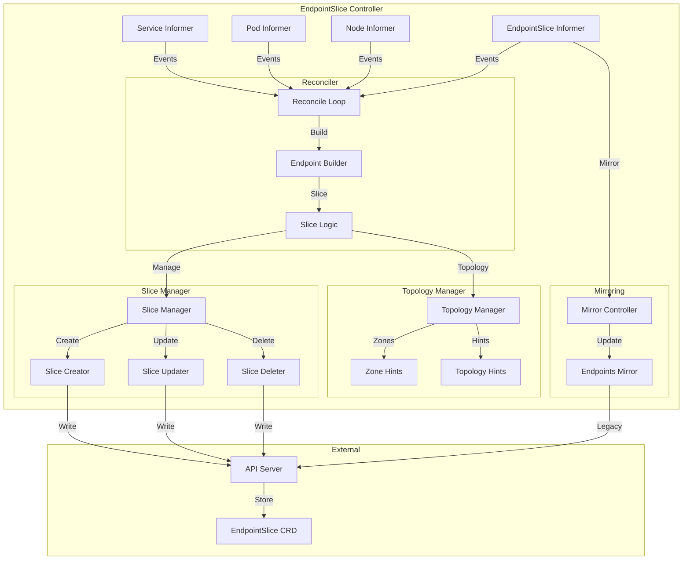
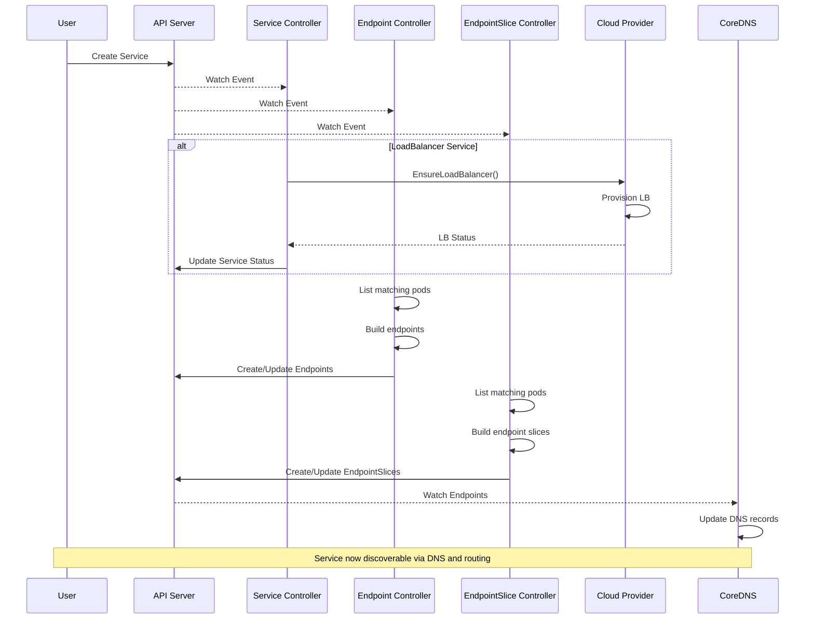

# Service and Endpoint Controllers

**Author**: Claude (AI Assistant)
**Date**: 2025-10-21
**Status**: Architecture Study
**Component**: kube-controller-manager

## Overview

Service and endpoint controllers manage network abstraction and service discovery in Kubernetes. They translate service definitions into concrete endpoints, manage load balancer provisioning, and maintain endpoint slices for efficient service routing.

## Key Components

### 1. Service Controller

**Source**: `pkg/controller/service/service_controller.go`

Manages lifecycle of LoadBalancer and NodePort services, coordinating with cloud providers for external load balancer provisioning.

#### Architecture



#### Service Type State Machines



#### Core Data Structures

```go
// Source: pkg/controller/service/service_controller.go

type Controller struct {
    serviceLister  listers.ServiceLister
    serviceSynced  cache.InformerSynced

    nodeLister     listers.NodeLister
    nodeSynced     cache.InformerSynced

    // Work queue for service sync
    queue workqueue.RateLimitingInterface

    // Cloud provider for load balancer operations
    cloud cloudprovider.Interface

    // Cluster name and service account
    clusterName string

    // Load balancer info cache
    cache *balancerCache

    // Event recorder
    eventRecorder record.EventRecorder
}

// Cached load balancer state
type balancerCache struct {
    mu sync.Mutex
    // Map service key -> load balancer status
    balancerStatusMap map[string]*v1.LoadBalancerStatus
}

type cachedService struct {
    // Service description
    state *v1.Service
    // Load balancer status
    lastStatus *v1.LoadBalancerStatus
}
```

#### Service Sync Algorithm

```go
// Source: pkg/controller/service/service_controller.go

// Sync service - main reconciliation loop
func (c *Controller) syncService(key string) error {
    namespace, name, err := cache.SplitMetaNamespaceKey(key)
    if err != nil {
        return err
    }

    // Get service from lister
    service, err := c.serviceLister.Services(namespace).Get(name)
    if err != nil {
        if errors.IsNotFound(err) {
            return nil
        }
        return err
    }

    // Handle service based on type
    if service.Spec.Type == v1.ServiceTypeLoadBalancer {
        return c.syncLoadBalancerService(service)
    }

    // For other service types, ensure no load balancer exists
    return c.ensureLoadBalancerDeleted(service)
}

// Sync LoadBalancer service
func (c *Controller) syncLoadBalancerService(service *v1.Service) error {
    // Check if service is being deleted
    if service.DeletionTimestamp != nil {
        return c.ensureLoadBalancerDeleted(service)
    }

    // Add finalizer to prevent premature deletion
    if err := c.addFinalizer(service); err != nil {
        return err
    }

    // Get or create load balancer
    return c.ensureLoadBalancer(service)
}
```

#### Load Balancer Provisioning

```go
// Source: pkg/controller/service/service_controller.go

// Ensure load balancer exists and is configured
func (c *Controller) ensureLoadBalancer(service *v1.Service) error {
    // Get nodes that can receive traffic
    nodes, err := c.nodeLister.List(labels.Everything())
    if err != nil {
        return err
    }

    // Filter to schedulable nodes
    hosts := filterNodes(nodes, service)

    // Get current load balancer status
    previousStatus := c.cache.get(service)

    // Ensure load balancer via cloud provider
    status, err := c.cloud.LoadBalancer().EnsureLoadBalancer(
        context.TODO(),
        c.clusterName,
        service,
        hosts,
    )
    if err != nil {
        c.eventRecorder.Eventf(
            service,
            v1.EventTypeWarning,
            "EnsureLoadBalancerFailed",
            "Error ensuring load balancer: %v",
            err,
        )
        return err
    }

    // Update cache
    c.cache.set(service, status)

    // Update service status if changed
    if !equalLoadBalancerStatus(previousStatus, status) {
        return c.updateServiceStatus(service, status)
    }

    return nil
}

// Update service status with load balancer ingress
func (c *Controller) updateServiceStatus(
    service *v1.Service,
    status *v1.LoadBalancerStatus,
) error {
    // Deep copy to avoid mutation
    newService := service.DeepCopy()
    newService.Status.LoadBalancer = *status

    // Update via API
    _, err := c.kubeClient.CoreV1().Services(service.Namespace).
        UpdateStatus(context.TODO(), newService, metav1.UpdateOptions{})

    if err != nil {
        return err
    }

    c.eventRecorder.Eventf(
        service,
        v1.EventTypeNormal,
        "UpdatedLoadBalancer",
        "Updated load balancer with new hosts",
    )

    return nil
}
```

#### Load Balancer Deletion

```go
// Source: pkg/controller/service/service_controller.go

// Ensure load balancer is deleted
func (c *Controller) ensureLoadBalancerDeleted(service *v1.Service) error {
    // Check if load balancer exists
    if service.Status.LoadBalancer.Ingress == nil {
        // Already deleted, remove finalizer
        return c.removeFinalizer(service)
    }

    // Delete load balancer via cloud provider
    err := c.cloud.LoadBalancer().EnsureLoadBalancerDeleted(
        context.TODO(),
        c.clusterName,
        service,
    )
    if err != nil {
        c.eventRecorder.Eventf(
            service,
            v1.EventTypeWarning,
            "DeleteLoadBalancerFailed",
            "Error deleting load balancer: %v",
            err,
        )
        return err
    }

    c.eventRecorder.Event(
        service,
        v1.EventTypeNormal,
        "DeletedLoadBalancer",
        "Deleted load balancer",
    )

    // Clear status
    newService := service.DeepCopy()
    newService.Status.LoadBalancer = v1.LoadBalancerStatus{}

    _, err = c.kubeClient.CoreV1().Services(service.Namespace).
        UpdateStatus(context.TODO(), newService, metav1.UpdateOptions{})
    if err != nil {
        return err
    }

    // Remove finalizer
    return c.removeFinalizer(service)
}
```

#### Finalizer Management

```go
// Source: pkg/controller/service/service_controller.go

const serviceLoadBalancerFinalizer = "service.kubernetes.io/load-balancer-cleanup"

func (c *Controller) addFinalizer(service *v1.Service) error {
    // Check if already has finalizer
    for _, finalizer := range service.Finalizers {
        if finalizer == serviceLoadBalancerFinalizer {
            return nil
        }
    }

    // Add finalizer
    newService := service.DeepCopy()
    newService.Finalizers = append(
        newService.Finalizers,
        serviceLoadBalancerFinalizer,
    )

    _, err := c.kubeClient.CoreV1().Services(service.Namespace).
        Update(context.TODO(), newService, metav1.UpdateOptions{})

    return err
}

func (c *Controller) removeFinalizer(service *v1.Service) error {
    // Filter out the finalizer
    var newFinalizers []string
    for _, finalizer := range service.Finalizers {
        if finalizer != serviceLoadBalancerFinalizer {
            newFinalizers = append(newFinalizers, finalizer)
        }
    }

    // No change needed
    if len(newFinalizers) == len(service.Finalizers) {
        return nil
    }

    // Update service
    newService := service.DeepCopy()
    newService.Finalizers = newFinalizers

    _, err := c.kubeClient.CoreV1().Services(service.Namespace).
        Update(context.TODO(), newService, metav1.UpdateOptions{})

    return err
}
```

#### Node Filtering

```go
// Source: pkg/controller/service/service_controller.go

// Filter nodes to those that can receive traffic
func filterNodes(nodes []*v1.Node, service *v1.Service) []*v1.Node {
    var result []*v1.Node

    for _, node := range nodes {
        // Skip nodes that are not ready
        if !nodeReady(node) {
            continue
        }

        // Skip nodes with scheduling disabled (unless they already have pods)
        if node.Spec.Unschedulable {
            continue
        }

        // Check if node matches service's node selector
        if service.Spec.ExternalTrafficPolicy == v1.ServiceExternalTrafficPolicyTypeLocal {
            // For Local traffic policy, only include nodes with endpoints
            // This is handled by checking node labels/conditions
        }

        result = append(result, node)
    }

    return result
}

// Check if node is ready
func nodeReady(node *v1.Node) bool {
    for _, condition := range node.Status.Conditions {
        if condition.Type == v1.NodeReady {
            return condition.Status == v1.ConditionTrue
        }
    }
    return false
}
```

---

### 2. Endpoint Controller

**Source**: `pkg/controller/endpoint/endpoints_controller.go`

Maintains Endpoints objects that track the IP addresses of pods backing a service.

#### Architecture



#### Endpoint State Machine



#### Core Data Structures

```go
// Source: pkg/controller/endpoint/endpoints_controller.go

type EndpointController struct {
    serviceLister listers.ServiceLister
    serviceSynced cache.InformerSynced

    podLister     listers.PodLister
    podSynced     cache.InformerSynced

    endpointsLister listers.EndpointsLister
    endpointsSynced cache.InformerSynced

    // Work queue
    queue workqueue.RateLimitingInterface

    // Max endpoints per subset
    maxEndpointsPerSubset int

    // Trigger time for not-ready endpoints
    endpointUpdatesBatchPeriod time.Duration
}

// Endpoint port configuration
type endpointPort struct {
    name     string
    port     int32
    protocol v1.Protocol
}

// Endpoint address with pod reference
type endpointAddress struct {
    ip       string
    nodeName string
    podName  string
    ready    bool
}
```

#### Endpoint Sync Algorithm

```go
// Source: pkg/controller/endpoint/endpoints_controller.go

// Sync endpoints for service
func (e *EndpointController) syncService(key string) error {
    namespace, name, err := cache.SplitMetaNamespaceKey(key)
    if err != nil {
        return err
    }

    // Get service
    service, err := e.serviceLister.Services(namespace).Get(name)
    if err != nil {
        if errors.IsNotFound(err) {
            // Service deleted, delete endpoints
            return e.deleteEndpoints(namespace, name)
        }
        return err
    }

    // Skip if service has selector for endpoints
    if service.Spec.Selector == nil {
        // Headless service without selector - user manages endpoints
        return nil
    }

    // Build endpoints from pods
    return e.syncEndpoints(service)
}

// Sync endpoints for service
func (e *EndpointController) syncEndpoints(service *v1.Service) error {
    // Get pods matching service selector
    pods, err := e.podLister.Pods(service.Namespace).List(
        labels.SelectorFromSet(service.Spec.Selector),
    )
    if err != nil {
        return err
    }

    // Build endpoint subsets
    subsets := e.buildSubsets(service, pods)

    // Get current endpoints
    currentEndpoints, err := e.endpointsLister.Endpoints(service.Namespace).
        Get(service.Name)

    if err != nil {
        if errors.IsNotFound(err) {
            // Create new endpoints
            return e.createEndpoints(service, subsets)
        }
        return err
    }

    // Update if changed
    if endpointsChanged(currentEndpoints, subsets) {
        return e.updateEndpoints(currentEndpoints, subsets)
    }

    return nil
}
```

#### Subset Building

```go
// Source: pkg/controller/endpoint/endpoints_controller.go

// Build endpoint subsets from pods
func (e *EndpointController) buildSubsets(
    service *v1.Service,
    pods []*v1.Pod,
) []v1.EndpointSubset {
    // Group addresses by port configuration
    subsets := map[string]*v1.EndpointSubset{}

    for _, pod := range pods {
        // Skip pods that aren't ready or don't have an IP
        if pod.Status.PodIP == "" {
            continue
        }

        // Check if pod is ready
        ready := isPodReady(pod)

        // Build endpoint address
        addr := v1.EndpointAddress{
            IP:       pod.Status.PodIP,
            NodeName: &pod.Spec.NodeName,
            TargetRef: &v1.ObjectReference{
                Kind:      "Pod",
                Namespace: pod.Namespace,
                Name:      pod.Name,
                UID:       pod.UID,
            },
        }

        // Add to appropriate subset
        for _, port := range service.Spec.Ports {
            // Find container port
            containerPort := findContainerPort(pod, port)
            if containerPort == 0 {
                continue
            }

            // Get or create subset
            key := portKey(port)
            subset, exists := subsets[key]
            if !exists {
                subset = &v1.EndpointSubset{
                    Ports: []v1.EndpointPort{
                        {
                            Name:     port.Name,
                            Port:     containerPort,
                            Protocol: port.Protocol,
                        },
                    },
                }
                subsets[key] = subset
            }

            // Add address to subset
            if ready {
                subset.Addresses = append(subset.Addresses, addr)
            } else {
                subset.NotReadyAddresses = append(subset.NotReadyAddresses, addr)
            }
        }
    }

    // Convert map to slice
    result := make([]v1.EndpointSubset, 0, len(subsets))
    for _, subset := range subsets {
        result = append(result, *subset)
    }

    return result
}

// Check if pod is ready
func isPodReady(pod *v1.Pod) bool {
    // Check pod phase
    if pod.Status.Phase != v1.PodRunning {
        return false
    }

    // Check ready condition
    for _, condition := range pod.Status.Conditions {
        if condition.Type == v1.PodReady {
            return condition.Status == v1.ConditionTrue
        }
    }

    return false
}

// Find container port in pod
func findContainerPort(pod *v1.Pod, servicePort v1.ServicePort) int32 {
    // If service port specifies target port by number
    if servicePort.TargetPort.Type == intstr.Int {
        return servicePort.TargetPort.IntVal
    }

    // If service port specifies target port by name
    portName := servicePort.TargetPort.StrVal
    for _, container := range pod.Spec.Containers {
        for _, port := range container.Ports {
            if port.Name == portName {
                return port.ContainerPort
            }
        }
    }

    // Fallback to service port
    return servicePort.Port
}
```

#### Endpoint Update

```go
// Source: pkg/controller/endpoint/endpoints_controller.go

// Create endpoints object
func (e *EndpointController) createEndpoints(
    service *v1.Service,
    subsets []v1.EndpointSubset,
) error {
    endpoints := &v1.Endpoints{
        ObjectMeta: metav1.ObjectMeta{
            Name:      service.Name,
            Namespace: service.Namespace,
            Labels:    service.Labels,
            OwnerReferences: []metav1.OwnerReference{
                *metav1.NewControllerRef(
                    service,
                    schema.GroupVersionKind{
                        Version: "v1",
                        Kind:    "Service",
                    },
                ),
            },
        },
        Subsets: subsets,
    }

    _, err := e.client.CoreV1().Endpoints(service.Namespace).
        Create(context.TODO(), endpoints, metav1.CreateOptions{})

    return err
}

// Update endpoints object
func (e *EndpointController) updateEndpoints(
    current *v1.Endpoints,
    subsets []v1.EndpointSubset,
) error {
    newEndpoints := current.DeepCopy()
    newEndpoints.Subsets = subsets

    _, err := e.client.CoreV1().Endpoints(current.Namespace).
        Update(context.TODO(), newEndpoints, metav1.UpdateOptions{})

    return err
}
```

---

### 3. EndpointSlice Controller

**Source**: `pkg/controller/endpointslice/endpointslice_controller.go`

Manages EndpointSlice objects for more scalable service endpoint tracking.

#### Architecture



#### EndpointSlice vs Endpoints

**Key Differences:**

| Feature | Endpoints | EndpointSlice |
|---------|-----------|---------------|
| Max endpoints | ~1000 (etcd limit) | 100 per slice (configurable) |
| Scalability | Limited | High (multiple slices) |
| Updates | Full object update | Individual slice updates |
| Topology | None | Zone/region awareness |
| Network overhead | High for large services | Lower, incremental updates |

#### Core Data Structures

```go
// Source: pkg/controller/endpointslice/endpointslice_controller.go

type Controller struct {
    serviceLister listers.ServiceLister
    serviceSynced cache.InformerSynced

    podLister     listers.PodLister
    podSynced     cache.InformerSynced

    nodeLister    listers.NodeLister
    nodeSynced    cache.InformerSynced

    endpointSliceLister listers.EndpointSliceLister
    endpointSliceSynced cache.InformerSynced

    // Work queue
    queue workqueue.RateLimitingInterface

    // Max endpoints per slice
    maxEndpointsPerSlice int32

    // Topology cache for zone hints
    topologyCache *topologyCache

    // Endpoint slice tracker
    endpointSliceTracker *endpointSliceTracker
}

// Topology cache for zone/region info
type topologyCache struct {
    lock  sync.RWMutex
    nodes map[string]*nodeInfo
}

type nodeInfo struct {
    name   string
    zone   string
    region string
}

// Track endpoint slices for services
type endpointSliceTracker struct {
    lock sync.RWMutex
    // Map service key -> endpoint slices
    endpointSlices map[string][]*discovery.EndpointSlice
}
```

#### Reconciliation Algorithm

```go
// Source: pkg/controller/endpointslice/endpointslice_controller.go

// Sync service - reconcile endpoint slices
func (c *Controller) syncService(key string) error {
    namespace, name, err := cache.SplitMetaNamespaceKey(key)
    if err != nil {
        return err
    }

    // Get service
    service, err := c.serviceLister.Services(namespace).Get(name)
    if err != nil {
        if errors.IsNotFound(err) {
            // Delete all endpoint slices for service
            return c.deleteEndpointSlices(namespace, name)
        }
        return err
    }

    // Skip services without selector
    if service.Spec.Selector == nil {
        return nil
    }

    // Reconcile endpoint slices
    return c.reconcile(service)
}

// Reconcile endpoint slices for service
func (c *Controller) reconcile(service *v1.Service) error {
    // Get pods matching service selector
    pods, err := c.podLister.Pods(service.Namespace).List(
        labels.SelectorFromSet(service.Spec.Selector),
    )
    if err != nil {
        return err
    }

    // Get existing endpoint slices
    existingSlices, err := c.endpointSliceLister.EndpointSlices(service.Namespace).
        List(labels.SelectorFromSet(map[string]string{
            discovery.LabelServiceName: service.Name,
        }))
    if err != nil {
        return err
    }

    // Build desired endpoint slices
    desiredSlices := c.buildEndpointSlices(service, pods, existingSlices)

    // Reconcile: create, update, delete slices
    return c.reconcileSlices(service, existingSlices, desiredSlices)
}
```

#### Slice Building

```go
// Source: pkg/controller/endpointslice/endpointslice_controller.go

// Build endpoint slices from pods
func (c *Controller) buildEndpointSlices(
    service *v1.Service,
    pods []*v1.Pod,
    existingSlices []*discovery.EndpointSlice,
) []*discovery.EndpointSlice {
    var slices []*discovery.EndpointSlice

    // Group endpoints by address type (IPv4, IPv6)
    endpointsByAddressType := c.groupEndpointsByAddressType(service, pods)

    for addressType, endpoints := range endpointsByAddressType {
        // Split into slices of max size
        sliceNum := 0
        for i := 0; i < len(endpoints); i += int(c.maxEndpointsPerSlice) {
            end := i + int(c.maxEndpointsPerSlice)
            if end > len(endpoints) {
                end = len(endpoints)
            }

            sliceEndpoints := endpoints[i:end]

            // Try to reuse existing slice
            var slice *discovery.EndpointSlice
            if sliceNum < len(existingSlices) {
                slice = existingSlices[sliceNum].DeepCopy()
                slice.Endpoints = sliceEndpoints
            } else {
                // Create new slice
                slice = c.newEndpointSlice(service, addressType, sliceEndpoints)
            }

            slices = append(slices, slice)
            sliceNum++
        }
    }

    return slices
}

// Create new endpoint slice
func (c *Controller) newEndpointSlice(
    service *v1.Service,
    addressType discovery.AddressType,
    endpoints []discovery.Endpoint,
) *discovery.EndpointSlice {
    // Build ports
    ports := []discovery.EndpointPort{}
    for _, port := range service.Spec.Ports {
        endpointPort := discovery.EndpointPort{
            Name:     &port.Name,
            Port:     &port.Port,
            Protocol: &port.Protocol,
        }
        ports = append(ports, endpointPort)
    }

    return &discovery.EndpointSlice{
        ObjectMeta: metav1.ObjectMeta{
            GenerateName: service.Name + "-",
            Namespace:    service.Namespace,
            Labels: map[string]string{
                discovery.LabelServiceName: service.Name,
                discovery.LabelManagedBy:   "endpointslice-controller.k8s.io",
            },
            OwnerReferences: []metav1.OwnerReference{
                *metav1.NewControllerRef(
                    service,
                    schema.GroupVersionKind{
                        Version: "v1",
                        Kind:    "Service",
                    },
                ),
            },
        },
        AddressType: addressType,
        Endpoints:   endpoints,
        Ports:       ports,
    }
}

// Group endpoints by address type
func (c *Controller) groupEndpointsByAddressType(
    service *v1.Service,
    pods []*v1.Pod,
) map[discovery.AddressType][]discovery.Endpoint {
    result := map[discovery.AddressType][]discovery.Endpoint{}

    for _, pod := range pods {
        // Get pod IPs
        for _, podIP := range pod.Status.PodIPs {
            // Determine address type
            addressType := discovery.AddressTypeIPv4
            if netutils.IsIPv6String(podIP.IP) {
                addressType = discovery.AddressTypeIPv6
            }

            // Build endpoint
            endpoint := c.buildEndpoint(pod, podIP.IP)

            // Add to map
            result[addressType] = append(result[addressType], endpoint)
        }
    }

    return result
}

// Build endpoint from pod
func (c *Controller) buildEndpoint(pod *v1.Pod, ip string) discovery.Endpoint {
    ready := isPodReady(pod)
    serving := isPodServing(pod)
    terminating := pod.DeletionTimestamp != nil

    endpoint := discovery.Endpoint{
        Addresses: []string{ip},
        Conditions: discovery.EndpointConditions{
            Ready:       &ready,
            Serving:     &serving,
            Terminating: &terminating,
        },
        TargetRef: &v1.ObjectReference{
            Kind:      "Pod",
            Namespace: pod.Namespace,
            Name:      pod.Name,
            UID:       pod.UID,
        },
    }

    // Add topology information
    if pod.Spec.NodeName != "" {
        node, err := c.nodeLister.Get(pod.Spec.NodeName)
        if err == nil {
            endpoint.NodeName = &pod.Spec.NodeName
            endpoint.Zone = &node.Labels[v1.LabelTopologyZone]
        }
    }

    return endpoint
}
```

#### Slice Reconciliation

```go
// Source: pkg/controller/endpointslice/endpointslice_controller.go

// Reconcile actual vs desired slices
func (c *Controller) reconcileSlices(
    service *v1.Service,
    existing []*discovery.EndpointSlice,
    desired []*discovery.EndpointSlice,
) error {
    // Track slices to create, update, delete
    toCreate := []*discovery.EndpointSlice{}
    toUpdate := []*discovery.EndpointSlice{}
    toDelete := []*discovery.EndpointSlice{}

    // Build maps for comparison
    existingMap := slicesByName(existing)
    desiredMap := slicesByName(desired)

    // Find slices to create or update
    for name, desiredSlice := range desiredMap {
        if existingSlice, exists := existingMap[name]; exists {
            // Check if update needed
            if !endpointSliceEqual(existingSlice, desiredSlice) {
                toUpdate = append(toUpdate, desiredSlice)
            }
        } else {
            // New slice
            toCreate = append(toCreate, desiredSlice)
        }
    }

    // Find slices to delete
    for name, existingSlice := range existingMap {
        if _, exists := desiredMap[name]; !exists {
            toDelete = append(toDelete, existingSlice)
        }
    }

    // Execute operations
    for _, slice := range toCreate {
        if _, err := c.client.DiscoveryV1().EndpointSlices(service.Namespace).
            Create(context.TODO(), slice, metav1.CreateOptions{}); err != nil {
            return err
        }
    }

    for _, slice := range toUpdate {
        if _, err := c.client.DiscoveryV1().EndpointSlices(service.Namespace).
            Update(context.TODO(), slice, metav1.UpdateOptions{}); err != nil {
            return err
        }
    }

    for _, slice := range toDelete {
        if err := c.client.DiscoveryV1().EndpointSlices(service.Namespace).
            Delete(context.TODO(), slice.Name, metav1.DeleteOptions{}); err != nil {
            return err
        }
    }

    return nil
}
```

#### Topology Aware Hints

```go
// Source: pkg/controller/endpointslice/topologycache.go

// Add topology hints to endpoints
func (c *Controller) addTopologyHints(
    service *v1.Service,
    endpoints []discovery.Endpoint,
) []discovery.Endpoint {
    // Check if topology aware routing enabled
    if service.Annotations[v1.AnnotationTopologyMode] != "Auto" {
        return endpoints
    }

    // Get zone distribution
    zoneDistribution := c.calculateZoneDistribution(endpoints)

    // Add hints to balance across zones
    for i := range endpoints {
        zone := c.selectZoneForEndpoint(&endpoints[i], zoneDistribution)
        if zone != "" {
            endpoints[i].Hints = &discovery.EndpointHints{
                ForZones: []discovery.ForZone{
                    {Name: zone},
                },
            }
        }
    }

    return endpoints
}

// Calculate zone distribution
func (c *Controller) calculateZoneDistribution(
    endpoints []discovery.Endpoint,
) map[string]int {
    distribution := map[string]int{}

    for _, endpoint := range endpoints {
        if endpoint.Zone != nil {
            distribution[*endpoint.Zone]++
        }
    }

    return distribution
}
```

---

### 4. Service IPAM Controller

**Source**: `pkg/registry/core/service/ipallocator/`

Manages allocation of ClusterIP and NodePort addresses.

#### IP Allocation

```go
// Source: pkg/registry/core/service/ipallocator/allocator.go

// Range of IPs for allocation
type Range struct {
    net *net.IPNet
    // Bitmap of allocated IPs
    allocated *bitArray
    // CIDR for the range
    cidr string
}

// Allocate specific IP
func (r *Range) Allocate(ip net.IP) error {
    offset, ok := r.contains(ip)
    if !ok {
        return ErrNotInRange
    }

    if r.allocated.Has(offset) {
        return ErrAllocated
    }

    r.allocated.Set(offset)
    return nil
}

// Allocate next available IP
func (r *Range) AllocateNext() (net.IP, error) {
    offset, ok := r.allocated.Next()
    if !ok {
        return nil, ErrFull
    }

    r.allocated.Set(offset)
    return r.ipAt(offset), nil
}

// Release IP
func (r *Range) Release(ip net.IP) error {
    offset, ok := r.contains(ip)
    if !ok {
        return ErrNotInRange
    }

    r.allocated.Unset(offset)
    return nil
}
```

#### Port Allocation

```go
// Source: pkg/registry/core/service/portallocator/allocator.go

// Port range allocator
type PortAllocator struct {
    min int
    max int
    // Bitmap of allocated ports
    allocated *bitArray
}

// Allocate specific port
func (pa *PortAllocator) Allocate(port int) error {
    if port < pa.min || port > pa.max {
        return ErrNotInRange
    }

    offset := port - pa.min
    if pa.allocated.Has(offset) {
        return ErrAllocated
    }

    pa.allocated.Set(offset)
    return nil
}

// Allocate next available port
func (pa *PortAllocator) AllocateNext() (int, error) {
    offset, ok := pa.allocated.Next()
    if !ok {
        return 0, ErrFull
    }

    pa.allocated.Set(offset)
    return pa.min + offset, nil
}

// Release port
func (pa *PortAllocator) Release(port int) error {
    offset := port - pa.min
    pa.allocated.Unset(offset)
    return nil
}
```

---

## Service Discovery Flow



---

## Performance Optimizations

### 1. EndpointSlice Batching

```go
// Batch updates to reduce API server load
const (
    maxEndpointsPerSlice = 100
    endpointSliceBatchPeriod = 1 * time.Second
)

// Only update slices that changed
func (c *Controller) reconcileSlices(existing, desired []*EndpointSlice) {
    // Compare and update only changed slices
    for i := range desired {
        if !endpointSliceEqual(existing[i], desired[i]) {
            c.queue.AddAfter(desired[i], endpointSliceBatchPeriod)
        }
    }
}
```

### 2. Endpoint Caching

```go
// Cache endpoint calculations
type endpointCache struct {
    mu sync.RWMutex
    // Map service key -> cached endpoints
    cache map[string]*cachedEndpoints
}

type cachedEndpoints struct {
    endpoints []v1.EndpointSubset
    hash      uint64
    timestamp time.Time
}
```

### 3. Load Balancer Batching

```go
// Batch load balancer updates
const loadBalancerUpdateBatchPeriod = 5 * time.Second

func (c *Controller) queueServiceUpdate(service *v1.Service) {
    // Debounce rapid updates
    c.queue.AddAfter(service, loadBalancerUpdateBatchPeriod)
}
```

---

## Configuration

### Service Controller

```bash
# kube-controller-manager flags
--service-cluster-ip-range=10.96.0.0/12     # ClusterIP range
--service-node-port-range=30000-32767       # NodePort range
--concurrent-service-syncs=1                 # Service workers
```

### Endpoint Controller

```bash
# kube-controller-manager flags
--concurrent-endpoint-syncs=5                # Endpoint workers
```

### EndpointSlice Controller

```bash
# kube-controller-manager flags
--max-endpoints-per-slice=100                # Max endpoints per slice
--concurrent-endpointslice-syncs=5          # EndpointSlice workers
```

---

## Source References

1. **Service Controller**: `pkg/controller/service/service_controller.go`
2. **Endpoint Controller**: `pkg/controller/endpoint/endpoints_controller.go`
3. **EndpointSlice Controller**: `pkg/controller/endpointslice/endpointslice_controller.go`
4. **IP Allocator**: `pkg/registry/core/service/ipallocator/allocator.go`
5. **Port Allocator**: `pkg/registry/core/service/portallocator/allocator.go`

---

## Summary

Service and endpoint controllers provide network abstraction:

1. **Service Controller**: Manages LoadBalancer provisioning and finalizers
2. **Endpoint Controller**: Maintains legacy Endpoints objects for pod IP tracking
3. **EndpointSlice Controller**: Scalable endpoint tracking with topology awareness
4. **IPAM**: ClusterIP and NodePort allocation using bitmap allocators

These controllers work together to provide service discovery, load balancing, and network routing for Kubernetes applications.
