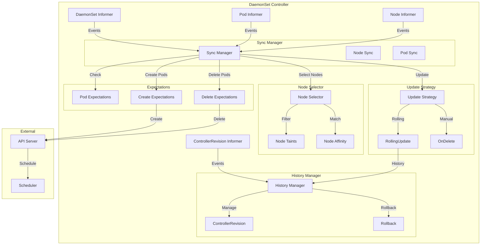
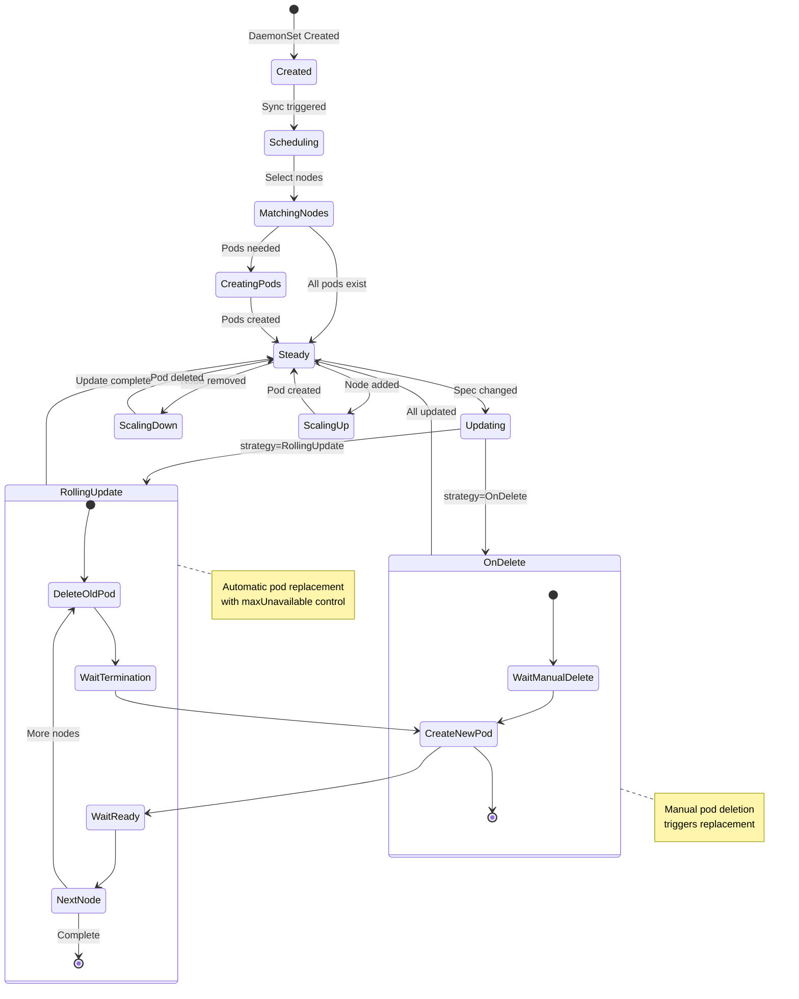
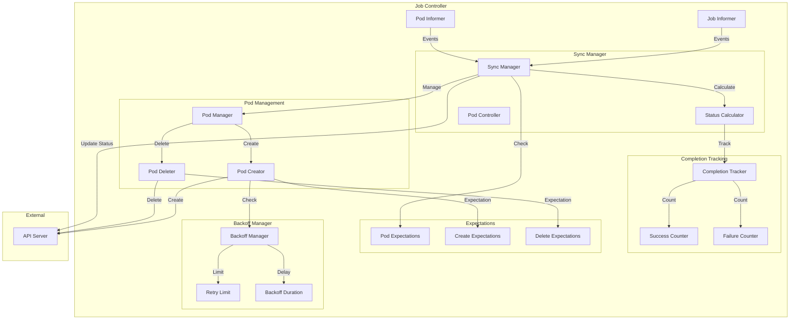
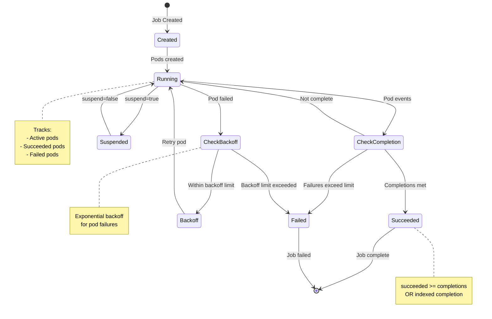
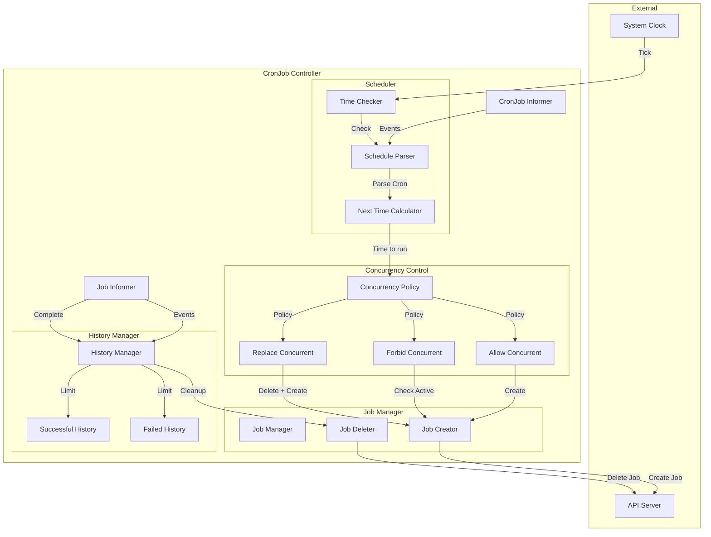
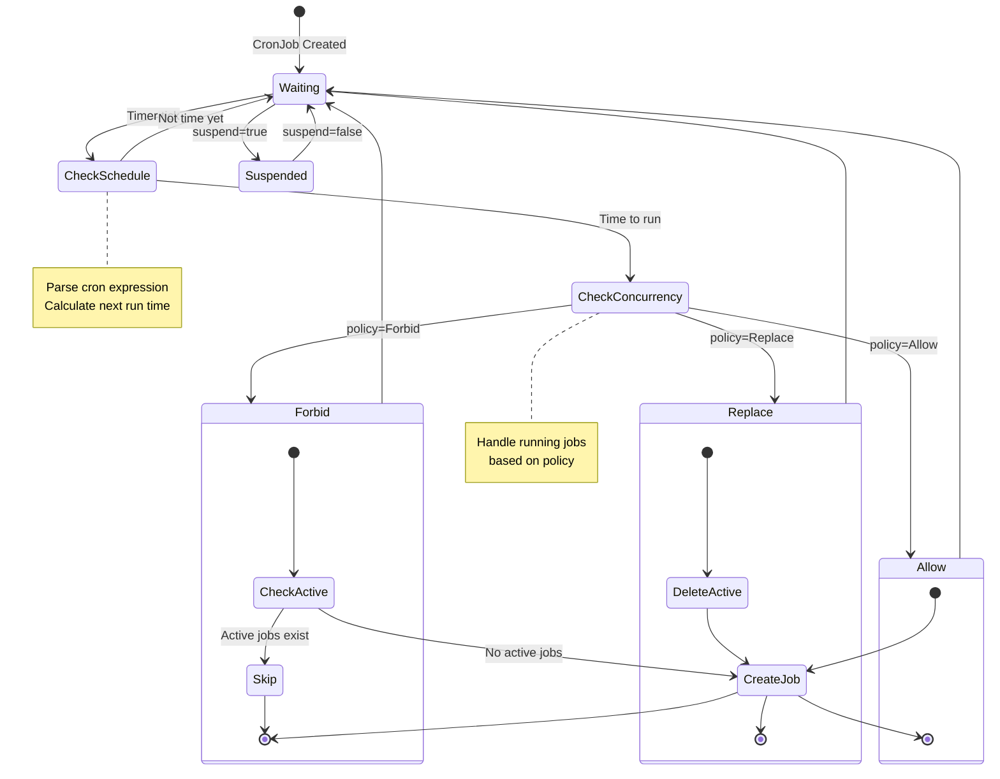

# DaemonSet, Job, and CronJob Controllers

**Author**: Claude (AI Assistant)
**Date**: 2025-10-21
**Status**: Architecture Study
**Component**: kube-controller-manager

## Overview

DaemonSet, Job, and CronJob controllers manage different workload patterns in Kubernetes: per-node daemons, batch processing, and scheduled tasks. These controllers implement sophisticated scheduling, rollout, and lifecycle management strategies.

## Key Components

### 1. DaemonSet Controller

**Source**: `pkg/controller/daemon/daemon_controller.go`

Ensures that a copy of a pod runs on all (or selected) nodes in the cluster.

#### Architecture



#### DaemonSet State Machine



#### Core Data Structures

```go
// Source: pkg/controller/daemon/daemon_controller.go

type DaemonSetsController struct {
    daemonSetLister appslisters.DaemonSetLister
    daemonSetSynced cache.InformerSynced

    podLister corelisters.PodLister
    podSynced cache.InformerSynced

    nodeLister corelisters.NodeLister
    nodeSynced cache.InformerSynced

    historyLister appslisters.ControllerRevisionLister
    historySynced cache.InformerSynced

    // Work queue
    queue workqueue.RateLimitingInterface

    // Expectations for pod creates/deletes
    expectations controller.ControllerExpectationsInterface

    // Burst for create/delete operations
    burstReplicas int
}

// Node-pod mapping
type nodeToDaemonPods map[string][]*v1.Pod
```

#### DaemonSet Sync Algorithm

```go
// Source: pkg/controller/daemon/daemon_controller.go

// Sync DaemonSet - main reconciliation loop
func (dsc *DaemonSetsController) syncDaemonSet(key string) error {
    namespace, name, err := cache.SplitMetaNamespaceKey(key)
    if err != nil {
        return err
    }

    // Get DaemonSet
    ds, err := dsc.daemonSetLister.DaemonSets(namespace).Get(name)
    if err != nil {
        if errors.IsNotFound(err) {
            return nil
        }
        return err
    }

    // Get everything needed to make sync decisions
    everything, err := dsc.getAllDaemonSetPods(ds)
    if err != nil {
        return err
    }

    // Sync based on current state
    return dsc.manage(ds, everything)
}

// Get all pods for DaemonSet
func (dsc *DaemonSetsController) getAllDaemonSetPods(
    ds *apps.DaemonSet,
) (*podControllerRefManager, error) {
    // List all pods in namespace
    pods, err := dsc.podLister.Pods(ds.Namespace).List(labels.Everything())
    if err != nil {
        return nil, err
    }

    // Filter to pods owned by this DaemonSet
    selector, err := metav1.LabelSelectorAsSelector(ds.Spec.Selector)
    if err != nil {
        return nil, err
    }

    // Create manager for matching pods
    manager := NewPodControllerRefManager(
        dsc.podControl,
        ds,
        selector,
        controllerKind,
    )

    return manager, nil
}
```

#### Node Selection

```go
// Source: pkg/controller/daemon/daemon_controller.go

// Get nodes that should run daemon pods
func (dsc *DaemonSetsController) getNodesToDaemonPods(
    ds *apps.DaemonSet,
) (nodeToDaemonPods, error) {
    // List all nodes
    nodes, err := dsc.nodeLister.List(labels.Everything())
    if err != nil {
        return nil, err
    }

    // Get all daemon pods
    pods, err := dsc.podLister.Pods(ds.Namespace).List(
        labels.SelectorFromSet(ds.Spec.Template.Labels),
    )
    if err != nil {
        return nil, err
    }

    // Map pods to nodes
    nodeToPods := make(nodeToDaemonPods)
    for _, pod := range pods {
        nodeName := pod.Spec.NodeName
        if nodeName == "" {
            continue
        }
        nodeToPods[nodeName] = append(nodeToPods[nodeName], pod)
    }

    return nodeToPods, nil
}

// Check if node should run daemon pod
func (dsc *DaemonSetsController) nodeShouldRunDaemonPod(
    node *v1.Node,
    ds *apps.DaemonSet,
) (bool, bool) {
    // Check node selector
    if !nodeMatchesNodeSelector(node, &ds.Spec.Template.Spec) {
        return false, false
    }

    // Check node affinity
    if !nodeMatchesNodeAffinity(node, &ds.Spec.Template.Spec) {
        return false, false
    }

    // Check if node is schedulable
    if node.Spec.Unschedulable {
        return false, false
    }

    // Check taints and tolerations
    shouldRun, shouldContinueRunning := dsc.toleratesTaints(node, ds)

    return shouldRun, shouldContinueRunning
}

// Check if daemon tolerates node taints
func (dsc *DaemonSetsController) toleratesTaints(
    node *v1.Node,
    ds *apps.DaemonSet,
) (bool, bool) {
    taints := node.Spec.Taints
    tolerations := ds.Spec.Template.Spec.Tolerations

    // Check for unschedulable taint
    unschedulableTaint := false
    for _, taint := range taints {
        if taint.Key == v1.TaintNodeUnschedulable {
            unschedulableTaint = true
            break
        }
    }

    // Should run: all taints tolerated
    shouldRun := v1helper.TolerationsTolerateTaintsWithFilter(
        tolerations,
        taints,
        func(t *v1.Taint) bool {
            return t.Effect == v1.TaintEffectNoSchedule ||
                t.Effect == v1.TaintEffectNoExecute
        },
    )

    // Should continue running: tolerates non-unschedulable taints
    shouldContinueRunning := v1helper.TolerationsTolerateTaintsWithFilter(
        tolerations,
        taints,
        func(t *v1.Taint) bool {
            return t.Effect == v1.TaintEffectNoExecute &&
                t.Key != v1.TaintNodeUnschedulable
        },
    )

    return shouldRun && !unschedulableTaint, shouldContinueRunning
}
```

#### Manage DaemonSet Pods

```go
// Source: pkg/controller/daemon/daemon_controller.go

// Manage DaemonSet pods - create/delete as needed
func (dsc *DaemonSetsController) manage(
    ds *apps.DaemonSet,
    nodeList []*v1.Node,
    nodeToDaemonPods nodeToDaemonPods,
) error {
    // Find nodes that need pods created
    var nodesNeedingPods []string

    // Find pods that need to be deleted
    var podsToDelete []string

    for _, node := range nodeList {
        shouldRun, shouldContinueRunning := dsc.nodeShouldRunDaemonPod(node, ds)

        daemonPods := nodeToDaemonPods[node.Name]

        switch {
        case shouldRun && len(daemonPods) == 0:
            // Need to create pod on this node
            nodesNeedingPods = append(nodesNeedingPods, node.Name)

        case shouldContinueRunning && len(daemonPods) > 1:
            // Too many pods, delete extras
            for i := 1; i < len(daemonPods); i++ {
                podsToDelete = append(podsToDelete, daemonPods[i].Name)
            }

        case !shouldContinueRunning && len(daemonPods) > 0:
            // Pod should not run on this node
            for _, pod := range daemonPods {
                podsToDelete = append(podsToDelete, pod.Name)
            }
        }
    }

    // Create pods with burst limit
    createWait := sync.WaitGroup{}
    createWait.Add(len(nodesNeedingPods))

    for i := 0; i < len(nodesNeedingPods); i++ {
        go func(ix int) {
            defer createWait.Done()

            nodeName := nodesNeedingPods[ix]

            // Create pod for node
            err := dsc.podControl.CreatePodsOnNode(
                nodeName,
                ds.Namespace,
                &ds.Spec.Template,
                ds,
                controllerKind,
            )

            if err != nil {
                dsc.expectations.CreationObserved(key)
            }
        }(i)
    }
    createWait.Wait()

    // Delete pods with burst limit
    deleteWait := sync.WaitGroup{}
    deleteWait.Add(len(podsToDelete))

    for i := 0; i < len(podsToDelete); i++ {
        go func(ix int) {
            defer deleteWait.Done()

            podName := podsToDelete[ix]

            // Delete pod
            err := dsc.podControl.DeletePod(
                ds.Namespace,
                podName,
                ds,
            )

            if err != nil {
                dsc.expectations.DeletionObserved(key)
            }
        }(i)
    }
    deleteWait.Wait()

    return nil
}
```

#### Rolling Update Strategy

```go
// Source: pkg/controller/daemon/update.go

// Perform rolling update
func (dsc *DaemonSetsController) rollingUpdate(
    ds *apps.DaemonSet,
    nodeList []*v1.Node,
    nodeToDaemonPods nodeToDaemonPods,
) error {
    // Get update strategy
    maxUnavailable, err := getMaxUnavailable(ds)
    if err != nil {
        return err
    }

    // Count current unavailable
    unavailable := 0
    for _, pods := range nodeToDaemonPods {
        for _, pod := range pods {
            if !podutil.IsPodAvailable(pod, ds.Spec.MinReadySeconds, metav1.Now()) {
                unavailable++
            }
        }
    }

    // Find pods that need updating
    var oldPods []*v1.Pod
    for _, pods := range nodeToDaemonPods {
        for _, pod := range pods {
            if !isUpdatedPod(ds, pod) {
                oldPods = append(oldPods, pod)
            }
        }
    }

    // Sort by creation timestamp (oldest first)
    sort.Sort(podsByCreationTimestamp(oldPods))

    // Delete old pods up to maxUnavailable
    var podsToDelete []*v1.Pod
    for _, pod := range oldPods {
        if unavailable >= maxUnavailable {
            break
        }

        podsToDelete = append(podsToDelete, pod)
        unavailable++
    }

    // Delete selected pods
    return dsc.syncNodes(ds, podsToDelete, nil)
}

// Get max unavailable from update strategy
func getMaxUnavailable(ds *apps.DaemonSet) (int, error) {
    if ds.Spec.UpdateStrategy.RollingUpdate == nil {
        return 1, nil
    }

    maxUnavailable := ds.Spec.UpdateStrategy.RollingUpdate.MaxUnavailable
    if maxUnavailable == nil {
        return 1, nil
    }

    // Parse IntOrString
    maxUnavailableNum, err := intstrutil.GetValueFromIntOrPercent(
        maxUnavailable,
        int(ds.Status.DesiredNumberScheduled),
        true,
    )
    if err != nil {
        return 0, err
    }

    if maxUnavailableNum < 1 {
        maxUnavailableNum = 1
    }

    return maxUnavailableNum, nil
}

// Check if pod is updated to current template
func isUpdatedPod(ds *apps.DaemonSet, pod *v1.Pod) bool {
    // Compare pod template hash
    templateGeneration := ds.Annotations[apps.DeprecatedTemplateGeneration]
    podGeneration := pod.Annotations[apps.DeprecatedTemplateGeneration]

    return templateGeneration == podGeneration
}
```

#### History Management

```go
// Source: pkg/controller/daemon/update.go

// Manage DaemonSet history using ControllerRevisions
func (dsc *DaemonSetsController) snapshot(
    ds *apps.DaemonSet,
    revision int64,
) (*apps.ControllerRevision, error) {
    // Create patch for current template
    patch, err := getPatch(ds)
    if err != nil {
        return nil, err
    }

    // Create ControllerRevision
    cr := &apps.ControllerRevision{
        ObjectMeta: metav1.ObjectMeta{
            Name:      controllerRevisionName(ds.Name, revision),
            Namespace: ds.Namespace,
            OwnerReferences: []metav1.OwnerReference{
                *metav1.NewControllerRef(ds, controllerKind),
            },
        },
        Data:     runtime.RawExtension{Raw: patch},
        Revision: revision,
    }

    return dsc.kubeClient.AppsV1().ControllerRevisions(ds.Namespace).
        Create(context.TODO(), cr, metav1.CreateOptions{})
}

// Rollback to previous revision
func (dsc *DaemonSetsController) rollback(
    ds *apps.DaemonSet,
    toRevision *apps.ControllerRevision,
) error {
    // Apply patch from revision
    dsClone := ds.DeepCopy()
    if err := applyRevision(dsClone, toRevision); err != nil {
        return err
    }

    // Update DaemonSet
    _, err := dsc.kubeClient.AppsV1().DaemonSets(ds.Namespace).
        Update(context.TODO(), dsClone, metav1.UpdateOptions{})

    return err
}
```

---

### 2. Job Controller

**Source**: `pkg/controller/job/job_controller.go`

Manages batch job execution with completions, parallelism, and retry logic.

#### Architecture



#### Job State Machine



#### Job Completion Modes

```mermaid
graph TB
    subgraph "NonIndexed Mode"
        NI[NonIndexed Job]
        NI -->|Creates| P1[Pod 1]
        NI -->|Creates| P2[Pod 2]
        NI -->|Creates| P3[Pod N]

        P1 -->|Success| C1[Count: 1]
        P2 -->|Success| C2[Count: 2]
        P3 -->|Success| C3[Count: completions]

        C3 -->|Complete| DONE1[Job Complete]
    end

    subgraph "Indexed Mode"
        IX[Indexed Job]
        IX -->|Index 0| PI1[Pod with INDEX=0]
        IX -->|Index 1| PI2[Pod with INDEX=1]
        IX -->|Index N| PI3[Pod with INDEX=N]

        PI1 -->|Success| CI1[Mark index 0]
        PI2 -->|Success| CI2[Mark index 1]
        PI3 -->|Success| CI3[Mark index N]

        CI3 -->|All indexed| DONE2[Job Complete]
    end

    note right of NI
        Count successful completions
        Any pod can contribute
    end note

    note right of IX
        Track completion by index
        Each index must succeed
    end note
```

#### Core Data Structures

```go
// Source: pkg/controller/job/job_controller.go

type Controller struct {
    jobLister batchlisters.JobLister
    jobSynced cache.InformerSynced

    podLister corelisters.PodLister
    podSynced cache.InformerSynced

    // Work queue
    queue workqueue.RateLimitingInterface

    // Expectations for pod creates/deletes
    expectations controller.ControllerExpectationsInterface

    // Backoff tracking for failed pods
    backoffStore *backoffStore
}

// Backoff tracking
type backoffStore struct {
    mu sync.RWMutex
    // Map job key -> backoff record
    backoffs map[string]*backoffRecord
}

type backoffRecord struct {
    // Number of failures
    failures int
    // Last failure time
    lastFailureTime time.Time
}
```

#### Job Sync Algorithm

```go
// Source: pkg/controller/job/job_controller.go

// Sync job - main reconciliation loop
func (jm *Controller) syncJob(key string) error {
    namespace, name, err := cache.SplitMetaNamespaceKey(key)
    if err != nil {
        return err
    }

    // Get job
    job, err := jm.jobLister.Jobs(namespace).Get(name)
    if err != nil {
        if errors.IsNotFound(err) {
            return nil
        }
        return err
    }

    // Check if job is suspended
    if job.Spec.Suspend != nil && *job.Spec.Suspend {
        return jm.suspendJob(job)
    }

    // Get pods for job
    pods, err := jm.getPodsForJob(job)
    if err != nil {
        return err
    }

    // Calculate job status
    activePods := filterActivePods(pods)
    succeeded, failed := getStatus(pods)

    // Manage job based on completion mode
    if isIndexedJob(job) {
        return jm.manageIndexedJob(job, activePods, succeeded, failed)
    }

    return jm.manageNonIndexedJob(job, activePods, succeeded, failed)
}

// Manage non-indexed job
func (jm *Controller) manageNonIndexedJob(
    job *batch.Job,
    activePods []*v1.Pod,
    succeeded int32,
    failed int32,
) error {
    // Check if job is complete
    if succeeded >= *job.Spec.Completions {
        return jm.markJobComplete(job)
    }

    // Check if job has failed
    if job.Spec.BackoffLimit != nil && failed > *job.Spec.BackoffLimit {
        return jm.markJobFailed(job, "BackoffLimitExceeded")
    }

    // Calculate active count needed
    active := int32(len(activePods))
    parallelism := *job.Spec.Parallelism
    completions := *job.Spec.Completions

    // Calculate diff
    diff := parallelism - active
    if succeeded+active >= completions {
        diff = completions - succeeded - active
    }

    if diff < 0 {
        // Too many active pods, delete some
        return jm.deleteActivePods(job, activePods, -diff)
    } else if diff > 0 {
        // Need more active pods
        return jm.createPods(job, diff)
    }

    return nil
}
```

#### Indexed Job Management

```go
// Source: pkg/controller/job/indexed_job_utils.go

// Manage indexed job with completion indexes
func (jm *Controller) manageIndexedJob(
    job *batch.Job,
    activePods []*v1.Pod,
    succeeded int32,
    failed int32,
) error {
    // Track which indexes have completed
    completedIndexes := parseIndexes(job.Status.CompletedIndexes)

    // Check if all indexes complete
    completions := int(*job.Spec.Completions)
    if len(completedIndexes) >= completions {
        return jm.markJobComplete(job)
    }

    // Find missing indexes
    var missingIndexes []int
    for i := 0; i < completions; i++ {
        if !completedIndexes.Has(i) {
            missingIndexes = append(missingIndexes, i)
        }
    }

    // Create pods for missing indexes
    parallelism := int(*job.Spec.Parallelism)
    active := len(activePods)

    podsToCreate := parallelism - active
    if podsToCreate > len(missingIndexes) {
        podsToCreate = len(missingIndexes)
    }

    for i := 0; i < podsToCreate; i++ {
        index := missingIndexes[i]
        if err := jm.createIndexedPod(job, index); err != nil {
            return err
        }
    }

    return nil
}

// Create pod with completion index
func (jm *Controller) createIndexedPod(job *batch.Job, index int) error {
    // Clone pod template
    podTemplate := job.Spec.Template.DeepCopy()

    // Set completion index annotation
    if podTemplate.Annotations == nil {
        podTemplate.Annotations = map[string]string{}
    }
    podTemplate.Annotations[batch.JobCompletionIndexAnnotation] = strconv.Itoa(index)

    // Set INDEX env var
    indexEnv := v1.EnvVar{
        Name:  "JOB_COMPLETION_INDEX",
        Value: strconv.Itoa(index),
    }

    for i := range podTemplate.Spec.Containers {
        podTemplate.Spec.Containers[i].Env = append(
            podTemplate.Spec.Containers[i].Env,
            indexEnv,
        )
    }

    // Create pod
    return jm.podControl.CreatePods(job.Namespace, podTemplate, job)
}

// Update completed indexes when pod succeeds
func (jm *Controller) updateCompletedIndexes(
    job *batch.Job,
    pod *v1.Pod,
) error {
    // Get pod's index
    indexStr := pod.Annotations[batch.JobCompletionIndexAnnotation]
    index, err := strconv.Atoi(indexStr)
    if err != nil {
        return err
    }

    // Parse current completed indexes
    completedIndexes := parseIndexes(job.Status.CompletedIndexes)

    // Add new index
    completedIndexes.Insert(index)

    // Update job status
    jobClone := job.DeepCopy()
    jobClone.Status.CompletedIndexes = formatIndexes(completedIndexes)

    _, err = jm.kubeClient.BatchV1().Jobs(job.Namespace).
        UpdateStatus(context.TODO(), jobClone, metav1.UpdateOptions{})

    return err
}
```

#### Backoff Management

```go
// Source: pkg/controller/job/job_controller.go

// Check if should create pod (backoff)
func (jm *Controller) shouldCreatePod(job *batch.Job) bool {
    key, _ := controller.KeyFunc(job)

    backoff := jm.backoffStore.get(key)
    if backoff == nil {
        return true
    }

    // Calculate backoff duration
    backoffDuration := getBackoffDuration(backoff.failures)

    // Check if backoff period has elapsed
    now := time.Now()
    return now.Sub(backoff.lastFailureTime) > backoffDuration
}

// Get backoff duration (exponential)
func getBackoffDuration(failures int) time.Duration {
    const (
        minBackoff = 1 * time.Second
        maxBackoff = 6 * time.Minute
    )

    duration := minBackoff * time.Duration(1<<uint(failures))
    if duration > maxBackoff {
        duration = maxBackoff
    }

    return duration
}

// Record pod failure for backoff
func (jm *Controller) recordPodFailure(job *batch.Job, pod *v1.Pod) {
    key, _ := controller.KeyFunc(job)

    jm.backoffStore.mu.Lock()
    defer jm.backoffStore.mu.Unlock()

    backoff := jm.backoffStore.backoffs[key]
    if backoff == nil {
        backoff = &backoffRecord{}
        jm.backoffStore.backoffs[key] = backoff
    }

    backoff.failures++
    backoff.lastFailureTime = time.Now()
}
```

---

### 3. CronJob Controller

**Source**: `pkg/controller/cronjob/cronjob_controller.go`

Manages time-based job scheduling using cron expressions.

#### Architecture



#### CronJob State Machine



#### Core Data Structures

```go
// Source: pkg/controller/cronjob/cronjob_controller.go

type Controller struct {
    cronJobLister batchlisters.CronJobLister
    cronJobSynced cache.InformerSynced

    jobLister batchlisters.JobLister
    jobSynced cache.InformerSynced

    // Work queue
    queue workqueue.RateLimitingInterface

    // Clock for time-based operations
    clock clock.Clock
}

// Cron schedule parser
type scheduleParser struct {
    parser cron.Parser
}
```

#### CronJob Sync Algorithm

```go
// Source: pkg/controller/cronjob/cronjob_controller.go

// Sync CronJob - main reconciliation loop
func (cc *Controller) syncCronJob(key string) error {
    namespace, name, err := cache.SplitMetaNamespaceKey(key)
    if err != nil {
        return err
    }

    // Get CronJob
    cronJob, err := cc.cronJobLister.CronJobs(namespace).Get(name)
    if err != nil {
        if errors.IsNotFound(err) {
            return nil
        }
        return err
    }

    // Check if suspended
    if cronJob.Spec.Suspend != nil && *cronJob.Spec.Suspend {
        return nil
    }

    // Get jobs owned by this CronJob
    jobs, err := cc.getJobsForCronJob(cronJob)
    if err != nil {
        return err
    }

    // Separate active and finished jobs
    activeJobs, finishedJobs := separateActiveFinishedJobs(jobs)

    // Clean up old jobs based on history limits
    if err := cc.cleanupFinishedJobs(cronJob, finishedJobs); err != nil {
        return err
    }

    // Check if it's time to create a new job
    scheduledTime, err := cc.getNextScheduleTime(cronJob, cc.clock.Now())
    if err != nil {
        return err
    }

    if scheduledTime == nil {
        // Not time to run yet
        return nil
    }

    // Handle according to concurrency policy
    return cc.handleConcurrency(cronJob, activeJobs, *scheduledTime)
}
```

#### Schedule Calculation

```go
// Source: pkg/controller/cronjob/utils.go

// Get next schedule time
func (cc *Controller) getNextScheduleTime(
    cronJob *batch.CronJob,
    now time.Time,
) (*time.Time, error) {
    // Parse cron schedule
    schedule, err := cron.ParseStandard(cronJob.Spec.Schedule)
    if err != nil {
        return nil, err
    }

    // Get last scheduled time
    var earliestTime time.Time
    if cronJob.Status.LastScheduleTime != nil {
        earliestTime = cronJob.Status.LastScheduleTime.Time
    } else {
        earliestTime = cronJob.CreationTimestamp.Time
    }

    // Calculate next run time
    nextTime := schedule.Next(earliestTime)

    // Check if we've passed the next scheduled time
    if nextTime.After(now) {
        return nil, nil // Not time yet
    }

    // Check if we've missed too many schedules
    numberOfMissedSchedules := 0
    for nextTime.Before(now) && numberOfMissedSchedules < 100 {
        nextTime = schedule.Next(nextTime)
        numberOfMissedSchedules++
    }

    // Apply starting deadline
    if cronJob.Spec.StartingDeadlineSeconds != nil {
        deadline := now.Add(-time.Duration(*cronJob.Spec.StartingDeadlineSeconds) * time.Second)
        if nextTime.Before(deadline) {
            return nil, nil // Missed deadline
        }
    }

    return &nextTime, nil
}
```

#### Concurrency Policy Handling

```go
// Source: pkg/controller/cronjob/cronjob_controller.go

// Handle job creation based on concurrency policy
func (cc *Controller) handleConcurrency(
    cronJob *batch.CronJob,
    activeJobs []*batch.Job,
    scheduledTime time.Time,
) error {
    policy := cronJob.Spec.ConcurrencyPolicy
    if policy == "" {
        policy = batch.AllowConcurrent
    }

    switch policy {
    case batch.AllowConcurrent:
        // Always create new job
        return cc.createJob(cronJob, scheduledTime)

    case batch.ForbidConcurrent:
        // Only create if no active jobs
        if len(activeJobs) > 0 {
            cc.recorder.Eventf(
                cronJob,
                v1.EventTypeNormal,
                "MissedSchedule",
                "Missed scheduled time: active job exists",
            )
            return nil
        }
        return cc.createJob(cronJob, scheduledTime)

    case batch.ReplaceConcurrent:
        // Delete active jobs and create new one
        for _, job := range activeJobs {
            if err := cc.deleteJob(cronJob, job); err != nil {
                return err
            }
        }
        return cc.createJob(cronJob, scheduledTime)

    default:
        return fmt.Errorf("unknown concurrency policy: %v", policy)
    }
}
```

#### Job Creation

```go
// Source: pkg/controller/cronjob/cronjob_controller.go

// Create job from CronJob template
func (cc *Controller) createJob(
    cronJob *batch.CronJob,
    scheduledTime time.Time,
) error {
    // Build job from template
    job := &batch.Job{
        ObjectMeta: metav1.ObjectMeta{
            Name:      getJobName(cronJob, scheduledTime),
            Namespace: cronJob.Namespace,
            Labels: map[string]string{
                "cronjob": cronJob.Name,
            },
            Annotations: map[string]string{
                batch.CronJobScheduledTimestampAnnotation: scheduledTime.Format(time.RFC3339),
            },
            OwnerReferences: []metav1.OwnerReference{
                *metav1.NewControllerRef(cronJob, controllerKind),
            },
        },
        Spec: *cronJob.Spec.JobTemplate.Spec.DeepCopy(),
    }

    // Create job
    _, err := cc.kubeClient.BatchV1().Jobs(cronJob.Namespace).
        Create(context.TODO(), job, metav1.CreateOptions{})
    if err != nil {
        return err
    }

    // Update CronJob status
    return cc.updateLastScheduleTime(cronJob, scheduledTime)
}

// Generate job name
func getJobName(cronJob *batch.CronJob, scheduledTime time.Time) string {
    return fmt.Sprintf("%s-%d", cronJob.Name, scheduledTime.Unix())
}

// Update last schedule time
func (cc *Controller) updateLastScheduleTime(
    cronJob *batch.CronJob,
    scheduledTime time.Time,
) error {
    cronJobClone := cronJob.DeepCopy()
    cronJobClone.Status.LastScheduleTime = &metav1.Time{Time: scheduledTime}

    _, err := cc.kubeClient.BatchV1().CronJobs(cronJob.Namespace).
        UpdateStatus(context.TODO(), cronJobClone, metav1.UpdateOptions{})

    return err
}
```

#### History Cleanup

```go
// Source: pkg/controller/cronjob/cronjob_controller.go

// Clean up finished jobs based on history limits
func (cc *Controller) cleanupFinishedJobs(
    cronJob *batch.CronJob,
    finishedJobs []*batch.Job,
) error {
    // Separate successful and failed jobs
    successfulJobs := []*batch.Job{}
    failedJobs := []*batch.Job{}

    for _, job := range finishedJobs {
        if isJobSuccessful(job) {
            successfulJobs = append(successfulJobs, job)
        } else {
            failedJobs = append(failedJobs, job)
        }
    }

    // Sort by completion time (oldest first)
    sort.Sort(jobsByCompletionTime(successfulJobs))
    sort.Sort(jobsByCompletionTime(failedJobs))

    // Delete old successful jobs
    successLimit := int32(3) // default
    if cronJob.Spec.SuccessfulJobsHistoryLimit != nil {
        successLimit = *cronJob.Spec.SuccessfulJobsHistoryLimit
    }

    if int32(len(successfulJobs)) > successLimit {
        for i := 0; i < len(successfulJobs)-int(successLimit); i++ {
            if err := cc.deleteJob(cronJob, successfulJobs[i]); err != nil {
                return err
            }
        }
    }

    // Delete old failed jobs
    failureLimit := int32(1) // default
    if cronJob.Spec.FailedJobsHistoryLimit != nil {
        failureLimit = *cronJob.Spec.FailedJobsHistoryLimit
    }

    if int32(len(failedJobs)) > failureLimit {
        for i := 0; i < len(failedJobs)-int(failureLimit); i++ {
            if err := cc.deleteJob(cronJob, failedJobs[i]); err != nil {
                return err
            }
        }
    }

    return nil
}
```

---

## Integration: Job + TTL Controller

The TTL-after-finished controller (covered in document 12) integrates with the Job controller:

```go
// Job with TTL cleanup
apiVersion: batch/v1
kind: Job
metadata:
  name: example-job
spec:
  ttlSecondsAfterFinished: 100  # Cleanup 100s after completion
  template:
    spec:
      containers:
      - name: job
        image: busybox
        command: ["echo", "Hello"]
      restartPolicy: Never
```

---

## Performance Optimizations

### 1. DaemonSet Pod Creation Batching

```go
// Limit concurrent pod creates
const daemonSetBurstReplicas = 250

// Create pods in parallel with limit
sem := make(chan struct{}, daemonSetBurstReplicas)
for _, node := range nodesToCreate {
    sem <- struct{}{}
    go func(n string) {
        defer func() { <-sem }()
        createPodOnNode(n)
    }(node)
}
```

### 2. Job Expectations

```go
// Use expectations to avoid unnecessary syncs
expectations := controller.NewControllerExpectations()

// Before creating pod
key := getKey(job)
expectations.ExpectCreations(key, 1)

// After successful create
expectations.CreationObserved(key)

// Only sync if expectations met
if !expectations.SatisfiedExpectations(key) {
    return nil // Wait for expectations
}
```

### 3. CronJob Time-based Queueing

```go
// Only sync CronJobs near their schedule time
func (cc *Controller) enqueueCronJob(cronJob *batch.CronJob) {
    nextSchedule := getNextScheduleTime(cronJob)
    delay := time.Until(nextSchedule)

    // Queue with delay
    cc.queue.AddAfter(cronJob, delay)
}
```

---

## Configuration

### DaemonSet Controller

```bash
# kube-controller-manager flags
--concurrent-daemonset-syncs=2               # DaemonSet workers
```

### Job Controller

```bash
# kube-controller-manager flags
--concurrent-job-syncs=5                     # Job workers
```

### CronJob Controller

```bash
# kube-controller-manager flags
--concurrent-cron-job-syncs=5                # CronJob workers
```

---

## Source References

1. **DaemonSet Controller**: `pkg/controller/daemon/daemon_controller.go`
2. **DaemonSet Update**: `pkg/controller/daemon/update.go`
3. **Job Controller**: `pkg/controller/job/job_controller.go`
4. **Indexed Job Utils**: `pkg/controller/job/indexed_job_utils.go`
5. **CronJob Controller**: `pkg/controller/cronjob/cronjob_controller.go`
6. **CronJob Utils**: `pkg/controller/cronjob/utils.go`

---

## Summary

DaemonSet, Job, and CronJob controllers manage diverse workload patterns:

1. **DaemonSet Controller**: Ensures per-node pod deployment with rolling updates and node selection
2. **Job Controller**: Manages batch workloads with completions, parallelism, indexed jobs, and backoff
3. **CronJob Controller**: Provides time-based scheduling with concurrency policies and history management

These controllers implement sophisticated strategies for pod lifecycle management, failure handling, and scheduling to support both daemon and batch workload patterns in Kubernetes.
