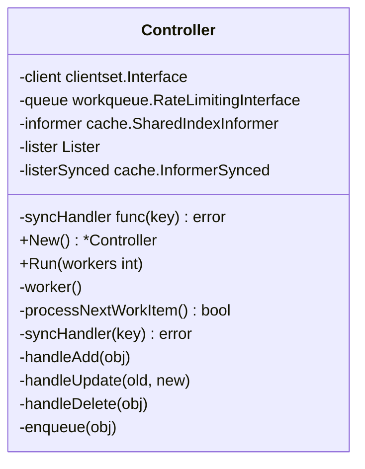
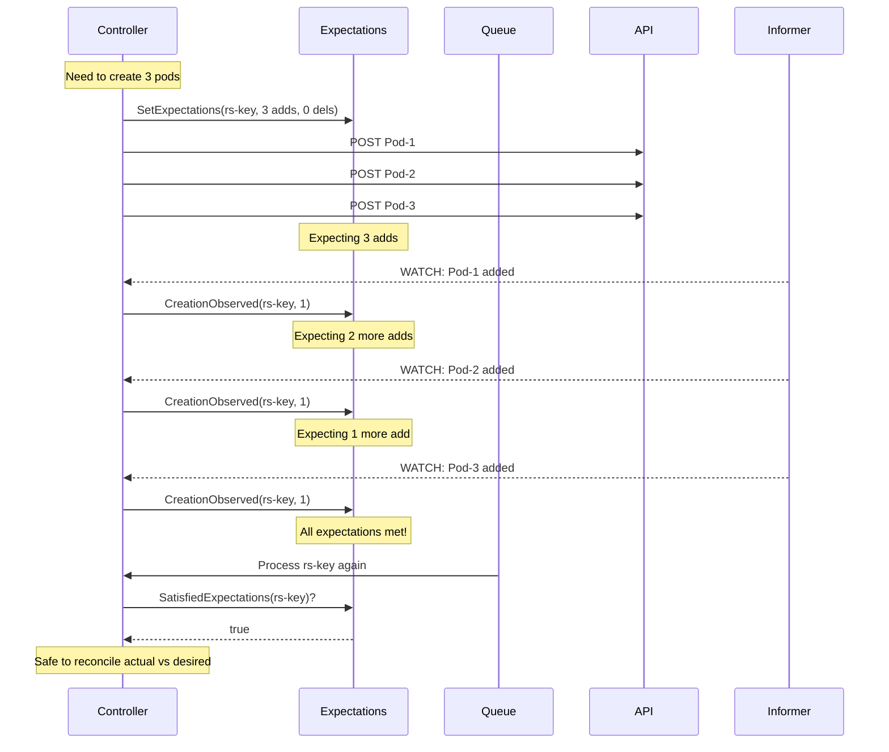
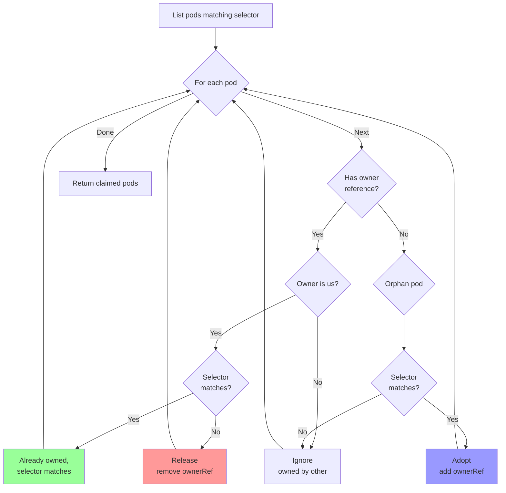
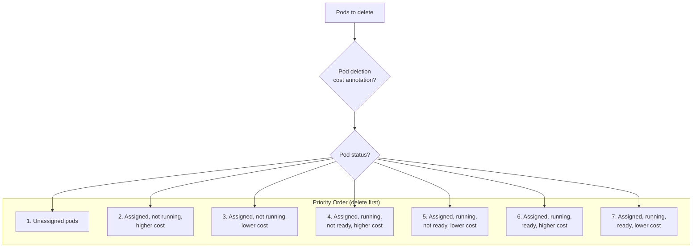
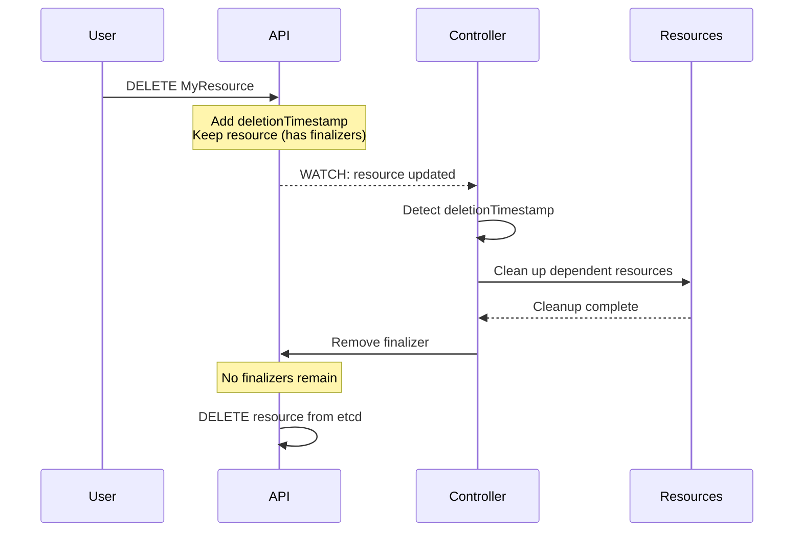

# Kube-Controller-Manager: Controller Patterns

**Document Version**: 1.0
**Last Updated**: 2025-10-22
**Status**: Draft

---

## 1. Overview

This document describes common implementation patterns used across controllers in kube-controller-manager. Understanding these patterns is essential for implementing new controllers or modifying existing ones.

## 2. Standard Controller Pattern

### 2.1 Basic Controller Structure



**Template**:
```go
type XController struct {
    // Client for API operations
    client clientset.Interface

    // Informers and listers
    xInformer appsinformers.XInformer
    xLister   appslisters.XLister
    xSynced   cache.InformerSynced

    // Work queue
    queue workqueue.TypedRateLimitingInterface[string]

    // Sync handler (can be overridden for testing)
    syncHandler func(ctx context.Context, key string) error

    // Event recorder
    eventRecorder record.EventRecorder
}

func NewXController(
    ctx context.Context,
    xInformer appsinformers.XInformer,
    client clientset.Interface,
) *XController {
    xc := &XController{
        client:    client,
        xInformer: xInformer,
        xLister:   xInformer.Lister(),
        xSynced:   xInformer.Informer().HasSynced,
        queue: workqueue.NewTypedRateLimitingQueueWithConfig(
            workqueue.DefaultTypedControllerRateLimiter[string](),
            workqueue.TypedRateLimitingQueueConfig[string]{
                Name: "x",
            },
        ),
    }

    // Set up event handlers
    xInformer.Informer().AddEventHandler(cache.ResourceEventHandlerFuncs{
        AddFunc:    xc.addX,
        UpdateFunc: xc.updateX,
        DeleteFunc: xc.deleteX,
    })

    xc.syncHandler = xc.syncX
    return xc
}

func (xc *XController) Run(ctx context.Context, workers int) {
    defer utilruntime.HandleCrash()
    defer xc.queue.ShutDown()

    logger := klog.FromContext(ctx)
    logger.Info("Starting controller", "controller", "x")
    defer logger.Info("Shutting down controller", "controller", "x")

    // Wait for caches to sync
    if !cache.WaitForNamedCacheSync("x", ctx.Done(), xc.xSynced) {
        return
    }

    // Start workers
    for i := 0; i < workers; i++ {
        go wait.UntilWithContext(ctx, xc.worker, time.Second)
    }

    <-ctx.Done()
}

func (xc *XController) worker(ctx context.Context) {
    for xc.processNextWorkItem(ctx) {
    }
}

func (xc *XController) processNextWorkItem(ctx context.Context) bool {
    key, quit := xc.queue.Get()
    if quit {
        return false
    }
    defer xc.queue.Done(key)

    err := xc.syncHandler(ctx, key)
    if err != nil {
        // Requeue with rate limiting
        xc.queue.AddRateLimited(key)
        utilruntime.HandleError(fmt.Errorf("sync %q failed: %v", key, err))
        return true
    }

    // Success: forget rate limit history
    xc.queue.Forget(key)
    return true
}
```

---

## 3. Expectations Pattern

### 3.1 Purpose

**Problem**: Controller creates pods, but watch events arrive later. Controller shouldn't create duplicates before observing the creates.

**Solution**: Expectations track anticipated adds/deletes.

### 3.2 Expectations Architecture



### 3.3 Implementation

**Data Structure**:
```go
// ControlleeExpectations tracks expected adds and deletes
type ControlleeExpectations struct {
    // Number of additions we expect to see
    add int64
    // Number of deletions we expect to see
    del int64
    // Key for this expectation (e.g., "default/my-replicaset")
    key string
    // Timestamp when expectation was set
    timestamp time.Time
}

// ControllerExpectations stores expectations for all controllers
type ControllerExpectations struct {
    cache.Store
}
```

**Usage**:
```go
// Before creating pods
func (rsc *ReplicaSetController) manageReplicas(ctx context.Context, rs *apps.ReplicaSet) error {
    diff := *(rs.Spec.Replicas) - int32(len(filteredPods))

    if diff > 0 {
        // Need to create pods
        rsc.expectations.ExpectCreations(rsKey, int(diff))

        successfulCreations, err := slowStartBatch(
            int(diff),
            controller.SlowStartInitialBatchSize,
            func() error {
                return rsc.podControl.CreatePods(ctx, rs.Namespace, &rs.Spec.Template, rs, metav1.NewControllerRef(rs, controllerKind))
            },
        )

        if err != nil {
            // Lower expectations for failed creates
            rsc.expectations.CreationObserved(rsKey, int(diff-successfulCreations))
        }
    }
}

// In sync handler
func (rsc *ReplicaSetController) syncReplicaSet(ctx context.Context, key string) error {
    // Don't sync if expectations aren't met
    if !rsc.expectations.SatisfiedExpectations(key) {
        klog.V(4).InfoS("Not syncing, expectations not met", "key", key)
        return nil
    }

    // Expectations met or expired, proceed with sync
    // ...
}

// In event handler
func (rsc *ReplicaSetController) addPod(obj interface{}) {
    pod := obj.(*v1.Pod)

    if controllerRef := metav1.GetControllerOf(pod); controllerRef != nil {
        rsKey := cache.MetaNamespaceKeyFunc(rs)
        rsc.expectations.CreationObserved(rsKey)
        rsc.queue.Add(rsKey)
    }
}
```

### 3.4 Expectations Timeout

```go
const ExpectationsTimeout = 5 * time.Minute

// Expectations expire after 5 minutes
// This prevents controllers from being stuck if watch events are missed
func (exp *ControllerExpectations) SatisfiedExpectations(controllerKey string) bool {
    item, exists := exp.GetExpectations(controllerKey)
    if !exists {
        return true
    }

    e := item.(*ControlleeExpectations)

    // Check if expectations are met
    if e.add <= 0 && e.del <= 0 {
        return true
    }

    // Check if expectations have expired
    if time.Since(e.timestamp) > ExpectationsTimeout {
        return true
    }

    return false
}
```

---

## 4. Adoption & Release Pattern

### 4.1 Purpose

**Problem**:
- Orphaned pods (no controller) might match a ReplicaSet's selector
- Pods owned by controller might no longer match selector (label changed)

**Solution**: Adopt orphans, release mismatches.

### 4.2 ControllerRefManager



### 4.3 Implementation

```go
type PodControllerRefManager struct {
    BaseControllerRefManager
    controllerKind schema.GroupVersionKind
    podControl     PodControlInterface
}

func (m *PodControllerRefManager) ClaimPods(
    ctx context.Context,
    pods []*v1.Pod,
    filters ...func(*v1.Pod) bool,
) ([]*v1.Pod, error) {
    var claimed []*v1.Pod
    var errlist []error

    for _, pod := range pods {
        ok, err := m.ClaimObject(ctx, pod,
            func(obj metav1.Object) bool {
                // Check if selector matches
                return m.Selector.Matches(labels.Set(pod.Labels))
            },
            func(ctx context.Context, obj metav1.Object) error {
                // Adopt: add ownerReference
                return m.AdoptPod(ctx, obj.(*v1.Pod))
            },
            func(ctx context.Context, obj metav1.Object) error {
                // Release: remove ownerReference
                return m.ReleasePod(ctx, obj.(*v1.Pod))
            },
        )

        if err != nil {
            errlist = append(errlist, err)
            continue
        }
        if ok {
            claimed = append(claimed, pod)
        }
    }

    return claimed, utilerrors.NewAggregate(errlist)
}

func (m *PodControllerRefManager) AdoptPod(ctx context.Context, pod *v1.Pod) error {
    // Can we adopt? Check once
    if err := m.CanAdopt(ctx); err != nil {
        return err
    }

    // Add ownerReference via patch
    addControllerPatch := fmt.Sprintf(
        `{"metadata":{"ownerReferences":[{"apiVersion":"%s","kind":"%s","name":"%s","uid":"%s","controller":true,"blockOwnerDeletion":true}],"uid":"%s"}}`,
        m.controllerKind.GroupVersion().String(),
        m.controllerKind.Kind,
        m.Controller.GetName(),
        m.Controller.GetUID(),
        pod.UID,
    )

    return m.podControl.PatchPod(ctx, pod.Namespace, pod.Name, []byte(addControllerPatch))
}

func (m *PodControllerRefManager) ReleasePod(ctx context.Context, pod *v1.Pod) error {
    // Remove ownerReference via patch
    deleteOwnerRefPatch := fmt.Sprintf(
        `{"metadata":{"ownerReferences":[{"$patch":"delete","uid":"%s"}],"uid":"%s"}}`,
        m.Controller.GetUID(),
        pod.UID,
    )

    return m.podControl.PatchPod(ctx, pod.Namespace, pod.Name, []byte(deleteOwnerRefPatch))
}
```

### 4.4 CanAdopt Check

```go
// CanAdopt runs an expensive check once
func (m *BaseControllerRefManager) CanAdopt(ctx context.Context) error {
    m.canAdoptOnce.Do(func() {
        if m.CanAdoptFunc != nil {
            m.canAdoptErr = m.CanAdoptFunc(ctx)
        }
    })
    return m.canAdoptErr
}

// Example: ReplicaSet checks if it still exists before adopting
canAdoptFunc := RecheckDeletionTimestamp(func(ctx context.Context) (metav1.Object, error) {
    fresh, err := rsc.kubeClient.AppsV1().ReplicaSets(rs.Namespace).Get(ctx, rs.Name, metav1.GetOptions{})
    if err != nil {
        return nil, err
    }
    if fresh.UID != rs.UID {
        return nil, fmt.Errorf("original ReplicaSet gone: %v/%v", rs.Namespace, rs.Name)
    }
    return fresh, nil
})
```

---

## 5. Slow Start Batch Pattern

### 5.1 Purpose

**Problem**: Creating 1000 pods immediately hits quota, wastes 1000 API calls.

**Solution**: Slow start - create in exponentially growing batches.

### 5.2 Algorithm

```
Initial batch size: 1
Subsequent batches: double previous size

Batch 1: 1 pod
Batch 2: 2 pods
Batch 3: 4 pods
Batch 4: 8 pods
Batch 5: 16 pods
...

To create 100 pods:
Batch 1: 1 pod   (total: 1)
Batch 2: 2 pods  (total: 3)
Batch 3: 4 pods  (total: 7)
Batch 4: 8 pods  (total: 15)
Batch 5: 16 pods (total: 31)
Batch 6: 32 pods (total: 63)
Batch 7: 37 pods (total: 100)

7 batches instead of 100 individual creates
If quota exceeded at batch 4, only 15 wasted calls instead of 100
```

### 5.3 Implementation

```go
func slowStartBatch(count int, initialBatchSize int, fn func() error) (int, error) {
    remaining := count
    successes := 0
    batchSize := initialBatchSize

    for remaining > 0 {
        if batchSize > remaining {
            batchSize = remaining
        }

        // Try to process batch
        errCh := make(chan error, batchSize)
        var wg sync.WaitGroup
        wg.Add(batchSize)

        for i := 0; i < batchSize; i++ {
            go func() {
                defer wg.Done()
                if err := fn(); err != nil {
                    errCh <- err
                }
            }()
        }
        wg.Wait()

        curSuccesses := batchSize - len(errCh)
        successes += curSuccesses
        remaining -= batchSize

        if len(errCh) > 0 {
            // Got errors, stop and return
            return successes, <-errCh
        }

        // Double batch size for next iteration
        batchSize *= 2
    }

    return successes, nil
}

// Usage
successfulCreations, err := slowStartBatch(
    diff,  // Number of pods to create
    controller.SlowStartInitialBatchSize,  // Start with 1
    func() error {
        return rsc.podControl.CreatePods(...)
    },
)
```

---

## 6. Pod Deletion Cost Pattern

### 6.1 Purpose

**Problem**: When scaling down, which pods should be deleted first?

**Solution**: Delete in priority order based on cost annotation and pod status.

### 6.2 Deletion Priority



### 6.3 Implementation

**Annotation**:
```yaml
apiVersion: v1
kind: Pod
metadata:
  annotations:
    controller.kubernetes.io/pod-deletion-cost: "100"
    # Higher value = deleted last
    # Lower value = deleted first
    # Range: -2^31 to 2^31-1
```

**Sorting Logic**:
```go
type ActivePods []*v1.Pod

func (s ActivePods) Less(i, j int) bool {
    // 1. Unassigned < assigned
    if s[i].Spec.NodeName != s[j].Spec.NodeName {
        return s[i].Spec.NodeName == ""
    }

    // 2. PodPending < PodUnknown < PodRunning
    if podPhase(s[i]) != podPhase(s[j]) {
        return podPhase(s[i]) < podPhase(s[j])
    }

    // 3. Not ready < ready
    if podutil.IsPodReady(s[i]) != podutil.IsPodReady(s[j]) {
        return !podutil.IsPodReady(s[i])
    }

    // 4. Lower deletion cost < higher deletion cost
    pi := getDeletionCost(s[i])
    pj := getDeletionCost(s[j])
    if pi != pj {
        return pi < pj
    }

    // 5. Earlier creation time
    return s[i].CreationTimestamp.Before(&s[j].CreationTimestamp)
}

func getDeletionCost(pod *v1.Pod) int32 {
    if cost, ok := pod.Annotations[PodDeletionCost]; ok {
        if i, err := strconv.ParseInt(cost, 10, 32); err == nil {
            return int32(i)
        }
    }
    return 0
}
```

---

## 7. Owner Reference Pattern

### 7.1 Purpose

**Establish parent-child relationships** for:
- Garbage collection
- Listing children
- Permission checks

### 7.2 Owner Reference Structure

```yaml
apiVersion: v1
kind: Pod
metadata:
  ownerReferences:
  - apiVersion: apps/v1
    kind: ReplicaSet
    name: nginx-5d59b67c4f
    uid: 1234-5678-abcd-efgh
    controller: true              # This is the controller
    blockOwnerDeletion: true      # Don't delete owner while this exists
```

### 7.3 Setting Owner References

```go
// Helper to create OwnerReference
func NewControllerRef(owner metav1.Object, gvk schema.GroupVersionKind) *metav1.OwnerReference {
    return metav1.NewControllerRef(owner, gvk)
}

// Usage when creating resource
func (rsc *ReplicaSetController) createPod(ctx context.Context, rs *apps.ReplicaSet) error {
    pod := &v1.Pod{
        ObjectMeta: metav1.ObjectMeta{
            GenerateName: rs.Name + "-",
            Namespace:    rs.Namespace,
            Labels:       rs.Spec.Template.Labels,
            OwnerReferences: []metav1.OwnerReference{
                *metav1.NewControllerRef(rs, controllerKind),
            },
        },
        Spec: rs.Spec.Template.Spec,
    }

    return rsc.client.CoreV1().Pods(rs.Namespace).Create(ctx, pod, metav1.CreateOptions{})
}
```

### 7.4 Checking Ownership

```go
// Get controller owner
func GetControllerOf(obj metav1.Object) *metav1.OwnerReference {
    for _, ref := range obj.GetOwnerReferences() {
        if ref.Controller != nil && *ref.Controller {
            return &ref
        }
    }
    return nil
}

// Check if owned by specific controller
func IsControlledBy(obj metav1.Object, owner metav1.Object) bool {
    ref := GetControllerOf(obj)
    if ref == nil {
        return false
    }
    return ref.UID == owner.GetUID()
}
```

---

## 8. Finalizer Pattern

### 8.1 Purpose

**Block deletion** until cleanup is performed.

### 8.2 Finalizer Flow



### 8.3 Implementation

**Adding Finalizer**:
```go
const myFinalizer = "mycontroller.k8s.io/finalizer"

func (c *Controller) addFinalizer(ctx context.Context, obj *v1.MyResource) error {
    if containsString(obj.Finalizers, myFinalizer) {
        return nil
    }

    obj.Finalizers = append(obj.Finalizers, myFinalizer)
    _, err := c.client.MyResources(obj.Namespace).Update(ctx, obj, metav1.UpdateOptions{})
    return err
}
```

**Processing Deletion**:
```go
func (c *Controller) sync(ctx context.Context, key string) error {
    obj, err := c.lister.Get(key)
    if err != nil {
        return err
    }

    // Check if being deleted
    if obj.DeletionTimestamp != nil {
        if containsString(obj.Finalizers, myFinalizer) {
            // Perform cleanup
            if err := c.cleanup(ctx, obj); err != nil {
                return err
            }

            // Remove finalizer
            obj.Finalizers = removeString(obj.Finalizers, myFinalizer)
            _, err := c.client.MyResources(obj.Namespace).Update(ctx, obj, metav1.UpdateOptions{})
            return err
        }
        // Finalizer already removed, nothing to do
        return nil
    }

    // Normal processing
    return c.reconcile(ctx, obj)
}
```

---

## 9. Status Update Pattern

### 9.1 Separate Sync and Status Update

```go
func (dc *DeploymentController) syncDeployment(ctx context.Context, key string) error {
    deployment, err := dc.dLister.Deployments(namespace).Get(name)
    if err != nil {
        return err
    }

    // 1. Sync spec (creates/updates/deletes ReplicaSets)
    err = dc.sync(ctx, deployment)

    // 2. Always update status (even if sync failed)
    // Use defer to ensure status is updated
    defer func() {
        newDeployment := deployment.DeepCopy()
        newStatus := calculateStatus(...)

        if !reflect.DeepEqual(deployment.Status, newStatus) {
            _, updateErr := dc.client.AppsV1().Deployments(deployment.Namespace).UpdateStatus(ctx, newDeployment, metav1.UpdateOptions{})
            if updateErr != nil {
                klog.ErrorS(updateErr, "Failed to update status")
            }
        }
    }()

    return err
}
```

### 9.2 Status vs Spec Separation

```yaml
apiVersion: apps/v1
kind: Deployment
spec:
  replicas: 3  # Desired state (user writes)
status:
  replicas: 3            # Observed state (controller writes)
  availableReplicas: 2   # Controller writes
  conditions:            # Controller writes
  - type: Available
    status: "True"
```

**Key Points**:
- **Spec**: User intent, written by users/controllers
- **Status**: Observed reality, written only by controllers
- **UpdateStatus**: Separate subresource, different RBAC

---

## 10. Resync Period Pattern

### 10.1 Purpose

**Periodic full reconciliation** even without events:
- Recover from missed events
- Detect out-of-band changes
- Heal inconsistencies

### 10.2 Implementation

```go
// Random resync period prevents thundering herd
func ResyncPeriod(c *config.CompletedConfig) func() time.Duration {
    return func() time.Duration {
        factor := rand.Float64() + 1  // 1.0 to 2.0
        return time.Duration(float64(c.ComponentConfig.Generic.MinResyncPeriod.Nanoseconds()) * factor)
    }
}

// Example: MinResyncPeriod = 12h
// Actual resync for different informers: 12h to 24h (randomized)

// Informer created with resync
informers.NewSharedInformerFactoryWithOptions(
    client,
    ResyncPeriod(config)(),  // 12-24h randomized
)
```

### 10.3 Resync Handler

```go
// During resync, all objects trigger OnUpdate with same old/new
func (dc *DeploymentController) updateDeployment(old, new interface{}) {
    oldD := old.(*apps.Deployment)
    newD := new.(*apps.Deployment)

    // Resync: resourceVersion unchanged
    if oldD.ResourceVersion == newD.ResourceVersion {
        // Still enqueue for periodic reconciliation
        dc.enqueueDeployment(newD)
        return
    }

    // Real update
    dc.enqueueDeployment(newD)
}
```

---

## 11. Common Utilities

### 11.1 Key Functions

```go
// Generate cache key from object
KeyFunc = cache.DeletionHandlingMetaNamespaceKeyFunc

// Usage
key, err := KeyFunc(deployment)
// Result: "default/nginx"

// Parse key back to namespace/name
namespace, name, err := cache.SplitMetaNamespaceKey(key)
```

### 11.2 Selector Matching

```go
// Check if pod matches selector
selector, err := metav1.LabelSelectorAsSelector(rs.Spec.Selector)
if selector.Matches(labels.Set(pod.Labels)) {
    // Pod matches
}
```

### 11.3 Resource Version Comparison

```go
// Check if object changed
if oldDep.ResourceVersion == newDep.ResourceVersion {
    // No change (resync or no-op update)
}

// Check if spec changed
if !reflect.DeepEqual(oldDep.Spec, newDep.Spec) {
    // Spec changed, need reconciliation
}
```

---

## 12. Error Handling Patterns

### 12.1 Transient vs Permanent Errors

```go
func (c *Controller) syncResource(ctx context.Context, key string) error {
    obj, err := c.lister.Get(key)
    if err != nil {
        if errors.IsNotFound(err) {
            // Permanent error: resource deleted
            // Don't requeue
            return nil
        }
        // Transient error: requeue
        return err
    }

    if err := c.processResource(ctx, obj); err != nil {
        if errors.IsConflict(err) {
            // Transient: object modified, will be requeued by watch
            return nil
        }
        // Transient: requeue
        return err
    }

    return nil
}
```

### 12.2 Retry with Backoff

```go
// Work queue handles retry automatically with exponential backoff
func (c *Controller) processNextWorkItem(ctx context.Context) bool {
    key, quit := c.queue.Get()
    if quit {
        return false
    }
    defer c.queue.Done(key)

    err := c.syncHandler(ctx, key)
    if err != nil {
        // Queue will retry with backoff: 5ms, 10ms, 20ms, ...
        c.queue.AddRateLimited(key)
        utilruntime.HandleError(err)
        return true
    }

    // Success: clear rate limiter history
    c.queue.Forget(key)
    return true
}
```

---

## 13. Testing Patterns

### 13.1 Fake Client

```go
func TestControllerSync(t *testing.T) {
    client := fake.NewSimpleClientset()
    informers := informers.NewSharedInformerFactory(client, 0)

    controller := NewController(
        informers.Apps().V1().Deployments(),
        client,
    )

    // Add objects to fake client
    deployment := &apps.Deployment{...}
    client.AppsV1().Deployments("default").Create(ctx, deployment, metav1.CreateOptions{})

    // Start informers
    stopCh := make(chan struct{})
    defer close(stopCh)
    informers.Start(stopCh)
    informers.WaitForCacheSync(stopCh)

    // Test sync
    err := controller.syncDeployment(ctx, "default/test")
    if err != nil {
        t.Errorf("unexpected error: %v", err)
    }

    // Verify actions
    actions := client.Actions()
    if len(actions) != 1 {
        t.Errorf("expected 1 action, got %d", len(actions))
    }
}
```

### 13.2 Override Sync Handler

```go
type Controller struct {
    syncHandler func(key string) error  // Can override for testing
}

func TestErrorHandling(t *testing.T) {
    controller := NewController(...)

    // Override sync handler
    syncCalled := false
    controller.syncHandler = func(key string) error {
        syncCalled = true
        return fmt.Errorf("test error")
    }

    controller.processNextWorkItem(ctx)

    if !syncCalled {
        t.Error("sync handler not called")
    }
}
```

---

## Related Documentation

- **Functional Overview**: `03-functional-overview.md`
- **Shared Infrastructure**: `07-shared-infrastructure.md`
- **Concurrency**: `18-concurrency-synchronization.md`
- **Data Structures**: `20-data-structures.md`

---

## Revision History

| Version | Date | Author | Changes |
|---------|------|--------|---------|
| 1.0 | 2025-10-22 | Architecture Analysis | Initial controller patterns documentation |
