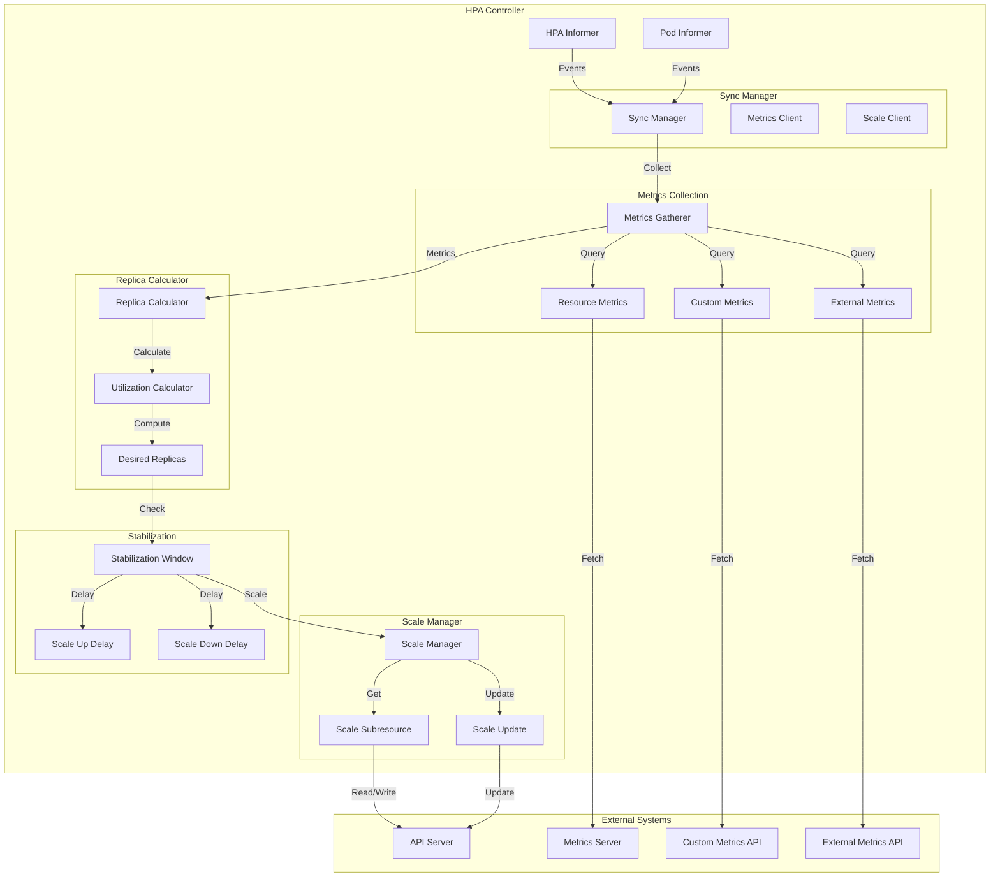
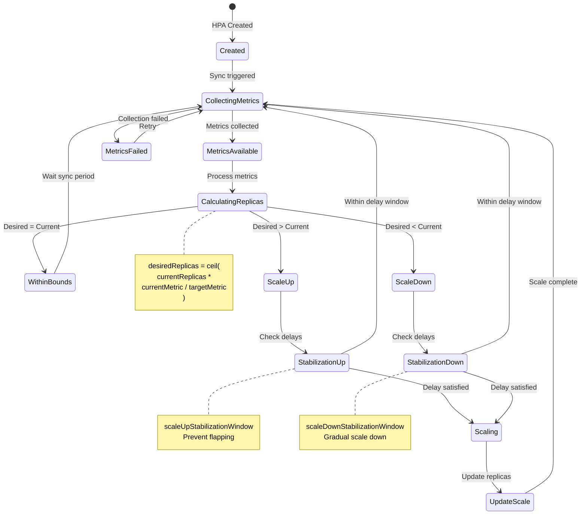
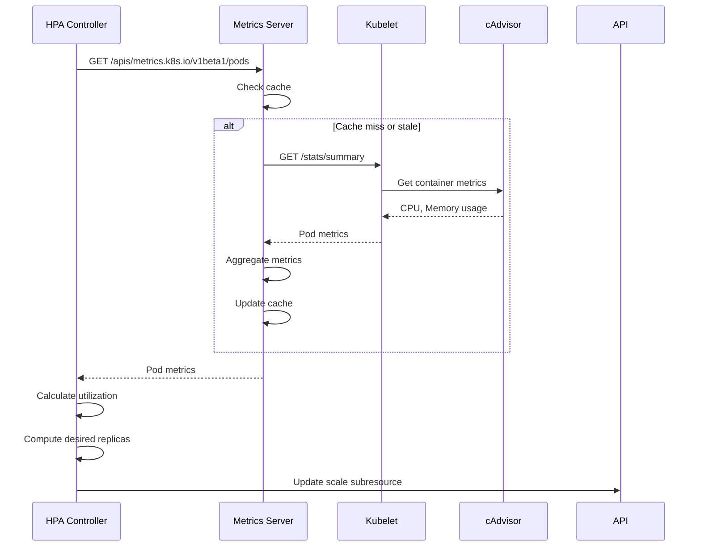
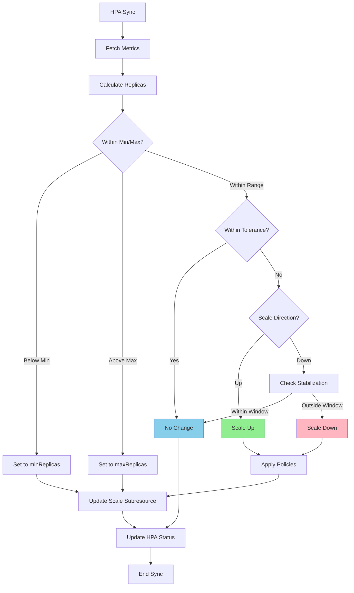

# Horizontal Pod Autoscaler and Autoscaling

**Author**: Claude (AI Assistant)
**Date**: 2025-10-21
**Status**: Architecture Study
**Component**: kube-controller-manager

## Overview

The Horizontal Pod Autoscaler (HPA) automatically scales the number of pods in a deployment, replica set, stateful set, or other scalable resource based on observed metrics. The autoscaling system integrates with the metrics API, custom metrics, and external metrics to make scaling decisions.

## Key Components

### 1. Horizontal Pod Autoscaler Controller

**Source**: `pkg/controller/podautoscaler/horizontal.go`

Monitors metrics and adjusts replica counts to maintain target metric values.

#### Architecture



#### HPA State Machine



#### Core Data Structures

```go
// Source: pkg/controller/podautoscaler/horizontal.go

type HorizontalController struct {
    // HPA informer
    hpaLister       autoscalinglisters.HorizontalPodAutoscalerLister
    hpaListerSynced cache.InformerSynced

    // Pod informer
    podLister corelisters.PodLister
    podSynced cache.InformerSynced

    // Scale client for updating replicas
    scaleClient scaleclient.ScalesGetter

    // Metrics client
    metricsClient metricsclient.MetricsClient

    // Work queue
    queue workqueue.RateLimitingInterface

    // Replica calculator
    replicaCalc *ReplicaCalculator

    // Event recorder
    eventRecorder record.EventRecorder

    // Downscale stabilization window
    downscaleStabilisationWindow time.Duration

    // Tolerance for metric comparison (default 0.1 = 10%)
    tolerance float64
}

// Replica calculation result
type replicaCalculation struct {
    // Desired replica count
    desiredReplicas int32
    // Current utilization
    utilization int64
    // Current raw metric value
    rawValue int64
    // Timestamp of metric
    timestamp time.Time
}
```

#### HPA Sync Algorithm

```go
// Source: pkg/controller/podautoscaler/horizontal.go

// Sync HPA - main reconciliation loop
func (a *HorizontalController) reconcileAutoscaler(
    hpa *autoscalingv2.HorizontalPodAutoscaler,
) error {
    // Get scale subresource for target
    scale, targetGR, err := a.getScaleForResourceMappings(
        hpa.Namespace,
        hpa.Spec.ScaleTargetRef,
    )
    if err != nil {
        return err
    }

    // Get current replica count
    currentReplicas := scale.Spec.Replicas

    // Initialize desired replicas
    var desiredReplicas int32
    var metricStatuses []autoscalingv2.MetricStatus

    // Collect metrics and calculate desired replicas
    desiredReplicas, metricStatuses, err = a.computeReplicasForMetrics(
        hpa,
        scale,
        hpa.Spec.Metrics,
    )

    if err != nil {
        a.setCurrentReplicasInStatus(hpa, currentReplicas)
        return err
    }

    // Apply min/max bounds
    desiredReplicas = a.normalizeDesiredReplicas(hpa, desiredReplicas)

    // Check if we need to scale
    rescale := desiredReplicas != currentReplicas

    if rescale {
        // Scale the target
        scale.Spec.Replicas = desiredReplicas
        _, err = a.scaleClient.Scales(hpa.Namespace).Update(
            context.TODO(),
            targetGR,
            scale,
            metav1.UpdateOptions{},
        )
        if err != nil {
            return err
        }

        a.eventRecorder.Eventf(
            hpa,
            v1.EventTypeNormal,
            "SuccessfulRescale",
            "New size: %d; reason: %s",
            desiredReplicas,
            getReasonForRescale(metricStatuses),
        )
    }

    // Update HPA status
    return a.updateStatus(hpa, currentReplicas, desiredReplicas, metricStatuses)
}
```

#### Metrics Collection and Calculation

```go
// Source: pkg/controller/podautoscaler/horizontal.go

// Compute replicas for all metrics
func (a *HorizontalController) computeReplicasForMetrics(
    hpa *autoscalingv2.HorizontalPodAutoscaler,
    scale *autoscalingv1.Scale,
    metricSpecs []autoscalingv2.MetricSpec,
) (int32, []autoscalingv2.MetricStatus, error) {
    var replicas int32
    var metricStatuses []autoscalingv2.MetricStatus

    currentReplicas := scale.Spec.Replicas

    // Process each metric
    for i, metricSpec := range metricSpecs {
        var replicaCountProposal int32
        var metricStatus autoscalingv2.MetricStatus
        var err error

        switch metricSpec.Type {
        case autoscalingv2.ResourceMetricSourceType:
            // Resource metrics (CPU, memory)
            replicaCountProposal, metricStatus, err = a.computeReplicasForResource(
                hpa,
                metricSpec.Resource,
                currentReplicas,
            )

        case autoscalingv2.PodsMetricSourceType:
            // Custom per-pod metrics
            replicaCountProposal, metricStatus, err = a.computeReplicasForPods(
                hpa,
                metricSpec.Pods,
                currentReplicas,
            )

        case autoscalingv2.ObjectMetricSourceType:
            // Metrics from a specific object
            replicaCountProposal, metricStatus, err = a.computeReplicasForObject(
                hpa,
                metricSpec.Object,
                currentReplicas,
            )

        case autoscalingv2.ExternalMetricSourceType:
            // External metrics
            replicaCountProposal, metricStatus, err = a.computeReplicasForExternal(
                hpa,
                metricSpec.External,
                currentReplicas,
            )

        default:
            err = fmt.Errorf("unknown metric source type %q", metricSpec.Type)
        }

        if err != nil {
            return 0, nil, err
        }

        // Take the maximum of all metric proposals
        if i == 0 || replicaCountProposal > replicas {
            replicas = replicaCountProposal
        }

        metricStatuses = append(metricStatuses, metricStatus)
    }

    return replicas, metricStatuses, nil
}
```

#### Resource Metrics (CPU/Memory)

```go
// Source: pkg/controller/podautoscaler/horizontal.go

// Compute replicas for resource metrics (CPU, memory)
func (a *HorizontalController) computeReplicasForResource(
    hpa *autoscalingv2.HorizontalPodAutoscaler,
    metricSpec *autoscalingv2.ResourceMetricSource,
    currentReplicas int32,
) (int32, autoscalingv2.MetricStatus, error) {
    // Get pods for HPA target
    pods, err := a.getPods(hpa)
    if err != nil {
        return 0, autoscalingv2.MetricStatus{}, err
    }

    // Determine target type (utilization or value)
    if metricSpec.Target.Type == autoscalingv2.UtilizationMetricType {
        // Target is a percentage of requested resource
        targetUtilization := *metricSpec.Target.AverageUtilization

        // Get current utilization
        utilization, timestamp, err := a.metricsClient.GetResourceMetric(
            metricSpec.Name,
            hpa.Namespace,
            pods,
        )
        if err != nil {
            return 0, autoscalingv2.MetricStatus{}, err
        }

        // Calculate desired replicas
        desiredReplicas := a.replicaCalc.GetUsageRatioReplicaCount(
            currentReplicas,
            targetUtilization,
            utilization,
            pods,
        )

        return desiredReplicas, buildMetricStatus(utilization, timestamp), nil
    }

    // Target is an absolute value
    targetValue := metricSpec.Target.AverageValue

    // Get current value
    value, timestamp, err := a.metricsClient.GetResourceMetric(
        metricSpec.Name,
        hpa.Namespace,
        pods,
    )
    if err != nil {
        return 0, autoscalingv2.MetricStatus{}, err
    }

    // Calculate desired replicas
    desiredReplicas := a.replicaCalc.GetMetricReplicaCount(
        currentReplicas,
        targetValue.MilliValue(),
        value,
        pods,
    )

    return desiredReplicas, buildMetricStatus(value, timestamp), nil
}
```

#### Replica Calculator

```go
// Source: pkg/controller/podautoscaler/replica_calculator.go

type ReplicaCalculator struct {
    metricsClient metricsclient.MetricsClient
    podLister     corelisters.PodLister
    tolerance     float64 // Default 0.1 (10%)
}

// Calculate replicas based on utilization ratio
func (c *ReplicaCalculator) GetUsageRatioReplicaCount(
    currentReplicas int32,
    targetUtilization int32,
    currentUtilization int64,
    pods []*v1.Pod,
) int32 {
    // Filter to ready pods
    readyPods := filterReadyPods(pods)
    if len(readyPods) == 0 {
        return currentReplicas
    }

    // Calculate utilization ratio
    usageRatio := float64(currentUtilization) / float64(targetUtilization)

    // Apply tolerance
    if math.Abs(1.0-usageRatio) <= c.tolerance {
        return currentReplicas // Within tolerance, no change
    }

    // Calculate desired replicas
    // Formula: ceil(currentReplicas * currentMetric / targetMetric)
    desiredReplicas := int32(math.Ceil(usageRatio * float64(currentReplicas)))

    return desiredReplicas
}

// Calculate replicas based on metric value
func (c *ReplicaCalculator) GetMetricReplicaCount(
    currentReplicas int32,
    targetValue int64,
    currentValue int64,
    pods []*v1.Pod,
) int32 {
    // Filter to ready pods
    readyPods := filterReadyPods(pods)
    if len(readyPods) == 0 {
        return currentReplicas
    }

    // Calculate average current value per pod
    averageValue := currentValue / int64(len(readyPods))

    // Calculate usage ratio
    usageRatio := float64(averageValue) / float64(targetValue)

    // Apply tolerance
    if math.Abs(1.0-usageRatio) <= c.tolerance {
        return currentReplicas
    }

    // Calculate desired replicas
    desiredReplicas := int32(math.Ceil(usageRatio * float64(currentReplicas)))

    return desiredReplicas
}

// Filter pods to only ready ones
func filterReadyPods(pods []*v1.Pod) []*v1.Pod {
    var readyPods []*v1.Pod

    for _, pod := range pods {
        // Skip pods being deleted
        if pod.DeletionTimestamp != nil {
            continue
        }

        // Skip failed/succeeded pods
        if pod.Status.Phase == v1.PodFailed || pod.Status.Phase == v1.PodSucceeded {
            continue
        }

        // Check if pod is ready
        if podutil.IsPodReady(pod) {
            readyPods = append(readyPods, pod)
        }
    }

    return readyPods
}
```

#### Custom Metrics (Per-Pod)

```go
// Source: pkg/controller/podautoscaler/horizontal.go

// Compute replicas for custom per-pod metrics
func (a *HorizontalController) computeReplicasForPods(
    hpa *autoscalingv2.HorizontalPodAutoscaler,
    metricSpec *autoscalingv2.PodsMetricSource,
    currentReplicas int32,
) (int32, autoscalingv2.MetricStatus, error) {
    // Get pods for HPA target
    pods, err := a.getPods(hpa)
    if err != nil {
        return 0, autoscalingv2.MetricStatus{}, err
    }

    // Get metric value from custom metrics API
    metricValue, timestamp, err := a.metricsClient.GetRawMetric(
        metricSpec.Metric.Name,
        hpa.Namespace,
        metricSpec.Metric.Selector,
    )
    if err != nil {
        return 0, autoscalingv2.MetricStatus{}, err
    }

    // Get target value
    targetValue := metricSpec.Target.AverageValue.MilliValue()

    // Calculate desired replicas
    desiredReplicas := a.replicaCalc.GetMetricReplicaCount(
        currentReplicas,
        targetValue,
        metricValue,
        pods,
    )

    return desiredReplicas, buildMetricStatus(metricValue, timestamp), nil
}
```

#### Object Metrics

```go
// Source: pkg/controller/podautoscaler/horizontal.go

// Compute replicas for object metrics
func (a *HorizontalController) computeReplicasForObject(
    hpa *autoscalingv2.HorizontalPodAutoscaler,
    metricSpec *autoscalingv2.ObjectMetricSource,
    currentReplicas int32,
) (int32, autoscalingv2.MetricStatus, error) {
    // Get metric from the specified object
    metricValue, timestamp, err := a.metricsClient.GetObjectMetric(
        metricSpec.Metric.Name,
        hpa.Namespace,
        &metricSpec.DescribedObject,
        metricSpec.Metric.Selector,
    )
    if err != nil {
        return 0, autoscalingv2.MetricStatus{}, err
    }

    var desiredReplicas int32

    if metricSpec.Target.Type == autoscalingv2.ValueMetricType {
        // Target is absolute value
        targetValue := metricSpec.Target.Value.MilliValue()

        // Calculate ratio and replicas
        usageRatio := float64(metricValue) / float64(targetValue)
        desiredReplicas = int32(math.Ceil(usageRatio * float64(currentReplicas)))

    } else if metricSpec.Target.Type == autoscalingv2.AverageValueMetricType {
        // Target is average value per pod
        targetAverageValue := metricSpec.Target.AverageValue.MilliValue()

        // Get pods
        pods, err := a.getPods(hpa)
        if err != nil {
            return 0, autoscalingv2.MetricStatus{}, err
        }

        // Calculate desired replicas
        desiredReplicas = a.replicaCalc.GetMetricReplicaCount(
            currentReplicas,
            targetAverageValue,
            metricValue,
            pods,
        )
    }

    return desiredReplicas, buildMetricStatus(metricValue, timestamp), nil
}
```

#### External Metrics

```go
// Source: pkg/controller/podautoscaler/horizontal.go

// Compute replicas for external metrics
func (a *HorizontalController) computeReplicasForExternal(
    hpa *autoscalingv2.HorizontalPodAutoscaler,
    metricSpec *autoscalingv2.ExternalMetricSource,
    currentReplicas int32,
) (int32, autoscalingv2.MetricStatus, error) {
    // Get metric from external metrics API
    metricValue, timestamp, err := a.metricsClient.GetExternalMetric(
        metricSpec.Metric.Name,
        hpa.Namespace,
        metricSpec.Metric.Selector,
    )
    if err != nil {
        return 0, autoscalingv2.MetricStatus{}, err
    }

    var desiredReplicas int32

    if metricSpec.Target.Type == autoscalingv2.ValueMetricType {
        // Target is absolute value
        targetValue := metricSpec.Target.Value.MilliValue()

        usageRatio := float64(metricValue) / float64(targetValue)
        desiredReplicas = int32(math.Ceil(usageRatio * float64(currentReplicas)))

    } else if metricSpec.Target.Type == autoscalingv2.AverageValueMetricType {
        // Target is average value per pod
        targetAverageValue := metricSpec.Target.AverageValue.MilliValue()

        pods, err := a.getPods(hpa)
        if err != nil {
            return 0, autoscalingv2.MetricStatus{}, err
        }

        desiredReplicas = a.replicaCalc.GetMetricReplicaCount(
            currentReplicas,
            targetAverageValue,
            metricValue,
            pods,
        )
    }

    return desiredReplicas, buildMetricStatus(metricValue, timestamp), nil
}
```

#### Stabilization Window

```go
// Source: pkg/controller/podautoscaler/horizontal.go

type timestampedRecommendation struct {
    recommendation int32
    timestamp      time.Time
}

// Stabilize scale down decisions
func (a *HorizontalController) stabilizeRecommendation(
    key string,
    recommendation int32,
) int32 {
    // Get recommendation history
    recommendations := a.recommendations[key]

    // Add current recommendation
    now := time.Now()
    recommendations = append(recommendations, timestampedRecommendation{
        recommendation: recommendation,
        timestamp:      now,
    })

    // Remove old recommendations outside stabilization window
    cutoff := now.Add(-a.downscaleStabilisationWindow)
    var filtered []timestampedRecommendation
    for _, rec := range recommendations {
        if rec.timestamp.After(cutoff) {
            filtered = append(filtered, rec)
        }
    }

    // Update stored recommendations
    a.recommendations[key] = filtered

    // Return maximum recommendation from window
    // This prevents rapid scale down
    maxRecommendation := recommendation
    for _, rec := range filtered {
        if rec.recommendation > maxRecommendation {
            maxRecommendation = rec.recommendation
        }
    }

    return maxRecommendation
}
```

#### Behavior Configuration (v2 API)

```go
// Source: pkg/apis/autoscaling/types.go

// HPA behavior for scaling
type HorizontalPodAutoscalerBehavior struct {
    // Scale up behavior
    ScaleUp *HPAScalingRules

    // Scale down behavior
    ScaleDown *HPAScalingRules
}

type HPAScalingRules struct {
    // Stabilization window
    StabilizationWindowSeconds *int32

    // Policies for scaling
    Policies []HPAScalingPolicy

    // Policy selection (Max, Min, Disabled)
    SelectPolicy *ScalingPolicySelect
}

type HPAScalingPolicy struct {
    // Type: Pods or Percent
    Type HPAScalingPolicyType

    // Value for this policy
    Value int32

    // Period for this policy
    PeriodSeconds int32
}

// Apply scaling policies
func (a *HorizontalController) applyScalingPolicies(
    hpa *autoscalingv2.HorizontalPodAutoscaler,
    currentReplicas int32,
    desiredReplicas int32,
    scaleDirection string,
) int32 {
    var policies *autoscalingv2.HPAScalingRules

    if scaleDirection == "up" && hpa.Spec.Behavior != nil {
        policies = hpa.Spec.Behavior.ScaleUp
    } else if scaleDirection == "down" && hpa.Spec.Behavior != nil {
        policies = hpa.Spec.Behavior.ScaleDown
    }

    if policies == nil {
        return desiredReplicas
    }

    // Evaluate each policy
    var recommendations []int32
    for _, policy := range policies.Policies {
        var recommendation int32

        switch policy.Type {
        case autoscalingv2.PodsScalingPolicy:
            // Limit change by pod count
            if scaleDirection == "up" {
                recommendation = currentReplicas + policy.Value
            } else {
                recommendation = currentReplicas - policy.Value
            }

        case autoscalingv2.PercentScalingPolicy:
            // Limit change by percentage
            delta := int32(float64(currentReplicas) * float64(policy.Value) / 100.0)
            if scaleDirection == "up" {
                recommendation = currentReplicas + delta
            } else {
                recommendation = currentReplicas - delta
            }
        }

        recommendations = append(recommendations, recommendation)
    }

    // Select policy based on SelectPolicy
    selectPolicy := autoscalingv2.MaxChangePolicySelect
    if policies.SelectPolicy != nil {
        selectPolicy = *policies.SelectPolicy
    }

    var finalRecommendation int32
    switch selectPolicy {
    case autoscalingv2.MaxChangePolicySelect:
        // Maximum change (most aggressive)
        if scaleDirection == "up" {
            finalRecommendation = maxInt32(recommendations...)
        } else {
            finalRecommendation = minInt32(recommendations...)
        }

    case autoscalingv2.MinChangePolicySelect:
        // Minimum change (most conservative)
        if scaleDirection == "up" {
            finalRecommendation = minInt32(recommendations...)
        } else {
            finalRecommendation = maxInt32(recommendations...)
        }

    case autoscalingv2.DisabledPolicySelect:
        return currentReplicas
    }

    return finalRecommendation
}
```

---

### 2. Metrics APIs

#### Metrics Server Integration



#### Custom Metrics API

```go
// Source: staging/src/k8s.io/metrics/pkg/apis/custom_metrics/types.go

// Custom metrics API types
type MetricValue struct {
    // Metric description
    DescribedObject v1.ObjectReference
    Metric          MetricIdentifier
    Timestamp       metav1.Time

    // Metric window
    WindowSeconds *int64

    // Metric value
    Value resource.Quantity
}

type MetricIdentifier struct {
    Name     string
    Selector *metav1.LabelSelector
}

// Custom metrics client interface
type CustomMetricsClient interface {
    // Get metric for a specific object
    GetObjectMetric(
        metricName string,
        namespace string,
        objectRef *autoscalingv2.CrossVersionObjectReference,
        metricSelector labels.Selector,
    ) (int64, time.Time, error)

    // Get metric aggregated across pods
    GetRawMetric(
        metricName string,
        namespace string,
        selector labels.Selector,
    ) (int64, time.Time, error)
}
```

---

### 3. Scale Subresource

**Source**: `staging/src/k8s.io/api/autoscaling/v1/types.go`

The Scale subresource provides a generic interface for HPA to adjust replicas.

```go
// Scale represents a scaling request for a resource
type Scale struct {
    metav1.TypeMeta
    metav1.ObjectMeta

    // Spec defines the desired characteristics
    Spec ScaleSpec

    // Status is current status
    Status ScaleStatus
}

type ScaleSpec struct {
    // Desired number of replicas
    Replicas int32
}

type ScaleStatus struct {
    // Actual number of replicas
    Replicas int32

    // Label selector for pods
    Selector string
}

// Get scale subresource
func (a *HorizontalController) getScale(
    namespace string,
    ref autoscalingv2.CrossVersionObjectReference,
) (*autoscalingv1.Scale, schema.GroupResource, error) {
    // Resolve target reference to GroupResource
    targetGR := schema.GroupResource{
        Group:    ref.APIVersion,
        Resource: ref.Kind,
    }

    // Get scale via scale client
    scale, err := a.scaleClient.Scales(namespace).Get(
        context.TODO(),
        targetGR,
        ref.Name,
        metav1.GetOptions{},
    )

    return scale, targetGR, err
}
```

---

### 4. VPA Integration Points

The Vertical Pod Autoscaler (VPA) is typically deployed separately but integrates with HPA.

#### VPA Architecture Overview

```mermaid
graph TB
    subgraph "VPA Components"
        VR[VPA Recommender]
        VU[VPA Updater]
        VAC[VPA Admission Controller]

        subgraph "Recommender"
            MH[Metrics History]
            MC[Model Calculator]
            RG[Recommendation Generator]
        end

        subgraph "Updater"
            PC[Pod Checker]
            PE[Pod Evictor]
        end

        subgraph "Admission"
            WH[Webhook Handler]
            PR[Pod Patcher]
        end
    end

    subgraph "External"
        MS[Metrics Server]
        API[API Server]
        POD[Pods]
    end

    VR -->|Fetch| MS
    MS -->>VR: Pod metrics

    VR -->|Store| MH
    MH -->|Analyze| MC
    MC -->|Generate| RG

    RG -->|Write| API

    VU -->|Watch| API
    VU -->|Check| PC
    PC -->|Evict| PE
    PE -->|Delete| POD

    VAC -->|Webhook| WH
    WH -->|Patch requests| PR
    PR -->|Mutate| POD

    note right of VR
        Analyzes historical usage
        Generates recommendations
    end note

    note right of VU
        Evicts pods that need
        resource adjustments
    end note

    note right of VAC
        Mutates new pods to apply
        VPA recommendations
    end note
```

#### VPA + HPA Coordination

```yaml
# HPA for horizontal scaling
apiVersion: autoscaling/v2
kind: HorizontalPodAutoscaler
metadata:
  name: app-hpa
spec:
  scaleTargetRef:
    apiVersion: apps/v1
    kind: Deployment
    name: app
  minReplicas: 2
  maxReplicas: 10
  metrics:
  - type: Resource
    resource:
      name: cpu
      target:
        type: Utilization
        averageUtilization: 80

---
# VPA for vertical scaling (UpdateMode: Auto conflicts with HPA)
apiVersion: autoscaling.k8s.io/v1
kind: VerticalPodAutoscaler
metadata:
  name: app-vpa
spec:
  targetRef:
    apiVersion: apps/v1
    kind: Deployment
    name: app
  updatePolicy:
    updateMode: "Off"  # Only recommend, don't auto-update
  resourcePolicy:
    containerPolicies:
    - containerName: app
      minAllowed:
        cpu: 100m
        memory: 128Mi
      maxAllowed:
        cpu: 2
        memory: 2Gi
```

**Coordination Strategy:**
- HPA scales replicas based on CPU/memory utilization
- VPA provides recommendations (updateMode: Off)
- Operator reviews VPA recommendations and manually adjusts requests
- Alternative: Use HPA for CPU, VPA for memory (less common)

---

## Scaling Decision Flow



---

## Performance Optimizations

### 1. Metrics Caching

```go
// Cache metrics for short period
type metricsCache struct {
    mu      sync.RWMutex
    cache   map[string]cachedMetric
    ttl     time.Duration
}

type cachedMetric struct {
    value     int64
    timestamp time.Time
}

func (c *metricsCache) get(key string) (int64, time.Time, bool) {
    c.mu.RLock()
    defer c.mu.RUnlock()

    metric, exists := c.cache[key]
    if !exists {
        return 0, time.Time{}, false
    }

    // Check if expired
    if time.Since(metric.timestamp) > c.ttl {
        return 0, time.Time{}, false
    }

    return metric.value, metric.timestamp, true
}
```

### 2. Pod Filtering

```go
// Only consider ready pods for metrics
func filterReadyPods(pods []*v1.Pod) []*v1.Pod {
    readyPods := make([]*v1.Pod, 0, len(pods))

    for _, pod := range pods {
        if pod.DeletionTimestamp != nil {
            continue
        }

        if pod.Status.Phase == v1.PodFailed || pod.Status.Phase == v1.PodSucceeded {
            continue
        }

        if podutil.IsPodReady(pod) {
            readyPods = append(readyPods, pod)
        }
    }

    return readyPods
}
```

### 3. Recommendation Stabilization

```go
// Use stabilization window to prevent flapping
const (
    defaultDownscaleStabilisationWindow = 5 * time.Minute
)

// Only scale down if recommendation stable over window
func shouldScaleDown(recommendations []recommendation) bool {
    if len(recommendations) == 0 {
        return false
    }

    // Check all recommendations in window agree
    target := recommendations[0].replicas
    for _, rec := range recommendations {
        if rec.replicas != target {
            return false
        }
    }

    return true
}
```

---

## Configuration

### HPA Controller

```bash
# kube-controller-manager flags
--horizontal-pod-autoscaler-sync-period=15s              # Sync interval
--horizontal-pod-autoscaler-tolerance=0.1                # 10% tolerance
--horizontal-pod-autoscaler-downscale-stabilization=5m   # Stabilization window
--horizontal-pod-autoscaler-cpu-initialization-period=5m # CPU metric delay
--horizontal-pod-autoscaler-initial-readiness-delay=30s  # Pod readiness delay
```

### Example HPA Configurations

#### CPU-based Autoscaling

```yaml
apiVersion: autoscaling/v2
kind: HorizontalPodAutoscaler
metadata:
  name: cpu-autoscaler
spec:
  scaleTargetRef:
    apiVersion: apps/v1
    kind: Deployment
    name: web-app
  minReplicas: 2
  maxReplicas: 10
  metrics:
  - type: Resource
    resource:
      name: cpu
      target:
        type: Utilization
        averageUtilization: 70
```

#### Memory-based Autoscaling

```yaml
apiVersion: autoscaling/v2
kind: HorizontalPodAutoscaler
metadata:
  name: memory-autoscaler
spec:
  scaleTargetRef:
    apiVersion: apps/v1
    kind: Deployment
    name: web-app
  minReplicas: 2
  maxReplicas: 10
  metrics:
  - type: Resource
    resource:
      name: memory
      target:
        type: AverageValue
        averageValue: 500Mi
```

#### Custom Metrics

```yaml
apiVersion: autoscaling/v2
kind: HorizontalPodAutoscaler
metadata:
  name: custom-metrics-autoscaler
spec:
  scaleTargetRef:
    apiVersion: apps/v1
    kind: Deployment
    name: web-app
  minReplicas: 2
  maxReplicas: 10
  metrics:
  - type: Pods
    pods:
      metric:
        name: http_requests_per_second
      target:
        type: AverageValue
        averageValue: "1000"
```

#### External Metrics

```yaml
apiVersion: autoscaling/v2
kind: HorizontalPodAutoscaler
metadata:
  name: external-metrics-autoscaler
spec:
  scaleTargetRef:
    apiVersion: apps/v1
    kind: Deployment
    name: web-app
  minReplicas: 2
  maxReplicas: 10
  metrics:
  - type: External
    external:
      metric:
        name: queue_length
        selector:
          matchLabels:
            queue: worker-queue
      target:
        type: Value
        value: "30"
```

#### Advanced Behavior

```yaml
apiVersion: autoscaling/v2
kind: HorizontalPodAutoscaler
metadata:
  name: advanced-autoscaler
spec:
  scaleTargetRef:
    apiVersion: apps/v1
    kind: Deployment
    name: web-app
  minReplicas: 2
  maxReplicas: 10
  metrics:
  - type: Resource
    resource:
      name: cpu
      target:
        type: Utilization
        averageUtilization: 70
  behavior:
    scaleUp:
      stabilizationWindowSeconds: 0  # Scale up immediately
      policies:
      - type: Percent
        value: 100  # Double pods
        periodSeconds: 15
      - type: Pods
        value: 4    # Add max 4 pods
        periodSeconds: 15
      selectPolicy: Max  # Most aggressive
    scaleDown:
      stabilizationWindowSeconds: 300  # 5 min window
      policies:
      - type: Percent
        value: 50   # Remove max 50%
        periodSeconds: 15
      - type: Pods
        value: 2    # Remove max 2 pods
        periodSeconds: 15
      selectPolicy: Min  # Most conservative
```

---

## Source References

1. **HPA Controller**: `pkg/controller/podautoscaler/horizontal.go`
2. **Replica Calculator**: `pkg/controller/podautoscaler/replica_calculator.go`
3. **Metrics Client**: `pkg/controller/podautoscaler/metrics/metrics_client.go`
4. **Scale Subresource**: `staging/src/k8s.io/api/autoscaling/v1/types.go`
5. **Custom Metrics API**: `staging/src/k8s.io/metrics/pkg/apis/custom_metrics/types.go`

---

## Summary

The Horizontal Pod Autoscaler provides sophisticated autoscaling:

1. **Multi-Metric Support**: CPU, memory, custom per-pod, object, and external metrics
2. **Intelligent Scaling**: Replica calculation with tolerance and stabilization
3. **Configurable Behavior**: Fine-grained control over scale-up and scale-down policies
4. **Integration**: Works with metrics server, custom metrics adapters, and VPA

The HPA controller continuously monitors metrics and adjusts replica counts to maintain target utilization, providing automatic capacity management for Kubernetes workloads.
