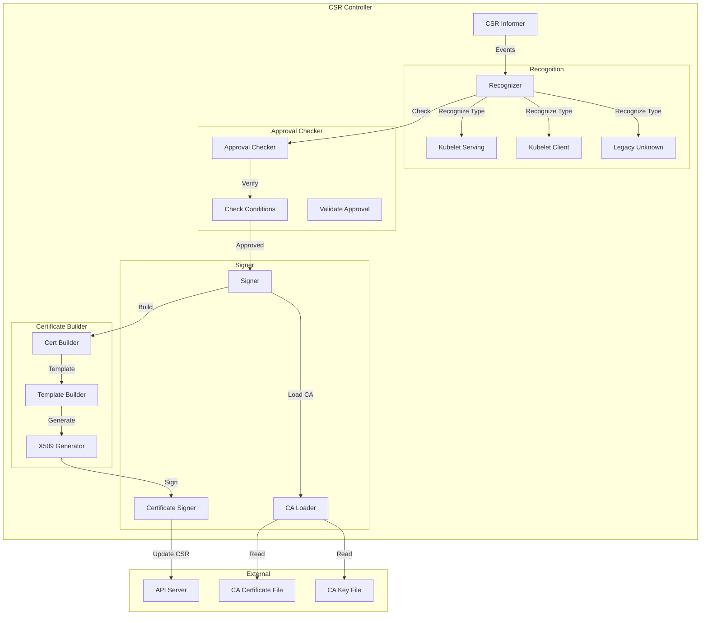
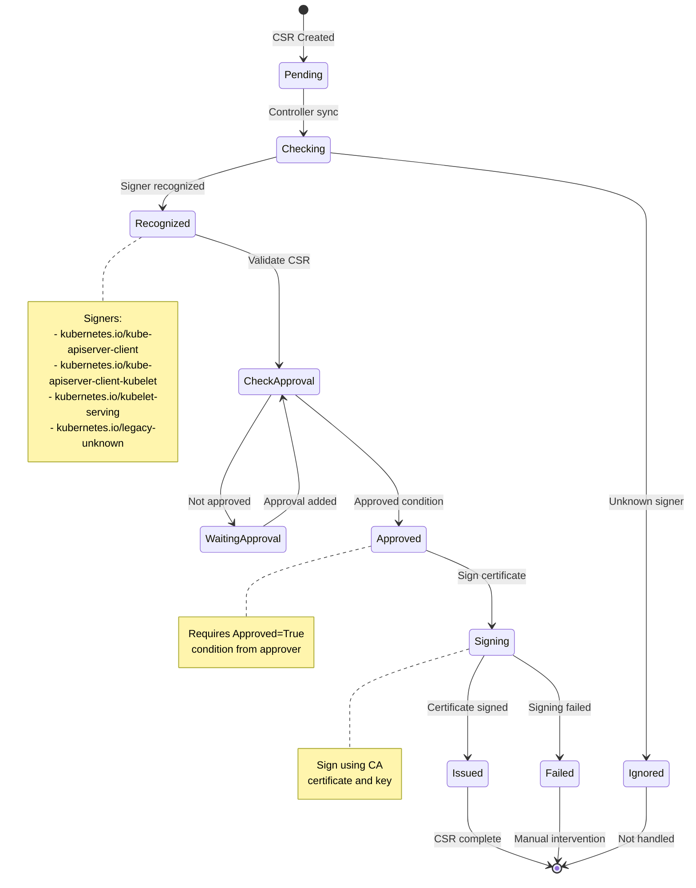
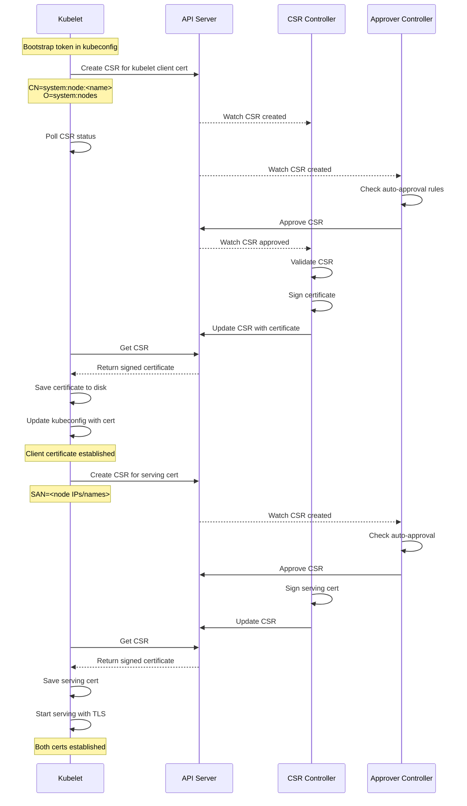
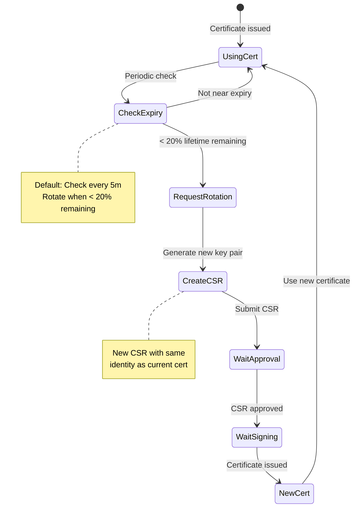

# Certificate Controllers

**Author**: Claude (AI Assistant)
**Date**: 2025-10-21
**Status**: Architecture Study
**Component**: kube-controller-manager

## Overview

Certificate controllers manage the lifecycle of TLS certificates in Kubernetes, including certificate signing requests (CSRs), approval workflows, and automatic certificate rotation. These controllers enable secure communication between cluster components and support kubelet TLS bootstrapping.

## Key Components

### 1. Certificate Signing Request (CSR) Controller

**Source**: `pkg/controller/certificates/signer/signer.go`

Manages CSR objects and signs approved certificates using a configured CA.

#### Architecture



#### CSR Lifecycle State Machine



#### Core Data Structures

```go
// Source: pkg/controller/certificates/signer/signer.go

type CSRSigningController struct {
    // CSR informer
    csrLister  certificateslisters.CertificateSigningRequestLister
    csrsSynced cache.InformerSynced

    // Client for updating CSRs
    client clientset.Interface

    // Signer name this controller handles
    signerName string

    // CA certificate and key
    caCertFile string
    caKeyFile  string

    // Cached CA cert and key
    ca *caSigner

    // Work queue
    queue workqueue.RateLimitingInterface
}

// CA signer with certificate and private key
type caSigner struct {
    // CA certificate
    cert *x509.Certificate

    // CA private key
    key crypto.Signer
}

// CSR recognition result
type recognitionResult struct {
    // Whether this CSR is recognized
    recognized bool

    // Validation errors
    errors []string
}
```

#### CSR Sync Algorithm

```go
// Source: pkg/controller/certificates/signer/signer.go

// Sync CSR - main reconciliation loop
func (c *CSRSigningController) syncCSR(key string) error {
    // Get CSR
    csr, err := c.csrLister.Get(key)
    if err != nil {
        if errors.IsNotFound(err) {
            return nil
        }
        return err
    }

    // Check if this controller should handle this CSR
    if csr.Spec.SignerName != c.signerName {
        return nil
    }

    // Check if already signed
    if len(csr.Status.Certificate) > 0 {
        return nil
    }

    // Check if approved
    approved, denied := checkApproval(csr)
    if denied {
        return nil
    }
    if !approved {
        return nil
    }

    // Recognize and validate CSR
    x509cr, err := parseCSR(csr.Spec.Request)
    if err != nil {
        return err
    }

    recognition := c.recognizeCSR(csr, x509cr)
    if !recognition.recognized {
        return fmt.Errorf("CSR not recognized: %v", recognition.errors)
    }

    // Sign the certificate
    return c.sign(csr, x509cr)
}

// Check CSR approval status
func checkApproval(csr *certificates.CertificateSigningRequest) (approved, denied bool) {
    for _, condition := range csr.Status.Conditions {
        if condition.Type == certificates.CertificateApproved {
            approved = true
        }
        if condition.Type == certificates.CertificateDenied {
            denied = true
        }
    }
    return approved, denied
}

// Parse CSR from PEM
func parseCSR(pemBytes []byte) (*x509.CertificateRequest, error) {
    block, _ := pem.Decode(pemBytes)
    if block == nil || block.Type != "CERTIFICATE REQUEST" {
        return nil, fmt.Errorf("PEM block type must be CERTIFICATE REQUEST")
    }

    return x509.ParseCertificateRequest(block.Bytes)
}
```

#### Kubelet Serving CSR Recognition

```go
// Source: pkg/controller/certificates/signer/config/types.go

type csrRecognizer struct {
    // Signer name
    signerName string

    // Allowed usages
    usages []certificates.KeyUsage

    // Permission check function
    permission authorization.SubjectAccessReviewer

    // Validation function
    validate func(*x509.CertificateRequest) error
}

// Recognize kubelet serving CSR
func recognizeKubeletServingCSR(
    csr *certificates.CertificateSigningRequest,
    x509cr *x509.CertificateRequest,
) recognitionResult {
    var errors []string

    // Check signer name
    if csr.Spec.SignerName != certificates.KubeletServingSignerName {
        errors = append(errors, "signer name does not match")
    }

    // Check usages
    if !hasExactUsages(csr, kubeletServingUsages) {
        errors = append(errors, "usages do not match")
    }

    // Validate X.509 request
    if err := validateKubeletServingX509(x509cr); err != nil {
        errors = append(errors, err.Error())
    }

    return recognitionResult{
        recognized: len(errors) == 0,
        errors:     errors,
    }
}

var kubeletServingUsages = []certificates.KeyUsage{
    certificates.UsageDigitalSignature,
    certificates.UsageKeyEncipherment,
    certificates.UsageServerAuth,
}

// Validate kubelet serving certificate request
func validateKubeletServingX509(cr *x509.CertificateRequest) error {
    // Must have at least one DNS name or IP
    if len(cr.DNSNames) == 0 && len(cr.IPAddresses) == 0 {
        return fmt.Errorf("must have at least one DNS name or IP address")
    }

    // Must not have CN
    if len(cr.Subject.CommonName) != 0 {
        return fmt.Errorf("must not have CommonName set")
    }

    // Must not have Organization
    if len(cr.Subject.Organization) != 0 {
        return fmt.Errorf("must not have Organization set")
    }

    return nil
}
```

#### Kubelet Client CSR Recognition

```go
// Source: pkg/controller/certificates/signer/config/types.go

// Recognize kubelet client CSR
func recognizeKubeletClientCSR(
    csr *certificates.CertificateSigningRequest,
    x509cr *x509.CertificateRequest,
) recognitionResult {
    var errors []string

    // Check signer name
    if csr.Spec.SignerName != certificates.KubeAPIServerClientKubeletSignerName {
        errors = append(errors, "signer name does not match")
    }

    // Check usages
    if !hasExactUsages(csr, kubeletClientUsages) {
        errors = append(errors, "usages do not match")
    }

    // Validate X.509 request
    if err := validateKubeletClientX509(x509cr); err != nil {
        errors = append(errors, err.Error())
    }

    return recognitionResult{
        recognized: len(errors) == 0,
        errors:     errors,
    }
}

var kubeletClientUsages = []certificates.KeyUsage{
    certificates.UsageDigitalSignature,
    certificates.UsageKeyEncipherment,
    certificates.UsageClientAuth,
}

// Validate kubelet client certificate request
func validateKubeletClientX509(cr *x509.CertificateRequest) error {
    // Must have CN in form "system:node:<nodename>"
    if !strings.HasPrefix(cr.Subject.CommonName, "system:node:") {
        return fmt.Errorf("CN must start with 'system:node:'")
    }

    // Extract node name
    nodeName := strings.TrimPrefix(cr.Subject.CommonName, "system:node:")
    if len(nodeName) == 0 {
        return fmt.Errorf("node name cannot be empty")
    }

    // Must have Organization "system:nodes"
    if len(cr.Subject.Organization) != 1 ||
        cr.Subject.Organization[0] != "system:nodes" {
        return fmt.Errorf("Organization must be exactly 'system:nodes'")
    }

    // Must not have DNS names or IPs
    if len(cr.DNSNames) > 0 || len(cr.IPAddresses) > 0 {
        return fmt.Errorf("must not have DNS names or IP addresses")
    }

    return nil
}
```

#### Certificate Signing

```go
// Source: pkg/controller/certificates/signer/signer.go

// Sign CSR and update status
func (c *CSRSigningController) sign(
    csr *certificates.CertificateSigningRequest,
    x509cr *x509.CertificateRequest,
) error {
    // Load CA certificate and key
    ca, err := c.getCA()
    if err != nil {
        return err
    }

    // Create certificate template
    template, err := c.buildCertificateTemplate(csr, x509cr)
    if err != nil {
        return err
    }

    // Sign certificate
    certDER, err := x509.CreateCertificate(
        rand.Reader,
        template,
        ca.cert,
        x509cr.PublicKey,
        ca.key,
    )
    if err != nil {
        return err
    }

    // Encode to PEM
    certPEM := pem.EncodeToMemory(&pem.Block{
        Type:  "CERTIFICATE",
        Bytes: certDER,
    })

    // Update CSR status
    csrCopy := csr.DeepCopy()
    csrCopy.Status.Certificate = certPEM

    _, err = c.client.CertificatesV1().CertificateSigningRequests().
        UpdateStatus(context.TODO(), csrCopy, metav1.UpdateOptions{})

    return err
}

// Build certificate template
func (c *CSRSigningController) buildCertificateTemplate(
    csr *certificates.CertificateSigningRequest,
    x509cr *x509.CertificateRequest,
) (*x509.Certificate, error) {
    // Generate serial number
    serialNumber, err := rand.Int(rand.Reader, new(big.Int).Lsh(big.NewInt(1), 128))
    if err != nil {
        return nil, err
    }

    // Build template
    template := &x509.Certificate{
        SerialNumber: serialNumber,

        Subject: x509cr.Subject,

        NotBefore: time.Now(),
        NotAfter:  time.Now().Add(c.certDuration),

        // Key usage from CSR
        KeyUsage:    keyUsageFromCSR(csr),
        ExtKeyUsage: extKeyUsageFromCSR(csr),

        // Subject Alternative Names
        DNSNames:       x509cr.DNSNames,
        IPAddresses:    x509cr.IPAddresses,
        EmailAddresses: x509cr.EmailAddresses,
        URIs:           x509cr.URIs,
    }

    return template, nil
}

// Convert CSR usages to X.509 key usage
func keyUsageFromCSR(csr *certificates.CertificateSigningRequest) x509.KeyUsage {
    var ku x509.KeyUsage

    for _, usage := range csr.Spec.Usages {
        switch usage {
        case certificates.UsageDigitalSignature:
            ku |= x509.KeyUsageDigitalSignature
        case certificates.UsageKeyEncipherment:
            ku |= x509.KeyUsageKeyEncipherment
        case certificates.UsageKeyAgreement:
            ku |= x509.KeyUsageKeyAgreement
        case certificates.UsageDataEncipherment:
            ku |= x509.KeyUsageDataEncipherment
        }
    }

    return ku
}

// Convert CSR usages to X.509 extended key usage
func extKeyUsageFromCSR(csr *certificates.CertificateSigningRequest) []x509.ExtKeyUsage {
    var eku []x509.ExtKeyUsage

    for _, usage := range csr.Spec.Usages {
        switch usage {
        case certificates.UsageServerAuth:
            eku = append(eku, x509.ExtKeyUsageServerAuth)
        case certificates.UsageClientAuth:
            eku = append(eku, x509.ExtKeyUsageClientAuth)
        case certificates.UsageCodeSigning:
            eku = append(eku, x509.ExtKeyUsageCodeSigning)
        case certificates.UsageEmailProtection:
            eku = append(eku, x509.ExtKeyUsageEmailProtection)
        }
    }

    return eku
}
```

#### CA Certificate Loading

```go
// Source: pkg/controller/certificates/signer/ca_provider.go

// Get CA certificate and key (cached)
func (c *CSRSigningController) getCA() (*caSigner, error) {
    // Check cache
    if c.ca != nil {
        return c.ca, nil
    }

    // Load CA certificate
    certPEM, err := os.ReadFile(c.caCertFile)
    if err != nil {
        return nil, err
    }

    block, _ := pem.Decode(certPEM)
    if block == nil {
        return nil, fmt.Errorf("failed to decode CA certificate PEM")
    }

    cert, err := x509.ParseCertificate(block.Bytes)
    if err != nil {
        return nil, err
    }

    // Load CA private key
    keyPEM, err := os.ReadFile(c.caKeyFile)
    if err != nil {
        return nil, err
    }

    key, err := parsePrivateKeyPEM(keyPEM)
    if err != nil {
        return nil, err
    }

    // Cache CA
    c.ca = &caSigner{
        cert: cert,
        key:  key,
    }

    return c.ca, nil
}

// Parse private key from PEM
func parsePrivateKeyPEM(keyPEM []byte) (crypto.Signer, error) {
    block, _ := pem.Decode(keyPEM)
    if block == nil {
        return nil, fmt.Errorf("failed to decode private key PEM")
    }

    // Try parsing as different key types
    if key, err := x509.ParsePKCS1PrivateKey(block.Bytes); err == nil {
        return key, nil
    }

    if key, err := x509.ParsePKCS8PrivateKey(block.Bytes); err == nil {
        if signer, ok := key.(crypto.Signer); ok {
            return signer, nil
        }
    }

    if key, err := x509.ParseECPrivateKey(block.Bytes); err == nil {
        return key, nil
    }

    return nil, fmt.Errorf("failed to parse private key")
}
```

---

### 2. CSR Approval Controller

**Source**: `pkg/controller/certificates/approver/sarapprove.go`

Auto-approves certain CSRs based on RBAC permissions.

#### Architecture

```go
// Source: pkg/controller/certificates/approver/sarapprove.go

type sarApprover struct {
    // CSR informer
    csrLister  certificateslisters.CertificateSigningRequestLister
    csrsSynced cache.InformerSynced

    // Client for updating CSRs
    client clientset.Interface

    // Authorization client for permission checks
    authClient authorizationclient.SubjectAccessReviewInterface

    // Work queue
    queue workqueue.RateLimitingInterface
}

// Auto-approve CSR if requester has permission
func (a *sarApprover) syncCSR(key string) error {
    csr, err := a.csrLister.Get(key)
    if err != nil {
        return err
    }

    // Skip if already approved or denied
    if isApproved(csr) || isDenied(csr) {
        return nil
    }

    // Check if auto-approvable
    if !a.isAutoApprovable(csr) {
        return nil
    }

    // Check requester permissions
    allowed, err := a.authorize(csr)
    if err != nil {
        return err
    }

    if !allowed {
        return nil
    }

    // Approve CSR
    return a.approveCSR(csr)
}
```

#### Permission Check

```go
// Source: pkg/controller/certificates/approver/sarapprove.go

// Check if requester can approve this CSR type
func (a *sarApprover) authorize(csr *certificates.CertificateSigningRequest) (bool, error) {
    // Build SubjectAccessReview
    sar := &authorization.SubjectAccessReview{
        Spec: authorization.SubjectAccessReviewSpec{
            User:   csr.Spec.Username,
            Groups: csr.Spec.Groups,
            Extra:  convertExtra(csr.Spec.Extra),

            ResourceAttributes: &authorization.ResourceAttributes{
                Group:       certificates.GroupName,
                Resource:    "certificatesigningrequests",
                Verb:        "create",
                Subresource: "selfnodeclient",
            },
        },
    }

    // Check permission
    result, err := a.authClient.Create(context.TODO(), sar, metav1.CreateOptions{})
    if err != nil {
        return false, err
    }

    return result.Status.Allowed, nil
}

// Approve CSR by adding condition
func (a *sarApprover) approveCSR(csr *certificates.CertificateSigningRequest) error {
    csrCopy := csr.DeepCopy()

    // Add approved condition
    csrCopy.Status.Conditions = append(csrCopy.Status.Conditions,
        certificates.CertificateSigningRequestCondition{
            Type:    certificates.CertificateApproved,
            Status:  v1.ConditionTrue,
            Reason:  "AutoApproved",
            Message: "Auto-approved by CSR approver",
            LastUpdateTime: metav1.Now(),
        },
    )

    _, err := a.client.CertificatesV1().CertificateSigningRequests().
        UpdateApproval(context.TODO(), csrCopy.Name, csrCopy, metav1.UpdateOptions{})

    return err
}
```

---

### 3. CSR Cleaner Controller

**Source**: `pkg/controller/certificates/cleaner/cleaner.go`

Cleans up old approved/denied CSRs.

```go
// Source: pkg/controller/certificates/cleaner/cleaner.go

type CSRCleanerController struct {
    csrLister  certificateslisters.CertificateSigningRequestLister
    csrsSynced cache.InformerSynced

    client clientset.Interface

    // How long to keep CSRs
    csrTTL time.Duration
}

// Run cleanup loop
func (c *CSRCleanerController) Run(stopCh <-chan struct{}) {
    wait.Until(c.cleanupCSRs, 10*time.Minute, stopCh)
}

func (c *CSRCleanerController) cleanupCSRs() {
    // List all CSRs
    csrs, err := c.csrLister.List(labels.Everything())
    if err != nil {
        return
    }

    now := time.Now()

    for _, csr := range csrs {
        // Check if CSR is complete (approved or denied)
        if !isApproved(csr) && !isDenied(csr) {
            continue
        }

        // Check age
        age := now.Sub(csr.CreationTimestamp.Time)
        if age < c.csrTTL {
            continue
        }

        // Delete old CSR
        c.client.CertificatesV1().CertificateSigningRequests().
            Delete(context.TODO(), csr.Name, metav1.DeleteOptions{})
    }
}
```

---

## Kubelet Certificate Bootstrap

### Bootstrap Flow



### Bootstrap Token Authentication

```yaml
# Bootstrap token secret
apiVersion: v1
kind: Secret
metadata:
  name: bootstrap-token-abc123
  namespace: kube-system
type: bootstrap.kubernetes.io/token
data:
  token-id: YWJjMTIz        # "abc123"
  token-secret: ZGVmNDU2    # "def456"
  usage-bootstrap-authentication: dHJ1ZQ==  # "true"
  usage-bootstrap-signing: dHJ1ZQ==         # "true"
  auth-extra-groups: c3lzdGVtOmJvb3RzdHJhcHBlcnM6ZGVmYXVsdA==  # "system:bootstrappers:default"
```

### Kubelet TLS Bootstrap Configuration

```yaml
# kubelet configuration
apiVersion: kubelet.config.k8s.io/v1beta1
kind: KubeletConfiguration
# Enable certificate rotation
rotateCertificates: true
serverTLSBootstrap: true
```

```yaml
# kubelet kubeconfig for bootstrap
apiVersion: v1
kind: Config
clusters:
- name: kubernetes
  cluster:
    certificate-authority: /etc/kubernetes/pki/ca.crt
    server: https://api-server:6443
users:
- name: kubelet-bootstrap
  user:
    token: abc123.def456  # Bootstrap token
contexts:
- name: default
  context:
    cluster: kubernetes
    user: kubelet-bootstrap
current-context: default
```

---

## Certificate Rotation

### Kubelet Certificate Rotation



### Certificate Rotation in Kubelet

```go
// Source: pkg/kubelet/certificate/certificate_manager.go

type Manager interface {
    // Start the controller sync loop
    Start()

    // Server certificate management
    Current() *tls.Certificate
    ServerHealthy() bool

    // Stop the controller
    Stop()
}

type manager struct {
    // CSR template
    template *x509.CertificateRequest

    // Certificate store
    store Store

    // Client for creating CSRs
    client clientset.Interface

    // Current certificate
    cert *tls.Certificate

    // Rotation thresholds
    certRotationThreshold time.Duration
}

// Check and rotate certificate
func (m *manager) rotateCerts() {
    // Get current certificate
    cert := m.cert
    if cert == nil {
        // No cert yet, request one
        m.requestCertificate()
        return
    }

    // Parse certificate
    x509Cert, err := x509.ParseCertificate(cert.Certificate[0])
    if err != nil {
        return
    }

    // Check if rotation needed
    notAfter := x509Cert.NotAfter
    remaining := time.Until(notAfter)

    if remaining < m.certRotationThreshold {
        // Time to rotate
        m.requestCertificate()
    }
}

// Request new certificate via CSR
func (m *manager) requestCertificate() error {
    // Generate new private key
    privateKey, err := rsa.GenerateKey(rand.Reader, 2048)
    if err != nil {
        return err
    }

    // Create CSR
    csrDER, err := x509.CreateCertificateRequest(
        rand.Reader,
        m.template,
        privateKey,
    )
    if err != nil {
        return err
    }

    // Encode to PEM
    csrPEM := pem.EncodeToMemory(&pem.Block{
        Type:  "CERTIFICATE REQUEST",
        Bytes: csrDER,
    })

    // Create CSR object
    csr := &certificates.CertificateSigningRequest{
        ObjectMeta: metav1.ObjectMeta{
            GenerateName: "csr-",
        },
        Spec: certificates.CertificateSigningRequestSpec{
            Request:    csrPEM,
            SignerName: certificates.KubeletServingSignerName,
            Usages: []certificates.KeyUsage{
                certificates.UsageDigitalSignature,
                certificates.UsageKeyEncipherment,
                certificates.UsageServerAuth,
            },
        },
    }

    // Submit CSR
    csr, err = m.client.CertificatesV1().CertificateSigningRequests().
        Create(context.TODO(), csr, metav1.CreateOptions{})
    if err != nil {
        return err
    }

    // Wait for certificate
    return m.waitForCertificate(csr.Name, privateKey)
}

// Wait for CSR to be signed
func (m *manager) waitForCertificate(
    csrName string,
    privateKey crypto.Signer,
) error {
    // Poll CSR status
    timeout := time.After(5 * time.Minute)
    ticker := time.NewTicker(1 * time.Second)
    defer ticker.Stop()

    for {
        select {
        case <-timeout:
            return fmt.Errorf("timeout waiting for certificate")

        case <-ticker.C:
            // Get CSR
            csr, err := m.client.CertificatesV1().
                CertificateSigningRequests().
                Get(context.TODO(), csrName, metav1.GetOptions{})
            if err != nil {
                continue
            }

            // Check if certificate issued
            if len(csr.Status.Certificate) > 0 {
                // Parse certificate
                block, _ := pem.Decode(csr.Status.Certificate)
                cert, err := x509.ParseCertificate(block.Bytes)
                if err != nil {
                    return err
                }

                // Create TLS certificate
                tlsCert := &tls.Certificate{
                    Certificate: [][]byte{cert.Raw},
                    PrivateKey:  privateKey,
                }

                // Update current certificate
                m.cert = tlsCert

                // Save to disk
                return m.store.Update(csr.Status.Certificate, privateKey)
            }
        }
    }
}
```

---

## Certificate Approval RBAC

### ClusterRole for Auto-Approval

```yaml
# Allow nodes to create CSRs
apiVersion: rbac.authorization.k8s.io/v1
kind: ClusterRole
metadata:
  name: system:certificates.k8s.io:certificatesigningrequests:nodeclient
rules:
- apiGroups: ["certificates.k8s.io"]
  resources: ["certificatesigningrequests/nodeclient"]
  verbs: ["create"]
---
# Bind to system:nodes group
apiVersion: rbac.authorization.k8s.io/v1
kind: ClusterRoleBinding
metadata:
  name: system:certificates.k8s.io:certificatesigningrequests:nodeclient
roleRef:
  apiGroup: rbac.authorization.k8s.io
  kind: ClusterRole
  name: system:certificates.k8s.io:certificatesigningrequests:nodeclient
subjects:
- kind: Group
  name: system:nodes
  apiGroup: rbac.authorization.k8s.io
```

### ClusterRole for CSR Approval

```yaml
# Allow approving CSRs
apiVersion: rbac.authorization.k8s.io/v1
kind: ClusterRole
metadata:
  name: system:certificates.k8s.io:certificatesigningrequests:selfnodeclient
rules:
- apiGroups: ["certificates.k8s.io"]
  resources: ["certificatesigningrequests/selfnodeclient"]
  verbs: ["create"]
---
# Auto-approve for system:bootstrappers group
apiVersion: rbac.authorization.k8s.io/v1
kind: ClusterRoleBinding
metadata:
  name: kubeadm:node-autoapprove-bootstrap
roleRef:
  apiGroup: rbac.authorization.k8s.io
  kind: ClusterRole
  name: system:certificates.k8s.io:certificatesigningrequests:selfnodeclient
subjects:
- kind: Group
  name: system:bootstrappers:kubeadm:default-node-token
  apiGroup: rbac.authorization.k8s.io
```

---

## CSR Examples

### Kubelet Client Certificate Request

```yaml
apiVersion: certificates.k8s.io/v1
kind: CertificateSigningRequest
metadata:
  name: node-csr-client
spec:
  request: LS0tLS1CRUdJTi...  # Base64 encoded CSR
  signerName: kubernetes.io/kube-apiserver-client-kubelet
  usages:
  - digital signature
  - key encipherment
  - client auth
  username: system:bootstrap:abc123
  groups:
  - system:bootstrappers
  - system:authenticated
```

### Kubelet Serving Certificate Request

```yaml
apiVersion: certificates.k8s.io/v1
kind: CertificateSigningRequest
metadata:
  name: node-csr-serving
spec:
  request: LS0tLS1CRUdJTi...  # Base64 encoded CSR
  signerName: kubernetes.io/kubelet-serving
  usages:
  - digital signature
  - key encipherment
  - server auth
  username: system:node:worker-1
  groups:
  - system:nodes
  - system:authenticated
```

### Manual CSR Approval

```bash
# Approve CSR
kubectl certificate approve node-csr-client

# Deny CSR
kubectl certificate deny node-csr-serving

# Get certificate from approved CSR
kubectl get csr node-csr-client -o jsonpath='{.status.certificate}' | base64 -d
```

---

## Configuration

### CSR Controller Configuration

```bash
# kube-controller-manager flags

# Cluster signing certificate and key
--cluster-signing-cert-file=/etc/kubernetes/pki/ca.crt
--cluster-signing-key-file=/etc/kubernetes/pki/ca.key

# Certificate duration (default 365 days)
--cluster-signing-duration=8760h

# Experimental: separate signers
--cluster-signing-kubelet-serving-cert-file=/etc/kubernetes/pki/kubelet-ca.crt
--cluster-signing-kubelet-serving-key-file=/etc/kubernetes/pki/kubelet-ca.key

--cluster-signing-kubelet-client-cert-file=/etc/kubernetes/pki/ca.crt
--cluster-signing-kubelet-client-key-file=/etc/kubernetes/pki/ca.key
```

### CSR Approver Configuration

```bash
# kube-controller-manager flags
--controllers=*,csrapproving,csrsigning,csrcleaner
```

---

## Security Considerations

### 1. CA Key Protection

```bash
# CA private key should be:
# - Stored with restricted permissions (0600)
# - Owned by kube-controller-manager user
# - Ideally in a hardware security module (HSM)

chmod 600 /etc/kubernetes/pki/ca.key
chown kube-controller-manager:kube-controller-manager /etc/kubernetes/pki/ca.key
```

### 2. CSR Validation

The signer validates:
- Signer name matches
- Usages are appropriate
- Subject follows naming conventions
- No dangerous extensions

### 3. Approval Authorization

Auto-approval requires:
- RBAC permissions for the requester
- CSR matches recognized patterns
- Requester identity validation

---

## Source References

1. **CSR Signer**: `pkg/controller/certificates/signer/signer.go`
2. **CSR Approver**: `pkg/controller/certificates/approver/sarapprove.go`
3. **CSR Cleaner**: `pkg/controller/certificates/cleaner/cleaner.go`
4. **Certificate Manager**: `pkg/kubelet/certificate/certificate_manager.go`
5. **Signer Config**: `pkg/controller/certificates/signer/config/types.go`

---

## Summary

Certificate controllers provide comprehensive PKI management:

1. **CSR Controller**: Signs approved certificates using cluster CA
2. **Approval Controller**: Auto-approves CSRs based on RBAC and validation rules
3. **Cleaner Controller**: Maintains CSR hygiene by removing old requests
4. **Certificate Rotation**: Automatic rotation before expiry for kubelet certificates
5. **Bootstrap Support**: Enables secure node joining via bootstrap tokens

These controllers enable secure, automated certificate lifecycle management for all cluster components, supporting zero-touch node bootstrapping and automatic certificate rotation.
