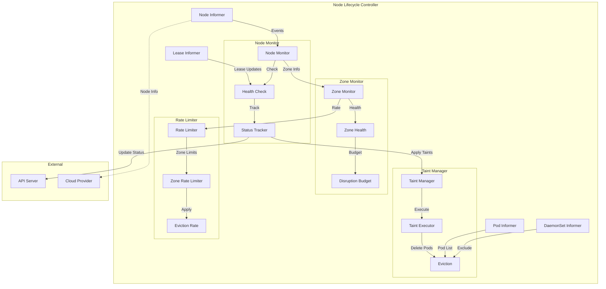
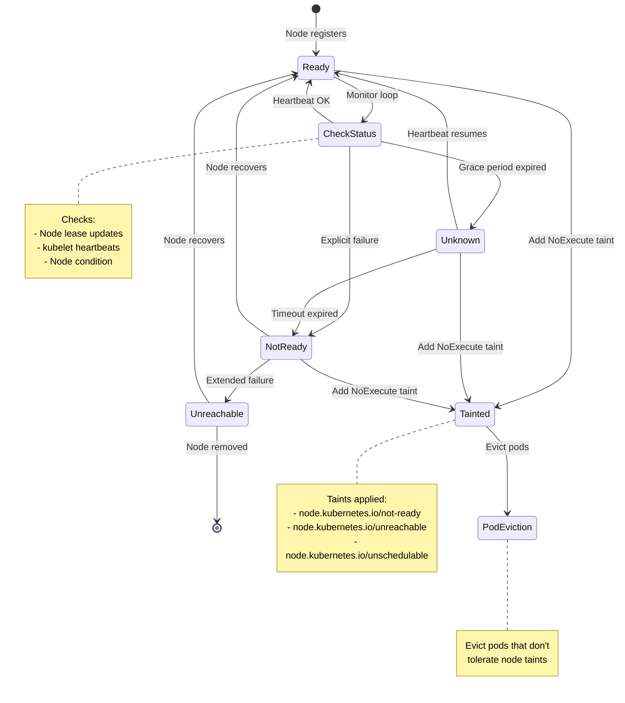
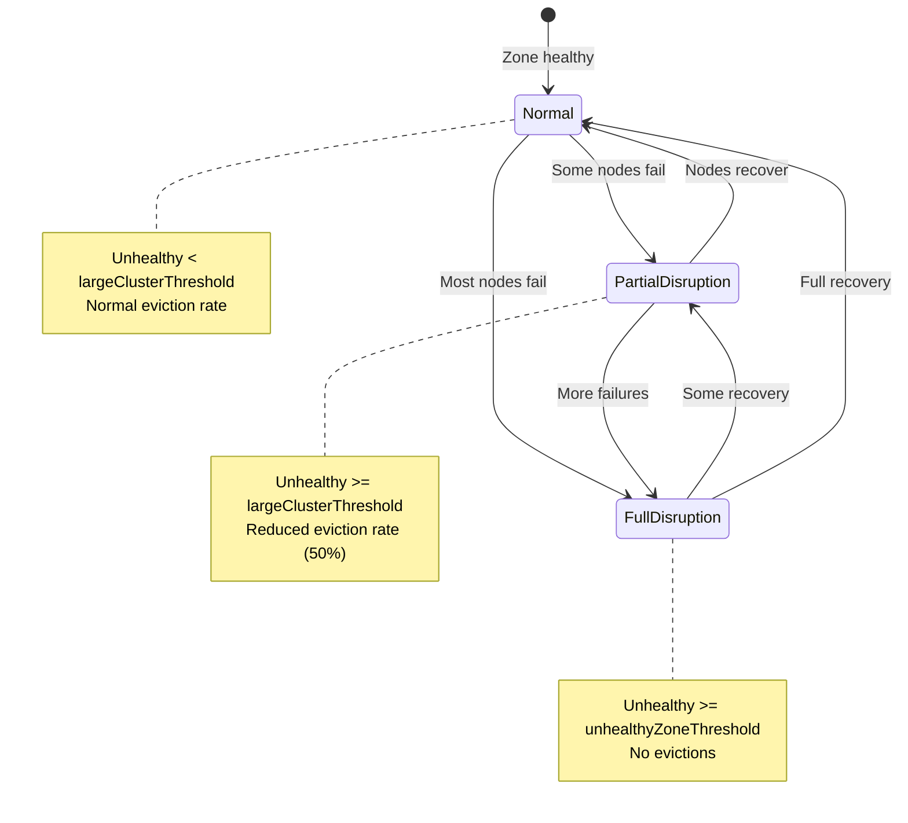

# Node Lifecycle Controllers

**Author**: Claude (AI Assistant)
**Date**: 2025-10-21
**Status**: Architecture Study
**Component**: kube-controller-manager

## Overview

Node lifecycle controllers monitor node health, manage node status, handle cloud provider integration, and implement pod eviction policies. These controllers ensure the cluster accurately reflects node availability and responds appropriately to node failures.

## Key Components

### 1. Node Controller

**Source**: `pkg/controller/nodelifecycle/node_lifecycle_controller.go`

Monitors node status and manages node lifecycle state transitions.

#### Architecture



#### Node Status State Machine



#### Core Data Structures

```go
// Source: pkg/controller/nodelifecycle/node_lifecycle_controller.go

type Controller struct {
    // Informers
    nodeLister         corelisters.NodeLister
    nodeListerSynced   cache.InformerSynced

    podLister          corelisters.PodLister
    podListerSynced    cache.InformerSynced

    leaseLister        coordlisters.LeaseLister
    leaseListerSynced  cache.InformerSynced

    daemonSetLister    appslisters.DaemonSetLister
    daemonSetSynced    cache.InformerSynced

    // Client
    kubeClient clientset.Interface

    // Node monitor configuration
    nodeMonitorPeriod       time.Duration
    nodeMonitorGracePeriod  time.Duration
    nodeStartupGracePeriod  time.Duration

    // Pod eviction configuration
    podEvictionTimeout      time.Duration
    evictionLimiterQPS      float32

    // Zone state tracking
    zoneStates map[string]ZoneState

    // Node health tracking
    nodeHealthMap *nodeHealthMap

    // Taint manager
    taintManager *NoExecuteTaintManager

    // Work queues
    nodeUpdateQueue   workqueue.Interface
    podUpdateQueue    workqueue.RateLimitingInterface
}

// Node health tracking
type nodeHealthMap struct {
    lock sync.RWMutex
    // Map node name -> node health data
    nodeHealths map[string]*nodeHealthData
}

type nodeHealthData struct {
    // Node status
    status *v1.NodeStatus

    // Observed generation
    observedGeneration int64

    // Probe timestamp
    probeTimestamp metav1.Time

    // Ready transition timestamp
    readyTransitionTimestamp metav1.Time

    // Lease renewal time
    lease *coordv1.Lease
}

// Zone state
type ZoneState string

const (
    stateInitial         ZoneState = "Initial"
    stateNormal          ZoneState = "Normal"
    stateFullDisruption  ZoneState = "FullDisruption"
    statePartialDisruption ZoneState = "PartialDisruption"
)

type zonePodEvictor struct {
    // Zone name
    zoneName string

    // Eviction rate limiter
    limiter flowcontrol.RateLimiter
}
```

#### Node Monitor Loop

```go
// Source: pkg/controller/nodelifecycle/node_lifecycle_controller.go

// Monitor node health
func (nc *Controller) monitorNodeHealth() {
    ticker := time.NewTicker(nc.nodeMonitorPeriod)
    defer ticker.Stop()

    for {
        select {
        case <-ticker.C:
            nc.doNodeMonitorHealth()
        }
    }
}

func (nc *Controller) doNodeMonitorHealth() {
    // Get all nodes
    nodes, err := nc.nodeLister.List(labels.Everything())
    if err != nil {
        return
    }

    // Get current time
    now := nc.now()

    // Process each node
    for _, node := range nodes {
        nc.processNode(node, now)
    }

    // Update zone states
    nc.updateZoneStates(nodes)
}

// Process individual node
func (nc *Controller) processNode(node *v1.Node, now time.Time) {
    // Get or create node health data
    health := nc.nodeHealthMap.getOrCreate(node.Name)

    // Update health data from node
    nc.updateNodeHealth(health, node, now)

    // Check if node status needs update
    if nc.shouldUpdateNodeStatus(health, node, now) {
        nc.updateNodeStatus(node, health)
    }

    // Check if node needs taints
    if nc.shouldTaintNode(node, health) {
        nc.taintNode(node)
    }
}
```

#### Node Health Update

```go
// Source: pkg/controller/nodelifecycle/node_lifecycle_controller.go

// Update node health from node and lease
func (nc *Controller) updateNodeHealth(
    health *nodeHealthData,
    node *v1.Node,
    now time.Time,
) {
    health.lock.Lock()
    defer health.lock.Unlock()

    // Update from node status
    health.status = node.Status.DeepCopy()
    health.observedGeneration = node.Generation

    // Get node lease
    lease, err := nc.leaseLister.Leases(v1.NamespaceNodeLease).Get(node.Name)
    if err == nil {
        health.lease = lease.DeepCopy()
    }

    // Find Ready condition
    var readyCondition *v1.NodeCondition
    for i := range node.Status.Conditions {
        if node.Status.Conditions[i].Type == v1.NodeReady {
            readyCondition = &node.Status.Conditions[i]
            break
        }
    }

    if readyCondition != nil {
        // Check if ready status changed
        if readyCondition.Status != health.lastReadyStatus {
            health.readyTransitionTimestamp = now
            health.lastReadyStatus = readyCondition.Status
        }

        health.probeTimestamp = readyCondition.LastHeartbeatTime
    }
}

// Check if node status should be updated
func (nc *Controller) shouldUpdateNodeStatus(
    health *nodeHealthData,
    node *v1.Node,
    now time.Time,
) bool {
    // Get grace period
    gracePeriod := nc.nodeMonitorGracePeriod

    // Use startup grace period for new nodes
    if now.Sub(node.CreationTimestamp.Time) < nc.nodeStartupGracePeriod {
        gracePeriod = nc.nodeStartupGracePeriod
    }

    // Check if we've exceeded grace period
    lastProbe := health.probeTimestamp.Time
    if lastProbe.IsZero() && health.lease != nil {
        lastProbe = health.lease.Spec.RenewTime.Time
    }

    return now.Sub(lastProbe) > gracePeriod
}

// Update node status
func (nc *Controller) updateNodeStatus(
    node *v1.Node,
    health *nodeHealthData,
) {
    // Clone node
    nodeCopy := node.DeepCopy()

    // Find Ready condition
    var readyCondition *v1.NodeCondition
    for i := range nodeCopy.Status.Conditions {
        if nodeCopy.Status.Conditions[i].Type == v1.NodeReady {
            readyCondition = &nodeCopy.Status.Conditions[i]
            break
        }
    }

    if readyCondition == nil {
        // Add Ready condition
        readyCondition = &v1.NodeCondition{
            Type:   v1.NodeReady,
            Status: v1.ConditionUnknown,
        }
        nodeCopy.Status.Conditions = append(
            nodeCopy.Status.Conditions,
            *readyCondition,
        )
    }

    // Update Ready condition
    readyCondition.Status = v1.ConditionUnknown
    readyCondition.Reason = "NodeStatusNeverUpdated"
    readyCondition.Message = "Kubelet never posted node status."
    readyCondition.LastHeartbeatTime = metav1.Now()
    readyCondition.LastTransitionTime = metav1.Now()

    // Update node
    _, err := nc.kubeClient.CoreV1().Nodes().UpdateStatus(
        context.TODO(),
        nodeCopy,
        metav1.UpdateOptions{},
    )
    if err != nil {
        klog.Errorf("Error updating node %s: %v", node.Name, err)
    }
}
```

#### Node Tainting

```go
// Source: pkg/controller/nodelifecycle/node_lifecycle_controller.go

// Check if node should be tainted
func (nc *Controller) shouldTaintNode(node *v1.Node, health *nodeHealthData) bool {
    // Get Ready condition
    _, condition := nodeutil.GetNodeCondition(&node.Status, v1.NodeReady)
    if condition == nil {
        return false
    }

    // Taint if not ready or unknown
    return condition.Status == v1.ConditionFalse ||
        condition.Status == v1.ConditionUnknown
}

// Taint node based on condition
func (nc *Controller) taintNode(node *v1.Node) {
    nodeCopy := node.DeepCopy()

    // Determine taint to add
    var taintToAdd *v1.Taint

    _, condition := nodeutil.GetNodeCondition(&node.Status, v1.NodeReady)
    if condition != nil {
        switch condition.Status {
        case v1.ConditionFalse:
            // Node is not ready
            taintToAdd = &v1.Taint{
                Key:    v1.TaintNodeNotReady,
                Effect: v1.TaintEffectNoExecute,
            }

        case v1.ConditionUnknown:
            // Node is unreachable
            taintToAdd = &v1.Taint{
                Key:    v1.TaintNodeUnreachable,
                Effect: v1.TaintEffectNoExecute,
            }
        }
    }

    if taintToAdd != nil {
        // Check if taint already exists
        if !taintExists(nodeCopy.Spec.Taints, taintToAdd) {
            // Add taint
            nodeCopy.Spec.Taints = append(nodeCopy.Spec.Taints, *taintToAdd)

            // Update node
            _, err := nc.kubeClient.CoreV1().Nodes().Update(
                context.TODO(),
                nodeCopy,
                metav1.UpdateOptions{},
            )
            if err != nil {
                klog.Errorf("Error tainting node %s: %v", node.Name, err)
            }
        }
    }
}

// Check if taint exists
func taintExists(taints []v1.Taint, taintToFind *v1.Taint) bool {
    for _, taint := range taints {
        if taint.Key == taintToFind.Key && taint.Effect == taintToFind.Effect {
            return true
        }
    }
    return false
}
```

---

### 2. Taint Manager (NoExecute Taints)

**Source**: `pkg/controller/nodelifecycle/scheduler/taint_manager.go`

Evicts pods from nodes with NoExecute taints they don't tolerate.

#### Architecture

```go
// Source: pkg/controller/nodelifecycle/scheduler/taint_manager.go

type NoExecuteTaintManager struct {
    // Client
    client clientset.Interface

    // Informers
    nodeLister  corelisters.NodeLister
    podLister   corelisters.PodLister

    // Taint tracking
    taintedNodes map[string][]v1.Taint

    // Pod tracking
    podToNode map[types.UID]string

    // Eviction timers
    taintEvictionQueue *TimedWorkerQueue
}

// Timed worker queue for scheduled evictions
type TimedWorkerQueue struct {
    // Work items with timestamps
    queue workqueue.DelayingInterface

    // Map of pod -> eviction time
    evictionTimes map[types.UID]time.Time
}
```

#### Taint Processing

```go
// Source: pkg/controller/nodelifecycle/scheduler/taint_manager.go

// Handle node update
func (tm *NoExecuteTaintManager) handleNodeUpdate(node *v1.Node) {
    oldTaints := tm.taintedNodes[node.Name]
    newTaints := getNoExecuteTaints(node.Spec.Taints)

    // Update taint map
    tm.taintedNodes[node.Name] = newTaints

    // Find pods on this node
    pods, err := tm.getPodsOnNode(node.Name)
    if err != nil {
        return
    }

    // Process each pod
    for _, pod := range pods {
        tm.processPodOnNode(pod, node, oldTaints, newTaints)
    }
}

// Get NoExecute taints
func getNoExecuteTaints(taints []v1.Taint) []v1.Taint {
    var result []v1.Taint
    for _, taint := range taints {
        if taint.Effect == v1.TaintEffectNoExecute {
            result = append(result, taint)
        }
    }
    return result
}

// Process pod on node with taints
func (tm *NoExecuteTaintManager) processPodOnNode(
    pod *v1.Pod,
    node *v1.Node,
    oldTaints, newTaints []v1.Taint,
) {
    // Get pod's tolerations
    tolerations := pod.Spec.Tolerations

    // Find taints that pod doesn't tolerate
    untolerated := findUntolerated(newTaints, tolerations)

    if len(untolerated) > 0 {
        // Pod doesn't tolerate some taints
        // Calculate eviction time
        evictionTime := tm.calculateEvictionTime(untolerated, tolerations)

        if evictionTime.IsZero() {
            // Evict immediately
            tm.evictPod(pod)
        } else {
            // Schedule eviction
            tm.taintEvictionQueue.AddWork(
                pod.UID,
                evictionTime,
                func() {
                    tm.evictPod(pod)
                },
            )
        }
    } else {
        // Pod tolerates all taints, cancel any pending eviction
        tm.taintEvictionQueue.CancelWork(pod.UID)
    }
}

// Find untolerated taints
func findUntolerated(taints []v1.Taint, tolerations []v1.Toleration) []v1.Taint {
    var untolerated []v1.Taint

    for _, taint := range taints {
        if !tolerationsTolerateTaint(tolerations, &taint) {
            untolerated = append(untolerated, taint)
        }
    }

    return untolerated
}

// Check if tolerations tolerate taint
func tolerationsTolerateTaint(tolerations []v1.Toleration, taint *v1.Taint) bool {
    for _, toleration := range tolerations {
        if toleration.ToleratesTaint(taint) {
            return true
        }
    }
    return false
}

// Calculate eviction time based on toleration
func (tm *NoExecuteTaintManager) calculateEvictionTime(
    taints []v1.Taint,
    tolerations []v1.Toleration,
) time.Time {
    // Find minimum toleration seconds
    var minTolerationSeconds *int64

    for _, taint := range taints {
        for _, toleration := range tolerations {
            if toleration.ToleratesTaint(&taint) &&
                toleration.TolerationSeconds != nil {
                if minTolerationSeconds == nil ||
                    *toleration.TolerationSeconds < *minTolerationSeconds {
                    minTolerationSeconds = toleration.TolerationSeconds
                }
            }
        }
    }

    if minTolerationSeconds == nil {
        // No toleration seconds specified, evict immediately
        return time.Time{}
    }

    // Calculate eviction time
    return time.Now().Add(time.Duration(*minTolerationSeconds) * time.Second)
}

// Evict pod
func (tm *NoExecuteTaintManager) evictPod(pod *v1.Pod) {
    // Delete pod
    err := tm.client.CoreV1().Pods(pod.Namespace).Delete(
        context.TODO(),
        pod.Name,
        metav1.DeleteOptions{},
    )
    if err != nil && !errors.IsNotFound(err) {
        klog.Errorf("Error evicting pod %s/%s: %v", pod.Namespace, pod.Name, err)
    }
}
```

#### Toleration Example

```yaml
# Pod that tolerates not-ready node for 300 seconds
apiVersion: v1
kind: Pod
metadata:
  name: tolerant-pod
spec:
  tolerations:
  - key: node.kubernetes.io/not-ready
    operator: Exists
    effect: NoExecute
    tolerationSeconds: 300
  - key: node.kubernetes.io/unreachable
    operator: Exists
    effect: NoExecute
    tolerationSeconds: 300
  containers:
  - name: app
    image: nginx
```

---

### 3. Zone State Management

**Source**: `pkg/controller/nodelifecycle/node_lifecycle_controller.go`

Manages eviction rates based on zone health.

```go
// Source: pkg/controller/nodelifecycle/node_lifecycle_controller.go

// Update zone states based on node health
func (nc *Controller) updateZoneStates(nodes []*v1.Node) {
    // Group nodes by zone
    zoneNodes := groupNodesByZone(nodes)

    for zone, zoneNodeList := range zoneNodes {
        nc.updateZoneState(zone, zoneNodeList)
    }
}

// Update state for a zone
func (nc *Controller) updateZoneState(zone string, nodes []*v1.Node) {
    // Count ready and not-ready nodes
    readyNodes := 0
    notReadyNodes := 0

    for _, node := range nodes {
        _, condition := nodeutil.GetNodeCondition(&node.Status, v1.NodeReady)
        if condition != nil && condition.Status == v1.ConditionTrue {
            readyNodes++
        } else {
            notReadyNodes++
        }
    }

    totalNodes := len(nodes)
    if totalNodes == 0 {
        return
    }

    // Calculate unhealthy percentage
    unhealthyPercentage := float32(notReadyNodes) / float32(totalNodes)

    // Determine zone state
    var newState ZoneState

    if unhealthyPercentage >= nc.unhealthyZoneThreshold {
        // Most nodes unhealthy
        newState = stateFullDisruption
    } else if unhealthyPercentage >= nc.largeClusterThreshold {
        // Some nodes unhealthy
        newState = statePartialDisruption
    } else {
        // Zone healthy
        newState = stateNormal
    }

    // Update zone state
    oldState := nc.zoneStates[zone]
    if newState != oldState {
        nc.zoneStates[zone] = newState
        klog.Infof("Zone %s state changed from %v to %v", zone, oldState, newState)

        // Adjust eviction rate limits
        nc.adjustEvictionRateForZone(zone, newState)
    }
}

// Adjust eviction rate based on zone state
func (nc *Controller) adjustEvictionRateForZone(zone string, state ZoneState) {
    evictor := nc.zoneEvictors[zone]
    if evictor == nil {
        return
    }

    switch state {
    case stateNormal:
        // Normal eviction rate
        evictor.limiter.SetQPS(nc.evictionLimiterQPS)

    case statePartialDisruption:
        // Reduced eviction rate
        evictor.limiter.SetQPS(nc.evictionLimiterQPS * 0.5)

    case stateFullDisruption:
        // No evictions (too many nodes down)
        evictor.limiter.SetQPS(0)
    }
}
```

#### Zone State Transitions



---

### 4. Cloud Node Controller

**Source**: `pkg/controller/cloud/node_controller.go`

Integrates with cloud provider APIs to sync node metadata and handle node deletion.

```go
// Source: pkg/controller/cloud/node_controller.go

type CloudNodeController struct {
    // Node informer
    nodeLister corelisters.NodeLister
    nodesSynced cache.InformerSynced

    // Client
    kubeClient clientset.Interface

    // Cloud provider
    cloud cloudprovider.Interface

    // Work queue
    workQueue workqueue.RateLimitingInterface

    // Node monitor period
    nodeMonitorPeriod time.Duration
}

// Sync node with cloud provider
func (cnc *CloudNodeController) syncNode(key string) error {
    node, err := cnc.nodeLister.Get(key)
    if err != nil {
        if errors.IsNotFound(err) {
            return nil
        }
        return err
    }

    // Sync node with cloud
    return cnc.reconcileNode(node)
}

// Reconcile node with cloud provider
func (cnc *CloudNodeController) reconcileNode(node *v1.Node) error {
    // Get node from cloud provider
    exists, err := cnc.ensureNodeExistsInCloud(node)
    if err != nil {
        return err
    }

    if !exists {
        // Node doesn't exist in cloud, delete from cluster
        return cnc.deleteNode(node)
    }

    // Update node with cloud provider information
    return cnc.updateNodeFromCloud(node)
}

// Check if node exists in cloud
func (cnc *CloudNodeController) ensureNodeExistsInCloud(node *v1.Node) (bool, error) {
    instances, ok := cnc.cloud.Instances()
    if !ok {
        return true, nil // Cloud doesn't support instances
    }

    // Check if instance exists
    exists, err := instances.InstanceExistsByProviderID(
        context.TODO(),
        node.Spec.ProviderID,
    )
    if err != nil {
        return false, err
    }

    return exists, nil
}

// Delete node from cluster
func (cnc *CloudNodeController) deleteNode(node *v1.Node) error {
    klog.Infof("Deleting node %s (not found in cloud)", node.Name)

    return cnc.kubeClient.CoreV1().Nodes().Delete(
        context.TODO(),
        node.Name,
        metav1.DeleteOptions{},
    )
}

// Update node with cloud provider metadata
func (cnc *CloudNodeController) updateNodeFromCloud(node *v1.Node) error {
    instances, ok := cnc.cloud.Instances()
    if !ok {
        return nil
    }

    // Get instance metadata
    metadata, err := instances.InstanceMetadata(context.TODO(), node)
    if err != nil {
        return err
    }

    nodeCopy := node.DeepCopy()

    // Update provider ID
    if metadata.ProviderID != "" {
        nodeCopy.Spec.ProviderID = metadata.ProviderID
    }

    // Update instance type
    if metadata.InstanceType != "" {
        nodeCopy.Labels[v1.LabelInstanceTypeStable] = metadata.InstanceType
    }

    // Update zone
    if metadata.Zone != "" {
        nodeCopy.Labels[v1.LabelTopologyZone] = metadata.Zone
    }

    // Update region
    if metadata.Region != "" {
        nodeCopy.Labels[v1.LabelTopologyRegion] = metadata.Region
    }

    // Update node addresses
    if len(metadata.NodeAddresses) > 0 {
        nodeCopy.Status.Addresses = metadata.NodeAddresses
    }

    // Update node
    _, err = cnc.kubeClient.CoreV1().Nodes().Update(
        context.TODO(),
        nodeCopy,
        metav1.UpdateOptions{},
    )

    return err
}
```

---

### 5. Cloud Node Lifecycle Controller

**Source**: `pkg/controller/cloud/node_lifecycle_controller.go`

Handles cloud-specific node lifecycle events.

```go
// Source: pkg/controller/cloud/node_lifecycle_controller.go

type CloudNodeLifecycleController struct {
    nodeLister corelisters.NodeLister
    kubeClient clientset.Interface
    cloud      cloudprovider.Interface
}

// Monitor cloud for node shutdown events
func (cnlc *CloudNodeLifecycleController) monitorNodeShutdown() {
    instances, ok := cnlc.cloud.InstancesV2()
    if !ok {
        return
    }

    // Get all nodes
    nodes, err := cnlc.nodeLister.List(labels.Everything())
    if err != nil {
        return
    }

    for _, node := range nodes {
        // Check if instance is shutting down
        shutdown, err := instances.InstanceShutdown(
            context.TODO(),
            node.Spec.ProviderID,
        )
        if err != nil {
            continue
        }

        if shutdown {
            // Taint node as shutting down
            cnlc.taintNodeShutdown(node)
        }
    }
}

// Taint node as shutting down
func (cnlc *CloudNodeLifecycleController) taintNodeShutdown(node *v1.Node) error {
    nodeCopy := node.DeepCopy()

    // Add shutdown taint
    shutdownTaint := v1.Taint{
        Key:    cloudproviderapi.TaintNodeShutdown,
        Effect: v1.TaintEffectNoSchedule,
    }

    nodeCopy.Spec.Taints = append(nodeCopy.Spec.Taints, shutdownTaint)

    _, err := cnlc.kubeClient.CoreV1().Nodes().Update(
        context.TODO(),
        nodeCopy,
        metav1.UpdateOptions{},
    )

    return err
}
```

---

## Node Lease Mechanism

**Source**: `pkg/kubelet/nodelease/controller.go`

Kubelet uses node leases for lightweight heartbeats.

```go
// Node lease object
apiVersion: coordination.k8s.io/v1
kind: Lease
metadata:
  name: node-1
  namespace: kube-node-lease
spec:
  holderIdentity: node-1
  leaseDurationSeconds: 40
  renewTime: "2025-10-21T10:30:00Z"
```

### Benefits of Node Leases

1. **Reduced API Server Load**: Leases are lighter than full node status updates
2. **Faster Failure Detection**: More frequent updates without overwhelming API server
3. **Separate Concerns**: Heartbeats separate from status updates

---

## Performance Optimizations

### 1. Rate-Limited Evictions

```go
// Zone-based rate limiting
type zonePodEvictor struct {
    limiter flowcontrol.RateLimiter
}

func (zpe *zonePodEvictor) evictPod(pod *v1.Pod) error {
    // Wait for rate limiter
    zpe.limiter.Wait(context.TODO())

    // Evict pod
    return deletePod(pod)
}
```

### 2. Batch Node Updates

```go
// Batch process node updates
const nodeBatchSize = 100

func (nc *Controller) processNodeBatch(nodes []*v1.Node) {
    for i := 0; i < len(nodes); i += nodeBatchSize {
        end := i + nodeBatchSize
        if end > len(nodes) {
            end = len(nodes)
        }

        batch := nodes[i:end]
        nc.processBatch(batch)
    }
}
```

### 3. Cached Node Health

```go
// Cache node health to avoid repeated API calls
type nodeHealthCache struct {
    cache map[string]*nodeHealthData
    ttl   time.Duration
}
```

---

## Configuration

### Node Lifecycle Controller

```bash
# kube-controller-manager flags
--node-monitor-period=5s                    # How often to check nodes
--node-monitor-grace-period=40s             # Grace before marking unhealthy
--node-startup-grace-period=60s             # Grace for new nodes
--pod-eviction-timeout=5m                   # Eviction timeout for unreachable nodes

# Zone configuration
--large-cluster-size-threshold=50           # Size for large cluster logic
--unhealthy-zone-threshold=0.55             # Threshold for zone disruption
--secondary-node-eviction-rate=0.01         # Eviction rate for disrupted zones
--node-eviction-rate=0.1                    # Normal eviction rate
```

### Cloud Node Controller

```bash
# kube-controller-manager flags
--cloud-provider=aws                         # Cloud provider
--cloud-config=/etc/kubernetes/cloud.conf   # Cloud provider config
--node-status-update-frequency=10s          # Node status update frequency
```

---

## Source References

1. **Node Lifecycle Controller**: `pkg/controller/nodelifecycle/node_lifecycle_controller.go`
2. **Taint Manager**: `pkg/controller/nodelifecycle/scheduler/taint_manager.go`
3. **Cloud Node Controller**: `pkg/controller/cloud/node_controller.go`
4. **Cloud Node Lifecycle**: `pkg/controller/cloud/node_lifecycle_controller.go`
5. **Node Lease**: `pkg/kubelet/nodelease/controller.go`

---

## Summary

Node lifecycle controllers provide comprehensive node health management:

1. **Node Lifecycle Controller**: Monitors node health, updates status, and manages taints
2. **Taint Manager**: Evicts pods from unhealthy nodes based on tolerations
3. **Zone State Manager**: Adjusts eviction rates based on zone health to prevent cascading failures
4. **Cloud Controllers**: Sync node metadata with cloud providers and handle cloud-specific lifecycle events
5. **Node Leases**: Lightweight heartbeat mechanism for efficient health monitoring

These controllers work together to ensure accurate node status tracking, appropriate pod eviction during failures, and integration with cloud infrastructure for a resilient Kubernetes cluster.
